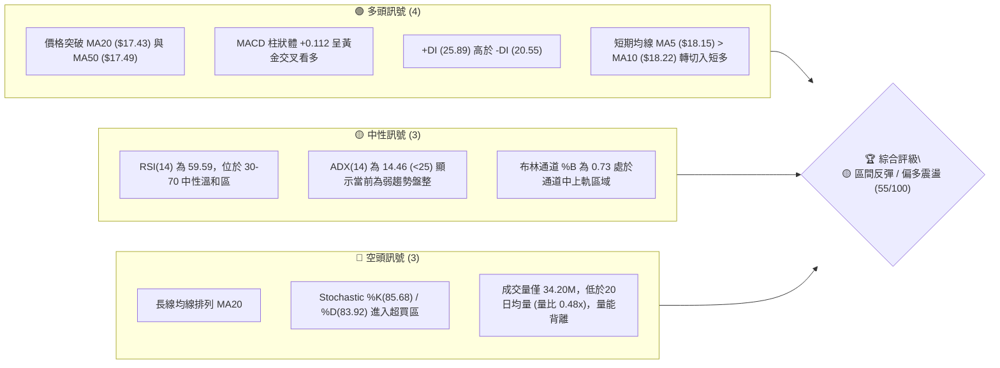
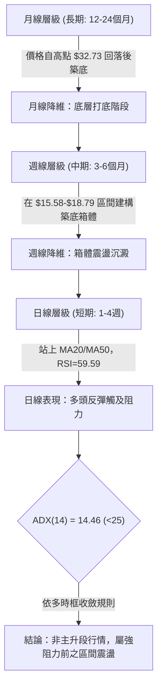
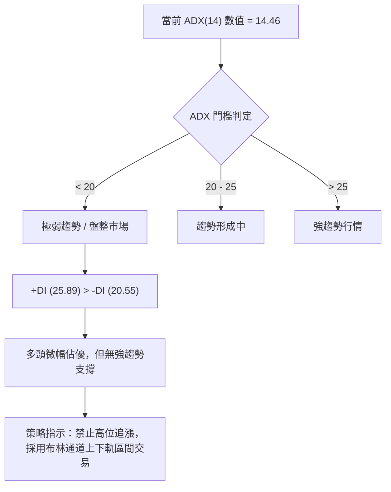
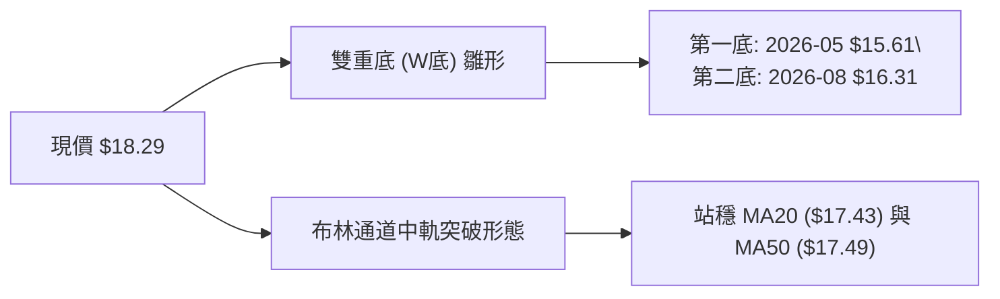
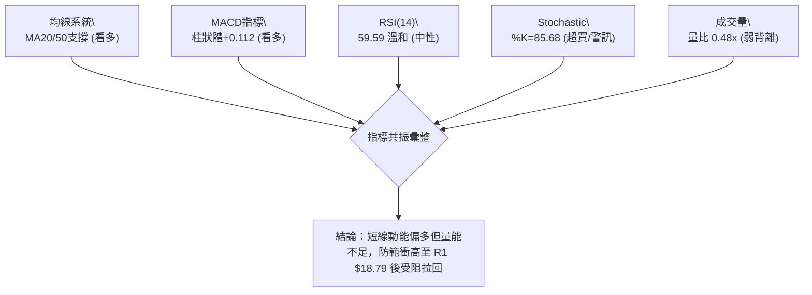
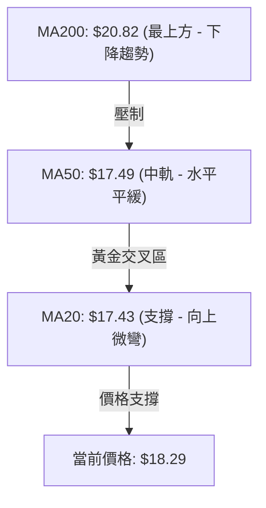
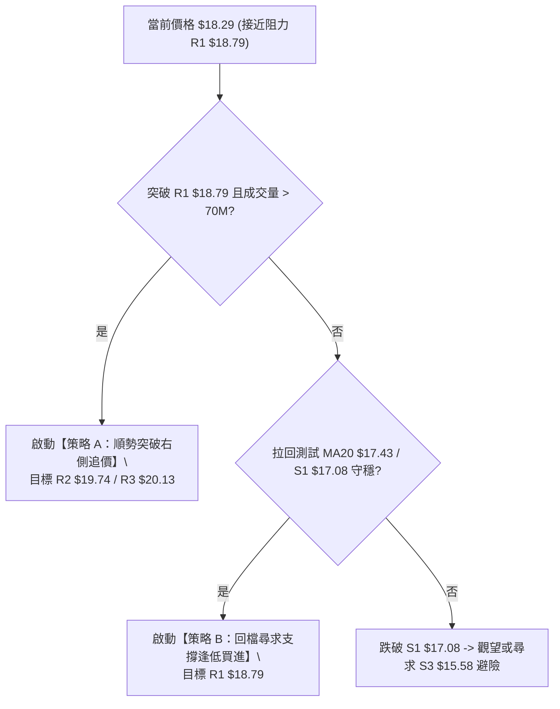
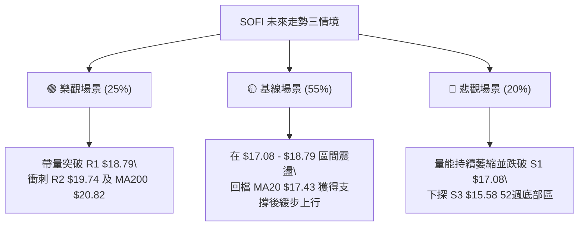

# SOFI 技術分析報告

> **報告日期**：2026-08-14 ｜ **語言**：繁體中文 ｜ **數據來源**：Yahoo Finance ｜ **當前價格**：$18.29

---

## 目錄

| 章節 | 內容 |
|------|------|
| [1. 技術面概覽](#1-技術面概覽) | 訊號儀表板、核心指標、評分卡 |
| [2. 趨勢分析](#2-趨勢分析) | 多時框趨勢、長中短期走勢 |
| [3. 圖表形態分析](#3-圖表形態分析) | 形態識別、K線組合、目標價 |
| [4. 支撐與阻力](#4-支撐與阻力) | 關鍵價位、斐波那契回調 |
| [5. 技術指標深度解讀](#5-技術指標深度解讀) | MA/RSI/MACD/布林/成交量 |
| [6. 動能與波動率](#6-動能與波動率) | 動能評估、ATR、Beta |
| [7. 多時框架總結](#7-多時框架總結) | 時框架評分矩陣 |
| [8. 交易策略建議](#8-交易策略建議) | 多空策略、風險報酬比 |
| [9. 風險提示與監控](#9-風險提示與監控) | 監控指標、風險場景 |

---

## 1. 技術面概覽

### 🎯 技術訊號儀表板



---

### 📊 核心指標速覽表

| 指標類別 | 指標名稱 | 當前數值 | 訊號 | 解讀 |
|----------|----------|----------|------|------|
| **價格** | 當前價格 | $18.29 | 🟢 多頭反彈 | 位於52週區間 $14.88–$32.73 之 19.1% 位置，自底部展開反彈 |
| **均線** | MA20 | $17.43 | 🟢 上方支撐 | 價格高於 MA20 (+4.93%)，短期趨勢偏多 |
| **均線** | MA50 | $17.49 | 🟢 上方突破 | 價格高於 MA50 (+4.57%)，中短期轉強 |
| **均線** | MA200 | $20.82 | 🔴 下方壓制 | 價格低於 MA200 (-12.15%)，中長期壓力巨大 |
| **動能** | RSI(14) | 59.59 | 🟡 中性偏強 | 動能回升至溫和多頭區，無背離現象 |
| **動能** | MACD | 0.243 | 🟢 多頭交叉 | MACD > Signal (0.131)，柱狀圖 +0.112 持續擴張 |
| **動能** | Stochastic | 85.68 / 83.92 | 🔴 短線超買 | 進入 80 以上超買區，需防範短線獲利回吐 |
| **趨勢** | ADX(14) | 14.46 | 🟡 無明確趨勢 | ADX < 25 表示無強趨勢，行情以區間震盪為主 |
| **波動** | ATR(14) | $0.82 (4.49%) | 🟡 中等波動 | 日均波幅 $0.82，提供明確的止損與區間風控參考 |
| **量能** | 當前成交量 | 34.20M | 🔴 量能萎縮 | 低於20日均量 70.85M (0.48x)，漲勢缺乏大資金追價 |

---

### 🏆 技術評分卡

```
╔══════════════════════════════════════════════════════════════════╗
║              SOFI 技術面綜合評分卡 (2026-08-14)                  ║
╠══════════════════════════════════════════════════════════════════╣
║ 趨勢強度 (ADX)     ▓▓▓▓░░░░░░░░░░░░░░░░  20/100  🟡 弱趨勢盤整   ║
║ 動能指標 (RSI/MACD)▓▓▓▓▓▓▓▓▓▓▓▓▓▓░░░░░░  70/100  🟢 短線動能充沛 ║
║ 支撐穩定度 (S1-S3) ▓▓▓▓▓▓▓▓▓▓▓▓▓▓░░░░░░  70/100  🟢 底層支撐明確 ║
║ 成交量配合 (OBV)   ▓▓▓▓▓▓▓░░░░░░░░░░░░░  35/100  🔴 量能顯著背離 ║
║ 形態完整度 (K線)   ▓▓▓▓▓▓▓▓▓▓▓▓░░░░░░░░  60/100  🟡 W底初步構築  ║
║ 均線排列 (MA系統)  ▓▓▓▓▓▓▓▓░░░░░░░░░░░░  40/100  🔴 長期空頭排列 ║
╠══════════════════════════════════════════════════════════════════╣
║ 綜合技術評分       ▓▓▓▓▓▓▓▓▓▓▓░░░░░░░░░  55/100  🟡 中性偏多區間 ║
╚══════════════════════════════════════════════════════════════════╝
```

---

## 2. 趨勢分析

### 🌐 多時框趨勢分析



---

### 📈 長期趨勢 — 24個月歷史走勢圖

```
SOFI 月線歷史走勢圖（2024-08 至 2026-08）
價格 ($)
$32.73 ┤                                      ● (52W High $32.73)
$29.72 ┤                                ●  ●
$26.42 ┤                             ●  ●  ●
$22.58 ┤                          ●        ●
$18.29 ┤                    ●              ●                ● $18.29 (現在)
$15.58 ┤              ●  ●                                ●  ●
$11.17 ┤        ●  ●
$7.86  ┤ ●  ●
       └─┬──┬──┬──┬──┬──┬──┬──┬──┬──┬──┬──┬──┬──┬──┬──┬──┬──┬──┬──┬──┬──┬──┬──
        24 24 24 24 25 25 25 25 25 25 25 25 25 25 25 25 26 26 26 26 26 26 26 26
        08 09 10 11 12 01 02 03 04 05 06 07 08 09 10 11 12 01 02 03 04 05 06 07 08
```

#### 24個月歷史走勢階段拆解說明表

| 階段 | 時間區間 | 價格區間 | 漲跌幅 | 走勢特徵與技術意義 |
|------|----------|----------|--------|----------------────|
| **第 1 階段：主升段初發** | 2024-08 ~ 2024-11 | $7.86 ➔ $16.41 | +108.8% | 自 $7.86 底部帶量噴發，突破雙重底部，啟動大週期牛市。 |
| **第 2 階段：高位沉澱** | 2024-12 ~ 2025-05 | $16.41 ➔ $13.30 | -18.95% | 震盪回檔測試 MA50 支撐，為第二波攻擊蓄積動能。 |
| **第 3 階段：瘋狂主升段** | 2025-06 ~ 2025-11 | $13.30 ➔ $29.72 | +123.5% | 創下 52 週新高 $32.73（月收盤高點 $29.72），指標嚴重超買。 |
| **第 4 階段：深幅估值修復** | 2025-12 ~ 2026-03 | $29.72 ➔ $15.88 | -46.57% | 高位出現頂背離後急跌，連跌 4 個月，下探至 $14.88 52週低點。 |
| **第 5 階段：築底區間震盪** | 2026-04 ~ 2026-08 | $15.88 ➔ $18.29 | +15.18% | 價格在 $15.58–$18.79 之間構築中底，ADX 降至 14.46，進入無趨勢沉澱期。 |

---

### 📊 中期趨勢（週線結構與關鍵阻力）

```
SOFI 週線關鍵壓力阻力分布圖
===================================================================
$21.70 ┤ --------------------------------- [Fib 61.8% 核心壓力位]
$20.82 ┤ --------------------------------- [MA200 長線強壓位]
$20.13 ┤ ================================= [R3 波段高點強阻力]
$19.74 ┤ --------------------------------- [R2 中期突破壓力]
$18.79 ┤ --------------------------------- [R1 近期阻力線 / Fib 78.6% $18.70]
$18.29 ┤ ★★★ [當前現價 $18.29] ★★★
$17.43 ┤ --------------------------------- [MA20 / 布林中軌支撐]
$17.08 ┤ ================================= [S1 近期波段支撐]
$16.67 ┤ --------------------------------- [S2 次級強支撐]
$15.58 ┤ --------------------------------- [S3 底部區間下軌 / 布林下軌]
===================================================================
```

---

### ⚡ 趨勢強度評估（ADX 解讀）



#### ADX 強度分析對照表

| 評估維度 | 當前指標數據 | 標準參考區間 | 市場狀態結論 |
|----------|--------------|--------------|--------------|
| **趨勢強度 (ADX)** | **14.46** | < 25 (弱/無趨勢) | 市場完全處於盤整沉澱期，未形成單邊趨勢 |
| **多頭力量 (+DI)** | **25.89** | > 20 | 多頭控盤力道溫和，具備短線反彈能力 |
| **空頭力量 (-DI)** | **20.55** | < 25 | 空頭賣壓逐漸減弱，但並未完全退場 |
| **多空差值 (+DI - -DI)**| **+5.34** | > 0 | 多頭略佔上風，支持震盪築底上尋阻力 |

---

## 3. 圖表形態分析

### 🔍 形態識別系統

根據近一年 OHLCV 歷史數據與近期收盤走勢，識別出以下圖表形態：



#### 圖表形態信心度評估表

| 形態名稱 | 信心度 | 判斷依據（引用真實數據） | 完成度 | 目標價（附嚴格計算式） |
|----------|--------|--------------------------|--------|------------------------|
| **W重底（雙底雛形）** | **65%** | 第一底 $15.61 (2026-05-17)，第二底 $16.31 (2026-08-02)，頸線落在阻力位 R1 $18.79。 | 75% | 頸線 $18.79 + (頸線 $18.79 - 最低點 $15.61) = **$21.97** |
| **布林通道中軌向上突破**| **85%** | 價格 $18.29 成功站上 BB 中軌 MA20 ($17.43)，%B 達 0.73。 | 100% | 通道上軌 **$19.29** |
| **頭肩底形態** | **25%** | 數據不足以支撐頭肩結構，左肩與頭部特徵不明顯。 | 10% | 訊號不足，僅做指標型解讀，不預設目標價 |

---

### 🕯️ 近期關鍵 K 線形態分析

| 日期 (週) | 收盤價 | RSI | MACD柱 | K線形態類型 | 技術解讀與訊號指示 |
|-----------|--------|-----|--------|-------------|--------------------|
| 2026-05-17 | $15.61 | 30.2 | -0.108 | 底部錘子線 (Hammer) | 🟢 觸及 52週低點群，下影線長，多頭築底訊號發酵。 |
| 2026-05-31 | $18.22 | 69.6 | +0.273 | 大陽線突破 (Bullish Marubozu) | 🟢 強勢反彈突破 MA20，確立第一波築底高點。 |
| 2026-07-26 | $16.46 | 33.1 | -0.220 | 漸進回落陰線 | 🔴 二次回探底部，測試 $16.31-$16.67 支撐區。 |
| 2026-08-09 | $18.38 | 58.0 | +0.181 | 長陽吞噬 (Bullish Engulfing) | 🟢 吞噬前三週陰線，完成第二隻腳（W底右腳）確認。 |
| 2026-08-16 | $18.29 | 59.6 | +0.112 | 阻力位前十字星/小陰 | 🟡 逼近波段高點 R1 $18.79，多頭呈現觀望沉澱。 |

---

### 📉 ASCII 雙底 (W底) 形態示意圖

```
SOFI 日/週線 W底築底形態示意圖
===================================================================
價位 ($)
$18.79 ┤------------------- 頸線阻力位 (R1 $18.79) -------------------
       │                  /\
$18.29 ┤---------------- /  \ ------ 現價 $18.29 (正逼近頸線)
       │        /\      /    \
$17.08 ┤------ /  \    /      \ ---- 支撐位 (S1 $17.08)
       │      /    \  /
$16.31 ┤---- /      \/ (第二底: $16.31)
$15.61 ┤-- \/ (第一底: $15.61)
       └──────────────────────────────────────────────────────────
```

---

### 🎯 形態目標價計算式

1. **W底突破理論目標價**：
   $$\text{目標價} = \text{頸線價位} + (\text{頸線價位} - \text{第一底最低點})$$
   $$\text{目標價} = 18.79 + (18.79 - 15.61) = 18.79 + 3.18 = \mathbf{\$21.97}$$
   *(註：$21.97 與 MA240 $21.89 及 Fib 61.8% $21.70 極為接近，高度吻合關鍵阻力重疊區)*

2. **布林通道上軌目標價**：
   $$\text{當前上軌} = \mathbf{\$19.29}$$

---

## 4. 支撐與阻力

### 🗺️ 關鍵價位結構分布圖

```
SOFI 價位結構分布圖 (由歷史 OHLCV 密集群集算出)
═══════════════════════════════════════════════════════════════════
$32.73 ║████████████████████████████████████████║ 52週最高點 (52W High)
$28.52 ║████████████████████                    ║ 斐波那契 23.6% 回調位
$25.91 ║████████████████                        ║ 斐波那契 38.2% 回調位
$23.80 ║████████████                            ║ 斐波那契 50.0% 中軸位
$21.70 ║████████████████████████████            ║ 斐波那契 61.8% 黃金切割位
$20.82 ║████████████████                        ║ MA200 長期年線壓力
$20.13 ║████████████████████                    ║ 波段強阻力 R3 (+10.06%)
$19.74 ║██████████████                          ║ 中期阻力 R2 (+7.93%)
$18.79 ║████████████████████████                ║ 近期阻力 R1 (+2.71%) / Fib 78.6% ($18.70)
$18.29 ╠════════════════════════════════════════╣ ◄◄◄ 當前收盤價 $18.29
$17.43 ║▓▓▓▓▓▓▓▓▓▓▓▓▓▓▓▓▓▓▓▓                    ║ MA20 / MA50 均線重疊支撐區
$17.08 ║▓▓▓▓▓▓▓▓▓▓▓▓▓▓▓▓                        ║ 波段支撐 S1 (-6.62%)
$16.67 ║▓▓▓▓▓▓▓▓▓▓▓▓                            ║ 次級強支撐 S2 (-8.88%)
$15.58 ║▓▓▓▓▓▓▓▓▓▓▓▓▓▓▓▓▓▓▓▓▓▓▓▓                ║ 強力底層支撐 S3 (-14.84%) / 布林下軌
$14.88 ║▓▓▓▓▓▓▓▓▓▓▓▓▓▓▓▓▓▓▓▓▓▓▓▓▓▓▓▓▓▓▓▓▓▓▓▓▓▓▓▓║ 52週最低點 (52W Low)
═══════════════════════════════════════════════════════════════════
```

---

### 🚧 阻力位詳盡分析表

| 阻力層級 | 精確價位 | 距現價幅 | 形成原因與技術共振 | 突破難度 | 重要性評級 |
|----------|----------|----------|--------------------|----------|------------|
| **阻力 R1** | **$18.79** | +2.71% | 近一年近端波段高點聚類，與斐波那契 78.6% ($18.70) 及 W底頸線重疊。 | 🟡 中等 | 🟢🟢🟢 (短線解套關卡) |
| **阻力 R2** | **$19.74** | +7.93% | 近一年中期波段高點聚類，接近 $20 整數關卡。 | 🟡 中高 | 🟢🟢🟢 (中期多空分水嶺) |
| **阻力 R3** | **$20.13** | +10.06% | 強波段高點聚類，下方緊鄰 MA200 ($20.82) 長期均線壓制。 | 🔴 極高 | 🟢🟢🟢🟢 (長線趨勢反轉牆) |

---

### 🛡️ 支撐位詳盡分析表

| 支撐層級 | 精確價位 | 距現價幅 | 形成原因與技術共振 | 守住機率 | 重要性評級 |
|----------|----------|----------|--------------------|----------|------------|
| **支撐 S1** | **$17.08** | -6.62% | 近一年近端波段低點聚類，下方有 MA20 ($17.43) 及 MA50 ($17.49) 防線。 | 🟢 75% | 🟢🟢🟢 (短線多頭防線) |
| **支撐 S2** | **$16.67** | -8.88% | 近年次級波段低點聚類，2026年7月回檔守穩點。 | 🟢 80% | 🟢🟢🟢 (中期箱體腰帶) |
| **支撐 S3** | **$15.58** | -14.84% | 近一年強波段低點聚類，布林下軌 ($15.58) 與 2026-05 低點共振。 | 🟢 90% | 🟢🟢🟢🟢 (鋼鐵防線/底部) |

---

### 📐 斐波那契回調位分析

基於 52 週高點 **$32.73** 與 52 週低點 **$14.88**（全幅波幅 $17.85）：

```
斐波那契階梯與現價位置
$32.73 ── 0.0%  (52W High)
$28.52 ── 23.6%
$25.91 ── 38.2%
$23.80 ── 50.0%
$21.70 ── 61.8% (黃金切割反彈壓力)
$18.70 ── 78.6% (與 R1 $18.79 共振)
$18.29 ── ★ 現價介於 78.6% ($18.70) 與 100% ($14.88) 之間
$14.88 ── 100.0% (52W Low)
```

**斐波那契結構解讀**：
當前價格 $18.29 正向上挑戰 **78.6% 回調位 ($18.70)**。若能帶量有效突破 $18.70–$18.79 區域，上行空間將被打開，下一階段目標將直指 **61.8% 黃金切割位 ($21.70)**。

---

## 5. 技術指標深度解讀

### 🎛️ 指標訊號總覽與共振分析



---

### 📈 移動平均線 (MA) 排列分析



#### 均線數據明細與技術意涵

| 均線名稱 | 當前價位 | 與現價差距 | 趨勢方向 | 技術意涵解讀 |
|----------|----------|------------|----------|--------------|
| **MA 5** | $18.15 | +0.76% | ▲ 向上 | 極短期強勢，價格守在 5 日線之上 |
| **MA 10** | $18.22 | +0.37% | ▲ 向上 | 扣抵低價區，短線多頭掌控 |
| **MA 20** | $17.43 | +4.90% | ▲ 向上 | 月線支撐，突破後成為重要回檔買點 |
| **MA 50** | $17.49 | +4.57% | ▲ 向上 | 季線支撐，MA20 與 MA50 形成雙重黃金支撐墊 |
| **MA 60** | $17.36 | +5.34% | ▲ 向上 | 季線趨勢開始走平回升 |
| **MA 120**| $17.29 | +5.78% | ▲ 向上 | 半年線打底完成 |
| **MA 200**| $20.82 | -12.15% | ▼ 向下 | 年線為中長期最強壓力，未突破前總體仍屬空頭反彈 |
| **MA 240**| $21.89 | -16.44% | ▼ 向下 | 兩年線壓力線，與 W底目標價 $21.97 重合 |

---

### 📉 RSI(14) 動能與背離分析

- **RSI(14) 當前數值**：`59.59`
- **強度進度條**：`█████████████░░░░░░░ 59.59%` (溫和偏多)

```
RSI(14) 區間定位
[0]------[30 超賣]------------[50 中性]------★[59.59]-----[70 超買]------[100]
                                            ▲ 現價位（溫和多頭區）
```

**背離檢測結論**：
- **頂背離**：無。價格自 $16.31 反彈至 $18.29，RSI 自 37.4 同步回升至 59.59，動能與價格同向。
- **底背離**：2026-05 低點 $15.61 時 RSI 為 30.2，2026-08 低點 $16.31 時 RSI 為 37.4，底點抬高，呈現**溫和底背離特徵**，證實底部支撐有效。

---

### 📊 MACD (12, 26, 9) 深度解讀

- **MACD 快線**：`0.243`
- **Signal 慢線**：`0.131`
- **MACD 柱狀體**：`+0.112` 🟢（看多，紅柱持續擴張）

```
MACD 柱狀圖趨勢 (近 8 週)
-0.220  -0.182  +0.068  -0.129  -0.220  -0.182  +0.181  +0.112
  │       │       │       │       │       │       █       █
  ▼       ▼       ▲       ▼       ▼       ▼       █       █  ← 目前擴張中
```

**MACD 解讀**：快線在零軸上方與慢線保持黃金交叉，柱狀體保持為正值 (+0.112)，顯示多頭主導短期動能。

---

### 📦 布林通道 (Bollinger Bands) 結構

```
SOFI 布林通道 ASCII 示意圖
===================================================================
$19.29 ┤ --------------------------------- BB 上軌 (Upper Band)
$18.29 ┤ ★★★ 現價 $18.29 (%B = 0.73) ★★★
$17.43 ┤ --------------------------------- BB 中軌 (MA20 / Mid Band)
$15.58 ┤ --------------------------------- BB 下軌 (Lower Band)
===================================================================
```

- **BB 上軌**：`$19.29` (短期第一壓制目標)
- **BB 中軌 (MA20)**：`$17.43` (回檔第一核心支撐)
- **BB 下軌**：`$15.58` (區間底部，與 S3 重合)
- **BB %B**：`0.73`（位於中軌與上軌之間的黃金攻擊區，無擠壓暴拉跡象，走勢溫和）

---

### 💹 成交量與 OBV 配合度分析

- **最新成交量**：`34,201,994` 股
- **20日平均成交量**：`70,847,235` 股 (量比 `0.48x`)
- **50日平均成交量**：`78,407,868` 股
- **OBV 趨勢**：`OBV < MA`（能量潮低於其均線）

```
成交量比較 (與 20日均量)
當日成交量: ████████ 34.20M
20日均量:   ████████████████ 70.85M
```

**量價配合診斷**：
🔴 **量價背離**。價格上漲突破 MA20/MA50，但成交量大幅收縮至均量的 48%。這表明當前反彈主要由「賣壓竭盡」推動，而非「大資金主動追價」。若要成功突破 R1 $18.79，必須看到單日成交量擴張至 70M 以上，否則容易在 R1 附近形成假突破。

---

## 6. 動能與波動率

### ⚡ 動能評估四象限

| 象限 | 動能強度 | 波動率 | 當前 SOFI 狀態 | 技術評估與交易指導 |
|------|----------|--------|----------------|--------------------|
| **Q1 (高動能/低波動)** | 強 | 低 | — | 最佳趨勢加碼區 |
| **Q2 (弱動能/低波動)** | 弱 | 低 | **✓ (當前狀態)** | **ADX=14.46，ATR=4.49%，行情處於無趨勢低波動積蓄期，適合高拋低吸。** |
| **Q3 (強動能/高波動)** | 強 | 高 | — | 突破噴發現象 |
| **Q4 (弱動能/高波動)** | 弱 | 高 | — | 高風險殺跌區 |

---

### 📊 ATR 波動率分析與止損設定

- **ATR(14)**：`$0.82` (占當前股價 `4.49%`)
- **日均波幅參考**：每日平均波動點位約 $0.82。

#### ATR 風控距離對照表

| 止損類型 | 倍數 | 價格距離 | 建議止損價位（自現價 $18.29 計算） | 適用交易風格 |
|----------|------|----------|------------------------------------|--------------|
| **緊密止損** | 1.0 x ATR | $0.82 | **$17.47** (正好落在 MA20 $17.43 上方) | 日內 / 短線高槓桿 |
| **標準止損** | 1.5 x ATR | $1.23 | **$17.06** (正好落在 S1 $17.08 下方) | 波段操作（推薦） |
| **寬鬆止損** | 2.0 x ATR | $1.64 | **$16.65** (保護在 S2 $16.67 下方) | 中長線部位 |

---

### 📐 Beta 與市場相關性

- **Beta 係數**：`2.204`
- **屬性評級**：高 Beta 成長型/金融科技標的。
- **解讀**：當 S&P 500 或大盤波動 1% 時，SOFI 平均波動 2.20%。在大盤反彈期具備高彈性，但在市場下行時亦承擔更大回檔風險。

---

## 7. 多時框架總結

### 📋 時框架評分表

| 時框架 | 趨勢方向 | 動能 (RSI/MACD) | 均線排列 | 圖表形態 | 綜合評分 | 交易建議 |
|--------|----------|-----------------|----------|----------|----------|----------|
| **日線 (Short)** | 🟢 偏多反彈 | 🟢 RSI 59.6 / MACD看多 | 🟢 站上 MA20/50 | 🟢 突破中軌 | **65/100** | 偏多操作，尋求回檔買點 |
| **週線 (Mid)** | 🟡 箱體震盪 | 🟡 中性回升 | 🔴 MA200在上 | 🟡 W底構築中 | **50/100** | 區間高拋低吸，關注 R1 |
| **月線 (Long)** | 🔴 深幅修復 | 🔴 遠低於歷史高點 | 🔴 空頭結構 | 🔴 底部沉澱 | **40/100** | 長線觀望，等待底層突破 |

---

### 🔲 綜合訊號矩陣

```
            日線 (Short-term)
            ▲ 多頭 🟢
            │
  週線 🔴  ┼─────────────────── 🟢 週線/日線共振 (黃金區)
  (Mid)     │        ★ (SOFI 目前位置：日線偏多 / 週線震盪中性)
            │
            ▼ 空頭 🔴 ───► 日線 🔴
```

---

### ⚖️ 多時框收斂結論 (依 Rule 14 執行)

1. **行情性質判定**：ADX(14) = 14.46 (< 25)，確定當前市場為**「盤整行情」**。
2. **主導規則**：依據多時框收斂規則，盤整行情中**以日/週線布林通道上下軌與關鍵支撐阻力（$15.58 – $19.29）為主要交易區間**。
3. **最終收斂方向**：**🟡 中性偏多區間震盪**。短期日線具備反彈動能，目標挑戰 R1 ($18.79) 及布林上軌 ($19.29)；但受限於量能不足 (0.48x) 與週/月線長壓，難以直接啟動單邊主升段。

---

## 8. 交易策略建議

### 🗺️ 策略決策流程圖



---

### 🧭 策略路由

> **當前主策略方向 = 🟡 區間震盪 / 逢低做多（依評分 55/100 分流）**
> 由於 ADX < 25 且成交量萎縮，不建議在現價 $18.29 追高。最適策略為「回檔至支撐位佈局」或「帶量突破後追價」。

---

### 🎯 價格情境階梯 (Price Scenarios)

| 觸發條件 | 第一目標 | 第二目標 | 情境含義與技術解讀 |
|----------|----------|----------|--------------------|
| **帶量突破 R1 $18.79** | **R2 $19.74** | **R3 $20.13** | W底頸線確立突破，打開向上挑戰 MA200 空間。 |
| **現價區間震盪 ($17.43–$18.79)** | **R1 $18.79** | **MA20 $17.43** | 消化阻力賣壓，能量持續沉澱。 |
| **跌破 S1 $17.08** | **S2 $16.67** | **S3 $15.58** | 短線反彈失敗，重新測試箱體下軌底部。 |

---

### 📊 情境機率分佈

```
情境機率分佈圓盤示意
[ █ 區間震盪/回檔買進 (55%) ] [ █ 帶量直接突破 (25%) ] [ █ 回落跌破S1 (20%) ]
```

| 情境 | 機率 | 主要技術依據 |
|------|------|--------------|
| **區間震盪 / 逢低築底反彈** | **55%** | ADX=14.46 呈低波動盤整，MACD 擴張但量能不足，傾向於區間運作。 |
| **帶量直接向上突破 R1** | **25%** | Stochastic 處於超買區，若無大量配合，直接突破難度較高。 |
| **跌破 S1 重新探底** | **20%** | 下方有 MA20 ($17.43) 及 MA50 ($17.49) 雙重均線防護，下行有撐。 |

---

### 🟢 主策略詳情

#### 策略 A：波段回檔低吸（主推策略 - 風險報酬比優）

- **進場條件**：價格回檔至 MA20 / S1 支撐區，出現止跌 K 線（如小陽線或下影線）。
- **建議進場價**：`$17.43`（MA20 / 布林中軌附近）
- **目標價 T1**：`$18.79`（阻力位 R1 / 預計獲利 +7.80%）
- **目標價 T2**：`$19.74`（阻力位 R2 / 預計獲利 +13.25%）
- **止損價格**：`$16.65`（保護在 S2 $16.67 下方及 1.5x ATR 處 / 風險 -4.47%）
- **風險報酬比 (R/R Ratio)**：
  $$\text{R/R (至 T1)} = \frac{18.79 - 17.43}{17.43 - 16.65} = \frac{1.36}{0.78} = \mathbf{1.74 : 1}$$
  $$\text{R/R (至 T2)} = \frac{19.74 - 17.43}{17.43 - 16.65} = \frac{2.31}{0.78} = \mathbf{2.96 : 1}$$
- **建議倉位**：15% – 20% 資金

#### 策略 B：順勢突破追價（次選策略 - 需成交量確認）

- **進場條件**：日線收盤確認突破 R1 `$18.79`，且單日成交量擴張至 `> 70M`（20日均量水準）。
- **建議進場價**：`$18.85`（突破確認價）
- **目標價 T1**：`$19.74`（阻力位 R2 / 預計獲利 +4.72%）
- **目標價 T2**：`$20.13`（阻力位 R3 / 預計獲利 +6.79%）
- **目標價 T3 (W底滿載)**：`$21.70`（Fib 61.8% / 預計獲利 +15.12%）
- **止損價格**：`$18.15`（跌破 MA5 / 風險 -3.71%）
- **風險報酬比 (R/R Ratio)**：
  $$\text{R/R (至 T3)} = \frac{21.70 - 18.85}{18.85 - 18.15} = \frac{2.85}{0.70} = \mathbf{4.07 : 1}$$
- **建議倉位**：10% – 15% 資金

---

### 🔴 反向風險觸發點（對沖與避險提示）

若價格未如預期上行，而出現以下訊號，應立即停止多頭操作並進行避險：
1. **防禦觸發價**：日線收盤價跌破 `$17.08` (S1)。
2. **失效訊號**：MACD 柱狀體轉負，且成交量放大下殺。
3. **對沖動作**：減碼 50% 以上多頭部位，或買入等值 Put 期權進行避險。

---

### ⭐ 整體訊號強度評星

```
做多訊號強度：★★★☆☆  (3/5星 — 短線偏多但受阻於 R1)
做空訊號強度：★★☆☆☆  (2/5星 — 底層支撐厚實，缺乏空頭暴跌催化劑)
整體可信度：  ★★★★☆  (4/5星 — 多指標共振且價位精確)
```

---

## 9. 風險提示與監控

### ✅ 關鍵監控指標 Checklist

```
╔══════════════════════════════════════════════════════════════════╗
║                   每日交易前技術監控清單                         ║
╠══════════════════════════════════════════════════════════════════╣
║ [ ] 1. 突破監控：收盤價是否站上 R1 $18.79 且成交量 > 70M？       ║
║ [ ] 2. 支撐監控：價格是否保持在 MA20 ($17.43) 與 S1 ($17.08) 之上？ ║
║ [ ] 3. 指標過熱：Stochastic (%K=85.68) 是否出現高位死叉？        ║
║ [ ] 4. 量能共振：成交量是否從 34.20M 回升至 20日均量以上？        ║
║ [ ] 5. 趨勢強度：ADX(14) 是否突破 25 啟動單邊行情？              ║
╚══════════════════════════════════════════════════════════════════╝
```

---

### ⚠️ 風險場景三模式繪製



---

### 🛡️ 風險管理核心紀律

1. **高 Beta 屬性管理**：SOFI Beta 為 2.204，波動劇烈。單一標的持倉建議不超過總投資組合的 **15%**。
2. **嚴格執行止損**：當前 ATR 為 $0.82，波段操作止損距必須設定於 **$16.65**（S2 下方），絕不扛單。
3. **拒絕無量追高**：當前成交量僅為均量的 0.48x，若未出現放大陽線突破，切勿在 R1 ($18.79) 附近盲目追買。

---

## 📋 報告總結

```
╔══════════════════════════════════════════════════════════════════╗
║                  SOFI 技術分析報告總結                           ║
════════════════════════════════════════════════════════════════════
 報告日期：2026-08-14
 當前價格：$18.29
 綜合評級：🟡 中性偏多 / 區間反彈沉澱 (55/100)

 關鍵價位速查：
 ├─ 長期趨勢：🔴 空頭排列 (MA200 $20.82 在上方壓制)
 ├─ 中期趨勢：🟡 箱體築底 ($15.58 - $18.79)
 ├─ 短期趨勢：🟢 偏多反彈 (站上 MA20 $17.43 / MA50 $17.49)
 ├─ 關鍵阻力：R1 $18.79 ｜ R2 $19.74 ｜ R3 $20.13
 ├─ 關鍵支撐：S1 $17.08 ｜ S2 $16.67 ｜ S3 $15.58
 └─ 分析師平均目標價：$19.87

 最優策略部署：
 1. 🥇 首選策略：等待回檔至 $17.43 (MA20) 逢低低吸，止損 $16.65，目標 $18.79 / $19.74。
 2. 🥈 突破策略：若強勢帶量突破 R1 $18.79 (成交量 > 70M)，右側追價，目標 $21.70。
 3. 🥉 風險防禦：跌破 S1 $17.08 宣告反彈結束，多頭應全面減碼觀望。
════════════════════════════════════════════════════════════════════
```

---

> ⚠️ **免責聲明**：本報告為 AI 自動生成之技術分析，所有數據及估算均基於 Yahoo Finance 提供的歷史價格資訊。本報告**僅供研究與學術參考**，**不構成任何投資建議**。投資有風險，入市需謹慎。

---

*報告生成時間：2026-08-14 ｜ 數據來源：Yahoo Finance ｜ 分析框架：多時框技術分析*