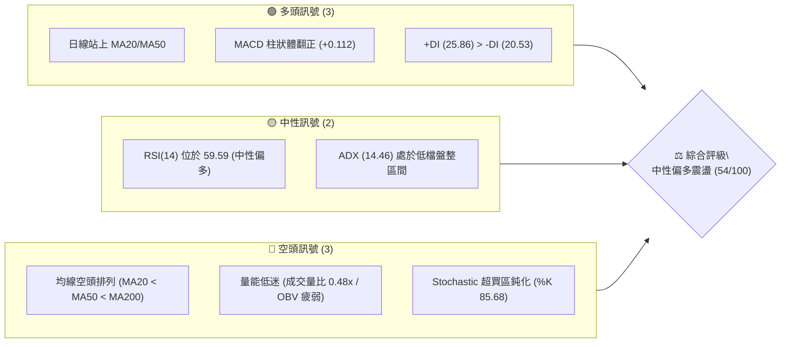
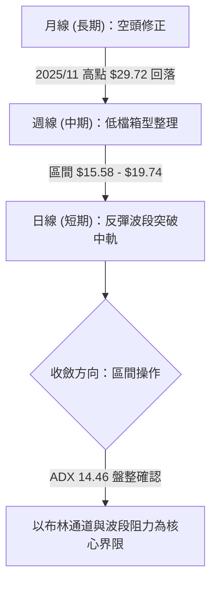
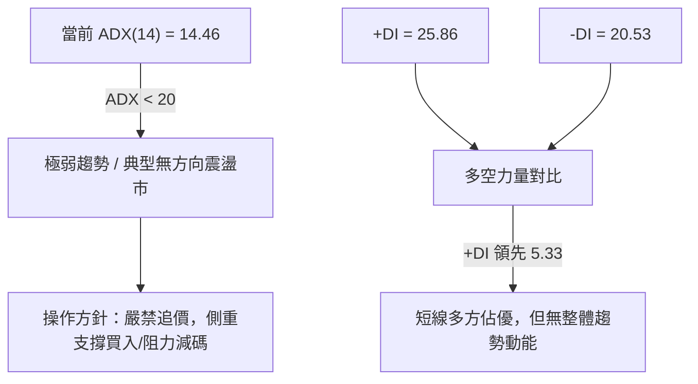
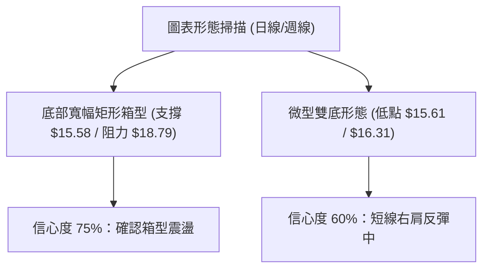
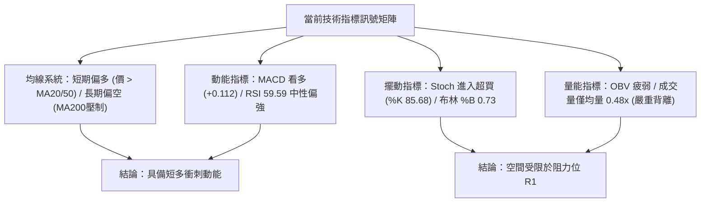
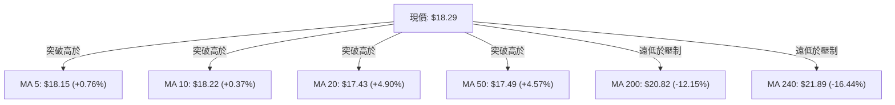
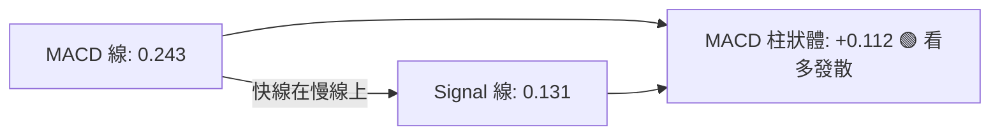
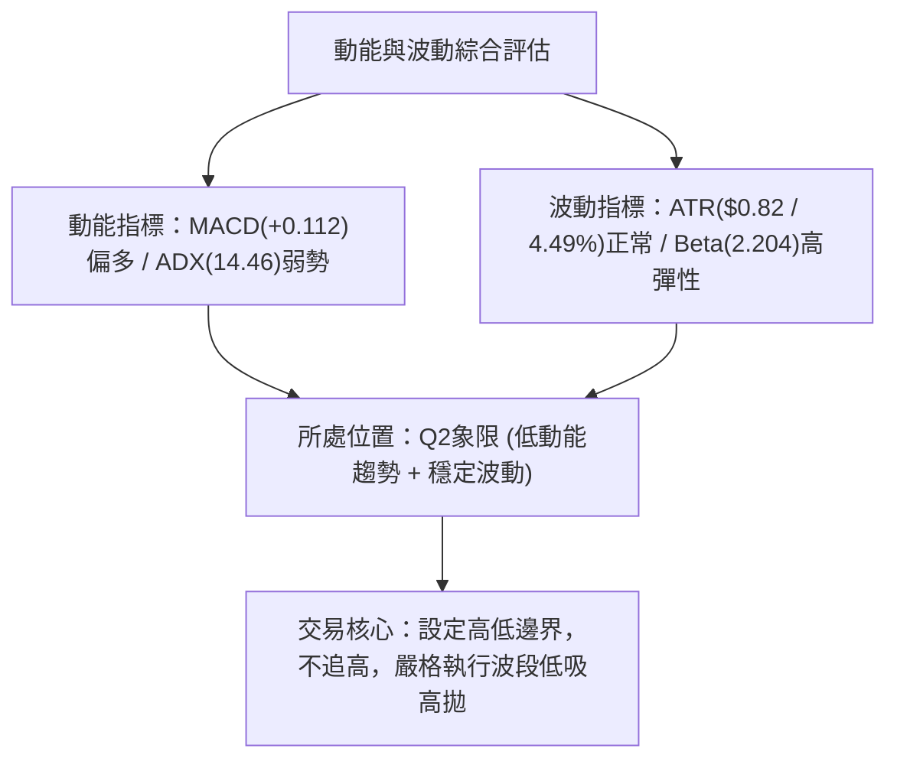
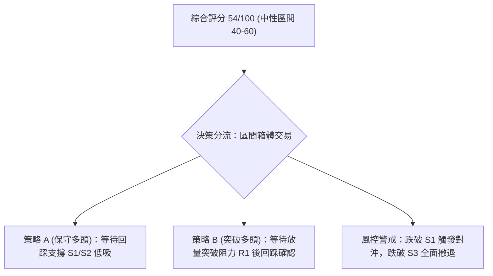
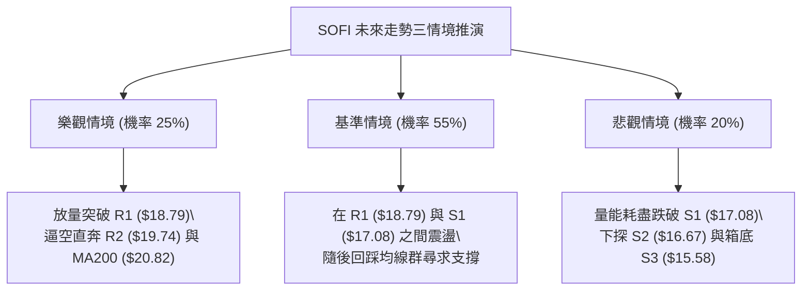

# SOFI 技術分析報告

> **報告日期**：2026-08-15 ｜ **語言**：繁體中文 ｜ **數據來源**：Yahoo Finance ｜ **當前價格**：$18.29

---

## 目錄

| 章節 | 內容 |
|------|------|
| [1. 技術面概覽](#1-技術面概覽) | 訊號儀表板、核心指標、評分卡 |
| [2. 趨勢分析](#2-趨勢分析) | 多時框趨勢、長中短期走勢、ADX解讀 |
| [3. 圖表形態分析](#3-圖表形態分析) | 形態識別、K線組合、目標價推算 |
| [4. 支撐與阻力](#4-支撐與阻力) | 關鍵價位結構、斐波那契回調 |
| [5. 技術指標深度解讀](#5-技術指標深度解讀) | MA/RSI/MACD/布林通道/成交量 |
| [6. 動能與波動率](#6-動能與波動率) | 動能四象限、ATR、Beta係數 |
| [7. 多時框架總結](#7-多時框架總結) | 時框架評分矩陣與收斂結論 |
| [8. 交易策略建議](#8-交易策略建議) | 主策略路由、情境階梯、風報比 |
| [9. 風險提示與監控](#9-風險提示與監控) | 監控清單、情境推演、風控管理 |

---

## 1. 技術面概覽

### 🎯 技術訊號儀表板



### 📊 核心指標速覽表

| 指標類別 | 指標名稱 | 當前數值 | 訊號 | 解讀 |
|:---|:---|:---|:---:|:---|
| **價格** | 當前收盤價 | $18.29 | 🟡 | 位於52週區間 19.1% 低檔，短線反彈遇阻 |
| **均線** | MA20 (短中) | $17.43 | 🟢 | 現價高於 MA20 (+4.90%)，短線多頭掌控 |
| **均線** | MA50 (中期) | $17.49 | 🟢 | 現價高於 MA50 (+4.57%)，中期築底初現 |
| **均線** | MA200 (長期) | $20.82 | 🔴 | 現價低於 MA200 (-12.15%)，長期空頭趨勢未解 |
| **動能** | RSI(14) | 59.59 | 🟡 | 位於 50-60 中性偏多區間，未見背離 |
| **動能** | MACD Hist | +0.112 | 🟢 | 快慢線金叉發散，動能柱持續擴張看多 |
| **擺動** | Stoch %K / %D | 85.68 / 83.92 | 🔴 | 進入極度超買區間 (>80)，慎防短線獲利回吐 |
| **趨勢** | ADX (14) | 14.46 | 🟡 | ADX < 25 表明無顯著趨勢，行情定性為區間震盪 |
| **波動** | ATR(14) | $0.82 | 🟡 | 日波動率 4.49%，處於常態波動區間 |
| **量能** | 當日量 / 20日均量 | 34.24M / 70.86M | 🔴 | 量比僅 0.48x，量價出現背離，買盤追價意願不足 |

### 🏆 技術評分卡

```
╔════════════════════════════════════════════════════════════════╗
║             技術評分卡 — SOFI (2026-08-15)                     ║
╠════════════════════════════════════════════════════════════════╣
║ 趨勢強度 (ADX=14.46)   ██████░░░░░░░░░░░░░░  30/100  🔴 無趨勢 ║
║ 動能指標 (MACD/RSI)    ██████████████░░░░░░  70/100  🟢 偏多   ║
║ 支撐穩定度 (S1=$17.08) ████████████░░░░░░░░  60/100  🟢 良好   ║
║ 成交量配合 (量比 0.48) ██████░░░░░░░░░░░░░░  30/100  🔴 疲弱   ║
║ 形態完整度 (箱型整理)  ██████████████░░░░░░  70/100  🟡 構築中 ║
║ 均線排列 (空頭排列)    ████████░░░░░░░░░░░░  40/100  🔴 長期壓制║
╠════════════════════════════════════════════════════════════════╣
║ 綜合技術評分           ███████████░░░░░░░░░  54/100  ⚖️ 中性觀望║
╚════════════════════════════════════════════════════════════════╝
```

---

## 2. 趨勢分析

### 🌐 多時框趨勢分析



### 📈 長期趨勢 — 12個月走勢圖（Unicode）

```
SOFI 月線走勢圖（過去12個月：2025-08 至 2026-08）
價格 ($)
$30.00 ┤                     ●(11月 $29.72)
$27.50 ┤               ●(10月 $29.68)
$25.00 ┤        ●(9月 $26.42)       ●(12月 $26.18)
$22.50 ┤ ●(8月 $25.54)                     ●(1月 $22.81)
$20.00 ┤                                         
$17.50 ┤                                              ●(2月 $17.76)   ●(5月 $18.22)   ●(8月 $18.29)←現價
$15.00 ┤                                                   ●(3月 $15.88)   ●(7月 $16.31)
       └───────────────────────────────────────────────────────────────────────────
         08     09     10     11     12     01     02     03     04     05     06     07     08
        2025                               2026
```

**12個月走勢特徵分析表**：

| 階段區間 | 價格走勢 | 區間高低點 | 漲跌特徵與技術含義 |
|:---|:---|:---:|:---|
| **2025-08 ~ 2025-11** | 強勢主升段 | $25.54 → $29.72 | 連續4個月上漲，突破前高並創下 $29.72 波段大頂 |
| **2025-12 ~ 2026-03** | 劇烈主跌段 | $26.18 → $15.88 | 獲利了結盤湧出，連續4個月長黑摜破 MA200，失守 $20.00 |
| **2026-04 ~ 2026-08** | 底部築底箱型 | $15.61 → $18.78 | 價格在 $15.58 - $18.79 進行高頻收斂震盪，成交量萎縮築底 |

### 📊 中期趨勢（週線分析）

近期 20 週數據顯示，SOFI 在 2026 年 5 月中旬於 $15.61 形成實體雙底支撐，隨後於 2026-07-12 觸及 $18.78 阻力遇阻回落至 8 月初的 $16.31，近期兩週強勁反彈至 $18.29。週線 MACD 柱狀體回到 +0.112，RSI 回升至 59.6，確認中期維持在寬幅箱型（$15.58 ~ $18.79）震盪結構。

### ⚡ 趨勢強度評估（ADX 解讀）



| 指標 | 數值 | 臨界標準 | 判斷與交易指引 |
|:---|:---:|:---:|:---|
| **ADX(14)** | 14.46 | < 25 (弱/無趨勢) | 趨勢動能完全休眠，任何突破型追單勝率極低，行情以均值回歸為主 |
| **+DI** | 25.86 | > -DI (多方佔優) | 買方短線佔有優勢，推動價格自下軌反彈 |
| **-DI** | 20.53 | < +DI (空方減弱) | 空方拋壓暫時緩解，但未引發恐慌性殺盤 |

---

## 3. 圖表形態分析

### 🔍 形態識別系統



| 形態名稱 | 信心度 | 判斷依據（引用實際數據） | 完成度 | 目標價（附計算式） |
|:---|:---:|:---|:---:|:---|
| **寬幅矩形箱型整理** | **75%** | 箱底於 S3 $15.58，箱頂於波段阻力 R1 $18.79，2026年4月至今多次驗證 | 85% | 箱頂突破目標 = $18.79 + ($18.79 - $15.58) = **$22.00** |
| **波段微型雙底** | **60%** | 兩處波段低點分別為 2026-05-17 ($15.61) 與 2026-08-02 ($16.31) | 90% | 頸線 $18.78，目標價 = $18.78 + ($18.78 - $15.61) = **$21.95** |
| **長期下降通道突破** | **35%** | 均線 MA200 仍處於 $20.82 下行狀態，數據未完全突破長期壓制線 | 30% | 訊號不足，僅做指標型解讀，暫不設定目標價 |

### 🕯️ 重要K線形態分析（近 6 個月）

| 月份/週期 | 收盤價 | 核心K線形態 | 技術解讀 | 多空訊號 |
|:---|:---:|:---|:---|:---:|
| **2026-03** | $15.88 | 長黑破位大陰線 | 跌破 $16.00 心理關卡，引發止損賣壓 | 🔴 極度看空 |
| **2026-04** | $16.10 | 低檔十字星 (Doji) | 賣壓耗盡，多空在 $15.50-$16.50 激烈交戰 | 🟡 變盤反轉 |
| **2026-05** | $18.22 | 吞噬型中長陽線 | 多方反擊，單月大漲 13.1%，確立 $15.58 底部 | 🟢 看多反彈 |
| **2026-06** | $17.93 | 高檔流星線 (Shooting Star) | 向上測試 $18.79 阻力未果，留下長上影線 | 🔴 阻力沉重 |
| **2026-07** | $16.31 | 回踩測試支撐小陰線 | 量縮回踩 S2 $16.67 與 S1 區域，未破前低 | 🟡 中性築底 |
| **2026-08 (現)** | $18.29 | 強勢反彈陽線 | 迅速收復 MA20 與 MA50，再度逼近箱頂 R1 | 🟢 看多測試 |

### 📉 ASCII 走勢形態示意圖

```
SOFI 矩形整理箱型與雙底結構示意圖 ($)
$19.74 ┤────────────────────────────────────────── [阻力 R2]
       │
$18.79 ┤───────●(04/19 $19.43)───────●(07/12 $18.78)── [箱頂/阻力 R1]
       │      / \                   / \        ▲
$18.29 ┤...../...\................./...\.......●←[現價逼近頸線]
       │    /     \               /     \     /
$17.08 ┤───/───────\─────────────/───────\───/─────── [支撐 S1 / MA20/50]
       │  /         \           /         \ /
$16.31 ┤ /           \         /           ●(08/02 低點2)
       │/             \       /
$15.58 ┤●(05/17 $15.61 低點1)─●─────────────────────── [箱底/強支撐 S3]
       └───────────────────────────────────────────
         2026-05             2026-07       2026-08
```

### 🎯 形態目標價計算

1. **矩形箱型等距測幅**：
   - 形態箱頂（頸線）：$18.79 (R1)
   - 形態箱底（支撐）：$15.58 (S3)
   - 箱體高度：$18.79 - $15.58 = $3.21
   - 突破目標價 = 頸線 $18.79 + 高度 $3.21 = **$22.00**（高度接近 MA240 $21.89）
2. **雙底形態測幅**：
   - 第一低點：$15.61 (2026-05-17)，第二低點：$16.31 (2026-08-02)
   - 頸線位置：$18.78 (2026-07-12)
   - 形態高度：$18.78 - $15.61 = $3.17
   - 形態完成理論目標價 = $18.78 + $3.17 = **$21.95**

---

## 4. 支撐與阻力

### 🗺️ 關鍵價位分布圖（Unicode）

```
SOFI 價位結構分布圖 (由實際 OHLCV 與聚類計算)
══════════════════════════════════════════════════════════════════
$20.82 ║████████████████████████████████║ 長期均線壓制 MA200
$20.13 ║████████████████████████        ║ 強阻力 R3 (+10.06%)
$19.74 ║██████████████████              ║ 阻力 R2 (+7.93%)
$18.79 ║████████████████████████████    ║ 關鍵阻力 R1 / Fib 78.6% ($18.70)
$18.29 ╠════════════════════════════════╣ ◄ 當前市價 ($18.29)
$17.43 ║▓▓▓▓▓▓▓▓▓▓▓▓▓▓▓▓▓▓▓▓▓▓▓▓        ║ 均線交匯支撐 MA20 / MA50 ($17.49)
$17.08 ║▓▓▓▓▓▓▓▓▓▓▓▓▓▓▓▓▓▓▓▓            ║ 近期支撐 S1 (-6.62%)
$16.67 ║████████████████████████        ║ 波段支撐 S2 (-8.88%)
$15.58 ║████████████████████████████████║ 年度強支撐 S3 / 布林下軌 (-14.84%)
$14.88 ║████████████████████████████████║ 52週歷史低點 (Fib 100.0%)
══════════════════════════════════════════════════════════════════
```

### 🚧 阻力位分析表

| 阻力級別 | 精確價位 | 形成原因 | 突破難度 | 重要性評級 |
|:---|:---:|:---|:---:|:---:|
| **關鍵阻力 R1** | **$18.79** | 近一年波段高點聚類、斐波那契 78.6% 回調位 ($18.70) | 🟡 中等 (需補量至 70M) | ★★★★☆ |
| **波段阻力 R2** | **$19.74** | 2026年4月中旬週線爆量高點 ($19.43) 上方套牢密集成交區 | 🔴 較高 (空方阻擊防線) | ★★★☆☆ |
| **強阻力 R3** | **$20.13** | 整數心理關卡、MA200 ($20.82) 下方防守頸線 | 🔴 極高 (長期趨勢分水嶺) | ★★★★★ |

### 🛡️ 支撐位分析表

| 支撐級別 | 精確價位 | 形成原因 | 守住機率 | 重要性評級 |
|:---|:---:|:---|:---:|:---:|
| **近期支撐 S1** | **$17.08** | 近一年波段低點聚類、MA20 ($17.43) 與 MA50 ($17.49) 下方緩衝區 | 75% | ★★★★☆ |
| **波段支撐 S2** | **$16.67** | 2026年6-7月多次回踩企穩之密集交易平台 | 80% | ★★★☆☆ |
| **年度強支撐 S3** | **$15.58** | 52週布林下軌、2026年5月雙底實體低點 ($15.61) 聚類 | 90% | ★★★★★ |

### 📐 斐波那契回調位分析（基準：52W 低點 $14.88 → 52W 高點 $32.73）

```
斐波那契回調層級分布：
0.0%  (52W High)   $32.73 ──────────────────────────────────
23.6%              $28.52 ──────────────────────────────────
38.2%              $25.91 ──────────────────────────────────
50.0%              $23.80 ──────────────────────────────────
61.8%              $21.70 ────────────────────────────────── (黃金分割反彈目標)
78.6%              $18.70 ───────[現價 $18.29 逼近此處]────── (關鍵多空爭奪位)
100.0% (52W Low)   $14.88 ──────────────────────────────────
```

- **位置解讀**：現價 $18.29 目前精確運行於 **Fib 78.6% ($18.70)** 與 **Fib 100.0% ($14.88)** 之間。
- **技術意義**：$18.70 是空頭回撤的極限深水區（78.6%）。若日線能以實體長紅收復 $18.70-$18.79 (R1)，則宣告自 $32.73 以來的極度深幅回調結束，反彈級別將正式擴展至 Fib 61.8% ($21.70) 及 Fib 50.0% ($23.80)。反之，若在此受阻，將延續 $15.58-$18.70 的底部箱型震盪。

---

## 5. 技術指標深度解讀

### 🎛️ 指標訊號總覽



### 📈 移動平均線排列分析



- **均線排列狀態**：當前呈現典型的「**短均聚合金叉、長均空頭壓制**」特徵。
  - 短期（MA5/10/20/60）：現價全面站上 MA5 ($18.15)、MA10 ($18.22)、MA20 ($17.43)、MA60 ($17.36) 與 MA120 ($17.29)，且 MA20 與 MA50 正在 $17.43-$17.49 形成低檔黃金交叉初生型態。
  - 長期（MA200/MA240）：MA200 位於 $20.82，MA240 位於 $21.89，均線整體架構仍屬 MA20 < MA50 < MA200 之大級別空頭排列，表明長期多頭趨勢未獲確認，上方具備堅固的均線反壓。

### 📉 RSI(14) 分析

- **RSI 數值**：**59.59**
- **數值進度條**：`████████████░░░░░░░░ 59.59%`（中性偏多）
- **背離分析**：
  - **頂背離**：無。目前價格自 $16.31 回升至 $18.29，RSI 自 37.4 同步上升至 59.6，指標與價格同向。
  - **底背離**：2026-05-10 價格創下 $15.75 低點時 RSI 為 24.9，而 2026-08-02 價格回踩 $16.31 時 RSI 保持在 37.4，未創新低，確認構築底部隱性支撐。

### 📊 MACD(12/26/9) 訊號解讀



- MACD 線 (0.243) 位於 Signal 線 (0.131) 之上，差值形成正向柱狀體 **+0.112**。
- 近三週週線 MACD 柱狀體由 -0.182 (08/02) 翻轉為 +0.181 (08/09) 及當前之 +0.112，動能完成零軸下方的金叉翻正，釋放出強烈的中期反彈波段訊號。

### 📦 布林通道分析

```
SOFI 日線布林通道結構示意圖 (帶寬: $3.71)
$19.29 ┤─────────────────────────────── 上軌 (BB Upper)
       │
$18.79 ┤------------------------------- [關鍵阻力 R1]
$18.29 ┤...............●............... 現價 ($18.29, %B = 0.73)
       │
$17.43 ┤─────────────────────────────── 中軌 (MA20: $17.43)
       │
$15.58 ┤─────────────────────────────── 下軌 (BB Lower / 強支撐 S3)
       └───────────────────────────────
```

- **軌道數據**：上軌 $19.29，中軌 $17.43，下軌 $15.58。
- **當前位置**：%B 值為 **0.73**，價格脫離中軌向上軌挺進，處於通道偏強勢區間。
- **通道走勢**：帶寬維持在 $3.71 (約 20.3% 帶寬比)，軌道呈現水平收斂走勢，並無單邊喇叭口開口跡象，進一步驗證價格將在 $15.58 - $19.29 的通道邊界內運行。

### 💹 成交量分析（量價配合度）

- **量能數據**：最新單日成交量為 **34,243,800 股**，相較 20 日均量 (70,856,225 股) **量比僅 0.48x**，萎縮超過 50%。
- **量價背離診斷**：價格連續兩週自 $16.31 攀升至 $18.29，但週成交量由 4.83 億股降至 2.10 億股，呈現典型的「**價漲量縮**」空頭量價背離。
- **OBV 趨勢**：OBV 線持續低於其移動平均線（OBV < MA），代表大資金在反彈過程中追價意願保守，本輪反彈主要由空頭回補推動，若無增量資金介入，突破 R1 ($18.79) 難度極高。

---

## 6. 動能與波動率

### ⚡ 動能評估四象限

| 象限 | 動能維度 | 波動維度 | 典型特徵 | 當前狀態評估 |
|:---:|:---:|:---:|:---|:---:|
| **Q1** | 強動能 (Trend) | 低波動 (Low Vol) | 穩健單邊趨勢，最佳順勢加碼點 | ─ |
| **Q2** | 弱動能 (Weak) | 低波動 (Low Vol) | **橫盤箱型整理，均值回歸區間** | **✓ SOFI 當前位置 (ADX 14.46 / ATR 4.49%)** |
| **Q3** | 強動能 (Breakout) | 高波動 (High Vol) | 突破爆發行情，高風險高回報 | ─ |
| **Q4** | 弱動能 (Noise) | 高波動 (High Vol) | 無序巨震洗盤，極易引發雙向止損 | ─ |



### 📊 ATR 波動率分析

- **ATR(14) 數值**：**$0.82**（佔當前股價 4.49%）。
- **日內波動區間**：預期單日波動極限為現價 $\pm$ 1.0 $\times$ ATR，即 **$17.47 ~ $19.11**。
- **交易風控建議**：
  - **短線防守止損距離**：建議設定 1.5 $\times$ ATR = $1.23，對應防守點位於現價下方約 6.7% ($17.06)，完美與支撐位 S1 ($17.08) 重合。
  - **波段防守止損距離**：建議設定 2.0 $\times$ ATR = $1.64，對應點位為 $16.65，契合支撐位 S2 ($16.67)。

### 📐 Beta 與市場相關性

- **Beta 係數**：**2.204**（超高彈性標的）。
- **市場特徵分析**：SOFI 的波動幅度是大盤（S&P 500）的 2.2 倍以上。當市場整體風險偏好（Risk-on）上升時，SOFI 具備強大的反彈彈性；但在大盤回調或金融板塊承壓時，SOFI 下行速率亦會加劇放大。
- **空頭部位佔比**：Short % of Float 達 **15.0%**（Short Ratio 2.22），高空單比例意味著一旦價格強勢突破關鍵阻力 R1 ($18.79)，極易觸發逼空行情（Short Squeeze）。

---

## 7. 多時框架總結

### 📋 時框架評分表

| 時框架 | 趨勢方向 | 動能狀態 | 均線排列 | 形態結構 | 綜合評分 | 操作建議 |
|:---|:---:|:---:|:---:|:---:|:---:|:---|
| **短期 (日線)** | 🟢 偏多反彈 | MACD 金叉 / Stoch 超買 | 站上 MA20/MA50 | 逼近箱頂 R1 | **65/100** | 逢高減碼，不追多 |
| **中期 (週線)** | 🟡 區間震盪 | RSI 59.6 / 柱狀翻正 | MA20 上穿中軌 | 雙底構築中 | **55/100** | 箱體操作 ($15.58-$18.79) |
| **長期 (月線)** | 🔴 空頭壓制 | 長期回撤修正中 | MA200 下方壓制 | 大跌後底部盤整 | **40/100** | 長期投資分批低吸 |

### 🔲 綜合訊號矩陣

```
時框與指標交叉矩陣：
┌───────────┬──────────────┬──────────────┬──────────────┬──────────────┐
│  時框架   │   均線趨勢   │   動能指標   │   量能配合   │   形態邊界   │
├───────────┼──────────────┼──────────────┼──────────────┼──────────────┤
│ 短期(日)  │  🟢 多頭掌控 │  🟢 MACD金叉 │  🔴 量縮背離 │  🟡 遇阻 R1  │
│ 中期(週)  │  🟡 走平糾纏 │  🟢 柱狀翻正 │  🟡 常態量能 │  🟢 雙底支撐 │
│ 長期(月)  │  🔴 空頭壓制 │  🟡 中性偏弱 │  🔴 OBV偏低  │  🔴 均線反壓 │
└───────────┴──────────────┴──────────────┴──────────────┴──────────────┘
```

### ⚖️ 多時框收斂結論

依據多時框收斂規則：
1. **行情定性**：當前 ADX(14) 僅為 **14.46 (< 25)**，明確定義當前市場為**無趨勢的盤整震盪行情**。
2. **時框優先級**：盤整行情下，趨勢跟隨無效，**以日線布林通道上下軌（$15.58 ~ $19.29）及計算出的波段支撐/阻力為最高優先級**。
3. **唯一方向性結論**：**【中性觀望，區間高拋低吸】**。
   - 儘管日線動能偏多，但由於量比僅 0.48x 且價格已逼近箱頂關鍵阻力 R1 ($18.79)，短線向上空間僅剩 2.71%，空間報酬比極差。
   - 結論完全收斂於綜合評分 **54/100**：拒絕在 $18.29 追多，維持在 $18.79-$15.58 區間內進行防守型交易。

---

## 8. 交易策略建議

### 🗺️ 策略決策流程圖



### 🧭 策略路由

> **當前主策略方向 = 【中性區間交易（等待回調低吸或突破確認）】（依技術評分 54/100）**
> 
> 由於評分處於 40–60 中性區間，且 ADX<25、量能低迷，**嚴禁在 $18.29 直接市價追多**。交易主線設定為：在箱體下軌支撐區逢低布局多單，或等待帶量攻克阻力 R1 後順勢跟進。

### 🎯 價格情境階梯（Price Scenarios）

所有價位均嚴格引用第 4 章關鍵價位計算結果：

| 觸發條件 | 下一目標 | 後續延伸 | 技術情境含義 |
|:---|:---:|:---:|:---|
| **放量突破 R1 ($18.79)** | **R2 ($19.74)** | **R3 ($20.13)** | 短線箱型向上突破，觸發 15% 空單回補逼空，挑戰 MA200 |
| **受阻於 $18.29-$18.79** | **MA20/50 ($17.43)**| **S1 ($17.08)** | 區間正常震盪回踩，量縮尋求均線支撐 |
| **跌破支撐 S1 ($17.08)** | **S2 ($16.67)** | **S3 ($15.58)** | 中期轉弱，重新下探 52 週低檔強支撐箱底 |

### 📊 情境機率分佈

| 運行情境 | 發生機率 | 主要依據與技術支撐 |
|:---|:---:|:---|
| **情境一：受阻回踩區間整理** | **55%** | ADX=14.46 趨勢動能匱乏，當前量比 0.48x 嚴重不足，Stoch (%K 85.68) 極度超買 |
| **情境二：放量突破逼空上行** | **25%** | MACD 柱狀體維持紅柱 (+0.112)，空單佔比 15.0%，若有突發消息補量則具備逼空潛能 |
| **情境三：摜破支撐再探箱底** | **20%** | 長期均線 MA200 ($20.82) 呈空頭壓制，大盤 Beta 波動加劇引發拋售 |

### 🟢 主策略詳情

本報告提供兩套嚴格計算風報比的交易執行方案：

| 策略要素 | 策略 A（保守型：箱體回調低吸） | 策略 B（動態型：突破 R1 順勢跟進） |
|:---|:---:|:---:|
| **策略類型** | 均值回歸低吸 | 關鍵阻力右側突破 |
| **進場條件** | 價格回踩 S1 企穩且 60分K 出現反轉陽線 | 日線實體收盤站穩 R1 且成交量 > 70M |
| **進場價格** | **$17.08** (S1 支撐位) | **$18.85** (突破 R1 $18.79 後確認點) |
| **目標價 T1** | **$18.79** (R1 箱頂阻力) | **$19.74** (R2 波段阻力) |
| **目標價 T2** | **$19.74** (R2 上方阻力) | **$20.82** (MA200 長期均線壓制) |
| **止損價格** | **$16.25** (跌破 2.0 $\times$ ATR / 低於 S2) | **$17.95** (回跌至 R1 下方 1.0 $\times$ ATR) |
| **潛在利潤 (T1/T2)** | +$1.71 (+10.0%) / +$2.66 (+15.6%) | +$0.89 (+4.7%) / +$1.97 (+10.5%) |
| **承受風險** | -$0.83 (-4.86%) | -$0.90 (-4.77%) |
| **風險報酬比 (T1)** | **1 : 2.06** | **1 : 0.99** |
| **風險報酬比 (T2)** | **1 : 3.20** | **1 : 2.19** |
| **預估勝率** | **65%** | **45%** |
| **建議倉位** | **15% - 20%** | **8% - 10% (輕倉試單)** |

### 🔴 反向風險觸發點（對沖與風控提示）

若持有多頭部位，當盤面出現以下訊號時，必須推翻多頭假設並進行減碼或買入反向對沖：
1. **多頭失效觸發點**：日線收盤價**跌破 S1 ($17.08)**，意味著 MA20 ($17.43) 與 MA50 ($17.49) 黃金交叉失效，多方動能瓦解。
2. **全面清倉止損點**：價格跌破 **S3 ($15.58)**，確認矩形箱型破位，形態將向下測幅至 52W 低點 $14.88 甚至更低。
3. **空頭反撲訊號**：在 R1 ($18.79) 附近出現單日放量流星線，且日線 MACD 柱狀體翻綠。

### ⭐ 整體訊號強度評星

```
╔══════════════════════════════════════════════════════════╗
║ 做多訊號強度：  ★★★☆☆  (3.0/5星 - 短線反彈但受制於阻力)  ║
║ 做空訊號強度：  ★★☆☆☆  (2.5/5星 - 短均金叉支撐，不宜追空)║
║ 整體訊號可信度：★★★☆☆  (3.5/5星 - 無趨勢震盪，指標互有分歧)║
╚══════════════════════════════════════════════════════════╝
```

---

## 9. 風險提示與監控

### ✅ 關鍵監控指標 Checklist

```
╔══════════════════════════════════════════════════════════════════╗
║               SOFI 交易監控指標清單 (Checklist)                  ║
╠══════════════════════════════════════════════════════════════════╣
║ [ ] 1. 阻力突破確認：日線收盤價是否有效站上 R1 ($18.79)？       ║
║ [ ] 2. 量能驗證：突破時單日成交量是否放大至 7,000 萬股以上？     ║
║ [ ] 3. 支撐防守：回調時價格是否在 MA20/MA50 ($17.43-$17.49) 企穩？║
║ [ ] 4. 動能監控：MACD 柱狀體是否持續大於 0 (當前 +0.112)？      ║
║ [ ] 5. 擺動超買：Stochastic %K 是否自 85.68 拐頭向下形成死叉？  ║
║ [ ] 6. 趨勢喚醒：ADX(14) 是否由 14.46 回升至 20 以上？          ║
║ [ ] 7. 外部風險：納斯達克/金融板塊指數是否出現 Beta 連鎖殺跌？   ║
╚══════════════════════════════════════════════════════════════════╝
```

### ⚠️ 風險場景分析



### 🛡️ 風險管理重要提醒

1. **Beta 槓桿效應控制**：
   - SOFI Beta 高達 **2.204**，其波動劇烈度為標普 500 的兩倍以上。在資產配置中，單一個股倉位嚴禁超過總投資組合的 **15%**。
2. **ATR 動態止損紀律**：
   - 根據當前 ATR ($0.82)，日內合理雜訊波動為 $\pm$ $0.82。切勿將止損設定過於緊密（< $0.80），以免被正常市場雜訊洗出場外；止損應嚴格錨定於結構位 S1 ($17.08) 或 S2 ($16.67) 之外。
3. **空頭逼空與財報前夕風險**：
   - 15.0% 的空頭浮動比例是雙刃劍。在未見 7,000 萬股以上買盤確認突破前，切勿提前重倉押注「逼空行情」，嚴防主力利用假突破誘多後反手殺跌。

---

## 📋 報告總結

```
╔══════════════════════════════════════════════════════════════════╗
║                   SOFI 技術分析報告總結                          ║
╠══════════════════════════════════════════════════════════════════╣
║ 報告日期：2026-08-15                                             ║
║ 當前價格：$18.29                                                 ║
║ 分析評級：⚖️ 中性震盪 / 區間操作 (評分: 54/100)                  ║
║                                                                  ║
║ 關鍵結論：                                                       ║
║ ├─ 長期趨勢：🔴 空頭修正壓制 (MA200 位於 $20.82 下行)            ║
║ ├─ 中期趨勢：🟡 箱型築底整理 (運行於 $15.58 - $18.79 區間)       ║
║ ├─ 短期趨勢：🟢 偏多反彈波段 (站上 MA20/MA50，MACD 金叉)         ║
║ ├─ 關鍵支撐：S1 $17.08 ｜ S2 $16.67 ｜ S3 $15.58 (年度強支撐)    ║
║ ├─ 關鍵阻力：R1 $18.79 ｜ R2 $19.74 ｜ R3 $20.13 (均線大壓)      ║
║ └─ 分析師目標均價：$19.87 (華爾街共識評級: Hold)                 ║
║                                                                  ║
║ 最優交易執行矩陣：                                               ║
║ 1. 🥇 最佳機會 (策略 A)：耐受等待回調至 S1 ($17.08) 低吸，       ║
║    止損 $16.25，目標 T1 $18.79 / T2 $19.74 (風報比 1:3.20)。    ║
║ 2. 🥈 次選機會 (策略 B)：若日線放量 >70M 實體突破 R1 ($18.79)，  ║
║    於 $18.85 右側追進，止損 $17.95，目標 T2 $20.82。             ║
║ 3. 🥉 保守選擇：在 ADX < 25 期間空倉觀望，等待形態收斂突破。     ║
╚══════════════════════════════════════════════════════════════════╝
```

---

> ⚠️ **免責聲明**：本報告為技術分析研究，所有數據及點位均嚴格基於歷史 OHLCV 與量化技術指標推算。本報告**僅供學術交流與投資研究參考**，**不構成任何具體買賣建議**。金融市場具高度風險，投資人應獨立評估風險並自負盈虧。

---

*報告生成時間：2026-08-15 ｜ 數據來源：Yahoo Finance ｜ 分析框架：多時框量化技術分析*