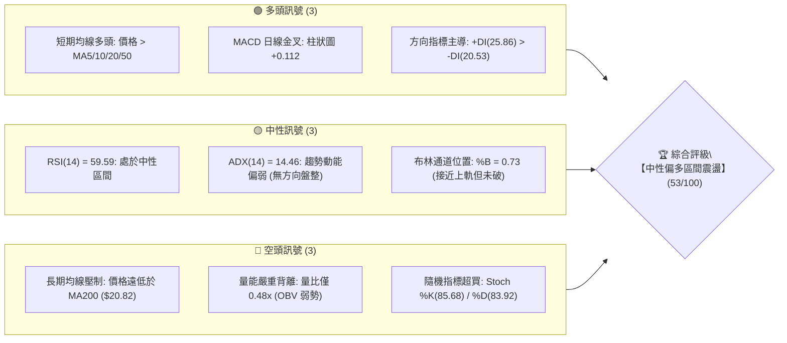
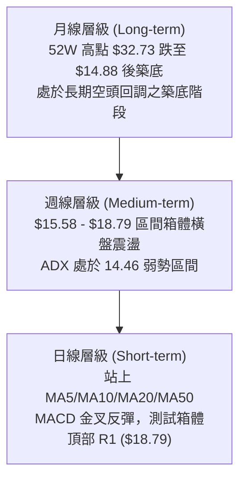
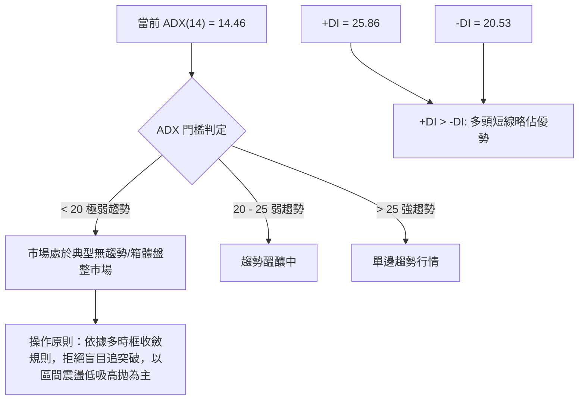
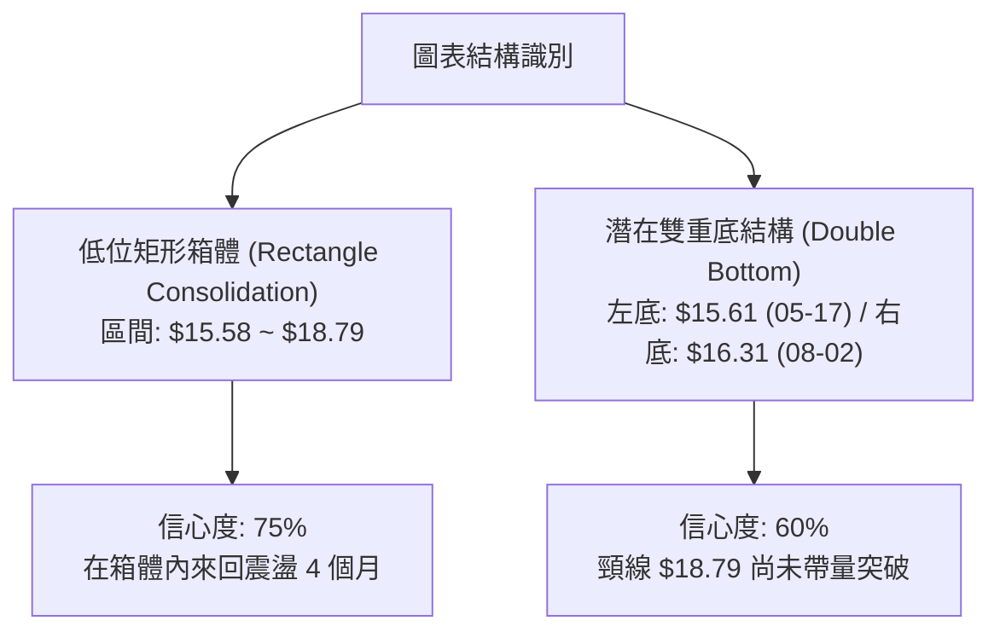
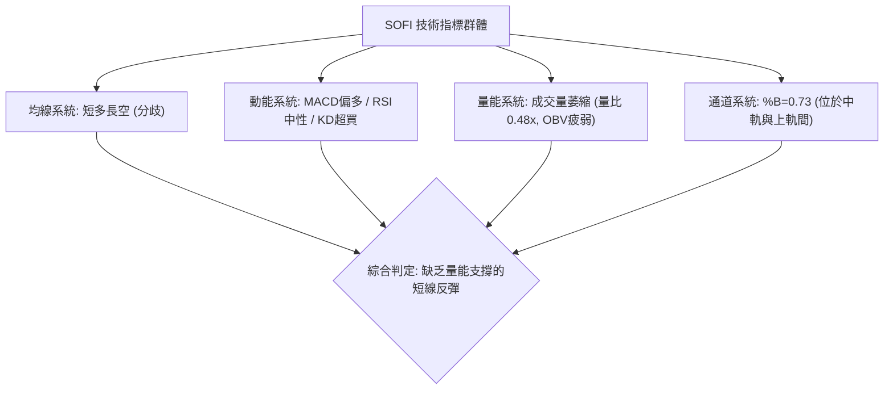
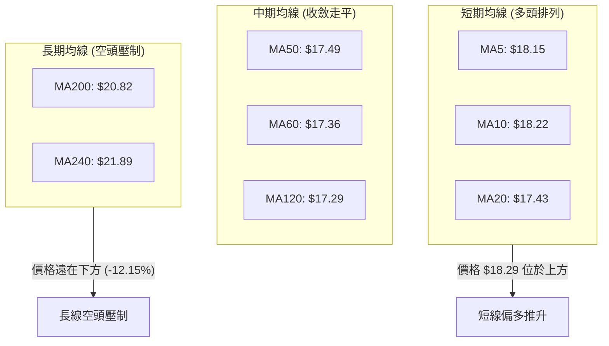
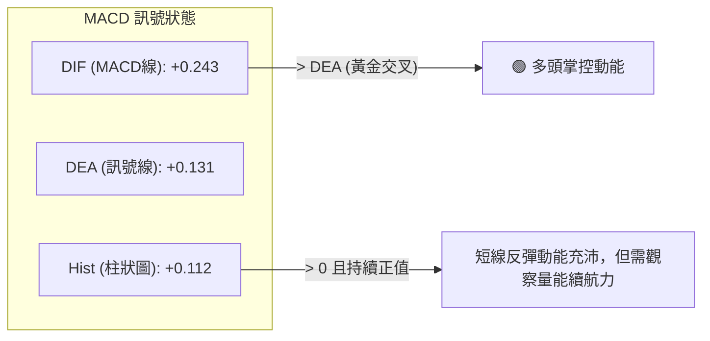
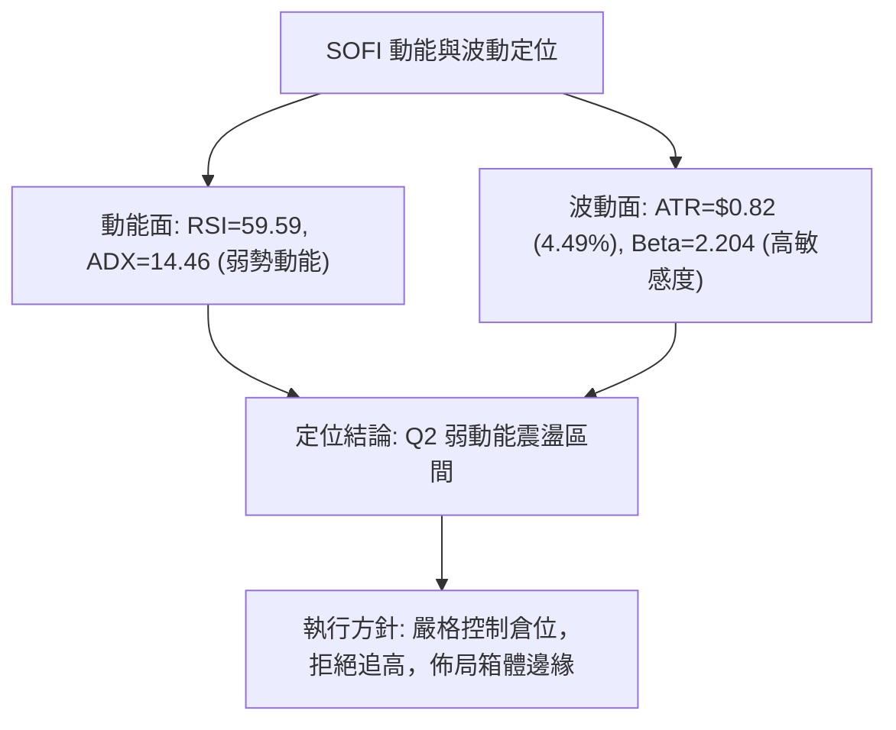
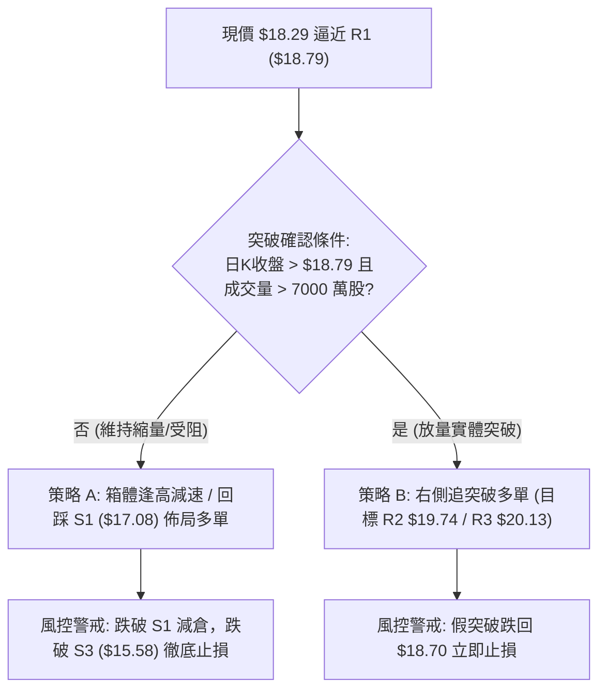
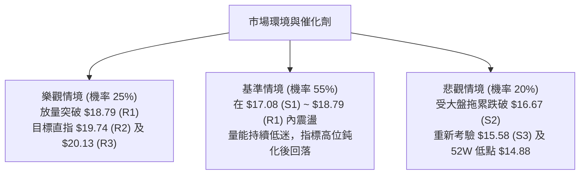

# SOFI 技術分析報告

> **報告日期**：2026-08-16 ｜ **語言**：繁體中文 ｜ **數據來源**：Yahoo Finance ｜ **當前價格**：$18.29

---

## 目錄

| 章節 | 內容 |
|------|------|
| [1. 技術面概覽](#1-技術面概覽) | 訊號儀表板、核心指標、評分卡 |
| [2. 趨勢分析](#2-趨勢分析) | 多時框趨勢、長中短期走勢 |
| [3. 圖表形態分析](#3-圖表形態分析) | 形態識別、K線組合、目標價 |
| [4. 支撐與阻力](#4-支撐與阻力) | 關鍵價位、斐波那契回調 |
| [5. 技術指標深度解讀](#5-技術指標深度解讀) | MA/RSI/MACD/布林/成交量 |
| [6. 動能與波動率](#6-動能與波動率) | 動能評估、ATR、Beta |
| [7. 多時框架總結](#7-多時框架總結) | 時框架評分矩陣 |
| [8. 交易策略建議](#8-交易策略建議) | 多空策略、風險報酬比 |
| [9. 風險提示與監控](#9-風險提示與監控) | 監控指標、風險場景 |
| [📋 報告總結](#-報告總結) | 核心結論與策略彙整 |

---

## 1. 技術面概覽

### 🎯 技術訊號儀表板



---

### 📊 核心指標速覽表

| 指標類別 | 指標名稱 | 當前數值 | 訊號 | 解讀 |
|:---|:---|:---|:---:|:---|
| **價格** | 當前價格 | $18.29 | 🟡 | 位於 52 週區間 19.1% 低位，短線處於底部反彈段 |
| **均線** | MA20 | $17.43 | 🟢 | 現價高於 MA20 (+4.90%)，短線多頭掌控 |
| **均線** | MA50 | $17.49 | 🟢 | 現價高於 MA50 (+4.57%)，突破中期均線壓力 |
| **均線** | MA200 | $20.82 | 🔴 | 現價低於 MA200 (-12.15%)，長期結構仍屬空頭排列 |
| **動能** | RSI(14) | 59.59 | 🟡 | 處於 50–60 溫和多頭區，無背離現象，未達超買 |
| **動能** | MACD (12,26,9) | 0.243 / +0.112 | 🟢 | 快線在慢線上方，柱狀圖持續擴大，短線動能偏多 |
| **動能** | Stoch %K / %D | 85.68 / 83.92 | 🔴 | KD 指標進入超買區（>80），短線面臨技術性拉回壓力 |
| **趨勢** | ADX(14) | 14.46 | 🟡 | ADX < 25，代表缺乏單邊強趨勢，當前屬於典型箱體盤整 |
| **波動** | ATR(14) | $0.82 | 🟡 | 每日平均波幅 4.49%，波動度維持中等水準 |
| **量能** | 20日均量比 | 0.48x | 🔴 | 成交量 3,424 萬股遠低於均量 7,085 萬股，量能無力支持單邊突破 |

---

### 🏆 技術評分卡

```
╔══════════════════════════════════════════════════════════════╗
║              技術評分卡 — SOFI (2026-08-16)                  ║
╠══════════════════════════════════════════════════════════════╣
║ 趨勢強度 (ADX/方向)   ██████░░░░░░░░░░░░░░  30/100  🔴 弱趨勢 ║
║ 短期動能 (MACD/RSI)   ██████████████░░░░░░  70/100  🟢 偏多   ║
║ 均線架構 (MA體系)     ██████████░░░░░░░░░░  50/100  🟡 分歧   ║
║ 支撐穩定度 (S1/S2)    ██████████████░░░░░░  70/100  🟢 紮實   ║
║ 成交量配合 (Volume)   ██████░░░░░░░░░░░░░░  30/100  🔴 量縮   ║
║ 形態結構 (箱體整理)   ████████████░░░░░░░░  60/100  🟡 待確認 ║
╠══════════════════════════════════════════════════════════════╣
║ 綜合評分             ███████████░░░░░░░░░  53/100  🟡 區間盤整║
╚══════════════════════════════════════════════════════════════╝
```

---

## 2. 趨勢分析

### 🌐 多時框趨勢分析



---

### 📈 長期趨勢 — 12個月走勢圖（Unicode）

SOFI 過去 12 個月經歷了自 2025 年秋季高點的深度回調，隨後在 $15.50–$16.00 區域形成紮實支撐底部。

```
SOFI 月線走勢圖（過去 12 個月：2025-09 至 2026-08）
價格 ($)
$30.00 ┤                     ● 29.68(10月) ● 29.72(11月)
$27.00 ┤        ● 26.42(9月)                 ● 26.18(12月)
$24.00 ┤                                           ● 22.81(1月)
$21.00 ┤                                                 
$18.00 ┤                                                       ● 17.76(2月)      ● 18.22(5月) ● 18.29(現價)
$15.00 ┤                                                             ● 15.88(3月) ● 16.10(4月) ● 16.31(7月)
       └────────────────────────────────────────────────────────────────────────────────────────────►
月份      09/25  10/25  11/25  12/25  01/26  02/26  03/26  04/26  05/26  06/26  07/26  08/26
```

#### 走勢特徵分析表格

| 階段 | 時間區間 | 價格區間 | 累計漲跌幅 | 走勢特徵與量能解讀 |
|:---|:---|:---|:---:|:---|
| **牛市頂部** | 2025-09 ~ 2025-11 | $26.42 → $29.72 | +12.49% | 衝頂階段，在 $29.72 附近形成雙頂形態，動能衰竭。 |
| **主跌浪** | 2025-12 ~ 2026-03 | $29.72 → $15.88 | -46.57% | 跌破各級均線支撐，出現流暢的單邊空頭趨勢。 |
| **低位箱體築底** | 2026-04 ~ 2026-08 | $15.61 → $18.29 | +17.17% | 價格在 $15.58 (S3) 與 $18.79 (R1) 之間反覆震盪，空頭勢頭被遏制。 |

---

### 📊 中期趨勢（週線分析）

中期走勢呈現「低位寬幅區間震盪」，下方 $15.58–$16.31 提供多重底部支撐，上方 $18.79–$19.74 構成沉重解套賣壓。

```
中期週線價格波段結構（近期 20 週高低點分布）：
$19.74 ┤─────────────────────────────── R2 (波段強阻力)
$19.43 ┤        ▲ (04-19 高點)
$18.79 ┤─────────────────────────────── R1 (箱體頂部 / 斐波 78.6% $18.70)
$18.29 ┤                                  ● 現價 ($18.29)
$17.43 ┤─────────────────────────────── 中軌 / MA20 支撐
$16.31 ┤                                  ▼ (08-02 低點)
$15.58 ┤────────▼──────────────▼────── S3 (箱體底部支撐區間)
       └───────────────────────────────► 2026年4月 ~ 8月
```

---

### ⚡ 趨勢強度評估（ADX 解讀）



#### ADX 趨勢強度對照解讀表

| 指標項 | 數值 | 參考門檻 | 當前判定 | 策略意涵 |
|:---|:---:|:---:|:---:|:---|
| **ADX(14)** | 14.46 | < 25 (弱趨勢/盤整) | 🟡 無趨勢盤整 | 避免使用追突破策略，趨勢指標容易產生頻繁假訊號。 |
| **+DI / -DI** | 25.86 / 20.53 | +DI > -DI 差值 5.33 | 🟢 短線多頭領先 | 多方在箱體內部具有發動向上測試邊界的主導權。 |

---

## 3. 圖表形態分析

### 🔍 形態識別系統



#### 形態識別與信心度評估表

| 形態名稱 | 信心度 | 判斷依據（引用數據） | 完成度 | 目標價（附精確計算式） |
|:---|:---:|:---|:---:|:---|
| **箱體震盪 (Box Consolidation)** | **75%** | 價格在 S3 ($15.58) 與 R1 ($18.79) 之間震盪 20 週，收盤價多次在該區間受阻與獲撐。 | 85% | 箱頂目標：**$18.79** (R1)<br/>若突破則測箱體等幅：$18.79 + ($18.79 - $15.58) = **$22.00**（接近 MA240 $21.89） |
| **潛在雙重底 (W-Bottom)** | **60%** | 2026-05-17 形成左底 $15.61，2026-08-02 形成右底 $16.31（高於左底），頸線為波段高點 R1 ($18.79)。 | 50% (未突破頸線) | 由形態高度推算：<br/>頸線 $18.79 + 形態高度 ($18.79 - $15.61 = $3.18) = **$21.97**（受限於 MA200 $20.82 壓制） |
| **均線收斂突破** | **65%** | 短期 MA5 ($18.15)、MA10 ($18.22)、MA20 ($17.43)、MA60 ($17.36) 密集糾纏於 $17.30–$18.20 區間。 | 70% | 向上發散第一阻力：**$18.79** (R1)<br/>第二阻力：**$19.74** (R2) |

---

### 🕯️ 重要K線形態分析

| 月份/週期 | 收盤價 | 核心 K 線特徵 | 技術面解讀 | 多空訊號 |
|:---|:---:|:---|:---|:---:|
| **2026-05** | $18.22 | 探底長下影大陽線（月線） | 自 2026-03 低點 $15.88 展開強勁反彈，確認 $15.50 區域買盤支撐。 | 🟢 看多反彈 |
| **2026-07** | $16.31 | 縮量陰線回踩測試低點 | 回踩前低不破，完成右底構築，未創 52 週新低 ($14.88)。 | 🟡 止跌回穩 |
| **2026-08 (最新)**| $18.29 | 連續兩週放量長陽回升 | 2026-08-09 收 $18.38、本週收 $18.29，強勢站上 MA20/MA50。 | 🟢 短線多頭 |

---

### 📉 ASCII 走勢形態示意圖

```
SOFI 箱體整理與潛在雙底示意圖
價格 ($)
$18.79 ┼─────────── 頸線 / 箱體頂部 (R1: $18.79) ───────────────────
       │                  ▲ (04-19: $19.43 假突破)
$18.29 ┼─────────────────────────────────────────────● 現價 ($18.29)
       │           ▲ (05-31: $18.22)          ▲ (08-09: $18.38)
$17.43 ┼─────── 中軌 / 均線糾纏區 (MA20: $17.43) ───────────────────
       │
$16.31 ┼───────────────────────────────● 右底 ($16.31, 08-02)
$15.58 ┼───● 左底 ($15.61, 05-17) ─────────────────────────────────
       └─────────────────────────────────────────────────────────────►
          2026年5月              2026年6月-7月             2026年8月
```

---

## 4. 支撐與阻力

### 🗺️ 關鍵價位分布圖（Unicode）

```
SOFI 價位結構分布圖
══════════════════════════════════════════════════════════════════
$20.82 ║████████████████████████████████║ 長期牛熊分界 (MA200)
$20.13 ║████████████████████████        ║ 強阻力 R3 (+10.06%)
$19.74 ║██████████████████              ║ 波段阻力 R2 (+7.93%)
$18.79 ║████████████████████████████    ║ 關鍵阻力 R1 / 箱頂 (+2.71%)
$18.70 ║────────────────────────────────║ 斐波那契 78.6% 回調位
───────╠════════════════════════════════╣ ◄ 當前價格 $18.29
$17.43 ║▓▓▓▓▓▓▓▓▓▓▓▓▓▓▓▓▓▓▓▓▓▓▓▓        ║ 布林中軌 / MA20
$17.08 ║▓▓▓▓▓▓▓▓▓▓▓▓▓▓▓▓                ║ 近期波段支撐 S1 (-6.62%)
$16.67 ║████████████████                ║ 次級支撐 S2 (-8.88%)
$15.58 ║████████████████████████████████║ 箱體強支撐 S3 / BB下軌 (-14.84%)
$14.88 ║████████████████████████████████║ 52週最低價 (絕對止損底線)
══════════════════════════════════════════════════════════════════
```

---

### 🚧 阻力位分析表

| 阻力級別 | 價位 | 距現價幅標 | 形成原因（依據 OHLCV 聚類） | 突破難度 | 重要性評級 |
|:---|:---:|:---:|:---|:---:|:---:|
| **R1** | **$18.79** | +2.71% | 近期多次衝高回落高點聚類、斐波那契 78.6% ($18.70) 重合區。 | 🟡 中等 | ★★★★☆ |
| **R2** | **$19.74** | +7.93% | 2026年4月中旬反彈高點聚類 ($19.43~$19.74)、布林通道上軌 ($19.29) 上方。 | 🔴 較高 | ★★★★☆ |
| **R3** | **$20.13** | +10.06% | 2026年初跌破整數關口前之密集套牢籌碼區，緊鄰 MA200 ($20.82)。 | 🔴 極高 | ★★★★★ |

---

### 🛡️ 支撐位分析表

| 支撐級別 | 價位 | 距現價幅標 | 形成原因（依據 OHLCV 聚類） | 守住機率 | 重要性評級 |
|:---|:---:|:---:|:---|:---:|:---:|
| **S1** | **$17.08** | -6.62% | 2026年7月中旬回調低點聚類，緊鄰 MA20 ($17.43) 與 MA60 ($17.36)。 | 🟢 70% | ★★★★☆ |
| **S2** | **$16.67** | -8.88% | 近一年多個交易週波段回調低點聚類區間。 | 🟢 80% | ★★★☆☆ |
| **S3** | **$15.58** | -14.84% | 布林通道下軌 ($15.58) 與 2026-05-17 週低點 ($15.61) 聚類強支撐。 | 🟢 90% | ★★★★★ |

---

### 📐 斐波那契回調位分析

依據 52 週完整波動區間（高點 $32.73 → 低點 $14.88，總落差 $17.85）計算之標準回調位如下：

```
52週斐波那契回調梯形圖：
0.0%  (52W High)  $32.73 ──────────────────────────────
23.6%             $28.52 ──────────────────────────────
38.2%             $25.91 ──────────────────────────────
50.0%             $23.80 ──────────────────────────────
61.8%             $21.70 ────────────────────────────── (黃金分割反彈壓力位)
78.6%             $18.70 ────────────────────────────── (現價主要考驗阻力)
       現價 $18.29 ◄ 落於 78.6% ($18.70) 與 100.0% ($14.88) 之間
100.0% (52W Low)  $14.88 ──────────────────────────────
```

- **位置解讀**：當前價格 $18.29 緊貼 **78.6% 回調位 ($18.70)** 下方。該位置是空頭跌浪延續與反轉的第一道大門。若無法有效帶量突破 $18.70–$18.79 (R1)，價格將繼續受困於底部弱勢區間（$14.88–$18.70）。

---

## 5. 技術指標深度解讀

### 🎛️ 指標訊號總覽



---

### 📈 移動平均線排列分析



#### 均線數據明細表

| 均線名稱 | 數值 | 距現價差幅 | 狀態 | 趨勢意涵 |
|:---|:---:|:---:|:---:|:---|
| **MA 5** | $18.15 | +0.76% | ▲ 上方 | 短線超短週期支撐，維持推升節奏 |
| **MA 10** | $18.22 | +0.37% | ▲ 上方 | 短線控盤線，提供即時動能 |
| **MA 20** | $17.43 | +4.90% | ▲ 上方 | 月線支撐，布林通道中軌所在 |
| **MA 50** | $17.49 | +4.57% | ▲ 上方 | 季線轉為支撐，近期完成站上 |
| **MA 60** | $17.36 | +5.34% | ▲ 上方 | 中期均線由跌轉平 |
| **MA 120**| $17.29 | +5.78% | ▲ 上方 | 半年線支撐，中長期均線密集聚合 |
| **MA 200**| $20.82 | -12.15%| ▼ 下方 | **年線強阻力**，MA20 < MA50 < MA200 長期結構仍為空頭 |
| **MA 240**| $21.89 | -16.44%| ▼ 下方 | 超長期成本防線，形成長期牛熊分界 |

---

### 📉 RSI(14) 分析

- **當前數值**：**59.59**
- **區間進度條**：
  ```
  超賣 [0] ░░░░░░░░░░░░░░ [30] ▓▓▓▓▓▓▓▓▓▓▓▓ [59.59] ░░░░░░░░ [70] ░░░░░░░░░░░░ [100] 超買
                                      ▲ 現值 59.59 (中性偏多)
  ```
- **解讀與背離檢驗**：
  - RSI(14) 位於 59.59，高於 50 多空分界線，顯示短線買盤力量佔優。
  - **背離分析**：檢視 2026-08-09 收盤 $18.38（RSI 58.0）與 2026-08-16 收盤 $18.29（RSI 59.6），價格微跌但 RSI 微升，且近 8 週未見明顯頂背離或底背離現象（判定：**無背離**）。

---

### 📊 MACD(12,26,9) 訊號解讀



---

### 📦 布林通道分析

```
SOFI 日線布林通道結構 (帶寬 20, 2)
價格 ($)
$19.29 ┼─────────────────────────────── 布林上軌 (阻力)
       │
$18.29 ┼──────────────────────── ● 現價 ($18.29) [%B = 0.73]
       │
$17.43 ┼─────────────────────────────── 布林中軌 (MA20: $17.43)
       │
$15.58 ┼─────────────────────────────── 布林下軌 (S3 強支撐)
```

- **%B 指標分析**：當前 %B 為 **0.73**，顯示價格運行在中軌 ($17.43) 與上軌 ($19.29) 之間的多方掌控區。
- **帶寬特徵**：布林帶寬 ($19.29 - $15.58 = $3.71) 處於收口後的微幅發散狀態，尚未形成單邊大擴軌，符合 ADX=14.46 的箱體盤整特徵。

---

### 💹 成交量分析（量價配合度）

- **最新成交量**：34,243,800 股
- **20日均量**：70,856,225 股（**量比僅 0.48x**）
- **50日均量**：78,411,464 股
- **量價背離分析**：
  ```
  【量價狀態警訊】
  價格走勢：自 $16.31 (08-02) 上漲至 $18.29 (08-16)  ▲ 上漲 +12.14%
  成交量能：自 4.83 億股 (08-02週) 萎縮至 2.10 億股 (08-16週) ▼ 量縮 -56.48%
  OBV 指標：OBV < 均線  →  量能疲弱，判定為「量價背離（價漲量縮）」
  ```
- **結論**：本輪反彈屬於「無量空拉」或「籌碼沉澱後的超跌修復」，在缺乏機構大資金（量能無法放大至 7,000 萬股以上）進場確認前，難以直接衝破 R1 ($18.79) 及 R2 ($19.74)。

---

## 6. 動能與波動率

### ⚡ 動能評估四象限

| 象限 | 動能維度 | 波動維度 | 當前狀態標記 | 策略含義與操作指引 |
|:---:|:---:|:---:|:---:|:---|
| **Q1** | 強動能 (Trend) | 低波動 (Low Vol) | — | 最佳趨勢加碼點（單邊平穩行情） |
| **Q2** | **弱動能 (Weak/Neutral)** | **低/中波動 (Moderate Vol)** | **✓ SOFI (當前定位)** | **謹慎觀望，以箱體上下邊界高拋低吸為主** |
| **Q3** | 強動能 (High Momentum) | 高波動 (High Vol) | — | 高風險突破追單（爆發性行情） |
| **Q4** | 弱動能 (No Trend) | 高波動 (High Vol) | — | 雜亂洗盤震盪，易引發雙向止損 |



---

### 📊 ATR 波動率分析

- **ATR(14) 數值**：**$0.82**（佔股價比率 4.49%）
- **止損距離建議**：
  - 激進型短線交易（1.0 × ATR）：止損距離約 **$0.82**
  - 標準波段交易（1.5 × ATR）：止損距離約 **$1.23**
  - 保守型趨勢交易（2.0 × ATR）：止損距離約 **$1.64**

---

### 📐 Beta 與市場相關性

- **Beta 係數**：**2.204**（超高 Beta 屬性）
- **市場特徵**：SOFI 對大盤（標普 500 / 納斯達克）波動具有高達 2.2 倍的槓桿敏感度。在盤整階段，若大盤出現系統性回調，SOFI 易出現超出技術面的下挫；反之，大盤走強時亦具備較強彈性。
- **空頭比例 (Short % of Float)**：**15.0%**（Short Ratio 2.22），具備潛在軋空動能，但需以量能激增為前提。

---

## 7. 多時框架總結

### 📋 時框架評分表

| 時框架 | 趨勢方向 | 動能指標 | 均線排列 | 形態結構 | 綜合評分 | 建議指引 |
|:---|:---:|:---:|:---:|:---:|:---:|:---|
| **月線 (長期)** | 🔴 下跌/築底 | RSI=45 偏弱 | MA200 下方壓制 | 52W 低位大箱體 | 35/100 | 長線資金底倉觀望，不宜重倉 |
| **週線 (中期)** | 🟡 區間震盪 | MACD 翻正中 | MA20/50 走平收斂 | $15.58-$18.79 箱體 | 55/100 | 箱體區間高拋低吸 |
| **日線 (短期)** | 🟢 震盪反彈 | MACD金叉/KD超買 | 站上 MA5/10/20/50 | 逼近箱體頂部 R1 | 65/100 | 逢高獲利了結，回踩 S1 接回 |

---

### 🔲 綜合訊號矩陣

```
時框架訊號矩陣分析：
┌──────────────┬──────────────┬──────────────┬──────────────┐
│   分析維度   │  短期 (日線) │  中期 (週線) │  長期 (月線) │
├──────────────┼──────────────┼──────────────┼──────────────┤
│ 趨勢方向     │ 🟢 向上反彈  │ 🟡 箱體橫盤  │ 🔴 空頭修復  │
│ 均線系統     │ 🟢 站上短均  │ 🟡 均線糾纏  │ 🔴 壓制在下  │
│ 動能指標     │ 🟡 超買修正  │ 🟢 溫和修復  │ 🔴 動能不足  │
│ 成交量能     │ 🔴 嚴重縮量  │ 🔴 縮量整理  │ 🟡 籌碼沉澱  │
└──────────────┴──────────────┴──────────────┴──────────────┘
```

---

### ⚖️ 多時框收斂結論

> **依據「多時框收斂規則」嚴格判定**：
> 1. **行情性質判定**：當前 ADX(14) 為 **14.46 (< 25)**，明確定義當前市場為**「無趨勢盤整行情」**。
> 2. **主導時框與交易邊界**：日線布林通道上下軌（**$15.58 ～ $19.29**）及 OHLCV 關鍵箱體（**$15.58 ～ $18.79**）為絕對核心交易區間。
> 3. **方向性唯一結論**：**【中性觀望 / 區間偏多高拋低吸】**。
> 4. **收斂邏輯**：日線級別雖然短均多頭排列且 MACD 金叉，但上方即將遭遇 R1 ($18.79) 箱頂與斐波 78.6% ($18.70) 雙重壓力，且成交量（量比 0.48x）與 Stoch 超買（85.68）顯示短線向上空間受限。第 8 章交易策略將完全依此收斂結論制定。

---

## 8. 交易策略建議

### 🗺️ 策略決策流程圖



---

### 🧭 策略路由（依評分卡分流）

- **當前技術評分**：**53 / 100（中性區間）**
- **主策略方向**：**【區間操作 — 箱體內低吸高拋，突破前拒絕盲目追高】**

---

### 🎯 價格情境階梯（Price Scenarios）

所有價位均嚴格引用第 4 章關鍵價位與 OHLCV 計算結果：

| 觸發條件 | 第一目標 (T1) | 後續延伸 (T2) | 情境含義與操作要領 |
|:---|:---:|:---:|:---|
| **向上突破 R1 ($18.79)** | **R2 ($19.74)** | **R3 ($20.13)** | 短線打開向上空間，挑戰布林上軌及年線附近阻力。 |
| **維持於現價區間震盪** | **$18.79 (箱頂)** | **$17.08 (箱底)** | 處於 $17.08–$18.79 內拉鋸，維持網格高拋低吸。 |
| **向下跌破 S1 ($17.08)** | **S2 ($16.67)** | **S3 ($15.58)** | 中期反彈夭折，重新下探測試 52 週雙底支撐。 |

---

### 📊 情境機率分佈

| 情境劇本 | 機率估計 | 主要技術依據 |
|:---|:---:|:---|
| **情境一：箱體內受阻震盪回踩 (回落至 S1)** | **55%** | ADX=14.46 弱趨勢、量比僅 0.48x 無力攻堅、Stoch 進入 >85 超買區。 |
| **情境二：放量突破箱頂 (上攻 R1 → R2)** | **25%** | 日線 MACD 金叉紅柱擴大、+DI(25.86) 領先、華爾街分析師平均目標價 $19.92 提供預期。 |
| **情境三：跌破支撐再探底部 (下探 S2 → S3)** | **20%** | 長期均線 MA200 呈空頭壓制，若大盤回調高 Beta (2.204) 易加速補跌。 |

---

### 🟢 主策略詳情（方向：區間低吸 / 突破跟進）

| 策略要素 | 策略 A（左側回踩低吸 — 推薦首選） | 策略 B（右側放量突破 — 備選） |
|:---|:---|:---|
| **策略類型** | 震盪行情下軌低吸 | 箱體頂部突破跟隨 |
| **進場條件** | 價格回踩 S1 附近獲得支撐，出現 15分/60分 止跌K線 | 日線實體收盤突破 R1 ($18.79)，且當日成交量 > 7,000 萬 |
| **進場價格** | **$17.15**（S1 $17.08 上方微幅掛單） | **$18.85**（確認突破 R1 $18.79 後掛單） |
| **目標價 T1** | **$18.70**（斐波那契 78.6% 回調位） | **$19.74**（波段阻力 R2） |
| **目標價 T2** | **$19.74**（阻力位 R2） | **$20.13**（阻力位 R3 / 近 MA200） |
| **止損價格** | **$16.30**（跌破右底 $16.31 及 S2 $16.67） | **$18.25**（跌回現價 / MA5 $18.15 之下） |
| **風險報酬比** | **1 : 1.82** (風險 $0.85 vs 收益 $1.55) | **1 : 1.48** (風險 $0.60 vs 收益 $0.89) |
| **成功機率** | **65%** | **45%**（受制於當前量能不足） |
| **建議倉位** | **10% ~ 15%**（標準倉位） | **5% ~ 8%**（輕倉試單） |

---

### 🔴 反向風險觸發點（對沖與風控提示）

- **多頭止損/對沖觸發價位**：若日線收盤**跌破 $16.67 (S2)**，代表雙底右底構築失敗，必須無條件將多頭部位砍半或建立反向保護。
- **空頭回補/認賠觸發價位**：若價格以日線大陽線**站穩 $19.74 (R2)** 並伴隨量能倍增，代表築底成功並開啟大級別反轉，所有空頭或對沖空單必須立即離場。

---

### ⭐ 整體訊號強度評星

```
╔═══════════════════════════════════════════════════════╗
║ 做多訊號強度：  ★★★☆☆  (3/5 星 — 僅限區間低吸)        ║
║ 做空訊號強度：  ★★☆☆☆  (2/5 星 — 下方有 S1-S3 密集防守) ║
║ 趨勢可信度：    ★★☆☆☆  (2/5 星 — ADX 疲弱，無單邊行情) ║
║ 整體技術可信度：★★★☆☆  (3/5 星 — 箱體邊界清晰有效)     ║
╚═══════════════════════════════════════════════════════╝
```

---

## 9. 風險提示與監控

### ✅ 關鍵監控指標 Checklist

```
╔══════════════════════════════════════════════════════════════════════╗
║                     SOFI 每日交易監控清單 (Checklist)                 ║
╠══════════════════════════════════════════════════════════════════════╣
║ [ ] 1. R1 壓力測試：觀察 $18.70 - $18.79 區間是否出現長上影線滯漲    ║
║ [ ] 2. 成交量配合度：日成交量是否放大至 20 日均量 (7,085 萬股) 以上  ║
║ [ ] 3. KD 指標超買修正：Stoch %K 是否自 85.68 向下死叉 %D (拉回訊號)  ║
║ [ ] 4. MA20 / 中軌得失：回踩時 $17.43 是否具備強支撐力道            ║
║ [ ] 5. 空頭平倉異動：15% Short Float 是否在突破 $18.79 時引發軋空    ║
╚══════════════════════════════════════════════════════════════════════╝
```

---

### ⚠️ 風險場景分析



---

### 🛡️ 風險管理重要提醒

1. **高 Beta 波動防範**：SOFI Beta 高達 **2.204**，每日波動 ATR 為 **$0.82 (4.49%)**。單筆交易最大虧損額應嚴格限制在總資產的 **1.0%–1.5%** 以內。
2. **拒絕情緒化追高**：當前 Stoch 已達 85.68 嚴重超買，且現價 $18.29 距離上方強阻力 R1 ($18.79) 僅剩 2.71% 空間，此時追多盈虧比極差（< 1.0），務必耐心等待回踩。
3. **倉位管理配置**：在 ADX < 25 的震盪市場中，總倉位建議維持在 **30%–40%** 以下，保留充裕現金儲備以應對假突破風險。

---

## 📋 報告總結

```
SOFI 技術分析報告總結
════════════════════════════════════════════════════════════════
報告日期：2026-08-16
當前價格：$18.29 (52W 區間 19.1% 位置)
分析評級：⚖️ 中性盤整 (Neutral / Range-Bound) — 技術評分: 53/100

關鍵結論：
├─ 長期趨勢：🔴 空頭排列 (價格遠低於 MA200 $20.82 及 MA240 $21.89)
├─ 中期趨勢：🟡 箱體整理 (在 $15.58 - $18.79 區間橫盤，ADX=14.46)
├─ 短期趨勢：🟢 弱勢反彈 (站上 MA5/10/20/50，但成交量嚴重萎縮 0.48x)
├─ 關鍵支撐：S1: $17.08 │ S2: $16.67 │ S3: $15.58 (下軌強防守)
├─ 關鍵阻力：R1: $18.79 │ R2: $19.74 │ R3: $20.13 (年線前哨)
└─ 分析師目標：華爾街均價 $19.92 (共識評級: Hold)

最優策略組合：
1. 🥇 最佳機會（策略 A）：耐心等待價格回踩 S1 支撐區 ($17.15 附近) 佈局多單，
                         止損設於 $16.30，目標上看 $18.70 / $19.74。
2. 🥈 次選機會（策略 B）：若日線帶量（>7000萬股）實體突破 $18.79 (R1)，
                         右側輕倉跟進，目標 $19.74，跌破 $18.25 嚴格止損。
3. 🥉 保守選擇：維持空倉觀望，等待 ADX 回升至 25 以上確認單邊趨勢再行進場。
════════════════════════════════════════════════════════════════
```

---

> ⚠️ **免責聲明**：本報告為 AI 自動生成之技術分析，所有數據及估算均基於提供的歷史價格資訊。本報告**僅供研究與學術參考**，**不構成任何投資建議**。投資有風險，入市需謹慎。

---

*報告生成時間：2026-08-16 ｜ 數據來源：Yahoo Finance ｜ 分析框架：多時框技術分析*