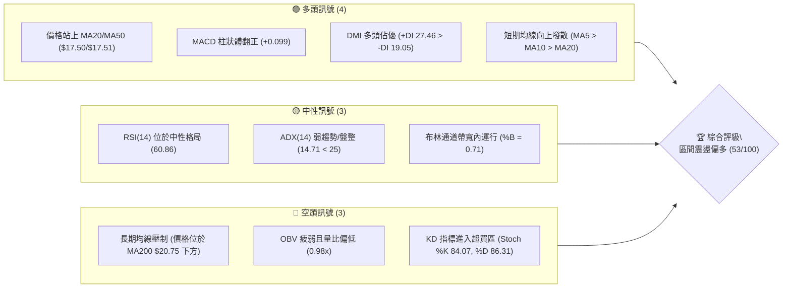
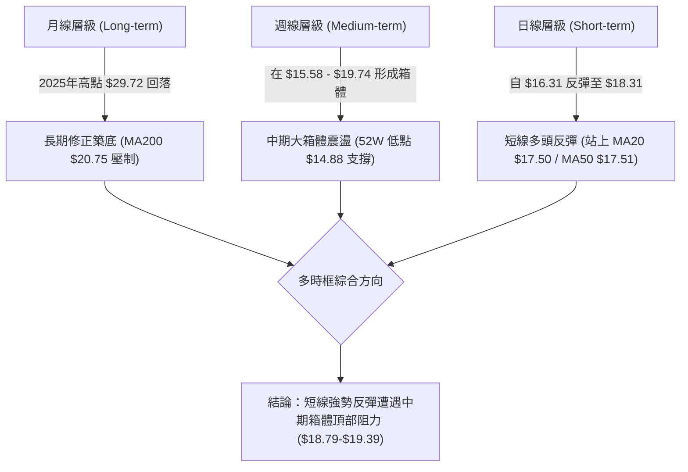
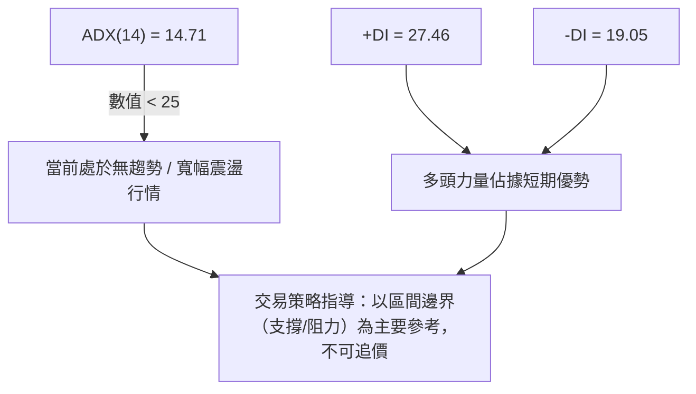
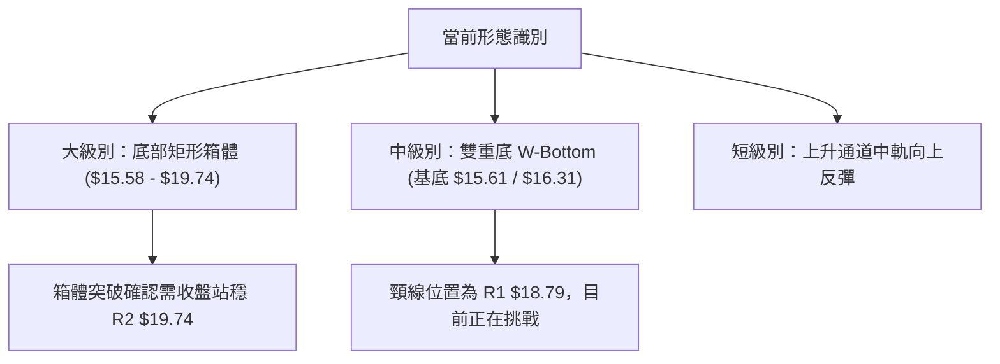
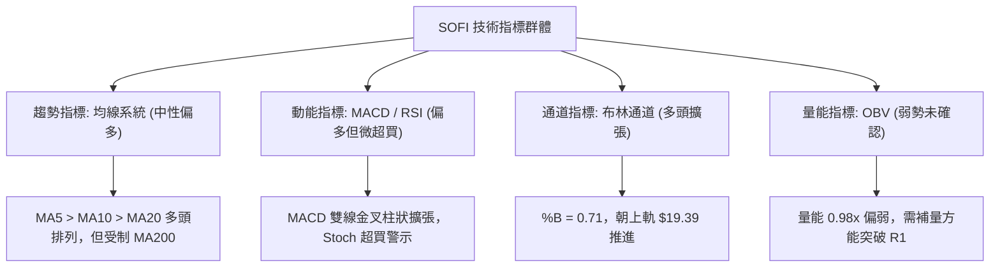
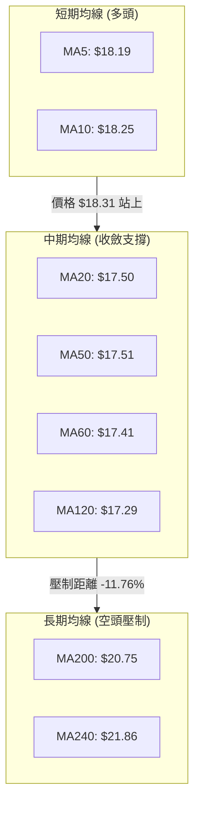
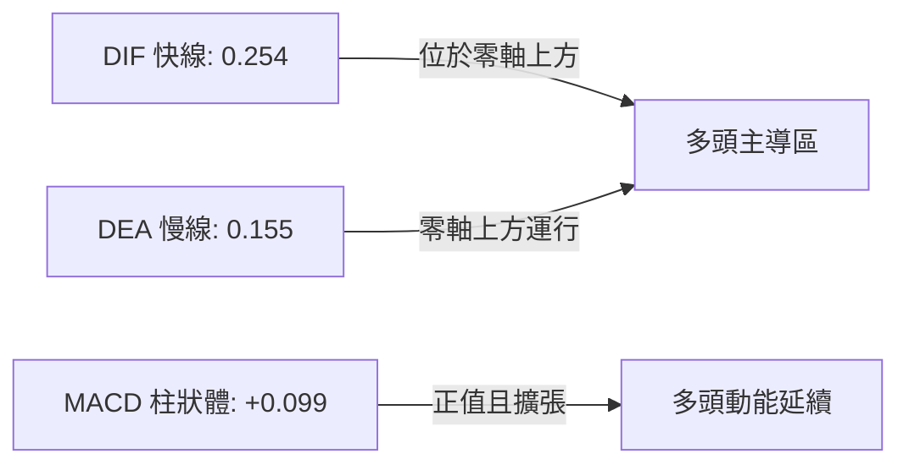
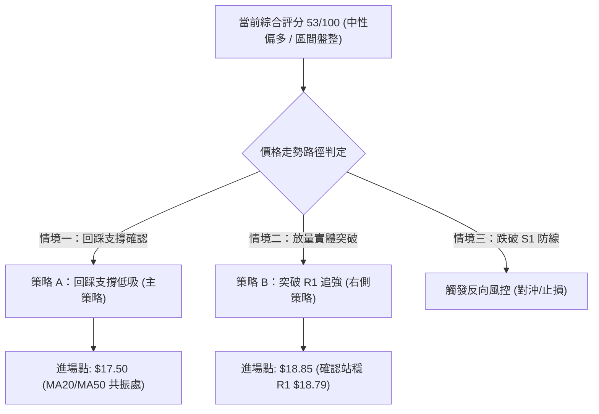
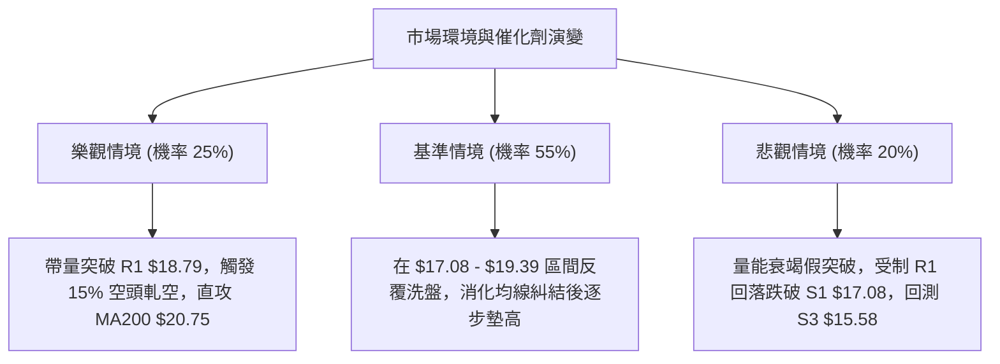

# SOFI 技術分析報告

> **報告日期**：2026-08-17 ｜ **語言**：繁體中文 ｜ **數據來源**：Yahoo Finance ｜ **當前價格**：$18.31

---

## 目錄

| 章節 | 內容 |
|------|------|
| [1. 技術面概覽](#1-技術面概覽) | 訊號儀表板、核心指標、評分卡 |
| [2. 趨勢分析](#2-趨勢分析) | 多時框趨勢、長中短期走勢 |
| [3. 圖表形態分析](#3-圖表形態分析) | 形態識別、K線組合、目標價 |
| [4. 支撐與阻力](#4-支撐與阻力) | 關鍵價位、斐波那契回調 |
| [5. 技術指標深度解讀](#5-技術指標深度解讀) | MA/RSI/MACD/布林/成交量 |
| [6. 動能與波動率](#6-動能與波動率) | 動能評估、ATR、Beta |
| [7. 多時框架總結](#7-多時框架總結) | 時框架評分矩陣 |
| [8. 交易策略建議](#8-交易策略建議) | 多空策略、風險報酬比 |
| [9. 風險提示與監控](#9-風險提示與監控) | 監控指標、風險場景 |

---

## 1. 技術面概覽

### 🎯 技術訊號儀表板



### 📊 核心指標速覽表

| 指標類別 | 指標名稱 | 當前數值 | 訊號 | 解讀 |
|:---|:---|:---|:---:|:---|
| **價格** | 當前收盤價 | $18.31 | 🟢 | 位於52週區間19.2%相對低位，短線強勢反彈 |
| **均線** | MA20 / MA50 | $17.50 / $17.51 | 🟢 | 價格站上短期及中期均線，短線支撐強勁 |
| **均線** | MA200 | $20.75 | 🔴 | 價格受制於長期年線下方 -11.76%，長期趨勢仍偏空 |
| **動能** | RSI(14) | 60.86 | 🟡 | 位於強勢中性區，無頂底背離，具備上行動能 |
| **動能** | MACD (12,26,9) | 0.254 / 0.155 (Hist +0.099) | 🟢 | 雙線位於零軸上方黃金交叉，多頭動能擴張 |
| **動能** | Stoch %K / %D | 84.07 / 86.31 | 🔴 | 隨機指標進入超買區間，短線存在拉回震盪需求 |
| **趨勢強度**| ADX(14) | 14.71 (+DI: 27.46, -DI: 19.05) | 🟡 | ADX < 25 屬無趨勢盤整市，短線由多頭主導 |
| **波動** | ATR(14) | $0.83 (4.52%) | 🟡 | 每日平均波動約 $0.83，波動率處於中等水平 |
| **通道** | Bollinger Bands | 上軌 $19.39 / 中軌 $17.50 | 🟢 | %B 為 0.71，價格在中上軌間向上運行 |
| **成交量** | 20日均量 / OBV | 70.22M / OBV < MA | 🔴 | 成交量未顯著放大，量價配合度中等，量能稍嫌不足 |

### 🏆 技術評分卡

```
╔══════════════════════════════════════════════════════════════╗
║              技術評分卡 — SOFI (2026-08-17)                  ║
╠══════════════════════════════════════════════════════════════╣
║ 趨勢強度 (Trend)     ████████░░░░░░░░░░░░  40/100  🟡 弱勢盤整║
║ 動能指標 (Momentum)  ██████████████░░░░░░  70/100  🟢 動能充沛║
║ 支撐穩定度 (Support) ████████████░░░░░░░░  60/100  🟢 底部構築║
║ 成交量配合 (Volume)  ████████░░░░░░░░░░░░  40/100  🔴 量能背離║
║ 形態完整度 (Pattern) ███████████░░░░░░░░░  55/100  🟡 區間箱體║
║ 均線系統 (MA System) ██████████░░░░░░░░░░  50/100  🟡 短多長空║
╠══════════════════════════════════════════════════════════════╣
║ 綜合評分             ███████████░░░░░░░░░  53/100  中性偏多  ║
╚══════════════════════════════════════════════════════════════╝
```

---

## 2. 趨勢分析

### 🌐 多時框趨勢分析



### 📈 長期趨勢 — 12個月走勢圖（Unicode）

```
SOFI 月線走勢圖（2025-08 至 2026-08）
價格軸 ($)
$30.00 ┤              ●   ● (2025-10 $29.68 / 11 $29.72 歷史波段高點)
$27.00 ┤          ●       └───●
$24.00 ┤      ●                   ●
$21.00 ┤  ●                           ●
$18.00 ┤                                  ●               ●←現價 $18.31
$15.00 ┤                                      ●   ●   ●
       └──────────────────────────────────────────────────────────
         08  09  10  11  12  01  02  03  04  05  06  07  08
        (2025)                      (2026)
```

#### 走勢特徵分析表格

| 階段 | 時間區間 | 起始價 → 結束價 | 漲跌幅 | 走勢特徵與技術含義 |
|:---|:---:|:---:|:---:|:---|
| **第一階段：高檔衝刺** | 2025-08 ~ 2025-11 | $25.54 → $29.72 | +16.37% | 主升浪末端，於 $29.72 構築雙頂結構 |
| **第二階段：快速回落** | 2025-11 ~ 2026-03 | $29.72 → $15.88 | -46.57% | 跌破各級均線，呈現無支撐單邊空頭下跌 |
| **第三階段：築底震盪** | 2026-03 ~ 2026-07 | $15.88 → $16.31 | +2.71% | 於 $15.58-$16.00 區間反覆測試，形成中期底部 |
| **第四階段：短線回升** | 2026-07 ~ 2026-08 | $16.31 → $18.31 | +12.26% | 突破 MA20 及 MA50，量能持平，短線向上突破 |

### 📊 中期趨勢（週線分析）

從近 20 週收盤走勢觀察，SOFI 在 2026 年 5 月中旬於 $15.61 確立底部支撐後，走勢呈現標準的低點逐步抬高（Higher Lows：$15.61 → $16.03 → $16.31），並在 2026 年 8 月中旬推升至 $18.31。週線 MACD 柱狀體已由負轉正（8/09: +0.181, 8/16: +0.112, 8/23: +0.099），確認中期反彈波段仍未結束。

### ⚡ 趨勢強度評估（ADX 解讀）



| 指標 | 數值 | 狀態區間 | 技術含義 |
|:---|:---:|:---:|:---|
| **ADX(14)** | **14.71** | 0 ~ 25 (弱/無趨勢) | 市場缺乏單邊趨勢動能，屬於箱體震盪架構 |
| **+DI** | **27.46** | 多方進攻區 | 買盤力量主導近期推升行情 |
| **-DI** | **19.05** | 空方收斂區 | 空方拋壓正在減弱 |
| **方向差距 (+DI - -DI)**| **+8.41** | 偏多格局 | 多頭暫居主控權，具備向上測試阻力之潛力 |

---

## 3. 圖表形態分析

### 🔍 形態識別系統



#### 形態信心度與目標價評估表

| 形態名稱 | 信心度 | 判斷依據（引用數據） | 完成度 | 目標價（附精確計算式） |
|:---|:---:|:---|:---:|:---|
| **中期雙底 (W-Bottom)** | **70%** | 低點一：2026-05 $15.61；低點二：2026-08 $16.31（均守住支撐區 S3 $15.58） | 85% | 頸線 R1 $18.79 + 形態高度 ($18.79 - $15.61 = $3.18) = **$21.97**（接近 MA240 $21.86） |
| **矩形整理箱體** | **80%** | 箱底落在 S3 $15.58，箱頂落在 R2 $19.74，價格在兩者間震盪運行近 5 個月 | 75% | 箱頂 R2 $19.74 + 箱高 ($19.74 - $15.58 = $4.16) = **$23.90**（接近 50% 斐波位 $23.80） |
| **均線黃金交叉形態** | **65%** | MA5 ($18.19) > MA10 ($18.25 近平) > MA20 ($17.50) 向上穿越 MA50 ($17.51) | 90% | 由 MA50 穿越點 $17.51 推算向上測試布林上軌 **$19.39** |

### 🕯️ 重要K線形態分析

| 日期 / 週期 | 收盤價 | K線形態特徵 | 技術解讀 | 訊號強度 |
|:---|:---:|:---|:---|:---:|
| **2026-05-17** | $15.61 | 長下影錘頭線 (Hammer) | 探底 52W 低點 $14.88 後強烈買盤介入，確認第一支撐底 | 🟢 強烈看多 |
| **2026-08-02** | $16.31 | 晨星組合 (Morning Star) 前置星線 | 連續下跌後於 S2 $16.67 下方縮量止跌，確立第二隻腳 | 🟢 看多 |
| **2026-08-09** | $18.38 | 大陽線實體突破 | 單週大漲 +12.69%，直接貫穿 MA20 與 MA50 中期均線 | 🟢 強烈看多 |
| **2026-08-23** | $18.31 | 高檔高掛窄幅十字星 (Doji) | 在 R1 $18.79 下方收斂蓄勢，面臨阻力消化拋壓 | 🟡 中性觀望 |

### 📉 ASCII 走勢形態示意圖

```
SOFI 雙底與箱體形態示意圖
═════════════════════════════════════════════════════════════════
$19.74 ┤- - - - - - - - - - - - - - - - - - - - - - - - - - - - - - ◄ 箱體頂部 (R2)
$18.79 ┤                       ┌─ 頸線 (R1)
$18.31 ┤                       │       ▲ [現價: 挑戰頸線]
$17.50 ┤          ▲            │      ╱
$16.67 ┤         ╱ ╲           │     ╱
$15.61 ┤        ╱   ╲         ╱     ● 底二 ($16.31)
$15.58 ┤───────●─────╲───────╱────────────────────────────────── ◄ 箱體底部 (S3)
               底一 ($15.61) ╲╱
═════════════════════════════════════════════════════════════════
```

---

## 4. 支撐與阻力

### 🗺️ 關鍵價位分布圖（Unicode）

```
SOFI 價位結構分布圖
══════════════════════════════════════════════════════════════
$20.75 ║██████████████████████████████║ 長期趨勢強阻力 (MA200)
$20.13 ║████████████████████████      ║ 強阻力 R3 (+9.94%)
$19.74 ║████████████████████          ║ 箱體頂部阻力 R2 (+7.81%)
$19.39 ║▓▓▓▓▓▓▓▓▓▓▓▓▓▓▓▓▓▓            ║ 布林通道上軌
$18.79 ║██████████████████████████████║ 關鍵頸線阻力 R1 (+2.59%)
$18.70 ║- - - - - - - - - - - - - - - ║ 斐波那契 78.6% 回調位
$18.31 ╠══════════════════════════════╣ ◄ 當前收盤價 ($18.31)
$17.50 ║▓▓▓▓▓▓▓▓▓▓▓▓▓▓▓▓▓▓▓▓          ║ 動態支撐 (MA20 $17.50 / MA50 $17.51)
$17.08 ║████████████████████          ║ 近期波段支撐 S1 (-6.72%)
$16.67 ║████████████████████████      ║ 中期強支撐 S2 (-8.98%)
$15.61 ║▓▓▓▓▓▓▓▓▓▓▓▓▓▓▓▓▓▓            ║ 布林通道下軌
$15.58 ║██████████████████████████████║ 結構性底部強支撐 S3 (-14.93%)
$14.88 ║██████████████████████████████║ 52週歷史低點 (52W Low)
══════════════════════════════════════════════════════════════
```

### 🚧 阻力位分析表

| 阻力級別 | 價位 | 距現價幅寬 | 形成原因與技術共振 | 突破難度 | 重要性 |
|:---|:---:|:---:|:---|:---:|:---:|
| **關鍵阻力 R1** | **$18.79** | +2.59% | 近一年波段高點聚類，與斐波那契 78.6% ($18.70) 重疊 | 中等 | 🟢🟢🟢 極高 |
| **強阻力 R2** | **$19.74** | +7.81% | 箱體上軌頂部，2026年4月中旬反彈高點 $19.43 之延伸密集拋壓區 | 較高 | 🟢🟢🟢 極高 |
| **重大阻力 R3** | **$20.13** | +9.94% | 心理整數位與 MA200 ($20.75) 構成之空頭主力防禦帶 | 極高 | 🟢🟢 中等 |

### 🛡️ 支撐位分析表

| 支撐級別 | 價位 | 距現價幅寬 | 形成原因與技術共振 | 守住機率 | 重要性 |
|:---|:---:|:---:|:---|:---:|:---:|
| **近期支撐 S1** | **$17.08** | -6.72% | 波段低點聚類，上方受 MA20 ($17.50) 及 MA50 ($17.51) 雙重保護 | 75% | 🟢🟢 中等 |
| **強支撐 S2** | **$16.67** | -8.98% | 近期波段回踩密集成交區，多頭防守核心防線 | 85% | 🟢🟢🟢 極高 |
| **底線支撐 S3** | **$15.58** | -14.93% | 雙底基底低點聚類 ($15.61)，跌破將直面 52W 低點 $14.88 | 95% | 🟢🟢🟢 極高 |

### 📐 斐波那契回調位分析

本波段採用 52 週高低點區間（$14.88 → $32.73，總落差 $17.85）進行回調測量：

| 回調比例 | 斐波那契價位 | 當前相對位置與技術意義 |
|:---:|:---:|:---|
| **0.0%** | **$32.73** | 52週最高點，長期多頭終極目標 |
| **23.6%** | **$28.52** | 2025年秋季高檔震盪平台下沿 |
| **38.2%** | **$25.91** | 強弱分水嶺，跌破後確認進入中期空頭 |
| **50.0%** | **$23.80** | 中期對稱回撤中樞 |
| **61.8%** | **$21.70** | 黃金分割強阻力，鄰近 MA240 ($21.86) |
| **78.6%** | **$18.70** | **當前價格上方第一大關卡**（現價 $18.31 距此僅 +2.13%） |
| **100.0%**| **$14.88** | 52週最低點，絕對防守基石 |

**深度解讀**：現價 $18.31 正運行於 **78.6% ($18.70)** 與 **100.0% ($14.88)** 之深度回撤區間。技術上，78.6% 回調位是空頭回撤的最後一道防線，一旦多頭收盤實體站穩 $18.70（即突破 R1 $18.79），將確立大級別反轉，向上開啟朝向 61.8% ($21.70) 及 MA200 ($20.75) 的修復行情。

---

## 5. 技術指標深度解讀

### 🎛️ 指標訊號總覽



### 📈 移動平均線排列分析



*   **均線狀態**：短期均線 MA5 ($18.19) 與 MA10 ($18.25) 在現價下方形成緊密支撐；中期均線群 MA20 ($17.50)、MA50 ($17.51)、MA60 ($17.41) 與 MA120 ($17.29) 在 $17.30–$17.50 區間高度粘合並開始向上發散，構成極強的波段防守墊。
*   **長期矛盾**：價格仍位於 MA200 ($20.75) 與 MA240 ($21.86) 之下，長期空頭排列未完全扭轉，限制了中期反彈的上方空間。

### 📉 RSI(14) 分析

*   **RSI(14) 數值**：**60.86**
*   **進度條展示**：`[0] ░░░░░░░░░░░░░░░░░░░░████████████░░░░░░░░ [100] (60.86)`
*   **區間狀態**：位於 50~70 強勢多頭控制區，但尚未進入 >70 極端超買區，顯示多頭推升仍有餘裕。
*   **背離分析**：
    *   **頂背離**：無。價格由 $16.31 上漲至 $18.31 時，RSI 由 37.4 同步上升至 60.86，動能隨價格同步創高。
    *   **底背離**：於 2026-05-10 至 2026-05-17 期間，價格在 $15.61 築底時 RSI 由 24.9 抬升至 30.2，形成微幅底背離，此背離已在當前反彈中得到兌現。

### 📊 MACD(12/26/9) 訊號解讀



*   **指標數據**：DIF 快線 (0.254) > DEA 慢線 (0.155)，MACD 柱狀體為 **+0.099**。
*   **解讀**：雙線於零軸上方維持黃金交叉狀態，柱狀圖持續為正值，表明短線多頭掌控節奏。但需注意近期柱狀圖增量有所趨緩（+0.181 → +0.112 → +0.099），提示短線上攻動能略有減速。

### 📦 布林通道分析

```
SOFI 布林通道結構圖 (20日, 2.0σ)
═════════════════════════════════════════════════════════════════
$19.39 ┬──────────────────────────────────────────── ◄ 布林上軌 (阻力帶)
       │                        ▲ [現價: $18.31, %B = 0.71]
$18.31 ┤                      ╱
$17.50 ┼─────────────────────●────────────────────── ◄ 布林中軌 (MA20 支撐)
       │                   ╱
$15.61 ┴──────────────────●───────────────────────── ◄ 布林下軌 (強支撐)
═════════════════════════════════════════════════════════════════
```

*   **通道寬度**：上軌 $19.39，中軌 $17.50，下軌 $15.61，帶寬為 $3.78 (20.6%)。
*   **位置特徵**：%B 指標為 **0.71**，價格位於中軌之上、向外軌靠攏，呈現健康的擴軌上行姿態。上軌 $19.39 將與阻力位 R2 ($19.74) 形成共振壓制區。

### 💹 成交量分析（量價配合度）

*   **最新成交量**：68,476,445 股
*   **均量對比**：20日均量 70,222,507 股（量比 0.98x）；50日均量 78,553,773 股。
*   **量價關係評估**：
    *   價格在 8 月初反彈時成交量由 4.83 億股收縮至 2.10 億股（週線數據），顯示此波反彈主要由空頭回補帶動，而非增量主力資金大舉建倉。
    *   **OBV 狀態**：OBV < MA，量能指標呈現弱勢，未對價格上漲給予強烈確認。若後續挑戰 R1 ($18.79) 時無法有效放量至 7,800 萬股（50日均量）以上，需提防假突破拉回風險。

---

## 6. 動能與波動率

### ⚡ 動能評估四象限

| 象限 | 動能維度 (Momentum) | 波動維度 (Volatility) | 當前判定 | 技術狀態與策略含義 |
|:---:|:---:|:---:|:---:|:---|
| **Q1 (最佳擴張)** | 強 (RSI>60, MACD>0) | 高 (ATR > 5%) | — | 主升段爆發行情 |
| **Q2 (震盪蓄勢)** | **強 (RSI: 60.86, MACD>0)** | **中低 (ATR: 4.52%)** | **✓ (SOFI 目前狀態)** | **動能溫和偏多，波動受控，適合逢低區間佈局** |
| **Q3 (無序洗盤)** | 弱 (RSI<45, MACD<0) | 高 (ATR > 5%) | — | 高風險破位下殺 |
| **Q4 (低迷陰跌)** | 弱 (RSI<45, MACD<0) | 低 (ATR < 4%) | — | 資金撤離，流動性枯竭 |

### 📊 ATR 波動率分析

*   **ATR(14) 數值**：**$0.83**（佔現價 **4.52%**）。
*   **波動特性**：日內具備充足的交易振幅，但未達極端失控狀態。
*   **止損與風控設置指引**：
    *   **日內/超短線止損**：1.0 × ATR = **$0.83**（建議保護點：現價 - $0.83 = $17.48，正好貼合 MA20 $17.50）。
    *   **波段交易止損**：1.5 × ATR = **$1.25**（建議保護點：現價 - $1.25 = $17.06，對齊支撐位 S1 $17.08）。
    *   **中長線安全止損**：2.0 × ATR = **$1.66**（建議保護點：現價 - $1.66 = $16.65，對齊支撐位 S2 $16.67）。

### 📐 Beta 與市場相關性

*   **Beta 係數**：**2.204**（高貝塔特性）。
*   **市場敏感度**：SOFI 的波動彈性為大盤（S&P 500 / 納斯達克）的 2.2 倍。當市場整體風險偏好上升時，SOFI 將展現強大的向上進攻彈性；反之，若大盤回檔，其拉回幅度亦會顯著加劇。
*   **空頭部位風險 (Short % Float)**：高達 **15.0%**，Short Ratio 為 2.22。高空單比例在價格突破關鍵阻力（如 R1 $18.79）時，極易引發短線軋空（Short Squeeze）行情。

---

## 7. 多時框架總結

### 📋 時框架評分表

| 時框架 | 趨勢方向 | 動能狀態 | 均線排列 | 圖表形態 | 綜合評分 | 操作建議 |
|:---|:---:|:---:|:---:|:---:|:---:|:---|
| **短期 (日線)** | 🟢 向上偏多 | 🟢 MACD金叉/RSI 60.86 | 🟢 MA5>MA10>MA20 | 挑戰雙底頸線 | **70/100** | 逢拉回支撐建立多單 |
| **中期 (週線)** | 🟡 區間震盪 | 🟢 柱狀體翻正(+0.099) | 🟡 均線粘合初現發散 | 底部箱體震盪 | **55/100** | 箱體邊界低吸高拋 |
| **長期 (月線)** | 🔴 修正築底 | 🟡 RSI 中性弱勢 | 🔴 MA200 下方壓制 | 大雙頂後的回撤期 | **35/100** | 逢高減碼，防禦為主 |

### 🔲 綜合訊號矩陣

```
訊號收斂矩陣 (Confluence Matrix)
┌──────────────┬──────────────┬──────────────┬──────────────┐
│   分析維度   │  看多訊號 🟢 │  中性訊號 🟡 │  看空訊號 🔴 │
├──────────────┼──────────────┼──────────────┼──────────────┤
│ 均線系統     │ 短期均線發散 │ 中期均線糾結 │ 處於年線下方 │
│ 動能系統     │ MACD/DMI強勢 │ RSI 處中性區 │ Stoch 超買   │
│ 型態結構     │ 雙底成型中   │ 箱體未實體破 │ 長期雙頂壓制 │
│ 量價與波動   │ 波動受控ATR  │ 量比 0.98x   │ OBV 指標背離 │
└──────────────┴──────────────┴──────────────┴──────────────┘
```

### ⚖️ 多時框收斂結論

依據多時框收斂規則：
1.  **趨勢強度判定**：當前 **ADX(14) = 14.71 (< 25)**，嚴格定義為**盤整/箱體震盪行情**。因此，不可採用單邊追突破策略，必須以**日線與週線之布林通道區間 ($15.61 – $19.39) 及關鍵支撐阻力 ($15.58 – $19.74)** 為主導交易範圍。
2.  **主導矛盾化解**：雖然日線動能偏多（MACD 與短均線強勢），但受制於月線 MA200 ($20.75) 及週線箱體頂部 R2 ($19.74) 壓制，向上空間在未補量前相對有限。
3.  **唯一方向性結論**：**中性偏多（區間向上震盪）**。主策略應以「**逢回踩支撐做多、臨近阻力分批止盈**」之區間波段思維主導，重點關注 R1 $18.79 處的多空爭奪。

---

## 8. 交易策略建議

### 🗺️ 策略決策流程圖



### 🧭 策略路由

> **當前主策略方向 = 中性偏多區間操作（綜合評分 53/100，ADX 14.71 盤整行情）**

### 🎯 價格情境階梯（Price Scenarios）

| 觸發條件 | 第一目標 (T1) | 第二目標 (T2) | 後續延伸 (T3) | 情境含義與技術應對 |
|:---|:---:|:---:|:---:|:---|
| **強勢突破 R1 $18.79** | **R2 $19.74** | **R3 $20.13** | **MA200 $20.75** | 短線轉強確立，激發軋空動能，挑戰年線 |
| **維持於 $17.50–$18.79 震盪**| **$18.70** | **$19.39** | — | 標準區間震盪，以箱體高拋低吸為主 |
| **有效跌破 S1 $17.08** | **S2 $16.67** | **S3 $15.58** | **52W低 $14.88**| 反彈波段終結，回防測試底二防線 |

### 📊 情境機率分佈

| 運行情境 | 發生機率 | 主要技術依據 |
|:---|:---:|:---|
| **情境一：向上震盪測試/突破 R1** | **55%** | MACD 金叉維持 (+0.099)、+DI (27.46) 佔優、價格站穩 MA20/50 之上 |
| **情境二：在 $17.08–$18.79 區間橫盤**| **30%** | ADX = 14.71 趨勢動能偏弱、成交量比僅 0.98x 尚未放大、Stoch 超買需消化 |
| **情境三：跌破 S1 重回空頭回撤** | **15%** | 長期均線 MA200 壓制力道仍在、OBV 量能尚未全面翻多 |

### 🟢 主策略詳情

本報告依據技術評分卡與多時框收斂，制定以下兩套精確執行策略：

| 策略要素 | 策略 A（回踩支撐低吸 — 推薦首選） | 策略 B（突破追強 — 右側確認） |
|:---|:---|:---|
| **策略類型** | 順勢逢低佈局（左側偏多） | 動能突破跟進（右側突破） |
| **進場條件** | 股價回踩 MA20/MA50 支撐區且日線收下影線 | 日線實體收盤價明確突破關鍵阻力 R1 $18.79 |
| **精確進場價** | **$17.50**（MA20 中軌支撐） | **$18.85**（突破 R1 後確認） |
| **止損價格** | **$16.67**（跌破 S2 強支撐，離場點） | **$17.96**（跌破突破日前低 / MA5 下方） |
| **目標價 T1** | **$18.79**（關鍵阻力 R1，減倉 50%） | **$19.74**（箱體頂部 R2，減倉 50%） |
| **目標價 T2** | **$19.74**（強阻力 R2，全數止盈） | **$20.75**（MA200 長期均線，全數止盈） |
| **風險空間** | $17.50 - $16.67 = **$0.83** (1.0 ATR) | $18.85 - $17.96 = **$0.89** (1.07 ATR) |
| **報酬空間 (至T2)** | $19.74 - $17.50 = **$2.24** | $20.75 - $18.85 = **$1.90** |
| **風險報酬比 (R:R)**| **1 : 2.70** (優異) | **1 : 2.13** (良好) |
| **預估成功機率** | **65%** | **55%** |
| **建議倉位配置** | **15% - 20%** 總投資資金 | **10% - 15%** 總投資資金 |

### 🔴 反向風險觸發點（對沖提示）

若發生以下任一信號，表明多頭架構遭到破壞，應立即暫停所有多頭策略並執行防禦減碼：
1.  **關鍵價位破位**：收盤價實體跌破 **S1 ($17.08)**，或盤中摜破 **S2 ($16.67)**。
2.  **均線系統死叉**：短期均線 MA5 ($18.19) 下穿 MA20 ($17.50)。
3.  **動能翻空確認**：日線 MACD 柱狀體由正轉負（< 0），且 RSI 跌破 50 中水準線。

### ⭐ 整體訊號強度評星

```
╔══════════════════════════════════════════════════════════════╗
║ 做多訊號強度：  ★★★☆☆  (3.5/5星 - 短線反彈具備動能但受制箱體)║
║ 做空訊號強度：  ★★☆☆☆  (2.0/5星 - 短期空頭受壓，無下殺動能) ║
║ 整體訊號可信度：★★★☆☆  (3.5/5星 - 盤整行情指標互相確認)     ║
╚══════════════════════════════════════════════════════════════╝
```

---

## 9. 風險提示與監控

### ✅ 關鍵監控指標 Checklist

```
╔══════════════════════════════════════════════════════════════╗
║                   SOFI 每日交易監控清單                      ║
╠══════════════════════════════════════════════════════════════╣
║ [ ] 價格是否成功突破並站穩 R1 $18.79 (斐波那契 78.6% 回調位) ║
║ [ ] 單日成交量是否放大至 78.55M (50日均量) 以上以確認突破量能║
║ [ ] MA20 ($17.50) 與 MA50 ($17.51) 支撐是否完好無損          ║
║ [ ] Stoch KD 是否於超買區 (>80) 形成高檔鈍化或死叉拉回       ║
║ [ ] 空頭未平倉比例 (Short Interest 15.0%) 是否引發急拉軋空   ║
║ [ ] 大盤 Beta (2.204) 聯動效應：納斯達克/金融板塊是否同步轉弱║
╚══════════════════════════════════════════════════════════════╝
```

### ⚠️ 風險場景分析



### 🛡️ 風險管理重要提醒

1.  **高 Beta 倉位縮減原則**：鑑於 SOFI 高達 **2.204 的 Beta 值**，其個股波動幅度為一般標的之兩倍以上。在資產配置上，單一標的倉位上限嚴格控制在總資金的 **15% 至 20%** 以內，避免單一持股對整體帳戶淨值造成過大衝擊。
2.  **嚴格執行 ATR 動態止損**：當前 ATR 為 **$0.83**，任何進場點均不得設置小於 1.0 ATR ($0.83) 的過窄止損以防正常雜訊洗盤，亦不可容忍超過 2.0 ATR ($1.66) 的過大虧損。
3.  **阻力位不追高紀律**：現價 $18.31 距關鍵阻力 R1 $18.79 僅剩 +2.59% 空間，且 KD 指標已處於超買區（%K 84.07），嚴禁在此刻以市價盲目追多，務必耐心等待回踩支撐（策略 A）或放量突破確認（策略 B）。

---

## 📋 報告總結

```
╔══════════════════════════════════════════════════════════════╗
║                  SOFI 技術分析報告總結                       ║
╠══════════════════════════════════════════════════════════════╣
║ 報告日期：2026-08-17                                         ║
║ 當前價格：$18.31 (52W 區間 19.2% 位置)                       ║
║ 分析評級：⚖️ 區間震盪偏多 (綜合評分 53/100，ADX 14.71 盤整市) ║
╠══════════════════════════════════════════════════════════════╣
║ 關鍵結論：                                                   ║
║ ├─ 長期趨勢：🔴 空頭修正未完全扭轉 (MA200 $20.75 壓制)       ║
║ ├─ 中期趨勢：🟡 箱體築底震盪 ($15.58 - $19.74 寬幅區間)     ║
║ ├─ 短期趨勢：🟢 強勢多頭反彈 (站上 MA20 $17.50 / MA50 $17.51)║
║ ├─ 關鍵支撐：S1 $17.08 / S2 $16.67 / S3 $15.58               ║
║ ├─ 關鍵阻力：R1 $18.79 / R2 $19.74 / R3 $20.13               ║
║ └─ 分析師目標價：均值 $19.92 (區間 $12.00 - $30.00)          ║
╠══════════════════════════════════════════════════════════════╣
║ 最優策略組合：                                               ║
║ 1. 🥇 最佳機會 (策略 A)：回踩 $17.50 佈局多單，止損 $16.67， ║
║                          目標 $18.79 / $19.74 (R:R = 1:2.70) ║
║ 2. 🥈 次選機會 (策略 B)：突破 $18.85 追強多單，止損 $17.96， ║
║                          目標 $19.74 / $20.75 (R:R = 1:2.13) ║
║ 3. 🥉 保守選擇：空手觀望，等待價格向上確認突破 R1 或回測 S2 ║
╚══════════════════════════════════════════════════════════════╝
```

---

> ⚠️ **免責聲明**：本報告為 AI 自動生成之技術分析，所有數據及估算均基於提供的歷史價格資訊。本報告**僅供研究與學術參考**，**不構成任何投資建議**。投資有風險，入市需謹慎。

---

*報告生成時間：2026-08-17 ｜ 數據來源：Yahoo Finance ｜ 分析框架：多時框技術分析*