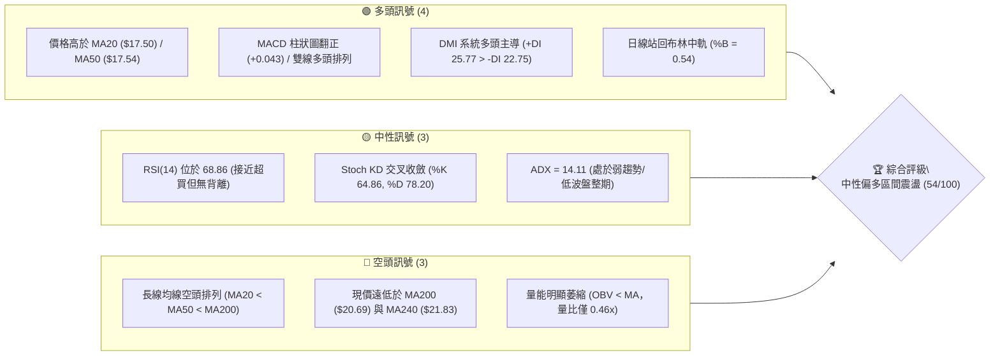
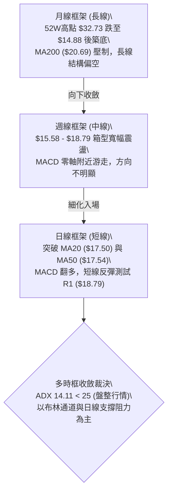
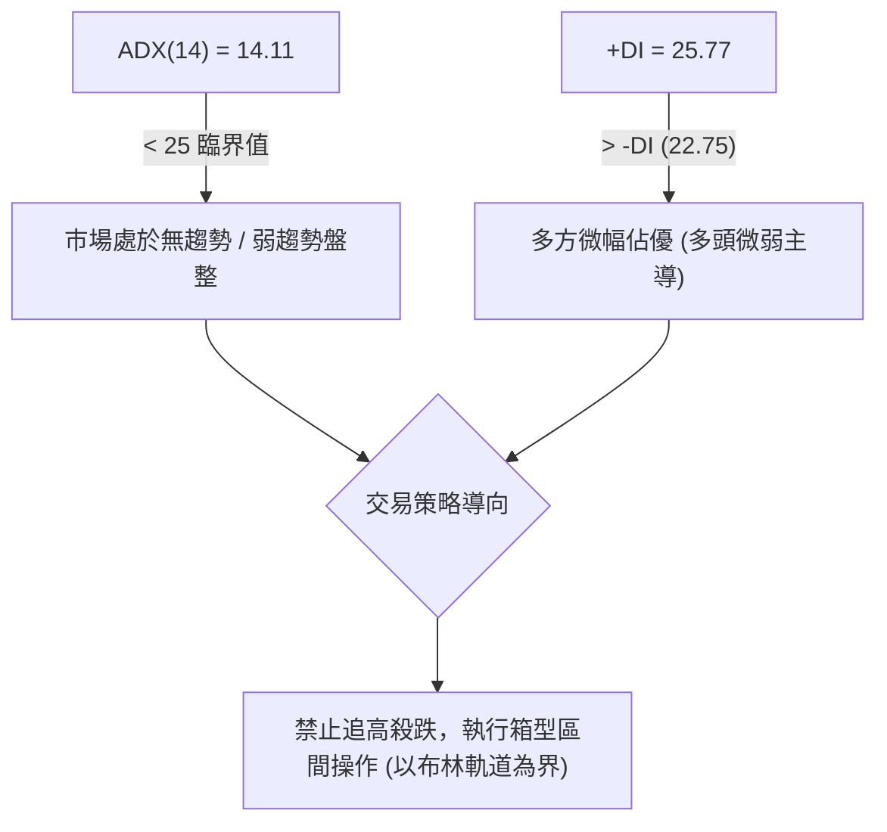
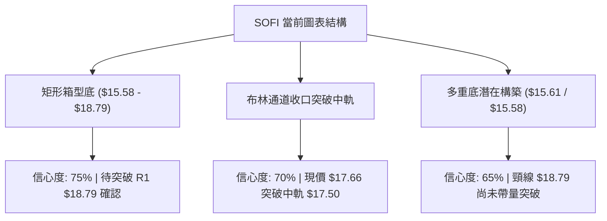
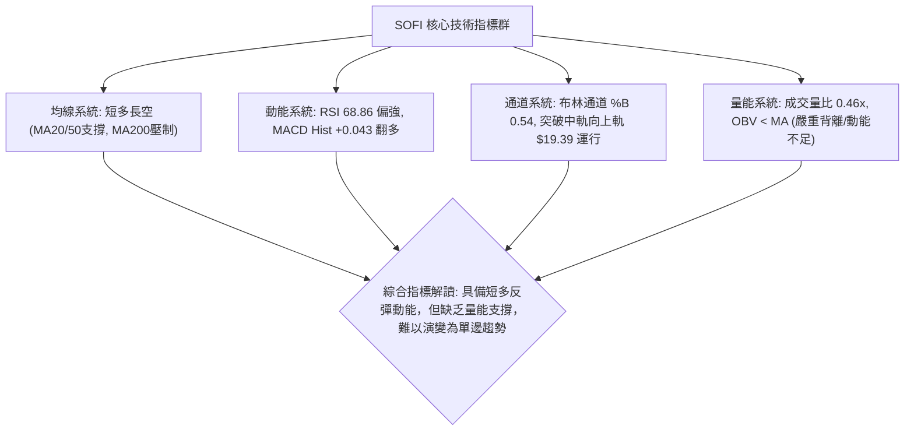
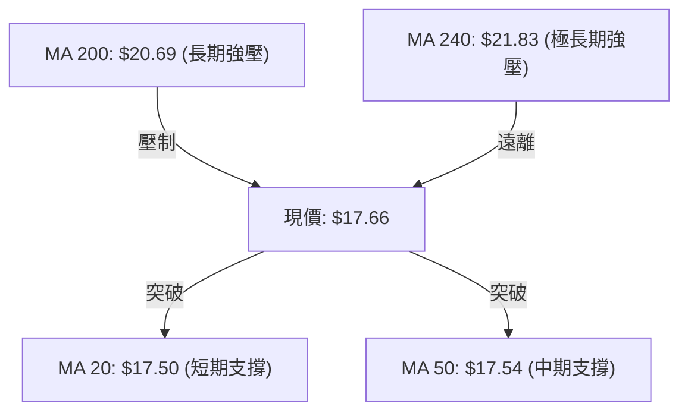
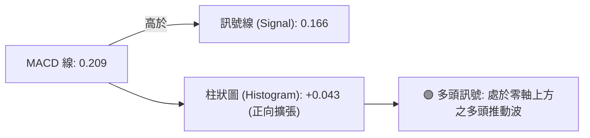
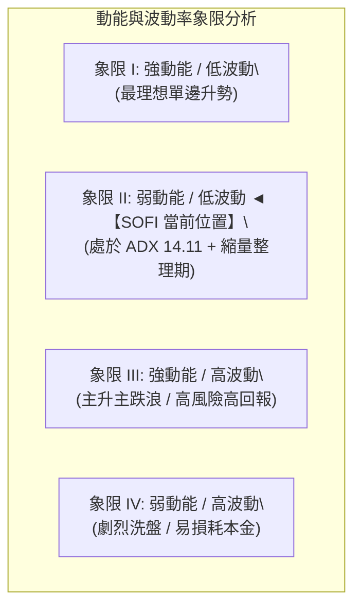
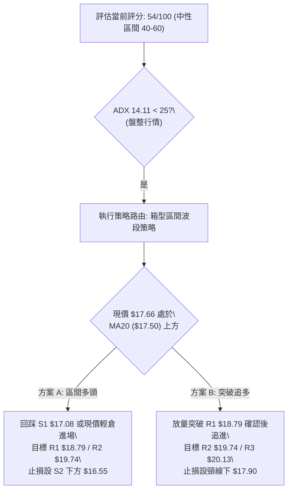
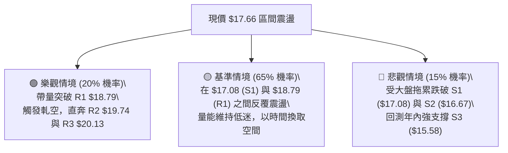

# SOFI 技術分析報告

> **報告日期**：2026-08-18 ｜ **語言**：繁體中文 ｜ **數據來源**：Yahoo Finance ｜ **當前價格**：$17.66

---

## 目錄

| 章節 | 內容 |
|------|------|
| [1. 技術面概覽](#1-技術面概覽) | 訊號儀表板、核心指標、評分卡 |
| [2. 趨勢分析](#2-趨勢分析) | 多時框趨勢、長中短期走勢、ADX解讀 |
| [3. 圖表形態分析](#3-圖表形態分析) | 形態識別、K線組合、目標價計算 |
| [4. 支撐與阻力](#4-支撐與阻力) | 關鍵價位、斐波那契回調深度分析 |
| [5. 技術指標深度解讀](#5-技術指標深度解讀) | MA/RSI/MACD/布林/量價配合 |
| [6. 動能與波動率](#6-動能與波動率) | 動能四象限、ATR波動率、Beta關聯 |
| [7. 多時框架總結](#7-多時框架總結) | 時框架評分矩陣與多時框收斂 |
| [8. 交易策略建議](#8-交易策略建議) | 策略路由、情境階梯、主策略詳解 |
| [9. 風險提示與監控](#9-風險提示與監控) | 監控Checklist、情境路徑、風控規則 |
| [📋 報告總結](#-報告總結) | 總結儀表板與核心結論速覽 |

---

## 1. 技術面概覽

### 🎯 技術訊號儀表板



---

### 📊 核心指標速覽表

| 指標類別 | 指標名稱 | 當前數值 | 訊號 | 解讀 |
|----------|----------|----------|:----:|------|
| **價格** | 當前價格 | $17.66 | 🟡 | 位於52週區間15.6%低位，短線脫離底部區間震盪 |
| **均線** | MA20 | $17.50 | 🟢 | 現價於MA20上方（+0.91%），短線多頭掌控 |
| **均線** | MA50 | $17.54 | 🟢 | 現價微幅突破MA50，確立短中期整理平台支撐 |
| **均線** | MA200 | $20.69 | 🔴 | 現價低於MA200（-14.64%），長期趨勢仍處空頭架構 |
| **動能** | RSI(14) | 68.86 | 🟡 | 處於強勢中性區間偏上限，尚未出現頂背離訊號 |
| **動能** | MACD | 0.209 (Hist +0.043) | 🟢 | MACD位於零軸上方且柱狀圖維持正值，多頭動能延續 |
| **趨勢** | ADX(14) | 14.11 (+DI > -DI) | 🟡 | ADX < 25 指示無強趨勢，屬於震盪盤整行情 |
| **通道** | 布林通道 | %B = 0.54 | 🟢 | 站上中軌 $17.50，朝上軌 $19.39 推進 |
| **量能** | 20日量比 | 0.46x (OBV < MA) | 🔴 | 成交量萎縮（3,133萬 vs 6,755萬均量），量價動能不足 |
| **波動** | ATR(14) | $0.74 (4.20%) | 🟡 | 每日平均波幅適中，提供明確的止損設定基準 |

---

### 🏆 技術評分卡

```
╔══════════════════════════════════════════════════════════════════╗
║                  技術評分卡 — SOFI (2026-08-18)                  ║
╠══════════════════════════════════════════════════════════════════╣
║ 趨勢強度 (ADX/方向)   ██████░░░░░░░░░░░░░░  30/100  🔴 盤整無主升║
║ 動能指標 (RSI/MACD)   ██████████████░░░░░░  70/100  🟢 短線動能佳║
║ 支撐穩定度 (S1/S2)    ██████████████░░░░░░  70/100  🟢 底部支撐實║
║ 成交量配合 (量比/OBV) ██████░░░░░░░░░░░░░░  30/100  🔴 量能疲弱  ║
║ 形態完整度 (箱型/突破)████████████░░░░░░░░  60/100  🟡 構築底部  ║
║ 均線排列 (多空結構)   ████████░░░░░░░░░░░░  45/100  🟡 長空短多  ║
╠══════════════════════════════════════════════════════════════════╣
║ 綜合技術評分          ███████████░░░░░░░░░  54/100  ⚖️ 區間中性  ║
╚══════════════════════════════════════════════════════════════════╝
```

---

## 2. 趨勢分析

### 🌐 多時框趨勢分析



---

### 📈 長期趨勢 — 12個月走勢圖（Unicode）

```
SOFI 月線收盤走勢圖（2025-08 至 2026-08）
價格軸 ($)
$30.00 ┤                            ● $29.72 (2025-11 高點區域)
$27.50 ┤                     ● $26.42
$25.00 ┤              ● $25.54      ● $26.18
$22.50 ┤                                   ● $22.81
$20.00 ┤                                          ● $18.22
$17.50 ┤● $17.66(起點)                            ● $17.76    ● $17.93  ● $17.66 (現在)
$15.00 ┤                                                 ● $15.88  ● $16.10  ● $16.31
       └──────────────────────────────────────────────────────────────────────────
        08/25 09/25  10/25  11/25  12/25  01/26  02/26  03/26  04/26  05/26  06/26  07/26  08/26
```

#### 走勢特徵分析表格

| 階段 | 期間 | 價格區間 | 累積漲跌 | 特徵與量價行為 |
|------|------|----------|----------|----------------|
| 1. 主升衝頂 | 2025-08 ~ 2025-11 | $25.54 → $29.72 | +16.37% | 連續4個月高位推進，於 $29.72 形成月線級別多重頂（52W高點達 $32.73） |
| 2. 深度回撤 | 2025-12 ~ 2026-03 | $26.18 → $15.88 | -39.34% | 斷崖式下跌，連續跌破整數關卡與 MA200，空方全面主導 |
| 3. 築底震盪 | 2026-04 ~ 2026-08 | $16.10 → $17.66 | +9.69%  | 價格在 $15.58 ~ $18.79 區間反覆洗盤，量能逐步萎縮，形成底部箱型 |

---

### 📊 中期趨勢（週線分析）

```
近期週線壓力與支撐結構示意圖
$20.13 ────────────────────────────── 強阻力 R3 / 接近 MA200
$19.74 ────────────────────────────── 阻力 R2 / 接近布林上軌
$18.79 ────────────────────────────── 關鍵阻力 R1 (斐波 78.6% $18.70)
$17.66 ══════════════════════════════ ◄ 當前收盤價 ($17.66)
$17.08 ------------------------------ 近期支撐 S1 (MA20/50 防線)
$16.67 ------------------------------ 結構支撐 S2
$15.58 ────────────────────────────── 強支撐 S3 (52W 低點聚類區 $14.88)
```

近20週數據顯示，收盤價自 2026-05-17 的波段低點 $15.61 逐步抬升，週線 MACD 柱狀圖在 2026-08 翻正（+0.181 → +0.112 → +0.043），顯示中期下跌動能已衰竭，轉入橫盤積蓄能量階段。

---

### ⚡ 趨勢強度評估（ADX 解讀）



#### ADX 數值強度對照表

| ADX 數值區間 | 當前讀數 (14.11) | 趨勢性質 | 操作指導原則 |
|--------------|:----------------:|----------|--------------|
| 0 ~ 20 | **✓ (極弱)** | 無方向橫盤震盪，均線交纏 | 嚴禁趨勢跟隨策略，改採震盪高拋低吸 |
| 20 ~ 25 | — | 弱趨勢醞釀期 | 觀察突破方向與成交量放大情況 |
| 25 ~ 50 | — | 強趨勢確立 | 順勢單邊操作，拉回均線加碼 |
| 50 ~ 100 | — | 極強/過熱趨勢 | 注意動能耗竭，隨時準備收割獲利 |

---

## 3. 圖表形態分析

### 🔍 形態識別系統



#### 圖表形態信心度與目標價評估表

| 形態名稱 | 信心度 | 判斷依據（引用數據） | 完成度 | 目標價（附嚴格計算式） |
|----------|:------:|----------------------|:------:|------------------------|
| **矩形箱型底** | 75% | 底部於 S3 ($15.58) 三次獲得支撐，頂部受壓於 R1 ($18.79) | 70% | 突破頸線 R1 ($18.79) + 箱高 ($18.79 - $15.58 = $3.21) = **$22.00**（受制於 R3 $20.13） |
| **潛在雙底 (W底)** | 65% | 兩次波段低點分別為 2026-05-17 之 $15.61 與 S3 之 $15.58 | 60% | 頸線 R1 ($18.79) + 形態高度 ($18.79 - $15.58 = $3.21) = **$22.00** |
| **布林通道均線突破** | 70% | 收盤價 $17.66 站穩布林中軌 $17.50，%B 達 0.54 | 85% | 測量目標為布林上軌 **$19.39**（鄰近阻力 R2 $19.74） |

---

### 🕯️ 重要K線形態分析

| 期間 | 收盤價 | K線形態特徵 | 技術解讀 | 訊號 |
|------|--------|-------------|----------|:----:|
| 2026-05-17 | $15.61 | 探底長下影線鎚子線 | 測試 52W 低點聚類區獲強勁買盤承接，確認底部支撐 | 🟢 |
| 2026-05-31 | $18.22 | 實體大陽線放量突破 | 短線空頭回補，一舉收復 MA20，確立反彈格局 | 🟢 |
| 2026-07-12 | $18.78 | 衝高回落十字星（受阻 R1） | 受阻於 $18.79 關鍵阻力，多頭量能未能延續 | 🔴 |
| 2026-08-09 | $18.38 | 底部反彈陽線包覆 | 自 S1 ($17.08) / S2 ($16.67) 快速拉回，多方防守積極 | 🟢 |
| 2026-08-23 | $17.66 | 縮量窄幅整理小陰線 | 於 MA20/MA50 上方縮量整固，等待突破動能 | 🟡 |

---

### 📉 ASCII 走勢形態示意圖

```
SOFI 近期箱型整理與雙底架構示意圖
$18.79 ──┬───────────────────● 高點 ($18.78) ─────────────── 箱頂 / 頸線 (R1)
         │                  / \                 /
$17.66 ──┼─────────────────/───\───────────────● 現價 ($17.66) 突破 MA20/50
         │   \            /     \             /
$16.67 ──┼────\──────────/───────\───────────/────────────── 支撐 (S2)
         │     \        /         \         /
$15.58 ──┴──────●──────/───────────●───────/──────────────── 雙底低點 (S3 / $15.61)
             第1底 (05/17)        第2底 (08/02)
```

---

### 🎯 形態目標價計算

依據標準幾何測量法則：
1. **箱型底/雙底高度 ($H$)**：
   $$H = \text{頸線 (R1)} - \text{形態低點 (S3)} = \$18.79 - \$15.58 = \$3.21$$
2. **第一突破目標價 ($T_1$)**：
   $$T_1 = \text{阻力位 R2} = \$19.74 \quad (\text{接近布林上軌 } \$19.39)$$
3. **第二形態量度目標價 ($T_2$)**：
   $$T_2 = \text{阻力位 R3} = \$20.13 \quad (\text{受限於 MA200 } \$20.69 \text{ 之強壓})$$
4. **理論完整形態目標價**：
   $$T_{\text{full}} = \text{頸線 } \$18.79 + H (\$3.21) = \$22.00$$

---

## 4. 支撐與阻力

### 🗺️ 關鍵價位分布圖（Unicode）

```
SOFI 價位結構分布圖
══════════════════════════════════════════════════════════════════
$20.69 ║██████████████████████████████║ 長期多空分水嶺 (MA200)
$20.13 ║████████████████████████      ║ 強阻力 R3 (+13.99%)
$19.74 ║████████████████████          ║ 阻力 R2 (+11.78%) / 近布林上軌
$18.79 ║██████████████████████████████║ 關鍵阻力 R1 (+6.37%) / 斐波 78.6%
$17.66 ╠══════════════════════════════╣ ◄ 當前收盤價 ($17.66)
$17.50 ║░░░░░░░░░░░░░░░░░░░░░░░░░░░░░░║ 短線均線防線 (MA20 $17.50 / MA50 $17.54)
$17.08 ║▓▓▓▓▓▓▓▓▓▓▓▓▓▓▓▓▓▓▓▓          ║ 近期支撐 S1 (-3.28%)
$16.67 ║████████████████████          ║ 結構支撐 S2 (-5.62%)
$15.58 ║██████████████████████████████║ 強支撐 S3 (-11.80%) / 52W 低點聚類
══════════════════════════════════════════════════════════════════
```

---

### 🚧 阻力位分析表

| 阻力級別 | 價位 | 距現價幅標 | 形成原因（依據數據） | 突破難度 | 重要性 |
|:--------:|:----:|:----------:|----------------------|:--------:|:------:|
| **R1** | **$18.79** | +6.37% | 近一年波段高點聚類、斐波那契 78.6% ($18.70) 重合區 | 中等 | 🟢 極高（箱頂頸線） |
| **R2** | **$19.74** | +11.78% | 近一年波段次高點聚類、鄰近布林上軌 ($19.39) | 偏高 | 🟡 中等（波段目標） |
| **R3** | **$20.13** | +13.99% | 近一年強阻力聚類、逼近 MA200 ($20.69) 長期生命線 | 極高 | 🔴 極高（趨勢反轉點） |

---

### 🛡️ 支撐位分析表

| 支撐級別 | 價位 | 距現價幅標 | 形成原因（依據數據） | 守住機率 | 重要性 |
|:--------:|:----:|:----------:|----------------------|:--------:|:------:|
| **S1** | **$17.08** | -3.28% | 近一年波段回調低點聚類、貼近 MA20 ($17.50)/MA50 ($17.54) | 75% | 🟢 短線生命線 |
| **S2** | **$16.67** | -5.62% | 近一年密集震盪成交密集區下緣 | 80% | 🟡 中期防禦位 |
| **S3** | **$15.58** | -11.80% | 52週波段低點聚類區（$14.88 ~ $15.61 多次止跌） | 90% | 🔴 長期底部底線 |

---

### 📐 斐波那契回調位分析

依據 52 週完整波動區間（低點 **$14.88** → 高點 **$32.73**），精確回調位分布如下：

```
斐波那契回調階梯 (52W High $32.73 → 52W Low $14.88)
 0.0% ─────────────────────────────────── $32.73 (52W 最高點)
23.6% ─────────────────────────────────── $28.52
38.2% ─────────────────────────────────── $25.91
50.0% ─────────────────────────────────── $23.80 (中樞分水嶺)
61.8% ─────────────────────────────────── $21.70 (黃金分割位)
78.6% ─────────────────────────────────── $18.70 (關鍵反彈阻力 ◄ 重合 R1 $18.79)
 === 現價 $17.66 位於 78.6% ($18.70) 與 100.0% ($14.88) 之間 ===
100.0% ─────────────────────────────────── $14.88 (52W 最低點)
```

- **位置解讀**：現價 $17.66 處於深次回調區間（78.6% 回調位下方）。此區間為歷史深谷吸籌區。
- **關鍵共振**：斐波那契 78.6% 回調位 **$18.70** 與關鍵阻力 **R1 $18.79** 形成極強的「價位共振帶」（僅差 $0.09）。若能放量突破此共振區，將正式打開朝 61.8% ($21.70) 與 MA200 ($20.69) 的反彈空間。

---

## 5. 技術指標深度解讀

### 🎛️ 指標訊號總覽



---

### 📈 移動平均線排列分析



#### 均線架構特徵解讀：
1. **短中期均線黃金交叉醞釀**：MA5 ($18.13) 與 MA10 ($18.15) 雖短線回調，但現價已站上 MA20 ($17.50)、MA50 ($17.54)、MA60 ($17.44) 與 MA120 ($17.27)，短中期均線於 $17.27 ~ $17.54 高度密集纏繞，提供現價強大的下方緩衝墊。
2. **長週期空頭排列仍未解除**：長線架構上，MA20 ($17.50) < MA50 ($17.54) < MA200 ($20.69) < MA240 ($21.83)，長期空頭壓制依然沉重，表明任何朝 $20.00 以上的推進均將面臨長線套牢盤解套拋壓。

---

### 📉 RSI(14) 分析

```
RSI(14) 當前讀數：68.86
超賣 (0)            中性平衡 (50)           超買 (70)           極端 (100)
├──────────────────────┼───────────────────────┼───────●──────────────┤
0                     50                      70    68.86            100
[███████████████████████████████████████████████░░░░░░░░] 68.86%
```

- **狀態解讀**：RSI(14) 報 **68.86**，處於強勢中性區間頂部，逼近 70 超買警戒線。
- **背離檢驗**：對比近期價格高點（2026-07-12 之 $18.78 對應 RSI 58.4；2026-08-09 之 $18.38 對應 RSI 58.0；現價 $17.66 對應 RSI 68.86），**未出現頂背離或底背離**。RSI 上升反映短期買盤推進速度加快，但需防範觸及 70 以上引發的技術性拉回。

---

### 📊 MACD(12/26/9) 訊號解讀



- **數值分析**：DIF (0.209) > DEA (0.166)，MACD 柱狀圖為 **+0.043**。
- **動能評估**：MACD 在零軸上方維持多頭排列，顯示日線級別多方仍掌控短期節奏。然而，柱狀圖自前期的 +0.181 逐步縮小至 +0.043，代表多頭進攻斜率已開始放緩，動能有鈍化跡象。

---

### 📦 布林通道分析

```
SOFI 日線布林通道 (20日, 2.0σ) 結構示意圖
$19.39 ────────────────────────────────────────── 布林上軌 (阻力空間)
                   ▲
                   │ 空間: +9.80%
                   ▼
$17.66 ══════════════════════════════════════════ 現價 ($17.66, %B = 0.54)
$17.50 ────────────────────────────────────────── 布林中軌 (MA20 支撐)
                   ▲
                   │ 空間: -10.65%
                   ▼
$15.62 ────────────────────────────────────────── 布林下軌 (波段強底)
```

- **位置與帶寬**：現價 $17.66 剛越過中軌 $17.50，**%B 數值為 0.54**，顯示價格已擺脫弱勢區進入通道上半部。
- **通道形態**：帶寬收窄後呈現水平均衡狀態，上軌 $19.39 與阻力 R2 ($19.74) 形成共振壓制，下軌 $15.62 則與支撐 S3 ($15.58) 形成共振支撐，再次印證當前為典型的布林帶寬區間震盪行情。

---

### 💹 成交量分析（量價配合度）

```
成交量動態評估
最新成交量: 31,336,788  [█████░░░░░░░░░░░░░░░] 31.3M
20日均量:   67,551,914  [███████████░░░░░░░░░] 67.6M (量比: 0.46x 🔴 嚴重縮量)
50日均量:   77,578,560  [█████████████░░░░░░░] 77.6M
```

- **量價背離分析**：現價自 $16.31 反彈至 $17.66，但成交量卻由 4.83 億（週量）銳減至 1.01 億（週量），日量比僅 0.46x，呈現典型的「**價漲量縮**」背離格局。
- **OBV 能量潮解讀**：數據明確顯示 **OBV < MA**，代表主力資金在此波反彈中並未大舉加倉，量能疲弱將制約股價向上突破 R1 ($18.79) 的持續力。

---

## 6. 動能與波動率

### ⚡ 動能評估四象限



| 象限 | 動能維度 | 波動維度 | 當前狀態 | 技術評估與操作對策 |
|:----:|:--------:|:--------:|:--------:|--------------------|
| Q1 | 強 | 低 | — | 穩定單邊趨勢，最適合持股續抱 |
| **Q2** | **弱** | **低** | **✓ (SOFI)** | **震盪築底階段，波動率受壓，建議以區間網格或箱型低吸高拋應對** |
| Q3 | 強 | 高 | — | 突破爆發階段，適合追突破並嚴設移動止損 |
| Q4 | 弱 | 高 | — | 無序混亂洗盤，應避免頻繁進出場 |

---

### 📊 ATR 波動率分析

```
ATR(14) 數值: $0.74 (佔股價 4.20%)
單日預期波動區間:
  ▲ 上檔極限: $17.66 + $0.74 = $18.40
  ▼ 下檔極限: $17.66 - $0.74 = $16.92
```

- **止損距離建議**：
  - **保守型交易（2.0 × ATR）**：止損幅度設為 $\$0.74 \times 2.0 = \$1.48$，對應現價止損位為 **$16.18**。
  - **進取型交易（1.5 × ATR）**：止損幅度設為 $\$0.74 \times 1.5 = \$1.11$，對應現價止損位為 **$16.55**（略低於支撐 S2 $16.67）。
  - **緊密型交易（1.0 × ATR）**：止損幅度設為 $\$0.74 \times 1.0 = \$0.74$，對應現價止損位為 **$16.92**（剛好保護在支撐 S1 $17.08 之下）。

---

### 📐 Beta 與市場相關性

- **Beta 係數**：**2.204**（極高 Beta 屬性）。
- **市場敏感情境**：SOFI 的波動幅度約為標普500大盤的 2.2 倍。當大盤指數上漲 1% 時，SOFI 預期上漲 2.2%；當大盤回調 1% 時，SOFI 預期下挫 2.2%。
- **空單比例 (Short Interest)**：Short % Float 達 **15.0%**（Short Ratio 2.22）。高放空比例意味著一旦股價帶量突破頸線 R1 ($18.79)，極易觸發空頭回補軋空行情（Short Squeeze）。

---

## 7. 多時框架總結

### 📋 時框架評分表

| 時框架 | 趨勢方向 | 動能狀態 | 均線排列 | 形態結構 | 綜合評分 | 操作建議 |
|--------|:--------:|:--------:|:--------:|:--------:|:--------:|----------|
| **月線 (長期)** | 🔴 偏空 | 弱勢築底 | 空頭 (MA200壓制) | 深幅回撤後整理 | 40/100 | 長線投資者等待站穩 MA200 |
| **週線 (中期)** | 🟡 震盪 | 柱狀圖翻多 | 均線橫向糾結 | $15.58-$18.79 箱型 | 55/100 | 箱型區間操作，高拋低吸 |
| **日線 (短期)** | 🟢 偏多 | RSI 68.9 偏強 | 突破 MA20/MA50 | 突破中軌朝上軌推進 | 65/100 | 短線順勢做多，目標 R1/R2 |

---

### 🔲 綜合訊號矩陣

```
╔══════════════════════════════════════════════════════════════════╗
║                     SOFI 多時框綜合訊號矩陣                      ║
╠══════════════╦══════════════╦══════════════╦═════════════════════╣
║ 維度         ║ 短期 (日線)  ║ 中期 (週線)  ║ 長期 (月線)         ║
╠══════════════╬══════════════╬══════════════╬═════════════════════╣
║ 趨勢方向     ║ 🟢 偏多反彈  ║ 🟡 橫向震盪  ║ 🔴 空頭承壓         ║
║ 動能指標     ║ 🟢 MACD看多  ║ 🟡 動能收斂  ║ 🔴 RSI偏弱          ║
║ 均線結構     ║ 🟢 站上MA20  ║ 🟡 MA50糾纏  ║ 🔴 遠低於MA200      ║
║ 關鍵價位     ║ 測試 R1$18.79║ 區間 S3-R1   ║ 斐波 78.6% 承壓     ║
║ 成交量配合   ║ 🔴 嚴重縮量  ║ 🔴 量能萎縮  ║ 🟡 底部縮量         ║
╚══════════════╩══════════════╩══════════════╩═════════════════════╝
```

---

### ⚖️ 多時框收斂結論

> **依據「嚴格要求 14」之多時框收斂規則：**
> 1. **趨勢/盤整判定**：當前 ADX(14) = **14.11 < 25**，嚴格定義當前市場處於**「盤整行情」**而非趨勢行情。
> 2. **主導規則**：在盤整行情下，不宜採用長線趨勢跟隨，應以**日線布林通道上下軌與關鍵支撐/阻力位**作為主要交易依據。
> 3. **方向性唯一結論**：**【中性偏多區間震盪（評分 54/100）】**。短線具備向上測試布林上軌 ($19.39) 與關鍵阻力 R1 ($18.79) 的動能，但受限於量能不足（量比 0.46x）與長期 MA200 壓制，無法演變為中長期單邊暴漲，操作應嚴格恪守區間波段原則。

---

## 8. 交易策略建議

### 🗺️ 策略決策流程圖



---

### 🧭 策略路由

**當前主策略方向 = 【中性偏多區間操作，主推拉回低吸與突破多頭策略（評分 54/100）】**

---

### 🎯 價格情境階梯（Price Scenarios）

| 觸發條件 | 下一目標 | 後續延伸 | 情境含義與操作對策 |
|----------|:--------:|:--------:|--------------------|
| **強勢突破 R1 ($18.79)** | R2 ($19.74) | R3 ($20.13) | 短線轉強，矩形底完成，空頭回補觸發，順勢追多 |
| **站穩現價區間 ($17.50~$18.00)** | R1 ($18.79) | R2 ($19.74) | 區間震盪偏多，持股續抱，等待朝布林上軌測試 |
| **跌破 S1 ($17.08)** | S2 ($16.67) | S3 ($15.58) | 短線轉弱，跌破均線防線，多單減碼或停損觀望 |

---

### 📊 情境機率分佈

| 情境 | 機率 | 主要依據（指標狀態） |
|------|:----:|----------------------|
| **情境一：震盪上行測試 R1/R2** | **55%** | MACD維持正柱狀圖 (+0.043)、站上布林中軌 (%B 0.54)、+DI > -DI |
| **情境二：箱型內部橫盤整理** | **30%** | ADX = 14.11 極度低迷、成交量萎縮 (量比 0.46x)、OBV 疲弱 |
| **情境三：跌破均線再次探底** | **15%** | 長期均線 MA200 空頭排列壓制、Beta 2.204 受大盤拉回拖累 |

---

### 🟢 主策略詳情

本報告依據技術評分 54/100，制定兩套精確之多頭操作策略：

| 策略要素 | 策略 A（現價/回踩低吸 — 區間波段） | 策略 B（帶量突破追多 — 動能突破） |
|----------|------------------------------------|-----------------------------------|
| **策略類型** | 順日線動能，於支撐區低吸 | 突破關鍵頸線共振區之順勢交易 |
| **進場條件** | 現價 $17.66 輕倉或回踩 S1 $17.08 止跌 | 日K收盤價突破 R1 $18.79 且日成交量 > 6,700萬 |
| **進場價格** | **$17.66**（回踩加碼點 **$17.15**） | **$18.85** |
| **目標價 T1** | **$18.79**（關鍵阻力 R1，預期 +6.4%） | **$19.74**（阻力 R2 / 近布林上軌，+4.7%） |
| **目標價 T2** | **$19.74**（阻力 R2，預期 +11.8%） | **$20.13**（強阻力 R3 / 逼近MA200，+6.8%） |
| **止損價格** | **$16.55**（跌破 S2 $16.67 及 1.5 ATR）| **$17.90**（跌回頸線下方，保護利潤） |
| **風險報酬比** | **1 : 1.87**（以 T2 計算） | **$0.95 空間 vs $1.28 獲利 = 1 : 1.35** |
| **成功機率** | **60%** | **55%** |
| **建議倉位** | **10% ~ 15%** 總資金 | **10%** 總資金 |

---

### 🔴 反向風險觸發點（對沖提示）

若出現以下訊號，代表多頭結構完全破壞，主策略立即失效，應全數清倉多單並考慮反手避險：
1. **關鍵支撐失守**：日K收盤價跌破 **S2 ($16.67)**，意味著短中期均線全面失守。
2. **極端破位**：跌破 52 週底部強支撐 **S3 ($15.58)**，確認形態向下破位，將下探 52W 低點 $14.88 甚至更低。
3. **空頭對沖點位**：跌破 $16.67 時建立空頭部位，目標下看 **$15.58**，止損設於 **$17.15**。

---

### ⭐ 整體訊號強度評星

```
做多訊號強度：★★★☆☆  (3.0/5星 — 短線動能向好，但受制於量能與長線均線)
做空訊號強度：★★☆☆☆  (2.0/5星 — 底部支撐紮實，短期無直接下行破位訊號)
整體可信度：  ★★★★☆  (4.0/5星 — 價位聚類與布林通道結構清晰)
```

---

## 9. 風險提示與監控

### ✅ 關鍵監控指標 Checklist

```
╔══════════════════════════════════════════════════════════════════╗
║                  交易員每日盤面監控清單 (Checklist)               ║
╠══════════════════════════════════════════════════════════════════╣
║ [ ] 價格是否維持在 MA20 ($17.50) / MA50 ($17.54) 之上？          ║
║ [ ] 日成交量是否放大至 20日均量 (6,755萬股) 以上？               ║
║ [ ] RSI(14) 是否突破 70 進入超買，或跌破 50 轉弱？               ║
║ [ ] MACD 柱狀圖是否維持正值 (目前 +0.043)？                      ║
║ [ ] 價格觸及 R1 ($18.79) 時是否出現滯漲長上影線？                ║
║ [ ] 跌破 S1 ($17.08) 時是否觸發移動止損預警？                    ║
╚══════════════════════════════════════════════════════════════════╝
```

---

### ⚠️ 風險場景分析



---

### 🛡️ 風險管理重要提醒

1. **高 Beta 波動控制**：SOFI Beta 高達 **2.204**，極易受美股整體金融科技板塊與大盤波動放大影響。單一標的倉位上限嚴格控制在總投資組合的 **15% 以內**。
2. **嚴禁在阻力區追高**：當前距離 R1 ($18.79) 僅剩 +6.37% 空間，且成交量不足。在未確認帶量突破前，嚴禁在 $18.50 以上盲目追漲。
3. **止損紀律執行**：嚴格執行 ATR 止損機制，多單跌破 **$16.55** 必須無條件停損，防止深幅回撤重演。

---

## 📋 報告總結

```
╔══════════════════════════════════════════════════════════════════╗
║                     SOFI 技術分析報告總結                        ║
╠══════════════════════════════════════════════════════════════════╣
║ 報告日期：2026-08-18                                             ║
║ 當前價格：$17.66 (位於52週區間 15.6% 低位)                       ║
║ 分析評級：⚖️ 中性偏多區間震盪 (綜合評分 54/100)                  ║
╠══════════════════════════════════════════════════════════════════╣
║ 關鍵結論：                                                       ║
║ ├─ 長期趨勢：🔴 偏空受制 (MA200 $20.69 / MA240 $21.83 壓制)       ║
║ ├─ 中期趨勢：🟡 築底震盪 (處於 $15.58 ~ $18.79 矩形箱型中)        ║
║ ├─ 短期趨勢：🟢 偏多反彈 (站穩 MA20 $17.50 與 MA50 $17.54)        ║
║ ├─ 關鍵阻力：R1 $18.79 ｜ R2 $19.74 ｜ R3 $20.13                 ║
║ ├─ 關鍵支撐：S1 $17.08 ｜ S2 $16.67 ｜ S3 $15.58                 ║
║ └─ 分析師目標價：均價 $20.02 (最低 $12.00 / 最高 $30.00)          ║
╠══════════════════════════════════════════════════════════════════╣
║ 最優策略組合：                                                   ║
║ 1. 🥇 最佳機會：現價 $17.66 / 回踩 $17.15 建立波段多單，          ║
║                 目標 R1 $18.79 / R2 $19.74，止損設 $16.55。      ║
║ 2. 🥈 次選機會：放量突破 R1 $18.79 後追多，目標看 R2 $19.74，     ║
║                 止損設 $17.90。                                  ║
║ 3. 🥉 保守選擇：於箱型上軌 R1 ($18.79) 附近獲利了結，             ║
║                 耐心等待拉回 S1 ($17.08) 附近再行低吸。           ║
╚══════════════════════════════════════════════════════════════════╝
```

---

> ⚠️ **免責聲明**：本報告為 AI 自動生成之技術分析，所有數據及估算均基於提供的歷史價格資訊。本報告**僅供研究與學術參考**，**不構成任何投資建議**。投資有風險，入市需謹慎。

---

*報告生成時間：2026-08-18 ｜ 數據來源：Yahoo Finance ｜ 分析框架：多時框技術分析*