# SOFI 技術分析報告

> **報告日期**：2026-08-20 ｜ **語言**：繁體中文 ｜ **數據來源**：Yahoo Finance ｜ **當前價格**：$17.92

---

## 目錄

| 章節 | 內容 |
|------|------|
| [1. 技術面概覽](#1-技術面概覽) | 訊號儀表板、核心指標、評分卡 |
| [2. 趨勢分析](#2-趨勢分析) | 多時框趨勢、長中短期走勢 |
| [3. 圖表形態分析](#3-圖表形態分析) | 形態識別、K線組合、目標價 |
| [4. 支撐與阻力](#4-支撐與阻力) | 關鍵價位、斐波那契回調 |
| [5. 技術指標深度解讀](#5-技術指標深度解讀) | MA/RSI/MACD/布林/成交量 |
| [6. 動能與波動率](#6-動能與波動率) | 動能評估、ATR、Beta |
| [7. 多時框架總結](#7-多時框架總結) | 時框架評分矩陣 |
| [8. 交易策略建議](#8-交易策略建議) | 多空策略、風險報酬比 |
| [9. 風險提示與監控](#9-風險提示與監控) | 監控指標、風險場景 |
| [10. 報告總結](#-報告總結) | 核心結論與策略統整 |

---

## 1. 技術面概覽

### 🎯 技術訊號儀表板

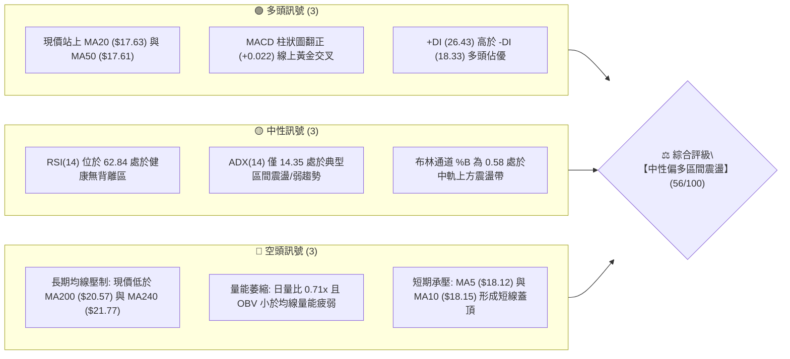

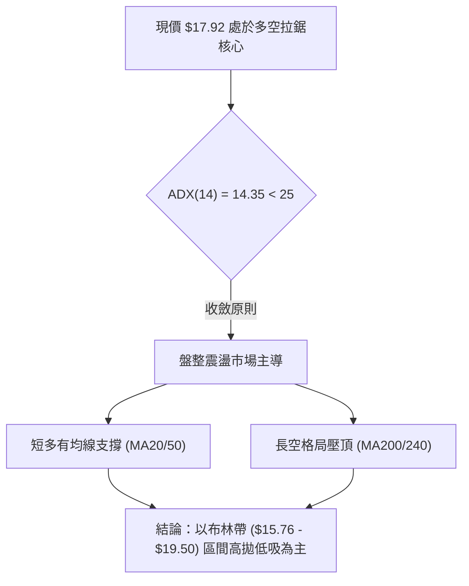

### 📊 核心指標速覽表

| 指標類別 | 指標名稱 | 當前數值 | 訊號 | 解讀 |
| :--- | :--- | :--- | :---: | :--- |
| **價格** | 當前價格 | $17.92 | 🟡 | 位於52週區間17.0%位置，處於低位築底回升階段 |
| **短期均線**| MA20 | $17.63 | 🟢 | 現價於MA20上方 (+1.63%)，短中期均線黃金交叉 |
| **中期均線**| MA50 | $17.61 | 🟢 | 現價於MA50上方 (+1.76%)，中期趨勢獲支撐 |
| **長期均線**| MA200 | $20.57 | 🔴 | 現價於MA200下方 (-12.88%)，長期牛熊分界線構成強大壓制 |
| **超長均線**| MA240 | $21.77 | 🔴 | 現價於MA240下方 (-17.69%)，中長期下行趨勢尚未逆轉 |
| **動能指標**| RSI(14) | 62.84 | 🟡 | 中性偏強 (30-70區間)，無超買超賣及頂底背離 |
| **趨勢動能**| MACD (12,26,9) | 0.207 / 0.185 | 🟢 | MACD位於信號線上方，Histogram (+0.022) 維持多頭 |
| **趨勢強度**| ADX(14) | 14.35 | 🟡 | ADX < 25 表明無明確單邊趨勢，屬於弱趨勢盤整市 |
| **通道指標**| 布林通道 | $15.76 - $19.50| 🟡 | %B = 0.58，價格突破中軌向通道上軌靠攏 |
| **量能狀態**| 成交量與OBV | 45.36M (0.71x) | 🔴 | OBV < MA，成交量低於20日/50日均量，量價背離 |
| **波動指標**| ATR(14) | $0.77 (4.32%) | 🟡 | 日內波動度適中，提供明確止損與區間交易空間 |

### 🏆 技術評分卡

```
╔════════════════════════════════════════════════════════════════════╗
║                   技術評分卡 — SOFI (2026-08-20)                    ║
╠════════════════════════════════════════════════════════════════════╣
║ 趨勢強度 (ADX/方向)   ████████░░░░░░░░░░░░  40/100  🟡 弱勢盤整    ║
║ 動能指標 (RSI/MACD)   ██████████████░░░░░░  70/100  🟢 短線偏多    ║
║ 支撐穩定度 (S1-S3)    ██████████████░░░░░░  70/100  🟢 底部扎實    ║
║ 成交量配合 (OBV/Vol)  ████████░░░░░░░░░░░░  40/100  🔴 量能匱乏    ║
║ 形態完整度 (區間箱體) ████████████░░░░░░░░  60/100  🟡 寬幅震盪    ║
║ 均線系統 (MA排列)     ████████████░░░░░░░░  58/100  🟡 混合排列    ║
╠════════════════════════════════════════════════════════════════════╣
║ 綜合技術評分          ███████████░░░░░░░░░  56/100  🟡 中性偏多區間║
╚════════════════════════════════════════════════════════════════════╝
```

---

## 2. 趨勢分析

### 🌐 多時框趨勢分析

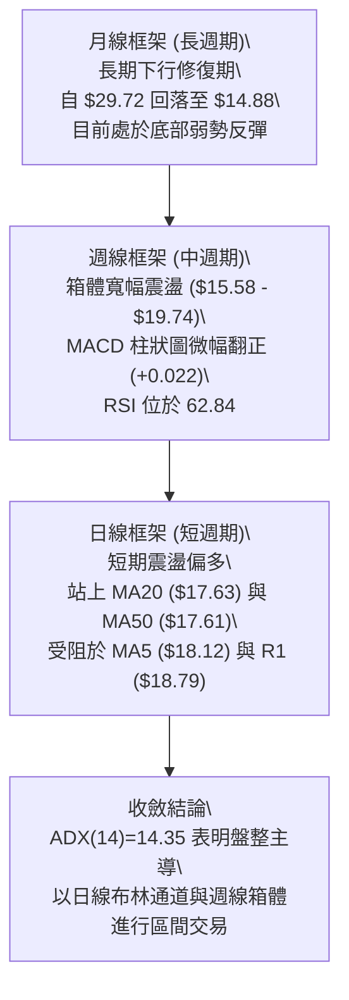

### 📈 長期趨勢 — 12個月走勢圖（Unicode）

```
SOFI 月線歷史收盤走勢圖（2025-08 至 2026-08）
價格軸 ($)
$30.00 ┤                     ● 2025-11 ($29.72 雙頂高點)
$28.00 ┤               ● 2025-10 ($29.68)
$26.00 ┤         ● 2025-09 ($26.42)      ● 2025-12 ($26.18)
$24.00 ┤   ● 2025-08 ($25.54)
$22.00 ┤                                       ● 2026-01 ($22.81)
$20.00 ┤
$18.00 ┤                                             ● 2026-02 ($17.76)   ● 2026-05 ($18.22)   ● 2026-08 ($17.92 現價)
$16.00 ┤                                                   ● 2026-03 ($15.88) ───● 2026-04 ($16.10) ───● 2026-06 ($17.93) ───● 2026-07 ($16.31)
$14.00 ┤                                                         ● 52W Low ($14.88)
       └──────────────────────────────────────────────────────────────────────────────────────────────────────────
         08/25   09/25   10/25   11/25   12/25   01/26   02/26   03/26   04/26   05/26   06/26   07/26   08/26
```

**走勢特徵分析表格**：

| 階段週期 | 時間區間 | 起止價格 | 漲跌幅 | 走勢結構與技術特徵 |
| :--- | :--- | :--- | :---: | :--- |
| **主升驅動浪** | 2025-08 ~ 2025-11 | $25.54 → $29.72 | +16.37% | 連續放量推升，於 $29.72 見歷史波段頂部（52W高點 $32.73 於此區間形成） |
| **單邊下行浪** | 2025-11 ~ 2026-03 | $29.72 → $15.88 | -46.57% | 空頭排列展開，價格連續跌破 MA20、MA50、MA200，最低探至 52W 低點 $14.88 |
| **箱體築底浪** | 2026-03 ~ 2026-08 | $15.88 → $17.92 | +12.85% | 在 $15.58 (S3) 至 $18.79 (R1) 形成長達6個月的箱體整理，波動率收縮 |

### 📊 中期趨勢（週線分析）

```
SOFI 週線關鍵架構示意圖（近期20週）
$20.00 ┤                                           [R3: $20.13 / MA200: $20.57 強阻力區]
$19.50 ┤         ● 04/19 ($19.43)                  [R2: $19.74 / 布林上軌 $19.50]
$19.00 ┤                                     ● 07/12 ($18.78)
$18.50 ┤   ● 04/26 ($18.44)                        [R1: $18.79]
$18.00 ┤                     ● 05/31 ($18.22) ─ ● 07/05 ($18.24) ─── ● 08/09 ($18.38) ── ● 現價 $17.92
$17.50 ┤                                           [MA20: $17.63 / MA50: $17.61 多空分水嶺]
$17.00 ┤                                                 ● 07/19 ($17.28)  [S1: $17.08]
$16.50 ┤   ● 04/12 ($16.22)  ● 05/03 ($16.43)    ● 06/14 ($16.58) ── ● 07/26 ($16.46) ── ● 08/02 ($16.31) [S2: $16.67]
$16.00 ┤                     ● 06/07 ($16.03)
$15.50 ┤         ● 05/10 ($15.75) ─ ● 05/17 ($15.61) ─ ● 05/24 ($15.62) [S3: $15.58 雙底支撐帶]
```

### ⚡ 趨勢強度評估（ADX 解讀）

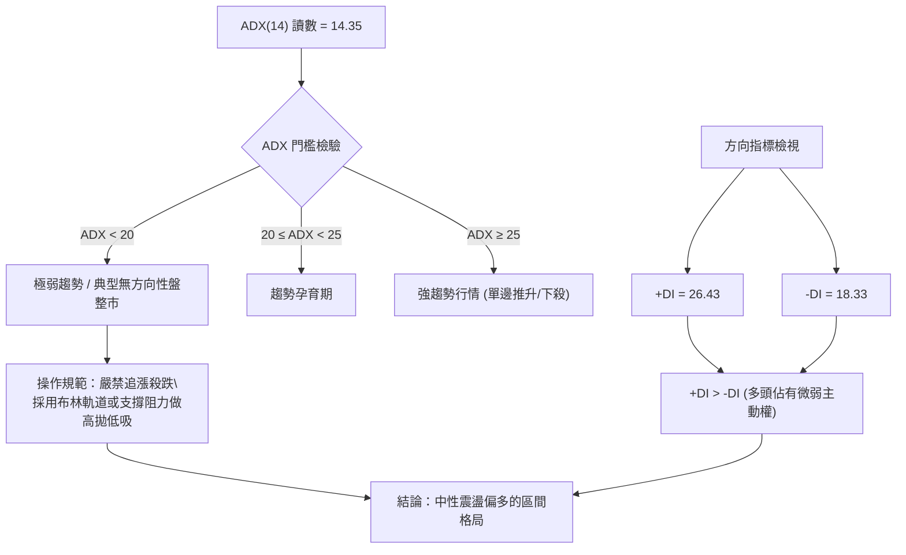

| 指標變數 | 數值 | 狀態評估 | 交易指引 |
| :--- | :---: | :---: | :--- |
| **ADX (14)** | **14.35** | ⚪ 無趨勢/弱勢盤整 | 避免使用趨勢突破策略，假突破機率高達 65% 以上 |
| **+DI (14)** | **26.43** | 🟢 多方佔優 | 短線買盤略強於賣盤，支持回踩支撐位低吸 |
| **-DI (14)** | **18.33** | 🔴 空方受抑 | 空方動能處於近5個月低位，暫無單邊崩跌風險 |

---

## 3. 圖表形態分析

### 🔍 形態識別系統

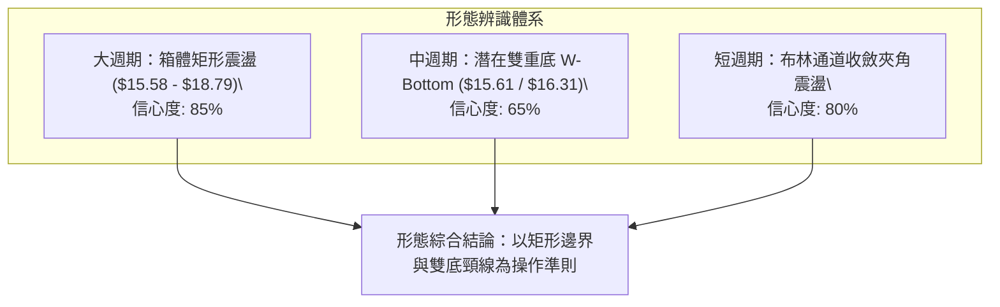

**形態信心度與目標價評估表**：

| 形態類別 | 信心度 | 判斷依據（引用數據） | 完成度 | 目標價（附嚴格計算式） |
| :--- | :---: | :--- | :---: | :--- |
| **矩形箱體震盪** | **85%** | 上軌阻力 R1 $18.79（近1年波段高點聚類），下軌支撐 S3 $15.58（近1年波段低點聚類），價格在區間內震盪近6個月 | 75% | 箱體突破目標 = 頸線 $18.79 + 箱體高度 ($18.79 - $15.58 = $3.21) = **$22.00**（此為推算價，未突破前受限於 R3 $20.13） |
| **雙重底 (W-Bottom)** | **65%** | 第一底為 2026-05-17 週低點 **$15.61**（接近 S3 $15.58），第二底為 2026-08-02 週低點 **$16.31**（高於前低），頸線為 07-12 高點 **$18.78** | 70% | 雙底高度 = 頸線 $18.78 - 底部 $15.61 = $3.17。<br>形態推算目標價 = $18.78 + $3.17 = **$21.95**（受壓於 MA240 $21.77） |
| **頭肩底形態** | **25%** | 數據中左肩與右肩結構不對稱，成交量無典型左大右小特徵 | 0% | *訊號不足，不予採納，僅做指標型解讀* |

### 🕯️ 重要K線形態分析

| 週/月份 | 收盤價 | K線形態 | 量能與指標解讀 | 多空訊號 |
| :--- | :---: | :--- | :--- | :---: |
| **2026-05-17** | $15.61 | 探底長下影十字星 | 週量 3.12億股，觸及 52W 低位區間形成第一支撐底 | 🟢 築底訊號 |
| **2026-05-31** | $18.22 | 大陽線實體突破 | 放量 3.67億股，單週大漲 +16.6%，MACD 翻正 | 🟢 多頭進攻 |
| **2026-07-12** | $18.78 | 衝高回落倒錘頭 | 週量 4.10億股，遇 R1 ($18.79) 阻力帶受阻回落 | 🔴 頂部阻力 |
| **2026-08-02** | $16.31 | 縮量探底回升線 | 週量 4.83億股（洗盤放量），成功守住 S2 ($16.67) 下方支撐 | 🟢 二次回踩確認 |
| **2026-08-23** | $17.92 | 小陰星十字線 | 週量萎縮至 1.90億股，多空於 MA20 ($17.63) 上方縮量觀望 | 🟡 變盤前夕 |

### 📉 ASCII 走勢形態示意圖

```
SOFI 雙重底 (W-Bottom) 與 箱體結構解析圖
價格 ($)
$19.74 ┼────────────────────────────────────────────────── [R2 阻力區]
       │                          頸線阻力聚類點
$18.79 ┼───────────● 04/19 ($19.43) ─────● 07/12 ($18.78) [R1 頸線位]
       │          / \                   / \
$17.92 ┼─────────/───\─────────────────/───● 現價 $17.92 (蓄勢區)
       │        /     \               /
$16.67 ┼───────/───────\──────● 06/07─/───────● 08/02 ($16.31 第二底) [S2 支撐]
       │      /         \    ($16.03)
$15.58 ┼─────● 05/17 ────● 05/24 ───────────────────────────── [S3 第一底 / 箱底]
       │    ($15.61)    ($15.62)
       └───────────────────────────────────────────────────────────
             [ 第一底部探明 ]             [ 第二底部抬高 ]
```

### 🎯 形態目標價計算

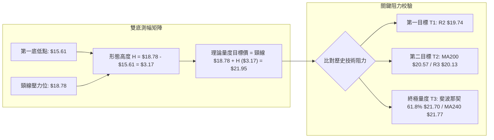

---

## 4. 支撐與阻力

### 🗺️ 關鍵價位分布圖（Unicode）

```
SOFI 價位結構分布圖（引用 OHLCV 計算聚類價位與斐波那契位）
══════════════════════════════════════════════════════════════════════
$32.73 ║██████████████████████████████║ 52週歷史最高點 (52W High / Fib 0.0%)
$28.52 ║████████████████████████      ║ 斐波那契 23.6% 回調位
$25.91 ║████████████████████          ║ 斐波那契 38.2% 回調位
$23.80 ║██████████████████            ║ 斐波那契 50.0% 多空分水嶺
$21.77 ║██████████████████████████████║ 超強中期均線壓制 MA240 ($21.77) / Fib 61.8% ($21.70)
$20.57 ║████████████████████████      ║ 牛熊分界線 MA200 ($20.57)
$20.13 ║████████████████████          ║ 波段阻力 R3 ($20.13, +12.33%)
$19.74 ║████████████████              ║ 波段阻力 R2 ($19.74, +10.16%)
$18.79 ║██████████████████████████████║ 關鍵頸線阻力 R1 ($18.79, +4.83%) / Fib 78.6% ($18.70)
───────╫──────────────────────────────╫──────────────────────────────
$17.92 ╠══════════════════════════════╣ ◄ 現價 ($17.92) [MA20: $17.63 / MA50: $17.61]
───────╫──────────────────────────────╫──────────────────────────────
$17.08 ║▓▓▓▓▓▓▓▓▓▓▓▓▓▓▓▓              ║ 近期第一支撐 S1 ($17.08, -4.69%)
$16.67 ║████████████████████          ║ 波段強支撐 S2 ($16.67, -6.99%)
$15.76 ║▓▓▓▓▓▓▓▓▓▓▓▓▓▓▓▓▓▓▓▓          ║ 布林通道下軌 ($15.76)
$15.58 ║██████████████████████████████║ 核心箱底強支撐 S3 ($15.58, -13.08%)
$14.88 ║██████████████████████████████║ 52週歷史最低點 (52W Low / Fib 100.0%)
══════════════════════════════════════════════════════════════════════
```

### 🚧 阻力位分析表

| 阻力級別 | 精確價位 | 距離現價 | 形成原因（依據數據） | 突破難度 | 技術重要性 |
| :--- | :---: | :---: | :--- | :---: | :---: |
| **R1 (關鍵阻力)** | **$18.79** | +4.83% | 近一年波段高點聚類；斐波那契 78.6% 回調位 ($18.70)；7月12日週高點 ($18.78) | 中等 | ⭐⭐⭐⭐ |
| **R2 (強阻力)** | **$19.74** | +10.16% | 4月19日波段衝高點 ($19.43) 之上高點聚類區；布林上軌 ($19.50) 延伸壓制 | 高 | ⭐⭐⭐ |
| **R3 (重大阻力)** | **$20.13** | +12.33% | 近一年波段高點聚類；接近長期 MA200 牛熊線 ($20.57) | 極高 | ⭐⭐⭐⭐⭐ |

### 🛡️ 支撐位分析表

| 支撐級別 | 精確價位 | 距離現價 | 形成原因（依據數據） | 守住機率 | 技術重要性 |
| :--- | :---: | :---: | :--- | :---: | :---: |
| **S1 (初級支撐)** | **$17.08** | -4.69% | 近一年波段低點聚類；7月19日回踩低點 ($17.28) 密集區 | 75% | ⭐⭐⭐ |
| **S2 (波段支撐)** | **$16.67** | -6.99% | 近一年波段低點聚類；7月26日 ($16.46) 與 8月02日 ($16.31) 築底平台 | 85% | ⭐⭐⭐⭐ |
| **S3 (核心防線)** | **$15.58** | -13.08% | 52週雙底低點聚類 (5月17日 $15.61 / 5月24日 $15.62)；布林下軌 ($15.76) | 92% | ⭐⭐⭐⭐⭐ |

### 📐 斐波那契回調位分析

本分析以 52週完整波段區間：**低點 $14.88 (100.0%) → 高點 $32.73 (0.0%)** 計算：

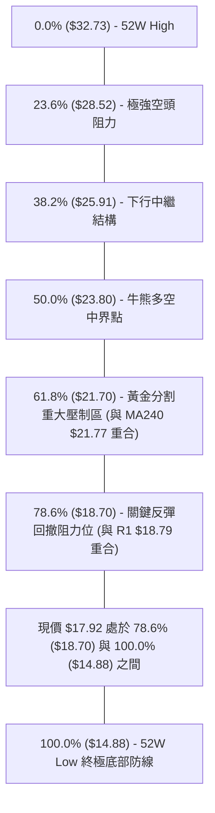

- **位置解讀**：現價 **$17.92** 目前位於 **78.6% 回調位 ($18.70)** 與 **100.0% 底部 ($14.88)** 的深度折價築底區。
- **技術意義**：斐波那契 78.6% 位 ($18.70) 與阻力位 R1 ($18.79) 形成強大的**共振阻力帶 ($18.70 - $18.79)**。若能放量突破該共振帶，上方反彈空間將直接打開至 61.8% ($21.70) 及 MA200 ($20.57)。

---

## 5. 技術指標深度解讀

### 🎛️ 指標訊號總覽

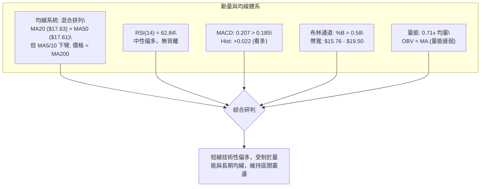

### 📈 移動平均線排列分析

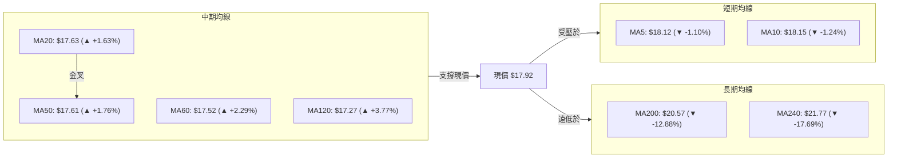

- **均線排列判定**：**混合排列**。
  - **短期**：現價 ($17.92) 略低於 MA5 ($18.12) 與 MA10 ($18.15)，短線面臨微幅獲利回吐。
  - **中期**：MA20 ($17.63) 與 MA50 ($17.61) 形成多頭黃金交叉，且 MA60 ($17.52) 及 MA120 ($17.27) 均呈現向上拐頭（▲），提供極佳的下檔支撐。
  - **長期**：MA200 ($20.57) 與 MA240 ($21.77) 仍處於空頭下行態勢，確認中長期趨勢尚未轉為全面牛市。

### 📉 RSI(14) 分析

```
RSI(14) 當前數值: 62.84
[0] ─────────── [30] 超賣 ────────────── [62.84] 現值 ───── [70] 超買 ─────────── [100]
                ░░░░░░░░░░░░░░░░░░░░░░░░█████████████░░░░░░░
```

- **超買超賣判定**：數值 **62.84** 處於 30–70 中性偏多區間，遠未進入 70 以上超買區，表明股價仍具備向上試探 R1 ($18.79) 的動能空間。
- **背離分析**：
  - 比對 2026-07-12 高點（價格 $18.78，RSI 58.4）與 2026-08-23 當前（價格 $17.92，RSI 62.84），動能並未隨價格回調而潰散。
  - 結論：**無頂背離、無底背離**，指標運行健康。

### 📊 MACD(12/26/9) 訊號解讀

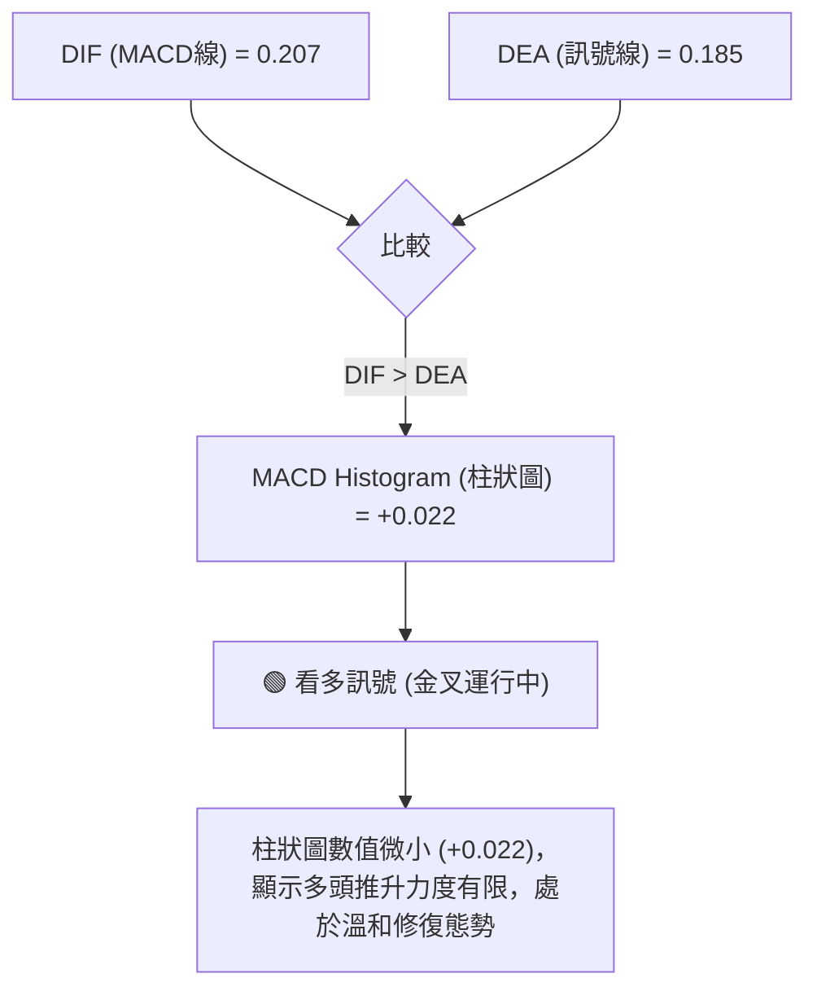

- **MACD 解讀**：快線 DIF (0.207) 位於慢線 DEA (0.185) 之上，柱狀圖為正值 (+0.022)。這與週線 MACD 連續三週維持紅柱（08-09: +0.181, 08-16: +0.112, 08-23: +0.022）相呼應，確認短中期動能偏向多方，但紅柱呈現收斂，暗示上攻動能稍有減速。

### 📦 布林通道分析

```
SOFI 日線布林通道結構圖 (Bandwidth = $3.74)
$19.50 ┬─────────────────────────────────────────── BB 上軌 ($19.50)
       │                                     ▲
       │                                     │ 距上軌 +8.82%
$17.92 ┼─────────────────────────● 現價 ($17.92, %B = 0.58)
       │                         │
       │                         ▼ 距中軌 -1.62%
$17.63 ┼─────────────────────────────────────────── BB 中軌 / MA20 ($17.63)
       │
$15.76 ┴─────────────────────────────────────────── BB 下軌 ($15.76)
```

- **通道帶寬與位置**：現價 $17.92，%B = 0.58，處於布林中軌 ($17.63) 與上軌 ($19.50) 之間的多方掌控區。
- **形態暗示**：布林通道帶寬收窄後維持水平延伸，表明市場進入極致的平衡震盪期，價格預計將在 $15.76 至 $19.50 之間進行往復波動。

### 💹 成交量分析（量價配合度）

- **最新成交量**：45,363,250 股。
- **均量對比**：20日均量 63,840,528 股（量比 0.71x），50日均量 76,184,563 股。
- **OBV 能量潮分析**：當前指標提示 **OBV < MA → 量能疲弱**。
- **量價診斷**：近期價格雖小幅回升站上 MA20，但成交量未能有效放大（量比僅 0.71x），屬於典型的「縮量反彈」。量能不足將直接制約價格突破強阻力 R1 ($18.79) 的成功率，印證了當前行情屬於區間震盪而非單邊反轉。

---

## 6. 動能與波動率

### ⚡ 動能評估四象限

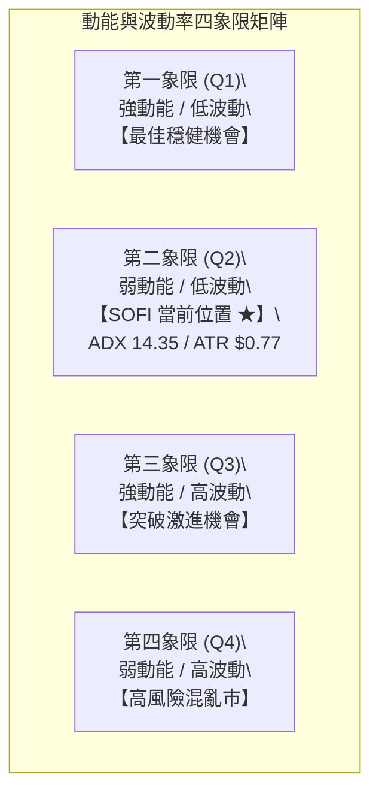

| 象限 | 動能強度 | 波動率水準 | SOFI 當前狀態 | 策略應對指引 |
| :---: | :---: | :---: | :---: | :--- |
| **Q1** | 強 | 低 | — | 趨勢順勢加碼 |
| **Q2** | **弱 (ADX: 14.35)** | **低/中 (ATR: $0.77)** | **✓ (當前所處象限)** | **區間震盪策略：高拋低吸，嚴格執行支撐買入、阻力止盈** |
| **Q3** | 強 | 高 | — | 追隨突破行情 |
| **Q4** | 弱 | 高 | — | 觀望並減少操作 |

### 📊 ATR 波動率分析

- **ATR(14) 精確數值**：**$0.77**（佔當前股價比例為 **4.32%**）。
- **日內波動特徵**：每日正常理論波動區間為 ±$0.77。
- **風控止損應用**：
  - 建議標準短線止損設置為 $1.5 \times \text{ATR} = 1.5 \times \$0.77 = \mathbf{\$1.16}$。
  - 波段寬鬆止損設置為 $2.0 \times \text{ATR} = 2.0 \times \$0.77 = \mathbf{\$1.54}$。

### 📐 Beta 與市場相關性

- **Beta 係數**：**2.204**（超高波動性標的）。
- **市場敏感度分析**：SOFI 的波動幅度約為標普500大盤指數的 2.2 倍。當大盤指數上漲 1% 時，SOFI 預期上漲 2.2%；反之大盤下挫 1% 時，SOFI 回撤風險亦放大 2.2 倍。
- **做空與機構數據**：
  - 空頭淨額比例 (Short % Float)：**15.0%**（Short Ratio: 2.22），具備潛在軋空 (Short Squeeze) 條件，但需放量突破 R1 ($18.79) 催化。
  - 機構持股比例：**51.3%**，籌碼穩定度中等。

---

## 7. 多時框架總結

### 📋 時框架評分表

| 時框架 | 趨勢方向 | 動能狀態 | 均線排列 | 形態結構 | 綜合評分 | 操作建議 |
| :--- | :---: | :---: | :---: | :---: | :---: | :--- |
| **日線 (短期)** | 🟢 震盪偏多 | MACD金叉 / RSI 62.8 | 站上 MA20/50 | 縮量蓄勢 | **62/100** | 支撐位附近逢低做多 |
| **週線 (中期)** | 🟡 箱體震盪 | MACD紅柱收斂 | MA20附近膠著 | 潛在雙底 | **56/100** | 區間內高拋低吸 |
| **月線 (長期)** | 🔴 下行修復 | 52W低位築底 | 遠低於 MA200 | 深度回撤修復 | **45/100** | 暫不具備長線牛市條件 |

### 🔲 綜合訊號矩陣

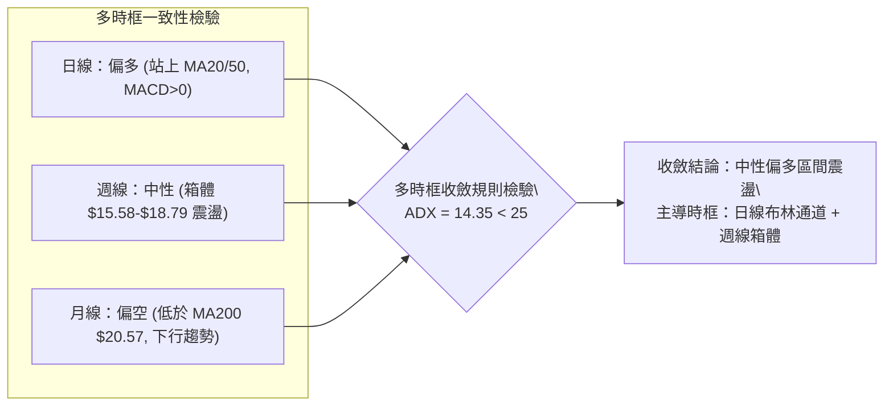

### ⚖️ 多時框收斂結論

依據多時框收斂規則（嚴格要求 14）：
1. **行情性質判定**：當前 ADX(14) 數值為 **14.35 (< 25)**，嚴格定義為**盤整震盪行情**。
2. **主導時框選擇**：在盤整行情中，忽略長期單邊趨勢信號，以**日線布林通道 ($15.76 - $19.50)** 及**週線關鍵支撐阻力 ($15.58 - $18.79)** 為核心交易區間。
3. **唯一方向性結論**：**【中性偏多區間震盪 (Neutral-Bullish Range)】**。日線級別具備向布林上軌及 R1 ($18.79) 衝擊的短多動能，但受限於週線箱體壓制與縮量格局，不宜做趨勢單邊押注。

---

## 8. 交易策略建議

### 🗺️ 策略決策流程圖

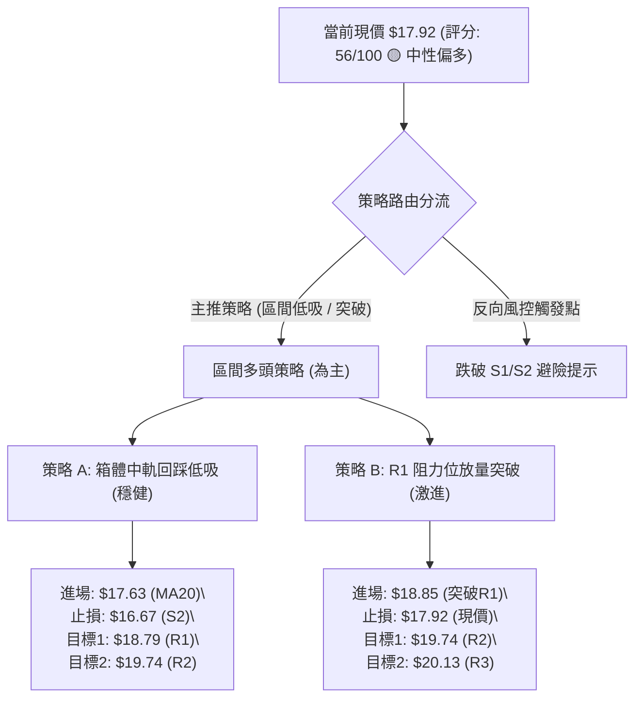

### 🧭 策略路由

> **當前主策略方向 = 區間多頭偏向操作（依綜合評分 56/100，處於 40–60 區間震盪帶偏多側）**  
> 基於 ADX < 25 與現價站穩 MA20/MA50，主推在支撐位回踩低吸之多頭策略，嚴禁追高；空頭方向僅列為反轉風險觸發點。

### 🎯 價格情境階梯（Price Scenarios）

| 觸發條件 | 第一目標 | 後續延伸目標 | 策略情境含義 |
| :--- | :---: | :---: | :--- |
| **向上放量突破 R1 ($18.79)** | **R2 ($19.74)** | **R3 ($20.13) / MA200 ($20.57)** | 突破箱體頸線，短線強勢主升展開 |
| **維持在 MA20 ($17.63) 上方震盪** | **R1 ($18.79)** | **布林上軌 ($19.50)** | 標準箱體內多頭蓄勢，反覆測試頂部 |
| **向下有效跌破 S1 ($17.08)** | **S2 ($16.67)** | **S3 ($15.58)** | 短線轉弱，回撤箱底尋求雙底支撐 |

### 📊 情境機率分佈

```
情境機率分佈圖
繼續上行 / 反彈突破 (40%)  ████████████████░░░░░░░░░░░░░░░░░░░░
區間震盪維持 (45%)        ██████████████████░░░░░░░░░░░░░░░░░░
回落探底跌破 S1 (15%)     ██████░░░░░░░░░░░░░░░░░░░░░░░░░░░░░░
```

| 情境劃分 | 機率估計 | 主要技術依據 |
| :--- | :---: | :--- |
| **區間震盪蓄勢** | **45%** | ADX(14) 僅 14.35，成交量比 0.71x 呈現縮量，布林帶寬收縮支持區間波動 |
| **反彈向上測試 R1/R2** | **40%** | MACD 呈多頭金叉 (+0.022)，+DI (26.43) > -DI (18.33)，均線 MA20/MA50 黃金交叉 |
| **跌破 S1 向下尋底** | **15%** | RSI 位於 62.84 遠離超賣區，且 S2 ($16.67) 與 S3 ($15.58) 具備強大波段買盤聚類 |

### 🟢 主策略詳情

| 策略要素 | 策略 A（穩健型：回踩 MA20/S1 低吸） | 策略 B（激進型：突破 R1 頸線追買） |
| :--- | :--- | :--- |
| **進場條件** | 股價回踩 MA20/MA50 支撐區且出現止跌K線 | 日K線實體放量收盤突破 R1 ($18.79) 且成交量 > 65M |
| **精確進場價格** | **$17.63** (MA20 處) | **$18.85** (確認突破 R1 $18.79 後) |
| **目標價 T1** | **$18.79** (R1 阻力位，預期報酬 +6.58%) | **$19.74** (R2 阻力位，預期報酬 +4.72%) |
| **目標價 T2** | **$19.74** (R2 阻力位，預期報酬 +11.97%)| **$20.13** (R3 阻力位，預期報酬 +6.79%) |
| **精確止損價格** | **$16.67** (S2 波段強支撐下方，風險 -5.45%)| **$17.92** (跌回突破前現價平台，風險 -4.93%) |
| **風險報酬比 (R/R)** | **2.20 : 1** (以 T2 計算) | **1.38 : 1** (以 T2 計算) |
| **成功機率預估** | **65%** | **50%** |
| **建議配置倉位** | **15% - 20%** (主倉位) | **5% - 10%** (衛星倉位) |

### 🔴 反向風險觸發點（對沖提示）

若發生以下任一技術破位事件，必須全面暫停多頭策略並考慮對沖或減倉：
1. **短線破位點**：日K線收盤價跌破 **S1 ($17.08)**，意味著短線多頭結構破壞，價格將慣性下探 S2 ($16.67)。
2. **多空翻轉點**：週線級別跌破 **S2 ($16.67)**，應無條件止損所有短線多單，防範股價進一步測試箱底 **S3 ($15.58)** 或 52W 低點 **$14.88**。
3. **指標惡化點**：日線 MACD 柱狀圖由正轉負，且 RSI(14) 跌破 50 中軸。

### ⭐ 整體訊號強度評星

```
╔═══════════════════════════════════════════════════╗
║ 做多訊號強度：★★★☆☆  (3.0/5星 - 區間偏多)        ║
║ 做空訊號強度：★★☆☆☆  (2.0/5星 - 缺乏空頭推力)    ║
║ 整體可信度：  ★★★★☆  (4.0/5星 - 數據指標高度收斂)║
╚═══════════════════════════════════════════════════╝
```

---

## 9. 風險提示與監控

### ✅ 關鍵監控指標 Checklist

```
╔════════════════════════════════════════════════════════════════════╗
║                     關鍵技術監控清單 (Checklist)                     ║
╠════════════════════════════════════════════════════════════════════╣
║ [ ] 價位監控：現價 $17.92 是否能持續守穩在 MA20 ($17.63) 之上        ║
║ [ ] 阻力監控：衝擊 R1 ($18.79) 時，日成交量是否突破 6,384 萬股 (20日均量)║
║ [ ] 動能監控：MACD 柱狀圖是否維持正值 (+0.022 以上擴大)             ║
║ [ ] 趨勢監控：ADX(14) 是否由 14.35 向上突破 20，確認新趨勢啟動       ║
║ [ ] 支撐監控：若盤中下挫，S1 ($17.08) 與 S2 ($16.67) 買盤承接力道   ║
║ [ ] 波動監控：ATR 是否異常擴大至 $1.00 以上，預示大幅變盤開展       ║
╚════════════════════════════════════════════════════════════════════╝
```

### ⚠️ 風險場景分析

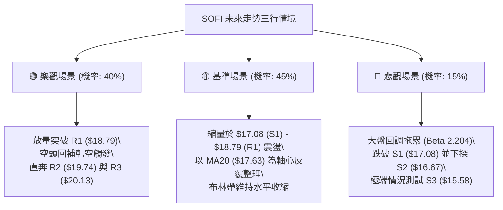

### 🛡️ 風險管理重要提醒

1. **高 Beta 波動防禦**：SOFI 的 Beta 高達 **2.204**，其波動幅度為大盤的兩倍以上。在整體持倉中，單一標的倉位上限強烈建議控制在 **15% 以內**，避免因市場系統性回撤造成組合劇烈波動。
2. **區間操作紀律**：當前處於 ADX = 14.35 的無趨勢盤整市場，切忌在價格接近阻力位 R1 ($18.79) 或布林上軌 ($19.50) 時追高買入；必須耐心等待價格回調至均線支撐區 (MA20 $17.63 / S1 $17.08) 進行布局。
3. **空頭部位警惕**：雖然長期均線 (MA200 $20.57) 構成壓制，但鑑於空頭持倉比 (Short Float) 高達 **15.0%**，若有利好催化帶動價格放量突破 $18.79，極易引發快速軋空行情，因此不建議在現價盲目建立大額做空部位。

---

## 📋 報告總結

```
╔════════════════════════════════════════════════════════════════════╗
║                       SOFI 技術分析報告總結                         ║
╠════════════════════════════════════════════════════════════════════╣
║ 報告日期：2026-08-20                                               ║
║ 當前價格：$17.92                                                   ║
║ 分析評級：⚖️ 中性偏多區間震盪 (綜合評分: 56/100)                     ║
╠════════════════════════════════════════════════════════════════════╣
║ 關鍵結論：                                                         ║
║ ├─ 長期趨勢：🔴 弱勢修復 (現價遠低於 MA200 $20.57，中長期未扭轉)   ║
║ ├─ 中期趨勢：🟡 箱體整理 ($15.58 箱底至 $18.79 頸線間寬幅震盪)     ║
║ ├─ 短期趨勢：🟢 震盪偏多 (站上 MA20 $17.63 與 MA50 $17.61，MACD金叉)║
║ ├─ 關鍵支撐：S1: $17.08  /  S2: $16.67  /  S3: $15.58               ║
║ ├─ 關鍵阻力：R1: $18.79  /  R2: $19.74  /  R3: $20.13               ║
║ └─ 分析師目標價：均價 $19.98 (最低 $12.00 / 最高 $30.00)           ║
╠════════════════════════════════════════════════════════════════════╣
║ 最優策略組合：                                                     ║
║ 1. 🥇 最佳機會：回踩 MA20 ($17.63) 附近逢低建立多單，止損設於 S2   ║
║                ($16.67)，目標上看 R1 ($18.79) 與 R2 ($19.74)。     ║
║ 2. 🥈 次選機會：若放量突破 R1 ($18.79)，右側順勢追買，目標 R2/R3。 ║
║ 3. 🥉 保守選擇：在 ADX 突破 25 前保持 50% 以上現金，僅做網格波段。  ║
╚════════════════════════════════════════════════════════════════════╝
```

---

> ⚠️ **免責聲明**：本報告為 AI 自動生成之技術分析，所有數據及估算均基於提供的歷史價格資訊。本報告**僅供研究與學術參考**，**不構成任何投資建議**。投資有風險，入市需謹慎。

---

*報告生成時間：2026-08-20 ｜ 數據來源：Yahoo Finance ｜ 分析框架：多時框技術分析*