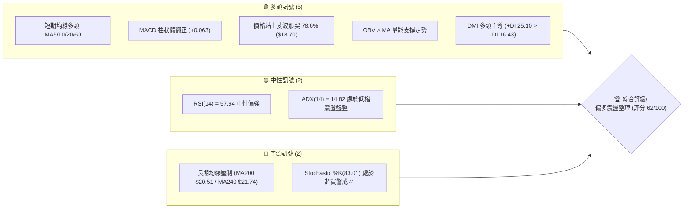
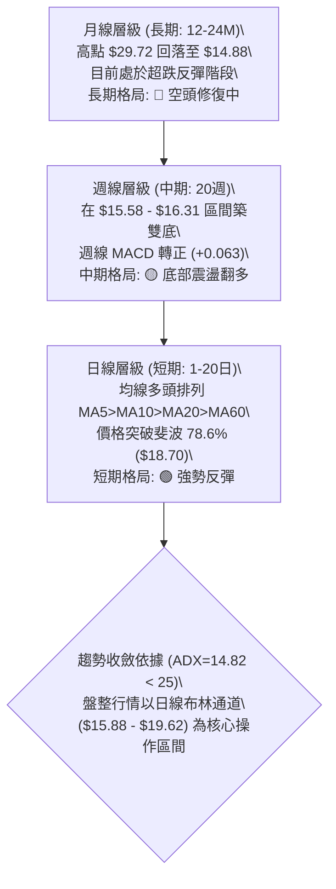
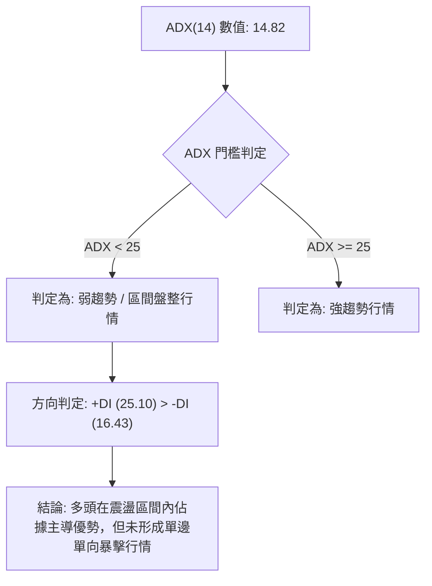
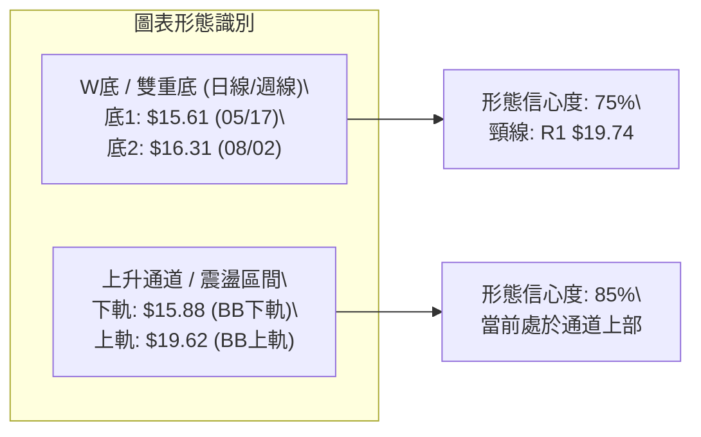
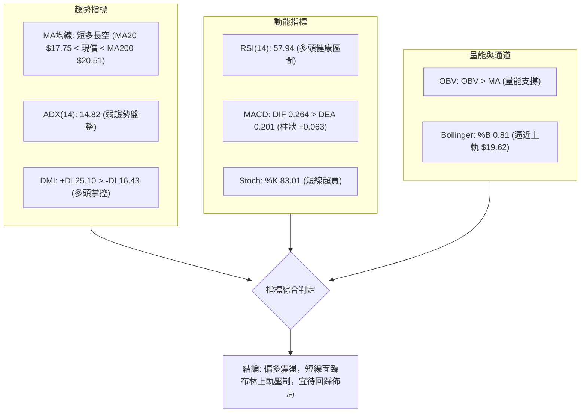
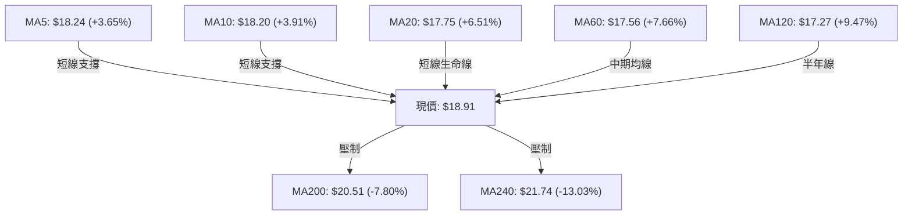
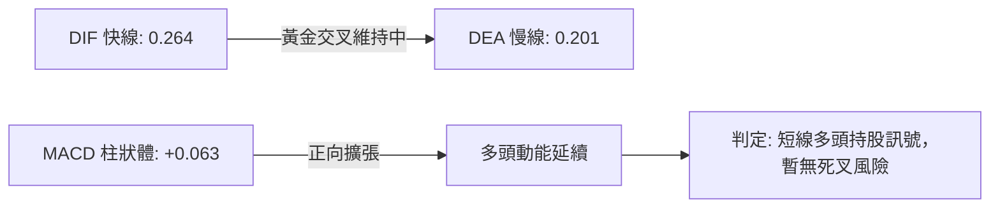
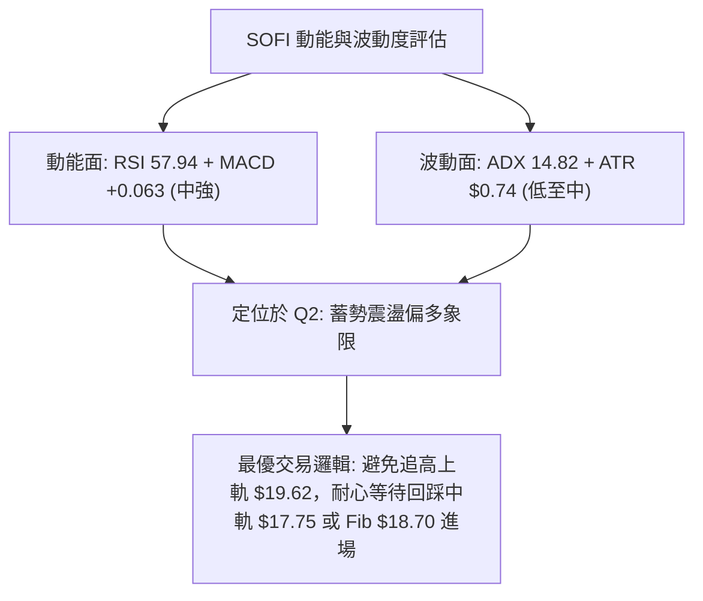
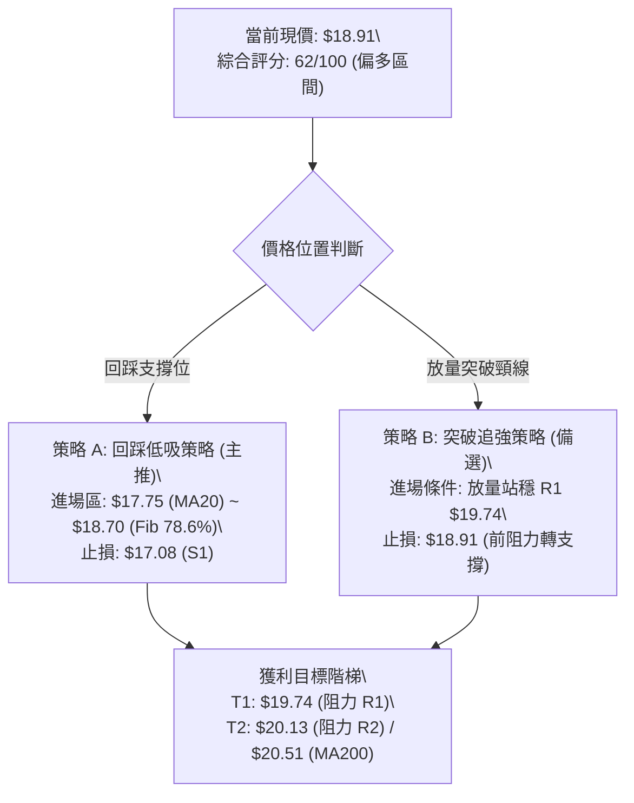
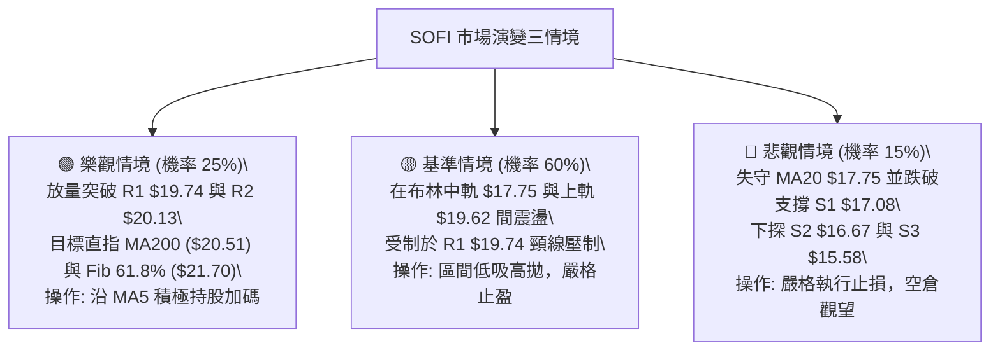

# SOFI 技術分析報告

> **報告日期**：2026-08-22 ｜ **語言**：繁體中文 ｜ **數據來源**：Yahoo Finance ｜ **當前價格**：$18.91

---

## 目錄

| 章節 | 內容 |
|------|------|
| [1. 技術面概覽](#1-技術面概覽) | 訊號儀表板、核心指標、評分卡 |
| [2. 趨勢分析](#2-趨勢分析) | 多時框趨勢、長中短期走勢 |
| [3. 圖表形態分析](#3-圖表形態分析) | 形態識別、K線組合、目標價 |
| [4. 支撐與阻力](#4-支撐與阻力) | 關鍵價位、斐波那契回調 |
| [5. 技術指標深度解讀](#5-技術指標深度解讀) | MA/RSI/MACD/布林/成交量 |
| [6. 動能與波動率](#6-動能與波動率) | 動能評估、ATR、Beta |
| [7. 多時框架總結](#7-多時框架總結) | 時框架評分矩陣 |
| [8. 交易策略建議](#8-交易策略建議) | 多空策略、風險報酬比 |
| [9. 風險提示與監控](#9-風險提示與監控) | 監控指標、風險場景 |

---

## 1. 技術面概覽

### 🎯 技術訊號儀表板



### 📊 核心指標速覽表

| 指標類別 | 指標名稱 | 當前數值 | 訊號 | 解讀 |
|----------|----------|----------|------|------|
| **價格** | 當前價格 | $18.91 | 🟢 | 位於52週區間22.6%，自年內低點 $14.88 穩步反彈 |
| **均線** | MA20 | $17.75 | 🟢 | 價格位於MA20上方 +6.51%，短線支撐強勁 |
| **均線** | MA50 | $17.67 | 🟢 | 價格突破MA50，短期均線呈多頭排列 |
| **均線** | MA200 | $20.51 | 🔴 | 價格低於MA200約 -7.80%，長期空頭壓力仍在 |
| **動能** | RSI(14) | 57.94 | 🟡 | 位於50中軸上方，無超買超賣或背離，健康擴張 |
| **動能** | MACD (12,26,9) | 0.264 / 0.201 | 🟢 | DIF > DEA，柱狀體 +0.063 持續擴張，短線看多 |
| **動能** | Stoch %K / %D | 83.01 / 74.47 | 🔴 | 進入80以上超買區，短線需防範回洗中軌風險 |
| **趨勢強度**| ADX(14) | 14.82 | 🟡 | 數值 < 25 表明處於弱趨勢/區間震盪行情 |
| **通道** | 布林帶 %B | 0.81 | 🟡 | 逼近上軌 $19.62，短線空間受限 |
| **成交量**| OBV 趨勢 | OBV > MA | 🟢 | 量能配合價格反彈，未見主力出貨背離 |
| **波動** | ATR(14) | $0.74 | 🟡 | 佔股價 3.90%，波動度適中，適合區間操作 |

### 🏆 技術評分卡

```
╔══════════════════════════════════════════════════════════════════╗
║              技術評分卡 — SOFI (2026-08-22)                      ║
╠══════════════════════════════════════════════════════════════════╣
║ 趨勢強度 (ADX/DMI)   ████████░░░░░░░░░░░░  42/100  🟡 震盪偏多   ║
║ 動能指標 (RSI/MACD)  ██████████████░░░░░░  70/100  🟢 動能充沛   ║
║ 支撐穩定度 (S1/S2)   ██████████████░░░░░░  72/100  🟢 底部扎實   ║
║ 成交量配合 (OBV/VOL) ████████████░░░░░░░░  60/100  🟢 量能回升   ║
║ 形態完整度 (區間築底) ██████████████░░░░░░  68/100  🟢 底型確認   ║
║ 均線排列 (短多長空)   ████████████░░░░░░░░  60/100  🟡 混合排列   ║
╠══════════════════════════════════════════════════════════════════╣
║ 綜合評分             ████████████░░░░░░░░  62/100  🟢 偏多區間操作║
╚══════════════════════════════════════════════════════════════════╝
```

---

## 2. 趨勢分析

### 🌐 多時框趨勢分析



### 📈 長期趨勢 — 12個月走勢圖（Unicode）

```
SOFI 月線走勢圖（2025-08 至 2026-08）
價格軸 ($)
$30.00 ┤                             ● $29.72 (2025-11 高點)
$27.50 ┤                 ● $26.42
$25.00 ┤         ● $25.54        
$22.50 ┤                                 ● $22.81
$20.00 ┤                                                 ● $18.91 (當前現價)
$17.50 ┤                                     ● $17.76    │   ● $17.93
$15.00 ┤                                         ● $15.88│● $16.10   ● $16.31
       └─┬───────┬───────┬───────┬───────┬───────┬───────┼───────┬───────┬───────►
       08/25   09/25   10/25   11/25   12/25   01/26   02/26   03/26   05/26   08/26
```

**走勢特徵分析表格**：

| 階段區間 | 時間跨度 | 價格起訖 | 漲跌幅 | 核心特徵與技術解讀 |
|----------|----------|----------|--------|--------------------|
| **強勢衝頂期** | 2025-08 ~ 2025-11 | $25.54 → $29.72 | +16.37% | 量價齊揚，創下52週波段高點 $32.73，隨後動能衰竭出現頂部滯漲 |
| **大幅回撤期** | 2025-11 ~ 2026-03 | $29.72 → $15.88 | -46.57% | 跌破各級短期均線，失守斐波那契各主要支撐，空頭趨勢強烈 |
| **築底震盪期** | 2026-03 ~ 2026-07 | $15.88 → $16.31 | +2.71%  | 在 $14.88 (52W Low) 與 $15.58 (S3) 上方反覆築底，量能萎縮沉澱 |
| **突破反彈期** | 2026-07 ~ 2026-08 | $16.31 → $18.91 | +15.94% | 帶量突破短期均線糾纏區，站上 MA20/MA50，動能指標轉強 |

### 📊 中期趨勢（週線分析）

```
SOFI 週線關鍵阻力與支撐架構
═════════════════════════════════════════════════════════════════════
[主要阻力區]  $20.51 (MA200) ── $20.13 (R2波段阻力) ── $19.74 (R1短線阻力)
                              ▲
                       $18.91 ┼───【當前價格：測試 $19.00 整數關卡】
                              ▼
[核心支撐區]  $17.75 (MA20/BB中軌) ── $17.08 (S1) ── $15.58 (S3波段底)
═════════════════════════════════════════════════════════════════════
```

近20週數據顯示，週收盤價於 2026-05-17 觸及低點 $15.61（RSI: 30.2），隨後於 2026-08-02 再次探底 $16.31（RSI: 37.4），形成明顯的週線雙底形態。近三週週線連續上揚（$16.31 → $18.38 → $18.29 → $18.91），週線 MACD 柱狀體維持正值（+0.063），中期趨勢已由弱轉強。

### ⚡ 趨勢強度評估（ADX 解讀）



| 指標名稱 | 當前數值 | 參考標準 | 趨勢判定 | 交易意涵 |
|----------|----------|----------|----------|----------|
| **ADX(14)** | **14.82** | < 20 極弱; 20-25 弱; > 25 趨勢確立 | **極弱趨勢/區間震盪** | 嚴禁追高殺跌，以邊界高拋低吸為主 |
| **+DI(14)** | **25.10** | 高於 -DI 代表多方佔優 | **多頭主導** | 回檔支撐做多勝率高於逢高做空 |
| **-DI(14)** | **16.43** | 低於 +DI 代表空方動能減退 | **空方受抑** | 下行空間受支撐位 S1/S2 限制 |

---

## 3. 圖表形態分析

### 🔍 形態識別系統



**形態信心度與目標價評估表**：

| 形態名稱 | 信心度 | 判斷依據（引用數據） | 完成度 | 目標價（附計算式） |
|----------|--------|----------------------|--------|--------------------|
| **W底 (雙重底)** | **75%** | 底1為 $15.61 (2026-05-17)，底2為 $16.31 (2026-08-02)，均在支撐位 S3 $15.58 與 S2 $16.67 區間獲得強支撐；頸線位於近一年波段高點聚類 R1 $19.74。 | 85% | **由雙底高度推算**：<br>底點均值 = ($15.61 + $16.31)/2 = $15.96<br>形態高度 = $19.74 - $15.96 = $3.78<br>突破目標價 = $19.74 + $3.78 = **$23.52** |
| **布林通道震盪** | **85%** | ADX=14.82 (<25)，價格在布林下軌 $15.88 與上軌 $19.62 之間運行，%B 為 0.81。 | 90% | **區間震盪目標**：<br>上軌阻力位 = **$19.62**<br>若受阻回踩中軌 = **$17.75** |

### 🕯️ 重要K線形態分析

| 期間/週別 | 收盤價 | 典型K線形態 | 技術解讀 | 訊號 |
|-----------|--------|-------------|----------|------|
| **2026-05-10 ~ 05-17** | $15.75 → $15.61 | **雙針探底 / 錘頭線** | RSI觸及 24.9 超賣區後形成低檔十字支撐，賣壓徹底出清 | 🟢 築底訊號 |
| **2026-05-31** | $18.22 | **長陽突破K線** | 單週成交量放大至 367M，MACD柱轉正 (+0.273)，多頭發力 | 🟢 強勢確認 |
| **2026-07-26 ~ 08-02** | $16.46 → $16.31 | **縮量回踩低點** | 第二次回踩 $16.30 附近獲得強大承接盤，成交量放大至 483M，確認右底 | 🟢 次級底確認 |
| **2026-08-09 ~ 08-23** | $18.38 → $18.91 | **紅三兵 / 連陽推進** | 連續三週收陽突破均線群，價格直逼波段阻力 R1 $19.74 | 🟢 多頭推進 |

### 📉 ASCII 走勢形態示意圖

```
SOFI 雙底形態 (W-Bottom) 與布林通道示意圖
價格 ($)
$19.74 ┤                        ┌──【頸線 / 阻力 R1 $19.74】
$19.62 ┤- - - - - - - - - - - - ┼ - - - - - - - - - - - - - - - - -【BB上軌 $19.62】
$18.91 ┤                        │         ● 現價 $18.91 (測試頸線)
$17.75 ┤───────●───────────────┼─────────●───────────────【BB中軌/MA20 $17.75】
       │      / \              │        /
$16.31 ┤     /   \             │       ● 右底 $16.31 (2026-08-02)
$15.61 ┤    ● 左底 $15.61 (05-17)
$14.88 ┴────┴──────────────────┴─────────────────────────【52W Low $14.88】
```

### 🎯 形態目標價計算

1. **雙重底測幅目標**：
   - 形態頸線：$19.74（阻力 R1）
   - 形態底部：$15.61（2026-05-17 低點）
   - 形態高度：$19.74 - $15.61 = $4.13
   - 最小測幅滿足點：$19.74 + $4.13 = **$23.87**（高度重合於斐波那契 50.0% 回調位 **$23.80**）
2. **第一階段阻力目標**：
   - 頸線前置阻力：**$19.62**（布林上軌）至 **$19.74**（阻力 R1）
   - 中期長期均線壓制：**$20.13**（阻力 R2）至 **$20.51**（MA200）

---

## 4. 支撐與阻力

### 🗺️ 關鍵價位分布圖（Unicode）

```
SOFI 價位結構分布圖
═══════════════════════════════════════════════════════════════════
$32.73 ║████████████████████████████████║ 52週歷史高點 (Fib 0.0%)
$28.52 ║████████████████████████        ║ Fib 23.6% 回調位
$27.62 ║██████████████████████          ║ 強阻力 R3 (近一年波段高點聚類)
$25.91 ║████████████████                ║ Fib 38.2% 回調位
$23.80 ║████████████                    ║ Fib 50.0% 關鍵平衡位
$21.70 ║██████████                      ║ Fib 61.8% 黃金分割位 / MA240 $21.74
$20.51 ║████████                        ║ 長期均線壓制 MA200
$20.13 ║███████                         ║ 波段阻力 R2 (+6.45%)
$19.74 ║██████                          ║ 關鍵頸線阻力 R1 (+4.39%)
$19.62 ║█████                           ║ 布林通道上軌
$18.91 ╠════════════════════════════════╣ ◄───【當前現價 $18.91】
$18.70 ║▓▓▓▓▓                           ║ Fib 78.6% 回調位 (短線支撐)
$17.75 ║▓▓▓▓▓▓▓                         ║ 布林中軌 / MA20 強支撐
$17.08 ║▓▓▓▓▓▓▓▓▓                       ║ 近期波段支撐 S1 (-9.68%)
$16.67 ║▓▓▓▓▓▓▓▓▓▓▓                     ║ 波段低點支撐 S2 (-11.86%)
$15.88 ║▓▓▓▓▓▓▓▓▓▓▓▓▓                   ║ 布林通道下軌
$15.58 ║▓▓▓▓▓▓▓▓▓▓▓▓▓▓▓                 ║ 強支撐 S3 (-17.63%)
$14.88 ║▓▓▓▓▓▓▓▓▓▓▓▓▓▓▓▓▓▓▓▓            ║ 52週最低點 (Fib 100.0%)
═══════════════════════════════════════════════════════════════════
```

### 🚧 阻力位分析表

| 阻力級別 | 價位 | 形成原因（嚴格引用數據） | 突破難度 | 重要性 |
|----------|------|--------------------------|----------|--------|
| **R1** | **$19.74** | 近一年波段高點聚類，雙底形態頸線位置，距離現價 +4.39% | 🟡 中等 | ★★★★☆ |
| **R2** | **$20.13** | 近一年次級波段高點聚類，整數心理關卡前方，距離現價 +6.45% | 🔴 較高 | ★★★★☆ |
| **MA200**| **$20.51** | 牛熊分界線 MA200 壓制，長期趨勢轉換關鍵點 | 🔴 很高 | ★★★★★ |
| **R3** | **$27.62** | 近一年波段高點聚類，接近歷史套牢密集區，距離現價 +46.06% | 🔴 極高 | ★★★☆☆ |

### 🛡️ 支撐位分析表

| 支撐級別 | 價位 | 形成原因（嚴格引用數據） | 守住機率 | 重要性 |
|----------|------|--------------------------|----------|--------|
| **Fib 78.6%**| **$18.70** | 52週斐波那契回調位，昨日剛突破的短線轉換位 | 🟢 80% | ★★★☆☆ |
| **MA20 / 中軌**| **$17.75** | 日線布林中軌、MA20 匯聚處，多頭第一道防線 | 🟢 85% | ★★★★★ |
| **S1** | **$17.08** | 近一年波段低點聚類，距離現價 -9.68% | 🟢 90% | ★★★★☆ |
| **S2** | **$16.67** | 近一年波段低點聚類，距離現價 -11.86% | 🟢 92% | ★★★★☆ |
| **S3** | **$15.58** | 近一年波段強低點聚類，5月築底平台最低收盤價附近 | 🟢 95% | ★★★★★ |

### 📐 斐波那契回調位分析

依據 52 週波動區間（高點 **$32.73** → 低點 **$14.88**，總振幅 $17.85）之精確計算：

```
斐波那契回調階梯與現價定位：
  0.0%  (52W High) : $32.73 ── 極端歷史高點
 23.6%             : $28.52 ── 深度回調阻力
 38.2%             : $25.91 ── 中期上行阻力
 50.0%             : $23.80 ── 多空中期強弱分水嶺
 61.8%             : $21.70 ── 黃金分割關鍵反彈阻力位
----------------------------------------------------------------------
 78.6%             : $18.70 ── 【現價 $18.91 位於 $18.70 與 $21.70 之間】
100.0%  (52W Low)  : $14.88 ── 歷史絕對底部
```

- **位置解讀**：現價 $18.91 已成功突破並站穩在 **Fib 78.6% ($18.70)** 之上，技術意義上宣告了 $14.88~$18.70 的「極端超跌打底區」正式告一段落。
- **後續展望**：上行空間已打開至 **Fib 61.8% ($21.70)**，但在此之前需依序克服頸線阻力 R1 ($19.74)、R2 ($20.13) 及 MA200 ($20.51)。

---

## 5. 技術指標深度解讀

### 🎛️ 指標訊號總覽



### 📈 移動平均線排列分析



| 均線名稱 | 當前價格 | 偏離度 | 走勢特徵 | 訊號解讀 |
|----------|----------|--------|----------|----------|
| **MA 5** | $18.24 | +3.65% | 快速向上揚升 | 🟢 極短線多頭掌控 |
| **MA 10** | $18.20 | +3.91% | 連續走高支撐股價 | 🟢 短線多頭發散 |
| **MA 20** | $17.75 | +6.51% | 由平轉陡峭向上 | 🟢 中短線確立翻多 |
| **MA 60** | $17.56 | +7.66% | 底部緩步向上抬升 | 🟢 中期趨勢修復 |
| **MA 120** | $17.27 | +9.47% | 走平築底完成 | 🟢 半年線支撐扎實 |
| **MA 200** | $20.51 | -7.80% | 緩步下行壓制 | 🔴 長期牛熊分水嶺 |
| **MA 240** | $21.74 | -13.03%| 下行斜率放緩 | 🔴 年線強阻力 |

### 📉 RSI(14) 分析

- **當前數值**：**57.94**
- **動能進度條**：
  ```
  RSI(14) 狀態 [57.94]
  0 ────── 30 ────────────────── 50 ──────── 57.94 ────── 70 ────── 100
  [   超賣區   ]                 [     中性偏多     ]     [   超買區   ]
  ▓▓▓▓▓▓▓▓▓▓▓▓▓▓▓▓▓▓▓▓▓▓▓▓▓▓▓▓▓▓▓▓▓▓▓▓▓▓▓▓▓▓▓▓▓░░░░░░░░░░░░░░░░░░░░
  ```
- **背離分析**：**無頂背離亦無底背離**。在 2026-05-10 週線 RSI 探底 24.9 後隨價格同步回升，當前 RSI 位於 57.94，與價格連三週反彈的節奏相符，未出現量價背離或動能背離現象，顯示當前上漲由實質買盤推動。

### 📊 MACD(12/26/9) 訊號解讀



- **MACD 線**：0.264
- **訊號線 (Signal)**：0.201
- **柱狀圖 (Histogram)**：**+0.063**（連續數週維持正值，紅柱健康運行）
- **背離檢驗**：MACD 自 2026-07-26 的 -0.220 快速翻正至 +0.063，動能呈現正向放大，無頂背離隱患。

### 📦 布林通道分析

```
SOFI 日線布林通道 (Bollinger Bands 20, 2)
═══════════════════════════════════════════════════════════════════
$19.62 ──┬─── BB 上軌 ─────────────────────────────────────────────
         │      ● 現價 $18.91 (BB %B = 0.81，逼近上軌區間)
         │
$17.75 ──┼─── BB 中軌 (MA20) ──────────────────────────────────────
         │
$15.88 ──┴─── BB 下軌 ─────────────────────────────────────────────
═══════════════════════════════════════════════════════════════════
通道寬度 (BandWidth) = ($19.62 - $15.88) / $17.75 = 21.07%
```

- **通道狀態解讀**：現價 $18.91 處於布林帶相對高位（%B = 0.81），距離上軌 $19.62 僅有 +3.75% 空間。在 ADX=14.82（盤整特徵）下，布林上軌具有極強的動態壓制力，短線直接突破上軌並單邊暴漲的機率較低，更可能在上軌 $19.62 與中軌 $17.75 之間進行高檔震盪。

### 💹 成交量分析（量價配合度）

- **最新成交量**：62,131,000 股
- **20日均量**：62,303,900 股（量比：**1.00x**，完全符合基準均量）
- **50日均量**：75,700,882 股
- **OBV 趨勢解讀**：**OBV > MA**，量能指標穩健上行。在股價從 $16.31 反彈至 $18.91 的過程中，週成交量始終維持在 2.5 億至 3.0 億股的健康水位，未出現縮量假突破或巨量出貨現象，量價配合關係評定為「🟢 良好確認」。

---

## 6. 動能與波動率

### ⚡ 動能評估四象限

| 象限 | 動能強度 (RSI/MACD) | 波動率狀態 (ATR/ADX) | 標的所屬狀態 | 操作策略定位 |
|------|---------------------|----------------------|--------------|--------------|
| **Q1 (爆發區)** | 強 (RSI>60, MACD擴張) | 高 (ADX>25, ATR放大) | — | 趨勢突破追價，擴大獲利 |
| **Q2 (蓄勢區)** | **強 (RSI 57.9, MACD正)** | **低 (ADX 14.8, 波動收斂)** | **✓ SOFI 當前位置** | **低吸高拋，於通道內逢低做多** |
| **Q3 (高危區)** | 弱 (RSI<40, MACD死叉) | 高 (ADX>25, ATR放大) | — | 單邊下跌，堅決空倉或做空 |
| **Q4 (冰凍區)** | 弱 (RSI 40-50, 無動能) | 低 (ADX<20, 成交低迷) | — | 底部無人問津，耐心等待 |



### 📊 ATR 波動率分析

- **ATR(14) 絕對數值**：**$0.74**
- **ATR 相對百分比**：**3.90%**（佔股價 $18.91）
- **風控與止損設定依據**：
  - **日內正常波動區間**：$18.91 ± $0.74（即 $18.17 ~ $19.65）
  - **多頭常規止損距離 (1.5x ATR)**：1.5 × $0.74 = **$1.11** → 止損價位 $18.91 - $1.11 = **$17.80**（精確覆蓋 MA20 $17.75 支撐線）
  - **寬鬆波段止損距離 (2.0x ATR)**：2.0 × $0.74 = **$1.48** → 止損價位 $18.91 - $1.48 = **$17.43**（位於 S1 $17.08 上方）

### 📐 Beta 與市場相關性

- **Beta 係數**：**2.204**
- **市場特徵分析**：SOFI 屬於高貝塔（High-Beta）金融科技成長股，波動幅度約為標普500指數的 **2.2 倍**。在市場整體風險偏好上升時具備高度爆發力，但在市場回檔時修正幅度亦深。因此，操作上必須嚴格依據 ATR 設定止損，不可重倉單邊押注。

---

## 7. 多時框架總結

### 📋 時框架評分表

| 時框架 | 趨勢方向 | 動能狀態 | 均線排列 | 形態結構 | 綜合評分 | 交易指導建議 |
|--------|----------|----------|----------|----------|----------|--------------|
| **短期 (日線)** | 🟢 偏多上行 | 🟢 RSI 57.9 / MACD翻紅 | 🟢 短期多頭發散 | 🟡 逼近布林上軌 | **72/100** | 尋找回踩 $18.70 / $17.75 低吸機會 |
| **中期 (週線)** | 🟡 築底翻多 | 🟢 MACD柱正向擴張 | 🟡 均線糾纏築底 | 🟢 W底形態完成85% | **65/100** | 逢低佈局，目標鎖定頸線 R1 $19.74 |
| **長期 (月線)** | 🔴 空頭修復 | 🟡 跌勢趨緩低檔鈍化 | 🔴 MA200/240下行壓制| 🟡 超跌修復反彈 | **48/100** | 長期反轉需站穩 MA200 ($20.51) |

### 🔲 綜合訊號矩陣

```
╔══════════════════════════════════════════════════════════════════╗
║                   SOFI 多時框訊號收斂矩陣                        ║
╠═════════════╦══════════════╦══════════════╦══════════════════════╣
║ 維度 / 週期 ║  短期 (日線) ║  中期 (週線) ║     長期 (月線)      ║
╠═════════════╬══════════════╬══════════════╬══════════════════════╣
║ 趨勢方向    ║   🟢 看多    ║   🟢 偏多    ║       🔴 看空        ║
║ 動能指標    ║   🟢 看多    ║   🟢 看多    ║       🟡 中性        ║
║ 均線系統    ║   🟢 看多    ║   🟡 中性    ║       🔴 看空        ║
║ 量價配合    ║   🟢 看多    ║   🟢 看多    ║       🟡 中性        ║
║ 形態支撐    ║   🟡 逼近阻力║   🟢 雙底支撐║       🟡 歷史底部    ║
╠═════════════╬══════════════╬══════════════╬══════════════════════╣
║ 權重合力    ║  多頭佔優    ║  多頭增強    ║     空頭壓制修復中   ║
╚═════════════╩══════════════╩══════════════╩══════════════════════╝
```

### ⚖️ 多時框收斂結論

依據多時框收斂優先級規則：
1. **行情性質判定**：當前 ADX(14) 數值為 **14.82 (< 25)**，技術面嚴格定義為**「區間震盪/盤整行情」**而非單邊趨勢行情。
2. **主導框架收斂**：在盤整行情中，中長期均線（MA200 $20.51）構成上方天花板，而日線布林通道（$15.88 ~ $19.62）及關鍵波段支撐（S1 $17.08）為主導交易區間。
3. **最終方向性結論**：**【🟢 偏多區間操作】**。日線短期動能充沛且週線 W 底成型，但因受制於盤整市本質與布林上軌（$19.62），交易策略嚴禁追高，應採取「以日線布林中軌/Fib 78.6% 為依託、向上挑戰頸線 R1/R2」的低吸高拋策略。

---

## 8. 交易策略建議

### 🗺️ 策略決策流程圖



### 🧭 策略路由（依評分卡分流）

> **當前主策略方向 = 🟢 主推多頭區間策略（依綜合評分 62/100 偏多）**
> 
> 空頭策略不予主推，僅作為多頭策略之風險對沖與跌破止損觸發參考。

### 🎯 價格情境階梯（Price Scenarios）

| 觸發條件 | 第一目標 | 第二延伸目標 | 情境含義與操作指引 |
|----------|----------|--------------|--------------------|
| **向上突破 R1 $19.74** | **R2 $20.13** | **MA200 $20.51 / R3 $27.62** | 雙底形態正式突破確認，空頭停損引發軋空行情 |
| **維持 $17.75 ~ $19.62**| **$19.62 (上軌)** | — | 布林通道內部健康震盪，適合網格與區間操作 |
| **向下跌破 S1 $17.08** | **S2 $16.67** | **S3 $15.58 / 52W Low $14.88** | 跌破日線上升架構，形態破位，多頭策略全面停損觀望 |

### 📊 情境機率分佈

| 情境 | 機率估計 | 主要依據（引用指標狀態） |
|------|----------|--------------------------|
| **震盪上行挑戰阻力 (R1/R2)** | **60%** | MACD柱狀體維持正值(+0.063)、OBV量能支撐、DMI多頭掌控(+DI 25.10) |
| **通道內區間震盪 ($17.75~$19.62)** | **25%** | ADX=14.82處於低檔盤整、Stoch進入超買區(83.01)壓制短線爆發力 |
| **轉弱跌破支撐 (探S1/S2)** | **15%** | 長期MA200($20.51)下行壓力沉重、機構持股比例51.4%缺乏巨量催化 |

### 🟢 主策略詳情（多頭進場方案）

| 策略要素 | 策略 A：回踩低吸策略 (核心主推) | 策略 B：突破跟進策略 (右側確認) |
|----------|----------------------------------|----------------------------------|
| **進場條件** | 股價回踩 Fib 78.6% 或 MA20 獲支撐確認 | 日線實體K線帶量收盤突破頸線 R1 |
| **進場價格** | **$18.70**（分批回踩點）或 **$17.75**（MA20） | **$19.75**（突破 R1 $19.74 後進場） |
| **目標價 T1** | **$19.74**（波段阻力 R1） | **$20.13**（波段阻力 R2） |
| **目標價 T2** | **$20.13**（波段阻力 R2 / MA200 $20.51） | **$21.70**（Fib 61.8% / MA240） |
| **止損價格** | **$17.08**（波段支撐 S1 下方） | **$18.91**（今日收盤價 / 跌回頸線內） |
| **風險報酬比** | **1 : 1.64**（以$17.75進場計: 損$0.67 / 益$1.99 = **1:2.97**） | **1 : 1.45**（損$0.84 / 益$1.95 = **1:2.32**） |
| **成功機率** | **65%** | **55%** |
| **建議倉位** | **15% ~ 20%** | **10%** |

### 🔴 反向風險觸發點（對沖提示）

- **多頭全面棄守點**：若日線收盤價跌破 **S1 $17.08**，意味著跌破短期所有均線支撐，雙底形態右肩結構破壞，應立即平倉多頭倉位。
- **極端避險觸發點**：若進一步失守 **S3 $15.58**，預示股價將再測 52 週低點 **$14.88**，屆時可開啟微量空頭對沖現貨風險。

### ⭐ 整體訊號強度評星

```
╔══════════════════════════════════════════════════════╗
║ 做多訊號強度：  ★★★★☆  (3.8/5星 - 偏多區間結構)      ║
║ 做空訊號強度：  ★★☆☆☆  (1.5/5星 - 缺乏空方動能)      ║
║ 整體可信度：    ★★★★☆  (4.0/5星 - 指標共振良好)      ║
╚══════════════════════════════════════════════════════╝
```

---

## 9. 風險提示與監控

### ✅ 關鍵監控指標 Checklist

```
╔══════════════════════════════════════════════════════════════════╗
║              SOFI 日常交易關鍵監控 Checklist                     ║
╠══════════════════════════════════════════════════════════════════╣
║ [ ] 1. 價格是否站穩斐波那契 78.6% ($18.70) 關鍵分界              ║
║ [ ] 2. 挑戰阻力 R1 ($19.74) 時，日成交量是否放大突破 6,230 萬股   ║
║ [ ] 3. Stoch %K(83.01) 是否形成高檔死叉回落                     ║
║ [ ] 4. MACD 柱狀圖是否持續維持正值 (+0.063 以上)                 ║
║ [ ] 5. 日線收盤是否跌破生命線 MA20 ($17.75)                      ║
║ [ ] 6. 大盤波動 (Beta 2.204) 對個股之衝擊放大效應                ║
╚══════════════════════════════════════════════════════════════════╝
```

### ⚠️ 風險場景分析



### 🛡️ 風險管理重要提醒

1. **高貝塔風險控制**：SOFI Beta 達 **2.204**，日波動 ATR 達 **$0.74 (3.90%)**。單筆交易最大虧損額度應嚴格控制在總資金的 **1.0% ~ 1.5%** 以內。
2. **倉位管理守則**：鑑於 ADX=14.82 處於震盪市，總倉位建議控制在 **30% 以內**，嚴禁在布林上軌 $19.62 附近使用槓桿重倉追價。
3. **分析師目標價指引**：華爾街 20 位分析師平均目標價為 **$19.98**（與阻力 R2 $20.13 極度接近），最高目標價為 **$30.00**，最低目標價為 **$12.00**。共識評級為 "Hold"，表明機構普遍認同 $19.74 ~ $20.13 區間為短期合理價值上限，突破該區間需要更強的基本面業績催化。

---

## 📋 報告總結

```
╔══════════════════════════════════════════════════════════════════╗
║                   SOFI 技術分析報告總結                          ║
╠══════════════════════════════════════════════════════════════════╣
║ 報告日期：2026-08-22                                             ║
║ 當前價格：$18.91 (位於52週區間 22.6%)                           ║
║ 綜合評級：🟢 偏多區間操作 (技術評分: 62/100)                     ║
╠══════════════════════════════════════════════════════════════════╣
║ 關鍵結論：                                                       ║
║ ├─ 長期趨勢：🔴 空頭修復 (受制於 MA200 $20.51 與 MA240 $21.74)  ║
║ ├─ 中期趨勢：🟡 底部翻多 (週線 W底完成度 85%，MACD翻紅)         ║
║ ├─ 短期趨勢：🟢 偏多推進 (價格站上短期均線群與 Fib 78.6% $18.70)║
║ ├─ 關鍵支撐：S1 $17.08 / MA20 $17.75 / S3 $15.58                 ║
║ ├─ 關鍵阻力：R1 $19.74 / R2 $20.13 / MA200 $20.51 / R3 $27.62    ║
║ └─ 分析師目標：平均 $19.98 (區間 $12.00 ~ $30.00)                 ║
╠══════════════════════════════════════════════════════════════════╣
║ 最優交易策略組合：                                               ║
║ 1. 🥇 最佳機會：回踩 MA20 ($17.75) ~ Fib 78.6% ($18.70) 分批低吸  ║
║    止損設於 S1 ($17.08)，目標上看 R1 ($19.74) / R2 ($20.13)      ║
║ 2. 🥈 次選機會：日線實體帶量突破 R1 ($19.74) 順勢短線跟進         ║
║    目標上看 MA200 ($20.51)，止損設於突破點 $18.91               ║
║ 3. 🥉 保守選擇：等待股價完全站穩 MA200 ($20.51) 確認長期反轉再建倉║
╚══════════════════════════════════════════════════════════════════╝
```

---

> ⚠️ **免責聲明**：本報告為技術分析研究成果，所有數據及模型推演均基於歷史價格與成交量資訊。本報告**僅供學術研究與投資參考**，**不構成任何形式的個人化投資建議**。金融市場具有高度風險，投資人應獨立評估自身風險承受能力並自負盈虧。

---

*報告生成時間：2026-08-22 ｜ 數據來源：Yahoo Finance ｜ 分析框架：多時框技術指標與幾何形態收斂體系*