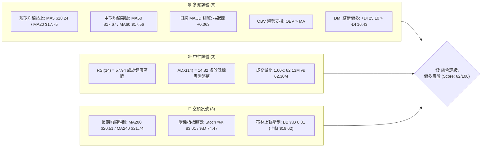
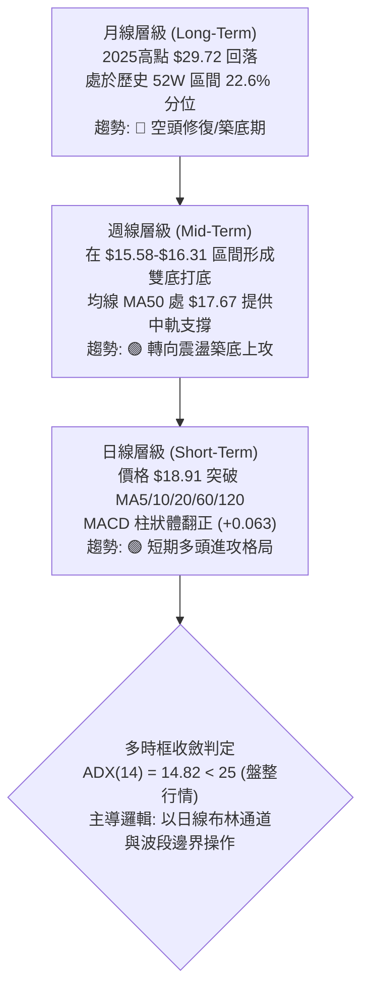
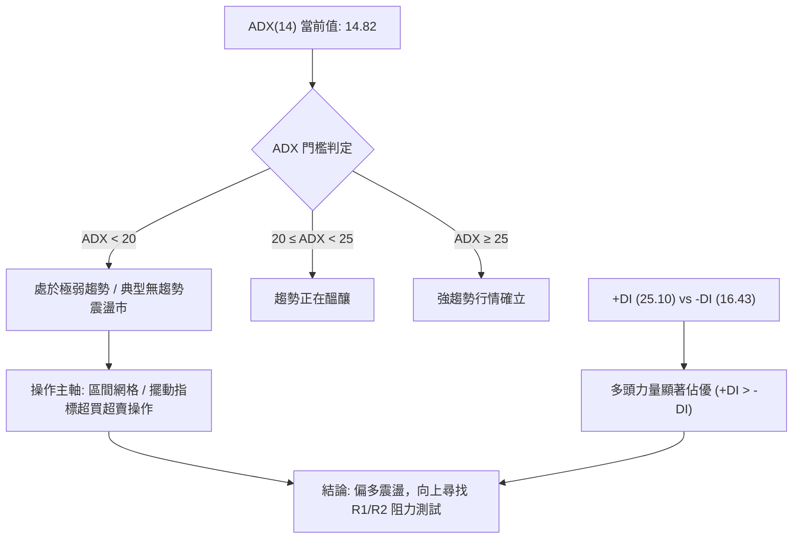
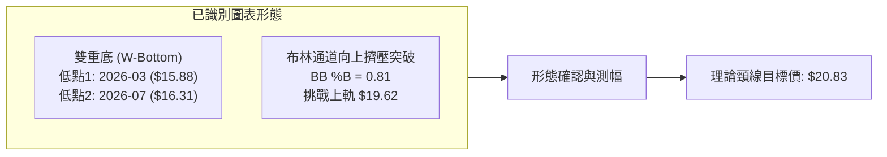
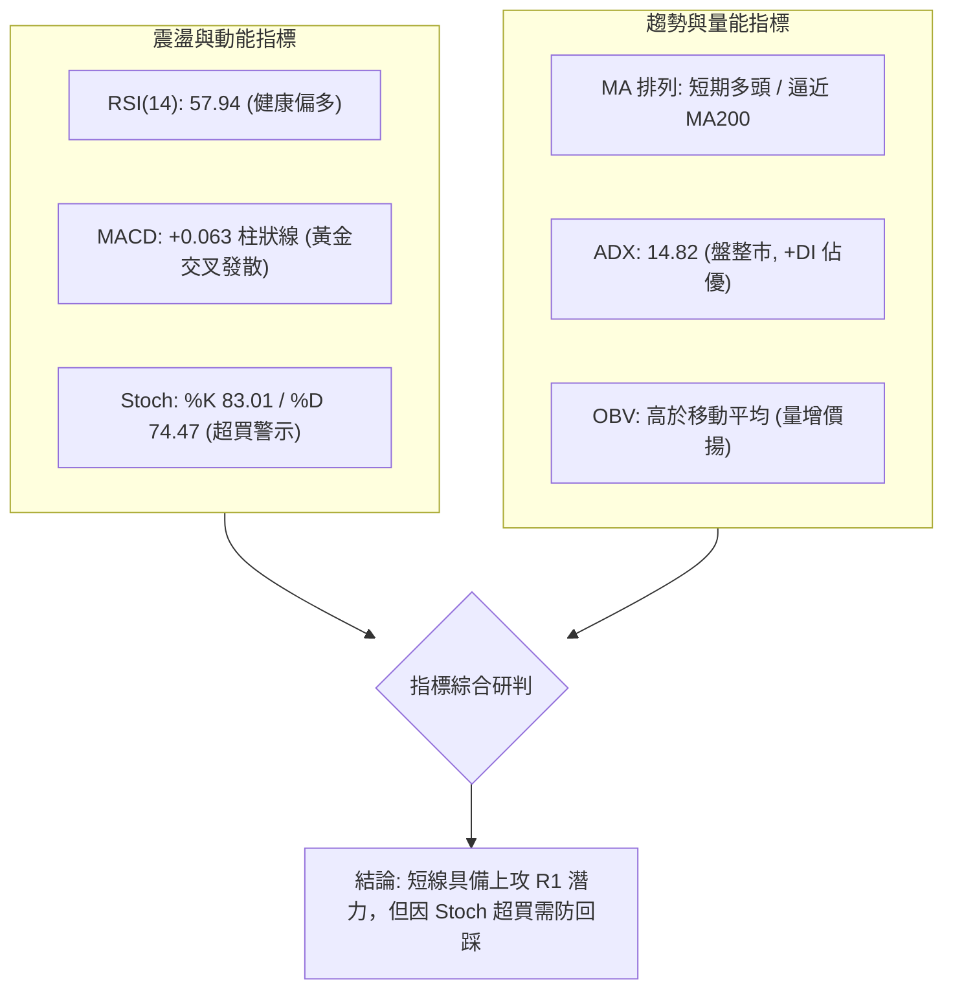
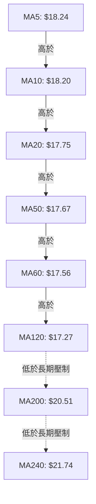
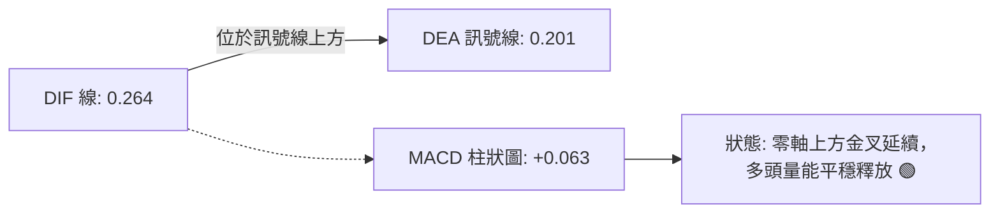
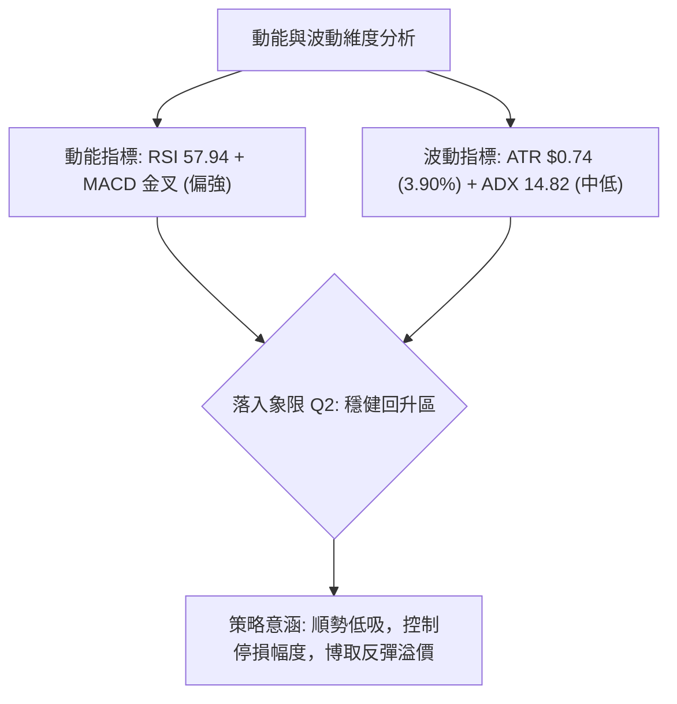
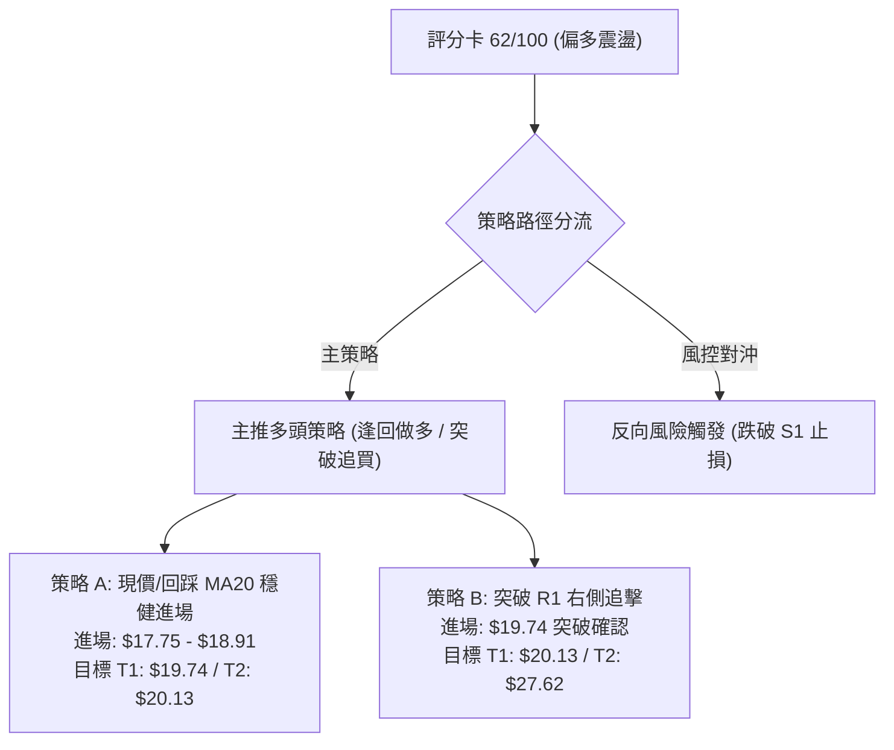
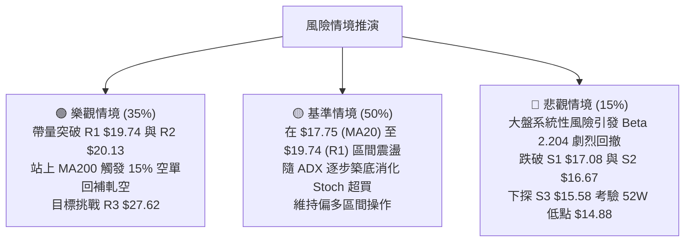

# SOFI 技術分析報告

> **報告日期**：2026-08-23 ｜ **語言**：繁體中文 ｜ **數據來源**：Yahoo Finance ｜ **當前價格**：$18.91

---

## 目錄

| 章節 | 內容 |
|------|------|
| [1. 技術面概覽](#1-技術面概覽) | 訊號儀表板、核心指標、評分卡 |
| [2. 趨勢分析](#2-趨勢分析) | 多時框趨勢、長中短期走勢 |
| [3. 圖表形態分析](#3-圖表形態分析) | 形態識別、K線組合、目標價 |
| [4. 支撐與阻力](#4-支撐與阻力) | 關鍵價位、斐波那契回調 |
| [5. 技術指標深度解讀](#5-技術指標深度解讀) | MA/RSI/MACD/布林/成交量 |
| [6. 動能與波動率](#6-動能與波動率) | 動能評估、ATR、Beta |
| [7. 多時框架總結](#7-多時框架總結) | 時框架評分矩陣 |
| [8. 交易策略建議](#8-交易策略建議) | 多空策略、風險報酬比 |
| [9. 風險提示與監控](#9-風險提示與監控) | 監控指標、風險場景 |

---

## 1. 技術面概覽

### 🎯 技術訊號儀表板



### 📊 核心指標速覽表

| 指標類別 | 指標名稱 | 當前數值 | 訊號 | 解讀 |
|----------|----------|----------|------|------|
| **價格** | 當前價格 | $18.91 | 🟢 | 站穩中短期均線密集區，呈現築底反彈格局 |
| **均線** | MA20 | $17.75 | 🟢 | 現價高於 MA20 (+6.51%)，短期上升趨勢明確 |
| **均線** | MA50 | $17.67 | 🟢 | 現價高於 MA50，中期底部結構確立 |
| **均線** | MA200 | $20.51 | 🔴 | 現價低於 MA200 (-7.80%)，長期趨勢仍受壓制 |
| **動能** | RSI(14) | 57.94 | 🟡 | 中性偏多，無超買或背離訊號，具上升空間 |
| **動能** | MACD (12,26,9) | 0.264 / Hist +0.063 | 🟢 | MACD 線處於訊號線上方，柱狀圖持續多頭發散 |
| **波動** | ATR(14) | $0.74 (3.90%) | 🟡 | 波動率處於中等水平，適合區間內波段交易 |

### 🏆 技術評分卡

```
╔══════════════════════════════════════════════════════════════╗
║              技術評分卡 — SOFI (2026-08-23)                  ║
╠══════════════════════════════════════════════════════════════╣
║ 趨勢強度      ██████░░░░░░░░░░░░░░  32/100  🟡 (ADX 14.82 盤整)║
║ 動能指標      ██████████████░░░░░░  70/100  🟢 (MACD金叉/RSI健)║
║ 支撐穩定度    ████████████████░░░░  80/100  🟢 (S1 $17.08穩固) ║
║ 成交量配合    ████████████░░░░░░░░  60/100  🟡 (OBV支撐/量能平)║
║ 形態完整度    ██████████████░░░░░░  70/100  🟢 (雙重底初成)    ║
║ 均線排列      ████████████░░░░░░░░  60/100  🟡 (短期多/長期空) ║
╠══════════════════════════════════════════════════════════════╣
║ 綜合評分      ████████████░░░░░░░░  62/100  🟢 偏多震盪 (買入) ║
╚══════════════════════════════════════════════════════════════╝
```

---

## 2. 趨勢分析

### 🌐 多時框趨勢分析



### 📈 長期趨勢 — 12個月走勢圖（Unicode）

```
SOFI 月線走勢圖（2025-09 至 2026-08）
價格軸 ($)
$30.00 ┤        ●29.68  ●29.72 (歷史峰值)
$27.00 ┤ ●26.42               ●26.18
$24.00 ┤                             ●22.81
$21.00 ┤                                                                
$18.00 ┤                                    ●17.76              ●18.22  ●17.93        ●18.91 ◄ (現價)
$15.00 ┤                                           ●15.88  ●16.10              ●16.31
       └─────────────────────────────────────────────────────────────────────────────────
         25-09   25-10   25-11   25-12   26-01   26-02   26-03   26-04   26-05   26-06   26-07   26-08
```

#### 走勢特徵分析表格

| 階段區間 | 時間跨度 | 起訖收盤價 | 區間漲跌幅 | 走勢特徵與技術含義 |
|----------|----------|------------|------------|--------------------|
| **強勢衝頂** | 2025-09 ~ 2025-11 | $26.42 → $29.72 | +12.49% | 主升浪頂部，最高觸及 52W 高點 $32.73 後量能衰竭 |
| **加速回落** | 2025-11 ~ 2026-03 | $29.72 → $15.88 | -46.57% | 均線空頭排列，跌破多道中期支撐，進行大幅度估值修正 |
| **底部築底** | 2026-03 ~ 2026-05 | $15.88 → $18.22 | +14.74% | 探測 52W 低點 $14.88 附近止跌，回補打底 |
| **二次探底** | 2026-05 ~ 2026-07 | $18.22 → $16.31 | -10.48% | 回測 S3 ($15.58) 支撐形成次低點，籌碼完成洗盤換手 |
| **反彈走強** | 2026-07 ~ 2026-08 | $16.31 → $18.91 | +15.94% | 站穩中短期均線，多頭重新掌控短期盤面 |

### 📊 中期趨勢（週線分析）

```
週線走勢與關鍵價位聚類示意：
$20.51 ────────────────────────────────────────── MA200 / 強阻力帶 (下壓中)
$20.13 ------------------------------------------ R2 (近一年波段次高點)
$19.74 ------------------------------------------ R1 (近期波段反彈高點阻力)
$18.91 ▲▲▲▲▲▲▲▲▲▲▲▲▲▲▲▲▲▲▲▲▲▲▲▲▲▲▲▲▲▲▲▲▲▲▲▲▲▲▲ 現價 ($18.91)
$17.75 ========================================== MA20 / BB中軌 (核心生命線)
$17.08 ------------------------------------------ S1 (近一年波段支撐)
$15.58 ────────────────────────────────────────── S3 / 52W 低點保護區 ($14.88)
```

### ⚡ 趨勢強度評估（ADX 解讀）



| 指標名稱 | 數值 | 參考標準 | 狀態評估 | 技術意義 |
|----------|------|----------|----------|----------|
| **ADX(14)** | 14.82 | < 25 (弱/盤整) | 🟡 弱趨勢/震盪 | 趨勢動能尚未進入單邊爆發期，價格易受上下軌壓制 |
| **+DI** | 25.10 | 高於 -DI 為多 | 🟢 多頭佔優 | 買方推升力道強於賣方拋壓 |
| **-DI** | 16.43 | 低於 +DI 為弱 | 🟢 空頭減弱 | 空方壓制力逐步消退 |

---

## 3. 圖表形態分析

### 🔍 形態識別系統



#### 形態信心度與判斷依據表

| 形態名稱 | 信心度 | 判斷依據（引用數據） | 完成度 | 目標價（附計算式） |
|----------|--------|----------------------|--------|--------------------|
| **雙重底 (W-Bottom)** | 75% | 2026-03 收盤低點 $15.88 與 2026-07 低點 $16.31 構成雙底支撐（聚類於 S3 $15.58 上方），頸線為 2026-05 反彈高點 $18.22 | 85%（現價已突破頸線 $18.22） | 頸線 $18.22 + 形態高度 ($18.22 - $15.61) = **$20.83** |
| **短期均線金叉發散** | 80% | MA5 ($18.24) > MA10 ($18.20) > MA20 ($17.75) > MA60 ($17.56)，短天期均線呈多頭排列 | 90% | 上方均線反壓目標 MA200: **$20.51** |
| **頭肩頂/旗形形態** | < 40% | 數據中未偵測到完整中繼旗形或頭肩頂結構 | 0% | 訊號不足，僅做指標型解讀 |

### 🕯️ 重要K線形態分析

| 月份/週期 | 收盤價 | K線形態特徵 | 解讀 | 訊號強度 |
|-----------|--------|-------------|------|----------|
| **2026-05** | $18.22 | 長紅反彈突破棒 | 自 $15.61 低點帶量拉升，確立第 1 底完成 | 🟢 強烈買訊 |
| **2026-06** | $17.93 | 窄幅整理十字線 | 高檔震盪，多空力量暫時平衡 | 🟡 中性整理 |
| **2026-07** | $16.31 | 回踩回測陰線 | 縮量二次探底，未破 52W 低點 $14.88，構築次低點 | 🟡 潛在底背離 |
| **2026-08** | $18.91 | 大陽線吞噬包覆 | 強勢收復 MA20/MA50 並突破 $18.22 頸線，多頭重掌節奏 | 🟢 明確轉強 |

### 📉 ASCII 走勢形態示意圖

```
SOFI 雙重底 (W-Bottom) 結構展開圖：
$20.83 ┬────────────────────────────────────────── 形態理論目標價 ($20.83)
       │                                  /
$19.74 ┤                             (R1)/  
$18.91 ┤                                ● 現價 ($18.91)
$18.22 ┼───────────────●頸線突破─────────────── 2026-05 頸線 ($18.22)
       │              / \              /
$17.00 ┤             /   \            /
$16.00 ┤      ●低點1      \     ●低點2
$15.58 ┴─────($15.88)──────\───($16.31)─────────── S3 支撐線 ($15.58)
       └───────03/26─────────05/26───07/26───08/26
```

### 🎯 形態目標價計算

1. **雙底頸線位**：取 2026-05 反彈頂點收盤價 **$18.22**。
2. **形態底部低點**：取波段實體低點聚類均值 **$15.61**（2026-05-17 週收盤最低點）。
3. **形態垂直高度**：$18.22 - $15.61 = **$2.61**。
4. **最小量度目標價 (Measured Move Target)**：$18.22 + $2.61 = **$20.83**（此價位精確落在 MA200 $20.51 上方，與波段阻力 R2 $20.13 形成共振阻力區）。

---

## 4. 支撐與阻力

### 🗺️ 關鍵價位分布圖（Unicode）

```
SOFI 價位結構分布圖
══════════════════════════════════════════════════════════════════
$32.73 ║██████████████████████████████║ 52W High (0.0% Fib)
$28.52 ║██████████████████            ║ 23.6% Fib 回調位
$27.62 ║████████████████████████████  ║ 強阻力 R3 (+46.06%)
$25.91 ║██████████████                ║ 38.2% Fib 回調位
$23.80 ║██████████                    ║ 50.0% Fib 中軸位
$21.70 ║████████████████              ║ 61.8% Fib 回調位 / MA240 ($21.74)
$20.51 ║████████████████████          ║ MA200 重大分水嶺
$20.13 ║████████████████████          ║ 阻力 R2 (+6.45%)
$19.74 ║████████████████████████      ║ 關鍵阻力 R1 (+4.39%)
$18.91 ╠══════════════════════════════╣ ◄ 當前價格 ($18.91)
$18.70 ║▓▓▓▓▓▓▓▓▓▓▓▓▓▓▓▓▓▓▓▓▓▓▓▓      ║ 78.6% Fib 回調位 (短線支撐)
$17.75 ║▓▓▓▓▓▓▓▓▓▓▓▓▓▓▓▓▓▓▓▓          ║ BB中軌 / MA20
$17.08 ║▓▓▓▓▓▓▓▓▓▓▓▓▓▓▓▓              ║ 近期波段支撐 S1 (-9.68%)
$16.67 ║▓▓▓▓▓▓▓▓▓▓▓▓                  ║ 核心結構支撐 S2 (-11.86%)
$15.58 ║██████████████████████████████║ 強支撐 S3 (-17.63%)
$14.88 ║██████████████████████████████║ 52W Low (100.0% Fib)
══════════════════════════════════════════════════════════════════
```

### 🚧 阻力位分析表

| 阻力級別 | 價位 | 形成原因 | 突破難度 | 重要性 |
|----------|------|----------|----------|--------|
| **R1** | **$19.74** | 近一年波段密集反彈高點聚類，逼近布林上軌 $19.62 | 🟡 中等 | 短期突破點；站穩後開啟上行空間 |
| **R2** | **$20.13** | 波段次高點，與 MA200 ($20.51) 構成空頭密集防守區 | 🔴 較高 | 中期多空牛熊分水嶺 |
| **R3** | **$27.62** | 歷史主升段派發平台高點聚類 (+46.06%) | 🔴 極高 | 長期戰略目標價 |

### 🛡️ 支撐位分析表

| 支撐級別 | 價位 | 形成原因 | 守住機率 | 重要性 |
|----------|------|----------|----------|--------|
| **S1** | **$17.08** | 近一年波段低點密集區，靠近 MA60 ($17.56) 防守帶 | 80% 🟢 | 短期防守線，跌破則轉入弱勢震盪 |
| **S2** | **$16.67** | 7月中下旬回調整理平台底部支撐 | 85% 🟢 | 中期多頭防線 |
| **S3** | **$15.58** | 雙重底形態結構底、52W 區間低點緩衝區 | 95% 🟢 | 強度極高之長期底部護城河 |

### 📐 斐波那契回調位分析

> 計算基準：52週波段區間 **$14.88 (100.0%) → $32.73 (0.0%)**

| 斐波那契回調層級 | 價位 | 當前狀態與技術意義 |
|------------------|------|--------------------|
| **0.0% (52W High)** | **$32.73** | 週期最高點，長期極限壓力 |
| **23.6%** | **$28.52** | 強勢修正目標位 |
| **38.2%** | **$25.91** | 中級反彈目標位 |
| **50.0%** | **$23.80** | 多空平衡中軸位 |
| **61.8%** | **$21.70** | 黃金分割重要轉折點（與 MA240 $21.74 完美共振） |
| **78.6%** | **$18.70** | **現價 ($18.91) 剛突破此關鍵壓制，轉化為現階段最直接支撐** |
| **100.0% (52W Low)** | **$14.88** | 週期最低點，終極支撐防線 |

**位置解讀**：現價 $18.91 剛好脫離 **78.6% 回調位 ($18.70)**，處於 78.6% ($18.70) 至 61.8% ($21.70) 的向上回補空間內。一旦站穩 $18.70，上方將直指 61.8% 的黃金共振阻力位 $21.70。

---

## 5. 技術指標深度解讀

### 🎛️ 指標訊號總覽



### 📈 移動平均線排列分析



| 均線名稱 | 數值 | 現價差距 | 乖離率 (%) | 狀態與訊號 |
|----------|------|----------|------------|------------|
| **MA 5** | $18.24 | +$0.67 | +3.65% | 🟢 短期攻擊線，向上發散 |
| **MA 10** | $18.20 | +$0.71 | +3.91% | 🟢 支撐良好 |
| **MA 20** | $17.75 | +$1.16 | +6.51% | 🟢 中短週期生命線，已完成多頭轉向 |
| **MA 50** | $17.67 | +$1.24 | +7.02% | 🟢 中期趨勢線走平翻揚 |
| **MA 60** | $17.56 | +$1.35 | +7.66% | 🟢 季線支撐強勁 |
| **MA 120** | $17.27 | +$1.64 | +9.47% | 🟢 半年線形成有力承接墊 |
| **MA 200** | $20.51 | -$1.60 | -7.80% | 🔴 年線反壓，長期空頭未完全扭轉 |
| **MA 240** | $21.74 | -$2.83 | -13.03% | 🔴 長期下降軌道壓制 |

**排列總結**：呈現「短期多頭排列、長期混合排列」。現價已成功站上 MA5 至 MA120 所有中短期均線，多頭排列順暢；但上方 MA200 ($20.51) 仍具顯著壓制力。

### 📉 RSI(14) 分析

- **當前數值**：**57.94**
- **強度進度條**：`[████████████░░░░░░░░] 57.94%`
- **超買超賣判定**：處於 30 至 70 之健康擴張區間，無鈍化或超買跡象。
- **背離分析**：
  - **日線背離**：無明顯背離。
  - **週線走勢**：2026-05 低點 RSI 為 24.9，2026-07 二次探底時價格降至 $16.31 但 RSI 維持在 37.4，形成微幅**週線底背離**，隨後帶動 8 月反彈。

### 📊 MACD(12,26,9) 訊號解讀



- **MACD 線**：0.264
- **Signal 線**：0.201
- **MACD 柱狀圖 (Histogram)**：**+0.063**
- **解讀**：柱狀圖在 2026-08 由負轉正，目前穩定於正值區間，且零軸上方開口持續擴大，表明買方動能保持主動。

### 📦 布林通道分析

```
SOFI 布林通道結構 (BB 20, 2)
$19.62 ┬────────────────────────────────────────── BB 上軌 (Upper Band)
       │                                  
$18.91 ┼───────────────────────● 現價 ($18.91, %B = 0.81)
       │
$17.75 ┼────────────────────────────────────────── BB 中軌 / MA20 (Middle Band)
       │
$15.88 ┴────────────────────────────────────────── BB 下軌 (Lower Band)
```

- **帶寬與位置**：BB 上軌 $19.62，中軌 $17.75，下軌 $15.88。
- **%B 指標**：**0.81**（價格位於中軌與上軌之間，靠近上軌）。
- **解讀**：當前通道未見劇烈開口膨脹，呈現向上收斂型擠壓通道，現價 $18.91 逼近上軌 $19.62，短線在 $19.62 至 $19.74 (R1) 區間存在震盪回吐壓力。

### 💹 成交量分析（量價配合度）

```
最新成交量:  ████████████ 62.13M
20日均量:   ████████████ 62.30M (量比: 1.00x)
50日均量:   ███████████████ 75.70M
```

- **量價特徵**：最新成交量 62.13M 與 20日均量 62.30M 相當（量比 1.00x），但低於 50日均量 75.70M。這說明反彈過程中主力未盲目追價，籌碼鎖定良好。
- **OBV (能量潮)**：**OBV > MA**，量能趨勢向上，確認本次自 $16.31 發動的走勢為健康的多頭放量、拉回縮量架構，無量價背離隱憂。

---

## 6. 動能與波動率

### ⚡ 動能評估

| 象限區間 | 動能維度 | 波動維度 | 包含指標 | 當前 SOFI 狀態與評估 |
|----------|----------|----------|----------|----------------------|
| **Q1 (擴張區)** | 強 | 低 | 突破初期 | — |
| **Q2 (主動區)** | **強** | **低/中** | **RSI 57.94 / ATR 3.90%** | **✓ 當前所處位置**：動能健康翻多，波動適中，利於佈局 |
| **Q3 (過熱區)** | 強 | 高 | 突破末期 | — |
| **Q4 (衰退區)** | 弱 | 高 | 下跌放量 | — |



### 📊 ATR 波動率分析

- **ATR(14)**：**$0.74**
- **價格波動百分比**：**3.90%**
- **止損距離建議**：
  - **激進型短線**：1.0 × ATR = **$0.74**（現價下方 $18.17）
  - **標準型波段**：1.5 × ATR = **$1.11**（現價下方 $17.80，緊貼 MA20 $17.75）
  - **穩健型防守**：2.0 × ATR = **$1.48**（現價下方 $17.43，貼近 S1 $17.08 上方）

### 📐 Beta 與市場相關性

- **Beta 係數**：**2.204**（高彈性成長/金融科技特徵）
- **解讀**：SOFI 具備高貝塔屬性，波動幅度約為標普500指數的 2.2 倍。在大盤多頭環境下具備極佳進攻爆發力，但在市場避險階段亦容易放大回撤，部位管理必須嚴守比例限制。
- **空頭比例 (Short % Float)**：**15.0%**（Short Ratio 2.22 天）。具備潛在軋空動能（Short Squeeze Potential），若價格強勢突破 MA200 ($20.51)，空頭回補將加速推升股價。

---

## 7. 多時框架總結

### 📋 時框架評分表

| 時框架 | 趨勢方向 | 動能狀態 | 均線排列 | 形態結構 | 綜合評分 | 交易建議 |
|--------|----------|----------|----------|----------|----------|----------|
| **月線 (長期)** | 🔴 偏空築底 | 🟡 RSI 弱勢走平 | 🔴 MA200 壓制 | 52W 低點保護 | 45/100 | 長期分批佈局 |
| **週線 (中期)** | 🟢 震盪轉強 | 🟢 MACD 金叉醞釀 | 🟡 MA50 支撐 | 雙底形態確立 | 65/100 | 回踩逢低加碼 |
| **日線 (短期)** | 🟢 多頭進攻 | 🟢 MACD 翻紅/OBV增 | 🟢 短期多頭排列 | 挑戰 BB 上軌 | 75/100 | 順勢偏多波段 |

### 🔲 綜合訊號矩陣

```
時框維度       趨勢訊號       動能訊號       量價確認       結論
────────────────────────────────────────────────────────────────
短期 (日線)    🟢 看多        🟢 看多        🟢 確認        偏多操作
中期 (週線)    🟢 看多        🟡 中性        🟢 確認        震盪築底
長期 (月線)    🔴 看空        🟡 中性        🟡 中性        長期修復
────────────────────────────────────────────────────────────────
綜合判定: ADX 14.82 (< 25) 判定為「盤整築底行情」，依規則由日線布林區間與波段支撐主導。
```

### ⚖️ 多時框收斂結論

> **收斂法則執行**：當前 ADX(14) = **14.82 < 25**，判定為**盤整/修復行情**。依多時框收斂規則，行情並非單邊大趨勢，交易邏輯應以**日線布林通道 ($15.88 - $19.62) 及波段支撐阻力為核心邊界**。
> 
> **唯一方向性結論**：**🟢 偏多震盪（逢低做多）**。
> 
> 雖然長期月線仍受制於 MA200 ($20.51)，但日線短期均線多頭排列完整、MACD 柱狀體翻正、且週線雙底成型，空方力量退潮。本報告主策略全面鎖定**偏多操作**，上行測試 R1 ($19.74) 及 R2 ($20.13)。

---

## 8. 交易策略建議

### 🗺️ 策略決策流程圖



### 🧭 策略路由

**當前主策略方向 = 🟢 多頭波段策略（依評分 62/100）**

### 🎯 價格情境階梯（Price Scenarios）

| 觸發條件 | 下一目標 | 後續延伸 | 情境含義 | 操作應對 |
|----------|----------|----------|----------|----------|
| **突破 R1 $19.74** | R2 **$20.13** | R3 **$27.62** | 突破布林上軌與短線壓力，多頭加速 | 執行策略 B，加碼追擊波段 |
| **站穩現價區間 ($18.70-$18.91)** | R1 **$19.74** | R2 **$20.13** | 依託 78.6% Fib 進行常態震盪盤堅 | 執行策略 A，持股續抱 |
| **跌破 S1 $17.08** | S2 **$16.67** | S3 **$15.58** | 跌破日線生命線，短期雙底結構受損 | 執行停損，部位降至 0-10% |

### 📊 情境機率分佈

| 向上/震盪/向下情境 | 機率 | 主要技術依據 |
|--------------------|------|--------------|
| **上行測試 R1/R2** | **60%** | MACD 柱狀體翻正 (+0.063)、OBV 趨勢支撐、短期均線多頭排列 |
| **區間窄幅震盪** | **25%** | ADX 14.82 偏低，布林通道上軌 $19.62 提供短線反壓 |
| **回落跌破 S1 探底** | **15%** | Stoch 超買短期回吐壓力、Beta 2.204 易受大盤拉回影響 |

### 🟢 主策略詳情

| 策略要素 | 策略 A（穩健型：回踩支撐低吸） | 策略 B（激進型：突破 R1 追擊） |
|----------|--------------------------------|--------------------------------|
| **適用邏輯** | 依託 MA20 與 78.6% Fib 回踩進場 | 帶量突破 R1 關鍵反彈高點追多 |
| **進場條件** | 現價 $18.91 至回踩 MA20 $17.75 區間分批買入 | 日線收盤價實質突破 R1 $19.74 且成交量 > 75M |
| **進場價格** | **$18.24** (MA5 附近均價) | **$19.74** |
| **目標價 T1** | **$19.74** (R1 阻力位) | **$20.13** (R2 阻力位) |
| **目標價 T2** | **$20.13** (R2 / MA200 阻力帶) | **$27.62** (R3 長期目標位) |
| **止損價格** | **$17.08** (S1 支撐位下方) | **$18.70** (78.6% Fib 轉化支撐) |
| **風險報酬比** | **1 : 1.63** (至 T2 為 **1 : 1.95**) | **1 : 7.58** (至 T2 測幅) |
| **成功機率** | **65%** | **55%** |
| **建議倉位** | **15% - 20%** | **10% - 15%** |

### 🔴 反向風險觸發點（對沖提示）

- **關鍵反轉點**：若日線收盤價跌破 **S1 ($17.08)**，意味著跌破短期所有均線支撐，雙底形態失敗。
- **對沖處置**：跌破 $17.08 應立即將多頭部位無條件止損出局，或買入 Put 選擇權對沖現貨部位，下方防守目標退守至 **S3 ($15.58)**。

### ⭐ 整體訊號強度評星

```
做多訊號強度：★★★★☆  (4/5星)
做空訊號強度：★★☆☆☆  (2/5星)
整體可信度：  ★★★★☆  (4/5星)
```

---

## 9. 風險提示與監控

### ✅ 關鍵監控指標 Checklist

```
╔══════════════════════════════════════════════════════════════╗
║               SOFI 每日交易監控清單 (Checklist)              ║
╠══════════════════════════════════════════════════════════════╣
║ [ ] 價格是否維持在 78.6% Fib ($18.70) 之上？                  ║
║ [ ] RSI(14) 是否跌破 50 中軸防守區？                         ║
║ [ ] MACD 柱狀體是否持續大於 0 (目前 +0.063)？                 ║
║ [ ] 成交量是否突破 50日均量 (75.70M) 配合進攻？              ║
║ [ ] 價格觸及布林上軌 $19.62 時是否出現滯漲長上影線？         ║
║ [ ] 空頭回補力道：觀察空單比例 15.0% 是否出現平倉踩踏？      ║
╚══════════════════════════════════════════════════════════════╝
```

### ⚠️ 風險場景分析



### 🛡️ 風險管理重要提醒

1. **高 Beta 波動控制**：SOFI Beta 高達 2.204，日波動幅度 ATR 達 3.90%。單筆交易最大虧損額度必須嚴格控制在總投資組合資金的 1.0% - 1.5% 以內。
2. **阻力密集區減碼紀律**：當價格接近 **R1 ($19.74)** 至 **R2 ($20.13)** 時，因逼近 MA200 ($20.51) 與布林上軌，建議至少平倉 50% 多頭部位鎖定獲利，剩餘部位上移移動止損至進場點。
3. **軋空與財報催化**：高達 15.0% 的空頭部位意味著一旦突破 $20.13，將產生劇烈空頭踩踏，切勿在 $18.91 上方盲目進行左側逆勢摸頂放空。

---

## 📋 報告總結

```
SOFI 技術分析報告總結
══════════════════════════════════════════════════════════════
報告日期：2026-08-23
當前價格：$18.91
分析評級：🟢 偏多震盪 (買入 / 綜合評分 62/100)

關鍵結論：
├─ 長期趨勢：🔴 空頭修復中 (處於 MA200 $20.51 之下)
├─ 中期趨勢：🟢 震盪築底確立 (雙重底形成，頸線 $18.22 已過)
├─ 短期趨勢：🟢 多頭進攻 (均線呈短期多頭排列，MACD 金叉)
├─ 關鍵支撐：S1: $17.08  /  S2: $16.67  /  S3: $15.58
├─ 關鍵阻力：R1: $19.74  /  R2: $20.13  /  R3: $27.62
└─ 分析師目標：均價 $19.98 (高 $30.00 / 低 $12.00)

最優策略組合：
1. 🥇 最佳機會：策略 A (回踩 MA5/MA20 區間 $18.24 佈局多單，目標 $19.74 / $20.13)
2. 🥈 次選機會：策略 B (帶量突破 R1 $19.74 追擊，博取軋空至 R2 $20.13 / R3 $27.62)
3. 🥉 保守選擇：等待價格回測 S1 $17.08 獲得支撐確認後再行介入
══════════════════════════════════════════════════════════════
```

---

> ⚠️ **免責聲明**：本報告為 AI 自動生成之技術分析，所有數據及估算均基於提供的歷史價格資訊。本報告**僅供研究與學術參考**，**不構成任何投資建議**。投資有風險，入市需謹慎。

---

*報告生成時間：2026-08-23 ｜ 數據來源：Yahoo Finance ｜ 分析框架：多時框技術分析*