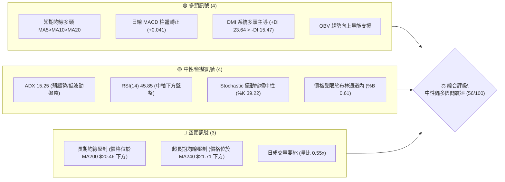
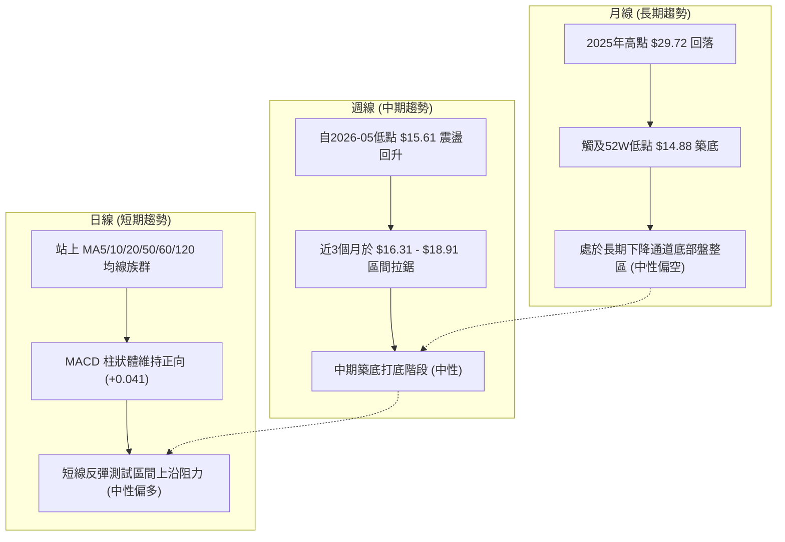
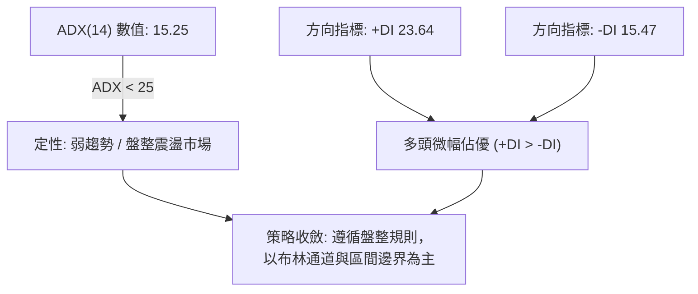
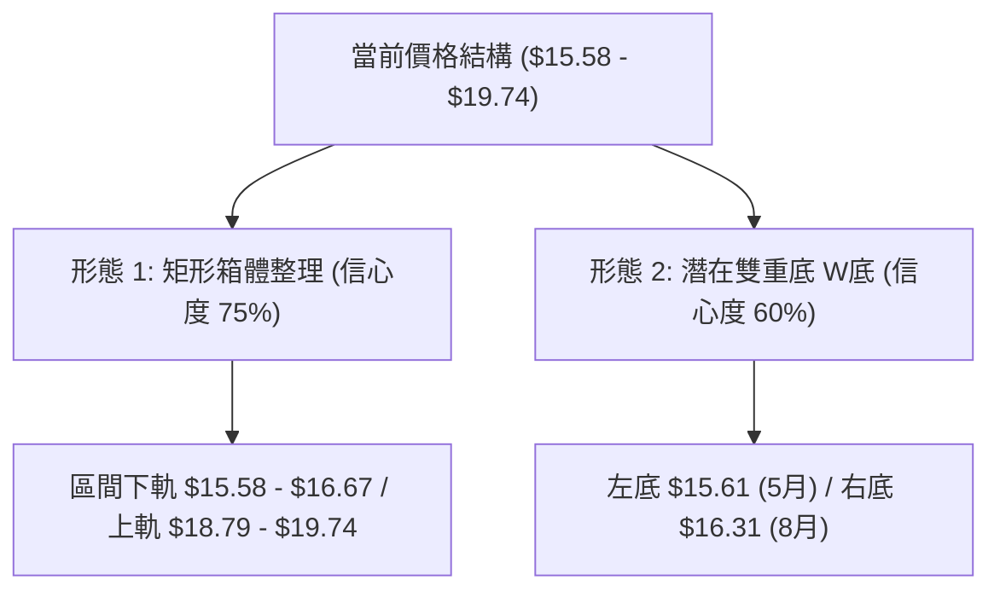
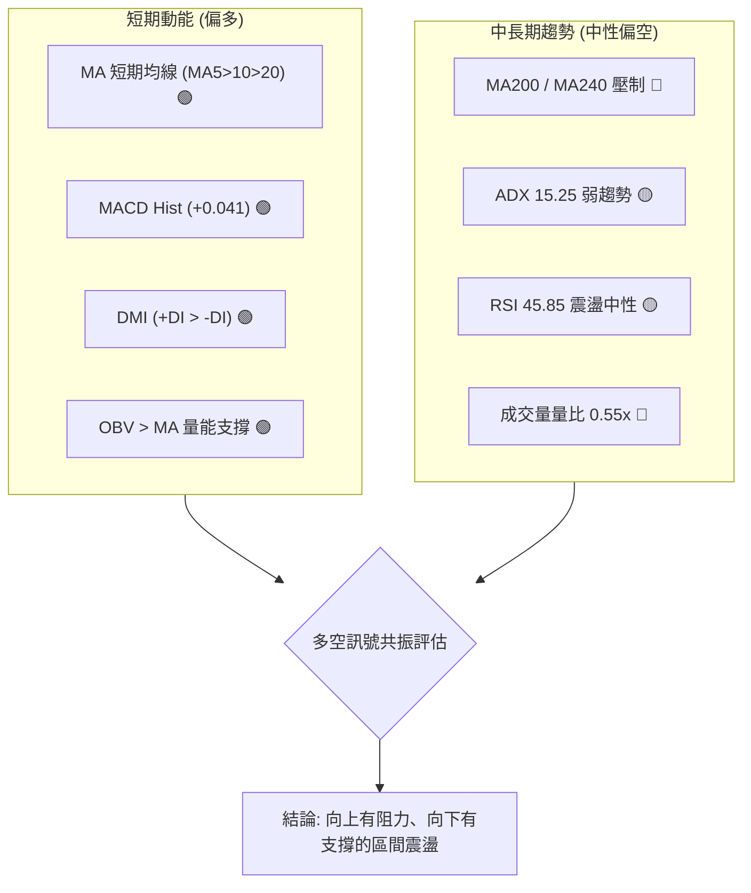
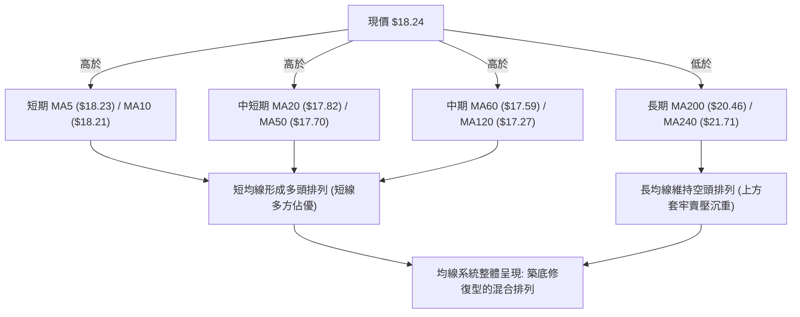
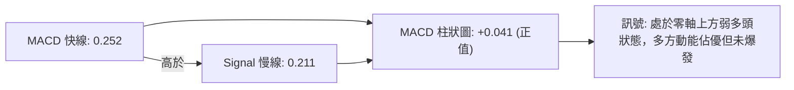
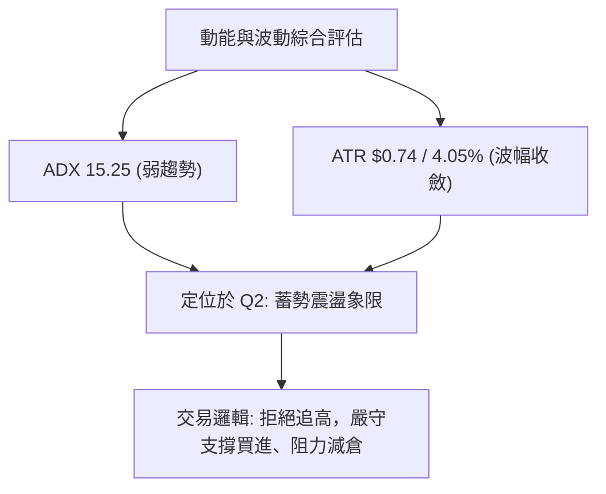
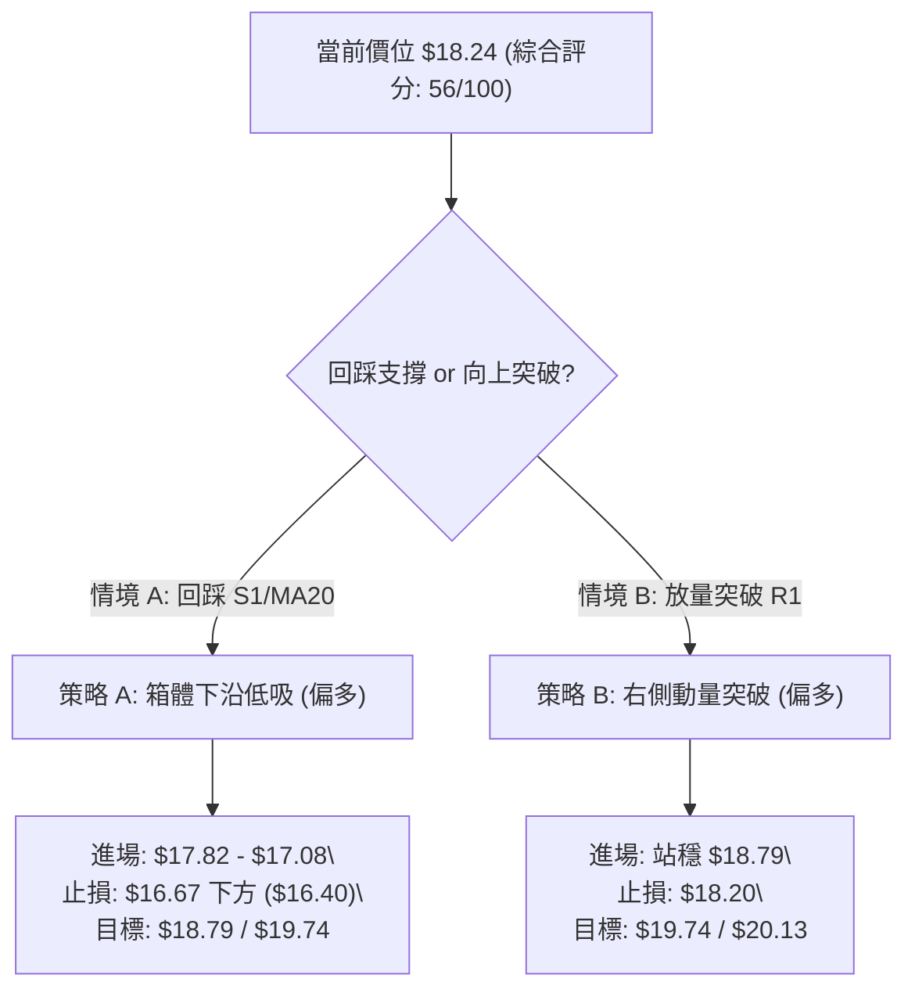
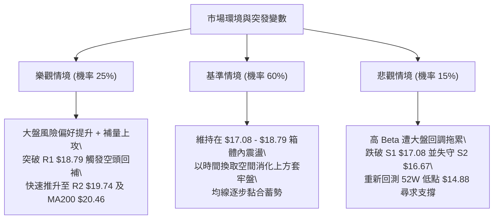

# SOFI 技術分析報告

> **報告日期**：2026-08-24 ｜ **語言**：繁體中文 ｜ **數據來源**：Yahoo Finance ｜ **當前價格**：$18.24

---

## 目錄

| 章節 | 內容 |
|------|------|
| [1. 技術面概覽](#1-技術面概覽) | 訊號儀表板、核心指標、評分卡 |
| [2. 趨勢分析](#2-趨勢分析) | 多時框趨勢、長中短期走勢 |
| [3. 圖表形態分析](#3-圖表形態分析) | 形態識別、K線組合、目標價 |
| [4. 支撐與阻力](#4-支撐與阻力) | 關鍵價位、斐波那契回調 |
| [5. 技術指標深度解讀](#5-技術指標深度解讀) | MA/RSI/MACD/布林/成交量 |
| [6. 動能與波動率](#6-動能與波動率) | 動能評估、ATR、Beta |
| [7. 多時框架總結](#7-多時框架總結) | 時框架評分矩陣、收斂結論 |
| [8. 交易策略建議](#8-交易策略建議) | 多空策略、價格情境、風險報酬比 |
| [9. 風險提示與監控](#9-風險提示與監控) | 監控指標、風險場景、總結 |

---

## 1. 技術面概覽

### 🎯 技術訊號儀表板



### 📊 核心指標速覽表

| 指標類別 | 指標名稱 | 當前數值 | 訊號 | 解讀 |
|----------|----------|----------|------|------|
| **價格** | 當前價格 | $18.24 | 🟡 | 位於52週區間18.8%分位，處於底部向上反彈震盪區 |
| **均線** | MA20 | $17.82 | 🟢 | 現價高於MA20 (+2.34%)，短期支撐有效 |
| **均線** | MA50 | $17.70 | 🟢 | 現價高於MA50 (+3.05%)，中期築底初見成效 |
| **均線** | MA200 | $20.46 | 🔴 | 現價低於MA200 (-10.85%)，長期空頭壓制未解 |
| **動能** | RSI(14) | 45.85 | 🟡 | 處於40–60中性平衡區，未見超買或超賣 |
| **動能** | MACD | 0.252 (柱: +0.041) | 🟢 | MACD線高於訊號線(0.211)，動能微幅偏多 |
| **趨勢** | ADX(14) | 15.25 | 🟡 | ADX < 25 表明處於無明顯單邊趨勢的盤整格局 |
| **通道** | 布林帶 %B | 0.61 | 🟡 | 價格位於中軌($17.82)與上軌($19.66)之間 |
| **量能** | 20日均量比 | 0.55x | 🔴 | 成交量萎縮至3,322萬股，突破動能不足 |
| **波動** | ATR(14) | $0.74 | 🟡 | 每日平均波動幅度約4.05%，波幅近期收斂 |

### 🏆 技術評分卡

```
╔══════════════════════════════════════════════════════════════╗
║             技術評分卡 — SOFI (2026-08-24)                   ║
╠══════════════════════════════════════════════════════════════╣
║ 趨勢強度 (ADX/DMI)   ███████░░░░░░░░░░░░░  35/100  🔴 弱勢盤整 ║
║ 動能指標 (RSI/MACD)  ████████████░░░░░░░░  60/100  🟢 短多修復 ║
║ 支撐穩定度 (S1-S3)   ██████████████░░░░░░  70/100  🟢 底部支撐 ║
║ 成交量配合 (OBV/VOL) ██████████░░░░░░░░░░  50/100  🟡 量能不足 ║
║ 形態完整度 (底型/區間)████████████░░░░░░░░  60/100  🟡 區間築底 ║
║ 均線排列 (短多長空)   ████████████░░░░░░░░  60/100  🟡 均線修復 ║
╠══════════════════════════════════════════════════════════════╣
║ 綜合評分             ███████████░░░░░░░░░  56/100  中性偏多    ║
╚══════════════════════════════════════════════════════════════╝
```

---

## 2. 趨勢分析

### 🌐 多時框趨勢分析



### 📈 長期趨勢 — 12個月走勢圖（Unicode）

```
SOFI 月線收盤走勢圖（過去12個月：2025-08 至 2026-08）
價格 ($)
$30.00 ┤                     ●(11月 $29.72)
$28.00 ┤                  ●(10月 $29.68)
$26.00 ┤       ●(8月 $25.54) ●(9月 $26.42) ●(12月 $26.18)
$24.00 ┤
$22.00 ┤                                  ●(1月 $22.81)
$20.00 ┤
$18.00 ┤                                        ●(2月 $17.76)   ●(5月 $18.22)   ●(8月 $18.24)◄現價
$16.00 ┤                                              ●(3月 $15.88) ●(4月 $16.10) ●(6月 $17.93) ●(7月 $16.31)
$14.00 ┤                                                    ●(52W低點 $14.88)
       └──────────────────────────────────────────────────────────────────────────────────────────
         08/25 09/25 10/25 11/25 12/25 01/26 02/26 03/26 04/26 05/26 06/26 07/26 08/26 (月份)
```

**走勢特徵分析表格**：

| 階段 | 時間區間 | 起止價位 | 漲跌幅 | 趨勢特徵與結構 |
|------|----------|----------|--------|----------------|
| **波段頂部** | 2025-08 至 2025-11 | $25.54 → $29.72 | +16.37% | 高位見頂，在 $29.70 附近構築雙頂後動能衰竭 |
| **主跌推動** | 2025-11 至 2026-03 | $29.72 → $15.88 | -46.57% | 帶量單邊下跌，連續跌破多條長期均線支撐 |
| **底部構築** | 2026-03 至 2026-05 | $15.88 → $15.61 (低 $14.88) | -1.70% | 測試52週低點 $14.88，於 $15.60 附近展開初級築底 |
| **箱體震盪** | 2026-05 至 2026-08 | $15.61 → $18.24 | +16.85% | 於 $16.00–$19.00 區間反覆洗盤，短期均線逐步由空翻多 |

### 📊 中期趨勢（週線分析）

```
SOFI 週線關鍵區間與形態走勢示意
 $20.46 ─────────────────────────────── MA200 強阻力區間 (下降通道上軌)
 $19.74 ------------------------------- 波段阻力 R2 / 7月反彈高點聚類
 $18.79 ═══════════════════════════════ 即期阻力 R1 (Fib 78.6% $18.70)
 $18.24 ◀═════ [現價位於震盪箱體中軸上方] ═════
 $17.08 ------------------------------- 波段支撐 S1 (MA20 $17.82 / MA50 $17.70 緩衝帶)
 $16.67 ═══════════════════════════════ 中期強支撐 S2 (7月/8月回踩平台)
 $14.88 ─────────────────────────────── 52週低點 / 結構性多頭底線
```

近20週數據顯示，SOFI 自2026年5月中旬觸及週線收盤低點 $15.61 以來，週線 RSI 擺脫了超賣區間（從 24.9 回升至當前 45.8），MACD 柱狀體多次在零軸附近震盪翻正，反映中期賣壓大幅釋放，正進入中期的箱體消化期。

### ⚡ 趨勢強度評估（ADX 解讀）



**ADX 趨勢強度對照解讀**：

| 指標 | 數值 | 參考閾值 | 市場狀態解讀 |
|------|------|----------|--------------|
| **ADX(14)** | **15.25** | `< 20: 弱趨勢/無趨勢` | 極弱趨勢，當前不具備單邊突破的持續動能，假突破機率較高 |
| **+DI** | **23.64** | `> -DI` | 買盤力道暫時強於賣盤，多頭掌控短期節奏 |
| **-DI** | **15.47** | `< 20` | 空方拋壓持續減弱，無強烈砸盤意願 |
| **綜合判定** | 震盪偏多 | `ADX<25 且 +DI>-DI` | 處於**低波動蓄勢盤整**階段，優先採取高拋低吸的區間策略 |

---

## 3. 圖表形態分析

### 🔍 形態識別系統



**形態信心度與參數評估表**：

| 形態名稱 | 信心度 | 判斷依據（引用數據） | 完成度 | 目標價（附精確計算式） |
|----------|--------|----------------------|--------|------------------------|
| **矩形箱體整理** | **75%** | 價格在 S2 $16.67 與 R1 $18.79 之間形成長達3個月的密集震盪 | 85% | 上破 R1 後等幅測算：<br>$18.79 + ($18.79 - $16.67) = **$20.91** |
| **潛在雙重底 (W底)** | **60%** | 5月中旬低點 $15.61 與 8月初低點 $16.31 構成雙底雛形，頸線位於 R1 $18.79 | 65% | 頸線突破目標測算：<br>頸線 $18.79 + 形態高度($18.79 - $15.61 = $3.18) = **$21.97** |
| **頭肩底形態** | **30%** | 左肩 $15.88、頭部 $14.88、右肩 $16.31，但右肩結構不對稱 | 35% | *信心度 < 50%，依規則不予採納為主要交易依據* |

### 🕯️ 重要K線形態分析

| 期間/月份 | 收盤價 | K線形態 | 技術解讀 | 訊號 |
|-----------|--------|---------|----------|------|
| **2026-05-17 (週)** | $15.61 | 長下影錘頭線 | 於52週低點上方探底回升，出現初步止跌訊號 | 🟢 看多反彈 |
| **2026-05-31 (週)** | $18.22 | 大陽線實體包覆 | 一舉收復前三週失地，確認短線底部確立 | 🟢 轉強訊號 |
| **2026-07-12 (週)** | $18.78 | 遇阻長上影流星 | 上衝至 R1 $18.79 附近遭空頭壓制，未形成有效突破 | 🔴 阻力確認 |
| **2026-08-02 (週)** | $16.31 | 縮量十字星 | 回踩 S2 $16.67 附近獲支撐，形成雙底之右底結構 | 🟢 二次確認 |
| **2026-08-23 (週)** | $18.91 | 假突破倒錘頭 | 盤中刺穿 R1 $18.79 後收回，顯示高檔賣壓依然存在 | 🟡 震盪整理 |

### 📉 ASCII 走勢形態示意圖

```
SOFI 雙重底 (W-Bottom) 與箱體形態示意
價格 ($)
$19.74 ┤                                     [R2 阻力]
$18.79 ┼───────────●─────────────────────────●─────────── 頸線 / 箱體上沿 (R1)
       │          / \                       / \
$18.24 ┤         /   \             ●◄現價  /   \
$17.08 ┤        /     \           /  \    /     \      [S1 支撐帶]
$16.31 ┤       /       \         /    ●──┘       \     右底 (2026-08)
$15.61 ┼──────●─────────●───────┘                      左底 (2026-05) / 箱體下沿 (S2)
$14.88 ┴─────┴──────────────────────────────────────── 52W 歷史低點
             5月       6月        7月       8月
```

### 🎯 形態目標價計算

- **箱體突破目標價**：
  - 箱體上沿：$18.79 (R1)
  - 箱體下沿：$16.67 (S2)
  - 垂直高度 $H_1 = 18.79 - 16.67 = 2.12$
  - 目標價 $T_{Box} = 18.79 + 2.12 =$ **$20.91**（高度接近 MA240 $21.71 與斐波那契 61.8% $21.70）
- **雙重底測量目標價**：
  - 頸線位置：$18.79 (R1)
  - 最低底點：$15.61 (2026-05-17 收盤)
  - 形態高度 $H_2 = 18.79 - 15.61 = 3.18$
  - 目標價 $T_{W} = 18.79 + 3.18 =$ **$21.97**

---

## 4. 支撐與阻力

### 🗺️ 關鍵價位分布圖（Unicode）

```
SOFI 價位結構分布圖
═════════════════════════════════════════════════════════════════
$21.70 ║██████████████████████████████║ Fib 61.8% / MA240 重壓區
$20.46 ║██████████████████████████    ║ MA200 長期均線阻力
$20.13 ║████████████████████          ║ 強阻力 R3 (+10.36%)
$19.74 ║████████████████              ║ 阻力 R2 / BB上軌 $19.66 (+8.22%)
$18.79 ║██████████████████████████    ║ 關鍵頸線阻力 R1 (+2.99%) / Fib 78.6% $18.70
$18.24 ╠══════════════════════════════╣ ◄ 當前價格 ($18.24)
$17.82 ║▓▓▓▓▓▓▓▓▓▓▓▓▓▓▓▓              ║ MA20 短期動態支撐 / BB中軌
$17.08 ║▓▓▓▓▓▓▓▓▓▓▓▓▓▓▓▓▓▓▓▓          ║ 近期波段支撐 S1 (-6.36%)
$16.67 ║████████████████████████      ║ 中期關鍵強支撐 S2 (-8.63%)
$15.58 ║████████████████████████████  ║ 箱體底線支撐 S3 (-14.61%)
$14.88 ║██████████████████████████████║ 52週歷史最低點 (100.0% Fib)
═════════════════════════════════════════════════════════════════
```

### 🚧 阻力位分析表

| 阻力級別 | 精確價位 | 形成原因 | 突破難度 | 重要性 |
|----------|----------|----------|----------|--------|
| **R1** | **$18.79** | 近一年波段高點聚類；與斐波那契 78.6% ($18.70) 重合 | 🟡 中等 (需日成交量 > 6,000萬配合) | ★★★★☆ |
| **R2** | **$19.74** | 2026年4月高點聚類；與布林通道上軌 ($19.66) 形成重疊共振 | 🔴 較高 (空頭密集防守位) | ★★★★☆ |
| **R3** | **$20.13** | 波段密集套牢區；逼近長期均線 MA200 ($20.46) | 🔴 極高 (長期趨勢多空分水嶺) | ★★★★★ |

### 🛡️ 支撐位分析表

| 支撐級別 | 精確價位 | 形成原因 | 守住機率 | 重要性 |
|----------|----------|----------|----------|--------|
| **S1** | **$17.08** | 近一年波段低點聚類；MA20 ($17.82) 與 MA50 ($17.70) 下方緩衝區 | 🟢 70% | ★★★☆☆ |
| **S2** | **$16.67** | 2026年6月至8月多次回踩獲得確認的波段強支撐平台 | 🟢 85% | ★★★★☆ |
| **S3** | **$15.58** | 5月份週線收盤密集低點聚類；跌破將直接威脅 52W 低點 | 🟢 90% | ★★★★★ |

### 📐 斐波那契回調位分析

依據 52 週極值區間（波段低點 $14.88 至 波段高點 $32.73，總跨度 $17.85）計算：

| 斐波那契層級 | 價位 | 當前相對位置 | 技術解讀 |
|--------------|------|--------------|----------|
| **0.0% (52W High)** | **$32.73** | 頂部 | 歷史牛市高點 |
| **23.6%** | **$28.52** | 上方 (+56.36%) | 前期派發區間下沿 |
| **38.2%** | **$25.91** | 上方 (+42.05%) | 長期強阻力區 |
| **50.0%** | **$23.80** | 上方 (+30.48%) | 52週多空平衡中軸 |
| **61.8%** | **$21.70** | 上方 (+18.97%) | **黃金分割重壓區**，與 MA240 ($21.71) 精準重合 |
| **78.6%** | **$18.70** | 上方 (+2.52%) | **當前即期測試位**，與阻力 R1 ($18.79) 形成緊密共振 |
| **100.0% (52W Low)**| **$14.88** | 下方 (-18.42%) | 結構性多頭防線 |

**位置解讀**：現價 **$18.24** 處於 **78.6% ($18.70)** 與 **100.0% ($14.88)** 之間。目前股價正在挑戰 78.6% 回調位 ($18.70)，若能有效帶量站穩 $18.70–$18.79，下一階段將開啟朝向 61.8% ($21.70) 的修復行情。

---

## 5. 技術指標深度解讀

### 🎛️ 指標訊號總覽



### 📈 移動平均線排列分析



**均線狀態明細**：
- **MA5 ($18.23) / MA10 ($18.21)**：呈微幅向上金叉狀態，提供現價超短線支撐。
- **MA20 ($17.82) / MA50 ($17.70)**：MA20 已上穿 MA50，形成中期「黃金交叉」，對股價構成堅實回踩支撐。
- **MA120 ($17.27) 至 MA200 ($20.46)**：存在高達 $3.19 的真空帶，長期均線向下傾斜，限制了中線直接暴漲的空間。

### 📉 RSI(14) 分析

- **當前數值**：**45.85**
- **強度進度條**：`█████████░░░░░░░░░░░ 45.85%`（處於 30–70 正常震盪中性區）
- **背離分析判斷**：
  - 價格在 2026-05-17 創下低點 $15.61 時，週線 RSI 為 30.2；在 2026-08-02 回踩 $16.31 時，週線 RSI 為 37.4。
  - **結論**：日線與週線層級**無頂背離**，低點呈現底部的抬升結構，但尚未構成標準的強烈底背離，屬於動能自然修復。

### 📊 MACD(12/26/9) 訊號解讀



- **MACD 數值**：DIF 0.252，DEA 0.211，Histogram +0.041。
- **動能解讀**：柱狀圖維持正值，顯示日線級別的多頭動能仍在延續，但柱體高度較小，反映買盤推升節奏溫和，屬於慢速推升而非單邊噴發。

### 📦 布林通道分析

```
SOFI 日線布林通道結構 (20, 2)
 $19.66 ┬────────────────────────────────────────── BB 上軌 (阻力區)
        │
 $18.24 ┼──────────────────────── ● ◄ 現價 (位於中軌上方, %B = 0.61)
        │
 $17.82 ┼────────────────────────────────────────── BB 中軌 (MA20 動態支撐)
        │
 $15.99 ┴────────────────────────────────────────── BB 下軌 (強支撐區)
```

- **帶寬與位置**：上軌 $19.66，中軌 $17.82，下軌 $15.99。帶寬為 $3.67 (20.1%)，通道開口呈現橫向平行收窄特徵。
- **%B 指標 (0.61)**：價格穩居中軌上方，顯示短期由多方主動控盤，後續大概率在 $17.82–$19.66 區間內震盪向上試探上軌。

### 💹 成交量分析（量價配合度）

- **最新成交量**：33,223,252 股。
- **20日均量**：60,631,913 股（**量比 0.55x**，顯著縮量）。
- **50日均量**：75,004,107 股。
- **OBV 能量潮**：OBV > MA，量能指標長期趨勢向上，顯示機構籌碼在此區間並未明顯出逃，反而存在低位吸籌跡象。
- **量價背離診斷**：近期股價緩步反彈至 $18.24，但日成交量未放大至均量以上，呈現「**價漲量縮**」的輕度量價背離。此現象意味著上方賣壓不大，但多頭主動追高意願不足，若要有效突破 R1 ($18.79)，必須出現單日成交量放大至 6,500 萬股以上的補量確認。

---

## 6. 動能與波動率

### ⚡ 動能評估四象限

| 象限 | 動能維度 | 波動維度 | 當前狀態 | 策略意涵 |
|------|----------|----------|----------|----------|
| **Q1 (爆發區)** | 強動能 (ADX>25) | 高波動 (ATR高) | 否 | 單邊趨勢行情，順勢追價 |
| **Q2 (蓄勢區)** | **弱動能 (ADX<25)** | **低波動 (ATR收斂)** | **✓ (SOFI 當前定位)** | **區間震盪築底，適合網格/高拋低吸** |
| **Q3 (投機區)** | 強動能 (ADX>25) | 低波動 (ATR低) | 否 | 穩步單邊推升，持股待漲 |
| **Q4 (衰退區)** | 弱動能 (ADX<25) | 高波動 (ATR高) | 否 | 無序無方向寬幅洗盤，觀望為宜 |



### 📊 ATR 波動率分析

- **ATR(14)**：**$0.74**（佔當前股價之 **4.05%**）。
- **日常波動區間測算**：
  - 單日預期波動上限：$18.24 + $0.74 = **$18.98**
  - 單日預期波動下限：$18.24 - $0.74 = **$17.50**
- **風控止損距離建議**：
  - 短線交易（1.5 × ATR）：$1.5 \times 0.74 = **$1.11**（止損空間約 6.1%）
  - 波段交易（2.0 × ATR）：$2.0 \times 0.74 = **$1.48**（止損空間約 8.1%）

### 📐 Beta 與市場相關性

- **Beta 係數**：**2.204**（超高彈性標的）。
- **特性解讀**：SOFI 的波動幅度為標普500指數的 2.2 倍，屬於高貝塔成長金融科技股。在市場整體風險偏好上升（Risk-on）時具備顯著的超額進攻彈性；反之在市場回調時回撤壓力較大。
- **做空比率（Short Interest）**：**15.0%**（Short Ratio 2.22）。
- **軋空潛力**：較高的做空比例意味著一旦股價放量向上突破 R1 ($18.79) 及 R2 ($19.74)，可能引發空頭集中平倉，形成軋空（Short Squeeze）助推行情。

---

## 7. 多時框架總結

### 📋 時框架評分表

| 時框架 | 趨勢方向 | 動能狀態 | 均線排列 | 形態特徵 | 綜合評分 | 交易建議 |
|--------|----------|----------|----------|----------|----------|----------|
| **月線 (長期)** | 🔴 偏空 | RSI 偏弱 | 位於 MA200/240 下方 | 52W低點上方橫盤 | 40/100 | 長線定投/底倉分批 |
| **週線 (中期)** | 🟡 中性 | MACD 築底 | 站回 MA20/MA50 | 潛在雙重底 / 箱體震盪 | 55/100 | 箱體區間操作 |
| **日線 (短期)** | 🟢 偏多 | MACD 紅柱 | 短期均線多頭排列 | 挑戰箱體上沿 R1 | 65/100 | 回踩支撐偏多操作 |

### 🔲 綜合訊號矩陣

```
╔══════════════════════════════════════════════════════════════╗
║                   SOFI 多時框訊號矩陣表                      ║
╠════════════════════╦══════════╦══════════╦═══════════════════╣
║ 維度               ║ 日線(短期)║ 週線(中期)║ 月線(長期)        ║
╠════════════════════╬══════════╬══════════╬═══════════════════╣
║ 趨勢方向           ║ 🟢 偏多  ║ 🟡 震盪  ║ 🔴 偏空           ║
║ 均線系統 (MA)      ║ 🟢 偏多  ║ 🟡 築底  ║ 🔴 空頭           ║
║ 擺動指標 (RSI)     ║ 🟡 中性  ║ 🟡 中性  ║ 🔴 偏弱           ║
║ 動能指標 (MACD)    ║ 🟢 看多  ║ 🟢 轉正  ║ 🔴 空頭           ║
║ 量能指標 (OBV/VOL) ║ 🟡 縮量  ║ 🟢 支撐  ║ 🟡 平衡           ║
╠════════════════════╬══════════╬══════════╬═══════════════════╣
║ 總結權重結論       ║ 🟢 逢低買║ 🟡 區間  ║ 🔴 長期壓制       ║
╚════════════════════╩══════════╩══════════╩═══════════════════╝
```

### ⚖️ 多時框收斂結論

依據多時框收斂規則（ADX = 15.25 < 25，確認當前處於**盤整行情**）：
1. **主導時框判定**：市場缺乏單邊趨勢，以**日線布林通道上下軌（$15.99–$19.66）與關鍵波段高低點**為主要交易區間。
2. **方向收斂判斷**：日線短期多頭（站上MA5/10/20/50）與週線築底共振，但受到長期 MA200 ($20.46) 的壓制。因此，定調為**「中性偏多、區間震盪向上試探阻力」**。
3. **最終結論**：**偏多區間交易（綜合評分 56/100）**。交易策略核心為「**依託下方支撐低吸，目標看至阻力位分批止盈，突破前不盲目追高**」。

---

## 8. 交易策略建議

### 🗺️ 策略決策流程圖



### 🧭 策略路由（依評分卡分流）

> **當前主策略方向 = 中性偏多區間操作（依評分 56/100）**
> 綜合評分處於 40–60 區間且偏向上限，市場處於布林帶寬度內的區間震盪。交易方針以**回踩支撐買入為主、阻力位高拋**，並設定向上突破的加碼與反向跌破的對沖機制。

### 🎯 價格情境階梯（Price Scenarios）

| 觸發條件 | 第一目標 | 第二目標 | 後續延伸 | 情境含義與技術解讀 |
|----------|----------|----------|----------|--------------------|
| **放量突破 R1 $18.79** | R2 $19.74 | R3 $20.13 | MA200 $20.46 | 短線轉強，W底頸線突破，挑戰長期均線 |
| **維持 $17.08–$18.79** | — | — | — | 箱體震盪，短期均線反覆拉鋸洗盤 |
| **跌破 S1 $17.08** | S2 $16.67 | S3 $15.58 | 52W低 $14.88 | 中期走弱，考驗前低支撐平台 |

### 📊 情境機率分佈

| 情境 | 機率 | 主要技術依據 |
|------|------|--------------|
| **情境一：震盪走高 / 向上突破** | **55%** | 日線短期均線多頭、MACD柱維持正值(+0.041)、DMI多方佔優、OBV量能支撐 |
| **情境二：箱體窄幅震盪** | **30%** | ADX僅15.25趨勢偏弱、成交量萎縮(量比0.55x)、布林通道開口未放大 |
| **情境三：向下破位探底** | **15%** | 長期MA200($20.46)壓制、Beta高達2.204若遇大盤回調易受拖累 |

### 🟢 主策略詳情（多頭與區間策略）

| 策略要素 | 策略 A（回踩支撐低吸 — 左側穩健） | 策略 B（突破頸線順勢追擊 — 右側動量） |
|----------|-----------------------------------|---------------------------------------|
| **適用時機** | 股價回踩 MA20/MA50 支撐區間時進場 | 股價放量實體突破 R1 阻力位時跟進 |
| **進場價格** | **$17.82**（分批掛單至 **$17.08**） | **$18.85**（需確認日K收盤站穩 R1 $18.79） |
| **止損價格** | **$16.40**（跌破 S2 $16.67 支撐，虧損 $1.42 / -7.97%） | **$18.10**（跌回 R1 下方假突破，虧損 $0.75 / -3.98%） |
| **目標價 T1** | **$18.79**（測試 R1 阻力，獲利 +$0.97 / +5.44%） | **$19.74**（測試 R2 阻力，獲利 +$0.89 / +4.72%） |
| **目標價 T2** | **$19.74**（測試 R2 / BB上軌，獲利 +$1.92 / +10.77%） | **$20.13**（測試 R3 / MA200，獲利 +$1.28 / +6.79%） |
| **風險報酬比** | **1 : 1.35** (至T2) | **1 : 1.71** (至T2) |
| **預估勝率** | **65%** | **55%** |
| **建議倉位** | **15% - 20%** | **10% - 15%** |

### 🔴 反向風險觸發點（對沖與風控提示）

若出現以下訊號，證明主策略失效，需全面止損或建立反向對沖：
1. **跌破關鍵支撐 S2 ($16.67)**：若日K線以實體長陰線跌破 $16.67，宣告雙底結構破局，股價將下探 S3 ($15.58) 甚至 $14.88。
2. **MACD 零軸下方死叉**：若 MACD 柱狀圖由正轉負並跌破零軸，同時 RSI 跌破 40，應立即降低多頭倉位。
3. **放量滯漲**：若股價在 $18.70–$18.79 出現超過 1 億股的爆量長上影線，暗示主力出貨，應立即止盈離場。

### ⭐ 整體訊號強度評星

```
做多訊號強度：★★★☆☆  (3.5/5星 — 短均偏多但受制於成交量與長均線)
做空訊號強度：★★☆☆☆  (2.0/5星 — 底部承接力強，做空空間受限)
整體可信度：  ★★★★☆  (4.0/5星 — 支撐阻力結構清晰，區間邊界明確)
```

---

## 9. 風險提示與監控

### ✅ 關鍵監控指標 Checklist

```
╔══════════════════════════════════════════════════════════════╗
║               SOFI 交易風控與關鍵監控清單                     ║
╠══════════════════════════════════════════════════════════════╣
║ [ ] 價位突破：日收盤價是否有效站上阻力 R1 $18.79              ║
║ [ ] 均線防守：回踩 MA20 $17.82 與 MA50 $17.70 是否獲得支撐   ║
║ [ ] 量能驗證：上攻時日成交量是否放大至 6,000 萬股以上 (量比>1) ║
║ [ ] 指標動態：MACD 柱狀體是否維持正值 (+0.041 以上)           ║
║ [ ] 擺動指標：RSI(14) 能否突破 55 進入多頭強勢區              ║
║ [ ] 底線警報：任何情況下收盤跌破 S2 $16.67 必須無條件減倉     ║
║ [ ] 做空變動：空頭比例 15.0% 是否出現快速回補跡象            ║
╚══════════════════════════════════════════════════════════════╝
```

### ⚠️ 風險場景分析



### 🛡️ 風險管理重要提醒

1. **高 Beta 波動風險**：SOFI Beta 為 2.204，整體市場大盤（S&P 500/Nasdaq）的劇烈回調將放大個股跌幅。在宏觀不確定性上升時，單一個股倉位不宜超過總投資組合的 **15%**。
2. **假突破風險防範**：ADX 數值為 15.25，處於極易發生假突破的震盪市。對於 R1 ($18.79) 的突破，務必使用「**價格幅度超過 1%（即 $18.98）**」且「**收盤價確認**」或「**次日回踩不破**」作為過濾條件。
3. **嚴格執行動態止損**：依據 ATR(14) = $0.74，建議將保護性止損始終設置於關鍵均線或支撐位下方 1.5–2.0 倍 ATR 距離，避免被盤中隨機噪音掃出場。

---

## 📋 報告總結

```
╔══════════════════════════════════════════════════════════════════╗
║                   SOFI 技術分析報告總結                          ║
╠══════════════════════════════════════════════════════════════════╣
║ 報告日期：2026-08-24                                             ║
║ 當前價格：$18.24                                                 ║
║ 分析評級：⚖️ 中性偏多區間震盪（技術評分：56 / 100）              ║
║                                                                  ║
║ 關鍵結論：                                                       ║
║ ├─ 長期趨勢：🔴 偏空（受制於 MA200 $20.46 及 MA240 $21.71）      ║
║ ├─ 中期趨勢：🟡 築底震盪（$16.67 - $18.79 箱體整理）              ║
║ ├─ 短期趨勢：🟢 偏多（MA5/10/20多頭排列，MACD維持紅柱）          ║
║ ├─ 關鍵支撐：S1 $17.08  /  S2 $16.67  /  S3 $15.58               ║
║ ├─ 關鍵阻力：R1 $18.79  /  R2 $19.74  /  R3 $20.13               ║
║ └─ 分析師共識：目標均價 $19.98（評級 Hold，最高 $30.00）         ║
║                                                                  ║
║ 最優策略組合：                                                   ║
║ 1. 🥇 最佳機會：回踩 MA20 $17.82 至 S1 $17.08 區間分批布局多單   ║
║ 2. 🥈 次選機會：放量突破 R1 $18.79 後右側跟進，目標看至 R2 $19.74 ║
║ 3. 🥉 保守選擇：等待股價接近 S2 $16.67 且出現止跌信號再行介入    ║
╚══════════════════════════════════════════════════════════════════╝
```

---

> ⚠️ **免責聲明**：本報告為 AI 自動生成之技術分析，所有數據及估算均基於提供的歷史價格與指標資訊。本報告**僅供研究與學術參考**，**不構成任何投資建議或買賣邀約**。投資有風險，入市需謹慎，交易前請務必評估個人風險承受能力。

---

*報告生成時間：2026-08-24 ｜ 數據來源：Yahoo Finance ｜ 分析框架：多時框收斂與量化技術指標系統*