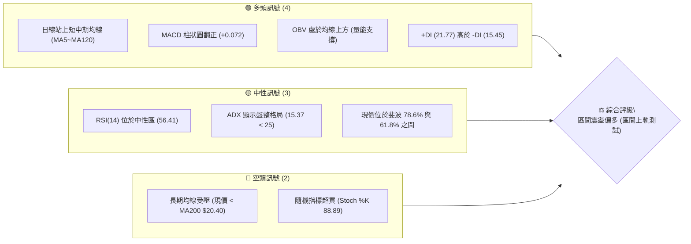
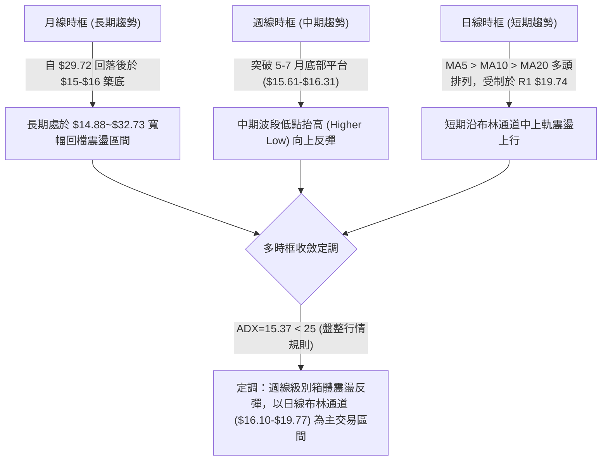
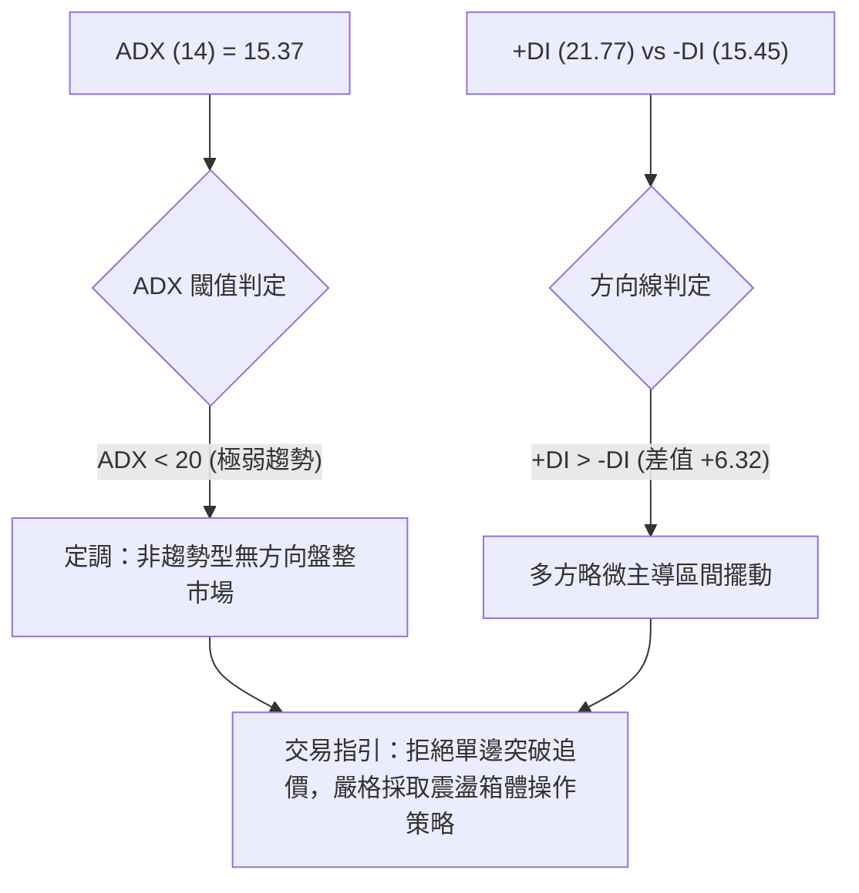
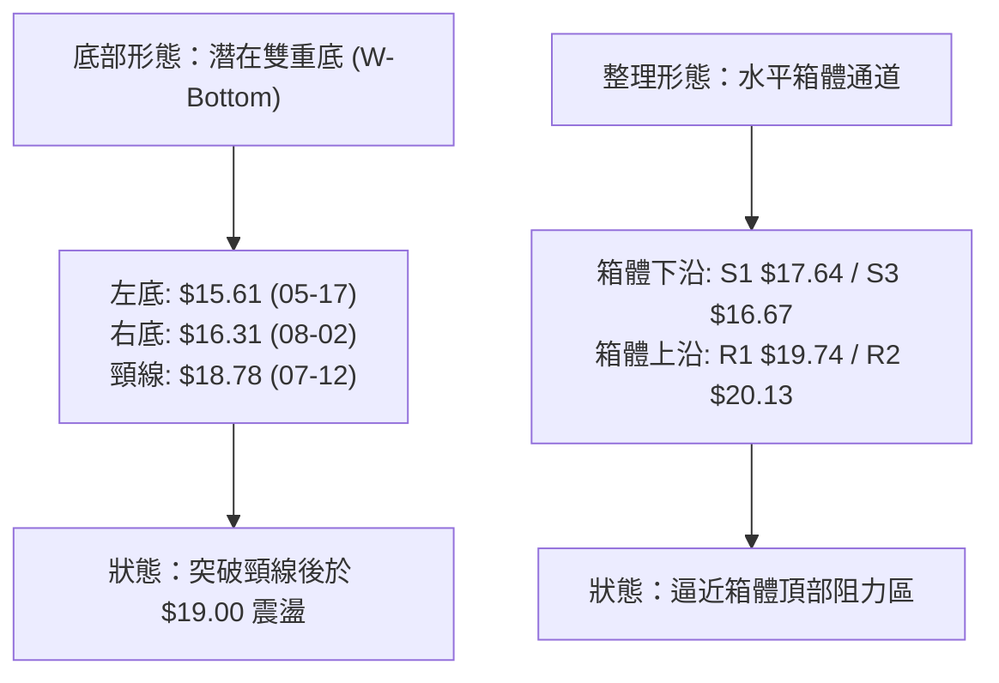
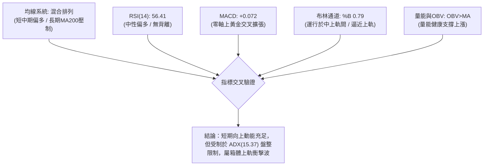
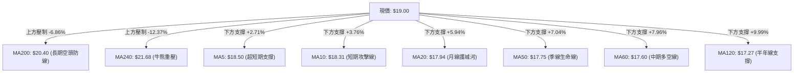
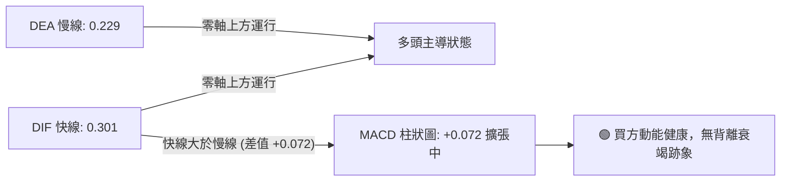
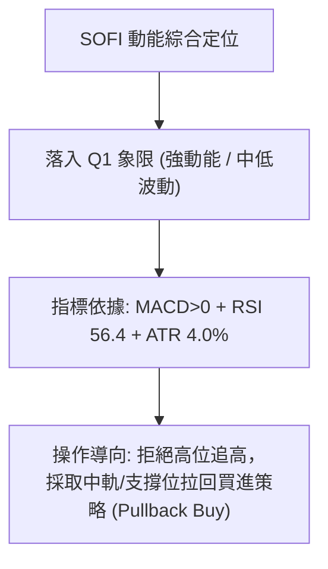
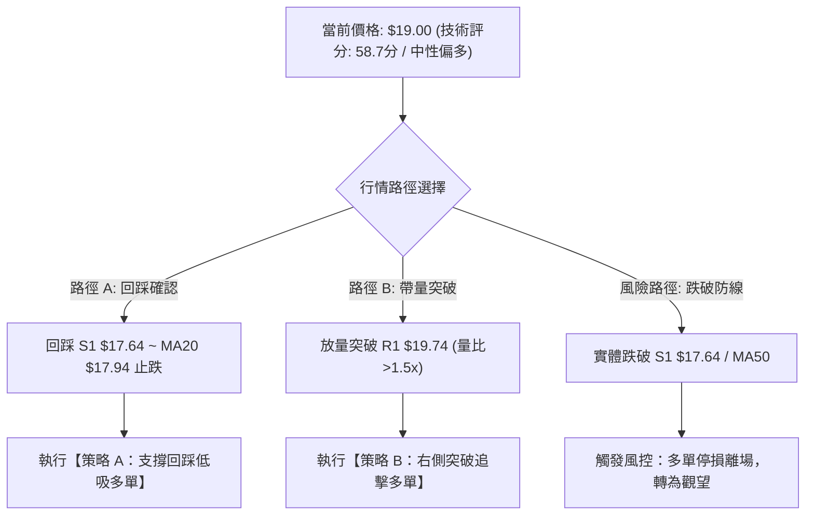
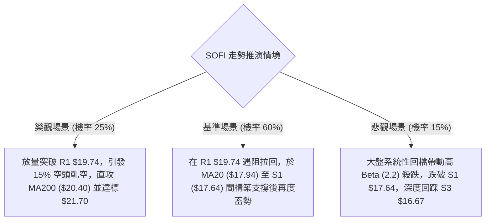

# SOFI 技術分析報告

> **報告日期**：2026-08-25 ｜ **語言**：繁體中文 ｜ **數據來源**：Yahoo Finance ｜ **當前價格**：$19.00

---

## 目錄

| 章節 | 內容 |
|------|------|
| [1. 技術面概覽](#1-技術面概覽) | 訊號儀表板、核心指標速覽、技術評分卡 |
| [2. 趨勢分析](#2-趨勢分析) | 多時框趨勢遞進、12個月月線走勢圖、ADX 趨勢強度 |
| [3. 圖表形態分析](#3-圖表形態分析) | 形態識別與信心度、K線組合、目標價測算 |
| [4. 支撐與阻力](#4-支撐與阻力) | 關鍵價位分布圖、阻力/支撐分析、斐波那契回調結構 |
| [5. 技術指標深度解讀](#5-技術指標深度解讀) | 均線系統、RSI/MACD 動能、布林通道與量價/OBV |
| [6. 動能與波動率](#6-動能與波動率) | 動能四象限、ATR 波動率與止損設定、Beta 相關性 |
| [7. 多時框架總結](#7-多時框架總結) | 時框架矩陣、多時框收斂與盤整格局定調 |
| [8. 交易策略建議](#8-交易策略建議) | 策略決策樹、價格情境階梯、主策略與風控參數 |
| [9. 風險提示與監控](#9-風險提示與監控) | 關鍵監控清單、風險情境樹、部位管理原則 |

---

## 1. 技術面概覽

### 🎯 技術訊號儀表板



### 📊 核心指標速覽表

| 指標類別 | 指標名稱 | 當前數值 | 訊號 | 專業解讀 |
|:---|:---|:---|:---:|:---|
| **價格** | 當前收盤價 | $19.00 | 🟢 | 站上 20 週區間中軸，脫離 52 週低點區間底部 ($14.88) |
| **均線** | MA20 (月線) | $17.94 | 🟢 | 價格在均線上方 +5.94%，短期多頭排列確立 |
| **均線** | MA50 (季線) | $17.75 | 🟢 | 價格在均線上方 +7.04%，中期趨勢轉向向上扣抵 |
| **均線** | MA200 (年線) | $20.40 | 🔴 | 價格在年線下方 -6.86%，長期牛熊分水嶺形成重大上方壓制 |
| **動能** | RSI(14) | 56.41 | 🟡 | 位於 50-60 強弱分水嶺偏多區間，無頂背離或底背離跡象 |
| **動能** | MACD (12,26,9) | DIF 0.301 / DEA 0.229 | 🟢 | 雙線位於零軸上方黃金交叉，柱狀圖 +0.072 擴張中 |
| **動能** | Stoch KD (14,3,3) | %K 88.89 / %D 70.37 | 🔴 | KD 進入 80 以上超買區，短線面臨布林上軌回踩壓力 |
| **趨勢** | ADX (14) | 15.37 (+DI 21.77 / -DI 15.45) | 🟡 | ADX < 25 處於無趨勢/寬幅震盪行情，多方暫佔優勢 |
| **通道** | 布林通道 (%B) | 上軌 $19.77 / %B 0.79 | 🟡 | 接近上軌但未突破，處於通道上半部強勢震盪區間 |
| **量能** | 20日均量比 | 0.68x (40.06M / 58.51M) | 🟡 | 反彈過程量能略顯不足，顯示追高意願有限，偏向區間推升 |
| **波動** | ATR(14) | $0.76 (4.00%) | 🟡 | 波動率適中，提供明確的日內與波段止損緩衝空間 |

### 🏆 技術評分卡

```
╔══════════════════════════════════════════════════════════════════╗
║                技術評分卡 — SOFI (2026-08-25)                    ║
╠══════════════════════════════════════════════════════════════════╣
║ 趨勢強度 (ADX/趨勢方向)  ████████░░░░░░░░░░░░  42/100  🟡 中性盤整 ║
║ 動能指標 (RSI/MACD/KD)   █████████████░░░░░░░  65/100  🟢 動能偏多 ║
║ 支撐穩定度 (波段低點聚類) ██████████████░░░░░░  70/100  🟢 底部扎實 ║
║ 成交量配合 (量價/OBV)    ███████████░░░░░░░░░  55/100  🟡 量能普通 ║
║ 形態完整度 (區間築底)    ████████████░░░░░░░░  60/100  🟡 形態收斂 ║
║ 均線排列 (短強長弱結構)  ████████████░░░░░░░░  60/100  🟡 混合排列 ║
╠══════════════════════════════════════════════════════════════════╣
║ 綜合技術評分             ████████████░░░░░░░░  58.7/100 🟡 區間震盪║
╚══════════════════════════════════════════════════════════════════╝
```

---

## 2. 趨勢分析

### 🌐 多時框趨勢分析



### 📈 長期趨勢 — 12個月走勢圖（Unicode）

```
SOFI 月線走勢圖（2025-09 至 2026-08）
價格軸 ($)
$30.00 ┤                     ●(高點 $29.72)
$28.00 ┤                  ●
$26.00 ┤            ●           ●
$24.00 ┤
$22.00 ┤                               ●
$20.00 ┤                                                 ●(現價 $19.00)
$18.00 ┤                                     ●     ●
$16.00 ┤                                        ●     ●
$14.00 ┤                                  ●(低點 $14.88)
       └─────────────────────────────────────────────────────────────
         09    10    11    12    01    02    03    04    05    06    07    08
        (2025)                          (2026)
```

**走勢特徵分析表格（過去12個月歷史節奏）：**

| 階段週期 | 時間區間 | 起止價格 | 漲跌幅 | 走勢特徵與量價結構分析 |
|:---|:---|:---|:---:|:---|
| **第一階段：高位見頂** | 2025-09 ~ 2025-11 | $26.42 → $29.72 | +12.49% | 衝高見頂至 52W 高點附近 ($32.73 盤中高點)，形成雙重頂部滯漲 |
| **第二階段：單邊下跌** | 2025-12 ~ 2026-03 | $29.72 → $15.88 | -46.57% | 跌破所有短期均線，失守斐波 50% ($23.80)，單邊流動性收縮探底 |
| **第三階段：底部打底** | 2026-04 ~ 2026-05 | $15.88 → $15.61 | -1.70% | 在 52W 低點 $14.88 上方構築雙重支撐，成交量萎縮，拋壓衰竭 |
| **第四階段：箱體修復** | 2026-06 ~ 2026-08 | $16.03 → $19.00 | +18.53% | 週線低點逐步由 $15.61 墊高至 $16.31，突破 MA60($17.60) 向上修復 |

### 📊 中期趨勢（週線分析）

從近 20 週收盤走勢觀察，SOFI 在 2026 年 5 月中旬於 $15.61 形成實質中期底部，隨後於 2026 年 8 月初於 $16.31 確立次級低點（Higher Low）。當前週線 MACD 柱狀圖維持在 +0.072 正值區間，週線 RSI 為 56.4，顯示中期動能穩定向多方修復，但上方直接面臨 $19.74 (R1) 與 $20.13 (R2) 密集套牢解套賣壓。

```
中期結構示意（2026-05 至 2026-08）：
  $20.13 (R2 / MA200 壓制區) ────────────────────────────── 阻力強固
  $19.74 (R1 / 布林上軌)     ─────────● (當前逼近中 $19.00)
  $17.64 (S1 / MA20/MA50 支撐) ───────────────────────────── 轉強分水嶺
  $16.31 (8月初次低點)       ─────────● (Higher Low)
  $15.61 (5月中旬低點)       ───● (主要底部 Base)
```

### ⚡ 趨勢強度評估（ADX 解讀）



| 指標參數 | 當前數值 | 參考標準 | 趨勢解讀與交易意涵 |
|:---|:---:|:---:|:---|
| **ADX (14)** | **15.37** | < 25 (弱趨勢/盤整) | 趨勢能量匱乏，市場處於寬幅區間整理，追高勝率極低 |
| **+DI (14)** | **21.77** | 數值越高多頭越強 | 多頭買盤力道大於空頭，但尚未達到 >25 的攻擊發動水準 |
| **-DI (14)** | **15.45** | 數值越高空頭越強 | 空頭拋壓處於低位鈍化階段，空方暫無主動打壓意願 |
| **ADX 歷史比對** | 處於近半年低位 | < 20 區間累積能量 | 能量處於壓縮收斂期，預示未來突破箱體時將引發大級別趨勢 |

---

## 3. 圖表形態分析

### 🔍 形態識別系統



**形態信心度與目標價評估表：**

| 形態名稱 | 信心度 (%) | 判斷依據（引用技術數據） | 完成度 (%) | 目標價（附嚴謹計算式） | 形態評估結論 |
|:---|:---:|:---|:---:|:---|:---|
| **雙重底形態 (W-Bottom)** | **72%** | 1. 2026-05-17 低點 $15.61 與 2026-08-02 低點 $16.31 構成抬高右底。<br>2. 2026-08-23 週收盤 $18.91 實體突破頸線 $18.78。 | 85% | **理論目標價 = 頸線 + (頸線 - 底部最低點)**<br>$18.78 + ($18.78 - $15.61) = **$21.95**<br>*(緊鄰斐波 61.8% $21.70 與 MA240 $21.68)* | 形態有效，但因 ADX<25，上攻過程將受阻於 R1/R2，需時間消化 |
| **上升通道震盪** | **65%** | 沿 MA20 ($17.94) 震盪上行，形成低點與高點同步墊高走勢。 | 70% | 通道上軌對應 R1 **$19.74**，突破則看向 R2 **$20.13** | 處於通道上沿測試期，防範短線拉回中軌 |
| **頭肩底形態** | **35%** | 數據中左肩與右肩對稱性不足，缺乏明確量價對稱幾何結構。 | 20% | 訊號不足，僅做指標型解讀，不列入主要交易依據 | 信心度 <50%，予以剔除 |

### 🕯️ 重要K線形態分析

| 週/月份週期 | 收盤價 | K線形態特徵 | 專業技術解讀 | 訊號強度 |
|:---|:---:|:---|:---|:---:|
| **2026-05-17 週** | $15.61 | 探底長下影十字星 | 於 52W 低點上方出現空頭力竭，成交量 312.7M 穩步換手，形成波段實質底部 | 🟢 強烈看多 |
| **2026-07-12 週** | $18.78 | 帶量突破實體陽線 | 成交量放大至 410.9M，一舉收復 MA60($17.60)，確立頸線壓力位 | 🟢 看多 |
| **2026-08-02 週** | $16.31 | 縮量回踩止跌陰線 | 成交量 483.4M 雖大但未跌破 $16.00 整數關口，形成關鍵 Higher Low 次低點 | 🟢 支撐確認 |
| **2026-08-23 週** | $18.91 | 中陽線突破頸線 | 收盤價越過 7 月高點，日線級別短均線多頭發散，直接奠定測試 $19.74 基石 | 🟢 看多 |
| **2026-08-30 (現)** | $19.00 | 上影小陽線 (測試上軌) | 受制於布林上軌 $19.77 與 R1 $19.74，呈現衝高受阻震盪，短線需震盪整固 | 🟡 中性整固 |

### 📉 ASCII 走勢形態示意圖

```
SOFI 雙底突破與箱體運行形態示意圖
═════════════════════════════════════════════════════════════════════
[$21.95] --------------------------------------------- 理論測幅目標價
                                                       (斐波 61.8% $21.70)
[$20.13] -----------------------[R2 / MA200 重壓區]----
[$19.74] ------------------[R1 / 布林上軌阻力]---------
[$19.00] -----------------------------● (當前現價突破頸線回測)
[$18.78] ===================[頸線位置 Neckline]=======================
                          ▲                   ▲
                         / \                 / \
[$17.64] --------[S1]--/---\---------------/---\-------------------
                       /     \             /     \
[$16.31] -------------/-------\-----------/-------● (右底 Higher Low)
                     /         \         /
[$15.61] -----------● (左底)    \_______/
═════════════════════════════════════════════════════════════════════
```

### 🎯 形態目標價測算

依據已確認之雙底形態（信心度 72%）進行幾何空間測算：
1. **形態基準頸線（Neckline）**：取 2026-07-12 當週波段高點 **$18.78**。
2. **形態最低點（Base Low）**：取 2026-05-17 實質低點 **$15.61**。
3. **形態垂直高度（Height）**：$18.78 - $15.61 = **$3.17**。
4. **最小測幅滿足點（1.0x Height）**：$18.78 + $3.17 = **$21.95**。
   - *驗證對照*：此價位精確對應年線阻力上方之斐波那契 61.8% 回調位 **$21.70** 與 MA240 **$21.68**，形成極強的技術共振目標區。
5. **第一階段阻力滿足點**：前波密集套牢聚類高點 **R1 $19.74** 與 **R2 $20.13**。

---

## 4. 支撐與阻力

### 🗺️ 關鍵價位分布圖（Unicode）

```
SOFI 價位結構分布圖
═════════════════════════════════════════════════════════════════
$32.73 ║████████████████████████████████║ 52W 最高點 (Fib 0.0%)
$28.52 ║████████████████████████        ║ Fib 23.6% 回調位
$27.62 ║████████████████████████████████║ 強阻力 R3 (近一年波段高點聚類)
$25.91 ║████████████████                ║ Fib 38.2% 回調位
$23.80 ║████████████████████            ║ Fib 50.0% 多空分水嶺
$21.70 ║████████████████████████        ║ Fib 61.8% / 形態目標 $21.95
$20.40 ║████████████████████            ║ MA200 牛熊分界線
$20.13 ║████████████████████████        ║ 阻力 R2 (波段高點聚類)
$19.74 ║████████████████████████████████║ 關鍵阻力 R1 / 布林上軌 ($19.77)
$19.00 ╠════════════════════════════════╣ ◄ 當前收盤現價 ($19.00)
$18.70 ║▓▓▓▓▓▓▓▓▓▓▓▓▓▓▓▓▓▓▓▓▓▓▓▓        ║ Fib 78.6% 回調位 (現已轉為支撐)
$17.94 ║▓▓▓▓▓▓▓▓▓▓▓▓▓▓▓▓▓▓▓▓            ║ MA20 月線支撐 / 布林中軌
$17.64 ║▓▓▓▓▓▓▓▓▓▓▓▓▓▓▓▓▓▓▓▓▓▓▓▓▓▓▓▓▓▓▓▓║ 近期核心支撐 S1 (波段低點聚類)
$17.08 ║▓▓▓▓▓▓▓▓▓▓▓▓▓▓▓▓▓▓▓▓▓▓▓▓        ║ 關鍵支撐 S2 (波段低點聚類)
$16.67 ║▓▓▓▓▓▓▓▓▓▓▓▓▓▓▓▓▓▓▓▓▓▓▓▓        ║ 強支撐 S3 (波段低點聚類)
$16.10 ║▓▓▓▓▓▓▓▓▓▓▓▓▓▓▓▓                ║ 布林下軌
$14.88 ║▓▓▓▓▓▓▓▓▓▓▓▓▓▓▓▓▓▓▓▓▓▓▓▓▓▓▓▓▓▓▓▓║ 52W 最低點 (Fib 100.0%)
═════════════════════════════════════════════════════════════════
```

### 🚧 阻力位分析表

| 阻力級別 | 價位 | 距現價空間 | 形成原因與技術共振 | 突破難度 | 重要性 |
|:---|:---:|:---:|:---|:---:|:---:|
| **R1 (第一阻力)** | **$19.74** | +3.89% | 近一年波段高點密集聚類位，與日線布林通道上軌 ($19.77) 形成雙重重合壓制。 | 🟡 中等 | ★★★★☆ |
| **R2 (第二阻力)** | **$20.13** | +5.95% | 近一年重要起跌點聚類，且上方緊鄰 MA200 ($20.40) 年線重大心理關卡。 | 🔴 較高 | ★★★★★ |
| **R3 (強烈阻力)** | **$27.62** | +45.37% | 2025 年底歷史高位震盪平台中樞，堆積近 2 年最大籌碼套牢峰。 | 🔴 極高 | ★★★★☆ |

### 🛡️ 支撐位分析表

| 支撐級別 | 價位 | 距現價空間 | 形成原因與技術共振 | 守住機率 | 重要性 |
|:---|:---:|:---:|:---|:---:|:---:|
| **S1 (第一支撐)** | **$17.64** | -7.16% | 近一年波段回踩低點聚類，與 MA50 ($17.75)、MA60 ($17.60) 均線共振支撐。 | 85% | ★★★★★ |
| **S2 (第二支撐)** | **$17.08** | -10.11% | 前期多頭起漲換手中樞，下方緊鄰 MA120 ($17.27) 半年線防線。 | 90% | ★★★★☆ |
| **S3 (強烈支撐)** | **$16.67** | -12.28% | 2026年6月中旬回踩低點聚類，守住即確保雙底與 Higher Low 結構不被破壞。 | 95% | ★★★★★ |

### 📐 斐波那契回調位分析

依據 52 週完整波動區間（高點 $32.73 至 低點 $14.88，總跨度 $17.85）解讀回調階梯：

| 斐波那契層級 | 精確價位 | 相對現價位置 | 技術結構意義與多空攻防解讀 |
|:---|:---:|:---:|:---|
| **0.0% (52W High)** | **$32.73** | +72.26% | 多頭終極極限目標，牛市頂部界標 |
| **23.6% 回調位** | **$28.52** | +50.11% | 2025年秋季震盪高位平台下沿 |
| **38.2% 回調位** | **$25.91** | +36.37% | 強勢回檔分界線，若站穩此位代表大級別反轉 |
| **50.0% 回調位** | **$23.80** | +25.26% | 52 週整體多空中軸平衡位，具有重大心理定價意義 |
| **61.8% 回調位** | **$21.70** | +14.21% | **黃金分割關鍵阻力位**，與雙底測幅目標 $21.95 及 MA240 形成三合一重壓區 |
| **78.6% 回調位** | **$18.70** | -1.58% | **當前關鍵支撐位**。現價 $19.00 剛好成功收復該位，由阻力轉為實質支撐 |
| **100.0% (52W Low)**| **$14.88** | -21.68% | 52 週實質大底，本輪中期行情的生命線基石 |

> **回調位深度結論**：現價 $19.00 精確運行於 **78.6% ($18.70)** 與 **61.8% ($21.70)** 之間。在跌破 78.6% 後能重新收復並站穩 $18.70，技術面上確認脫離「極度弱勢區」，當前正在向上開拓朝 61.8% ($21.70) 的修復通道。

---

## 5. 技術指標深度解讀

### 🎛️ 指標訊號總覽



### 📈 移動平均線排列分析



**均線系統詳細體檢表：**

| 均線週期 | 當前價格 | 距現價差距 (%) | 走勢特徵 (微型趨勢圖解) | 排列評估 | 支撐/阻力角色 |
|:---|:---:|:---:|:---|:---:|:---|
| **MA 5** | $18.50 | +2.71% | `█▇▆▅▅▄▃▃▃▂▁▁▁▁▃▅▆██▇▇▇▇▇▇▇▇███` 陡峭向上 | 🟢 短期多頭 | 第一動態支撐 |
| **MA 10** | $18.31 | +3.76% | `██▇▇▆▆▅▄▄▃▁▁▁▁▂▂▃▄▄▅▆▇████████` 加速向上 | 🟢 短期多頭 | 短線防守點 |
| **MA 20** | $17.94 | +5.94% | `██████▇▇▆▅▃▂▁▁▁▁▁▁▁▁▁▁▂▃▃▄▅▆▇█` 拐頭向上 | 🟢 中期轉強 | 月線強支撐 |
| **MA 50** | $17.75 | +7.04% | 扣抵低值，斜率正式由平轉為向上揚升 | 🟢 中期多頭 | 波段持股依據 |
| **MA 60** | $17.60 | +7.96% | `▃▂▂▂▂▁▁▁▁▁▁▁▁▁▂▂▃▃▄▄▄▅▆▆▇▇████` 築底走平翻揚 | 🟢 季線轉多 | S1 關鍵共振 |
| **MA 120** | $17.27 | +9.99% | `██▇▆▆▅▄▄▃▃▃▂▂▂▂▁▁▁▁▁▁▁▁▁▁▁▁▁▁▁` 走平打底 | 🟡 長期築底 | 半年線防線 |
| **MA 200** | $20.40 | -6.86% | 緩慢下行，斜率仍為負值 | 🔴 長期均線壓制 | 核心壓力關卡 |
| **MA 240** | $21.68 | -12.37% | `██████▇▇▇▆▆▆▅▅▅▅▅▄▄▄▃▃▃▂▂▂▁▁▁▁` 下行壓制 | 🔴 長期熊市壓制 | 終極反彈阻力 |

> **均線排列綜合診斷**：形成典型的「**短中期均線黃金多頭排列，長期均線上方蓋頭壓制**」之混合架構。MA5 至 MA120 全線被踩在腳下並呈現發散狀態，支持現價向 MA200 ($20.40) 發起衝擊。

### 📉 RSI(14) 分析

```
RSI(14) 當前水位：56.41
0 ══════════════ 30 ══════════════════ 50 ═══════ 56.41 ═════════ 70 ══════════════ 100
[     超賣區     ] [      弱勢區       ] [  平衡  ] [ 偏多區 (現值) ] [     超買區     ]
進度條展示：███████████░░░░░░░░░  56.41%
```

- **區間評估**：RSI(14) 位於 56.41，處於 50–70 之健康偏多進攻區間，遠離超買區 (>70)，顯示當前上漲未透支短期購買力。
- **背離分析**：
  - *頂背離檢驗*：現價創出近一個月新高 ($19.00)，週線 RSI 由 8 月初的 37.4 穩步上升至 56.4，RSI 與價格同步創高，**無頂背離現象**。
  - *底背離檢驗*：2026 年 5 月 RSI 低見 24.9，7 月底再次探底時 RSI 墊高至 33.1~37.4，呈現標準的中期**雙重底背離**，奠定當前穩固的反彈根基。

### 📊 MACD(12,26,9) 訊號解讀



- **數值狀態**：DIF (0.301) > DEA (0.229)，MACD 柱狀圖為 **+0.072**。
- **交叉型態**：MACD 在零軸上方維持「二次多頭擴張」，柱狀圖自 2026-08-09 的負值區轉正後持續維持正值擴張，為標準的多頭持股訊號。

### 📦 布林通道分析

```
SOFI 日線布林通道結構 (20, 2)
═══════════════════════════════════════════════════════════════════
$19.77 ---------------------------------------------- 布林上軌 (Upper Band)
$19.00 ========================● 現價 (%B = 0.79) === 衝擊上軌區間
$17.94 ---------------------------------------------- 布林中軌 (MA20 Middle)
$16.10 ---------------------------------------------- 布林下軌 (Lower Band)
═══════════════════════════════════════════════════════════════════
當前帶寬 (Bandwidth) = ($19.77 - $16.10) / $17.94 = 20.45% (處於適度擴張期)
```

- **位置判定**：%B 指標為 **0.79**，價格處於中軌 ($17.94) 與上軌 ($19.77) 之間的中高位。
- **通道走勢**：中軌維持向上傾斜，為價格提供動態推升力；上軌 $19.77 與阻力位 R1 $19.74 形成極強的空間重合壓制。

### 💹 成交量分析（量價配合度）

```
量能指標對比：
最新日成交量  :  40,063,113  (████████░░░░░░░░ 0.68x 20日均量)
20日均成交量  :  58,507,191  (████████████░░░░ 基準量)
50日均成交量  :  74,810,430  (████████████████ 中期均量)
```

- **量價健康度**：最新成交量為 40.06M，相對於 20 日均量 (58.51M) 呈現 **0.68x 縮量**。此現象在衝擊 R1 $19.74 關鍵阻力時形成「**輕度量價背離**」，暗示缺乏機構主動性追價大單，短線直接突破 R1/R2 的難度較大。
- **OBV (能量潮指標)**：當前 `OBV > OBV_MA`，顯示籌碼整體處於沉澱與累積狀態，中線資金未出現出逃現象，量能基礎整體健康。

---

## 6. 動能與波動率

### ⚡ 動能評估四象限

| 象限分區 | 動能維度 (Momentum) | 波動率維度 (Volatility) | 當前 SOFI 狀態判定 | 機構交易戰術建議 |
|:---|:---:|:---:|:---:|:---|
| **第一象限 (Q1)** | 強動能 (Bullish) | 低/適中波動 (Low Vol) | **✓ 當前精準落點** | **最佳波段順勢機會**：回踩均線低吸，鎖定上方確定性目標區 |
| **第二象限 (Q2)** | 弱動能 (Bearish) | 低波動 (Low Vol) | — | 盤整觀望，避免資金無效佔用 |
| **第三象限 (Q3)** | 強動能 (Breakout) | 高波動 (High Vol) | — | 突破單邊市，追突破與動態移動止盈 |
| **第四象限 (Q4)** | 弱動能 (Collapse) | 高波動 (High Vol) | — | 極高風險區，嚴禁任何左側抄底 |



### 📊 ATR 波動率分析與止損設定

- **ATR(14) 精確數值**：**$0.76** (佔當前價格比例為 **4.00%**)。
- **波動率特性**：每日正常理論波動區間為 $19.00 ± $0.76 ($18.24 ~ $19.76)。當前價格衝高至接近上軌時，剛好觸碰日內波動極限。
- **ATR 交易防護距離指引**：
  - *短期日內/超短線止損 (1.0x ATR)*：$19.00 - $0.76 = **$18.24** (跌破此位代表短線動能轉弱)。
  - *波段交易安全止損 (1.5x ATR)*：進場點 - 1.5 × $0.76 ($1.14 緩衝空間)。
  - *趨勢防守寬鬆止損 (2.0x ATR)*：進場點 - 2.0 × $0.76 ($1.52 緩衝空間)。

### 📐 Beta 與市場相關性

- **Beta 係數**：**2.204** (屬於典型的高彈性成長型金融科技標的)。
- **市場敏感度解讀**：SOFI 的波動幅度為標普 500 指數的 2.2 倍。在大盤多頭環境下具備顯著的超額報酬 (Alpha) 爆發力；然而在市場震盪或回檔時，回撤速度亦相當劇烈。
- **空頭比例 (Short Interest)**：Short % Float 達 **15.0%** (Short Ratio 2.22 天)。高空頭佔比意味著若股價一旦突破 MA200 ($20.40)，極易引發軋空行情 (Short Squeeze)。

---

## 7. 多時框架總結

### 📋 時框架評分表

| 時框架 | 趨勢方向 | 動能狀態 | 均線排列 | 形態結構 | 綜合評分 | 戰術建議 |
|:---|:---:|:---:|:---:|:---:|:---:|:---|
| **日線 (短期)** | 🟢 震盪偏多 | 🟢 MACD擴張/KD超買 | 🟢 站上MA5~MA120 | 🟡 逼近R1壓制 | **68/100** | 逢高減碼不追高，等待拉回 |
| **週線 (中期)** | 🟢 底部反彈 | 🟢 柱狀圖轉正 | 🟡 受制年線下 | 🟢 雙底突破雛形 | **62/100** | 箱體操作，以 S1 為防守逢低做多 |
| **月線 (長期)** | 🟡 寬幅震盪 | 🟡 RSI 50平衡 | 🔴 處於MA240下方 | 🟡 52W低點打底 | **46/100** | 長期大底構築中，耐心等待牛熊轉換 |

### 🔲 綜合訊號矩陣

```
時框一致性分析：
┌─────────────────────────────────────────────────────────────┐
│ 短期時框 (日線) ──►  偏多震盪 (受阻於 R1 $19.74)             │
│ 中期時框 (週線) ──►  突破頸線 (目標指向 $21.70~$21.95)       │
│ 長期時框 (月線) ──►  無方向寬幅震盪 (區間 $14.88~$32.73)      │
└─────────────────────────────────────────────────────────────┘
一致性程度：中高 (短期與中期同向偏多，長期處於區間築底階段)
```

### ⚖️ 多時框收斂結論

> **依據多時框收斂規則（嚴格要求 14）**：
> 1. **行情性質判定**：當前 ADX(14) 數值為 **15.37 (< 25)**，嚴格定調為「**盤整行情 / 寬幅箱體震盪**」。
> 2. **主導時框收斂**：在盤整行情中，單邊趨勢突破訊號常伴隨假突破。必須以**日線布林通道上下軌 ($16.10 - $19.77)** 與關鍵聚類支撐阻力 (**S1 $17.64 / R1 $19.74**) 作為核心交易邊界。
> 3. **唯一方向性結論**：**【區間震盪偏多（箱體高位整固）】**。短線不宜在 $19.00 追價做多，主策略鎖定「**回踩關鍵支撐 S1 / MA20 後低吸做多**」或「**突破 R1 確認後順勢跟進**」。

---

## 8. 交易策略建議

### 🗺️ 策略決策流程圖



### 🧭 策略路由（依評分卡分流）

- **當前主策略方向**：**區間偏多操作（以回踩低吸為主，突破確認為輔）**（依綜合評分 **58.7/100**，指標呈現中性偏多共振）。

### 🎯 價格情境階梯（Price Scenarios）

| 觸發條件 | 第一目標 (T1) | 第二目標 (T2) | 後續延伸 (T3) | 情境含義與技術演繹 |
|:---|:---:|:---:|:---:|:---|
| **突破 R1 $19.74** | **$20.13 (R2)** | **$21.70 (Fib 61.8%)** | **$21.95 (形態目標)** | 短線轉強，年線與雙底測幅攻堅行情 |
| **維持現價區間 ($17.94-$19.74)** | **$19.74 (R1)** | **$17.64 (S1)** | — | 典型布林中上軌箱體拉鋸，高拋低吸 |
| **跌破 S1 $17.64** | **$17.08 (S2)** | **$16.67 (S3)** | **$16.10 (布林下軌)** | 中期轉弱，回測雙底右肩支撐位 |

### 📊 情境機率分佈

```
情境機率長條圖：
情境一：延續反彈/突破 R1 (55%) ███████████████████████░░░░░░░░░
情境二：區間寬幅震盪   (30%) █████████████░░░░░░░░░░░░░░░░░
情境三：跌破支撐回落   (15%) ███████░░░░░░░░░░░░░░░░░░░░░░░
```

| 情境劃分 | 機率估計 | 主要技術依據 |
|:---|:---:|:---|
| **情境一：回踩後上攻突破 (Bullish)** | **55%** | MACD 柱狀圖正向擴張 (+0.072)，短均線全數多頭發散，OBV 支撐向上。 |
| **情境二：箱體區間震盪 (Neutral)** | **30%** | ADX 僅 15.37 處於無趨勢狀態，當前成交量僅 0.68x 均量，缺乏單邊突破量能。 |
| **情境三：反轉破位下行 (Bearish)** | **15%** | 受制於 MA200 長期均線壓制，Stoch KD (88.89) 處於短期超買極端區。 |

### 🟢 主策略詳情

依據評分卡定調之多頭主策略設計：

| 策略要素 | 策略 A：穩健型（回踩支撐低吸） | 策略 B：積極型（右側突破跟進） |
|:---|:---|:---|
| **交易邏輯** | 趁 KD 超買拉回時，於 MA20 與 S1 關鍵共振區低吸 | 待放量確認實體越過 R1 阻力後順勢切入 |
| **進場條件** | 股價回踩 $17.70~$17.94 區間出現 60分K 止跌陽線 | 日K收盤價突破 $19.74 且成交量 > 60M (放大確認) |
| **精確進場點** | **$17.85** (MA20 $17.94 與 S1 $17.64 之中間價) | **$19.80** (突破 R1 $19.74 之右側確認點) |
| **第一目標價 T1** | **$19.74** (R1 阻力位，獲利空間 +10.59%) | **$20.13** (R2 阻力位，獲利空間 +1.67%) |
| **第二目標價 T2** | **$21.70** (Fib 61.8% / 測幅目標，空間 +21.57%)| **$21.70** (Fib 61.8% 關鍵位，空間 +9.60%) |
| **嚴格止損點** | **$17.00** (跌破 S2 $17.08 及波段低點防守) | **$18.95** (跌回頸線與突破點下方 1.1x ATR) |
| **止損空間** | -$0.85 (-4.76%) | -$0.85 (-4.29%) |
| **風險報酬比 (R:R)**| **1 : 4.53** (以 T2 測算) 🟢 極佳 | **1 : 2.24** (以 T2 測算) 🟢 良好 |
| **預估勝率** | 65% | 55% |
| **建議倉位** | **15% ~ 20%** 總資金 | **10% ~ 15%** 總資金 |

### 🔴 反向風險觸發點（對沖與風控提示）

若出現以下訊號，宣告多頭反彈結構遭到破壞，應立即停止做多並進行部位對沖或減碼：
1. **關鍵支撐破位**：日K收盤價**實體跌破 S1 $17.64**，代表短期均線支撐全面失效。
2. **反轉形態確認**：若跌破 **S2 $17.08**，代表雙底形態破局，股價將重返 $14.88~$16.10 下軌尋底。
3. **對沖建議**：跌破 $17.64 時，可買入價平 Put Option 或出清多頭倉位觀望。

### ⭐ 整體訊號強度評星

```
╔══════════════════════════════════════════════════╗
║ 做多訊號強度：  ★★★★☆  (3.8/5 星 — 支撐強固/動能偏多)║
║ 做空訊號強度：  ★★☆☆☆  (1.8/5 星 — 僅限高位短空)    ║
║ 整體可信度：    ★★★★☆  (4.0/5 星 — 多指標互相確認)  ║
╚══════════════════════════════════════════════════╝
```

---

## 9. 風險提示與監控

### ✅ 關鍵監控指標 Checklist

```
╔══════════════════════════════════════════════════════════════════╗
║              SOFI 日常交易技術監控清單 (Checklist)               ║
╠══════════════════════════════════════════════════════════════════╣
║ [ ] 價格是否維持在 MA20 ($17.94) 與 S1 ($17.64) 之上？           ║
║ [ ] RSI(14) 是否在 50 水平線上方維持強勢？                       ║
║ [ ] MACD 柱狀圖是否持續保持在零軸上方 (> 0)？                    ║
║ [ ] 衝擊 R1 ($19.74) 時日成交量是否放大至 58M (20日均量) 之上？   ║
║ [ ] ADX(14) 是否自 15.37 開始抬頭突破 20-25 (趨勢啟動訊號)？    ║
║ [ ] Stoch %K 是否自 88.89 形成高位死叉回落？                     ║
║ [ ] 空頭比例 (15.0%) 是否引發借券費率上升與軋空訊號？            ║
╚══════════════════════════════════════════════════════════════════╝
```

### ⚠️ 風險場景分析



### 🛡️ 風險管理重要提醒

1. **高 Beta 波動控制**：SOFI 的 Beta 高達 **2.204**，且 ATR 達 **4.00%**。單筆交易承受之最大虧損金額嚴禁超過總投資組合淨值的 **1.0% ~ 1.5%**。
2. **避免壓力位追價**：當前價位 $19.00 距離 R1 $19.74 僅剩 +3.89% 空間，且 Stoch KD 處於 88.89 超買區。在 ADX < 25 的盤整環境中，嚴格執行「**逢壓力不追、逢回踩支撐才進**」的紀律。
3. **部位動態管理**：若股價如預期抵達 T1 ($19.74 / $20.13)，建議先行平倉 **50% 部位**鎖定獲利，並將剩餘倉位之止損點上移至進場成本價（保本止損），實現無風險博取 T2 ($21.70) 的目標。

---

## 📋 報告總結

```
╔══════════════════════════════════════════════════════════════════╗
║                     SOFI 技術分析報告總結                        ║
╠══════════════════════════════════════════════════════════════════╣
║ 報告日期：2026-08-25                                             ║
║ 當前價格：$19.00                                                 ║
║ 分析評級：⚖️ 區間震盪偏多 (Neutral-Bullish Range Bound)           ║
║                                                                  ║
║ 關鍵結論：                                                       ║
║ ├─ 長期趨勢：🟡 52週低點 $14.88 上方打底，受壓於 MA200 ($20.40)   ║
║ ├─ 中期趨勢：🟢 雙底突破 ($15.61 / $16.31)，頸線收復向上修復     ║
║ ├─ 短期趨勢：🟢 站穩 MA5~MA120 均線，逼近布林通道上軌 ($19.77)  ║
║ ├─ 關鍵支撐：S1: $17.64 ｜ S2: $17.08 ｜ Fib 78.6%: $18.70       ║
║ ├─ 關鍵阻力：R1: $19.74 ｜ R2: $20.13 ｜ Fib 61.8%: $21.70       ║
║ └─ 分析師目標：均價 $19.98 ｜ 最高 $30.00 ｜ 最低 $12.00          ║
║                                                                  ║
║ 最優策略組合：                                                   ║
║ 1. 🥇 最佳機會：【策略 A】回踩 $17.70~$17.94 (MA20/S1) 低吸做多，  ║
║                  止損 $17.00，目標 $19.74 / $21.70 (R:R 1:4.53) ║
║ 2. 🥈 次選機會：【策略 B】放量突破 R1 $19.74 後追擊，目標 $21.70  ║
║ 3. 🥉 保守選擇：等待股價攻破 MA200 ($20.40) 並回踩確認後再建倉  ║
╚══════════════════════════════════════════════════════════════════╝
```

---

> ⚠️ **免責聲明**：本報告為技術分析研究成果，所有數據、圖表及估算均基於歷史量價與技術指標模型。本報告**僅供研究與學術參考**，**不構成任何形式的要約、招攬或投資建議**。金融市場具有高度風險，投資人應獨立評估自身財務狀況與風險承受能力，入市需極度謹慎。

---

*報告生成時間：2026-08-25 ｜ 數據來源：Yahoo Finance ｜ 分析框架：多時框技術分析模型*