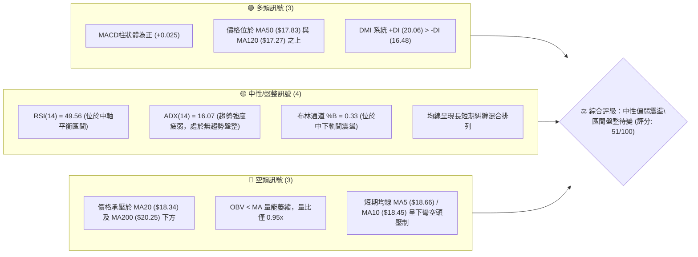
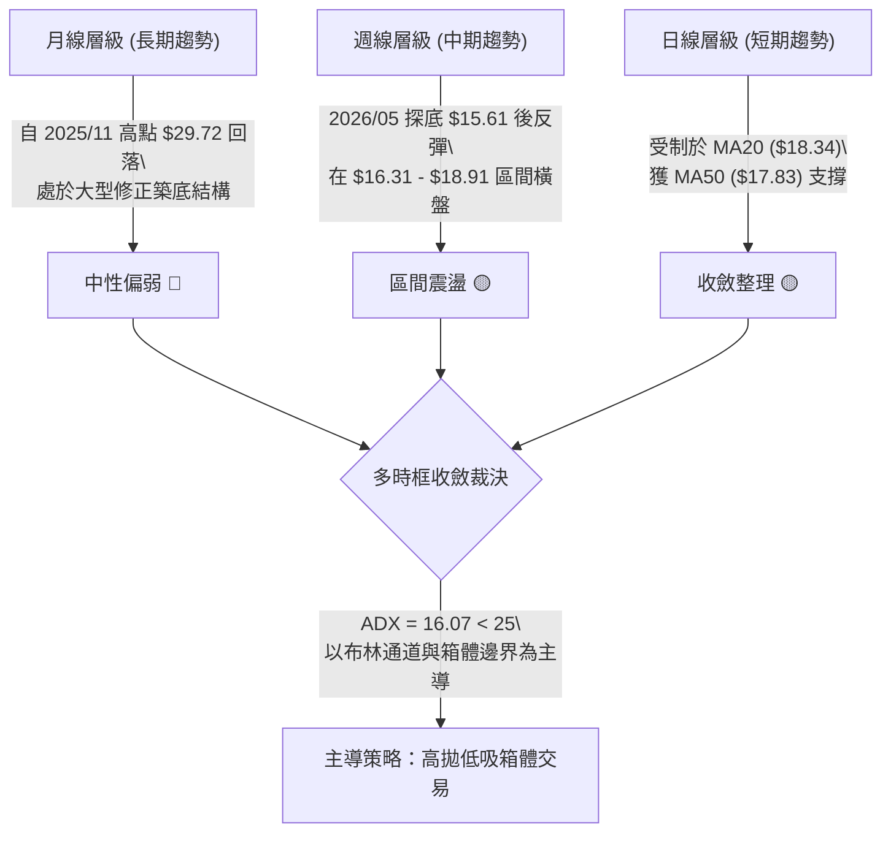
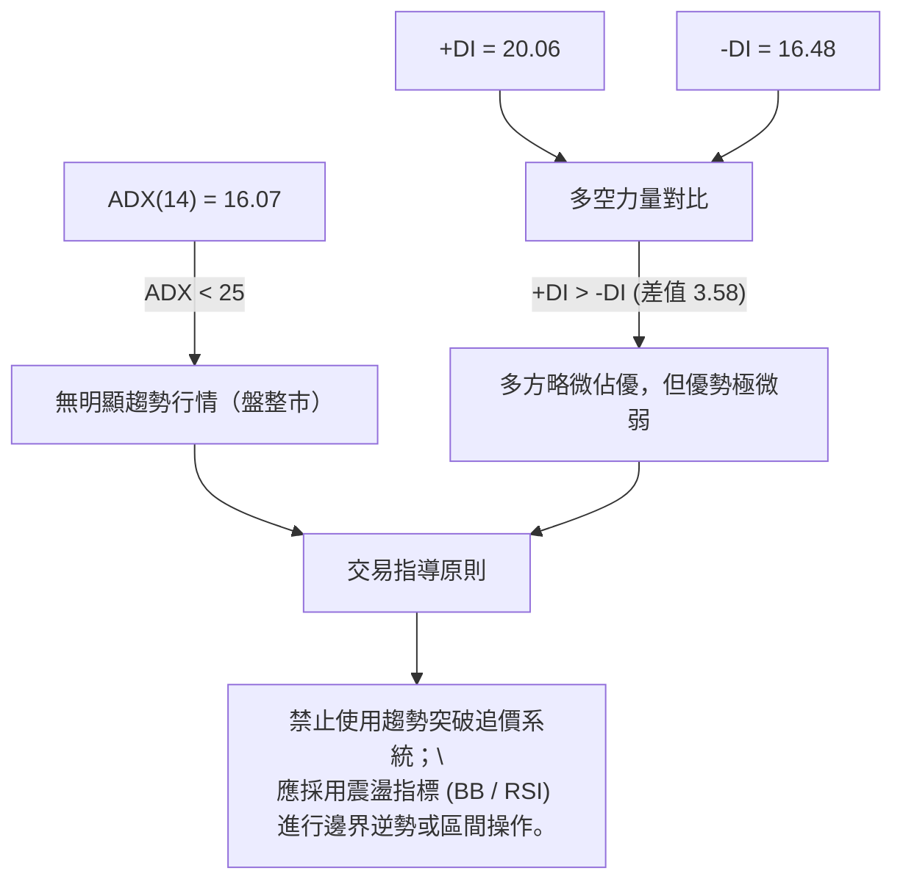
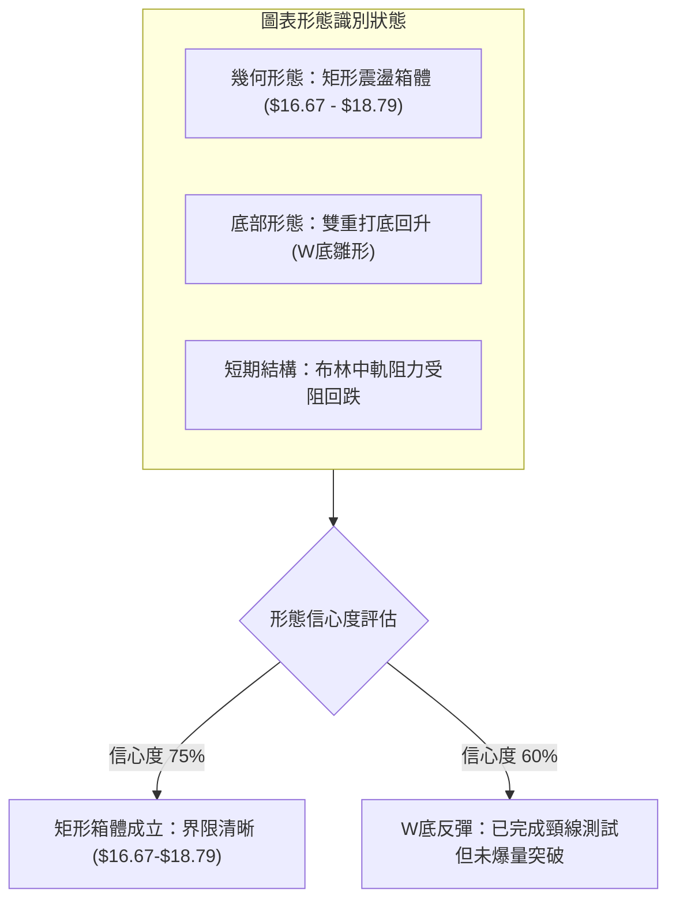
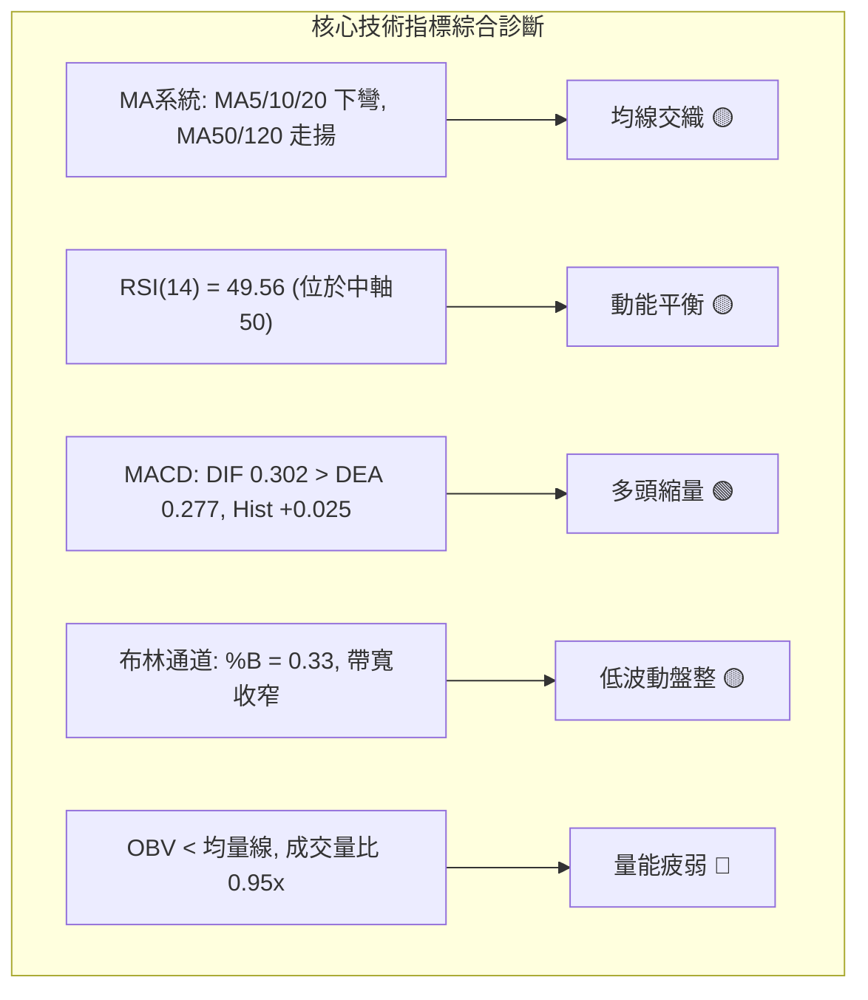
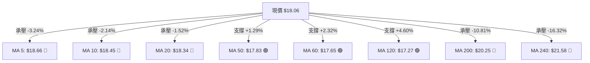
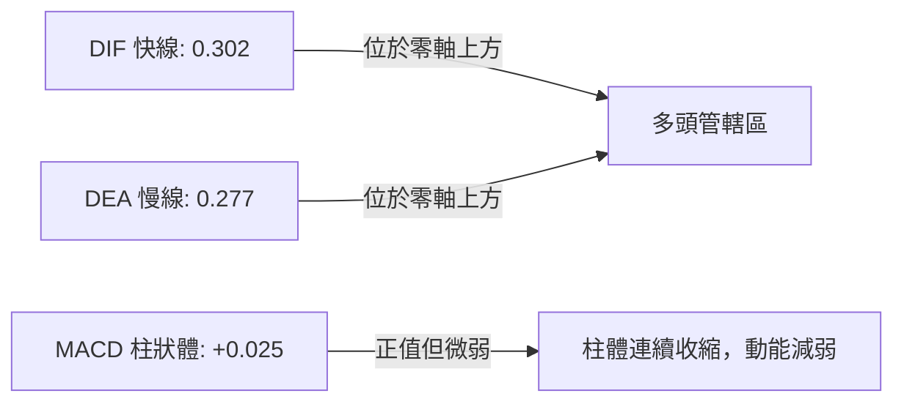
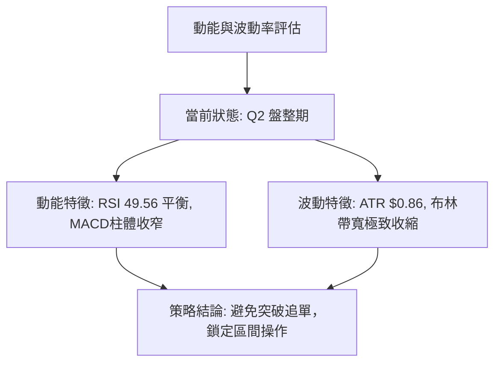
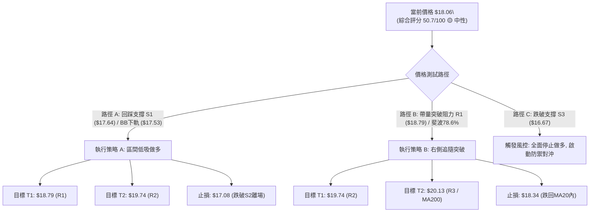
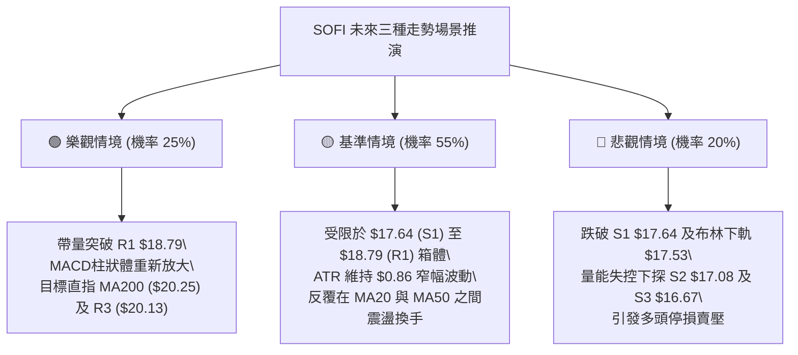

# SOFI 技術分析報告

> **報告日期**：2026-08-29 ｜ **語言**：繁體中文 ｜ **數據來源**：Yahoo Finance ｜ **當前價格**：$18.06

---

## 目錄

| 章節 | 內容 |
|------|------|
| [1. 技術面概覽](#1-技術面概覽) | 訊號儀表板、核心指標、評分卡 |
| [2. 趨勢分析](#2-趨勢分析) | 多時框趨勢、長中短期走勢、ADX解讀 |
| [3. 圖表形態分析](#3-圖表形態分析) | 形態識別、K線組合、目標價計算 |
| [4. 支撐與阻力](#4-支撐與阻力) | 關鍵價位分布、斐波那契回調區間 |
| [5. 技術指標深度解讀](#5-技術指標深度解讀) | 均線系統、RSI、MACD、布林通道、量能OBV |
| [6. 動能與波動率](#6-動能與波動率) | 動能四象限、ATR波動率、Beta值分析 |
| [7. 多時框架總結](#7-多時框架總結) | 時框矩陣、多時框收斂定調 |
| [8. 交易策略建議](#8-交易策略建議) | 策略路由、情境階梯、主策略與風控 |
| [9. 風險提示與監控](#9-風險提示與監控) | 監控清單、情境推演、倉位管理 |
| [📋 報告總結](#-報告總結) | 核心結論與策略全貌 |

---

## 1. 技術面概覽

### 🎯 技術訊號儀表板



### 📊 核心指標速覽表

| 指標類別 | 指標名稱 | 當前數值 | 訊號 | 解讀 |
|----------|----------|----------|:----:|------|
| **價格** | 當前價格 | $18.06 | 🟡 | 位於52週區間（$14.88 - $32.73）的 17.8% 低位區間震盪 |
| **短期均線** | MA20 (月線) | $18.34 | 🔴 | 價格在MA20下方 -1.52%，短線承壓 |
| **中期均線** | MA50 (季線) | $17.83 | 🟢 | 價格在MA50上方 +1.29%，中期底部提供動態支撐 |
| **長期均線** | MA200 (年線)| $20.25 | 🔴 | 價格顯著低於MA200 -10.81%，長期多頭趨勢尚未重啟 |
| **動能指標** | RSI(14) | 49.56 | 🟡 | 位於 40–60 中性震盪帶，無超買或超賣現象 |
| **趨勢指標** | MACD (12,26,9) | 0.302 / 0.277 | 🟢 | MACD線高於訊號線，柱狀體 +0.025，動能微幅偏多但收斂 |
| **趨勢強度** | ADX(14) | 16.07 | 🟡 | ADX < 25，市場缺乏主導趨勢，定性為箱體震盪行情 |
| **通道指標** | Bollinger %B | 0.33 | 🟡 | 位於中軌 $18.34 與下軌 $17.53 之間，偏向中性偏弱 |
| **波動指標** | ATR(14) | $0.86 | 🟡 | 每日平均波動幅度佔股價 4.76%，波動度適中偏收斂 |
| **量能指標** | 成交量 / OBV | 45.31M (量比 0.95x) | 🔴 | OBV低於其均線，近週成交量持續縮減，量能動能不足 |

### 🏆 技術評分卡

```
╔══════════════════════════════════════════════════════════════════╗
║                   技術評分卡 — SOFI (2026-08-29)                 ║
╠══════════════════════════════════════════════════════════════════╣
║ 趨勢強度 (ADX/DMI)  ██████░░░░░░░░░░░░░░  32/100  🔴 無明顯趨勢  ║
║ 動能指標 (RSI/MACD) ██████████░░░░░░░░░░  52/100  🟡 多空拉鋸中  ║
║ 支撐穩定度 (S1-S3)  ██████████████░░░░░░  70/100  🟢 底部支撐強  ║
║ 成交量配合 (OBV/VOL)████████░░░░░░░░░░░░  40/100  🔴 量能呈縮減  ║
║ 形態完整度 (區間箱體)████████████░░░░░░░░  60/100  🟡 箱體整理中  ║
║ 均線排列 (MA矩陣)   ██████████░░░░░░░░░░  50/100  🟡 長短線交織  ║
╠══════════════════════════════════════════════════════════════════╣
║ 綜合技術評分        ██████████░░░░░░░░░░  50.7/100  🟡 中性觀望  ║
╚══════════════════════════════════════════════════════════════════╝
```

---

## 2. 趨勢分析

### 🌐 多時框趨勢分析



### 📈 長期趨勢 — 12個月走勢圖（Unicode）

```
SOFI 月線走勢圖（2025-08 至 2026-08）
價格軸 ($)
$30.00 ┤                     ● 29.68  ● 29.72 (歷史波段高點)
$27.50 ┤               ● 26.42      ● 26.18
$25.00 ┤        ● 25.54
$22.50 ┤                            ● 22.81
$20.00 ┤
$17.50 ┤                                  ● 17.76        ● 18.22  ● 17.93        ● 18.06 (現價)
$15.00 ┤                                        ● 15.88  ● 16.10        ● 16.31
       └─────────────────────────────────────────────────────────────────────────────
         08/25   09/25   10/25 11/25 12/25 01/26 02/26 03/26 04/26 05/26 06/26 07/26 08/26
```

#### 走勢特徵階段分析表格

| 階段區間 | 時間跨度 | 價格起訖 | 漲跌幅 | 走勢結構與特徵解讀 |
|:---|:---|:---|:---|:---|
| **第一階段：主升推升段** | 2025-08 ~ 2025-11 | $25.54 → $29.72 | +16.37% | 連續放量推升，創下年內高點 $29.72（52W高點為 $32.73）。 |
| **第二階段：估值修正段** | 2025-12 ~ 2026-03 | $26.18 → $15.88 | -39.34% | 跌破 MA200，呈現單邊空頭下跌，量能隨價格回落遞減。 |
| **第三階段：築底震盪段** | 2026-04 ~ 2026-08 | $16.10 → $18.06 | +12.17% | 於 $15.61–$16.31 區間構築雙重底部，進入 $16.00–$19.00 箱體拉鋸。 |

### 📊 中期趨勢（週線分析）

從近 20 週數據觀察，SOFI 於 2026 年 5 月中旬在 $15.61 見底後，展開波段回升，最高於 8 月下旬觸及 $18.91，隨後本週收於 $18.06。

```
週線區間震盪示意圖：
$19.74 ┤ ────────────────────────────────────────── 阻力 R2 (中期波段高點聚類)
$18.79 ┤ ────────────────────┬───────────────────── 阻力 R1 / 斐波 78.6% ($18.70)
$18.06 ┤ ════════════════════╪════════════════════ 現價 ($18.06)
$17.64 ┤ ────────────────────┴───────────────────── 支撐 S1 (近期波段低點聚類)
$17.08 ┤ ────────────────────────────────────────── 支撐 S2 (強支撐區間)
$16.67 ┤ ────────────────────────────────────────── 支撐 S3 (箱體底邊界)
```

### ⚡ 趨勢強度評估（ADX 解讀）



#### ADX 趨勢強度量化對照

| 數值區間 | 當前讀數 (16.07) | 趨勢屬性 | 操作方針 |
|:---|:---:|:---|:---|
| **0 ~ 20** | **✔ 16.07 (極弱/無趨勢)** | **嚴重盤整箱體震盪** | **嚴格執行區間低買高賣，切忌追漲殺跌** |
| **20 ~ 25** | — | 弱趨勢形成中 | 觀察均線收斂與突破信號 |
| **25 ~ 40** | — | 標準強趨勢市場 | 順勢而為，依均線拉回加碼 |
| **40 ~ 100** | — | 極強/過熱趨勢 | 注意動能背離與趨勢耗竭反轉 |

---

## 3. 圖表形態分析

### 🔍 形態識別系統



#### 形態識別與信心度評估表

| 識別形態 | 信心度 | 判斷依據（嚴格引用數據） | 完成度 | 目標價（附嚴謹計算式） |
|:---|:---:|:---|:---:|:---|
| **矩形震盪箱體** | **75%** | 價格在 S3 ($16.67) 至 R1 ($18.79) 間運行超過 14 週 | **85%** | 向上突破目標：$18.79 + ($18.79 - $16.67) = **$20.91**<br>向下跌破目標：$16.67 - ($18.79 - $16.67) = **$14.55** |
| **雙重底 (W-Bottom)** | **60%** | 兩次低點分別為 2026-05-17 ($15.61) 與 2026-08-02 ($16.31)，頸線為 2026-07-12 高點 ($18.78) | **70%** | 突破頸線量度目標：<br>頸線 $18.78 + (形態高度 $18.78 - $15.61 = $3.17) = **$21.95** |
| **均線收斂 三角整理** | **45%** | 短期 MA5/MA10 下穿 MA20，MA50/MA120 上揚，形態混沌 | **40%** | 訊號不足，信心度 < 50%，僅作指標型交叉解讀 |

### 🕯️ 重要K線形態分析

| 週期/月份 | 收盤價 | K線形態 | 價量特徵與技術解讀 | 訊號 |
|:---|:---:|:---|:---|:---:|
| **2026-05** | $18.22 | **長下影大陽線** | 單月由 $15.61 低點強勢拉升，單週放量 3.67 億股，確立波段鐵底 | 🟢 看多 |
| **2026-06** | $17.93 | **十字星整理** | 實體收窄，多空在 MA50 ($17.83) 展開換手爭奪，量能維持中性 | 🟡 中性 |
| **2026-07** | $16.31 | **回調陰線** | 測試第二低點，未破前低 $15.61，形成更高次低點 (Higher Low) | 🟡 蓄勢 |
| **2026-08-23**| $18.91 | **倒錘頭高檔受阻** | 上探 R1 ($18.79) 與 78.6% 回調位 ($18.70) 未能收穩，留長上影線 | 🔴 承壓 |
| **2026-08-30**| $18.06 | **下挫實體陰線** | 回測 MA20 ($18.34) 失守，週線級別 MACD 柱狀體收斂至 +0.025 | 🔴 短空 |

### 📉 ASCII 走勢形態示意圖

```
SOFI 雙底結構與箱體震盪示意圖：
價格 ($)
$20.13 ┤                                                [阻力 R3 / 接近MA200 $20.25]
$19.74 ┤                                                [阻力 R2]
$18.79 ┤               ● 18.78 (頸線)        ● 18.91     [阻力 R1 / 箱體頂部]
       │              / \                   / \
$18.06 ┤─────────────┼───\─────────────────┼───● 18.06── [現價]
       │            /     \               /
$17.08 ┤           /       \             /              [支撐 S2]
$16.31 ┤          /         \           ● 16.31 (次低點) [支撐 S3 區域]
$15.61 ┤         ● 15.61 (主低點)                        [52W區間下緣築底點]
       └──────────────────────────────────────────────────────────
                2026-05               2026-07    2026-08
```

### 🎯 形態目標價計算

依據標準形態學原理計算：
1. **箱體突破計算式**：
   - 箱體頂部 = $18.79 (R1)
   - 箱體底部 = $16.67 (S3)
   - 箱體垂直高度 $H = \$18.79 - \$16.67 = \$2.12$
   - **向上破位等幅目標價** = $\$18.79 + \$2.12 = \mathbf{\$20.91}$（若放量突破 R1 且收穩，延伸挑戰 MA240 $21.58）
   - **向下破位等幅目標價** = $\$16.67 - \$2.12 = \mathbf{\$14.55}$（若有效跌破 S3，將測試 52W 低點 $14.88）

---

## 4. 支撐與阻力

### 🗺️ 關鍵價位分布圖（Unicode）

```
╔══════════════════════════════════════════════════════════════════╗
║                     SOFI 價位結構分布圖                          ║
╠══════════════════════════════════════════════════════════════════╣
║ $21.70 ║░░░░░░░░░░░░░░░░░░░░░░░░║ 斐波那契 61.8% 重要壓力區間    ║
║ $20.25 ║████████████████████████║ MA200 牛熊分水嶺               ║
║ $20.13 ║████████████████████    ║ 強阻力 R3 (+11.46%)            ║
║ $19.74 ║████████████████        ║ 阻力 R2 (+9.30%)               ║
║ $19.14 ║▓▓▓▓▓▓▓▓▓▓▓▓▓▓▓▓▓▓▓▓    ║ 布林通道上軌                   ║
║ $18.79 ║████████████████████████║ 關鍵阻力 R1 (+4.01%) / 斐波78.6%║
║ $18.34 ║┈┈┈┈┈┈┈┈┈┈┈┈┈┈┈┈┈┈┈┈┈┈┈┈║ MA20 月線中樞 / 布林中軌       ║
║ $18.06 ╠════════════════════════╣ ◄ 當前市價 ($18.06)            ║
║ $17.83 ║┈┈┈┈┈┈┈┈┈┈┈┈┈┈┈┈┈┈┈┈┈┈┈┈║ MA50 季線動態支撐              ║
║ $17.64 ║▓▓▓▓▓▓▓▓▓▓▓▓▓▓▓▓▓▓▓▓    ║ 近期支撐 S1 (-2.33%) / 近波低點║
║ $17.53 ║▓▓▓▓▓▓▓▓▓▓▓▓▓▓▓▓        ║ 布林通道下軌                   ║
║ $17.08 ║████████████████████    ║ 關鍵支撐 S2 (-5.43%)           ║
║ $16.67 ║████████████████████████║ 強支撐 S3 (-7.72%) / 箱體下邊界║
║ $14.88 ║████████████████████████║ 52週最低價 (100.0% 回調位)     ║
╚══════════════════════════════════════════════════════════════════╝
```

### 🚧 阻力位分析表

| 阻力級別 | 價位 | 距現價幅幅 | 形成原因（波段高點聚類與指標重合） | 突破難度 | 重要性 |
|:---|:---:|:---:|:---|:---:|:---:|
| **R1** | **$18.79** | +4.01% | 2026年7-8月多次上攻頂點、與斐波那契 78.6% ($18.70) 形成密集阻力帶 | 🟡 中等 | ★★★★☆ |
| **R2** | **$19.74** | +9.30% | 2026年4月高點聚類、接近 $20.00 整數心理關卡 | 🔴 高 | ★★★☆☆ |
| **R3** | **$20.13** | +11.46% | 200日均線 MA200 ($20.25) 防守帶、中期趨勢反轉關鍵分水嶺 | 🔴 極高 | ★★★★★ |

### 🛡️ 支撐位分析表

| 支撐級別 | 價位 | 距現價幅幅 | 形成原因（波段低點聚類與指標重合） | 守住機率 | 重要性 |
|:---|:---:|:---:|:---|:---:|:---:|
| **S1** | **$17.64** | -2.33% | 近期波段回檔低點、與 MA60 ($17.65) 及布林下軌 ($17.53) 形成多重共振 | 🟢 75% | ★★★★☆ |
| **S2** | **$17.08** | -5.43% | 2026年7月中旬波段整理平台、MA120 ($17.27) 下方緩衝區 | 🟢 80% | ★★★☆☆ |
| **S3** | **$16.67** | -7.72% | 2026年6月中旬起漲點支撐、矩形箱體下邊界極限防守位 | 🟢 85% | ★★★★★ |

### 📐 斐波那契回調位分析

基準區間：52週最高價 **$32.73** $\rightarrow$ 52週最低價 **$14.88**（總垂直落差：$17.85）。

```
斐波那契回調層級分析：
  0.0% (52W High) ─── $32.73
 23.6%            ─── $28.52
 38.2%            ─── $25.91
 50.0%            ─── $23.80  (多空強弱分界)
 61.8%            ─── $21.70  (黃金分割回撤位)
 78.6%            ─── $18.70  ◄ 關鍵共振壓力帶（與 R1 $18.79 緊密重合）
                      [$18.06 現價位於 78.6% 與 100.0% 之間]
100.0% (52W Low)  ─── $14.88
```

- **位置解讀**：現價 $18.06 運行於 **78.6% ($18.70)** 與 **100.0% ($14.88)** 之低檔區間。
- **技術意涵**：自 $32.73 深度回調已跌破 61.8% ($21.70)，當前反彈行情受壓於 78.6% ($18.70)。若日線收盤未能帶量有效攻克 $18.70 - $18.79 區域，整個反彈僅能視為超跌後的低檔箱體弱勢修復。

---

## 5. 技術指標深度解讀

### 🎛️ 指標訊號總覽



### 📈 移動平均線排列分析



#### 均線矩陣詳細解讀

| 均線名稱 | 數值 | 價格相對位置 | 趨勢斜率 | 技術意涵 |
|:---|:---:|:---:|:---:|:---|
| **MA5** | $18.66 | 下方 (-3.24%) | 下彎 ▼ | 短線獲利了結賣壓沉重 |
| **MA10** | $18.45 | 下方 (-2.14%) | 下彎 ▼ | 短期多頭進攻動能受阻 |
| **MA20** | $18.34 | 下方 (-1.52%) | 走平 ▼ | 月線中樞，失守轉為短壓 |
| **MA50** | $17.83 | 上方 (+1.29%) | 向上 ▲ | 季線具備強烈買盤支撐 |
| **MA60** | $17.65 | 上方 (+2.32%) | 向上 ▲ | 與 S1 ($17.64) 構成密集底部防線 |
| **MA120** | $17.27 | 上方 (+4.60%) | 走平 ▲ | 半年線向上走揚，中線結構修復中 |
| **MA200** | $20.25 | 下方 (-10.81%)| 下行 ▼ | 長期牛熊分界線，未收復前難有大牛市 |
| **MA240** | $21.58 | 下方 (-16.32%)| 下行 ▼ | 年線長期重壓區 |

- **結論**：均線呈現「短空、中多、長空」的夾心混合排列。現價受夾於 MA20 ($18.34) 與 MA50 ($17.83) 之間，波動區間極度壓縮。

### 📉 RSI(14) 分析

```
RSI(14) 讀數進度條：
0 ──────── 30 (超賣) ────────── 50 (中軸) ────────── 70 (超買) ──────── 100
[░░░░░░░░░░░░░░░░░░░░░░░░░████████████░░░░░░░░░░░░░░░░░░░░░░░░░] 49.56
```

- **當前數值**：49.56，位於完全中性區間。
- **背離判斷**：
  - 價格於 2026-08-23 創波段反彈高點 $18.91 時，RSI 讀數為 57.9，並未超越 2026-07-12 之 58.4 或 2026-04-19 之 86.7，動能呈現溫和衰竭，但**未構成標準頂背離**。
  - 價格在 2026-08-02 低點 $16.31 時，RSI 為 37.4，高於 5 月中旬低點的 24.9，呈現標準的「底背離確認」，這也是 8 月初反彈至 $18.91 的主要技術推動力。
  - **結論**：底背離修復動能已釋放完畢，目前回歸 49.56 平衡點，多空動能重回零軸拉鋸。

### 📊 MACD(12/26/9) 訊號解讀



- **MACD 線**：0.302
- **訊號線 (Signal)**：0.277
- **柱狀圖 (Histogram)**：+0.025（正值）
- **解讀**：DIF 與 DEA 仍在零軸上方維持黃金交叉狀態，代表中期反彈格局尚未破壞；但柱狀體從前期的 +0.181 (08-09)、+0.112 (08-16)、+0.063 (08-23) 縮減至目前的 +0.025，顯示向上攻擊力道顯著衰減，面臨「高檔死叉」邊緣，需提防短線震盪回踩。

### 📦 布林通道分析

```
SOFI 布林通道結構圖：
$19.14 ┤ ────────────────────────────────── 上軌 (BB Upper)
$18.79 ┤ ══════════════════════════════════ 關鍵阻力 R1
$18.34 ┤ ────────────────────────────────── 中軌 (MA20)
$18.06 ┤ ◄──────── 現價 ($18.06, %B = 0.33)
$17.64 ┤ ══════════════════════════════════ 關鍵支撐 S1
$17.53 ┤ ────────────────────────────────── 下軌 (BB Lower)
```

- **帶寬與位置**：通道寬度收窄至 $\$19.14 - \$17.53 = \$1.61$（佔現價 8.9%），代表波動率已降至極低水準，預示即將迎來變盤方向選擇。
- **%B 指標**：0.33，位於中軌下方、偏向下軌運行，顯示短線走勢偏疲弱，回踩下軌 $17.53 與 S1 ($17.64) 支撐的機率偏高。

### 💹 成交量分析（量價配合度）

- **最新日成交量**：45,306,917 股
- **20日均量**：47,808,916 股（量比 0.95x）
- **50日均量**：71,094,474 股
- **OBV 趨勢**：OBV 處於其移動平均線下方，且週線成交量自 8 月初的 2.99 億股萎縮至本週的 1.93 億股。
- **量價診斷**：價格反彈逼近 R1 ($18.79) 時未獲量能放大支持，呈現典型的「量價背離 / 縮量上攻」；回落時量能亦同步縮小，顯示市場追價意願低落但恐慌拋壓亦有限，進一步確認盤整市況。

---

## 6. 動能與波動率

### ⚡ 動能評估四象限

| 象限 | 動能強度 (MACD/RSI) | 波動率水準 (ATR/BB帶寬) | 當前 SOFI 歸屬 | 市場特徵與應對策略 |
|:---:|:---:|:---:|:---:|:---|
| **Q1 爆發期** | 強 (ADX>25, RSI>60) | 低 (布林通道緊縮) | — | 最佳突破機會，等待單邊行情報發 |
| **Q2 盤整期** | **弱 (ADX=16.07, RSI=49.56)**| **低 (ATR=0.86, 帶寬=8.9%)** | **✔ 當前狀態** | **謹慎觀望 / 嚴格在通道上下軌執行高拋低吸** |
| **Q3 狂熱期** | 強 (多空劇烈分化) | 高 (ATR擴大, 帶寬擴張) | — | 高風險高收益，順勢追隨大波段 |
| **Q4 衰退期** | 弱 (跌勢無抵抗) | 高 (恐慌性拋售) | — | 避免進場，資金離場觀望 |



### 📊 ATR 波動率分析

- **當前 ATR(14)**：$0.86
- **ATR 佔比**：$\frac{\$0.86}{\$18.06} = 4.76\%$
- **止損距離建議**：
  - **保守型交易（1.5 倍 ATR）**：止損幅度 $\$0.86 \times 1.5 = \$1.29$（距現價約 7.14%）
  - **進取型交易（1.0 倍 ATR）**：止損幅度 $\$0.86 \times 1.0 = \$0.86$（距現價約 4.76%）
  - **緊密止損（0.5 倍 ATR）**：止損幅度 $\$0.86 \times 0.5 = \$0.43$（距現價約 2.38%，剛好貼合 S1 $17.64 之防守點）

### 📐 Beta 與市場相關性

- **Beta 係數**：**2.204**
- **特徵解讀**：
  - SOFI 的 Beta 高達 2.204，代表其股價彈性為大盤（S&P 500）的 2.2 倍以上。
  - 當大盤處於牛市上攻時，SOFI 具有極強的超額收益爆發力；然而在目前無趨勢盤整（ADX=16.07）階段，高 Beta 特性轉化為「高日內雜訊與洗盤震盪」，若未在關鍵支撐位精準進場，極易遭洗盤觸發止損。

---

## 7. 多時框架總結

### 📋 時框架評分表

| 時框架 | 趨勢方向 | 動能狀態 | 均線排列 | 圖表形態 | 綜合評分 | 操作建議 |
|:---|:---:|:---:|:---:|:---:|:---:|:---|
| **月線 (長期)** | 🔴 偏空 | 弱 (RSI 49.6) | 承壓於 MA200/240 | 自 $29.72 回落築底 | 42/100 | 長線資金分批定投或觀望 |
| **週線 (中期)** | 🟡 震盪 | 穩 (MACD>0) | 獲 MA50/120 支撐 | W底頸線回測 | 58/100 | 箱體區間高拋低吸 |
| **日線 (短期)** | 🔴 偏弱 | 跌 (MACD柱收斂)| 失守 MA20，承壓 MA5/10 | 布林中軌受阻回落 | 48/100 | 等待回踩 S1/布林下軌低吸 |

### 🔲 綜合訊號矩陣

```
時框架訊號矩陣分佈：
       ┌─────────────┬─────────────┬─────────────┐
       │   短期日線   │   中期週線   │   長期月線   │
┌──────┼─────────────┼─────────────┼─────────────┤
│ 均線 │  🔴 承壓MA20 │  🟢 踩穩MA50 │  🔴 遠低MA200│
│ 動能 │  🟡 RSI 49.6 │  🟢 MACD > 0 │  🟡 中性偏弱 │
│ 形態 │  🔴 短線回落 │  🟢 雙底抬升 │  🔴 深度修正 │
│ 量能 │  🔴 量能萎縮 │  🟡 換手持平 │  🔴 OBV偏弱  │
└──────┴─────────────┴─────────────┴─────────────┘
一致性判斷：各時框訊號分歧，多空互相抵消，無單邊共振信號。
```

### ⚖️ 多時框收斂結論

依據多時框收斂規則（嚴格要求 14）：
1. **行情定性**：當前 ADX(14) 讀數為 **16.07 (< 25)**，嚴格判定為**「盤整行情」**。
2. **主導規則**：趨勢指標失效，中長期方向無法形成有效引導，**由日線布林通道 ($17.53 - $19.14) 與近期支撐阻力 ($17.64 - $18.79) 掌握主導權**。
3. **唯一方向性結論**：**【中性觀望 / 區間震盪操作】**。
   - 價格受夾於 MA20 ($18.34) 與 MA50 ($17.83) 之間，短線無追高動能。
   - 本報告第 8 章之核心策略將嚴格採用「區間箱體交易（Range Trading）」，以回踩 S1 ($17.64) 支撐低吸、上探 R1 ($18.79) 阻力獲利了結為主軸。

---

## 8. 交易策略建議

### 🗺️ 策略決策流程圖



### 🧭 策略路由

> **當前主策略方向 = 🟡 中性箱體區間操作（依綜合評分 50.7/100）**
> 
> 目前 ADX 處於 16.07 盤整市，禁止盲目追高。主推「回踩關鍵支撐低吸（策略 A）」與「關鍵阻力突破確認（策略 B）」。

### 🎯 價格情境階梯（Price Scenarios）

價位嚴格引用技術數據計算之真實點位：

| 觸發條件 | 第一目標 (T1) | 第二目標 (T2) | 後續延伸 (T3) | 情境技術含義 |
|:---|:---:|:---:|:---:|:---|
| **向上突破 R1 $18.79** | **$19.74** (R2) | **$20.13** (R3) | **$21.70** (斐波61.8%) | 突破箱體上軌，中期反轉確立，挑戰年線 MA200 ($20.25) |
| **維持在現價 $18.06 震盪** | **$18.34** (MA20) | **$17.83** (MA50) | — | 均線糾纏收斂，維持在 $17.53–$18.79 窄幅波動 |
| **跌破支撐 S1 $17.64** | **$17.08** (S2) | **$16.67** (S3) | **$14.88** (52W低點) | 短期結構轉弱，回測雙底景線與箱體下邊緣 |

### 📊 情境機率分佈

| 情境劇本 | 機率 | 主要技術依據 |
|:---|:---:|:---|
| **情境一：區間箱體震盪** | **55%** | ADX=16.07 顯示無趨勢；布林通道帶寬收窄；量能萎縮至 0.95x 均量。 |
| **情境二：向上突破反彈** | **25%** | 週線 MACD 維持金叉；MA50 ($17.83) 與 MA120 ($17.27) 向上提供中線推力。 |
| **情境三：回落向下探底** | **20%** | 短線受制於 MA5/10/20 壓制；日線 MACD 柱狀體快速衰退至 +0.025。 |

### 🟢 主策略詳情

| 策略要素 | 策略 A（首選：區間支撐低吸） | 策略 B（次選：右側突破加碼） |
|:---|:---|:---|
| **適用時機** | 價格回調測試 S1 支撐獲得確認時 | 價格帶量長陽突破 R1 阻力並收穩時 |
| **進場條件** | 觸及 S1 $17.64 - 布林下軌 $17.53 出現止跌K線 | 日線收盤價 $\ge \$18.79$ 且成交量 $> 6,000$ 萬股 |
| **進場價格** | **$17.64** | **$18.85**（突破 R1 確認後進場） |
| **目標價 T1** | **$18.79** (R1 箱體頂部，漲幅 +6.52%) | **$19.74** (R2 阻力，漲幅 +4.72%) |
| **目標價 T2** | **$19.74** (R2 阻力，漲幅 +11.90%) | **$20.13** (R3 / MA200，漲幅 +6.79%) |
| **止損價格** | **$17.08** (跌破 S2 止損，虧損 -3.17%) | **$18.34** (跌回 MA20 止損，虧損 -2.71%) |
| **風險報酬比** | **2.06 : 1** (以T1計算) / **3.75 : 1** (以T2計算) | **1.74 : 1** (以T1計算) / **2.51 : 1** (以T2計算) |
| **成功機率** | **65%** | **50%** |
| **建議倉位** | **15% - 20%**（底倉分批介入） | **10%**（右側確認後追隨加碼） |

### 🔴 反向風險觸發點（對沖提示）

- **多頭全面棄守點**：若日線實體陰線**跌破關鍵支撐 S2 ($17.08)** 或箱體底線 **S3 ($16.67)**，代表雙底結構失效，需無條件平倉多頭並考慮反手買入 Put 或降低整體曝險。
- **空頭止損警戒點**：若日線帶量**突破 R1 ($18.79)** 並收於其上，所有區間做空或對沖部位必須立刻停損離場。

### ⭐ 整體訊號強度評星

```
╔══════════════════════════════════════════════════╗
║ 做多訊號強度：  ★★★☆☆  (3.0 / 5星 - 支撐具備防守) ║
║ 做空訊號強度：  ★★☆☆☆  (2.0 / 5星 - 底部拋壓有限) ║
║ 整體趨勢可信度：★★☆☆☆  (2.0 / 5星 - ADX無趨勢盤整)║
╚══════════════════════════════════════════════════╝
```

---

## 9. 風險提示與監控

### ✅ 關鍵監控指標 Checklist

```
╔══════════════════════════════════════════════════════════════════╗
║                     技術面關鍵監控清單 (Checklist)               ║
╠══════════════════════════════════════════════════════════════════╣
║ [ ] 價位突破監控：收盤價是否站上 R1 $18.79 或跌破 S1 $17.64     ║
║ [ ] 均線動態監控：MA20 ($18.34) 是否由壓制轉為走平支撐          ║
║ [ ] 均線生命線：  MA50 ($17.83) 是否持續維持向上斜率            ║
║ [ ] 動能死叉預警：MACD 柱體是否由 +0.025 翻負，DIF/DEA 是否死叉 ║
║ [ ] 趨勢甦醒信號：ADX(14) 是否從 16.07 上升突破 25 關卡        ║
║ [ ] 量能異動監控：單日成交量是否放大至 50日均量 (71.09M) 以上   ║
║ [ ] 波動極限預警：價格是否脫離布林通道區間 ($17.53 - $19.14)    ║
╚══════════════════════════════════════════════════════════════════╝
```

### ⚠️ 風險場景分析



### 🛡️ 風險管理重要提醒

1. **Beta 風險管理**：
   - 由於 SOFI 具備高達 **2.204 的 Beta 值**，其波動極易受納斯達克與金融科技板塊整體情緒影響。若大盤出現系統性回調，SOFI 回撤幅度將被放大 2 倍以上，因此單一個股總倉位**切勿超過總投資組合的 10% - 15%**。
2. **窄幅止損紀律**：
   - 目前處於布林帶寬收窄期，進場點位必須嚴格靠近 **S1 ($17.64)**，並以 **S2 ($17.08)** 作為硬性止損點（距離約 3.17%），切忌在箱體中軌 ($18.34) 附近進行追單，避免雙向巴掌。
3. **空頭反轉風控**：
   - 當前放空比率（Short % Float）達 **13.5%**，Short Ratio 為 2.38。若價格放量突破 R1 ($18.79)，極易引發軋空（Short Squeeze）行情快速推升至 $20.00 以上，因此嚴禁在無止損保護下盲目做空。

---

## 📋 報告總結

```
╔══════════════════════════════════════════════════════════════════╗
║                     SOFI 技術分析報告總結                        ║
╠══════════════════════════════════════════════════════════════════╣
║ 報告日期：2026-08-29                                             ║
║ 當前價格：$18.06                                                 ║
║ 分析評級：⚖️ 中性觀望 / 區間箱體操作 (綜合評分: 50.7/100)        ║
╠══════════════════════════════════════════════════════════════════╣
║ 關鍵結論：                                                       ║
║ ├─ 長期趨勢：🔴 偏空修正（遠低於 MA200 $20.25 與 MA240 $21.58）  ║
║ ├─ 中期趨勢：🟡 築底震盪（獲 MA50 $17.83 與 MA120 $17.27 支撐）  ║
║ ├─ 短期趨勢：🔴 弱勢回踩（受制於 MA20 $18.34 與 MA5 $18.66）    ║
║ ├─ 趨勢強度：🟡 ADX = 16.07（無單邊趨勢，箱體主導）              ║
║ ├─ 關鍵支撐：S1: $17.64 ｜ S2: $17.08 ｜ S3: $16.67             ║
║ ├─ 關鍵阻力：R1: $18.79 ｜ R2: $19.74 ｜ R3: $20.13             ║
║ └─ 分析師共識目標價：$20.02 (評級: Hold)                         ║
╠══════════════════════════════════════════════════════════════════╣
║ 最優策略組合：                                                   ║
║ 1. 🥇 最佳機會（策略 A）：回踩支撐 S1 $17.64 附近低吸，          ║
║    止損設 S2 $17.08，目標上看 R1 $18.79 / R2 $19.74 (風報比3.75) ║
║ 2. 🥈 次選機會（策略 B）：右側放量突破 R1 $18.79 後順勢追多，     ║
║    止損設 $18.34，目標上看 R2 $19.74 / R3 $20.13 (風報比2.51)   ║
║ 3. 🥉 保守選擇：在 ADX < 25 且均線收斂未明前，全面空倉觀望。     ║
╚══════════════════════════════════════════════════════════════════╝
```

---

> ⚠️ **免責聲明**：本報告為技術分析研究，所有數據及估算均基於歷史價格與技術指標模型計算。本報告**僅供學術研究與參考**，**不構成任何要約、招攬或投資建議**。金融市場具有高度風險，投資人應獨立評估風險並自負盈虧。

---

*報告生成時間：2026-08-29 ｜ 數據來源：Yahoo Finance ｜ 分析框架：多時框技術分析模型*