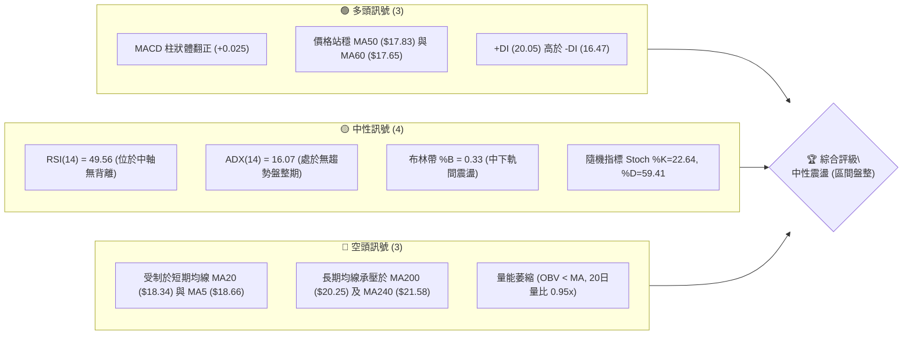
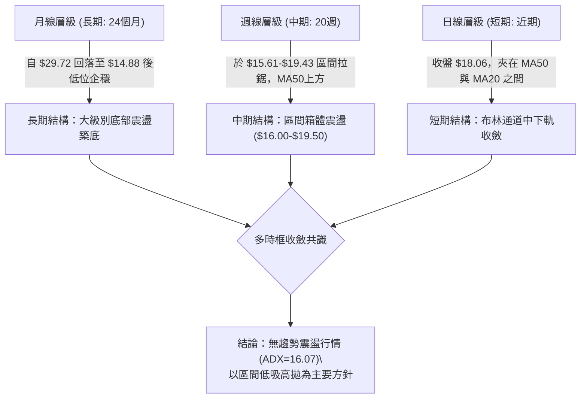
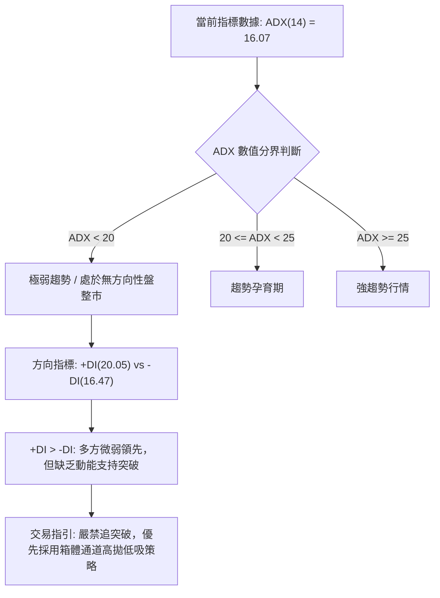
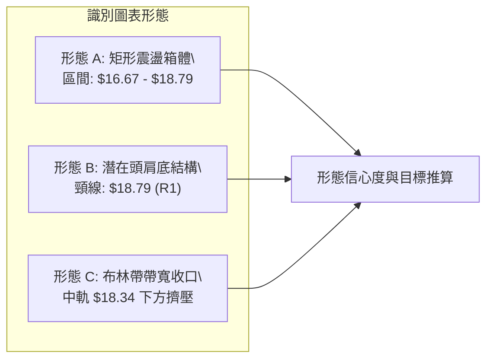
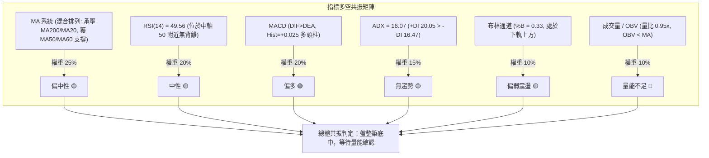
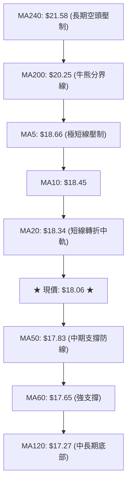
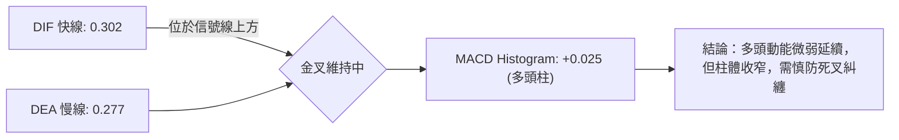
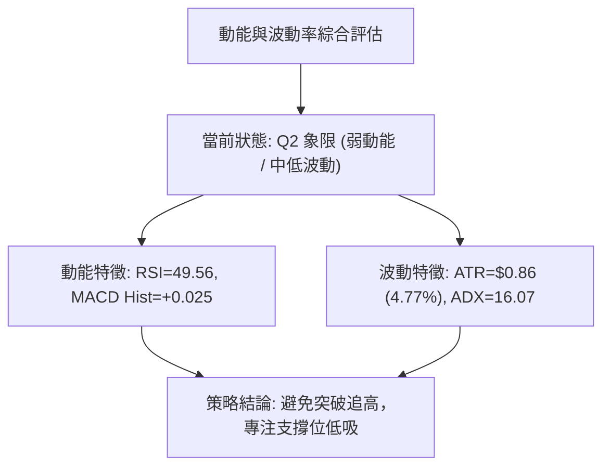
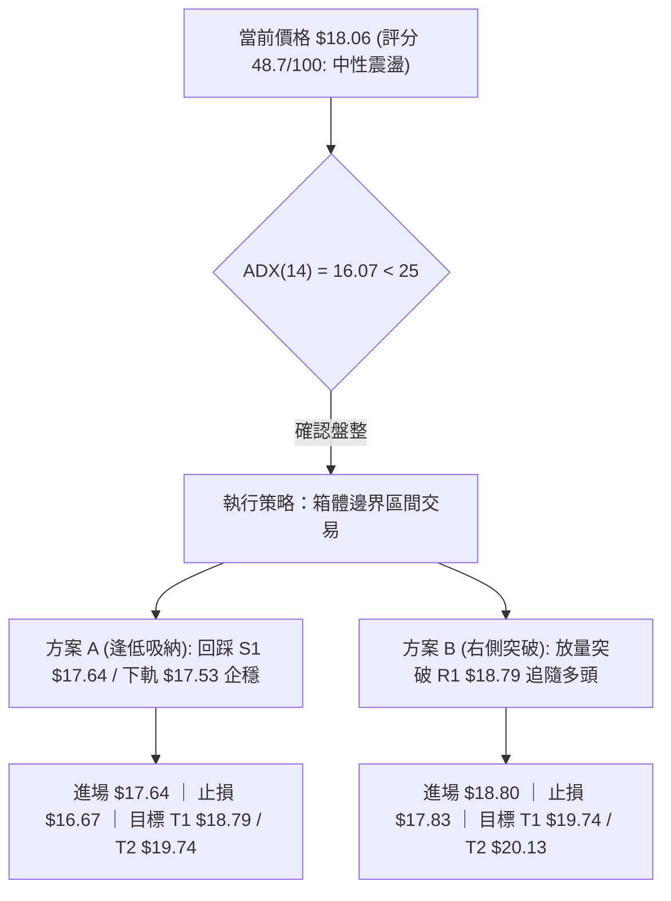
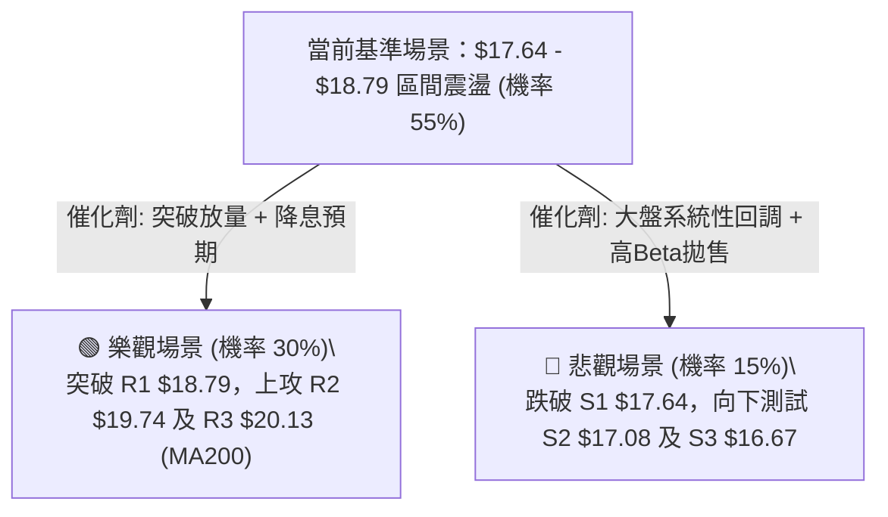

# SOFI 技術分析報告

> **報告日期**：2026-08-30 ｜ **語言**：繁體中文 ｜ **數據來源**：Yahoo Finance ｜ **當前價格**：$18.06

---

## 目錄

| 章節 | 內容 |
|------|------|
| [1. 技術面概覽](#1-技術面概覽) | 訊號儀表板、核心指標、評分卡 |
| [2. 趨勢分析](#2-趨勢分析) | 多時框趨勢、長中短期走勢 |
| [3. 圖表形態分析](#3-圖表形態分析) | 形態識別、K線組合、目標價 |
| [4. 支撐與阻力](#4-支撐與阻力) | 關鍵價位、斐波那契回調 |
| [5. 技術指標深度解讀](#5-技術指標深度解讀) | MA/RSI/MACD/布林/成交量 |
| [6. 動能與波動率](#6-動能與波動率) | 動能評估、ATR、Beta |
| [7. 多時框架總結](#7-多時框架總結) | 時框架評分矩陣 |
| [8. 交易策略建議](#8-交易策略建議) | 多空策略、風險報酬比 |
| [9. 風險提示與監控](#9-風險提示與監控) | 監控指標、風險場景 |

---

## 1. 技術面概覽

### 🎯 技術訊號儀表板



### 📊 核心指標速覽表

| 指標類別 | 指標名稱 | 當前數值 | 訊號 | 解讀 |
|----------|----------|----------|------|------|
| **價格** | 當前收盤價 | $18.06 | 🟡 | 位於52週區間17.8%處，處於底部反彈後的震盪修復期 |
| **均線** | MA20 (布林中軌) | $18.34 | 🔴 | 價格在MA20下方 (-1.52%)，短線面臨中軌反壓 |
| **均線** | MA50 | $17.83 | 🟢 | 價格在MA50上方 (+1.29%)，中期底部支撐有效 |
| **均線** | MA200 | $20.25 | 🔴 | 價格在MA200下方 (-10.81%)，長期牛熊分界線構成重壓 |
| **動能** | RSI(14) | 49.56 | 🟡 | 位於45-55中性平衡區，多空力道均衡，無背離現象 |
| **動能** | MACD (12,26,9) | 0.302 / 0.277 | 🟢 | DIF線位於信號線上方，Histogram為 +0.025，維持弱多頭結構 |
| **趨勢強度**| ADX(14) | 16.07 | 🟡 | ADX < 25 表明市場處於典型無趨勢震盪行情 |
| **波動** | ATR(14) | $0.86 | 🟡 | 佔股價4.77%，每日絕對波動中等，適合區間網格操作 |
| **成交量** | 20日均量比 | 0.95x | 🔴 | 成交量4,542.88萬股小於20日均量，OBV疲弱未見放量突破 |

### 🏆 技術評分卡

```
╔══════════════════════════════════════════════════════════════╗
║              技術評分卡 — SOFI (2026-08-30)                  ║
╠══════════════════════════════════════════════════════════════╣
║ 趨勢強度      ██████░░░░░░░░░░░░░░  32/100  🔴 (ADX極弱，無明確趨勢)║
║ 動能指標      ██████████░░░░░░░░░░  52/100  🟡 (MACD偏多但RSI中性) ║
║ 支撐穩定度    ██████████████░░░░░░  70/100  🟢 (S1 $17.64與MA50重疊)║
║ 成交量配合    ████████░░░░░░░░░░░░  38/100  🔴 (量能不足，OBV偏空) ║
║ 形態完整度    ████████████░░░░░░░░  58/100  🟡 (矩形箱體震盪構築中) ║
║ 均線排列      ████████░░░░░░░░░░░░  42/100  🟡 (均線糾纏，混合排列) ║
╠══════════════════════════════════════════════════════════════╣
║ 綜合評分      ██████████░░░░░░░░░░  48.7/100  評級：⚖️ 中性觀望║
╚══════════════════════════════════════════════════════════════╝
```

---

## 2. 趨勢分析

### 🌐 多時框趨勢分析



### 📈 長期趨勢 — 12個月走勢圖（Unicode）

```
SOFI 月線走勢圖（過去12個月：2025-09 至 2026-08）
價格軸 ($)
$29.72 ┤                  ●(2025-11 高點 $29.72)
$29.68 ┤              ●   │
$26.42 ┤          ●   │   │   ●
$26.18 ┤          │   │   │   │
$22.81 ┤          │   │   │   │   ●
$18.22 ┤          │   │   │   │   │               ●(2026-05)      ●(現價 $18.06)
$17.93 ┤          │   │   │   │   │               │       ●       │
$17.76 ┤          │   │   │   │   │   ●           │       │       │
$16.31 ┤          │   │   │   │   │   │           │       │   ●   │
$16.10 ┤          │   │   │   │   │   │   ●   ●   │       │   │   │
$15.88 ┤          │   │   │   │   │   │   │   │   │       │   │   │
$14.88 ┤          │   │   │   │   │   │   ●(52W Low $14.88)   │   │
       └──────────┴───┴───┴───┴───┴───┴───┴───┴───┴───────┴───┴───┴───
        月份:    09  10  11  12  01  02  03  04  05      06  07  08
        年份:    2025            2026
```

**走勢特徵分析表格**：

| 階段 | 期間涵蓋 | 價格區間 | 累計漲跌 | 趨勢特徵與量價解讀 |
|------|----------|----------|----------|-------------------|
| **主升浪頂峰** | 2025-09 ~ 2025-11 | $26.42 → $29.72 | +12.49% | 衝頂階段，創下波段歷史高點 $29.72，隨後動能衰竭 |
| **大幅下行段** | 2025-12 ~ 2026-03 | $26.18 → $15.88 | -39.34% | 估值修正與獲利回吐，跌破各均線，触發52週低點 $14.88 |
| **底部築底期** | 2026-04 ~ 2026-08 | $16.10 → $18.06 | +12.17% | 於 $15.60-$18.90 構築寬幅收斂箱體，長週期均線下移 |

### 📊 中期趨勢（週線分析）

```
中期週線波段結構示意 (近10週波段)
$19.74 ┤                                     [R2 阻力]
$18.91 ┤                               ● (08-23 高點)
$18.79 ┤                       ●       │     [R1 阻力]
$18.06 ┤═══════════════════════╪═══════╪═════● (現價)
$17.64 ┤               ●       │       │     [S1 支撐 / MA50]
$17.08 ┤               │       │       │     [S2 支撐]
$16.31 ┤       ●       │       │       │
$15.61 ┤   ●───┴───────┴───────┴───────┴───── (波段雙底低點聚類)
       └────────────────────────────────────────
週別:    05-17  06-07   07-12   08-09   08-23 08-30
```

中期走勢顯示，SOFI 在 2026 年 5 月於 $15.61 確立中期低點後，展開震盪走高的反彈波段，最高觸及 8 月 23 日的 $18.91，隨後遭遇阻力 R1 ($18.79) 壓制回落至 $18.06。整體中期形態呈現「震盪抬底」格局。

### ⚡ 趨勢強度評估（ADX 解讀）



| 指標變數 | 當前讀數 | 門檻區間 | 趨勢屬性判定 | 策略意涵 |
|----------|----------|----------|--------------|----------|
| **ADX (14)** | **16.07** | < 25.00 | **無趨勢盤整行情** | 順勢突破策略易產生假突破，震盪逆勢指標更有效 |
| **+DI (14)** | **20.05** | > -DI | 微弱多頭佔優 | 多方掌握微弱主導權，但動能未達發動單邊行情標準 |
| **-DI (14)** | **16.47** | < +DI | 空方力道收斂 | 下跌拋壓減輕，下方存在承接力道 |

---

## 3. 圖表形態分析

### 🔍 形態識別系統



**形態信心度與參數表格**：

| 形態名稱 | 信心度 | 判斷依據（引用數據） | 完成度 | 目標價（附計算式） |
|----------|--------|----------------------|--------|--------------------|
| **矩形震盪箱體** | 85% | 價格多次在支撐 S3 ($16.67) 獲支撐，並在阻力 R1 ($18.79) 遇阻 | 80% | 箱體震盪區間：$16.67 至 $18.79 |
| **中期反轉雙底/頭肩底** | 55% | 2026-05 兩次測試 $15.61-$15.75 低點，頸線為 R1 ($18.79) | 60% | 頸線 $18.79 + 形態高度 ($18.79 - $15.61 = $3.18) = **$21.97** (接近MA240 $21.58) |
| **三角對稱收斂** | 40% | 高點由 $19.43 下降至 $18.91，低點由 $15.61 抬升至 $16.31 | 50% | *訊號不足，僅做指標型解讀（以布林軌道為準）* |

### 🕯️ 重要K線形態分析

| 月份 | 收盤價 | K線形態 | 解讀 | 訊號 |
|------|--------|---------|------|------|
| **2026-05** | $18.22 | 長下影長陽實體線 | 自低點 $15.61 強烈拉升，週線RSI由24.9回升至69.6，確認底部成立 | 🟢 看多 |
| **2026-06** | $17.93 | 橫盤十字整理星 | 在 $16.03-$17.91 間劇烈拉鋸，多空於MA60附近形成平衡換手 | 🟡 中性 |
| **2026-07** | $16.31 | 回調中陰線 | 測試 $16.31-$16.46 支撐位（S3附近），空方測試未破前低 | 🔴 偏空 |
| **2026-08** | $18.06 | 帶長上影小陽線 | 向上衝擊 R1 ($18.79) 與高點 $18.91 後受阻回吐，收於 $18.06 | 🟡 中性 |

### 📉 ASCII 走勢形態示意圖

```
SOFI 日線/週線 矩形箱體與頸線阻力圖
$20.13 ┤                                                   [R3 強阻力]
$19.74 ┤                                                   [R2 阻力]
$18.79 ┤───────●───────────────●─────────────────────────── [R1 / 潛在頸線]
       │      / \             / \
$18.06 ┤─────/───\───●───────/───\───● (現價 $18.06) ════════════════════
       │    /     \ / \     /     \ /
$17.64 ┤───/───────●───\───/───────●─────────────────────── [S1 支撐 / MA50]
$17.08 ┤  /             \ /                                [S2 支撐]
$16.67 ┤─●───────────────●───────────────────────────────── [S3 箱體底部]
$15.61 ┤ 底部1          底部2 (2026-05 雙重底起點)
       └───────────────────────────────────────────────────
```

### 🎯 形態目標價計算

若當前築底形態確認向上突破頸線，量化目標計算如下：
1. **頸線位置 (Neckline)**：設定於聚類阻力位 **R1 = $18.79**。
2. **形態低點 (Pattern Low)**：2026年5月確認之波段低點 **$15.61**。
3. **形態垂直高度 (H)**：$18.79 - $15.61 = **$3.18**。
4. **最小量度升幅目標 (T1)**：$18.79 + $3.18 = **$21.97**（與 240日均線 MA240 $21.58 及 斐波那契 61.8% $21.70 高度共振）。
5. **保守區間目標**：若僅突破當前盤整區，短線第一目標為聚類高點 **R2 = $19.74**。

---

## 4. 支撐與阻力

### 🗺️ 關鍵價位分布圖（Unicode）

```
SOFI 價位結構分布圖
══════════════════════════════════════════════════════════════════
$20.13 ║██████████████████████████████║ 強阻力 R3 (年線重壓區)
$19.74 ║████████████████████          ║ 阻力 R2 (近期波段高點)
$19.14 ║▓▓▓▓▓▓▓▓▓▓▓▓▓▓▓▓▓▓            ║ BB 上軌 (動態短壓)
$18.79 ║██████████████████████████████║ 關鍵阻力 R1 (頸線與波段密集頂)
$18.34 ║░░░░░░░░░░░░░░░░░░            ║ MA20 / BB 中軌 (即時壓制)
$18.06 ╠══════════════════════════════╣ ◄ 現價 ($18.06)
$17.83 ║░░░░░░░░░░░░░░░░░░            ║ MA50 (中期均線支撐)
$17.64 ║██████████████████████████████║ 關鍵支撐 S1 (近期波段回撤低點)
$17.53 ║▓▓▓▓▓▓▓▓▓▓▓▓▓▓▓▓▓▓            ║ BB 下軌 (動態下檔保護)
$17.08 ║████████████████████          ║ 支撐 S2 (波段密集成交低點)
$16.67 ║██████████████████████████████║ 強支撐 S3 (箱體強防守底線)
══════════════════════════════════════════════════════════════════
```

### 🚧 阻力位分析表

| 阻力級別 | 精確價位 | 形成原因（依據數據） | 突破難度 | 重要性評級 |
|----------|----------|----------------------|----------|------------|
| **R1** | **$18.79** | 近一年波段高點聚類；接近斐波那契 78.6% 回調位 ($18.70) | 🟡 中等 (需放量突破20日均量) | ★★★★☆ |
| **R2** | **$19.74** | 2026年4月週線反彈高點聚類 ($19.43-$19.74 壓力帶) | 🔴 較高 (空頭套牢區) | ★★★☆☆ |
| **R3** | **$20.13** | 近一年強阻力聚類；MA200 ($20.25) 及分析師平均目標 ($20.02) 重疊區 | 🔴 極高 (牛熊多空生死線) | ★★★★★ |

### 🛡️ 支撐位分析表

| 支撐級別 | 精確價位 | 形成原因（依據數據） | 守住機率 | 重要性評級 |
|----------|----------|----------------------|----------|------------|
| **S1** | **$17.64** | 近一年波段低點聚類；與 MA60 ($17.65) 及 MA50 ($17.83) 共振 | 🟢 75% | ★★★★☆ |
| **S2** | **$17.08** | 密集換手低點；與 MA120 ($17.27) 形成動態防禦 | 🟢 85% | ★★★☆☆ |
| **S3** | **$16.67** | 2026年6-7月波段極限回踩支撐聚類；箱體下緣防線 | 🟢 92% | ★★★★★ |

### 📐 斐波那契回調位分析

依據 52 週極值區間（低點 **$14.88** → 高點 **$32.73**），計算回調階梯如下：

| 斐波那契比例 | 基準價位 | 當前相對位置與技術解讀 |
|--------------|----------|------------------------|
| **0.0% (52W High)** | **$32.73** | 歷史頂部壓力 |
| **23.6%** | **$28.52** | 超強牛市回撤極限 |
| **38.2%** | **$25.91** | 長期估值中樞重壓位 |
| **50.0%** | **$23.80** | 大週期多空平衡分水嶺 |
| **61.8% (黃金分割)** | **$21.70** | 強阻力帶，與 MA240 ($21.58) 形成雙重共振阻力 |
| **78.6%** | **$18.70** | **現價 ($18.06) 所在即時測試區間 ($14.88 - $18.70)** |
| **100.0% (52W Low)** | **$14.88** | 52週絕對底部防線 |

**技術位置解讀**：
現價 $18.06 目前處於 **78.6% 回調位 ($18.70)** 與 **100.0% 底部 ($14.88)** 之間。$18.70 剛好與波段阻力 R1 ($18.79) 緊密重合，表明 $18.70-$18.79 是股價擺脫深幅回撤區、向上修復至 61.8% ($21.70) 的關鍵「閘門」。

---

## 5. 技術指標深度解讀

### 🎛️ 指標訊號總覽



### 📈 移動平均線排列分析



| 均線名稱 | 當前價格 | 與現價乖離率 | 走勢特徵 | 支撐/阻力屬性 |
|----------|----------|--------------|----------|---------------|
| **MA5** | $18.66 | -3.24% | 短線下彎 | 第一短線動態阻力 |
| **MA20** | $18.34 | -1.52% | 走平略微下傾 | 中軌阻力，突破方能轉強 |
| **MA50** | $17.83 | +1.29% | 持續向上勾頭 | 中期生命線支撐 |
| **MA60** | $17.65 | +2.32% | 穩定上行 | 與 S1 ($17.64) 共振支撐 |
| **MA200**| $20.25 | -10.81% | 下行斜率放緩 | 長期牛熊分水嶺阻力 |

### 📉 RSI(14) 分析

- **當前讀數**：**49.56**
- **數值進度條**：
  `0 ├──────────────██████████░░░░░░░░░░──────────────┤ 100` (49.56% — 中性平衡位)
- **背離判斷**：
  檢視近 20 週數據，2026-05-10 週收盤 $15.75 時 RSI 觸及低點 24.9，隨後價格在 2026-05-17 跌至 $15.61 時 RSI 回升至 30.2，曾構成**週線級別底背離**並推動此波反彈至 $18.91。當前日線與週線 RSI 均回落至 49.6 附近，**目前無頂背離或底背離跡象**，反映籌碼換手充分，動能處於真空蓄勢期。

### 📊 MACD(12,26,9) 訊號解讀



當前 MACD 柱狀體為 **+0.025**，呈現正值但動能有所減弱（前期高點週線柱體曾達 +0.181）。快慢線均位於零軸上方運行，維持微弱的看多架構，但未見發散拉升，顯示推升力道受制於量能。

### 📦 布林通道分析

```
布林通道 (20, 2) 結構示意圖
$19.14 ┤  ──────────────────────────────── 上軌 (Upper Band)
       │
$18.34 ┤  - - - - - - - - - - - - - - - - 中軌 (MA20: $18.34)
$18.06 ┤  <<<< 現價: $18.06 (%B = 0.33) >>>>
       │
$17.53 ┤  ──────────────────────────────── 下軌 (Lower Band)
```
- **帶寬與位置**：上軌 **$19.14**，中軌 **$18.34**，下軌 **$17.53**。
- **%B 指標**：**0.33**（位於中軌與下軌之間，距離下軌支撐較近）。
- **特徵解讀**：布林帶帶寬目前呈現收口狀態，價格在下軌 $17.53 獲得良好緩衝，回踩下軌未破即屬強勢整理，但需重返 $18.34 中軌上方方能開啟對上軌 $19.14 的挑戰。

### 💹 成交量分析（量價配合度）

- **最新成交量**：45,428,800 股
- **20日均量**：47,815,010 股（量比 **0.95x**，呈現縮量整理）
- **50日均量**：71,096,912 股（較中長期縮量 36.1%）
- **OBV (能量潮)**：OBV < MA，量能指標處於均線下方，顯示近期反彈屬於縮量修復，機構主動性大買盤尚未大規模進場，缺乏放量突破關鍵阻力 R1 ($18.79) 的動能。

---

## 6. 動能與波動率

### ⚡ 動能評估四象限

| 象限 | 動能維度 (Momentum) | 波動維度 (Volatility) | 當前 SOFI 狀態 | 交易環境與應對策略 |
|------|----------------------|-----------------------|----------------|--------------------|
| **Q1** | 強 (Trend Strong) | 低 (Low Volatility) | — | 穩定單邊趨勢（最佳持股） |
| **Q2** | **弱 (Neutral/Weak)** | **低 (Moderate/Low)** | **✓ (當前所處象限)** | **低波動蓄勢盤整：適合區間網格、逢低布局** |
| **Q3** | 強 (High Momentum) | 高 (High Volatility) | — | 突破暴發行情（高風險高回報） |
| **Q4** | 弱 (Bearish Drop) | 高 (Extreme Volatility)| — | 恐慌拋售行情（嚴格停損觀望） |



### 📊 ATR 波動率分析

- **ATR(14) 絕對值**：**$0.86**
- **價格百分比**：**4.77%**（每日預期正常波動幅度）
- **風控參數應用**：
  - **1.0x ATR (短線日內緩衝)**：$0.86 → 關鍵支撐 S1 ($17.64) - $0.86 = **$16.78**
  - **1.5x ATR (波段止損推薦距離)**：$0.86 × 1.5 = **$1.29** → 進場點保護區間
  - **2.0x ATR (安全止損邊界)**：$0.86 × 2.0 = **$1.72**

### 📐 Beta 與市場相關性

- **Beta 係數**：**2.204**
- **特性解讀**：SOFI 具有高 Beta 屬性（波動幅度為大盤 S&P 500 的 2.2 倍）。在市場風險偏好上升時具備高度彈性，但在無趨勢盤整期易放大日內雜訊震盪。機構持股佔比 51.3%，空頭部位比例（Short % Float）達 **13.5%**，Short Ratio 為 2.38，表明一旦放量突破關鍵阻力 R1 ($18.79)，具備引發空頭回補（Short Squeeze）的潛在動能。

---

## 7. 多時框架總結

### 📋 時框架評分表

| 時框架 | 趨勢方向 | 動能指標 | 均線排列 | 形態結構 | 綜合評分 | 操作建議 |
|--------|----------|----------|----------|----------|----------|----------|
| **長期 (月線)** | 偏空築底 🔴 | RSI 偏弱 | 承壓於 MA240 ($21.58) | 距高點深幅回調後企穩 | 40/100 | 長期分批逢低配置 |
| **中期 (週線)** | 震盪偏多 🟢 | MACD翻紅 | 企穩於 MA50 ($17.83) | 寬幅收斂箱體 ($16-$19) | 58/100 | 箱體區間操作 |
| **短期 (日線)** | 中性震盪 🟡 | RSI=49.56 | 夾在 MA20 與 MA50 間 | 布林通道中軌下方收斂 | 48/100 | 回踩 S1 支撐低吸 |

### 🔲 綜合訊號矩陣

```
時框共振度分析矩陣
────────────────────────────────────────────────────────────────
維度           短期 (日線)       中期 (週線)       長期 (月線)
────────────────────────────────────────────────────────────────
主導方向       🟡 區間盤整       🟢 震盪築底       🔴 弱勢修復
均線訊號       🔴 承壓 MA20      🟢 站穩 MA50      🔴 低於 MA200
動能狀態       🟡 RSI 49.56      🟢 MACD柱正向     🔴 歷史低位區
量價配合       🔴 縮量整理       🟡 換手穩定       🔴 機構觀望
────────────────────────────────────────────────────────────────
時框一致性     ★☆☆☆☆ (衝突收斂中，盤整行情由日線/週線箱體主導)
────────────────────────────────────────────────────────────────
```

### ⚖️ 多時框收斂結論

> **收斂規則執行（依嚴格要求 14）**：
> 1. **行情屬性判定**：當前 ADX(14) = **16.07 (< 25)**，明確定義為**典型盤整行情**。
> 2. **主導維度確立**：在盤整行情中，中長期趨勢指標暫時失效，交易權重優先收斂至**日線布林通道上下軌 ($17.53 - $19.14)** 與 **近一年支撐/阻力聚類 ($17.64 - $18.79)**。
> 3. **唯一方向性結論**：**中性觀望（區間操作）**。評分 48.7/100 處於 40–60 區間，策略禁止追高殺跌，以「支撐位 S1/下軌低吸、阻力位 R1/上軌高拋」為唯一主軸。

---

## 8. 交易策略建議

### 🗺️ 策略決策流程圖



### 🧭 策略路由

**當前主策略方向 = 區間震盪操作（依綜合評分 48.7 / 100，採用布林通道與關鍵水平位進行區間高拋低吸）**

### 🎯 價格情境階梯（Price Scenarios）

| 觸發條件 | 下一目標 | 後續延伸 | 情境技術含義（完全引用數據庫價位） |
|----------|----------|----------|-----------------------------------|
| **放量突破 R1 ($18.79)** | **R2 ($19.74)** | **R3 ($20.13)** | 擺脫 78.6% 斐波那契壓制，開啟向 MA200 反彈波段 |
| **維持於現價區間 ($18.06)** | **MA20 ($18.34)** | **BB上軌 ($19.14)** | 於 MA50 ($17.83) 至 MA20 之間收斂整理 |
| **有效跌破 S1 ($17.64)** | **S2 ($17.08)** | **S3 ($16.67)** | 中期支撐失守，考驗前波箱體下緣防線 |

### 📊 情境機率分佈

| 情境分類 | 機率預估 | 主要依據與技術指標佐證 |
|----------|----------|------------------------|
| **區間震盪 (箱體整理)** | **55%** | ADX=16.07 極低、布林帶寬收口、RSI=49.56 處於中軸無方向 |
| **向上反彈 (突破 R1)** | **30%** | MACD維持多頭柱(+0.025)、+DI > -DI、股價穩居 MA50 上方 |
| **破位下行 (跌穿 S1)** | **15%** | OBV疲弱、短期均線 MA5/MA20 反壓、量能不足 |

### 🟢 主策略詳情

依據評分卡 48.7 分（中性區間），規劃以下兩套精確執行方案：

| 策略要素 | 策略 A：左側支撐低吸（主推策略） | 策略 B：右側突破跟進（次選策略） |
|----------|----------------------------------|----------------------------------|
| **策略類型** | 支撐位回踩逢低做多 | 阻力位右側放量突破做多 |
| **進場條件** | 回踩 S1 獲得支撐且日K收下影線 | 日線收盤價實體突破 R1 且成交量 > 20日均量 |
| **精確進場點** | **$17.64** (S1 支撐位) | **$18.85** (突破 R1 $18.79 確認後) |
| **目標價 T1** | **$18.79** (R1 阻力位, 潛在獲利 +6.52%) | **$19.74** (R2 阻力位, 潛在獲利 +4.72%) |
| **目標價 T2** | **$19.74** (R2 阻力位, 潛在獲利 +11.90%) | **$20.13** (R3 阻力位, 潛在獲利 +6.79%) |
| **精確止損點** | **$17.08** (S2 支撐位下方, 風險 -3.17%) | **$18.34** (MA20/布林中軌, 風險 -2.71%) |
| **風險報酬比** | **1 : 2.06** (以 T1 計算) / **1 : 3.75** (T2) | **1 : 1.74** (以 T1 計算) / **1 : 2.51** (T2) |
| **成功機率** | **65%** | **50%** |
| **建議倉位** | 10% - 15% 總資金 | 5% - 10% 總資金 |

### 🔴 反向風險觸發點（對沖與風控提示）

- **多頭全面止損/轉空觸發價**：若日K線收盤價跌破 **S3 ($16.67)**，宣告中期雙底築底失敗，應無條件平倉多頭並可考慮輕倉順勢放空，下看 52週低點 **$14.88**。
- **空頭平倉/回補觸發價**：若股價放量站上 **R2 ($19.74)**，將引發 13.5% 空頭部位軋空，空方必須全數止損。

### ⭐ 整體訊號強度評星

```
╔══════════════════════════════════════════════════╗
║ 做多訊號強度：  ★★★☆☆  (3.0/5星 - 支撐有效但欠缺量能) ║
║ 做空訊號強度：  ★★☆☆☆  (2.0/5星 - 下方均線支撐密集) ║
║ 整體可信度：    ★★★★☆  (4.0/5星 - 區間邊界定義清晰) ║
╚══════════════════════════════════════════════════╝
```

---

## 9. 風險提示與監控

### ✅ 關鍵監控指標 Checklist

```
╔══════════════════════════════════════════════════════════════════╗
║                     SOFI 每日盤後關鍵監控清單                    ║
╠══════════════════════════════════════════════════════════════════╣
║ [ ] 價格防守監控：收盤價是否守穩 MA50 ($17.83) 及 S1 ($17.64)     ║
║ [ ] 突破確認監控：日K是否放量站上 MA20 ($18.34) 及 R1 ($18.79)   ║
║ [ ] 動能指標監控：MACD 柱狀體是否維持正值 (目前 +0.025，防死叉)   ║
║ [ ] 趨勢啟動監控：ADX(14) 是否由 16.07 向上穿越 20-25 門檻       ║
║ [ ] 量能異動監控：單日成交量是否超越 20日均量 (4,781.5萬股)      ║
║ [ ] 波動異常監控：單日真實波幅是否異常超越 2.0x ATR ($1.72)     ║
╚══════════════════════════════════════════════════════════════════╝
```

### ⚠️ 風險場景分析



### 🛡️ 風險管理重要提醒

1. **高 Beta 波動管理**：SOFI Beta 值達 **2.204**，波動顯著大於標普 500 指數。單筆交易最大虧損額度應嚴格控制在總投資組合淨值的 **1.0% - 1.5%** 以內。
2. **區間操作紀律**：在 ADX < 25 的環境下，切忌在布林通道上軌 ($19.14) 或 R1 ($18.79) 附近進行追買操作，應耐心等待價格拉回 S1 ($17.64) 或布林下軌 ($17.53) 出現止跌K線後再行介入。
3. **止損嚴格執行**：當前 S1 ($17.64) 為短線生命線，若帶量長陰跌破，應立即執行保護性止損，防範向 S3 ($16.67) 甚至 52 週低點 ($14.88) 的深度回撤。

---

## 📋 報告總結

```
╔══════════════════════════════════════════════════════════════════╗
║                   SOFI 技術分析報告總結                          ║
╠══════════════════════════════════════════════════════════════════╣
║ 報告日期：2026-08-30                                             ║
║ 當前價格：$18.06                                                 ║
║ 分析評級：⚖️ 中性觀望 / 區間震盪 (綜合評分: 48.7/100)           ║
║                                                                  ║
║ 關鍵結論：                                                       ║
║ ├─ 長期趨勢：🔴 偏弱築底 (承壓於 MA200 $20.25 與 MA240 $21.58)  ║
║ ├─ 中期趨勢：🟢 震盪抬底 (企穩於 MA50 $17.83 與 MA60 $17.65)    ║
║ ├─ 短期趨勢：🟡 窄幅收斂 (受制於 MA20 $18.34，ADX=16.07 弱趨勢) ║
║ ├─ 關鍵支撐：S1 $17.64 ｜ S2 $17.08 ｜ S3 $16.67                 ║
║ ├─ 關鍵阻力：R1 $18.79 ｜ R2 $19.74 ｜ R3 $20.13                 ║
║ └─ 華爾街共識目標價：$20.02 (平均) / $30.00 (最高)               ║
║                                                                  ║
║ 最優策略組合：                                                   ║
║ 1. 🥇 最佳機會 (策略 A)：回踩 S1 $17.64 低吸，目標 $18.79/$19.74 ║
║ 2. 🥈 次選機會 (策略 B)：放量突破 R1 $18.85 右側跟進，目標 $19.74║
║ 3. 🥉 保守選擇：持有現金觀望，等待 ADX > 25 趨勢明確再行進場   ║
╚══════════════════════════════════════════════════════════════════╝
```

---

> ⚠️ **免責聲明**：本報告為技術分析研究，所有價位均基於歷史 OHLCV 數據計算推導。本報告**僅供學術研究與投資策略參考**，**不構成任何形式的買賣邀約或投資建議**。金融市場具有高度風險，投資人應獨立評估自身風險承受能力並自行承擔交易結果。

---

*報告生成時間：2026-08-30 ｜ 數據來源：Yahoo Finance ｜ 分析框架：多時框技術分析模型*