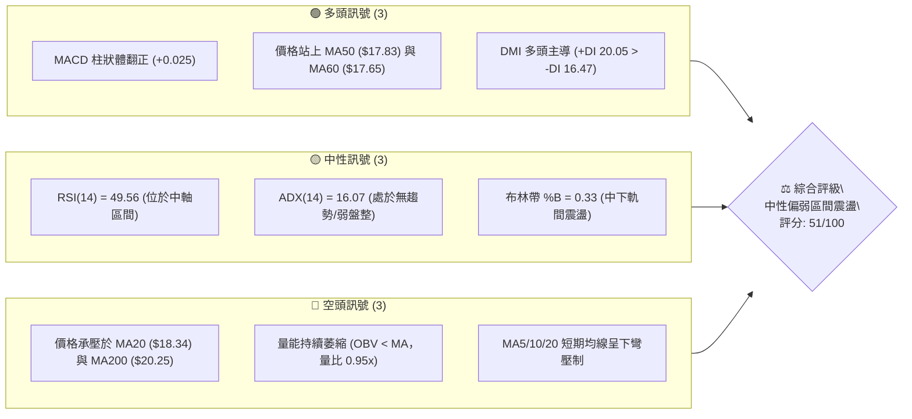
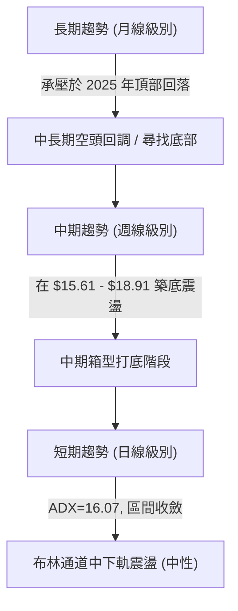
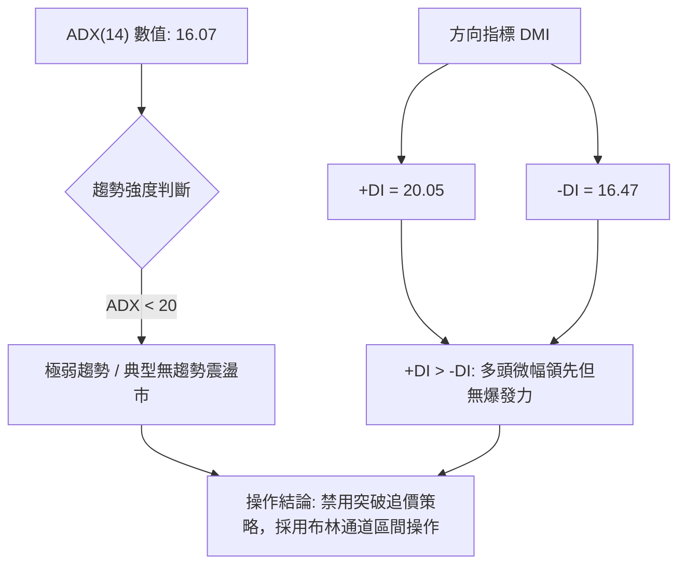
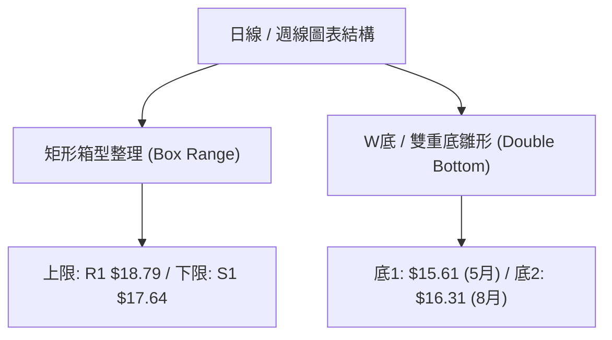
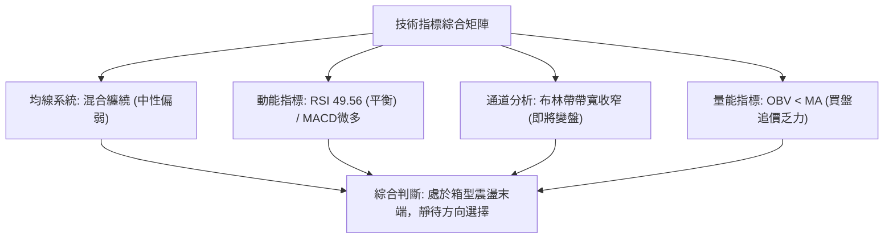
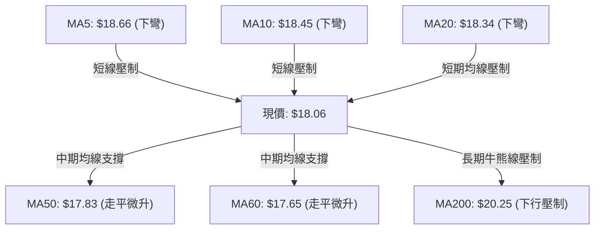
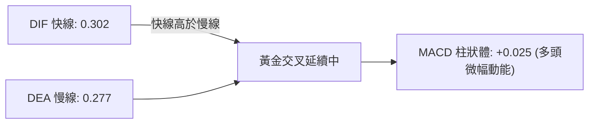
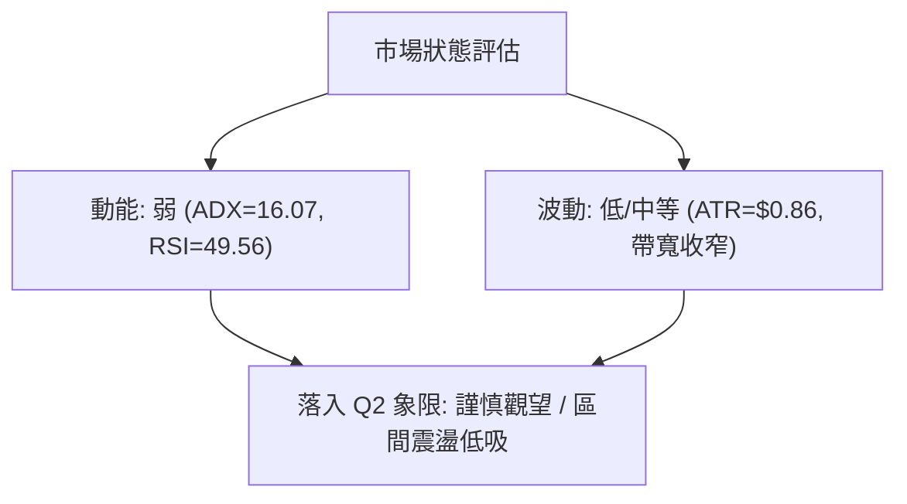
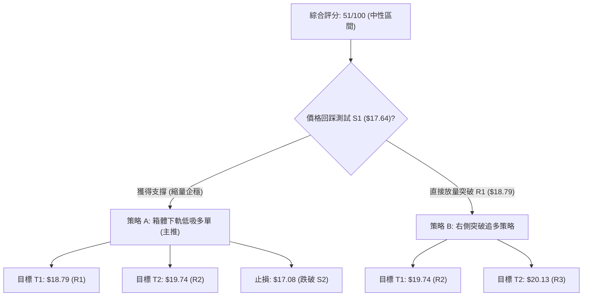
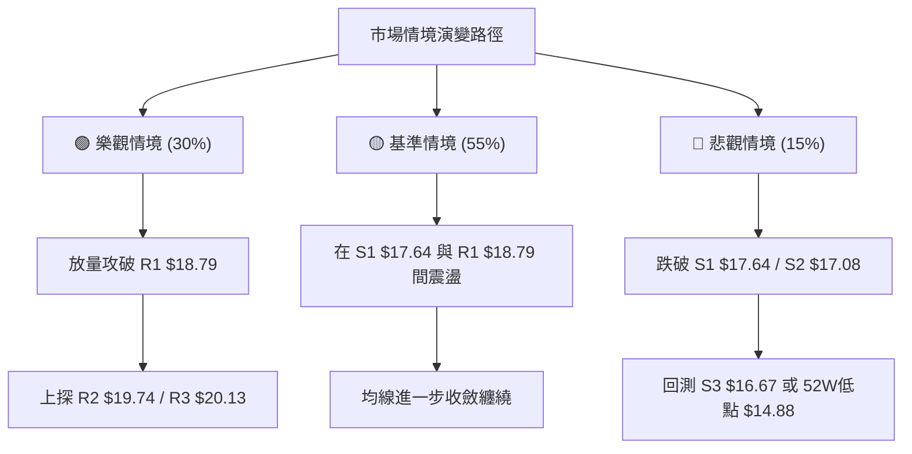

# SOFI 技術分析報告

> **報告日期**：2026-08-31 ｜ **語言**：繁體中文 ｜ **數據來源**：Yahoo Finance ｜ **當前價格**：$18.06

---

## 目錄

| 章節 | 內容 |
|------|------|
| [1. 技術面概覽](#1-技術面概覽) | 訊號儀表板、核心指標、評分卡 |
| [2. 趨勢分析](#2-趨勢分析) | 多時框趨勢、長中短期走勢、ADX解讀 |
| [3. 圖表形態分析](#3-圖表形態分析) | 形態識別、K線組合、形態信心度 |
| [4. 支撐與阻力](#4-支撐與阻力) | 關鍵價位、斐波那契回調結構 |
| [5. 技術指標深度解讀](#5-技術指標深度解讀) | MA/RSI/MACD/布林/成交量 |
| [6. 動能與波動率](#6-動能與波動率) | 動能評估、ATR、Beta 與市場風險 |
| [7. 多時框架總結](#7-多時框架總結) | 時框架評分矩陣、多時框收斂 |
| [8. 交易策略建議](#8-交易策略建議) | 主策略路由、情境階梯、風報比 |
| [9. 風險提示與監控](#9-風險提示與監控) | 監控清單、極端情境、風控原則 |
| [📋 報告總結](#-報告總結) | 核心總結儀表板 |

---

## 1. 技術面概覽

### 🎯 技術訊號儀表板



### 📊 核心指標速覽表

| 指標類別 | 指標名稱 | 當前數值 | 訊號 | 解讀 |
|----------|----------|----------|------|------|
| **價格** | 當前收盤價 | $18.06 | 🟡 | 位於 52 週高低區間之 17.8%，處於中低位築底階段 |
| **均線** | 短期 MA20 | $18.34 | 🔴 | 價格在 MA20 下方 (-1.52%)，短線反彈動能受阻 |
| **均線** | 中期 MA50 | $17.83 | 🟢 | 價格在 MA50 上方 (+1.29%)，中期波段支撐具備防守力 |
| **均線** | 長期 MA200| $20.25 | 🔴 | 價格在 MA200 下方 (-10.81%)，長期空頭壓制格局未解 |
| **動能** | RSI(14) | 49.56 | 🟡 | 處於 45–55 中性平衡區，無超買或超賣現象 |
| **動能** | MACD (12,26,9) | 0.302 / 0.277 | 🟢 | MACD 快線高於慢線，柱狀體 (+0.025) 微幅擴張，微弱看多 |
| **動能** | Stochastic %K/%D | 22.64 / 59.41 | 🟡 | %K 進入弱勢區但尚未形成向上黃金交叉 |
| **趨勢** | ADX(14) | 16.07 | 🟡 | ADX < 25 表明處於弱趨勢／無方向盤整行情 |
| **波動** | ATR(14) | $0.86 (4.77%) | 🟡 | 每日平均波動幅度中等，適合區間網格或波段低吸 |
| **量能** | OBV 趨勢 | OBV < MA | 🔴 | 成交量能未能有效放大，買盤追價意願不足 |

### 🏆 技術評分卡

```
╔══════════════════════════════════════════════════════════════╗
║              技術評分卡 — SOFI (2026-08-31)                  ║
╠══════════════════════════════════════════════════════════════╣
║ 趨勢強度 (ADX 16.07)   ████░░░░░░░░░░░░░░░░  25/100 🔴 弱勢盤整║
║ 動能指標 (RSI/MACD)    ███████████░░░░░░░░░  55/100 🟡 中性微多║
║ 支撐穩定度 (S1/S2/MA50)██████████████░░░░░░  70/100 🟢 支撐紮實║
║ 成交量配合 (量比 0.95)  ████████░░░░░░░░░░░░  40/100 🔴 量能疲弱║
║ 形態完整度 (箱型整理)  ████████████░░░░░░░░  60/100 🟡 區間成型║
║ 均線排列 (混合纏繞)    ████████████░░░░░░░░  58/100 🟡 多空交戰║
╠══════════════════════════════════════════════════════════════╣
║ 綜合技術評分           ██████████░░░░░░░░░░  51/100 🟡 中性觀望║
╚══════════════════════════════════════════════════════════════╝
```

---

## 2. 趨勢分析

### 🌐 多時框趨勢分析



### 📈 長期趨勢 — 12個月走勢圖（Unicode）

```
SOFI 月線收盤走勢圖（2025-09 至 2026-08）
價格軸 ($)
$30.00 ┤              ● 29.68  ● 29.72 (歷史波段高點聚類)
$27.00 ┤        ● 26.42              ● 26.18
$24.00 ┤                                   ● 22.81
$21.00 ┤                                         
$18.00 ┤                                               ● 17.76    ● 18.22  ● 17.93        ● 18.06 (現價)
$15.00 ┤                                                     ● 15.88  ● 16.10        ● 16.31
       └───────────────────────────────────────────────────────────────────────────────────────────
        2025-09  2025-10  2025-11  2025-12  2026-01  2026-02  2026-03  2026-04  2026-05  2026-06  2026-07  2026-08
```

#### 走勢特徵分析表格

| 階段週期 | 時間區間 | 價格變動 | 漲跌幅 | 走勢特徵與結構分析 |
|----------|----------|----------|--------|--------------------|
| **強勢衝頂** | 2025-09 至 2025-11 | $26.42 → $29.72 | +12.49% | 量價齊揚，觸及 52 週高點 $32.73 區域後動能竭盡 |
| **主跌回調** | 2025-11 至 2026-03 | $29.72 → $15.88 | -46.57% | 跌破所有短中期均線，形成流暢的單邊下行趨勢 |
| **底部震盪** | 2026-03 至 2026-08 | $15.88 → $18.06 | +13.73% | 於 $15.60–$18.90 區間反覆收斂，進入無趨勢籌碼換手期 |

### 📊 中期趨勢（週線分析）

中期走勢顯示價格在 $15.61 至 $18.91 之間進行寬幅震盪。近 20 週數據顯示，2026 年 5 月中旬於 $15.61 獲得強烈支撐後展開反彈，隨後在 7–8 月兩次上攻 $18.78 與 $18.91 均遇阻回落，形成明顯的橫盤整理箱型。

```
中期週線箱型結構示意圖
═════════════════════════════════════════════════════════════
$19.00 ── 阻力上限 ───────────────────────────── $18.91 / R1 $18.79 (遇阻)
          ▲                                       ▲
          │      波段反彈                         │      震盪收斂
          │                                       │
$18.06 ── ┼───────────────────────────────────────┼── 現價 ($18.06)
          │                                       │
          ▼                                       ▼
$15.60 ── 支撐下限 ───────────────────────────── $15.61 / 52W Low $14.88 (強防守)
═════════════════════════════════════════════════════════════
```

### ⚡ 趨勢強度評估（ADX 解讀）



#### ADX 強度對照表

| 指標 | 當前數值 | 臨界標準 | 狀態評估 | 交易指引 |
|------|----------|----------|----------|----------|
| **ADX** | 16.07 | < 20 (弱/盤整) | 處於典型橫盤沉澱期 | 順勢突破策略失效，應轉為均值回歸交易 |
| **+DI** | 20.05 | > -DI (16.47) | 多頭力量微幅佔優 | 具備低吸反彈基礎，但缺乏單邊拉升能量 |
| **-DI** | 16.47 | 低於 20 | 空頭拋壓處於衰竭狀態 | 下跌空間受限，下方支撐相對穩固 |

---

## 3. 圖表形態分析

### 🔍 形態識別系統



#### 形態信心度與參數評估表

| 形態名稱 | 信心度 | 判斷依據（引用數據） | 完成度 | 目標價（附嚴格計算式） |
|----------|--------|----------------------|--------|------------------------|
| **矩形箱型整理** | **85%** | 價格在 R1 ($18.79) 與 S1 ($17.64) 間反覆震盪收斂，布林帶寬度收窄 | 90% | 向上突破 R1: $18.79 + ($18.79 - $17.64) = **$19.94** (接近 R3 $20.13) |
| **中期雙底雛形** | **65%** | 2026-05-17 低點 $15.61 與 2026-08-02 低點 $16.31 形成次低點抬高 | 60% | 突破頸線 $18.91: $18.91 + ($18.91 - $15.61) = **$22.21** (接近 61.8% $21.70) |
| **頭肩底形態** | **35%** | 數據中左肩與右肩結構不對稱，成交量未現典型放大特徵 | 20% | *訊號不足，不予計算目標價，僅做指標型解讀* |

### 🕯️ 重要K線形態分析

| 日期 / 週期 | 收盤價 | K線形態特徵 | 技術解讀 | 訊號強度 |
|-------------|--------|-------------|----------|----------|
| **2026-08-02 (週線)** | $16.31 | 探底回升長下影線 | 在波段低點獲得強勁買盤支撐，確認 S3 $16.67 具備買盤介入 | 🟢 看多 |
| **2026-08-23 (週線)** | $18.91 | 衝高回落倒錘頭線 | 挑戰 52 週回調位 78.6% ($18.70) 與 R1 ($18.79) 失敗，上方解套賣壓沉重 | 🔴 看空 |
| **2026-08-30 (週線)** | $18.06 | 縮量中陰線回調 | 價格回撤至 MA20 與 MA50 之間，回踩確認 S1 $17.64 支撐有效性 | 🟡 中性 |

### 📉 ASCII 走勢形態示意圖

```
SOFI 中期雙底與箱型整理形態示意圖
價格 ($)
$19.00 ┤                    頸線 / 箱頂 R1 ($18.79 - $18.91)
       ├───────/\──────────────/\───────────────/\───── (多次遇阻)
$18.06 ┤      /  \            /  \             /  \     ◄ 現價 $18.06
$17.50 ┤     /    \          /    \           /    \    支撐 S1 ($17.64)
$16.50 ┤    /      \        /      \  底2    /
$15.50 ┤   /        \ 底1  /        \●$16.31/
       └──/──────────●─────/───────────────────────────
                   $15.61 (5月)       (8月)
```

### 🎯 形態目標價計算

1. **箱型突破測量目標**：
   - 箱頂壓力 = $18.79 (R1)，箱底支撐 = $17.64 (S1)，箱體高度 $H = 18.79 - 17.64 = 1.15$
   - 向上突破目標價 = $18.79 + 1.15 =$ **$19.94**（高度聚類於 R2 $19.74 與 R3 $20.13）
   - 向下跌破測量目標 = $17.64 - 1.15 =$ **$16.49**（貼近支撐 S3 $16.67）

2. **中期雙底突破測量目標**：
   - 頸線高點 = $18.91 (2026-08-23 收盤)，最低點 = $15.61 (2026-05-17 收盤)，形態高度 $H = 18.91 - 15.61 = 3.30$
   - 形態完全確立目標 = $18.91 + 3.30 =$ **$22.21**（落在斐波那契 61.8% $21.70 與 MA240 $21.58 附近）

---

## 4. 支撐與阻力

### 🗺️ 關鍵價位分布圖（Unicode）

```
SOFI 價位結構分布圖
═══════════════════════════════════════════════════════════════════
$20.13 ║██████████████████████████████████████║ 強阻力 R3 (MA200 重合區)
$19.74 ║████████████████████████████          ║ 阻力 R2 (波段高點聚類)
$18.79 ║██████████████████████████████████████║ 關鍵阻力 R1 (Fib 78.6% $18.70)
$18.34 ║──────────────────────────────────────║ 短期阻力 (BB中軌 / MA20)
$18.06 ╠══════════════════════════════════════╣ ◄ 當前價格 $18.06
$17.83 ║┄┄┄┄┄┄┄┄┄┄┄┄┄┄┄┄┄┄┄┄┄┄┄┄┄┄┄┄┄┄┄┄┄┄┄┄║ 短期支撐 (MA50 防守線)
$17.64 ║▓▓▓▓▓▓▓▓▓▓▓▓▓▓▓▓▓▓▓▓▓▓▓▓▓▓▓▓▓▓▓▓▓▓▓▓▓▓║ 近期核心支撐 S1 (MA60 $17.65)
$17.08 ║████████████████████████████          ║ 中期支撐 S2 (波段密集成交)
$16.67 ║██████████████████████████████████████║ 強支撐 S3 (8月打底低點區間)
═══════════════════════════════════════════════════════════════════
```

### 🚧 阻力位分析表

| 阻力級別 | 精確價位 | 距離現價 | 形成原因與技術共振 | 突破難度 | 重要性 |
|----------|----------|----------|--------------------|----------|--------|
| **R1** | **$18.79** | +4.04% | 近一年波段高點聚類、斐波那契 78.6% ($18.70) 密集區 | 🟡 中等 | ★★★★☆ |
| **R2** | **$19.74** | +9.30% | 2026年4月波段高點聚類、布林帶上軌延伸區 | 🔴 偏高 | ★★★☆☆ |
| **R3** | **$20.13** | +11.46%| MA200 ($20.25) 牛熊分界線共振區、整數心理關卡 | 🔴 極高 | ★★★★★ |

### 🛡️ 支撐位分析表

| 支撐級別 | 精確價位 | 距離現價 | 形成原因與技術共振 | 守住機率 | 重要性 |
|----------|----------|----------|--------------------|----------|--------|
| **S1** | **$17.64** | -2.33% | 近一年波段低點聚類、MA60 ($17.65) 與布林下軌 ($17.53) 共振 | 🟢 75% | ★★★★☆ |
| **S2** | **$17.08** | -5.43% | MA120 ($17.27) 下方緩衝區、中期波段密集支撐區 | 🟢 80% | ★★★☆☆ |
| **S3** | **$16.67** | -7.70% | 8月初週線低點聚類、波段防守生命線 | 🟢 90% | ★★★★★ |

### 📐 斐波那契回調位分析

依據 52 週高低點（最高 $32.73 至 最低 $14.88，波幅 $17.85）計算之回調結構：

```
斐波那契回調結構 (52W Range: $14.88 → $32.73)
  0.0%  (52W High) ────────────────────────── $32.73 (歷史極限高點)
 23.6%             ────────────────────────── $28.52
 38.2%             ────────────────────────── $25.91
 50.0%             ────────────────────────── $23.80 (中樞平衡線)
 61.8%             ────────────────────────── $21.70 (黃金分割關鍵阻力 / MA240 $21.58)
 78.6%             ────────────────────────── $18.70 (現階段強壓區 / R1 $18.79)
                   ▲ 現價 $18.06 (處於 78.6% 與 100.0% 弱勢修復區)
100.0%  (52W Low)  ────────────────────────── $14.88 (底部終極防線)
```

- **位置解讀**：當前價格 $18.06 運行於 78.6% 回調位 ($18.70) 與 100.0% ($14.88) 之間，屬於大幅回調後的深部修復階段。
- **關鍵意義**：若無法放量突破 78.6% ($18.70 / R1 $18.79)，反彈行情僅能視為超跌後的弱勢震盪；唯有實質站穩 $18.70 之上，方能打開朝向 61.8% ($21.70) 的上行空間。

---

## 5. 技術指標深度解讀

### 🎛️ 指標訊號總覽



### 📈 移動平均線排列分析



#### 均線系統數據詳解

| 週期 | 數值 | 偏離度 | 走勢特徵 | 訊號意涵 |
|------|------|--------|----------|----------|
| **MA5** | $18.66 | -3.24% | ▅▄▃▃▃▂▂▁▁▁▁▂▄▅▇▇ (短線受阻) | 🔴 超短線回調中 |
| **MA10** | $18.45 | -2.14% | ▆▆▆▅▄▃▂▁▁▁▁▁▂▃▃▄▄ (短線下穿) | 🔴 短期壓制 |
| **MA20** | $18.34 | -1.52% | ▅▅▅▅▄▄▃▂▂▁▁▁▁▁▁▁▁▁▁▁ (走平偏下) | 🔴 布林中軌壓制 |
| **MA50** | $17.83 | +1.29% | 走平回升 | 🟢 中期波段支撐 |
| **MA60** | $17.65 | +2.32% | ▂▂▁▁▁▁▁▁▁▁▁▂▂▂▃▃▄▄▅ (逐級向上) | 🟢 與 S1 重合支撐 |
| **MA120**| $17.27 | +4.60% | 底部緩慢抬升 | 🟢 中長期底部墊高 |
| **MA200**| $20.25 | -10.81%| 長期下壓 | 🔴 牛熊分水嶺未突破 |

### 📉 RSI(14) 分析

- **當前數值**：`49.56`
```
RSI(14) 狀態條:
[0] ────────── 超賣(30) ──── [49.56] ──── 超買(70) ────────── [100]
                ▓▓▓▓▓▓▓▓▓▓▓▓▓▓▓▓▓░░░░░░░░░░░░░░░░░░
```
- **超買超賣判定**：數值位於 49.56，幾乎精準座落於 50 多空分界點，無超買或超賣極端讀數。
- **背離分析**：
  - **頂背離**：無。8月下旬衝高 $18.91 時週線 RSI 達到 57.9，並未出現價格創新高而 RSI 走低的頂背離現象。
  - **底背離**：無。5月低點 $15.61 (RSI 30.2) 與 8月低點 $16.31 (RSI 37.4) 均呈現正常的量價同步走勢。
  - **結論**：動能無結構性背離，價格運行完全受制於區間邊界。

### 📊 MACD(12/26/9) 訊號解讀



- **MACD 解讀**：快線 (0.302) 位於慢線 (0.277) 上方，柱狀圖為 `+0.025`。雖然維持在零軸之上的多頭交叉狀態，但柱狀體數值極小且較前幾週（+0.181 → +0.112 → +0.063 → +0.025）連續遞減，顯示多頭推升動能正在顯著鈍化，面臨隨時死叉回調的風險。

### 📦 布林通道分析

```
布林通道 (Bollinger Bands 20, 2) 結構圖
$19.14 ──────────────────────────────────────── 上軌 (BB Upper)
                                                 
$18.34 ┄┄┄┄┄┄┄┄┄┄┄┄┄┄┄┄┄┄┄┄┄┄┄┄┄┄┄┄┄┄┄┄┄┄┄┄┄┄ 中軌 (MA20 / 壓制位)
       ▼ 現價 $18.06 (%B = 0.33)
$17.53 ──────────────────────────────────────── 下軌 (BB Lower / S1 共振)
```

- **通道帶寬與位置**：上軌 $19.14，中軌 $18.34，下軌 $17.53。當前價格 $18.06 處於中軌與下軌之間，`%B = 0.33`。
- **通道特徵**：布林帶帶寬顯著收窄，表明市場波動率被壓縮至極致。根據布林通道統計規律，帶寬收斂通常為大級別變盤的前兆，若價格回踩下軌 $17.53 獲得支撐，將重回中軌挑戰 $18.34。

### 💹 成交量分析（量價配合度）

- **最新成交量**：45,428,800 股
- **20日均量**：47,815,010 股（**量比：0.95x**，成交量微幅萎縮）
- **50日均量**：71,096,912 股（近期量能僅為中期均量的 63.9%）
- **OBV（能量潮）分析**：OBV 指標目前處於其均線下方（OBV < MA），呈現量能疲弱狀態。
- **量價診斷結論**：價格在反彈至 $18.79–$18.91 壓力區間時未能釋放 70M 以上的放大成交量，形成「縮量反彈」格局；隨後的價格回落亦伴隨成交量縮減（近週成交量降至 193M 股），表明目前市場主要為存量資金博弈，缺乏機構增量資金進場推動單邊趨勢。

---

## 6. 動能與波動率

### ⚡ 動能評估四象限

| 象限 | 動能強度 | 波動率水平 | 當前定位 | 狀態特徵與應對方針 |
|------|----------|------------|----------|--------------------|
| **Q1 (高動能/低波動)** | 強 | 低 | ── | 穩步單邊趨勢，最佳加碼機會 |
| **Q2 (低動能/低波動)** | **弱** | **低** | **✓ (當前)** | **ADX=16.07 / ATR=$0.86，處於低波動沉澱期，應耐心區間操作** |
| **Q3 (高動能/高波動)** | 強 | 高 | ── | 主升浪或主跌浪，高收益高風險 |
| **Q4 (低動能/高波動)** | 弱 | 高 | ── | 無序劇烈震盪，極易雙向止損，應嚴格避免進場 |



### 📊 ATR 波動率分析

- **ATR(14) 數值**：`$0.86`（佔當前股價之 **4.77%**）
- **日內/波段波動空間**：預期單日正常波動區間為 $\pm \$0.86$。
- **止損距離設計建議**：
  - **短線交易（1.0倍 ATR）**：止損幅度設為 $\$0.86$，對應支撐防守點約在 $\$17.20$。
  - **波段交易（1.5倍 ATR）**：止損幅度設為 $\$1.29$，對應支撐防守點約在 $\$16.77$（緊貼 S3 強支撐 $\$16.67$）。
  - **極限防守（2.0倍 ATR）**：止損幅度設為 $\$1.72$，對應價格 $\$16.34$（跌破 8 月低點 $\$16.31$ 即止損離場）。

### 📐 Beta 與市場相關性

- **Beta 係數**：`2.204`（高彈性/高系統性風險標的）
- **解讀與意涵**：
  - SOFI 的 Beta 高達 2.20，代表其對大盤（S&P 500 / Nasdaq）的敏感度極高。當大盤上漲 1% 時，該股預期波動 2.20%；反之當大盤回調 1% 時，該股將承受倍數下行壓力。
  - 當前在低波動整理期，高 Beta 意味著一旦市場出現外部催化劑或大盤選擇方向，SOFI 將以極高的速度放大波動幅度，因此必須嚴控倉位（建議總倉位不超過 10–15%）。

---

## 7. 多時框架總結

### 📋 時框架評分表

| 時框架 | 趨勢方向 | 動能指標 | 均線系統 | 圖表形態 | 綜合評分 | 操作指引 |
|--------|----------|----------|----------|----------|----------|----------|
| **月線 (長期)** | 🔴 下行修復 | 🟡 中性 (RSI~45) | 🔴 MA200 下方壓制 | 2025頂部回調 | **38/100** | 長期未扭轉空頭格局 |
| **週線 (中期)** | 🟡 箱型築底 | 🟢 MACD柱翻正 | 🟡 MA50/60 支撐 | 雙底雛形構建中 | **60/100** | 區間低吸，等待放量 |
| **日線 (短期)** | 🟡 震盪整理 | 🟡 RSI 49.56 | 🔴 MA20 下方壓制 | 矩形收斂 (%B=0.33)| **52/100** | 依布林通道高拋低吸 |

### 🔲 綜合訊號矩陣

```
綜合訊號一致性評估：
┌──────────────┬──────────────┬──────────────┬──────────────┐
│  時框 / 維度 │   趨勢狀態   │   動能狀態   │   量能配合   │
├──────────────┼──────────────┼──────────────┼──────────────┤
│  長期 (月線) │   🔴 偏空    │   🟡 中性    │   🔴 萎縮    │
│  中期 (週線) │   🟢 偏多    │   🟢 微多    │   🟡 均衡    │
│  短期 (日線) │   🟡 中性    │   🟡 中性    │   🔴 疲弱    │
└──────────────┴──────────────┴──────────────┴──────────────┘
```

### ⚖️ 多時框收斂結論

> **依嚴格收斂規則判定**：
> 1. **行情屬性**：當前 ADX(14) 數值為 **16.07 (< 25)**，嚴格定義為**「無趨勢 / 弱盤整行情」**。
> 2. **主導時框**：在盤整行情中，中長期趨勢指標鈍化，應以**日線布林通道上下軌（$17.53 – $19.14）與波段支撐阻力（S1 $17.64 / R1 $18.79）**作為主要交易依據。
> 3. **最終唯一收斂方向**：**🟡 中性觀望（區間震盪低吸）**。
> 4. **訊號衝突取捨**：雖然週線級別形成雙底雛形與 MACD 翻多，但受制於日線 MA20 壓制與量能不足（量比 0.95x），短期內不具備直接發動單邊暴漲的條件，策略應定調為「依託支撐 S1/布林下軌低吸，遇 R1 止盈」的區間震盪交易。

---

## 8. 交易策略建議

### 🗺️ 策略決策流程圖



### 🧭 策略路由（依評分卡分流）

- **當前技術評分**：`51/100`（落入 40–60 中性區間）
- **當前主策略方向**：**🟡 區間操作（以布林下軌及 S1 支撐低吸為主，等待放量突破確認）**

---

### 🎯 價格情境階梯（Price Scenarios）

| 觸發條件 | 第一目標 | 第二目標 | 後續延伸 | 情境技術含義與應對 |
|----------|----------|----------|----------|--------------------|
| **強勢突破 R1 ($18.79)** | R2 ($19.74) | R3 ($20.13) | Fib 61.8% ($21.70) | 短線突破箱頂，中期上行空間打開，轉為右側追多 |
| **維持現價區間 ($17.64–$18.34)** | BB中軌 ($18.34) | R1 ($18.79) | ── | 典型的布林帶內震盪沉澱，執行高拋低吸 |
| **有效跌破 S1 ($17.64)** | S2 ($17.08) | S3 ($16.67) | 52W Low ($14.88) | 支撐破位，中期雙底結構失敗，全面離場避險 |

---

### 📊 情境機率分佈

```
情境機率分佈圖：
區間震盪整理 (55%) ▓▓▓▓▓▓▓▓▓▓▓▓▓▓▓▓▓▓▓▓▓▓░░░░░░░░░░░░░░░░░░
向上突破反彈 (30%) ▓▓▓▓▓▓▓▓▓▓▓▓░░░░░░░░░░░░░░░░░░░░░░░░░░░
向下跌破回調 (15%) ▓▓▓▓▓▓░░░░░░░░░░░░░░░░░░░░░░░░░░░░░░░░░
```

| 預期情境 | 發生機率 | 主要技術依據 |
|----------|----------|--------------|
| **區間震盪整理** | **55%** | ADX 僅 16.07、布林帶寬收窄、OBV 疲弱且無主流熱點資金介入 |
| **向上突破反彈** | **30%** | MACD 柱狀體維持正值、週線具備雙底抬高底形態、+DI 領先 -DI |
| **向下跌破回調** | **15%** | 均線系統呈 MA200 長期壓制、Beta 高達 2.20（易受大盤回調拖累） |

---

### 🟢 主策略詳情

本策略基於第 4 章計算之關鍵價位與技術指標設計：

| 策略要素 | 策略 A（左側：S1 支撐低吸波段） | 策略 B（右側：R1 放量突破追多） |
|----------|---------------------------------|---------------------------------|
| **策略類型** | 均值回歸（區間操作） | 動量突破（趨勢交易） |
| **進場條件** | 價格回踩 S1 $17.64 企穩，日線收下影線 | 日線收盤實體放量突破 R1 $18.79（量比 > 1.5x） |
| **建議進場價**| **$17.65**（貼近 S1 $17.64） | **$18.85**（確認突破 R1 $18.79） |
| **止損價格** | **$17.05**（跌破 S2 $17.08 即嚴格止損）| **$18.30**（跌回 MA20 / BB中軌止損） |
| **目標價 T1**| **$18.79**（挑戰阻力位 R1） | **$19.74**（挑戰阻力位 R2） |
| **目標價 T2**| **$19.74**（挑戰阻力位 R2） | **$20.13**（挑戰強阻力 R3 / MA200） |
| **止損空間** | $0.60 (-3.40%) | $0.55 (-2.92%) |
| **盈利空間(T1)**| $1.14 (+6.46%) | $0.89 (+4.72%) |
| **盈利空間(T2)**| $2.09 (+11.84%) | $1.28 (+6.79%) |
| **風險報酬比** | **1 : 1.90 (至T1) / 1 : 3.48 (至T2)** | **1 : 1.62 (至T1) / 1 : 2.33 (至T2)** |
| **勝率估計** | **65%** | **45%** |
| **建議倉位** | **8% – 10%**（控制總曝險） | **5% – 8%**（突破確認後分批建立） |

---

### 🔴 反向風險觸發點（對沖與風控提示）

若發生以下任一事件，主推之多頭區間策略立即失效，應執行全面減倉或避險：
1. **關鍵支撐失守**：日線收盤價跌破 **S2 ($17.08)**，意味著 MA120 防守失敗，下方將直接回測 S3 ($16.67) 乃至 52 週低點 $14.88。
2. **動能死叉確立**：日線 MACD 柱狀體翻負且快線向下死叉慢線，伴隨 RSI 跌破 40，表明空頭動能重啟。
3. **對沖建議**：持有現貨者，在跌破 $17.08 時，可利用相應認沽期權或減持 50% 倉位進行風險對沖。

---

### ⭐ 整體訊號強度評星

```
╔══════════════════════════════════════════════════════════════╗
║ 做多訊號強度：  ★★★☆☆  (3.0 / 5星 - 中性偏多，依託支撐)     ║
║ 做空訊號強度：  ★★☆☆☆  (2.0 / 5星 - 下方支撐密集成交)       ║
║ 整體訊號可信度：★★★☆☆  (3.5 / 5星 - ADX偏低，信號易鈍化)   ║
╚══════════════════════════════════════════════════════════════╝
```

---

## 9. 風險提示與監控

### ✅ 關鍵監控指標 Checklist

```
╔══════════════════════════════════════════════════════════════╗
║              SOFI 盤面關鍵技術監控 Checklist                  ║
╠══════════════════════════════════════════════════════════════╣
║ [ ] 價位監控：收盤價是否站上 MA20 ($18.34) 或跌破 S1 ($17.64)  ║
║ [ ] 動能監控：MACD 柱狀體能否維持 > 0，避免出現頂背離死叉    ║
║ [ ] 量能監控：單日成交量能否突破 50日均量 (71.09M) 實現放量    ║
║ [ ] 突破確認：R1 ($18.79) 是否被實體大陽線收盤攻克          ║
║ [ ] 通道帶寬：布林帶是否出現開口擴張信號 (Volatility Breakout)║
║ [ ] 外部連動：大盤指數 (Beta 2.20) 是否出現劇烈系統性波動     ║
╚══════════════════════════════════════════════════════════════╝
```

### ⚠️ 風險場景分析



### 🛡️ 風險管理重要提醒

1. **Beta 乘數風險控制**：
   - 鑑於 SOFI 高達 **2.204** 的 Beta 係數，投資組合中單一標的曝險不可過高。單筆交易最大虧損額度應嚴格限制在總投資組合淨值的 **1.0%** 以內。
2. **區間震盪市的忌諱**：
   - 在 ADX < 20 (目前 16.07) 的環境中，**嚴禁在壓力位（如 R1 $18.79 附近）追高買入**，極易遭遇假突破衝高回落；應堅持「買在支撐（S1 $17.64）、賣在阻力（R1 $18.79）」的紀律。
3. **止損執行的絕對紀律**：
   - 一旦跌破 S2 ($17.08)，必須無條件執行止損，切勿將短線交易轉為被動長期套牢。

---

## 📋 報告總結

```
╔══════════════════════════════════════════════════════════════╗
║                  SOFI 技術分析報告總結                       ║
╠══════════════════════════════════════════════════════════════╣
║ 報告日期：2026-08-31          當前價格：$18.06                ║
║ 分析評級：🟡 中性觀望 / 區間震盪操作 (評分: 51/100)          ║
╠══════════════════════════════════════════════════════════════╣
║ 關鍵技術維度結論：                                           ║
║ ├─ 長期趨勢：🔴 偏空回調 (受制於 MA200 $20.25 與 2025頂部)    ║
║ ├─ 中期趨勢：🟡 箱型築底 (於 $15.61 - $18.91 構築雙底雛形)  ║
║ ├─ 短期趨勢：🟡 弱勢盤整 (ADX=16.07, 受制於 MA20 $18.34)     ║
║ ├─ 核心支撐：S1 $17.64 / S2 $17.08 / S3 $16.67                ║
║ ├─ 核心阻力：R1 $18.79 / R2 $19.74 / R3 $20.13                ║
║ └─ 分析師共識目標：$20.02 (接近 R3 $20.13)                   ║
╠══════════════════════════════════════════════════════════════╣
║ 最優策略組合：                                               ║
║ 1. 🥇 最佳機會 (策略 A)：回踩 S1 $17.65 低吸，止損 $17.05，   ║
║    目標 T1 $18.79 / T2 $19.74 (風報比 1:3.48)                ║
║ 2. 🥈 次選機會 (策略 B)：突破 R1 $18.85 追多，止損 $18.30，   ║
║    目標 T1 $19.74 / T2 $20.13 (風報比 1:2.33)                ║
║ 3. 🥉 保守選擇：在 $17.64 - $18.79 區間未打破前，保持輕倉觀望 ║
╚══════════════════════════════════════════════════════════════╝
```

---

> ⚠️ **免責聲明**：本報告為 AI 依據客觀技術指標自動生成之技術分析，所有數據及估算均基於歷史價格資訊與量化模型計算。本報告**僅供研究與學術參考**，**不構成任何形式的投資買賣建議**。金融市場具有高度風險，投資人應獨立思考並自行承擔交易風險。

---

*報告生成時間：2026-08-31 ｜ 數據來源：Yahoo Finance ｜ 分析框架：多時框技術分析模型*