# SOFI 技術分析報告

> **報告日期**：2026-09-02 ｜ **語言**：繁體中文 ｜ **數據來源**：Yahoo Finance ｜ **當前價格**：$17.05

---

## 目錄

| 章節 | 內容 |
|------|------|
| [1. 技術面概覽](#1-技術面概覽) | 訊號儀表板、核心指標、評分卡 |
| [2. 趨勢分析](#2-趨勢分析) | 多時框趨勢、長中短期走勢、ADX解讀 |
| [3. 圖表形態分析](#3-圖表形態分析) | 形態識別、K線組合、目標價計算 |
| [4. 支撐與阻力](#4-支撐與阻力) | 關鍵價位、斐波那契回調深度分析 |
| [5. 技術指標深度解讀](#5-技術指標深度解讀) | MA/RSI/MACD/布林/成交量/OBV |
| [6. 動能與波動率](#6-動能與波動率) | 動能評估四象限、ATR、Beta 分析 |
| [7. 多時框架總結](#7-多時框架總結) | 時框架評分矩陣、多時框收斂結論 |
| [8. 交易策略建議](#8-交易策略建議) | 策略路由、價格情境、主策略與對沖 |
| [9. 風險提示與監控](#9-風險提示與監控) | 關鍵監控清單、情境推演、風控總結 |

---

## 1. 技術面概覽

### 🎯 技術訊號儀表板

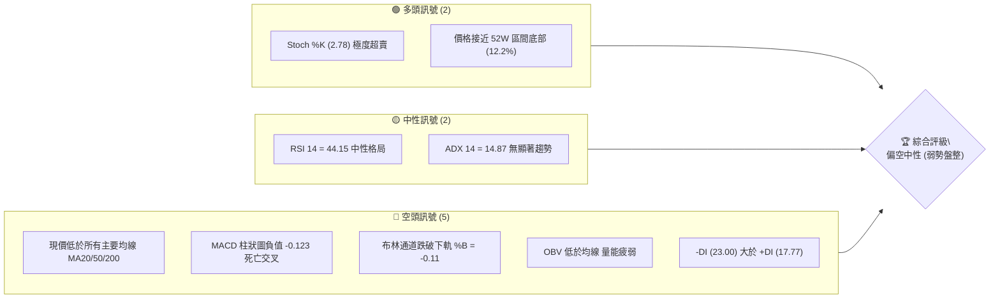

### 📊 核心指標速覽表

| 指標類別 | 指標名稱 | 當前數值 | 訊號 | 解讀 |
|:---|:---|:---|:---:|:---|
| **價格結構** | 當前價格 | $17.05 | 🔴 | 位於 52 週高低區間 12.2% 低檔區，價格受壓 |
| **短期均線** | MA20 | $18.25 | 🔴 | 價格低於 MA20 達 -6.57%，短期趨勢偏弱 |
| **中期均線** | MA50 | $17.83 | 🔴 | 價格低於 MA50 達 -4.37%，中期多頭受阻 |
| **長期均線** | MA200 | $20.11 | 🔴 | 價格低於牛熊分界線 MA200 達 -15.22% |
| **動能震盪** | RSI(14) | 44.15 | 🟡 | 位於 30-70 中性區間，無極端背離 |
| **動能趨勢** | MACD (12,26,9) | 0.115 / 0.238 | 🔴 | MACD 線跌破 Signal 線，Hist 為 -0.123 呈現空頭擴散 |
| **動能極值** | Stoch %K / %D | 2.78 / 14.13 | 🟢 | 進入極度超賣區間，短線具備技術性反彈動能 |
| **通道指標** | Bollinger Bands | $17.27 (下軌) | 🔴 | %B 為 -0.11，價格跌破下軌，呈現超賣承壓 |
| **趨勢強度** | ADX(14) | 14.87 | 🟡 | ADX < 25 處於弱趨勢/低動能盤整行情，-DI 佔優 |
| **量能指標** | OBV 與量比 | 41.53M (0.93x) | 🔴 | 最新量能低於20日均量，OBV < MA 量能配合度疲弱 |
| **波動風險** | ATR(14) | $0.87 (5.08%) | 🟡 | 日內波幅適中，提供明確止損緩衝依據 |

### 🏆 技術評分卡

```
╔══════════════════════════════════════════════════════════════════╗
║                   技術評分卡 — SOFI (2026-09-02)                ║
╠══════════════════════════════════════════════════════════════════╣
║ 趨勢強度 (Trend)     ██████░░░░░░░░░░░░░░  30/100  🔴 均線空頭    ║
║ 動能指標 (Momentum)  ████████░░░░░░░░░░░░  40/100  🟡 中性偏弱    ║
║ 支撐穩定度 (Support) ████████████░░░░░░░░  60/100  🟡 臨近S1支撐  ║
║ 成交量配合 (Volume)  ██████░░░░░░░░░░░░░░  30/100  🔴 量能萎縮    ║
║ 形態完整度 (Pattern) ████████░░░░░░░░░░░░  40/100  🟡 矩形整理    ║
║ 均線排列 (MA System) ████░░░░░░░░░░░░░░░░  20/100  🔴 全面承壓    ║
╠══════════════════════════════════════════════════════════════════╣
║ 綜合評分 (Composite) ████████░░░░░░░░░░░░  36.7/100 🔴 弱勢盤整   ║
╚══════════════════════════════════════════════════════════════════╝
```

---

## 2. 趨勢分析

### 🌐 多時框趨勢分析

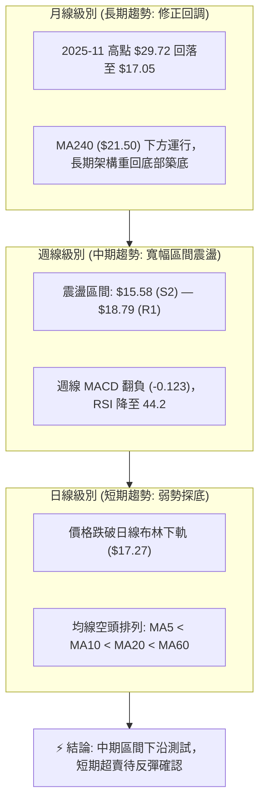

### 📈 長期趨勢 — 12個月走勢圖（Unicode）

```
SOFI 月線走勢圖（2025-10 至 2026-09）
價格軸 ($)
$30.00 ┤              ● 2025-11 ($29.72 歷史次高)
$28.00 ┤        ● 2025-10 ($29.68)
$26.00 ┤                    ● 2025-12 ($26.18)
$24.00 ┤
$22.00 ┤                          ● 2026-01 ($22.81)
$20.00 ┤                                      ● 2026-05 ($18.22)
$18.00 ┤                                ● 2026-02  ● 2026-06 ($17.93) ● 2026-08 ($17.88)
$17.00 ┤                                                                      ● 2026-09 ($17.05 現價)
$16.00 ┤                                      ● 2026-03 ($15.88)  ● 2026-07 ($16.31)
$15.00 ┤                                            ● 2026-04 ($16.10)
       └─────────────────────────────────────────────────────────────────────────────
         25-10  25-11  25-12  26-01  26-02  26-03  26-04  26-05  26-06  26-07  26-08  26-09
```

#### 走勢特徵分析表格

| 階段區間 | 時間跨度 | 起訖價格 | 區間漲跌幅 | 走勢特徵與量價結構解讀 |
|:---|:---|:---:|:---:|:---|
| **牛市頂部構築** | 2025-10 ~ 2025-11 | $29.68 → $29.72 | +0.13% | 雙重頂部特徵，於 $29.72 觸頂後動能背離衰竭 |
| **主跌修正波段** | 2025-11 ~ 2026-03 | $29.72 → $15.88 | -46.57% | 快速去槓桿回調，跌破 MA200，連續5個月收陰 |
| **底部區間盤整** | 2026-03 ~ 2026-08 | $15.88 → $17.88 | +12.59% | 在 $15.58~$18.79 建立橫盤箱體，波動率收窄 |
| **當前最新回撤** | 2026-08 ~ 2026-09 | $17.88 → $17.05 | -4.64% | 短線拉回跌破 MA20，測試箱體中下沿支撐 |

### 📊 中期趨勢（週線分析）

```
中期週線箱體震盪結構示意圖
$19.74 ┤ ────────────────────────────────── [R2: 波段強阻力]
$18.79 ┤ ══════════════════════════════════ [R1: 箱體上軌阻力]
$18.25 ┤ ┄┄┄┄┄┄┄┄┄┄┄┄┄┄┄┄┄┄┄┄┄┄┄┄┄┄┄┄┄┄ [MA20 / 箱體中軸]
$17.05 ┤ ◄──────── 現價 ($17.05 跌破中軸)
$16.67 ┤ ┈┈┈┈┈┈┈┈┈┈┈┈┈┈┈┈┈┈┈┈┈┈┈┈┈┈┈┈┈┈┈┈┈┈ [S1: 箱體支撐下沿]
$15.58 ┤ ══════════════════════════════════ [S2: 波段關鍵支撐]
$14.88 ┤ ────────────────────────────────── [52W 低點 / 斐波 100%]
```

中期週線在過去20週內呈現明顯的「箱體整理」特徵，震盪區間核心界定在 $15.58 至 $18.79 之間。近期週線動能（MACD Histogram 由正轉負至 -0.123）顯示多頭進攻未能有效突破 R1 ($18.79)，導致價格重回箱體下半區運行。

### ⚡ 趨勢強度評估（ADX 解讀）

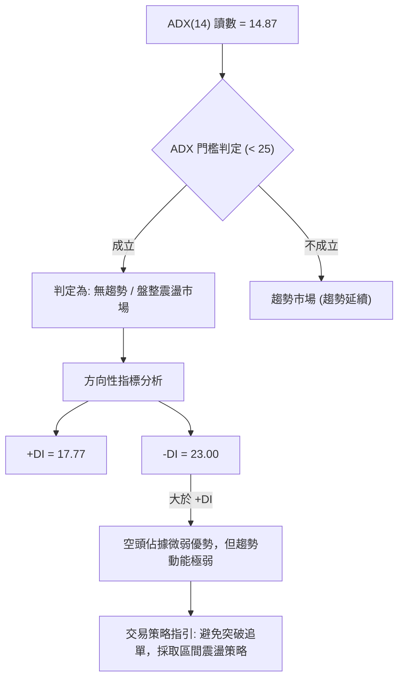

#### ADX 趨勢強度對照表

| 指標變數 | 當前數值 | 參考閾值 | 狀態評估 | 操作指引意義 |
|:---|:---:|:---:|:---:|:---|
| **ADX(14)** | **14.87** | < 20 (極弱) / 25 (分界) | 極弱勢無方向性 | 趨勢跟隨指標失真，市場處於無序整理 |
| **+DI (14)** | **17.77** | — | 多頭力量微弱 | 多方主動進攻意願低 |
| **-DI (14)** | **23.00** | — | 空頭力量偏強 | 空方佔據主導，但因 ADX 過低未形成崩跌波 |

---

## 3. 圖表形態分析

### 🔍 形態識別系統

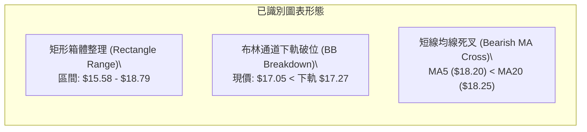

#### 形態識別與信心度評估表

| 形態名稱 | 信心度 | 判斷依據（引用數據） | 完成度 | 目標價（附嚴格計算式） |
|:---|:---:|:---|:---:|:---|
| **水平箱體整理** | **75%** | 價格在 S2 ($15.58) 與 R1 ($18.79) 區間震盪近6個月，多次觸及邊界反彈 | 70% | 箱體震盪無單向目標，以邊界 S1 ($16.67) 及 R1 ($18.79) 為區間目標 |
| **短線布林超跌破位** | **65%** | 最新收盤價 $17.05 跌破布林下軌 $17.27，%B 達 -0.11 | 90% | 均值回歸中軌目標 = MA20 ($18.25) |
| **大型頭肩頂 (歷史殘留)** | **30%** | 2025年高點 $29.72 後頸線已於跌破 $21.70 時宣洩完畢 | 100% | *已完成歷史對稱跌幅，當前進入指標型解讀* |

### 🕯️ 重要K線形態分析

| 期間/月份 | 收盤價 | K線形態特徵 | 技術解讀 | 訊號強度 |
|:---|:---:|:---|:---|:---:|
| **2026-05** | $18.22 | 長陽反彈線 (月漲幅 +13.1%) | 觸及低檔 $15.61 後強勁反抽，確認底部支撐 | 🟢 強烈看多 |
| **2026-06** | $17.93 | 高檔十字星 (高位震盪) | 在 R1 ($18.79) 前遇阻回落，多空出現分歧 | 🟡 中性猶豫 |
| **2026-07** | $16.31 | 中陰線回調 (下探測試) | 空方回踩箱體中下沿，未跌破 S2 ($15.58) | 🔴 中度看空 |
| **2026-08** | $17.88 | 帶長上影陽線 | 向上試探 R1 ($18.79) 未果，留上影線顯示拋壓沉重 | 🟡 衝高受阻 |
| **2026-09 (即時)** | $17.05 | 短黑實體向下下破 | 跌破日線布林下軌 $17.27，尋求 S1 ($16.67) 支撐 | 🔴 短線偏弱 |

### 📉 ASCII 走勢形態示意圖

```
SOFI 近期箱體與布林破位微觀結構
價格 ($)
$18.79 ──┬─────────────────────── 箱體頂部阻力 R1 (2026-08 衝高 $18.91 遇阻)
         │       ▲
         │      ╱ ╲
$18.25 ──┼─────╱───╲───── MA20 (布林中軌 $18.25) ─────
         │    ╱     ╲
$17.27 ──┼───╱───────╲─── 布林下軌 ($17.27) ────────
         │  ╱         ▼
$17.05 ──┼─● ◄── 現價 ($17.05, 跌破布林下軌)
         │
$16.67 ──┴─────────────────────── 近期關鍵波段支撐 S1 (待測試)
```

### 🎯 形態目標價計算

依據幾何形態與技術指標推算：
1. **箱體均值回歸上行目標**：
   - 觸發條件：在 S1 ($16.67) 獲得支撐並重新站上布林下軌 $17.27。
   - 計算式：反彈第一目標 = 布林中軌 MA20 = **$18.25**；第二目標 = 箱體上軌 R1 = **$18.79**。
2. **箱體下破風險延伸目標**：
   - 觸發條件：跌破波段低點支撐 S1 ($16.67)。
   - 計算式：向下回測支撐 S2 = **$15.58**；極端下破目標 = 52W 低點 S3 = **$14.91**。

---

## 4. 支撐與阻力

### 🗺️ 關鍵價位分布圖（Unicode）

```
╔══════════════════════════════════════════════════════════════════╗
║                   SOFI 關鍵價位分佈結構圖                        ║
╠══════════════════════════════════════════════════════════════════╣
║ $20.13 ║██████████████████████████████║ 強阻力 R3 (MA200 匯聚位) ║
║ $19.74 ║██████████████████████        ║ 阻力 R2 (波段高點聚類)   ║
║ $18.79 ║██████████████████████████    ║ 關鍵阻力 R1 (斐波 78.6%)║
║ $18.25 ║┈┈┈┈┈┈┈┈┈┈┈┈┈┈┈┈┈┈┈┈┈┈┈┈┈┈    ║ 動態阻力 (MA20 / BB中軌) ║
╠════════╬══════════════════════════════╬══════════════════════════╣
║ $17.05 ╠══════════════════════════════╣ ◄ 現價 ($17.05)         ║
╠════════╬══════════════════════════════╬══════════════════════════╣
║ $16.67 ║▓▓▓▓▓▓▓▓▓▓▓▓▓▓▓▓▓▓▓▓▓▓        ║ 近期支撐 S1 (波段低點)   ║
║ $15.58 ║██████████████████████████    ║ 強支撐 S2 (箱體底線)     ║
║ $14.91 ║██████████████████████████████║ 極限支撐 S3 (52W 低點)   ║
╚══════════════════════════════════════════════════════════════════╝
```

### 🚧 阻力位分析表

| 阻力級別 | 價位 | 距現價幅幅 | 形成原因與籌碼解讀 | 突破難度 | 重要性 |
|:---|:---:|:---:|:---|:---:|:---:|
| **動態阻力** | **$18.25** | +7.04% | 20日均線 (MA20) 與布林中軌重合，短線空頭防線 | 中等 | 🟡 中 |
| **R1** | **$18.79** | +10.18% | 近一年波段高點聚類，且與 52W 斐波那契 78.6% 回調位 ($18.70) 重合 | 較高 | 🟢 高 |
| **R2** | **$19.74** | +15.78% | 近一年次級反彈高點聚類，進入籌碼密集套牢區 | 高 | 🟡 中 |
| **R3** | **$20.13** | +18.06% | 年線 MA200 ($20.11) 匯聚處，多熊分水嶺關鍵骨幹阻力 | 極高 | 🔴 極高 |

### 🛡️ 支撐位分析表

| 支撐級別 | 價位 | 距現價幅幅 | 形成原因與籌碼解讀 | 守住機率 | 重要性 |
|:---|:---:|:---:|:---|:---:|:---:|
| **S1** | **$16.67** | -2.25% | 近一年波段低點聚類，日線級別短線第一防守點 | 60% | 🟢 高 |
| **S2** | **$15.58** | -8.65% | 2026年5月週線密集低點 ($15.61-$15.75) 構築之箱體底 | 75% | 🔴 極高 |
| **S3** | **$14.91** | -12.55% | 近一年波段最低點聚類，緊鄰 52W 最低點 $14.88 (斐波 100%) | 85% | 🔴 極限 |

### 📐 斐波那契回調位分析

基準區間：52週最高點 **$32.73** (0.0%) → 52週最低點 **$14.88** (100.0%)，總落差 $17.85。

```
斐波那契回調階梯 (52W 區間)
$32.73 ├────────────────────────────────────────── 0.0%  (52W High)
$28.52 ├────────────────────────────────────────── 23.6%
$25.91 ├────────────────────────────────────────── 38.2%
$23.80 ├────────────────────────────────────────── 50.0%
$21.70 ├────────────────────────────────────────── 61.8% (牛熊分割黃金位)
$18.70 ├────────────────────────────────────────── 78.6% (阻力 R1 $18.79 匯聚)
$17.05 ├┄┄┄┄┄┄┄┄┄┄┄┄┄┄┄┄┄┄┄┄┄┄┄┄┄┄┄┄┄┄┄┄┄┄┄┄┄┄┄ [現價落點: 78.6% ~ 100% 深度回調區]
$14.88 ├────────────────────────────────────────── 100.0% (52W Low / 支撐 S3)
```

**深度解讀**：
- 現價 **$17.05** 處於斐波那契 78.6% ($18.70) 與 100.0% ($14.88) 之間的極深修正區間。
- 斐波那契 78.6% 回調位 ($18.70) 與阻力位 R1 ($18.79) 高度重疊，構成 SOFI 短中期多頭必須奪回的「共振阻力牆」。現價未突破該位置前，所有上漲均屬弱勢反彈。

---

## 5. 技術指標深度解讀

### 🎛️ 指標訊號總覽

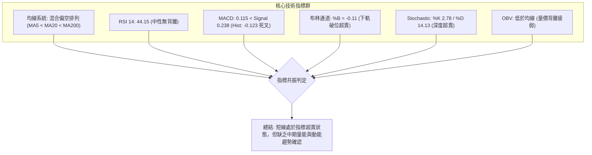

### 📈 移動平均線排列分析

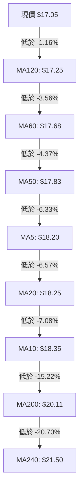

#### 均線偏離度與狀態表

| 均線名稱 | 當前數值 | 現價偏離幅度 | 走勢特徵 | 訊號意涵 |
|:---|:---:|:---:|:---|:---:|
| **MA5** | $18.20 | -6.33% | 短線快速下彎 | 🔴 短期壓迫 |
| **MA10** | $18.35 | -7.08% | 剛下穿 MA20 | 🔴 短期死叉 |
| **MA20** | $18.25 | -6.57% | 走平轉向下彎 | 🔴 中短多空線失守 |
| **MA50** | $17.83 | -4.37% | 走平 | 🟡 中期支撐轉阻力 |
| **MA60** | $17.68 | -3.56% | 走平 | 🟡 季線反壓 |
| **MA120** | $17.25 | -1.16% | 緩跌 | 🔴 半年線阻力 |
| **MA200** | $20.11 | -15.22% | 走跌 | 🔴 長期熊市壓制 |
| **MA240** | $21.50 | -20.70% | 持續走低 | 🔴 年線重壓 |

**排列總結**：均線呈現「短中期混亂、長期全面偏空」的弱勢格局。現價處於所有均線下方，上方累積層層均線套牢賣壓。

### 📉 RSI(14) 分析

- **RSI 當前讀數**：`44.15`
- **量化進度條**：`[████████░░░░░░░░░░░░] 44.15%`

```
RSI(14) 區間定位圖
[0] ────────── [30 超賣] ──── [44.15 現值] ────── [70 超買] ────────── [100]
                 │              ▲                    │
                 └──────── 中性偏弱整理區間 ─────────┘
```

- **背離分析判斷**：
  - **日線/週線背離檢驗**：日線價格由 2026-08-23 收盤 $18.91 回落至 $17.05，RSI 由 57.9 降至 44.2，指標與價格同步下行。
  - **結論**：目前 **無明顯頂背離或底背離**。RSI 處於 44.15 的中性偏弱區，尚未進入 < 30 的極端超賣區，顯示空頭拋壓仍在正常釋放範圍內。

### 📊 MACD(12,26,9) 訊號解讀

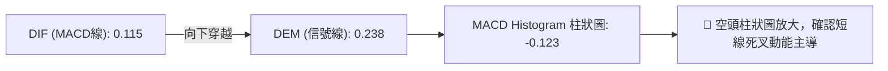

- **MACD 數值**：DIF = `0.115`，DEA = `0.238`，HIST = `-0.123`。
- **動能解析**：MACD 柱狀圖自 2026-08-23 的 +0.063 快速轉負至當前的 -0.123，形成典型的零軸上方高位死叉回落。週線級別 MACD 亦同步轉負，顯示中期多頭反彈動能已宣告中斷。

### 📦 布林通道分析

```
SOFI 布林通道結構 (20日, 2.0σ)
$19.23 ┬──────────────────────────────────────── 布林上軌 (BB Upper)
       │
$18.25 ┼──────────────────────────────────────── 布林中軌 (MA20)
       │
$17.27 ┴──────────────────────────────────────── 布林下軌 (BB Lower)
  ▼
$17.05 ◄── 現價 ($17.05，%B = -0.11，脫離下軌)
```

- **通道數據**：上軌 **$19.23** ｜ 中軌 **$18.25** ｜ 下軌 **$17.27** ｜ 帶寬：$1.96 (11.5%)。
- **%B 指標分析**：當前 %B 數值為 **-0.11**（數值 < 0），代表價格已實體跌破布林下軌。在統計學上屬於 2 個標準差之外的極端偏離。
- **技術含義**：在盤整市（ADX=14.87）中，%B < 0 通常引發兩種演變：
  1. 快速均值回歸：在 S1 ($16.67) 獲得支撐後拉回中軌 $18.25。
  2. 通道開口向下：若空頭持續放量，將導致布林下軌向下擴軌走跌。

### 💹 成交量分析（量價配合度）

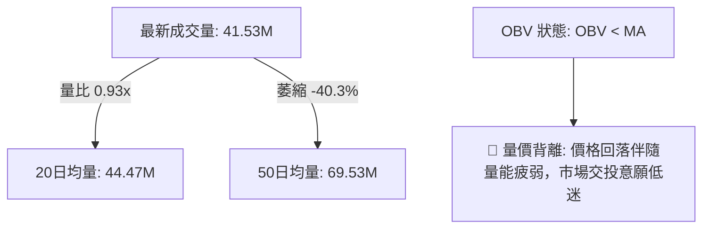

- **量能評估**：
  - 當前單日成交量 41.53M，低於 20日均量 (44.47M)，更遠低於 50日均量 (69.53M)。
  - 最新週成交量 78.13M，相較 2026-08 初的 483.42M 呈現斷崖式萎縮。
- **OBV 能量潮解讀**：OBV 持續低於其移動平均線，且均量線斜率向下。這表明機構資金在近期的反彈中並未大舉建倉，量能萎縮反映出市場處於「存量資金博弈的無量陰跌」狀態。

---

## 6. 動能與波動率

### ⚡ 動能評估四象限

| 象限分類 | 動能強度 (Momentum) | 波動率狀態 (Volatility) | SOFI 當前落點 | 狀態診斷與策略指引 |
|:---|:---:|:---:|:---:|:---|
| **第一象限 (Q1)** | 強 (Bullish) | 低 (Low Vol) | ❌ | 穩定上行牛市（非當前狀態） |
| **第二象限 (Q2)** | **弱 (Bearish/Neutral)** | **低 (Low/Compressing)** | **✔️ 當前定位** | **弱勢低波動整理：成交量萎縮，ADX < 25，宜區間低吸高拋** |
| **第三象限 (Q3)** | 強 (High Momentum) | 高 (High Vol) | ❌ | 突破爆發行情（非當前狀態） |
| **第四象限 (Q4)** | 弱 (Bearish) | 高 (High Vol) | ❌ | 恐慌崩跌主跌段（非當前狀態） |

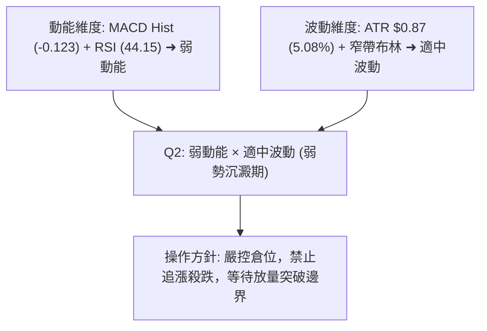

### 📊 ATR 波動率分析

- **ATR(14) 數值**：**$0.87** (佔當前股價 **5.08%**)
- **波動特性**：每日平均波動幅度約 $0.87，說明 SOFI 具備高彈性 Beta 特質，但日內波動處於近期常態分佈範圍。
- **動態止損與風控設置依據**：
  - **短線交易止損距離**：1.5 × ATR = $0.87 × 1.5 = **$1.31**
  - **波段交易止損距離**：2.0 × ATR = $0.87 × 2.0 = **$1.74**

### 📐 Beta 與市場相關性

- **Beta 係數**：**2.204**（極高彈性，屬於大盤波動放大的先鋒品種）。
- **Short Float / 空頭佔比**：**13.5%**（空頭部位偏高，Short Ratio 2.38）。
- **市場意涵**：
  - 高 Beta (2.204) 代表當標普500指數波動 1% 時，SOFI 理論波動達 2.20%。在大盤走弱時將放大下跌風險，但在大盤回暖時亦具備顯著的空頭回補（Short Squeeze）爆發力。

---

## 7. 多時框架總結

### 📋 時框架評分表

| 時框架 | 趨勢方向 | 動能指標狀態 | 均線排列特徵 | 關鍵圖表形態 | 綜合評分 | 戰術建議 |
|:---|:---:|:---|:---|:---|:---:|:---|
| **月線 (長期)** | 🔴 偏空回調 | RSI 44，自頂部修正 | 價格跌破 MA240 ($21.50) | 大型高檔回落築底 | **35/100** | 逢高減碼，長期觀望 |
| **週線 (中期)** | 🟡 區間盤整 | MACD 柱轉負 -0.123 | 受制於 MA50 ($17.83) | $15.58-$18.79 箱體 | **45/100** | 箱體下沿低吸，上沿止盈 |
| **日線 (短期)** | 🔴 弱勢探底 | Stoch 超賣，RSI 44.15 | 跌破 MA5/10/20/60 | 跌破布林下軌 %B -0.11 | **30/100** | 等待止跌訊號，不盲目接刀 |

### 🔲 綜合訊號矩陣

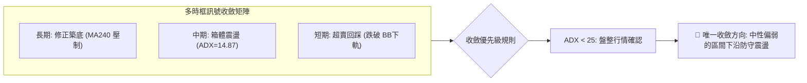

### ⚖️ 多時框收斂結論

依據多時框收斂規則（規則 14）：
1. **行情性質判定**：當前 ADX(14) 讀數為 **14.87 (< 25)**，明確定義當前市場為 **典型盤整行情** 而非趨勢行情。
2. **主導時框與交易邏輯**：在盤整架構下，趨勢指標（如 MACD 柱狀圖死叉）常伴隨假突破與洗盤，交易應以 **週線箱體與日線布林通道上下軌** 作為核心決策邊界。
3. **最終收斂結論**：**中性偏弱觀望，聚焦箱體下沿 S1 ($16.67) / S2 ($15.58) 支撐有效性**。日線雖跌破下軌進入極度超賣，但在未出現明確止跌放量 K 線前，禁止單邊重倉做多。

---

## 8. 交易策略建議

### 🗺️ 策略決策流程圖

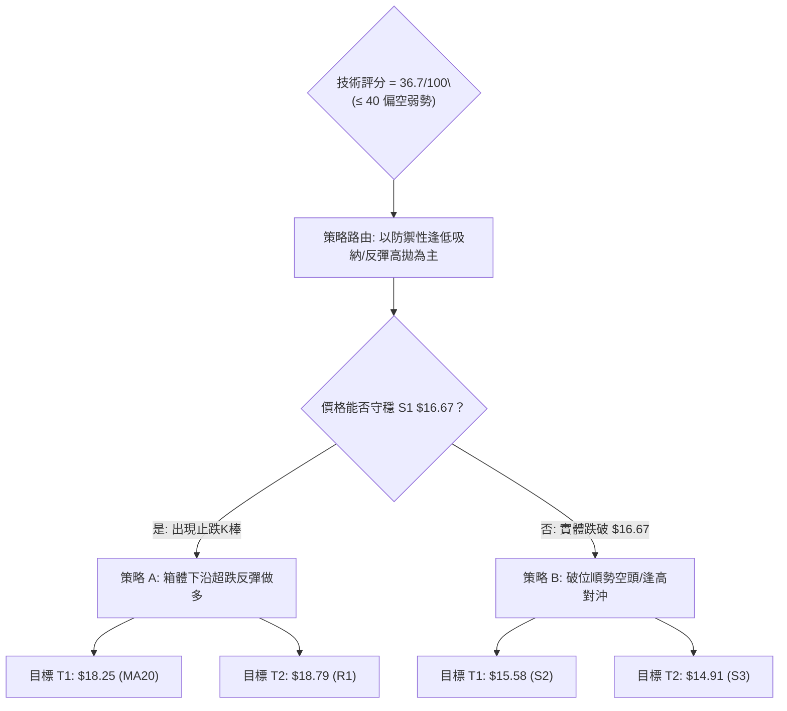

### 🧭 策略路由

> **當前主策略方向**：**偏空弱勢下的區間下沿防禦型操作（綜合評分 36.7/100）**  
> 因綜合評分位於 ≤ 40 偏空區間，主基調為「防範進一步回調風險」，嚴格限制做多倉位，並以波段支撐位作為唯一多頭試倉依據。

---

### 🎯 價格情境階梯（Price Scenarios）

| 觸發條件 | 下一目標 | 後續延伸 | 情境含義與操作指引 |
|:---|:---:|:---:|:---|
| **突破 R1 $18.79** | R2 $19.74 | R3 $20.13 | 短線強勢反轉，向上挑戰年線 MA200，多頭加碼 |
| **突破 MA20 $18.25** | R1 $18.79 | R2 $19.74 | 均值回歸完成，多頭收復短線主動權 |
| **現價 $17.05 震盪** | S1 $16.67 | MA20 $18.25 | 日線布林下軌超賣修復，維持窄幅拉鋸 |
| **跌破 S1 $16.67** | S2 $15.58 | S3 $14.91 | 箱體下沿失守，回踩 2026年5月低點密集區 |
| **跌破 S2 $15.58** | S3 $14.91 | $14.88 (52W Low)| 中期箱體破位，考驗 52週極限支撐 |

---

### 📊 情境機率分佈

| 演變情境 | 機率 | 主要技術依據 |
|:---|:---:|:---|
| **情境一：區間震盪築底（S1~MA20 區間修復）** | **55%** | ADX 僅 14.87 無強趨勢，Stoch 超賣 (%K=2.78)，S1 ($16.67) 具備波段共振支撐 |
| **情境二：回落再探底（跌破 S1 測試 S2）** | **30%** | MACD 柱狀圖為負 (-0.123)，OBV 疲弱無量，均線全線壓制 |
| **情境三：強勢反轉上行（直接突破 R1）** | **15%** | 缺乏機構資金放量確認，上方 MA20/50 重重反壓 |

---

### 🟢 主策略詳情

#### 策略 A：區間下沿超賣反彈多單（右側試倉）

- **進場條件**：價格回踩 S1 (**$16.67**) 附近不破，且 15分/60分 K線出現底背離或實體陽線收復布林下軌 **$17.27**。
- **進場價格**：**$16.80** (確認支撐後進場)
- **目標價 T1**：**$18.25** (布林中軌 / MA20)
- **目標價 T2**：**$18.79** (關鍵阻力位 R1 / 斐波 78.6%)
- **止損價格**：**$16.20** (跌破 S1 支撐緩衝點，虧損 -$0.60 / -3.57%)
- **風險報酬比 (R/R)**：
  - 至 T1：($18.25 - $16.80) / ($16.80 - $16.20) = $1.45 / $0.60 = **2.42 : 1**
  - 至 T2：($18.79 - $16.80) / ($16.80 - $16.20) = $1.99 / $0.60 = **3.32 : 1**
- **成功機率**：**55%**
- **建議倉位**：**10% ~ 15%** (輕倉防禦)

---

#### 策略 B：反彈遇阻順勢做空 / 破位對沖單

- **進場條件**：價格反彈至 MA20 (**$18.25**) 或 R1 (**$18.79**) 遇阻收長上影線，或日線實體跌破 **$16.67**。
- **進場價格**：**$18.25** (反彈遇阻處)
- **目標價 T1**：**$17.05** (現價水平)
- **目標價 T2**：**$15.58** (強支撐 S2)
- **止損價格**：**$18.90** (突破 R1 阻力位上方，虧損 -$0.65 / -3.56%)
- **風險報酬比 (R/R)**：
  - 至 T2：($18.25 - $15.58) / ($18.90 - $18.25) = $2.67 / $0.65 = **4.11 : 1**
- **成功機率**：**60%**
- **建議倉位**：**15%**

---

### 🔴 反向風險觸發點（對沖與風控提示）

1. **多頭全面止損點**：若日線收盤價跌破 **$16.67 (S1)**，代表短期超跌修復失敗，下行空間打開至 **$15.58 (S2)**，所有短多部位必須無條件離場。
2. **空頭被動止損點**：若價格放量突破 **$18.79 (R1)** 並站穩 3 個交易日以上，代表箱體震盪向上突破，空頭部位必須立即平倉對沖。

### ⭐ 整體訊號強度評星

```
做多訊號強度：★★☆☆☆  (2/5星 - 僅依託超賣與箱體底)
做空訊號強度：★★★☆☆  (3/5星 - 均線壓制與動能偏空)
整體可信度：  ★★★☆☆  (3/5星 - ADX過低，洗盤頻繁)
```

---

## 9. 風險提示與監控

### ✅ 關鍵監控指標 Checklist

```
╔══════════════════════════════════════════════════════════════════╗
║               SOFI 交易關鍵監控指標 CHECKLIST                    ║
╠══════════════════════════════════════════════════════════════════╣
║ [ ] 價位監控：現價 $17.05 能否在 2 日內重回布林下軌 $17.27 之上  ║
║ [ ] 支撐防守：S1 ($16.67) 盤中跌破幅度是否超過 1.5%               ║
║ [ ] 阻力壓制：反彈至 MA20 ($18.25) 時的成交量是否放大至 50M 以上 ║
║ [ ] 動能指標：Stoch %K 是否自 2.78 向上黃金交叉 %D (14.13)       ║
║ [ ] 動能趨勢：MACD Histogram 是否出現縮頭回升 (大於 -0.123)     ║
║ [ ] 趨勢強度：ADX(14) 是否向上突破 25，帶動單邊行情             ║
║ [ ] 量能配合：單日成交量是否低於 35M (極度縮量可能醞釀變盤)     ║
║ [ ] 籌碼異動：空頭未平倉比例 13.5% 是否出現快速回補跡象          ║
╚══════════════════════════════════════════════════════════════════╝
```

### ⚠️ 風險場景分析

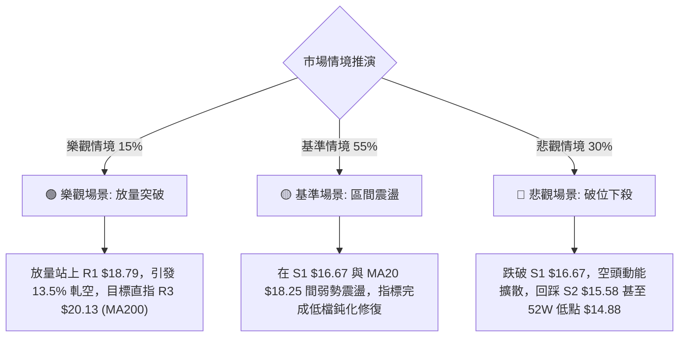

### 🛡️ 風險管理重要提醒

1. **高 Beta (2.204) 曝險管理**：SOFI 的波動幅度超過大盤兩倍。在美股大盤波動加劇時，必須主動將名義倉位壓縮至傳統持股的 **50% 比例**，避免單一標的過度回撤。
2. **無趨勢環境下的止損紀律**：當 ADX = 14.87 時，切忌追逐假突破。設定精確的數值止損（如策略 A 的 **$16.20**），一旦觸發立即執行，切勿因估值或基本面理由凹單。
3. **高空頭部位雙刃劍**：空頭比例達 **13.5%**，當出現突發性利多時極易發生軋空。空單操作必須將止損點設於 **$18.90 (R1 上方)**，杜絕無限曝險。

---

## 📋 報告總結

```
╔══════════════════════════════════════════════════════════════════╗
║                   SOFI 技術分析報告總結                          ║
╠══════════════════════════════════════════════════════════════════╣
║ 報告日期：2026-09-02                                             ║
║ 當前價格：$17.05 (52W 區間 12.2% 低檔)                          ║
║ 分析評級：🔴 弱勢盤整 / 偏空中性 (評分: 36.7/100)               ║
║                                                                  ║
║ 關鍵結論：                                                       ║
║ ├─ 長期趨勢：🔴 偏空回調 (受制於年線 MA240 $21.50)               ║
║ ├─ 中期趨勢：🟡 箱體整理 ($15.58 - $18.79 寬幅震盪)             ║
║ ├─ 短期趨勢：🔴 超跌探底 (跌破布林下軌 $17.27，尋求 S1 支撐)     ║
║ ├─ 關鍵支撐：S1: $16.67 ｜ S2: $15.58 ｜ S3: $14.91 (52W Low)    ║
║ ├─ 關鍵阻力：MA20: $18.25 ｜ R1: $18.79 ｜ R2: $19.74 ｜ R3: $20.13║
║ └─ 共識目標：分析師平均目標價 $20.02 (隱含 +17.4% 反彈空間)     ║
║                                                                  ║
║ 最優策略組合：                                                   ║
║ 1. 🥇 最佳機會：在 S1 ($16.67) 不破前提下，短多博弈反彈至 $18.25 ║
║ 2. 🥈 次選機會：反彈至阻力位 R1 ($18.79) 遇阻時建立逢高空單     ║
║ 3. 🥉 保守選擇：空倉觀望，等待日線實體站穩 MA20 ($18.25) 後進場  ║
╚══════════════════════════════════════════════════════════════════╝
```

---

> ⚠️ **免責聲明**：本報告為技術分析研究，所有數據及估算均基於歷史價格與客觀技術指標計算。本報告**僅供研究與學術參考**，**不構成任何投資建議或交易邀約**。投資涉及風險，證券價格可升可跌，入市需獨立審慎評估風險。

---

*報告生成時間：2026-09-02 ｜ 數據來源：Yahoo Finance ｜ 分析框架：多時框技術分析模型*