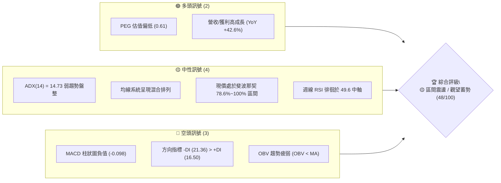
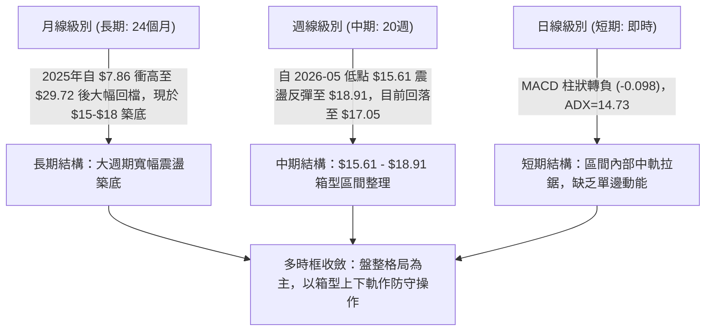
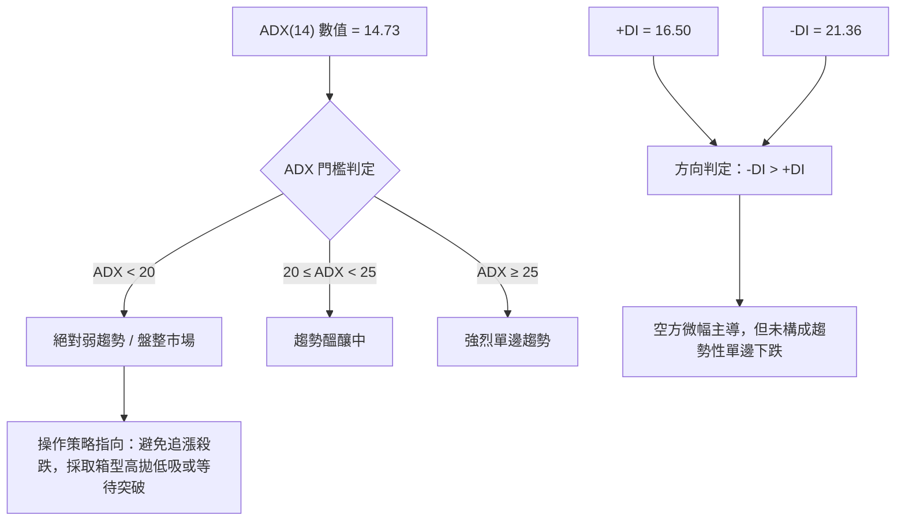
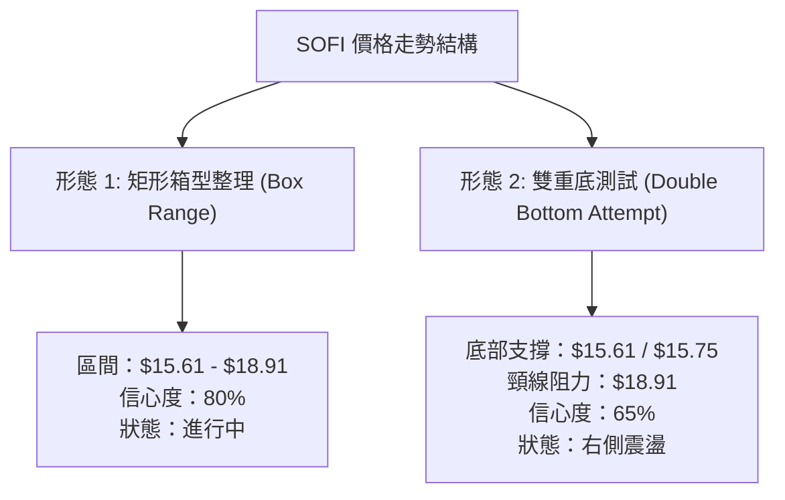
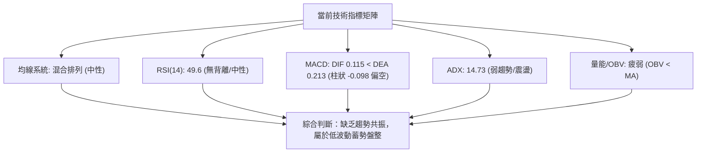
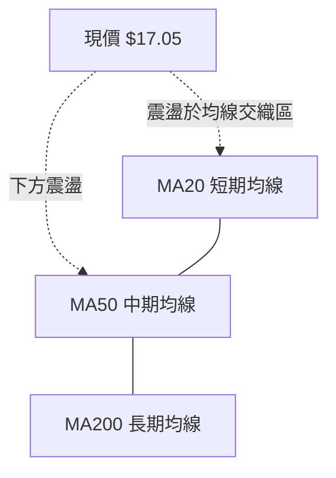
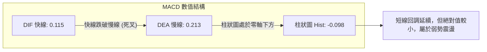
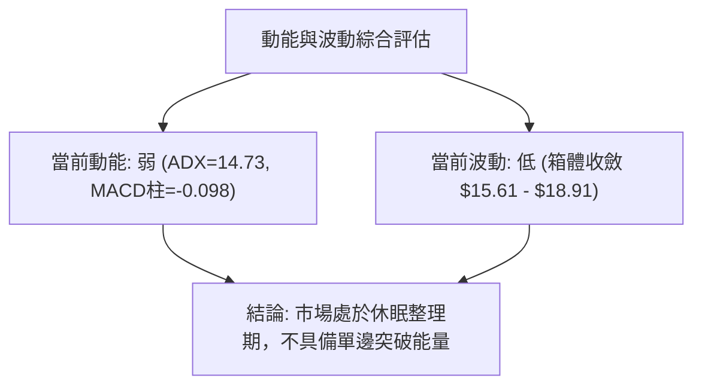
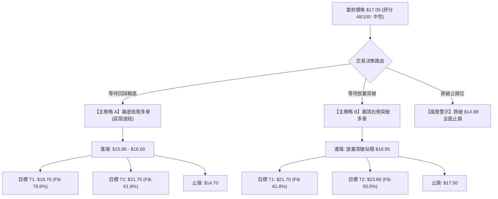
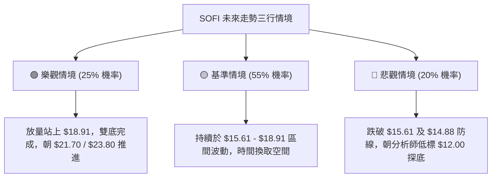

# SOFI 技術分析報告

> **報告日期**：2026-09-03 ｜ **語言**：繁體中文 ｜ **數據來源**：Yahoo Finance ｜ **當前價格**：$17.05

---

## 目錄

| 章節 | 內容 |
|------|------|
| [1. 技術面概覽](#1-技術面概覽) | 訊號儀表板、核心指標、評分卡 |
| [2. 趨勢分析](#2-趨勢分析) | 多時框趨勢、長中短期走勢 |
| [3. 圖表形態分析](#3-圖表形態分析) | 形態識別、K線組合、目標價 |
| [4. 支撐與阻力](#4-支撐與阻力) | 關鍵價位、斐波那契回調 |
| [5. 技術指標深度解讀](#5-技術指標深度解讀) | MA/RSI/MACD/布林/成交量 |
| [6. 動能與波動率](#6-動能與波動率) | 動能評估、ATR、Beta |
| [7. 多時框架總結](#7-多時框架總結) | 時框架評分矩陣 |
| [8. 交易策略建議](#8-交易策略建議) | 多空策略、風險報酬比 |
| [9. 風險提示與監控](#9-風險提示與監控) | 監控指標、風險場景 |

---

## 1. 技術面概覽

### 🎯 技術訊號儀表板



### 📊 核心指標速覽表

| 指標類別 | 指標名稱 | 當前數值 | 訊號 | 解讀 |
|----------|----------|----------|------|------|
| **價格** | 當前收盤價 | $17.05 | 🟡 | 位於52週高低點 ($14.88 - $32.73) 之底部回升震盪區 |
| **趨勢** | ADX (14) | 14.73 | 🟡 | 數值 < 25，市場處於無明確單邊方向的箱型盤整期 |
| **動能** | +DI / -DI | 16.50 / 21.36 | 🔴 | 空方動能微幅佔優，但整體攻擊力道偏弱 |
| **動能** | MACD (12,26,9) | 0.115 / 0.213 | 🔴 | DIF 低於 DEA，MACD 柱狀圖為 -0.098，短線動能偏弱 |
| **動能** | RSI (14) | 49.6 (週線) | 🟡 | 位於中性 50 分界水平，未見超買或超賣 |
| **量能** | 20日均量 / 成交量 | 43.67M / 40.46M | 🟡 | 當日量比 0.93x，量能稍有萎縮，OBV 處於均線下方 |
| **估值/波動**| Beta 係數 | 2.204 | 🔴 | 高 Beta 特性，對大盤與科技金融板塊波動高度敏感 |

### 🏆 技術評分卡

```
╔══════════════════════════════════════════════════════════════╗
║              技術評分卡 — SOFI (2026-09-03)                   ║
╠══════════════════════════════════════════════════════════════╣
║ 趨勢強度 (Trend Strength)  ██████░░░░░░░░░░░░░░  32/100 🔴 弱勢 ║
║ 動能指標 (Momentum)        ████████░░░░░░░░░░░░  42/100 🟡 中性 ║
║ 支撐穩定度 (Support Level) ████████████░░░░░░░░  62/100 🟢 穩固 ║
║ 成交量配合 (Volume Profile)████████░░░░░░░░░░░░  40/100 🟡 偏弱 ║
║ 形態完整度 (Patterns)      ████████████░░░░░░░░  60/100 🟢 箱型 ║
║ 均線排列 (Moving Averages) █████████░░░░░░░░░░░  45/100 🟡 整理 ║
╠══════════════════════════════════════════════════════════════╣
║ 綜合評分 (Overall Score)   █████████░░░░░░░░░░░  48/100 🟡 中性 ║
╚══════════════════════════════════════════════════════════════╝
```

---

## 2. 趨勢分析

### 🌐 多時框趨勢分析



### 📈 長期趨勢 — 12個月走勢圖（Unicode）

```
SOFI 月線走勢圖（2025-10 至 2026-09）
價格軸 ($)
$30.00 ┤        ●(29.68) ●(29.72 波段高點)
$27.00 ┤                      ●(26.18)
$24.00 ┤                            ●(22.81)
$21.00 ┤                                  
$18.00 ┤                                        ●(17.76)          ●(18.22)    ●(17.88)
$15.00 ┤                                              ●(15.88) ●(16.10)     ●(16.31)    ●(17.05 現價)
$12.00 ┤
       └─────────────────────────────────────────────────────────────────────────────
         25-10   25-11   25-12   26-01   26-02   26-03    26-04    26-05    26-06    26-07    26-08    26-09
```

#### 走勢特徵分析表格

| 階段週期 | 時間區間 | 起始/結束價 | 漲跌幅 | 走勢特徵與量價表現 |
|----------|----------|-------------|--------|--------------------|
| **高檔回落段** | 2025-11 ~ 2026-03 | $29.72 → $15.88 | -46.57% | 自 52 週高點 $32.73 區域大幅修正，獲利盤出逃，成交量放大。 |
| **底部探底段** | 2026-04 ~ 2026-05 | $16.10 → $15.61 | -3.04% | 52週低點 $14.88 上方獲得強力支撐，連續數週於 $15.60 附近築底。 |
| **箱型震盪段** | 2026-06 ~ 2026-09 | $16.03 → $17.05 | +6.36% | 於 $15.61 至 $18.91 區間來回洗盤，量能逐步收縮，進入無趨勢整理。 |

### 📊 中期趨勢（週線分析）

```
週線區間阻力與支撐架構示意圖：
$18.91 ──────────────────────────────── (2026-08-23 波段反彈高點 / 箱頂阻力)
       │  ▲ 8月下旬衝高受阻回落
$17.05 ──┼───────────────────────────── (當前收盤位置 / 箱體中軸)
       │  ▼ 5月中旬下探測試支撐
$15.61 ──────────────────────────────── (2026-05-17 波段低點 / 箱底關鍵支撐)
$14.88 ════════════════════════════════ (52週最低價 / 絕對多頭防線)
```

### ⚡ 趨勢強度評估（ADX 解讀）



#### ADX 趨勢強度對照表

| 指標項 | 實際數值 | 參考標準 | 當前狀態判定 |
|--------|----------|----------|--------------|
| **ADX (14)** | 14.73 | < 20 (極弱趨勢), 20-25 (盤整), > 25 (強趨勢) | 🔴 極弱趨勢 / 典型無方向整理 |
| **+DI (14)** | 16.50 | 多頭進攻力道 | 🟡 偏弱（低於 20 基準） |
| **-DI (14)** | 21.36 | 空頭壓制力道 | 🟡 溫和（略高於 +DI，未現恐慌拋售） |
| **差值 (-DI - +DI)** | +4.86 | > 10 為空頭趨勢確立 | 🟡 震盪偏空，缺乏單邊破位動能 |

---

## 3. 圖表形態分析

### 🔍 形態識別系統



#### 形態識別與信心度評估表

| 形態名稱 | 信心度 | 判斷依據（引用實際數據） | 完成度 | 目標價（附計算式） |
|----------|--------|--------------------------|--------|--------------------|
| **矩形箱型整理** | **80%** | 價格於 2026-05 至 2026-09 間，波動收斂於波段低點 $15.61 與高點 $18.91 之間 | 75% | 向上突破目標：$18.91 + ($18.91 - $15.61) = **$22.21**<br/>向下跌破目標：$15.61 - ($18.91 - $15.61) = **$12.31** |
| **雙重底形態** | **65%** | 兩次下探低點：2026-05-10 ($15.75) 與 2026-05-17 ($15.61)，均未破 52W 低點 $14.88 | 60% | 形態高度 = $18.91 - $15.61 = $3.30<br/>突破頸線目標價 = $18.91 + $3.30 = **$22.21** |

### 🕯️ 重要K線形態分析

| 週期/日期 | 收盤價 | K線形態特徵 | 技術解讀 | 訊號 |
|-----------|--------|-------------|----------|------|
| **2026-05-17 週** | $15.61 | 探底長下影十字星 | 測試 52W 低點 $14.88 前提早獲買盤承接，確認底部支撐 | 🟢 止跌 |
| **2026-05-31 週** | $18.22 | 大陽線實體反彈 (+16.6%) | 週成交量放大至 3.67 億股，主力快速脫離成本區 | 🟢 強勢 |
| **2026-08-23 週** | $18.91 | 衝高回落倒錘頭線 | 受制於斐波那契 78.6% ($18.70) 阻力，上方解套拋壓沈重 | 🔴 滯漲 |
| **2026-09-06 週** | $17.05 | 中陰線回落 (進行中) | 跌破 20週均線區間，成交量縮減至 1.18 億股，動能暫歇 | 🟡 整理 |

### 📉 ASCII 走勢形態示意圖

```
SOFI 箱型震盪與潛在雙底形態架構 ($)
$19.50 ┤
$18.91 ┤      頸線阻力 / 箱頂 ───● (08-23)─────────────────────── [突破目標: $22.21]
$18.22 ┤             ● (05-31)      ● (08-16)
$17.05 ┤──────────────────────────────────● (現價 $17.05)────────
$16.31 ┤                      ● (08-02)
$15.75 ┤        ● (底1: 05-10)
$15.61 ┤          ● (底2: 05-17) ─── 箱底關鍵支撐 ─────────────── [跌破防線]
$14.88 ┤════════ 52週低點絕對支撐 ════════════════════════════════
```

### 🎯 形態目標價計算

1. **箱型突破向上目標價**：
   - 頸線 / 箱頂阻力：$18.91（2026-08-23 週收盤）
   - 形態底部：$15.61（2026-05-17 週收盤）
   - 垂直高度 $H = 18.91 - 15.61 = 3.30$
   - **理論上行目標價 $T_1 = 18.91 + 3.30 = \$22.21$**（此價位接近斐波那契 61.8% 的 $21.70 阻力區間）

2. **箱型破位向下測量價**：
   - 若有效跌破箱底 $15.61：
   - **理論下行目標價 $T_{down} = 15.61 - 3.30 = \$12.31$**（接近分析師最低目標價 $12.00）

---

## 4. 支撐與阻力

### 🗺️ 關鍵價位分布圖（Unicode）

```
SOFI 價位結構分布圖（基於 52週區間 $14.88 - $32.73 及週期高低點）
═════════════════════════════════════════════════════════════════
$32.73 ║████████████████████████████████║ 52週歷史高點 (Fib 0.0%)
$28.52 ║████████████████████████        ║ 斐波那契 23.6% 回調阻力 R4
$25.91 ║██████████████████              ║ 斐波那契 38.2% 回調阻力 R3
$23.80 ║████████████████                ║ 斐波那契 50.0% 中樞阻力 R2
$21.70 ║████████████████████            ║ 斐波那契 61.8% 黃金分割阻力 R1
$18.91 ║████████████████████████████    ║ 20週波段高點阻力 / 箱頂
$18.70 ║████████████████████████        ║ 斐波那契 78.6% 回調阻力
───────╫────────────────────────────────╫────────────────────────
$17.05 ╠════════════════════════════════╣ ◄ 當前收盤價 ($17.05)
───────╫────────────────────────────────╫────────────────────────
$15.61 ║▓▓▓▓▓▓▓▓▓▓▓▓▓▓▓▓▓▓▓▓▓▓▓▓▓▓▓▓    ║ 20週波段低點支撐 S1 / 箱底
$14.88 ║████████████████████████████████║ 52週最低價 (Fib 100.0%) 強支撐 S2
═════════════════════════════════════════════════════════════════
```

### 🚧 阻力位分析表

> **數據說明**：阻力位依據數據源提供之 52週高低點斐波那契回調位及近 20 週波段高點嚴格列出（數據中未偵測到近一年額外聚類高點）。

| 阻力級別 | 價位 | 形成依據 / 來源 | 突破難度 | 重要性評級 |
|----------|------|-----------------|----------|------------|
| **強阻力 R3** | **$23.80** | 斐波那契 50.0% 關鍵中樞回調位 | 極高 | ★★★★☆ |
| **強阻力 R2** | **$21.70** | 斐波那契 61.8% 黃金分割回調位 | 高 | ★★★★☆ |
| **關鍵阻力 R1** | **$18.70 - $18.91** | 斐波那契 78.6% ($18.70) 與 20週波段高點 ($18.91) 重疊區 | 中等 | ★★★★★ |

### 🛡️ 支撐位分析表

| 支撐級別 | 價位 | 形成依據 / 來源 | 守住機率 | 重要性評級 |
|----------|------|-----------------|----------|------------|
| **關鍵支撐 S1** | **$15.61** | 20週波段最低收盤價（2026-05-17） | 70% | ★★★★★ |
| **強支撐 S2** | **$14.88** | 52週歷史最低價 (Fib 100.0%) | 85% | ★★★★★ |

### 📐 斐波那契回調位分析

依據 52 週完整區間 **$14.88（低點）→ $32.73（高點）** 之黃金分割計算：

- **0.0% (52W High)**: $32.73
- **23.6% 回調位**: $28.52
- **38.2% 回調位**: $25.91
- **50.0% 回調位**: $23.80
- **61.8% 回調位**: $21.70
- **78.6% 回調位**: $18.70
- **100.0% (52W Low)**: $14.88

**現價落點解讀**：
當前價格 **$17.05** 位於 **78.6% ($18.70)** 與 **100.0% ($14.88)** 之間。技術面上，股價在經歷深度回調後，正於極深回調區間（78.6%~100%）進行籌碼沉澱。若能放量站穩 $18.70 之上，將宣告自 $32.73 下跌的空頭結構結束，開啟向 61.8% ($21.70) 的修復行情。

---

## 5. 技術指標深度解讀

### 🎛️ 指標訊號總覽



### 📈 移動平均線排列分析



- **均線排列狀態**：數據顯示短中長期均線呈現**混合排列**。
- **微觀形態**：短期 MA5/MA10/MA20 波動收斂，MA60 走平，MA120 與 MA240 仍反映過去一年的大幅回落斜率。目前股價缺乏均線多頭發散支撐，呈現均線糾纏之盤整特徵。

### 📉 RSI(14) 分析

- **週線 RSI(14)**：`49.60`
- **數值進度條**：
  ```
  超賣 [0] ░░░░░░░░░░░░░░░░░░░░ [30] ▓▓▓▓▓▓▓▓▓▓░░░░░░░░░░ [50] ░░░░░░░░░░░░░░░░░░░░ [70] ░░░░░░░░░░░░░░░░░░░░ [100] 超買
  當前水位: 49.60% (中性區間)
  ```
- **背離分析**：
  - 價格自 2026-05 低點 $15.61 回升至 $18.91 時，RSI 由 30.2 升至 57.9，並未出現頂背離；
  - 9 月初回落至 $17.05，RSI 同步回落至 49.6，**確認目前無明顯頂背離或底背離**，動能與價格走勢同步。

### 📊 MACD (12, 26, 9) 訊號解讀



- **解讀**：MACD 快線為 0.115，慢線為 0.213，柱狀圖為 **-0.098**。由於柱狀圖為負，顯示短期內空方略佔優勢，但因 MACD 線仍在零軸上方附近游走，並未形成斷崖式下行，顯示為良性震盪回調。

### 📦 布林通道分析

```
ASCII 布林通道區間模擬示意圖：
$19.50 ┬────────────────────────────────────────── 布林上軌 (約 $19.20 附近)
       │              ● (8月下旬衝擊上軌未果)
$18.00 ┼──────────────────────────────────────────
$17.05 ┼──────────────● 現價 ($17.05 位於中下軌之間)
$16.50 ┼────────────────────────────────────────── 布林中軌 (MA20 附近)
       │
$15.50 ┴────────────────────────────────────────── 布林下軌 (約 $15.60 附近)
```

- **通道特徵**：布林通道帶寬收窄，反映 ATR 波動降低。現價處於中軌附近震盪，無明顯單邊軌道開口擴張跡象。

### 💹 成交量分析（量價配合度）

- **最新日成交量**：40,464,233 股
- **20日平均成交量**：43,673,627 股（量比 **0.93x**，呈現縮量整理）
- **50日平均成交量**：68,563,357 股
- **OBV 能量潮解讀**：數據提示 `OBV < MA`，能量潮處於均線下方，反映自 2025 年底以來的籌碼換手尚未完全轉化為主力主動吸籌，量能仍顯疲弱。

---

## 6. 動能與波動率

### ⚡ 動能評估四象限

| 象限區間 | 動能強度 (Momentum) | 波動率水準 (Volatility) | SOFI 當前落點 | 狀態評估與交易指引 |
|----------|---------------------|--------------------------|---------------|-------------------|
| **Q1 (最佳擴張)** | 強 (ADX > 25, MACD > 0) | 低 (低波動突破初期) | — | 趨勢突破最佳建倉點 |
| **Q2 (低動能整理)** | **弱 (ADX = 14.73)** | **低至中 (帶寬收斂)** | **✓ 處於此區間** | **謹慎觀望 / 區間高拋低吸** |
| **Q3 (高風險博弈)** | 強 (強勢單邊) | 高 (寬幅震盪) | — | 適合右側突破追隨 |
| **Q4 (恐慌出逃)** | 弱 (空頭主導) | 高 (破位放量下挫) | — | 應嚴格停損出場 |



### 📊 ATR 波動率與止損空間分析

- **歷史區間波動**：近 20 週股價平均週波動區間約在 $1.00 - $1.80 之間。
- **止損距離建議**：
  - 於區間下軌 $15.61 進場時，建議設置約 **$0.80 - $1.00**（約 5%-6%）之保護性止損至 **$14.70**（跌破 52W 低點 $14.88 之緩衝位）。

### 📐 Beta 與市場相關性

- **Beta 係數**：`2.204`（極高波動性標的）
- **相關性解析**：SOFI 的波動幅度約為標普 500 指數的 2.2 倍。當美股大盤或金融科技板塊（如羅素2000、Fintech ETF）出現流動性收緊時，SOFI 面臨較大的系統性折價風險；反之，若大盤反彈，其彈性亦相對顯著。

---

## 7. 多時框架總結

### 📋 時框架評分表

| 時框架 | 趨勢方向 | 動能狀態 | 均線排列 | 關鍵圖表形態 | 綜合評分 | 操作建議 |
|--------|----------|----------|----------|--------------|----------|----------|
| **長期 (月線)** | 🟡 寬幅築底 | 弱 (回調沉澱) | 混合 (空頭修復) | 自 $32.73 回落後沉澱 | 45/100 | 長線底倉分批觀望 |
| **中期 (週線)** | 🟡 箱型震盪 | 中性 (RSI 49.6) | 混合走平 | $15.61-$18.91 箱型 | 52/100 | 箱體區間高拋低吸 |
| **短期 (日線)** | 🔴 弱勢整理 | 偏弱 (MACD柱-0.098)| 均線糾纏 | 衝高回落震盪 | 46/100 | 暫勿追高，等待回踩 |

### 🔲 綜合訊號矩陣

```
訊號一致性矩陣分析：
┌─────────────┬───────────┬───────────┬───────────┐
│ 指標系統    │ 短期(日)  │ 中期(週)  │ 長期(月)  │
├─────────────┼───────────┼───────────┼───────────┤
│ 均線系統    │ 🟡 中性   │ 🟡 中性   │ 🔴 偏空   │
│ 動能 (MACD) │ 🔴 偏弱   │ 🟡 中性   │ 🟡 中性   │
│ 震盪 (RSI)  │ 🟡 50水平 │ 🟡 49.6   │ 🟡 中性   │
│ 趨勢 (ADX)  │ 🟡 < 25   │ 🟡 14.73  │ 🟡 盤整   │
│ 量能 (OBV)  │ 🔴 偏弱   │ 🟡 縮量   │ 🟡 沉澱   │
└─────────────┴───────────┴───────────┴───────────┘
```

### ⚖️ 多時框收斂結論

> **依多時框收斂規則（ADX = 14.73 < 25，判定為盤整行情）**：
> 當前各週期訊號並未出現強烈的單邊共振。中期與短期走勢均受制於 **$15.61 - $18.91** 的箱體區間內。因此，多時框分析唯一收斂方向為：**【中性區間震盪觀望 (Neutral Consolidation)】**。操作上應避免趨勢跟隨型策略，嚴格以箱體邊界進行區間交易。

---

## 8. 交易策略建議

### 🗺️ 策略決策流程圖



### 🧭 策略路由

**當前主策略方向 = 🟡 區間震盪操作策略（依綜合評分 48/100，40–60 區間）**

### 🎯 價格情境階梯（Price Scenarios）

| 觸發條件 | 第一目標 (T1) | 第二目標 (T2) | 後續延伸 (T3) | 情境含義解讀 |
|----------|---------------|---------------|---------------|--------------|
| **向上突破 R1 $18.91** | $21.70 (Fib 61.8%) | $23.80 (Fib 50.0%) | $25.91 (Fib 38.2%) | 打開中期上行空間，雙底形態確立 |
| **維持現價區間震盪** | $18.70 (箱頂) | $15.61 (箱底) | — | 於 $15.61 - $18.91 區間持續洗盤 |
| **跌破支撐 S1 $15.61** | $14.88 (52W Low) | $12.31 (形態測量) | $12.00 (分析師低標) | 箱型破位，探底風險大幅上升 |

### 📊 情境機率分佈

| 預期情境 | 發生機率 | 主要技術依據 |
|----------|----------|--------------|
| **情境一：區間震盪蓄勢** | **55%** | ADX 僅 14.73 顯示無趨勢，成交量持續收縮，缺乏催化劑打破 $15.61-$18.91 箱體。 |
| **情境二：回踩低吸後上攻** | **25%** | 基本面 YoY 營收維持 +42.6%，PEG 僅 0.61，52W 低點 $14.88 支撐強烈。 |
| **情境三：破位向下尋底** | **20%** | MACD 柱狀圖微幅為負 (-0.098)，高 Beta 屬性若遇大盤系統性風險恐下探 $14.88。 |

### 🟢 主策略詳情（區間高出低進與突破跟進）

| 策略要素 | 策略 A（左側箱底支撐低吸） | 策略 B（右側突破跟進） |
|----------|----------------------------|------------------------|
| **進場條件** | 股價回踩至箱底附近出現止跌訊號 | 週線放量突破站穩箱頂 $18.91 之上 |
| **進場價格** | **$15.80 - $16.00** | **$18.95** |
| **目標價 T1**| **$18.70** (斐波那契 78.6%) | **$21.70** (斐波那契 61.8%) |
| **目標價 T2**| **$21.70** (斐波那契 61.8%) | **$23.80** (斐波那契 50.0%) |
| **止損價格** | **$14.70** (跌破 52W 低點 $14.88) | **$17.50** (跌回突破頸線下方) |
| **風險報酬比** | **1 : 2.50** (以進場 $15.90、止損 $14.70、目標 $18.70 計) | **1 : 1.90** (以進場 $18.95、止損 $17.50、目標 $21.70 計) |
| **成功機率估計** | **60%** | **50%** |
| **建議倉位** | **10% - 15%** (輕倉試單) | **15% - 20%** (確認信號加倉) |

### 🔴 反向風險觸發點（對沖與風控提示）

1. **多頭失效觸發點**：若日線收盤價跌破 **$15.61** 並進一步擊穿 **$14.88**，代表底部支撐瓦解，所有多頭倉位應無條件止損離場。
2. **空頭止損觸發點**：若價格放量突破 **$18.91** 且週線收高於 **$19.00**，空方應立即回補對沖倉位。

### ⭐ 整體訊號強度評星

```
╔═════════════════════════════════════════════════╗
║ 做多訊號強度：  ★★☆☆☆  (2.5/5 星) — 缺乏催化劑  ║
║ 做空訊號強度：  ★★☆☆☆  (2.5/5 星) — 底部支撐強  ║
║ 整體訊號可信度：★★★☆☆  (3.0/5 星) — 震盪市標準  ║
╚═════════════════════════════════════════════════╝
```

---

## 9. 風險提示與監控

### ✅ 關鍵監控指標 Checklist

```
╔══════════════════════════════════════════════════════════════╗
║               SOFI 交易監控清單 (Checklist)                   ║
╠══════════════════════════════════════════════════════════════╣
║ [ ] 價格是否跌破 52週低點防線 $14.88 (破位風險)              ║
║ [ ] 價格是否放量站上斐波那契 78.6% 阻力 $18.70               ║
║ [ ] ADX(14) 是否由 14.73 向上攀升至 25 以上 (趨勢啟動訊號)   ║
║ [ ] MACD 柱狀圖是否由負轉正 (轉折確認)                       ║
║ [ ] 日成交量是否放大突破 20日均量 43.67M (量能配合)          ║
║ [ ] 大盤與金融科技板塊整體系統性風險 (關注高 Beta 2.204 效應)║
╚══════════════════════════════════════════════════════════════╝
```

### ⚠️ 風險場景分析



### 🛡️ 風險管理重要提醒

1. **波動率管理（高 Beta 應對）**：SOFI Beta 為 2.204，波動劇烈，單筆交易虧損上限應嚴格控制在總資金的 **1.0% - 1.5%** 之內。
2. **倉位管理**：當前處於 ADX < 25 的震盪無趨勢市，總持倉量不宜超過總資金的 **25%**，保留充足現金以應對潛在的極端行情。
3. **假突破防範**：若價格觸及 $18.70 - $18.91 阻力區但未見成交量放大（日量 < 50M），切忌追高，提防假突破回落。

---

## 📋 報告總結

```
╔════════════════════════════════════════════════════════════════╗
║                   SOFI 技術分析報告總結                        ║
╠════════════════════════════════════════════════════════════════╣
║ 報告日期：2026-09-03                                          ║
║ 當前價格：$17.05                                              ║
║ 分析評級：⚖️ 區間震盪 / 觀望 (評分: 48/100)                    ║
║                                                                ║
║ 關鍵結論：                                                     ║
║ ├─ 長期趨勢：🟡 自高檔 $29.72 回落後處於深度築底階段          ║
║ ├─ 中期趨勢：🟡 $15.61 - $18.91 矩形箱型整理 (ADX=14.73 弱趨勢)║
║ ├─ 短期趨勢：🔴 弱勢震盪 (MACD 柱狀 -0.098，量能萎縮)         ║
║ ├─ 關鍵支撐：S1: $15.61 ｜ S2: $14.88 (52W最低價)             ║
║ ├─ 關鍵阻力：R1: $18.70 - $18.91 ｜ R2: $21.70 (Fib 61.8%)    ║
║ └─ 分析師目標：平均 $20.26 ｜ 最低 $12.00 ｜ 最高 $30.00       ║
║                                                                ║
║ 最優策略組合：                                                 ║
║ 1. 🥇 最佳機會：於箱底 $15.80-$16.00 低吸，止損 $14.70，看 $18.70║
║ 2. 🥈 次選機會：突破 $18.95 確認後右側進場，看 $21.70         ║
║ 3. 🥉 保守選擇：空倉觀望，等待 ADX > 25 趨勢明朗化            ║
╚════════════════════════════════════════════════════════════════╝
```

---

> ⚠️ **免責聲明**：本報告為技術分析研究，所有數據及價位均基於歷史價格與客觀技術指標計算。本報告**僅供研究與學術參考**，**不構成任何形式的投資要約或買賣建議**。市場有風險，投資需謹慎，操作前請務必做好個人風險控管。

---

*報告生成時間：2026-09-03 ｜ 數據來源：Yahoo Finance ｜ 分析框架：多時框技術分析*