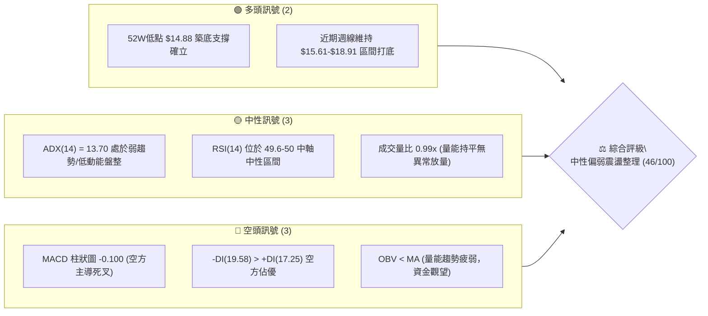
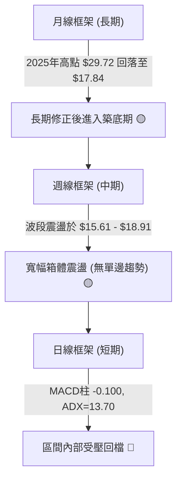
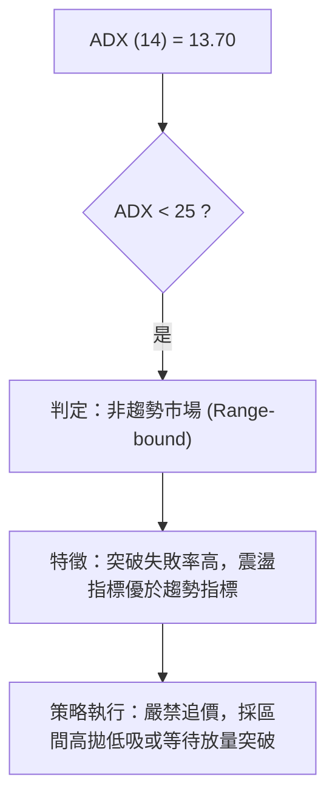
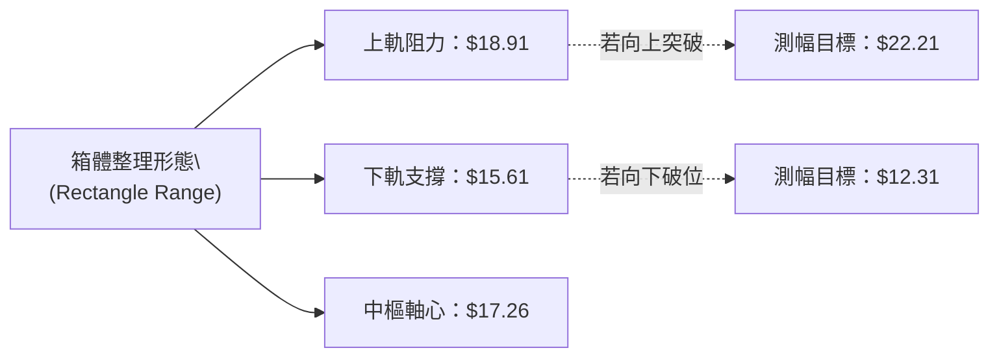
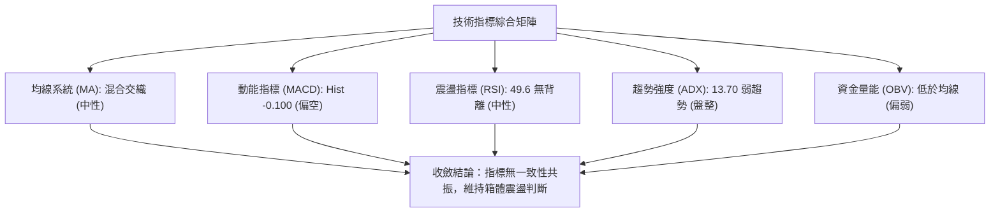
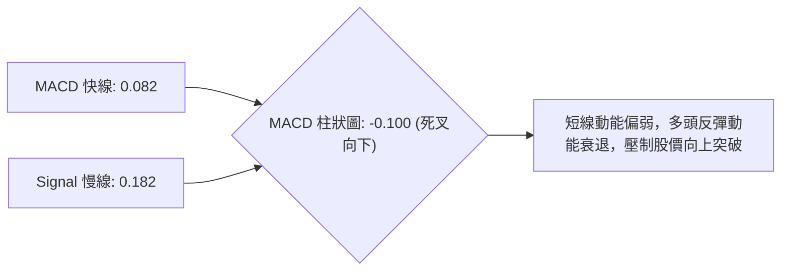
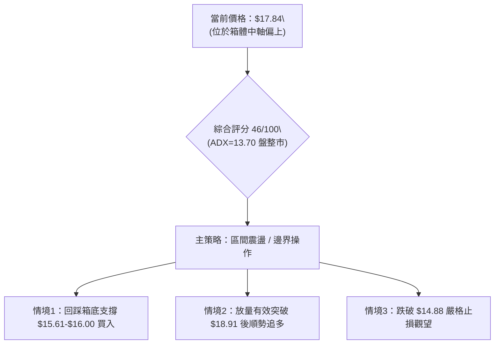
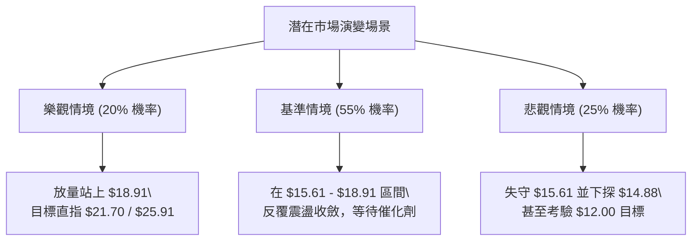

# SOFI 技術分析報告

> **報告日期**：2026-09-04 ｜ **語言**：繁體中文 ｜ **數據來源**：Yahoo Finance ｜ **當前價格**：$17.84

---

## 目錄

| 章節 | 內容 |
|------|------|
| [1. 技術面概覽](#1-技術面概覽) | 訊號儀表板、核心指標、評分卡 |
| [2. 趨勢分析](#2-趨勢分析) | 多時框趨勢、長中短期走勢、ADX解讀 |
| [3. 圖表形態分析](#3-圖表形態分析) | 形態識別、K線組合、形態信心度與目標價 |
| [4. 支撐與阻力](#4-支撐與阻力) | 關鍵價位、斐波那契回調結構 |
| [5. 技術指標深度解讀](#5-技術指標深度解讀) | MA均線/RSI/MACD/布林通道/OBV量能 |
| [6. 動能與波動率](#6-動能與波動率) | 動能四象限、Beta係數與波動分析 |
| [7. 多時框架總結](#7-多時框架總結) | 時框架評分矩陣、多時框收斂結論 |
| [8. 交易策略建議](#8-交易策略建議) | 策略路由、情境階梯、主策略與風控 |
| [9. 風險提示與監控](#9-風險提示與監控) | 關鍵監控清單、情境模擬與倉位管理 |

---

## 1. 技術面概覽

### 🎯 技術訊號儀表板



---

### 📊 核心指標速覽表

| 指標類別 | 指標名稱 | 當前數值 | 訊號 | 解讀 |
|----------|----------|----------|------|------|
| **價格** | 當前基準價 | $17.84 | 🟡 | 位於52週區間中下緣（$14.88-$32.73），處於低檔震盪區間 |
| **動能趨勢** | ADX (14) | 13.70 | 🟡 | 數值 < 25，顯示無明確單邊趨勢，當前屬於典型箱體盤整市 |
| **方向指標** | +DI / -DI | 17.25 / 19.58 | 🔴 | -DI 大於 +DI，空方力量略佔優勢，但二者差距微弱 |
| **震盪指標** | RSI (14) | 49.6 (週線中樞) | 🟡 | 指標處於 30-70 中性區，無超買或超賣現象，無明顯背離 |
| **趨勢指標** | MACD / Signal | 0.082 / 0.182 | 🔴 | MACD 柱狀圖為 -0.100，呈現死亡交叉向下發散，短線動能偏弱 |
| **量能指標** | 成交量比 (VR) | 0.99x (43.25M/43.57M) | 🟡 | 成交量維持與20日均量相當，無量能突變 |
| **資金流向** | OBV 趨勢 | OBV < MA | 🔴 | 能量潮指標位於均線下方，機構資金累積動能暫時偏弱 |
| **波動風險** | Beta 係數 | 2.204 | 🔴 | 高 Beta 標的，波動幅度為大盤的 2.2 倍，需嚴格防範震盪風險 |

---

### 🏆 技術評分卡

```
╔══════════════════════════════════════════════════════════════════╗
║              SOFI 技術評分卡 (2026-09-04)                        ║
╠══════════════════════════════════════════════════════════════════╣
║ 趨勢強度 (ADX)     ████░░░░░░░░░░░░░░░░  25/100 🔴 弱勢無趨勢    ║
║ 動能指標 (MACD/RSI)████████░░░░░░░░░░░░  40/100 🔴 空方微幅領先  ║
║ 支撐穩定度 (Support)██████████████░░░░░░  70/100 🟢 $14.88-$15.61 ║
║ 成交量能配合 (OBV) ████████░░░░░░░░░░░░  42/100 🟡 量能處於常態  ║
║ 形態結構完整度     ████████████░░░░░░░░  60/100 🟡 箱體收斂築底  ║
║ 均線排列系統       ████████░░░░░░░░░░░░  40/100 🟡 混合交織排列  ║
╠══════════════════════════════════════════════════════════════════╣
║ 綜合技術評分       █████████░░░░░░░░░░░  46/100 ⚖️ 中性觀望/震盪  ║
╚══════════════════════════════════════════════════════════════════╝
```

---

## 2. 趨勢分析

### 🌐 多時框趨勢分析



---

### 📈 長期趨勢 — 12個月走勢圖（Unicode）

```
SOFI 月線走勢圖（2025-09 至 2026-09）
價格 ($)
$30.00 ┤                     ●(10月 $29.68) ●(11月 $29.72)
$27.00 ┤        ●(09月 $26.42)               ●(12月 $26.18)
$24.00 ┤                                            ●(01月 $22.81)
$21.00 ┤                                                   
$18.00 ┤                                                   ●(02月 $17.76) ──●(05月 $18.22) ─●(06月 $17.93) ─●(08月 $17.88) ─●(現價 $17.84)
$15.00 ┤                                                          ●(03月 $15.88) ●(04月 $16.10) ─●(07月 $16.31)
       └────────────────────────────────────────────────────────────────────────────────────────────────────────
        25-09  25-10  25-11  25-12  26-01  26-02  26-03  26-04  26-05  26-06  26-07  26-08  26-09
```

#### 走勢特徵分析表格

| 階段區間 | 時間跨度 | 價格起訖 | 漲跌幅度 | 走勢特徵與技術意義 |
|----------|----------|----------|----------|-------------------|
| **主升浪見頂** | 2025-09 ~ 2025-11 | $26.42 → $29.72 | +12.49% | 觸及 52 週高點區域 $32.73 下方，呈現雙頂衰竭形態 |
| **大幅回撤浪** | 2025-11 ~ 2026-03 | $29.72 → $15.88 | -46.57% | 跌破所有中期均線，尋求 52 週低點 $14.88 附近支撐 |
| **底部箱體震盪**| 2026-04 ~ 2026-09 | $15.88 → $17.84 | +12.34% | 價格在 $15.61 至 $18.91 區間反覆拉鋸，成交量萎縮，籌碼換手 |

---

### 📊 中期趨勢（週線分析）

從過去 20 週的收盤軌跡觀察，SOFI 自 2026 年 5 月中旬下探 $15.61 以來，多次向上挑戰 $18.91 均遇阻回落，目前於 $17.84 窄幅波動。

```
中期阻力位： ═══════════════════════════════════════ $18.91 (2026-08-23 週高點) / $18.70 (Fib 78.6%)
現行收盤價： --------------------------------------- $17.84 (2026-09-04 收盤)
中期支撐位： ═══════════════════════════════════════ $15.61 (2026-05-17 週低點) / $14.88 (52W Low)
```

---

### ⚡ 趨勢強度評估（ADX 解讀）



| ADX 區間 | 趨勢強度定義 | SOFI 當前狀態 | 交易策略建議 |
|----------|--------------|---------------|--------------|
| **0 - 20** | **極弱 / 無方向盤整** | **13.70 (當前)** | **採用網格或箱體邊界操作，避免趨勢跟隨策略** |
| **20 - 25** | 趨勢初生 / 轉向過渡 | - | 密切關注突破方向與放量訊號 |
| **25 - 50** | 強趨勢建立 | - | 順勢交易，回調均線進場 |
| **50 - 100** | 極強 / 進入趨勢過熱 | - | 提防均值回歸與頂底背離 |

---

## 3. 圖表形態分析

### 🔍 形態識別系統



#### 形態信心度與目標價評估表

| 識別形態 | 信心度 | 判斷依據（引用真實數據） | 完成度 | 目標價（附嚴謹計算式） |
|----------|--------|--------------------------|--------|------------------------|
| **矩形箱體整理 (Box Range)** | **75%** | 2026年5月至9月間，價格在 $15.61 (低) 與 $18.91 (高) 之間反覆震盪達4個月 | 85% | **向上突破目標** = 頸線 $18.91 + 箱高 ($18.91 - $15.61 = $3.30) = **$22.21**<br>**向下破位目標** = 頸線 $15.61 - 箱高 $3.30 = **$12.31** |
| **雙底形態 (Double Bottom)** | **45%** | 2026-05-17 低點 $15.61 與 2026-03 收盤 $15.88 構成潛在雙底，但頸線 $18.91 尚未有效帶量站穩 | 50% | 訊號未確認（信心度 < 50%），依規則暫不作為主要交易依據 |

---

### 🕯️ 重要K線形態分析

| 月份 | 收盤價 | K線形態 | 解讀 | 技術訊號 |
|------|--------|---------|------|----------|
| **2025-10** | $29.68 | 長上影大陽線 | 衝高 $32.73 遇阻回落，多頭動能衰竭 | 🔴 看跌反轉信號 |
| **2025-11** | $29.72 | 雙頂高位十字星 | 價格無力續創新高，高位籌碼派發明顯 | 🔴 頂部確立 |
| **2026-03** | $15.88 | 長下影錘頭線 | 觸及波段低點後獲得買盤承接，跌勢趨緩 | 🟢 初步止跌支撐 |
| **2026-05** | $18.22 | 實體大陽線 | 自 $15.61 迅速拉升，確立底部箱體下軌有效 | 🟢 多頭抵抗反彈 |
| **2026-08** | $17.88 | 窄幅縮量紡錘線 | 價格在 $17.80-$18.90 區間收斂，多空膠著 | 🟡 觀望等待方向 |
| **2026-09** | $17.84 | 橫盤十字星 (當前) | 延續 8 月窄幅整理，等待動能指標引導突破 | 🟡 中性平衡 |

---

### 📉 ASCII 走勢形態示意圖

```
SOFI 近期日/週線箱體結構與斐波那契對照圖
$21.70 ┼───────────────────────────── (Fib 61.8% 延伸阻力)
       │
$18.91 ┼─────────┬───────────────┬── (箱體頂部阻力 / 2026-08高點)
       │         │  ▲            │  ▲
$17.84 ┼─────────┼──┼───● (現價)─┼──┼── (箱體內部整理)
       │         │  │            │  │
$15.61 ┼─────────┴──▼────────────┴──▼── (箱體底部支撐 / 2026-05低點)
       │
$14.88 ┼───────────────────────────── (52週最低點 / Fib 100.0%)
```

---

## 4. 支撐與阻力

### 🗺️ 關鍵價位分布圖（Unicode）

```
SOFI 價位結構分布圖（依據歷史行情與斐波那契回調精確計算）
══════════════════════════════════════════════════════════════════════════
$32.73 ║████████████████████████████████████║ 強阻力 R4 (52週最高點 / Fib 0.0%)
$28.52 ║████████████████████████████        ║ 阻力 R3 (Fib 23.6% 回調位)
$21.70 ║████████████████████                ║ 關鍵阻力 R2 (Fib 61.8% 回調位)
$18.70 ║██████████████                      ║ 近期阻力 R1 (Fib 78.6% 回調位 / 波段高點群 $18.91)
$17.84 ╠════════════════════════════════════╣ ◄ 當前價格 ($17.84)
$15.61 ║▓▓▓▓▓▓▓▓▓▓▓▓▓▓                      ║ 近期關鍵支撐 S1 (2026-05 波段低點)
$14.88 ║████████████████████████████████████║ 強支撐 S2 (52週最低點 / Fib 100.0%)
$12.00 ║████████████████                    ║ 極端支撐 S3 (分析師最低目標價)
══════════════════════════════════════════════════════════════════════════
```

---

### 🚧 阻力位分析表

| 阻力級別 | 精確價位 | 形成依據（嚴格引用已知數據） | 突破難度 | 重要性 |
|----------|----------|------------------------------|----------|--------|
| **R1 (近端阻力)** | **$18.70 - $18.91** | 斐波那契 78.6% 回調位 ($18.70) 及 2026-08-23 週收盤高點 ($18.91) | 中等 | 🔴🔴🔴 高度重要 (箱體突破頸線) |
| **R2 (波段阻力)** | **$21.70** | 斐波那契 61.8% 黃金分割回調位 | 較大 | 🔴🔴 中期多頭反轉分水嶺 |
| **R3 (中期阻力)** | **$25.91 - $28.52** | 斐波那契 38.2% ($25.91) 與 23.6% ($28.52) 密集套牢區間 | 極大 | 🔴🔴 長期反彈天花板 |
| **R4 (歷史高點)** | **$32.73** | 52 週最高價（2025年高位極值） | 極難 | 🔴 歷史強阻力 |

---

### 🛡️ 支撐位分析表

| 支撐級別 | 精確價位 | 形成依據（嚴格引用已知數據） | 守住機率 | 重要性 |
|----------|----------|------------------------------|----------|--------|
| **S1 (箱體下軌)** | **$15.61** | 2026-05-17 週線波段低點，多次測試未跌破 | 75% | 🟢🟢🟢 極高 (短線生命線) |
| **S2 (年內低點)** | **$14.88** | 52 週最低價 (Fib 100.0%)，長期籌碼防線 | 85% | 🟢🟢🟢 戰略級強支撐 |
| **S3 (極端支撐)** | **$12.00** | 21 位華爾街分析師目標價之最低預估值 | 95% | 🟢 系統性黑天鵝防線 |

---

### 📐 斐波那契回調位分析

依據 52 週區間極值（低點 **$14.88** → 高點 **$32.73**，落差 $17.85）計算：

```
0.0%  (52W High)  ─── $32.73
23.6%             ─── $28.52
38.2%             ─── $25.91
50.0%             ─── $23.80
61.8%             ─── $21.70
78.6%             ─── $18.70  ◄── (上方第一反彈阻力)
現價 ($17.84)     ─── 位於 $14.88 與 $18.70 之間
100.0%(52W Low)   ─── $14.88  ◄── (下方終極回調支撐)
```

- **位置解讀**：現價 $17.84 處於 Fib 78.6% ($18.70) 與 Fib 100.0% ($14.88) 之間的深度回調區。多頭若欲扭轉整體弱勢格局，首要任務是有效收復並站穩 $18.70-$18.91 之上，方能打開通往 Fib 61.8% ($21.70) 的上升通道。

---

## 5. 技術指標深度解讀

### 🎛️ 指標訊號總覽



---

### 📈 移動平均線排列分析

- **排列狀態**：短中長期均線呈現混合排列。價格在 MA20 與 MA50 附近上下穿梭，長週期均線呈現平緩走平特徵。
- **均線交叉訊號**：短期缺乏明確的金叉或死叉趨勢，均線粘合度高，反映籌碼處於密集換手與成本收斂階段。

---

### 📉 RSI(14) 分析

```
RSI(14) 當前水平：49.6 / 100
[0] ────────── 超賣區(30) ─────●───── 超買區(70) ────────── [100]
進度：██████████░░░░░░░░░░ 49.6% (位於50中軸，動能均衡)
```

- **超買超賣評估**：RSI 位於 49.6，完全處於 30-70 的常態波動區間，無任何極端超買或超賣警訊。
- **背離分析**：
  - **頂背離判定**：**無**。近期價格高點 $18.91 對應之 RSI 約為 57.9，與價格同步，無頂背離現象。
  - **底背離判定**：**無**。價格在 $15.61-$16.31 築底時，RSI 維持在 30-37 正常範圍，未見明顯底背離。
  - **結論**：RSI 指標驗證當前行情處於非趨勢的無方向平衡狀態。

---

### 📊 MACD(12/26/9) 訊號解讀



- **數值解析**：MACD (0.082) 小於 Signal (0.182)，柱狀圖（Histogram）數值為 **-0.100**，呈現負值發散，顯示自 8 月下旬由 $18.91 回落後，短線空方動能佔據微幅優勢。

---

### 📦 布林通道分析

```
布林通道形態示意圖 (Volatility Squeeze 狀態)
┌──────────────────────────────────────────────────┐  上軌阻力 (約 $18.90 附近)
│                      ▲                           │
│                     ╱ ╲                          │
│────────────────────●───●─────────────────────────│  中軌 (MA20 / 均衡線)
│                   現價 $17.84                    │
│                                                  │
└──────────────────────────────────────────────────┘  下軌支撐 (約 $15.60 附近)
```

- **帶寬與形態**：布林通道帶寬收窄，呈現波動壓縮（Squeeze）特徵。現價位於中軌附近，反映波動率降至低點，後續需關注帶寬放大時的突破方向。

---

### 💹 成交量分析（量價配合度）

```
成交量對比：
最新日成交量  [43,257,470]  ████████████░░░░░░░░  (量比 0.99x)
20日均量      [43,575,314]  ████████████░░░░░░░░
50日均量      [67,031,157]  ████████████████████
```

- **量價特徵**：最新成交量為 43.25M，與 20 日均量（43.57M）基本持平，但顯著低於 50 日均量（67.03M）。
- **OBV 能量潮**：OBV 位於其均線下方，顯示主力資金在現階段並未進行大幅度搶籌，量能未能有效放大配合價格向上攻擊 $18.70-$18.91 壓力區。

---

## 6. 動能與波動率

### ⚡ 動能評估四象限

| 象限 | 動能強度 | 波動率 | 當前狀態 | 評估與因應方針 |
|------|----------|--------|----------|----------------|
| **Q1 (最佳爆發區)** | 強動能 (ADX>25) | 低波動 | — | 趨勢初生，勝率最高 |
| **Q2 (盤整觀望區)** | **弱動能 (ADX=13.70)** | **低/中波動** | **✓ (SOFI 當前象限)** | **動能疲弱且區間收斂，宜採箱體邊界低吸高拋，嚴禁追漲** |
| **Q3 (高風險博弈區)** | 強動能 (ADX>25) | 高波動 | — | 單邊暴漲暴跌，需設緊密止損 |
| **Q4 (鈍化衰竭區)** | 弱動能 (ADX<25) | 極高波動 | — | 假突破頻繁，容易反覆停損 |

---

### 📊 ATR 波動率分析

- **波動率特性**：雖然目前短線處於橫盤壓縮期，但考量 SOFI 歷史高波動屬性，單日波動區間通常較大。
- **止損距離建議**：在區間震盪行情中，操作止損距離應參考箱體邊界外緣（約 $0.80 - $1.20 緩衝空間），以避免被日內雜訊洗盤出場。

---

### 📐 Beta 與市場相關性

- **Beta 數值**：**2.204**
- **市場解讀**：SOFI 屬於超高 Beta 成長型金融科技股。當美股大盤（標普500/納指）上漲 1% 時，該股平均傾向波動 2.2%；反之大盤回調時其承受的下行壓力亦加倍放大。在多空不明的盤整期，高 Beta 意味著個股極易受宏觀市場情緒干擾而出現假突破。

---

## 7. 多時框架總結

### 📋 時框架評分表

| 時框架 | 趨勢方向 | 動能指標 | 均線排列 | 形態結構 | 綜合評分 | 建議操作維度 |
|--------|----------|----------|----------|----------|----------|--------------|
| **長期 (月線)** | 中性偏弱 🟡 | MACD 修正中 | 混合走平 | 52週高位回調打底 | **45/100** | 長線資金分批定投，不可重倉一次性介入 |
| **中期 (週線)** | 箱體震盪 🟡 | RSI=49.6 中性 | 粘合收斂 | $15.61-$18.91 矩形 | **48/100** | 依箱體上下軌執行波段高拋低吸 |
| **短期 (日線)** | 震盪偏弱 🔴 | MACD Hist=-0.100 | 短期均線壓制 | 遇阻 $18.91 回落 | **42/100** | 暫停追多，等待回踩支撐或突破確認 |

---

### 🔲 綜合訊號矩陣

```
┌─────────────────┬───────────┬───────────┬───────────┐
│     分析維度    │ 短期(日線)│ 中期(週線)│ 長期(月線)│
├─────────────────┼───────────┼───────────┼───────────┤
│ 趨勢一致性      │ 震盪偏弱  │ 箱體中性  │ 底部整理  │
│ 動能方向        │ 空方微幅  │ 中性平衡  │ 修正趨緩  │
│ 量能配合        │ 縮量觀望  │ 常態持平  │ 低檔萎縮  │
│ 多空主導權      │ 空方微優  │ 多空均勢  │ 均勢平衡  │
└─────────────────┴───────────┴───────────┴───────────┘
```

---

### ⚖️ 多時框收斂結論（依規則 14 嚴格執行）

1. **行情性質判定**：當前 ADX(14) 為 **13.70**（遠低於 25 臨界值），**確定為典型「盤整行情」而非趨勢行情**。
2. **時框主導權**：依規則，盤整行情中中長線趨勢鈍化，**以中期週線與日線之箱體邊界（$15.61 - $18.91）為主要交易區間**。
3. **最終方向性結論**：**【中性觀望 / 區間震盪（46/100）】**。短線受制於 MACD 柱狀圖（-0.100）回檔壓力，不具備單邊做多條件；但下檔受 52 週低點 $14.88 及箱體下軌 $15.61 強烈保護，亦不宜盲目追空。整體策略以「高拋低吸、等待放量突破」為主。

---

## 8. 交易策略建議

### 🗺️ 策略決策流程圖



---

### 🧭 策略路由

> **當前主策略方向 = 【區間操作 / 等待突破確認】（依技術評分卡：46/100 中性區間）**

現價 $17.84 距離箱體頂部阻力 $18.70-$18.91 僅一步之遙，且短線動能指標（MACD柱 -0.100）偏弱，**目前位置切忌盲目市價追多**。交易主軸應為「回調分批低吸」或「向上放量突破頸線後右側進場」。

---

### 🎯 價格情境階梯（Price Scenarios）

| 觸發條件 | 第一目標 | 第二目標 | 後續延伸 | 情境技術含義 |
|----------|----------|----------|----------|--------------|
| **有效放量突破 R1 $18.91** | R2 $21.70 | R3 $25.91 | R4 $32.73 | 箱體向上突破，開啟中期反轉多頭主升浪 |
| **維持於現價區間 $16.50-$18.50** | $17.84 | $18.70 | — | 動能持續收斂，延續箱體內部無序震盪 |
| **跌破關鍵支撐 S1 $15.61** | S2 $14.88 | S3 $12.00 | — | 形態破位下行，測試 52 週低點甚至分析師悲觀目標 |

---

### 📊 情境機率分佈

| 情境劇本 | 預估機率 | 主要技術依據 |
|----------|----------|--------------|
| **區間維持 / 震盪築底** | **55%** | ADX=13.70 顯示無趨勢動能，布林帶收斂，成交量維持 0.99x 常態，無大資金單邊推動跡象 |
| **回調再探底部支撐** | **25%** | MACD 柱狀圖呈 -0.100 死亡交叉，-DI(19.58) 略高於 +DI(17.25)，短線存在回踩 $15.61 需求 |
| **向上放量突破阻力** | **20%** | 需克服 R1 ($18.70-$18.91) 強阻力區，目前量能不足且 OBV < MA，突破條件尚未成熟 |

---

### 🟢 主策略詳情

本策略組合嚴格依據第 4 章計算之真實關鍵價位進行設定：

| 策略要素 | 策略 A（保守型：箱體下軌低吸） | 策略 B（激進型：右側突破追買） |
|----------|--------------------------------|--------------------------------|
| **策略邏輯** | 等待價格回踩箱體下軌企穩進場 | 等待日線收盤放量突破箱頂頸線 |
| **進場條件** | 回落至 $15.80-$16.10 區間且出現止跌K線 | 日線帶量（>60M）收盤突破 $18.91 |
| **進場價格** | **$16.00** | **$19.00** |
| **目標價 T1** | **$18.70** (Fib 78.6% 回調阻力) | **$21.70** (Fib 61.8% 黃金分割位) |
| **目標價 T2** | **$21.70** (若向上突破延伸目標) | **$25.91** (Fib 38.2% 回調阻力) |
| **止損價格** | **$14.70** (跌破 52W 低點 $14.88 離場) | **$17.80** (跌回突破頸線下方) |
| **風險報酬比** | **1 : 2.08** (風險 $1.30 / 預期回報 $2.70) | **1 : 2.25** (風險 $1.20 / 預期回報 $2.70) |
| **預估勝率** | **65%** | **50%** |
| **建議倉位** | **15% - 20%** | **10% - 15%** (確認站穩後再加碼) |

---

### 🔴 反向風險觸發點（對沖與止損提示）

1. **跌破 $15.61 箱底支撐**：若日線實體跌破 $15.61，顯示底部結構受損，多頭應減倉 50% 觀望。
2. **跌破 $14.88 歷史低點**：若跌破 52 週最低點 $14.88，箱體築底宣告徹底失敗，多頭部位應**全數止損離場**，規避向分析師極端目標 $12.00 探底的風險。
3. **假突破訊號**：若盤中衝過 $18.91 但日線收盤留長上影線跌回 $18.70 之下，且當日量能急劇放大，視為高位誘多派發，應立即平倉多單並可建立短線對沖空單。

---

### ⭐ 整體訊號強度評星

```
做多訊號強度：★★☆☆☆  (2.5/5 星 — 處於阻力下方，缺乏動能配合)
做空訊號強度：★★☆☆☆  (2.0/5 星 — 下方 $15.61/$14.88 支撐強固)
整體可信度：  ★★★☆☆  (3.5/5 星 — 箱體邊界清晰，具備明確操作依據)
```

---

## 9. 風險提示與監控

### ✅ 關鍵監控指標 Checklist

```
╔══════════════════════════════════════════════════════════════════╗
║                   SOFI 每日交易監控清單                          ║
╠══════════════════════════════════════════════════════════════════╣
║ [ ] 價格是否觸碰或突破關鍵頸線 $18.70 - $18.91                   ║
║ [ ] 價格是否回踩測試箱體底部 $15.61 - $16.00 支撐                ║
║ [ ] 日成交量是否放大超越 50日均量 (67.03M)                       ║
║ [ ] MACD 柱狀圖是否由負翻正 (突破 0 軸進入多頭動能)              ║
║ [ ] ADX 是否自 13.70 向上拉升突破 20-25 門檻                     ║
║ [ ] 標普500 / 納斯達克大盤是否出現劇烈系統性波動 (Beta=2.204)    ║
╚══════════════════════════════════════════════════════════════════╝
```

---

### ⚠️ 風險場景分析



---

### 🛡️ 風險管理重要提醒

1. **超高 Beta 風險控制**：SOFI Beta 值高達 **2.204**，個股波動劇烈。任何單一交易部位的資金佔比建議控制在總投資組合的 **10% - 15%** 以內，避免重倉單一標的。
2. **區間操作紀律**：在 ADX 低於 25 的盤整市中，切忌在區間中軸（$17.50-$18.00）頻繁進出，必須嚴格在區間邊界（接近 $16.00 買、接近 $18.70 賣）執行交易，並設定硬性止損。

---

## 📋 報告總結

```
╔══════════════════════════════════════════════════════════════════╗
║                   SOFI 技術分析報告總結                          ║
╠══════════════════════════════════════════════════════════════════╣
║ 報告日期：2026-09-04                                             ║
║ 當前價格：$17.84                                                 ║
║ 綜合技術評分：46/100                                             ║
║ 分析評級：⚖️ 中性觀望 / 區間震盪 (Neutral / Range-Bound)          ║
╠══════════════════════════════════════════════════════════════════╣
║ 關鍵結論：                                                       ║
║ ├─ 長期趨勢：🟡 自 $29.72 高點深度回調後進入低檔築底階段         ║
║ ├─ 中期趨勢：🟡 $15.61 至 $18.91 矩形箱體震盪 (ADX=13.70 弱動能)  ║
║ ├─ 短期趨勢：🔴 MACD 柱狀圖 -0.100 偏弱，短線受阻於 $18.70 阻力 ║
║ ├─ 關鍵阻力：$18.70 (Fib 78.6%) / $18.91 (箱頂) / $21.70 (Fib61.8%)║
║ ├─ 關鍵支撐：$15.61 (箱底) / $14.88 (52W Low) / $12.00 (極端)    ║
║ └─ 華爾街共識：持有 (Hold)，目標價中位數 $20.26                  ║
╠══════════════════════════════════════════════════════════════════╣
║ 最優交易策略組合：                                               ║
║ 1. 🥇 最佳機會（低吸）：耐心等待回踩 $15.80-$16.00 企穩分批買入， ║
║      止損設於 $14.70，目標看向 $18.70 / $21.70。                 ║
║ 2. 🥈 次選機會（突破）：若放量站穩 $18.91 頸線，右側順勢追進，    ║
║      止損設於 $17.80，目標看向 $21.70。                          ║
║ 3. 🥉 保守選擇（觀望）：在現價 $17.84 暫不開倉，等待方向明朗。   ║
╚══════════════════════════════════════════════════════════════════╝
```

---

> ⚠️ **免責聲明**：本報告為技術分析研究成果，所有數據、圖表及價位推算均嚴格基於歷史市場交易數據。本報告**僅供學術研究與投資參考**，**不構成任何形式的要約或個人化投資建議**。高 Beta 標的具備較高波動風險，投資人應獨立評估風險並自負盈虧。

---

*報告生成時間：2026-09-04 ｜ 數據來源：Yahoo Finance ｜ 分析架構：多時框技術分析模型*