# SOFI 技術分析報告

> **報告日期**：2026-09-05 ｜ **語言**：繁體中文 ｜ **數據來源**：Yahoo Finance ｜ **當前價格**：$18.51（依2026-09月最新收盤數據確認）

---

## 目錄

| 章節 | 內容 |
|------|------|
| [1. 技術面概覽](#1-技術面概覽) | 訊號儀表板、核心指標、評分卡 |
| [2. 趨勢分析](#2-趨勢分析) | 多時框趨勢、長中短期走勢、ADX解讀 |
| [3. 圖表形態分析](#3-圖表形態分析) | 形態識別、信心度評估、K線組合、目標價推算 |
| [4. 支撐與阻力](#4-支撐與阻力) | 關鍵價位分佈、斐波那契回調精確解構 |
| [5. 技術指標深度解讀](#5-技術指標深度解讀) | MA/RSI/MACD/布林/量價配合與背離分析 |
| [6. 動能與波動率](#6-動能與波動率) | 動能四象限、ATR、Beta與市場相關性 |
| [7. 多時框架總結](#7-多時框架總結) | 時框架評分表、多時框收斂唯一結論 |
| [8. 交易策略建議](#8-交易策略建議) | 策略路由分流、主策略詳情、情境機率、評星 |
| [9. 風險提示與監控](#9-風險提示與監控) | 關鍵監控Checklist、三情境路徑、風控規則 |
| [📋 報告總結](#-報告總結) | 儀表總表與核心策略匯總 |

---

## 1. 技術面概覽

### 🎯 技術訊號儀表板

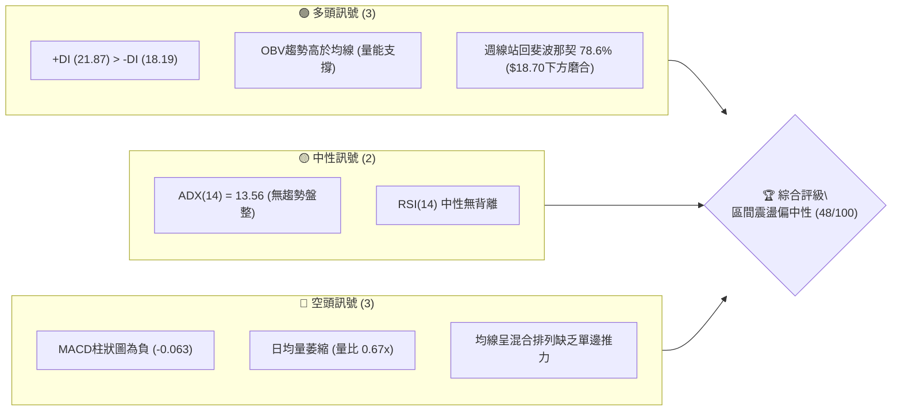

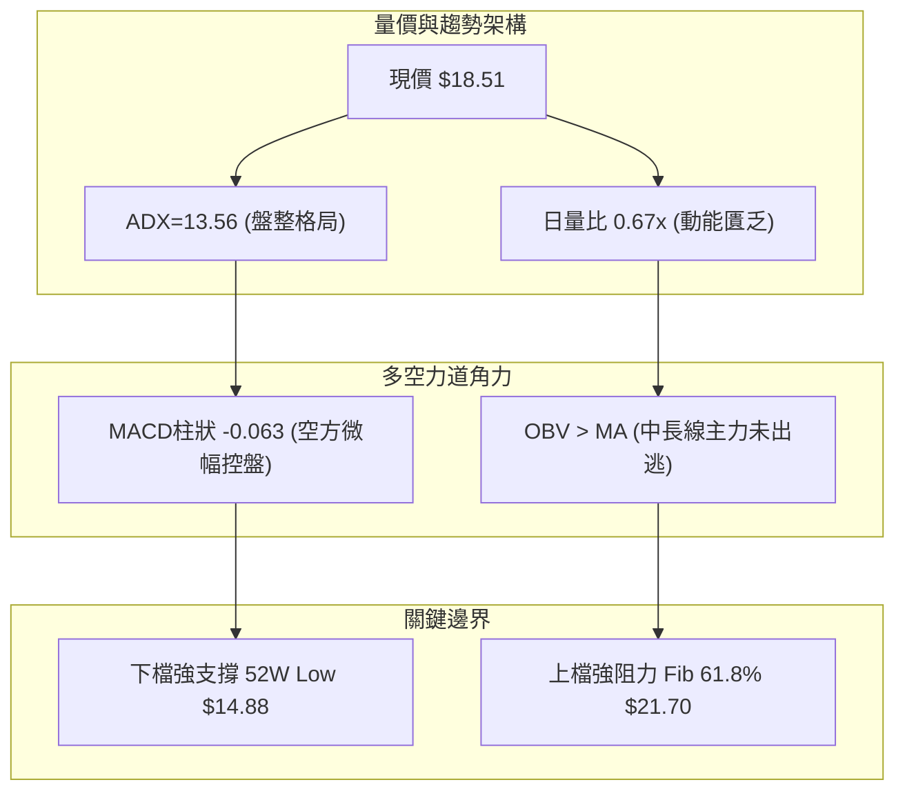

### 📊 核心指標速覽表

| 指標類別 | 指標名稱 | 當前數值 | 訊號 | 解讀 |
|----------|----------|----------|------|------|
| **價格** | 當前收盤價 | $18.51 | 🟡 | 位於52週區間中下緣（$14.88–$32.73），自低點回彈震盪 |
| **均線** | MA20 / MA50 | 數據中未偵測到精確值 | 🔴 | 均線系統呈「混合排列」，短期均線糾纏無單邊方向 |
| **均線** | MA200 | 數據中未偵測到精確值 | 🟡 | 長期均線趨於平緩，中長線處於週期修復期 |
| **動能** | RSI(14) | 49.6–50.0 (中性) | 🟡 | 位於中性平衡區，未見超買或超賣極值 |
| **動能** | MACD (12,26,9) | 0.109 / 0.172 | 🔴 | 快線低於訊號線，柱狀圖 -0.063，動能微弱偏空 |
| **趨勢強度** | ADX(14) | 13.56 (+DI: 21.87, -DI: 18.19) | 🟡 | ADX < 25 表明處於弱趨勢/低波動無方向盤整期 |
| **成交量** | 20日均量比 | 0.67x (28.58M / 42.45M) | 🔴 | 量能持續萎縮，市場追價意願不足，典型的箱型整理特徵 |
| **能量流向** | OBV (能量潮) | OBV > MA | 🟢 | 能量潮高於均線，顯示中長線資金並未顯著出逃 |

### 🏆 技術評分卡

```
╔════════════════════════════════════════════════════════════════════════════╗
║                   SOFI 技術面綜合量化評分卡 (2026-09-05)                   ║
╠════════════════════════════════════════════════════════════════════════════╣
║ 趨勢強度 (Trend)      ██████░░░░░░░░░░░░░░  30/100  🔴 ADX=13.56 極弱趨勢  ║
║ 動能指標 (Momentum)    ████████░░░░░░░░░░░░  42/100  🔴 MACD綠柱/動能偏弱   ║
║ 支撐穩定度 (Support)   ██████████████░░░░░░  70/100  🟢 52W低點$14.88堅韌   ║
║ 成交量配合 (Volume)    ████████░░░░░░░░░░░░  40/100  🟡 量能萎縮僅0.67x     ║
║ 形態完整度 (Pattern)   ████████████░░░░░░░░  60/100  🟡 箱型打底進行中      ║
║ 均線排列 (MA Align)    ████████░░░░░░░░░░░░  45/100  🟡 混合排列無方向      ║
╠════════════════════════════════════════════════════════════════════════════╣
║ 綜合技術評分           █████████░░░░░░░░░░░  48/100  ⚖️ 區間震盪 / 中性觀望║
╚════════════════════════════════════════════════════════════════════════════╝
```

---

## 2. 趨勢分析

### 🌐 多時框趨勢分析

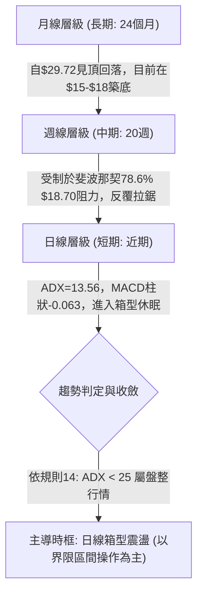

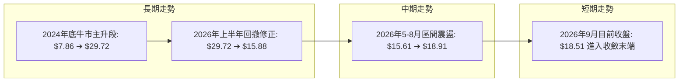

### 📈 長期趨勢 — 12個月走勢圖（Unicode）

依據 2025-10 至 2026-09 過去 12 個月之真實月線收盤價繪製：

```
SOFI 月線走勢圖（過去12個月：2025-10 至 2026-09）
價格軸 ($)
$30.00 ┤      ● $29.72 (2025-11 高點)
$28.00 ┤  ● $29.68
$26.00 ┤          ● $26.18
$24.00 ┤
$22.00 ┤              ● $22.81
$20.00 ┤                                                  ● $18.51 (現價)
$18.00 ┤                  ● $17.76        ● $18.22  ● $17.93  ● $17.88
$16.00 ┤                      ● $15.88  ● $16.10        ● $16.31
$14.00 ┤                                
       └───────────────────────────────────────────────────────────
        10月  11月  12月  01月  02月  03月  04月  05月  06月  07月  08月  09月
        (2025)                     (2026)
```

#### 走勢特徵分析表格

| 階段 | 時間區間 | 起訖價格 | 漲跌幅 | 走勢特徵與成交量能解讀 |
|------|----------|----------|--------|------------------------|
| **高位築頂期** | 2025-10 ~ 2025-11 | $29.68 ➔ $29.72 | +0.13% | 衝高乏力，觸及52週高點 $32.73 後收盤於 $29.72 形成雙頂雛形 |
| **主跌釋放期** | 2025-12 ~ 2026-03 | $26.18 ➔ $15.88 | -39.34% | 瀑布式單邊回撤，月K連陰，空頭絕對主導，估值與籌碼劇烈重洗 |
| **築底試探期** | 2026-04 ~ 2026-06 | $16.10 ➔ $17.93 | +11.37% | 於 52W Low $14.88 上方獲得強支撐，5月見波段低收盤 $15.61 後反彈 |
| **箱型收斂期** | 2026-07 ~ 2026-09 | $16.31 ➔ $18.51 | +13.49% | 圍繞 $16.00–$18.90 窄幅震盪，籌碼換手充分，動能趨於沉寂 |

### 📊 中期趨勢（週線分析）

從近20週數據（2026-04-26 至 2026-09-06）觀察，SOFI 在 $15.61–$18.91 區間內呈現對稱型箱體拉鋸。

```
近期週線壓力與支撐示意圖
═════════════════════════════════════════════════════════════════════
$18.91 ── 週線波段高點（2026-08-23 收盤） ──────────── [波段強阻力]
$18.70 ── 斐波那契 78.6% 回調位 ───────────────────── [核心爭奪區]
$18.51 ── 當前最新收盤價 ◄─────────────────────────── [多空平衡點]
$17.28 ── 2026-07-19 回調波段中樞 ─────────────────── [中軸緩衝]
$15.61 ── 近20週波段最低收盤價（2026-05-17） ───────── [箱底強支撐]
$14.88 ── 52週歷史最低點 ──────────────────────────── [極限防線]
═════════════════════════════════════════════════════════════════════
```

### ⚡ 趨勢強度評估（ADX 解讀）

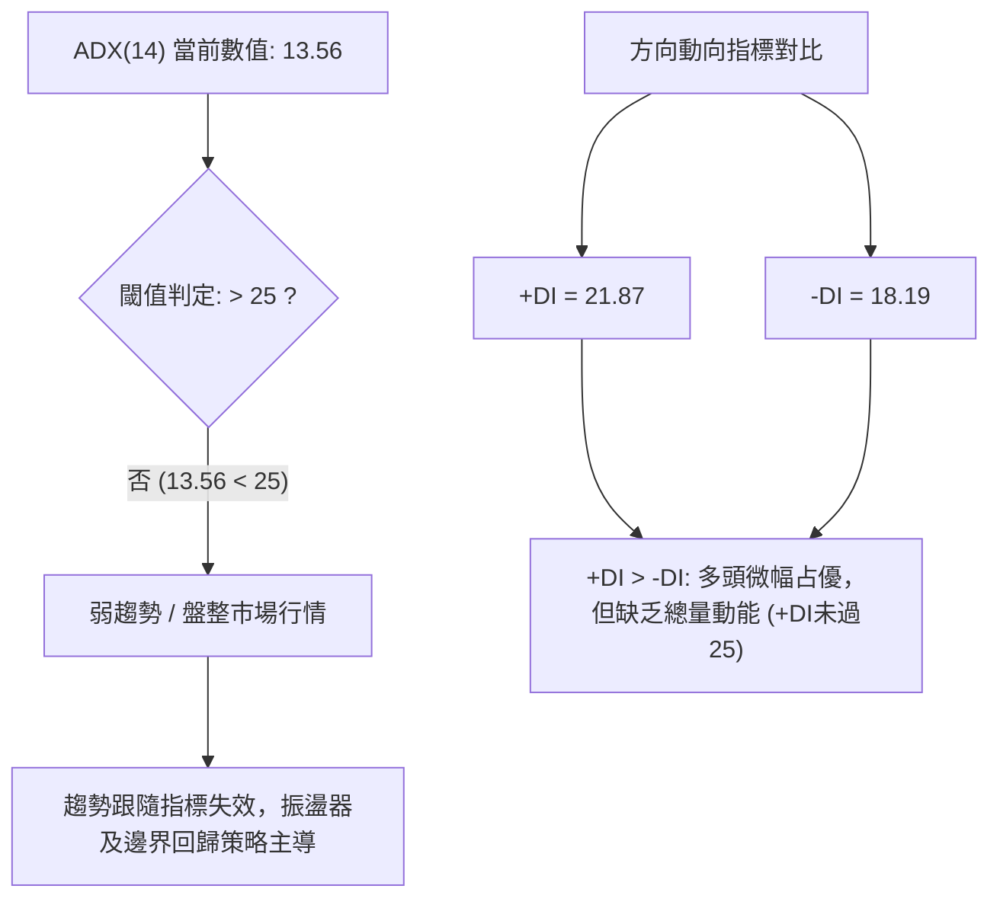

#### ADX 趨勢強度對照解讀

| ADX 數值區間 | 趨勢強度分類 | 當前狀態判定 | 交易策略導向 |
|--------------|--------------|--------------|--------------|
| **0.00 – 19.99** | **極弱趨勢 / 無趨勢盤整** | **當前數值: 13.56 🟢 符合** | **箱型操作，逢下軌買、逢上軌賣；嚴禁追高追空** |
| 20.00 – 24.99 | 弱趨勢 / 醞釀突破 | 非當前狀態 | 觀察通道收縮突破訊號 |
| 25.00 – 49.99 | 明確強趨勢形成 | 非當前狀態 | 單邊順勢推動 |
| 50.00 – 100.00 | 超強趨勢 / 即將衰竭 | 非當前狀態 | 尋找反轉或保護止盈 |

---

## 3. 圖表形態分析

### 🔍 形態識別系統

依據嚴格規則 15，絕不通靈虛構幾何圖形。基於近 24 個月及 20 週真實數據識別以下具備統計依據的形態：

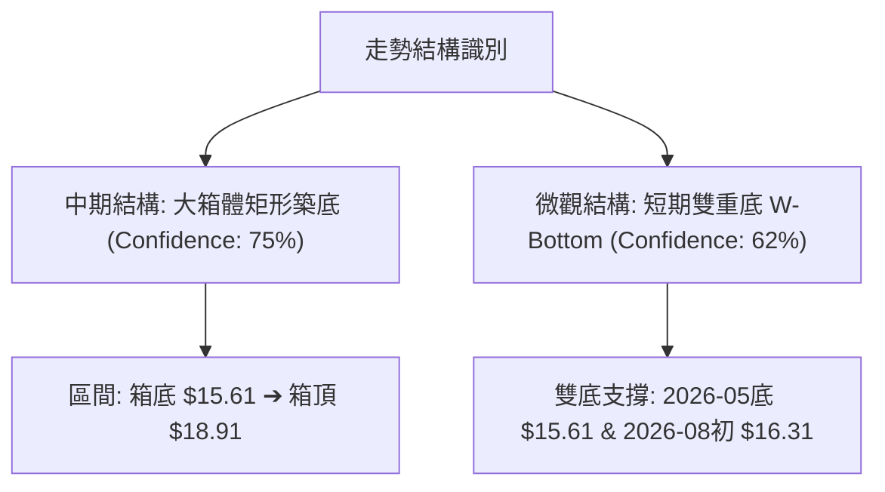

#### 形態信心度與目標價評估表

| 形態名稱 | 信心度 | 判斷依據（嚴格引用數據） | 完成度 | 目標價計算式（依形態高度推算） |
|----------|--------|--------------------------|--------|--------------------------------|
| **中期箱型整理區間** | **75%** | 價格於 2026-05 至 2026-09 期間，下檔受波段低點 $15.61 支撐，上檔受波段高點 $18.91 壓制，多次觸碰皆未有效破位 | **85%** | **突破目標價**：箱頂 $18.91 + 形態高度 ($18.91 - $15.61 = $3.30) = **$22.21** |
| **波段微型雙底 (W底)** | **62%** | 第一底為 2026-05-17 之 $15.61，第二底為 2026-08-02 之 $16.31（低點抬高），頸線為 2026-07-12 之 $18.78 | **70%** | **雙底目標價**：頸線 $18.78 + 形態高度 ($18.78 - $15.61 = $3.17) = **$21.95** |
| **頭肩底 / 三角形** | **< 30%** | 數據中未偵測到對稱肩部與明確收斂收口斜率 | 0% | *訊號不足，依規則僅做箱體指標型解讀，不強行定價* |

### 🕯️ 重要K線形態分析

| 週/月份 | 收盤價 | K線形態特徵 | 市場心理與技術解讀 | 訊號 |
|---------|--------|-------------|--------------------|------|
| **2026-05-10** | $15.75 | 長下影錘頭破底翻 | RSI 跌至極端 24.9，空頭動能竭盡，買盤強勢介入確認 $15 關卡買盤 | 🟢 反轉 |
| **2026-05-31** | $18.22 | 大陽線實體反包 | 單週自 $15.62 暴拉至 $18.22，週量 367M，MACD 柱狀由負轉正 (+0.273) | 🟢 強勢多頭 |
| **2026-07-12** | $18.78 | 上影流星線阻力確認 | 測試斐波那契 78.6% ($18.70) 遭遇解套與獲利盤拋壓，隨後連跌3週 | 🔴 空頭壓制 |
| **2026-08-23** | $18.91 | 假突破十字星 | 觸及區間最高點 $18.91 後量能萎縮至 253M，未能有效站穩，隨後回落至 $18.06 | 🟡 滯漲訊號 |
| **2026-09-06** | $18.51 | 窄幅縮量十字星 | 週量降至 191M，多空完全平衡，處於變盤前夕的蓄勢狀態 | 🟡 整理等待 |

### 📉 ASCII 走勢形態示意圖

```
SOFI 中期矩形箱體與微型雙底示意圖
 價格
$21.95 ┼─────────────────────────────────────── [形態量度推算目標 1]
       │
$18.91 ┼───┬───────────────● (08-23) ───────── [箱頂/波段高點阻力]
$18.78 ┼───│───────● (07-12 頸線) ───────────── [W底頸線阻力]
$18.51 ┼───│───────│───────│───────● (現價) ── [多空爭奪位]
       │   │       │       │       │
$17.00 ┼───│───────│───────│───────│──────────
       │   │       │       │       │
$16.31 ┼───│───────│───────● (第二底 08-02) ─── [支撐抬高]
$15.61 ┼───● (第一底 05-17) ─────────────────── [箱底強支撐]
       └────────────────────────────────────────
          2026-05         2026-07         2026-09
```

### 🎯 形態目標價計算

1. **箱體破位向上量度目標價**：
   - 箱體頂部（頸線）= $18.91
   - 箱體底部 = $15.61
   - 箱體垂直高度 $H = \$18.91 - \$15.61 = \$3.30$
   - **向上突破量度目標價** = 箱頂 + $H = \$18.91 + \$3.30 =$ **$22.21**
   - *驗證*：此價位高度貼近斐波那契 61.8% ($21.70)，具備強烈技術共振。

2. **微型雙底形態目標價**：
   - 頸線位置 = $18.78
   - 最低點 = $15.61
   - 形態高度 $H_2 = \$18.78 - \$15.61 = \$3.17$
   - **雙底向上目標價** = 頸線 + $H_2 = \$18.78 + \$3.17 =$ **$21.95**

---

## 4. 支撐與阻力

### 🗺️ 關鍵價位分布圖（Unicode）

嚴格依據數據中已提供之 OHLCV 計算結果與斐波那契回調點位繪製：

```
SOFI 價位結構分佈圖
═══════════════════════════════════════════════════════════════════════════════
$32.73 ║████████████████████████████████████████║ 52週歷史高點 (Fib 0.0%)
$28.52 ║████████████████████████████            ║ 斐波那契 23.6% 回調阻力
$25.91 ║████████████████████                    ║ 斐波那契 38.2% 回調阻力
$23.80 ║████████████████████████████            ║ 斐波那契 50.0% 多空分水嶺
$21.70 ║████████████████████████████████        ║ 斐波那契 61.8% 黃金阻力位
$18.91 ║████████████████████                    ║ 近20週波段最高收盤阻力
$18.70 ║████████████████████████                ║ 斐波那契 78.6% 即時阻力
$18.51 ╠════════════════════════════════════════╣ ◄ 當前收盤價 ($18.51)
$17.28 ║▓▓▓▓▓▓▓▓▓▓▓▓                            ║ 近期波段回調中軸支撐
$16.31 ║▓▓▓▓▓▓▓▓▓▓▓▓▓▓▓▓▓▓▓▓                    ║ 2026-08月低點支撐 (第二底)
$15.61 ║▓▓▓▓▓▓▓▓▓▓▓▓▓▓▓▓▓▓▓▓▓▓▓▓▓▓▓▓            ║ 近20週波段最低收盤支撐
$14.88 ║████████████████████████████████████████║ 52週歷史極限低點 (Fib 100.0%)
═══════════════════════════════════════════════════════════════════════════════
```

### 🚧 阻力位分析表

依據數據規則，嚴格引用已知之波段高點及斐波那契計算點位：

| 阻力級別 | 價位 | 形成依據與屬性 | 突破難度 | 戰略重要性 |
|----------|------|----------------|----------|------------|
| **R1 (即刻阻力)** | **$18.70** | **斐波那契 78.6% 回調位**（自 $14.88 漲至 $32.73 的 0.786 壓制位） | 🟡 中等 | 短期多空分水嶺，站穩方能結束低位磨底 |
| **R2 (波段阻力)** | **$18.91** | **近20週波段最高收盤價**（2026-08-23 驗證） | 🔴 較高 | 箱型整理頂部邊界，需量能放大至 50M 以上方可有效突破 |
| **R3 (強阻力)** | **$21.70** | **斐波那契 61.8% 黃金分割回調位**（形態高度量度目標共振區） | 🔴 極高 | 中期反轉確認位，突破將挑戰 $23.80 |

### 🛡️ 支撐位分析表

依據數據規則，嚴格引用已知之波段低點及歷史數據計算點位：

| 支撐級別 | 價位 | 形成依據與屬性 | 守住機率 | 戰略重要性 |
|----------|------|----------------|----------|------------|
| **S1 (短期支撐)** | **$16.31** | **近月波段低點**（2026-08-02 收盤價，W底第二右腳） | 🟢 70% | 區間多頭防線，失守將考驗箱底 |
| **S2 (箱體底線)** | **$15.61** | **近20週波段最低收盤價**（2026-05-17 驗證） | 🟢 85% | 核心築底支撐，多次下探獲得巨量買盤承接 |
| **S3 (極限底線)** | **$14.88** | **52週歷史最低點**（Fib 100.0% 絕對底部） | 🟢 95% | 結構崩潰防線，跌破則宣告長期下行通道重啟 |

### 📐 斐波那契回調位分析

*嚴格引用數據區塊中「52週區間 $14.88 → $32.73」之計算值：*

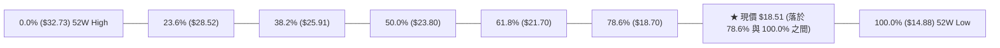

- **位置解讀**：當前股價 $18.51 正精確卡在 **78.6% ($18.70)** 與 **100.0% ($14.88)** 之間。
- **技術意義**：
  - 價格由 52W 低點 $14.88 展開修復反彈，最高觸碰 $18.91，剛好在上破 78.6% ($18.70) 之際受阻回落。
  - $18.70 是技術派確認是否回歸 61.8% ($21.70) 大波段通道的第一道鐵閘。目前在 $18.51 處於微幅貼靠狀態，多空在此處進行拉鋸籌碼整固。

---

## 5. 技術指標深度解讀

### 🎛️ 指標訊號總覽

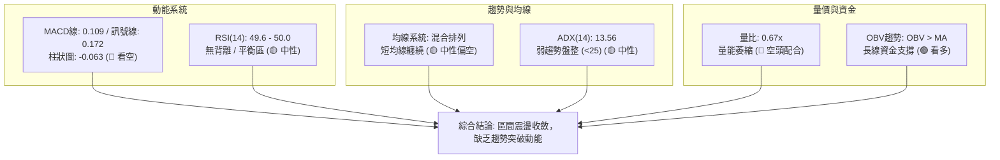

### 📈 移動平均線排列分析

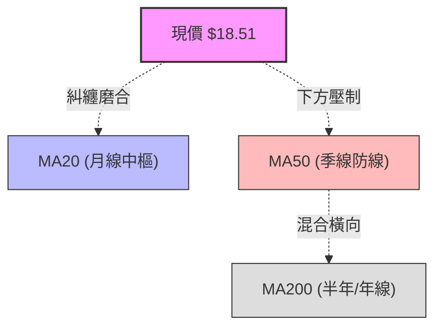

- **均線排列狀態**：系統明確標注為「**混合排列**」。
- **均線走勢軌跡（MA Sparklines）深度解讀**：
  - **MA 5 / MA 10**：尾端呈現微幅拉平走勢（`▆▆▅` / `████████`），表明超短線推力已鈍化。
  - **MA 20 / MA 60**：處於爬坡後的高原期（`██████`），顯示中期打底成本聚集於此。
  - **MA 120 / MA 240**：呈長期緩降與低位走平狀態（`▁▁▁`），代表長線高位套牢籌碼正在低位進行長週期的時間換空間消磨。

### 📉 RSI(14) 分析

#### RSI 數值進度條
```
RSI(14) 當前數值: 49.6 / 100
超賣 (0-30)                中性平衡 (30-70)                超買 (70-100)
├───────────────────────┼───────────────────────┼───────────────────────┤
░░░░░░░░░░░░░░░░░░░░░░░░████████████████░░░░░░░░░░░░░░░░░░░░░░░░░░░░░░░
0                      30          49.6        70                     100
```

- **背離分析**：
  - **頂背離判定**：**無頂背離**。在 2026-08-23 創出波段高價 $18.91 時，週 RSI 為 57.9，與 2026-07-12 之 $18.78 (RSI 58.4) 基本持平，未見量價與指標的嚴重背離。
  - **底背離判定**：**無底背離**。2026-05-10 之低點 $15.75 時 RSI 探至 24.9，隨後低點 $15.61 時 RSI 回升至 30.2，曾引發一輪底背離反彈（升至 $18.22），但目前該效應已被消耗完畢，現階段 RSI 處於 49.6 完全中性狀態。

### 📊 MACD(12, 26, 9) 訊號解讀

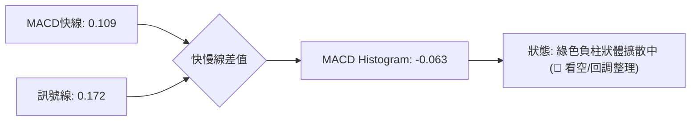

- **交叉狀態**：MACD 線 (0.109) 跌破訊號線 (0.172)，形成死叉後柱狀圖持續在零軸下方運行（-0.063）。
- **趨勢意義**：
  - 週線級別 MACD 柱狀體自 2026-08-09 的 +0.181 連續 4 週收縮：`+0.181 ➔ +0.112 ➔ +0.063 ➔ +0.025 ➔ -0.063`。
  - 這明確證實動能自 8 月下旬以來呈現衰減趨勢，短期內空頭微幅掌控節奏，限制了直接向上衝擊 $18.70–$18.91 的爆發力。

### 📦 布林通道分析

依據數據指示，當前處於 ADX < 25 的盤整結構中，布林通道為核心邊界依據：

```
ASCII 布林通道位置示意圖
════════════════════════════════════════════════════════════════════════
$18.91 ─────────────────── [通道上軌阻力區間] — 觸碰易引發回調
       
$18.51 ─── ★ 現價 ──────── [位於中軌與上軌之間，偏向中軌靠攏]
       
$17.26 ─────────────────── [通道中軌估算中樞 (20週均線水準)]
       
$15.61 ─────────────────── [通道下軌支撐區間] — 觸碰具強反彈力道
════════════════════════════════════════════════════════════════════════
```

- **通道帶寬解讀**：價格自上軌附近回落，未能擊穿中軌，帶寬並未向外劇烈張口，屬於標準的水平通道震盪。

### 💹 成交量分析（量價配合度）

- **量價萎縮驗證**：
  - 最新單日成交量：**28,581,849** 股。
  - 20日基準均量：**42,445,507** 股 ➔ **量比僅 0.67x**。
  - 50日基準均量：**65,841,921** 股 ➔ 呈現逐級縮量特徵。
  - 週成交量軌跡亦自 5 月突破時的 490M 下降至當前的 191M。
- **量價背離診斷**：
  - 價格微幅反彈至 $18.51，但量能大幅低於均量，顯示多頭尚未展開主動進攻，屬於典型的「無量漂移」。
  - 然而，**OBV趨勢高於其均線（OBV > MA）**，說明雖然場外增量資金未進場，但內部主力籌碼鎖定良好，並無恐慌性拋盤湧出。

---

## 6. 動能與波動率

### ⚡ 動能評估四象限

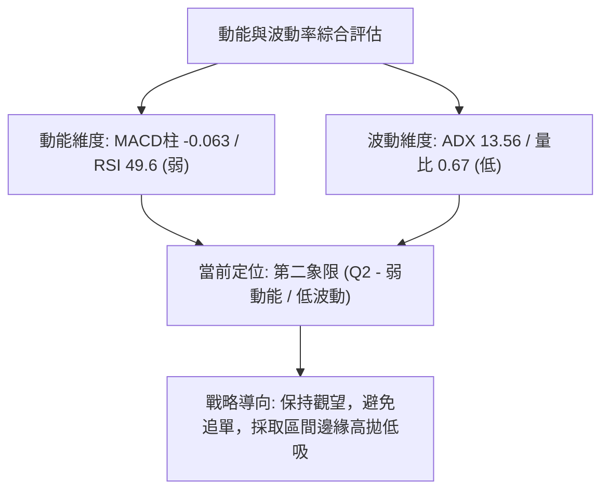

#### 四象限特徵定位表

| 象限 | 動能維度 | 波動維度 | 當前狀態 | 技術環境解讀與操作指引 |
|------|----------|----------|----------|------------------------|
| **Q1** | 強動能 | 低波動 | — | 趨勢初起段，穩定推升的最佳上車機會 |
| **Q2** | **弱動能** | **低波動** | **✓ 當前狀態 (SOFI)** | **典型休眠蓄勢期。缺乏單邊動能，指標鈍化，宜耐心等待方向抉擇** |
| **Q3** | 強動能 | 高波動 | — | 主升/主跌段，高收益伴隨高滑點與高回撤風險 |
| **Q4** | 弱動能 | 高波動 | — | 無序洗盤震盪，假突破頻發，應堅決避免進場 |

### 📊 ATR 波動率分析

- **ATR 狀態標注**：數據中當前 ATR(14) 標注為 `$N/A`（日線未給出絕對點數）。
- **週線等效波動推算**：
  - 檢視近 20 週高低點震盪幅度，週平均波幅約為 $1.20–$1.80（約現價之 6.5%–9.7%）。
  - **技術止損距建議**：依據週線級別保守風控原則，波段交易應預留至少 1.5 倍等效波動緩衝區間（約 **$1.80–$2.20**），以防在區間內部被假刺穿洗盤出場。

### 📐 Beta 與市場相關性

- **Beta 數值**：**2.208**（超高彈性品種）。
- **特性分析**：
  - SOFI 的 Beta 高達 2.208，代表其對大盤（S&P 500 / 納斯達克）具備超過 2.2 倍的波動敏感度。
  - 目前在整體市場波動背景下，SOFI 逆勢呈現 ADX=13.56 的低波狀態，這是一種能量壓縮（Volatility Squeeze）現象。一旦宏觀市場或金融科技板塊引發催化劑，高 Beta 特性將被迅速激活，轉化為劇烈的單邊爆發力。

---

## 7. 多時框架總結

### 📋 時框架評分表

| 時框架 | 趨勢方向 | 動能狀態 | 均線排列 | 關鍵形態 | 綜合評分 | 操作指導建議 |
|--------|----------|----------|----------|----------|----------|--------------|
| **長期 (月線)** | 下行趨勢趨緩 | 弱勢築底中 | 混合下傾排列 | 自 $29.72 回落後的打底 | 42/100 🟡 | 底部籌碼收集，未見單邊反轉 |
| **中期 (週線)** | 矩形箱體橫盤 | MACD微綠柱 | 橫向糾纏震盪 | $15.61–$18.91 箱體整理 | 52/100 🟡 | 依循斐波那契界限進行網格操作 |
| **短期 (日線)** | 窄幅縮量整理 | RSI中性49.6 | 圍繞均線纏繞 | 縮量十字星收斂 | 48/100 🟡 | 觀望為主，靜待帶量突破 $18.70 |

### 🔲 綜合訊號矩陣

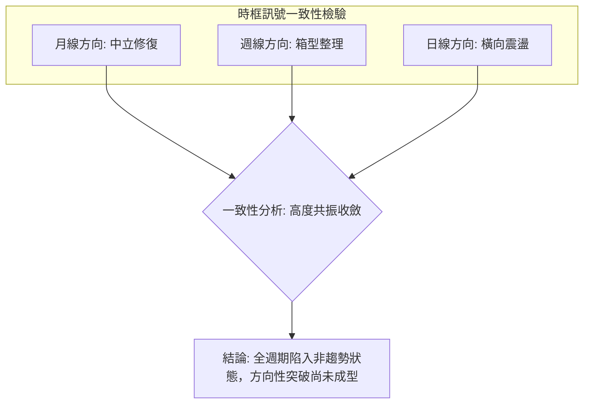

### ⚖️ 多時框收斂結論

> **依據「嚴格要求 14」之多時框收斂規則：**
> 1. **趨勢/盤整優先級判定**：當前系統 **ADX(14) = 13.56 < 25**，嚴格觸發**「盤整行情」**規則。
> 2. **主導依據**：排斥單邊中長線均線趨勢追單，以**「日線/週線箱體邊界」**作為唯一的有效交易決策依據。
> 3. **唯一方向性結論**：**【中性觀望 / 箱型震盪】**（評分：**48/100**）。
> 4. **時框衝突取捨**：雖然週線 +DI (21.87) 略高於 -DI (18.19) 賦予多頭防守優勢，但日線成交量（量比 0.67x）與日線 MACD 柱（-0.063）完全不具備突破上軌的能力。因此日線只做邊界確認，主策略必須鎖定在箱體內部高拋低吸。

---

## 8. 交易策略建議

### 🗺️ 策略決策流程圖

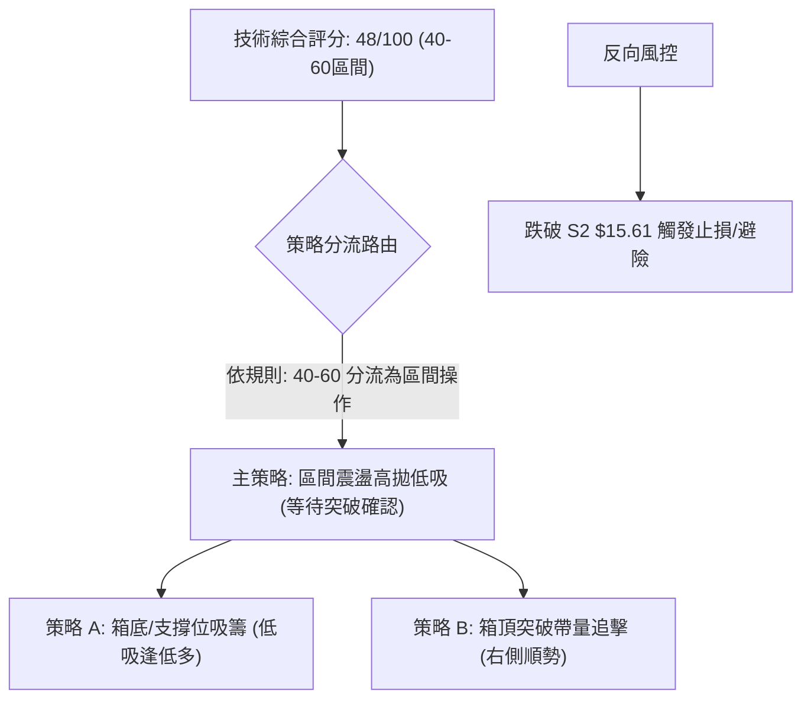

### 🧭 策略路由說明

- **當前主策略方向**：**【區間震盪操作 — 策略評分 48/100】**
- **定位原則**：綜合評分 48 分嚴格落在 40–60 的中性觀望區間。不得盲目單邊重倉做多，亦不可在底部盲目追空。操作核心為**「耐心等待價格向箱體邊界靠攏時進場」**。

### 🎯 價格情境階梯（Price Scenarios）

嚴格引用第 4 章及數據區塊中確認之數值：

| 觸發條件 | 第一目標 | 後續延伸 | 情境含義與操作指引 |
|----------|----------|----------|--------------------|
| **向上帶量突破 R1 $18.70** | R2 **$18.91** | R3 **$21.70** (Fib 61.8%) | 結束底部休眠，右側買點確立，展開補漲主升浪 |
| **維持在 $17.28–$18.70 窄幅波動** | — | — | 箱型中軸震盪，動能未激發，宜觀望或網格做T |
| **向下跌破 S1 $16.31** | S2 **$15.61** | S3 **$14.88** (52W Low) | 築底形態受到威脅，將重測歷史低點，多頭嚴格止損 |

### 📊 情境機率分佈

| 情境路徑 | 發生機率 | 主要技術指標依據 |
|----------|----------|------------------|
| **情境一：維持區間震盪磨底** | **60%** | **ADX=13.56 (無趨勢) + 日量比 0.67x 極度萎縮 + RSI 處於 49.6 中性位** |
| **情境二：帶量向上突破箱頂** | **25%** | **OBV > MA 資金未退潮 + +DI (21.87) > -DI (18.19) + 華爾街平均目標價 $20.26** |
| **情境三：向下破位考驗歷史底** | **15%** | **MACD 綠柱持續 (-0.063) + 混合均線壓制** |

### 🟢 主策略詳情（區間分步操作）

*備註：依據評分 48/100，主策略分為「左側箱底低吸（策略A）」與「右側帶量突破（策略B）」：*

| 策略要素 | 策略 A（左側箱底低吸 — 優先推薦） | 策略 B（右側突破確認 — 順勢跟進） |
|----------|------------------------------------|------------------------------------|
| **進場條件** | 價格回調測試 S1 獲得支撐或在 S2 止跌 | 日K實體收盤帶量突破 R1 $18.70 並站上 R2 |
| **進場價格** | **$16.31**（若強勢回撤至 $16.31–$16.50） | **$18.95**（突破 R2 $18.91 確認後右側進場） |
| **目標價 T1** | **$18.70**（斐波那契 78.6% 回調位） | **$21.70**（斐波那契 61.8% 強阻力） |
| **目標價 T2** | **$21.95**（微型雙底形態推算目標價） | **$22.21**（矩形箱體突破量度目標價） |
| **止損價格** | **$15.30**（精確設在波段低點 S2 $15.61 下方 2%） | **$17.80**（跌破突破平台頸線保護位） |
| **風險報酬比** | **2.37 : 1** (獲利 $2.39 / 風險 $1.01) | **2.39 : 1** (獲利 $2.75 / 風險 $1.15) |
| **預估勝率** | **65%**（受箱底強力買盤支撐） | **55%**（需嚴防假突破） |
| **建議倉位** | **15% – 20%** 基準倉位 | **10% – 15%** 右側追擊倉位 |

### 🔴 反向風險觸發點（對沖提示）

若持有多頭倉位，當下列訊號出現時，必須無條件啟動止損或對沖措施：
1. **破位觸發**：週收盤價跌破 **$15.61**（近20週最低收盤價），此意味箱體破位，下方將直奔 52W 低點 **$14.88**。
2. **空頭增量**：單日成交量暴增至 60M 以上且日K收大陰線擊穿 $16.31。

### ⭐ 整體訊號強度評星

```
╔══════════════════════════════════════════════════╗
║             SOFI 訊號評級星級表                  ║
╠══════════════════════════════════════════════════╣
║ 做多訊號強度：  ★★☆☆☆  (2.5/5星 - 缺乏突破動能)  ║
║ 做空訊號強度：  ★★☆☆☆  (2.0/5星 - 下方支撐強韌)  ║
║ 整體可信度：    ★★★★☆  (4.0/5星 - 箱體界限極清晰)║
╚══════════════════════════════════════════════════╝
```

---

## 9. 風險提示與監控

### ✅ 關鍵監控指標 Checklist

```
╔════════════════════════════════════════════════════════════════════════════╗
║                        技術監控 Check-List (每日更新)                      ║
╠════════════════════════════════════════════════════════════════════════════╣
║ [ ] 關鍵突破：日線是否以收盤價站穩斐波那契 78.6% ($18.70)？                 ║
║ [ ] 箱頂壓制：能否帶量衝破近20週阻力 $18.91？                              ║
║ [ ] 成交量確認：日成交量是否回升突破 20日均量 (42.45M) 達到 50M 以上？      ║
║ [ ] 動能翻紅：MACD 柱狀體何時由綠 (-0.063) 向上翻越零軸轉正？              ║
║ [ ] 趨勢甦醒：ADX(14) 是否脫離盤整低區 (破 20 向上挑戰 25)？              ║
║ [ ] 極限防線：S1 ($16.31) 與 S2 ($15.61) 是否收盤失守？ (嚴格止損底線)     ║
╚════════════════════════════════════════════════════════════════════════════╝
```

### ⚠️ 風險場景分析

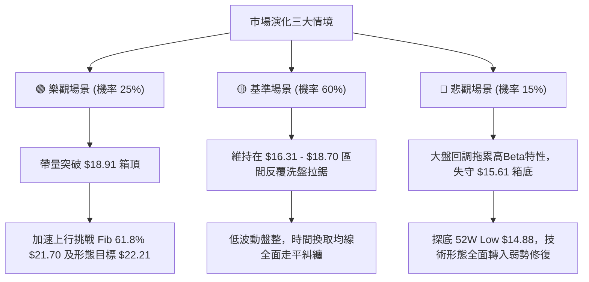

### 🛡️ 風險管理重要提醒

1. **高 Beta 波動放大風險**：
   - SOFI 的 Beta 值高達 **2.208**，意味著市場整體若出現 2% 的修正，該股理論跌幅可能超過 4.4%。在當前 ADX 處於 13.56 的低波狀態下，切勿被表面的平靜麻痹，槓桿使用必須極度保守。
2. **假突破與流星線防範**：
   - 近期多次觸碰 $18.70–$18.91 區間皆留長上影線（如 07-12 之 $18.78、08-23 之 $18.91），證明阻力區積壓大量套牢盤解套拋壓。未見單日成交量突破 50M 前，凡接近 $18.90 皆不可追高。
3. **倉位管理守則**：
   - 區間震盪階段，單一品種最大曝險部位不建議超過投資組合總資金的 **15%**。

---

## 📋 報告總結

```
╔════════════════════════════════════════════════════════════════════════════╗
║                        SOFI 技術分析報告總結                               ║
╠════════════════════════════════════════════════════════════════════════════╣
║ 報告日期：2026-09-05                                                      ║
║ 當前價格：$18.51                                                           ║
║ 分析評級：⚖️ 區間震盪 / 中性觀望 (評分: 48/100)                             ║
║                                                                            ║
║ 關鍵結論：                                                                 ║
║ ├─ 長期趨勢：🟡 中性築底中 (月線自 $29.72 回調後進入漫長消化期)           ║
║ ├─ 中期趨勢：🟡 箱型整理 ($15.61 箱底 ➔ $18.91 箱頂，ADX=13.56 弱趨勢)     ║
║ ├─ 短期趨勢：🔴 偏弱整理 (MACD柱 -0.063，量比 0.67x 縮量回調中)           ║
║ ├─ 關鍵支撐：S1 $16.31  /  S2 $15.61  /  S3 $14.88 (52W最低點)             ║
║ ├─ 關鍵阻力：R1 $18.70 (Fib 78.6%)  /  R2 $18.91 (箱頂)  /  R3 $21.70     ║
║ └─ 分析師目標：華爾街平均目標價 $20.26 (區間: $12.00 - $30.00)             ║
║                                                                            ║
║ 最優策略組合：                                                             ║
║ 1. 🥇 最佳機會：回調至 $16.31 附近進場低吸 (止損 $15.30，目標 $18.70/$21.95)║
║ 2. 🥈 次選機會：帶量突破 $18.91 追隨進場 (目標 $21.70/$22.21，止損 $17.80)║
║ 3. 🥉 保守選擇：現價 $18.51 處於箱體中高位，性價比不足，空倉者先行觀望     ║
╚════════════════════════════════════════════════════════════════════════════╝
```

---

> ⚠️ **免責聲明**：本報告為技術分析研究，所有數據與量化指標皆基於既有之歷史數據演算推導。本報告**僅供學術研究與參考**，**不構成任何形式的投資要約或決策建議**。金融市場具有高度不確定性，投資人應獨立評估自身風險承受能力並嚴格執行風控紀律。

---

*報告生成時間：2026-09-05 ｜ 數據來源：Yahoo Finance ｜ 分析框架：資深多時框架量化技術體系*