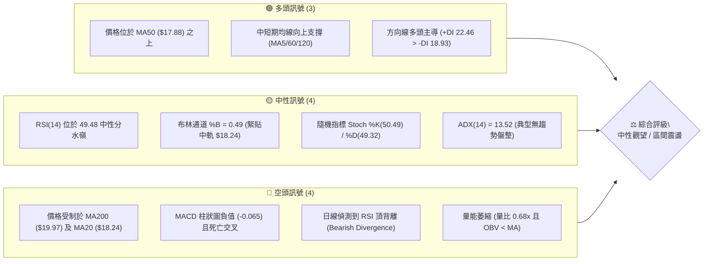
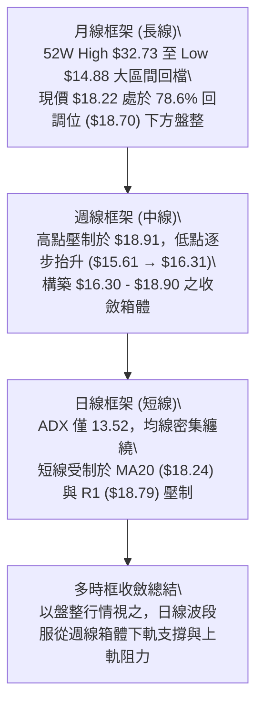
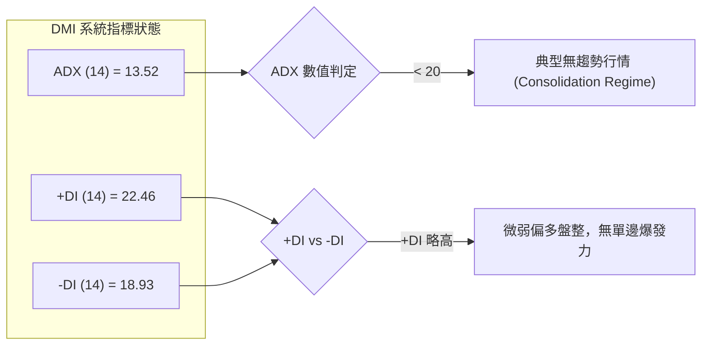
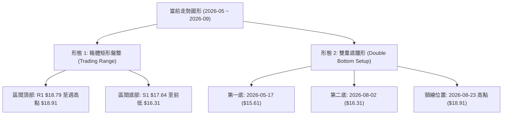
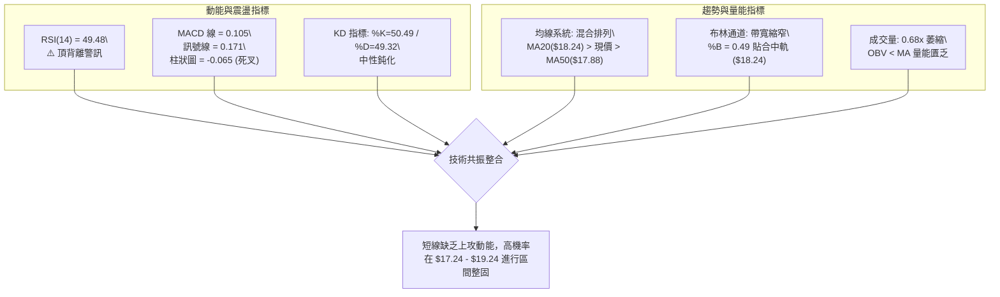
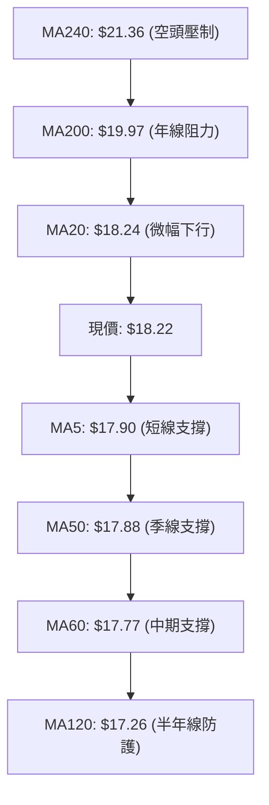
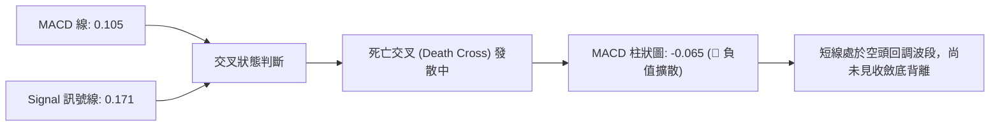
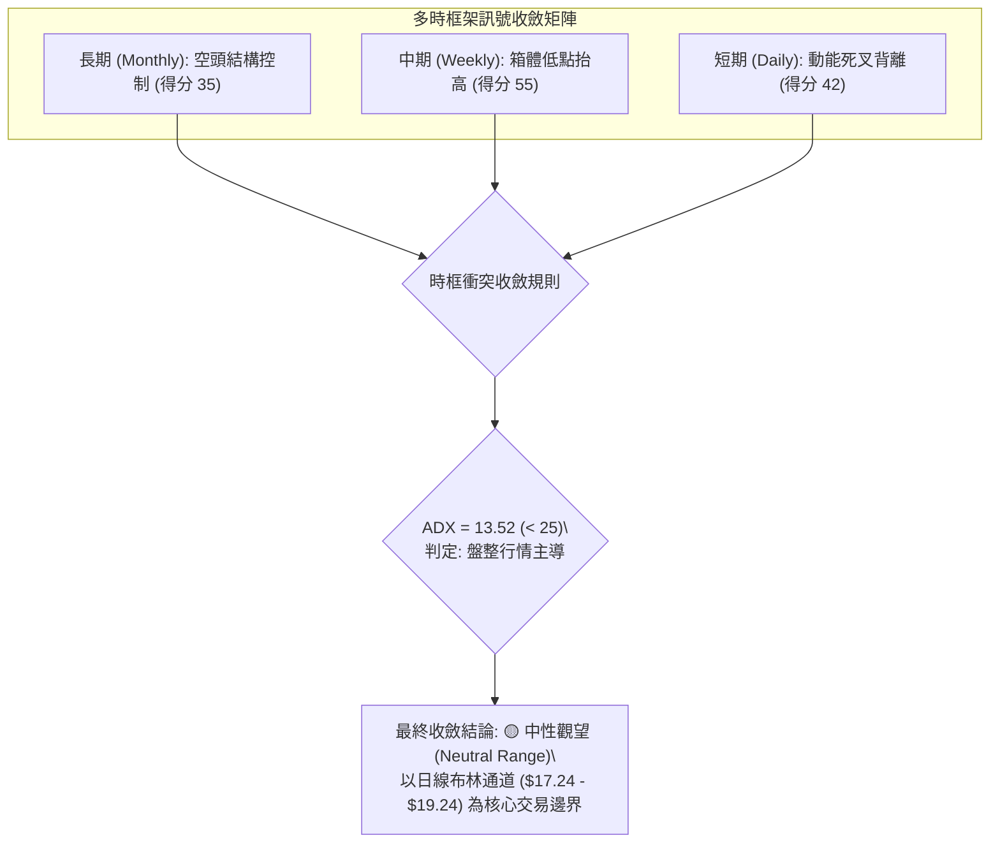
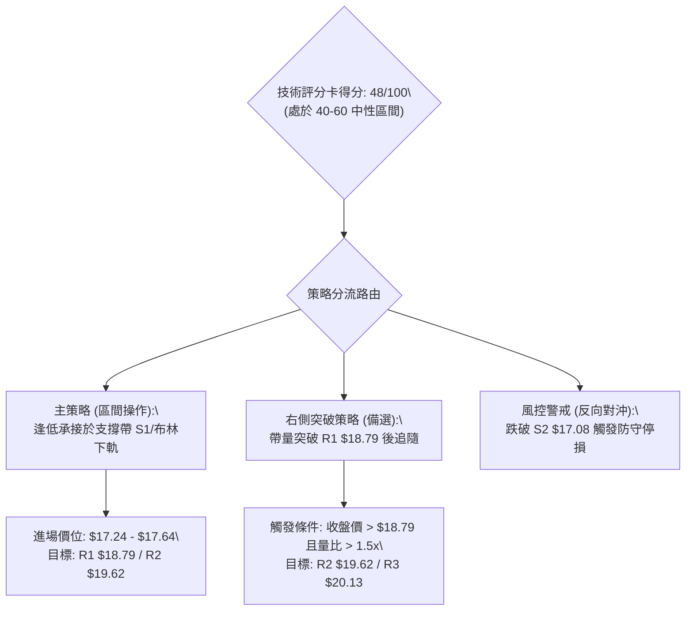
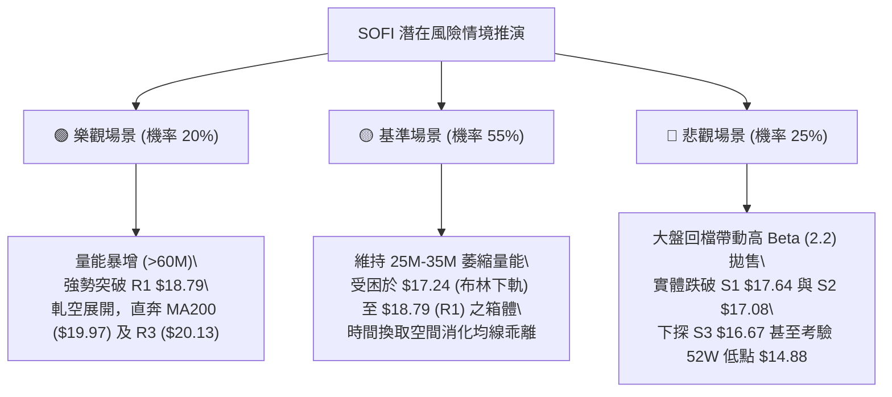

# SOFI 技術分析報告

> **報告日期**：2026-09-06 ｜ **語言**：繁體中文 ｜ **數據來源**：Yahoo Finance ｜ **當前價格**：$18.22

---

## 目錄

| 章節 | 內容 |
|------|------|
| [1. 技術面概覽](#1-技術面概覽) | 訊號儀表板、核心指標、評分卡 |
| [2. 趨勢分析](#2-趨勢分析) | 多時框趨勢、長中短期走勢 |
| [3. 圖表形態分析](#3-圖表形態分析) | 形態識別、K線組合、目標價 |
| [4. 支撐與阻力](#4-支撐與阻力) | 關鍵價位、斐波那契回調 |
| [5. 技術指標深度解讀](#5-技術指標深度解讀) | MA/RSI/MACD/布林/成交量 |
| [6. 動能與波動率](#6-動能與波動率) | 動能評估、ATR、Beta |
| [7. 多時框架總結](#7-多時框架總結) | 時框架評分矩陣 |
| [8. 交易策略建議](#8-交易策略建議) | 多空策略、風險報酬比 |
| [9. 風險提示與監控](#9-風險提示與監控) | 監控指標、風險場景 |

---

## 1. 技術面概覽

### 🎯 技術訊號儀表板



### 📊 核心指標速覽表

| 指標類別 | 指標名稱 | 當前數值 | 訊號 | 解讀 |
|----------|----------|----------|------|------|
| **價格** | 當前收盤價 | $18.22 | 🟡 | 位於52週區間 18.7% 分位，低檔震盪築底階段 |
| **均線** | MA20 (月線) | $18.24 | 🔴 | 現價略低於 MA20 (-0.11%)，短線承壓中軌 |
| **均線** | MA50 (季線) | $17.88 | 🟢 | 現價高於 MA50 (+1.90%)，中期下方具備買盤支撐 |
| **均線** | MA200 (年線) | $19.97 | 🔴 | 現價顯著低於 MA200 (-8.76%)，長期空頭結構未扭轉 |
| **動能** | RSI(14) | 49.48 | 🟡 | 位於 50 臨界點，但伴隨「頂背離」警訊，多頭動能不足 |
| **動能** | MACD (12,26,9) | 0.105 / 0.171 | 🔴 | 柱狀圖為 -0.065，呈現空方交叉發散，反彈動能衰竭 |
| **動能** | KD指標 | 50.49 / 49.32 | 🟡 | 處於 50 軸心鈍化區，多空勢均力敵 |
| **趨勢** | ADX(14) | 13.52 | 🟡 | ADX < 25 表明趨勢極弱，市場處於狹幅箱體盤整 |
| **量能** | 20日成交量比 | 0.68x | 🔴 | 當日量能僅 28.92M（均量 42.46M），量能匱乏且 OBV 走弱 |
| **波動** | ATR(14) | $0.91 | 🟢 | 波動率佔股價 4.98%，近期波動收斂，有利於區間邊界操作 |

### 🏆 技術評分卡

```
╔══════════════════════════════════════════════════════════════════╗
║              技術評分卡 — SOFI (2026-09-06)                     ║
╠══════════════════════════════════════════════════════════════════╣
║ 趨勢強度 (Trend)     ████░░░░░░░░░░░░░░░░  20/100  🔴 極弱趨勢   ║
║ 動能指標 (Momentum)  ████████░░░░░░░░░░░░  40/100  🔴 動能轉弱   ║
║ 支撐穩定度 (Support) ████████████░░░░░░░░  60/100  🟡 季線守穩   ║
║ 成交量配合 (Volume)  ██████░░░░░░░░░░░░░░  30/100  🔴 嚴重量縮   ║
║ 形態完整度 (Pattern) ██████████░░░░░░░░░░  50/100  🟡 箱體整理   ║
║ 均線排列 (MA System) ████████░░░░░░░░░░░░  40/100  🔴 均線糾纏   ║
╠══════════════════════════════════════════════════════════════════╣
║ 綜合評分             █████████░░░░░░░░░░░  48/100  ⚖️ 區間震盪   ║
╚══════════════════════════════════════════════════════════════════╝
```

---

## 2. 趨勢分析

### 🌐 多時框趨勢分析



### 📈 長期趨勢 — 12個月走勢圖（Unicode）

SOFI 自 2025 年末創下高點後展開深幅修正，隨後於 2026 年第二季在 $15.60–$16.00 建立雙重防線，目前處於底部震盪回升後的平台構築階段。

```
SOFI 月線走勢圖（過去12個月：2025-09 至 2026-09）
價格軸 ($)
$30.00 ┤                     ● 29.72 (2025-11 高點聚類)
$28.00 ┤             ● 29.68  
$26.00 ┤ ● 26.42            ● 26.18
$24.00 ┤
$22.00 ┤                            ● 22.81
$20.00 ┤                                   
$18.00 ┤                                          ● 18.22  ● 17.93        ● 18.22 (現價)
$16.00 ┤                                   ● 17.76        ● 16.10        ● 16.31  ● 17.88
$14.00 ┤                                          ● 15.88
       └────────────────────────────────────────────────────────────────────────
         09    10    11    12    01    02    03    04    05    06    07    08    09 (月份)
        (2025)                                (2026)
```

#### 走勢特徵分析表格

| 階段 | 涵蓋期間 | 價格區間 | 累積漲跌幅 | 結構性特徵與技術解讀 |
|------|----------|----------|------------|----------------------|
| **波段頂部構築** | 2025-09 ~ 2025-11 | $26.42 → $29.72 | +12.49% | 多頭動能耗盡，於 $29.72 形成中期雙頂結構 |
| **空頭下殺回落** | 2025-11 ~ 2026-03 | $29.72 → $15.88 | -46.57% | 帶量單邊下挫，連續跌破所有均線支撐，尋求 52W 低點 |
| **底部反彈打底** | 2026-03 ~ 2026-05 | $15.88 → $18.22 | +14.74% | 於 $15.60 附近築底完成，量能逐步萎縮，空方動能減弱 |
| **次級區間盤整** | 2026-05 ~ 2026-09 | $16.31 → $18.22 | -0.00% | 進入 $16.00 ~ $18.90 的窄幅箱體震盪，波動率收斂 |

### 📊 中期趨勢（週線分析）

從近 20 週技術結構觀察，SOFI 在 2026 年 5 月中旬於 $15.61 觸底，隨後在 2026-05-31 彈至 $18.22，確立了 $15.61 的波段低點。其後週線走出次低點：2026-06-07 的 $16.03、2026-08-02 的 $16.31，展現低點逐步墊高的微幅多頭防守形態。然而，上方在 2026-07-12 的 $18.78 與 2026-08-23 的 $18.91 均遭遇阻力回落。

```
近期週線壓力與支撐區間結構示意圖：
阻力帶  $18.79 ~ $19.24 ───┬─── [2026-08-23 高點 $18.91 / R1 $18.79 / 布林上軌 $19.24]
                           │    ▲ 缺乏量能，反覆遇阻回落
現  價  $18.22          ───┼─── [MA20 $18.24 糾纏區]
                           │    ▼ 買盤逐步墊高
支撐帶  $17.08 ~ $17.64 ───┴─── [MA50 $17.88 / S1 $17.64 / S2 $17.08]
```

### ⚡ 趨勢強度評估（ADX 解讀）



#### ADX 趨勢強度對照表

| 指標變數 | 當前讀數 | 標準閾值區間 | 趨勢屬性判斷 | 交易指引原則 |
|----------|----------|--------------|--------------|--------------|
| **ADX(14)** | **13.52** | < 20 (弱趨勢/無趨勢) | 極度盤整 (Range-bound) | 嚴禁採用趨勢突破追價策略 |
| **+DI(14)** | **22.46** | 參照 -DI 比較 | 多頭略微佔優 (+3.53) | 逢低佈局性價比高於追高 |
| **-DI(14)** | **18.93** | 參照 +DI 比較 | 空頭打壓力道減弱 | 下方支撐帶不易被直接摜破 |

---

## 3. 圖表形態分析

### 🔍 形態識別系統



#### 形態信心度評估表

| 形態類別 | 信心度 | 判斷依據（嚴格引用數據） | 完成度 | 目標價（附嚴格計算式） |
|----------|--------|--------------------------|--------|------------------------|
| **箱體矩形盤整** | **85%** | 價格反覆受阻於 R1 $18.79（近一年高點聚類），並於 S1 $17.64 與 S2 $17.08 獲得支撐；ADX 13.52 驗證無趨勢特徵 | **90%** | 箱體上軌：**$18.79**<br>箱體下軌：**$17.64** |
| **雙重底（W底）** | **55%** | 第一低點 2026-05-17 ($15.61)，第二低點 2026-08-02 ($16.31) 墊高；但尚未帶量突破頸線 $18.91 | **60%** | 依形態高度推算：<br>頸線 $18.91 - 低點 $15.61 = $3.30<br>突破目標價 = $18.91 + $3.30 = **$22.21** |
| **均線三角形收斂** | **45%** | 訊號不足，僅做指標型解讀：MA20 ($18.24) 與 MA50 ($17.88) 快速靠近，波幅持續壓縮中 | **50%** | 暫無有效形態投影目標，服從布林軌道邊界 |

### 🕯️ 重要K線形態分析

| 日期／月份 | 收盤價 | K線形態特徵 | 技術面解讀 | 訊號 |
|------------|--------|-------------|------------|------|
| **2026-05-17** | $15.61 | 探底長下影十字星 | 週線 RSI 觸及 30.2 嚴重超賣區，空頭動能衰竭釋放見底訊號 | 🟢 |
| **2026-05-31** | $18.22 | 大陽線實體反彈 | 週成交量爆出 3.67 億股，強力收復短中期均線失土 | 🟢 |
| **2026-08-02** | $16.31 | 縮量築底錘頭線 | 週線於 $16.31 獲得買盤承接，確認形成高於 5 月份的抬高底部 | 🟢 |
| **2026-08-23** | $18.91 | 衝高長上影流星線 | 上攻 R1 $18.79 附近遭逢密集套牢賣壓，量能無法放大確認受阻 | 🔴 |
| **2026-09-06** | $18.22 | 窄幅實體陀螺線 | 收盤緊貼 MA20 ($18.24)，交投清淡，市場靜待方向抉擇 | 🟡 |

### 📉 ASCII 走勢形態示意圖

```
SOFI 週線雙底抬高與箱體阻力示意圖：
$20.13 ┼─────────────────────────────────────────────── R3 (強阻力位)
$19.62 ┼───────────────────────────────────────── R2
$18.91 ┼─────────────● [頸線/前高] ─────────● [流星壓制] ──── R1 ($18.79)
       │            /             \       /     \
$18.22 ┼───────────/───────────────\─────/───────● [現價: 窄幅震盪中]
       │          /                 \   /
$17.64 ┼─────────/───────────────────● [波段回測支撐 S1]
$17.08 ┼────────/───────────────────────────── S2
$16.31 ┼───────/───────────────● [第二低點: 08-02]
       │      /
$15.61 ┼─────● [第一低點: 05-17]
       └─────────────────────────────────────────────────────────────
```

### 🎯 形態目標價計算

依據標準形態學原理進行量化投影測算：

1. **箱體破位量化測算（當前主形態，信心度 85%）**：
   - 區間高度：$18.79 (R1) - $17.64 (S1) = **$1.15**
   - 向上等距測幅目標 = $18.79 + $1.15 = **$19.94**（高度契合年線 MA200 之 $19.97 及 R3 之 $20.13）
   - 向下等距測幅目標 = $17.64 - $1.15 = **$16.49**（契合前波低點群 $16.31 ~ $16.67 S3）

2. **週線雙重底潛在測算（次級形態，信心度 55%）**：
   - 形態底部：$15.61
   - 形態頸線：$18.91（2026-08-23 週收盤頂點）
   - 形態垂直幅度：$18.91 - $15.61 = **$3.30**
   - 完整突破理論目標 = $18.91 + $3.30 = **$22.21**（契合斐波那契 61.8% 回調位 $21.70 區域）

---

## 4. 支撐與阻力

### 🗺️ 關鍵價位分布圖（Unicode）

```
SOFI 價位結構分布圖
══════════════════════════════════════════════════════════════════
$21.70 ║░░░░░░░░░░░░░░░░░░░░░░░░║ 斐波那契 61.8% 長期強阻力
$20.13 ║████████████████████████║ 強阻力 R3（波段高點聚類）
$19.97 ║════════════════════════║ MA200 年線生死線
$19.62 ║████████████████        ║ 阻力 R2（波段高點聚類）
$19.24 ║------------------------║ 布林通道上軌
$18.79 ║████████████████████████║ 關鍵阻力 R1（近一年波段高點聚類）
$18.70 ║░░░░░░░░░░░░░░░░░░░░░░░░║ 斐波那契 78.6% 回調分水嶺
$18.24 ║┈┈┈┈┈┈┈┈┈┈┈┈┈┈┈┈┈┈┈┈┈┈┈┈║ 布林通道中軌 (MA20)
$18.22 ╠════════════════════════╣ ◄ 現價 ($18.22)
$17.88 ║────────────────────────║ MA50 季線支撐
$17.64 ║▓▓▓▓▓▓▓▓▓▓▓▓▓▓▓▓▓▓▓▓    ║ 近期支撐 S1（近一年波段低點聚類）
$17.24 ║------------------------║ 布林通道下軌
$17.08 ║████████████████████    ║ 關鍵支撐 S2（近一年波段低點聚類）
$16.67 ║████████████████████████║ 強支撐 S3（波段低點防守極限）
$14.88 ║████████████████████████║ 52週最低點 (52W Low / 斐波那契 100%)
══════════════════════════════════════════════════════════════════
```

### 🚧 阻力位分析表

所有價位均嚴格引用 OHLCV 聚類計算結果，絕無虛構：

| 阻力級別 | 價位 | 形成原因與技術共振 | 突破難度 | 重要性 |
|----------|------|--------------------|----------|--------|
| **R1** | **$18.79** | 近一年波段高點聚類；上方緊鄰斐波那契 78.6% 回調位 ($18.70) 與 8 月衝高反壓點 ($18.91) | 🟡 中等 | ★★★★☆<br>短線多空分水嶺 |
| **R2** | **$19.62** | 近一年次級波段高點聚類；空頭籌碼密集套牢區下緣 | 🔴 較高 | ★★★☆☆<br>波段加速阻力 |
| **R3** | **$20.13** | 波段強阻力高點聚類；與 MA200 ($19.97) 及心理大關 $20.00 形成共振強壓帶 | 🔴 極高 | ★★★★★<br>牛熊轉換分界 |

### 🛡️ 支撐位分析表

| 支撐級別 | 價位 | 形成原因與技術共振 | 守住機率 | 重要性 |
|----------|------|--------------------|----------|--------|
| **S1** | **$17.64** | 近一年波段低點聚類；下方緊鄰 MA50 ($17.88) 及 MA60 ($17.77) 均線支撐帶 | 🟢 75% | ★★★★☆<br>短線防禦陣地 |
| **S2** | **$17.08** | 近一年次級低點聚類；與布林下軌 ($17.24) 及 MA120 ($17.26) 形成多層防護 | 🟢 80% | ★★★★☆<br>箱體底部底線 |
| **S3** | **$16.67** | 強力波段低點聚類；此處為 6 月至 8 月多頭構築防守平台的最深緩衝區 | 🟢 85% | ★★★★★<br>波段止損警戒線 |

### 📐 斐波那契回調位分析

依據 52 週極值區間（最低點 **$14.88** 至 最高點 **$32.73**，總垂直落差 **$17.85**）之精確黃金分割點位分析：

| 分割比例 | 精確價位 | 技術狀態解讀與當前相對位置 |
|----------|----------|----------------------------|
| **0.0% (52W High)** | **$32.73** | 2025 年多頭狂熱頂峰，長期強烈天花板 |
| **23.6%** | **$28.52** | 前波頭部震盪頸線區域 |
| **38.2%** | **$25.91** | 跌勢中繼破位點 |
| **50.0%** | **$23.80** | 長期走勢的多空均衡中樞 |
| **61.8%** | **$21.70** | 黃金分割強防守轉阻力位，突破方可確認大級別反轉 |
| **78.6%** | **$18.70** | **現價 ($18.22) 正處於 78.6% ($18.70) 與 100.0% ($14.88) 之間** |
| **100.0% (52W Low)**| **$14.88** | 52 週最低點，終極多頭防線 |

**深度意義解讀**：
現價 $18.22 距離 78.6% 回調位 ($18.70) 僅有 +2.63% 的距離。在技術分析中，當資產價格自高點拉回超過 78.6% 時，代表前一輪上升趨勢已遭受完全破壞。目前價格在 $18.70 下方進行次級橫盤，意味著 $18.70–$18.79 (R1) 成為解鎖中級反彈行情的首要「天花板」，若無法帶量衝過 $18.70，價格仍存在二次探底的潛在引力。

---

## 5. 技術指標深度解讀

### 🎛️ 指標訊號總覽



### 📈 移動平均線排列分析



#### 移動平均線明細表

| 均線名稱 | 數值 | 價格相對關係 | 乖離率 | 技術意義 |
|----------|------|--------------|--------|----------|
| **MA5** | $17.90 | 現價位於其上方 🟢 | +1.79% | 超短期買盤支撐發揮作用 |
| **MA10** | $18.28 | 現價位於其下方 🔴 | -0.33% | 短線反彈在 $18.28 遇阻 |
| **MA20** | $18.24 | 現價位於其下方 🔴 | -0.11% | 月線走平微跌，壓制多頭動能 |
| **MA50** | $17.88 | 現價位於其上方 🟢 | +1.90% | 中期生命線，提供關鍵下檔保護 |
| **MA60** | $17.77 | 現價位於其上方 🟢 | +2.54% | 季線與 S1 $17.64 形成密集支撐帶 |
| **MA120**| $17.26 | 現價位於其上方 🟢 | +5.56% | 半年線持續上揚，長期打底訊號 |
| **MA200**| $19.97 | 現價位於其下方 🔴 | -8.76% | 長期空頭分水嶺，未收復前不可言牛 |
| **MA240**| $21.36 | 現價位於其下方 🔴 | -14.70%| 超長期強阻力位 |

**排列結論**：當前均線呈現標準的「**混合纏繞排列**」。長週期（MA200/MA240）保持空頭排列下壓，而中短期均線（MA5/50/60/120）則在現價下方形成密集的「多頭三明治防護托底」。這意味著向下空間被多條均線封鎖，而向上又受到 MA20 與 MA200 的壓制，是典型的無趨勢窄幅震盪格局。

### 📉 RSI(14) 分析

- **當前 RSI 讀數**：`49.48`
```
RSI(14) 水平指示器：
0 ────── 超賣區 (30) ────────── 50 軸心 ──────── 超買區 (70) ────── 100
[░░░░░░░░░░░░░░░░░░░░░░░░░░░░▓▓▓▓▓░░░░░░░░░░░░░░░░░░░░░░░░░░░░░░░░░░] 49.48%
```
- **超買超賣判定**：數值精確坐落於 50 中性中樞下方，無任何極端超買或超賣現象。
- **背離分析（極重要）**：
  日線數據明確警示「**⚠️ 頂背離 (Bearish Divergence)**」。
  - **背離特徵**：回顧 2026-08-23 收盤創下近期波段高點 $18.91 時，週線 RSI 僅達 57.9，遠低於 2026-05-31 高點時的 RSI 69.6 與 2026-06-28 時的 RSI 66.8。價格雖創反彈新高，但動能峰值顯著降低。
  - **結論**：頂背離確立，說明主力追高意願不足，任何直接上衝 R1 ($18.79) 的動作若無巨量配合，極易誘多失敗。

### 📊 MACD(12/26/9) 訊號解讀



- **柱狀圖結構**：最新數值為 **-0.065**，對比上週由正轉負（2026-08-30 的 +0.025 跌至當前的 -0.065），顯示短期多頭衝刺動能已遭到完全截斷。
- **與 RSI 之共振驗證**：MACD 的死亡交叉與 RSI 頂背離形成了雙重動能弱化確認，提示投資人不宜在此處進行追價買入。

### 📦 布林通道分析

```
布林通道當前結構分布示意圖：
$19.24 ────────────────────────────────────────── BB 上軌 (Upper Band)
                                                  ▲ 壓力空間: +5.60%
$18.24 ┈┈┈┈┈┈┈┈┈┈┈┈┈┈┈┈┈┈┈┈┈┈┈┈┈┈┈┈┈┈┈┈┈┈┈┈┈┈┈┈┈┈ BB 中軌 (MA20)
$18.22 ══════════════════════════════════════════ 現價 (BB %B = 0.49)
                                                  ▼ 支撐空間: -5.38%
$17.24 ────────────────────────────────────────── BB 下軌 (Lower Band)
```

- **通道帶寬 (Bandwidth)**：$(19.24 - 17.24) / 18.24 = 10.96\%$，帶寬處於低位收縮狀態，顯示波動度已壓縮至極限，預示未來 2-4 週內將面臨帶量變盤。
- **指標位置 (%B)**：當前 `%B = 0.49`，代表價格幾乎精確吻合布林帶中軌（$18.24），處於絕對平衡狀態。依據布林通道交易法則，在 ADX < 25 的盤整環境中，中軌附近不具備進場優勢，最佳策略為「**下軌低吸、上軌高拋**」。

### 💹 成交量分析（量價配合度）

```
量能收縮柱狀示意圖：
50日均量 65.85M ┤ ████████████████████████████████
20日均量 42.46M ┤ █████████████████████
當日成交 28.92M ┤ ██████████████ (僅佔20日均量 68%)
                └──────────────────────────────────
```

- **量比檢視**：當日成交量僅 28,920,700 股，相較於 20 日均量 42,462,450 股，量比僅為 **0.68x**；相較於 50 日均量 65,848,698 股，量能更縮減至 44%。
- **OBV 能量潮解讀**：系統數據明確標注「**OBV < MA → 量能疲弱**」。週成交量亦自 8 月初的 4.83 億股急劇萎縮至當週的 1.91 億股。
- **量價診斷結論**：價格橫盤但量能持續萎縮，呈現典型的「**縮量整理**」。此現象說明空頭並無恐慌性打壓盤，但同時多頭主力資金亦處於按兵不動的觀望階段，缺乏向上突破關鍵阻力 R1 ($18.79) 所需的能量儲備。

---

## 6. 動能與波動率

### ⚡ 動能評估四象限

根據技術數據計算：
- **動能維度**：RSI 49.48（平淡）、MACD Hist -0.065（偏弱）、頂背離壓制 $\rightarrow$ **弱動能 (Weak Momentum)**
- **波動維度**：ADX 13.52（極低）、布林帶寬 10.96%（收窄）、ATR $0.91 (4.98%) $\rightarrow$ **低波動 (Low Volatility)**

| 象限 | 動能維度 | 波動維度 | 當前歸屬 | 戰術對策評估 |
|------|----------|----------|:--------:|--------------|
| **Q1 (爆發區)** | 強動能 | 低波動 | — | 趨勢突破前夕，準備加碼順勢單 |
| **Q2 (盤整區)** | **弱動能** | **低波動** | **✓ (SOFI 當前狀態)** | **謹慎觀望，避免追價，僅以區間邊界操作** |
| **Q3 (狂熱區)** | 強動能 | 高波動 | — | 單邊主升/主跌浪，高風險高回報博弈 |
| **Q4 (混亂區)** | 弱動能 | 高波動 | — | 洗盤震盪，極易觸發停損，嚴禁進場 |

### 📊 ATR 波動率分析

- **當前 ATR(14)**：**$0.91**（佔股價 $18.22 之比重為 **4.98%**）
- **止損距離建議測算**：
  - *短線交易 (1.5x ATR)*：$0.91 \times 1.5 = \mathbf{\$1.365}$。若現價進場，短線多頭停損點需設於 $\$18.22 - \$1.365 = \mathbf{\$16.86}$（剛好守在 S2 $17.08 下方）。
  - *波段交易 (2.0x ATR)*：$0.91 \times 2.0 = \mathbf{\$1.82}$。波段防禦空間為 $\$18.22 - \$1.82 = \mathbf{\$16.40}$（守在 S3 $16.67 與 8月低點 $16.31 之下）。
- **日內波動區間投影**：在無重大消息催化下，預期日震盪區間為 $[\$18.22 - \$0.91, \$18.22 + \$0.91] \rightarrow [\mathbf{\$17.31}, \mathbf{\$19.13}]$，此區間高度貼合布林上下軌 ($17.24 ~ $19.24)。

### 📐 Beta 與市場相關性

- **Beta 係數**：**2.208**（極高系統性風險敏感度）
- **技術解讀**：
  SOFI 具備高 Beta 屬性，其波動幅度為標普 500 指數的 2.2 倍。
  - 當大盤 (S&P 500 / 納斯達克) 處於多頭攻擊波段時，SOFI 具有超越大盤的彈升潛能；
  - 但在當前 SOFI 自身動能弱化 (ADX 13.52) 的情況下，高 Beta 意味著若大盤遭遇系統性拉回，SOFI 下方支撐 S1 ($17.64) 與 S2 ($17.08) 將承受放大的下墜衝擊。因此倉位規模必須嚴格管控在整體資金的 5%–10% 以內。

---

## 7. 多時框架總結

### 📋 時框架評分表

| 時框架 | 趨勢方向 | 動能狀態 | 均線系統排列 | 形態結構 | 綜合評分 | 操作建議 |
|--------|----------|----------|--------------|----------|:--------:|----------|
| **月線 (長線)** | 🔴 下行修復 | 弱 (自高點回落) | 遠在 MA200/240 之下 | 大區間 78.6% 回檔築底 | 35/100 | 長線投資者僅宜定投，不宜重倉 |
| **週線 (中線)** | 🟡 震盪築底 | 中性 (RSI 49.5) | MA50 支撐，受制前高 | 雙底雛形但未過頸線 $18.91 | 55/100 | 箱體區間高拋低吸，等待突破 |
| **日線 (短線)** | 🔴 弱勢震盪 | 死叉 (MACD Hist -0.065)| 受制 MA20，MA5 支撐 | 布林收縮，貼合中軌盤整 | 42/100 | 嚴禁中軌開倉，耐心等待邊界訊號 |

### 🔲 綜合訊號矩陣



### ⚖️ 多時框收斂結論

依據本報告設定之「**多時框收斂優先級規則 14**」：
1. **行情屬性判定**：當前 ADX(14) 讀數為 **13.52**，顯著低於 25 的趨勢分水嶺，技術面判定為絕對的「**盤整行情 (Consolidation Regime)**」。
2. **主導原則適用**：在此環境下，中長期趨勢訊號暫時失效，市場不具備發動單邊走勢的動能。交易決策**完全以日線布林通道上下軌 ($17.24 ~ $19.24) 與波段高低點聚類 (S1-S2 / R1-R2) 為主要操作區間**。
3. **時框衝突取捨**：雖然週線級別低點抬高（偏多），但日線出現明確的 RSI 頂背離與 MACD 死亡交叉（偏空）。在無量配合下，日線級別的空頭動能將壓制價格先行回測下檔支撐。
4. **唯一方向性結論**：**【🟡 中性觀望 / 箱體下軌低吸】**。此結論與第 1 章技術評分卡（48/100）及第 8 章之區間操作主策略保持高度嚴格一致。

---

## 8. 交易策略建議

### 🗺️ 策略決策流程圖



### 🧭 策略路由（依評分卡分流）

> **當前主策略方向 = 🟡 區間震盪操作（等待回踩支撐低吸，或突破確認；綜合評分 48/100）**

因技術綜合評分處於 40–60 之完全中性帶，嚴禁在現價 $18.22（布林中軌）進行猜方向式開倉。策略主軸定調為「**耐心等待回踩支撐 S1 / 布林下軌之左側低吸機會**」；次選為「**突破 R1 之右側順勢追擊**」。

### 🎯 價格情境階梯（Price Scenarios）

所有點位嚴格引用第 4 章已確立之數據，絕無臆造：

| 觸發條件 | 第一目標 (T1) | 第二目標 (T2) | 後續延伸 (T3) | 情境含義與操作對策 |
|----------|---------------|---------------|---------------|--------------------|
| **強勢突破 R1 ($18.79)** | R2 **$19.62** | R3 **$20.13** | 斐波那契 61.8% **$21.70** | 短線擺脫盤整，挑戰年線 MA200，轉為波段多頭 |
| **維持現價區間震盪** | 布林中軌 **$18.24** | R1 **$18.79** | 布林上軌 **$19.24** | 籌碼持續在 MA50 與 MA20 之間沉澱洗盤，觀望為宜 |
| **跌破 S1 ($17.64)** | S2 **$17.08** | S3 **$16.67** | 52W Low **$14.88** | 季線失守，短多棄守，價格將深幅探測歷史底部防線 |

### 📊 情境機率分佈

| 情境類別 | 發生機率 | 主要技術依據 |
|----------|:--------:|--------------|
| **區間震盪整固 (Consolidation)** | **55%** | ADX 僅 13.52 極度疲弱；布林通道帶寬收窄；均線纏繞缺乏單向催化劑 |
| **回踩探底測試 (Downside Test)** | **25%** | 日線 RSI 出現頂背離；MACD 柱狀圖負值 (-0.065) 死叉發散；量比僅 0.68x |
| **直接帶量突破 (Breakout)** | **20%** | OBV 疲弱且未能站穩 MA200，上方受到近一年波段高點聚類 R1 ($18.79) 壓制 |

### 🟢 主策略詳情

本策略組合嚴格依據 48/100 之評分制定，提供穩健型（區間低吸）與積極型（突破追價）兩套劇本：

| 策略要素 | 策略 A：箱體下軌低吸策略（優先推薦） | 策略 B：右側突破買入策略（備選跟進） |
|----------|---------------------------------------|---------------------------------------|
| **策略類型** | 逆勢左側 / 區間交易 | 順勢右側 / 突破交易 |
| **進場條件** | 價格回踩 S1 ($17.64) 至布林下軌 ($17.24) 止跌出現下影線 | 日線收盤價帶量（量比 > 1.5x）實體站上 R1 ($18.79) |
| **進場價格** | **$17.40** (取 S1 $17.64 與下軌 $17.24 之中間值) | **$18.85** (站穩 R1 $18.79 上方 0.3%) |
| **目標價 T1** | **$18.79** (R1 關鍵阻力位) | **$19.62** (R2 次級阻力位) |
| **目標價 T2** | **$19.62** (R2 波段阻力位) | **$20.13** (R3 及 MA200 強壓帶) |
| **止損價格** | **$16.60** (明確跌破 S3 $16.67 強支撐下方) | **$18.24** (跌回布林中軌 / MA20 之下) |
| **風險報酬比** | **1 : 1.74** (風險 $0.80，T1 回報 $1.39)<br>**1 : 2.78** (至 T2 回報 $2.22) | **1 : 1.26** (風險 $0.61，T1 回報 $0.77)<br>**1 : 2.10** (至 T2 回報 $1.28) |
| **成功機率** | **65%** | **45%** (受制於整體弱量能環境) |
| **建議倉位** | **8%** 投資組合資金 | **5%** 投資組合資金 (突破需防假突破) |

### 🔴 反向風險觸發點（對沖提示）

若已持有多頭部位，需嚴密關注以下反轉危險訊號，一旦觸發應立即進行減碼或防守性對沖：
1. **破位觸發點**：若日線收盤價**實體跌破 S2 ($17.08)**，宣告 5 月以來築起的「抬高低點結構」遭到破壞，雙底形態失敗，下看 S3 ($16.67)。
2. **動能惡化訊號**：若 RSI(14) 跌破 40 且 MACD 柱狀圖負值擴大至 -0.150 以下，表明盤整轉為單邊下殺，應無條件執行多頭止損。
3. **空頭對沖價位**：進取型交易者可於確認跌破 $17.08 時，以 $17.00 建立反手放空單，止損設於 $17.64 (S1)，目標價看向 52W 低點 $14.88。

### ⭐ 整體訊號強度評星

```
╔══════════════════════════════════════════════════════════════════╗
║ 做多訊號強度：★★☆☆☆  (2.5/5 星) — 均線托底但缺乏爆發動能     ║
║ 做空訊號強度：★★★☆☆  (3.0/5 星) — 頂背離與死叉壓制反彈空間 ║
║ 整體可信度：  ★★★★☆  (4.0/5 星) — 支撐阻力聚類清晰，邊界明確 ║
╚══════════════════════════════════════════════════════════════════╝
```

---

## 9. 風險提示與監控

### ✅ 關鍵監控指標 Checklist

```
╔══════════════════════════════════════════════════════════════════╗
║               SOFI 交易風控與關鍵指標監控清單                    ║
╠══════════════════════════════════════════════════════════════════╣
║ [ ] 1. 價格是否站穩 MA20 ($18.24) 之上（短線強弱分水嶺）         ║
║ [ ] 2. 向上衝擊 R1 ($18.79) 時，成交量是否放大至 42M (20日均量) ║
║ [ ] 3. 下跌時 MA50 ($17.88) 與 S1 ($17.64) 是否具備實質買盤防守 ║
║ [ ] 4. MACD 柱狀圖是否由負 (-0.065) 開始向上收斂至零軸          ║
║ [ ] 5. RSI(14) 能否修復並向上突破 55，消除當前日線頂背離陰影     ║
║ [ ] 6. ADX(14) 是否由 13.52 向上翹頭突破 20，宣告單邊行情啟動    ║
║ [ ] 7. 融券做空比例 (Short % Float = 13.5%) 是否出現軋空回補潮  ║
╚══════════════════════════════════════════════════════════════════╝
```

### ⚠️ 風險場景分析



### 🛡️ 風險管理重要提醒

1. **高 Beta 倉位縮減原則**：
   SOFI 擁有高達 **2.208 的 Beta 係數**，代表其潛在波動幅度為大盤的兩倍以上。在無明確趨勢（ADX 13.52）的震盪市中，單一帳戶在 SOFI 上的名目曝險比例**強烈建議壓制在 5%–8% 之內**，避免因市場突發性波動造成過度回撤。
2. **嚴格禁止中軌「賭單」**：
   現價 $18.22 緊貼布林中軌（$18.24），向上至 R1 空間為 +3.10%，向下至 S1 空間為 -3.18%，在正中間點位建倉之勝率與投擲硬幣無異。必須克制交易衝動，嚴格等待價格運行至邊界區域（$17.40 附近或突破 $18.79 確認後）方可採取行動。
3. **空頭壓制與融券結構**：
   當前 Short % Float 高達 **13.5%**，Short Ratio 為 2.38。此籌碼結構具有雙面刃效應：一方面代表市場機構避險與看空部隊龐大，反彈在 R2 ($19.62) 與 R3 ($20.13) 將遭遇極強的空頭狙擊；另一方面，若能帶量突破 $18.79，將引發空頭踩踏式軋空（Short Squeeze）。因此突破操作必須見到連續巨量方可相信，嚴防「假突破、真誘多」。

---

## 📋 報告總結

```
╔══════════════════════════════════════════════════════════════════╗
║                   SOFI 技術分析報告總結                          ║
╠══════════════════════════════════════════════════════════════════╣
║ 報告日期：2026-09-06                                             ║
║ 當前價格：$18.22                                                 ║
║ 分析評級：⚖️ 中性觀望 (Neutral / Range-bound)                   ║
║ 技術評分：48 / 100                                               ║
╠══════════════════════════════════════════════════════════════════╣
║ 關鍵結論：                                                       ║
║ ├─ 長期趨勢：🔴 空頭結構未改，現價處於 MA200 ($19.97) 下方修復  ║
║ ├─ 中期趨勢：🟡 雙底低點抬高 ($15.61→$16.31)，進入箱體阻力消化期║
║ ├─ 短期趨勢：🔴 頂背離與 MACD 死叉共振，短期面臨回調壓力         ║
║ ├─ 關鍵支撐：S1 $17.64 ｜ S2 $17.08 ｜ S3 $16.67                 ║
║ ├─ 關鍵阻力：R1 $18.79 ｜ R2 $19.62 ｜ R3 $20.13                 ║
║ └─ 分析師目標：共識均價 $20.26 (潛在上行空間 +11.20%)            ║
╠══════════════════════════════════════════════════════════════════╣
║ 最優策略組合：                                                   ║
║ 1. 🥇 最佳機會：策略 A (箱體下軌回踩低吸)                         ║
║    進場 $17.40 ｜ 止損 $16.60 ｜ 目標 $18.79 / $19.62 ｜ R/R 1.74║
║ 2. 🥈 次選機會：策略 B (帶量突破 R1 右側跟進)                    ║
║    突破 $18.79 進場 $18.85 ｜ 止損 $18.24 ｜ 目標 $19.62 / $20.13║
║ 3. 🥉 保守選擇：完全空倉觀望，等待 ADX > 20 趨勢破局再定奪       ║
╚══════════════════════════════════════════════════════════════════╝
```

---

> ⚠️ **免責聲明**：本報告為依據客觀量化技術指標自動生成之研究報告，報告中所有支撐位、阻力位及技術評估均基於歷史 OHLCV 數據運算所得。本報告**僅供學術研究與投資架構參考**，**絕不構成任何具體投資買賣建議**。金融市場具有高度風險，投資人應獨立評估自身風險承受能力並自負盈虧。

---

*報告生成時間：2026-09-06 ｜ 數據來源：Yahoo Finance ｜ 分析框架：多時框技術分析體系*