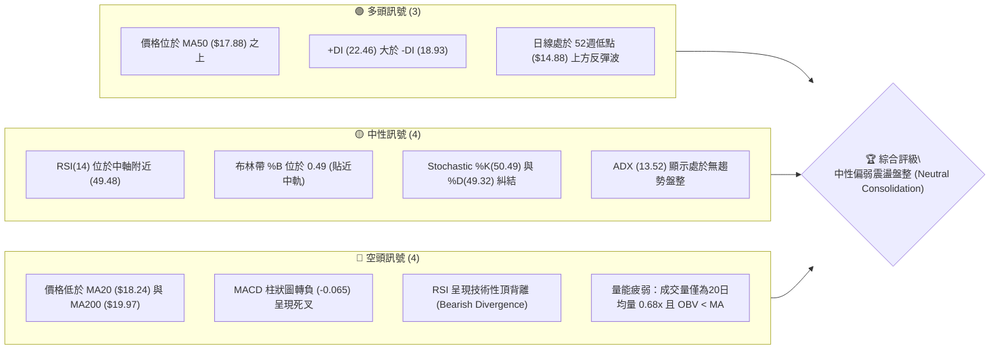
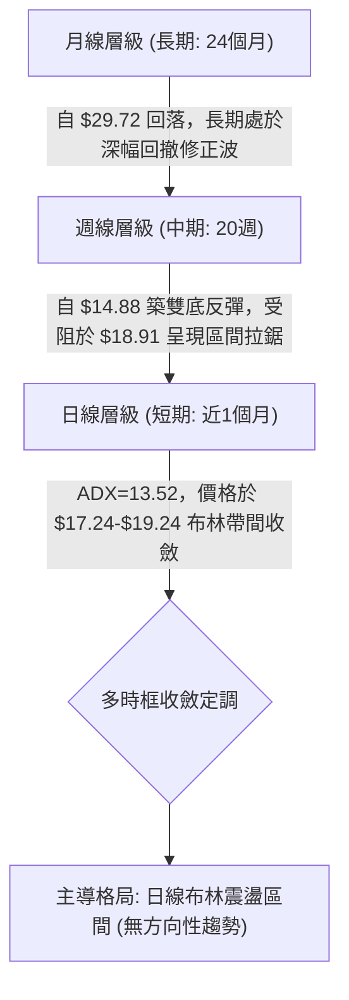
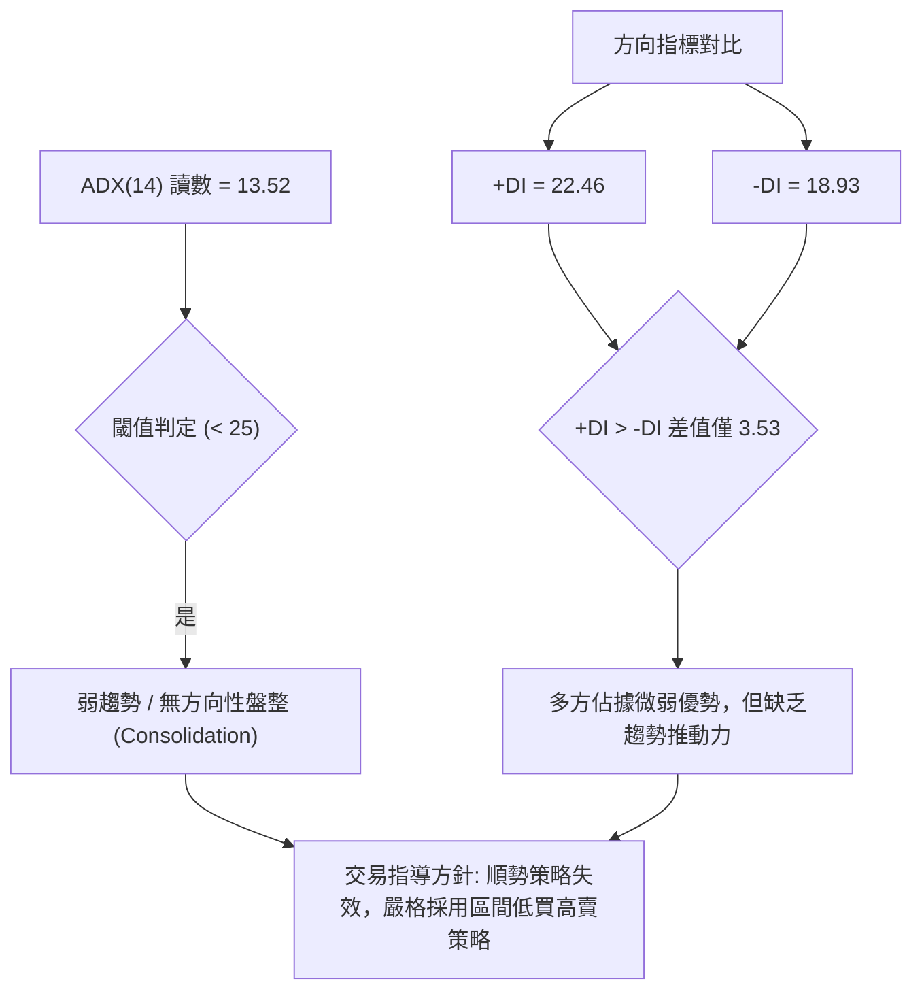
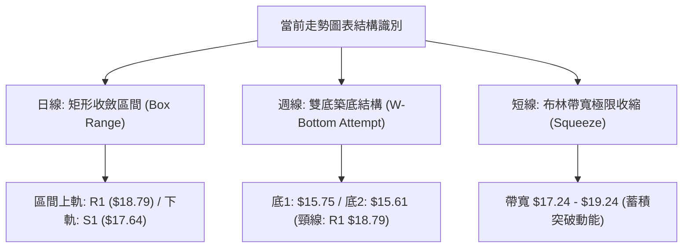
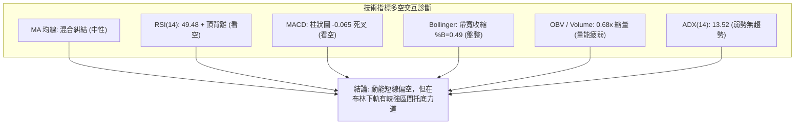
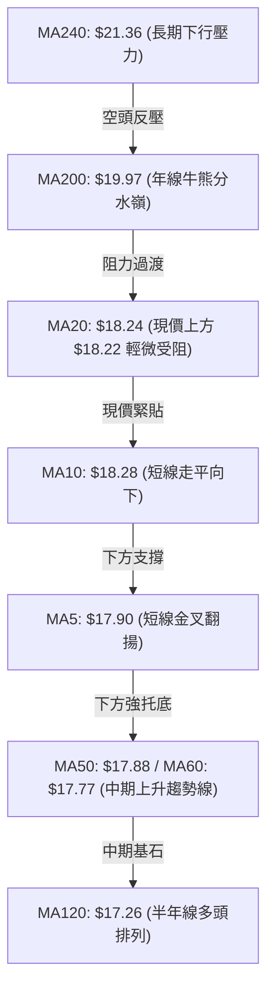
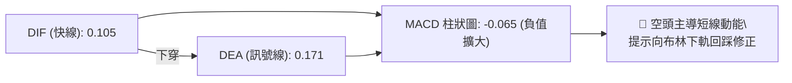
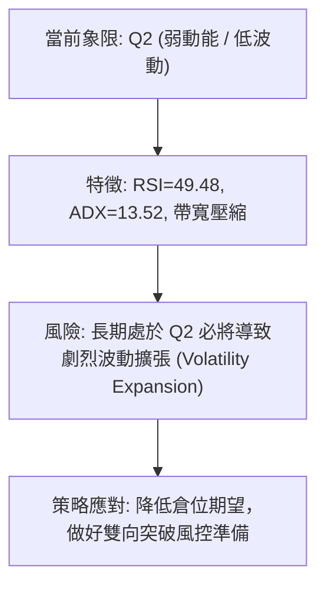
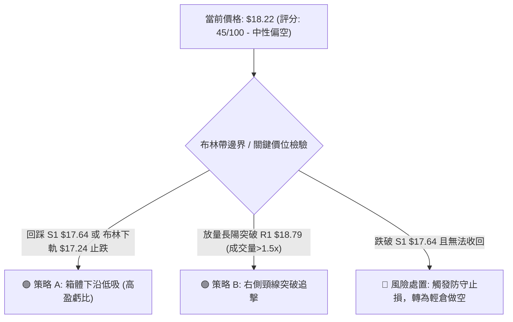
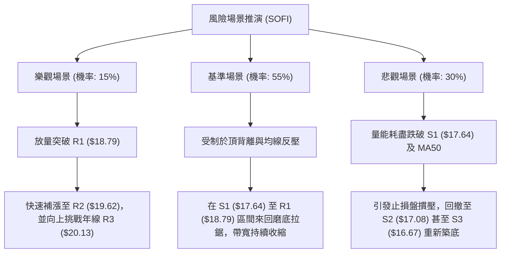

# SOFI 技術分析報告

> **報告日期**：2026-09-07 ｜ **語言**：繁體中文 ｜ **數據來源**：Yahoo Finance ｜ **當前價格**：$18.22

---

## 目錄

| 章節 | 內容 |
|------|------|
| [1. 技術面概覽](#1-技術面概覽) | 訊號儀表板、核心指標、評分卡 |
| [2. 趨勢分析](#2-趨勢分析) | 多時框趨勢、長中短期走勢、ADX趨勢強度 |
| [3. 圖表形態分析](#3-圖表形態分析) | 形態識別、K線組合、形態信心度與目標價 |
| [4. 支撐與阻力](#4-支撐與阻力) | 關鍵價位分布、波段聚類阻力/支撐、斐波那契回調 |
| [5. 技術指標深度解讀](#5-技術指標深度解讀) | 均線系統、RSI頂背離、MACD柱狀圖、布林通道收縮、OBV量能 |
| [6. 動能與波動率](#6-動能與波動率) | 動能四象限、ATR波動度與止損設定、高Beta特性解讀 |
| [7. 多時框架總結](#7-多時框架總結) | 時框架評分表、多時框收斂與盤整格局定調 |
| [8. 交易策略建議](#8-交易策略建議) | 決策路由、情境階梯、區間與突破主策略、風控對沖 |
| [9. 風險提示與監控](#9-風險提示與監控) | 關鍵監控Checklist、三表情境分析、倉位管理準則 |
| [📋 報告總結](#-報告總結) | 核心結論速查與最優策略組合 |

---

## 1. 技術面概覽

### 🎯 技術訊號儀表板



### 📊 核心指標速覽表

| 指標類別 | 指標名稱 | 當前數值 | 訊號 | 專業解讀 |
|----------|----------|----------|------|----------|
| **價格** | 當前收盤價 | $18.22 | 🟡 | 位於52週區間18.7%相對低位，處於收斂整理期 |
| **均線** | MA20 (短中) | $18.24 | 🔴 | 現價略低於MA20 (-0.11%)，短線面臨中軌壓制 |
| **均線** | MA50 (中期) | $17.88 | 🟢 | 現價高於MA50 (+1.90%)，中期下方具備緩衝均線支撐 |
| **均線** | MA200 (長期) | $19.97 | 🔴 | 現價顯著低於年線 (-8.76%)，長期空頭結構尚未扭轉 |
| **動能** | RSI(14) | 49.48 | 🔴 | 位於中性區間但標註「頂背離」，動能擴張受阻 |
| **動能** | MACD (12,26,9) | 0.105 / Sig 0.171 | 🔴 | DIF < DEA，Hist 為 -0.065，短線動能向下修正 |
| **趨勢** | ADX(14) | 13.52 | 🟡 | 遠低於 25，呈現典型「無趨勢區間盤整」格局 |
| **通道** | 布林通道帶寬 | $17.24 - $19.24 | 🟡 | %B 為 0.49，價格正處於中軌 ($18.24) 附近窄幅整理 |
| **成交量** | 20日成交量比 | 0.68x (28.92M) | 🔴 | 嚴重縮量，OBV 低於均線，買盤追價意願極度低迷 |
| **波動** | ATR(14) | $0.91 (4.98%) | 🟡 | 日內平均振幅達近5%，維持高彈性中小板金融股特徵 |

### 🏆 技術評分卡

```
╔══════════════════════════════════════════════════════════════════╗
║                   技術評分卡 — SOFI (2026-09-07)                 ║
╠══════════════════════════════════════════════════════════════════╣
║ 趨勢強度 (ADX/方向)   ███████░░░░░░░░░░░░░  35/100  🔴 無趨勢弱勢 ║
║ 動能指標 (RSI/MACD)   ████████░░░░░░░░░░░░  40/100  🔴 背離死叉   ║
║ 支撐穩定度 (S1-S3/均線)████████████░░░░░░░░  60/100  🟡 區間支撐在 ║
║ 成交量配合 (Volume/OBV)███████░░░░░░░░░░░░░  35/100  🔴 量價疲弱   ║
║ 形態完整度 (區間收斂) ███████████░░░░░░░░░  55/100  🟡 矩形整理中 ║
║ 均線系統 (排列狀態)   ████████░░░░░░░░░░░░  45/100  🟡 長空短平   ║
╠══════════════════════════════════════════════════════════════════╣
║ 綜合評分             █████████░░░░░░░░░░░  45/100  ⚖️ 區間震盪觀望║
╚══════════════════════════════════════════════════════════════════╝
```

---

## 2. 趨勢分析

### 🌐 多時框趨勢分析



### 📈 長期趨勢 — 12個月走勢圖（Unicode）

SOFI 於過去 12 個月（2025-09 至 2026-09）歷經了波瀾壯闊的登頂與深幅下挫，高點見於 2025 年 11 月的 $29.72，隨後在 2026 年初開啟長達 4 個月的下行通道，最終於 2026 年 3 至 5 月在 $14.88 - $15.88 區間探明底部。

```
SOFI 月線走勢圖（過去12個月：2025-09 至 2026-09）
價格軸 ($)
$30.00 ┤                     ● 29.72 (2025-11 歷史高點聚類)
$28.00 ┤               ● 29.68
$26.00 ┤ ● 26.42             ● 26.18
$24.00 ┤
$22.00 ┤                            ● 22.81
$20.00 ┤
$18.00 ┤                                   ● 17.76               ● 18.22 (2026-09 當前收盤)
$16.00 ┤                                          ● 15.88 ● 16.10       ● 16.31 
$14.00 ┤                                                 (2026-03)
       └─────────────────────────────────────────────────────────────
        25-09  25-10  25-11  25-12  26-01  26-02  26-03  26-04  26-05  26-06  26-07  26-08  26-09
```

#### 走勢特徵分析表格

| 階段區間 | 時間跨度 | 價格起迄 | 漲跌幅 | 結構特徵與技術解讀 |
|----------|----------|----------|--------|--------------------|
| **頂部構築** | 2025-09 ~ 2025-11 | $26.42 → $29.72 | +12.49% | 衝高見頂，多頭動能衰竭，於 $29.72 形成波段雙頂結構 |
| **主跌推動** | 2025-11 ~ 2026-03 | $29.72 → $15.88 | -46.57% | 空頭單邊順暢下跌，接連跌破 MA20、MA50 與 MA200，失守年線 |
| **低位夯實** | 2026-03 ~ 2026-05 | $15.88 → $15.61* | -1.70% | 於 52週低點 $14.88 之上構築底部防線（週收盤最低 $15.61） |
| **底部反彈** | 2026-05 ~ 2026-08 | $15.61 → $18.91* | +21.14% | 中期展開均線修復行情，但多次觸及 $18.79 - $18.91 均遭壓制 |
| **收斂橫盤** | 2026-08 ~ 2026-09 | $18.91 → $18.22 | -3.65% | 動能指標鈍化，進入狹幅布林通道壓縮整理期 |

*註：標註星號價格引自近20週收盤走勢關鍵節點數據。*

### 📊 中期趨勢（週線分析）

從近 20 週的週收盤數據觀察：
1. **支撐確立**：2026 年 5 月中旬在 $15.61 - $15.75 完成兩次回測不破，RSI 曾一度跌至 24.9 超賣區，隨後爆量（367M-490M 股）拉升，奠定波段結構底。
2. **反彈受阻**：近期反彈高點分別為 2026-07-12 的 $18.78 與 2026-08-23 的 $18.91。週線 MACD 柱狀圖由 2026-08-09 的 +0.181 連續 4 週滑落至最新的 -0.065，宣告週線級別的反彈推升力道已經衰竭，中期轉為箱型震盪。

```
近期週線壓力與支撐示意圖
$19.62 ────────────────────── [R2 壓力位 / 區間突破邊界]
$18.79 ──┬─── ● 18.78 ─── ● 18.91 ─── [R1 阻力位 / 週線雙頂壓力線]
         │      
$18.22 ──┼────────────────────── [現價: 震盪中樞 / MA20 $18.24]
         │      
$17.64 ──┴─── ● 17.28 ───────────── [S1 支撐位 / 前波整理平台]
$16.43 ────────────────────── [週線次級防線 / S3 $16.67 聚類]
```

### ⚡ 趨勢強度評估（ADX 解讀）



| ADX 區間 | 趨勢狀態 | SOFI 當前狀態 | 交易策略指導 |
|----------|----------|---------------|--------------|
| **0 - 20** | **極弱趨勢 / 橫向盤整** | **✓ (13.52)** | **禁止趨勢突破追單，僅可於通道邊界做網格或區間交易** |
| 20 - 25 | 趨勢孕育期 | - | 觀察成交量異動，等待布林帶開口發散 |
| 25 - 40 | 強趨勢確立 | - | 採用均線跟蹤與順勢突破策略 |
| > 40 | 極強 / 動能過熱 | - | 留意頂/底背離反轉風險 |

---

## 3. 圖表形態分析

### 🔍 形態識別系統



#### 形態信心度評估表

| 識別形態 | 信心度 | 判斷依據（嚴格引用數據） | 完成度 | 形態目標價（推算公式與數值） |
|----------|--------|--------------------------|--------|------------------------------|
| **矩形收斂箱型** | **85%** | 價格受限於 R1 ($18.79) 與 S1 ($17.64) 間，ADX=13.52 確認橫盤 | 90% | 向上破位目標：$18.79 + ($18.79 - $17.64) = **$19.94**（貼近年線）<br>向下破位目標：$17.64 - ($18.79 - $17.64) = **$16.49** |
| **中期雙重底 (W底)** | **60%** | 兩次週收盤低點為 2026-05-10 ($15.75) 與 2026-05-17 ($15.61)，均未破 52W低點 $14.88；頸線聚類於 R1 ($18.79) | 70% | 若有效突破頸線 R1 ($18.79)：<br>形態高度 = $18.79 - $15.61 = $3.18<br>度量目標價 = $18.79 + $3.18 = **$21.97**（挑戰 MA240 $21.36） |
| **布林壓縮擠壓 (Squeeze)** | **75%** | 上軌 $19.24 與下軌 $17.24 差距僅 $2.00，成交量縮至 0.68x 均量 | 85% | 待方向確認：上破測 R2 ($19.62)，下破測 S2 ($17.08) |

### 🕯️ 重要K線形態分析

| 週/月區間 | 關鍵收盤價 | 走勢特徵與 K 線結構 | 專業技術解讀 | 多空訊號 |
|-----------|------------|---------------------|--------------|----------|
| **2026-05-17** | $15.61 | 低檔長下影十字星 / 雙底次低 | 空方動能耗盡，RSI 創 24.9 極端超賣後收出止跌星線 | 🟢 強烈止跌 |
| **2026-05-31** | $18.22 | 實體大陽線 (+16.6%) | 成交量擴大至 367M，多頭放量反撲，突破下降均線反壓 | 🟢 多頭推升 |
| **2026-07-12** | $18.78 | 上影流星線 (Shooting Star) | 衝擊 R1 ($18.79) 未果回落，留下長上影線，多頭獲利了結 | 🔴 衝高受阻 |
| **2026-08-23** | $18.91 | 高位停滯陀螺頂 (Spinning Top) | 再次挑戰阻力失敗，呈現頂背離徵兆，買盤力道衰退 | 🔴 滯漲見頂 |
| **2026-09-06** | $18.22 | 窄幅無方向小實體紡錘線 | 實體極窄，成交量降至 191M 低點，市場進入觀望僵局 | 🟡 變盤前兆 |

### 📉 ASCII 走勢形態示意圖

```
SOFI 週線 W 底與箱型整理結構示意圖
價格 ($)
$20.13 ┤────────────────────────────────────────── [R3 長期強壓]
$19.62 ┤─────────────────────────────────── [R2 突破觀察位]
$18.79 ┤             [頸線壓力] ╭─● 18.78───────● 18.91 
       │                       │               │
$18.22 ┤───● 18.22 ────────────┼───────────────┼───● 18.22 [現價平衡點]
       │                       │               │
$17.64 ┤                       ╰─────● 17.28───╯   [S1 箱體下沿]
$16.43 ┤           ● 16.43
$15.61 ┤     ● 15.75 ─── ● 15.61 [W底形成]
       └─────────────────────────────────────────────────────
        05-03 05-10  05-17 05-31 06-28 07-12 08-02 08-23 09-06 (週)
```

---

## 4. 支撐與阻力

### 🗺️ 關鍵價位分布圖（Unicode）

```
SOFI 價位結構分布圖 (由實際 OHLCV 與歷史波段計算)
═══════════════════════════════════════════════════════════════
$20.13 ║████████████████████████████████║ 強阻力 R3 (+10.48%) — 年線上方密集套牢區
$19.62 ║████████████████████            ║ 阻力 R2 (+7.67%)  — 前期震盪高點平台
$18.79 ║████████████████████████████    ║ 關鍵阻力 R1 (+3.10%) — 波段高點雙頂壓力頸線
───────╫────────────────────────────────╫───────────────────────────────────
$18.24 ╟┈┈┈┈┈┈┈┈┈┈┈┈┈┈┈┈┈┈┈┈┈┈┈┈┈┈┈┈┈┈┈┈╢ ◄ 布林中軌 (MA20)
$18.22 ╠════════════════════════════════╣ ◄ 現價 (Current Price $18.22)
$17.88 ╟┈┈┈┈┈┈┈┈┈┈┈┈┈┈┈┈┈┈┈┈┈┈┈┈┈┈┈┈┈┈┈┈╢ ◄ 中期均線 (MA50)
───────╫────────────────────────────────╫───────────────────────────────────
$17.64 ║▓▓▓▓▓▓▓▓▓▓▓▓▓▓▓▓▓▓▓▓            ║ 近期支撐 S1 (-3.18%) — 箱體整理下沿
$17.08 ║████████████████████████        ║ 強支撐 S2 (-6.26%) — 7月回調低點聚合處
$16.67 ║████████████████████████████████║ 核心強支撐 S3 (-8.53%) — 次級波段防守底線
═══════════════════════════════════════════════════════════════
```

### 🚧 阻力位分析表

| 阻力級別 | 價位 | 距現價幅動 | 形成原因與籌碼特徵 | 突破難度 | 技術重要性 |
|----------|------|------------|--------------------|----------|------------|
| **R1** | **$18.79** | +3.10% | 近期多次衝高（$18.78、$18.91）受挫處，頸線套牢密集 | 🟡 中等 | ★★★★☆<br>短線多空分水嶺 |
| **R2** | **$19.62** | +7.67% | 2026年首季下跌途中的反彈阻力位，對應 MA200 緩衝帶 | 🔴 偏高 | ★★★☆☆<br>中期反彈延伸標的 |
| **R3** | **$20.13** | +10.48% | 波段歷史高點聚類，與 MA200 ($19.97) 形成雙重強壓共振 | 🔴 極高 | ★★★★★<br>牛熊轉換分界線 |

### 🛡️ 支撐位分析表

| 支撐級別 | 價位 | 距現價幅動 | 形成原因與籌碼特徵 | 守住機率 | 技術重要性 |
|----------|------|------------|--------------------|----------|------------|
| **S1** | **$17.64** | -3.18% | 近期波段低點聚類，貼近 MA60 ($17.77) 與 MA50 ($17.88) | 🟢 70% | ★★★★☆<br>短線防守第一道關卡 |
| **S2** | **$17.08** | -6.26% | 2026-07 波段回調低點平台，貼近布林下軌 ($17.24) | 🟢 80% | ★★★★☆<br>箱型震盪絕對下沿 |
| **S3** | **$16.67** | -8.53% | 5-6月築底反彈後的跳空支撐位，機構資金中期建倉成本區 | 🟢 90% | ★★★★★<br>波段多頭生命線 |

### 📐 斐波那契回調位分析

依據 52 週波動極限區間（最高點 **$32.73** 至 最低點 **$14.88**），總波動價差為 **$17.85**。各關鍵回調價位如下：

```
斐波那契黃金分割尺規（52W 區間：$14.88 → $32.73）
0.0%  (52W High)  ──────────────────────────── $32.73
23.6%             ──────────────────────────── $28.52
38.2%             ──────────────────────────── $25.91
50.0%             ──────────────────────────── $23.80
61.8% (黃金分割)  ──────────────────────────── $21.70
78.6% (深度回撤)  ──────────────────────────── $18.70 ──┐ [關鍵壓制帶]
                                                         ├ ◄ 現價: $18.22
100.0% (52W Low)  ──────────────────────────── $14.88 ──┘
```

#### 斐波那契價位解讀
- **現價所處位置**：SOFI 當前價格 **$18.22** 正好被夾在 **78.6% 回調位 ($18.70)** 與 **100.0% 極值低點 ($14.88)** 之間。
- **技術意義**：
  1. **78.6% ($18.70)** 是空頭反撲的典型防守阻力位。當前阻力 R1 ($18.79) 與斐波那契 78.6% 水平 ($18.70) 形成高度共振（相差僅 $0.09），解釋了為何近兩個月多頭三次衝擊 $18.70 - $18.79 均無功而返。
  2. 價格未跌破 100.0% ($14.88) 且在 78.6% 附近反覆築底，顯示中長期深度洗盤已達極限，具備大週期均值回歸潛能。

---

## 5. 技術指標深度解讀

### 🎛️ 指標訊號總覽



### 📈 移動平均線排列分析



#### 均線系統走勢深度解讀

| 均線名稱 | 當前價格 | 距現價幅動 | 歷史軌跡特徵 | 排列狀態與趨勢評估 |
|----------|----------|------------|--------------|--------------------|
| **MA 5** | $17.90 | -1.79% | ▂▂▁▁▂▄▅▇▇▆▆▇███▆ | 短線自低點反彈，小幅走高，對現價形成即時支撐 |
| **MA 10** | $18.28 | +0.33% | ▃▂▁▁▂▃▄▆▇█▇████ | 短線壓制線，現價尚未實體站上 |
| **MA 20** | $18.24 | +0.11% | ▄▃▂▁▁▁▁▂▃▄▅▇███ | 走勢持平，代表近 1 個月主力持倉成本在 $18.24 |
| **MA 50** | $17.88 | -1.90% | ▁▁▁▂▂▃▃▄▄▅▆▇▇███ | **穩步向上翻揚**，提供中期底部強烈支撐 |
| **MA 60** | $17.77 | -2.51% | ▁▁▁▂▂▃▃▄▄▅▆▇▇███ | 季線呈現多頭排列，斜率維持向上 |
| **MA 120** | $17.26 | -5.54% | █▇▆▅▄▃▂▁▁▁▁▁▁▁▁ | 半年線已在低檔走平並轉折微升，下檔買盤厚實 |
| **MA 200** | $19.97 | +8.76% | - | 年線依然保持下行慣性，構成中長線天花板 |
| **MA 240** | $21.36 | +14.72%| ███▇▇▆▅▄▃▂▁▁▁ | 長線空頭未扭轉，限制了估值修復上限 |

- **排列診斷**：短期呈 **混合排列（Mixed Alignment）**。MA5 > MA50 > MA120 展現出底部中短期均線多頭修復的姿態；但 MA20 與 MA10 在上方形成短期均線夾層，更上方則被 MA200/MA240 牢牢壓制。這意味著目前屬於典型「底部反彈後的均線修復盤整」，非單邊爆發期。

### 📉 RSI(14) 分析

#### RSI 數值儀表
```
超賣 (0-30)           中性平衝區 (30-70)             超買 (70-100)
├───────────────┼───────────────────────────────┼───────────────┤
                [      ● (49.48)                ]
0              30              50              70             100
進度條: █████████░░░░░░░░░░░ (49.48%) — 處於多空平衡軸心
```

#### 背離深度判斷
- **背離形態**：⚠️ **日線/週線級別頂背離 (Bearish Divergence)**。
- **判斷細節**：
  - 在 2026-07-12，SOFI 價格收於 **$18.78**，週線 RSI 為 **58.4**。
  - 在 2026-08-23，價格創出反彈新高 **$18.91**，但週線 RSI 卻下滑至 **57.9**；隨後在 2026-09-06，價格維持在 $18.22，RSI 進一步滑落至 **49.48**。
  - 價格高點向上推升，指標高點反向走低，形成典型動能衰竭型頂背離。這解釋了近兩週價格無法攻克 R1 ($18.79) 的技術動因，提示短線仍有向下消化背離壓力的需求。

### 📊 MACD (12,26,9) 訊號解讀



- **狀態解析**：DIF 線自高位拐頭向下穿過 DEA 訊號線，柱狀圖在連續數週收斂後正式翻負至 **-0.065**。
- **背離確認**：週線 MACD 柱狀圖自 8 月高點 **+0.181** 快速萎縮並於最新一週轉為負值，確認短線多頭推動力道全面衰退，空方掌控日線節奏。

### 📦 布林通道分析

```
SOFI 布林通道結構示意圖 (帶寬: $17.24 - $19.24)
價格 ($)
$19.24 ┬────────────────────────────────────────── 布林上軌 (Upper Band)
       │                    ╭───╮ (上軌壓制)
$18.79 ┼────────────────────╯   ╰─────────────── 阻力位 R1
$18.24 ┼┈┈┈┈┈┈┈┈┈┈┈┈┈┈┈┈┈┈┈┈● 現價 $18.22 ┈┈┈┈┈┈ 布林中軌 (MA20) [%B = 0.49]
$17.64 ┼────────────────────────╯   ╰─────────── 支撐位 S1
       │                   ╰─────╯ (下軌支撐)
$17.24 ┴────────────────────────────────────────── 布林下軌 (Lower Band)
```

- **帶寬收縮特徵**：布林帶上下軌間距僅 **$2.00**（約 10.9% 空間），處於近 6 個月以來的帶寬低分位，表明波動率已經被大幅壓縮。
- **%B 位置解讀**：當前 %B 為 **0.49**，幾近完全貼合中軌 ($18.24)。歷史經驗顯示，當布林帶寬極致壓縮且 %B 在 0.5 附近震盪時，往往預示著在未來 2-3 週內將迎來一次帶量的大級別方向性突破（破位擴軌）。

### 💹 成交量分析（量價配合度）

- **量比與均量比對**：
  - 最新交易日成交量：**28,920,700 股**
  - 20日均量：**42,462,450 股**（量比僅為 **0.68x**，顯著量縮）
  - 50日均量：**65,848,698 股**（量比僅為 **0.44x**）
- **OBV 能量潮趨勢**：數據明確標註 `OBV < MA`，能量潮線持續運行於均線下方。
- **量價背離診斷**：
  - 5 月底從 $15.62 暴拉至 $18.22 時，週成交量曾高達 367M 股；然而 8 月底再度推升至 $18.91 時，週成交量驟降至 253M 股，最新一週更萎縮至 191M 股。
  - 「**價漲量縮，高位滯漲**」是典型的量價頂背離特徵，顯示無機構新增資金進場追價，現階段反彈多為空頭回補所推動。

---

## 6. 動能與波動率

### ⚡ 動能評估四象限

| 象限 | 動能維度 (Momentum) | 波動維度 (Volatility) | 代表市場狀態 | SOFI 當前落點與評估 |
|------|---------------------|-----------------------|--------------|---------------------|
| **Q1 (最佳擴張)** | 強 (RSI>60, MACD擴張) | 低 (ATR收斂, 擠壓) | 低波動爆發前夕 | - |
| **Q2 (震盪沉寂)** | **弱 (RSI≈50, MACD翻負)** | **低 (布林收窄, ADX=13.5)**| **狹幅整理/觀望** | **✓ (當前所處象限：Q2)**<br>動能停滯，通道壓縮，資金離場觀望 |
| **Q3 (極限單邊)** | 強 (ADX>30, 趨勢加速) | 高 (ATR放量擴張) | 主升/主跌浪 | - |
| **Q4 (非理性混亂)**| 弱 (指標打架背離) | 高 (長影線, 巨震洗盤) | 頂部/底部劇烈洗盤 | - |



### 📊 ATR 波動率分析

- **ATR(14) 絕對數值**：**$0.91**。
- **價格相對佔比**：佔現價比率為 **4.98%**。
- **日內交易與止損距離解讀**：
  - 每日正常市場噪音波動幅度即達近 $1.00，這要求投資人不得設置過窄的止損。
  - **合理風控緩衝設計**：
    - 激進型策略（1.0 × ATR）：止損距離為 **$0.91**。
    - 穩健型策略（1.5 × ATR）：止損距離為 **$1.37**。
    - 結構型波段防守點必須放置在重要支撐 S1 ($17.64) 下方至少 0.5 × ATR，即 $17.64 - $0.46 = **$17.18**（緊貼 S2 $17.08）。

### 📐 Beta 與市場相關性

- **Beta 係數**：**2.208**（極高 Beta 屬性）。
- **市場敏感度分析**：
  1. SOFI 的波動幅度是大盤（標普500 / 納斯達克）的 **2.2 倍以上**，具有高槓桿化影子特徵。
  2. 在大盤進行技術性回調時，SOFI 面臨雙倍回撤壓力；但在市場風險偏好（Risk-on）回升時，彈性亦位列金融科技板塊前茅。
  3. 高 Beta 配合當前 0.68x 的低成交量，說明散戶與機構在年線下方的博弈極其謹慎，一旦大盤出現單邊波動，SOFI 易出現跳空缺口。

---

## 7. 多時框架總結

### 📋 時框架評分表

| 時框架 | 趨勢方向 | 動能指標狀態 | 均線排列特徵 | 圖表形態識別 | 綜合評分 | 交易指導方針 |
|--------|----------|--------------|--------------|--------------|----------|--------------|
| **月線 (長期)** | 🔴 空頭修復 | 弱勢反彈，受壓於 78.6% 回調位 | 價格深處 MA240 ($21.36) 下方 | 自 $29.72 回落的大型下行通道 | **35/100** | 長期未扭轉，逢高減磅 |
| **週線 (中期)** | 🟡 震盪築底 | MACD 柱翻負 (-0.065)，RSI 頂背離 | 站上 MA50，但受阻於下行 MA200 | 潛在雙重底，受制於 R1 頸線 | **50/100** | 區間震盪，以頸線為分界 |
| **日線 (短期)** | 🟡 橫向盤整 | RSI 49.48 中性，ADX 13.52 極弱 | MA20 走平，MA5-MA60 黏合糾結 | 矩形收斂箱體 ($17.64 - $18.79) | **48/100** | 通道高拋低吸，嚴禁追單 |

### 🔲 綜合訊號矩陣

```
訊號維度       長期 (月線)       中期 (週線)       短期 (日線)       多時框共振性
─────────────────────────────────────────────────────────────────────────────
趨勢趨向          🔴 空頭           🟡 中性           🟡 中性          中低 (分歧)
動能強弱          🔴 弱勢           🔴 衰竭 (背離)    🟡 平衡          偏空共振
支撐阻力          🟡 斐波支撐       🟢 S1/S2穩固      🟢 均線糾結托底  中性偏多
成交量能          🔴 縮量           🔴 週量萎縮       🔴 0.68x 均量    強烈空頭確認
─────────────────────────────────────────────────────────────────────────────
多時框最終評分:  █████████░░░░░░░░░░░  45/100  (震盪拉鋸 / 偏空防守)
```

### ⚖️ 多時框收斂結論

> **依據「嚴格要求 14」收斂規則執行判定**：
> 1. **行情性質判定**：當前 ADX(14) 為 **13.52**，顯著小於 25 臨界線，技術架構被**嚴格定義為「盤整行情（Consolidation Regime）」**。
> 2. **主導時框與權重**：趨勢跟蹤指標在此環境下全面失效。主導交易邏輯必須**收斂至日線布林通道（$17.24 - $19.24）及日線關鍵支撐阻力（S1 $17.64 / R1 $18.79）**。
> 3. **唯一方向性結論**：**【中性觀望，區間震盪操作，嚴防頂背離引發的回踩測試】**。在日線未放量突破 R1 ($18.79) 或跌破 S1 ($17.64) 之前，禁止進行任何順勢趨勢押注。

---

## 8. 交易策略建議

### 🗺️ 策略決策流程圖



### 🧭 策略路由

> **當前主策略方向 = 【中性區間交易（Range-Bound Trading），偏向回調低吸，等待突破確認】（依技術綜合評分：45/100）**
> 
> *路由說明：由於總體技術評分落在 40–60 區間，禁止單邊下注多或空。主推圍繞 S1/R1 的區間擺動策略，以布林下軌支撐為進場防線，並列出突破追隨策略與空頭對沖預警。*

### 🎯 價格情境階梯（Price Scenarios）

價位嚴格引用技術數據波段聚類計算值：

| 觸發條件 | 第一目標 (T1) | 第二目標 (T2) | 延伸目標 (T3) | 技術情境含義 |
|----------|---------------|---------------|---------------|--------------|
| **放量站上 R1 ($18.79)** | **R2 ($19.62)** | **R3 ($20.13)** | **$21.70** (Fib 61.8%) | 突破雙頂阻力，挑戰年線 ($19.97) 與牛熊分水嶺 |
| **維持於現價震盪** | $18.24 (MA20) | $17.88 (MA50) | $18.79 (R1) | 在中軌上下窄幅洗盤，指標等待布林發散 |
| **有效跌破 S1 ($17.64)** | **S2 ($17.08)** | **S3 ($16.67)** | **$14.88** (52W 低點) | 箱體破位，回踩測試 7 月波段平台與極值底部 |

### 📊 情境機率分佈

| 運行情境 | 發生機率 | 主要技術依據 |
|----------|----------|--------------|
| **維持區間震盪** | **55%** | ADX=13.52 極弱，布林帶寬極限收縮，成交量僅 0.68x，多空均無力打破平衡 |
| **回落探底 (回測支撐)** | **30%** | RSI 出現頂背離，MACD 柱狀圖翻負 (-0.065)，OBV 疲軟低於均線 |
| **向上突破上行** | **15%** | 均線長空壓制 (MA200 $19.97)，且追價買盤匱乏，直接向上突破阻力巨大 |

### 🟢 主策略詳情

#### 策略 A（主推薦）：箱體下沿支撐位低吸策略（左側防守型）
- **策略邏輯**：利用 ADX 低位特徵，在價格回踩箱體下沿及布林下軌時分批低吸，博弈均值回歸。
- **進場條件**：價格回調至 **$17.64 (S1)** 至 **$17.88 (MA50)** 區間，日線收出止跌下影線，且成交量縮小。
- **進場價格**：**$17.68**（S1 上方 0.04 緩衝點）。
- **目標價 T1**：**$18.24**（布林中軌 / MA20，獲利 +3.17%）。
- **目標價 T2**：**$18.79**（關鍵阻力位 R1，獲利 +6.28%）。
- **止損價格**：**$17.05**（精確設置於強支撐 S2 $17.08 與布林下軌 $17.24 下方）。
- **風險報酬比**：
  - 至 T2 獲利空間 = $18.79 - $17.68 = $1.11
  - 承擔風險空間 = $17.68 - $17.05 = $0.63
  - **風報比 = 1.76 : 1**（若至 T1 則先平倉半數鎖定利潤）。
- **成功機率**：65%（基於區間支撐穩定度）。
- **建議倉位**：總資金之 **10% - 15%**。

#### 策略 B（次推薦）：右側放量突破追隨策略（右側動能型）
- **策略邏輯**：等待多頭放量徹底粉碎 R1 處的頂背離與套牢盤，確認 W 底形態完成。
- **進場條件**：日線收盤價實體**突破 R1 ($18.79)**，且當日成交量放大至 20日均量之 **1.5 倍以上**（>63M 股）。
- **進場價格**：**$18.85**（突破確認點）。
- **目標價 T1**：**$19.62**（阻力位 R2，獲利 +4.08%）。
- **目標價 T2**：**$20.13**（強阻力位 R3 / 年線區，獲利 +6.79%）。
- **止損價格**：**$18.20**（跌回 MA20 與假突破頸線下方）。
- **風險報酬比**：
  - 至 T2 獲利空間 = $20.13 - $18.85 = $1.28
  - 承擔風險空間 = $18.85 - $18.20 = $0.65
  - **風報比 = 1.97 : 1**。
- **成功機率**：50%（突破行情受制於年線反壓）。
- **建議倉位**：總資金之 **10%**（輕倉試單）。

### 🔴 反向風險觸發點（對沖與止損提示）

若出現以下訊號，說明多頭防線全面瓦解，所有多單必須無條件止損，激進交易者可轉向建立空頭避險倉位：
1. **破位確認**：日線實體跌破 **S1 ($17.64)**，且帶量擊穿布林下軌 **$17.24**。
2. **空頭目標**：一旦破位，價格將迅速尋求 **S2 ($17.08)** 與 **S3 ($16.67)** 支撐；若跌破 S3，將觸發二次探底測試 52週低點 **$14.88**。
3. **空頭對沖點位**：若跌破 $17.64，可在反抽 $17.64 受阻時做空，止損置於 $18.24 (MA20)，下看 $16.67。

### ⭐ 整體訊號強度評星

```
╔══════════════════════════════════════════════════╗
║ 做多訊號強度：★★☆☆☆  (2.5/5 星 — 僅限區間下軌)  ║
║ 做空訊號強度：★★★☆☆  (3.0/5 星 — 短線背離施壓)  ║
║ 整體可信度：  ★★★☆☆  (3.5/5 星 — 指標陷入收斂)  ║
╚══════════════════════════════════════════════════╝
```

---

## 9. 風險提示與監控

### ✅ 關鍵監控指標 Checklist

```
╔══════════════════════════════════════════════════════════════════╗
║                   SOFI 每日操盤監控 CHECKLIST                    ║
╠══════════════════════════════════════════════════════════════════╣
║ [ ] 價格是否跌破 MA50 ($17.88) 或 S1 ($17.64)？                 ║
║     └─ 是：提示日線震盪下沿失守，暫停任何低吸操作。            ║
║ [ ] RSI(14) 能否重新站回 55 消除頂背離隱患？                     ║
║     └─ 否：動能仍被空方壓制，提防陰跌。                        ║
║ [ ] 成交量是否超過 42,462,450 股 (20日均量)？                   ║
║     └─ 否：無量上攻皆為誘多，不參與任何盤中追高。              ║
║ [ ] 布林帶帶寬是否開始向外擴張 (上下軌脫離 $17.24-$19.24)？      ║
║     └─ 是：變盤信號成立，準備順應擴軌方向執行單邊策略。        ║
║ [ ] MACD 柱狀圖負值是否持續放大 (小於 -0.065)？                 ║
║     └─ 是：短線空頭推動波尚未走完，耐心等待柱狀體收斂。        ║
╚══════════════════════════════════════════════════════════════════╝
```

### ⚠️ 風險場景分析



### 🛡️ 風險管理重要提醒

1. **極高波動性風控（高 Beta 2.21）**：
   - 由於 SOFI 具備大盤 2.2 倍的波動慣性，個股每日 ATR 達 **$0.91**。在進行頭寸規模（Position Sizing）計算時，**單筆交易承擔的最大虧損嚴格限制在總資產的 1.0% 以內**。
   - 計算公式：`倉位股數 = (總資金 × 1.0%) ÷ (進場價 - 止損價)`。
   - 以 $17.68 進場、$17.05 止損為例，單股風險為 $0.63，10 萬美元賬戶最大虧損額為 $1,000，則最高買入上限為 `1000 / 0.63 ≈ 1,587 股`（約 2.8 萬美元，佔比 28% 以內，保守建議配置 10-15%）。
2. **多空訊號矛盾期的紀律**：
   - 當前處於短期均線托底、長期均線壓制、量能縮減、動能背離的**極度矛盾期**。在此種環境下，**「不做錯」遠比「做對」重要**。
   - 嚴格遵守「不破 S1 不盲目斬倉，不破 R1 絕不重倉追多」的震盪市紀律。

---

## 📋 報告總結

```
╔══════════════════════════════════════════════════════════════════╗
║                   SOFI 技術分析報告總結                          ║
╠══════════════════════════════════════════════════════════════════╣
║ 報告日期：2026-09-07                                             ║
║ 當前價格：$18.22                                                 ║
║ 技術評級：⚖️ 中性觀望 (45/100) — 區間整理，等待方向突破          ║
║                                                                  ║
║ 核心趨勢結論：                                                   ║
║ ├─ 長期趨勢 (月線)：🔴 空頭掌控，受限於年線 ($19.97) 及回撤 78.6%║
║ ├─ 中期趨勢 (週線)：🟡 構築雙底，但受阻於 $18.91，動能柱狀圖翻負║
║ ├─ 短期趨勢 (日線)：🟡 狹幅箱型震盪，ADX=13.52 顯示無單邊方向   ║
║ ├─ 關鍵支撐架構：S1: $17.64 ｜ S2: $17.08 ｜ S3: $16.67          ║
║ ├─ 關鍵阻力架構：R1: $18.79 ｜ R2: $19.62 ｜ R3: $20.13          ║
║ └─ 華爾街目標：均價 $20.26 (高 $30.00 / 低 $12.00)               ║
║                                                                  ║
║ 最優策略組合建議：                                               ║
║ 1. 🥇 最佳機會 (區間低吸)：耐心等待回測 S1 ($17.64) 附近低吸，   ║
║    止損嚴設 $17.05，目標直指 $18.24 / $18.79。                   ║
║ 2. 🥈 次選機會 (右側突破)：若以大成交量實體陽線站穩 R1 ($18.79)，║
║    順勢輕倉追擊，看至 $19.62 與年線 $20.13。                    ║
║ 3. 🥉 保守選擇 (空倉觀望)：鑑於頂背離與極低成交量 (0.68x)，離場 ║
║    觀望，等待布林通道開口發散、方向明朗後再行介入。              ║
╚══════════════════════════════════════════════════════════════════╝
```

---

> ⚠️ **免責聲明**：本報告為技術分析研究成果，所有引用的支撐位、阻力位、指標參數均基於既有市場量價數據計算推演。本報告**僅供學術研究與投資決策參考**，**不構成任何要約、招攬或具體投資建議**。美股金融科技標的具備高 Beta 波動風險，交易者應獨立評估財務狀況並嚴格執行風控紀律。

---
*報告生成時間：2026-09-07 ｜ 數據來源：Yahoo Finance ｜ 分析框架：多時框技術分析模型*