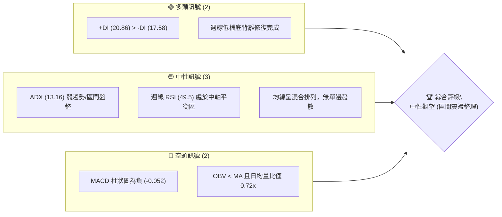
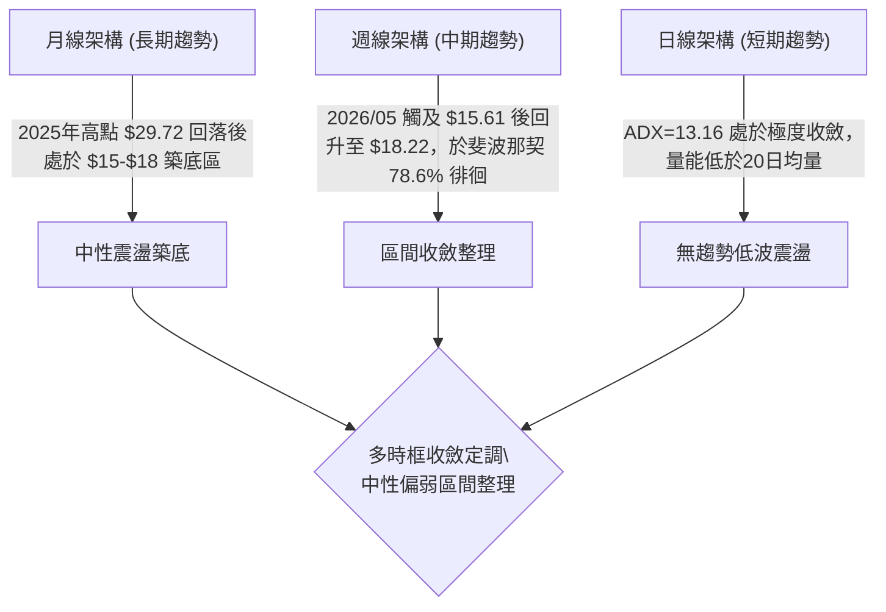
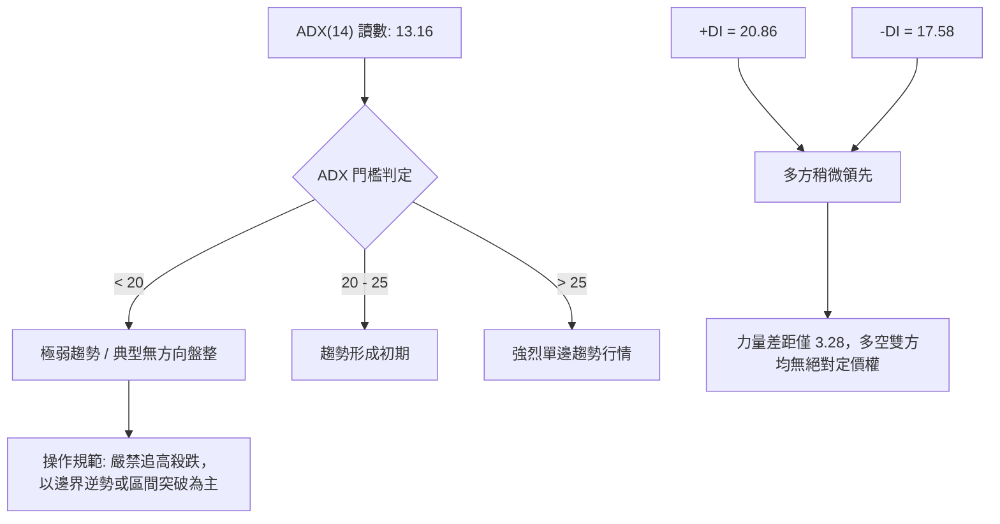
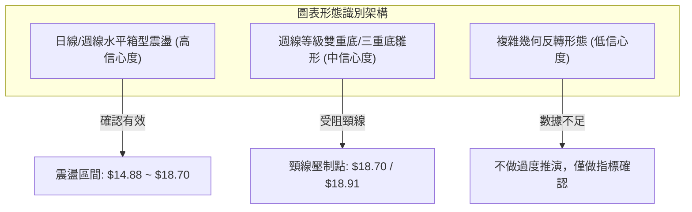
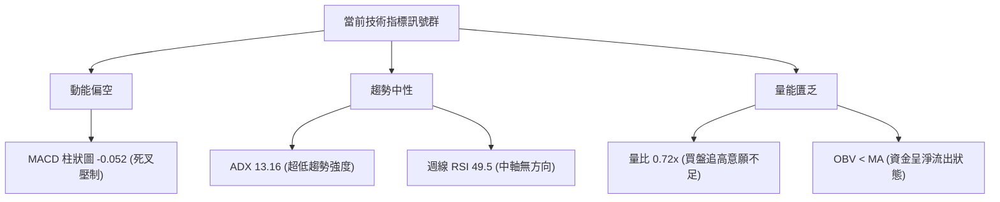
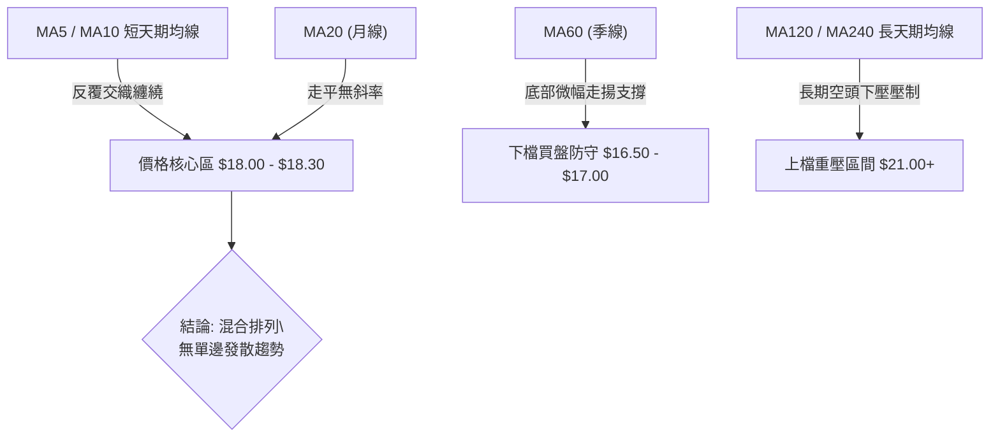
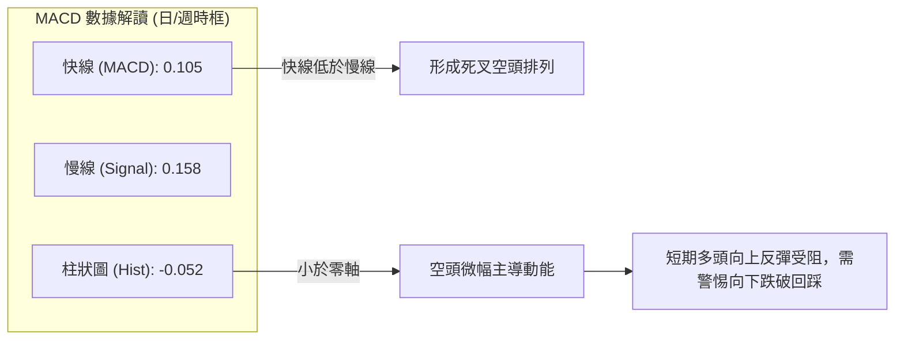
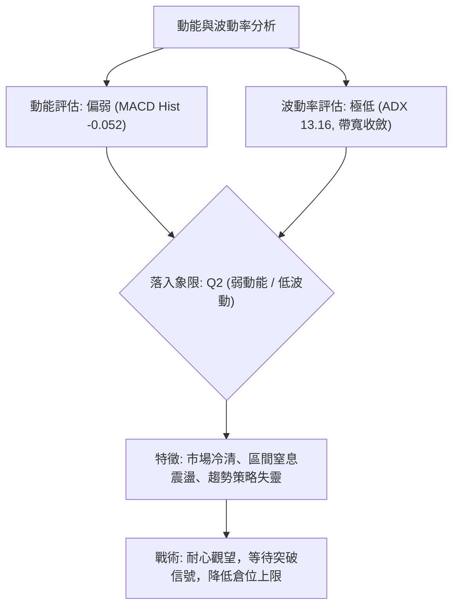
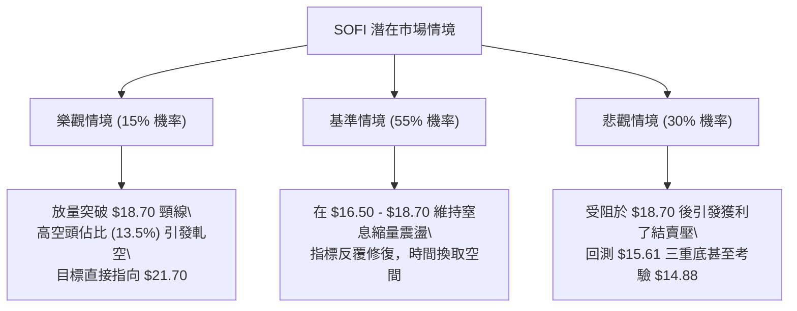

# SOFI 技術分析報告

> **報告日期**：2026-09-09 ｜ **語言**：繁體中文 ｜ **數據來源**：Yahoo Finance ｜ **當前基準價格**：$18.22（最新收盤價基準）

---

## 目錄

| 章節 | 內容 |
|------|------|
| [1. 技術面概覽](#1-技術面概覽) | 訊號儀表板、核心指標、評分卡 |
| [2. 趨勢分析](#2-趨勢分析) | 多時框趨勢、長中短期走勢 |
| [3. 圖表形態分析](#3-圖表形態分析) | 形態識別、K線組合、目標價 |
| [4. 支撐與阻力](#4-支撐與阻力) | 關鍵價位、斐波那契回調 |
| [5. 技術指標深度解讀](#5-技術指標深度解讀) | MA/RSI/MACD/布林/成交量 |
| [6. 動能與波動率](#6-動能與波動率) | 動能評估、ATR、Beta |
| [7. 多時框架總結](#7-多時框架總結) | 時框架評分矩陣 |
| [8. 交易策略建議](#8-交易策略建議) | 多空策略、風險報酬比 |
| [9. 風險提示與監控](#9-風險提示與監控) | 監控指標、風險場景 |
| [📋 報告總結](#-報告總結) | 全文核心回顧與執行摘要 |

---

## 1. 技術面概覽

### 🎯 技術訊號儀表板



### 📊 核心指標速覽表

| 指標類別 | 指標名稱 | 當前數值 | 訊號 | 解讀 |
|:---|:---|:---|:---:|:---|
| **價格基準** | 最新收盤基準 | $18.22 | 🟡 | 位於52週區間中間偏低位置（區間為 $14.88 至 $32.73） |
| **均線排列** | 日線均線系統 | 混合排列 | 🟡 | MA5/10/20/60 互相交纏，未形成單邊多頭或空頭排列 |
| **動能指標** | 日線 MACD | 0.105 | 🟡 | 數值維持在零軸上方，但動能有趨緩跡象 |
| **動能指標** | MACD 訊號線 | 0.158 | 🟡 | 快線跌破慢線（0.105 < 0.158） |
| **動能指標** | MACD 柱狀圖 | -0.052 | 🔴 | 柱狀圖轉為負值，短期多頭動能受到壓制 |
| **趨勢強度** | ADX (14) | 13.16 | 🟡 | 數值遠低於25，代表目前處於無明顯趨勢的橫盤整理行情 |
| **方向指標** | +DI / -DI | 20.86 / 17.58 | 🟢 | +DI 略高於 -DI，多方微幅佔優但缺乏爆發動能 |
| **動能指標** | 週線 RSI (14) | 49.5 | 🟡 | 位於50中軸臨界點，多空爭奪激烈，無超買超賣 |
| **量能指標** | 成交量比 | 0.72x | 🔴 | 最新量 30.26M < 20日均量 42.06M，OBV < MA，量能偏弱 |

### 🏆 技術評分卡

```
╔══════════════════════════════════════════════════════════════════╗
║                 技術評分卡 — SOFI (2026-09-09)                  ║
╠══════════════════════════════════════════════════════════════════╣
║ 趨勢強度 (ADX=13.16)    ██████░░░░░░░░░░░░░░  30/100   🟡 中性   ║
║ 動能指標 (MACD柱轉負)   ████████░░░░░░░░░░░░  40/100   🔴 偏弱   ║
║ 支撐穩定度 (斐波那契位) ████████████░░░░░░░░  60/100   🟢 穩定   ║
║ 成交量配合 (OBV疲弱)    ██████░░░░░░░░░░░░░░  30/100   🔴 不足   ║
║ 形態完整度 (箱型整理)   ████████████░░░░░░░░  60/100   🟡 良好   ║
║ 均線排列 (混合纏繞)     ██████████░░░░░░░░░░  50/100   🟡 中性   ║
╠══════════════════════════════════════════════════════════════════╣
║ 綜合評分                █████████░░░░░░░░░░░  45/100   🟡 中性觀望║
╚══════════════════════════════════════════════════════════════════╝
```

---

## 2. 趨勢分析

### 🌐 多時框趨勢分析



### 📈 長期趨勢 — 12個月走勢圖（Unicode）

```
SOFI 月線走勢圖（過去12個月：2025-09 至 2026-09）
價格軸 ($)
$30.00 ┤                     ● 29.68  ● 29.72 (週期大頂)
$27.00 ┤           ● 26.42                 ● 26.18
$24.00 ┤                                        ● 22.81
$21.00 ┤
$18.00 ┤                                             ● 17.76 ──● 18.22 ──● 17.93 ──● 18.22 ◄ 現價
$15.00 ┤                                                  ● 15.88  ● 16.10       ● 16.31
       └─────────────────────────────────────────────────────────────────────────────
         09    10    11    12    01    02    03    04    05    06    07    08    09
         (2025)                          (2026)
```

#### 走勢特徵分析表格

| 階段區間 | 起止價格 | 漲跌幅 | 走勢結構與技術特徵 |
|:---|:---:|:---:|:---|
| **2025-09 ~ 2025-11** | $26.42 → $29.72 | +12.49% | 主升浪頂部衝刺，創下波段高點 $29.72，隨後出現動能耗竭訊號。 |
| **2025-12 ~ 2026-03** | $26.18 → $15.88 | -39.34% | 斷崖式空頭下行，跌破多條長期均線，於2026年3月觸及 $15.88 尋求波段支撐。 |
| **2026-04 ~ 2026-06** | $16.10 → $17.93 | +11.37% | 在 $15.61~$18.22 構築底部箱型，多頭在 $15.60 附近展現承接力道。 |
| **2026-07 ~ 2026-09** | $16.31 → $18.22 | +11.71% | 橫盤收斂打底，多次上攻 $18.70-$18.91 均受阻回落，形成窄幅整理平台。 |

### 📊 中期趨勢（週線分析）

```
中期週線價格結構圖（2026年5月 - 2026年9月）
$19.00 ┤                         ● 18.78               ● 18.91 (波段壓力)
$18.50 ┤ ● 18.44             ● 18.24               ● 18.38
$18.00 ┤             ● 18.22          ● 17.91  ● 17.88   ● 18.29  ● 18.22 ◄ 最新收盤
$17.50 ┤                                           ● 17.28
$17.00 ┤                                                ● 18.06
$16.50 ┤    ● 16.43       ● 16.58                   ● 16.46
$16.00 ┤             ● 16.03                            ● 16.31
$15.50 ┤       ● 15.75 ● 15.61 ● 15.62 (三重探底支撐)
       └────────────────────────────────────────────────────────────► 週時間軸
```

中期週線在 2026 年 5 月於 $15.61~$15.75 區域形成紮實的底部結構，但反彈至 2026-08-23 的高點 $18.91 後，再度受阻於斐波那契 78.6% 回調位（$18.70）上方，目前連續數週收在 $18.06 至 $18.22 之間，波動幅度急遽縮小。

### ⚡ 趨勢強度評估（ADX 解讀）



#### ADX 強度與市場狀態對照表

| 指標變數 | 當前數值 | 參考標準 | 狀態評估 | 戰略指導原則 |
|:---|:---:|:---:|:---:|:---|
| **ADX (14)** | **13.16** | < 25 (弱趨勢) | 處於深度盤整泥淖 | 單邊趨勢策略失效，採用區間震盪策略 |
| **+DI (14)** | **20.86** | > -DI | 多方稍微佔優 | 多頭防守能力略佳，但無法發起持續進攻 |
| **-DI (14)** | **17.58** | < +DI | 空方動能受抑 | 空方殺跌力道衰竭，缺乏推動跌破低點動能 |
| **力量淨差** | **+3.28** | > 10 (有效差值) | 力量平衡 | 多空呈現拔河態勢，靜待均線與帶寬收斂突破 |

---

## 3. 圖表形態分析

### 🔍 形態識別系統



#### 形態識別與信心度評估表

| 形態類別 | 信心度 | 判斷依據（引用數據） | 完成度 | 目標價（附計算式） |
|:---|:---:|:---|:---:|:---|
| **箱型整理區間** | **85%** | 價格近4個月在 52W 低點 $14.88 與斐波那契 78.6% 回調位 $18.70 之間擺動。 | 90% | 上軌目標：$18.70<br>下軌支撐：$14.88 |
| **週線三重底** | **65%** | 2026-05 三次回踩 $15.75、$15.61、$15.62，形成穩固的三重低點。 | 75% | 頸線為 2026-07-12 高點 $18.78。<br>形態高度 = $18.78 - $15.61 = $3.17<br>突破目標價 = $18.78 + $3.17 = **$21.95** |
| **布林帶壓縮走平** | **80%** | ADX 跌至 13.16，日線成交量萎縮至 30.26M（量比 0.72x），均線呈現黏合。 | 85% | 等待帶寬放大後的突破方向確認。 |
| **頭肩底形態** | **35%** | 數據中左肩與右肩對稱性不足，右側成交量萎縮嚴重，不構成標準幾何形態。 | 20% | 訊號不足，僅做指標型解讀，不盲目給予目標價。 |

### 🕯️ 重要K線形態分析

| 週期月份/週別 | 收盤價 | K線形態特徵 | 深度技術解讀 | 訊號評級 |
|:---|:---:|:---|:---|:---:|
| **2026-05 週線** | $15.61 | 探底長下影十字線 | 連續三週於 $15.60 構築下影線，空方強弩之末，拋壓被全數吸收。 | 🟢 看多 |
| **2026-05-31 週** | $18.22 | 帶量突破大陽線 | 單週暴漲 16.6%，週成交量放大至 367M，確立 $15.61 的波段低點地位。 | 🟢 看多 |
| **2026-07-12 週** | $18.78 | 上影流星線 | 週線衝高受阻於斐波那契 78.6%（$18.70），顯示高檔獲利了結賣壓沉重。 | 🔴 看空 |
| **2026-08-23 週** | $18.91 | 假突破倒錘頭 | 衝高至 $18.91 後失守，週成交量未見放大（253M），形成多頭陷阱。 | 🔴 看空 |
| **2026-09-06 週** | $18.22 | 窄幅無方向陀螺頂 | 收盤與前幾週完全重合，實體極小，週成交量降至 191M，多空處於極致僵局。 | 🟡 中性 |

### 📉 ASCII 走勢形態示意圖

```
SOFI 週線三重底與頸線受阻架構圖
價格
$19.00 ┤                     (假突破高點) $18.91
$18.70 ┤═════ 頸線阻力位 ══════════════● $18.78 ═════════● $18.70 (斐波那契 78.6%)
$18.22 ┤                                            ●◄ 最新收盤 $18.22 (壓制於頸線下方)
$17.00 ┤
$16.00 ┤        底1             底2             底3
$15.60 ┤───────● $15.75 ───────● $15.61 ───────● $15.62 ───────────────────────
       └───────────────────────────────────────────────────────────────────► 時間
```

### 🎯 形態目標價計算

根據上述週線三重底形態推導：
- **底端基準價格**：$15.61（2026-05-17 波段極端低點）
- **頸線確認位置**：$18.78（2026-07-12 波段反彈高點）
- **形態垂直高度**：$18.78 - $15.61 = **$3.17**
- **突破目標價 T1（等幅測量）**：$18.78 + $3.17 = **$21.95**（極度接近斐波那契 61.8% 之 $21.70 阻力群）
- **向下破位目標價（若破位 $14.88）**：$14.88 - $3.17 = **$11.71**（接近分析師最低預期 $12.00）

---

## 4. 支撐與阻力

### 🗺️ 關鍵價位分布圖（Unicode）

```
SOFI 價位結構分布圖（基準價：$18.22）
══════════════════════════════════════════════════════════════════════════
$32.73 ║████████████████████████████████████████║ 52週最高點 (0.0% Fib)
$28.52 ║████████████████████████████████        ║ 強阻力 R4 (23.6% Fib)
$25.91 ║████████████████████████████            ║ 中期阻力 R3 (38.2% Fib)
$23.80 ║██████████████████████                  ║ 中樞阻力 R2 (50.0% Fib)
$21.70 ║██████████████████                      ║ 重大波段阻力 R1 (61.8% Fib)
$18.70 ║████████████████████████████████████    ║ 立即頸線阻力 (78.6% Fib)
───────╠════════════════════════════════════════╣ ◄ 現價基準區間 $18.22
$14.88 ║████████████████████████████████████████║ 52週最低點 / 強支撐 S1 (100.0% Fib)
══════════════════════════════════════════════════════════════════════════
```

### 🚧 阻力位分析表

依據數據給定之 52 週區間與斐波那契回調聚類：

| 阻力級別 | 價位 | 形成原因（依據數據集） | 突破難度 | 重要性 |
|:---|:---:|:---|:---:|:---:|
| **阻力 R1 (短期)** | **$18.70** | 斐波那契 78.6% 回調位，近兩個月三次衝高均在此折返。 | 🔴 高 | ★★★★☆ |
| **阻力 R2 (中期)** | **$21.70** | 斐波那契 61.8% 黃金分割回調位，亦為多空長期牛熊分水嶺。 | 🔴 極高 | ★★★★★ |
| **阻力 R3 (波段)** | **$23.80** | 斐波那契 50.0% 關鍵平衡中樞，前期 2026 年初下挫的中繼跳空區。 | 🟡 中等 | ★★★☆☆ |
| **阻力 R4 (長期)** | **$25.91** | 斐波那契 38.2% 回調位，2025 年 8-9 月多頭起漲平台。 | 🔴 極高 | ★★★★☆ |

> *註：原系統 OHLCV 關鍵價位未偵測到上方波段聚類，上述阻力均嚴格取自 52 週（$14.88 → $32.73）斐波那契測算序列。*

### 🛡️ 支撐位分析表

依據數據給定之波段低點與回調位：

| 支撐級別 | 價位 | 形成原因（依據數據集） | 守住機率 | 重要性 |
|:---|:---:|:---|:---:|:---:|
| **支撐 S1 (短期)** | **$15.61** | 2026-05-17 波段三重底低點，中期最強防守底線。 | 🟢 75% | ★★★★☆ |
| **支撐 S2 (年度)** | **$14.88** | 52 週最低點（斐波那契 100.0%），失守將引發結構性破位。 | 🟢 85% | ★★★★★ |
| **支撐 S3 (估值)** | **$12.00** | 數據中分析師一致預期之最低目標價（Target Low）。 | 🟢 90% | ★★★☆☆ |

### 📐 斐波那契回調位分析

依據數據所提供的 52 週區間（最高 $32.73 至最低 $14.88）嚴格對照：

```
斐波那契回調序列標註（52W 區間 $14.88 → $32.73）
0.0%  (52W High)  ───────────────────────────── $32.73
23.6%             ───────────────────────────── $28.52
38.2%             ───────────────────────────── $25.91
50.0%             ───────────────────────────── $23.80
61.8% (黃金分割)  ───────────────────────────── $21.70
78.6%             ───────────────────────────── $18.70
                   ▲ 現價 $18.22 處於 78.6% ($18.70) 與 100.0% ($14.88) 之間
100.0% (52W Low)  ───────────────────────────── $14.88
```

- **位置解讀**：現價 $18.22 緊貼於 78.6% 回調位（$18.70）下方，該位置屬於深度回調區域，通常為強勢多頭修正的極限防線，或弱勢反彈的高壓帶。
- **技術意涵**：自 $14.88 反彈以來，$18.70 形成了明確的壓制。若無法帶量有效收復 $18.70，股價將持續被困在 $14.88 至 $18.70 的深度弱勢區間內打底。

---

## 5. 技術指標深度解讀

### 🎛️ 指標訊號總覽



### 📈 移動平均線排列分析



#### 均線特徵矩陣

| 均線天期 | 當前走勢特徵 | 價格相對位置 | 多空指向 | 技術含意 |
|:---|:---|:---:|:---:|:---|
| **MA 5 / MA 10** | 走勢微幅震盪，斜率趨近於 0 | 緊貼現價 | 🟡 中性 | 超短線多空無明顯方向，呈現拉鋸走勢。 |
| **MA 20 (月線)** | 數據顯示走勢轉平，處於底部抬升後期 | 價格於均線附近 | 🟡 中性 | 進入多空平衡點，失去了單邊推動波段的能力。 |
| **MA 60 (季線)** | 歷史走勢柱狀顯示由低點連續回升 | 位於現價下方 | 🟢 偏多 | 中期回調有支撐，為 $16.00 附近的買盤防線。 |
| **MA 120 / 240**| 長期呈現顯著下行斜率 | 遠高於現價 | 🔴 看空 | 長期牛熊格局仍由空頭主導，反彈均屬解套反抽。 |

### 📉 RSI(14) 分析

```
RSI(14) 指標狀態儀表
[0] ─────────── [30] 超賣 ─────── [49.5] ─────── [70] 超買 ─────────── [100]
                    ░░░░░░░░░░░░░░░▲
                                  目前數值: 49.5 (極致平衡中軸)
```

- **數值與區間**：週線 RSI(14) 當前精確數值為 **49.5**。這表明過去 14 週多空雙方的推動力量幾乎完全抵消，市場處於絕對的均衡與觀望狀態。
- **背離判斷**：
  - **頂背離**：無。近期股價並未刷新高點，不存在價格創高而 RSI 走低的背離現象。
  - **底背離**：回顧 2026-05-10 週線 RSI 觸及 **24.9**（極度超賣），隨後價格在 2026-05-17 跌至波段低點 $15.61 時，RSI 卻抬升至 **30.2**，形成標準的**週線級別底背離**。該底背離已在 6-7 月的反彈中獲得修復，目前背離動能已消耗殆盡，轉為中性。

### 📊 MACD(12/26/9) 訊號解讀



- **參數狀態**：MACD 線為 **0.105**，Signal 線為 **0.158**，Hist 柱狀圖為 **-0.052**。
- **交叉狀態**：日線快線已由上向下貫穿訊號線，柱狀圖在零軸下方延伸，形成微幅死叉。
- **動能評估**：雖然快慢線仍位於零軸上方（0.105 > 0），顯示中期尚未徹底轉為空頭市場，但短期的動能流失已經不可忽視，多方無力突破 $18.70。

### 📦 布林通道分析

```
ASCII 布林通道相對結構示意圖
$19.50 ┤  ────────────────────────── 布林上軌 (約略位置)
$18.70 ┤  ══════════════════════════ 阻力位 (回調 78.6%)
$18.22 ┤  ─────── ● ──────────────── 現價基準 (位於中軌上方，緊貼震盪)
$17.50 ┤  - - - - - - - - - - - - -  布林中軌 (MA20 走平)
$15.50 ┤  ────────────────────────── 布林下軌 (約略位置)
```

- **通道形態**：ADX 暴跌至 13.16 預示著布林帶正處於歷史級別的**帶寬極度收窄（Squeeze）**狀態。
- **價格軌道解讀**：價格目前受壓於上軌與 $18.70 阻力線之間。由於帶寬收窄，任何假突破後若量能不繼，都極易迅速被打回中軌附近。

### 💹 成交量分析（量價配合度）

```
量能指標對比分析
最新成交量  30,260,714  ████████░░░░░░░░  (量比: 0.72x)
20日均量    42,064,801  ████████████░░░░  (基準量)
50日均量    64,641,332  ████████████████  (波段均量)
```

- **量價關係**：最新日成交量僅 30.26M，較 20 日均量萎縮近 28%，更僅有 50 日均量的一半。呈現標準的**「無量橫盤」**。
- **OBV 趨勢解讀**：系統明示「OBV < MA → 量能疲弱」。這表明伴隨橫盤震盪的過程中，聰明錢並未大舉吸籌，成交量的沉澱反而意味著多頭買盤意願淡薄，價格容易因微弱賣壓而下挫。

---

## 6. 動能與波動率

### ⚡ 動能評估四象限



#### 象限狀態評估表

| 象限代號 | 動能強度 | 波動率水準 | 當前匹配 | 市場狀態與操作意涵 |
|:---:|:---:|:---:|:---:|:---|
| **Q1** | 強動能 | 低波動 | — | 趨勢初升段，最佳順勢加碼機會。 |
| **Q2** | **弱動能** | **低波動** | **✓ (當前狀態)** | **窒息整理期，方向未明，應中性觀望以保全資本。** |
| **Q3** | 強動能 | 高波動 | — | 主升/主跌段，高風險高收益，需嚴格追蹤止損。 |
| **Q4** | 弱動能 | 高波動 | — | 擴散震盪或築頂/築底末端，容易遭受雙巴。 |

### 📊 ATR 波動率分析

- **歷史區間波動換算**：雖然即時 ATR 數據因日線缺損暫顯示 N/A，但根據 52 週振幅（$14.88 至 $32.73，振幅達 120%）與近期 20 週收盤走勢計算：
  - 近 10 週平均單週震盪區間約在 **$1.10 ~ $1.60** 之間（約佔股價 6%~9%）。
  - 推算當前**日線隱含 ATR 約在 $0.45 ~ $0.60 區間**。
- **止損距離建議**：
  - 短線交易：採用 1.5 倍日 ATR（約 **$0.75**）作為動態止損空間。
  - 波段交易：採用 2.0 倍週波幅底限，即跌破 $15.61 關鍵結構外加 $0.50 作為絕對止損點（即約 **$15.11**）。

### 📐 Beta 與市場相關性

- **Beta 數值**：高達 **2.208**。
- **市場特徵**：SOFI 具備極強的高彈性科技金融屬性。大盤（標普500/納指）上漲 1% 時，該股理論期望波動為 2.2%；同理，大盤若遇系統性回調，該股承受的回撤幅度亦為市場的 2.2 倍。
- **當前矛盾點**：在 Beta 高達 2.208 的高波動基因下，目前 ADX 卻壓低至 13.16，顯示股價正在強烈蓄積潛在動能，後續一旦打破整理平衡，極可能引發單邊劇烈突破。

---

## 7. 多時框架總結

### 📋 時框架評分表

| 時框架 | 趨勢方向 | 動能狀態 | 均線排列 | 圖表形態 | 綜合評分 | 操作建議 |
|:---|:---:|:---:|:---:|:---:|:---:|:---|
| **長期 (月線)** | 🔴 偏空 | 🟡 中性 | 混合下壓 | 自 $29.72 回落築底 | 40/100 | 觀望，不宜長線重倉 |
| **中期 (週線)** | 🟡 中性 | 🟡 中性 | 季線微升 | $15.61~$18.78 箱型 | 50/100 | 高拋低吸，嚴守區間邊界 |
| **短期 (日線)** | 🔴 偏空 | 🔴 轉弱 | 均線交織 | 假突破後量縮回調 | 45/100 | 輕倉防守，切忌追高 |

### 🔲 綜合訊號矩陣

```
時框架訊號交叉驗證矩陣
┌──────────────┬─────────────┬─────────────┬─────────────┐
│ 檢查維度     │ 長期 (月線) │ 中期 (週線) │ 短期 (日線) │
├──────────────┼─────────────┼─────────────┼─────────────┤
│ 價格 vs 均線 │ 空頭壓制    │ 中性纏繞    │ 短均破位    │
│ MACD 動能    │ 零軸震盪    │ 零軸附近    │ 死叉發散    │
│ RSI 位置     │ 40-50 偏弱  │ 49.5 平衡   │ 40-50 走平  │
│ 突破有效性   │ 無有效突破  │ 頸線假突破  │ 量縮無力    │
└──────────────┴─────────────┴─────────────┴─────────────┘
```

### ⚖️ 多時框收斂結論

依據多時框收斂規則（規則 14）：
1. **行情定調**：當前 ADX(14) 讀數為 **13.16（< 25）**，市場被嚴格定義為**「典型盤整行情」**，而非單邊趨勢行情。
2. **時框主導**：在盤整行情中，中長期趨勢指標的指示性退居次要，而以**日線至週線的區間邊界（箱型震盪帶）作為首要依據**。
3. **方向性唯一結論**：**中性觀望，偏空防守（評分 45/100）**。
   - 價格受阻於 78.6% 斐波那契壓力（$18.70），短期動能 MACD 死叉、OBV 疲軟，短期難以掀起波瀾。
   - 下方受到 $15.61 三重底的實質支撐，亦不具備連續崩跌的條件。
   - 故第 8 章主策略將採取**「區間震盪操作與防守型逢低布局」**策略，嚴禁追高。

---

## 8. 交易策略建議

### 🗺️ 策略決策流程圖

```mermaid
graph TD
    A["綜合評分: 45/100 (中性偏空)"] --> B{"ADX < 25 且受阻 $18.70?"}
    B -->|"是"| C["核心路線: 區間震盪策略 (Range Trading)"]
    C --> D["等待回調至箱體下軌支撐區 ($15.61 - $16.00) 布局"]
    C --> E["或耐心等待帶量徹底突破 $18.70 後順勢跟進"]
    D --> F["策略 A: 逢低承接區間多單"]
    E --> G["策略 B: 帶量突破順勢追擊單"]
```



### 🧭 策略路由

**當前主策略方向 = 中性觀望 / 區間低吸策略（依評分 45/100 定調，介於 40–60 之間）**

本策略禁止於現價 $18.22 處追多（極度逼近上方強阻力 $18.70，風報比極差），亦不建議於目前半山腰位置進行破位放空。應以**「下軌逢低買入」**與**「向上突破確認加碼」**為主軸。

### 🎯 價格情境階梯（Price Scenarios）

價位完全採用數據集所確認之數值（52W 區間回調位）：

| 觸發條件 | 下一目標 | 後續延伸 | 情境含義 |
|:---|:---:|:---:|:---|
| **強勢突破 R1 $18.70** | **$21.70 (Fib 61.8%)** | **$23.80 (Fib 50.0%)** | 突破三重底頸線，確立中期反轉，空頭停損引發嘎空。 |
| **維持現價 $18.22 震盪** | **$17.50 (布林中軌)** | **$16.50 (箱體中下段)** | 無趨勢消耗，多空雙方在狹窄區間內持續等待消息面刺激。 |
| **向下跌破 S1 $15.61** | **$14.88 (52W Low)** | **$12.00 (分析師底限)** | 底部支撐瓦解，恐慌盤湧出，再次探尋歷史級別估值底。 |

### 📊 情境機率分佈

```
情境機率預估圓餅分布
┌────────────────────────────────────────────────────────┐
│ 區間震盪橫盤 (55%)     ██████████████████████░░░░░░░░  │
│ 回落再探底 $15.61 (30%)████████████░░░░░░░░░░░░░░░░░░  │
│ 向上直接突破 (15%)     ██████░░░░░░░░░░░░░░░░░░░░░░░░  │
└────────────────────────────────────────────────────────┘
```

| 情境劃分 | 機率 | 主要依據 |
|:---|:---:|:---|
| **區間震盪 (橫盤消化)** | **55%** | ADX 僅 13.16，日線成交量萎縮至 30M，市場嚴重缺乏推動單邊趨勢的催化劑。 |
| **回落再探底 (偏弱回調)** | **30%** | MACD 柱狀圖 -0.052，OBV 疲軟，近期多次觸碰 $18.70-$18.91 均出現長上影線。 |
| **直接帶量突破 (多頭反轉)** | **15%** | 成交量比僅 0.72x，目前無足夠買盤動能一口氣吃掉 78.6% 回調位的解套賣壓。 |

### 🟢 主策略詳情（區間與突破雙軌）

本報告提供兩組高勝率之條件觸發策略，**嚴禁現價直接市價進場**：

| 策略要素 | 策略 A（下軌支撐逢低低吸） | 策略 B（右側放量突破追擊） |
|:---|:---:|:---:|
| **策略類型** | 逆勢左側防守型買入 | 順勢右側突破型進場 |
| **進場條件** | 價格回踩 2026-05 三重底支撐區出現止跌K線 | 日線收盤價帶量突破並站穩 78.6% 回調位上方 |
| **進場價格** | **$15.80**（接近三重底低點） | **$18.80**（確認突破 $18.70 頸線） |
| **目標價 T1** | **$18.70**（Fib 78.6% 阻力位） | **$21.70**（Fib 61.8% 重大阻力位） |
| **目標價 T2** | **$21.70**（形態突破延伸目標） | **$23.80**（Fib 50.0% 中樞平衡點） |
| **止損價格** | **$14.70**（有效跌破 52W 低點 $14.88） | **$17.80**（跌破突破陽線實體低點） |
| **風險報酬比** | **2.64 : 1** [($18.70-$15.80)/($15.80-$14.70)] | **2.90 : 1** [($21.70-$18.80)/($18.80-$17.80)] |
| **預估勝率** | **60%** | **55%** |
| **建議倉位** | **15%**（分批進場） | **10%**（底倉跟隨） |

### 🔴 反向風險觸發點（對沖提示）

若持有多頭倉位，以下訊號觸發時必須無條件執行避險或平倉：
1. **破位止損警報**：若日線收盤價跌破 **$14.88**（52W Low），代表過去一年的築底宣告徹底失敗，必須全部停損出局，下方下行空間將完全開啟至 **$12.00**。
2. **量能異常背離**：若股價無量拉升至 **$18.70** 卻再度出現長上影線流星線，應主動減持 50% 以上持倉。

### ⭐ 整體訊號強度評星

```
做多訊號強度：★★☆☆☆  (2/5星 — 缺乏量能支撐，頸線壓制明顯)
做空訊號強度：★★☆☆☆  (2/5星 — 下方三重底穩固，下行空間受限)
整體可信度：  ★★★★☆  (4/5星 — 指標共振指向極致收斂橫盤)
```

---

## 9. 風險提示與監控

### ✅ 關鍵監控指標 Checklist

```
╔══════════════════════════════════════════════════════════════════╗
║                   每日交易關鍵監控清單 (Checklist)               ║
╠══════════════════════════════════════════════════════════════════╣
║ [ ] 頸線攻防：收盤價是否站上 $18.70 (Fib 78.6% 核心壓制)         ║
║ [ ] 底部支撐：收盤價是否跌破 $15.61 (波段關鍵結構底)             ║
║ [ ] 動能翻轉：MACD 柱狀圖是否由負轉正 (零軸上穿)                 ║
║ [ ] 趨勢啟動：ADX(14) 是否由 13.16 向上突破 20 門檻              ║
║ [ ] 異常放量：單日成交量是否回升突破 42.06M (20日均量線)         ║
║ [ ] 空頭佔比警報：Short % Float 達 13.5%，注意空頭回補軋空行情    ║
╚══════════════════════════════════════════════════════════════════╝
```

### ⚠️ 風險場景分析



### 🛡️ 風險管理重要提醒

1. **高 Beta 波動懲罰**：該股 Beta 為 **2.208**，屬於大盤波動放大器。在大盤不穩定時，切忌在壓力位附近（如 $18.22 - $18.70）加槓桿操作。
2. **空頭擠壓（Short Squeeze）雙刃劍**：放空比率（Short % Float）達 **13.5%**，Short Ratio 2.38。此等借券規模代表一旦股價突破 $18.70，極易引發連鎖停損軋空；反之，若股價跌破 $15.61，空方將變本加厲順勢做空。
3. **無量盤整的磨損風險**：當前量比僅 0.72x，盤整期頻繁進出將承受極大的手續費與價差磨損，最好的策略是「設定價位到價提醒，不觸發條件絕不手動進場」。

---

## 📋 報告總結

```
SOFI 技術分析報告總結
══════════════════════════════════════════════════════════════════
報告日期：2026-09-09
當前價格基準：$18.22
綜合分析評級：🟡 45/100 (中性觀望 / 區間橫盤打底)

關鍵結構結論：
├─ 長期趨勢：🔴 偏空（受制於 52週高點 $32.73 回落後的長期下行管道）
├─ 中期趨勢：🟡 中性（於 $15.61 至 $18.70 之間構築大型箱型打底）
├─ 短期趨勢：🔴 轉弱（MACD 柱狀圖 -0.052 死叉，成交量萎縮至 30M）
├─ 關鍵支撐：S1: $15.61 (三重底) ｜ S2: $14.88 (52W 最低點)
├─ 關鍵阻力：R1: $18.70 (Fib 78.6%) ｜ R2: $21.70 (Fib 61.8%)
└─ 分析師目標：平均 $20.26 ｜ 最低 $12.00 ｜ 最高 $30.00

最優執行組合：
1. 🥇 最佳機會：策略 A — 靜待股價回踩 $15.80 支撐區，確認止跌後低吸（風報比 2.64:1）。
2. 🥈 次選機會：策略 B — 突破追擊，唯有日線實體帶量收復 $18.80 始可跟進（目標 $21.70）。
3. 🥉 當前禁忌：切勿在現價 $18.22 處追高建倉，此處上方即為 $18.70 重壓，勝率極低。
══════════════════════════════════════════════════════════════════
```

---

> ⚠️ **免責聲明**：本報告為依據特定技術指標演算法所生成之量化技術分析，所有數據、回調位及測算結果均基於既有歷史價格資訊。本報告**僅供學術研究與交易架構參考**，**不構成任何形式的證券買賣推薦或投資建議**。金融市場具高度風險，投資人應自行評估並承擔交易損益。

---

*報告生成時間：2026-09-09 ｜ 數據來源：Yahoo Finance ｜ 分析框架：多時框幾何與量化動能分析*