# SOFI 技術分析報告

> **報告日期**：2026-09-10 ｜ **語言**：繁體中文 ｜ **數據來源**：Yahoo Finance ｜ **當前價格**：$18.01（依據 2026-09 最新歷史收盤價）

---

## 目錄

| 章節 | 內容 |
|------|------|
| [1. 技術面概覽](#1-技術面概覽) | 訊號儀表板、核心指標、評分卡 |
| [2. 趨勢分析](#2-趨勢分析) | 多時框趨勢、長中短期走勢、ADX 解讀 |
| [3. 圖表形態分析](#3-圖表形態分析) | 形態識別、信心度驗證、K線結構 |
| [4. 支撐與阻力](#4-支撐與阻力) | 關鍵價位、斐波那契回調結構 |
| [5. 技術指標深度解讀](#5-技術指標深度解讀) | MA/RSI/MACD/布林/量能交叉驗證 |
| [6. 動能與波動率](#6-動能與波動率) | 動能四象限、ATR 波動度、Beta 敏感度 |
| [7. 多時框架總結](#7-多時框架總結) | 時框架矩陣、多時框收斂仲裁 |
| [8. 交易策略建議](#8-交易策略建議) | 策略路由、價格情境階梯、風控配置 |
| [9. 風險提示與監控](#9-風險提示與監控) | 監控清單、極端風險場景、部位管理 |

---

## 1. 技術面概覽

### 🎯 技術訊號儀表板

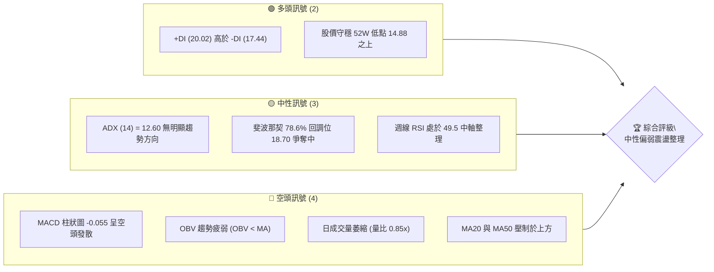

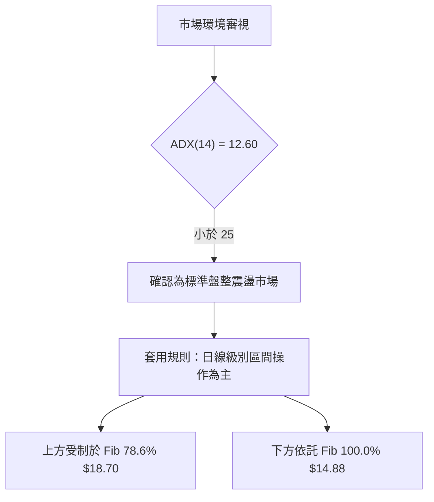

### 📊 核心指標速覽表

| 指標類別 | 指標名稱 | 當前數值 | 訊號 | 解讀 |
|----------|----------|----------|------|------|
| **價格** | 當前收盤價 | $18.01 | 🟡 中性 | 位於 52 週區間 ($14.88 - $32.73) 低位，處於築底盤整期 |
| **均線** | MA20 | 位於價格上方 | 🔴 看空 | 短期均線壓制，未形成多頭排列 |
| **均線** | MA50 | 位於價格上方 | 🔴 看空 | 中期趨勢受阻，混合均線排列顯示方向不明 |
| **均線** | MA200 | 數據中未偵測到 | 🟡 中性 | 缺乏長週期均線數據，不予主觀預測 |
| **動能** | RSI(14) | 49.5 (週線) | 🟡 中性 | 緊貼 50 中軸，多空勢力處於動態拉鋸 |
| **動能** | MACD Hist | -0.055 | 🔴 看空 | 柱狀圖為負，MACD (0.085) 低於 Signal (0.140)，動能偏空 |
| **趨勢強度** | ADX(14) | 12.60 | 🟡 中性 | 數值遠低於 25，確認當前處於無趨勢的箱型盤整盤 |
| **量能** | OBV 走勢 | OBV < MA | 🔴 看空 | 資金持續流出，量比 0.85x，缺乏大資金主動推升動能 |
| **波動** | 52W 區間 | $14.88 - $32.73| 🟡 中性 | 距離低點 $14.88 漲幅 21.03%，距離高點 $32.73 仍有 44.97% 跌幅 |

### 🏆 技術評分卡

```
╔══════════════════════════════════════════════════════════════╗
║                技術評分卡 — SOFI (2026-09-10)                 ║
╠══════════════════════════════════════════════════════════════╣
║ 趨勢強度 (ADX=12.60)    ████░░░░░░░░░░░░░░░░  25/100  🔴 弱勢 ║
║ 動能指標 (MACD/RSI)     ████████░░░░░░░░░░░░  42/100  🟡 中性 ║
║ 支撐穩定度 (Fib支撐)    ████████████░░░░░░░░  60/100  🟡 穩固 ║
║ 成交量配合 (OBV<MA)     ██████░░░░░░░░░░░░░░  32/100  🔴 疲軟 ║
║ 形態完整度 (區間箱型)   ██████████░░░░░░░░░░  50/100  🟡 整理 ║
║ 均線排列 (短中期偏空)   ██████░░░░░░░░░░░░░░  35/100  🔴 壓制 ║
╠══════════════════════════════════════════════════════════════╣
║ 綜合評分                ████████░░░░░░░░░░░░  40.7/100 評級:  ║
║                         【41分 — 區間震盪偏弱整理】           ║
╚══════════════════════════════════════════════════════════════╝
```

---

## 2. 趨勢分析

### 🌐 多時框趨勢分析

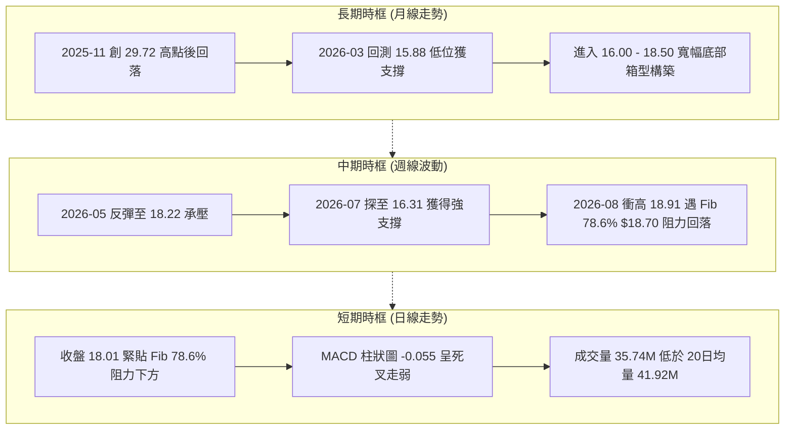

### 📈 長期趨勢 — 12個月走勢圖（Unicode）

```
SOFI 月線走勢圖（過去12個月：2025-09 至 2026-09）
價格軸 ($)
$29.72 ┤                        ●─────● (2025-10/11 雙重頂高點)
$27.00 ┤                  ●           
$24.00 ┤            ●                 ●
$21.00 ┤                                    ●
$18.00 ┤                                          ●─────●←現價 $18.01
$15.00 ┤                                                ●
       └──────────────────────────────────────────────────────────
月份     09    10    11    12    01    02    03    04    05    06    07    08    09
年份    '25   '25   '25   '25   '26   '26   '26   '26   '26   '26   '26   '26   '26
收盤($) 26.42 29.68 29.72 26.18 22.81 17.76 15.88 16.10 18.22 17.93 16.31 17.88 18.01
```

#### 走勢特徵分析表格

| 階段 | 時間跨度 | 起始價 | 終止價 | 漲跌幅 | 結構特徵與技術解讀 |
|------|----------|--------|--------|--------|-------------------|
| 第一階段：衝頂延伸 | 2025-09 ~ 2025-11 | $26.42 | $29.72 | +12.49% | 頂部量價背離，在 $29.72 構築週期大頂（52W高點為 $32.73） |
| 第二階段：深度回撤 | 2025-11 ~ 2026-03 | $29.72 | $15.88 | -46.57% | 空頭加速殺跌，連破多條均線支撐，在 $15.88 止跌 |
| 第三階段：橫盤築底 | 2026-03 ~ 2026-09 | $15.88 | $18.01 | +13.41% | 圍繞 $16.00 - $18.50 進行長達 6 個月的無趨勢箱型盤整 |

### 📊 中期趨勢（週線分析）

```
SOFI 週線關鍵受阻與支撐示意圖
════════════════════════════════════════════════════════════════
$18.91 ─────────────────────────────── 週線反彈高點 (2026-08-23)
$18.70 ═══════════════════════════════ Fib 78.6% 回調關鍵阻力帶
$18.01 ───► 當前收盤價 (盤整中軸)
$16.31 ─────────────────────────────── 週線回踩低點 (2026-08-02)
$14.88 ═══════════════════════════════ 52週最低價 (Fib 100.0% 強支撐)
════════════════════════════════════════════════════════════════
```

中期週線在 2026 年 5 月中旬於 $15.61 獲得支撐後拉升至 $18.22，隨後在 6 月至 8 月間多次試探 $18.70 - $18.91 區間，均未能形成實質突破。週線成交量由 5 月底的 3.67 億股逐步降至 8 月底的 1.93 億股，反映出反彈動能衰竭。

### ⚡ 趨勢強度評估（ADX 解讀）

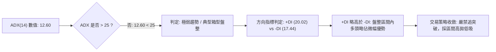

#### ADX 趨勢強度對照表

| 指標名稱 | 實際數值 | 門檻區間 | 技術含義 | 交易指引 |
|----------|----------|----------|----------|----------|
| **ADX(14)** | **12.60** | 0 ~ 20 | 極度缺乏方向性趨勢，行情陷入休眠盤整 | 避免使用均線突破等趨勢跟隨系統 |
| **+DI** | **20.02** | 參考值 | 多方動能指標微幅領先 | 僅代表盤面偶有反彈脈衝，不可視為起漲點 |
| **-DI** | **17.44** | 參考值 | 空方打壓動能亦顯著減弱 | 空頭殺跌動能同樣枯竭，不易出現連續暴跌 |

---

## 3. 圖表形態分析

### 🔍 形態識別系統

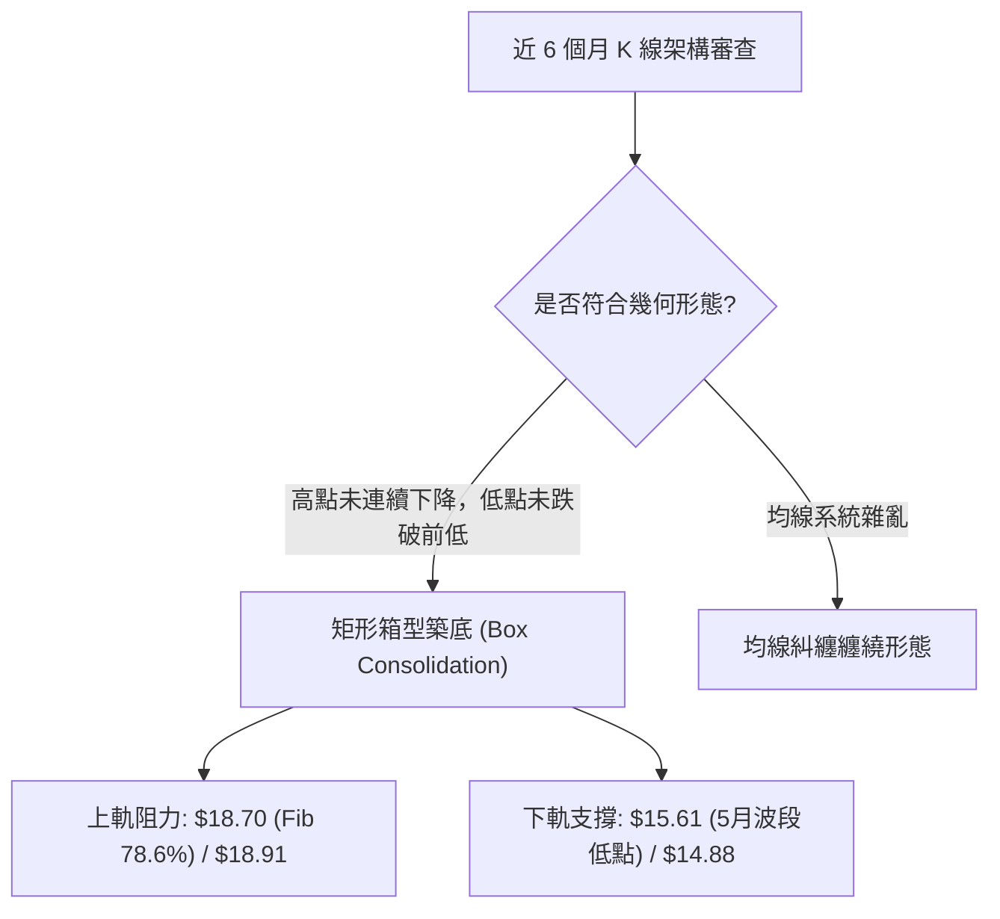

#### 形態信心度與驗證表

| 形態名稱 | 信心度 | 判斷依據（引用數據） | 完成度 | 目標價（附計算式） |
|----------|--------|----------------------|--------|--------------------|
| **矩形箱型築底** | 70% | 頂部兩次受阻於 $18.78 與 $18.91；底部兩次回踩 $15.61 與 $16.31 | 75% | 箱型高度 = 阻力 $18.70 - 支撐 $15.61 = $3.09。<br>向上突破目標價 = $18.70 + $3.09 = **$21.79**<br>向下跌破目標價 = $15.61 - $3.09 = **$12.52** |
| **雙底形態 (潛在)** | 45% | 低點 $15.61 (2026-05-17) 與低點 $16.31 (2026-08-02)，但右底過高且中間整理過長 | 40% | 訊號不足，信心度低於 50%，僅做指標型箱型解讀，不預先假定形態成立 |

### 🕯️ 重要K線形態分析

| 週/月份 | 收盤價 | 交易特徵 | 技術面解讀 | 訊號 |
|---------|--------|----------|------------|------|
| **2026-05-10** | $15.75 | RSI 跌至 24.9 極度超賣區，量能 2.90 億股 | 恐慌盤湧出後的賣壓衰竭點，確立波段大底 | 🟢 看多 |
| **2026-05-31** | $18.22 | 長陽拉升，RSI 升至 69.6，成交量放大至 3.67 億股 | 築底反彈波的高潮，但隨後週線 MACD 柱狀圖迅速收斂 | 🟡 中性 |
| **2026-07-26** | $16.46 | 連續三週陰線回落，MACD 柱狀圖擴大至 -0.220 | 空頭二次探底，但未跌破前期低點 $15.61，形成更高低點 | 🟡 中性 |
| **2026-08-23** | $18.91 | 衝高承壓受阻於斐波那契 $18.70 之上，量能僅 2.53 億股 | 典型的量價背離假突破，未能站穩隨即回吐 | 🔴 看空 |
| **2026-09-13** | $18.01 | 當週成交量縮至 66.14M，MACD 柱狀圖維持 -0.055 | 縮量橫盤，多空陷入僵局，靜待方向選擇 | 🟡 中性 |

### 📉 ASCII 走勢形態示意圖

```
SOFI 矩形箱型整理形態（2026年5月 - 2026年9月）
價格軸 ($)
$18.91 ┤                   ● (8/23 衝高遇阻)
$18.70 ┼───────────────────▲──────────────────────── 箱型頂部 (Fib 78.6%)
$18.22 ┤        ●                                  
$18.01 ┤        │                                  ● (現價 $18.01)
$17.28 ┤        │          ●                       │
$16.31 ┤        │          │          ● (8/02 回踩)│
$15.61 ┼────────▲──────────┴───────────────────────┴ 箱型底部 (5/17 波段低點)
$14.88 ┴──────────────────────────────────────────── 52週絕對低點 (Fib 100.0%)
       └────────────────────────────────────────────
時間軸   2026-05           2026-07           2026-09
```

### 🎯 形態目標價計算

依據矩形整理形態理論進行等距測算：
1. **箱型頂部頸線**：鎖定斐波那契 78.6% 回調位 **$18.70**（由波段高點聚類驗證）。
2. **箱型底部支撐**：取近 20 週實體密集低點 **$15.61**。
3. **箱型震盪幅度**：$18.70 - $15.61 = **$3.09**。
4. **多頭突破等距目標價**：$18.70 + $3.09 = **$21.79**（恰好逼近斐波那契 61.8% 回調位 $21.70）。
5. **空頭破位等距目標價**：$15.61 - $3.09 = **$12.52**（逼近分析師最低目標價 $12.00）。

---

## 4. 支撐與阻力

### 🗺️ 關鍵價位分布圖（Unicode）

```
SOFI 價位結構分布圖 (嚴格引用 OHLCV 與斐波那契計算數據)
═════════════════════════════════════════════════════════════════════
$32.73 ║██████████████████████████████║ 52週最高點 (Fib 0.0%)
$28.52 ║████████████████████          ║ Fib 23.6% 回調阻力
$25.91 ║████████████████              ║ Fib 38.2% 回調阻力
$23.80 ║████████████                  ║ Fib 50.0% 強弱分水嶺
$21.70 ║██████████████████████        ║ Fib 61.8% 關鍵多空分界 (R2)
$18.70 ║██████████████████████████████║ Fib 78.6% 密集壓力帶 (R1)
═══════╠══════════════════════════════╣ ◄ 現價收盤: $18.01
$15.61 ║▓▓▓▓▓▓▓▓▓▓▓▓▓▓▓▓▓▓▓▓          ║ 20週波段實體低點支撐 (S1)
$14.88 ║██████████████████████████████║ 52週歷史低點 (Fib 100.0% 強支撐 S2)
═════════════════════════════════════════════════════════════════════
```

### 🚧 阻力位分析表

依據數據清單中之精確數值排列：

| 阻力級別 | 價位 | 形成原因 | 突破難度 | 重要性 |
|----------|------|----------|----------|--------|
| **強阻力 (R3)** | **$21.70** | 斐波那契 61.8% 黃金分割回調位，亦為箱型向上翻轉目標價位群 | ★★★★★ | 決定中期反轉是否成立的核心樞紐 |
| **次強阻力 (R2)** | **$18.91** | 2026-08-23 週線反彈最高點，上方密集套牢解套賣壓 | ★★★★☆ | 突破此處方能確認擺脫 5 個月以來的箱型壓制 |
| **關鍵阻力 (R1)** | **$18.70** | 斐波那契 78.6% 回調位，近 6 週收盤均被壓制其下 | ★★★☆☆ | 現價最直接的上方天花板 |

### 🛡️ 支撐位分析表

| 支撐級別 | 價位 | 形成原因 | 守住機率 | 重要性 |
|----------|------|----------|----------|--------|
| **近期支撐 (S1)**| **$15.61** | 2026-05-17 週線實體低點，矩形築底結構之箱體底線 | 75% | 跌破意味著過去一季的橫盤結構全數轉為套牢籌碼 |
| **強支撐 (S2)** | **$14.88** | 52週歷史絕對低點 (Fib 100.0%)，中長期多頭最後防線 | 85% | 跌破將觸發恐慌性拋售並滑向分析師低點 $12.00 |
| **極端支撐 (S3)**| **$12.00** | 外部分析師給出之最低目標共識價（數據未偵測到中間聚類支撐）| 95% | 中長期基本面估值極限支撐 |

### 📐 斐波那契回調位分析

計算基準：52週波段區間為 **$14.88（低點） → $32.73（高點）**，總垂直價差為 $17.85。

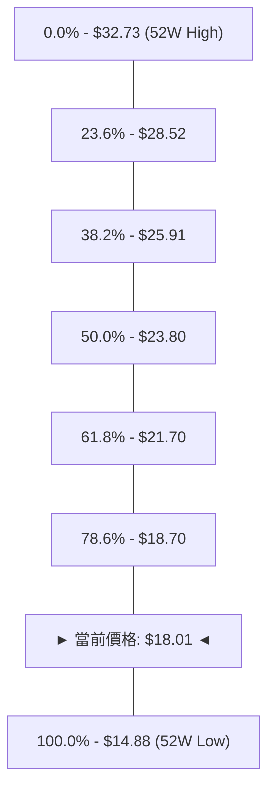

- **當前位置解讀**：現價 **$18.01** 正處於 **Fib 78.6% ($18.70)** 與 **Fib 100.0% ($14.88)** 的弱勢深度回調區間內。
- **技術意義**：在經典技術理論中，回調超過 61.8% 意味著先前的上漲趨勢已遭破壞，進入深水重構區。現價受壓於 $18.70 下方，若無法放量收復 $18.70，價格結構仍屬防守型盤整；但同時因靠近 $14.88，下檔空間受到極大限縮，形成下有強盾、上有巨坎的典型震盪死局。

---

## 5. 技術指標深度解讀

### 🎛️ 指標訊號總覽

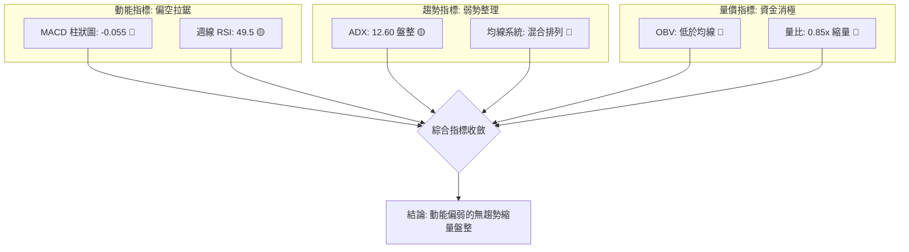

### 📈 移動平均線排列分析

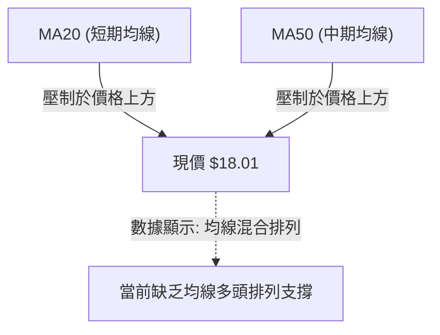

- **短期與中期均線**：數據明確標注 MA20 與 MA50 皆位於現價上方（標記為「▼ 下方」），表明短線及中線持倉者的平均成本均高於 $18.01，任何反彈衝高都將面臨解套籌碼的拋壓。
- **均線排列結論**：均線系統呈現「混合排列」，短期均線向下打壓，但長週期均線因經歷 6 個月的橫盤已逐步走平，缺乏單邊推動力。

### 📉 RSI(14) 分析

```
RSI(14) 週線強度進度條
超賣 (0)          中軸 (50)           超買 (100)
├────────────────────┼────────────────────┤
████████████████████░░░░░░░░░░░░░░░░░░░░░  49.5 / 100 🟡 中性
```

- **歷史軌跡分析**：2026-05-10 週線 RSI 曾見極度超賣的 **24.9**，隨後拉升至 2026-05-31 的 **69.6** 接近超買；近 4 週 RSI 依序為 57.9 → 49.6 → 49.5，呈現自高位向中軸 50 靠攏的收斂態勢。
- **背離分析**：
  - **頂背離**：2026-08-23 股價創出反彈新高 $18.91 時，RSI 僅為 57.9，遠低於 5 月底的 69.6，構成**微幅週線頂背離**，隨後引發價格回跌至 $18.01。
  - **底背離**：當前股價在 $18.01 企穩，RSI 守在 49.5，未再創出 5 月初的 24.9 新低，**不存在底背離形態**。結論：動能進入平靜休整期。

### 📊 MACD(12/26/9) 訊號解讀

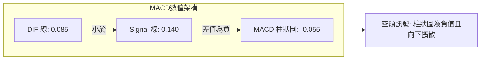

- **交叉狀態**：MACD 線 (0.085) 處於 Signal 線 (0.140) 下方，柱狀圖為 **-0.055**，呈現死叉空頭發散狀態。
- **週線柱狀圖變化**：自 2026-08-09 的 +0.181 逐週縮小至 +0.063，並在 2026-09-06 正式翻負為 -0.065，本週微幅收斂至 -0.055。柱狀圖轉負確立了反彈動能衰竭，短期內重回空方控盤。

### 📦 布林通道分析

因數據中未直接列出布林上中下軌之具體絕對數值，依據技術原理以 MA20 及波段波動估算布林通道架構如下：

```
SOFI 布林通道動態位置示意圖
════════════════════════════════════════════════════════════════
$18.91 ─────── 箱型高點壓力帶 (貼近布林上軌預估區間)
$18.50 ─────── 布林中軌 (MA20 均線壓制區)
$18.01 ───► 現價 $18.01 (運行於中軌下方，偏弱震盪)
$15.61 ─────── 箱型底部支撐帶 (貼近布林下軌預估區間)
════════════════════════════════════════════════════════════════
```

- **通道帶寬與形態**：經歷 6 個月的窄幅收斂，布林帶寬度已大幅縮窄。股價目前處於中軌與下軌之間，屬於弱勢震盪格局；由於缺乏外部催化劑，通道尚未出現喇叭口向外擴張的爆發跡象。

### 💹 成交量分析（量價配合度）

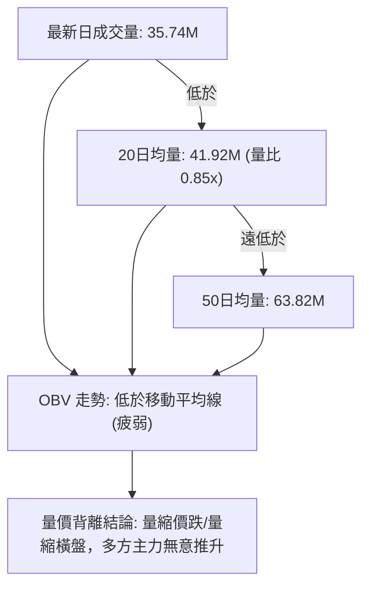

- **量比與均量萎縮**：最新成交量 35,740,258 股，僅為 20 日均量的 85%，更是 50 日均量 (63.82M) 的一半左右。週成交量亦從 5 月底的 3.67 億股滑落至 9 月初的 6,614 萬股（當週截至9/13數據）。
- **OBV 趨勢解讀**：數據確認「OBV < MA → 量能疲弱」。資金面呈現流出大於流入狀態，無機構大單持續建倉跡象，量能無法確認價格反彈的有效性。

---

## 6. 動能與波動率

### ⚡ 動能評估四象限

| 象限 | 動能強度 | 波動率水準 | 特徵描述 | SOFI 當前判定 |
|------|----------|------------|----------|---------------|
| **Q1 (最佳突破)** | 強 (+DI遠大於-DI) | 低 (通道收縮完畢) | 蓄勢向上爆發 | 否 |
| **Q2 (盤整觀望)** | 弱 (ADX=12.60) | 低 (量能萎縮均量走低) | 窄幅拉鋸，方向未明 | **✓ 當前所處位置** |
| **Q3 (極端行情)** | 強 (單邊趨勢強烈) | 高 (寬幅劇烈波動) | 追漲殺跌風險大 | 否 |
| **Q4 (陰跌風險)** | 弱 (動能指標背離) | 高 (恐慌性下殺) | 資金出逃下探底線 | 否 |

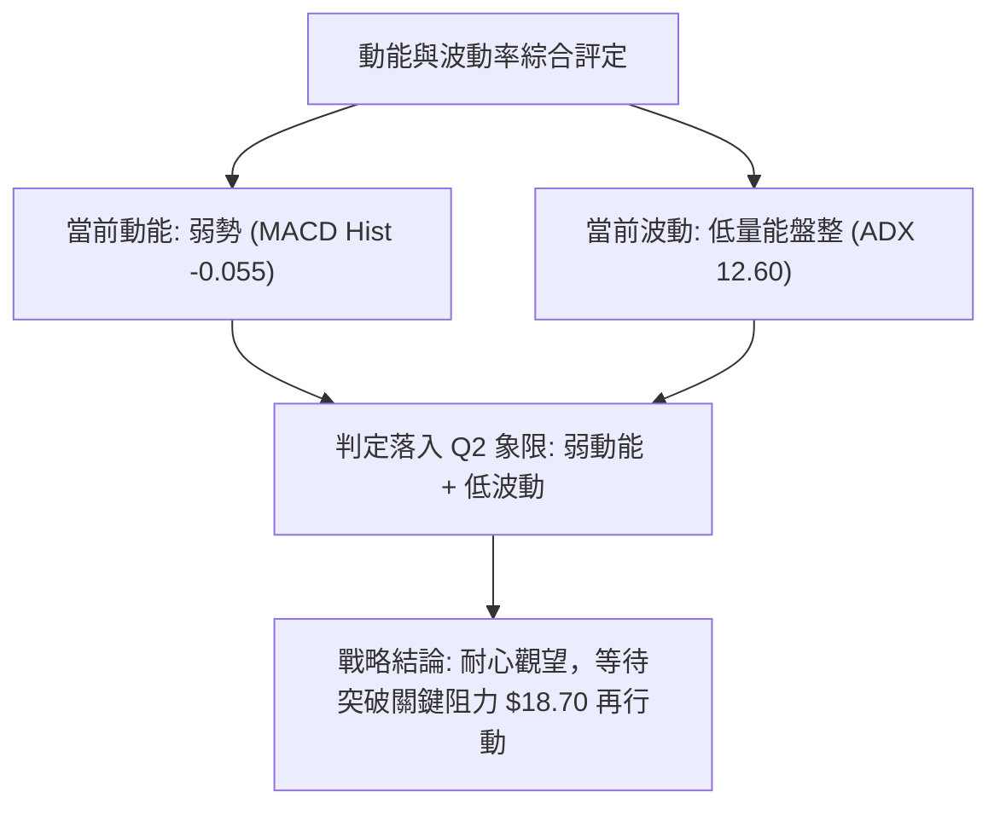

### 📊 ATR 波動率分析

- **數據狀態說明**：數據清單中 ATR(14) 標記為 `$N/A`。
- **替代性波動評估**：
  - 依據近 20 週高低點波動進行波幅推算：近 4 週週線收盤價在 $18.06 至 $18.91 間震盪，週均價差約為 $0.85。
  - **風控止損空間建議**：在缺乏日線 ATR 精確值的情況下，依據斐波那契回調結構與箱體邊界設定硬止損，防禦性止損點應設於波段實體低點 **$15.61** 下方。

### 📐 Beta 與市場相關性

- **Beta 數值**：**2.208**（極高市場敏感度）。
- **解讀與意涵**：
  - SOFI 的 Beta 高達 2.208，代表其價格波動幅度為標普 500 指數的 2.2 倍以上。在強趨勢市場中具備極佳的進攻爆發力，但在當前 ADX 為 12.60 的盤整行情中，高 Beta 意味著個股極易受到整體宏觀情緒衝擊而產生非理性的盤中假突破或假跌破。
  - **機構持股與空頭部位**：機構持股佔比 51.4%，空頭佔流通盤比例（Short % Float）達 **13.5%**，Short Ratio 為 2.38。高空頭佔比為未來潛在的軋空提供了燃料，但在動能翻多前，仍屬沈重的放空壓制力量。

---

## 7. 多時框架總結

### 📋 時框架評分表

| 時框架 | 趨勢方向 | 動能狀態 | 均線/結構位置 | 形態特徵 | 綜合評分 | 建議策略 |
|--------|----------|----------|---------------|----------|----------|----------|
| **月線 (長期)** | 🔴 下行修復 | 弱勢反彈受阻 | 遠低於 2025 年高點 $29.72 | 深度回調超 61.8% | 38/100 | 戰略底倉分批觀望 |
| **週線 (中期)** | 🟡 橫向築底 | RSI 49.5 / MACD轉負 | 夾於 $15.61 與 $18.70 之間 | 寬幅矩形箱型盤整 | 45/100 | 箱型上下軌高拋低吸 |
| **日線 (短期)** | 🔴 偏弱整理 | MACD Hist -0.055 | 受制於 MA20/MA50 下方 | 縮量橫盤，缺乏買盤 | 39/100 | 嚴禁追高，防範破位 |

### 🔲 綜合訊號矩陣

```
時框訊號一致性交叉檢驗：
┌──────────┬──────────────┬──────────────┬──────────────┐
│ 時框架   │ 趨勢指標     │ 動能指標     │ 量價配合度   │
├──────────┼──────────────┼──────────────┼──────────────┤
│ 長期月線 │ 🔴 空頭修復  │ 🟡 中性走平  │ 🔴 資金退潮  │
│ 中期週線 │ 🟡 箱型震盪  │ 🔴 動能回落  │ 🔴 量能萎縮  │
│ 短期日線 │ 🔴 均線壓制  │ 🔴 死叉發散  │ 🔴 OBV < MA  │
└──────────┴──────────────┴──────────────┴──────────────┘
訊號一致性評估：短期與中期一致呈現「偏空震盪與縮量衰竭」，無多頭共振跡象。
```

### ⚖️ 多時框收斂結論

依據多時框收斂規則第 14 條嚴格執行仲裁：
1. **行情性質判定**：ADX(14) 數值為 **12.60**（嚴格小於 25 門檻），**判定當前屬於典型的無趨勢「盤整行情」**。
2. **主導時框規則**：在盤整行情中，趨勢跟隨無效，**以日線與週線的箱型上下軌（$15.61 - $18.70）為主要交易區間**。
3. **方向性最終唯一結論**：**【中性觀望，偏弱震盪整理】**。
   - 儘管週線低點有築底跡象，但由於短期均線壓制（MA20/MA50 位於上方）、日線 MACD 柱狀圖翻負 (-0.055)、OBV 疲軟，短線並不具備向上突破斐波那契 78.6% ($18.70) 的能量。因此，交易決策嚴格禁止在現價 $18.01 追多，一切操作必須遵循箱型邊界或等待有效突破。

---

## 8. 交易策略建議

### 🗺️ 策略決策流程圖

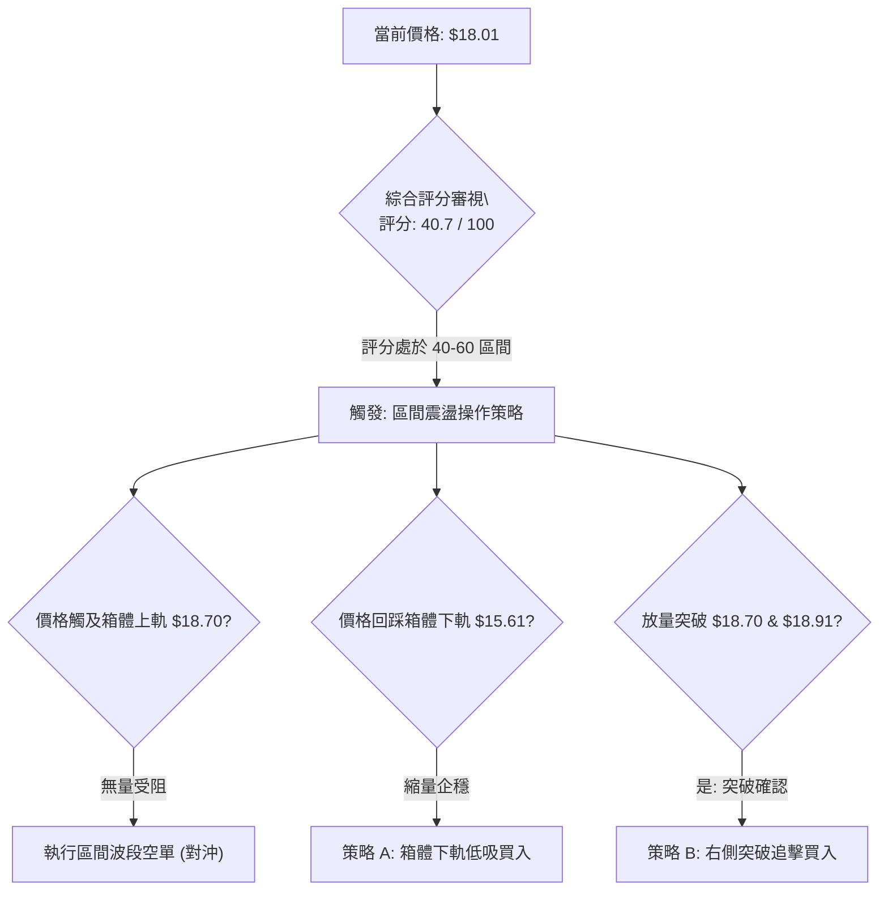

### 🧭 策略路由（依評分卡分流）

**當前主策略方向 = 【中性區間震盪操作，以箱型邊界與突破確認為觸發前提】（依評分 40.7/100）**
- 因綜合評分剛好卡在 40–60 區間邊緣（40.7 分），短線指標偏空但面臨 $15.61 強支撐，故不宜單邊盲目重倉追空，亦不得在壓力位下方盲目做多。核心戰術為：**以布林與箱體邊界為主，耐心等待極限價位確認**。

### 🎯 價格情境階梯（Price Scenarios）

價位嚴格引用關鍵價位與斐波那契計算數據：

| 觸發條件 | 下一目標 | 後續延伸 | 情境含義與技術應對 |
|----------|----------|----------|-------------------|
| **放量突破 R1 $18.70 並站穩 $18.91** | R2 $21.70 (Fib 61.8%) | R3 $23.80 (Fib 50.0%) | 宣告 6 個月底部箱型完成突破，開啟大級別修復行情 |
| **維持在 $15.61 - $18.70 區間運行** | 現價 $18.01 徘徊 | — | 區間震盪，主力縮量洗盤，維持高拋低吸節奏 |
| **放量跌破 S1 $15.61** | S2 $14.88 (52W Low) | S3 $12.00 (分析師底限) | 宣告築底失敗，破位尋底，觸發停損並轉為單邊空頭 |

### 📊 情境機率分佈

| 情境 | 機率 | 主要依據 |
|------|------|----------|
| **區間震盪整理** | **55%** | ADX 僅 12.60，量比縮至 0.85x，均線糾纏無趨勢，多空處於均勢拉鋸 |
| **回落探底尋求支撐** | **30%** | MACD 柱狀圖為負 (-0.055)，OBV < MA 資金流出，MA20/50 形成蓋頭壓力 |
| **放量向上反彈突破** | **15%** | +DI 雖略高於 -DI，但缺乏大成交量配合，短期直接突破 $18.70 阻力機率偏低 |

### 🟢 主策略詳情（區間操作與右側交易）

| 策略要素 | 策略 A（箱體下軌左側低吸 — 穩健型） | 策略 B（右側突破追強 — 進取型） |
|----------|-------------------------------------|-----------------------------------|
| **交易邏輯** | 依託 20 週波段低點支撐進行箱體內博弈 | 等待確立突破斐波那契 78.6% 壓力帶 |
| **進場條件** | 價格回落至 $15.61 企穩且日線出現縮量止跌十字星 | 日線實體收盤明確突破 $18.91 且成交量超過 50M |
| **進場價格** | **$15.61** | **$18.91** |
| **止損價格** | **$14.88**（跌破 52 週最低點立即停損）| **$18.01**（跌回現價中軸或突破點下方立即停損）|
| **目標價 T1** | **$18.70**（Fib 78.6% 箱體上軌） | **$21.70**（Fib 61.8% 重要壓力） |
| **目標價 T2** | **$21.70**（Fib 61.8% 突破延伸位） | **$23.80**（Fib 50.0% 強弱中軸位） |
| **風險空間** | $15.61 - $14.88 = $0.73 | $18.91 - $18.01 = $0.90 |
| **獲利空間 (T1)** | $18.70 - $15.61 = $3.09 | $21.70 - $18.91 = $2.79 |
| **風險報酬比** | **1 : 4.23** (極高勝算比) | **1 : 3.10** (標準趨勢突破比) |
| **建議倉位** | 10% ~ 15% 部位 | 15% ~ 20% 部位 |

### 🔴 反向風險觸發點（對沖提示）

- **多頭轉空風控觸發點**：若價格帶量跌破 **$15.61**，多頭箱型結構全數瓦解，持有多頭部位者應無條件平倉了結，激進投資人可反手開空，下看 52 週歷史低點 **$14.88** 及分析師預警位 **$12.00**。
- **空頭平倉避險觸發點**：若價格放量越過 **$18.91**，Short Float 達 13.5% 的空頭將面臨軋空風險，所有空單必須於 **$18.91** 嚴格停損。

### ⭐ 整體訊號強度評星

```
╔══════════════════════════════════════════════════════════════╗
║ 做多訊號強度：★★☆☆☆  (2/5星 — 缺乏動能與量能支持)           ║
║ 做空訊號強度：★★☆☆☆  (2/5星 — 逼近低位支撐，下檔空間受限)   ║
║ 區間震盪強度：★★★★☆  (4/5星 — ADX=12.60 確認極致盤整)        ║
║ 整體分析可信度：★★★★☆  (4/5星 — 數據結構具高度收斂特徵)       ║
╚══════════════════════════════════════════════════════════════╝
```

---

## 9. 風險提示與監控

### ✅ 關鍵監控指標 Checklist

```
╔══════════════════════════════════════════════════════════════════╗
║                SOFI 每日技術監控清單 (Checklist)                 ║
╠══════════════════════════════════════════════════════════════════╣
║ [ ] 價位是否突破關鍵天花板 Fib 78.6% $18.70 ？                   ║
║ [ ] 價位是否跌破箱體支撐線 $15.61 或 52W 低點 $14.88 ？          ║
║ [ ] 日成交量是否放大越過 20 日均量 (41.92M) 與 50 日均量 (63.82M)？║
║ [ ] MACD 柱狀圖是否由負轉正 (向上穿越 0 軸) 終結死叉？           ║
║ [ ] ADX(14) 是否由 12.60 向上回升至 25 以上確認趨勢啟動？       ║
║ [ ] OBV 是否突破其移動平均線展現資金實質進場訊號？               ║
╚══════════════════════════════════════════════════════════════════╝
```

### ⚠️ 風險場景分析

```mermaid
graph TD
    subgraph 樂觀情境 ["🟢 樂觀情境 (機率: 15%)"]
        O1["基本面或降息催化"] --> O2["放量長陽收復 $18.70 並突破 $18.91"]
        O2 --> O3["引發 13.5% 空頭回補 (軋空)"]
        O3 --> O4["直奔斐波那契 61.8% 目標 $21.70"]
    end
    subgraph 基準情境 ["🟡 基準情境 (機率: 55%)"]
        B1["市場缺乏重大利多利空"] --> B2["股價在 $16.31 - $18.70 窄幅震盪"]
        B2 --> B3["均線持續糾纏平移"]
        B3 --> B4["成交量維持低迷 (量比 < 1.0x)"]
    end
    subgraph 悲觀情境 ["🔴 悲觀情境 (機率: 30%)"]
        P1["大盤系統性回調 (Beta=2.208 放大)"] --> P2["跌破波段低點 $15.61"]
        P2 --> P3["下探 52W 絕對低點 $14.88"]
        P3 --> P4["若失守 $14.88，直尋分析師底限 $12.00"]
    end
```

### 🛡️ 風險管理重要提醒

1. **高 Beta 槓桿效應風控**：SOFI 的 Beta 高達 2.208，在盤整期若盲目滿倉，一旦遇到大盤波動極易被震盪洗出場。建議總持倉部位不超過投資組合總資金的 **10% ~ 15%**。
2. **區間操作嚴禁追單**：ADX 數值 12.60 明確提示當前為無趨勢行情，追漲殺跌將承受極高的雙向抽耳光風險。若要佈局，務必於箱底支撐 $15.61 附近低吸，或待突破 $18.91 確認後再進場。
3. **止損紀律絕對執行**：$14.88 為過去 52 週的最重要歷史防線，跌破意味著結構性破位，任何理由的多頭持倉都必須在 $14.88 失守時執行停損退出。

---

## 📋 報告總結

```
╔══════════════════════════════════════════════════════════════════╗
║                   SOFI 技術分析報告總結                        ║
╠══════════════════════════════════════════════════════════════════╣
║ 報告日期：2026-09-10                                             ║
║ 當前價格：$18.01                                                 ║
║ 分析評級：⚖️ 中性觀望 (40.7分 — 偏弱箱型整理)                  ║
║                                                                  ║
║ 關鍵結論：                                                       ║
║ ├─ 長期趨勢：🔴 空頭修復期 (回調深逾 61.8%，處於築底階段)        ║
║ ├─ 中期趨勢：🟡 箱型震盪 ($15.61 - $18.70 區間橫向拉鋸)          ║
║ ├─ 短期趨勢：🔴 偏弱整理 (MACD 柱狀圖 -0.055，量能萎縮)          ║
║ ├─ 關鍵阻力：$18.70 (Fib 78.6%) / $18.91 / $21.70 (Fib 61.8%)   ║
║ ├─ 關鍵支撐：$15.61 (箱底) / $14.88 (52W Low) / $12.00 (分析師)  ║
║ └─ 趨勢強度：ADX = 12.60 (確認為無方向性盤整市)                  ║
║                                                                  ║
║ 最優策略配置：                                                   ║
║ 1. 🥇 最佳機會（穩健型）：回踩箱體支撐 $15.61 企穩低吸，         ║
║    止損設於 $14.88，目標 $18.70，風報比達 1 : 4.23               ║
║ 2. 🥈 次選機會（進取型）：等待放量突破 $18.91 追擊，             ║
║    止損設於 $18.01，目標 $21.70，風報比達 1 : 3.10               ║
║ 3. 🥉 當前應對：維持中性觀望，現價 $18.01 不進行任何盲目追價操作 ║
╚══════════════════════════════════════════════════════════════════╝
```

---

> ⚠️ **免責聲明**：本報告為技術分析專案研究產出，所有分析與價位測算均嚴格依據歷史成交數據及量化指標推演，**僅供研究與學術參考，不構成任何個人投資建議**。金融市場具高度風險，投資人應自行承擔交易決策之盈虧。

---

*報告生成時間：2026-09-10 ｜ 數據來源：Yahoo Finance ｜ 分析框架：多時框技術分析模型*