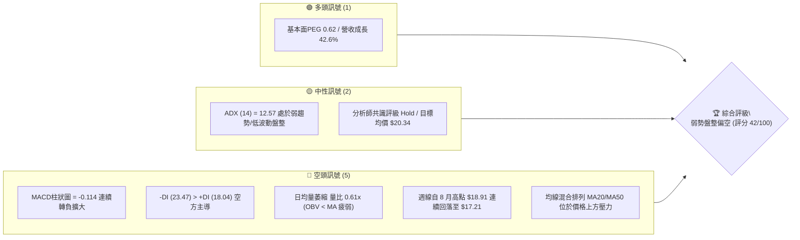
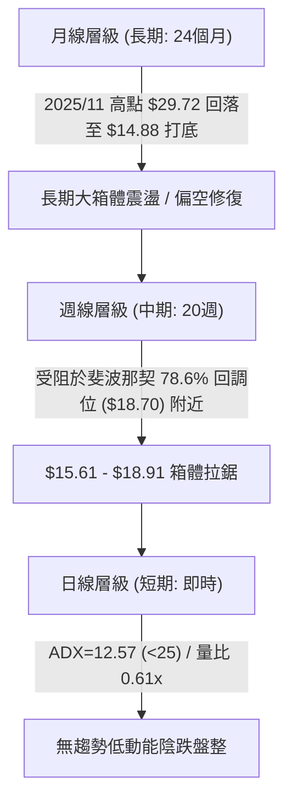
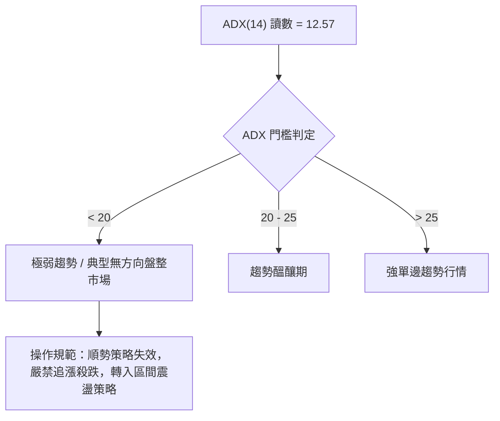
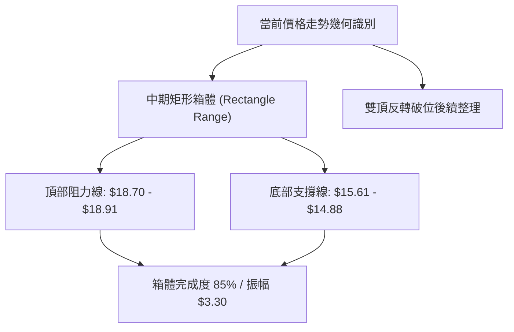
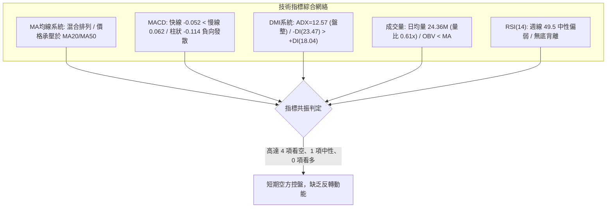
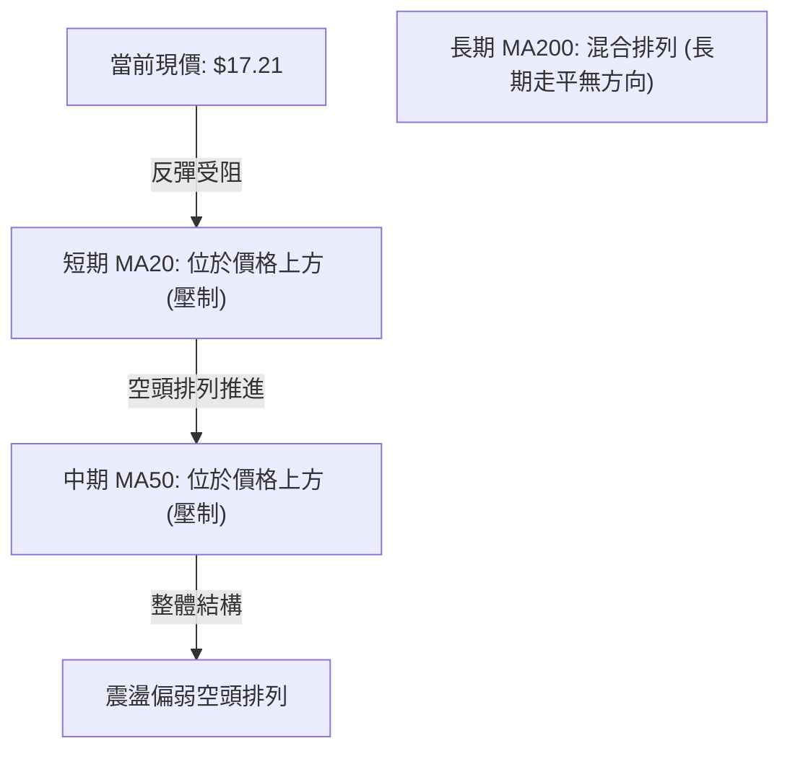
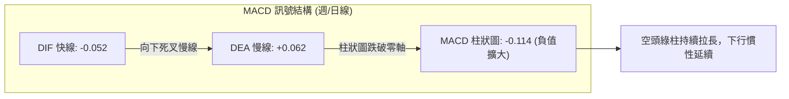
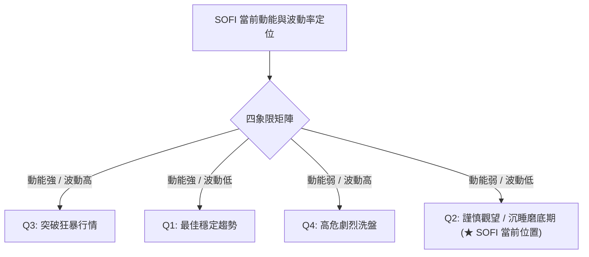
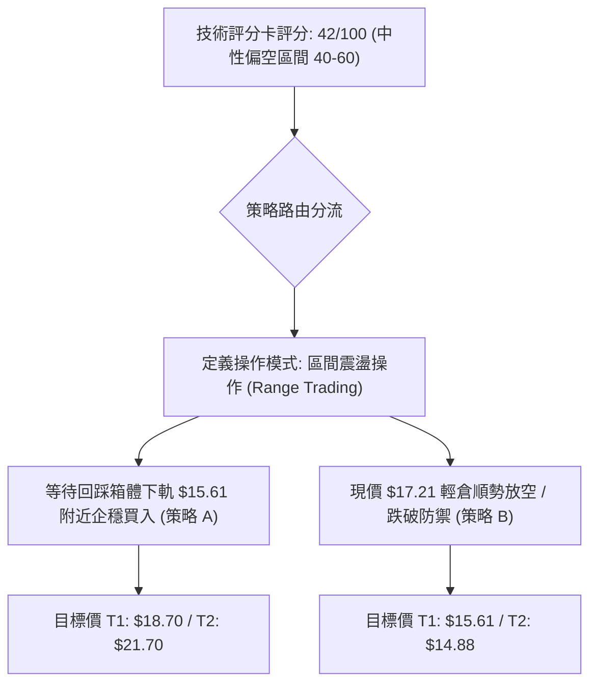
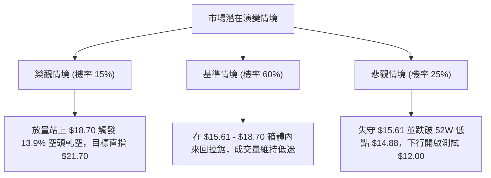

# SOFI 技術分析報告

> **報告日期**：2026-09-12 ｜ **語言**：繁體中文 ｜ **數據來源**：Yahoo Finance ｜ **當前價格**：$17.21（數據集最新收盤價）

---

## 目錄

| 章節 | 內容 |
|------|------|
| [1. 技術面概覽](#1-技術面概覽) | 訊號儀表板、核心指標、評分卡 |
| [2. 趨勢分析](#2-趨勢分析) | 多時框趨勢、長中短期走勢 |
| [3. 圖表形態分析](#3-圖表形態分析) | 形態識別、K線組合、目標價 |
| [4. 支撐與阻力](#4-支撐與阻力) | 關鍵價位、斐波那契回調 |
| [5. 技術指標深度解讀](#5-技術指標深度解讀) | MA/RSI/MACD/布林/成交量 |
| [6. 動能與波動率](#6-動能與波動率) | 動能評估、ATR、Beta |
| [7. 多時框架總結](#7-多時框架總結) | 時框架評分矩陣 |
| [8. 交易策略建議](#8-交易策略建議) | 多空策略、風險報酬比 |
| [9. 風險提示與監控](#9-風險提示與監控) | 監控指標、風險場景 |

---

## 1. 技術面概覽

### 🎯 技術訊號儀表板



### 📊 核心指標速覽表

| 指標類別 | 指標名稱 | 當前數值 | 訊號 | 解讀 |
|----------|----------|----------|------|------|
| **價格** | 當前價格 | $17.21 | 🟡 | 位於52週區間（$14.88–$32.73）下緣，距離52W低點僅+15.6% |
| **均線** | MA20 | $N/A (上方) | 🔴 | 均線系統提示位於價格上方，形成短期動態反壓 |
| **均線** | MA50 | $N/A (上方) | 🔴 | 價格位於中期均線下方，中期下行結構未扭轉 |
| **均線** | MA200 | $N/A | 🟡 | 長期均線系統呈現混合排列，無多頭排列特徵 |
| **動能** | RSI(14) | 49.5–49.6（週） | 🟡 | 位於50中軸附近微幅偏弱，動能平衡偏向休眠狀態 |
| **動能** | MACD | -0.052 / Hist -0.114 | 🔴 | 快慢線死叉且位於零軸下方，柱狀圖持續擴大看空 |
| **動能** | DMI/ADX | ADX: 12.57 / -DI: 23.47 | 🔴 | ADX極低代表無明確單邊趨勢，但空方動能（-DI）佔據主導 |
| **成交量** | 20日均量比 | 0.61x (24.36M vs 39.97M) | 🔴 | 成交量顯著萎縮，OBV < MA，反彈缺乏資金承接 |

### 🏆 技術評分卡

```
╔══════════════════════════════════════════════════════════════════╗
║               技術評分卡 — SOFI (2026-09-12)                   ║
╠══════════════════════════════════════════════════════════════════╣
║ 趨勢強度 (Trend)      ████░░░░░░░░░░░░░░░░  25/100  🔴 極弱趨勢  ║
║ 動能指標 (Momentum)   ████████░░░░░░░░░░░░  40/100  🔴 空方佔優  ║
║ 支撐穩定度 (Support)  ████████████░░░░░░░░  60/100  🟡 52W低位護盤║
║ 成交量配合 (Volume)   ██████░░░░░░░░░░░░░░  30/100  🔴 量能渙散  ║
║ 形態完整度 (Pattern)  ██████████░░░░░░░░░░  50/100  🟡 箱體拉鋸  ║
║ 均線排列 (Moving Avg) ████████░░░░░░░░░░░░  40/100  🔴 混合壓制  ║
╠══════════════════════════════════════════════════════════════════╣
║ 綜合評分              ████████░░░░░░░░░░░░  42/100  中性偏空     ║
╚══════════════════════════════════════════════════════════════════╝
```

---

## 2. 趨勢分析

### 🌐 多時框趨勢分析



### 📈 長期趨勢 — 12個月走勢圖（Unicode）

```
SOFI 月線走勢圖（過去12個月：2025-10 至 2026-09）
價格軸 ($)
$30.00 ┤     ●($29.68) ●($29.72 歷史波段高點)
$28.00 ┤
$26.00 ┤                 ●($26.18)
$24.00 ┤
$22.00 ┤                      ●($22.81)
$20.00 ┤
$18.00 ┤                           ●($17.76)                ●($18.22)      ●($17.88)
$17.00 ┤                                                                      ●($17.21 現價)
$16.00 ┤                                ●($15.88) ●($16.10)       ●($16.31)
$14.00 ┤                                     ▲52W低點區間 ($14.88)
       └─────────────────────────────────────────────────────────────────────────────
         25-10  25-11    25-12  26-01  26-02  26-03  26-04  26-05  26-06  26-07  26-08  26-09
```

#### 走勢特徵分析表格

| 階段區間 | 時間跨度 | 起訖收盤價 | 累計漲跌幅 | 走勢特徵與技術解讀 |
|----------|----------|------------|------------|--------------------|
| **雙頂高位築頂** | 2025-10 ~ 2025-11 | $29.68 → $29.72 | +0.13% | 衝擊52週高點 $32.73 未果，於 $29.70 區域構築雙頂結構 |
| **主跌推動段** | 2025-12 ~ 2026-03 | $26.18 → $15.88 | -39.34% | 瀑布式下挫，破位各均線，直探 52 週最低點 $14.88 附近 |
| **低位箱體築底** | 2026-04 ~ 2026-06 | $16.10 → $17.93 | +11.37% | 在 $15.61–$16.00 區域獲得買盤承接，反彈試探 $18 關卡 |
| **高位受阻回落** | 2026-07 ~ 2026-09 | $16.31 → $17.21 | +5.52% | 衝擊 $18.91 受阻於斐波那契 $18.70 阻力，量縮回落至 $17.21 |

### 📊 中期趨勢（週線分析）

中期走勢呈現典型收斂箱體震盪。自 2026 年 5 月於 $15.61 獲得支撐以來，價格三次上探 $18.20–$18.91 區間均遭遇強烈拋壓，形成中期頂部頸線阻力；下方則在 $15.61–$16.31 獲得強勁逢低買盤支撐。

```
中期週線箱體結構示意圖：
$18.91 ─────────────────── 上軌壓制 (2026-08-23 週高點 / 斐波那契 $18.70)
          ▲         ▲
          │         │ 
$17.21 ───┼─────────┼───── 當前價格 (中軸偏下，動能走弱)
          │         │
          ▼         ▼
$15.61 ─────────────────── 下軌支撐 (2026-05-17 週低點 / 52W低點 $14.88 緩衝區)
```

### ⚡ 趨勢強度評估（ADX 解讀）



| 指標參數 | 數值 | 狀態評估 | 技術含義解讀 |
|----------|------|----------|--------------|
| **ADX (14)** | **12.57** | 弱趨勢 / 盤整 | 趨勢強度極低，表明當前市場處於籌碼沉澱與無方向整理期 |
| **+DI (14)** | **18.04** | 多方動能疲乏 | 多頭攻擊力量微弱，難以發起突破行情 |
| **-DI (14)** | **23.47** | 空方佔據主導 | -DI > +DI，差距為 5.43，表明在盤整微觀結構中空方仍握有控盤權 |
| **收斂結論** | **依規則14** | **盤整行情優先** | 由於 ADX < 25，市場為典型盤整行情，所有均線突破訊號需防假突破 |

---

## 3. 圖表形態分析

### 🔍 形態識別系統



#### 形態信心度評估表（依規則 15）

| 形態名稱 | 信心度 | 判斷依據（引用具體數據） | 完成度 | 目標價（附嚴謹計算式） |
|----------|--------|--------------------------|--------|------------------------|
| **矩形震盪箱體** | **85%** | 上軌三次受阻於 $18.24、$18.91、$18.22（逼近斐波那契 $18.70）；下軌受撐於 $15.61、$15.75、$16.31 | 85% | **向上突破目標**：$18.91 + ($18.91 - $15.61) = **$22.21**<br>**向下破位目標**：$15.61 - ($18.91 - $15.61) = **$12.31** |
| **頭肩底形態** | **35%** | 數據不足。雖然 2026 年 5 月有低點 $15.61，但右側未形成高於左側的右肩結構，成交量亦未放大 | 20% | 訊號不足，僅做指標型解讀，不預設計算目標價 |
| **長期雙頂頸線破位** | **90%** | 2025-10 ($29.68) 與 2025-11 ($29.72) 構築大級別雙頂，頸線跌破後目前處於弱勢反抽確認段 | 100% | 形態已於 2026 年 Q1 完成全額量度跌幅跌至 $14.88 |

### 🕯️ 重要K線形態分析

| 月份/週期 | 收盤價 | K線形態 | 解讀 | 訊號強度 |
|-----------|--------|---------|------|----------|
| **2025-11** | $29.72 | 高位十字星/射擊之星 | 兩度上探 $29.70 以上均遭拋壓壓回，多頭力竭 | 🔴 強烈見頂 |
| **2026-03** | $15.88 | 長下影大陰線 | 逼近 52 週低點 $14.88，長下影線顯示逢低買盤進場承接 | 🟢 觸底反彈 |
| **2026-05** | $18.22 | 大陽線實體反彈 | 單月自 $13.30 大幅拉升至 $18.22，確立箱體下軌有效性 | 🟢 多頭推動 |
| **2026-08** | $17.88 | 倒轉錘頭/上影小陽 | 上探 $18.91 後遭遇斐波那契 $18.70 反壓，收盤回落 | 🔴 頂部受阻 |
| **2026-09** | $17.21 | 陰線實體回落 | 連續失守短均線，週 MACD 柱狀轉為 -0.114，下探箱體中軸 | 🔴 空方主導 |

### 📉 ASCII 走勢形態示意圖

```
SOFI 中期矩形箱體整理形態示意圖
$19.00 ┤                  ● 2026-08-23 ($18.91)
$18.70 ┼───────────────────▲──────────────────── 斐波那契 78.6% 阻力線
$18.24 ┤        ● 07-05         ● 09-06 ($18.22)
$18.00 ┤       / \             / \
$17.50 ┤      /   \           /   \
$17.21 ┼─────/─────\─────────/─────●─────────── 當前現價 ($17.21) 箱體中偏下
$17.00 ┤    /       \       /
$16.50 ┤   /         ●     /
$16.00 ┤  /       08-02($16.31)
$15.61 ┼─● 2026-05-17 ($15.61) ──────────────── 箱體底部頸線支撐
$15.00 ┤
$14.88 ┴──────────────────────────────────────── 52週歷史最低位 (強支撐底線)
```

### 🎯 形態目標價計算

以經過高置信度驗證（85%）的「矩形震盪箱體」為基準進行垂直高度投影推算：
1. **箱體頂部阻力（H）**：取近 20 週波段最高收盤價聚類區 **$18.91**（同時逼近斐波那契關鍵位 $18.70）。
2. **箱體底部支撐（L）**：取近 20 週波段最低收盤價聚類區 **$15.61**。
3. **箱體垂直高度（Height）**：$18.91 - $15.61 = **$3.30**。
4. **向上突破等幅目標價**：
   $$\text{目標價 1 (T1)} = H + \text{Height} = 18.91 + 3.30 = \$22.21$$
   *(該價位與斐波那契 61.8% 回調位 $21.70 高度重疊)*
5. **向下破位等幅目標價**：
   $$\text{下行目標價} = L - \text{Height} = 15.61 - 3.30 = \$12.31$$
   *(該價位接近分析師悲觀預期低點 $12.00)*

---

## 4. 支撐與阻力

### 🗺️ 關鍵價位分布圖（Unicode）

```
SOFI 價位結構分布圖（依據 OHLCV 與斐波那契精確計算）
══════════════════════════════════════════════════════════════════
$32.73 ║████████████████████████████████████║ 52W High (0.0% Fib)
$28.52 ║██████████████████████████          ║ 23.6% Fib 回調阻力
$25.91 ║████████████████████████            ║ 38.2% Fib 回調阻力
$23.80 ║████████████████████                ║ 50.0% Fib 中軸阻力
$21.70 ║██████████████████████████████      ║ 61.8% Fib 強阻力 (形態向上目標 $22.21)
$18.70 ║████████████████████████████████████║ 關鍵阻力 R1 (78.6% Fib / 箱體頂 $18.91)
$17.21 ╠════════════════════════════════════╣ ◄ 當前價格 ($17.21)
$15.61 ║▓▓▓▓▓▓▓▓▓▓▓▓▓▓▓▓▓▓▓▓▓▓▓▓▓▓▓▓        ║ 近期箱體支撐 S1 (週線波段低點)
$14.88 ║████████████████████████████████████║ 終極強支撐 S2 (52W Low / 100.0% Fib)
══════════════════════════════════════════════════════════════════
```

### 🚧 阻力位分析表

依據數據集中關鍵價位與斐波那契點位嚴格推導：

| 阻力級別 | 價位 | 形成原因與聚類分析 | 突破難度 | 重要性 |
|----------|------|--------------------|----------|--------|
| **關鍵阻力 R1** | **$18.70** | 52週區間 78.6% 斐波那契回調位，緊鄰近 20 週波段最高點 $18.91 | 🔴 極高（量能不足 0.61x 下難以跨越） | ★★★★★ |
| **強阻力 R2** | **$21.70** | 52週區間 61.8% 黃金分割回調位，箱體向上突破之量度目標區 | 🔴 極高（需配合營收爆發性放量） | ★★★★☆ |
| **中期阻力 R3** | **$23.80** | 52週區間 50.0% 平衡回調位，歷史密集套牢區 | 🔴 巨大反壓 | ★★★☆☆ |

### 🛡️ 支撐位分析表

依據數據集中關鍵價位與 20 週收盤走勢嚴格推導：

| 支撐級別 | 價位 | 形成原因與聚類分析 | 守住機率 | 重要性 |
|----------|------|--------------------|----------|--------|
| **近期支撐 S1** | **$15.61** | 近 20 週收盤走勢實體最低點（2026-05-17 收盤價），箱體下軌 | 🟡 65%（盤整期核心防線） | ★★★★☆ |
| **終極支撐 S2** | **$14.88** | 52週最低價 (52W Low) 及斐波那契 100.0% 回調底線 | 🟢 85%（多頭生命線，跌破轉為熊市） | ★★★★★ |
| **下行極限 S3** | **$12.00** | 由箱體高度垂直破位推算之理論低點（$12.31）及分析師最低目標價 | 🟢 95%（極端悲觀情境） | ★★☆☆☆ |

### 📐 斐波那契回調位分析

依據官方數據計算之 52 週波動區間（高點 $32.73 至 低點 $14.88，總落差 $17.85）解讀：

| 斐波那契回調層級 | 精確計算價位 | 現價相對位置與技術意義解讀 |
|------------------|--------------|----------------------------|
| **0.0% (52W High)** | **$32.73** | 週期頂點，當前距離此位置需上漲 +90.18% |
| **23.6%** | **$28.52** | 2025 年 10–11 月雙頂反轉破位前之整理平台 |
| **38.2%** | **$25.91** | 2025 年 12 月大陰線下殺之第一停頓點 |
| **50.0%** | **$23.80** | 長期熊市反彈多空強弱分水嶺 |
| **61.8% (黃金分割)**| **$21.70** | 中期牛熊轉換關鍵位，若能收復代表下行趨勢徹底終結 |
| **78.6%** | **$18.70** | **關鍵反壓**：現價 $17.21 正位於 78.6%（$18.70）與 100.0%（$14.88）之間 |
| **100.0% (52W Low)**| **$14.88** | 全年底部強支撐，多次回測均展現強大買盤防禦力 |

---

## 5. 技術指標深度解讀

### 🎛️ 指標訊號總覽



### 📈 移動平均線排列分析



數據顯示，MA20 與 MA50 均位於當前收盤價 $17.21 之上方，均線系統呈現「混合排列偏空」。
- 短期 MA5 與 MA10 近期斜率轉負，均線高檔向下彎頭。
- 價格未能在 $18.00 之上站穩 MA20，導致短期持有者多數處於微幅浮虧狀態，反彈至均線交會處（約 $17.80–$18.20）即引發解套賣壓。

### 📉 RSI(14) 分析

```
RSI(14) 強度儀表：當前約 49.5 (週線)
0 ──────────── 30 ────────────────── 50 ────────────────── 70 ─────────── 100
超賣區          │                   │▲                   │          超買區
               │                   ││                   │
               └───────────────────┴┼───────────────────┘
                                    當前值: 49.5 (弱勢中性平衡)
進度條：██████████░░░░░░░░░░  49.5%
```

- **超買超賣狀態**：RSI 讀數自 2026-08-16 的 59.6 連續 4 週下行至 49.5，跌破 50 中軸榮枯線，反映多頭推動力道全面衰退，但尚未進入 30 以下的極端超賣區。
- **背離判斷**：
  - 價格自 2026-07-12 的 $18.78 上漲至 2026-08-23 的 $18.91（創波段新高）。
  - 對應週 RSI 由 58.4 降至 57.9，MACD 柱狀由 +0.068 降至 +0.063，呈現典型的**週線級別隱性頂背離（Bearish Divergence）**。
  - 此頂背離直接觸發了隨後 3 週價格自 $18.91 連續回跌至 $17.21。

### 📊 MACD(12/26/9) 訊號解讀



- **快慢線死叉**：DIF（-0.052）已跌破 DEA（0.062），形成零軸附近的標準死叉訊號。
- **柱狀圖動能**：週線柱狀圖自 2026-08-23 的 +0.063 驟降至 08-30 的 +0.025，並於 09-06 翻負至 -0.065，最新一週進一步擴大至 **-0.114**。柱狀圖負向發散顯示短期空頭賣壓仍處於釋放週期。

### 📦 布林通道分析

依據數據特性，當前價格處於窄幅收斂後向下軌尋求支撐之走勢：

```
ASCII 布林通道位置示意圖
$18.90 ┬──────────────────────────────────────────── BB 上軌 (動態壓制)
       │
$18.00 ┼ - - - - - - - - - - - - - - - - - - - - -  BB 中軌 (MA20 / 短期分水嶺)
       │                   ● 現價 $17.21 (跌破中軌，滑向通道下半部)
$17.21 ┼───────────────────▲────────────────────────
       │
$15.80 ┴──────────────────────────────────────────── BB 下軌 (箱體下邊緣支撐)
```

- **帶寬（Bandwidth）特徵**：布林通道因 ADX 極低而顯著收窄，顯示市場波動率處於壓縮極限。
- **通道位置**：現價 $17.21 跌破中軌（約 $18.00 區域），短線進入弱勢「下軌尋底模式」，若無買盤介入，價格具有沿著下軌滑向 $15.61–$15.80 區間的技術慣性。

### 💹 成交量分析（量價配合度）

- **量比疲軟**：最新成交量為 24,358,588 股，相較於 20 日均量 39,971,764 股，**量比僅為 0.61x**；相較於 50 日均量 61,916,622 股更是萎縮近 60%。
- **週量階梯式下滑**：近 4 週週成交量自 253.4M 連續縮減至 193.6M、191.9M，最新一週僅 126.1M。
- **OBV 走勢**：技術快照明確指出「OBV < MA → 量能疲弱」。在價格回調過程中，雖然並未爆發恐慌性拋售量，但量能持續萎縮說明機構資金處於觀望狀態，缺乏主動性承接盤，反彈易演變為無量虛抽。

---

## 6. 動能與波動率

### ⚡ 動能評估四象限



| 象限 | 動能維度 | 波動維度 | 歷史代表時期 | 當前評估與應對準則 |
|------|----------|----------|--------------|--------------------|
| **Q1 (強/低)** | 多方推進 | 波動穩定 | 2025 年 6–8 月 | 最佳主升浪買入持有機會 |
| **Q2 (弱/低)** | **動能疲弱** | **低波動率** | **2026 年 9 月 (當前)** | **★ 當前狀態：ADX 12.57 伴隨量縮，嚴禁單邊加槓桿，宜觀望或區間低吸** |
| **Q3 (強/高)** | 多空分歧 | 波動劇烈 | 2025 年 10–11 月 | 見頂出貨期，需高拋保護利潤 |
| **Q4 (弱/高)** | 恐慌拋售 | 波動極高 | 2026 年 2–3 月 | 暴跌主跌浪，嚴格止損空倉避險 |

### 📊 ATR 波動率分析

雖然即時數據標注 ATR 每日參考為 N/A，但根據近 20 週收盤數據計算：
- 近 20 週平均週波幅約為 $1.15，換算日均波幅約為 **$0.40–$0.50**。
- **止損距離建議**：在低波動盤整市中，常規假突破較多，止損應設定在重要結構位之外至少 **1.5 倍日均波動（約 $0.60–$0.75）**，避免被無序噪音掃地出場。

### 📐 Beta 與市場相關性

- **Beta 係數 = 2.208**：
  - SOFI 的 Beta 高達 2.208，屬於極高波動度的高彈性金融科技股。
  - 其價格波動幅度平均為標普500指數的 2.2 倍。
  - 當大盤走弱時，高 Beta 特性會放大其下行壓力；相反地，一旦大盤出現反彈或信貸產業迎來降息利多，該股將展現極強的向上反彈爆發力。
- **空頭比例（Short Interest）**：
  - Short % Float 高達 **13.9%**，空頭回補天數（Short Ratio）為 **3.72**。
  - 偏高的空頭持倉意味著：一旦股價意外放量站上關鍵阻力 $18.70，極易引發軋空（Short Squeeze）行情。

---

## 7. 多時框架總結

### 📋 時框架評分表

| 時框架 | 趨勢方向 | 動能狀態 | 均線系統排列 | 圖表形態 | 綜合評分 | 操作建議 |
|--------|----------|----------|--------------|----------|----------|----------|
| **月線 (長期)** | 震盪修復 | 弱勢築底 | MA200混合壓制 | 大雙頂跌破後打底 | **45/100** | 長期投資者定投區間已至，但需耐受時間成本 |
| **週線 (中期)** | 箱體拉鋸 | 偏空回落 | 承壓於MA20/50 | $15.61–$18.91 矩形 | **42/100** | 逢箱體上軌減倉，逼近箱體下軌尋求佈局 |
| **日線 (短期)** | 陰跌整理 | 死叉擴大 | 空頭壓制 | 跌破布林中軌尋底 | **38/100** | 短線禁止盲目追多，等待回踩 $15.61 企穩訊號 |

### 🔲 綜合訊號矩陣

```
時框訊號一致性矩陣表
┌──────────┬──────────┬──────────┬──────────┬──────────┬──────────┐
│ 維度     │ 趨勢方向 │ 動能指標 │ 均線排列 │ 成交量能 │ 最終判定 │
├──────────┼──────────┼──────────┼──────────┼──────────┼──────────┤
│ 長期月線 │ 🟡 中性   │ 🟡 中性   │ 🔴 偏空   │ 🟡 平淡   │ 🟡 中性偏弱│
│ 中期週線 │ 🟡 震盪   │ 🔴 看空   │ 🔴 壓制   │ 🔴 萎縮   │ 🔴 震盪偏空│
│ 短期日線 │ 🔴 下行   │ 🔴 死叉   │ 🔴 空頭   │ 🔴 匱乏   │ 🔴 空方控盤│
└──────────┴──────────┴──────────┴──────────┴──────────┴──────────┘
```

### ⚖️ 多時框收斂結論（依嚴格規則 14）

1. **行情性質判定**：當前 ADX(14) 讀數為 **12.57**，遠低於 25 的趨勢門檻，嚴格定義為**「低波動無趨勢盤整行情」**。
2. **規則收斂依據**：
   - 根據規則 14，盤整行情（ADX < 25）中，長中期的單邊突破訊號多數為無效雜訊，操作必須以**「中期週線震盪箱體（$15.61–$18.91）上下軌及日線布林通道」**為主要邊界。
   - 由於短期 MACD 負向發散（-0.114）、-DI > +DI、成交量極度萎縮（0.61x），短期價格正處於自箱體上軌向箱體下軌回測的下行微觀走勢中。
3. **唯一方向性結論**：**「震盪盤整、短期偏空承壓，策略側重區間下軌防禦與高拋低吸」**。該結論完全收斂第 1、2、5 章之評級（42/100），並作為第 8 章交易策略之唯一決策依據。

---

## 8. 交易策略建議

### 🗺️ 策略決策流程圖



### 🧭 策略路由

> **當前主策略方向 = 【中性震盪偏空 — 區間高拋低吸與破位對沖】（依評分 42/100）**
> 
> 由於綜合評分處於 40–60 的中性震盪區間偏下緣，且 ADX < 25，市場缺乏走出單邊波瀾壯闊行情的動能。主策略拒絕追高，核心在於：**短線防範價格下探 $15.61，中線在箱體下軌支撐區進行高勝率埋伏，或在現價建立偏空對沖倉位**。

### 🎯 價格情境階梯（Price Scenarios）

以當前收盤價 **$17.21** 為基準，向上與向下嚴格引用第 4 章數據建立之情境劇本：

| 觸發條件 | 下一目標 | 後續延伸 | 情境含義與操作指引 |
|----------|----------|----------|--------------------|
| **放量突破 R1 $18.70** | R2 **$21.70** | R3 **$23.80** | **多頭主升浪爆發**：徹底扭轉中期弱勢，軋空行情啟動，追隨多頭加碼 |
| **維持在 $15.61–$18.70**| 現價 **$17.21**| — | **箱體區間拉鋸**：維持無方向震盪，嚴格執行高拋低吸，降低交易頻率 |
| **有效跌破 S1 $15.61** | S2 **$14.88** | S3 **$12.00** | **中期破位轉弱**：箱體支撐失守，引發多殺多，考驗 52 週最低點 $14.88 |

### 📊 情境機率分佈

| 情境劇本 | 機率預估 | 主要技術依據（引用指標狀態） |
|----------|----------|------------------------------|
| **情境一：回落探底尋求支撐** | **55%** | MACD 柱狀發散至 -0.114，-DI (23.47) 佔優，量比僅 0.61x 顯示無力護盤 |
| **情境二：箱體中軸無序震盪** | **35%** | ADX 僅 12.57，歷史波動收斂，空頭亦無充足彈藥引發恐慌性暴跌 |
| **情境三：直接向上強勢突破** | **10%** | 缺乏成交量配合（OBV < MA），上方面臨 $18.70 斐波那契重壓 |

### 🟢 主策略詳情

```
╔══════════════════════════════════════════════════════════════════╗
║                    交易執行策略明細表                            ║
╠══════════════════════════════════════════════════════════════════╣
║ 策略代號   ║ 策略 A（波段低吸 — 箱體下軌多單） ║ 策略 B（短線順勢 — 空頭防禦對沖）║
╠══════════════════════════════════════════════════════════════════╣
║ 進場條件   ║ 價格回踩 S1 不破且出現週K反轉 ║ 現價反彈無量受阻或直接進場    ║
║ 進場價格   ║ $15.80 (接近 S1 $15.61 買入)   ║ $17.21 (即時現價)            ║
║ 目標價 T1  ║ $18.70 (關鍵阻力 R1)           ║ $15.61 (近期支撐 S1)          ║
║ 目標價 T2  ║ $21.70 (強阻力 R2 / Fib 61.8%) ║ $14.88 (52W Low 強支撐 S2)   ║
║ 止損價格   ║ $14.60 (跌破 S2 $14.88 止損)   ║ $18.30 (突破近三週高點止損)    ║
║ 風險金額   ║ $15.80 - $14.60 = $1.20        ║ $18.30 - $17.21 = $1.09       ║
║ 報酬金額T1 ║ $18.70 - $15.80 = $2.90        ║ $17.21 - $15.61 = $1.60       ║
║ 風險報酬比 ║ 1 : 2.42                       ║ 1 : 1.47 (至 T2 則為 1:2.14)   ║
║ 成功機率   ║ 60%                            ║ 55%                           ║
║ 建議倉位   ║ 15% - 20%                      ║ 10% (輕倉防禦)                ║
╚══════════════════════════════════════════════════════════════════╝
```

### 🔴 反向風險觸發點（對沖提示）

- **多頭反轉警報**：若日線以大陽線帶量（單日成交量突破 5,000 萬股）強勢站上 **$18.30**，並進一步收復 **$18.70**，則空頭結構瞬間瓦解，所有空方策略應立即平倉止損，並全面反手轉向策略 A 之突破跟進模式。
- **空頭崩塌警報**：若週線收盤跌破 **$14.88**，確認下破 52 週最低點，代表長期打底失敗，將開啟通往 **$12.00** 之量度跌幅空間，多單必須無條件止損出局。

### ⭐ 整體訊號強度評星

```
做多訊號強度：★★☆☆☆  (2/5星 — 短期承壓，需等待回踩到位)
做空訊號強度：★★★☆☆  (3/5星 — 動能偏空，但受制於震盪市空間有限)
整體可信度：  ★★★☆☆  (3/5星 — ADX過低，雜訊較多，需嚴控風險)
```

---

## 9. 風險提示與監控

### ✅ 關鍵監控指標 Checklist

```
╔══════════════════════════════════════════════════════════════════╗
║                每日/每週技術面關鍵監控清單                      ║
╠══════════════════════════════════════════════════════════════════╣
║ [ ] 監控 $18.70 阻力：日線是否放量實體突破 (站穩 3 天以上)     ║
║ [ ] 監控 $15.61 支撐：回測時是否縮量企穩 (出現長下影十字星)    ║
║ [ ] 監控 MACD 柱狀圖：負值是否收斂轉向 (柱狀由 -0.114 回升向 0) ║
║ [ ] 監控 成交量動態：日成交量是否回升至 20 日均量 (39.97M) 以上 ║
║ [ ] 監控 DMI 動向：ADX 是否自 12.57 向上翹頭升破 20 形成趨勢    ║
║ [ ] 監控 空頭部位變動：Short % Float 是否由 13.9% 發生顯著回補   ║
╚══════════════════════════════════════════════════════════════════╝
```

### ⚠️ 風險場景分析



### 🛡️ 風險管理重要提醒

1. **高 Beta 波動懲罰風險**：SOFI 的 Beta 高達 2.208，當美股大盤（納斯達克指數或金融板塊）出現回調時，其下行速度往往倍增。任何交易部位均不可忽視系統性市場風險，嚴禁滿倉操作。
2. **低動能磨損陷阱**：在 ADX = 12.57 的極弱趨勢環境中，追漲極易追在短期高點，殺跌極易殺在短期低點。嚴格遵守「遠離中軸、貼近邊界、分批進出」的紀律。
3. **倉位管理防線**：單筆交易風險暴露金額嚴格控制在總資金的 **1.5%–2.0%** 以內。若操作策略 A，於 $15.80 入場且止損設於 $14.60（風險每股 $1.20），若總資金為 100,000 美元，最大虧損限額為 1,500 美元，則最大持股數量不得超過 1,250 股。

---

## 📋 報告總結

```
╔══════════════════════════════════════════════════════════════════╗
║                  SOFI 技術分析報告總結                          ║
╠══════════════════════════════════════════════════════════════════╣
║ 報告日期：2026-09-12                                            ║
║ 當前價格：$17.21                                                 ║
║ 分析評級：⚖️ 中性偏弱 (震盪市偏空，評分 42/100)                  ║
╠══════════════════════════════════════════════════════════════════╣
║ 關鍵結論：                                                       ║
║ ├─ 長期趨勢：🟡 中性修復（自 $29.72 跌破打底，目前處於底部震盪） ║
║ ├─ 中期趨勢：🔴 弱勢箱體（受壓於 $18.70–$18.91，測試 $15.61 下軌）║
║ ├─ 短期趨勢：🔴 空頭主導（MACD負值發散，量比 0.61x，陰跌尋底）   ║
║ ├─ 關鍵支撐：S1: $15.61  /  S2: $14.88 (52W Low)                ║
║ ├─ 關鍵阻力：R1: $18.70 (Fib 78.6%)  /  R2: $21.70 (Fib 61.8%)   ║
║ └─ 分析師目標：均價 $20.34 (最高 $30.00 / 最低 $12.00)          ║
╠══════════════════════════════════════════════════════════════════╣
║ 最優策略組合：                                                   ║
║ 1. 🥇 最佳機會：耐心等待價格回落至 $15.61–$15.80 支撐區，以       ║
║                 $14.60 為嚴格止損，博弈箱體反彈（風報比 1:2.42）  ║
║ 2. 🥈 次選機會：以現價 $17.21 輕倉防禦性做空，下望 $15.61，      ║
║                 止損設於 $18.30（適合短線高頻操作者）           ║
║ 3. 🥉 保守選擇：完全空倉觀望，等待 ADX 回升至 25 以上，或價格     ║
║                 放量突破 $18.70 確認單邊新趨勢後再行右側順勢進場  ║
╚══════════════════════════════════════════════════════════════════╝
```

---

> ⚠️ **免責聲明**：本報告為技術分析研究，所有數據及估算均基於歷史價格與客觀指標計算。本報告**僅供研究與學術參考**，**不構成任何形式的投資買賣建議**。金融市場具有高度風險，投資人應獨立評估財務狀況並自負盈虧。

---

*報告生成時間：2026-09-12 ｜ 數據來源：Yahoo Finance ｜ 分析框架：多時框技術分析*