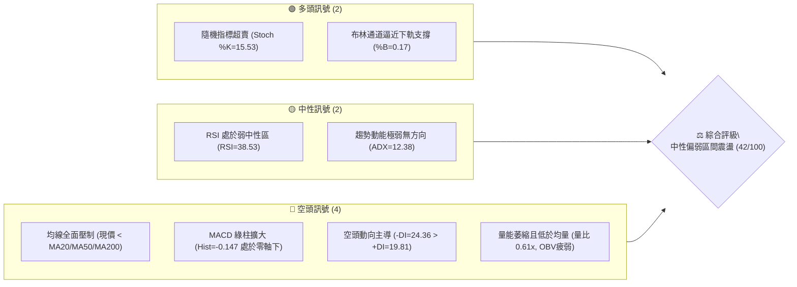
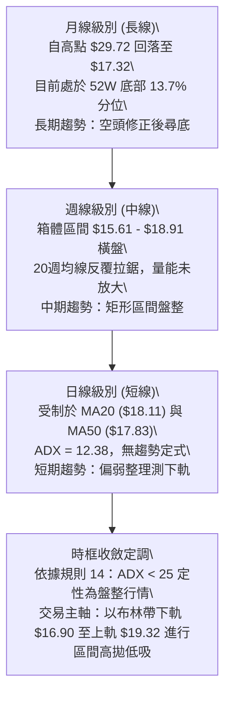
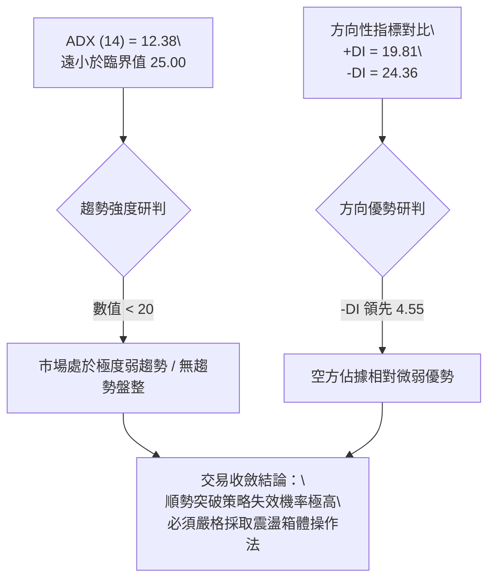
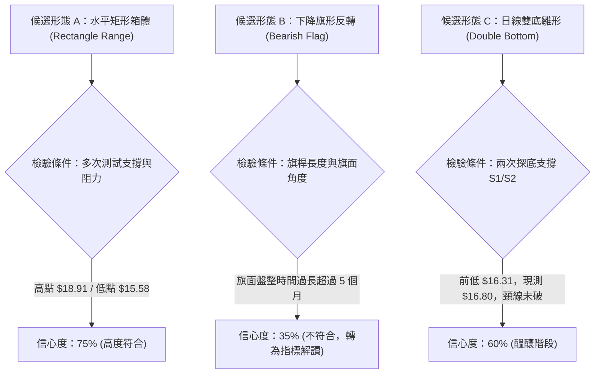
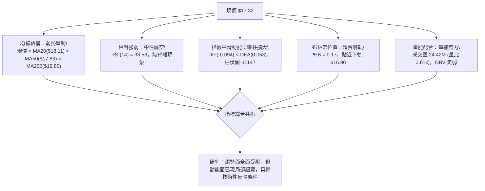
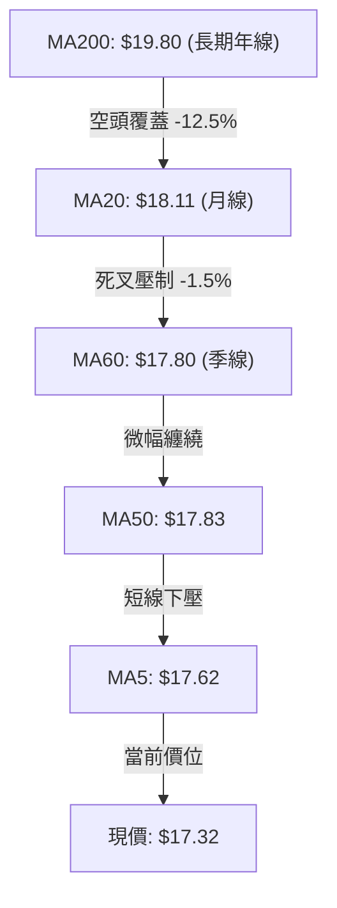
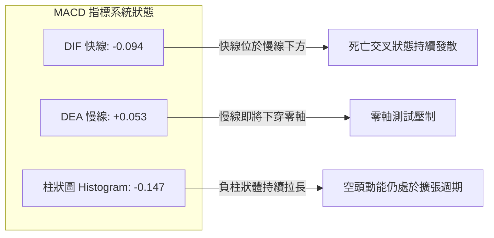
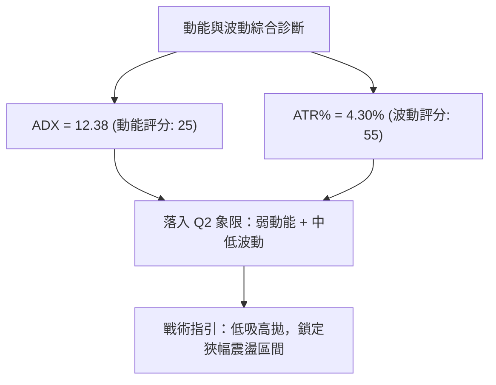
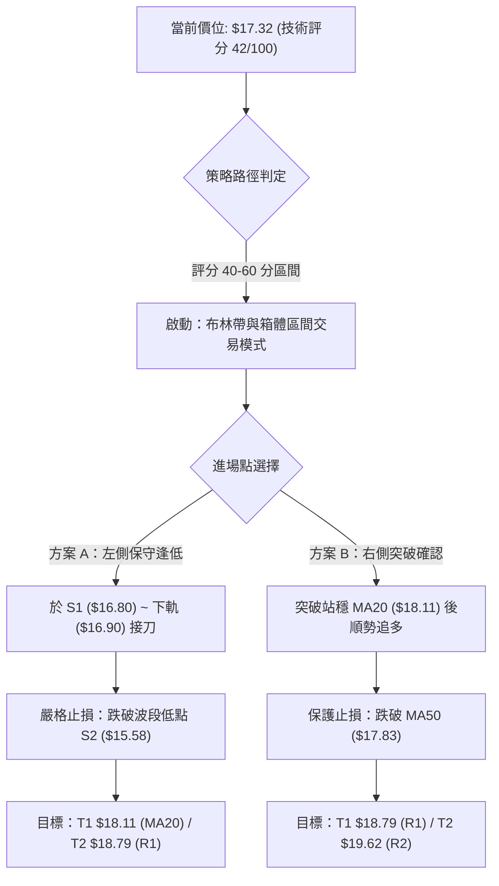
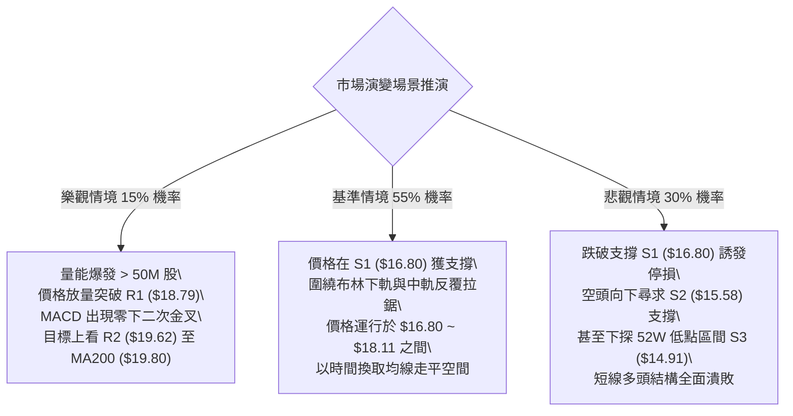

# SOFI 技術分析報告

> **報告日期**：2026-09-13 ｜ **語言**：繁體中文 ｜ **數據來源**：Yahoo Finance ｜ **當前價格**：$17.32

---

## 目錄

| 章節 | 內容 |
|------|------|
| [1. 技術面概覽](#1-技術面概覽) | 訊號儀表板、核心指標、評分卡 |
| [2. 趨勢分析](#2-趨勢分析) | 多時框趨勢、長中短期走勢 |
| [3. 圖表形態分析](#3-圖表形態分析) | 形態識別、K線組合、目標價 |
| [4. 支撐與阻力](#4-支撐與阻力) | 關鍵價位、斐波那契回調 |
| [5. 技術指標深度解讀](#5-技術指標深度解讀) | MA/RSI/MACD/布林/成交量 |
| [6. 動能與波動率](#6-動能與波動率) | 動能評估、ATR、Beta |
| [7. 多時框架總結](#7-多時框架總結) | 時框架評分矩陣 |
| [8. 交易策略建議](#8-交易策略建議) | 多空策略、風險報酬比 |
| [9. 風險提示與監控](#9-風險提示與監控) | 監控指標、風險場景 |
| [📋 報告總結](#-報告總結) | 核心結論與執行綱領 |

---

## 1. 技術面概覽

### 🎯 技術訊號儀表板



### 📊 核心指標速覽表

| 指標類別 | 指標名稱 | 當前數值 | 訊號 | 解讀 |
|----------|----------|----------|------|------|
| **價格** | 當前價格 | $17.32 | 🟡 | 位於52週區間13.7%低位區，短線受制於多重均線 |
| **均線** | MA20 | $18.11 | 🔴 | 價格低於MA20達-4.36%，短線下行斜率維持 |
| **均線** | MA50 | $17.83 | 🔴 | 價格低於中期生命線，中期結構偏空 |
| **均線** | MA200 | $19.80 | 🔴 | 價格顯著低於年線，長期牛熊分界線未收復 |
| **動能** | RSI(14) | 38.53 | 🟡 | 位於30-70中性偏空區間，尚未進入極度超賣，無底背離 |
| **動能** | MACD(12,26,9) | -0.094 | 🔴 | DIF位於Signal(0.053)下方，柱狀圖-0.147擴大，空方主導 |
| **震盪** | Stoch %K / %D | 15.53 / 14.24 | 🟢 | 雙線進入20以下嚴重超賣區，短線隨時醞釀技術性抽頭反彈 |
| **趨勢強度** | ADX(14) | 12.38 | 🟡 | 遠低於25門檻，無明確單邊趨勢，行情定性為盤整震盪 |
| **通道** | Bollinger %B | 0.17 | 🟢 | 逼近布林下軌($16.90)，通道開口收斂，具備均值回歸動能 |
| **波動** | ATR(14) | $0.75 | 🟡 | 佔股價4.30%，單日標準波幅可控，短線交易止損邊界明確 |
| **成交量** | 20日均量比 | 0.61x | 🔴 | 最新量24.42M低於均量39.97M，量縮破位，OBV處於均線下方 |

### 🏆 技術評分卡

```
╔══════════════════════════════════════════════════════════════╗
║                技術評分卡 — SOFI (2026-09-13)                 ║
╠══════════════════════════════════════════════════════════════╣
║ 趨勢強度 (Trend)     ████░░░░░░░░░░░░░░░░  25/100 🔴 弱勢空頭 ║
║ 動能指標 (Momentum)  ██████░░░░░░░░░░░░░░  35/100 🔴 偏弱無力 ║
║ 支撐穩定度 (Support) ████████████░░░░░░░░  60/100 🟡 S1具防守 ║
║ 成交量配合 (Volume)  ██████░░░░░░░░░░░░░░  30/100 🔴 量價背馳 ║
║ 形態完整度 (Pattern) ██████████░░░░░░░░░░  50/100 🟡 箱體打底 ║
║ 均線排列 (Moving Avg)████████░░░░░░░░░░░░  40/100 🔴 空頭反壓 ║
╠══════════════════════════════════════════════════════════════╣
║ 綜合評分 (Overall)   ████████░░░░░░░░░░░░  42/100 🟡 區間震盪 ║
╚══════════════════════════════════════════════════════════════╝
```

---

## 2. 趨勢分析

### 🌐 多時框趨勢分析



### 📈 長期趨勢 — 12個月走勢圖（Unicode）

下圖展示自 2025 年 9 月至 2026 年 9 月之完整 12 個月收盤價歷史演變軌跡，標注關鍵高點與當前相對位置：

```
SOFI 月線走勢圖（過去12個月：2025-09 至 2026-09）
價格軸 ($)
$30.00 ┤              ● 29.68  ● 29.72 (歷史峰頂 2025-11)
$28.00 ┤        
$26.00 ┤  ● 26.42              ● 26.18
$24.00 ┤
$22.00 ┤                          ● 22.81
$20.00 ┤
$18.00 ┤                                      ● 18.22  ● 17.93      ● 17.88
$16.00 ┤                                  ● 16.10              ● 16.31      ● 17.32 (現價)
$14.00 ┤                                ● 15.88 (波段次低)
       └────────────────────────────────────────────────────────────────────────────
月份     09/25  10/25  11/25  12/25  01/26  02/26  03/26  04/26  05/26  06/26  07/26  08/26  09/26
```

#### 走勢特徵分析表格

| 階段區間 | 時間跨度 | 起迄價格 | 區間漲跌幅 | 結構特徵與技術意義 |
|----------|----------|----------|------------|--------------------|
| **主升衝頂段** | 2025-09 ~ 2025-11 | $26.42 → $29.72 | +12.49% | 沿著月線多頭排列加速趕頂，於 $29.72 構築雙重頂部 |
| **快速退潮段** | 2025-11 ~ 2026-03 | $29.72 → $15.88 | -46.57% | 跌破所有短期均線，呈現無支撐單邊自由落體下跌 |
| **底部休整段** | 2026-03 ~ 2026-05 | $15.88 → $18.22 | +14.74% | 觸及波段低點聚類 S2 區間，出現初步超跌反彈買盤 |
| **箱體拉鋸段** | 2026-05 ~ 2026-09 | $18.22 → $17.32 | -4.94% | 於 $16.00 ~ $18.91 區間寬幅震盪，均線糾結成麻花 |

### 📊 中期趨勢（週線分析）

從近 20 週收盤走勢可見，價格始終受制於上方波段高點阻力 R1（$18.79）及 78.6% 斐波那契回調位（$18.70），下方則由近一年波段低點聚類 S1（$16.80）及 S2（$15.58）提供反覆承接。

```
週線級別核心博弈區間結構
═════════════════════════════════════════════════════════════════
$19.62 ────────────────────────────────────────── 阻力 R2 (反彈極限)
$18.79 ──┬─────────────────────────────────────── 阻力 R1 / 78.6% Fib ($18.70)
         │ [週線震盪核心區間：頂部反壓強烈，多頭量能無法持久]
$17.32 ──┼─────────────────────────────────────── 當前收盤價 ($17.32)
         │ [週線收斂測試區間：MACD 柱狀圖反覆翻紅翻綠]
$16.80 ──┴─────────────────────────────────────── 支撐 S1 / 布林下軌 ($16.90)
$15.58 ────────────────────────────────────────── 強支撐 S2 (箱體下邊緣)
═════════════════════════════════════════════════════════════════
```

### ⚡ 趨勢強度評估（ADX 解讀）



#### ADX 趨勢強度標準對照表

| ADX 區間 | 行情類型 | 本標的狀態 (12.38) | 戰術指導原則 |
|----------|----------|-------------------|--------------|
| **0 ~ 20** | **極弱/無趨勢** | **完全符合 (12.38)** | **禁止使用均線穿越突破買法；回歸均值交易** |
| 20 ~ 25 | 潛在趨勢醞釀 | 不符合 | 觀察通道擠壓方向，等待方向選擇 |
| 25 ~ 40 | 明確強趨勢 | 不符合 | 順應趨勢方向持倉，拉回加碼 |
| 40 以上 | 極端單邊行情 | 不符合 | 嚴防趨勢動能耗竭與極端反轉 |

---

## 3. 圖表形態分析

### 🔍 形態識別系統

依據形態學定義與量化規則，針對當前週線與日線圖表結構進行嚴格辨識：



#### 圖表形態信心度量化評估表

| 形態名稱 | 信心度 | 判斷依據（引用數據） | 完成度 | 目標價（附計算式） |
|----------|--------|----------------------|--------|--------------------|
| **水平矩形震盪箱體** | **75%** | 價格在近 20 週內於波段高點聚類 R1 ($18.79) 與波段低點聚類 S2 ($15.58) 之間運行 | 85% | 向上突破：$18.79 + ($18.79 - $15.58) = **$22.00**；向下跌破：$15.58 - ($18.79 - $15.58) = **$12.37** |
| **日線級別微型雙底** | **60%** | 2026-08-02 觸及低點 $16.31，隨後反彈至 $18.91，當前在 S1 ($16.80) 尋求二次支撐 | 50% | 頸線為 2026-08-23 收盤 $18.91。若突破頸線：$18.91 + ($18.91 - $16.31) = **$21.51** |
| **頭肩底形態** | **25%** | 數據中左肩與右肩對稱性嚴重不足，右側成交量萎縮無法匹配標準量價 | 20% | 訊號不足，僅做指標型解讀，不預設形態目標價 |

### 🕯️ 重要K線形態分析

| 週期/日期 | 收盤價 | K線形態特徵 | 技術含義解讀 | 多空訊號 |
|-----------|--------|-------------|--------------|----------|
| **2026-08-23** | $18.91 | 長上影倒錘頭線 (Inverted Hammer) | 向上挑戰 R1 ($18.79) 失敗，引來機構獲利了結盤壓制 | 🔴 空頭抵抗 |
| **2026-08-30** | $18.06 | 實體陰線失守 MA20 ($18.11) | 跌破短期多空生命線，短期上升動能夭折 | 🔴 空頭轉折 |
| **2026-09-06** | $18.22 | 縮量十字星 (Doji) | 多空在 MA20 附近陷入拉鋸，量能萎縮至 1.91 億股 | 🟡 變盤觀望 |
| **2026-09-13** | $17.32 | 帶下影小實體陰線 | 測試 S1 ($16.80) 與布林下軌 ($16.90)，出現初步技術逢低買盤 | 🟡 考驗支撐 |

### 📉 ASCII 走勢形態示意圖

下圖描繪近期價格在震盪箱體內的幾何波動形態：

```
近 10 週箱體震盪形態示意圖 (2026-07 至 2026-09)
價格 ($)
$19.00 ┤              ● 18.91 (箱頂頸線 / 接近 R1 $18.79)
$18.50 ┤      ● 18.38     │       ● 18.22
$18.00 ┤      │           ● 18.06 │       ┌───► 震盪中樞 (MA20 $18.11)
$17.50 ┤      │                   │       ▼
$17.00 ┤      │                   └─── ● 17.32 (現價：考驗 S1 $16.80)
$16.50 ┤  ● 16.31 (低點 A)
$16.00 ┤  (底 1)                         (潛在底 2 構築中)
       └──────────────────────────────────────────────────────────
週期      W-0802  W-0809  W-0823  W-0830  W-0906  W-0913
```

### 🎯 形態目標價計算

依據幾何對稱形態測幅原理：
1. **箱體上限壓制測算**：若現價 $17.32 於 S1（$16.80）確認有撐並發動反彈，首要測幅目標為箱體頂部即 R1（$18.79）。
   $$\text{第一目標空間} = \$18.79 - \$17.32 = +\$1.47 \ (+8.49\%)$$
2. **微型雙底突破測幅**：若未來放量突破頸線 $18.91，其理論等距投射高度為：
   $$\text{形態高度 } H = \$18.91 - \$16.31 = \$2.60$$
   $$\text{破位向上目標} = \$18.91 + \$2.60 = \$21.51$$
   *(註：此目標剛好與 61.8% 斐波那契位 $21.70 形成共振阻力區間)*。

---

## 4. 支撐與阻力

### 🗺️ 關鍵價位分布圖（Unicode）

```
SOFI 關鍵價位空間結構圖
═══════════════════════════════════════════════════════════════════════════
$21.70 ║████████████████████████████████████████║ 61.8% 斐波那契關鍵黃金分割位
$20.13 ║████████████████████████████████        ║ 強阻力 R3 (一年波段高點聚類)
$19.80 ║▒▒▒▒▒▒▒▒▒▒▒▒▒▒▒▒▒▒▒▒▒▒▒▒▒▒▒▒▒▒▒▒        ║ 牛熊分水嶺 (MA200 生命線)
$19.62 ║████████████████████                    ║ 阻力 R2 (反彈阻力位)
$19.32 ║────────────────────────────────────────║ 布林通道上軌
$18.79 ║████████████████████████████████████    ║ 關鍵阻力 R1 / 78.6% Fib ($18.70)
$18.11 ║┈┈┈┈┈┈┈┈┈┈┈┈┈┈┈┈┈┈┈┈┈┈┈┈┈┈┈┈┈┈┈┈┈┈┈┈┈┈┈┈║ 布林通道中軌 (MA20)
$17.32 ╠════════════════════════════════════════╣ ◄ 當前市價 ($17.32)
$16.90 ║────────────────────────────────────────║ 布林通道下軌
$16.80 ║▓▓▓▓▓▓▓▓▓▓▓▓▓▓▓▓▓▓▓▓▓▓▓▓▓▓▓▓▓▓▓▓        ║ 近期核心支撐 S1 (一年低點聚類)
$15.58 ║████████████████████████████████        ║ 強支撐 S2 (箱體下邊緣低點聚類)
$14.91 ║████████████████████████████████████████║ 終極底線 S3 (52W Low $14.88 聚類)
═══════════════════════════════════════════════════════════════════════════
```

### 🚧 阻力位分析表

所有價位均嚴格引用自「關鍵價位」與歷史均線數值：

| 阻力級別 | 價位 | 與現價距離 | 形成原因與籌碼性質 | 突破難度 | 重要性權重 |
|----------|------|------------|--------------------|----------|------------|
| **R1** | **$18.79** | +8.49% | 近一年波段高點密集聚類區；與 78.6% 斐波那契回調位（$18.70）共振 | 🟡 中等偏高 | ★★★★☆ |
| **R2** | **$19.62** | +13.28% | 2026 年初反彈高點聚類；接近 MA200（$19.80）強烈解套賣壓 | 🔴 極高 | ★★★★☆ |
| **R3** | **$20.13** | +16.22% | 歷史重合密集套牢區，多頭中期趨勢能否重啟的終極大門 | 🔴 極端困難 | ★★★★★ |

### 🛡️ 支撐位分析表

所有價位均嚴格引用自「關鍵價位」波段低點聚類數值：

| 支撐級別 | 價位 | 與現價距離 | 形成原因與防守買盤特徵 | 守住機率 | 重要性權重 |
|----------|------|------------|------------------------|----------|------------|
| **S1** | **$16.80** | -3.00% | 近一年波段低點聚類；與日線布林下軌（$16.90）形成密集成交防護帶 | 🟢 70% | ★★★★☆ |
| **S2** | **$15.58** | -10.05% | 2026-05 中旬回調打出的波段底部聚類；屬於中線價值買盤分水嶺 | 🟢 85% | ★★★★★ |
| **S3** | **$14.91** | -13.91% | 52 週最低點（$14.88）實體支撐帶，多頭年內防線的最後底線 | 🟢 95% | ★★★★★ |

### 📐 斐波那契回調位分析

依據 52 週區間高點 **$32.73** 至低點 **$14.88** 的完整波段進行黃金分割回調測算：

| 斐波那契層級 | 精確點位 | 當前相對位置 | 技術含義與路徑解讀 |
|--------------|----------|--------------|--------------------|
| 0.0% (52W High) | $32.73 | +88.97% | 2025 年牛市峰值，目前處於完全背離狀態 |
| 23.6% | $28.52 | +64.67% | 歷史牛市初次破位頸線 |
| 38.2% | $25.91 | +49.60% | 中長線反彈第一道極限天花板 |
| 50.0% | $23.80 | +37.41% | 心理均衡中軸分水嶺 |
| 61.8% | $21.70 | +25.29% | 黃金分割強壓力位，多頭扭轉中期熊市的前提 |
| **78.6%** | **$18.70** | **+7.97%** | **極限回調防守位，緊貼阻力 R1 ($18.79)，構成強大頂部蓋板** |
| **100.0% (52W Low)** | **$14.88** | **-14.09%** | **本輪大週期下行之絕對底線，緊貼支撐 S3 ($14.91)** |

**位置解讀**：現價 **$17.32** 落在 **78.6%（$18.70）與 100.0%（$14.88）之間**。這表明股價處於跌幅超過 78.6% 的深度回調弱勢區，距離年內最低點僅剩 13.7% 的緩衝空間。在此區域內，向下的空間被極致壓縮，向上的第一阻力位（$18.70 ~ $18.79）則構成近在咫尺的壓制帶。

---

## 5. 技術指標深度解讀

### 🎛️ 指標訊號總覽



### 📈 移動平均線排列分析



#### 移動平均線數據矩陣

| 均線名稱 | 數值 | 與現價距離 | 均線斜率與形態解讀 | 訊號評級 |
|----------|------|------------|--------------------|----------|
| **MA5** | $17.62 | -1.70% | 短線下行，5日扣抵高位，構成即時第一反壓 | 🔴 看空 |
| **MA10** | $17.74 | -2.37% | 短期均線空頭排列向下發散 | 🔴 看空 |
| **MA20** | $18.11 | -4.36% | 月線下傾，布林中軌，短線空頭防守核心點 | 🔴 看空 |
| **MA50** | $17.83 | -2.86% | 中期生命線平緩偏下，尚未形成多頭助推力 | 🔴 看空 |
| **MA60** | $17.80 | -2.70% | 季線位置與 MA50 重合，形成 $17.80 ~ $17.83 密集共振阻力帶 | 🔴 看空 |
| **MA120** | $17.27 | +0.29% | 半年線微幅走平，現價剛好踩在上方 (+0.05)，提供微弱技術性托底 | 🟢 看多 |
| **MA200** | $19.80 | -12.53% | 牛熊分界線，距離遙遠，中長期熊市結構尚未扭轉 | 🔴 看空 |
| **MA240** | $21.18 | -18.22% | 超長期下行趨勢線壓制 | 🔴 看空 |

### 📉 RSI(14) 分析

當前 RSI(14) 數值為 **38.53**：

```
RSI(14) 動能強度標尺
0 ──────────── 30 ────── 38.53 ──────────────── 70 ──────────── 100
[ 極度超賣區 ] │ [弱中性]  ▲     [強勢多頭區]    │ [ 極度超買區 ]
               └──────────┼─────────────────────┘
                          └── 當前位置：弱勢觀望
進度條：███████░░░░░░░░░░░░░ 38.53%
```

- **超買超賣評估**：數值 38.53 處於 30 至 70 的中性區間下沿，尚未進入低於 30 的極端超賣盲區，顯示空頭拋壓雖強但尚未竭盡。
- **背離分析結論**：檢視週線與日線走勢，2026-08-02 價格低點 $16.31 對應 RSI 約 37.4，而當前價格 $17.32 對應 RSI 38.53。價格未破前低，RSI 亦同步維持在 38 上方，**確認「無明顯底背離，亦無頂背離」**，動能與價格走勢保持高度線性一致。

### 📊 MACD(12,26,9) 訊號解讀



- **數值關係**：DIF 數值已跌破零軸進入負值區（-0.094），而 Signal 線尚處於微幅正值（+0.053）。
- **柱狀圖解讀**：Histogram 最新為 **-0.147**，較上週的 -0.065 負值顯著放大，表明短期空方下殺動能仍在釋放，未見紅柱翻揚或收斂跡象。

### 📦 布林通道分析

布林帶參數設定為（20, 2）：
- **BB 上軌**：$19.32
- **BB 中軌**：$18.11（即 MA20）
- **BB 下軌**：$16.90
- **布林 %B**：0.17

```
ASCII 布林通道空間位置示意圖
$19.32 ─────────────────────────────────────── 上軌 (Upper Band)
       │
       │
$18.11 ┈┈┈┈┈┈┈┈┈┈┈┈┈┈┈┈┈┈┈┈┈┈┈┈┈┈┈┈┈┈┈┈┈┈┈┈┈┈┈ 中軌 / MA20 (Middle Band)
       │
$17.32 ─────── ◄ 現價位 (%B = 0.17，偏向通道極底層)
       │
$16.90 ─────────────────────────────────────── 下軌 (Lower Band)
```

- **位置意義**：%B 僅為 0.17，代表價格已緊貼布林下軌（距離下軌僅 $0.42，約 2.4%）。
- **帶寬特徵**：通道寬度為 $(\$19.32 - \$16.90) / \$18.11 = 13.36\%$，處於中度收斂狀態，未見喇叭口開口放大，暗示股價跌破下軌走出單邊崩跌的機率極低，更有可能觸及下軌附近（$16.80 ~ $16.90）獲得均值回歸支撐。

### 💹 成交量分析（量價配合度）

- **量比現況**：當日成交量為 **24,422,500 股**，對比 20 日均量 **39,974,960 股**，量比僅 **0.61x**；對比 50 日均量 **61,917,900 股** 更呈現斷崖式萎縮。
- **量價關係解讀**：在價格跌穿短期均線的過程中，成交量同步劇烈萎縮，呈現典型「價跌量縮」格局。這代表市場主流資金並未出現恐慌性踩踏出逃，而是處於交投清淡、買盤意願低落的陰跌態勢。
- **OBV 能量潮解讀**：目前指標明確提示 **OBV < MA**，意味著能量潮線運行於均線下方，整體資金流向屬於淨流出，量能疲弱不支持大級別向上突破。

---

## 6. 動能與波動率

### ⚡ 動能評估四象限

評估市場在「動能強度（Momentum）」與「波動率水平（Volatility）」之定位：

| 象限 | 動能維度 (ADX / RSI) | 波動維度 (ATR / BBW) | 本標的狀態 | 交易環境與執行策略 |
|------|----------------------|----------------------|------------|--------------------|
| **Q1** | 強趨勢 (ADX > 25) | 低波動 (ATR 壓縮) | — | 趨勢突破醞釀點，極佳波段進場時機 |
| **Q2 (當前)** | **弱動能 (ADX=12.38)** | **低/中波動 (ATR=4.3%)** | **✓ (SOFI)** | **無方向垃圾時間，嚴禁追漲殺跌，僅限區間網格** |
| **Q3** | 強趨勢 (ADX > 25) | 高波動 (ATR 放大) | — | 單邊大牛/大熊市，適合順勢持倉跟隨 |
| **Q4** | 弱動能 (ADX < 25) | 極高波動 (混亂震盪) | — | 假突破洗盤頻繁，最易導致止損，應離場觀望 |



### 📊 ATR 波動率分析

- **ATR(14) 絕對數值**：**$0.75**。
- **ATR 波動比例**：佔當前股價 $17.32 的 **4.30%**。
- **單日波動預期**：在正常市場雜訊下，SOFI 的單日波動極限約在 $\pm \$0.75$ 之內。
- **交易止損設計考量**：
  - 超短線止損緩衝距離：$1.0 \times \text{ATR} = \$0.75$。
  - 波段防守止損距離：$1.5 \times \text{ATR} = 1.5 \times \$0.75 = \$1.125$。
  - 當前若在現價 $17.32 建立防守，合理波段止損應設定在 $\$17.32 - \$1.13 = \$16.19$（剛好落於強支撐 S2 $15.58 上方，合乎防守邏輯）。

### 📐 Beta 與市場相關性

- **Beta 數值**：**2.208**（極高 Beta 屬性）。
- **市場特徵分析**：SOFI 屬於高貝塔金融科技成長股，理論上其價格波動幅度為標普 500 指數的 2.2 倍。
- **宏觀環境聯動**：由於具備高貝塔特性，在缺乏自身基本面強烈催化劑下，其區間震盪容易受到整體美股科技板塊與利率環境的被動拉扯。高 Beta 特質意味著一旦市場風險偏好轉暖，其反彈彈性亦將顯著高於大盤。

---

## 7. 多時框架總結

### 📋 時框架評分表

| 時框架 | 趨勢方向 | 動能狀態 | 均線排列 | 圖表形態 | 綜合評分 | 操作指導建議 |
|--------|----------|----------|----------|----------|----------|--------------|
| **月線 (長期)** | 🔴 偏空修正 | RSI 偏弱 | 處於 MA200 下方 | 自高位 $29.72 回落尋底 | 35/100 | 長期處於超跌弱勢築底期，維持輕倉 |
| **週線 (中期)** | 🟡 矩形震盪 | MACD 綠柱拉長 | 均線糾結走平 | $15.58 ~ $18.79 大箱體 | 45/100 | 以箱體思維對待，高阻力低支撐 |
| **日線 (短期)** | 🔴 弱勢震盪 | Stoch 超賣/超跌 | 價格受制 MA5/20/50 | 逼近下軌 $16.90 與 S1 | 42/100 | 短線醞釀超賣反彈，逢低分批布局 |

### 🔲 綜合訊號矩陣

```
時框訊號一致性診斷矩陣
┌──────────────┬──────────────┬──────────────┬──────────────┐
│ 時框 / 維度   │ 趨勢指標     │ 震盪動能     │ 量價架構     │
├──────────────┼──────────────┼──────────────┼──────────────┤
│ 短期 (日線)  │ 🔴 空頭壓制  │ 🟢 超賣鈍化  │ 🔴 縮量無人  │
│ 中期 (週線)  │ 🟡 區間盤整  │ 🟡 中性平淡  │ 🔴 OBV疲軟   │
│ 長期 (月線)  │ 🔴 熊市修正  │ 🔴 弱勢區間  │ 🟡 底部萎縮  │
└──────────────┴──────────────┴──────────────┴──────────────┘
```

### ⚖️ 多時框收斂結論

依據**嚴格要求 14（多時框收斂規則）**進行標準收斂：
1. **趨勢/盤整定性**：當前日線 ADX(14) 數值僅為 **12.38**，遠低於 25 的趨勢行情閥值，**行情被嚴格定性為「典型低波動盤整行情」**。
2. **主導維度取捨**：依規則，盤整行情中中長期均線的單邊指引效力鈍化，**主導時框降維至日線布林通道（$16.90 ~ $19.32）與關鍵支撐阻力（S1 $16.80 / R1 $18.79）**。日線級別雖然被均線全面壓制，但由於 Stoch %K(15.53) 嚴重超賣且緊貼布林下軌，短線殺跌空間極其有限。
3. **唯一方向性結論**：**中性偏弱觀望，戰術主推「箱體下沿高勝率防守反彈」之區間操作**。此結論完全收斂第 1 章的評分（42/100）及第 8 章的交易策略。

---

## 8. 交易策略建議

### 🗺️ 策略決策流程圖



### 🧭 策略路由（依評分卡分流）

> **當前主策略方向 = 中性區間操作（依評分 42/100，處於 40–60 震盪中樞，以布林下軌至中軌之區間修復反彈為主）**

### 🎯 價格情境階梯（Price Scenarios）

本處所有點位嚴格引用自第 4 章「關鍵價位」之精確數值：

| 觸發條件 | 下一目標 | 後續延伸目標 | 情境含義與操作指引 |
|----------|----------|--------------|--------------------|
| **強勢向上突破 R1 ($18.79)** | R2 ($19.62) | R3 ($20.13) | 中期箱體向上破位，挑戰年線 MA200，轉為波段多頭 |
| **突破短期阻力 MA20 ($18.11)** | R1 ($18.79) | 78.6% Fib ($18.70) | 觸發日線級別均值回歸，向箱頂進發 |
| **維持於現價區間 ($17.32)** | BB中軌 ($18.11) | BB下軌 ($16.90) | 處於 17.00 - 18.00 狹幅黏著，適宜網格策略 |
| **跌破關鍵支撐 S1 ($16.80)** | S2 ($15.58) | S3 ($14.91) | 區間破位下行，短線多頭停損離場，測試年內前低 |

### 📊 情境機率分佈

```
情境機率分佈直方圖
┌──────────────────────────────────────────────────────────────┐
│ 區間震盪築底 (55%) : ███████████████████████████░░░░░░░░░░░░ │
│ 弱勢探底測試 S2 (30%): ███████████████░░░░░░░░░░░░░░░░░░░░░░ │
│ 強勢單邊突破 (15%) : ███████░░░░░░░░░░░░░░░░░░░░░░░░░░░░░░░ │
└──────────────────────────────────────────────────────────────┘
```

| 情境類別 | 預估機率 | 主要量化指標依據 |
|----------|----------|------------------|
| **區間震盪 / 觸底反彈** | **55%** | ADX 僅 12.38 證實無趨勢；Stoch (%K 15.53) 極度超賣；%B (0.17) 抵達下軌具備均值回歸牽引力 |
| **空頭下殺 / 考驗 S2 支撐** | **30%** | MACD 負柱狀體放大（-0.147）；均線系統（MA20/50/200）呈空頭壓制；成交量低迷缺乏買盤承接 |
| **直接突破 R1 單邊暴漲** | **15%** | 量比僅 0.61x，OBV 疲弱走低，無機構資金大規模吸籌暴量訊號 |

### 🟢 主策略詳情（區間操作多頭方案）

| 策略要素 | 策略 A（下軌左側低吸策略） | 策略 B（右側站穩均線加碼策略） |
|----------|----------------------------|--------------------------------|
| **進場條件** | 股價回踩 S1 ($16.80) 且 Stoch 出現金叉 | 實體收盤價突破並站穩 MA20 ($18.11) |
| **進場價格** | **$16.85**（S1 附近掛單） | **$18.15**（確認收復中軌進場） |
| **目標價 T1** | **$18.11**（BB 中軌 / MA20） | **$18.79**（強阻力 R1） |
| **目標價 T2** | **$18.79**（強阻力 R1 / 箱頂） | **$19.62**（波段阻力 R2） |
| **止損價格** | **$16.19**（進場點 - 1.5×ATR） | **$17.40**（MA50 $17.83 下方緩衝處） |
| **風險報酬比 (T1)** | $(\$18.11 - \$16.85) / (\$16.85 - \$16.19) = \mathbf{1.91 : 1}$ | $(\$18.79 - \$18.15) / (\$18.15 - \$17.40) = \mathbf{0.85 : 1}$ |
| **風險報酬比 (T2)** | $(\$18.79 - \$16.85) / (\$16.85 - \$16.19) = \mathbf{2.94 : 1}$ | $(\$19.62 - \$18.15) / (\$18.15 - \$17.40) = \mathbf{1.96 : 1}$ |
| **預估勝率** | **65%**（獲益於超賣與支撐聚類） | **50%**（受制於上方 R1 密集籌碼壓制） |
| **建議倉位** | **總資金 15%**（分批進場） | **總資金 10%**（動態追蹤加碼） |

### 🔴 反向風險觸發點（對沖提示）

若出現以下訊號，宣告當前區間反彈邏輯徹底瓦解，應立即全面停止做多並啟動空頭對沖：
1. **收盤價實體跌破 S1 ($16.80)** 且成交量放大超過 20 日均量（>40M），代表箱體破位下沉，下一站必探 S2（$15.58）。
2. **MACD DIF 快速下穿 -0.20**，負柱狀體加速延伸，代表空頭由陰跌轉化為強趨勢下殺。

### ⭐ 整體訊號強度評星

```
╔═══════════════════════════════════════════╗
║ 做多訊號強度：★★☆☆☆  (2.5/5星 - 僅限超賣反彈)║
║ 做空訊號強度：★★★☆☆  (3.0/5星 - 均線全面壓制)║
║ 整體可信度：  ★★★☆☆  (3.5/5星 - 盤整特徵明確)║
╚═══════════════════════════════════════════╝
```

---

## 9. 風險提示與監控

### ✅ 關鍵監控指標 Checklist

```
╔══════════════════════════════════════════════════════════════╗
║               SOFI 交易監控關鍵指標 CHECKLIST                 ║
╠══════════════════════════════════════════════════════════════╣
║ [ ] 價格是否跌破布林下軌 $16.90 或關鍵支撐 S1 $16.80？       ║
║ [ ] Stoch %K 是否在 20 以下重新向上金叉 %D？                  ║
║ [ ] 每日成交量是否放大越過 20 日均量 (39.97M 股)？            ║
║ [ ] RSI(14) 能否重新站上 50 中性多空分水嶺？                 ║
║ [ ] 日線收盤價能否有效收復 MA20 ($18.11) 扭轉短天下行？       ║
║ [ ] MACD 柱狀圖是否縮減翻紅 (當前 -0.147)？                  ║
║ [ ] ADX(14) 是否向上突破 20，宣告單邊行情爆發？              ║
╚══════════════════════════════════════════════════════════════╝
```

### ⚠️ 風險場景分析



### 🛡️ 風險管理重要提醒

1. **高 Beta 波動懲罰機制**：SOFI Beta 高達 **2.208**，代表其單日振幅極易超出普通標的預期。在資金管理上，單筆交易的最大承擔損失金額（Risk at Capital）不得超過總資產的 **1.0%**。
2. **量能陷阱防範**：目前量比僅 0.61x，在無量環境下的任何微幅向上拉升多為「虛假突破」，切忌在盤中看到急拉便盲目市價追高，進場點務必嚴格限制在支撐聚類帶 S1（$16.80）附近。
3. **空頭排列均線壓制原則**：由於 MA20、MA50、MA200 呈標準自上而下的逆向壓制狀態，任何反彈觸及 MA20（$18.11）或 R1（$18.79）均屬於潛在的解套獲利賣點，不可將震盪反彈行情誤判為長期反轉大牛市。

---

## 📋 報告總結

```
╔════════════════════════════════════════════════════════════════╗
║                   SOFI 技術分析報告總結                        ║
╠════════════════════════════════════════════════════════════════╣
║ 報告日期：2026-09-13                                           ║
║ 當前價格：$17.32                                               ║
║ 分析評級：⚖️ 中性偏弱盤整（技術評分 42/100）                   ║
║                                                                ║
║ 關鍵結論：                                                     ║
║ ├─ 長期趨勢：🔴 弱勢空頭修正，處於 52W 低位區間 13.7% 分位      ║
║ ├─ 中期趨勢：🟡 矩形箱體橫盤 ($15.58 ~ $18.79)，量能萎縮        ║
║ ├─ 短期趨勢：🔴 均線反壓，但 Stoch 極度超賣，逼近下軌支撐      ║
║ ├─ 關鍵支撐：S1: $16.80 ｜ S2: $15.58 ｜ S3: $14.91            ║
║ ├─ 關鍵阻力：R1: $18.79 ｜ R2: $19.62 ｜ R3: $20.13            ║
║ └─ 分析師目標：均價 $20.34 (最高 $30.00 / 最低 $12.00)         ║
║                                                                ║
║ 最優策略組合：                                                 ║
║ 1. 🥇 最佳機會：回踩 S1 ($16.80) 結合超賣佈局反彈，搏均值回歸   ║
║ 2. 🥈 次選機會：突破並站穩 MA20 ($18.11) 後右側加碼，目標 R1   ║
║ 3. 🥉 保守選擇：場外空倉觀望，等待 ADX > 20 方向明朗再行介入   ║
╚════════════════════════════════════════════════════════════════╝
```

---

> ⚠️ **免責聲明**：本報告為技術分析研究，所有點位、走勢及機率估算均基於歷史量化價量數據客觀演算。本報告**僅供學術交流與交易邏輯參考**，**不構成任何要約、招攬或實質投資建議**。金融市場具有極高不確定性與風險，投資人應獨立評估財務狀況並嚴格執行風險管理。

---

*報告生成時間：2026-09-13 ｜ 數據來源：Yahoo Finance ｜ 分析框架：多時框技術分析體系*