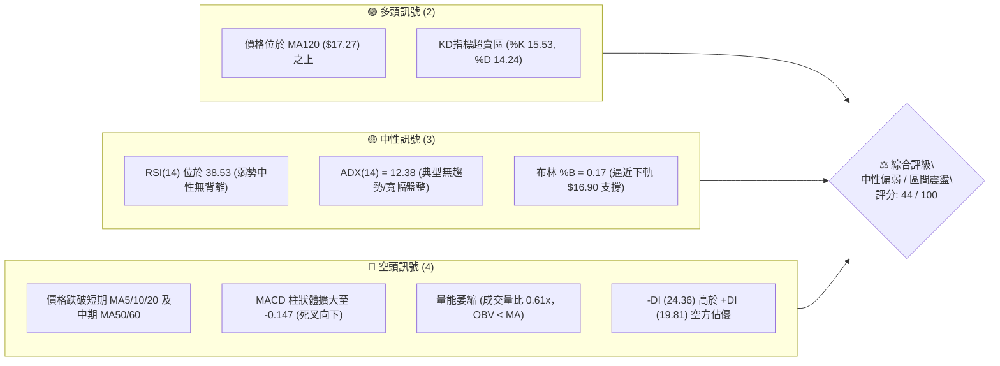
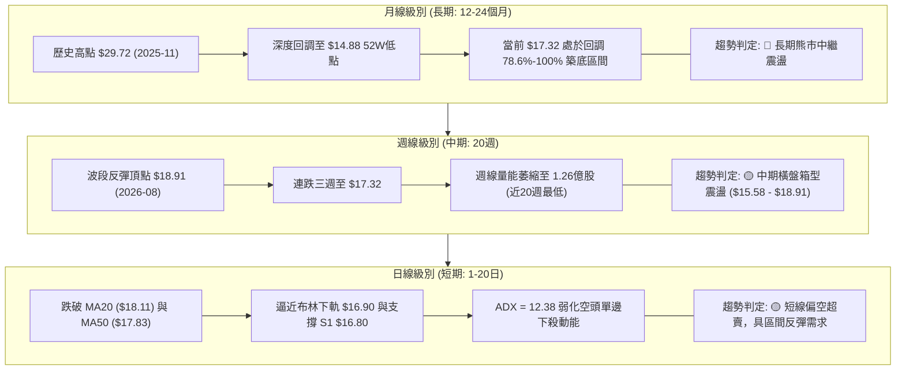
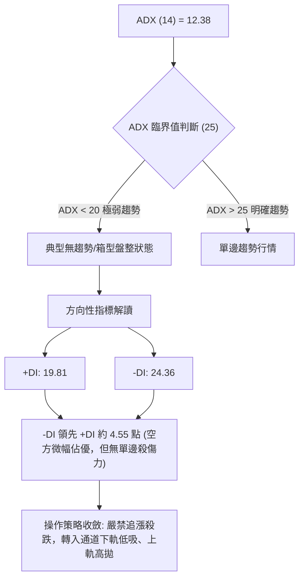
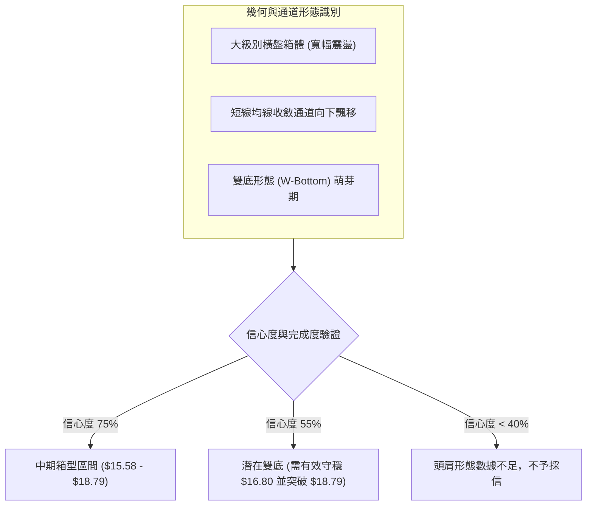
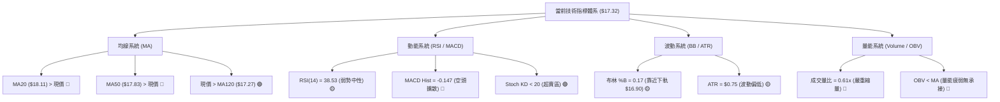
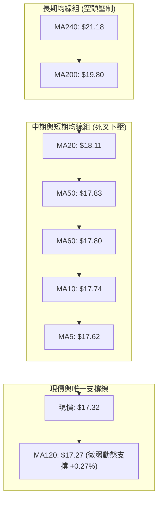
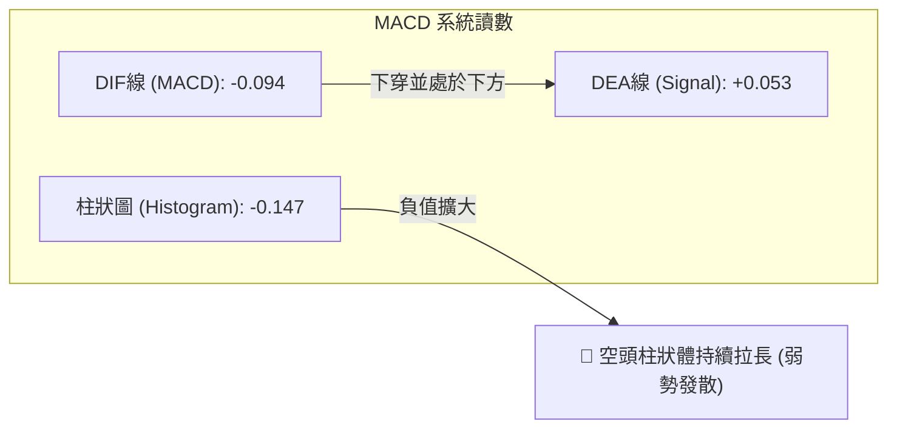
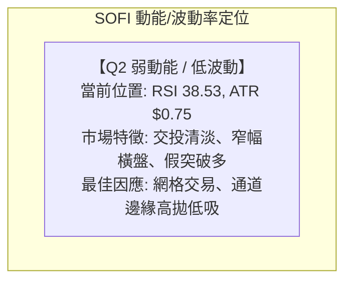
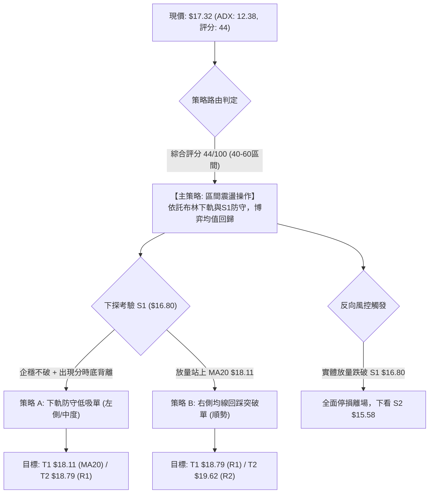
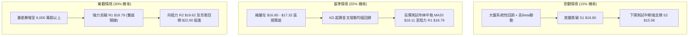

# SOFI 技術分析報告

> **報告日期**：2026-09-14 ｜ **語言**：繁體中文 ｜ **數據來源**：Yahoo Finance ｜ **當前價格**：$17.32

---

## 目錄

| 章節 | 內容 |
|------|------|
| [1. 技術面概覽](#1-技術面概覽) | 訊號儀表板、核心指標、評分卡 |
| [2. 趨勢分析](#2-趨勢分析) | 多時框趨勢、長中短期走勢、ADX解讀 |
| [3. 圖表形態分析](#3-圖表形態分析) | 形態識別、K線組合、形態信心度 |
| [4. 支撐與阻力](#4-支撐與阻力) | 關鍵價位、斐波那契回調、結構圖 |
| [5. 技術指標深度解讀](#5-技術指標深度解讀) | MA/RSI/MACD/布林通道/量價配合 |
| [6. 動能與波動率](#6-動能與波動率) | 動能四象限、ATR波動度、Beta分析 |
| [7. 多時框架總結](#7-多時框架總結) | 時框架矩陣、多時框收斂定調 |
| [8. 交易策略建議](#8-交易策略建議) | 策略路由、區間操作佈局、情境階梯 |
| [9. 風險提示與監控](#9-風險提示與監控) | 監控Checklist、極端情境與風控 |
| [📋 報告總結](#-報告總結) | 總結儀表板與執行結論 |

---

## 1. 技術面概覽

### 🎯 技術訊號儀表板



### 📊 核心指標速覽表

| 指標類別 | 指標名稱 | 當前數值 | 訊號 | 解讀 |
|:---------|:---------|:---------|:----:|:-----|
| **價格** | 當前收盤價 | $17.32 | 🟡 | 位於52週區間13.7%處，緊貼近一年波段底部聚類 |
| **均線** | 短期 MA20 | $18.11 | 🔴 | 價格低於MA20達-4.36%，短線空方壓制明顯 |
| **均線** | 中期 MA50 | $17.83 | 🔴 | 價格低於MA50達-2.86%，中期反彈動能衰減 |
| **均線** | 長期 MA200 | $19.80 | 🔴 | 價格位於長期牛熊分水嶺之下達-12.53%，長期偏空 |
| **均線** | 半年 MA120 | $17.27 | 🟢 | 價格微幅守在MA120上方+0.27%，提供微弱動態支撐 |
| **動能** | RSI(14) | 38.53 | 🟡 | 位於30-70中性偏弱區間，尚未進入極度超賣，無底背離 |
| **動能** | MACD (12,26,9) | -0.094 | 🔴 | DIF線位於信號線(0.053)下方，MACD柱狀圖-0.147持續發散 |
| **震盪** | Stoch %K / %D | 15.53 / 14.24 | 🟢 | 兩者均低於20，進入深度超賣區，醞釀技術性回抽 |
| **趨勢** | ADX(14) | 12.38 | 🟡 | 數值遠低於25，表明當前無強勢單邊趨勢，屬箱型盤整 |
| **方向** | +DI / -DI | 19.81 / 24.36 | 🔴 | -DI高於+DI，空頭力量暫時主導盤面結構 |
| **通道** | 布林帶 (%B) | 0.17 | 🟡 | 價格位於下軌($16.90)與中軌($18.11)之間，貼近下軌 |
| **成交量** | 20日均量比 | 0.61x | 🔴 | 成交量2,442萬股 vs 20MA 3,997萬股，無量陰跌特徵 |
| **波動** | ATR(14) | $0.75 | 🟡 | 佔價格4.30%，日波動相對平緩，區間防守有效性高 |

### 🏆 技術評分卡

```
╔══════════════════════════════════════════════════════════════╗
║              技術評分卡 — SOFI (2026-09-14)                  ║
╠══════════════════════════════════════════════════════════════╣
║ 趨勢強度      █████░░░░░░░░░░░░░░░  28/100  🔴 (ADX極弱，無趨勢) ║
║ 動能指標      ███████░░░░░░░░░░░░░  36/100  🔴 (MACD偏空，KD超賣)║
║ 支撐穩定度    ████████████░░░░░░░░  60/100  🟡 (S1/下軌重疊守護)║
║ 成交量配合    ██████░░░░░░░░░░░░░░  30/100  🔴 (量縮萎靡，OBV偏弱)║
║ 形態完整度    ████████████░░░░░░░░  62/100  🟡 (處於箱體底部收斂)║
║ 均線排列      ████████░░░░░░░░░░░░  42/100  🔴 (均線空頭排列發散)║
╠══════════════════════════════════════════════════════════════╣
║ 綜合評分      █████████░░░░░░░░░░░  44/100  ⚖️ 區間弱勢震盪      ║
╚══════════════════════════════════════════════════════════════╝
```

---

## 2. 趨勢分析

### 🌐 多時框趨勢分析



### 📈 長期趨勢 — 12個月走勢圖（Unicode）

以 2025 年 10 月至 2026 年 09 月實際收盤數據繪製：

```
SOFI 月線走勢圖（過去12個月）
價格軸 ($)
$30.00 ┤        ●(2025-11 $29.72 高點)
$28.00 ┤     ●  │
$26.00 ┤        │  ●(2025-12 $26.18)
$24.00 ┤        │  │
$22.00 ┤        │  │  ●(2026-01 $22.81)
$20.00 ┤        │  │  │
$18.00 ┤        │  │  │        ●(05月 $18.22)  ●(08月 $17.88)
$17.00 ┤        │  │  │        │  │        │  │  ●← 當前現價 $17.32 (09月)
$16.00 ┤        │  │  │  ●(02月)│  ●(04月)  ●(07月 $16.31)
$14.00 ┤        │  │  │  │  ●(2026-03 $15.88 低點)
       └────────┴──┴──┴──┴──┴──┴──┴──┴──┴──┴──┴──
       月份:    10 11 12 01 02 03 04 05 06 07 08 09 (2025-2026)
```

#### 走勢特徵分析表格

| 階段區間 | 起止價格 | 漲跌幅 | 結構特徵與量價解讀 |
|:---------|:---------|:------:|:-------------------|
| **衝頂見頂期**<br>(2025/10 - 2025/11) | $29.68 → $29.72 | +0.13% | 雙月築頂，上攻動能耗盡，形成歷史波段次高峰與大雙頂形態 |
| **主跌下瀉期**<br>(2025/12 - 2026/03) | $26.18 → $15.88 | -39.34%| 連續四個月實體長陰下挫，跌破各級均線，在 $14.88 探出52週新低 |
| **修復反彈期**<br>(2026/04 - 2026/05) | $16.10 → $18.22 | +13.17%| 出現超跌反彈，多頭資金回流，月線連續反抽收復 $18.00 整數關卡 |
| **寬幅箱體期**<br>(2026/06 - 2026/09) | $17.93 → $17.32 | -3.40% | 進入 $16.00 - $18.90 的窄幅箱型整理，波動率持續收斂，量能萎縮 |

### 📊 中期趨勢（週線分析）

中期走勢圖明確呈現近期週線級別的箱體收斂特徵：

```
SOFI 週線價格通道與波段示意圖 (2026-05 至 2026-09)
阻力區間 $18.91 ═══════════●(08-23 高點 $18.91)══════════ 阻力 R1 ($18.79)
                      ╱     ╲
                     ╱       ╲     ●(09-06 $18.22)
中樞震盪 $17.50 ────●─────────●─────────┼───► 現價 $17.32 (接近下沿)
                   ╱ (06-28)   ╲       │
                  ╱             ●(07-19 $17.28)
支撐區間 $15.58 ═●(05-17 $15.61)════════════════════════ 支撐 S2 ($15.58)
```

中期週線在 2026-05-17 下探 $15.61 後止跌企穩，8月下旬反彈至 $18.91（極接近關鍵阻力 R1 $18.79），隨後遭遇強大技術拋壓，近三週週線呈現陰跌格局（$18.91 → $18.06 → $18.22 → $17.32），但伴隨週成交量從 2.53 億股大幅驟降至 1.26 億股，說明下殺並無恐慌性拋盤，中線本質依舊為「無主導趨勢的籌碼沉澱階段」。

### ⚡ 趨勢強度評估（ADX 解讀）



#### ADX 強度對照表

| ADX 區間 | 趨勢強度定義 | 當前 SOFI 狀態 | 操作策略指引 |
|:---------|:-------------|:--------------:|:-------------|
| **0 - 20** | **極弱趨勢 / 盤整市場** | **12.38 (當前)** | **順勢指標（均線/MACD）頻繁發出假訊號，震盪指標（布林/%K%D）更具參考價值** |
| 20 - 25 | 趨勢醞釀中 / 轉折過渡期 | 否 | 觀察突破或跌破方向，降低槓桿 |
| 25 - 40 | 強趨勢建立 | 否 | 採用突破策略，跟隨主趨勢加碼 |
| 40 - 60 | 極強單邊行情 | 否 | 移動止損，防範動能衰竭尖銳反轉 |

---

## 3. 圖表形態分析

### 🔍 形態識別系統



#### 形態信心度評估表

| 形態類別 | 信心度 | 判斷依據（引用數據） | 完成度 | 目標價（附計算式） |
|:---------|:------:|:---------------------|:------:|:-------------------|
| **矩形橫向箱體** | **75%** | 上沿多次受阻於波段高點聚類 R1 $18.79，下沿受波段低點聚類 S2 $15.58 支撐，近4個月收盤於此區間內 | 85% | 箱體上沿 R1: **$18.79**<br>若向下假突破則為 S2: **$15.58** |
| **潛在雙底 (W底)** | **55%** | 第一低點為 2026-05-17 收盤 $15.61（對應 S2 $15.58），第二低點於 2026-08-02 收盤 $16.31（高於前低）。現價回測中軌下沿 | 60% | 形態高度 = 頸線 R1 $18.79 - 底部 S2 $15.58 = $3.21。<br>突破目標價 = 頸線 $18.79 + $3.21 = **$22.00**（接近斐波那契61.8% $21.70） |
| **布林帶下軌擠壓** | **70%** | 布林中軌 MA20 $18.11 下彎，價格貼近下軌 $16.90，%B 跌至 0.17 | 90% | 回歸中軌目標價 = **$18.11**（即當前 MA20 價位） |
| **頭肩底形態** | **25%** | 形態左右肩成交量與結構極不對稱，左肩低點不明顯 | 30% | *數據不足以支撐幾何形態，僅做指標型解讀，不設目標價* |

### 🕯️ 重要K線形態分析

| 週/月份 | 收盤價 | K線形態特徵 | 量價關係解讀 | 技術訊號 |
|:---------|:------:|:------------|:-------------|:--------:|
| **2026-05-17 (週)** | $15.61 | 長下影錘頭線 (Hammer) | 探底至接近波段支撐聚類 S2 ($15.58) 後拉回，空方動能耗竭 | 🟢 強烈見底 |
| **2026-05-31 (週)** | $18.22 | 突破大陽線 (Marubozu) | 放量至3.67億股，週線拉升+16.6%，一舉穿透 MA20 與 MA50 | 🟢 短線反轉 |
| **2026-08-23 (週)** | $18.91 | 流星線 (Shooting Star) | 向上衝擊 R1 ($18.79) 未能站穩，留出長上影線，量能未放大 | 🔴 頂部受阻 |
| **2026-09-13 (週)** | $17.32 | 縮量光腳中陰線 | 下殺但週成交量驟縮至1.26億股（歷史極低位），呈現「跌無量」格局 | 🟡 變盤前夕 |

### 📉 ASCII 走勢形態示意圖

```
SOFI 潛在雙底（W底）與箱型整理示意圖
$19.62 ┤                                        [阻力 R2]
$18.79 ┤             頸線位 (波段高點 R1)
       ┤               ●(05-31)          ●(08-23)
$18.00 ┼──────────────╱─╲──────────────╱─╲────── [布林中軌 MA20]
       ┤             ╱   ╲            ╱   ╲  ← 現價 $17.32 (下探中)
$17.00 ┤            ╱     ●(06-07)  ╱     ●(當前)
$16.80 ┼───────────╱────────────────╱────── [支撐 S1 / 布林下軌]
       ┤          ╱      (次低點)  ╱
$15.58 ┤         ●(05-17)        ●(08-02 $16.31)
       ┤      [第一低點 S2]
       └─────────────────────────────────────────────
```

### 🎯 形態目標價計算

依據嚴格技術形態學，若 SOFI 能在 S1 ($16.80) 守穩並發動反彈，向上突破頸線 R1 ($18.79) 且經回踩確認，其量度漲幅計算公式如下：

1. **基礎形態參數**：
   - 形態底部低點：$15.58（取近一年聚類支撐 S2）
   - 形態頸線高點：$18.79（取近一年聚類阻力 R1）
   - 形態垂直高度 ($H$)：$18.79 - $15.58 = **$3.21**
2. **量度推算目標**：
   - 第一階段目標（箱頂回歸）：**$18.79**（即突破 R1 本身）
   - 第二階段目標（破頸線等長推升）：頸線 $18.79 + 形態高度 $3.21 = **$22.00**（此位置與斐波那契 61.8% 回調位 **$21.70** 及 MA240 **$21.18** 形成強烈共振重疊）

---

## 4. 支撐與阻力

### 🗺️ 關鍵價位分布圖（Unicode）

```
SOFI 價位結構分布圖
══════════════════════════════════════════════════════════════════════
$20.13 ║██████████████████████████████║ 強阻力 R3 (密集套牢頂部)
$19.80 ║──────────────────────────────║ 長期牛熊線 MA200
$19.62 ║████████████████████          ║ 阻力 R2 (反彈高點聚類)
$19.32 ║┄┄┄┄┄┄┄┄┄┄┄┄┄┄┄┄┄┄┄┄┄┄┄┄┄┄┄┄║ 布林通道上軌
$18.79 ║██████████████████████████████║ 關鍵阻力 R1 / 頸線 (Fib 78.6%: $18.70)
$18.11 ║┈┈┈┈┈┈┈┈┈┈┈┈┈┈┈┈┈┈┈┈┈┈┈┈┈┈┈┈┈┈║ 布林中軌 / MA20
$17.32 ╠══════════════════════════════╣ ◄ 現價 ($17.32)
$17.27 ║──────────────────────────────║ 半年線 MA120
$16.90 ║┄┄┄┄┄┄┄┄┄┄┄┄┄┄┄┄┄┄┄┄┄┄┄┄┄┄┄┄║ 布林通道下軌
$16.80 ║▓▓▓▓▓▓▓▓▓▓▓▓▓▓▓▓              ║ 近期第一支撐 S1 (-3.00%)
$15.58 ║██████████████████████████████║ 核心波段強支撐 S2 (-10.07%)
$14.88 ║██████████████████████████████║ 歷史極限支撐 S3 / 52W低點 ($14.91聚類)
══════════════════════════════════════════════════════════════════════
```

### 🚧 阻力位分析表

所有價位均直接取自技術數據中的聚類運算結果：

| 阻力級別 | 精確價位 | 距現價空間 | 形成技術依據與籌碼屬性 | 突破難度 | 重要性 |
|:---------|:--------:|:----------:|:-----------------------|:--------:|:------:|
| **阻力 R1** | **$18.79** | +8.46% | 近一年波段高點聚類處；高度重疊斐波那契 78.6% 回調位 ($18.70) 與 2026-08-23 高點 ($18.91) | 中等 | ⭐⭐⭐⭐⭐ |
| **阻力 R2** | **$19.62** | +13.27%| 次級波段回調反抽頂部；與長期 MA200 ($19.80) 構成沉重雙重壓制帶 | 較高 | ⭐⭐⭐⭐ |
| **阻力 R3** | **$20.13** | +16.22%| 近一年多重頂部籌碼密集堆積區；整數心理大關 $20.00 攻防節點 | 極高 | ⭐⭐⭐ |

### 🛡️ 支撐位分析表

所有價位均嚴格取自技術數據中的聚類運算結果：

| 支撐級別 | 精確價位 | 距現價空間 | 形成技術依據與籌碼屬性 | 守住機率 | 重要性 |
|:---------|:--------:|:----------:|:-----------------------|:--------:|:------:|
| **支撐 S1** | **$16.80** | -3.00% | 近一年密集低點聚類；與當前布林下軌 ($16.90) 形成極佳的動靜共振防線 | 65% | ⭐⭐⭐⭐ |
| **支撐 S2** | **$15.58** | -10.07%| 2026年5月兩度探底止跌位（$15.61/15.75）；中期多頭反攻的生命線 | 80% | ⭐⭐⭐⭐⭐ |
| **支撐 S3** | **$14.91** | -13.91%| 52週最低點 $14.88 之上的微幅聚類緩衝帶；跌破則意味著全面破位創歷史新低 | 92% | ⭐⭐⭐⭐⭐ |

### 📐 斐波那契回調位分析

依據 52 週最高點 **$32.73** 至 52 週最低點 **$14.88**（總垂直落差 $17.85）之完整回調體系：

| 斐波那契比率 | 對應精確價位 | 相對現價 ($17.32) 位置與結構含義 |
|:-------------|:------------:|:----------------------------------|
| **0.0% (52W High)** | **$32.73** | 週期頂部，當前牛市極限延伸阻力 |
| **23.6%** | **$28.52** | 強多頭控盤防守位，2025年第四季度破位後轉為超強壓力 |
| **38.2%** | **$25.91** | 中長線反彈第一道黃金分割重壓 |
| **50.0%** | **$23.80** | 多空力量強弱均衡軸心線 |
| **61.8%** | **$21.70** | 黃金分割強壓力位，多頭扭轉長期頹勢的關鍵里程碑 |
| **78.6%** | **$18.70** | **當前上方最直接壓制線**，與阻力 R1 ($18.79) 僅相差 9 美分 |
| **100.0% (52W Low)**| **$14.88** | 52週週期低點，下行終極絕對防線 |

> 📌 **位置判定**：當前現價 **$17.32** 落在 **78.6% 回調位 ($18.70)** 與 **100.0% 回調位 ($14.88)** 之間的底部深水區。從技術結構解讀，自 $32.73 下跌以來的回撤幅度已超過 86%，表明長期空頭趨勢已接近釋放尾聲，但尚未收復 78.6%（$18.70），處於典型的「低位沉澱蓄勢」形態。

---

## 5. 技術指標深度解讀

### 🎛️ 指標訊號總覽



### 📈 移動平均線排列分析



#### 均線發散與斜率特徵表

| 均線名稱 | 當前數值 | 現價差距 (%) | 數值走勢特徵 | 訊號意涵 |
|:---------|:--------:|:------------:|:-------------|:--------:|
| **MA 5** | $17.62 | -1.69% | 短線下傾加速，壓制每日反抽 | 🔴 空方控盤 |
| **MA 10** | $17.74 | -2.38% | 剛下穿 MA60，構成極短線第一阻力線 | 🔴 短空加劇 |
| **MA 20** | $18.11 | -4.36% | 下彎趨勢未改，為布林中軌基準線 | 🔴 波段壓制 |
| **MA 50** | $17.83 | -2.86% | 與 MA60 幾乎粘合，中期趨勢走平偏下 | 🟡 中期橫向 |
| **MA 60** | $17.80 | -2.72% | 長期震盪平台中樞 | 🟡 震盪中樞 |
| **MA 120** | $17.27 | +0.27% | 走勢微幅上揚，半年線是唯一位於現價下方的均線 | 🟢 邊際防守 |
| **MA 200** | $19.80 | -12.53%| 穩定下行，長線處於熊市技術壓制 | 🔴 長期走空 |
| **MA 240** | $21.18 | -18.23%| 年線斜率朝下，上方套牢壓力深重 | 🔴 重壓區 |

### 📉 RSI(14) 分析

當前 RSI(14) 數值為 **38.53**：
- **數值進度條**：`[0] ──────────────[38.53]████████░░░░░░░░░░░░ ────────────── [100]`
- **超買超賣狀態**：處於 30 至 70 之間的中性偏空區域。尚未進入極端超賣區（< 30），代表空方下壓仍有餘裕，但也未出現恐慌甩轎。
- **背離分析判斷**：
  - 回溯 2026-05-10 低點 $15.75 時 RSI 為 **24.9**；隨後 2026-05-17 跌至 $15.61 時 RSI 反彈至 **30.2**，曾出現底背離促成 5 月底的大反彈。
  - 然而在近一個月（8月中旬至9月中旬），價格自 $18.91 回落至 $17.32，RSI 自 57.9 穩步滑落至 38.53，**價格走低且 RSI 同步走低，兩者斜率一致，目前不存在任何頂背離或底背離跡象**。技術訊號為正常的下行釋放。

### 📊 MACD(12/26/9) 訊號解讀



- **現況解析**：MACD 快線已下穿信號線，柱狀體由 8 月下旬的 +0.063 轉負，近三週持續下行（-0.025 → -0.065 → -0.147）。柱狀圖呈現持續的綠色實體擴大，顯示短線空頭賣壓仍處於釋放週期中，尚未見到紅柱收斂或翻正跡象。

### 📦 布林通道分析

```
SOFI 布林通道結構圖（參數：20, 2）
$19.32 ┬  ────────────────────────── 上軌 ($19.32)
       │
$18.11 ┼  - - - - - - - - - - - - -  中軌 / MA20 ($18.11)
       │    現價 $17.32 位於此區間 (下半區間)
$17.32 ┼──● (%B = 0.17)
       │
$16.90 ┴  ────────────────────────── 下軌 ($16.90)
```

- **帶寬特徵**：布林帶寬 ($19.32 - $16.90 = $2.42)，佔價格比約 14%，處於歷史收斂中段，並無單邊喇叭口極度張開跡象。
- **位置解讀**：現價落於 **%B = 0.17**，極度貼近下軌（$16.90）。由於 ADX 僅為 12.38，依據統計套利原則，價格在盤整市中直接跌破並持續貼軌暴跌的概率偏低，下軌 $16.90 與波段支撐 S1 ($16.80) 構成的支撐帶具備強烈均值回歸拉力。

### 💹 成交量分析（量價配合度）

- **量比與均量比較**：當日成交量為 **24,422,500 股**，遠低於 20 日均量（**39,974,960 股**，量比僅 **0.61x**），更僅有 50 日均量（**61,917,900 股**）的 39.4%。
- **週級別量能驗證**：最新一週成交量萎縮至 **126,196,200 股**，創下近20週數據最低紀錄（相較於5月高峰 4.9億股萎縮近 74%）。
- **OBV 趨勢**：數據顯示 `OBV < MA`，量能能量線持續壓制在均線之下，說明雖然下殺無恐慌量，但亦無任何機構主力進場大舉掃貨的痕跡，市場交易意願降至冰點，量價關係呈現「弱量陰跌、靜待契機」的特徵。

---

## 6. 動能與波動率

### ⚡ 動能評估四象限

| 象限 | 動能強度 | 波動率水準 | 象限屬性 | 當前 SOFI 狀態與定位判定 |
|:-----|:--------:|:----------:|:--------:|:--------------------------|
| **Q1** | 強動能 (Bull) | 低波動 (Low Vol) | 穩定單邊推升行情 | 否 |
| **Q2** | **弱動能 (Weak)** | **低波動 (Low Vol)** | **磨底盤整 / 區間震盪** | **✓ 當前精確定位（ADX=12.38, ATR=4.3%, 縮量）** |
| **Q3** | 強動能 (Trend) | 高波動 (High Vol) | 極度活躍投機行情 | 否 |
| **Q4** | 弱動能 (Bear) | 高波動 (High Vol) | 恐慌崩盤 / 破位踩踏 | 否 |



### 📊 ATR 波動率分析

- **ATR(14) 絕對值**：**$0.75**
- **ATR 相對百分比**：佔現價比例為 **4.30%** ($0.75 / $17.32)。
- **交易風控含義**：
  - 每日正常波動噪音區間為 $\pm \$0.75$。
  - **停損設置保護邊界**：在進行支撐位防守時，合理的止損緩衝空間應設定為 $1.0 \times \text{ATR}$ 至 $1.5 \times \text{ATR}$（即 $0.75 至 $1.12）。若在 S1 ($16.80) 附近操作，止損點不應緊貼 $16.80，否則極易被日內噪音洗出場。

### 📐 Beta 與市場相關性

- **Beta 數值**：**2.208**
- **市場特徵解讀**：
  - SOFI 屬於**極高波動彈性資產**，其理論波動幅度為標普500指數大盤的 2.2 倍。
  - 當前在低 ADX（12.38）環境下，該高 Beta 屬性處於「壓簧蓄勢」狀態。一旦大盤出現明確方向性共振，或 SOFI 迎來催化劑突破當前箱體，其波動率將迅速放大，回歸 2.2 倍的高彈性特質。

---

## 7. 多時框架總結

### 📋 時框架評分表

| 時框架 | 趨勢方向 | 動能狀態 (RSI/MACD) | 均線排列狀況 | 形態特徵 | 綜合評分 | 操作建議 |
|:-------|:--------:|:-------------------:|:------------:|:---------|:--------:|:---------|
| **月線 (長期)** | 🔴 偏空 | 🟡 中性築底 (由深跌轉平) | 🔴 MA200/240 重壓上方 | 52W 低位大箱體築底 | **38 / 100** | 暫不作長線重倉加碼 |
| **週線 (中期)** | 🟡 震盪 | 🟡 MACD微負，量能急凍 | 🟡 均線交織無序 | $15.58-$18.79 矩形箱體 | **48 / 100** | 箱體兩側區間操作 |
| **日線 (短期)** | 🔴 弱勢 | 🔴 MACD柱狀放大，KD超賣 | 🔴 跌破短期MA群 | 貼緊布林下軌尋求支撐 | **42 / 100** | 待下軌S1企穩短線做多 |

### 🔲 綜合訊號矩陣

```
時框與指標交互驗證矩陣
┌──────────────┬──────────────┬──────────────┬──────────────┐
│ 指標 / 時框  │  短期 (日線) │  中期 (週線) │  長期 (月線) │
├──────────────┼──────────────┼──────────────┼──────────────┤
│ 趨勢方向     │ 🔴 跌破均線  │ 🟡 箱型震盪  │ 🔴 熊市修復  │
│ 動能強度     │ 🔴 空頭發散  │ 🟡 弱勢平緩  │ 🟡 拋壓枯竭  │
│ 震盪指標     │ 🟢 超賣觸底  │ 🟡 位於中軸  │ 🟡 低位鈍化  │
│ 量能結構     │ 🔴 嚴重縮量  │ 🔴 量能腰斬  │ 🟡 低位沉澱  │
│ 關鍵位關聯   │ 🟢 貼近 S1   │ 🟡 箱體下半  │ 🟢 守住 S3   │
└──────────────┴──────────────┴──────────────┴──────────────┘
```

### ⚖️ 多時框收斂結論

依據技術分析規範中的**多時框收斂規則**：
1. **行情性質判定**：當前 ADX(14) 為 **12.38（遠低於 25）**，系統確認當前市場處於**標準的「盤整行情」（Range-bound Market）**，而非單邊趨勢行情。
2. **主導時框取捨**：在盤整行情中，趨勢型均線指標全面失效或鈍化，**日線級別的布林通道（帶寬 $16.90 - $19.32）以及關鍵支撐阻力（S1: $16.80 / R1: $18.79）成為最高優先級交易區間**。
3. **唯一方向性結論**：**【中性觀望偏多反彈（區間操作）】**。雖然日線短期均線與 MACD 呈現偏空排列，但考量到極度縮量（成交量比 0.61x）、KD 進入超賣區（%K 15.53）、且現價（$17.32）已精確逼近布林下軌（$16.90）與強聚類支撐 S1（$16.80），下行邊際風險極為有限。盤面不具備單邊暴跌條件，技術上正在醞釀以 S1 為依託、朝布林中軌（$18.11）乃至上軌（$18.79/19.32）運行的區間均值回歸行情。

---

## 8. 交易策略建議

### 🗺️ 策略決策流程圖



### 🧭 策略路由（依評分卡分流）

> 🎯 **當前主策略方向 = 【區間震盪操作：低吸高拋】（依評分卡 44 / 100）**
> 
> 由於綜合評分處於 **40–60 的中性區間**，且趨勢強度 ADX(12.38) 極低，禁止執行追空或單邊長線重倉操作。操作重心完全放置在「布林下軌 $16.90 至波段高點 R1 $18.79」的箱型內部邊緣交易。

### 🎯 價格情境階梯（Price Scenarios）

所有價位均直接取自技術數據計算結果：

| 觸發條件 | 關鍵觸發價 | 下一目標 | 後續延伸 | 情境技術含義 |
|:---------|:----------:|:--------:|:--------:|:-------------|
| **強勢突破阻力** | 突破 R1 **$18.79** | R2 **$19.62** | R3 **$20.13** | 徹底扭轉日線中期弱勢，雙底成型，開啟波段推升 |
| **回歸中軌修復** | 站穩 MA20 **$18.11** | R1 **$18.79** | R2 **$19.62** | 短線死叉被化解，重回箱體中樞平衡 |
| **現價區間震盪** | 維持在 **$16.90 - $18.11** | — | — | 典型縮量磨底，等待量能釋放催化劑 |
| **弱勢破位下挫** | 跌破 S1 **$16.80** | S2 **$15.58** | S3 **$14.91** | 短線防守潰敗，回測5月波段大底生命線 |

### 📊 情境機率分佈

| 情境劇本 | 預估機率 | 主要技術與量價依據 |
|:---------|:--------:|:-------------------|
| **劇本一：下軌企穩反彈** | **55%** | KD 進入超賣區（%K 15.53），價格緊貼布林下軌（%B 0.17），下殺極度縮量（成交量比 0.61x），S1 ($16.80) 聚類支撐扎實。 |
| **劇本二：窄幅持續橫盤** | **30%** | ADX 僅 12.38，多空雙方皆無意願主動進攻，價格在 $17.00 - $17.80 之間以時間換空間。 |
| **劇本三：失守支撐破位** | **15%** | MACD 綠柱放大（-0.147），大盤若劇烈回調，高 Beta（2.208）可能引發被動性帶量下破 S1。 |

### 🟢 主策略詳情（區間操作方案）

嚴格依據技術數據設定進場、停損與目標價位，拒絕模糊數值：

| 策略要素 | 策略 A（下軌邊緣左側低吸） | 策略 B（站上中軌右側確認） |
|:---------|:---------------------------|:---------------------------|
| **交易邏輯** | 賭布林下軌與支撐 S1 共振生效，KD超賣修復 | 待日線收盤突破 MA20 後回踩確認，順勢博弈上軌 |
| **進場條件** | 價格回落至 S1 上方出現日內抗跌止跌K線 | 日線實體收盤突破 $18.11，次日回踩不破 |
| **進場價格** | **$16.90**（布林下軌處掛單或進場） | **$18.15**（突破 MA20 $18.11 後之進場點） |
| **目標價 T1** | **$18.11**（布林中軌 / MA20，空間 +7.16%） | **$18.79**（關鍵阻力 R1 / 箱頂，空間 +3.53%） |
| **目標價 T2** | **$18.79**（關鍵阻力 R1 / Fib 78.6%，+11.18%）| **$19.62**（阻力 R2 / MA200 邊緣，+8.10%） |
| **止損價格** | **$16.45**（跌破 S1 $16.80 後外加 0.5ATR 緩衝）| **$17.60**（重新跌回 MA5 $17.62 之下） |
| **風險空間** | $16.90 - $16.45 = **$0.45** (2.66%) | $18.15 - $17.60 = **$0.55** (3.03%) |
| **第一盈虧比** | **2.69 : 1** (以 T1 $18.11 計算) | **1.16 : 1** (以 T1 $18.79 計算) |
| **第二盈虧比** | **4.20 : 1** (以 T2 $18.79 計算) | **2.67 : 1** (以 T2 $19.62 計算) |
| **預估勝率** | **55%** | **60%** |
| **建議倉位** | **總資金之 10% - 15%** (輕倉防守) | **總資金之 15% - 20%** (右側加碼) |

### 🔴 反向風險觸發點（對沖與止損提示）

若出現以下訊號，證明區間做多邏輯全面失效，必須立刻停損或建立空頭對沖：
1. **關鍵點位跌破**：日線實體陰線跌穿 **S1 ($16.80)**，且連續兩日未能收回。
2. **量能異動破位**：跌破 $16.80 的同時，單日成交量放大至 20 日均量以上（> 40,000,000 股），出現機構帶量砸盤。
3. **下行空間釋放**：一旦確認跌破 S1，下一個有效買盤聚類區將直接下移至 **S2 ($15.58)**，潛在跌幅達 -7.3%，多頭嚴禁在此區間盲目逆勢補倉。

### ⭐ 整體訊號強度評星

```
做多訊號強度：★★☆☆☆  (2.5/5星 — 僅限下軌超賣博弈，缺乏趨勢支撐)
做空訊號強度：★★★☆☆  (3.0/5星 — 均線與MACD偏空，但受制於ADX過低與嚴重縮量)
整體可信度：  ★★★★☆  (4.0/5星 — 數據結構清晰，箱體邊界高度明朗)
```

---

## 9. 風險提示與監控

### ✅ 關鍵監控指標 Checklist

```
╔══════════════════════════════════════════════════════════════╗
║                技術面日常監控 CHECKLIST                      ║
╠══════════════════════════════════════════════════════════════╣
║ [ ] 價格能否守穩布林下軌 $16.90 與支撐位 S1 $16.80           ║
║ [ ] RSI(14) 是否在 30 附近止跌回升，形成分時或日線底背離      ║
║ [ ] MACD 柱狀體（當前 -0.147）是否停止放大並出現收斂綠柱     ║
║ [ ] Stoch %K(15.53) 是否自超賣區向上金叉穿過 %D(14.24)       ║
║ [ ] 日成交量能否突破 20 日均量 (3,997 萬股) 達到有效攻擊量   ║
║ [ ] 向上突破 MA20 ($18.11) 時是否伴隨日線實體站穩            ║
║ [ ] 大盤高 Beta (2.208) 連動風險：標普/納指是否出現大幅破位  ║
╚══════════════════════════════════════════════════════════════╝
```

### ⚠️ 風險場景分析



### 🛡️ 風險管理重要提醒

1. **嚴防高 Beta 的雙刃劍效應**：SOFI 的 Beta 高達 **2.208**，意味著它絕非低波動防禦型標的。當前雖然 ATR 僅為 $0.75，但若市場情緒突變，波動率可在一日內呈幾何級數放大。單筆交易虧損風險必須嚴格鎖定在總賬戶淨值的 **1.0% - 1.5%** 以內。
2. **無趨勢環境下的紀律約束**：在 ADX(14) 處於 **12.38** 的低迷期，市場最典型的特徵就是「反覆打臉」——均線金叉往往是短線反彈頂點，均線死叉往往是短線殺跌低點。因此，**切忌在價格反彈至 MA20 ($18.11) 附近時追多，亦不可在價格逼近布林下軌 ($16.90) 時割肉殺跌**。嚴格遵循「邊緣交易」原則。
3. **倉位管控階梯**：
   - 區間試探倉：不超過 **10%**。
   - 突破確認加碼倉：不超過 **10%**。
   - 整體持倉上限：嚴格限制在 **20%** 以內，剩餘資金保留現金應對突發流動性風險。

---

## 📋 報告總結

```
╔══════════════════════════════════════════════════════════════╗
║                 SOFI 技術分析報告總結                        ║
╠══════════════════════════════════════════════════════════════╣
║ 報告日期：2026-09-14                                         ║
║ 當前價格：$17.32                                             ║
║ 分析評級：⚖️ 中性觀望偏多反彈（箱體震盪操作）               ║
║ 綜合評分：44 / 100 (無趨勢盤整市)                            ║
╠══════════════════════════════════════════════════════════════╣
║ 關鍵結論：                                                   ║
║ ├─ 長期趨勢：🔴 偏空運行，受制於 MA200 ($19.80) 壓制         ║
║ ├─ 中期趨勢：🟡 箱型震盪，運行於 $15.58 至 $18.79 之間       ║
║ ├─ 短期趨勢：🟡 超賣築底，逼近布林下軌 ($16.90) 醞釀反抽     ║
║ ├─ 核心支撐：S1: $16.80  │  S2: $15.58  │  S3: $14.91        ║
║ ├─ 核心阻力：R1: $18.79  │  R2: $19.62  │  R3: $20.13        ║
║ └─ 分析師共識目標：$20.34 (22位分析師，當前評級 Hold)        ║
╠══════════════════════════════════════════════════════════════╣
║ 最優策略組合：                                               ║
║ 1. 🥇 最佳機會：策略 A (下軌低吸) — 於 $16.90 附近佈局，    ║
║                 止損設 $16.45，目標看 $18.11 / $18.79       ║
║ 2. 🥈 次選機會：策略 B (右側追隨) — 待放量突破站穩 MA20     ║
║                 ($18.11) 後進場，目標看 R1 $18.79 / R2 $19.62║
║ 3. 🥉 保守選擇：完全空倉觀望，直至日線 ADX 向上突破 20 且   ║
║                 出現帶量突破箱體後再行介入                   ║
╚══════════════════════════════════════════════════════════════╝
```

---

> ⚠️ **免責聲明**：本報告為技術分析研究成果，所有數據及估算均基於歷史價格與客觀技術指標運算。本報告**僅供學術研究與交易架構參考**，**不構成任何具體的個人化投資建議**。金融市場瞬息萬變，高 Beta 資產風險顯著，投資人應獨立審慎評估並自負盈虧。

---

*報告生成時間：2026-09-14 ｜ 數據來源：Yahoo Finance ｜ 分析框架：多時框技術量化分析*