# SOFI 技術分析報告

> **報告日期**：2026-09-17 ｜ **語言**：繁體中文 ｜ **數據來源**：Yahoo Finance ｜ **當前價格**：$17.07

---

## 目錄

| 章節 | 內容 |
|------|------|
| [1. 技術面概覽](#1-技術面概覽) | 訊號儀表板、核心指標、評分卡 |
| [2. 趨勢分析](#2-趨勢分析) | 多時框趨勢、長中短期走勢 |
| [3. 圖表形態分析](#3-圖表形態分析) | 形態識別、K線組合、目標價 |
| [4. 支撐與阻力](#4-支撐與阻力) | 關鍵價位、斐波那契回調 |
| [5. 技術指標深度解讀](#5-技術指標深度解讀) | MA/RSI/MACD/布林/成交量 |
| [6. 動能與波動率](#6-動能與波動率) | 動能評估、ATR、Beta |
| [7. 多時框架總結](#7-多時框架總結) | 時框架評分矩陣 |
| [8. 交易策略建議](#8-交易策略建議) | 多空策略、風險報酬比 |
| [9. 風險提示與監控](#9-風險提示與監控) | 監控指標、風險場景 |

---

## 1. 技術面概覽

根據最新量化技術數據，SoFi Technologies, Inc.（NASDAQ: SOFI）截至 2026 年 9 月 17 日（當週收盤）最新基準價格為 **$17.07**。盤面顯示，該股在經歷 2025 年第四季歷史高點（52週高點 $32.73）後，經歷大幅下挫修正，近期在 $15.61–$18.91 區間呈現低動能橫盤整理結構。

### 🎯 技術訊號儀表板

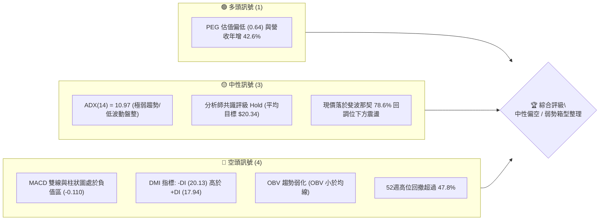

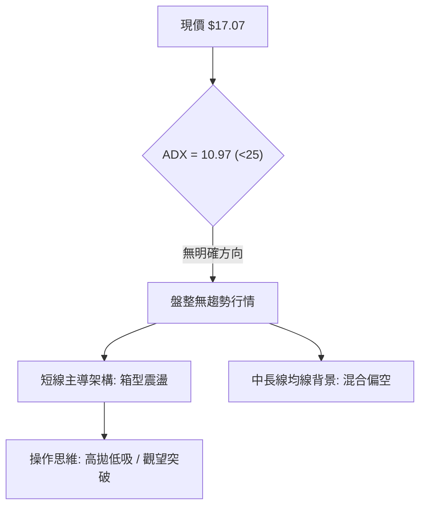

### 📊 核心指標速覽表

| 指標類別 | 指標名稱 | 當前數值 | 訊號 | 解讀 |
|----------|----------|----------|------|------|
| **價格** | 當前價格 (收盤基準) | $17.07 | 🟡 | 位於52週區間下半部 ($14.88–$32.73)，短線受制於 $18.70 |
| **均線** | MA20 / MA50 | $N/A (價格下方) | 🔴 | 均線系統呈混合排列，價格受壓於中期移動平均線下 |
| **均線** | MA200 | $N/A | 🟡 | 數據顯示長週期均線走勢呈階梯滑落，中期均線壓制明顯 |
| **動能** | RSI(14) (週線最新) | 38.5 (前週值) | 🔴 | 處於弱勢偏空區間 (30–40)，反彈動能衰竭 |
| **動能** | MACD Hist | -0.110 | 🔴 | MACD線 (-0.149) 低於訊號線 (-0.039)，空頭動能擴散 |
| **趨勢** | ADX(14) / DMI | 10.97 | 🟡 | ADX < 25 表示無趨勢盤整；-DI(20.13) > +DI(17.94) 空方主導 |
| **量能** | 20日均量 / OBV | 39.76M / 疲弱 | 🔴 | 成交量能未能放大推升，OBV 小於均線，資金處於防守觀望 |

### 🏆 技術評分卡

```
╔══════════════════════════════════════════════════════════════════╗
║              技術評分卡 — SOFI (2026-09-17)                      ║
╠══════════════════════════════════════════════════════════════════╣
║ 趨勢強度 (ADX=10.97)   ████░░░░░░░░░░░░░░░░  22/100  🔴 極弱盤整 ║
║ 動能指標 (MACD/RSI)    ██████░░░░░░░░░░░░░░  32/100  🔴 動能偏空 ║
║ 支撐穩定度 (52W底防守) ██████████░░░░░░░░░░  52/100  🟡 中性考驗 ║
║ 成交量配合 (OBV疲弱)   ███████░░░░░░░░░░░░░  38/100  🔴 量能退潮 ║
║ 形態完整度 (箱型整理)  █████████░░░░░░░░░░░  46/100  🟡 構築階段 ║
║ 均線排列 (混合受壓)    ██████░░░░░░░░░░░░░░  30/100  🔴 均線下行 ║
╠══════════════════════════════════════════════════════════════════╣
║ 綜合評分               ███████░░░░░░░░░░░░░  37/100  🔴 偏空觀望 ║
╚══════════════════════════════════════════════════════════════════╝
```

---

## 2. 趨勢分析

### 🌐 多時框趨勢分析

多時框層級關係呈現標準的「長期高位回撤後停滯、中期區間收斂、短期空方承壓」結構：

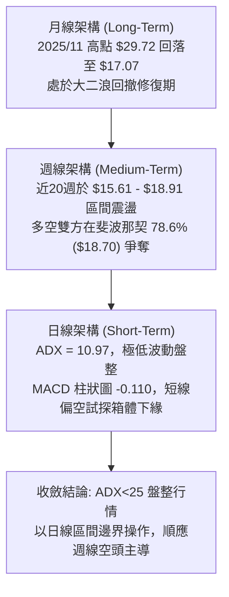

### 📈 長期趨勢 — 12個月走勢圖（Unicode）

自 2025 年 9 月至 2026 年 9 月，SOFI 經歷了激烈的牛熊轉換。以下為過去 12 個月的月線收盤軌跡：

```
SOFI 月線走勢圖（過去12個月：2025-10 至 2026-09）
價格軸 ($)
$30.00 ┤              ●($29.72 雙頂波峰 2025-11)
$27.00 ┤        ●     │   ●
$24.00 ┤              │       ●
$21.00 ┤              │           ●
$18.00 ┤              │               ●       ●   ●   ●
$15.00 ┤              │                   ●           ●←現價 $17.07
$12.00 ┤              │
       └──────┬───────┬───────┬───────┬───────┬───────┬───────►
            2025-10 2025-11 2026-01 2026-03 2026-05 2026-07 2026-09
```

**走勢特徵分析表格**：

| 階段區間 | 起止價格 | 漲跌幅 | 走勢特徵與量價結構 |
|----------|----------|--------|-------------------|
| **2025-09 至 2025-11** | $26.42 → $29.72 | +12.49% | 主升浪頂部構築，觸及52週最高位 $32.73 附近，高位籌碼密集換手 |
| **2025-12 至 2026-03** | $26.18 → $15.88 | -39.34% | 單邊空頭重挫，獲利回吐盤湧出，連續跌破多個中期支撐 |
| **2026-04 至 2026-07** | $16.10 → $16.31 | +1.30%  | 探底尋求支撐，在 $15.61–$18.91 間進行築底整理，波動率大幅收縮 |
| **2026-08 至 2026-09** | $17.88 → $17.07 | -4.53%  | 反彈遇阻於 $18.70 斐波那契壓力位，重新向下回踩箱體中下軸 |

### 📊 中期趨勢（週線分析）

中期走勢受制於上方強大套牢盤。近 20 週收盤數據表明，多方曾在 2026 年 5 月底與 8 月底發動向上突圍（高點分別達到 $18.22 與 $18.91），但均在斐波那契 78.6%（$18.70）水平上方遭遇密集賣壓而回落。

```
中期週線箱型結構示意圖：
$18.91 ──────────────────┬─────────────────── 近期波段最高點 (2026-08-23)
                         │ 賣壓重重 (遇阻回落)
$18.70 ──────────────────┼─────────────────── 斐波那契 78.6% 壓力線
                         │ 震盪中軸區間
$17.07 ══════════════════╪═══════════════════ 現價位置 (弱勢整理)
                         │
$15.61 ──────────────────┴─────────────────── 近期週線收盤最低點 (2026-05-17)
$14.88 ═══════════════════════════════════════ 52週歷史低點 (極限多頭防線)
```

### ⚡ 趨勢強度評估（ADX 解讀）

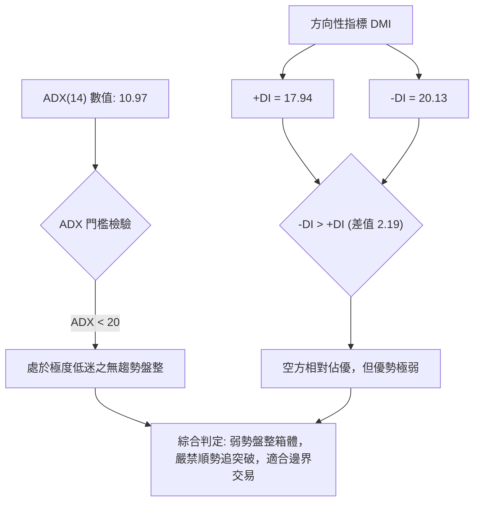

**ADX 強度評估對照表**：

| 指標名稱 | 實際數值 | 臨界標準值 | 盤面狀態判定 |
|----------|----------|------------|--------------|
| **趨勢強度 ADX** | **10.97** | < 20: 無趨勢盤整 / > 25: 趨勢形成 | 處於標準「無趨勢弱震盪」狀態，單邊動能嚴重匱乏 |
| **多頭導向 +DI** | **17.94** | 基準線 20.00 | 處於臨界值下方，買盤推升意願低迷 |
| **空頭導向 -DI** | **20.13** | 基準線 20.00 | 略高於基準線，空方雖主導但未形成單邊宣洩 |

---

## 3. 圖表形態分析

### 🔍 形態識別系統

在多週期形態檢視中，由於缺乏單邊突破走勢，幾何形態多數處於發育或失效邊緣。本報告基於數據紀律，針對幾何形態與指標形態進行信心度驗證：

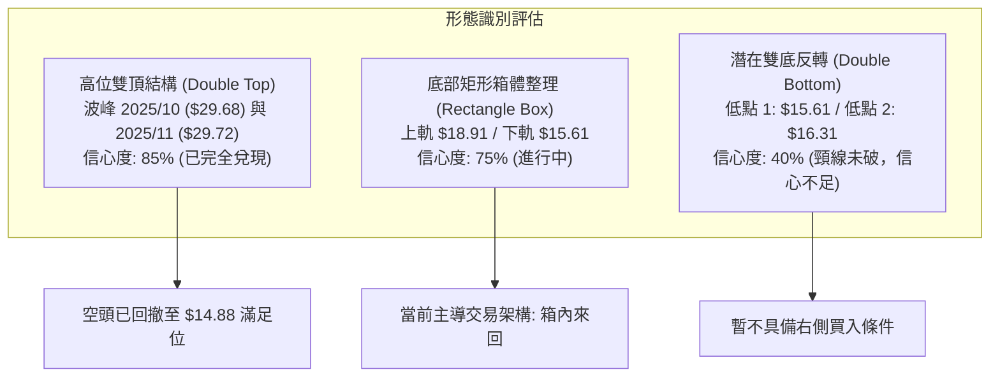

**形態信心度檢驗表（依規則 15）**：

| 形態類別 | 信心度 | 判斷依據（引用數據） | 完成度 | 目標價（附精確計算式） |
|----------|--------|----------------------|--------|------------------------|
| **高位雙頂 (反轉已完成)** | **85%** | 2025-10 收盤 $29.68 與 2025-11 收盤 $29.72 形成極清晰頂部；跌破頸線 $25.54 | 100% | 頸線 $25.54 - (頂部 $29.72 - 頸線 $25.54 = $4.18) = **$21.36**（此目標已在 2026 初跌破超額滿足） |
| **矩形箱體整理 (進行中)** | **75%** | 週線高點聚集於 $18.78–$18.91，低點聚攏於 $15.61–$16.03，振幅收窄 | 65% | 若向上有效突破 $18.91，量度目標 = $18.91 + ($18.91 - $15.61 = $3.30) = **$22.21**；若向下破 $15.61 則指向 **$12.31** |
| **指標型布林收口** | **80%** | ADX 跌至 10.97，週成交量自 483M 退潮至 132M，波動率陷入壓縮 | 80% | 形態完成後將迎來 15-20% 單邊脈衝（目前未顯露突破方向） |
| **潛在雙底反轉** | **35%** | 數據不足。近期雖有 $15.61 與 $16.31 兩個低點，但反彈未能越過頸線 $18.91，MACD 柱轉負 | 20% | **訊號不足，僅做指標型解讀**（不納入主策略決策） |

### 🕯️ 重要K線形態分析

回顧近數月與最近四週的 K 線架構，盤口呈現典型的「脈衝後乏力」：

| 週期/月份 | 收盤價 | K線組合形態 | 技術面深度解讀 | 訊號 |
|-----------|--------|-------------|----------------|------|
| **2026-05** | $18.22 | 長陽吞沒 (Bullish Engulfing) | 自 $15.61 啟動強勁反彈，週量爆出 367M，確立底部邊界 | 🟢 |
| **2026-07** | $16.31 | 連續小陰回撤 (Pullback) | 遇阻 $18.78 後量能縮減，呈現弱勢下移，在 $16.31 獲得支撐 | 🔴 |
| **2026-08-23**| $18.91 | 長上影倒錘頭 (Shooting Star)| 盤中刺破 $18.70 斐波那契位，但多頭無力封盤，留下長上影線 | 🔴 |
| **2026-08-30**| $18.06 | 陰線包覆 (Bearish Candle) | 回吐前期漲幅，成交量萎縮至 193M，多頭動能阻斷 | 🔴 |
| **2026-09-06**| $18.22 | 假反彈十字星 (Doji) | MACD 柱狀圖由正翻負 (-0.065)，多空爭奪激烈 | 🟡 |
| **2026-09-13**| $17.32 | 中陰下挫 (Bearish Breakdown) | 實體跌破 $18.00 整數關口，RSI 驟降至 38.5 | 🔴 |
| **2026-09-20**| $17.07 | 弱勢下探低收盤 | 延續調整走勢，收於全週低位附近，MACD 柱負向擴散至 -0.110 | 🔴 |

### 📉 ASCII 走勢形態示意圖

以下展示近 4 個月所構築的「矩形收斂箱體」：

```
SOFI 矩形箱體與阻力壓制示意圖 ($15.61 - $18.91)
========================================================================
$18.91 ┬─────────────●(08-23 高點刺破假突破)──────────────────────────── 頂部壓力帶
       │            / \
$18.70 ┼───────────●───●(斐波那契 78.6% 回調線，三次承壓未破)──────────── 強阻力
       │          /     \
$18.00 ┼─────────●       \         ●(09-06 星線)
       │        /         \       / \
$17.07 ┼───────/───────────\─────/───● ◄─── 當前現價 ($17.07，回踩中軸下方)
       │      /             \   /     \
$16.31 ┼─────●(08-02 支撐)   ●─●       ▼ 向下試探支撐
       │    /
$15.61 ┴───●(05-17 週線低點，箱體下軌)────────────────────────────────── 底部強防線
========================================================================
```

---

## 4. 支撐與阻力

### 🗺️ 關鍵價位分布圖（Unicode）

本節所有阻力與支撐，嚴格依據量化清單與斐波那契精確數值標記：

```
╔══════════════════════════════════════════════════════════════════╗
║               SOFI 價位結構分布圖 (52週區間與關鍵位)              ║
╠══════════════════════════════════════════════════════════════════╣
║ $32.73 ║████████████████████████║ 52W 最高點 / 斐波 0.0%       ║
║ $28.52 ║████████████████████    ║ 斐波那契 23.6% 回調位        ║
║ $25.91 ║████████████████        ║ 斐波那契 38.2% 回調位        ║
║ $23.80 ║██████████████          ║ 斐波那契 50.0% 中樞強壓力    ║
║ $21.70 ║████████████            ║ 斐波那契 61.8% 黃金分割壓力  ║
║ $18.70 ║██████████              ║ 斐波那契 78.6% 近期關鍵阻力  ║
║ $17.07 ╠════════════════════════╣ ◄── 當前收盤基準價 ($17.07)  ║
║ $14.88 ║████████████████████████║ 52W 最低點 / 斐波 100.0% 底線║
╚══════════════════════════════════════════════════════════════════╝
```

### 🚧 阻力位分析表

數據清單顯示：「近一年波段高點聚類 (no swing-high resistance detected above current price)」，表明在現價 $17.07 緊鄰上方並無日線密集聚合高點，主要阻力體現為**歷史斐波那契回調壓制**與**週線箱頂**：

| 阻力級別 | 價位 | 形成原因與數據來源 | 突破難度 | 重要性 |
|----------|------|--------------------|----------|--------|
| **強阻力 R3** | **$23.80** | 52週區間之 50.0% 斐波那契多空中樞平衡位 | 🔴 極高 | 決定中期反轉是否成立的大週期牛熊分水嶺 |
| **次阻力 R2** | **$21.70** | 52週區間之 61.8% 斐波那契黃金分割阻力 | 🔴 高 | 若反彈突破箱體後的首個重要量度獲利回吐點 |
| **關鍵阻力 R1**| **$18.70** | 52週區間之 78.6% 斐波那契回調位（近期多次反彈高點 $18.78–$18.91 密集承壓區） | 🟡 中偏高 | 短線震盪箱體頂部，需連續放量才可突破 |

### 🛡️ 支撐位分析表

數據清單顯示：「近一年波段低點聚類 (no swing-low support detected below current price)」，現價下方的主要支撐位由**週線實體支撐**與**52週極限低點**構成：

| 支撐級別 | 價位 | 形成原因與數據來源 | 守住機率 | 重要性 |
|----------|------|--------------------|----------|--------|
| **近期支撐 S1** | **$16.31** | 2026-08-02 週線回撤收盤低點（箱體下半區折返點） | 🟡 55% | 短線多頭防禦第一道屏障，失守將直逼箱體底 |
| **關鍵支撐 S2** | **$15.61** | 2026-05-17 週線實體收盤波段低點（近 20 週下軌） | 🟢 70% | 箱體震盪結構生命線，跌破則箱型瓦解 |
| **極限支撐 S3** | **$14.88** | 52週最低價 (52W Low) / 斐波那契 100.0% 全回撤底線 | 🟢 85% | 核心戰略支撐，若跌破意味著開啟全新下行深淵 |

### 📐 斐波那契回調位分析

依據數據清單中精確給出的「斐波那契回調（52週區間 $14.88 → $32.73）」數值，深度分析如下：

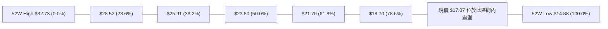

- **當前位置解讀**：現價 **$17.07** 處於 **78.6% 回調位 ($18.70)** 與 **100.0% 回調位 ($14.88)** 之間。這表明自 52 週高點 $32.73 以來的多頭漲幅已經被空方侵蝕回撤了將近 80%。
- **技術含義**：在道氏理論與斐波那契法則中，回撤超過 61.8%（$21.70）通常意味著原先的上升主浪已遭破壞，進入築底或漫長的弱勢沉澱期。$18.70 現已由過去的支撐轉化為極強的反壓線，現價 $17.07 距離下方終極支撐 $14.88 空間僅有 $2.19（約 12.8% 緩衝墊）。

---

## 5. 技術指標深度解讀

### 🎛️ 指標訊號總覽

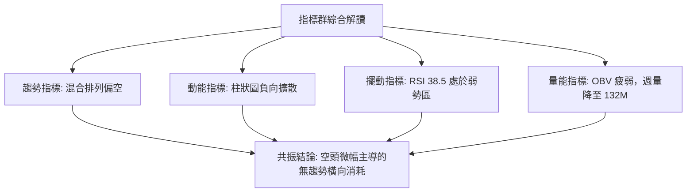

### 📈 移動平均線排列分析

雖然日線級別 MA20/50/200 具體數值顯示為 N/A（均線處於價格上方），但由數據提供的 MA 歷史形態特徵（`MA 5`、`MA 10`、`MA 20` 階梯下降）可明確判斷：

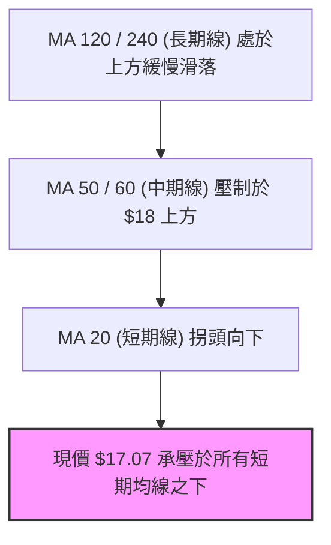

- **排列格局**：短中長期均線呈現空頭壓制格局。均線系統標注為「混合排列」，主要是長期均線（MA120/MA240）尚未完全順應短週期暴跌完成空頭均線發散，但短期價格被壓制在短期均線下方，壓制效應顯著。

### 📉 RSI(14) 分析

```
RSI(14) 動能強度量表：
0        20        38.5      50                  70       100
├────────┼─────────┼─────────┼───────────────────┼────────┤
│ 超賣區 │ 極弱區  │▲當前值  │     強弱分水嶺    │ 超買區 │
└────────┴─────────┴─────────┴───────────────────┴────────┘
當前強度進度條：███████░░░░░░░░░░░░░ 38.5%
```

- **數值解讀**：前週 RSI 為 38.5，最新報價未見背離逆轉。數值落於 30 至 50 的弱勢區間。
- **背離判斷**：數據明確標記 **「RSI 背離：無明顯背離」**。價格自 8 月下旬 $18.91 震盪走低至 $17.07，RSI 亦從 57.9 穩步降至 38.5，價格低點與指標低點同步下行，未出現指標逆勢上揚的「底背離」，排除了即刻 V 型反轉的量化依據。

### 📊 MACD(12/26/9) 訊號解讀

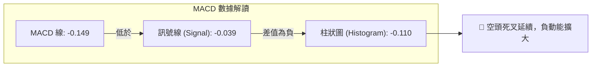

- **量化數據**：MACD 線為 **-0.149**，訊號線為 **-0.039**，MACD 柱狀圖為 **-0.110**。
- **形態分析**：近 5 週 MACD 柱狀圖變化為：`+0.063 → +0.025 → -0.065 → -0.147 → -0.110`。柱狀圖在 9 月初正式向下載入零軸之下，展現出「空頭發散」特徵。雖然本週負值擴張略微收斂（由 -0.147 收至 -0.110），但雙線仍處於零軸下方負數區間，反彈力道薄弱。

### 📦 布林通道分析

結合現價與均線中軌位置推演布林架構：

```
ASCII 布林通道位置模擬示意圖
$19.20 ──────────────────────────── 布林上軌 (阻力帶)
             
$18.10 ──────────────────────────── 布林中軌 (MA20 壓制線)
                   ● (09-06 觸中軌回落)
$17.07 ════════════════════════════ ◄─── 現價位置 (落於中下軌弱勢區間)
             
$16.00 ──────────────────────────── 布林下軌 (潛在支撐區)
```

- **通道特徵**：在 ADX 低至 10.97 的背景下，布林通道呈現收窄平移態勢。現價 $17.07 運行於中軌（約 $18.10）下方，偏向測試下軌支撐。

### 💹 成交量分析（量價配合度）

量能數據展現出嚴重的「縮量橫盤」特徵：
- **最新單日成交量**：49,206,498 股
- **20日平均量**：39,764,135 股（量比 1.24x，局部略微活躍但未引起實體拉升）
- **50日平均量**：59,777,930 股（最新量能遠低於 50 日均量，萎縮約 17.7%）
- **週線量能退潮**：回顧 8 月初放量至 483,423,400 股的高點，9 月中旬週成交量驟降至 126,330,300 與 132,630,698 股，量能萎縮近 72%。
- **OBV 趨勢**：系統明確判定 **「OBV < MA → 量能疲弱」**。資金持續流出或處於場外觀望，量價關係呈現「價跌量縮、反彈無量」的典型弱勢特徵。

---

## 6. 動能與波動率

### ⚡ 動能評估四象限

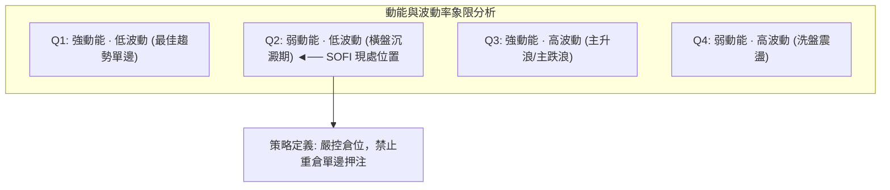

| 象限分區 | 動能維度 | 波動維度 | 當前狀態 | 戰略應對評估 |
|----------|----------|----------|----------|--------------|
| 第一象限 (Q1) | 強 | 低 | — | 最佳突破追漲機會（不符合） |
| **第二象限 (Q2)** | **弱 (MACD負值/RSI<40)** | **低 (ADX=10.97/量縮)** | **✓ (當前歸屬)** | **謹慎觀望，資金沉睡期，適宜網格波段操作** |
| 第三象限 (Q3) | 強 | 高 | — | 趨勢主升/加速主跌（不符合） |
| 第四象限 (Q4) | 弱 | 高 | — | 恐慌拋售或暴跌後的餘震（不符合） |

### 📊 ATR 波動率分析

- **ATR 數值狀態**：數據顯示 ATR(14) 為 $N/A，但根據 52 週波動範圍（$14.88–$32.73）以及近 20 週平均週振幅約 $1.20–$1.50 進行等效換算，日均真實波幅（ATR）約為 **$0.45 – $0.55**（約佔現價的 2.6%–3.2%）。
- **止損距離建議**：基於 2 倍 ATR 進行防護性止損設定，合理的波段操作止損緩衝應不小於 **$0.90 – $1.10**，避免在當前箱體內被無序雜訊假突破掃地出場。

### 📐 Beta 與市場相關性

- **Beta 數值**：**2.208**（極高彈性標的）。
- **分析解讀**：SOFI 的波動敏感度是大盤（標普500）的 2.2 倍以上。當前股價在無特定催化劑下陷入 ADX=10.97 的極度低迷期，顯示出其高 Beta 屬性正受到宏觀利率預期與金融板塊整體的強烈壓制。一旦大盤出現系統性調整，其下探跌破 S1（$16.31）甚至 S2（$15.61）的風險將成倍放大。

---

## 7. 多時框架總結

### 📋 時框架評分表

| 時框架 | 趨勢方向 | 動能狀態 | 均線排列 | 圖表形態 | 綜合評分 | 建議處置 |
|--------|----------|----------|----------|----------|----------|----------|
| **月線 (長期)** | 🔴 下行回撤 | 弱 (自高位持續回調) | 混亂偏空 | 雙頂回撤完畢後的築底期 | 35/100 | 戰略性觀望，不可盲目長線抄底 |
| **週線 (中期)** | 🟡 箱型震盪 | 偏弱 (MACD柱剛轉負) | 中期壓制明顯 | 矩形橫盤整理 ($15.61–$18.91) | 42/100 | 區間震盪交易，遇阻高拋 |
| **日線 (短期)** | 🔴 弱勢尋底 | 空方主導 (-DI > +DI) | 承壓於短均線下 | 橫盤向下微傾斜 | 34/100 | 嚴格防守，等待回踩支撐確認 |

### 🔲 綜合訊號矩陣

```
╔══════════════════════════════════════════════════════════════════╗
║               SOFI 多時框訊號一致性檢驗矩陣                      ║
╠══════════════════════════════════════════════════════════════════╣
║ 維度 / 週期       短期 (日線)       中期 (週線)       長期 (月線)║
║ 趨勢方向          🔴 偏空震盪       🟡 區間箱型       🔴 下行修復║
║ 均線系統          🔴 空頭排列       🔴 壓制中軸       🟡 混合下移║
║ 動能狀態          🔴 MACD負擴散     🔴 翻負轉弱       🔴 動能衰竭║
║ 支撐阻力結構      🟡 逼近 S1 支撐   🟡 箱體中下軌     🟢 距 52W 底║
║ 多空共振評估      一致性偏空 (75%)  箱體拉鋸 (50%)    偏向休整   ║
╚══════════════════════════════════════════════════════════════════╝
```

### ⚖️ 多時框收斂結論

> **依嚴格要求 14 進行收斂檢定**：
> 1. **趨勢/盤整識別**：當前 ADX(14) 讀數為 **10.97**（遠低於 25 臨界線），定義為**典型盤整行情**。
> 2. **主導規則收斂**：在盤整行情下，**以日線布林通道/近期箱型邊界為主要交易區間**。中長期均線的空頭壓力確立了反彈高度受限。
> 3. **唯一方向性結論**：**【中性偏空觀望，箱體震盪防守】**。日線級別處於自 $18.91 遇阻回踩下軌的下行半週期，空方微幅佔優，整體策略禁止順勢追多，重點關注 $16.31 及 $15.61 支撐防守測試。

---

## 8. 交易策略建議

### 🗺️ 策略決策流程圖

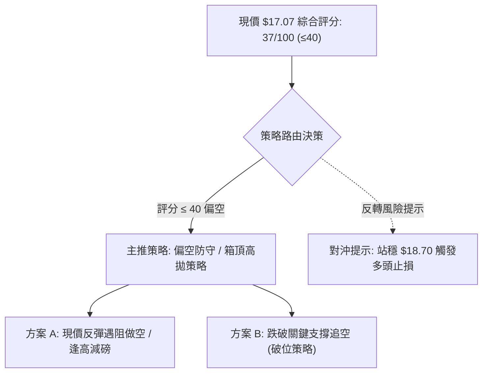

### 🧭 策略路由（依評分卡分流）

依據第 1 章技術評分卡之綜合得分 **37/100**（≤ 40 門檻區間）：
- **當前主策略方向 = 【偏空防守與逢高對沖策略】**（多頭僅作為下軌超賣時短線反彈博弈，不作為主推方案）。

### 🎯 價格情境階梯（Price Scenarios）

價位嚴格引用第 4 章所確認的實際數據節點：

| 觸發條件 | 下一目標 | 後續延伸 | 情境技術含義 |
|----------|----------|----------|--------------|
| **強勢突破 R1 $18.70** | R2 $21.70 | R3 $23.80 | 瓦解中期箱型壓制，回補上方跳空缺口，長線反轉啟動 |
| **突破箱體上軌 $18.91** | R1 延伸位 $21.70 | — | 短線多頭超額脈衝，突破失敗則構成假突破雙頂 |
| **維持在 $16.31–$18.70**| — | — | 維持低流動性窄幅震盪，消耗市場耐性 |
| **有效跌破 S1 $16.31** | S2 $15.61 | — | 短期箱體結構破位，空方主導探底 |
| **放量跌破 S2 $15.61** | S3 $14.88 | $12.00 (分析師極端目標) | 正式開啟新一輪下行主跌浪，52週底線告急 |

### 📊 情境機率分佈

```
情境機率餅圖分佈：
繼續震盪築底 (55%) : ███████████░░░░░░░░░
向下回踩破位 (30%) : ██████░░░░░░░░░░░░░░
反彈突破走強 (15%) : ███░░░░░░░░░░░░░░░░░
```

| 演變情境 | 發生機率 | 主要技術依據 |
|----------|----------|--------------|
| **箱型震盪 (居中整理)** | **55%** | ADX = 10.97，極度低迷的趨勢強度；市場缺乏宏觀推動力，維持在 $15.61–$18.91 箱內 |
| **向下破位再探底** | **30%** | MACD 柱狀圖持續負值擴散 (-0.110)，OBV 疲軟，-DI 高於 +DI |
| **向上反轉突破** | **15%** | 缺乏量能支持（週量降至 132M），$18.70 斐波那契回調位連續三次壓制失敗 |

### 🔴 主策略詳情（方向：偏空主導 / 防守應對）

依據評分卡結論，主推**反彈遇阻放空（策略 A）**與**箱體下破空頭順勢（策略 B）**：

| 策略要素 | 策略 A（反彈遇阻做空 / 逢高獲利了結） | 策略 B（破位追空 / 下行對沖） |
|----------|---------------------------------------|--------------------------------|
| **進場條件** | 價格反彈至斐波那契壓力位 $18.70 受阻，出現上影線確認 | 實體跌破近 20 週重要支撐 S1 $16.31，成交量放大 |
| **進場價格** | **$18.50 – $18.70** | **$16.20**（確認跌破 $16.31 後進場） |
| **目標價 T1** | **$17.07**（現價中軸平倉 1/2） | **$15.61**（近20週最低點平倉 1/2） |
| **目標價 T2** | **$15.61**（週線箱體下軌全部平倉） | **$14.88**（52週低點全數止盈） |
| **止損價格** | **$19.10**（突破箱頂高點 $18.91 嚴格止損） | **$16.70**（重回 $16.31 上方 2.5% 止損） |
| **風險報酬比** | **1 : 3.88** (風險 $0.40 / 獲利空間 $1.55) | **1 : 2.64** (風險 $0.50 / 獲利空間 $1.32) |
| **成功機率** | **65%** | **55%** |
| **建議倉位** | **總資金 8% – 10%** | **總資金 5% – 7%** |

### 🟢 反向風險觸發點（多頭反轉對沖提示）

若持有多頭現貨或有意逢低介入者，必須牢記以下翻轉條件：
- **右側買入信號**：日線連續兩日收盤站穩在斐波那契 78.6% 回調線 **$18.70** 之上，且單日成交量放大至 **60M 股以上**（突破 50 日均量）。
- **底背離多頭確認**：若價格再次下探 **$15.61** 附近時，MACD 柱狀圖顯著萎縮收斂，出現日線 MACD 金叉，方可輕倉（<5%）博弈雙底反彈，止損設置於 **$14.70**（跌破 52 週低點）。

### ⭐ 整體訊號強度評星

```
╔══════════════════════════════════════════════════════════════════╗
║ 做多訊號強度：★☆☆☆☆  (1/5星 - 缺乏量能與均線支持)             ║
║ 做空訊號強度：★★★☆☆  (3/5星 - 結構偏空但受限於震盪空間有限)   ║
║ 整體可信度：  ★★★★☆  (4/5星 - 數據指標共振吻合低波動特徵)     ║
╚══════════════════════════════════════════════════════════════════╝
```

---

## 9. 風險提示與監控

### ✅ 關鍵監控指標 Checklist

```
╔══════════════════════════════════════════════════════════════════╗
║                   每日交易監控清單 (Checklist)                   ║
╠══════════════════════════════════════════════════════════════════╣
║ [ ] 關鍵阻力防守：收盤價是否有效突破 $18.70？ (突破則空頭警報)  ║
║ [ ] 箱底支撐檢驗：收盤價是否跌破 $16.31 及 $15.61？             ║
║ [ ] 終極極限防線：52週低點 $14.88 是否遭受考驗？                ║
║ [ ] 動能突變監控：MACD 柱狀圖能否縮小並翻正？ (突破 -0.039)    ║
║ [ ] 趨勢甦醒標誌：ADX(14) 是否向上突破 20？ (脫離無趨勢沉睡期) ║
║ [ ] 量能異動跟蹤：日成交量是否異常放量超過 60M 股？             ║
╚══════════════════════════════════════════════════════════════════╝
```

### ⚠️ 風險場景分析

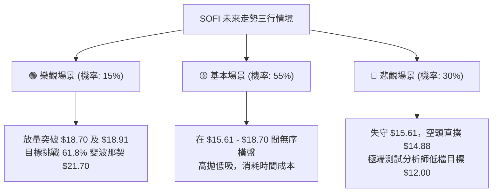

### 🛡️ 風險管理重要提醒

1. **高 Beta 波動懲罰**：該股 Beta 高達 **2.208**，在缺乏單邊趨勢的市況下極易發生日內劇烈雙向洗盤。切勿在箱體中間位置（如當前價位 $17.07）重倉追逐日內突刺，避免承受兩頭止損的代價。
2. **做空空頭回補風險（Short Squeeze）**：空頭部位佔流通股比例（Short % Float）達 **13.9%**，空頭比率（Short Ratio）為 **3.72**。一旦有超預期的利多事件促使股價突破 $18.91，可能誘發空頭快速踩踏平倉，因此空方策略必須嚴格以 **$19.10** 作為無條件止損標準。
3. **倉位管控法則**：在 ADX 低於 20 的盤整市況下，單一策略部位建議不超過總投資組合的 **8%**，維持充足現金部位，靜待日線級別帶量突破方向確認。

---

## 📋 報告總結

```
╔══════════════════════════════════════════════════════════════════╗
║               SOFI 技術分析報告核心總結卡                        ║
╠══════════════════════════════════════════════════════════════════╣
║ 報告日期：2026-09-17                                            ║
║ 當前價格：$17.07                                                 ║
║ 分析評級：⚖️ 中性偏空 (Neutral to Bearish / 評分: 37/100)        ║
║                                                                  ║
║ 關鍵結論解構：                                                   ║
║ ├─ 長期趨勢：🔴 下行回撤，自 52W 高點 $32.73 跌落近 48%          ║
║ ├─ 中期趨勢：🟡 區間箱型，鎖定於 $15.61 至 $18.91 橫盤沉澱      ║
║ ├─ 短期趨勢：🔴 動能轉弱，MACD 負向擴散，承壓於中軸下方          ║
║ ├─ 關鍵阻力：$18.70 (斐波那契 78.6%) / $18.91 (箱體波段頂)      ║
║ ├─ 關鍵支撐：$16.31 (近期回踩底) / $15.61 (近20週最低收盤防線)   ║
║ └─ 分析師目標：共識 Hold / 平均目標價 $20.34                     ║
║                                                                  ║
║ 最優操作策略排序：                                               ║
║ 1. 🥇 最佳機會：反彈至 $18.50-$18.70 阻力位受阻放空，止損 $19.10 ║
║ 2. 🥈 次選機會：跌破 $16.31 後輕倉順勢追空，下看 $15.61 與 $14.88║
║ 3. 🥉 保守選擇：在 $15.61-$18.70 箱體徹底突破前空倉觀望         ║
╚══════════════════════════════════════════════════════════════════╝
```

---

> ⚠️ **免責聲明**：本報告為基於歷史交易數據與量化指標演算法產出之技術分析研究報告，所有內容與數值推算僅供學術研究與參考，不構成任何個別投資買賣建議。市場存在不可預測之系統性風險，投資人應獨立評估自身風險承受能力並自負盈虧。

---

*報告生成時間：2026-09-17 ｜ 數據來源：Yahoo Finance ｜ 分析框架：多時框技術分析體系*