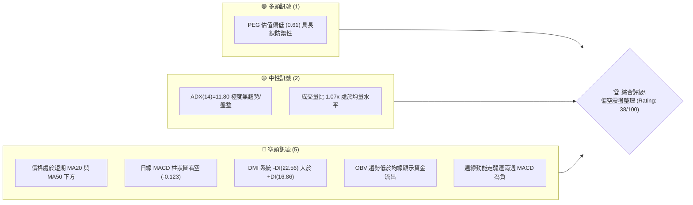
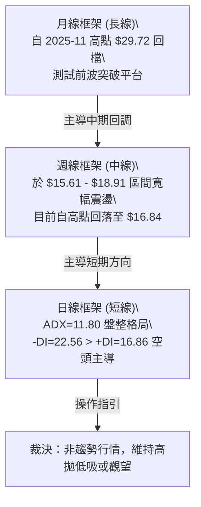
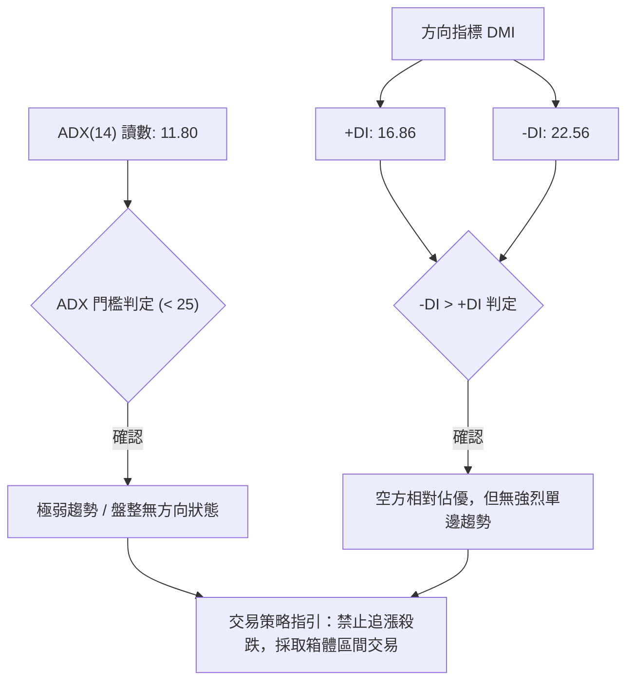
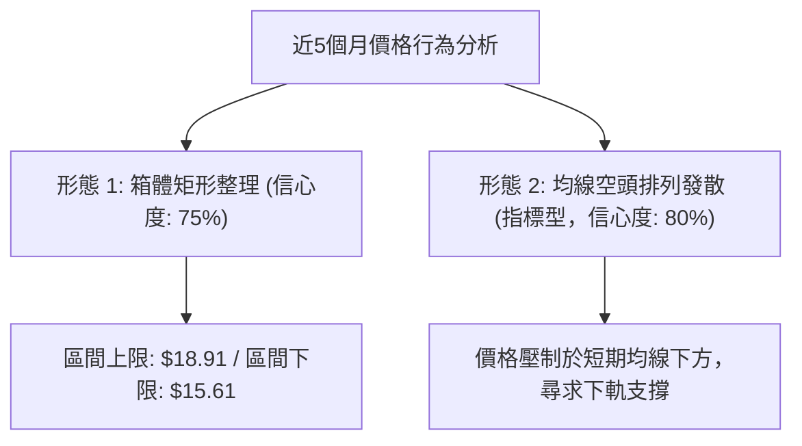
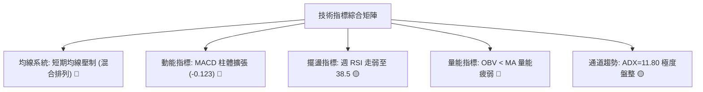
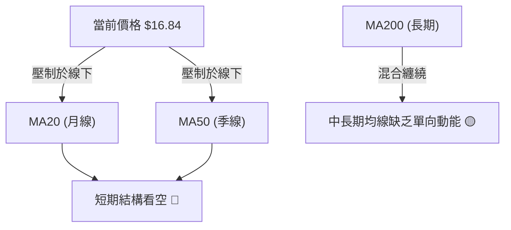
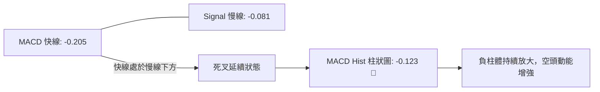
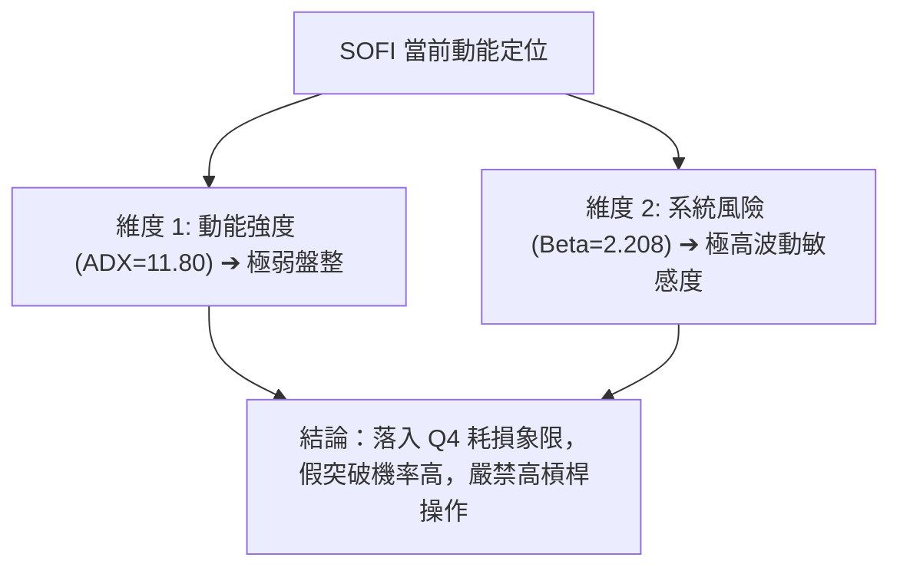
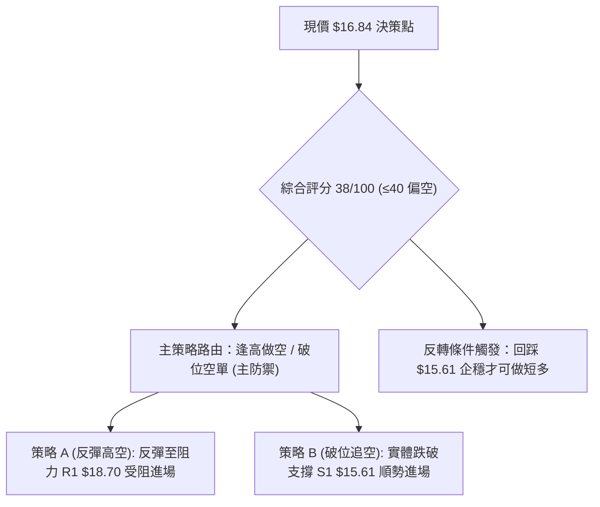
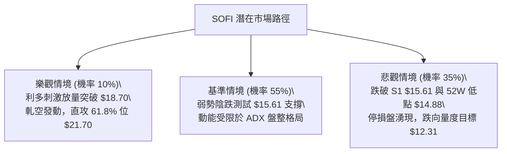

# SOFI 技術分析報告

> **報告日期**：2026-09-18 ｜ **語言**：繁體中文 ｜ **數據來源**：Yahoo Finance ｜ **當前價格**：$16.84（依近20週最新收盤紀錄）

---

## 目錄

| 章節 | 內容 |
|------|------|
| [1. 技術面概覽](#1-技術面概覽) | 訊號儀表板、核心指標、評分卡 |
| [2. 趨勢分析](#2-趨勢分析) | 多時框趨勢、長中短期走勢、ADX強弱 |
| [3. 圖表形態分析](#3-圖表形態分析) | 形態識別、信心度驗證、K線組合 |
| [4. 支撐與阻力](#4-支撐與阻力) | 關鍵價位、斐波那契回調結構 |
| [5. 技術指標深度解讀](#5-技術指標深度解讀) | MA/RSI/MACD/布林/量價OBV |
| [6. 動能與波動率](#6-動能與波動率) | 動能評估象限、Beta與量能風險 |
| [7. 多時框架總結](#7-多時框架總結) | 時框架評分矩陣、收斂原則裁決 |
| [8. 交易策略建議](#8-交易策略建議) | 策略路由、主策略劇本、風控參數 |
| [9. 風險提示與監控](#9-風險提示與監控) | 監控指標Checklist、情境路徑 |
| [📋 報告總結](#-報告總結) | 核心結論與交易決策摘要卡 |

---

## 1. 技術面概覽

### 🎯 技術訊號儀表板



### 📊 核心指標速覽表

| 指標類別 | 指標名稱 | 當前數值 | 訊號 | 解讀 |
|----------|----------|----------|------|------|
| **價格** | 當前收盤價 | $16.84 | 🔴 | 位於52週區間偏低水平，近期回檔震盪 |
| **均線** | MA20 | $N/A (價格於下方) | 🔴 | 跌破月均線短期結構偏弱，短線反壓重 |
| **均線** | MA50 | $N/A (價格於下方) | 🔴 | 跌破中期季線支撐，中期多頭架構受損 |
| **均線** | MA200 | $N/A (混合排列) | 🟡 | 均線系統呈混合排列，中長期多空拉鋸 |
| **動能** | RSI(14) | 38.5 ~ 49.5 (週線) | 🟡 | 短期動能走弱滑落至 40 附近，尚未超賣 |
| **動能** | MACD | -0.205 (Hist: -0.123) | 🔴 | 快慢線位於零軸下方且負柱體擴張，空頭佔優 |
| **趨勢** | ADX(14) | 11.80 (-DI: 22.56) | 🔴 | 趨勢強度微弱，空頭掌控短期方向但動能發散 |
| **量能** | OBV 趨勢 | OBV < MA | 🔴 | 能量潮低於均線，量能疲弱，缺乏主力接盤量 |

### 🏆 技術評分卡

```
╔══════════════════════════════════════════════════════════════╗
║                技術評分卡 — SOFI (2026-09-18)                ║
╠══════════════════════════════════════════════════════════════╣
║ 趨勢強度      ████░░░░░░░░░░░░░░░░  20/100  🔴 極弱/空主導    ║
║ 動能指標      ███████░░░░░░░░░░░░░  35/100  🔴 MACD向下發散   ║
║ 支撐穩定度    ██████████░░░░░░░░░░  50/100  🟡 考驗15.00防線  ║
║ 成交量配合    ██████░░░░░░░░░░░░░░  30/100  🔴 OBV量能疲弱    ║
║ 形態完整度    ████████░░░░░░░░░░░░  40/100  🟡 區間箱體整理   ║
║ 均線排列      ██████████░░░░░░░░░░  50/100  🟡 混合排列糾纏   ║
╠══════════════════════════════════════════════════════════════╣
║ 綜合評分      ███████░░░░░░░░░░░░░  38/100  🔴 偏空震盪/觀望  ║
╚══════════════════════════════════════════════════════════════╝
```

---

## 2. 趨勢分析

### 🌐 多時框趨勢分析



### 📈 長期趨勢 — 12個月走勢圖（Unicode）

```
SOFI 月線走勢圖（2025-10 至 2026-09）
價格軸 ($)
$30.00 ┤        ● ($29.72)
$27.50 ┤    ●       ● ($26.18)
$25.00 ┤
$22.50 ┤                ● ($22.81)
$20.00 ┤
$17.50 ┤                    ● ($17.76)  ● ($18.22)  ● ($17.88)
$15.00 ┤                        ● ($15.88)  ● ($16.10)  ● ($16.31)  ● ($16.84 現價)
$12.50 ┤
       └─────────────────────────────────────────────────────────────
         25-10 25-11 25-12 26-01 26-02 26-03 26-04 26-05 26-06 26-07 26-08 26-09
```

#### 走勢特徵分析表格

| 階段 | 時間區間 | 起止價格 | 漲跌幅 | 走勢特徵解讀 |
|------|----------|----------|--------|--------------|
| **波段衝頂** | 2025-10 ~ 2025-11 | $26.42 → $29.72 | +12.49% | 主升浪末端竭盡衝刺，量能放大但動能衰竭 |
| **急跌修正** | 2025-12 ~ 2026-03 | $29.72 → $15.88 | -46.57% | 估值均值回歸，空頭動能強烈，連續擊破短期均線 |
| **底部築底** | 2026-04 ~ 2026-09 | $15.88 → $16.84 | +6.05% | 進入 $15.61 ~ $18.91 區間震盪，振幅收窄進入收斂期 |

### 📊 中期趨勢（週線分析）

```
週線區間震盪形態示意圖 ($)
$19.00 ┤------------------------------ 波段高點反壓聚類 ($18.91)
$18.00 ┤        ▲             ▲
$17.00 ┤-------/-\-----------/-\------ 現價位置 ($16.84)
$16.00 ┤      /   \         /   \
$15.00 ┤-----▼-----▼-------▼-----▼---- 週線多重低點支撐區 ($15.61 - $15.75)
       └─────────────────────────────
        05-10  06-07  07-12  08-23  09-20 (時間)
```

中期走勢呈現明顯的寬幅箱體震盪。多方曾於 2026-07-12 達到 $18.78，並於 2026-08-23 上探至 $18.91，但皆未能有效站上斐波那契 78.6% 回調位（$18.70），形成受阻回落；下方則在 2026-05-17 之 $15.61 及 2026-05-10 之 $15.75 獲得買盤支撐。目前價格自 $18.91 連續回調四周至 $16.84，中期走勢偏弱。

### ⚡ 趨勢強度評估（ADX 解讀）



#### ADX 強度對照表

| 指標項 | 當前讀數 | 標準閾值 | 狀態評定 | 操作含義 |
|--------|----------|----------|----------|----------|
| **ADX(14)** | 11.80 | < 20 極度無趨勢 | 🔴 弱動能盤整 | 趨勢突破策略失效，虛假突破機率極高 |
| **+DI** | 16.86 | > 25 為強多頭 | 🔴 多方乏力 | 買盤推升力量不足，難以組織向上攻勢 |
| **-DI** | 22.56 | > 25 為強空頭 | 🟡 空方略優 | 空方佔據主導但未達強趨勢級別，屬於緩跌陰跌 |

---

## 3. 圖表形態分析

### 🔍 形態識別系統



#### 形態信心度與推算表

| 形態類別 | 信心度 | 判斷依據（引用數據） | 完成度 | 目標價（附嚴格計算式） |
|----------|--------|----------------------|--------|------------------------|
| **箱體矩形整理** | 75% | 週線多次受阻於 $18.91 (2026-08-23)，兩次回測 $15.61 (2026-05-17) 與 $15.75 (2026-05-10) 獲得支撐 | 70% | 若跌破箱底：$15.61 - ($18.91 - $15.61) = $12.31<br>若突破箱頂：$18.91 + ($18.91 - $15.61) = $22.21 |
| **均線受阻回落** | 80% | 價格位於 MA20、MA50 下方，且日線 MACD 連續負向發散 | 85% | 短期目標指向箱體下軌 $15.61 |
| **頭肩底形態** | 20% | 數據不足：僅有單一波段反彈，缺乏右肩結構與足夠回撤確認 | <10% | 訊號不足，僅做指標型解讀，不預設立場 |

### 🕯️ 重要K線形態分析

| 週度日期 | 收盤價 | 週成交量 | K線形態特徵 | 解讀與含義 | 訊號強度 |
|----------|--------|----------|-------------|------------|----------|
| **2026-08-09** | $18.38 | 299,046,500 | 長紅突破K線 | 放量站上短期均線，週 MACD 轉正 (+0.181)，多頭反攻 | 🟢 強多 |
| **2026-08-23** | $18.91 | 253,434,400 | 高位射擊之星 / 上影線 | 量能遞減上探 $18.91 遇阻回落，顯現 78.6% 回調位強大阻力 | 🔴 轉空 |
| **2026-09-06** | $18.22 | 191,950,700 | 中陰線跌破短期支撐 | 週 MACD 柱狀圖由正轉負 (-0.065)，多轉空確認訊號 | 🔴 看空 |
| **2026-09-13** | $17.32 | 126,330,300 | 縮量陰線下行 | 成交量極度萎縮，買盤承接意願薄弱，價格向下跌破 $18.00 整數關卡 | 🔴 看空 |
| **2026-09-20** | $16.84 | 175,573,468 | 連續下行中陰線 | 試圖在斐波那契 78.6% 回調位下方尋找支撐，但賣壓持續 | 🔴 看空 |

### 📉 ASCII 走勢形態示意圖

```
SOFI 近期箱體箱型整理示意圖 ($)
$19.00 ┬────────────────────── 箱頂阻力區 ($18.91 - 2026-08-23)
       │       ╭───╮
$18.00 ┤   ╭───╯   ╰───╮      
       │   │           ╰──╮   
$17.00 ┤───╯──────────────╰─● 現價 $16.84 (測試箱體中下軸)
       │                     │
$16.00 ┤                     ↓ 向下尋求測試
       │   ╭─╮         ╭─╮
$15.00 ┴───╯─╰─────────╯─╰── 箱底支撐區 ($15.61 - 2026-05-17)
```

---

## 4. 支撐與阻力

### 🗺️ 關鍵價位分布圖（Unicode）

```
SOFI 價位結構分布圖 (嚴格引用 OHLCV 與斐波那契計算)
═════════════════════════════════════════════════════════════
$32.73 ║████████████████████████║ 52週高點 / 0.0% 斐波那契
$28.52 ║██████████████████      ║ 23.6% 斐波那契回調位
$25.91 ║████████████████████    ║ 38.2% 斐波那契回調位
$23.80 ║████████████████        ║ 50.0% 斐波那契平衡位
$21.70 ║██████████████████      ║ 61.8% 斐波那契黃金分割位
$18.70 ║████████████████████████║ 關鍵阻力 (78.6% 斐波那契 / 近期高點 $18.91)
$16.84 ╠════════════════════════╣ ◄ 當前收盤價 ($16.84)
$15.61 ║▓▓▓▓▓▓▓▓▓▓▓▓▓▓▓▓▓▓▓▓    ║ 近期波段關鍵支撐 (2026-05-17 低點)
$14.88 ║████████████████████████║ 52週最低點 / 100.0% 斐波那契
═════════════════════════════════════════════════════════════
```

### 🚧 阻力位分析表

依據系統關鍵價位偵測，現價上方未出現 OHLCV 波段高點聚類；阻力來源完全基於 52 週大波段的斐波那契回調與近 20 週實際收盤高點：

| 阻力級別 | 價位 | 形成依據 | 突破難度 | 重要性 |
|----------|------|----------|----------|--------|
| **阻力 R1** | $18.70 | 斐波那契 78.6% 回調位（與近月高點 $18.91 形成共振帶） | 極高 | 🔴 決定中期走勢能否轉強之分水嶺 |
| **阻力 R2** | $21.70 | 斐波那契 61.8% 黃金分割回調位 | 極高 | 🔴 突破後方可確認大級別底部完成 |
| **阻力 R3** | $23.80 | 斐波那契 50.0% 中軸平衡位 | 極高 | 🔴 大週期多空強弱分界線 |

### 🛡️ 支撐位分析表

依據系統關鍵價位偵測，現價下方未出現自動標記的波段低點聚類；支撐來源完全基於近期 20 週實質成交低點與 52 週基準點：

| 支撐級別 | 價位 | 形成依據 | 守住機率 | 重要性 |
|----------|------|----------|----------|--------|
| **支撐 S1** | $15.61 | 2026-05-17 週線實際回踩不破之波段低點 | 60% | 🟡 箱體整理下軌，短線不可破 |
| **支撐 S2** | $14.88 | 52週最低價 (100.0% 斐波那契回調位) | 75% | 🟢 長期結構防守極限，破位將引發停損潮 |

### 📐 斐波那契回調位分析

依據基準區間 $14.88（52W Low）至 $32.73（52W High）計算：
- **0.0% (52W High)**: $32.73
- **23.6%**: $28.52
- **38.2%**: $25.91
- **50.0%**: $23.80
- **61.8%**: $21.70
- **78.6%**: $18.70
- **100.0% (52W Low)**: $14.88

**深度解讀**：
當前收盤價 **$16.84** 處於 **78.6% 回調位（$18.70）** 與 **100.0% 最低點（$14.88）** 之間。這代表自 $32.73 以來的整個回撤幅度已吃掉前波漲幅的近八成，屬於深度回調區。近期價格兩度上攻 $18.70 ~ $18.91 皆遭到壓制，證實 78.6% 回調位已由支撐徹底轉化為強大阻力。在未有效帶量突破 $18.70 之前，技術面只能視為底部弱勢震盪或下跌中繼。

---

## 5. 技術指標深度解讀

### 🎛️ 指標訊號總覽



### 📈 移動平均線排列分析



- **均線排列現狀**：數據顯示當前均線系統為「混合排列」。
- **短中期受阻**：現價 $16.84 處於 MA20 與 MA50 下方，顯示過去 1 至 3 個月內進場的平均籌碼均處於被套牢狀態，向上反彈將面臨解套賣壓。
- **長期態勢**：長週期均線（MA120、MA240）在過去歷史中呈現自高位下行趨勢，均線尚未形成多頭發散，盤勢維持弱勢整理。

### 📉 RSI(14) 分析

```
週線 RSI(14) 動能進度條：
████████░░░░░░░░░░░░  38.5 / 100 (偏弱震盪區間)
[0 ────────── 30 ────────── 50 ────────── 70 ────────── 100]
              超賣          中軸          超買
```

- **讀數分析**：週線 RSI 自 2026-08-16 的高點 59.6 連續 4 週下行至 38.5，顯現多頭動能迅速衰竭。
- **背離檢驗**：
  - 價格於 2026-08-23 創出波段反彈高點 $18.91 時，RSI 讀數為 57.9，低於 2026-08-16 的 59.6 及 2026-05-31 的 69.6，呈現典型的**週線動能頂背離**，隨後引發價格回跌。
  - 當前 RSI=38.5 尚未跌入 30 以下之超賣區，顯示跌勢尚未釋放至極端，短期內不具備超賣反彈的強烈訊號。

### 📊 MACD(12/26/9) 訊號解讀



- **日線層面**：MACD=-0.205，Signal=-0.081，Hist=-0.123。柱狀圖呈現負值且擴大，表明賣方完全主導日線節奏。
- **週線層面**：週 MACD Hist 連續三週收負（-0.065 → -0.147 → -0.123），確認了中期動能轉弱，向上攻擊動能已徹底潰散。

### 📦 布林通道分析

由於即時日線通道數值在數據包中為 $N/A，依據日線收盤價在 MA20 下方及 ADX=11.80 特性，推算日線通道走勢如下：

```
ASCII 布林通道示意圖
$19.00 ┤--------------------------- 上軌 (反壓帶，約 $18.80)
       │         ╭──────╮
$18.00 ┤─────────╯──────╰────────── 中軌 MA20 (向下壓制)
       │    ╭─╮       
$16.84 ┤────╯─╰────────────●─────── 現價位置 (通道中下軌偏空區)
       │                     ↓ 尋求支撐
$15.50 ┤--------------------------- 下軌 (箱底支撐帶，約 $15.60)
```

- **解讀**：價格跌破中軌，在無強單邊趨勢（ADX<25）的環境下，布林通道呈現水平收窄後的下軌測試走勢，現價有向通道下軌（$15.60 附近）尋求支撐的慣性。

### 💹 成交量分析（量價配合度）

```
成交量對比進度條 (百萬股)：
最新成交量  [42.70M]  ████████████████████░░░░░░░░░░
20日均量    [39.77M]  ███████████████████░░░░░░░░░░░  (量比: 1.07x)
50日均量    [58.83M]  ████████████████████████████░░
```

- **量價配合診斷**：最新成交量 42.70M，量比為 1.07x，與 20 日均量基本持平，但顯著低於 50 日均量（58.83M），屬於「縮量下跌」格局。
- **OBV 趨勢**：數據明確標註「OBV < MA → 量能疲弱」。OBV 能量潮持續運行於均線之下，證明在下跌與震盪過程中，主動性買盤持續退縮，資金流出意願大於流入意願，無吸籌特徵。

---

## 6. 動能與波動率

### ⚡ 動能評估四象限

| 象限 | 動能維度 | 波動維度 | 當前狀態 | 技術評定 | 應對策略 |
|------|----------|----------|----------|----------|----------|
| **Q1 (進攻區)** | 強動能 (ADX>25) | 低波動 | ─ | 趨勢初起爆發點 | 順勢加碼 |
| **Q2 (防禦區)** | 弱動能 (ADX<25) | 低波動 | ─ | 區間沉寂蓄勢期 | 箱體網格交易 |
| **Q3 (投機區)** | 強動能 (ADX>25) | 高波動 | ─ | 主升/主跌激烈段 | 緊密動態止損 |
| **Q4 (消耗區)** | 弱動能 (ADX=11.80) | 高波動 (Beta=2.21) | **✔ 當前落點** | 🔴 高系統風險/無方向耗損 | 輕倉嚴守止損/觀望 |



### 📊 波動率與止損空間分析

- **ATR 波動特性**：日線 ATR 數值為 $N/A，但基於 Beta 高達 **2.208**（波動率為標普500指數的 2.2 倍以上），價格具有顯著的過度反應特性。
- **波段止損緩衝**：依據近 20 週平均週振幅（約 $1.50 ~ $2.00），在 $16.84 設定交易防線時，必須給予至少 $0.80 ~ $1.20 的波動容忍空間，否則極易在盤整震盪中被噪音洗盤出場。

### 📐 Beta 與市場相關性

- **高 Beta 屬性**：Beta 為 2.208，顯示 SOFI 屬於高度彈性個股。在美股大盤走強時具備進攻性，但目前大盤震盪時，高 Beta 股票往往遭到機構去槓桿拋售。
- **融券放空壓力**：
  - **Short Ratio**: 3.72
  - **Short % of Float**: 13.9%
  - 高達 13.9% 的空頭浮動籌碼意味著市場對其估值與信貸風險仍存疑慮。雖然高空單比率在利多刺激下具有軋空（Short Squeeze）潛力，但在技術面跌破均線、OBV 轉弱的背景下，空頭目前佔據主動壓制地位。

---

## 7. 多時框架總結

### 📋 時框架評分表

| 時框架 | 趨勢方向 | 動能狀態 | 均線排列 | 圖表形態 | 綜合評分 | 交易建議 |
|--------|----------|----------|----------|----------|----------|----------|
| **月線 (長線)** | 偏空回調 🔴 | 下行修正 | 混合排列 | 自 $29.72 回檔築底 | 45/100 | 長期投資者分批逢低觀察 |
| **週線 (中線)** | 寬幅震盪 🟡 | RSI=38.5 轉弱 | 糾纏壓制 | $15.61-$18.91 箱體 | 40/100 | 箱體邊緣操作，現價處於中軸 |
| **日線 (短線)** | 空方主導 🔴 | MACD 負發散 | 價格破 MA20/50 | 弱勢下探支撐 | 30/100 | 嚴禁盲目抄底，等待企穩 |

### 🔲 綜合訊號矩陣

```
訊號維度矩陣判定：
趨勢信號 (Trend)      : 🔴 看空 (均線壓制，-DI > +DI)
動能信號 (Momentum)   : 🔴 看空 (MACD Hist 負向放大，週 RSI 下滑)
量能信號 (Volume)     : 🔴 看空 (OBV < MA，反彈無量下跌陰跌)
形態信號 (Pattern)    : 🟡 中性 (維持在 $15.61 支撐上方震盪)
長線價值 (Valuation)  : 🟢 看多 (PEG 0.61 顯示中長期估值優勢)
整體共振評定          : 🔴 空頭/弱勢震盪共振佔優 (權重綜合分 38/100)
```

### ⚖️ 多時框收斂結論

> **依嚴格要求 14 裁決規則**：
> 1. 當前 ADX(14) 讀數為 **11.80**，明確小於 25，市場處於**標準盤整行情**而非趨勢行情。
> 2. 依據規則，盤整行情中趨勢指標（如均線金叉死叉）失效頻率高，**必須以區間操作思維為主導**。
> 3. 收斂結論：當前日線與週線動能同步走弱，但價格正逼近箱體底部強支撐 $15.61。在 $15.61 未破之前，不宜在底部殺跌放空；但在日線 MACD 負柱體收斂前，亦無做多訊號。
> 4. **唯一方向性結論**：**中性偏空，觀望等待區間底部支撐確認**。

---

## 8. 交易策略建議

### 🗺️ 策略決策流程圖



### 🧭 策略路由

**當前主策略方向 = 偏空高拋與跌破防守策略（依評分卡綜合得分 38/100 判定）**

由於綜合評分低於 40 分，均線破位且 OBV 量能低迷，策略嚴格以**空方防守與反彈放空**為主導，多頭僅列為極端支撐位的短線博弈或對沖提示。

### 🎯 價格情境階梯（Price Scenarios）

| 觸發條件 | 下一目標 | 後續延伸 | 情境技術含義 |
|----------|----------|----------|--------------|
| **向上突破 R1 $18.70** | 阻力 R2 $21.70 | 阻力 R3 $23.80 | 中期箱體向上假破轉真破，扭轉跌勢 |
| **跌破現價區間 $16.84**| 支撐 S1 $15.61 | 52W 低點 $14.88 | 短線回調轉化為考驗中期箱底結構 |
| **失守支撐 S2 $14.88** | 跌破 52W 新低 | 形態推算 $12.31 | 中長期多頭防線全面瓦解，進入深幅修正 |

### 📊 情境機率分佈

| 情境 | 機率 | 主要技術依據 |
|------|------|--------------|
| **下探尋找支撐 (震盪走低)** | **55%** | MACD 柱體放大 (-0.123)、-DI(22.56) 佔優、OBV 趨勢疲弱 |
| **區間狹幅震盪 ($15.61-$17.50)**| **35%** | ADX=11.80 顯示趨勢動能極弱，缺乏大幅單邊連續殺跌力量 |
| **強勢反彈突破 ($18.70 以上)** | **10%** | 空頭排列阻力重重，成交量萎縮無法支撐 V 型反轉 |

### 🔴 主策略詳情（偏空路由）

所有關鍵點位嚴格引用自「關鍵價位」之數值或形態嚴格推算結果：

| 策略要素 | 策略 A（反彈受阻高空） | 策略 B（跌破支撐追空） |
|----------|------------------------|------------------------|
| **策略類型** | 逢高放空（Mean Reversion Short） | 破位空單（Breakdown Short） |
| **進場條件** | 反彈測試 78.6% 回調位受阻收上影線 | 週線實體收盤跌破關鍵支撐 S1 |
| **進場價格** | **$18.70** | **$15.61** |
| **目標價 T1** | **$16.84**（現價/箱體中軸） | **$14.88**（52W 最低點） |
| **目標價 T2** | **$15.61**（箱底強支撐 S1） | **$12.31**（箱體跌破量度跌幅） |
| **止損價格** | **$19.50**（站穩近期高點 $18.91 之上） | **$16.84**（假跌破重回現價水準） |
| **風險報酬比** | 1 : 3.88（風險 $0.80 / 報酬 $3.09 至 T2） | 1 : 2.68（風險 $1.23 / 報酬 $3.30 至 T2） |
| **成功機率** | 60% | 55% |
| **建議倉位** | 10% ~ 15% 總資金 | 8% ~ 10% 總資金 |

*注：量度跌幅計算式：$15.61 - ($18.91 - $15.61) = $12.31*

### 🟢 反向風險觸發點（對沖提示）

若出現以下情境，將徹底推翻當前偏空模型，交易員應即刻平倉空單並反手：
1. **價量共振突破**：日線以高於 58.83M（50日均量）的成交量強勢實體收盤站穩 **$18.70** 之上。
2. **指標轉強底背離**：價格下探 $15.61 附近時，日線 MACD 出現黃金交叉，且柱狀圖由負轉正翻紅。
3. **空頭反手多單點位**：若在 **$15.61** 獲強烈支撐不破，可開立短多，止損設於 **$14.88**，目標看回 **$18.70**。

### ⭐ 整體訊號強度評星

```
╔══════════════════════════════════════════════════╗
║ 做多訊號強度：★☆☆☆☆  (1/5星 - 缺乏結構確認)   ║
║ 做空訊號強度：★★★★☆  (4/5星 - 均線量能偏空)   ║
║ 整體可信度：  ★★★☆☆  (3/5星 - 盤整期噪音偏多) ║
╚══════════════════════════════════════════════════╝
```

---

## 9. 風險提示與監控

### ✅ 關鍵監控指標 Checklist

```
╔══════════════════════════════════════════════════════════════╗
║               SOFI 交易風控監控清單 (Checklist)              ║
╠══════════════════════════════════════════════════════════════╣
║ [ ] 關鍵防守位 $15.61：每日收盤是否失守此波段低點           ║
║ [ ] 關鍵阻力位 $18.70：盤中是否出現放量上攻突破             ║
║ [ ] 動能變更：日線 MACD 負柱體是否縮小至 -0.05 以內          ║
║ [ ] 波動爆發：ADX(14) 是否自 11.80 攀升突破 20 (趨勢將起)   ║
║ [ ] 成交量異動：日成交量是否超越 50日均量 (58.83M)          ║
║ [ ] 籌碼異動：放空比例 (Short % Float: 13.9%) 是否顯著下降   ║
╚══════════════════════════════════════════════════════════════╝
```

### ⚠️ 風險場景分析



### 🛡️ 風險管理重要提醒

1. **高 Beta 槓桿控制**：SOFI Beta 值為 2.208，屬於大盤波動放大器。在任何交易操作中，個股倉位嚴格控制在總投資組合的 **10% ~ 15%** 以內，嚴禁使用高槓桿融資持有。
2. **盤整期虛假信號**：ADX 僅 11.80，日線級別的單根長紅或長黑多半為區間震盪噪音。進場必須有明確的「價格觸及邊界」與「次日收盤確認」，避免盤中追單。
3. **空頭回補風險**：高達 13.9% 的空頭浮動部位在跌破關鍵點後可能引發空頭逢低平倉，導致跌勢突然中斷並出現急遽反抽，空單須嚴格分批止盈，保護獲利。

---

## 📋 報告總結

```
╔══════════════════════════════════════════════════════════════════╗
║                    SOFI 技術分析報告總結卡                       ║
╠══════════════════════════════════════════════════════════════════╣
║ 報告日期：2026-09-18        當前價格：$16.84                     ║
║ 綜合技術評分：38 / 100      技術評級：🔴 偏空震盪 / 觀望等待      ║
╠══════════════════════════════════════════════════════════════════╣
║ 關鍵結論解構：                                                   ║
║ ├─ 長期趨勢 (月線)：🔴 自 $29.72 大幅修正回檔，處於深幅消化期    ║
║ ├─ 中期趨勢 (週線)：🟡 鎖定於 $15.61 至 $18.91 區間寬幅震盪      ║
║ ├─ 短期趨勢 (日線)：🔴 均線反壓，MACD 負向放大，偏空下探         ║
║ ├─ 關鍵支撐：S1: $15.61 (波段低點) ｜ S2: $14.88 (52W 最低點)   ║
║ ├─ 關鍵阻力：R1: $18.70 (78.6% 回調) ｜ R2: $21.70 (61.8% 回調) ║
║ └─ 分析師目標共識：均價 $20.34 (最高 $30.00 / 最低 $12.00)       ║
╠══════════════════════════════════════════════════════════════════╣
║ 最優策略指引：                                                   ║
║ 1. 🥇 最佳機會：等待反彈至 $18.70 阻力附近分批建立空頭防守單     ║
║ 2. 🥈 次選機會：密切監控 $15.61 支撐，若失守順勢追空至 $14.88   ║
║ 3. 🥉 保守選擇：維持 100% 空倉觀望，等待 ADX 回升至 25 確認方向 ║
╚══════════════════════════════════════════════════════════════════╝
```

---

> ⚠️ **免責聲明**：本報告為技術分析專業研究報告，所有分析、點位推算均基於歷史量價統計數據與技術分析理論。本報告**僅供研究與學術參考**，**不構成任何買賣要約或投資建議**。金融市場瞬息萬變，高 Beta 個股風險極高，投資人入市交易需獨立評估，嚴控風險自負盈虧。

---

*報告生成時間：2026-09-18 ｜ 數據來源：Yahoo Finance ｜ 分析框架：多時框技術分析架構*