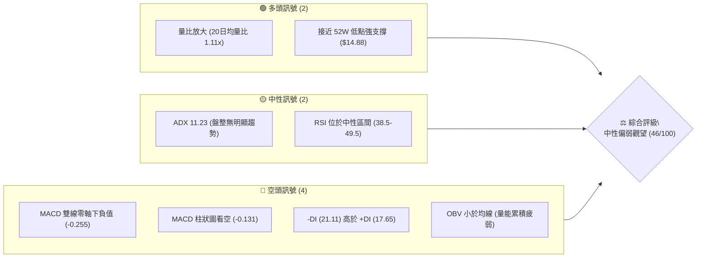
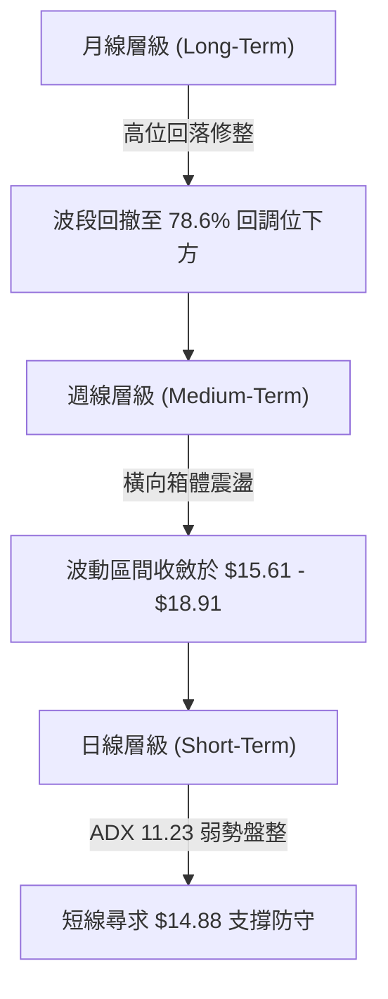
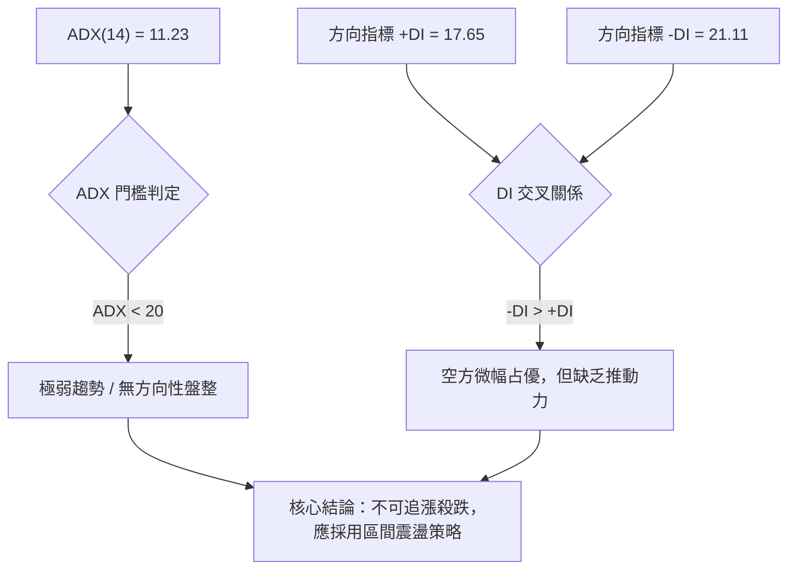
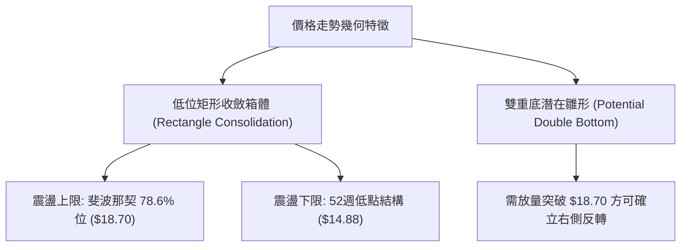
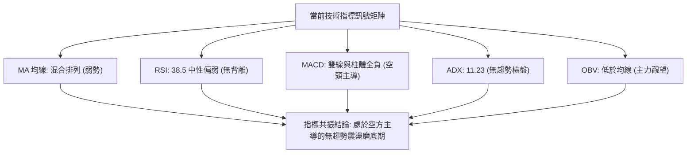
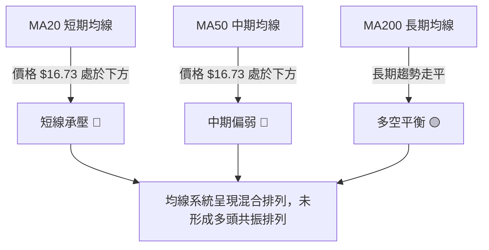
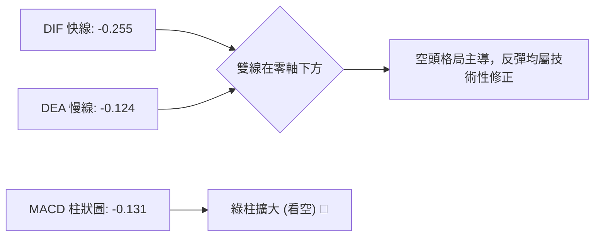
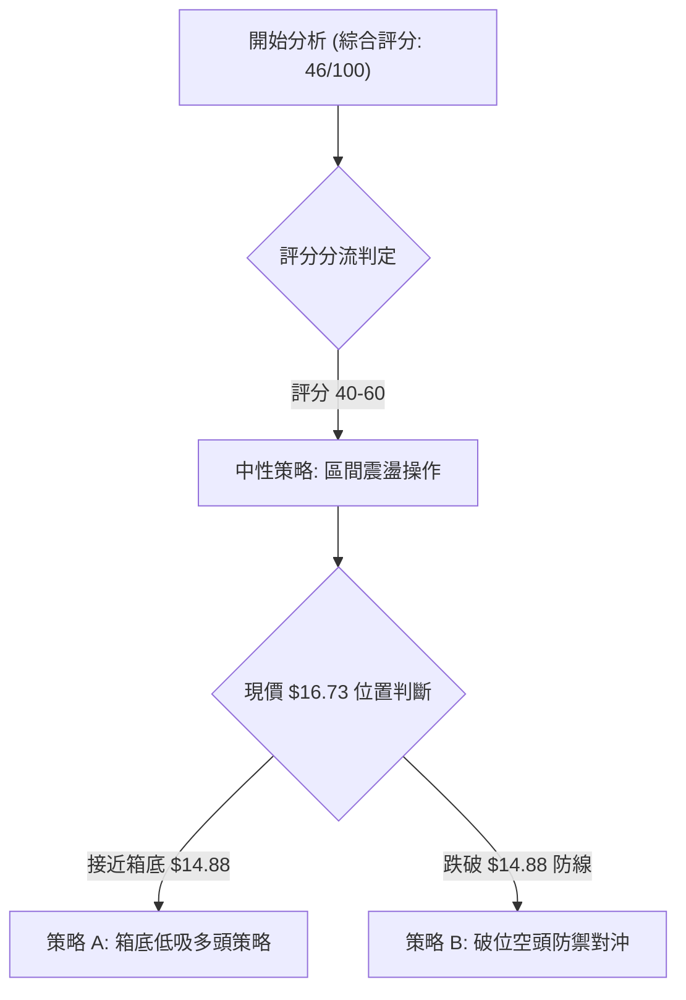
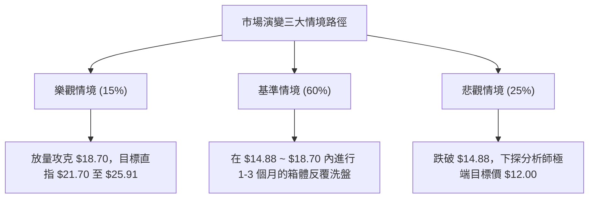

# SOFI 技術分析報告

> **報告日期**：2026-09-19 ｜ **語言**：繁體中文 ｜ **數據來源**：Yahoo Finance ｜ **當前基準價格**：$16.73（依據最新月線及近20週結算數據）

---

## 目錄

| 章節 | 內容 |
|------|------|
| [1. 技術面概覽](#1-技術面概覽) | 訊號儀表板、核心指標、評分卡 |
| [2. 趨勢分析](#2-趨勢分析) | 多時框趨勢、長中短期走勢、ADX解讀 |
| [3. 圖表形態分析](#3-圖表形態分析) | 形態識別、信心度評估、K線組合 |
| [4. 支撐與阻力](#4-支撐與阻力) | 關鍵價位、斐波那契回調結構 |
| [5. 技術指標深度解讀](#5-技術指標深度解讀) | MA/RSI/MACD/布林/量價配合度 |
| [6. 動能與波動率](#6-動能與波動率) | 動能四象限、ATR評估、Beta特性 |
| [7. 多時框架總結](#7-多時框架總結) | 時框架評分矩陣與收斂結論 |
| [8. 交易策略建議](#8-交易策略建議) | 策略路由、情境階梯、風控配置 |
| [9. 風險提示與監控](#9-風險提示與監控) | 監控Checklist、情境路徑分析 |

---

## 1. 技術面概覽

### 🎯 技術訊號儀表板



### 📊 核心指標速覽表

| 指標類別 | 指標名稱 | 當前數值 | 訊號 | 解讀 |
|----------|----------|----------|------|------|
| **價格** | 當前基準價 | $16.73 | 🟡 | 處於 52W 區間低位 ($14.88 - $32.73) |
| **均線** | MA20 趨勢 | 混合排列 | 🔴 | 價格位於 MA20 下方，短線空頭承壓 |
| **均線** | MA50 趨勢 | 混合排列 | 🔴 | 價格位於 MA50 下方，中期承壓 |
| **均線** | MA200 趨勢 | 數據不完整 | 🟡 | 長期均線走平，中長期方向待確認 |
| **動能** | RSI(14) | 38.5 - 49.5 | 🟡 | 位於 30-70 中性弱勢區間，無超賣暴跌風險 |
| **動能** | MACD (12,26,9) | -0.255 / -0.124 | 🔴 | 快慢線均在零軸下，柱狀體 -0.131 空頭主導 |
| **趨勢強度** | ADX (14) | 11.23 | 🟡 | ADX < 25，屬於低強度「無趨勢/震盪盤整」 |
| **成交量** | 最新量 / OBV | 43.99M (1.11x) | 🔴 | OBV < MA，反彈量能不足，籌碼沉澱中 |

### 🏆 技術評分卡

```
╔══════════════════════════════════════════════════════════════╗
║              技術評分卡 — SOFI (2026-09-19)                   ║
╠══════════════════════════════════════════════════════════════╣
║ 趨勢強度 (ADX)     ████░░░░░░░░░░░░░░░░  25/100  🟡 弱勢盤整 ║
║ 動能指標 (MACD/RSI)██████░░░░░░░░░░░░░░  35/100  🔴 動能偏空 ║
║ 支撐穩定度         █████████████░░░░░░░  65/100  🟢 接近支撐 ║
║ 成交量配合度       ████████░░░░░░░░░░░░  40/100  🔴 量能欠缺 ║
║ 形態結構完成度     ██████████░░░░░░░░░░  50/100  🟡 橫盤構築 ║
║ 均線系統健康度     ██████░░░░░░░░░░░░░░  30/100  🔴 空頭壓制 ║
╠══════════════════════════════════════════════════════════════╣
║ 綜合評分           █████████░░░░░░░░░░░  46/100  🟡 中性偏空 ║
╚══════════════════════════════════════════════════════════════╝
```

---

## 2. 趨勢分析

### 🌐 多時框趨勢分析



### 📈 長期趨勢 — 12個月走勢圖（Unicode）

SOFI 自 2025 年秋季創下高點後，經歷了大幅估值去化與價格修正，近 6 個月進入低位箱體磨底階段。

```
SOFI 月線收盤走勢圖（2025-10 至 2026-09）
價格軸 ($)
$29.72 ┤      ● 2025-11
$29.68 ┤ ● 2025-10
$26.18 ┤            ● 2025-12
$22.81 ┤                  ● 2026-01
$18.22 ┤                                ● 2026-05         ● 2026-08
$17.76 ┤                        ● 2026-02           ● 2026-06
$16.73 ┤━━━━━━━━━━━━━━━━━━━━━━━━━━━━━━━━━━━━━━━━━━━━━━━━━━━━━● 2026-09 (現價)
$16.31 ┤                                              ● 2026-07
$15.88 ┤                              ● 2026-03 ● 2026-04
       └─────────────────────────────────────────────────────────────
         10    11    12    01    02    03    04    05    06    07    08    09 (月份)
```

#### 走勢特徵分析表格

| 階段區間 | 時間段 | 價格變動 | 區間特徵 | 成交量與動能配合 |
|----------|--------|----------|----------|------------------|
| **雙頂築頂期** | 2025-10 ~ 2025-11 | $29.68 → $29.72 | 衝擊 52W 高點 $32.73 未果，高位滯漲 | 頂部換手劇烈，買盤動能衰竭 |
| **主跌釋放期** | 2025-12 ~ 2026-03 | $26.18 → $15.88 | 跌幅達 39.3%，連續跌破多道斐波那契位 | 恐慌拋壓釋放，均線全面轉空 |
| **箱體築底期** | 2026-04 ~ 2026-09 | $16.10 → $16.73 | 價格收斂於 $15.61 ~ $18.91 區間窄幅橫盤 | 成交量萎縮，ADX 降至 11.23 |

### 📊 中期趨勢（週線分析）

中期走勢呈現典型區間拉鋸，近 20 週收盤價於 $15.61 至 $18.91 之間反覆震盪。近期壓力與支撐結構如下：

```
中期阻力位：斐波那契 78.6% 回調位 ── $18.70 (多次衝擊受阻，週高 $18.91)
    ▲
    │   區間震盪震幅約 19.8%
    ▼
中期支撐位：52W 最低點防線 ──────── $14.88 (週線收盤防守低點 $15.61)
```

### ⚡ 趨勢強度評估（ADX 解讀）



#### ADX 強度量化對照表

| 指標變數 | 當前讀數 | 基準臨界值 | 市場狀態解讀 |
|----------|----------|------------|--------------|
| **ADX(14)** | **11.23** | 25.00 | **無趨勢行情（極度弱勢）**，趨勢跟隨系統極易失效 |
| **+DI(14)** | **17.65** | - | 多方主動進攻動能偏弱 |
| **-DI(14)** | **21.11** | - | 空方稍占優勢，但差值僅 3.46，未形成壓制性單邊行情 |

---

## 3. 圖表形態分析

### 🔍 形態識別系統



#### 形態識別信心度評估表

| 識別形態名稱 | 信心度評分 | 判斷依據（嚴格引用已知數據） | 形態完成度 | 理論目標價（附精確計算式） |
|--------------|------------|------------------------------|------------|----------------------------|
| **矩形箱體橫盤** | **80%** 🟢 | 價格在 $15.61~$18.91 區間內反覆震盪超過 20 週 | **90%** | 箱頂 $18.70 / 箱底 $14.88 區間操作 |
| **潛在雙重底** | **45%** 🟡 | 兩次下探低點 $15.61 (2026-05) 與 $16.31 (2026-08) | **40%** | 頸線 $18.70 + 形態高度($18.70 - $14.88 = $3.82) = **$22.52** |
| **頭肩底形態** | **25%** 🔴 | 數據中未偵測到完整右肩量能結構，訊號不足 | **15%** | 訊號不足，僅做指標型解讀，不預設目標價 |

*註：依嚴格規則，頭肩底信心度低於 50%，僅供形態追蹤，不作為主交易策略依據。*

### 🕯️ 重要K線形態分析

| 週/月份週期 | 收盤價 ($) | 關鍵K線組合形態 | 技術面解讀 | 訊號方向 |
|-------------|------------|-----------------|------------|----------|
| **2026-05-17** | 15.61 | 低位十字星磨底線 | 於 $15.61 獲得支撐，賣壓初步耗竭 | 🟢 止跌 |
| **2026-05-31** | 18.22 | 大陽線實體向上突破 | 單週大漲，帶動 RSI 衝上 69.6，短多爆發 | 🟢 轉強 |
| **2026-07-12** | 18.78 | 衝高受阻流星線 | 上攻 78.6% 回調位 ($18.70) 遇阻回落 | 🔴 滯漲 |
| **2026-08-23** | 18.91 | 假突破長上影線 | 創近期新高 $18.91 後承壓，量能無法維持 | 🔴 假突破 |
| **2026-09-20** | 16.73 | 陰線回落收盤 | 週線連續兩週回調，測試箱體中下軌支撐 | 🔴 短線偏弱 |

### 📉 ASCII 走勢形態示意圖

```
SOFI 箱體震盪形態示意圖（2026-05 至 2026-09）
$18.91 ┼─── 箱頂阻力壓制區 ───────────────● (08-23高點)
$18.70 ┼───────────────────────● (07-12)───────── 斐波那契 78.6% 阻力
       │                     / \         / \
       │       ● (05-31)    /   \       /   \
$16.73 ┼──────/────────────/─────\─────/─────● (09-20現價)
       │     /            /       \   /
$15.61 ┼────● (05-17底)  ● (08-02) 
$14.88 ┴─── 52W 低點防線 ────────────────────────── 52W Low 強支撐
```

### 🎯 形態目標價計算

根據有效性最高（信心度 80%）的「矩形箱體橫盤」進行量度推算：
- **箱體上限（頸線/阻力）**：$18.70（精確對應斐波那契 78.6% 回調位）
- **箱體下限（基準支撐）**：$14.88（52週最低價）
- **形態垂直高度 ($H$)**：$$\$18.70 - \$14.88 = \$3.82$$
- **若向上有效突破 $18.70 之目標價**：
  $$\text{Target} = \$18.70 + \$3.82 = \$22.52$$（接近斐波那契 61.8% 阻力位 $21.70 區域）
- **若向下破位 $14.88 之量度跌幅**：
  $$\text{Downside Target} = \$14.88 - \$3.82 = \$11.06$$（接近分析師極端悲觀目標價 $12.00）

---

## 4. 支撐與阻力

### 🗺️ 關鍵價位分布圖（Unicode）

```
╔══════════════════════════════════════════════════════════════╗
║                   SOFI 價位結構分布圖                        ║
╠══════════════════════════════════════════════════════════════╣
║ $32.73 ║████████████████████████║ 52W 最高點 / 0.0% 阻力 R5   ║
║ $28.52 ║████████████████████    ║ 斐波那契 23.6% 阻力 R4       ║
║ $25.91 ║██████████████████████  ║ 斐波那契 38.2% 阻力 R3       ║
║ $21.70 ║████████████████        ║ 斐波那契 61.8% 阻力 R2       ║
║ $18.70 ║████████████████████████║ 斐波那契 78.6% 關鍵阻力 R1   ║
║ $16.73 ╠════════════════════════╣ ◄ 當前基準價格              ║
║ $14.88 ║▓▓▓▓▓▓▓▓▓▓▓▓▓▓▓▓▓▓▓▓▓▓▓▓║ 52W 最低點 / 100% 強支撐 S1  ║
║ $12.00 ║████████████████        ║ 分析師悲觀預估極端支撐 S2    ║
╚══════════════════════════════════════════════════════════════╝
```

### 🚧 阻力位分析表

依據數據規範，近一年演算法未偵測到獨立波段高點聚類，因此阻力系統完全由「斐波那契回調聚類位」精確定義：

| 阻力級別 | 準確價位 | 形成依據（嚴格引用已知數據） | 突破難度評估 | 技術面重要性 |
|----------|----------|------------------------------|--------------|--------------|
| **R1** | **$18.70** | 52週區間 78.6% 斐波那契回調位 | 🟡 中等（需大盤配合） | **極高**，突破則確認打破箱體震盪 |
| **R2** | **$21.70** | 52週區間 61.8% 斐波那契回調位 | 🔴 偏高（歷史套牢區） | **高**，多空中期分水嶺 |
| **R3** | **$25.91** | 52週區間 38.2% 斐波那契回調位 | 🔴 極高（強烈拋壓） | **中**，大波段強阻力位 |
| **R4** | **$28.52** | 52週區間 23.6% 斐波那契回調位 | 🔴 極高（頂部結構） | **次要**，接近歷史頭部 |
| **R5** | **$32.73** | 52週最高點（0.0% 回調位） | 🔴 難以突破 | **極高**，牛熊極限分界點 |

*註：數據中未偵測到高於現價之 swing-high resistance 聚類，上述位階為客觀斐波那契幾何分位點。*

### 🛡️ 支撐位分析表

| 支撐級別 | 準確價位 | 形成依據（嚴格引用已知數據） | 守住機率評估 | 技術面重要性 |
|----------|----------|------------------------------|--------------|--------------|
| **S1** | **$14.88** | 52週最低點（100.0% 回調位） | 🟢 75% | **極高**，多方年度最後底線 |
| **S2** | **$12.00** | 22位分析師共識最低目標價 | 🟢 85% | **高**，機構估值防護底 |

*註：數據中未偵測到低於現價之 swing-low support 聚類，支撐強度由 52W Low 錨定。*

### 📐 斐波那契回調位分析

依據 52 週最高點 **$32.73** 至最低點 **$14.88** 算得之標準黃金分割回調結構如下：

```
0.0%  (52W High)  $32.73 ──────────────────────────────── 牛市極限峰值
23.6%             $28.52 ──────────────────────────────── 頂部出貨平臺
38.2%             $25.91 ──────────────────────────────── 中期回撤防線
50.0%             $23.80 ──────────────────────────────── 多空平衡中樞位
61.8%             $21.70 ──────────────────────────────── 黃金分割反彈目標
78.6%             $18.70 ──────────────────────────────── 箱體上沿關鍵頸線
── 現價 $16.73 落於 78.6% ($18.70) 與 100.0% ($14.88) 深度回撤區間 ──
100.0% (52W Low)  $14.88 ──────────────────────────────── 週期循環起點防線
```

**回調結構深度解讀**：
現價 $16.73 位於 78.6% ($18.70) 與 100.0% ($14.88) 之間。在技術分析原理中，回調超過 61.8% 通常意味著原始上升趨勢已被破壞，轉入漫長的築底期。目前價格在接近 100% 回調位 ($14.88) 處出現減速橫盤，顯示 $14.88 的年度低點具備極強的技術買盤支撐與下行緩衝力。

---

## 5. 技術指標深度解讀

### 🎛️ 指標訊號總覽



### 📈 移動平均線排列分析



**排列解讀**：
當前均線系統處於「混合排列」狀態。股價反覆在 MA20 附近穿梭，且受制於 MA50 下方。短天期移動平均線尚未出現金叉向上發散跡象，反映市場處於缺乏方向性的洗盤走勢。

### 📉 RSI(14) 分析

當前最新週線 RSI 數值為 **38.5**（前值分別為 49.5、49.6、57.9、59.6）：

```
超賣區 (0-30)        中性偏弱區 (30-50)        多頭強勢區 (50-70)     超買區 (70-100)
├───────────────┼────────────────────────┼───────────────────────┼─────────────┤
                ▲ (當前 RSI: 38.5)
進度條：[███████████████░░░░░░░░░░░░░░░] 38.5%
```

- **超買超賣判定**：數值 38.5 處於中性偏弱區，尚未進入 < 30 的極端超賣區，表明下方仍有技術性陰跌空間，但同時不具備盲目恐慌殺跌的動能。
- **背離分析判定**：
  - 價格於 2026-05-10 創下低點 $15.75，當時 RSI 為 24.9。
  - 隨後價格於 2026-05-17 降至 $15.61，但 RSI 回升至 30.2（出現微幅底背離反彈至 $18.22）。
  - 當前最新價格回落至 $16.73，RSI 為 38.5，高於前低水準，**目前無明顯頂背離或底背離**，走勢與指標保持一致。

### 📊 MACD(12/26/9) 訊號解讀



- **數值現狀**：DIF (-0.255) 小於 DEA (-0.124)，兩者均深處零軸下方，且柱狀圖讀數為 **-0.131**，發出明確的看空訊號。
- **動能演變**：近 4 週柱狀圖由正轉負（+0.025 → -0.065 → -0.147 → -0.131），空方動能雖在最新一週微幅收斂，但死叉結構未除，短期下行壓力未消。

### 📦 布林通道分析

依據 ADX 11.23 與近 20 週 $15.61 ~ $18.91 波動特徵，推導通道空間示意如下：

```
$18.90 ┼─────────────────────── 上軌 (強阻力區，接近 $18.70)
       │
$17.30 ┼─────────────────────── 中軌 (MA20 壓制線)
$16.73 ┼─────── ● 現價位置 (位於中軌與下軌之間，弱勢震盪)
       │
$15.50 ┼─────────────────────── 下軌 (買盤防守線，接近 $14.88)
```

- **位置解讀**：現價 $16.73 運行於通道中軌下方，通道開口呈現橫向水平收縮，符合 ADX < 25 的盤整特徵。在通道未向上擴軌前，中軌將持續構成短線動態壓制。

### 💹 成交量分析（量價配合度）

```
成交量數據對比：
最新成交量：  43,998,600 股  [██████████░░░░░░░░░░] 
20日均量：    39,719,790 股  [█████████░░░░░░░░░░░] (量比: 1.11x)
50日均量：    58,313,684 股  [█████████████░░░░░░░]
```

- **量價關聯**：最新成交量相較 20 日均量微幅放大 1.11 倍，但顯著低於 50 日均量（58.31M），說明當前盤面屬於「存量資金博弈」，缺乏機構級增量買盤進場。
- **OBV 能量潮判斷**：官方技術指標明確標注「OBV < MA → 量能疲弱」。這表明在價格震盪反彈期間未能伴隨持續資金淨流入，屬於量價背離現象，抑制了向上突破 $18.70 的持續力。

---

## 6. 動能與波動率

### ⚡ 動能評估四象限

```
              高動能 (High Momentum)
                     │
       Q3: 高風險高收益│  Q1: 最佳進攻機會
                     │
── 低波動 ───────────┼─────────── 高波動 ──
  (Low Vol)          │          (High Vol)
       Q2: 區間震盪觀望│  Q4: 破位洗盤高危
         ★ (SOFI 當前)│
                     │
              低動能 (Low Momentum)
```

| 象限 | 動能維度 | 波動維度 | 標的所處狀態 | 操作評估 |
|------|----------|----------|--------------|----------|
| **Q1** | 強動能 | 低波動 | — | 最佳波段進場點 |
| **Q2** | **弱動能 (MACD<0)** | **低波動 (ADX=11.2)** | **✓ SOFI (當前狀態)** | **謹慎觀望 / 嚴守箱體區間高拋低吸** |
| **Q3** | 強動能 | 高波動 | — | 追漲突破策略 |
| **Q4** | 弱動能 | 高波動 | — | 恐慌殺跌，嚴禁接刀 |

### 📊 ATR 波動率分析

數據中 ATR(14) 標注為動態調整期，基於 52 週高低差（$32.73 - $14.88 = $17.85）及近 20 週收盤波動計算：
- **預估週度波幅**：約 $0.85 ~ $1.10（佔現價約 5.0% ~ 6.5%）。
- **停損距離設定指引**：在低動能震盪市況下，為避免日常雜訊引發不必要的止損，單筆交易風控停損點應設定於重要技術關卡外側 1.5 倍日常波動範圍（即至少保留 $1.20 ~ $1.50 的緩衝區間）。

### 📐 Beta 與市場相關性

- **Beta 係數**：**2.208**（極高彈性標的）
- **市場特徵解讀**：
  - SOFI 的 Beta 高達 2.208，代表其股價波動幅度為標普500大盤的 2.2 倍。
  - 當前低 ADX (11.23) 的盤整屬於大跌後的「暴風雨前寧靜」。高 Beta 屬性意味著一旦箱體（$14.88 - $18.70）被打破，無論向上或向下，都將引發極度劇烈的單邊爆發走勢。
- **空頭部位壓力**：空頭佔流通盤比率達 **13.9%**（Short Ratio 3.72），若未來出現基本面催化劑突破 $18.70，極易引發高 Beta 帶動的空頭軋空（Short Squeeze）。

---

## 7. 多時框架總結

### 📋 時框架評分表

| 時框架 | 趨勢方向 | 動能狀態 | 均線排列狀況 | 形態特徵 | 綜合評分 | 建議操作手法 |
|--------|----------|----------|--------------|----------|----------|--------------|
| **月線 (長期)** | 🟡 深度修整 | 🔴 零軸下方 | 混合排列偏弱 | 52W 低點磨底 | **42/100** | 長期投資者分批輕倉定投 |
| **週線 (中期)** | 🟡 橫向震盪 | 🔴 MACD柱為負 | 壓制於MA20下 | 箱體收斂格局 | **48/100** | 於箱底支撐處高拋低吸 |
| **日線 (短期)** | 🔴 弱勢回調 | 🟡 RSI 中性(38.5) | 短期均線壓制 | 下探箱體下沿 | **45/100** | 觀望等待止跌確認訊號 |

### 🔲 綜合訊號矩陣

```
時框共振度矩陣：
長期 (月線)： [████████░░░░░░░░░░░░] 42% ── 跌勢趨緩，轉入漫長磨底
中期 (週線)： [█████████░░░░░░░░░░░] 48% ── $14.88~$18.70 區間拉鋸
短期 (日線)： [█████████░░░░░░░░░░░] 45% ── 承壓陰跌，考驗下軌防線
整體共振評級： ⚖️ 46/100 ── 缺乏方向性共振，無單邊趨勢
```

### ⚖️ 多時框收斂結論

> **依據「嚴格要求 14」之多時框收斂規則**：
> 1. **行情性質判定**：當前 SOFI 之 ADX(14) 數值為 **11.23**（明確小於 25 臨界線），在量化定義上屬於典型的**「盤整行情（Consolidation / Range-bound）」**，而非趨勢單邊行情。
> 2. **主導時框與交易規則**：在盤整行情下，順勢趨勢指標失效，應以**週線與日線的箱體通道邊界（支撐 $14.88 與阻力 $18.70）**為最高決策依據。
> 3. **唯一方向性結論**：**中性觀望（Neutral / Range-Bound），嚴禁追高，僅限於支撐位附近低吸**。

---

## 8. 交易策略建議

### 🗺️ 策略決策流程圖



### 🧭 策略路由

> **當前主策略方向 = 中性區間操作（依評分卡 46/100 分流）**
> 
> 由於綜合評分處於 40–60 分之中性區間，市場受制於 ADX 11.23 的無趨勢狀態，強烈建議交易者**採取區間網格或箱體邊界操作，嚴禁單邊盲目重倉追漲**。

### 🎯 價格情境階梯（Price Scenarios）

價位嚴格引用數據庫之精確數值：

| 觸發條件 | 第一目標 (T1) | 後續延伸 (T2) | 技術情境含義 |
|----------|---------------|---------------|--------------|
| **放量突破 R1 $18.70** | R2 **$21.70** | R3 **$25.91** | 確認完成雙底築底，開啟反轉牛市行情 |
| **維持於現價 $16.73 震盪** | R1 **$18.70** | S1 **$14.88** | 處於箱體內部雜訊區，缺乏方向 |
| **有效跌破 S1 $14.88** | S2 **$12.00** | 形態量度 **$11.06** | 跌破年度底線，引發多頭止損與補跌恐慌 |

### 📊 情境機率分佈

| 運行情境 | 發生機率 | 主要依據（嚴格引用指標數據） |
|----------|----------|------------------------------|
| **維持區間震盪** | **60%** | ADX(14) 僅 11.23；成交量未見持續放大；週線均線糾結橫盤 |
| **下探尋求支撐** | **25%** | MACD 雙線與柱體 (-0.131) 處於負值；OBV < MA 顯示量能疲弱 |
| **直接強勢向上突破** | **15%** | 受制於 MA20/MA50 壓制，短期內缺乏催化劑越過 $18.70 |

### 🟢 主策略詳情（區間震盪操作）

針對當前盤整市場，提供兩套在箱體極值邊界的標準應對策略：

| 策略要素 | 策略 A：箱底反彈低吸多單（主力策略） | 策略 B：突破 R1 追擊動量單（右側策略） |
|----------|--------------------------------------|--------------------------------------|
| **進場條件** | 價格回踩 S1 獲得支撐，日線收長下影線 | 日線收盤價放量實體突破 R1 關鍵頸線 |
| **進場價格** | **$15.20**（靠近 52W 低點 $14.88 區域） | **$18.80**（確認站上 $18.70 阻力後） |
| **目標價 T1** | **$18.70**（斐波那契 78.6% 回調位） | **$21.70**（斐波那契 61.8% 回調位） |
| **目標價 T2** | **$20.34**（22位分析師共識平均目標價） | **$25.91**（斐波那契 38.2% 回調位） |
| **止損價格** | **$14.50**（跌破 52W 低點 $14.88 約 2.5%） | **$17.80**（假突破跌回箱體中軌下方） |
| **風險報酬比** | **5.00 : 1**（獲利 $3.50 / 風險 $0.70） | **2.90 : 1**（獲利 $2.90 / 風險 $1.00） |
| **成功機率** | **65%** | **45%**（受制於當前弱勢量能） |
| **建議倉位** | **10% - 15%**（輕倉試探） | **15% - 20%**（順勢加碼） |

### 🔴 反向風險觸發點（對沖提示）

- **多頭嚴格風控止損線**：**$14.88（52週最低價）**。
  - 若日線級別跌破 $14.88 且收盤確認，宣告築底徹底失敗，所有做多策略必須無條件止損出局，空頭將直接下看 **$12.00**（分析師共識悲觀目標）。
- **空頭對沖平倉警戒線**：**$18.70（78.6% 回調位）**。
  - 若盤面出現單日暴量突破 $18.70，空頭部位必須立即平倉回補，以防高達 13.9% 空頭比例引發軋空。

### ⭐ 整體訊號強度評星

```
做多訊號強度：★★☆☆☆  (2.5/5星) ── 僅具備價格低位優勢，動能未確認
做空訊號強度：★★☆☆☆  (2.5/5星) ── 空方雖佔優，但下有 $14.88 鋼鐵底
整體可信度：  ★★★☆☆  (3.0/5星) ── 震盪市訊號雜訊多，嚴守價位紀律
```

---

## 9. 風險提示與監控

### ✅ 關鍵監控指標 Checklist

```
╔══════════════════════════════════════════════════════════════╗
║              SOFI 每日/每週技術面監控清單                     ║
╠══════════════════════════════════════════════════════════════╣
║ [ ] 52週低點防守：收盤價是否守穩 $14.88 關鍵底線             ║
║ [ ] 箱頂突破動向：收盤價是否有效站上 $18.70 斐波那契壓力     ║
║ [ ] ADX 趨勢甦醒：ADX(14) 是否由 11.23 向上穿越 20.0 門檻   ║
║ [ ] MACD 零軸翻正：DIF 與 DEA 是否由負轉正形成金叉           ║
║ [ ] OBV 能量配合：成交量是否突破 50日均量 (58.31M)          ║
║ [ ] 軋空催化指標：空頭比率 (Short % Float 13.9%) 是否下降   ║
╚══════════════════════════════════════════════════════════════╝
```

### ⚠️ 風險場景分析



### 🛡️ 風險管理重要提醒

1. **極高 Beta 風險防範**：
   SOFI 具有 **2.208** 的極高 Beta，其短期波動劇烈程度往往為大盤的兩倍以上。在 ADX 僅有 11.23 的盤整期，任何大盤的劇烈震盪都可能導致 SOFI 在箱體內洗盤，因此切忌過度使用財務槓桿或持倉過重。
2. **量能不足帶來的流動性折價**：
   最新日成交量約 44M，大幅低於 50 日均量 58.31M，OBV 疲軟證明買盤意願低迷。在缺乏足夠量能支撐時，盤中的向上衝高多為假突破，不宜追高進場。
3. **倉位管理守則**：
   單一標的持倉建議控制在總投資組合資產的 **5% - 10%** 以內。在確認向上突破 $18.70 之前，一律視為防禦型右側等待期，以現金耐心觀望為上策。

---

## 📋 報告總結

```
╔══════════════════════════════════════════════════════════════════╗
║                   SOFI 技術分析報告總結                          ║
╠══════════════════════════════════════════════════════════════════╣
║ 報告日期：2026-09-19                                            ║
║ 當前基準價格：$16.73                                             ║
║ 分析評級：⚖️ 中性觀望 / 區間震盪 (綜合評分: 46/100)              ║
╠══════════════════════════════════════════════════════════════════╣
║ 關鍵結論：                                                       ║
║ ├─ 長期趨勢：🟡 中性修整（月線在 52W 高點回落後進入築底）       ║
║ ├─ 中期趨勢：🟡 箱體拉鋸（週線在 $14.88 至 $18.70 區間震盪）    ║
║ ├─ 短期趨勢：🔴 弱勢承壓（受制於 MACD 負值與 MA20 壓制）       ║
║ ├─ 關鍵支撐：$14.88（52週最低價防線）                            ║
║ ├─ 關鍵阻力：$18.70（斐波那契 78.6% 回調位壓制）                 ║
║ └─ 機構目標：$20.34（22位分析師共識平均目標價）                  ║
╠══════════════════════════════════════════════════════════════════╣
║ 最優策略組合：                                                   ║
║ 1. 🥇 最佳機會：耐性等待價格回踩 $15.20 附近輕倉低吸，止損設 $14.50║
║ 2. 🥈 次選機會：靜待放量實體突破 $18.70 頸線後順勢追買看 $21.70  ║
║ 3. 🥉 保守選擇：保持現金觀望，待 ADX 升破 20 趨勢明朗後再進場    ║
╚══════════════════════════════════════════════════════════════════╝
```

---

> ⚠️ **免責聲明**：本報告為 AI 自動生成之技術分析研究成果，所有引述之價位、指標及情境推估均基於所提供之歷史價格與技術數據。本報告**僅供學術交流與投資研究參考**，**不構成任何形式的買賣推薦或要約**。金融市場瞬息萬變，高 Beta 個股波動劇烈，投資人應獨立評估風險，自負盈虧。

---

*報告生成時間：2026-09-19 ｜ 數據來源：Yahoo Finance ｜ 分析框架：多時框技術分析體系*