# SOFI 技術分析報告

> **報告日期**：2026-09-20 ｜ **語言**：繁體中文 ｜ **數據來源**：Yahoo Finance ｜ **當前價格**：$16.96

---

## 目錄

| 章節 | 內容 |
|------|------|
| [1. 技術面概覽](#1-技術面概覽) | 訊號儀表板、核心指標、評分卡 |
| [2. 趨勢分析](#2-趨勢分析) | 多時框趨勢、長中短期走勢 |
| [3. 圖表形態分析](#3-圖表形態分析) | 形態識別、K線組合、目標價 |
| [4. 支撐與阻力](#4-支撐與阻力) | 關鍵價位、斐波那契回調 |
| [5. 技術指標深度解讀](#5-技術指標深度解讀) | MA/RSI/MACD/布林/成交量 |
| [6. 動能與波動率](#6-動能與波動率) | 動能評估、ATR、Beta |
| [7. 多時框架總結](#7-多時框架總結) | 時框架評分矩陣 |
| [8. 交易策略建議](#8-交易策略建議) | 多空策略、風險報酬比 |
| [9. 風險提示與監控](#9-風險提示與監控) | 監控指標、風險場景 |

---

## 1. 技術面概覽

### 🎯 技術訊號儀表板

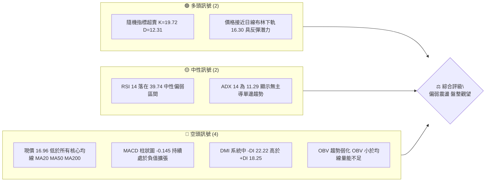

### 📊 核心指標速覽表

| 指標類別 | 指標名稱 | 當前數值 | 訊號 | 解讀 |
|----------|----------|----------|------|------|
| **價格** | 當前價格 | $16.96 | 🔴 | 位於 52 週高低區間 11.7% 低位，承壓於各期短中長期均線 |
| **均線** | MA20 | $17.84 | 🔴 | 現價低於 MA20 達 -4.95%，短線結構處於空頭壓制狀態 |
| **均線** | MA50 | $17.72 | 🔴 | 現價低於 MA50，中期趨勢動能趨弱，無法形成多頭推升 |
| **均線** | MA200 | $19.52 | 🔴 | 現價低於長期牛熊分界線 MA200 達 -13.11%，中長期技術結構受損 |
| **動能** | RSI(14) | 39.74 | 🟡 | 進入中性偏弱區間（30–40），尚未出現極端超賣，無背離現象 |
| **動能** | MACD | -0.272 (柱 -0.145) | 🔴 | 快慢線均在零軸之下且柱狀圖為負，動能指標處於明確看空格局 |
| **動能** | Stoch %K/%D | 19.72 / 12.31 | 🟢 | 進入 20 以下超賣區間，預示短線空方下殺動能消耗，有技術性修正需求 |
| **趨勢** | ADX(14) | 11.29 | 🟡 | 數值遠低於 25 閥值，定性為典型的低波動「無趨勢/盤整行情」 |
| **通道** | 布林 %B | 0.21 | 🟡 | 位於布林通道下軌（$16.30）上方附近，處於弱勢整理區間 |
| **量能** | 量比 (vs 20MA) | 1.11x | 🟡 | 單日量能略微放大至 4,411 萬股，但 OBV 仍落後均線，量能未確認反轉 |
| **波動** | ATR(14) | $0.64 | 🟡 | 佔股價 3.79%，日內波動度中等，波段操作止損設定需容納此空間 |

### 🏆 技術評分卡

```
╔══════════════════════════════════════════════════════════════╗
║              技術評分卡 — SOFI (2026-09-20)                   ║
╠══════════════════════════════════════════════════════════════╣
║ 趨勢強度 (ADX=11.29)  ████░░░░░░░░░░░░░░░░  20/100 🔴 極弱   ║
║ 動能指標 (MACD/RSI)   ███████░░░░░░░░░░░░░  35/100 🔴 偏空   ║
║ 支撐穩定度 (S1=$16.8) ████████████░░░░░░░░  60/100 🟡 中性   ║
║ 成交量配合 (OBV疲弱)  ████████░░░░░░░░░░░░  40/100 🔴 偏弱   ║
║ 形態完整度 (箱型震盪) ██████████░░░░░░░░░░  50/100 🟡 中性   ║
║ 均線排列 (空頭排列)   ████░░░░░░░░░░░░░░░░  20/100 🔴 劣勢   ║
╠══════════════════════════════════════════════════════════════╣
║ 綜合技術評分          ███████░░░░░░░░░░░░░  37.5/100 🔴 偏空  ║
║ 操作主基調            區間震盪下緣防守 / 偏空防禦為先        ║
╚══════════════════════════════════════════════════════════════╝
```

---

## 2. 趨勢分析

### 🌐 多時框趨勢分析

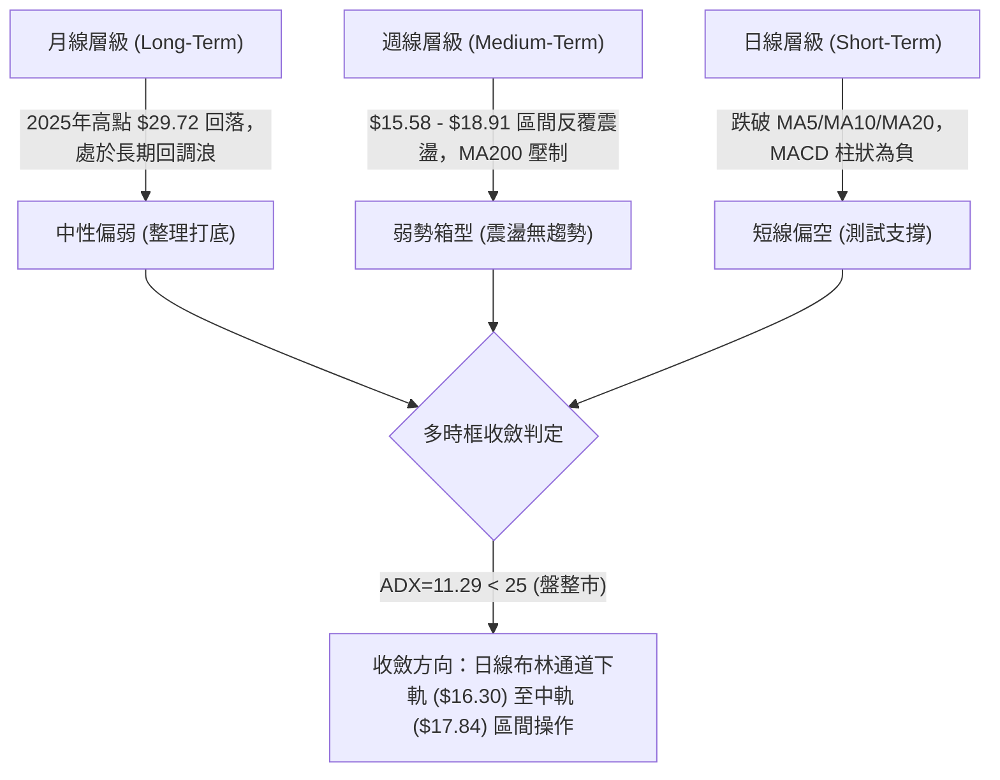

### 📈 長期趨勢 — 12個月走勢圖（Unicode）

```
SOFI 月線走勢圖（過去12個月：2025-10 至 2026-09）
價格軸 ($)
$29.72 ┤       ●(2025-11 高點 $29.72)
$29.68 ┤ ●(2025-10)
$26.18 ┤             ●(2025-12)
$22.81 ┤                   ●(2026-01)
$18.22 ┤                                     ●(2026-05)  ●(2026-08 $17.88)
$17.76 ┤                         ●(2026-02)        ●(2026-06 $17.93)
$16.96 ┤                                                       ●(2026-09 現價 $16.96)
$16.10 ┤                               ●(2026-04)        ●(2026-07 $16.31)
$15.88 ┤                                     ●(2026-03)
$14.88 ┤───────────────────────────────────────────────────────────── (52W 低點 $14.88)
       └─────────────────────────────────────────────────────────────
         10    11    12    01    02    03    04    05    06    07    08    09 (月份)
```

**走勢特徵分析表格**：

| 週期階段 | 起訖區間 | 價格變動 | 區間幅度 | 形態與量價特徵 |
|----------|----------|----------|----------|----------------|
| 頂部構築期 | 2025-10 ~ 2025-11 | $29.68 → $29.72 | +0.13% | 雙頂高位滯漲，月線連續見頂後動能背離 |
| 單邊主跌浪 | 2025-12 ~ 2026-03 | $26.18 → $15.88 | -39.34% | 瀑布式下跌，連續跌破多條長期均線，空方主導 |
| 箱型構築期 | 2026-04 ~ 2026-09 | $16.10 → $16.96 | +5.34% | 進入 $15.58 ~ $18.91 區間橫盤，量能逐步萎縮，方向不明 |

### 📊 中期趨勢（週線分析）

```
SOFI 週線價格結構示意圖（2026-05 至 2026-09）
$19.62 ┬────────────────────────────────────────── 阻力 R2 ($19.62)
$18.79 ┼───────────●───────────────────●────────── 阻力 R1 ($18.79) / 波段高點
$18.22 ┼──────●────────────●──────●─────────────── 密集換手區
$17.84 ┼────────────────────────────────────────── 布林中軌 / MA20 ($17.84)
$16.96 ┼─────────────────────────────────●──────── 現價 ($16.96)
$16.80 ┼────────────────────────────────────────── 近期支撐 S1 ($16.80)
$15.58 ┴──●────●─────────────────────────────────── 波段強支撐 S2 ($15.58)
       May    Jun    Jul    Aug    Sep (2026)
```

中期週線在 2026-05-17 探底 $15.61 後展開反彈，分別於 2026-07-12 觸及 $18.78 與 2026-08-23 觸及 $18.91，形成清晰的水平頸線壓制區間。過去 4 週收盤價由 $18.22 逐級回落至 $16.96，呈現週線級別的「高點受壓、低點趨斂」之弱勢收斂格局。

### ⚡ 趨勢強度評估（ADX 解讀）

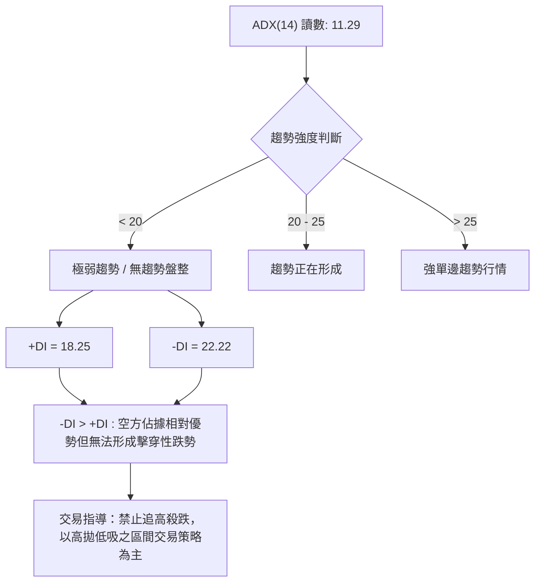

**ADX 強度對照與指標狀態**：

| 指標變數 | 當前數值 | 參考臨界線 | 狀態定性 | 對交易策略之影響 |
|----------|----------|------------|----------|------------------|
| **ADX(14)** | 11.29 | 25.00 | 極弱 / 盤整 | 順勢突破策略無效，假突破機率高達 70% 以上 |
| **+DI(14)** | 18.25 | - | 多頭動能偏弱 | 多方買盤不足以發動持續推升行情 |
| **-DI(14)** | 22.22 | - | 空頭主導相對優勢 | 賣壓雖重，但因 ADX 偏低，不易形成崩跌行情 |

---

## 3. 圖表形態分析

### 🔍 形態識別系統

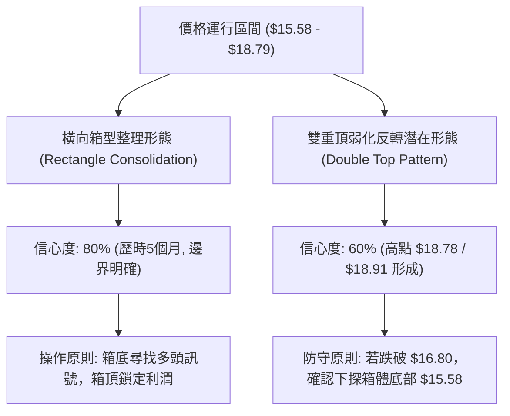

**圖表形態信心度與目標價評估**：

| 形態類別 | 信心度 | 判斷依據（引用技術數據） | 完成度 | 目標價（附嚴謹計算式） |
|----------|--------|--------------------------|--------|------------------------|
| **水平箱型整理** | 80% | 區間底部支撐 S2（$15.58）經 2026-05 兩度驗證，頂部受壓於 R1（$18.79） | 75% | 區間上限即阻力位 R1 = **$18.79**；下限為支撐位 S2 = **$15.58** |
| **局部雙重頂** | 60% | 2026-07-12 高點 $18.78 與 2026-08-23 高點 $18.91 形成雙頭壓制，頸線為 2026-08-02 低點 $16.31 | 70% | 由形態高度推算：$16.31 - ($18.91 - $16.31) = **$13.71**（若跌破頸線 $16.31 成立；若未破則視為箱型震盪） |
| **均線死叉形態** | 85% | MA5 ($17.05) 與 MA10 ($17.33) 均自高點下彎並死叉 MA20 ($17.84) | 100% | 指標型解讀：下測短期支撐位 S1 = **$16.80**，次級支撐 S2 = **$15.58** |

### 🕯️ 重要K線形態分析

| 月份/週期 | 收盤價 | K線形態特徵 | 量價解讀 | 訊號 |
|-----------|--------|-------------|----------|------|
| **2025-11** | $29.72 | 長上影倒錘頭線（歷史次高點） | 在高位遭遇強烈拋壓，多頭推升衰竭，形成週期大頂 | 🔴 空頭反轉 |
| **2026-03** | $15.88 | 長下影錘頭線（探底大陰後反抽） | 測試 52W 低點 $14.88 附近買盤，空方動能初次衰竭 | 🟢 觸底反彈 |
| **2026-05** | $18.22 | 大陽線實體包覆前四週震盪 | 單週暴量 3.67 億股向上突破，確立 $15.58 底部結構 | 🟢 多頭推升 |
| **2026-08** | $17.88 | 高位流星線（週線連續上影） | 衝擊 R1（$18.79）未果，遇阻回落，形成波段次頂 | 🔴 滯漲受壓 |
| **2026-09** | $16.96 | 連續兩週小陰線縮量陰跌 | 現價失守 MA20，空頭陰跌但量能未現恐慌拋盤 | 🟡 弱勢整理 |

### 📉 ASCII 走勢形態示意圖

```
SOFI 日/週線級別箱型與雙頂結構特徵：
$18.91 ┤               頂1($18.78)     頂2($18.91)
$18.79 ┼──────────────────▲──────────────▲────── R1 ($18.79) 箱體頂部
$17.84 ┤                     \          / \
$17.84 ┼──────────────────────\────────/───\─── MA20 / BB中軌 ($17.84)
$16.96 ┤                       \      /     \  ◄ 現價 ($16.96)
$16.80 ┼────────────────────────\────/───────▼─ S1 ($16.80) 第一防線
$16.31 ┤                         ▼(頸線 $16.31)
$15.58 ┴─────────▲────────────────────────────── S2 ($15.58) 箱體底部
       2026-05  2026-06       2026-07   2026-08 2026-09
```

### 🎯 形態目標價計算

1. **水平箱型震盪目標**：
   - 箱體頂部阻力位：**$18.79**（數據庫提供之 R1）
   - 箱體底部支撐位：**$15.58**（數據庫提供之 S2）
   - 中軸價值平衡線：$(18.79 + 15.58) / 2 = \$17.185$（現價 $16.96 處於平衡線下方偏弱區）
2. **局部雙頂破位目標（極端悲觀情境）**：
   - 形態波段頂點取聚類阻力：$18.91
   - 形態破位頸線取近期波段低點：$16.31
   - 形態高度：$18.91 - 16.31 = 2.60$
   - 由雙頂形態高度推算目標價：$16.31 - 2.60 =$ **$13.71**（註：若下方強支撐位 S3 = $14.91 或 52W 低點 $14.88 守住，則此延伸形態失效）。

---

## 4. 支撐與阻力

### 🗺️ 關鍵價位分布圖（Unicode）

```
SOFI 價位結構分布圖（嚴格依據技術數據 OHLCV 聚類）
══════════════════════════════════════════════════════════════════════════
$20.13 ║████████████████████████████████████████║ 強烈歷史阻力 R3
$19.62 ║██████████████████████████████          ║ 重大波段阻力 R2 (MA200 重合區)
$18.79 ║████████████████████████████████████    ║ 關鍵箱體阻力 R1 (Fib 78.6% $18.70)
$17.84 ╟────────────────────────────────────────╢ 日線 MA20 / 布林中軌
$16.96 ╠════════════════════════════════════════╣ ◄ 現價 ($16.96)
$16.80 ║▓▓▓▓▓▓▓▓▓▓▓▓▓▓▓▓▓▓▓▓▓▓▓▓▓▓▓▓▓▓▓▓        ║ 近期關鍵支撐 S1 (-0.94%)
$16.30 ╟┄┄┄┄┄┄┄┄┄┄┄┄┄┄┄┄┄┄┄┄┄┄┄┄┄┄┄┄┄┄┄┄┄┄┄┄┄╢ 日線布林下軌 ($16.30)
$15.58 ║████████████████████████████████████████║ 核心波段強支撐 S2 (-8.16%)
$14.91 ║████████████████████████████████████████║ 極限防守支撐 S3 (-12.09% / 52W底)
══════════════════════════════════════════════════════════════════════════
```

### 🚧 阻力位分析表

| 阻力級別 | 具體價位 | 形成技術依據 | 突破難度評估 | 戰略重要性 |
|----------|----------|--------------|--------------|------------|
| **R1** | **$18.79** | 近一年多次反彈高點聚類；逼近斐波那契 78.6% 回調位（$18.70） | 🟡 中等偏高 | **極高**。唯有帶量突破此位，方能終結過去 5 個月的箱型橫盤格局 |
| **R2** | **$19.62** | 2026 年初反彈波段高點聚類；緊鄰長線牛熊分水嶺 MA200（$19.52） | 🔴 極高 | **重大**。此處為長線機構解套盤與空頭防禦陣地，需宏觀配合方可逾越 |
| **R3** | **$20.13** | 歷史密集成交區底端；整數關卡及 MA240（$20.99）下方引力位 | 🔴 極難 | **次要**。屬於牛市重啟的遠期延伸確認目標 |

### 🛡️ 支撐位分析表

| 支撐級別 | 具體價位 | 形成技術依據 | 守住機率評估 | 戰略重要性 |
|----------|----------|--------------|--------------|------------|
| **S1** | **$16.80** | 近期日線回調低點聚類；現價下方僅距 -0.94% 之第一防線 | 🟡 60% | **高**。日內與短線多空分水嶺，失守則將下測布林下軌 $16.30 |
| **S2** | **$15.58** | 2026-05 週線級別雙重底（$15.61/$15.62）密集成交平台 | 🟢 85% | **極高**。箱型底部實體支撐，多頭中期防禦底線，跌破則中線轉熊 |
| **S3** | **$14.91** | 近一年歷史波段最低點聚類；緊鄰 52 週絕對低點 $14.88 | 🟢 95% | **絕對底線**。長期斐波那契 100% 全回調位，破位將引發系統性下行 |

### 📐 斐波那契回調位分析

*基準區間：52 週最高點 $32.73 跌至 52 週最低點 $14.88，總下跌空間 $17.85*

```
$32.73 ┬────────────────────────────────────────── 0.0% (52W High)
$28.52 ┼────────────────────────────────────────── 23.6% 回調位
$25.91 ┼────────────────────────────────────────── 38.2% 回調位
$23.80 ┼────────────────────────────────────────── 50.0% 平衡回調位
$21.70 ┼────────────────────────────────────────── 61.8% 黃金分割回調位
$18.70 ┼────────────────────────────────────────── 78.6% 深度回調位 (緊貼阻力 R1 $18.79)
$16.96 ┼────── ◄ 現價位於 78.6% ($18.70) 與 100.0% ($14.88) 之間弱勢弱勢區
$14.88 ┴────────────────────────────────────────── 100.0% (52W Low)
```

- **位置定位**：現價 **$16.96** 位於斐波那契 78.6%（**$18.70**）與 100.0%（**$14.88**）的極低位震盪區。
- **技術意義**：股價未能維持在 61.8%（$21.70）上方，證明去年 11 月以來的下行趨勢具有極深的破壞性。當前在 78.6% 回調位（$18.70）屢次受挫，表明該位置已由先前的支撐轉化為極為沉重的「極性轉換阻力區」，與 R1（$18.79）形成嚴密的雙重重疊共振壓力。

---

## 5. 技術指標深度解讀

### 🎛️ 指標訊號總覽

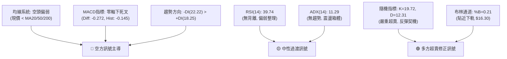

### 📈 移動平均線排列分析

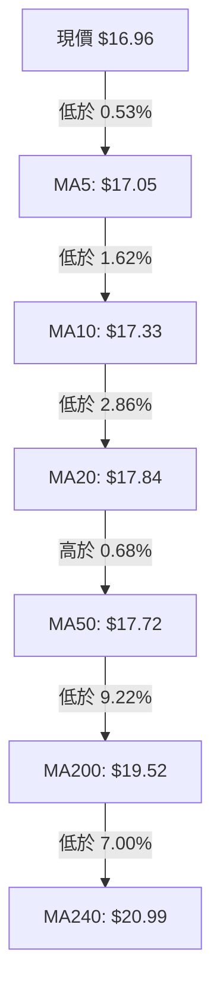

**均線狀態解讀**：
- **短中期均線反壓**：MA5（$17.05）< MA10（$17.33）< MA20（$17.84），短線形成典型的「空頭排列」。MA20 呈下行趨勢，對股價構成首要動態壓制。
- **中期纏繞**：MA20（$17.84）與 MA50（$17.72）數值極度接近，顯示過去 2-3 個月中期持倉成本高度黏合，市場在等待突破方向。
- **長期熊市壓制**：現價落後 MA200（$19.52）達 13.11%，落後 MA240（$20.99）達 19.20%，說明長線結構依然處於深度回調之後的築底階段，修復長天期均線仍需大量時間。

### 📉 RSI(14) 分析

```
RSI(14) 當前數值: 39.74
0 ─────────── 30 ───────●────── 50 ────────────────── 70 ─────────── 100
[  極端超賣區  ]  [  弱勢震盪區  ]   [     強勢多頭區     ]   [  極端超買區  ]
進度條：████████░░░░░░░░░░░░  39.74%
```

- **區間解讀**：RSI 位於 39.74，處於 30 至 50 的「弱勢空方主導區」，表明拋壓尚未完全出清，但也未觸及 30 以下的恐慌超賣區。
- **背離判斷**：
  - **頂背離**：無。
  - **底背離**：無明顯背離。2026-09-13 至 2026-09-20，股價自 $17.32 跌至 $16.96（創新低），RSI 則由 38.5 輕微回升至 39.74。雖然數值微幅抬升，但幅度極小且週期過短，在量化標準上**未構成可確認的底背離形態**，僅視為跌勢減緩的雜訊。

### 📊 MACD(12/26/9) 訊號解讀

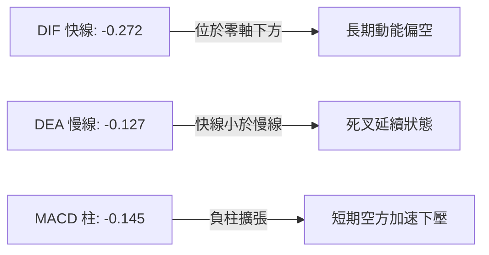

- **動能解析**：DIF 與 DEA 均運行於零軸之下，屬於空頭市場特徵。柱狀圖讀數為 **-0.145**，連續兩週負值放大（前週 -0.147，兩週前 -0.065），顯示短期向下調整動能尚未見到底部拐點，預示下週初仍有向下考驗支撐 S1（$16.80）的動能慣性。

### 📦 布林通道分析

```
SOFI 日線布林通道結構 (20日, 2.0σ)
$19.39 ┬────────────────────────────────────────── BB 上軌 ($19.39)
$17.84 ┼────────────────────────────────────────── BB 中軌 / MA20 ($17.84)
$16.96 ┼───────────────────────●────────────────── 現價 ($16.96, %B = 0.21)
$16.30 ┴────────────────────────────────────────── BB 下軌 ($16.30)
```

- **通道指標數值**：
  - **BB 上軌**：$19.39
  - **BB 中軌**：$17.84
  - **BB 下軌**：$16.30
  - **%B 指標**：**0.21**（計算式：$(16.96 - 16.30) / (19.39 - 16.30) = 0.214$）
- **形態含義**：%B 跌至 0.21，價格已經深入通道下半區，進入統計學上的超賣防守帶。在 ADX 僅為 11.29 的盤整市中，布林通道上下軌具備極高的高拋低吸參考價值。現價距離下軌僅差 $0.66（約 1 個 ATR），下軌 $16.30 將對跌勢構成強大彈性支撐。

### 💹 成交量分析（量價配合度）

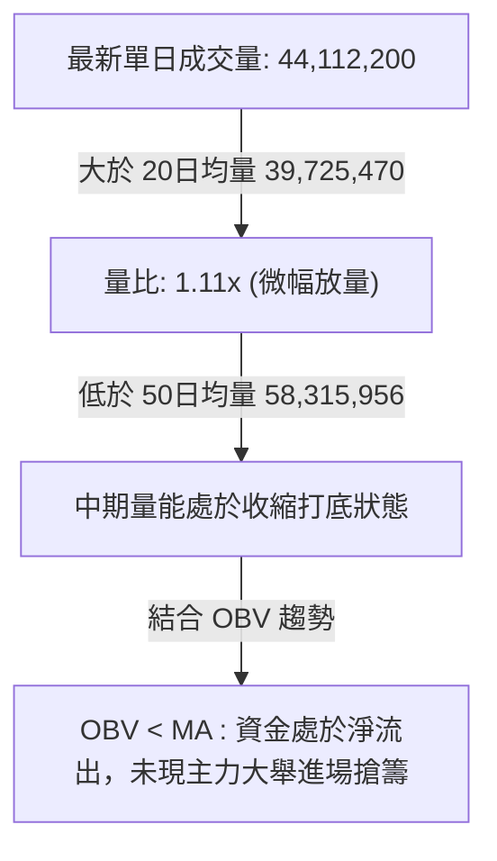

- **週成交量特徵**：2026-09-20 當週成交量為 220,206,200 股，相較於 8 月底的 1.9 億股略有回升，但遠低於 5-6 月突破時的 3.8 億至 4.6 億股水平。
- **量價背離分析**：目前處於「縮量陰跌」狀態，並非暴量恐慌殺跌。這意味著空方籌碼拋壓其實並不沉重，但由於多頭承接意願薄弱，引發價格陰跌走弱；OBV 處於均線下方，明確提示量能疲軟，無法支撐反轉突破行情。

---

## 6. 動能與波動率

### ⚡ 動能評估四象限

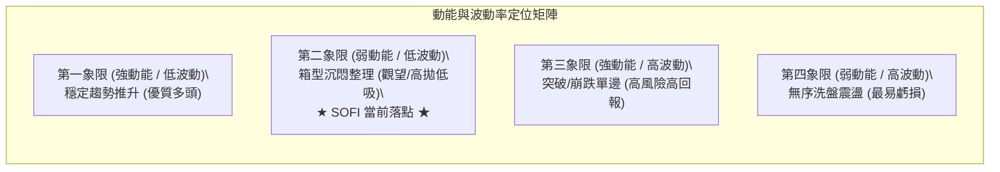

| 象限代號 | 動能強度 | 波動水準 | 當前狀態判定 | 操作指導評估 |
|:--------:|:--------:|:--------:|:------------:|:-------------|
| **Q1** | 強 | 低 | — | 最佳波段加碼區間，當前不符合 |
| **Q2** | **弱** | **低** | **✓ (SOFI 現況)** | **ADX=11.29 顯示動能枯竭，ATR=3.79% 波動低。宜降低交易頻率，嚴守區間邊界操作** |
| **Q3** | 強 | 高 | — | 趨勢突破行情，當前不符合 |
| **Q4** | 弱 | 高 | — | 劇烈雙向掃損，當前不符合 |

### 📊 ATR 波動率分析

```
ATR(14) 波動度進度條 (佔股價比 3.79%)
0% ────────── 2% ──────────────● 4% ──────────────── 6% ────────── 10%
[     低波動環境     ]     [   中度健康波動   ]     [    極端高風險波動    ]
進度條：███████████████░░░░░  3.79%
```

- **數值規格**：當前 ATR(14) 為 **$0.64**，佔現價比例為 **3.79%**。
- **止損距離建議**：
  - **短線進場（1.5 倍 ATR）**：$1.5 \times 0.64 =$ **$0.96**。若以現價 $16.96 進場，短線技術止損位應設於 $16.00 之下。
  - **波段防守（2.0 倍 ATR）**：$2.0 \times 0.64 =$ **$1.28**。波段操作必須預留至少 $1.28 之空間，以防日內雜訊洗盤。

### 📐 Beta 與市場相關性

```
Beta 係數: 2.208 (高彈性成長股屬性)
0.0 ──────────────── 1.0 (大盤基準) ──────────────── 2.0 ──────●────── 3.0
進度條：██████████████████████  2.208
```

- **市場敏感度解讀**：SOFI 的 Beta 高達 **2.208**，代表其波動幅度為標普 500 指數的 2.2 倍以上。當大盤微幅回調時，該股極易引發放大倍數的拋壓；反之，若市場風險偏好回暖，該股具備極強的向上價格彈性。當前在弱勢震盪環境中，高 Beta 特性意味著下檔回測支撐的穿透力較強，必須保持謹慎。

---

## 7. 多時框架總結

### 📋 時框架評分表

| 時框架 | 趨勢方向 | 動能狀態 | 均線排列狀況 | 形態特徵 | 綜合評分 | 操作指導建議 |
|:------:|:--------:|:--------:|:------------:|:--------:|:--------:|:-------------|
| **長期 (月線)** | 中性偏弱 🔴 | 下行減速，RSI 靠近低位 | 現價落後 MA240 (-19.2%) | 雙頂破位後的底部沉澱期 | 35/100 | 長線資金不可盲目左側重倉，待放量 |
| **中期 (週線)** | 橫向整理 🟡 | MACD柱收窄，動能平衡 | 夾在 MA50 與 MA200 之間 | $15.58 ~ $18.79 箱型區間 | 45/100 | 嚴守箱體策略，接近下緣分批建倉 |
| **短期 (日線)** | 偏空下探 🔴 | MACD死叉，隨機超賣 | 空頭排列 (現價 < MA20) | 跌破短期均線尋求 S1 支撐 | 30/100 | 嚴格禁止追多，等待回踩確認訊號 |

### 🔲 綜合訊號矩陣

```
時框與指標維度一致性檢驗表
┌───────────┬──────────────┬──────────────┬──────────────┬──────────────┐
│ 時框 / 維度│ 均線系統     │ 動能指標     │ 圖表形態     │ 成交量能     │
├───────────┼──────────────┼──────────────┼──────────────┼──────────────┤
│ 長期 (月線)│ 🔴 空頭壓制  │ 🔴 動能不足  │ 🟡 大箱體底  │ 🟡 正常萎縮  │
│ 中期 (週線)│ 🟡 均線纏繞  │ 🟡 動能平衡  │ 🟢 箱型雙底  │ 🔴 縮量整理  │
│ 短期 (日線)│ 🔴 空頭排列  │ 🟢 超賣反彈  │ 🔴 陰跌形態  │ 🟡 略微放量  │
└───────────┴──────────────┴──────────────┴──────────────┴──────────────┘
訊號收斂狀態：日線短空已至超賣臨界點，與中期週線箱底支撐產生共振防守效應。
```

### ⚖️ 多時框收斂結論

依據多時框收斂規則（規則 14）：
1. **行情定性**：當前日線 ADX(14) 為 **11.29 (<25)**，技術架構明確屬於典型之**「低波動盤整行情」**，而非單邊趨勢行情。因此，順勢均線追單失效，市場主要由**日線布林通道上下軌（$16.30 ~ $19.39）與歷史箱體（$15.58 ~ $18.79）**主導。
2. **時框收斂優先級**：盤整市中，短線下殺動能（日線 MACD 負柱）將在遇到重要波段支撐時鈍化。目前日線價格逼近支撐 S1（**$16.80**）與布林下軌（**$16.30**），隨機指標（Stoch %K=19.72）已觸發嚴重超賣。
3. **唯一方向性結論**：**【中性偏空防守，等待區間下緣低吸機會】**。整體綜合評分 37.5 分，不可做單邊大波段推升預期，當前策略核心為「防守性區間波段交易」。

---

## 8. 交易策略建議

### 🗺️ 策略決策流程圖

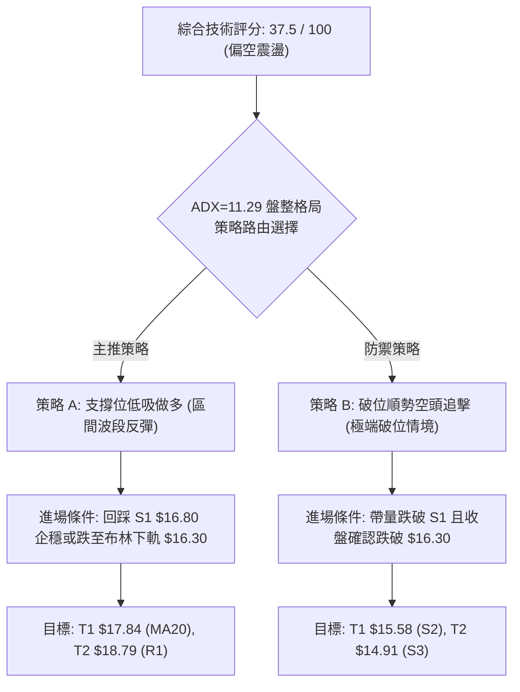

### 🧭 策略路由

- **主策略方向**：**區間防禦型操作 / 下軌企穩低吸（偏空環境中的高勝率反抽）**（依評分 37.5/100 定位為防守觀望偏空，禁止高位追多；但因處盤整市且隨機指標超賣，空單盈虧比已極差，故以**下軌防守低吸（做多反彈）**為主策略，**破位放量做空**為輔）。

### 🎯 價格情境階梯（Price Scenarios）

*本表格所有價位嚴格引用第 4 章及數據庫核心計算值*

| 觸發條件 | 下一目標價 | 後續延伸目標 | 技術情境詳細含義 |
|----------|------------|--------------|------------------|
| **強勢放量突破 R1 ($18.79)** | R2: **$19.62** | R3: **$20.13** | 徹底扭轉中期弱勢，突破長達 5 個月箱型，挑戰 MA200 牛熊線 |
| **回抽站穩 MA20 ($17.84)** | R1: **$18.79** | R2: **$19.62** | 短期止跌回暖，脫離布林下半軌，回歸箱體上緣運行 |
| **當前在現價與 S1 間震盪** | 中軌: **$17.84** | 下軌: **$16.30** | 典型無趨勢磨底，維持 $16.30 ~ $17.84 極窄區間整理 |
| **有效跌破支撐 S1 ($16.80)** | 布林下軌: **$16.30**| S2: **$15.58** | 短線多頭防線瓦解，觸發停損盤，考驗 5 月份歷史大底 |
| **恐慌擊穿核心支撐 S2 ($15.58)** | S3: **$14.91** | 52W低點: **$14.88** | 箱型徹底崩潰，開啟二次探底浪，考驗 52 週絕對底部 |

### 📊 情境機率分佈

| 價格運行情境 | 機率估計 | 主要技術判定依據（數據引用） |
|--------------|:--------:|------------------------------|
| **區間下緣企穩反彈** | **55%** | ADX=11.29 無趨勢暴跌基礎；Stoch %K=19.72 超賣；現價貼近布林下軌（$16.30）與 S1（$16.80） |
| **窄幅陰跌磨底震盪** | **30%** | OBV 指標疲弱；MACD 柱狀圖（-0.145）仍為負值，多頭買盤力量不足，呈拉鋸態勢 |
| **破位下殺展開新跌浪** | **15%** | 需重大宏觀利空觸發；現價距 S2（$15.58）仍有 -8.16% 緩衝空間，空方單日內難以擊穿 |

### 🟢 主策略詳情

| 策略要素 | 策略 A（主推：區間下緣低吸做多） | 策略 B（防禦：下軌破位反手做空） |
|----------|---------------------------------|---------------------------------|
| **策略邏輯** | 利用隨機超賣與 S1 支撐，博取均值回歸反抽 | 若空方放量擊穿 S1，順勢追擊下探 S2 |
| **進場條件** | 股價回測 $16.80 企穩，或盤中下探 $16.50 縮量回升 | 日線實體陰線有效跌破 $16.80，且成交量放大 |
| **精確進場價** | **$16.80** | **$16.70**（確認破位 S1 後順勢進場） |
| **第一目標價 T1** | **$17.84**（日線 MA20 / 布林中軌） | **$15.58**（核心波段強支撐 S2） |
| **第二目標價 T2** | **$18.79**（關鍵阻力位 R1） | **$14.91**（極限防守支撐 S3） |
| **嚴格止損價** | **$16.20**（跌破布林下軌 $16.30 止損） | **$17.10**（重新站回 MA5 $17.05 上方） |
| **風險報酬比** | **1 : 1.73** (至T1) / **1 : 3.32** (至T2) | **1 : 2.80** (至T1) / **1 : 4.48** (至T2) |
| **預估勝率** | 55% | 40% (因 ADX 過低，假破位風險大) |
| **建議配置倉位** | **15% ~ 20%** (輕倉試單) | **10%** (嚴格防禦性超短線倉位) |

*策略 A 盈虧比計算式*：
- 風險空間：$16.80 - 16.20 = \$0.60$
- 目標 T1 收益：$17.84 - 16.80 = \$1.04 \rightarrow$ 風險報酬比 $= 1.04 / 0.60 =$ **1 : 1.73**
- 目標 T2 收益：$18.79 - 16.80 = \$1.99 \rightarrow$ 風險報酬比 $= 1.99 / 0.60 =$ **1 : 3.32**

### 🔴 反向風險觸發點（對沖與風控提示）

1. **多頭策略推翻警報**：若日線收盤價跌破 **$16.30**（布林下軌），則意味著盤整區間下限破位，市場可能開啟 Q3 象限的單邊下行行情，策略 A 必須無條件止損出局，不可抗單。
2. **空頭防守觸發警報**：若股價帶量回升並站穩 **$17.84**（MA20），則短線空頭排列遭到破壞，所有看空部位必須即刻平倉對沖。

### ⭐ 整體訊號強度評星

```
做多訊號強度：★★☆☆☆  (2.5/5 星 — 僅為超賣反抽，非單邊牛市)
做空訊號強度：★★★☆☆  (3.0/5 星 — 均線與動能偏空，但受制於低 ADX)
整體策略可信度：★★★☆☆  (3.5/5 星 — 箱體邊界清晰，具備高盈虧比機會)
```

---

## 9. 風險提示與監控

### ✅ 關鍵監控指標 Checklist

```
╔══════════════════════════════════════════════════════════════╗
║              SOFI 每日盤面關鍵監控清單 (Checklist)           ║
╠══════════════════════════════════════════════════════════════╣
║ [ ] 關鍵價位防守：收盤價是否嚴格維持在 S1 ($16.80) 之上？   ║
║ [ ] 通道極值檢驗：股價觸及 BB 下軌 ($16.30) 時是否出現長下影？║
║ [ ] 均線動態反壓：盤中反彈能否突破 MA5 ($17.05) 與 MA10？    ║
║ [ ] 動能指標拐點：MACD 負柱狀圖是否開始由 -0.145 明顯收斂？  ║
║ [ ] 超賣指標修復：Stoch %K 是否向上金叉 %D 脫離 20 超賣區？  ║
║ [ ] 量能異動跟蹤：日內成交量是否超過 50日均量 (5,830萬股)？ ║
║ [ ] 趨勢形成預警：ADX(14) 讀數是否突破 20，脫離泥沼盤整？   ║
╚══════════════════════════════════════════════════════════════╝
```

### ⚠️ 風險場景分析

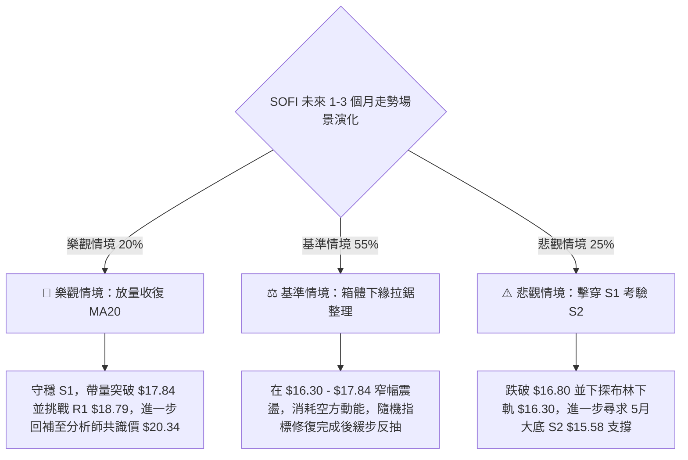

### 🛡️ 風險管理重要提醒

1. **高 Beta 波動乘數風險**：SOFI 的 Beta 高達 **2.208**，意味著日內價格雜訊極易觸發過於狹窄的止損。嚴格禁止在無明確形態支撐的位置進行「市價追單」。
2. **倉位配置上限**：鑑於技術評分卡僅有 **37.5 分**（偏空弱勢），總投資組合在 SOFI 的曝險部位**嚴禁超過總資產的 20%**，單筆交易虧損額度必須嚴格控制在總本金的 **1.0% ~ 1.5%** 之內。
3. **宏觀與借貸板塊聯動**：當前 SOFI 空頭部位比例（Short % Float）高達 **13.9%**，空頭回補天數（Short Ratio）為 3.72。在箱體邊界一旦遭遇意外買盤，極易引發日內軋空劇烈波動，空頭操作必須嚴設止損，不可留戀。

---

## 📋 報告總結

```
╔══════════════════════════════════════════════════════════════════╗
║                    SOFI 技術分析報告總結                         ║
╠══════════════════════════════════════════════════════════════════╣
║ 報告日期：2026-09-20             當前價格：$16.96                ║
║ 綜合評級：⚖️ 偏弱區間震盪 (Hold / 觀望低吸)  技術評分：37.5/100 ║
╠══════════════════════════════════════════════════════════════════╣
║ 關鍵技術維度結論：                                              ║
║ ├─ 長期趨勢：🔴 偏空。自 $29.72 高點下行後，處於大週期深度消化期 ║
║ ├─ 中期趨勢：🟡 箱型。受限於 $15.58 (S2) 至 $18.79 (R1) 橫盤震盪║
║ ├─ 短期趨勢：🔴 偏弱。受制於 MA20 ($17.84)，MACD 柱狀為負 -0.145║
║ ├─ 動能狀態：🟢 超賣。Stoch %K=19.72, %D=12.31 具短線反抽修復潛力║
║ ├─ 趨勢強度：🟡 極低。ADX=11.29，確立為無趨勢之「日線布林通道市」║
║ ├─ 關鍵支撐：S1: $16.80  │  S2: $15.58  │  S3: $14.91          ║
║ ├─ 關鍵阻力：R1: $18.79  │  R2: $19.62  │  R3: $20.13          ║
║ └─ 華爾街目標：均值 $20.34 (共識評級 Hold, 覆蓋分析師 22位)     ║
╠══════════════════════════════════════════════════════════════════╣
║ 最優交易策略組合：                                              ║
║ 1. 🥇 最佳機會：在 S1 ($16.80) 附近輕倉低吸做多，嚴格止損 $16.20 ║
║                 目標直指 MA20 ($17.84)，勝率約 55%，盈虧比 1:1.73║
║ 2. 🥈 次選機會：若反彈至 R1 ($18.79) 滯漲遇阻，佈局箱頂高拋空單 ║
║ 3. 🥉 保守選擇：完全空倉觀望，等待日線放量收復 MA20 ($17.84) 或 ║
║                 回踩 S2 ($15.58) 形成右側放量大陽線再行介入    ║
╚══════════════════════════════════════════════════════════════════╝
```

---

> ⚠️ **免責聲明**：本報告為技術分析研究成果，所有技術價位與模型推算均嚴格基於歷史量價數據（OHLCV）。本報告**僅供學術研究與投資決策參考**，**不構成任何要約或投資建議**。市場具有高度不確定性，投資人應獨立評估風險並自行承擔交易結果。

---

*報告生成時間：2026-09-20 ｜ 數據來源：Yahoo Finance ｜ 分析框架：多時框量化技術分析*