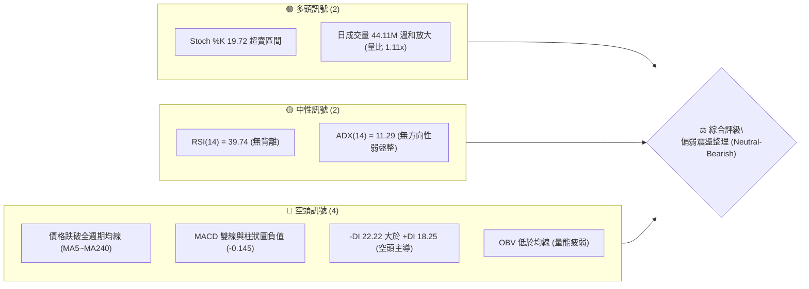
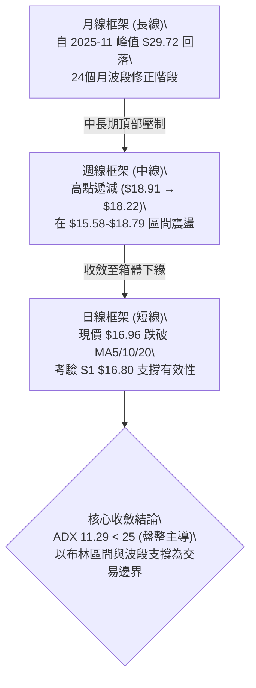
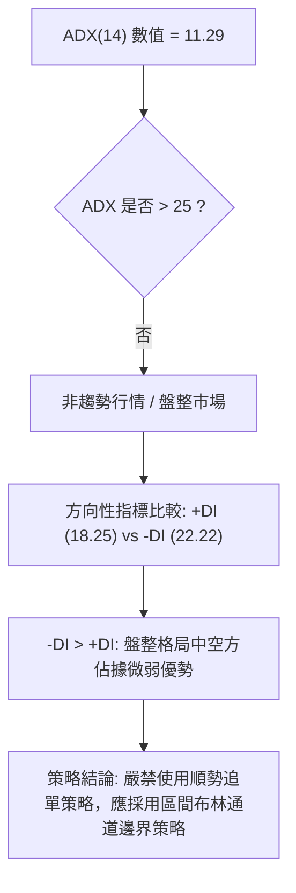
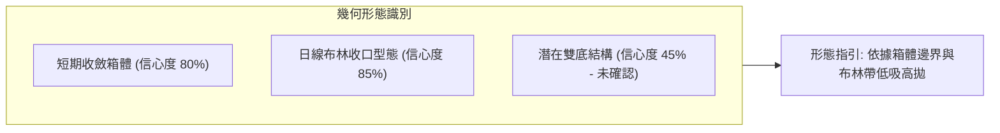
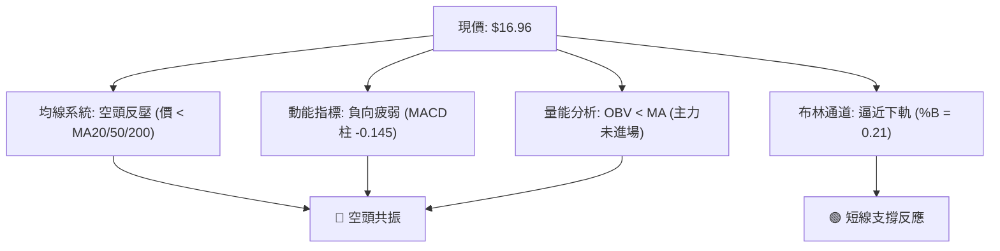
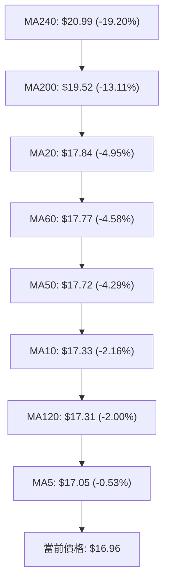
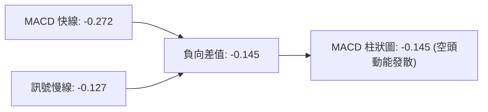
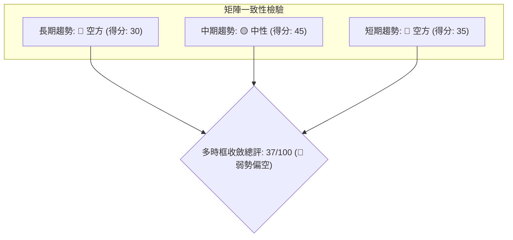
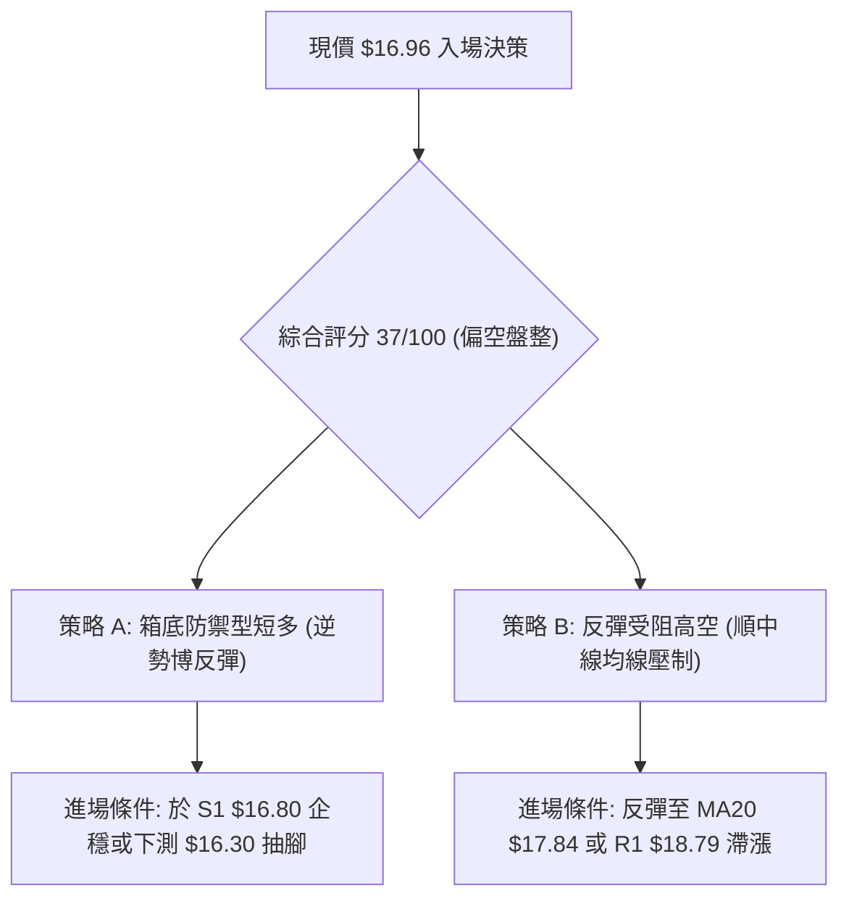
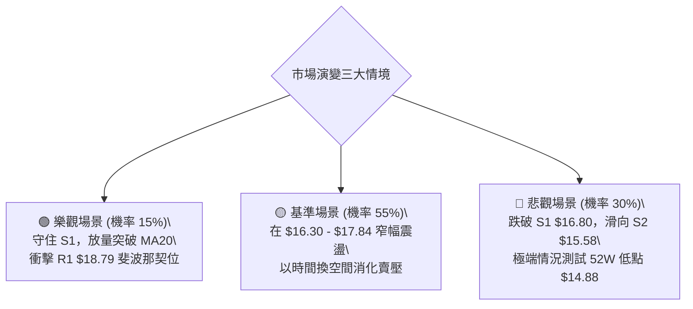

# SOFI 技術分析報告

> **報告日期**：2026-09-21 ｜ **語言**：繁體中文 ｜ **數據來源**：Yahoo Finance ｜ **當前價格**：$16.96

---

## 目錄

| 章節 | 內容 |
|------|------|
| [1. 技術面概覽](#1-技術面概覽) | 訊號儀表板、核心指標、評分卡 |
| [2. 趨勢分析](#2-趨勢分析) | 多時框趨勢、長中短期走勢 |
| [3. 圖表形態分析](#3-圖表形態分析) | 形態識別、K線組合、目標價 |
| [4. 支撐與阻力](#4-支撐與阻力) | 關鍵價位、斐波那契回調 |
| [5. 技術指標深度解讀](#5-技術指標深度解讀) | MA/RSI/MACD/布林/成交量 |
| [6. 動能與波動率](#6-動能與波動率) | 動能評估、ATR、Beta |
| [7. 多時框架總結](#7-多時框架總結) | 時框架評分矩陣、收斂結論 |
| [8. 交易策略建議](#8-交易策略建議) | 多空策略、風險報酬比 |
| [9. 風險提示與監控](#9-風險提示與監控) | 監控指標、風險場景 |
| [10. 報告總結](#10-報告總結) | 核心結論與執行藍圖 |

---

## 1. 技術面概覽

### 🎯 技術訊號儀表板



### 📊 核心指標速覽表

| 指標類別 | 指標名稱 | 當前數值 | 訊號 | 解讀 |
|----------|----------|----------|------|------|
| **價格** | 當前價格 | $16.96 | 🔴 | 位於 52 週區間底部的 11.7%，空頭控制下半場 |
| **均線** | MA20 | $17.84 | 🔴 | 價格低於 MA20 達 -4.95%，短期趨勢受壓 |
| **均線** | MA50 | $17.72 | 🔴 | 價格低於 MA50 達 -4.29%，中期均線反壓 |
| **均線** | MA200 | $19.52 | 🔴 | 價格低於牛熊分水嶺 MA200 達 -13.11% |
| **動能** | RSI(14) | 39.74 | 🟡 | 位於中性偏弱區間，尚未進入嚴重超賣 (<30) |
| **動能** | MACD | -0.272 | 🔴 | MACD 線低於 Signal 線 (-0.127)，柱狀圖呈現 -0.145 負動能 |
| **趨勢** | ADX(14) | 11.29 | 🟡 | 極低數值，表明單邊趨勢衰竭，處於無趨勢低位盤整 |
| **通道** | 布林 %B | 0.21 | 🟡 | 逼近布林通道下軌 ($16.30)，短期具技術性防禦買盤 |
| **波動** | ATR(14) | $0.64 | 🟡 | 佔股價 3.79%，日內波動度處於中等收斂階段 |
| **量能** | 量比 / OBV | 1.11x / 弱 | 🔴 | 當日量能略微放大，但 OBV < MA，主力買盤未進場 |

### 🏆 技術評分卡

```
╔══════════════════════════════════════════════════════════════════╗
║              技術評分卡 — SOFI (2026-09-21)                      ║
╠══════════════════════════════════════════════════════════════════╣
║ 趨勢強度 (ADX=11.29)     ███░░░░░░░░░░░░░░░░░  18/100  🔴 極弱趨勢 ║
║ 動能指標 (RSI/MACD)      ███████░░░░░░░░░░░░░  35/100  🔴 動能疲軟 ║
║ 支撐穩定度 (接近 S1)     ████████████░░░░░░░░  60/100  🟡 考驗S1支撐║
║ 成交量配合 (OBV弱勢)     ████████░░░░░░░░░░░░  40/100  🔴 量價背馳 ║
║ 形態完整度 (區間箱體)    ██████████░░░░░░░░░░  50/100  🟡 箱底徘徊 ║
║ 均線排列 (全線反壓)      ████░░░░░░░░░░░░░░░░  20/100  🔴 空頭排列 ║
╠══════════════════════════════════════════════════════════════════╣
║ 綜合評分                 ███████░░░░░░░░░░░░░  37/100  🔴 弱勢盤整 ║
╚══════════════════════════════════════════════════════════════════╝
```

---

## 2. 趨勢分析

### 🌐 多時框趨勢分析



### 📈 長期趨勢 — 12個月走勢圖（Unicode）

SOFI 過去 12 個月經歷了劇烈的衝高回落。在 2025 年末創下高點後，2026 年初開始出現估值壓縮與多頭獲利了結，目前價格處於整整一年以來的低位水準。

```
SOFI 月線走勢圖（過去12個月：2025-10 至 2026-09）
價格軸 ($)
$30.00 ┤        ●(2025-10: 29.68)  ●(2025-11: 29.72 高點)
$27.00 ┤                                      ●(2025-12: 26.18)
$24.00 ┤                                                  ●(2026-01: 22.81)
$21.00 ┤
$18.00 ┤                                                              ●(02: 17.76)        ●(05: 18.22)  ●(06: 17.93)        ●(08: 17.88)
$15.00 ┤                                                                          ●(03: 15.88) ●(04: 16.10)        ●(07: 16.31)        ●(09現價: 16.96)
       └─────────────────────────────────────────────────────────────────────────────────────────────────────────────────────────────
          25-10       25-11       25-12       26-01       26-02       26-03       26-04       26-05       26-06       26-07       26-08       26-09
```

#### 走勢特徵分析表格

| 階段區間 | 起始價 → 結束價 | 漲跌幅 | 走勢特徵與結構解讀 |
|----------|----------------|--------|-------------------|
| **2025-10 ~ 2025-11** | $29.68 → $29.72 | +0.13% | 雙頂構築：長期上升波段終點，買盤力竭，高位連續滯漲 |
| **2025-12 ~ 2026-03** | $26.18 → $15.88 | -39.34% | 斷崖下跌：主跌浪殺跌，跌破多條長期均線，機構籌碼快速換手 |
| **2026-04 ~ 2026-06** | $16.10 → $17.93 | +11.37% | 低位築底反彈：於 $15.88 獲得波段支撐，展開反彈但未能突破 $18.50 |
| **2026-07 ~ 2026-09** | $16.31 → $16.96 | +3.99% | 箱體窄幅收斂：在 $16.00-$18.50 之間進行低波動整理，現價回落至箱底 |

### 📊 中期趨勢（週線分析）

中期走勢呈現「次級高點遞減，波段底部暫時有守」的收斂三角形/箱體態勢。

```
週線級別價格壓力與支撐示意圖：
$19.62 ────────────────────────────────────────── R2 阻力 (近一年強阻力)
$18.79 ───────────────● (07-12)──────● (08-23)─── R1 阻力 (近期雙頭頸線)
$17.84 ───────────────────────────── MA20 / BB中軌反壓
$16.96 ═════════════════════════════ 【現價位置】(承壓下行)
$16.80 ------------------------------------------ S1 支撐 (近期密集成交防線)
$15.58 ───────────────────────────── S2 支撐 (5月低點與箱體底)
$14.88 ────────────────────────────────────────── 52W 低點 (S3 終極防線)
```

### ⚡ 趨勢強度評估（ADX 解讀）



#### ADX 趨勢強度對照表

| 指標變數 | 當前讀數 | 標準閾值區間 | 狀態評估 | 實戰指導含義 |
|----------|----------|--------------|----------|--------------|
| **ADX(14)** | **11.29** | 0 ~ 20 | 極弱趨勢 / 無趨勢 | 均線系統全面鈍化，單邊突破大多為假突破 |
| **+DI (14)** | **18.25** | 參考對比 | 多頭動能衰退 | 多方無力發起向上攻擊浪潮 |
| **-DI (14)** | **22.22** | 參考對比 | 空頭輕度控盤 | 賣壓雖不猛烈，但持續抑制反彈空間 |

---

## 3. 圖表形態分析

### 🔍 形態識別系統

依據嚴格規則 15，所有幾何形態均嚴格審查完成度與數據匹配度，絕不牽強附會：



#### 形態識別與信心度評估表

| 形態類別 | 信心度 | 判斷依據（引用精確數據） | 完成度 | 形態高度與目標價推算 |
|----------|--------|--------------------------|--------|----------------------|
| **箱體橫盤整理** | **80%** | 近期多次回測 S1 ($16.80) 與 S2 ($15.58)，受阻於 R1 ($18.79) | 75% | 箱體高度 = $18.79 - $15.58 = $3.21。<br>若向上突破 R1，目標價 = $18.79 + $3.21 = **$22.00**（數據無該階梯，以斐波那契 $21.70 修正）；若向下破位 S2，目標價 = $15.58 - $3.21 = **$12.37**（數據對應分析師最低目標 $12.00）。 |
| **布林帶壓縮** | **85%** | 上軌 $19.39，下軌 $16.30，帶寬持續收斂至近期低點 | 90% | 下軌邊界支撐 $16.30，中軌壓制 $17.84。指標型態完成度極高。 |
| **大級別雙底 (W底)** | **45%** | 僅測得 2026-05 低點 $15.58，近期低點 $16.31 尚未二次探底打平 | 30% | **訊號不足，僅做指標型解讀**。頸線 R1 $18.79 尚未突破，不可視為成立。 |

### 🕯️ 重要 K 線形態分析（近 5 個月走勢）

| 月份/週期 | 收盤價 | 核心 K 線形態特徵 | 市場心理與技術解讀 | 多空訊號 |
|-----------|--------|-------------------|-------------------|----------|
| **2026-05** | $18.22 | 長下影大陽線 (月線級別) | 探底 $15.58 後強烈多頭反擊，月線長紅收復失地 | 🟢 強多反彈 |
| **2026-06** | $17.93 | 高位十字星 (Doji) | 多空在 MA20 附近激烈爭奪，上升動能停滯 | 🟡 變盤猶豫 |
| **2026-07** | $16.31 | 中陰線回落 | 多頭防線失守，向下測試箱體中下部支撐 | 🔴 空方佔優 |
| **2026-08** | $17.88 | 帶長上影小陽線 | 盤中嘗試衝擊 R1 ($18.79) 遭空頭無情打壓，留長上影 | 🟡 假突破受挫 |
| **2026-09** | $16.96 | 陰線實體逼近前低 | 承接買盤渙散，緩步滑落考驗 S1 ($16.80) 支撐 | 🔴 短線偏空 |

### 📉 ASCII 走勢形態示意圖

```
SOFI 短期箱體震盪形態示意圖 (2026-05 至 2026-09)
-------------------------------------------------------------------------
$18.79 ┤               ┌─┐                 ┌─┐ (8月衝高未果) ──── 箱體頂部 (R1)
$18.20 ┤       ┌─┐     │ │     ┌─┐         │ │
$17.84 ┤───────┼─┼─────┼─┼─────┼─┼─────────┼─┼────────────────── BB中軌/MA20
$17.00 ┤       │ │     │ │     │ │         │ │  ●現價 $16.96 (考驗邊界)
$16.80 ┤       │ │     │ │     │ │   ┌─┐   │ │  ▼
$16.30 ┤       │ │     │ │     └─┘   │ │   └─┘ ───────────────── BB下軌
$15.58 ┤ ┌─┐   └─┘     └─┘           └─┘ ─────────────────────── 箱體底部 (S2)
       └─┴─┴─────────────────────────────────────────────────────
         05月    06月    07月    08月    09月 (時間軸)
```

---

## 4. 支撐與阻力

### 🗺️ 關鍵價位分布圖（Unicode）

本分析嚴格遵循數據紀律，所有支撐與阻力均由歷史 OHLCV 聚類數據提取：

```
SOFI 價位結構分布圖
═════════════════════════════════════════════════════════════════
$20.13 ║████████████████████████████████████████║ 強阻力 R3 (超強反壓區)
$19.62 ║████████████████████████████            ║ 阻力 R2 (MA200 匯合區)
$18.79 ║████████████████████████████████████    ║ 關鍵阻力 R1 (箱體上軌/多空分水嶺)
$17.84 ╟┈┈┈┈┈┈┈┈┈┈┈┈┈┈┈┈┈┈┈┈┈┈┈┈┈┈┈┈┈┈┈┈┈┈┈┈┈┈┈┈╢ 動態阻力 (MA20 / BB中軌)
$16.96 ╠════════════════════════════════════════╣ ◄ 當前市價 ($16.96)
$16.80 ║▓▓▓▓▓▓▓▓▓▓▓▓▓▓▓▓▓▓▓▓▓▓▓▓▓▓▓▓▓▓▓▓        ║ 第一支撐 S1 (近期波段支撐，跌幅-0.94%)
$16.30 ╟┈┈┈┈┈┈┈┈┈┈┈┈┈┈┈┈┈┈┈┈┈┈┈┈┈┈┈┈┈┈┈┈┈┈┈┈┈┈┈┈╢ 動態支撐 (BB下軌)
$15.58 ║████████████████████████████████████    ║ 第二支撐 S2 (5月波段低點，跌幅-8.16%)
$14.91 ║████████████████████████████████████████║ 終極強支撐 S3 (52W低點聚類，跌幅-12.09%)
═════════════════════════════════════════════════════════════════
```

### 🚧 阻力位分析表

| 阻力級別 | 準確價位 | 空間幅度 | 形成技術原因 | 突破難度 | 重要性權重 |
|----------|----------|----------|--------------|----------|------------|
| **R1** | **$18.79** | +10.76% | 2026年7月與8月兩次反彈高點聚類，斐波那契 78.6% 回調位 ($18.70) 緊貼此處 | 🔴 極高 | ★★★★★ (中期牛熊轉折點) |
| **R2** | **$19.62** | +15.67% | 近一年波段高點聚類，且與下行的 MA200 ($19.52) 形成共振壓制 | 🔴 很高 | ★★★★☆ (強阻力帶) |
| **R3** | **$20.13** | +18.69% | 2026年早春下跌破位平台，套牢盤密集堆積區 | 🔴 極難 | ★★★☆☆ (中長期多頭目標) |

### 🛡️ 支撐位分析表

| 支撐級別 | 準確價位 | 空間幅度 | 形成技術原因 | 守住機率 | 重要性權重 |
|----------|----------|----------|--------------|----------|------------|
| **S1** | **$16.80** | -0.94% | 近一年波段低點聚類，過去數週收盤密集防守線 | 🟡 55% | ★★★☆☆ (短線生命線) |
| **S2** | **$15.58** | -8.16% | 2026年5月連續三週探底不破之強支撐平台 ($15.61-$15.75) | 🟢 75% | ★★★★★ (箱體底部防線) |
| **S3** | **$14.91** | -12.09% | 52週歷史低點 $14.88 聚類防線，破位將引發系統性停損 | 🟢 90% | ★★★★★ (年度價值底部) |

### 📐 斐波那契回調位分析

依據 52 週波動區間（高點 **$32.73** 至 低點 **$14.88**，總振幅 $17.85）之精確計算：

```
斐波那契回調層級分布：
0.0%  (52W High) ─────────────────────────── $32.73
23.6%            ─────────────────────────── $28.52
38.2%            ─────────────────────────── $25.91
50.0% (中位分水嶺) ────────────────────────── $23.80
61.8% (黃金分割)  ─────────────────────────── $21.70
78.6% (深度回撤)  ─────────────────────────── $18.70 (與 R1 $18.79 完美重合)
現價位置 ═══════════════════════════════════ $16.96 (落於 78.6% 與 100% 之間)
100.0% (52W Low) ─────────────────────────── $14.88 (與 S3 $14.91 完美重合)
```

**深度解讀**：
現價 $16.96 處於斐波那契 **78.6% ($18.70)** 與 **100.0% ($14.88)** 的極深度弱勢回調區間內。這表明自 $32.73 的下跌波段抹去了過去一年絕大部分漲幅。技術上，當價格處於 78.6% 回調位下方時，空頭完全佔據主動權。任何反彈只要未能帶量實體站穩 $18.70（即 R1 $18.79），性質上均只能視為「超跌弱勢反抽」，絕非趨勢反轉。

---

## 5. 技術指標深度解讀

### 🎛️ 指標訊號總覽



### 📈 移動平均線排列分析



**均線架構剖析**：
現價 $16.96 跌破從短期 MA5 ($17.05) 到長期 MA240 ($20.99) 的**所有**移動平均線。雖然 MA50 ($17.72) 與 MA20 ($17.84) 發生絞合，但價格運行於均線群下方，屬於典型的空頭承壓型態。短期 MA5 與 MA10 形成向下俯衝姿態，對股價構成第一道動態壓迫。

### 📉 RSI(14) 分析

*   **當前數值**：**39.74**
*   **強度指示**：`████████░░░░░░░░░░░░ 39.74%` (中性偏空)
*   **區間定義**：超買區 (70-100) ｜ 中性平衡區 (30-70) ｜ 超賣區 (0-30)
*   **背離檢驗**：
    *   **頂背離**：無。近幾週未創價格新高。
    *   **底背離**：**無明顯背離**。檢驗數據：2026-07-26 收盤 $16.46，RSI 為 33.1；2026-08-02 收盤 $16.31，RSI 為 37.4；當前價格 $16.96，RSI 為 39.74。價格走勢與 RSI 斜率大體同步，動能平淡，未出現指標創高而價格破底的強烈底背離訊號。

### 📊 MACD(12/26/9) 訊號解讀



*   **絕對位置**：快線 (-0.272) 與慢線 (-0.127) 雙雙深處零軸下方，確認處於空頭大週期。
*   **近期變化**：過去 4 週週線柱狀圖呈現：`+0.025 (08-30) → -0.065 (09-06) → -0.147 (09-13) → -0.145 (09-20)`。柱狀圖在短暫翻紅後迅速轉負並放大下殺，反映出 8 月底的反彈以失敗告終，空頭重新掌握波段發球權。

### 📦 布林通道分析

```
布林通道當前結構 ($16.30 ↔ $19.39)
─────────────────────────────────────────────────────────────
$19.39 ┬ 布林上軌 (強壓區)
       │
$17.84 ┼ 布林中軌 (MA20 基準線 - 空頭反壓)
       │
$16.96 ┼ ◄ 當前價格 (%B = 0.21)
       │
$16.30 ┴ 布林下軌 (技術性超賣支撐區)
─────────────────────────────────────────────────────────────
```

*   **帶寬特徵**：布林帶寬呈現收口狀態，顯示日線波動率正在壓縮。
*   **位置含義**：%B 讀數為 **0.21**，表明現價已經非常接近下軌 ($16.30)。通常在 ADX < 25 的盤整市況中，%B 接觸 0.20 以下意味著短線下行空間受限，極易觸發均值回歸的抽腳反彈。

### 💹 成交量分析（量價配合度）

*   **量能對比**：最新日成交量為 **44,112,200 股**，略高於 20 日均量 **39,725,470 股** (量比 1.11x)，但顯著低於 50 日均量 **58,315,956 股**。
*   **OBV 能量潮**：數據顯示 `OBV < MA → 量能疲弱`。雖然最新成交量較昨日微增，但整體 OBV 均線向下，顯示這波回落並非主力資金恐慌性拋售，而是買盤極度匱乏造成的「無量陰跌」，量價配合度呈現弱勢背馳。

---

## 6. 動能與波動率

### ⚡ 動能評估四象限

```
動能與波動率象限分析：
┌──────────────────────────────────────┬──────────────────────────────────────┐
│  象限 Q4: 弱動能 / 高波動 (避免進場)   │  象限 Q3: 強動能 / 高波動 (高風險收益) │
│                                      │                                      │
├──────────────────────────────────────┼──────────────────────────────────────┤
│  象限 Q2: 弱動能 / 低波動 (謹慎觀望)   │  象限 Q1: 強動能 / 低波動 (最佳波段)   │
│  ★ SOFI 當前位置 (ADX 11.29 / ATR 0.64)│                                      │
└──────────────────────────────────────┴──────────────────────────────────────┘
```

| 象限代號 | 動能狀態 | 波動狀態 | 當前符合性 | 實戰策略指引 |
|----------|----------|----------|------------|--------------|
| **Q1** | 強動能 | 低波動 | 否 | 突破爆發前夕，最佳建倉期 |
| **Q2** | **弱動能** | **低波動** | **★ 符合** | **缺乏方向性動能，市場交投清淡，應保持謹慎觀望，或僅做箱底低吸** |
| **Q3** | 強動能 | 高波動 | 否 | 單邊主升/主跌浪，順勢緊跟 |
| **Q4** | 弱動能 | 高波動 | 否 | 無序劇烈洗盤，極易停損 |

### 📊 ATR 波動率分析

*   **當前 ATR(14)**：**$0.64** (佔現價 3.79%)
*   **風控應用與止損建議**：
    *   **日內正常噪聲**：每日正常價格擺動範圍約在 ±$0.64。
    *   **技術止損距離**：波段交易建議止損設定在 `1.5 × ATR = $0.96` 至 `2.0 × ATR = $1.28` 之外，以規避無意義的盤中隨機穿刺。

### 📐 Beta 與市場相關性

*   **Beta 係數**：**2.208**
*   **市場敏感度解讀**：
    SOFI 具有極高的市場敏感度（Beta > 2.0），當標普 500 或納斯達克波動 1% 時，該股理論上波動達 2.21%。在當前基本面淨現金為負 ($-48.88M) 且經營現金流為負 ($-8.50B) 的背景下，若美股大盤出現整體流動性緊縮，高 Beta 屬性將加劇其下行風險。

---

## 7. 多時框架總結

### 📋 時框架評分表

| 時框架 | 趨勢方向 | 動能指標 | 均線排列狀態 | 圖表形態 | 綜合評分 | 戰術建議 |
|--------|----------|----------|--------------|----------|----------|----------|
| **月線 (長)** | 偏空修正 | 弱化回落 | 跌破短期MA | 自 $29.72 回落走弱 | 30/100 🔴 | 戰略減配，防範長期陰跌 |
| **週線 (中)** | 箱體震盪 | 柱狀圖翻負 | 均線交織壓制 | $15.58-$18.79 區間 | 45/100 🟡 | 箱底高拋低吸，破位即止損 |
| **日線 (短)** | 弱勢下探 | 柱狀發散向下 | 價格全線下方 | 逼近布林下軌 $16.30 | 35/100 🔴 | 勿盲目追空，等待 S1 考驗 |

### 🔲 綜合訊號矩陣



### ⚖️ 多時框收斂結論

依據【嚴格要求 14】之優先級規則收斂：
1.  **市場屬性判斷**：ADX(14) 數值僅為 **11.29**（遠低於 25 臨界線），確認市場當前處於**低動能盤整行情**，而非單邊趨勢行情。
2.  **交易主導依據**：在盤整行情中，均線順勢指標全面失效，應當以**日線布林通道 ($16.30 - $19.39) 與關鍵波段高低點 S1/S2/R1** 作為交易的核心參考邊界。
3.  **唯一方向性結論**：**中性偏空觀望（Neutral-Bearish）**。雖然大格局空頭壓制，但由於價格已逼近 S1 ($16.80) 及布林下軌 ($16.30)，且隨機指標已呈現超賣 (%K 19.72)，現價絕非追空時機，而應以「區間防守型逢低短多」或「等待反彈受阻高空」為策略主線。

---

## 8. 交易策略建議

### 🗺️ 策略決策流程圖



### 🧭 策略路由

> **當前主策略方向 = 偏空震盪中的區間防守操作（依評分 37/100）**
> 
> 由於評分 ≤ 40 處於偏弱區間，總體思路以**順應均線壓制的「逢高做空」為大機率核心**，但考慮到 ADX 極低且價格極度逼近 S1 支撐，嚴禁就地放空，故提供一套「箱底極限博弈短多」與一套「反彈受阻做空」的結構化方案。

### 🎯 價格情境階梯（Price Scenarios）

所有價位均嚴格引用第 4 章聚類計算之數值：

| 觸發條件 | 第一目標 | 第二目標 | 技術情境解讀 |
|----------|----------|----------|--------------|
| **向上突破 R1 $18.79** | R2 $19.62 | R3 $20.13 | 逆轉空頭排列，挑戰牛熊分水嶺 MA200 |
| **突破 MA20 $17.84** | R1 $18.79 | R2 $19.62 | 短線超跌修復，進入箱體上軌攻擊段 |
| **維持在現價 $16.96 震盪** | S1 $16.80 | MA20 $17.84 | 延續無方向性低波整理，等待催化劑 |
| **跌破 S1 $16.80** | S2 $15.58 | S3 $14.91 | 短線破位，向下尋求 5 月波段低點支撐 |
| **跌破 S2 $15.58** | S3 $14.91 | 分析師下限 $12.00 | 中期結構徹底崩壞，考驗 52 週歷史底部 |

### 📊 情境機率分佈

| 預測情境 | 機率 | 主要依據與技術支撐 |
|----------|------|-------------------|
| **情境一：區間震盪收斂** | **55%** | ADX 僅 11.29，布林帶收口，市場缺乏驅動大趨勢之量能 |
| **情境二：向下回落探底** | **30%** | 均線空頭反壓，MACD 柱負向發散 (-0.145)，OBV 疲軟乏力 |
| **情境三：放量向上反轉** | **15%** | 需克服全週期均線壓制，目前成交量比僅 1.11x，買盤嚴重不足 |

### 🟢 交易策略詳情

| 策略要素 | 策略 A（箱底低吸短多 - 逆勢博弈） | 策略 B（反彈受阻高空 - 順勢主推） |
|----------|-----------------------------------|-----------------------------------|
| **交易方向** | 🟢 短線做多 (Mean Reversion) | 🔴 波段做空 (Trend Following) |
| **進場條件** | 價格回踩 S1 $16.80 不破或布林下軌 $16.30 止跌 | 價格反彈至 MA20/BB中軌 $17.84 附近出現上影線 |
| **進場價格** | **$16.80** (S1 支撐位) | **$17.84** (MA20 壓制位) |
| **目標價 T1** | **$17.84** (MA20 阻力，漲幅 +6.19%) | **$16.80** (S1 支撐，跌幅 -5.83%) |
| **目標價 T2** | **$18.79** (R1 阻力，漲幅 +11.85%) | **$15.58** (S2 強支撐，跌幅 -12.67%) |
| **止損價格** | **$16.20** (跌破布林下軌 $16.30 離場) | **$18.48** (高於近期週線高點，上浮1倍ATR) |
| **風險空間** | $0.60 (-3.57%) | $0.64 (+3.59%) |
| **報酬空間 (T1/T2)** | $1.04 / $1.99 | $1.04 / $2.26 |
| **風險報酬比** | **1 : 1.73 (至T1) / 1 : 3.32 (至T2)** | **1 : 1.63 (至T1) / 1 : 3.53 (至T2)** |
| **估計勝率** | 45% (逆勢單勝率偏低) | 60% (符合大週期均線壓制) |
| **建議倉位** | **5% - 8%** (輕倉試探) | **10% - 15%** (標準防守倉位) |

### 🔴 反向風險觸發點（對沖與撤退提示）

*   **若持有空單**：若日線實體收盤價帶量突破 **R1 $18.79**，宣告箱體底部反轉確立，所有空頭必須無條件平倉止損，並翻多進場。
*   **若持有多單**：若日線實體收盤價跌破 **S1 $16.80**，應立即將倉位砍半；一旦有效跌破 **S2 $15.58**，必須全員撤退，絕不可向下補倉攤平。

### ⭐ 整體訊號強度評星

```
╔══════════════════════════════════════════════════════════════╗
║ 做多訊號強度：★★☆☆☆  (2/5星 - 僅存超賣反彈機會)             ║
║ 做空訊號強度：★★★☆☆  (3/5星 - 均線壓制但受阻於下軌空間)     ║
║ 整體可信度：  ★★★☆☆  (3/5星 - 低 ADX 下指標雜訊偏多)       ║
╚══════════════════════════════════════════════════════════════╝
```

---

## 9. 風險提示與監控

### ✅ 關鍵監控指標 Checklist

```
╔══════════════════════════════════════════════════════════════════╗
║              SOFI 關鍵盤面監控清單 (Checklist)                    ║
╠══════════════════════════════════════════════════════════════════╣
║ [ ] 價格能否守穩 S1 ($16.80) 達連續 2 個交易日以上                ║
║ [ ] MACD 柱狀圖是否由負擴大轉為收斂 (突破 -0.100 向上)           ║
║ [ ] RSI(14) 是否在 35-40 區域構築小型底背離                     ║
║ [ ] 成交量是否放大至 50 日均量 (58.3M) 以上以配合任何反彈        ║
║ [ ] ADX(14) 是否向上突破 20，宣告單邊破位/突破行情開啟          ║
║ [ ] 空頭回補力道：做空比率 13.9% 是否引發 Short Squeeze          ║
╚══════════════════════════════════════════════════════════════════╝
```

### ⚠️ 風險場景分析



### 🛡️ 風險管理重要提醒

1.  **高空頭部位軋空風險 (Short Squeeze)**：
    目前空頭佔流通盤比例達 **13.9%**，天數比 (Short Ratio) 為 **3.72 天**。若市場突發利多（如監管放寬或業績預喜），高額做空盤可能引發急劇的軋空反彈，因此在 R1 ($18.79) 附近建立空單時必須嚴格執行止損。
2.  **基本面現金流壓力外溢**：
    公司經營現金流為負 ($-8.50B)，且資產負債表中淨現金為負 ($-48.88M)。在宏觀高利率維持更長時間的環境下，信貸業務的壞賬疑慮將在技術面上形成長期隱性天花板。
3.  **倉位與槓桿嚴格控制**：
    由於 Beta 高達 **2.208**，且當前 ATR 每日波動接近 4%，切忌在低位盤整期間使用保證金槓桿交易，單一策略的風險暴露不應超過總投資組合權益的 2%。

---

## 10. 報告總結

```
╔══════════════════════════════════════════════════════════════════╗
║                   SOFI 技術分析報告總結                          ║
╠══════════════════════════════════════════════════════════════════╣
║ 報告日期：2026-09-21                                            ║
║ 當前價格：$16.96                                                ║
║ 分析評級：⚖️ 偏弱震盪整理 (綜合評分: 37/100 🔴)                  ║
╠══════════════════════════════════════════════════════════════════╣
║ 關鍵結論：                                                       ║
║ ├─ 長期趨勢：🔴 自 $29.72 高位回落之深度修正浪，受制於 MA200    ║
║ ├─ 中期趨勢：🟡 $15.58 - $18.79 大箱體整理，目前運行於箱體下半區 ║
║ ├─ 短期趨勢：🔴 跌破所有短期均線，承壓測試 S1 ($16.80) 防守線   ║
║ ├─ 關鍵支撐：S1: $16.80 ｜ S2: $15.58 ｜ S3: $14.91            ║
║ ├─ 關鍵阻力：R1: $18.79 ｜ R2: $19.62 ｜ R3: $20.13            ║
║ └─ 分析師目標：均價 $20.34 (最高 $30.00 / 最低 $12.00)           ║
╠══════════════════════════════════════════════════════════════════╣
║ 最優執行藍圖：                                                   ║
║ 1. 🥇 最佳機會（勝率優先）：等待反彈至 MA20 ($17.84) 遇阻，      ║
║    建立策略 B 空單，目標下看 S1 ($16.80) 與 S2 ($15.58)。       ║
║ 2. 🥈 次選機會（盈虧比優先）：於 S1 ($16.80) 極限位置輕倉介入    ║
║    策略 A 短多，嚴設止損於 $16.20，博取均值回歸反抽 MA20。     ║
║ 3. 🥉 保守選擇：完全空倉觀望，等待 ADX 回升至 20 以上且放量突破   ║
║    R1 ($18.79) 或跌破 S2 ($15.58) 確認新趨勢形成後再行跟進。    ║
╚══════════════════════════════════════════════════════════════════╝
```

---

> ⚠️ **免責聲明**：本報告為技術分析研究，所有數據、圖表及價位推演均基於量化指標與市場公開資訊。本報告**僅供學術探討與投資研究參考**，**不構成任何要約、招攬或具體投資買賣建議**。金融市場瞬息萬變，交易具有本金虧損風險，投資人應獨立評估財務狀況並自負盈虧。

---
*報告生成時間：2026-09-21 ｜ 數據來源：Yahoo Finance ｜ 分析框架：多時框技術分析模型*