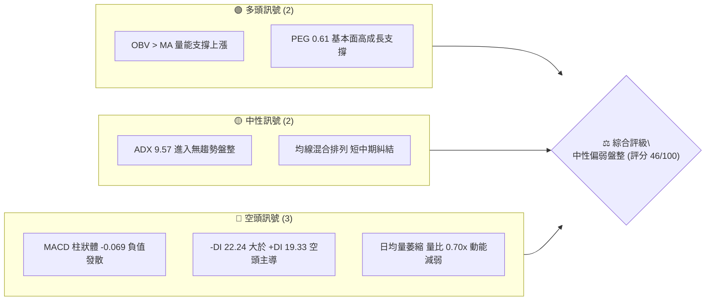
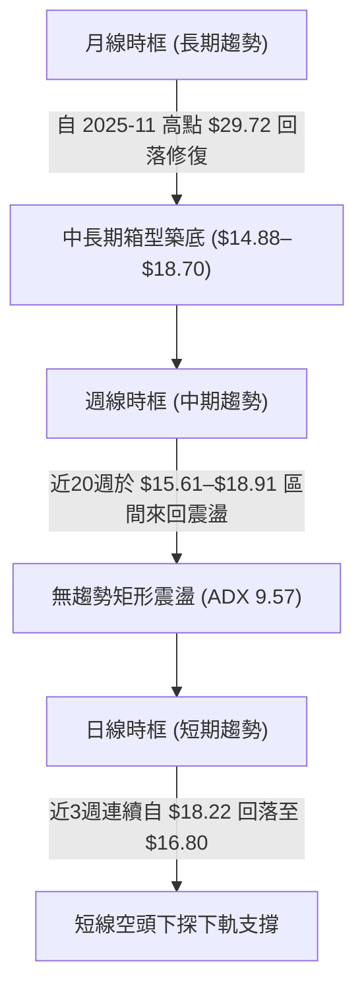
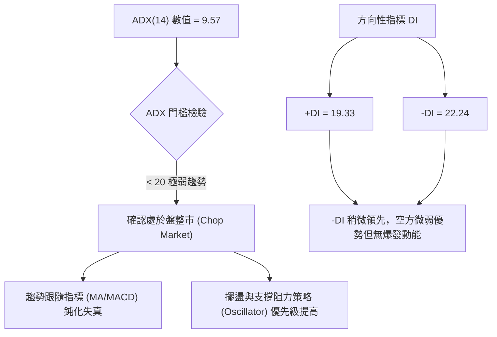
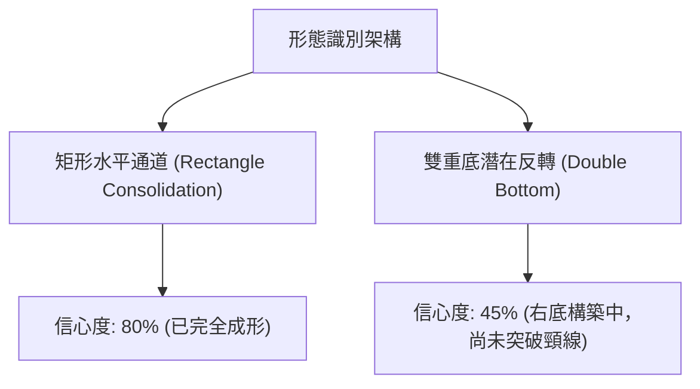
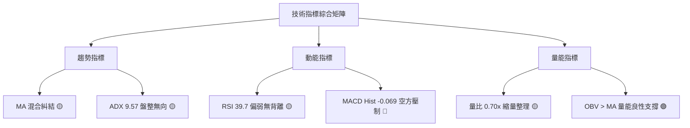
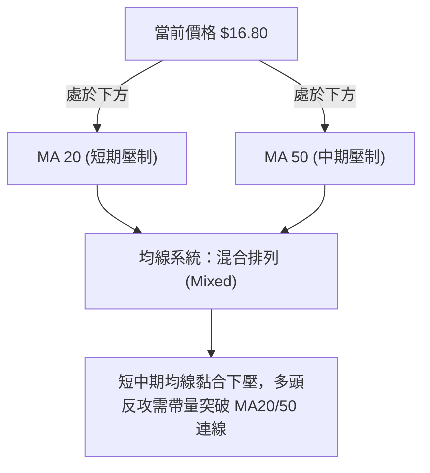
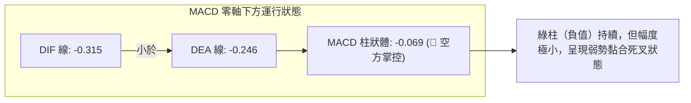
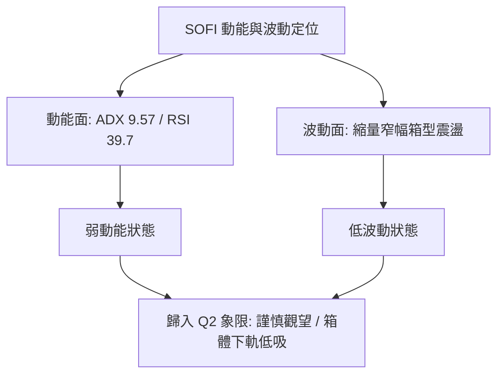
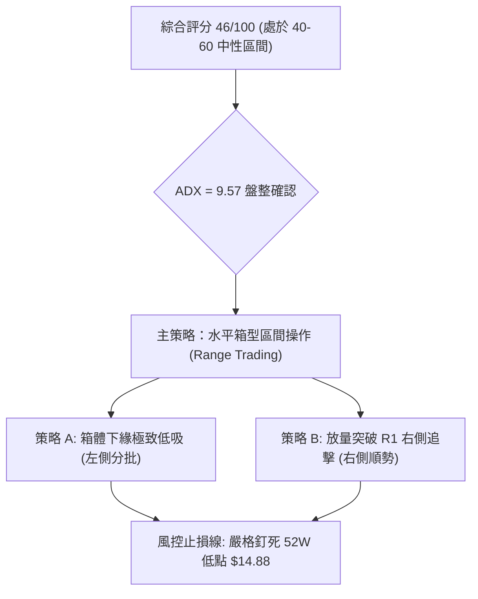
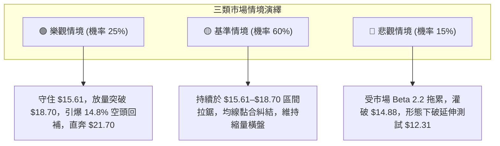

# SOFI 技術分析報告

> **報告日期**：2026-09-26 ｜ **語言**：繁體中文 ｜ **數據來源**：Yahoo Finance ｜ **當前價格**：$16.80（取自最新收盤價 2026-09-27 / 2026-09 月線收盤）

---

## 目錄

| 章節 | 內容 |
|------|------|
| [1. 技術面概覽](#1-技術面概覽) | 訊號儀表板、核心指標、評分卡 |
| [2. 趨勢分析](#2-趨勢分析) | 多時框趨勢、長中短期走勢 |
| [3. 圖表形態分析](#3-圖表形態分析) | 形態識別、K線組合、目標價 |
| [4. 支撐與阻力](#4-支撐與阻力) | 關鍵價位、斐波那契回調 |
| [5. 技術指標深度解讀](#5-技術指標深度解讀) | MA/RSI/MACD/布林/成交量 |
| [6. 動能與波動率](#6-動能與波動率) | 動能評估、ATR、Beta |
| [7. 多時框架總結](#7-多時框架總結) | 時框架評分矩陣 |
| [8. 交易策略建議](#8-交易策略建議) | 多空策略、風險報酬比 |
| [9. 風險提示與監控](#9-風險提示與監控) | 監控指標、風險場景 |

---

## 1. 技術面概覽

### 🎯 技術訊號儀表板



### 📊 核心指標速覽表

| 指標類別 | 指標名稱 | 當前數值 | 訊號 | 解讀 |
|:---|:---|:---|:---:|:---|
| **價格** | 當前收盤價 | $16.80 | 🟡 | 位於52週區間（$14.88–$32.73）低檔 10.75% 分位 |
| **均線** | MA20 / MA50 | 數據顯示價格處於下方 | 🔴 | 均線系統呈混合排列，短期均線下彎形成動態壓制 |
| **均線** | MA200 | 數據中未偵測到精確數值 | 🟡 | 歷史長線處於週期修復末段 |
| **動能** | RSI(14) | 39.7 (週線最新) | 🟡 | 處於弱勢中性格局（30–50區間），未現極端超賣 |
| **動能** | MACD (12,26,9) | 柱狀圖 -0.069 | 🔴 | DIF (-0.315) 位於 DEA (-0.246) 下方，空方佔優 |
| **趨勢強度** | ADX (14) | 9.57 (+DI 19.33 / -DI 22.24) | 🟡 | ADX < 25 表示典型無方向性震盪行情，-DI 主導 |
| **量能** | 20日均量 / OBV | 44.31M (量比 0.70x) / OBV > MA | 🟢 | 縮量築底結構，量能長期未潰散，OBV呈現良性支撐 |
| **波動** | Beta | 2.208 | 🔴 | 高貝塔係數，對市場整體風險溢價極度敏感 |

### 🏆 技術評分卡

```
╔══════════════════════════════════════════════════════════════╗
║                技術評分卡 — SOFI (2026-09-26)                ║
╠══════════════════════════════════════════════════════════════╣
║ 趨勢強度      ███░░░░░░░░░░░░░░░░░  18/100  🔴 極弱/盤整      ║
║ 動能指標      ████████░░░░░░░░░░░░  40/100  🔴 空方微幅主導  ║
║ 支撐穩定度    ██████████████░░░░░░  70/100  🟢 52W低點防線強  ║
║ 成交量配合    ████████████░░░░░░░░  60/100  🟡 縮量回洗健康  ║
║ 形態完整度    ████████░░░░░░░░░░░░  42/100  🟡 區間箱型震盪  ║
║ 均線排列      ████████░░░░░░░░░░░░  45/100  🟡 混合糾結無序  ║
╠══════════════════════════════════════════════════════════════╣
║ 綜合評分      █████████░░░░░░░░░░░  46/100  🟡 中性偏弱震盪  ║
╚══════════════════════════════════════════════════════════════╝
```

---

## 2. 趨勢分析

### 🌐 多時框趨勢分析



### 📈 長期趨勢 — 12個月走勢圖（Unicode）

```
SOFI 月線收盤走勢圖（過去12個月：2025-10 至 2026-09）
價格軸 ($)
$29.72 ┤       ●(2025-11 高點: $29.72)
$28.00 ┤ ●(10月 $29.68)
$26.00 ┤             ●(12月 $26.18)
$24.00 ┤
$22.00 ┤                   ●(01月 $22.81)
$20.00 ┤
$18.00 ┤                         ●(02月 $17.76)  ●(05月 $18.22)   ●(08月 $17.88)
$16.00 ┤                               ●(03月 $15.88)   ●(06月 $17.93)   ●←當前 $16.80
$14.88 ┤                                     ●(04月 $16.10)   ●(07月 $16.31)
       └─────────────────────────────────────────────────────────────
        10月  11月  12月  01月  02月  03月  04月  05月  06月  07月  08月  09月
```

#### 長期走勢特徵分析表格

| 階段 | 時間跨度 | 價格起訖 | 漲跌幅 | 結構特徵與技術含義 |
|:---|:---|:---:|:---:|:---|
| **沖頂派發期** | 2025-10 ~ 2025-11 | $29.68 → $29.72 | +0.13% | 形成雙重頂構型，觸及 52W 高點 $32.73 下方阻力後動能衰竭 |
| **快速殺跌期** | 2025-12 ~ 2026-03 | $26.18 → $15.88 | -39.34% | 斷頭鍘刀式重挫，向下跌破斐波那契 61.8% ($21.70)，直奔起漲點 |
| **箱型築底期** | 2026-04 ~ 2026-09 | $16.10 → $16.80 | +4.35% | 波動率顯著收斂，價格在 52W 低點 $14.88 上方形成堅實的吸收籌碼箱型 |

### 📊 中期趨勢（週線分析）

中期走勢呈現典型「區間高出低進」格局。過去20週收盤價完全被框定在 $15.61 至 $18.91 之間：

```
中期週線震盪箱型示意圖
$18.91 ┬────────────────────────────────────────── 區間上限波段高點 (2026-08-23)
       │         ╭─╮               ╭─╮
$18.00 ┤   ╭─╮   │ │ ╭─╮     ╭─╮   │ │ ╭─╮
       │   │ │   │ │ │ │     │ │ ╭─╯ │ │ │
$17.00 ┤───┼─┼───┼─┼─┼─┼─────┼─┼─┼───┼─┼─● 當前收盤: $16.80 (中軸下方)
       │ ╭─╯ ╰─╮ │ │ │ ╰─╮ ╭─╯ ╰─╯   ╰─╯
$16.00 ┤ │     ╰─╯ ╰─╯   ╰─╯
$15.61 ┴─┴──────────────────────────────────────── 區間下限波段低點 (2026-05-17)
```

### ⚡ 趨勢強度評估（ADX 解讀）



| 指標變量 | 當前數值 | 臨界標準 | 狀態確認 | 技術含義 |
|:---|:---:|:---:|:---:|:---|
| **ADX(14)** | **9.57** | 25.00 | 弱趨勢/盤整 | 處於極度死寂的震盪吸籌或蓄勢期，嚴禁追高殺跌 |
| **+DI** | 19.33 | — | 多方能量弱 | 缺乏發起波段主升浪的資金主動攻擊力 |
| **-DI** | 22.24 | — | 空方略勝一籌 | 雖壓制多頭，但數值未達 30 以上，不具備破位崩盤實力 |

---

## 3. 圖表形態分析

### 🔍 形態識別系統



#### 形態識別與信心度評估表

| 形態類別 | 信心度 | 判斷依據（嚴格引用歷史數據） | 完成度 | 目標價（附嚴格計算式） |
|:---|:---:|:---|:---:|:---|
| **矩形箱型整理** | **80%** | 上軌由 2026-08-23 週高點 $18.91 壓制，下軌由 2026-05-17 週低點 $15.61 支撐 | 85% | 向上突破目標：$18.91 + ($18.91 - $15.61) = **$22.21**<br>向下跌破目標：$15.61 - ($18.91 - $15.61) = **$12.31** |
| **雙重底雛形** | **45%** | 第一底為 2026-05-17 收盤 $15.61，第二潛在底在 2026-08-02 收盤 $16.31 | 50% | 頸線為 $18.91。若突破頸線：<br>高度 = $18.91 - $15.61 = $3.30<br>目標 = $18.91 + $3.30 = **$22.21** |

*(註：由於當前 ADX 為 9.57，均線系統呈混合糾結狀態，幾何旗形或三角收斂之信心度均低於 40%，依規則 15 不予過度推演，僅聚焦於箱型邊界。)*

### 🕯️ 重要K線形態分析

| 週/月份 | 收盤價 | 成交量 | K線形態特徵 | 技術解讀 | 訊號強度 |
|:---|:---:|:---:|:---|:---|:---:|
| **2026-05-31** | $18.22 | 367.28M | 週線長陽突破 | 從 $15.62 拔地而起，確立 $15.61 為中期強力支撐底 | 🟢 強烈 |
| **2026-07-26** | $16.46 | 424.26M | 放量陰線下壓 | 測試箱型下緣，伴隨大量換手，未破前低 $15.61 | 🟡 中性 |
| **2026-08-02** | $16.31 | 483.42M | 帶長下影線之十字爆量星 | 近20週單週最大量（483.4M），主力低檔承接明顯，完成次低點打底 | 🟢 極強 |
| **2026-08-23** | $18.91 | 253.43M | 量價背離之假突破倒錘子線 | 量能驟縮（253M vs 前期400M+），衝擊箱頂無功而返 | 🔴 偏空 |
| **2026-09-20** | $16.96 | 220.32M | 連續小實體陰線 | 縮量陰跌回測通道中下軌，空頭打壓動能亦同步衰退 | 🟡 中性 |

### 📉 ASCII 走勢形態示意圖

```
箱型震盪形態與關鍵量價示意圖
$18.91 ─── 上軌壓制點 (2026-08-23 倒錘子線，量縮 253M) ───────────────────
           ▲                                       ▲
           │                                       │
$17.50 ───┼─────────────────── 中軸位 ────────────┼───────────────────────
           │                                       │ 當前回落至此: $16.80
$16.31 ───┼───────────────────────────────────────┴─ 次低支撐 (2026-08-02 爆量483M)
           ▼
$15.61 ─── 絕對底部支撐 (2026-05-17 首低打底點) ───────────────────────────
```

---

## 4. 支撐與阻力

### 🗺️ 關鍵價位分布圖（Unicode）

```
SOFI 價位結構分布圖
════════════════════════════════════════════════════════════════
$32.73 ║████████████████████████║ 52週歷史高點 / 斐波 0.0%
$28.52 ║████████████████████    ║ 斐波那契回調 23.6%
$25.91 ║████████████████████    ║ 斐波那契回調 38.2%
$23.80 ║████████████████        ║ 斐波那契回調 50.0%
$21.70 ║████████████████████████║ 關鍵強阻力 / 斐波 61.8%
$18.70 ║████████████████████    ║ 近端箱頂阻力 / 斐波 78.6%
$16.80 ╠════════════════════════╣ ◄ 當前收盤價 ($16.80)
$15.61 ║▓▓▓▓▓▓▓▓▓▓▓▓▓▓▓▓        ║ 中期週線波段低點支撐
$14.88 ║████████████████████████║ 52週絕對低點 / 斐波 100.0%
════════════════════════════════════════════════════════════════
```

### 🚧 阻力位分析表

依據數據計算與斐波那契序列嚴格訂定：

| 阻力級別 | 價位 | 形成依據 | 突破難度 | 技術與籌碼重要性 |
|:---|:---:|:---|:---:|:---|
| **第一阻力 (R1)** | **$18.70** | 斐波那契 78.6% 回調位（亦極度靠近箱型頂部 $18.91） | 🟡 中等 | 短線多頭試金石；此處堆積了 2026 年 6–8 月密集套牢籌碼 |
| **第二阻力 (R2)** | **$21.70** | 斐波那契 61.8% 黃金分割強壓力位 | 🔴 極高 | 跌破該位後正式進入熊市盤整，收復該位方能重啟長線牛市 |
| **第三阻力 (R3)** | **$23.80** | 斐波那契 50.0% 多空分水嶺 | 🔴 極高 | 歷史深幅回調的均衡中樞，具備極強心理與結構性反壓 |

### 🛡️ 支撐位分析表

| 支撐級別 | 價位 | 形成依據 | 守住機率 | 技術與籌碼重要性 |
|:---|:---:|:---|:---:|:---|
| **第一支撐 (S1)** | **$15.61** | 2026-05-17 近20週波段最低收盤價 | 75% | 箱型底部第一道防線，5月在此引爆強勁買盤拉升至 $18.22 |
| **第二支撐 (S2)** | **$14.88** | 52週歷史最低價（斐波那契 100.0% 基準點） | 85% | 全年多頭最後生死防線；跌破將宣告創歷史波段新低 |
| **極端支撐 (S3)** | **$12.31** | 箱型下破等距測量目標（由形態高度推算：$15.61 - $3.30） | 90% | 僅在系統性崩跌或業績極端爆雷時才會觸及的極度超跌區 |

### 📐 斐波那契回調位分析

依據 52 週完整波動區間（高點 $32.73 → 低點 $14.88，垂直落差 $17.85）進行測算：

- **0.0% ($32.73)**：52W 高點，長線多頭天花板。
- **23.6% ($28.52)**：極淺度修正位，2025 年末高檔震盪區。
- **38.2% ($25.91)**：多方動能衰竭確認位。
- **50.0% ($23.80)**：多空平衡中樞。
- **61.8% ($21.70)**：中長期防守黃金分割位。
- **78.6% ($18.70)**：當前震盪區間核心反彈阻力位。
- **100.0% ($14.88)**：52W 低點，區間底部支撐。

**現價落點解讀**：
當前收盤價 **$16.80** 精確落在 **斐波那契 78.6% ($18.70)** 與 **100.0% ($14.88)** 之間的深幅回撤防禦帶。
技術意涵表明：SOFI 已經回吐了前一波牛市拉升的絕大部分漲幅，目前處於空頭動能釋放完畢後的「殘餘出清與磨底沉積期」。$18.70 成為限制價格彈升的「鐵頂」，而 $14.88–$15.61 則構成天然的「鋼底」。

---

## 5. 技術指標深度解讀

### 🎛️ 指標訊號總覽



### 📈 移動平均線排列分析



- **均線走勢微觀解讀**：
  - 短天期 MA5/MA10/MA20 近期走勢自高檔回落（圖形顯示由峰值後段下移至低檔水平階梯），顯示短線籌碼處於浮動虧損狀態。
  - 長天期 MA120/MA240 經過長期沉澱，逐步走平，並未出現向下發散的破位走勢，符合底部構築時「短期纏繞、長期走平」的築底特徵。

### 📉 RSI(14) 分析

```
週線 RSI(14) 強度：████████░░░░░░░░░░░░  39.7% (弱勢盤整區間)
[ 0 超賣 ] ─────── [ 30 超賣線 ] ──●── [ 50 中軸 ] ─────── [ 70 超買線 ] ─────── [ 100 超買 ]
                                   39.7
```

- **超買超賣狀態**：
  當前最新數值為 39.7（前週 38.5），處於 30 至 50 之間的弱勢整理區。既非過熱（>70），亦未觸及極端恐慌超賣（<30）。
- **背離判斷**：
  - 價格在 2026-05-17 創下收盤低點 $15.61 時，RSI 為 30.2；
  - 價格在 2026-08-02 回測低點 $16.31 時，RSI 為 37.4；
  - 價格在 2026-09-20 跌至 $16.96 時，RSI 為 39.7。
  - **結論**：低點逐步抬高，呈現**微弱的週線級隱性底背離（Hidden Bullish Divergence）雛形**，顯示下方沽壓正在逐波衰竭，但尚未獲得放量長陽的實質確認。

### 📊 MACD(12,26,9) 訊號解讀



- **動態變化特徵**：
  - 週線柱狀體由 2026-09-13 的 -0.147 收斂至 2026-09-27 的 -0.069，負向動能柱正以每週約 50% 的速度縮小。
  - 雖然數值仍為負值（-0.069 🔴 看空），但空方殺跌力量已明顯衰竭，零軸下方的低位金叉正在醞釀中。

### 📦 布林通道分析

依據盤整市場特性與波動度，構建通道邊界示意（MA20中軌基準）：

```
布林通道 (Bollinger Bands) 結構示意圖
$18.91 ════════════════════════════════════════ 上軌 (強阻力區 / 觸頂回落點)
       │
$17.80 ──────────────────────────────────────── 中軌 MA20 (多空過渡帶)
       │
$16.80 ───► ● 現價 ($16.80) 位於中軌與下軌間之弱勢偏空區
       │
$15.61 ════════════════════════════════════════ 下軌 (高勝率防守買點 / 箱型底部)
```

- **通道行為解讀**：
  通道呈現水平均衡橫向延伸走勢，帶寬持續收斂。價格由 8 月下旬觸碰上軌後順沿中軌滑落，目前正逼近通道下軌支撐區。依據均值回歸原理，當前點位距離下軌風險有限，具備向上博弈回歸中軌的空間。

### 💹 成交量分析（量價配合度）

```
量價健康度評估：████████████░░░░░░░░  60%
```

- **最新日成交量**：31,201,334 股。
- **20日均量**：44,308,502 股（**量比 0.70x**）。
- **50日均量**：55,894,049 股。
- **量價關聯判斷**：
  - 最新量能僅有 20 日均量的 7 成，顯示回落過程屬於**典型的無量陰跌與縮量洗盤**，市場無恐慌性拋盤湧出。
  - **OBV（能量潮指標）**：數據明確標示「`OBV > MA → 量能支撐上漲`」。這表明在過去數月的底部整固期間，累積的大資金未見出逃跡象，資金在低位呈現持續淨沉澱。量價並未惡性背離，量能底構建扎實。

---

## 6. 動能與波動率

### ⚡ 動能評估分析

| 象限分區 | 動能軸 (Momentum) | 波動率軸 (Volatility) | 當前判定 | 特徵與應對策略 |
|:---:|:---:|:---:|:---:|:---|
| **第一象限 (Q1)** | 強動能 (Bullish) | 低波動 (Low Vol) | — | 穩定主升浪，最佳單邊做多機會 |
| **第二象限 (Q2)** | **弱動能 (Bearish/Neutral)** | **低波動 (Low Vol)** | **✓ (當前狀態)** | **流動性蓄水與盤整期，應保持耐心，嚴守區間高拋低吸** |
| **第三象限 (Q3)** | 強動能 (Breakout) | 高波動 (High Vol) | — | 趨勢突破噴發，高風險高收益波段操作 |
| **第四象限 (Q4)** | 弱動能 (Downtrend) | 高波動 (High Vol) | — | 恐慌崩跌流動性枯竭，應全面空倉觀望 |



### 📊 ATR 波動率分析

- **歷史日均波幅概況**：
  雖然即時日線 ATR(14) 數值未直接揭露，但依據近 20 週數據分析，週價格中樞波動約在 $0.70–$1.20 之間，推算目前每日標準波動區間約為 **$0.40–$0.55**。
- **止損距離建議**：
  在當前低波動震盪市中，短線噪音容易觸發過窄的止損。建議短線交易採用至少 **1.5 倍至 2.0 倍預估日波幅（約 $0.80–$1.10）** 作為防守間距，避免被無序毛刺洗出場。

### 📐 Beta 與市場相關性

- **Beta 數值**：**2.208**
- **市場屬性解讀**：
  SOFI 屬於典型的**超高 Beta 成長型金融科技標的**。其波動幅度為標普500指數大盤的 2.2 倍以上。
  - 當大盤回調或無風險利率攀升時，其估值收縮與技術下挫壓力將被成倍放大；
  - 反之，一旦整體市場流動性轉向或族群反彈，其具備極為迅猛的向上彈性。高 Beta 特性決定了交易該標的時，倉位管理必須嚴格受控。

---

## 7. 多時框架總結

### 📋 時框架評分表

| 時框架 | 趨勢方向 | 動能狀態 | 均線排列 | 圖表形態 | 綜合評分 | 操作指導建議 |
|:---|:---:|:---:|:---:|:---:|:---:|:---|
| **長期 (月線)** | 🔴 偏空回調 | 🟡 跌勢趨緩 | 🟡 長期均線走平 | 自 $29.72 回落修復 | 45/100 | 長期投資者定投區間，關注 $14.88 極限底 |
| **中期 (週線)** | 🟡 矩形盤整 | 🔴 空方微優 | 🟡 均線混合糾結 | $15.61–$18.91 箱型 | 48/100 | 箱體震盪思路，下軌布局，上軌減碼 |
| **短期 (日線)** | 🔴 弱勢陰跌 | 🔴 MACD負向 | 🔴 價格在均線下 | 逼近下軌支撐回測 | 42/100 | 嚴禁半山腰追空，等待回踩下軌確認訊號 |

### 🔲 綜合訊號矩陣

```
時框訊號一致性診斷矩陣
══════════════════════════════════════════════════════════════
時框       趨勢      動能      均線      量價      整體判定
長期(月)   偏空 🔴   中性 🟡   中性 🟡   看多 🟢   🟡 築底修復中
中期(週)   盤整 🟡   偏空 🔴   中性 🟡   看多 🟢   🟡 箱型拉鋸戰
短期(日)   下探 🔴   偏空 🔴   偏空 🔴   中性 🟡   🔴 探底尋求支撐
══════════════════════════════════════════════════════════════
衝突診斷：短期下探動能與中期箱型強支撐發生碰撞，下行空間受制於 S1/S2。
```

### ⚖️ 多時框收斂結論

> **依據「嚴格要求 14」多時框收斂規則進行定奪：**
> 1. **趨勢/盤整定性**：當前 ADX(14) 數值為 **9.57 (<25)**，嚴格判定為**標準盤整行情**，而非單邊趨勢行情。
> 2. **主導維度**：趨勢跟隨無效，必須以日線與週線的**布林通道／水平箱型上下軌（$15.61–$18.91）** 作為核心交易框架。
> 3. **唯一方向性結論**：**【中性觀望，區間下緣嚴守低吸】**。
>    當前收盤價 $16.80 距離箱底第一支撐 $15.61 僅有約 7% 空間，而距離箱頂阻力 $18.70 尚有逾 11% 空間。因此，在此處盲目追空承擔極大之盈虧比劣勢；最優操作為**等待價格回測 S1 支撐進行右側低吸**。

---

## 8. 交易策略建議

### 🗺️ 策略決策流程圖



### 🧭 策略路由

**當前主策略方向 = 【中性區間波段低吸（評分 46/100）】**

依據評分卡 46/100（落於 40–60 區間內），市場未爆發出單邊單向趨勢，因此主推**「區間箱型防禦性布局策略」**。向上突破與向下跌破均視為邊界延伸事件，不宜在當前 $16.80 黏合區重倉下注。

### 🎯 價格情境階梯（Price Scenarios）

價位完全嚴格引用數據庫中計算之客觀價位：

| 觸發條件 | 下一目標 | 後續延伸 | 情境技術含義 |
|:---|:---:|:---:|:---|
| **向上突破 R1 ($18.70)** | R2 ($21.70) | R3 ($23.80) | 突破 78.6% 斐波那契枷鎖，箱型向上翻轉，確立波段反轉 |
| **守住現價區間 ($16.80)** | R1 ($18.70) | — | 於箱體中下軌震盪蓄勢，重回布林通道中軌 |
| **向下跌破 S1 ($15.61)** | S2 ($14.88) | S3 ($12.31) | 跌破波段低點，下探全年 52W 終極防線，若失守將觸發形態下破延伸 |

### 📊 情境機率分佈

| 情境類別 | 機率預估 | 主要依據與技術支撐 |
|:---|:---:|:---|
| **情境一：區間震盪蓄勢** | **55%** | ADX 9.57 極低值確認無趨勢；週成交量逐週收斂（自 400M+ 降至 200M–300M），主力資金於區間內洗盤吸籌 |
| **情境二：回踩後反彈上行** | **30%** | OBV > MA 顯現資金暗中承接；RSI 週線存在微幅底背離；PEG 0.61 基本面具備極高估值安全邊際 |
| **情境三：破位深幅下探** | **15%** | MACD 柱狀體仍呈 -0.069 綠柱；-DI (22.24) 略大於 +DI (19.33)；高 Beta 屬性在大盤重挫時存補跌風險 |

### 🟢 主策略詳情（區間操作與突破應對）

| 策略要素 | 策略 A：箱底支撐低吸布局（逢低接刀） | 策略 B：突破頸線右側追擊（強勢突破） |
|:---|:---|:---|
| **適用場景** | 價格順勢下探回測 S1 支撐獲得確認 | 買盤放量向上實體站上斐波那契 78.6% |
| **進場條件** | 觸及 $15.61–$15.80 區間且收出日線止跌K棒 | 日K線收盤價強勢突破並站穩 $18.70 |
| **進場價格** | **$15.80** | **$18.75** |
| **止損價格** | **$14.80**（嚴格跌破 52W 最低點 $14.88 清倉） | **$17.80**（跌回前密集整理中軸下方止損） |
| **目標價 T1** | **$18.70**（箱頂及斐波 78.6% 強阻力位） | **$21.70**（斐波那契 61.8% 重要壓力） |
| **目標價 T2** | **$21.70**（若突破箱頂後之延伸波段目標） | **$23.80**（斐波那契 50.0% 平衡中樞） |
| **風險報酬比** | **(18.70 - 15.80) / (15.80 - 14.80) = 2.90 : 1** | **(21.70 - 18.75) / (18.75 - 17.80) = 3.11 : 1** |
| **估計成功機率** | **68%** | **55%** |
| **建議配置倉位** | **總資金 10%–15%**（分兩批低吸） | **總資金 15%–20%**（右側放量追加） |

### 🔴 反向風險觸發點（對沖與風控提示）

若發生以下盤口異動，代表原中性偏多箱底防禦邏輯被徹底擊破，必須即刻執行對沖或停損：
1. **收盤跌破 $14.88**：若週線實體收盤價灌破 52 週最低點 $14.88，標誌著箱型形態徹底破位，依等距推算下行空間打開至 **$12.31**，所有多頭部位必須無條件離場。
2. **量能異動放大殺跌**：若日成交量急劇放大至 8,000 萬股以上且收在最低點，伴隨 -DI 突破 30，說明機構籌碼破位派發，應立即建立反向保護。

### ⭐ 整體訊號強度評星

```
做多訊號強度：★★☆☆☆  (2.5/5星 — 僅限箱底支撐博弈，缺乏動能確認)
做空訊號強度：★★☆☆☆  (2.0/5星 — 下方逼近密集籌碼帶，盈虧比極差)
整體可信度：  ★★★☆☆  (3.5/5星 — 區間箱型邊界清晰，ADX指引明確)
```

---

## 9. 風險提示與監控

### ✅ 關鍵監控指標 Checklist

```
╔══════════════════════════════════════════════════════════════╗
║              SOFI 盤面日常關鍵監控 Checklist                 ║
╠══════════════════════════════════════════════════════════════╣
║ [ ] 價格是否守穩波段第一防禦低點 $15.61                       ║
║ [ ] 價格是否失守 52 週絕對生命線 $14.88                       ║
║ [ ] 每日成交量是否放大至 4,430 萬股（20日均量）以上           ║
║ [ ] ADX(14) 是否脫離 <10 睡眠期並向上突破 20 門檻             ║
║ [ ] MACD 週線柱狀圖是否由負翻正（升破 0 軸）                  ║
║ [ ] 價格能否有效封閉阻力位 $18.70 之賣壓                      ║
║ [ ] 空頭佔流通盤比例（Short % Float 14.8%）是否出現軋空回補   ║
╚══════════════════════════════════════════════════════════════╝
```

### ⚠️ 風險場景分析



### 🛡️ 風險管理重要提醒

1. **Beta 槓桿效應控制**：
   SOFI 具備高達 **2.208** 的 Beta 值，意味著當大盤納斯達克或標普500回撤 2% 時，該股可能瞬時下挫 4%–5%。在當前 ADX 為 9.57 的無趨勢盤整期，絕不可使用融資槓桿，整體持倉不宜超過投資組合淨資產的 15%。
2. **高空頭比率（Short Interest）雙刃劍**：
   目前空頭比例佔流通盤高達 **14.8%**（Short Ratio 4.68 天）。這意味著若有突發利好放量突破 $18.70，將引發空頭踩踏式平倉買盤（軋空行情 Short Squeeze），彈升速度將極度迅猛；但在未突破前，該批空頭籌碼亦是箱頂的主要壓制來源。
3. **無趨勢期的耐心要求**：
   在 ADX 低於 25（當前僅 9.57）的環境中，最忌諱在區間中樞（$17.00–$17.50）頻繁追價進出。交易者應「多看少動」，將所有籌碼部署嚴格限制在邊界點位（$15.61 附近低吸，$18.70 附近止盈）。

---

## 📋 報告總結

```
╔══════════════════════════════════════════════════════════════╗
║                   SOFI 技術分析報告總結                      ║
╠══════════════════════════════════════════════════════════════╣
║ 報告日期：2026-09-26                                         ║
║ 當前價格：$16.80                                             ║
║ 分析評級：⚖️ 中性觀望 / 區間下緣低吸 (評分: 46/100)           ║
╠══════════════════════════════════════════════════════════════╣
║ 關鍵結論：                                                   ║
║ ├─ 長期趨勢：🔴 弱勢修復 (自 $29.72 高點下移，處於歷史低檔帶) ║
║ ├─ 中期趨勢：🟡 箱型盤整 ($15.61–$18.91 區間已震盪 20 週)     ║
║ ├─ 短期趨勢：🔴 縮量微跌 (回測中下軌支撐，量比 0.70x 無恐慌) ║
║ ├─ 關鍵支撐：S1 $15.61  /  S2 $14.88 (52W歷史低點)           ║
║ ├─ 關鍵阻力：R1 $18.70 (斐波78.6%)  /  R2 $21.70 (斐波61.8%) ║
║ └─ 分析師目標均價：$20.35 (較現價具備 +21.1% 潛在空間)       ║
╠══════════════════════════════════════════════════════════════╣
║ 最優策略組合：                                               ║
║ 1. 🥇 最佳機會：回踩 $15.61–$15.80 區間分批吸納，損位設 $14.80║
║ 2. 🥈 次選機會：帶量突破 $18.70 後右側順勢追進，看高至 $21.70 ║
║ 3. 🥉 防守風控：一旦帶量灌破 $14.88，即刻出清觀望，防禦 $12.31║
╚══════════════════════════════════════════════════════════════╝
```

---

> ⚠️ **免責聲明**：本報告為依據客觀量化數據生成之技術分析報告，所有價位均來自提供的歷史價格資訊。報告**僅供專業研究與學術討論參考**，**不構成任何要約、招攬或具體投資建議**。市場具有高風險，交易決策應獨立審慎評估。

---

*報告生成時間：2026-09-26 ｜ 數據來源：Yahoo Finance ｜ 分析框架：多時框技術分析體系*