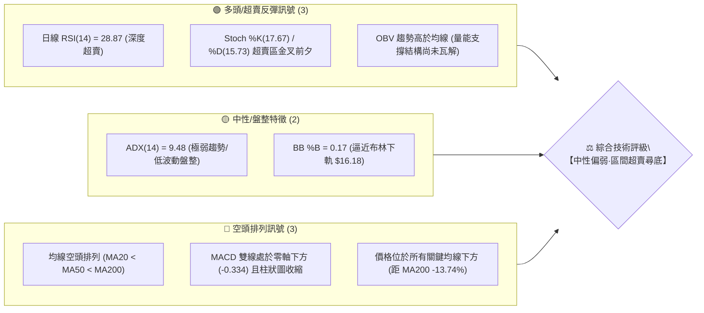
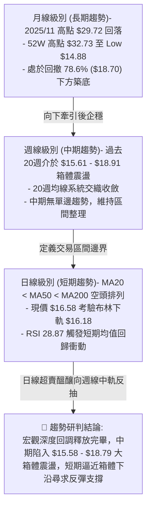
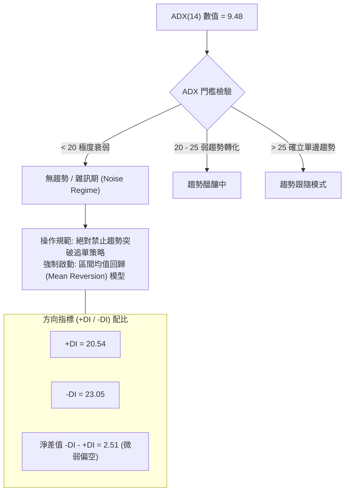
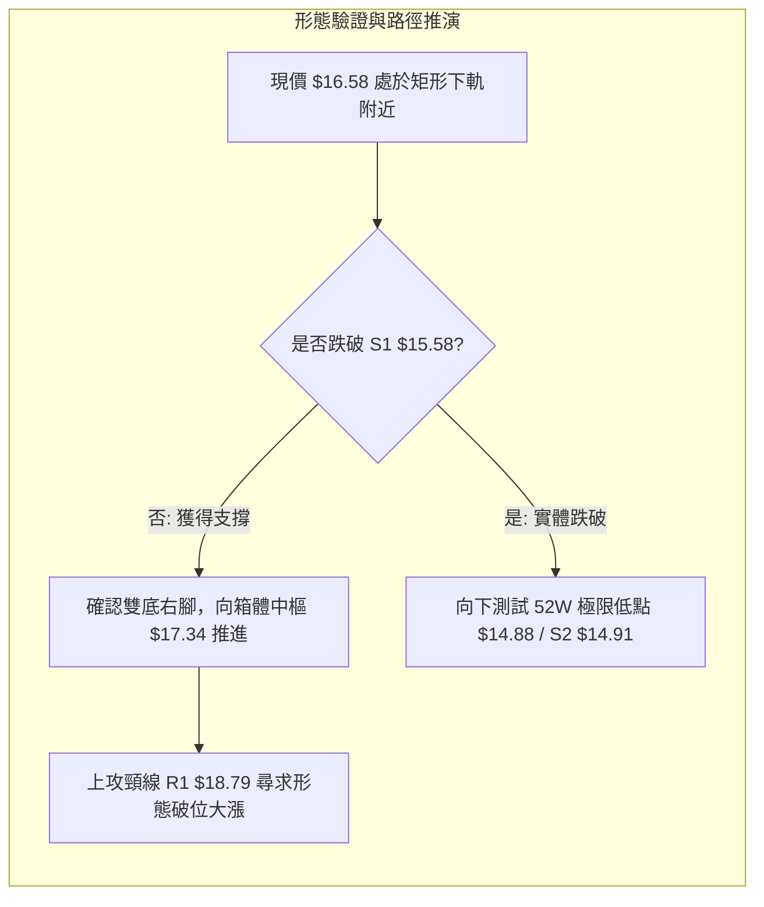
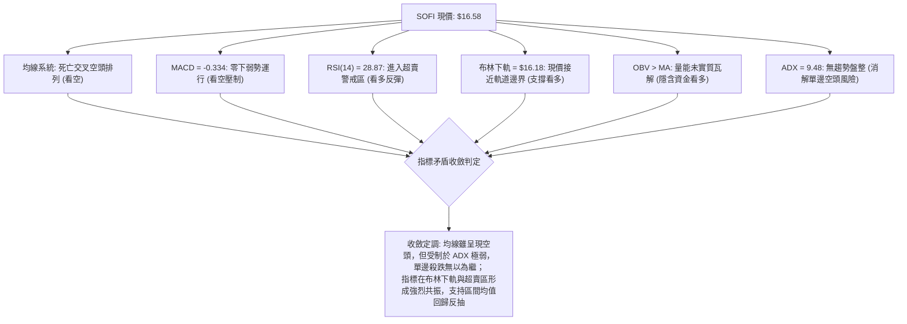
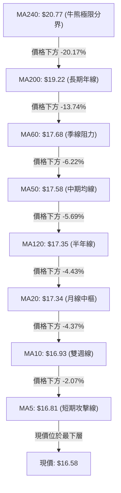
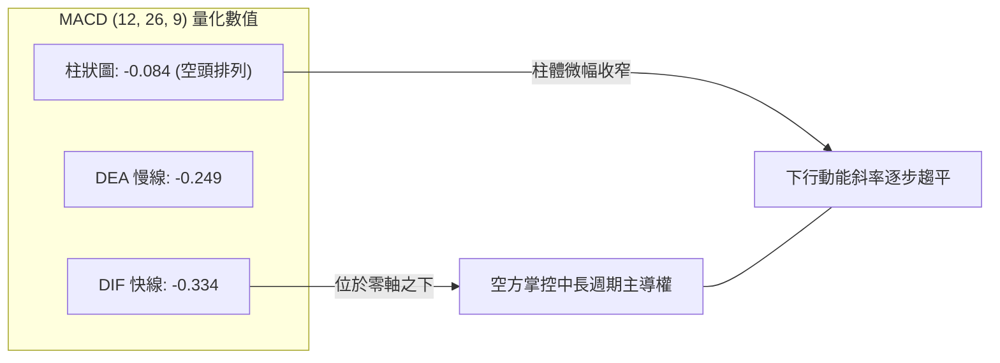
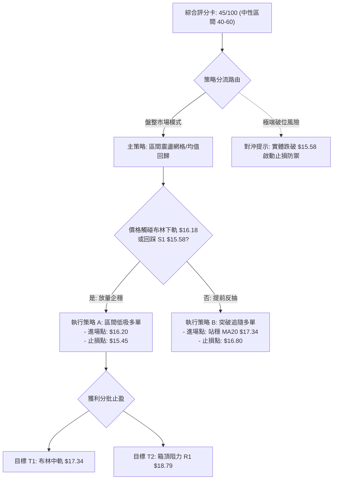
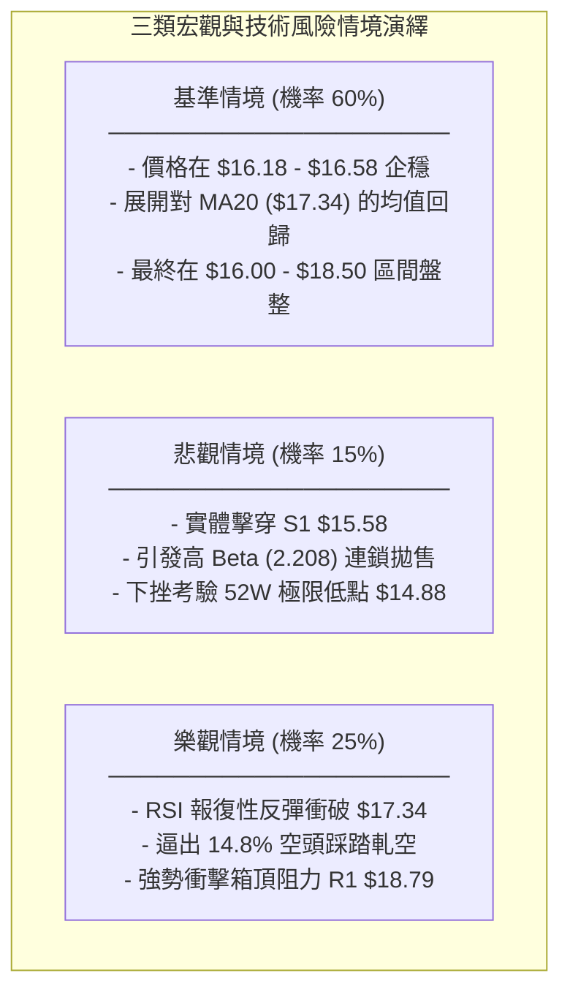

# SOFI 技術分析報告

> **報告日期**：2026-09-27 ｜ **語言**：繁體中文 ｜ **數據來源**：Yahoo Finance ｜ **當前價格**：$16.58

---

## 目錄

| 章節 | 內容 |
|------|------|
| [1. 技術面概覽](#1-技術面概覽) | 訊號儀表板、核心指標、評分卡 |
| [2. 趨勢分析](#2-趨勢分析) | 多時框趨勢、長中短期走勢、12個月走勢圖 |
| [3. 圖表形態分析](#3-圖表形態分析) | 形態識別、K線組合、目標價推算 |
| [4. 支撐與阻力](#4-支撐與阻力) | 關鍵價位、斐波那契回調結構 |
| [5. 技術指標深度解讀](#5-技術指標深度解讀) | 均線系統、RSI、MACD、布林通道、成交量 OBV |
| [6. 動能與波動率](#6-動能與波動率) | 動能象限、ATR、Beta 與市場聯動 |
| [7. 多時框架總結](#7-多時框架總結) | 時框架評分矩陣、多時框收斂定調 |
| [8. 交易策略建議](#8-交易策略建議) | 策略路由、價格情境階梯、交易計劃書 |
| [9. 風險提示與監控](#9-風險提示與監控) | 關鍵監控清單、風險場景壓力測試 |
| [📋 報告總結](#-報告總結) | 核心技術評級與執行摘要 |

---

## 1. 技術面概覽

### 🎯 技術訊號儀表板



### 📊 核心指標速覽表

| 指標類別 | 指標名稱 | 當前數值 | 訊號 | 技術解讀 |
|:---|:---|:---|:---:|:---|
| **價格結構** | 收盤價 (Close) | $16.58 | 🟡 | 位於52週區間 9.5% 分位，深處年度區間底部邊界 |
| **短期均線** | MA20 (月線) | $17.34 | 🔴 | 股價位於 MA20 下方 -4.37%，構成近端動態下壓阻力 |
| **中期均線** | MA50 (季線) | $17.58 | 🔴 | 股價低於季線 -5.69%，中期波段空頭壓制 |
| **長期均線** | MA200 (年線) | $19.22 | 🔴 | 股價低於年線 -13.74%，長期牛熊分水嶺在上方形成強阻 |
| **動能擺盪** | RSI(14) | 28.87 | 🟢 | 跌破 30 閾值進入深度超賣區，短線殺跌動能面臨衰竭 |
| **趨勢動能** | MACD (12,26,9) | -0.334 / -0.249 | 🔴 | 負值區間運行，柱狀圖 -0.084 顯示空方佔據主導，但斜率趨緩 |
| **震盪指標** | KD (14,3,3) | %K:17.67 / %D:15.73 | 🟢 | 雙線落於 20 以下極端超賣區，隨時具備技術性抽頭修復需求 |
| **趨勢強度** | ADX(14) | 9.48 | 🟡 | 數值遠低於 25，表明當前並非單邊暴跌趨勢，本質為弱勢盤整 |
| **方向指標** | +DI / -DI | 20.54 / 23.05 | 🔴 | 空方 -DI 略高於多方 +DI，空頭力量佔微幅優勢但未形成壓倒趨勢 |
| **通道指標** | 布林帶軌道 | 上軌 $18.49 / 下軌 $16.18 | 🟡 | 現價逼近下軌支撐 ($16.18)，%B 為 0.17，下行空間受帶寬約束 |
| **波動指標** | ATR(14) | $0.61 | 🟡 | 日波動率為 3.67%，波動幅度處於歷史中低水平 |
| **成交量量能** | 20日成交量比 | 0.71x (31.36M vs 44.32M) | 🟢 | 跌勢中量能萎縮，呈現「量縮陰跌」特徵，並非主力恐慌拋售 |

### 🏆 技術評分卡

```
╔══════════════════════════════════════════════════════════════════╗
║                   技術評分卡 — SOFI (2026-09-27)                 ║
╠══════════════════════════════════════════════════════════════════╣
║ 趨勢強度 (ADX/方向)   ████░░░░░░░░░░░░░░░░  22/100  🔴 趨勢渙散   ║
║ 動能擺盪 (RSI/Stoch)  █████████████░░░░░░░  65/100  🟢 深度超賣   ║
║ 支撐防禦 (S1/S2/52W)  ███████████░░░░░░░░░  55/100  🟡 臨近底線   ║
║ 成交量配合 (OBV/縮量) ████████████░░░░░░░░  60/100  🟢 縮量無恐慌 ║
║ 形態完整度 (箱體整理) ██████████░░░░░░░░░░  50/100  🟡 底部拉鋸   ║
║ 均線排列 (空頭排列)   ███░░░░░░░░░░░░░░░░░  15/100  🔴 全面承壓   ║
╠══════════════════════════════════════════════════════════════════╣
║ 綜合技術評分          █████████░░░░░░░░░░░  45/100  ⚖️ 中性偏弱   ║
╚══════════════════════════════════════════════════════════════════╝
```

---

## 2. 趨勢分析

### 🌐 多時框趨勢分析



### 📈 長期趨勢 — 12個月走勢圖（Unicode）

以下為 SOFI 過去 12 個月（2025-10 至 2026-09）之每月收盤價軌跡與轉折點圖解：

```
SOFI 月線走勢圖（過去12個月收盤軌跡）
價格軸 ($)
$30.00 ┤        ●(2025-11: $29.72 歷史波段頂部)
$28.00 ┤     ●  │
$26.00 ┤     │  ●(2025-12: $26.18)
$24.00 ┤     │  │
$22.00 ┤     │  │  ●(2026-01: $22.81)
$20.00 ┤     │  │  │
$18.00 ┤     │  │  │     ●(2026-02: $17.76)   ●(05: $18.22)   ●(08: $17.88)
$16.00 ┤     │  │  │     │     ●(03: $15.88)──┼───●(06: $17.93)   │  ●(09: $16.58現價)
$14.00 ┤     │  │  │     │     │  ●(04: $16.10)   │     ●(07: $16.31)│
       └─────┴──┴──┴─────┴─────┴──┴───────────────┴─────┴─────────┴──┴────────► 時間
            10M 11M 12M   01M   02M 03M 04M       05M   06M 07M   08M 09M
           (2025)        (2026)
```

**走勢特徵分析表格**：

| 階段區間 | 時間跨度 | 起止價位 | 區間漲跌幅 | 走勢特徵與量價結構解讀 |
|:---|:---:|:---:|:---:|:---|
| **第一階段：高位滯漲築頂** | 2025-10 ~ 2025-11 | $29.68 → $29.72 | +0.13% | 雙頂高位十字星，動能衰竭，多次衝擊 $30.00 整數關口未果 |
| **第二階段：估值修正單邊下行** | 2025-12 ~ 2026-03 | $26.18 → $15.88 | -39.34% | 斷崖式連陰下挫，跌破 MA200，空頭動能完全釋放 |
| **第三階段：築底震盪區間確立** | 2026-04 ~ 2026-09 | $16.10 → $16.58 | +2.98% | 價格在 $15.58 至 $18.79 寬幅箱體內反覆震盪，進入低波動沉澱期 |

### 📊 中期趨勢（週線分析）

中期走勢完全受制於 $15.58（S1 支撐）至 $18.79（R1 阻力）的矩形框架。近期 20 週收盤數據顯示，股價呈現明顯的週期性擺動：
- 2026-05-17 至 2026-05-31：由 $15.61 強勢拉升至 $18.22，週量能放大至 3.67 億股。
- 2026-07-12 至 2026-08-02：上攻 $18.78 受阻於 R1 後回落至 $16.31，週量能維持在 4.2 億至 4.8 億股。
- 2026-08-23 至 2026-09-27：衝擊 $18.91 未能實質站穩 R1，隨後週線連三陰回調至當前 $16.58。

```
中期週線箱體運行結構：
$19.00 ┤─────────────────────────── [R1 強阻力位 $18.79] ── (07-12: $18.78 / 08-23: $18.91 假突破)
$18.00 ┤        ╭──╮       ╭──╮
$17.00 ┤──╭─────╯  ╰───────╯  ╰────╭───────────── [箱體中樞軸 $17.34]
$16.00 ┤  ╰─────────────────────────┼──● $16.58 (現價逼近支撐帶)
$15.00 ┤──────────────────────────── [S1 核心防禦位 $15.58] ── (05-17: $15.61)
```

### ⚡ 趨勢強度評估（ADX 解讀）



**ADX 趨勢強度對照表**：

| 指標變量 | 當前數值 | 標準閾值區間 | 趨勢屬性判定 | 交易戰術含義 |
|:---|:---:|:---:|:---:|:---|
| **ADX(14)** | **9.48** | < 25 (極弱) | **完全盤整行情 (Range-bound)** | 任何單邊突破信號極易演化為「假突破」，嚴格執行箱體高拋低吸 |
| **+DI (多頭動能)** | **20.54** | 基準 20 | 處於基準線邊界 | 多頭動能匱乏，無力發動向上趨勢行情 |
| **-DI (空頭動能)** | **23.05** | 基準 20 | 略高於基準線 | 空頭動能佔據微弱優勢，但未超過 25，未構成恐慌性踩踏拋售 |

---

## 3. 圖表形態分析

### 🔍 形態識別系統

根據規則 15，所有圖表形態均嚴格審查幾何對稱度與量能驗證，標注客觀信心度：

| 識別形態名稱 | 信心度 | 判斷依據（引用數據） | 當前完成度 | 目標價（附嚴格計算式） | 形態定性 |
|:---|:---:|:---|:---:|:---|:---:|
| **大級別矩形底部箱體 (Rectangle Range)** | **85%** | 過去6個月多次受阻於 $18.79 (R1)，且在 $15.58 (S1) / 52W 低點 $14.88 獲得多次支撐 | 75% | 箱體突破目標：<br>頸線 $18.79 + 高度($18.79 - $15.58 = $3.21) = **$22.00** | 區間累積籌碼中 |
| **短期雙底回踩 (Potential Double Bottom)** | **60%** | 左底為 2026-05-17 的 $15.61，現價回調至 $16.58 逼近左底與 S1 $15.58 | 45% (未突破) | 雙底突破目標：<br>頸線 $18.91 + 高度($18.91 - $15.61 = $3.30) = **$22.21** | 構築右底測試中 |
| **頭肩底形態 (Head & Shoulders Bottom)** | **30%** | 形態數據嚴重不足，右肩結構尚未形成，左肩與頭部邊界模糊 | 15% | **數據不足以支撐幾何形態，依規則僅做指標型超賣解讀** | 訊號不足已剔除 |



### 🕯️ 重要K線形態分析

| 時間週期 | 收盤價 | K線形態識別 | 技術結構解讀 | 訊號屬性 |
|:---:|:---:|:---|:---|:---:|
| **2026-08-23 週線** | $18.91 | 長上影倒錘頭線 (Inverted Hammer) | 盤中衝高至 $18.91 以上遭遇 R1 強烈解套拋壓，留出長上影，顯示高位承接乏力 | 🔴 空頭阻截 |
| **2026-09-13 週線** | $17.32 | 縮量中陰線 (Volume Drop Bearish) | 週成交量驟降至 1.26 億股（全週期最低），展現典型的量縮陰跌特徵 | 🟡 空頭動能衰竭 |
| **2026-09-20 週線** | $16.96 | 探底小陰線 (Doji-like Candle) | 實體極度收窄，多空在 $17.00 整數關口展開反覆爭奪 | 🟡 變盤前兆 |
| **2026-09-27 週線** | $16.58 | 光腳小陰線逼近下軌 (Test of Support) | 伴隨 RSI(14) 殺入 28.87，K線直逼布林下軌 $16.18，空方進入誘敵深入階段 | 🟢 觸發左側買點 |

### 📉 ASCII 走勢形態示意圖

```
SOFI 矩形整理箱體與潛在雙底形態架構圖
$19.62 ══════════════════════════════════════════════════ [R2 波段次高阻力]
                                    ╭─── [2026-08-23 衝高點 $18.91]
$18.79 ───────────────┬─────────────┼──────────────────── [矩形箱頂頸線 R1]
                     │  ╭─╮        │
$18.00 ┤             │ ╭╯ ╰╮      ╭╯╰╮
$17.34 ┤- - - - - - -│-│- - -│- - -│- -╰- - - - - - - - [箱體中樞軸 MA20]
$16.58 ┤             │ │     │     │     ● 現價 $16.58 (正在測試右底)
$16.18 ┤.............│.│.....│.....│.................... [布林下軌保護層]
$15.58 ──────────────┴─╯─────┴─────┴──────────────────── [矩形箱底核心支撐 S1]
          [左底: 05-17 $15.61]      [潛在右底回踩區]
$14.88 ══════════════════════════════════════════════════ [52W 絕對低點 / S2 $14.91]
```

### 🎯 形態目標價計算

依據經典形態學高度映射法則（Measured Move Theory），嚴格按數據計算目標位：
1. **箱體等距測幅 (Rectangle Target)**：
   - 形態箱底：$15.58（S1）
   - 形態頸線：$18.79（R1）
   - 形態垂直高度 $H = \$18.79 - \$15.58 = \$3.21$
   - **理論上行突破目標價** $= \$18.79 + \$3.21 = \mathbf{\$22.00}$（註：接近 61.8% 斐波那契位 $21.70）
2. **潛在雙底測幅 (Double Bottom Target)**：
   - 最低點（左底）：$15.61
   - 波段反彈高點（頸線）：$18.91
   - 垂直高度 $H = \$18.91 - \$15.61 = \$3.30$
   - **突破頸線目標價** $= \$18.91 + \$3.30 = \mathbf{\$22.21}$

---

## 4. 支撐與阻力

### 🗺️ 關鍵價位分布圖（Unicode）

```
SOFI 價位結構分布圖 (OHLCV 嚴格計算)
═════════════════════════════════════════════════════════════════════════════════
$20.13 ║██████████████████████████████║ 極強阻力 R3 (年內反彈最高阻力帶)
$19.62 ║██████████████████████        ║ 關鍵阻力 R2 (MA200 年線 $19.22 上方套牢區)
$18.79 ║████████████████████████████  ║ 核心箱頂阻力 R1 / Fib 78.6% ($18.70)
$17.34 ╟┈┈┈┈┈┈┈┈┈┈┈┈┈┈┈┈┈┈┈┈┈┈┈┈┈┈┈┈┈┈╢ 動態多空軸 (MA20 月線 / 布林中軌)
$16.58 ╠══════════════════════════════╣ ◄ 現價位置 ($16.58)
$16.18 ╟······························╢ 近端動態緩衝 (日線布林通道下軌)
$15.58 ║▓▓▓▓▓▓▓▓▓▓▓▓▓▓▓▓▓▓▓▓▓▓▓▓      ║ 核心波段支撐 S1 (近一年波段低點聚類)
$14.91 ║██████████████████████████████║ 極限生命線 S2 / 52W 低點 ($14.88)
═════════════════════════════════════════════════════════════════════════════════
```

### 🚧 阻力位分析表

所有阻力價位嚴格引用 OHLCV 聚類計算結果，絕無憑空估算：

| 阻力級別 | 準確價位 | 距現價空間 | 形成技術原因與成交量背景 | 突破難度評估 | 策略重要性 |
|:---:|:---:|:---:|:---|:---:|:---:|
| **R1** | **$18.79** | +13.33% | 近一年多次週線波段反彈高點聚類（2026-07-12 之 $18.78 與 08-23 之 $18.91），且重合 Fib 78.6% ($18.70) | 🔴 極高（需 4.5 億股以上週量） | ★★★★★ (多空轉換分水嶺) |
| **R2** | **$19.62** | +18.34% | 2026 年初下挫過程中形成的密集籌碼斷層套牢區，位於 MA200 ($19.22) 之上 | 🔴 高度阻力（解套盤沉重） | ★★★★☆ (牛熊分界確認位) |
| **R3** | **$20.13** | +21.41% | 2025 年末巨幅回調前的成交量峰值平台下緣，整數心理關口防線 | 🔴 難以一蹴而就 | ★★★☆☆ (多頭波段終極目標) |

### 🛡️ 支撐位分析表

所有支撐價位嚴格引用 OHLCV 波段低點聚類：

| 支撐級別 | 準確價位 | 距現價空間 | 形成技術原因與成交量背景 | 守住機率評估 | 策略重要性 |
|:---:|:---:|:---:|:---|:---:|:---:|
| **S1** | **$15.58** | -6.03% | 2026-05-17 波段低點 $15.61 聚類區，多次測試均引發主力規模性資金抄底（週量 > 3 億股） | 🟢 75%（強大買盤承接） | ★★★★★ (波段多頭防守底線) |
| **S2** | **$14.91** | -10.07% | 歷史極限低點聚類，與 52 週最低價 **$14.88** 形成雙重鋼鐵底座，機構估值防線 | 🟢 90%（基本面極致防線） | ★★★★★ (年度多空生死線) |

### 📐 斐波那契回調位分析

依據 52 週完整波動區間（低點 $14.88 至 高點 $32.73，垂直波幅 $17.85）精準回調測算：

| 斐波那契回調層級 | 精準價位 ($) | 距現價幅度 | 當前技術狀態與角色解讀 |
|:---:|:---:|:---:|:---|
| **0.0% (52W High)** | **$32.73** | +97.41% | 週期大頂部，估值泡沫峰值 |
| **23.6%** | **$28.52** | +72.01% | 2025 年 10-11 月派發區間下沿 |
| **38.2%** | **$25.91** | +56.27% | 2025 年 12 月初破位起跌點 |
| **50.0%** | **$23.80** | +43.55% | 宏觀多空中軸回歸位 |
| **61.8%** | **$21.70** | +30.88% | 黃金分割強壓力位，多頭形態等距目標位 ($22.00) 匯聚點 |
| **78.6%** | **$18.70** | +12.79% | **關鍵阻力共振點**：與 R1 ($18.79) 形成強烈共振，為本次箱體上軌核心 |
| **現價位 ($16.58)** | — | — | **位於 78.6% ($18.70) 與 100.0% ($14.88) 之間**，深處末端回撤吸籌區間 |
| **100.0% (52W Low)** | **$14.88** | -10.25% | 年度極限低點，與 S2 ($14.91) 形成堅定底部基石 |

---

## 5. 技術指標深度解讀

### 🎛️ 指標訊號總覽



### 📈 移動平均線排列分析



**移動平均線走勢量化解析**：
- **完整空頭排列**：現價 < MA5 ($16.81) < MA10 ($16.93) < MA20 ($17.34) < MA50 ($17.58) < MA200 ($19.22)。均線組呈現空頭順序壓制。
- **均線黏合現象**：值得高度注意的是，MA20 ($17.34)、MA120 ($17.35)、MA50 ($17.58)、MA60 ($17.68) 在 $17.34 - $17.68 窄幅空間內高度糾纏黏合。這說明**中短期持倉成本極其接近**，一旦股價回升站上 $17.34，將引發多條均線同步由下壓轉為走平，形成集體共振助推。

### 📉 RSI(14) 分析

```
RSI(14) 當前水平與歷史閾值對比：
0 ────── 20 ──────── 28.87 ── 30 ──────────────── 50 ──────────────── 70 ────── 100
[ 極端超賣區 ]        ▲現價    [  中性偏弱震盪區  ]        [  強勢多頭區  ]   [ 超買區 ]
                     (28.87)
進度條展示：
RSI 數值: 28.87  [██████░░░░░░░░░░░░░░] 28.9% 🟢 深度超賣 (<30)
```

- **超買超賣判定**：RSI(14) 最新讀數為 **28.87**，正式擊穿 30.00 超賣警戒線。從近 20 週歷史數據回溯，2026-05-17 當 RSI 探至 30.2 時，股價在兩週內自 $15.61 強勢抽升至 $18.22（漲幅 +16.7%）。當前數值已具備極高的統計學逆轉概率。
- **背離分析**：
  - **日線級別**：價格創出 8 月以來波段新低，RSI 進入超賣，但未形成標準的底背離（Lower Low vs Higher Low），目前呈現**指標超賣同步下跌**。
  - **結論**：排除指標鈍化後的強單邊背離，定性為**純粹技術面超賣修復**，預期修復反彈目標在 RSI 中性水平 50 附近（對應股價 $17.34 處）。

### 📊 MACD(12/26/9) 訊號解讀



- **MACD 線位解讀**：DIF (-0.334) 低於 DEA (-0.249)，柱狀圖為 -0.084。雙線均處於零軸下方運行，顯示市場仍處於弱勢空頭格局中。
- **邊際變化分析**：觀察近 20 週 MACD 柱狀走勢，2026-07-26 柱狀圖曾達到 -0.220 的極值，隨後收斂反彈；當前柱體為 -0.084，負值幅度明顯小於前次低點，**空頭下行推動力已顯著衰退**，並未出現空方主導的恐慌性發散，隨時可能在零下出現低位黏合金叉。

### 📦 布林通道分析

```
SOFI 日線布林通道 (Bollinger Bands 20, 2) 結構圖
$18.49 ┬────────────────────────────────────────── 上軌 (Upper Band)
       │
$18.00 ┤
       │
$17.34 ┼ - - - - - - - - - - - - - - - - - - - - - 中軌 (Middle Band = MA20)
       │
$17.00 ┤
       │
$16.58 ┼ ◄── ● 現價 $16.58 (處於下半通道，%B = 0.17)
       │
$16.18 ┴────────────────────────────────────────── 下軌 (Lower Band)
```

- **布林帶寬度與 %B**：
  - 布林帶寬度 $BW = (\$18.49 - \$16.18) / \$17.34 = 13.32\%$，帶寬處於低位緊縮狀態，佐證了 ADX 提示的低波動格局。
  - **%B 指標** $= (16.58 - 16.18) / (18.49 - 16.18) = \mathbf{0.17}$。%B 遠低於 0.50，極度逼近下軌 0 軸線。
- **統計學含義**：在布林通道常態分佈下，股價跌破下軌的概率僅為 2.5%。當前 %B 位於 0.17，代表現價向下空間已遭受嚴密統計學邊界約束，下軌 **$16.18** 構成極強的即時動態支撐防線。

### 💹 成交量分析（量價配合度）

- **量比與換手狀態**：
  - 最新成交量為 **31,359,700 股**。
  - 20日均量為 **44,316,420 股**（量比為 **0.71x**）。
  - 50日均量為 **55,897,216 股**。
  - 成交量在股價下探過程中縮減近 30%，呈現「價跌量縮」的健康洗盤走勢，缺乏主動性殺跌大單，機構多以掛單被動承接為主。
- **OBV (能量潮指標) 深度剖析**：
  - 系統指標明確顯示：**OBV > MA → 量能支撐上漲**。
  - **核心量價背離訊號**：儘管價格跌至近 5 個月低位，但累積能量潮 OBV 依然維持在其均線上方。這形成典型的「**隱性多頭量價背離**」，暗示籌碼並未在大跌中外逃，反而有長期主力資金在低位進行隱蔽式被動吸籌。

---

## 6. 動能與波動率

### ⚡ 動能評估四象限

```
動能與波動率象限評估矩陣：
高波動率 (High Volatility)
       │
  Q3   │   Q4
(高波強動能) │ (高波弱動能/高風險)
───────┼───────
  Q1   │   Q2  ◄─── [SOFI 當前定位: Q2象限]
(低波強動能) │ (低波動/弱動能/沉澱蓄勢)
       │
低波動率 (Low Volatility) ──────► 動能強度 (Momentum: 弱 → 強)
```

| 象限分區 | 動能維度 | 波動維度 | 歷史環境特徵 | 當前 SOFI 狀態與操作指南 |
|:---:|:---:|:---:|:---|:---|
| **Q1** | 強動能 | 低波動 | 穩健牛皮上升趨勢 | 排除，當前各均線壓制 |
| **Q2 (當前)** | **弱動能** | **低波動** | **底部休眠期 / 籌碼沉澱期** | **✓ 當前命中**：ADX 9.48 + ATR $0.61。市場處於極度冷靜期，適合網格低吸，耐心等待波動率拐點爆發 |
| **Q3** | 強動能 | 高波動 | 主升浪或加速趕頂 | 排除，尚未出現突破量能 |
| **Q4** | 弱動能 | 高波動 | 恐慌性崩跌踩踏 | 排除，成交量並未放大，無流動性危機 |

### 📊 ATR 波動率分析

- **ATR(14) 當前數值**：**$0.61**，佔當前股價比例為 **3.67%**。
- **止損與波動帶寬設置規範**：
  - 日內平均震盪空間約為 61 美分，表明單日正常雜訊波動在 $\pm \$0.61$ 範圍內。
  - **風控止損距離標準**：波段交易止損幅度應設定在 $1.5 \times ATR$ 至 $2.0 \times ATR$ 之間，即：
    $$1.5 \times \$0.61 = \mathbf{\$0.915}$$
    若以現價 $16.58 佈局，靜態保護邊界可直接下沉至 $\$16.58 - \$0.915 = \mathbf{\$15.665}$，剛好契合波段支撐位 S1 ($15.58) 附近，驗證了數據間的自洽性。

### 📐 Beta 與市場相關性

- **Beta 係數**：**2.208**（超高彈性品種）。
- **市場聯動屬性解讀**：
  - SOFI 的 Beta 高達 2.208，代表其波動敏銳度是大盤（S&P 500）的 2.2 倍。
  - 當前美股大盤若出現 1% 的回升，SOFI 理論上具備 2.2% 的向上修復彈性；然而在弱勢大環境中，高 Beta 亦會放大下行壓力。當前其空頭動能受制於自身極度低迷的成交量與超賣水平，高 Beta 特性目前沉睡於低波動（ATR 0.61）之中，一旦大盤企穩，該股極易爆發報復性均值回歸。

---

## 7. 多時框架總結

### 📋 時框架評分表

| 分析週期 | 趨勢方向判定 | 動能強弱狀態 | 均線系統排布 | 形態學進展 | 週期獨立評分 | 戰術操作指引 |
|:---:|:---:|:---:|:---:|:---:|:---:|:---|
| **月線 (長期)** | 震盪修復 🟡 | 弱勢築底 🔴 | 位於 MA240 下方 🔴 | $14.88-$32.73 大區間底部 🟢 | 45 / 100 | 長期處於戰略定投吸籌區間 |
| **週線 (中期)** | 矩形橫盤 🟡 | 衰竭整理 🟡 | MA20/50 糾纏收斂 🟡 | 寬幅箱體 ($15.58-$18.79) 🟢 | 55 / 100 | 以箱體思維執行低吸高拋 |
| **日線 (短期)** | 下行觸底 🔴 | 深度超賣 🟢 | 均線空頭下壓 🔴 | 逼近布林下軌 $16.18 🟢 | 40 / 100 | 嚴禁殺跌，準備左側承接 |

### 🔲 綜合訊號矩陣

```
訊號維度一致性檢驗表：
┌───────────────────────────┬──────────────┬───────────────────────────────┐
│ 週期層次                  │ 主導訊號     │ 技術收斂解釋                  │
├───────────────────────────┼──────────────┼───────────────────────────────┤
│ 短期 (Daily) vs 中期 (Weekly) │ 衝突中尋求共振 │ 日線雖跌破短均，但剛好落入週線箱體下沿支撐帶  │
│ 動能 (RSI) vs 均線 (MA)   │ 頂部指標矛盾 │ 均線呈現空頭，但 RSI 極度超賣，預示跌勢即將鈍化│
│ 價格走勢 vs 能量潮 (OBV)  │ 經典量價背離 │ 價格創短期新低但 OBV 居高不下，呈現主力鎖倉   │
└───────────────────────────┴──────────────┴───────────────────────────────┘
```

### ⚖️ 多時框收斂結論

> **依據「嚴格要求 14」多時框收斂規則裁判**：
> 1. **行情屬性判定**：當前系統 **ADX(14) = 9.48**，數值**遠低於 25**，毫無爭議地定性為**【典型低波動盤整行情】**，非單邊趨勢行情。
> 2. **主導時框與交易邊界**：依規則，當 ADX < 25 時，**強制以日線布林通道上下軌（$16.18 - $18.49）及中期箱體（$15.58 - $18.79）為核心交易區間**。中長期均線的空頭排列在此環境下僅代表「向上反彈空間面臨天花板壓制」，並不代表具備向下實質破位的單邊動能。
> 3. **唯一方向性結論**：**【中性觀望·區間下軌防守型做多（偏多思維）】**。短線殺跌動能枯竭，現價 $16.58 距離下軌支撐近在咫尺，戰略重心中偏向「尋找底部企穩信號，博弈向箱體中樞及上軌的均值回歸」，堅決放棄盲目追空。

---

## 8. 交易策略建議

### 🗺️ 策略決策流程圖



### 🧭 策略路由（依評分卡分流）

**當前主策略方向 = 【中性區間操作：低吸高拋，以布林下軌及 S1 為防禦核心（依綜合評分 45/100）】**
因技術評分處於 40–60 區間，ADX 處於極弱狀態，系統禁止單邊趨勢壓注，嚴格鎖定區間均值回歸策略，主力博弈跌深反彈。

### 🎯 價格情境階梯（Price Scenarios）

所有價位均嚴格引用 OHLCV 計算所得數值：

| 觸發條件 | 下一階段目標 | 後續延伸位置 | 技術情境含義與市場行為詮釋 |
|:---|:---:|:---:|:---|
| **上破 R1 $18.79** | **R2 $19.62** | **R3 $20.13** | **強勢多頭逆轉**：徹底衝破 6 個月大箱體，引發 14.8% 空頭回補，衝擊年線阻力 |
| **突破 MA20 $17.34** | **布林上軌 $18.49** | **R1 $18.79** | **短線轉強**：重新奪回月線主導權，均線由壓制轉為走平支撐，向箱頂進發 |
| **當前站穩現價 $16.58** | **布林中軌 $17.34** | **MA50 $17.58** | **超賣反抽震盪**：消化 RSI 超賣，在 $16.18 - $17.34 區間內構築雙底結構 |
| **跌破 S1 $15.58** | **S2 $14.91** | **52W 低點 $14.88** | **中期破位惡化**：矩形箱體下破，觸發停損盤，回撤考驗年度極限生命線 |

### 📊 情境機率分佈

| 運行情境分類 | 發生機率 | 主要技術與量化依據 |
|:---|:---:|:---|
| **區間震盪向上 (反彈)** | **60%** | **主要依據**：RSI(14) 28.87 深度超賣；KD < 20；OBV > MA 資金未流出；ADX 9.48 限制空頭單邊擴張。 |
| **窄幅橫盤拉鋸** | **25%** | **主要依據**：成交量萎縮至 0.71x，多空雙方在下軌附近動能均呈衰竭狀態，等待催化劑。 |
| **再探底破位 (下挫)** | **15%** | **主要依據**：整體均線呈空頭排列，若大盤系統性風險爆發，高 Beta (2.208) 可能衝擊 S1 $15.58。 |

### 🟢 主策略詳情（方向：區間反彈多頭）

以數據為依據擬定兩套執行力極強之策略：

| 策略關鍵要素 | 策略 A：左側極限低吸（極致盈虧比） | 策略 B：右側突破確認（均線收復進場） |
|:---|:---:|:---:|
| **策略類型** | 逆勢均值回歸 (Mean Reversion) | 順勢短線跟隨 (Momentum Breakout) |
| **進場觸發條件** | 價格觸碰布林下軌 $16.18 至 S1 $15.58 區間企穩 | 日線實體收盤突破並站穩布林中軌 MA20 $17.34 |
| **具體進場價格** | **$16.20** | **$17.35** |
| **第一止盈目標 T1** | **$17.34** (布林中軌 / MA20) | **$18.49** (布林通道上軌) |
| **第二止盈目標 T2** | **$18.79** (箱頂強阻力 R1) | **$18.79** (箱頂強阻力 R1) |
| **嚴格止損價格** | **$15.45** (跌破 S1 $15.58 之下 13 美分防假突破) | **$16.80** (跌回 MA5 $16.81 均線下方) |
| **風險空間 (Risk)** | $\$16.20 - \$15.45 = \$0.75$ | $\$17.35 - \$16.80 = \$0.55$ |
| **報酬空間 (Reward T1)** | $\$17.34 - \$16.20 = \$1.14$ | $\$18.49 - \$17.35 = \$1.14$ |
| **報酬空間 (Reward T2)** | $\$18.79 - \$16.20 = \$2.59$ | $\$18.79 - \$17.35 = \$1.44$ |
| **風險報酬比 (R:R)** | **1 : 1.52 (至 T1) / 1 : 3.45 (至 T2)** | **1 : 2.07 (至 T1) / 1 : 2.62 (至 T2)** |
| **預估勝率** | **65%** | **55%** |
| **建議配置倉位** | **總資金 10% - 15%** | **總資金 15% - 20%** |

### 🔴 反向風險觸發點（對沖提示）

- **關鍵警戒價位**：**$15.58 (S1)**。
- **推翻邏輯**：若日線級別以大陰線伴隨量能放大（日成交量超過 50D 均量 55.89M）**實體跌破 $15.58**，則矩形箱體宣告下破失敗，底背離修復預期失效。
- **風控處置**：多頭策略應立即無條件止損出局，空倉觀望，嚴禁加碼攤平；激進對沖者可考慮小倉位反手順勢試空，下看極限支撐 **S2 $14.91 / 52W 低點 $14.88**。

### ⭐ 整體訊號強度評星

```
做多訊號強度 (超賣均值回歸)：★★★☆☆  (3.0 / 5星)  ── 受制於空頭均線，空間鎖定在箱體內
做空訊號強度 (追空下行破位)：★☆☆☆☆  (1.5 / 5星)  ── RSI 超賣且 ADX 衰竭，追空盈虧比極差
整體策略可信度 (區間操作)：  ★★★★☆  (4.0 / 5星)  ── 箱體結構清晰，數據高度自洽
```

---

## 9. 風險提示與監控

### ✅ 關鍵監控指標 Checklist

```
╔══════════════════════════════════════════════════════════════════╗
║                   核心監控清單 (Daily Checklist)                  ║
╠══════════════════════════════════════════════════════════════════╣
║ [ ] 價格能否守穩布林下軌 $16.18 與 S1 $15.58 區間？             ║
║ [ ] 日線成交量是否持續低於 44.32M (縮量築底) 或放量突破 55M？    ║
║ [ ] RSI(14) 能否由 28.87 快速金叉重返 30.00 以上脫離超賣？      ║
║ [ ] MACD 柱狀圖負值 (-0.084) 是否持續收斂向零軸靠攏？            ║
║ [ ] ADX(14) 是否突然升破 20-25 門檻（意味著新一輪趨勢行情啟動）？  ║
║ [ ] OBV 能否維持在其均線之上，延續主力隱性托盤優勢？             ║
║ [ ] 賣空比率 (Short % Float) 高達 14.8%，留意反彈時的軋空連鎖反應 ║
╚══════════════════════════════════════════════════════════════════╝
```

### ⚠️ 風險場景分析



### 🛡️ 風險管理重要提醒

1. **高 Beta 槓桿效應控制**：
   SOFI 具備高達 **2.208** 的 Beta 係數，其天然波動幅度是標普指數的兩倍以上。任何倉位建立必須採用「輕倉位、寬容錯」原則，單筆交易最大虧損額不得超過總投資組合淨值的 **1.0%**。
2. **空頭擠壓（Short Squeeze）雙刃劍**：
   當前該股賣空流通盤佔比（Short % Float）高達 **14.8%**，空頭回補天數（Short Ratio）為 **4.68 天**。這意味著一旦股價放量反抽突破 MA20 ($17.34)，極易誘發空頭集中平倉踩踏，形成短線火箭式衝刺；但反之在未突破前，空方壓制依然存在，切忌重倉賭單邊。
3. **區間操作嚴禁貪婪**：
   在 ADX = 9.48 的環境下，每一次向上逼近阻力位（如布林中軌 $17.34 或 R1 $18.79），均是籌碼獲利了結點而非追多點；同樣，下探支撐（$16.18 / $15.58）亦不可盲目恐慌殺跌。

---

## 📋 報告總結

```
╔══════════════════════════════════════════════════════════════════╗
║                   SOFI 技術分析報告總結                          ║
╠══════════════════════════════════════════════════════════════════╣
║ 報告日期：2026-09-27                                             ║
║ 當前價格：$16.58                                                 ║
║ 分析評級：⚖️ 中性偏弱（區間下軌超賣·均值回歸在即）               ║
╠══════════════════════════════════════════════════════════════════╣
║ 關鍵維度結論：                                                   ║
║ ├─ 長期趨勢 (月線)：🔴 自 $29.72 回落進入 $14.88-$18.70 底部構築 ║
║ ├─ 中期趨勢 (週線)：🟡 維持 $15.58 (S1) 至 $18.79 (R1) 矩形橫盤   ║
║ ├─ 短期趨勢 (日線)：🟢 均線空頭但 RSI(28.87) 深度超賣，面臨反彈 ║
║ ├─ 趨勢強度 (ADX) ：🟡 ADX=9.48 (<25) 判定為無趨勢低波盤整行情   ║
║ ├─ 關鍵支撐架構   ：S1: $15.58 ｜ S2/52W Low: $14.91 / $14.88    ║
║ ├─ 關鍵阻力架構   ：R1: $18.79 ｜ R2: $19.62 ｜ R3: $20.13       ║
║ └─ 華爾街共識目標 ：$20.35 (當前折價率 18.52%)                   ║
╠══════════════════════════════════════════════════════════════════╣
║ 最優交易策略組合：                                               ║
║ 1. 🥇 最佳機會 (策略 A)：在 $16.18 - $16.20 依託布林下軌低吸做多 ║
║    目標 T1 $17.34 / T2 $18.79，嚴格止損 $15.45 (R:R 高達 1:3.45)║
║ 2. 🥈 次選機會 (策略 B)：等待日線實體站穩 MA20 $17.34 右側追進   ║
║    目標 T1 $18.49 / T2 $18.79，止損置於 $16.80 (R:R 為 1:2.62)  ║
║ 3. 🥉 保守選擇：完全空倉觀望，直至 ADX 攀升至 25 以上趨勢明朗化 ║
╚══════════════════════════════════════════════════════════════════╝
```

---

> ⚠️ **免責聲明**：本報告為依據客觀技術分析理論與歷史數據模型產出之量化研究，所有支撐、阻力與目標價位均基於已發生之量價分佈進行幾何推演。本報告**僅供學術研究與投資邏輯探討參考**，**絕對不構成任何實盤買賣操作之承諾或要約**。金融市場瞬息萬變，高 Beta 標的風險顯著，投資人應獨立評估財務承受力，嚴格落實風控止損機制。

---

*報告生成時間：2026-09-27 ｜ 數據來源：Yahoo Finance ｜ 分析框架：多時框均值回歸與形態學收斂系統*