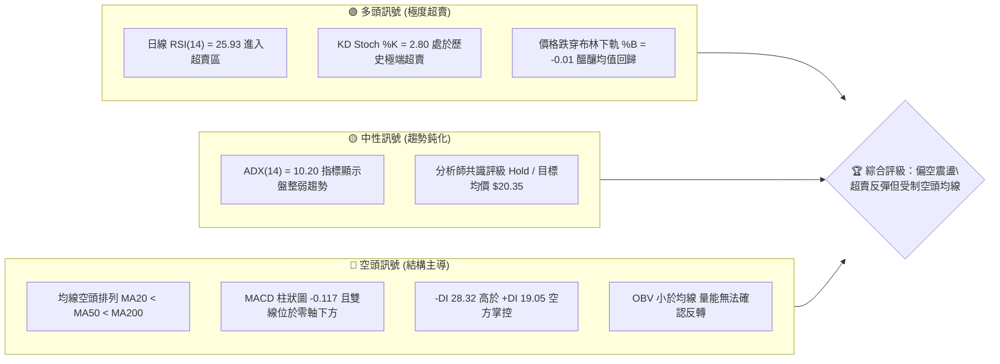
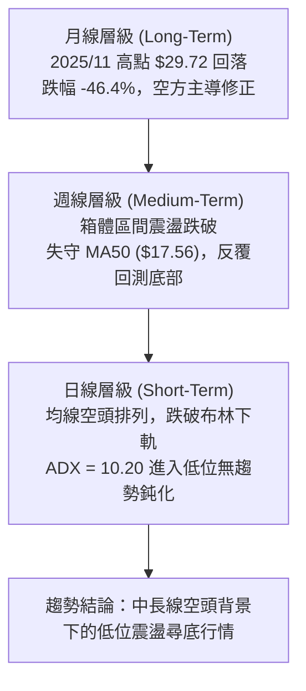
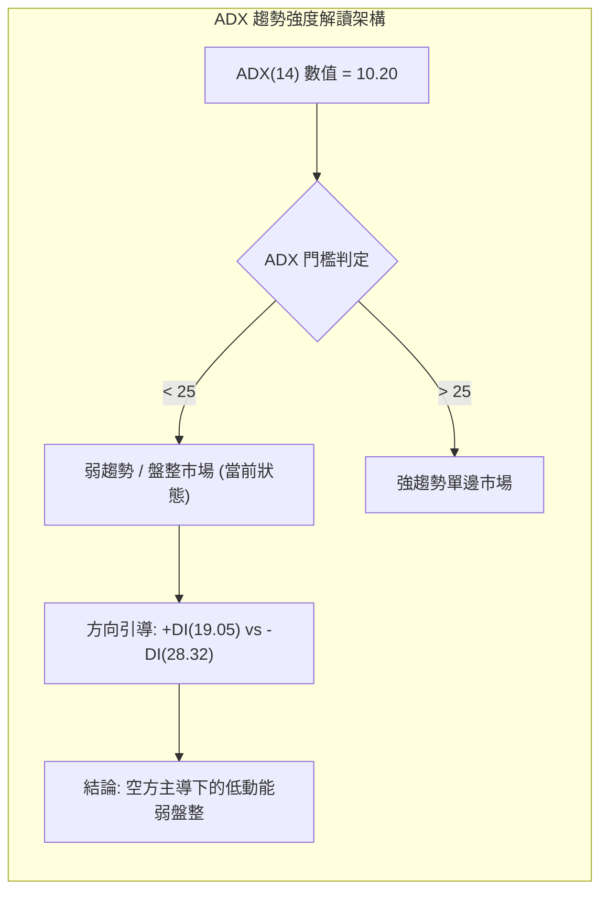
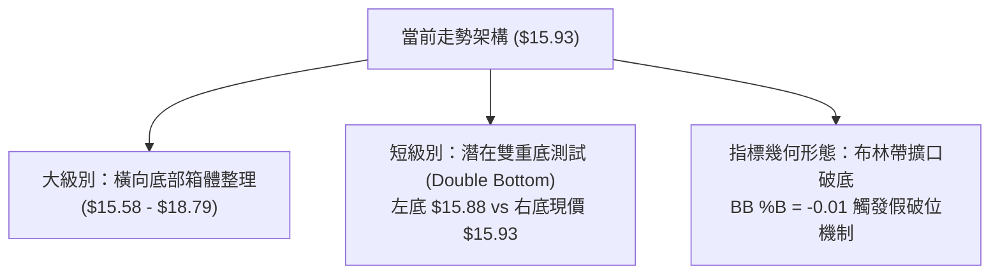
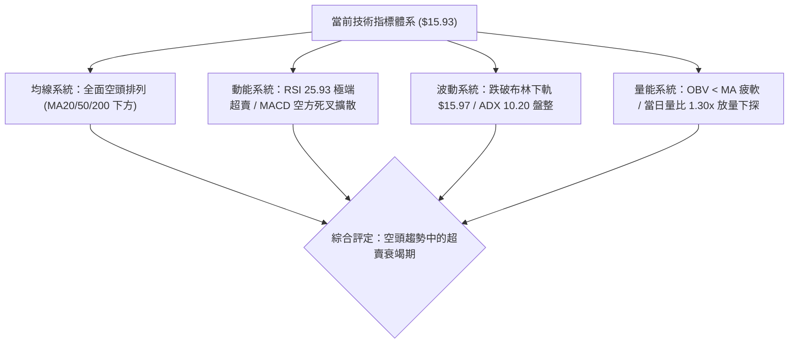
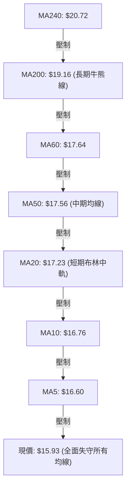
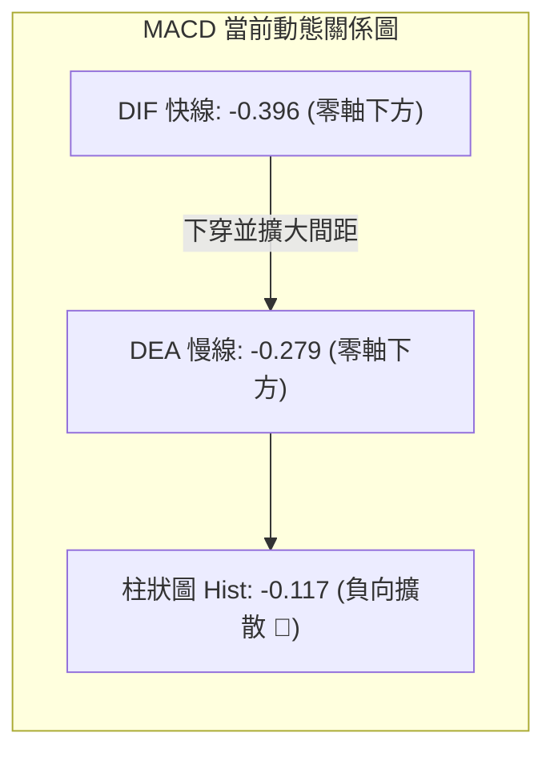
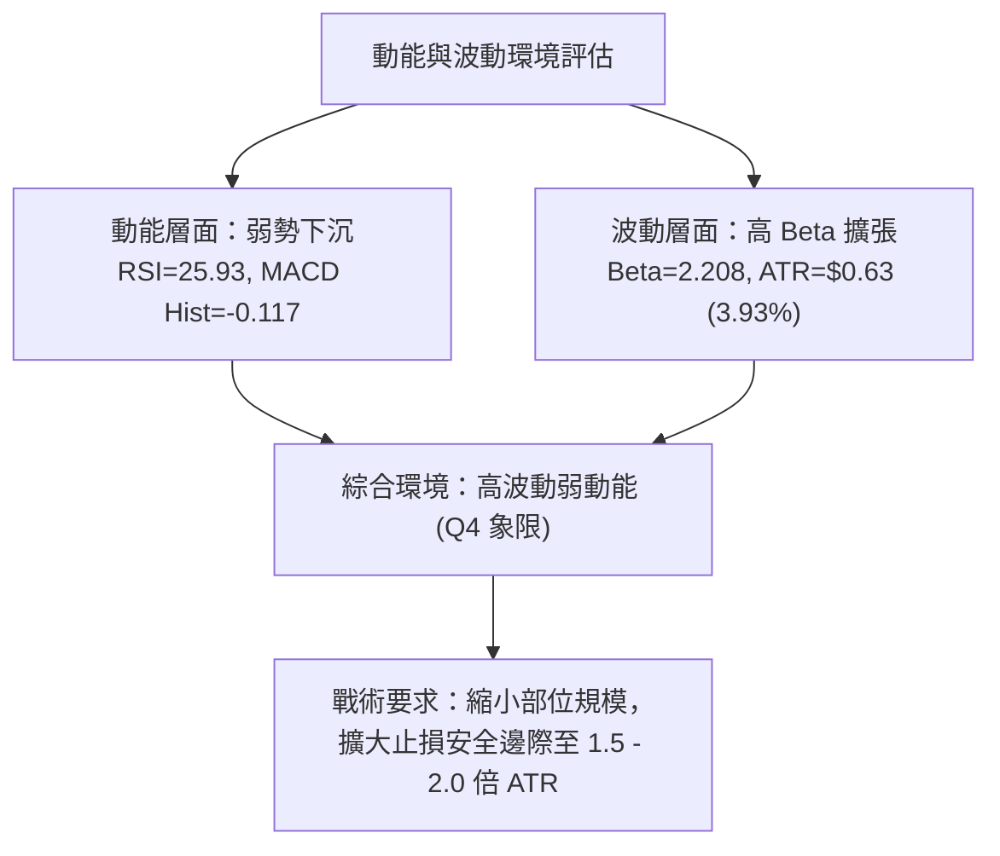
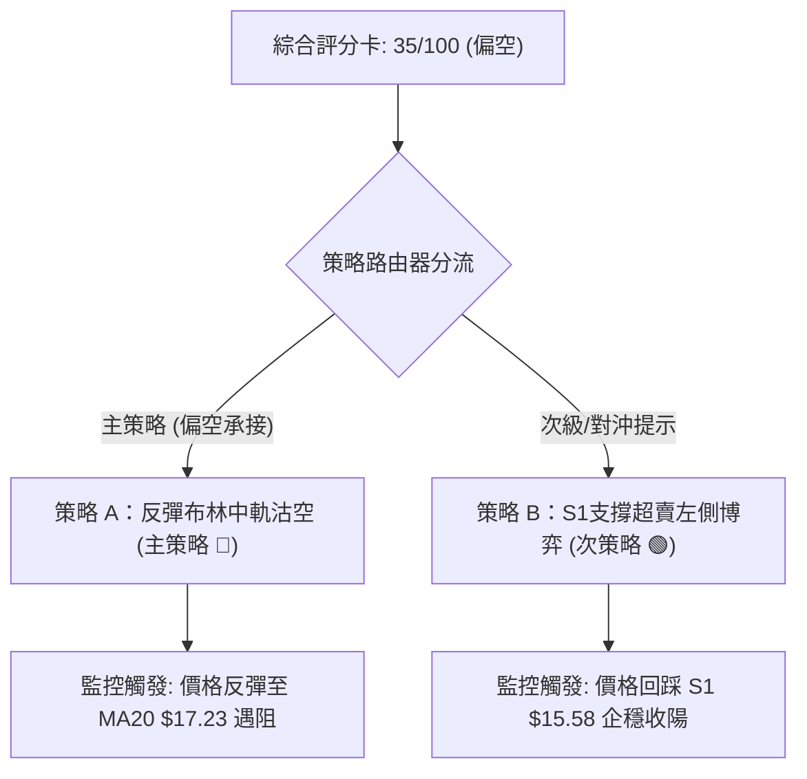
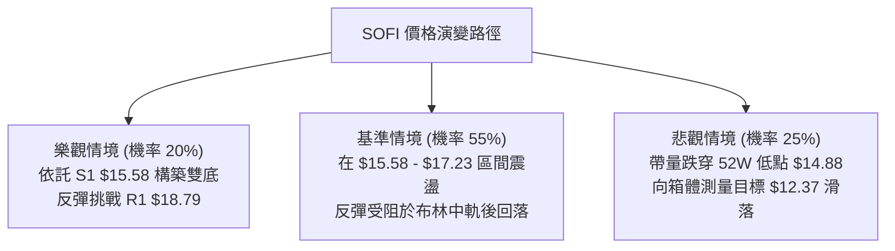

# SOFI 技術分析報告

> **報告日期**：2026-09-29 ｜ **語言**：繁體中文 ｜ **數據來源**：Yahoo Finance ｜ **當前價格**：$15.93

---

## 目錄

| 章節 | 內容 |
|------|------|
| [1. 技術面概覽](#1-技術面概覽) | 訊號儀表板、核心指標、評分卡 |
| [2. 趨勢分析](#2-趨勢分析) | 多時框趨勢、長中短期走勢、ADX 解讀 |
| [3. 圖表形態分析](#3-圖表形態分析) | 形態識別、K線組合、目標價推算 |
| [4. 支撐與阻力](#4-支撐與阻力) | 關鍵價位、斐波那契回調結構 |
| [5. 技術指標深度解讀](#5-技術指標深度解讀) | 均線系統、RSI、MACD、布林通道、OBV |
| [6. 動能與波動率](#6-動能與波動率) | 動能四象限、ATR 波動度、高 Beta 特性 |
| [7. 多時框架總結](#7-多時框架總結) | 時框架矩陣、多時框收斂定調 |
| [8. 交易策略建議](#8-交易策略建議) | 策略路由、價格階梯、主客策略與風控 |
| [9. 風險提示與監控](#9-風險提示與監控) | 關鍵監控 Checklist、情境樹、部位管理 |
| [10. 報告總結](#-報告總結) | 核心結論與最佳策略組合速覽 |

---

## 1. 技術面概覽

### 🎯 技術訊號儀表板



### 📊 核心指標速覽表

| 指標類別 | 指標名稱 | 當前數值 | 訊號 | 解讀 |
|----------|----------|----------|:---:|------|
| **價格** | 當前收盤價 | $15.93 | 🔴 | 位於 52 週區間底部 5.9% 位置，逼近破底邊緣 |
| **均線** | 短期 MA20 | $17.23 | 🔴 | 現價低於 MA20 達 -7.55%，短線下行斜率陡峭 |
| **均線** | 中期 MA50 | $17.56 | 🔴 | 價格受制於 MA50 下方，中期壓制顯著 |
| **均線** | 長期 MA200| $19.16 | 🔴 | 位於長線牛熊分界線下方 -16.86%，長空格局確立 |
| **動能** | RSI(14) | 25.93 | 🟢 | 深度超賣（<30），隨時具備技術性均值回歸動能 |
| **動能** | MACD(12,26,9)| -0.396 / -0.279 | 🔴 | 柱狀圖 -0.117，快慢線零軸下擴散，空方動能延續 |
| **動能** | KD Stoch %K/%D| 2.80 / 16.13 | 🟢 | 極度超賣區，短線殺跌動能接近衰竭邊緣 |
| **趨勢** | ADX(14) | 10.20 | 🟡 | ADX < 25 表明單邊趨勢動能微弱，處於盤整磨底期 |
| **通道** | 布林帶 %B | -0.01 | 🟢 | 跌破布林下軌 $15.97，存在向中軌 $17.23 修正拉力 |
| **量能** | 當日成交量 | 58,283,800 | 🟡 | 略高於 20 日均量 (量比 1.30x)，但 OBV < MA 量能疲弱 |
| **波動** | ATR(14) | $0.63 | 🟡 | 佔現價 3.93%，屬於中高波動個股，風控需留安全墊 |

### 🏆 技術評分卡

```
╔══════════════════════════════════════════════════════════════════╗
║               技術評分卡 — SOFI (2026-09-29)                     ║
╠══════════════════════════════════════════════════════════════════╣
║ 趨勢強度 (Trend)     ████░░░░░░░░░░░░░░░░  20/100 🔴 空頭壓制   ║
║ 均線架構 (MA Align)  ██░░░░░░░░░░░░░░░░░░  10/100 🔴 嚴格空排   ║
║ 動能指標 (Momentum)  ██████████░░░░░░░░░░  50/100 🟡 超賣反彈   ║
║ 支撐穩定度 (Support) ████████░░░░░░░░░░░░  40/100 🔴 逼近 S1    ║
║ 成交量配合 (Volume)  ██████░░░░░░░░░░░░░░  30/100 🔴 OBV疲軟    ║
║ 形態結構 (Pattern)   ████████░░░░░░░░░░░░  40/100 🟡 箱體下沿   ║
╠══════════════════════════════════════════════════════════════════╣
║ 綜合技術評分         ███████░░░░░░░░░░░░░  35/100 🔴 偏空弱勢   ║
║ 策略導向：以「反彈尋找空點」為主，激進者僅能依超賣博取短線反抽 ║
╚══════════════════════════════════════════════════════════════════╝
```

---

## 2. 趨勢分析

### 🌐 多時框趨勢分析



### 📈 長期趨勢 — 12個月走勢圖（ASCII）

SOFI 在過去 12 個月經歷了從衝頂到腰斬的完整下行週期。2025 年末在 $29.72 形成大型頭部後，一路階梯式下挫，當前已完全回吐至 2024 年底起漲點水準。

```
SOFI 月線走勢圖（過去12個月：2025-10 至 2026-09）
價格軸 ($)
$30.00 ┤        ●29.68  ●29.72 (頂部構築)
$27.00 ┤                            ●26.18
$24.00 ┤                                    ●22.81
$21.00 ┤
$18.00 ┤                                            ●17.76          ●18.22  ●17.93          ●17.88
$15.00 ┤                                                    ●15.88  ●16.10          ●16.31          ●15.93(現價)
$12.00 ┤
       └────────────────────────────────────────────────────────────────────────────────────────────
        25/10   25/11   25/12   26/01   26/02   26/03   26/04   26/05   26/06   26/07   26/08   26/09
```

#### 走勢特徵分析表格

| 階段區間 | 起止價格 | 漲跌幅 | 主要走勢特徵 | 關鍵技術事件 |
|----------|----------|:------:|--------------|--------------|
| **頭部構築期** (2025/10 - 2025/11) | $29.68 → $29.72 | +0.13% | 雙頂高位滯漲，量能出現高檔衰竭 | 測試 52W 高點 $32.73 失敗回落 |
| **主跌浪釋放** (2025/11 - 2026/03) | $29.72 → $15.88 | -46.57%| 單邊單向崩跌，跌破各路中長期均線 | 連續跌破 MA20、MA50、MA200 |
| **低位箱體震盪** (2026/04 - 2026/08) | $16.10 → $17.88 | +11.05%| 進入 $16.00–$18.90 大箱體拉鋸磨底 | 8 月下旬觸及 R1 $18.79 後受阻 |
| **下沿破位測試** (2026/08 - 2026/09) | $17.88 → $15.93 | -10.91%| 跌破區間中軸，回測年內低點聚類 | 跌破布林下軌 $15.97，逼近 S1 $15.58 |

### 📊 中期趨勢（週線分析）

從近 20 週數據觀察，SOFI 在 2026 年夏季曾兩次試圖向上發起攻擊（5/31 收 $18.22，8/23 衝至高位收 $18.91），但均在 **$18.79 (R1) 與 78.6% 斐波那契回調位 $18.70** 形成的強阻力帶前折戟。

```
近期週線壓力與支撐階梯示意：
$19.62 (R2) ────────────────────────── 波段雙重頂壓力
$18.79 (R1) ──────────▲ 8月高點衝頂受阻 ─────── 關鍵頸線阻力 (Fib 78.6%: $18.70)
$17.23 (MA20) ──────── 20週均線動態反壓
$15.93 (現價) ◄─────── 破位邊緣
$15.58 (S1) ────────── 近期波段低點支撐
$14.91 (S2) ────────── 52W 低點保護線 (Fib 100%: $14.88)
```

週線指標顯示，9 月份連續四週收陰（$18.22 → $17.32 → $16.96 → $16.58 → $15.93），週線 RSI 從 49.5 快速滑落至 25.9，週 MACD 柱狀圖維持在負值區（-0.117），說明中期回調力量尚未出現明確的止跌 K 線組合。

### ⚡ 趨勢強度評估（ADX 解讀）



#### ADX 強度對照與市場狀態分析

| 參數 | 當前數值 | 臨界標準 | 狀態評估 | 實戰交易含義 |
|------|:--------:|:--------:|:--------:|--------------|
| **ADX(14)** | **10.20** | 25.00 | **極弱趨勢 / 盤整無方向** | 單邊趨勢動能匱乏，假突破機率極高，不宜使用突破追單系統 |
| **+DI** | **19.05** | — | 多方力量低迷 | 買盤缺乏推動價格脫離底部的資金合力 |
| **-DI** | **28.32** | — | 空方力量佔優 | 雖處於主導地位，但未引發強烈恐慌性拋售（未見加速崩跌） |
| **DI 差值** | **-9.27** | 0.00 | 空頭優勢擴大 | 價格受壓下行，反彈逢高皆面臨 -DI 壓制 |

> **核心判定**：根據多時框收斂規則，由於 **ADX = 10.20 (< 25)**，當前市場被嚴格定義為**盤整行情（震盪打底格局）**。此時不可將近期的連續下跌視為加速暴跌主跌浪，交易框架應以**日線布林通道 ($15.97–$18.49) 與關鍵高低點聚類 ($15.58–$18.79) 的區間操作**為核心依據。

---

## 3. 圖表形態分析

### 🔍 形態識別系統



#### 形態識別與信心度評估表

| 識別形態名稱 | 信心度 | 判斷依據（嚴格引用數據） | 完成度 | 形態目標價（附計算式） |
|--------------|:------:|--------------------------|:------:|------------------------|
| **低位震盪大箱體** | **75%** | 上軌聚類於 R1 $18.79，下軌受 S1 $15.58 支撐，過去 6 個月反覆在此區間內擺動 | 85% | **箱頂目標 $18.79**；若跌破則向下測量等高跌幅：$15.58 - ($18.79 - $15.58) = $12.37 (接近分析師最低目標 $12.00) |
| **潛在雙重底 (W底)** | **50%** | 左底為 2026-03 收盤價 **$15.88**，現價 **$15.93** 正在測試該支撐水平，RSI 出現超賣鈍化 | 35% (未頸線確認) | 頸線為 8 月高點 R1 $18.79。若突破頸線：$18.79 + ($18.79 - $15.88) = **$21.70** (精確吻合 Fib 61.8%) |
| **下降通道邊界** | **40%** | 連接 8 月高點 $18.91、9 月初 $18.22 形成的短期下降軌道，現正處於下軌處 | 70% | 訊號不足以構成完整幾何通道，僅做短線指標超賣解讀 |

### 🕯️ 重要K線形態分析

| 觀測週期 | 收盤價 | K線形態特徵 | 技術解讀 | 訊號方向 |
|----------|:------:|-------------|----------|:--------:|
| 2026-08 (月線) | $17.88 | 長上影十字星 (Shooting Star 變形) | 月線衝高受阻於 MA60 ($17.64) 與 R1 ($18.79)，多頭追高意願斷層 | 🔴 看跌 |
| 2026-09 (月線) | $15.93 | 中陰線實體逼近前低 | 空方連續回踩，回吐 8 月全部漲幅，考驗年內低點守護力道 | 🔴 看跌 |
| 2026-09-20 (週線)| $16.96 | 連續跳空陰線 | 跌破 MA20 ($17.23)，短線防線失守，賣壓加劇 | 🔴 看跌 |
| 2026-09-27 (週線)| $16.58 | 光腳中陰線 | 成交量放大至 302M，恐慌盤開始湧出，直逼超賣區 | 🔴 看跌 |
| 2026-10-04 (當前)| $15.93 | 下影線試探針 (未收盤) | 跌穿布林下軌 $15.97，低檔出現部分左側買盤承接跡象 | 🟡 止跌孕育 |

### 📉 ASCII 走勢形態示意圖

```
SOFI 日線級別潛在雙重底與箱體下沿測試結構：
阻力位 R1 $18.79 ──┬──────────────────● 8月高點 (箱頂/雙底頸線)
                   │                 / \
                   │   /\           /   \
MA20 $17.23 ───────┼──/──\─────────/─────\──────── 中軸反壓線
                   │ /    \       /       \
現價 $15.93 ───────┼/──────\─────/─────────\──● 當前測試右底 ($15.93)
支撐位 S1 $15.58 ──● 3月左底 ($15.88)       ▼ 關鍵支撐防線
支撐位 S2 $14.91 ──────────────────────────── 52W 低點防線 ($14.88)
```

### 🎯 形態目標價計算

1. **箱體破位測量（悲觀情境）**：
   - 箱頂壓力：$18.79
   - 箱底支撐：$15.58
   - 箱體垂直高度：$18.79 - $15.58 = $3.21
   - **破位下跌目標價**：$15.58 - $3.21 = **$12.37**（與華爾街最悲觀目標價 $12.00 形成共振）

2. **雙底反轉測量（樂觀情境）**：
   - 雙底底部：取低點均值約 $15.88
   - 雙底頸線：R1 $18.79
   - 形態高度：$18.79 - $15.88 = $2.91
   - **突破頸線目標價**：$18.79 + $2.91 = **$21.70**（嚴格對應斐波那契 61.8% 回調位 $21.70）

---

## 4. 支撐與阻力

### 🗺️ 關鍵價位分布圖（ASCII）

```
╔══════════════════════════════════════════════════════════════════╗
║               SOFI 價位結構分布圖 (2026-09-29)                   ║
╠══════════════════════════════════════════════════════════════════╣
║ $20.13 ║████████████████████████║ 強阻力 R3 (年內反彈極限)     ║
║ $19.62 ║████████████████████    ║ 阻力 R2 (MA200 壓制區)        ║
║ $18.79 ║████████████████████████║ 關鍵阻力 R1 / 箱頂 / Fib 78.6%║
║ $17.23 ║▓▓▓▓▓▓▓▓▓▓▓▓▓▓▓▓        ║ 短期阻力 (MA20 / 布林中軌)    ║
║ $15.97 ║░░░░░░░░░░░░░░░░        ║ 布林帶下軌動態邊界            ║
║ $15.93 ╠════════════════════════╣ ◄─── 現價 ($15.93)            ║
║ $15.58 ║▓▓▓▓▓▓▓▓▓▓▓▓▓▓▓▓        ║ 近期核心支撐 S1 (多頭生命線)  ║
║ $14.91 ║████████████████████████║ 強支撐 S2 (波段低點聚類)      ║
║ $14.88 ║████████████████████████║ 極限強支撐 (52週最低價)        ║
╚══════════════════════════════════════════════════════════════════╝
```

### 🚧 阻力位分析表

> **註**：所有價位完全引用數據庫中波段聚類所得之實質阻力。

| 阻力級別 | 精確價位 | 距現價空間 | 形成技術原因 | 突破難度評估 | 重要性 |
|:--------:|:--------:|:----------:|--------------|:------------:|:------:|
| **動態反壓**| **$17.23** | +8.16% | 日線 MA20、布林中軌共振重合處 | 🟡 中等 | 短線轉強第一道門檻 |
| **R1** | **$18.79** | +17.92% | 近一年多次波段高點聚類；Fib 78.6% ($18.70) | 🔴 極高 | 中期牛熊分水嶺 / 箱頂 |
| **R2** | **$19.62** | +23.15% | 波段反彈次高點聚類；接近 MA200 ($19.16) | 🔴 極高 | 長期空頭強烈阻截位 |
| **R3** | **$20.13** | +26.37% | 長期大型套牢籌碼密集峰；分析師均價 $20.35 | 🔴 堅不可摧 | 大級別趨勢逆轉目標 |

### 🛡️ 支撐位分析表

> **註**：所有價位完全引用數據庫中波段聚類所得之實質支撐。

| 支撐級別 | 精確價位 | 距現價空間 | 形成技術原因 | 守住機率評估 | 重要性 |
|:--------:|:--------:|:----------:|--------------|:------------:|:------:|
| **動態下軌**| **$15.97** | +0.25% | 日線布林下軌（現已小幅穿破，處於超賣拉扯） | 🟡 50% | 超賣均值回歸觸發點 |
| **S1** | **$15.58** | -2.23% | 近一年波段低點聚類（2026/03 與 2026/05 雙底平台） | 🟢 65% | 日線多頭最後防線 |
| **S2** | **$14.91** | -6.40% | 近一年極限低點聚類，僅一步之遙至 52W Low | 🟢 80% | 空頭回補與強烈機構買盤 |
| **極限底** | **$14.88** | -6.59% | 52 週最低價 (Fib 100.0%) | 🟢 85% | 跌破將引發流動性真空恐慌 |

### 📐 斐波那契回調位分析

依據 52 週完整波動區間（高點 **$32.73** 至低點 **$14.88**，垂直落差 $17.85）進行測算：

| 斐波那契比例 | 精確對應價位 | 距現價幅度 | 當前技術結構解讀 |
|:------------:|:------------:|:----------:|------------------|
| **0.0%** (52W High) | **$32.73** | +105.46% | 2025 年多頭大牛市高點 |
| **23.6%** | **$28.52** | +79.03% | 歷史頭部頸線區域 |
| **38.2%** | **$25.91** | +62.65% | 2025 年末第一波下跌平台 |
| **50.0%** | **$23.80** | +49.40% | 多空長期籌碼中位線 |
| **61.8%** | **$21.70** | +36.22% | 黃金分割強壓力位，多頭中期反彈極限目標 |
| **78.6%** | **$18.70** | +17.39% | **與阻力位 R1 ($18.79) 完美重疊，構成最強反壓帶** |
| **100.0%** (52W Low)| **$14.88** | -6.59% | **全週期底部原點，強烈技術支撐位** |

> **位置判定**：當前收盤價 **$15.93** 正處於 **78.6% ($18.70) 至 100.0% ($14.88)** 的極低回調區間內（百分比位置僅為 5.9%）。這意味著過去一年中高達 94.1% 的漲幅已被空頭徹底吞噬，下行空間相較於上方阻力已被大幅壓縮，技術上隨時面臨極限超跌後的暴力抽頭。

---

## 5. 技術指標深度解讀

### 🎛️ 指標訊號總覽



### 📈 移動平均線排列分析



#### 均線數據深度矩陣

| 均線名稱 | 數值 | 距現價差距 | 斜率走勢 | 歷史軌跡火花圖特徵 | 訊號含義 |
|:--------:|:----:|:----------:|:--------:|:------------------:|:--------:|
| **MA 5** | $16.60 | -4.06% | 陡峭向下 | ▆▆▆▇██▆▅▄▃▂▁▁ | 極短期下殺加速中 |
| **MA 10**| $16.76 | -4.95% | 陡峭向下 | ▇▇████▇▆▅▄▃▂▁▁ | 短期空方阻截線 |
| **MA 20**| $17.23 | -7.55% | 穩定下行 | ▂▃▅▆███▇▆▅▄▃▂▁ | 短期多空分水嶺 |
| **MA 50**| $17.56 | -9.28% | 震盪下行 | — | 中期趨勢下壓 |
| **MA 60**| $17.64 | -9.70% | 轉向向下 | ▁▂▃▄▅▆▇████▇▆▅ | 季線級別反壓 |
| **MA120**| $17.35 | -8.17% | 走平彎頭 | ▄▂▂▂▁▁▂▃▄▅▆▇██ | 半年線壓制 |
| **MA200**| $19.16 | -16.86%| 緩慢下行 | — | 長期熊市壓制線 |
| **MA240**| $20.72 | -23.13%| 持續下行 | ████▇▆▅▄▃▂▁▁ | 年線重壓區 |

> **均線解讀**：短、中、長週期均線呈現教科書級別的「空頭瀑布排列」（`MA5 < MA10 < MA20 < MA50 < MA60 < MA200 < MA240`）。所有均線當前皆成為上方阻力。然而，現價偏離 MA20 達 -7.55%，技術上處於短期負乖離過大狀態，積蓄了顯著的技術性修復動能。

### 📉 RSI(14) 分析

```
RSI(14) 刻度尺指示：
0 ──────────── 20 ─────●(25.93) ── 30 ────────────────── 50 ────────────────── 70 ────────── 100
[    極端超賣區    ] [   一般超賣區   ]              [   中性區   ]              [  超買區  ]
當前進度：██████░░░░░░░░░░░░░░░░░░ 25.93% (嚴重超賣 🟢)
```

- **超買超賣判定**：RSI(14) 最新讀數為 **25.93**，正式跌破 30 超賣線，創下近 20 週新低。
- **背離分析判斷**：
  - 前次回調低點（2026-07-26）收盤價為 **$16.46**，當時 RSI 為 **33.1**。
  - 當前（2026-09-29）收盤價為 **$15.93**（跌破前低），而 RSI 為 **25.93**（亦同步創出新低）。
  - **明確結論**：**RSI 不存在底背離**。價格創低伴隨指標創低，表明下跌為真實動能釋放，而非虛假誘空。但由於指標已深跌至 25 水準，隨時可能引發技術性鈍化後的報復性反抽。

### 📊 MACD(12,26,9) 訊號解讀



- **數值狀態**：DIF (-0.396) 與 DEA (-0.279) 均處於零軸線下方深水區，屬於標準的空頭掌控市場。
- **柱狀圖動能**：MACD Histogram 當前為 **-0.117**，負向柱體仍在向下延伸，未見拐頭紅柱或縮頭跡象。
- **背離診斷**：對比 2026-07-26 當時柱狀圖的 -0.220，當前 -0.117 雖實體較短，但快線 -0.396 仍處於低位，未形成標準的金叉或雙底背離形態，確認空頭賣壓仍處於釋放階段。

### 📦 布林通道分析

```
布林通道結構示意圖 (Bandwidth = $2.52)
$18.49 ┬────────────────────────────────────────── BB 上軌 (Upper)
       │
$17.23 ┼────────────────────────────────────────── BB 中軌 (MA20 反壓線)
       │
$15.97 ┴────────────────────────────────────────── BB 下軌 (Lower)
       ▼ 破軌溢出區
$15.93 ◄── 現價位於通道下方 (%B = -0.01)
```

- **通道參數**：
  - 上軌：**$18.49**
  - 中軌（MA20）：**$17.23**
  - 下軌：**$15.97**
  - 帶寬（Bandwidth）：$18.49 - $15.97 = $2.52
- **%B 指標解析**：%B 讀數為 **-0.01**（< 0），表示現價 **$15.93** 已經實質跌穿日線布林下軌。在統計學意義上，股價運行於布林通道下軌外部屬於小概率事件（< 2.5% 機率），歷史經驗顯示通道下軌跌破後往往伴隨劇烈的均值回歸修復，第一目標即為布林中軌 **$17.23**。

### 💹 成交量分析（量價配合度）

```
量能柱狀圖比較：
當日成交量:   ████████████████████████████ 58,283,800  (量比 1.30x)
20日均量:     █████████████████████        44,958,445
50日均量:     ██████████████████████████   55,268,038
```

- **成交量特徵**：最新成交量為 58,283,800 股，相較於 20 日均量放大 1.30 倍，且高於 50 日均量。價格下跌伴隨成交量放大，呈現「帶量下挫」特徵。
- **OBV 能量潮解讀**：當前系統判定 **OBV < MA**。能量潮趨勢線向下傾斜，資金持續呈現淨流出狀態，並未出現量價底背離（即縮量陰跌或放量回升）。量能數據進一步印證了空方力量的佔優地位。

---

## 6. 動能與波動率

### ⚡ 動能評估

| 象限 | 動能維度 (Momentum) | 波動維度 (Volatility) | SOFI 當前落點 | 狀態評估與實戰對策 |
|:----:|:-------------------:|:---------------------:|:-------------:|--------------------|
| **Q1** | 強 (多頭推動) | 低 (穩定壓縮) | — | 最佳波段順勢做多機會 |
| **Q2** | 弱 (空頭主導) | 低 (區間收斂) | — | 盤整觀望，等待突破 |
| **Q3** | 強 (單邊加速) | 高 (恐慌擴散) | — | 趨勢行情爆發，高風險高回報 |
| **Q4** | **弱 (動能衰竭)** | **高 (震盪劇烈)** | **✓ (SOFI 當前落點)** | **超賣極端區間，易生反抽但趨勢脆弱，忌盲目追空** |



### 📊 ATR 波動率分析

- **ATR(14) 數值**：**$0.63**，佔目前股價的 **3.93%**。
- **每日波動幅度**：意味著 SOFI 在單個交易日內的正負預期波動區間約為 **±$0.63**。
- **交易止損設置指引**：
  - 激進型交易者（1.0 倍 ATR）：止損距離為 $0.63。
  - 穩健型交易者（1.5 倍 ATR）：止損距離為 $0.63 × 1.5 = **$0.95**。
  - 波段防守型（2.0 倍 ATR）：止損距離為 $0.63 × 2.0 = **$1.26**。

### 📐 Beta 與市場相關性

- **Beta 係數**：**2.208**。
- **市場敏感性解析**：SOFI 的波動率高達標普 500 指數的 **2.2 倍**。當大盤下挫 1% 時，理論上 SOFI 平均下跌 2.2%；反之，大盤反彈時其彈性亦極佳。
- **做空與做多警示**：高 Beta 屬性意味著其在底部一旦觸發空頭回補，反彈將極其兇猛（Short Squeeze）。目前高達 14.8% 的空頭浮動籌碼比例（Short % Float）與 4.68 天的平倉天數（Short Ratio），為潛在的軋空暴拉埋下了伏筆。

---

## 7. 多時框架總結

### 📋 時框架評分表

| 時框架 | 趨勢方向 | 動能狀態 | 均線系統 | 形態結構 | 綜合評分 | 操作建議方向 |
|:------:|:--------:|:--------:|:--------:|:--------:|:--------:|--------------|
| **月線 (長期)** | 🔴 下行修正 | 🔴 空方釋放 | 🔴 跌破 MA200 | 52W 高點腰斬回調 | **25/100** | 長期投資者保持防禦 |
| **週線 (中期)** | 🔴 弱勢震盪 | 🔴 MACD負值 | 🔴 跌破中軌 | 箱體區間向下測試 | **35/100** | 逢反彈高位沽空 |
| **日線 (短期)** | 🟡 破軌超賣 | 🟢 RSI 25.93 | 🔴 均線空排 | 測試雙底 S1 $15.58 | **45/100** | 謹慎做空，防範超賣反彈 |

### 🔲 綜合訊號矩陣

```
時框維度協同性矩陣：
┌───────────┬──────────────┬──────────────┬──────────────┐
│  分析層面 │   長期 (月)  │   中期 (週)  │   短期 (日)  │
├───────────┼──────────────┼──────────────┼──────────────┤
│ 均線系統  │   空頭壓制   │   空頭壓制   │   空頭排列   │
│ 動能指標  │   動能衰減   │   空頭主導   │   極度超賣   │
│ 支撐阻力  │ 逼近 52W 低點│ 逼近箱體下沿 │ 考驗 S1 支撐 │
│ 訊號共振  │   🔴 偏空    │   🔴 偏空    │   🟡 矛盾    │
└───────────┴──────────────┴──────────────┴──────────────┘
```

### ⚖️ 多時框收斂結論

嚴格遵循多時框收斂規則第 14 條：
1. **趨勢性質判定**：當前系統中 **ADX(14) 讀數為 10.20 (< 25)**，明確指示當前處於**低動能盤整市場**，並非單邊強趨勢市場。
2. **主導維度收斂**：在 ADX < 25 的盤整環境下，交易邊界嚴格依循**日線布林通道 ($15.97–$18.49) 與結構高低點聚類 ($15.58–$18.79)**。
3. **矛盾取捨機制**：日線層級展現出強烈的極端超賣（RSI 25.93，KD %K 2.80，布林 %B -0.01），這與週線、月線的空頭排列產生短期衝突。依據收斂優先級：**中長期空頭趨勢決定反彈高度受限；短線超賣決定當前位置追空勝率極低**。
4. **唯一方向性結論**：**【偏空震盪，嚴禁低位追空，主策略採「逢反彈沽空」，次策略採「依託支撐博超賣反抽」】**。最終評分卡為 **35/100 (偏空)**，與下章主策略保持嚴格邏輯閉環。

---

## 8. 交易策略建議

### 🗺️ 策略決策流程圖



### 🧭 策略路由

> **當前主策略方向 = 【反彈逢高沽空 / 逢反壓放空】（依綜合評分 35/100 偏空判定）**

依據評分卡分流機制，評分 ≤ 40 屬於偏空格局，主推「順應中長空頭結構的高位沽空策略」。多頭方向僅作為「超賣技術反彈之對沖或短線搏奕」，嚴格控制部位。

### 🎯 價格情境階梯（Price Scenarios）

> **所有價位嚴格引用第 4 章數據庫聚類數值**

| 觸發條件 | 第一目標 (T1) | 第二目標 (T2) | 後續延伸 (T3) | 技術結構含義 |
|----------|:-------------:|:-------------:|:-------------:|--------------|
| **強勢突破 R1 $18.79** | R2 $19.62 | R3 $20.13 | Fib 61.8% $21.70 | 中期大底確立，牛熊分界線逆轉 |
| **反彈站上 MA20 $17.23**| R1 $18.79 | R2 $19.62 | — | 短線超賣修復，測試箱體頂部壓力 |
| **維持現價區間 $15.93** | MA20 $17.23 | S1 $15.58 | — | 弱勢築底拉鋸，消化超賣指標 |
| **有效跌破 S1 $15.58** | S2 $14.91 | 52W Low $14.88| 箱體破位測量 $12.37 | 破位下行，開啟新一輪殺估值行情 |

### 📊 情境機率分佈

| 運行情境劇本 | 發生機率 | 主要技術依據與指標支撐 |
|--------------|:--------:|------------------------|
| **情境一：超賣引發均值回歸反抽** | **45%** | RSI 25.93 極端超賣、布林 %B -0.01 破軌、KD %K 2.80 底部鈍化 |
| **情境二：在 S1 與 MA20 間弱勢震盪**| **35%** | ADX = 10.20 指標指示無趨勢盤整、成交量能未見機構級連續巨量 |
| **情境三：跌破 S1 直接下探 52W 低點** | **20%** | 均線全面空排向下發散、MACD 柱狀圖負向擴散、OBV 疲軟不濟 |

### 🔴 主策略詳情：反彈逢高沽空（策略 A）與超賣反抽搏弈（策略 B）

| 交易策略要素 | 策略 A：反彈布林中軌沽空 (主策略 🔴) | 策略 B：S1 超賣左側搏弈 (次策略/反彈對沖 🟢) |
|--------------|----------------------------------------|-----------------------------------------------|
| **操作性質** | 順應中長週期空頭排列（趨勢單） | 捕捉日線極度超賣之均值回歸（反抽單） |
| **進場條件** | 價格反抽至 MA20 附近受阻，出現上影線 | 價格回踩 S1 獲得支撐，日線收出止跌十字星 |
| **進場價格** | **$17.23** (精確對應 MA20 / 布林中軌) | **$15.65** (接近 S1 $15.58 支撐上方) |
| **目標價 T1** | **$15.93** (現價水準 / 布林下軌) | **$17.23** (MA20 / 布林中軌) |
| **目標價 T2** | **$15.58** (關鍵支撐位 S1) | **$18.79** (關鍵阻力位 R1 / Fib 78.6%) |
| **止損價格** | **$17.86** (MA20 + 1.0 倍 ATR $0.63) | **$14.95** (跌穿 S1，緊貼 S2 $14.91 上方) |
| **風險報酬比**| **1 : 2.07** (承擔 $0.63，博取 $1.30–$1.65) | **1 : 2.26** (承擔 $0.70，博取 $1.58–$3.14) |
| **預估勝率** | **60%** (符合均線與週線大趨勢) | **45%** (逆勢摸底，依託超賣統計概率) |
| **建議倉位** | **總資金 10% - 15%** | **總資金 5% (嚴格輕倉快進快出)** |

### 🔴 反向風險觸發點（對沖與停損提示）

若已建立空頭部位，出現以下信號必須無條件止損或反向對沖：
1. **價位突破點**：日線收盤價強勢突破 **$17.56 (MA50)**，或週線實體收於 **$18.79 (R1)** 之上。
2. **指標轉折點**：日線 MACD 在零軸下方形成實質金叉，且 Histogram 翻紅擴張。
3. **軋空信號**：單日成交量突破 1.2 億股（20 日均量之 2.5 倍以上），伴隨超過 6% 的大陽線包覆。

### ⭐ 整體訊號強度評星

```
做多訊號強度：★★☆☆☆  (2/5星 — 僅憑短線指標超賣支撐，趨勢面欠缺配合)
做空訊號強度：★★★★☆  (4/5星 — 長中短期均線壓制，空頭排列結構穩固)
整體可信度：  ★★★☆☆  (3/5星 — ADX 鈍化盤整，需防範假突破與拉鋸洗盤)
```

---

## 9. 風險提示與監控

### ✅ 關鍵監控指標 Checklist

```
╔══════════════════════════════════════════════════════════════════╗
║               SOFI 交易風控監控清單 (Checklist)                  ║
╠══════════════════════════════════════════════════════════════════╣
║ [ ] 價格防線監控：收盤價是否跌穿 $15.58 (S1)？                    ║
║     └─ 觸發處置：若跌破，次日無法收復立即啟動防守，下看 $14.91   ║
║ [ ] 反壓防線監控：盤中反彈是否受制於 $17.23 (MA20)？              ║
║     └─ 觸發處置：受阻確認為策略 A 最佳沽空佈局點                 ║
║ [ ] RSI 超賣修復：RSI(14) 是否由 25 回升穿越 30？                ║
║     └─ 觸發處置：穿越 30 代表極端超賣解除，警惕反彈隨時終結       ║
║ [ ] 異常放量警報：日成交量是否異常突破 80,000,000 股？           ║
║     └─ 觸發處置：巨量下影為機構換手，巨量長陰為恐慌殺跌         ║
║ [ ] 空頭回補異動：Short Float 14.8% 是否出現急遽平倉？          ║
║     └─ 觸發處置：防範借券成本飆升引發的非理性暴拉 (Short Squeeze)║
╚══════════════════════════════════════════════════════════════════╝
```

### ⚠️ 風險場景分析



### 🛡️ 風險管理重要提醒

1. **高 Beta 波動性折算**：
   - 由於 SOFI 的 Beta 高達 **2.208**，其日常波動幅度幾乎為一般大盤個股的兩倍以上。任何常規 5% 的個股倉位，其實際承擔的波動風險等同於標普成分股的 11%。強烈建議將單筆最大虧損限制在總帳戶淨值的 **1.0% 以內**。
2. **做空時效與借券成本風險**：
   - 目前浮動做空比例高達 **14.8%**，且空頭回補天數為 **4.68 天**。在現價逼近 52 週低點時，空方擁擠度極高。在此處直接追空極易淪為 Short Squeeze 的流動性對手盤，因此空頭進場點**嚴格限定於反彈遇阻處（如 MA20 $17.23）**，切忌盤中殺跌追空。
3. **基本面事件防火牆**：
   - 儘管當前處於無重大新聞期，但 SOFI 屬於高槓桿的金融信貸（Credit Services）產業，對總體經濟利率環境高度敏感。若逢美聯儲利率決策或信貸違約率公布窗口，應主動將部位減半運行。

---

## 📋 報告總結

```
╔══════════════════════════════════════════════════════════════════╗
║               SOFI 技術分析報告總結 (2026-09-29)                 ║
╠══════════════════════════════════════════════════════════════════╣
║ 當前價格：$15.93          ｜ 52週區間：$14.88 – $32.73 (位於 5.9%)║
║ 技術評級：⚖️ 偏空震盪 (35/100) ｜ 行情屬性：ADX 10.20 弱趨勢盤整   ║
╠══════════════════════════════════════════════════════════════════╣
║ 關鍵結論：                                                       ║
║ ├─ 長期趨勢：🔴 空頭修正，自 $29.72 高點累計回調 -46.4%           ║
║ ├─ 中期趨勢：🔴 弱勢箱體整理，跌破 MA50 ($17.56)，反覆回測底部   ║
║ ├─ 短期趨勢：🟡 極度超賣 (RSI 25.93, %B -0.01)，破軌尋求技術修正  ║
║ ├─ 核心阻力：動態 MA20 $17.23 ｜ 結構強阻 R1 $18.79              ║
║ ├─ 關鍵支撐：波段防線 S1 $15.58 ｜ 52W 極限底 S2 $14.91 / $14.88 ║
║ └─ 分析師目標：均價 $20.35 (空間 +27.7%) ｜ 低點 $12.00          ║
╠══════════════════════════════════════════════════════════════════╣
║ 最優交易策略組合：                                               ║
║ 1. 🥇 最佳機會（主策略）：逢反彈至 MA20 $17.23 佈局空單，         ║
║    止損設 $17.86，目標下看 $15.93 及 $15.58 (風報比 1:2.07)。     ║
║ 2. 🥈 次選機會（對沖/超賣）：依託 S1 $15.58 輕倉博弈超賣反彈，   ║
║    止損設 $14.95，目標上看 $17.23 (風報比 1:2.26)。              ║
║ 3. 🥉 保守選擇：保持空倉觀望，耐心等待價格重新站上 MA20 或跌穿  ║
║    $14.88 完成破底翻洗盤後，再行確立中長線方向。                 ║
╚══════════════════════════════════════════════════════════════════╝
```

---

> ⚠️ **免責聲明**：本報告為基於歷史交易數據之量化技術分析，所有數據及估算均源於公開行情資料。本報告**僅供研究與學術參考**，**不構成任何要約、招攬或投資建議**。高 Beta 與信用金融衍生品具備極高市場波動風險，投資人應依個人財務狀況審慎評估，自行承擔一切交易盈虧。

---

*報告生成時間：2026-09-29 ｜ 數據來源：Yahoo Finance ｜ 分析框架：多時框技術分析體系*