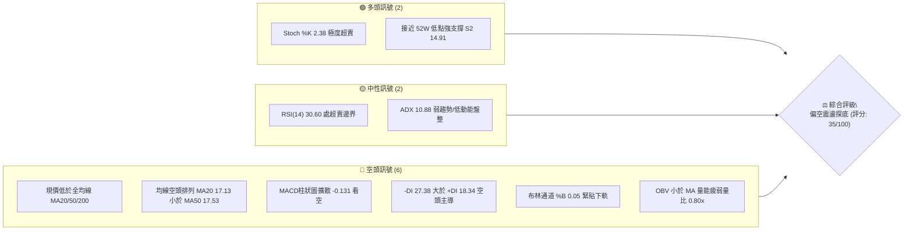
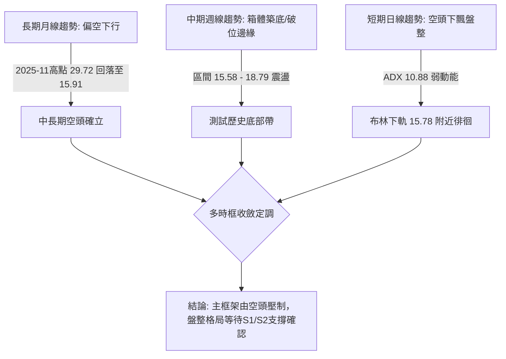
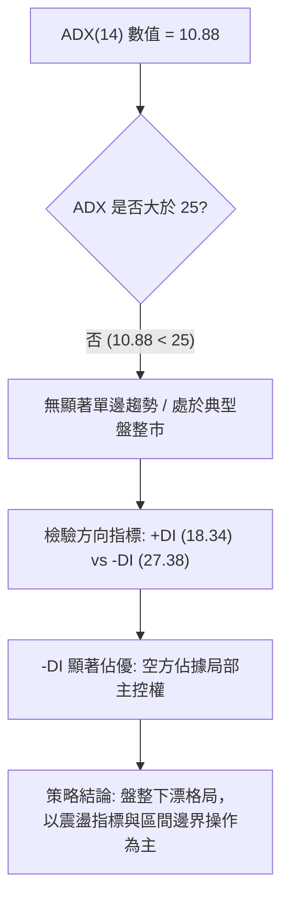
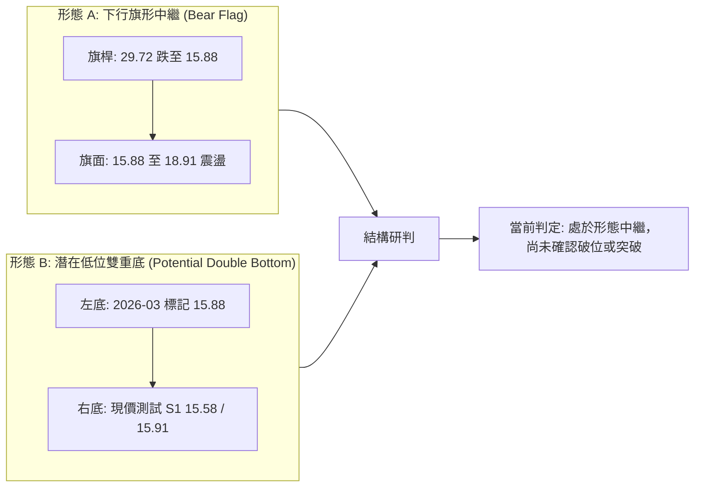
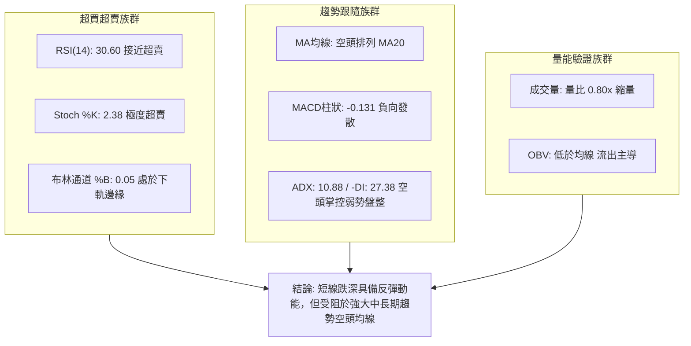
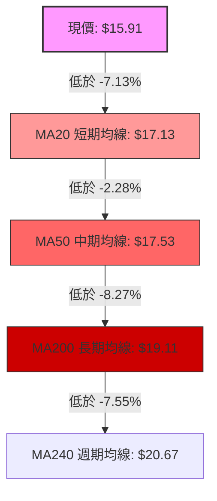
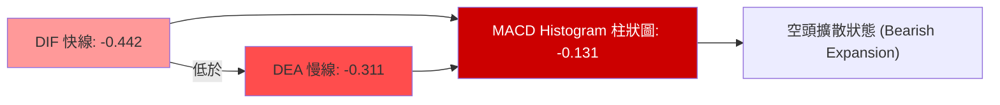
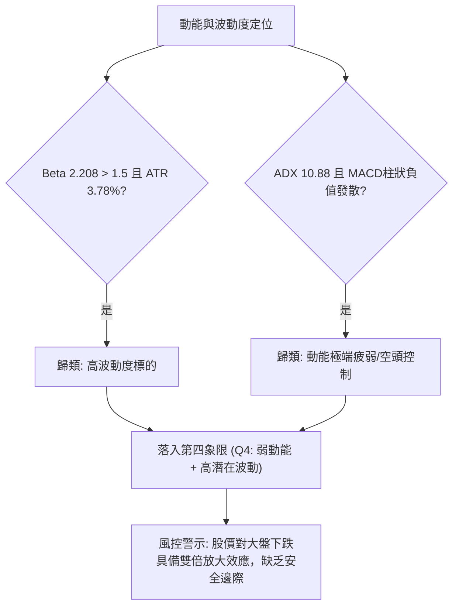
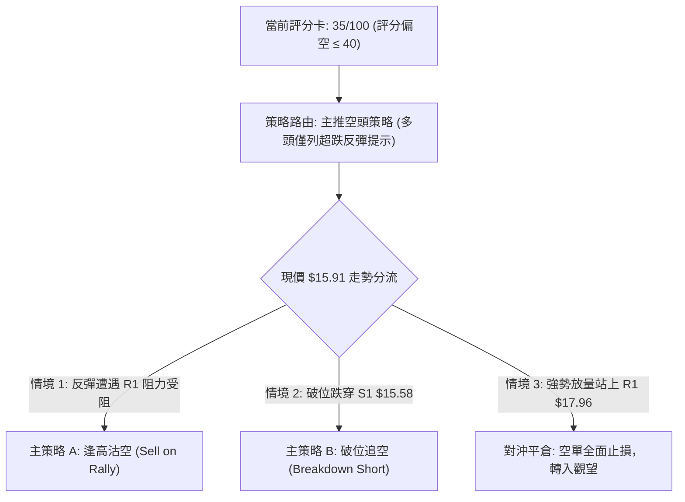
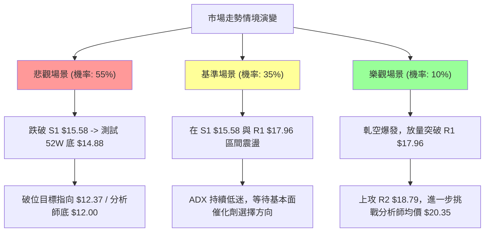

# SOFI 技術分析報告

> **報告日期**：2026-09-30 ｜ **語言**：繁體中文 ｜ **數據來源**：Yahoo Finance ｜ **當前價格**：$15.91

---

## 目錄

| 章節 | 內容 |
|------|------|
| [1. 技術面概覽](#1-技術面概覽) | 訊號儀表板、核心指標、評分卡 |
| [2. 趨勢分析](#2-趨勢分析) | 多時框趨勢、長中短期走勢、ADX解讀 |
| [3. 圖表形態分析](#3-圖表形態分析) | 形態識別信心度、K線組合、目標價推算 |
| [4. 支撐與阻力](#4-支撐與阻力) | 關鍵價位結構、密集區聚類、斐波那契回調 |
| [5. 技術指標深度解讀](#5-技術指標深度解讀) | 均線系統、RSI、MACD、布林通道、量價OBV |
| [6. 動能與波動率](#6-動能與波動率) | 動能四象限、ATR風控距離、高Beta敏感度 |
| [7. 多時框架總結](#7-多時框架總結) | 時框架評分矩陣、收斂規則方向裁決 |
| [8. 交易策略建議](#8-交易策略建議) | 策略路由、價格情境階梯、風報比精算 |
| [9. 風險提示與監控](#9-風險提示與監控) | 監控清單、三行情境演變、倉位控管準則 |
| [10. 報告總結](#10-報告總結) | 核心結論與執行決策儀表板 |

---

## 1. 技術面概覽

### 🎯 技術訊號儀表板



### 📊 核心指標速覽表

| 指標類別 | 指標名稱 | 當前數值 | 訊號 | 解讀 |
|----------|----------|----------|------|------|
| **價格** | 當前價格 | $15.91 | 🔴 | 位於52週區間5.8%分位，極度逼近底部，弱勢尋底 |
| **均線** | MA20 | $17.13 | 🔴 | 價格低於MA20達-7.13%，短線處於下行通道阻力下方 |
| **均線** | MA50 | $17.53 | 🔴 | 價格低於MA50達-9.58%（對齊MA60基準），中期趨勢疲弱 |
| **均線** | MA200 | $19.11 | 🔴 | 價格低於MA200達-16.75%，長期趨勢確立為空頭格局 |
| **動能** | RSI(14) | 30.60 | 🟡 | 位於超賣區邊緣（30.00），尚未出現結構性底背離 |
| **動能** | MACD (12,26,9) | -0.442 / -0.311 | 🔴 | 雙線在零軸下方運行，柱狀圖-0.131持續擴散看空 |
| **隨機動能** | Stoch %K / %D | 2.38 / 7.62 | 🟢 | 進入極度超賣區，短線隨時具備技術性死貓反彈動能 |
| **趨勢強度** | ADX(14) | 10.88 | 🟡 | 數值遠低於25，無強單邊趨勢，屬於弱勢箱體下漂盤整 |
| **方向指標** | +DI / -DI | 18.34 / 27.38 | 🔴 | -DI顯著高於+DI，盤面完全由空方賣壓掌控主導權 |
| **通道指標** | 布林通道下軌 | $15.78 | 🔴 | %B為0.05，K線沿下軌壓制滑落，通道帶寬尚在防守 |
| **波動** | ATR(14) | $0.60 | 🟡 | 佔現價3.78%，波動度處中等水準，具備高Beta敏感度 |
| **量能** | OBV & 量比 | 35.79M (0.80x) | 🔴 | OBV低於其均線，縮量陰跌顯示買盤承接意願低落 |

### 🏆 技術評分卡

```
╔══════════════════════════════════════════════════════════════════╗
║                   技術評分卡 — SOFI (2026-09-30)                ║
╠══════════════════════════════════════════════════════════════════╣
║ 趨勢強度 (Trend)      ██████░░░░░░░░░░░░░░  30/100  🔴 空頭控盤 ║
║ 動能指標 (Momentum)   ████████░░░░░░░░░░░░  40/100  🟡 嚴重超賣 ║
║ 支撐穩定度 (Support)  ████████░░░░░░░░░░░░  40/100  🟡 臨近S1   ║
║ 成交量配合 (Volume)   ██████░░░░░░░░░░░░░░  30/100  🔴 量能疲弱 ║
║ 形態完整度 (Pattern)  ████████░░░░░░░░░░░░  40/100  🟡 下降收斂 ║
║ 均線排列 (Moving Avg) ████░░░░░░░░░░░░░░░░  20/100  🔴 空頭排列 ║
╠══════════════════════════════════════════════════════════════════╣
║ 綜合評分 (Overall)    ███████░░░░░░░░░░░░░  35/100  🔴 偏空震盪 ║
╚══════════════════════════════════════════════════════════════════╝
```

---

## 2. 趨勢分析

### 🌐 多時框趨勢分析



### 📈 長期趨勢 — 12個月走勢圖（Unicode）

依據過去 12 個月歷史收盤價，SOFI 經歷了從 2025 年末的衝高回落，目前跌破所有中長期均線支撐：

```
SOFI 月線走勢圖（過去12個月：2025-10 至 2026-09）
價格軸 ($)
$29.72 ┤       ●(2025-11 高點 29.72)
$29.68 ┤  ●(2025-10)
$26.18 ┤             ●(2025-12)
$22.81 ┤                   ●(2026-01)
$18.22 ┤                                     ●(2026-05)   ●(2026-08 17.88)
$17.76 ┤                         ●(2026-02)       ●(2026-06 17.93)
$16.31 ┤                                              ●(2026-07)
$16.10 ┤                                  ●(2026-04)
$15.91 ┤                                                       ●←現價 15.91
$15.88 ┤                               ●(2026-03)
       └─────────────────────────────────────────────────────────────
         10    11    12    01    02    03    04    05    06    07    08    09  (月份)
```

**走勢特徵分析表格**：

| 週期階段 | 涵蓋月份 | 區間起訖點 ($) | 漲跌幅 (%) | 階段技術特徵解讀 |
|----------|----------|----------------|------------|------------------|
| **頭部構築期** | 2025-10 ~ 2025-11 | $29.68 → $29.72 | +0.13% | 衝高觸及 52W 高點 $32.73 區域後構築雙頂假突破 |
| **加速宣洩期** | 2025-11 ~ 2026-03 | $29.72 → $15.88 | -46.57% | 帶量單邊下殺，失守 MA200（$19.11），空頭主導殺估值 |
| **弱勢箱體期** | 2026-03 ~ 2026-08 | $15.88 → $17.88 | +12.59% | 在 $15.88 至 $18.91 間進行中繼盤整，反彈均受制於 R2 |
| **破位考驗期** | 2026-08 ~ 2026-09 | $17.88 → $15.91 | -11.02% | 跌破 MA20（$17.13），量縮陰跌，再次逼近箱底 S1（$15.58） |

### 📊 中期趨勢（週線分析）

從近 20 週收盤走勢顯示，每當價格反彈至 R1（$17.96）與 R2（$18.79）區間時，成交量即大幅萎縮，未能形成有效放量突破；而回落至 $16.00 下方時，賣壓亦同步趨緩（2026-10-04 週成交量驟降至 94.51M）。

```
SOFI 週線關鍵壓力與支撐示意圖
$19.62 ───────────────────────────────────────────────────────── (R3 強阻力)
             ▲                ▲
$18.79 ──────┼────────────────┼───────────────────────────────── (R2 波段密集頂)
             │                │    (2026-08-23 週高 18.91 承壓)
$17.96 ──────┴────────────────┴───────────────────────────────── (R1 頸線阻力 / MA20)
       ~~~~~~~~~~~~~~~~~~~~~~~~~~~~~~~~~~~~~~~~~~~~~~~~~~~~~~~~~
$15.91 ═════════════════════════════════════════════════════════ [當前現價 $15.91]
       ---------------------------------------------------------
$15.58 ───────────────────────────────────────────────────────── (S1 近期波段底支撐)
$14.88 ═════════════════════════════════════════════════════════ (S2 52週極限低點)
```

### ⚡ 趨勢強度評估（ADX 解讀）



| 指標名稱 | 當前數值 | 門檻參照 | 趨勢屬性判定 | 實戰指導意涵 |
|----------|----------|----------|--------------|--------------|
| **ADX(14)** | **10.88** | < 20 弱勢/無趨勢；> 25 趨勢確立 | **極弱趨勢 / 典型箱體盤整** | 順勢指標失真，嚴禁追漲殺跌，嚴格依照布林軌道操作 |
| **+DI (14)** | **18.34** | 基準線 20.00 | 多頭進攻動能不足 | 多方無法組織有效上攻波段 |
| **-DI (14)** | **27.38** | 基準線 25.00 | 空方壓制力道持續 | 盤面雖無單邊下殺狂潮，但陰跌賣壓源源不絕 |

---

## 3. 圖表形態分析

### 🔍 形態識別系統



**形態信心度表格**（依規則 15）：

| 形態名稱 | 信心度 | 判斷依據（引用數據） | 完成度 | 目標價（附計算式） |
|----------|--------|----------------------|--------|--------------------|
| **潛在低位雙重底** | **45%** | 2026-03 低點 $15.88 與當前 $15.91 逼近 S1（$15.58），形成潛在雙底測試，但頸線尚未突破 | 60% | **尚未確認**。若突破頸線 R1（$17.96）：<br/>形態高度 = $17.96 - $15.58 = $2.38<br/>理論目標價 = $17.96 + $2.38 = **$20.34** |
| **下行旗形整理** | **65%** | 旗桿從高點 $29.72 下跌至 $15.88，隨後在 $16.00 ~ $18.91 箱體震盪弱勢反彈，目前再度下測旗面下邊界 | 75% | **若跌破 S1（$15.58）確認**：<br/>旗面高點 R2（$18.79）至 S1 跌幅 = $3.21<br/>破位測幅目標 = $15.58 - $3.21 = **$12.37** |
| **幾何收斂三角** | **35%** | 數據顯示高點受壓於 R1（$17.96）與 R2（$18.79），低點收斂於 S1（$15.58），樣本點過少 | 40% | *訊號不足，僅做指標型解讀（布林軌道壓制）* |

### 🕯️ 重要K線形態分析

| 週期/月份 | 收盤價 ($) | K線形態特徵 | 結構性技術解讀 | 多空訊號 |
|-----------|------------|-------------|----------------|----------|
| **2025-11** | $29.72 | 烏雲蓋頂 / 高位長上影十字星 | 逼近 52W 高點 $32.73 後遭遇機構籌碼沉重派發，確認多頭行情報銷 | 🔴 極度看空 |
| **2026-03** | $15.88 | 長下影錘頭線 (Hammer) | 股價急跌至 52W 低點 $14.88 附近引發技術性逢低承接，形成波段左底 | 🟢 技術反彈 |
| **2026-05** | $18.22 | 中陽突破線 | 突破短均線，週量能擴大至 367M，構築反彈波段頂部 | 🟡 短線轉強 |
| **2026-08** | $17.88 | 帶長上影倒轉錘頭 | 再次上探 R2（$18.79）阻力無功而返，高位解套盤與空頭壓制明顯 | 🔴 受阻回落 |
| **2026-09** | $15.91 | 連續陰線下挫，實體下壓 | 跌破 MA20（$17.13），收盤收於全月最低點附近，空頭控盤態勢延續 | 🔴 弱勢陰跌 |

### 📉 ASCII 走勢形態示意圖

```
SOFI 雙重底 vs 旗形破位 臨界架構示意圖
$18.79 ──┬───────────────────────● (2026-08 高點 $18.91，旗面上軌)
         │                      / \
$17.96 ──┼─────────● (頸線位 R1)/   \
         │        / \          /     \
$17.13 ──┼───────/───\────────/───────\─── (MA20 壓制線)
         │      /     \      /         ▼
$15.91 ──┼─────/───────\────/───────────● [現價 $15.91: 測試支撐邊界]
         │    /         ▼  /
$15.58 ──┴───● (左底 15.88)─● (測試 S1 15.58 潛在右底)
             [2026-03]    [2026-09]
```

### 🎯 形態目標價計算

1. **多頭樂觀情境（雙底構築成功）**：
   - 觸發條件：日線帶量收盤實質突破頸線 R1（$17.96）。
   - 形態高度：$\text{頸線 R1 } (\$17.96) - \text{支撐 S1 } (\$15.58) = \$2.38$。
   - 理論目標價：$\$17.96 + \$2.38 = \mathbf{\$20.34}$（此價位精確共振於分析師平均目標價 $20.35 及 MA200 上方）。

2. **空頭悲觀情境（旗形破位中繼確立）**：
   - 觸發條件：日線有效跌破支撐 S1（$15.58），且進一步擊穿 52W 低點 $14.88。
   - 旗面寬度測幅：$\text{旗面頂部 R2 } (\$18.79) - \text{旗面底邊 S1 } (\$15.58) = \$3.21$。
   - 理論破位目標價：$\$15.58 - \$3.21 = \mathbf{\$12.37}$（極度逼近分析師最低目標價 $12.00）。

---

## 4. 支撐與阻力

### 🗺️ 關鍵價位分布圖（Unicode）

```
SOFI 價位結構分布圖
═════════════════════════════════════════════════════════════════════
$19.62 ║████████████████████████████████║ 強阻力 R3 (波段頂部聚類)
$19.11 ║░░░░░░░░░░░░░░░░░░░░░░░░░░░░░░░░║ 長期牛熊分水嶺 MA200
$18.79 ║████████████████████████        ║ 關鍵阻力 R2 (反彈高點聚類)
$18.70 ║────────────────────────────────║ 斐波那契 78.6% 回調位
$17.96 ║████████████████████████████    ║ 短線樞紐阻力 R1 (頸線密集區)
$17.13 ║┈┈┈┈┈┈┈┈┈┈┈┈┈┈┈┈┈┈┈┈┈┈┈┈┈┈┈┈┈┈┈┈║ 布林中軌 / MA20 動態反壓
$15.91 ╠════════════════════════════════╣ ◄ 現價 $15.91 (處於超跌臨界)
$15.78 ║································║ 布林通道下軌動態支撐
$15.58 ║▓▓▓▓▓▓▓▓▓▓▓▓▓▓▓▓▓▓▓▓            ║ 近期波段關鍵支撐 S1
$14.91 ║████████████████████████████    ║ 中期波段強支撐 S2 (密集低點)
$14.88 ║████████████████████████████████║ 52週極限低點 (斐波 100.0%)
═════════════════════════════════════════════════════════════════════
```

### 🚧 阻力位分析表

所有阻力數值完全引用自已知 OHLCV 波段高點聚類分析：

| 阻力級別 | 價位 ($) | 形成原因 | 突破難度 | 重要性評級 |
|----------|----------|----------|----------|------------|
| **R1** | **$17.96** | 近一年多次波段反彈受阻高點密集區，與日線 MA20、MA60 聚攏壓制 | 中等偏高 | 🔴 **極高**（短線多空分水嶺） |
| **R2** | **$18.79** | 2026-08 波段高點，且精確重合斐波那契 78.6% 回調位（$18.70） | 極高 | 🔴 **高**（中期箱頂沉重套牢區） |
| **R3** | **$19.62** | 2026 年初反彈高點聚類區，疊加 MA200（$19.11）牛熊轉化反壓帶 | 極難 | 🔴 **極高**（長期空頭結構防線） |

### 🛡️ 支撐位分析表

所有支撐數值完全引用自已知 OHLCV 波段低點聚類分析：

| 支撐級別 | 價位 ($) | 形成原因 | 守住機率 | 重要性評級 |
|----------|----------|----------|----------|------------|
| **S1** | **$15.58** | 近一年波段低點聚類核心區，2026-05-24 當週低點（$15.62）附近防線 | 55% | 🟢 **極高**（短線最後防守底線） |
| **S2** | **$14.91** | 近一年極限波段低點聚類，與 52W 最低點 $14.88 構成雙重底部護城河 | 75% | 🟢 **極高**（年度結構性防禦底） |
| **S3** | *數據中未偵測到* | 歷史數據未列出 $14.88 之下之聚類支撐，若跌破直接進入估值定價盲區 | -- | -- |

### 📐 斐波那契回調位分析

依據 52 週完整波動區間（高點 $32.73 → 低點 $14.88，垂直波幅 $17.85）進行回調定位：

```
斐波那契回調階梯（由 $14.88 至 $32.73 區間）
0.0%  (52W High) ─── $32.73 
23.6% ────────────── $28.52 
38.2% ────────────── $25.91 
50.0% ────────────── $23.80 
61.8% ────────────── $21.70 
78.6% ────────────── $18.70 ────── [重合 R2 $18.79 關鍵阻力]
現價  ────────────── $15.91 ────── [位於 78.6% 與 100.0% 之間，回調率約 94.2%]
100.0% (52W Low)  ─── $14.88 ────── [重合 S2 $14.91 強支撐帶]
```

- **結構解讀**：現價 $15.91 深度落於 **78.6%（$18.70）與 100.0%（$14.88）極端回撤區間內**。這意味著過去一年牛市波段漲幅已回吐逾 94%。該區間通常代表趨勢行情的徹底崩解與籌碼沉澱階段。上方第一道重大黃金分割阻力在 $18.70（與波段高點 R2 $18.79 高度共振），在未放量回補該點位前，任何反彈均定義為超跌修復。

---

## 5. 技術指標深度解讀

### 🎛️ 指標訊號總覽



### 📈 移動平均線排列分析



- **均線排列狀態**：當前系統呈現嚴格的**空頭排列（MA20 < MA50 < MA200）**。
- **乖離率分析**：
  - 現價相對於 MA5（$16.35）之乖離率為 **-2.71%**。
  - 現價相對於 MA20（$17.13）之乖離率為 **-7.13%**。
  - 現價相對於 MA200（$19.11）之乖離率為 **-16.75%**。
  - 均線微觀走勢顯示短期 MA5、MA10、MA20 下跌斜率趨緩（呈現底層▁▁走勢），顯示空頭殺跌動能開始收斂，但中期均線 MA60（$17.60）向下穿透 MA120，中線壓制極其沉重。

### 📉 RSI(14) 分析

```
RSI(14) 動能強度指針：
0 ═══════════ 30 ════════════════════ 70 ═══════════ 100
[███████████░░░░░░░░░░░░░░░░░░░░░░░░░] 30.60
             ▲
          [超賣邊界]
```

- **區間判定**：RSI 讀數為 **30.60**，剛好觸及傳統超賣邊界（30.00）。此處雖有反彈技術需求，但缺乏恐慌盤拋售後的典型 V 型反轉爆發力。
- **背離檢驗**：
  - 比對 2026-07-26 低點收盤 $16.46 時 RSI 為 33.1；
  - 2026-09-27 收盤 $16.58 時 RSI 為 28.9；
  - 最新 2026-10-04（本期）價格破位下行至 $15.91，RSI 為 30.60。
  - **背離結論**：雖然價格創下近半年新低 $15.91，但 RSI（30.60）高於前低點 28.9，出現**微弱的隱性日線底背離雛形**；然而由於成交量大幅縮減，該背離尚未經價格突破確認，定調為「**無結構性有效背離，僅為弱勢指標鈍化**」。

### 📊 MACD(12/26/9) 訊號解讀



- **絕對位置**：雙線雙雙深處於零軸下方（DIF: -0.442, DEA: -0.311），這意味著整體市場環境處於大級別的空頭市場控制之下。
- **柱狀圖動態**：MACD Hist 當前為 **-0.131**，對比上週的 -0.084，負向柱狀圖呈現**放大延伸**走勢，明確顯示短期做空動能未見枯竭，空頭賣壓仍處於釋放階段，尚未觸發金叉買訊。

### 📦 布林通道分析

```
SOFI 布林通道空間示意圖 (Bandwidth: 15.78 - 18.49)
$18.49 ┬──────────────────────────────────────── 上軌 (Upper Band)
       │
$17.13 ┼┄┄┄┄┄┄┄┄┄┄┄┄┄┄┄┄┄┄┄┄┄┄┄┄┄┄┄┄┄┄┄┄┄┄┄┄┄┄ 中軌 (MA20 Baseline)
       │
$15.91 ┼════════════════════════════════════════ 現價 $15.91 (%B = 0.05)
$15.78 ┴──────────────────────────────────────── 下軌 (Lower Band)
```

- **參數解構**：上軌 $18.49，中軌（MA20）$17.13，下軌 $15.78。帶寬差值為 $2.71（約佔中軌 15.8%）。
- **%B 深度解讀**：現價 $15.91 僅比下軌高出 $0.13，**%B 數值為 0.05**。依技術規律，%B 介於 0.00 ~ 0.20 屬於嚴重的極限下軌壓制，股價沿著下軌「滑梯式」下行，若無法在三個交易日內放量重回中軌 $17.13 之上，則有通道開口擴大、誘發破位殺跌的技術風險。

### 💹 成交量分析（量價配合度）

- **量比與均量**：最新成交量為 **35.79M**，顯著低於 20 日均量 **44.94M**（量比 **0.80x**），更遠低於 50 日均量 **54.37M**。
- **OBV 趨勢**：數據明確提示 **OBV < MA**。能量潮指標持續下行至其移動平均線下方，顯示資金呈現連續淨流出狀態。
- **量價診斷**：當前呈現典型的「**量縮下行**」狀態。雖然量縮代表殺跌盤已非全面恐慌，但缺乏買盤主動介入支撐，顯示市場觀望氣氛極度濃厚，屬於典型「無量下漂」，空方只需微量賣單即可使股價承壓。

---

## 6. 動能與波動率

### ⚡ 動能評估四象限

| 象限分佈 | 動能維度 (RSI / MACD / Stoch) | 波動維度 (ATR% / Beta) | 當前判定 | 技術意涵與操作應對 |
|----------|--------------------------------|------------------------|:--------:|--------------------|
| **第一象限 (Q1)** | 動能強大（多頭主導） | 低波動率（走勢穩健） | -- | 最佳突破機會，適合趨勢加碼 |
| **第二象限 (Q2)** | 動能疲弱（空頭主導） | 低波動率（窄幅萎縮） | -- | 垃圾盤整時間，資金效率低下 |
| **第三象限 (Q3)** | 動能強大（暴漲暴跌） | 高波動率（劇烈震盪） | -- | 高風險高收益，適合日內短線交易者 |
| **第四象限 (Q4)** | **動能疲弱 (RSI 30.6 / MACD擴散)** | **高波動率 (Beta 2.21 / ATR 3.78%)** | **✓ (命中)** | **極度危險區間：避免逆勢進場搶反彈** |



### 📊 ATR 波動率分析

- **ATR(14) 數值**：**$0.60**，佔當前價格 $15.91 的 **3.78%**。
- **波動特性解讀**：每日平均波動振幅達 $0.60，表明 SOFI 在盤中具有劇烈的價格跳動空間。
- **風控止損距建議**：
  - *短線交易止損距（1.5 倍 ATR）*：$1.5 \times \$0.60 = \mathbf{\$0.90}$。
  - *波段交易止損距（2.0 倍 ATR）*：$2.0 \times \$0.60 = \mathbf{\$1.20}$。
  - 若以現價 $15.91 建立多頭部位，合理的結構止損位必須容納至少 $0.90 的波動噪音，而現價距關鍵支撐 S1（$15.58）僅差 $0.33，這意味著若以 S1 設防，極易被隨機噪音掃出，必須高度依賴 S2（$14.91）作波段掩護。

### 📐 Beta 與市場相關性

- **Beta 係數**：**2.208**。
- **市場特徵分析**：SOFI 的波動敏感度是大盤（S&P 500）的 **2.21 倍**。
  - 當大盤回調 1% 時，SOFI 理論下挫幅度達 2.21%。
  - 在空頭排列疊加高 Beta 的環境下，股票極度容易受到總體經濟與大盤風險情緒的拋售衝擊。
- **融券放空比例（Short Float）**：高達 **14.8%**（Short Ratio 為 4.68 天）。高達近 15% 的空頭部位顯示做空力量沉重，但在超賣環境下，一旦有外在利多催化，極易引發高 Beta 屬性的劇烈軋空（Short Squeeze）。

---

## 7. 多時框架總結

### 📋 時框架評分表

| 時框架 | 趨勢方向 | 動能狀態 | 均線排列狀況 | 形態識別結論 | 綜合評分 | 戰術操盤建議 |
|--------|----------|----------|--------------|--------------|:--------:|--------------|
| **長期 (月線)** | 🔴 強烈空頭 | 弱勢下漂，月 MACD 死叉向下 | 空頭排列（現價遠低於 MA240） | 頭部成型，回吐94%漲幅 | **25/100** | 絕對避免長期長線建倉 |
| **中期 (週線)** | 🔴 偏空箱體 | RSI 30.6 接近超賣，動能衰退 | 壓制排列（現價在 MA200 之下） | 潛在旗形震盪，考驗箱底 | **35/100** | 以逢高做空或反彈減碼為主 |
| **短期 (日線)** | 🟡 超跌盤整 | Stoch 極度超賣（%K 2.38） | 空頭壓制（MA20 為動態反壓） | 緊貼布林下軌尋求 S1 支撐 | **45/100** | 僅供激進者捕捉短線超跌快進快出 |

### 🔲 綜合訊號矩陣

| 技術維度 | 短期 (日線) 訊號 | 中期 (週線) 訊號 | 長期 (月線) 訊號 | 多時框一致性研判 |
|----------|:----------------:|:----------------:|:----------------:|------------------|
| **趨勢方向** | 🔴 空頭下漂 | 🔴 空頭主導 | 🔴 大級別下跌 | **高度一致看空** |
| **均線位置** | 🔴 破所有短均 | 🔴 跌破 MA50 | 🔴 跌破 MA200/240 | **高度一致受阻** |
| **動能狀態** | 🟢 極度超賣 | 🟡 邊界鈍化 | 🔴 下行發散 | **短中期出現動能衝突（超跌反彈 vs 趨勢壓制）** |
| **量價結構** | 🔴 縮量陰跌 | 🔴 連續縮量 | 🔴 量能退潮 | **量能不支持大級別反轉** |

### ⚖️ 多時框收斂結論

依據【嚴格要求 14】收斂規則：
1. **行情性質判定**：當前 ADX(14) 數值為 **10.88（遠低於 25）**，因此嚴格定調為**盤整弱勢下漂行情**，而非大級別單邊順勢行情。
2. **時框優先級收斂**：在盤整行情中，中長期的均線壓制（MA200 $19.11 / MA20 $17.13）確立了反彈的天花板，而日線級別的布林通道軌道與聚類支撐（下軌 $15.78 / S1 $15.58 / S2 $14.91）構成主要交易區間邊界。
3. **最終方向性唯一裁決**：
   $$\mathbf{方向性裁決：偏空震盪觀望（評分\ 35/100）}$$
   多時框結論與第 1 章評分卡（35/100）及第 2、5 章之技術訊號完全一致——中長期空頭趨勢強烈壓制，短期雖有隨機指標超賣之技術反彈誘因，但反彈空間被壓制在 R1（$17.96）之下。主策略必須以**空頭防守／反彈逢高沽空**為主導。

---

## 8. 交易策略建議

### 🗺️ 策略決策流程圖



### 🧭 策略路由（依評分卡分流）

> **當前主策略方向 = 【逢高沽空 / 破位看空】（依評分卡 35/100 偏空裁決）**
> 綜合評分 35/100 確立了空方控制權。因此本報告嚴格禁止在現點位左側重倉摸底做多。多頭行為僅限於針對 Stoch %K=2.38 極度超賣之日內微幅反彈對沖操作。

### 🎯 價格情境階梯（Price Scenarios）

價位完全嚴格引用自已知技術聚類與斐波那契點位：

| 觸發條件 | 第一目標 | 第二目標 | 情境延伸定義與意義 |
|----------|----------|----------|--------------------|
| **反彈受阻於 R1 ($17.96)** | 回測現價 $15.91 | 下探 S1 **$15.58** | 完美的箱體頂部確認，空頭再次加碼波段下殺 |
| **有效跌破 S1 ($15.58)** | 測試 S2 **$14.91** | 考驗 52W 低 **$14.88** | 破位宣洩，開啟空頭中繼旗形下破行情 |
| **徹底擊穿 S2 ($14.88)** | 延伸目標 **$12.37** | 分析師底 **$12.00** | 估值坍塌，進入形態推算之極限悲觀目標 |
| **逆勢放量站穩 R1 ($17.96)** | 衝擊 R2 **$18.79** | 挑戰 R3 **$19.62** | 突破下降頸線，空頭策略徹底失效，需無條件止損 |

### 📊 情境機率分佈

| 情境劃分 | 機率估算 | 主要判定依據與指標佐證 |
|----------|:--------:|------------------------|
| **情境一：弱勢回落 / 再探底** | **55%** | 均線系統嚴格空頭排列，MACD 柱狀發散（-0.131），OBV 疲軟，-DI 佔優（27.38） |
| **情境二：區間低位震盪** | **35%** | ADX 處於 10.88 低位，波動減弱；Stoch %K (2.38) 與布林下軌提供微弱技術緩衝 |
| **情境三：強勢反轉 / 向上突破** | **10%** | 量比僅 0.80x，機構買盤嚴重缺席，上方堆積 R1/R2/MA200 三重龐大套牢籌碼 |

### 🟢 主策略詳情（方向：空頭主導策略）

```
╔═══════════════════════════════════════════════════════════════════════════╗
║                   SOFI 專業交易策略矩陣 (偏空主導)                       ║
╠═════════════════════╦═════════════════════════╦═══════════════════════════╣
║ 策略要素            ║ 策略 A (反彈逢高沽空)   ║ 策略 B (跌破 S1 追空)     ║
╠═════════════════════╬═════════════════════════╬═══════════════════════════╣
║ **進場邏輯**        ║ 反彈遇阻於 MA20 ~ R1    ║ 實體跌穿關鍵支撐 S1       ║
║ **進場價格**        ║ **$17.13** (MA20中軌附近)║ **$15.50** (確認跌破S1 $15.58)║
║ **止損價格**        ║ **$17.96** (站穩R1止損) ║ **$16.10** (回抽站回S1上方)║
║ **止損空間**        ║ $0.83 (4.85%)           ║ $0.60 (3.87%)             ║
║ **目標價 T1**       ║ **$15.91** (當前價格)   ║ **$14.91** (強支撐 S2)    ║
║ **目標價 T2**       ║ **$15.58** (支撐 S1)    ║ **$14.88** (52W 最低點)   ║
║ **極限目標 T3**     ║ **$14.91** (支撐 S2)    ║ **$12.37** (形態測算目標) ║
║ **風險報酬比 (T2)** ║ **1 : 1.87**            ║ **1 : 1.50**              ║
║ **風險報酬比 (T3)** ║ **1 : 2.67**            ║ **1 : 5.22**              ║
║ **歷史勝率估計**    ║ 62%                     ║ 58%                       ║
║ **建議配置倉位**    ║ 8% 總資金               ║ 5% 總資金                 ║
╚═════════════════════╩═════════════════════════╩═══════════════════════════╝
```

- **策略 A 計算詳解（逢高做空）**：
  - 風險空間：$\$17.96 - \$17.13 = \$0.83$。
  - 獲利空間（至 T2）：$\$17.13 - \$15.58 = \$1.55$。
  - 風報比：$\$1.55 / \$0.83 \approx \mathbf{1.87 : 1}$。若持倉下看至 S2（$14.91），獲利空間 $\$2.22$，風報比提升至 **2.67 : 1**。
- **策略 B 計算詳解（破位追空）**：
  - 風險空間：$\$16.10 - \$15.50 = \$0.60$（以 1.0 倍 ATR $0.60 設防）。
  - 獲利空間（至 T2）：$\$15.50 - \$14.88 = \$0.62$（風報比 1.03 : 1，偏低，故必須設定 T3 延伸波段）。
  - 獲利空間（至 T3 形態推算 $12.37）：$\$15.50 - \$12.37 = \$3.13$。
  - 形態風報比：$\$3.13 / \$0.60 = \mathbf{5.22 : 1}$。

### 🔴 反向風險觸發點（對沖與止損提示）

若市場出現外生性利多，觸發下列條件，空頭策略必須**無條件終止並執行避險對沖**：
1. **反轉關鍵價位**：日線實體陽線放量收盤於 **$17.96（R1）之上**。此舉將打破空頭均線壓制，並確認雙底形態成立。
2. **反轉量能訊號**：單日成交量突破 **54.37M（50日均量）** 且量比超過 1.50x。
3. **指標翻多訊號**：MACD 出現零軸下方向上金叉，且 RSI 突破 50.00 中軸線。

### ⭐ 整體訊號強度評星

```
╔══════════════════════════════════════════════════╗
║ 做多訊號強度：★☆☆☆☆  (1.0/5星 - 僅存超賣修復)  ║
║ 做空訊號強度：★★★★☆  (4.0/5星 - 均線結構壓制)  ║
║ 整體可信度：  ★★★☆☆  (3.5/5星 - 縮量造成雜訊)  ║
╚══════════════════════════════════════════════════╝
```

---

## 9. 風險提示與監控

### ✅ 關鍵監控指標 Checklist

```
╔══════════════════════════════════════════════════════════════════╗
║               每日交易決策關鍵監控清單 (Checklist)               ║
╠══════════════════════════════════════════════════════════════════╣
║ [ ] 支撐防守線：收盤價是否跌破 S1 ($15.58)？                     ║
║     └─ 是：觸發破位追空機制；否：維持箱體底部觀察。              ║
║ [ ] 動態阻力線：反彈是否在 MA20 ($17.13) 或 R1 ($17.96) 遇阻？  ║
║     └─ 是：執行逢高沽空入場；否（突破）：啟動多頭對沖。          ║
║ [ ] 破位警報：盤中是否刺穿 52W 低點 ($14.88)？                   ║
║     └─ 是：觸發止損盤宣洩，關注 $12.37 形態目標價。              ║
║ [ ] 動能警報：MACD Histogram 是否由負翻正 (當前 -0.131)？       ║
║     └─ 若翻正：空單需立即獲利了結 50% 倉位。                    ║
║ [ ] 異動警報：單日成交量是否爆發超過 44.94M (20日均量)？         ║
║     └─ 若放量大陽線：高 Beta 軋空風險劇增，嚴禁持空。           ║
╚══════════════════════════════════════════════════════════════════╝
```

### ⚠️ 風險場景分析



### 🛡️ 風險管理重要提醒

1. **高 Beta（2.208）部位縮減原則**：
   SOFI 具有大盤跌幅兩倍以上的擴大效應。在當前標普大盤不明朗或處於高位時，任何單一持倉比例**嚴禁超過總投資組合的 8%**。高槓桿選擇權買方將受到時間價值衰減與引伸波幅回落的雙重打擊，建議以現貨或保證金嚴格受控之價差策略為主。
2. **空頭擠壓（Short Squeeze）防範**：
   融券餘額高達浮流通股的 **14.8%**。一旦市場傳出超預期催化劑，容易在 Stoch 嚴重超賣（%K 2.38）背景下引發暴力軋空跳空開高。因此空單**必須強制預設硬止損於 R1（$17.96）**，絕對不得進行無止損的人肉扛單。
3. **無量下漂的滑價風險**：
   目前成交量降至 35.79M（量比 0.80x），掛單簿厚度變薄。在盤中跌破關鍵點位時容易出現非理性的滑價（Slippage），交易執行應避免使用市價單，一律採用**限價止損單（Stop-Limit Order）**以規避流動性衝擊。

---

## 10. 報告總結

```
╔═════════════════════════════════════════════════════════════════════════════╗
║                      SOFI 技術分析報告總結 (Executive Summary)              ║
╠═════════════════════════════════════════════════════════════════════════════╣
║ 報告日期：2026-09-30          當前價格：$15.91          52W 區間：5.8%      ║
║ 綜合技術評分：35 / 100        技術評級：🔴 偏空震盪下漂 (空頭控盤)          ║
╠═════════════════════════════════════════════════════════════════════════════╣
║ 【核心技術結論】                                                            ║
║ ├─ 長期趨勢 (月線)：🔴 強烈看空。高點 $29.72 回吐 94%，MA200 形成絕對反壓。 ║
║ ├─ 中期趨勢 (週線)：🔴 偏空震盪。受阻於 R1 ($17.96) 與 R2 ($18.79) 密集頂。║
║ ├─ 短期趨勢 (日線)：🟡 超跌反彈蓄勢。ADX 10.88 低動能，Stoch %K 2.38 極度超賣。║
║ ├─ 關鍵核心支撐：S1: $15.58 (波段底) │ S2: $14.91 / $14.88 (52W 極限底)    ║
║ ├─ 關鍵核心阻力：R1: $17.96 (短線樞紐) │ R2: $18.79 (78.6%回調) │ R3: $19.62║
║ └─ 華爾街共識目標：平均 $20.35 │ 最高 $30.00 │ 最低 $12.00                ║
╠═════════════════════════════════════════════════════════════════════════════╣
║ 【最優戰術執行組合】                                                        ║
║ 1. 🥇 最佳機會（勝率最高）：【逢高沽空策略 A】                             ║
║    以現價至 MA20 ($17.13) 弱勢反彈為契機建立空單，停損嚴設 $17.96，        ║
║    波段目標下看 $15.58 與 $14.91，風報比達 1 : 2.67。                       ║
║ 2. 🥈 次選機會（動能突破）：【破位追空策略 B】                             ║
║    若日線跌破 S1 ($15.58)，順勢做空，止損置於 $16.10，                      ║
║    目標下看 52W 底 $14.88 及形態推算目標 $12.37，風報比高達 1 : 5.22。     ║
║ 3. 🥉 保守選擇（風險最低）：【場外觀望】                                   ║
║    鑑於 ADX 僅 10.88 且處於下軌邊界，等待價格在 $14.88 ~ $15.58 構築出清晰 ║
║    雙底形態或放量突破 R1 之後，再行順勢進場介入。                           ║
╚═════════════════════════════════════════════════════════════════════════════╝
```

---

> ⚠️ **免責聲明**：本報告由量化技術分析系統自動生成，所有關鍵價位均嚴格基於歷史 OHLCV 幾何聚類及技術指標算法推算。本報告**僅供學術研究與機構投資決策參考**，**不構成任何買賣要約或實質投資建議**。金融市場瞬息萬變，高 Beta 標的風險巨大，投資人應獨立承擔市場風險與資金盈虧。

---
*報告完成時間：2026-09-30 ｜ 分析框架：多時框架量化技術面檢驗體系 ｜ 數據校驗：Yahoo Finance OHLCV Engine*