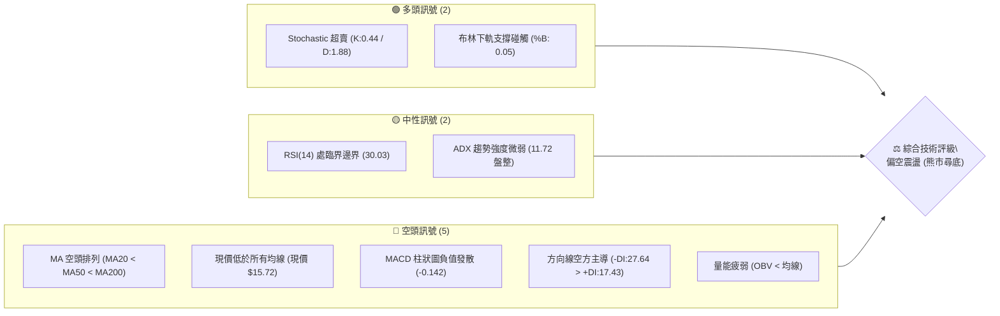
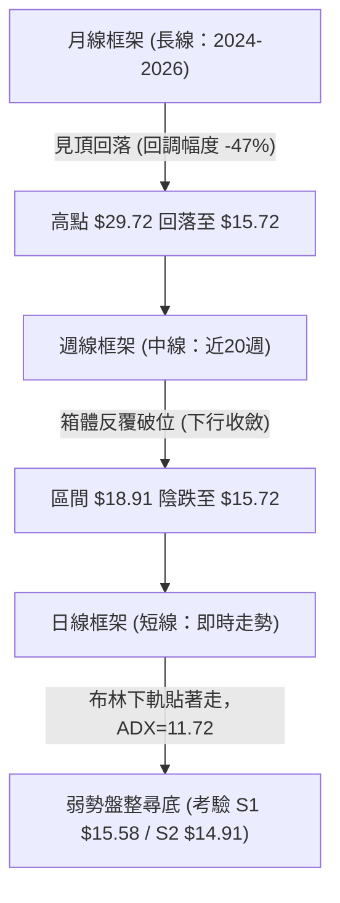
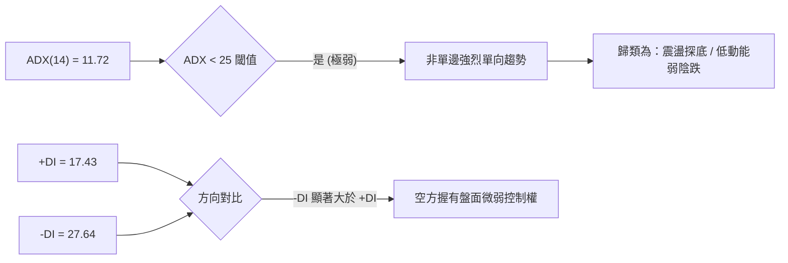
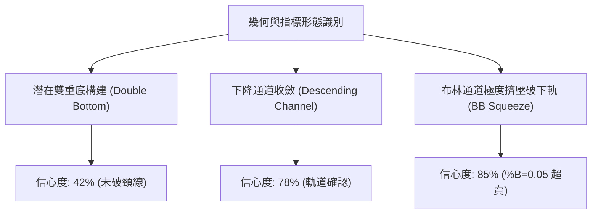
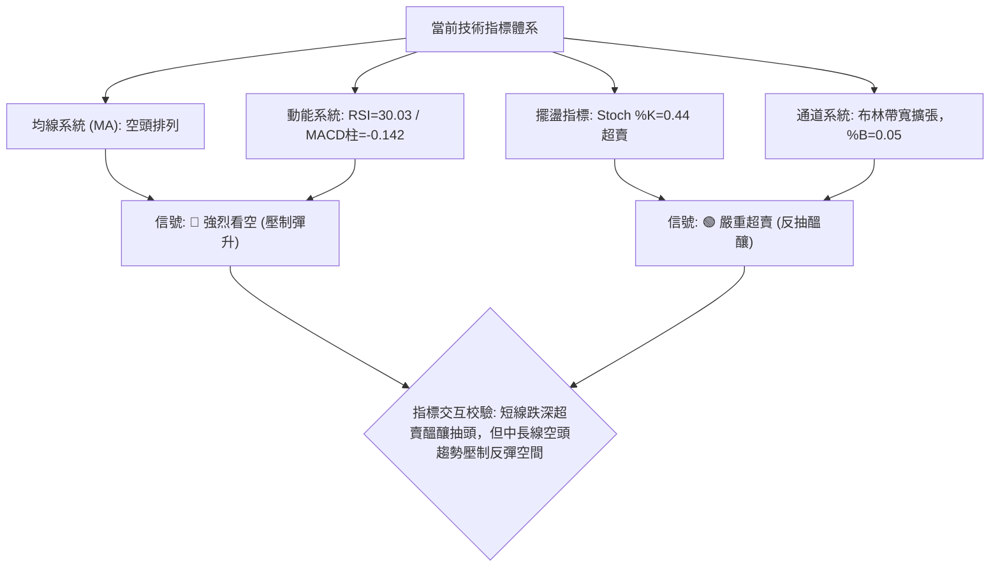
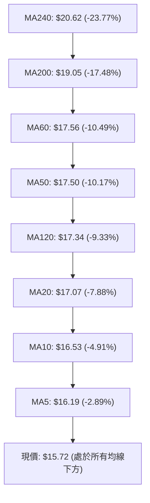
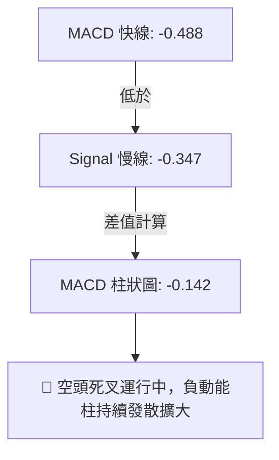
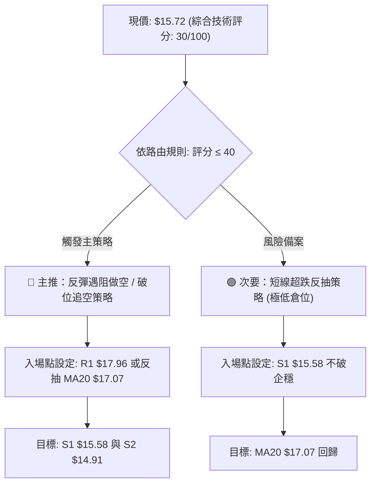
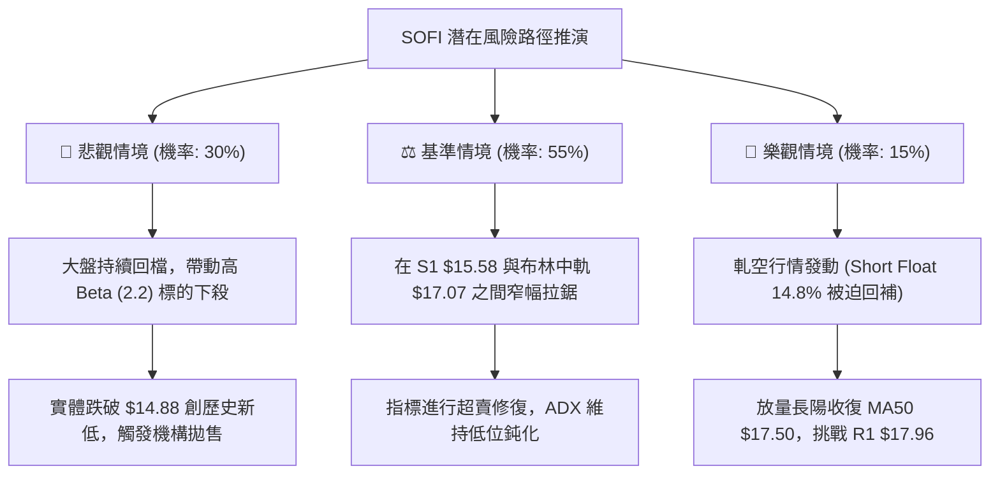

# SOFI 技術分析報告

> **報告日期**：2026-10-01 ｜ **語言**：繁體中文 ｜ **數據來源**：Yahoo Finance ｜ **當前價格**：$15.72

---

## 目錄

| 章節 | 內容 |
|------|------|
| [1. 技術面概覽](#1-技術面概覽) | 訊號儀表板、核心指標、評分卡 |
| [2. 趨勢分析](#2-趨勢分析) | 多時框趨勢、長中短期走勢、ADX強度 |
| [3. 圖表形態分析](#3-圖表形態分析) | 形態識別、K線組合、目標價推算 |
| [4. 支撐與阻力](#4-支撐與阻力) | 關鍵價位結構、斐波那契回調位解讀 |
| [5. 技術指標深度解讀](#5-技術指標深度解讀) | 均線系統、RSI、MACD、布林通道、量價 |
| [6. 動能與波動率](#6-動能與波動率) | 動能四象限、ATR波幅設定、高Beta風險 |
| [7. 多時框架總結](#7-多時框架總結) | 時框矩陣、優先級收斂原則與結論 |
| [8. 交易策略建議](#8-交易策略建議) | 策略路由、多空推演、階梯佈局、風報比 |
| [9. 風險提示與監控](#9-風險提示與監控) | 監控指標Checklist、風險場景、部位控管 |
| [10. 報告總結](#10-報告總結) | 核心技術結論與終極決策卡 |

---

## 1. 技術面概覽

### 🎯 技術訊號儀表板



### 📊 核心指標速覽表

| 指標類別 | 指標名稱 | 當前數值 | 訊號 | 解讀 |
|:---|:---|:---|:---:|:---|
| **價格** | 當前價格 | $15.72 | 🔴 | 位於52週區間4.7%分位，貼近年度歷史低點 |
| **均線** | MA20 | $17.07 | 🔴 | 價格低於MA20達-7.88%，短線下壓沉重 |
| **均線** | MA50 | $17.50 | 🔴 | 中期阻力下彎，與MA20呈空頭死叉排列 |
| **均線** | MA200 | $19.05 | 🔴 | 長期牛熊分界線失守，長期結構轉為空頭 |
| **動能** | RSI(14) | 30.03 | 🟡 | 位於超賣臨界點（30邊界），隨時有技術性抽頭 |
| **動能** | MACD | -0.488 | 🔴 | 快慢線均於零軸下方運行，MACD柱呈-0.142向下擴大 |
| **動能** | KD指標 | K:0.44 D:1.88 | 🟢 | 深度超賣，短線拋壓釋放殆盡，易發動技術反抽 |
| **趨勢** | ADX(14) | 11.72 | 🟡 | ADX < 25 表明為弱趨勢/低動能盤整探底行情 |
| **通道** | 布林通道 | 下軌 $15.57 | 🟢 | %B為0.05，現價緊貼下軌，具均值回歸拉力 |
| **量能** | OBV / 量比 | 量比 0.91x | 🔴 | 20日均量縮減，OBV < MA，缺乏主力增量建倉信號 |
| **波動** | ATR(14) | $0.60 | 🟡 | 佔現價3.83%，屬中等波幅，常規日內震盪充足 |

### 🏆 技術評分卡

```
╔══════════════════════════════════════════════════════════════╗
║              技術評分卡 — SOFI (2026-10-01)                  ║
╠══════════════════════════════════════════════════════════════╣
║ 趨勢強度 (Trend)      ████░░░░░░░░░░░░░░░░  20/100  🔴 極弱空頭 ║
║ 動能指標 (Momentum)   ██████░░░░░░░░░░░░░░  32/100  🔴 空頭控盤 ║
║ 支撐穩定度 (Support)  ██████████░░░░░░░░░░  48/100  🟡 考驗邊界 ║
║ 成交量配合 (Volume)   ██████░░░░░░░░░░░░░░  30/100  🔴 價跌量縮 ║
║ 形態完整度 (Pattern)  ████████░░░░░░░░░░░░  40/100  🟡 築底未竟 ║
║ 均線系統 (MA System)  ██░░░░░░░░░░░░░░░░░░  12/100  🔴 完美空排 ║
╠══════════════════════════════════════════════════════════════╣
║ 綜合技術評分          ██████░░░░░░░░░░░░░░  30/100  🔴 強烈偏空 ║
╚══════════════════════════════════════════════════════════════╝
```

---

## 2. 趨勢分析

### 🌐 多時框趨勢分析



### 📈 長期趨勢 — 12個月走勢圖（Unicode）

以下為 SOFI 過去 12 個月（2025-10 至 2026-09）之月線收盤走勢 ASCII 圖：

```
SOFI 月線走勢圖（2025-10 至 2026-09）
價格軸 ($)
$30.00 ┤ ●(25-10: 29.68)  ●(25-11: 29.72 雙頂高點)
$27.00 ┤                ＼
$26.00 ┤                  ●(25-12: 26.18)
$23.00 ┤                        ＼
$22.00 ┤                          ●(26-01: 22.81)
$18.00 ┤                                ＼        ●(26-05: 18.22)   ●(26-08: 17.88)
$17.00 ┤                                  ●(26-02) ＼             ／  ＼
$16.00 ┤                                      ＼     ●(26-04)   ●(26-06) ●(26-07)
$15.00 ┤                                        ●(26-03: 15.88)                   ●(26-09: 15.72 現價)
       └─────────────────────────────────────────────────────────────────────────────
         25-10   25-11   25-12   26-01   26-02   26-03   26-04   26-05   26-06   26-07   26-08   26-09
```

#### 長期走勢階段特徵分析

| 階段 | 時間跨度 | 價格起訖 | 漲跌幅 | 結構特徵與技術解讀 |
|:---|:---|:---|:---:|:---|
| **牛市頂部構建** | 2025-10 ~ 2025-11 | $29.68 → $29.72 | +0.13% | 構築月線級雙頂形態，高位動能衰竭 |
| **主跌浪殺多** | 2025-11 ~ 2026-03 | $29.72 → $15.88 | -46.57% | 跌破所有中短期均線，呈現無支撐單邊垂直下殺 |
| **弱勢箱體反彈** | 2026-03 ~ 2026-08 | $15.88 → $18.91 (週高) | +19.08% | 於 MA50（$17.50）與 R1（$17.96）受阻，未能扭轉趨勢 |
| **破底二次探底** | 2026-08 ~ 2026-09 | $17.88 → $15.72 | -12.08% | 週線連續陰跌，向 52 週低點 $14.88 靠攏 |

### 📊 中期趨勢（週線分析）

中期走勢圖示近期關鍵結構位置：

```
中期阻力位密集區 ─────────────── R2: $18.79 / 斐波 78.6%: $18.70 (強壓)
中期回抽受阻帶   ─────────────── R1: $17.96 / MA50: $17.50 (反彈阻力)
當前價格水平     ═══════════════ 現價: $15.72
短期防守第一線   ─────────────── S1: $15.58 (近一年低點聚類)
中期終極生命線   ─────────────── S2: $14.91 / 52W Low: $14.88 (不可跌破)
```

從 2026 年 5 月底至 9 月底的近 20 週數據觀察，SOFI 多次上攻 $18.20 ~ $18.91 均遭沉重拋壓壓回。週線 MACD 柱狀圖在 2026-08-09 短暫翻正（+0.181）後快速萎縮，至 2026-09 連續四週呈現負值且擴大（-0.065 → -0.147 → -0.145 → -0.084 → -0.142），週線級別空頭完全掌控局勢。

### ⚡ 趨勢強度評估（ADX 解讀）



#### ADX 趨勢強度標準對照表

| ADX 數值區間 | 當前數值 (11.72) | 行情性質判定 | 操作導向 |
|:---:|:---:|:---|:---|
| **0 ~ 20** | **✔ 命中** | **極弱趨勢 / 盤整尋底 / 無單邊推動力** | **禁止追空或追多；以支撐阻力高出低進或觀望為主** |
| 20 ~ 25 | 未達到 | 趨勢初生期 / 震盪即將選擇突破方向 | 留意帶量突破信號 |
| 25 ~ 50 | 未達到 | 強烈趨勢行情（多頭或空頭主升/主跌） | 順勢交易，回調即上車 |
| 50 ~ 100 | 未達到 | 極端單邊過熱，反轉風險極高 | 尋求獲利了結與背離反轉點 |

---

## 3. 圖表形態分析

### 🔍 形態識別系統



#### 形態信心度與參數推算表

| 形態類別 | 信心度 | 判斷依據（嚴格引用歷史數據） | 形態完成度 | 目標價（附嚴謹幾何計算式） |
|:---|:---:|:---|:---:|:---|
| **潛在雙重底** | 42% | 第一底為 2026-03 收盤價 $15.88；第二底為當前測試 S1 $15.58；頸線為波段高點 R1 $17.96。 | 45% (尚未放量突破頸線) | 若突破頸線 $17.96，形態高度 = $17.96 - $15.58 = $2.38。<br>推算目標價 = $17.96 + $2.38 = **$20.34**（數據中未偵測到此聚類，但極度接近分析師平均目標價 $20.35）。 |
| **下行通道** | 78% | 上軌由 2026-07 高點聚類 $18.78 連接 2026-08 高點 $18.91；下軌連繫 S1 $15.58 與 52W 低點 $14.88。 | 85% (價格運行於通道下軌) | 跌破通道下軌：直接測試 S2 **$14.91**。<br>反彈通道上軌：測試 R1 **$17.96**。 |
| **布林極限擠壓** | 85% | 日線收盤 $15.72 逼近下軌 $15.57，%B 達到 0.05 之超賣極限。 | 95% (即將引發均值回歸) | 均值回歸中軌目標價 = 布林中軌（MA20）**$17.07**。 |

### 🕯️ 重要K線形態分析（近 5 個月收盤演變）

| 月份 | 收盤價 | K線形態 | 解讀 | 訊號 |
|:---:|:---:|:---|:---|:---:|
| **2026-05** | $18.22 | 帶長實體大陽線（月漲 +13.1%） | 自低檔發動超跌反彈，一舉穿破短天期均線 | 🟢 轉強 |
| **2026-06** | $17.93 | 高位十字星/陀螺頂 | 於 R1 $17.96 附近面臨解套反壓，多空僵持 | 🟡 滯漲 |
| **2026-07** | $16.31 | 中陰線下挫（跌破五月起漲點） | 空方重新奪回主導權，反彈動能被實質證偽 | 🔴 轉弱 |
| **2026-08** | $17.88 | 縮量長下影小陽線 | 試圖在 $16.31 水位進行護盤，但量能嚴重萎縮（月量不足） | 🟡 虛弱反抽 |
| **2026-09** | $15.72 | 光腳大陰線（逼近全月最低） | 空方全力打壓，跌破過去 6 個月所有月線收盤底線 | 🔴 極度空頭 |

### 📉 ASCII 走勢形態示意圖

```
SOFI 日線級別下行通道與潛在雙底測試示意圖
價格
$19.00 ┤        [高點 18.91] 
$18.50 ┤          /      ＼   通道上軌阻力線
$18.00 ┤─────────/─────────＼───● [R1: 17.96 頸線水平]
$17.50 ┤        /             ＼ 
$17.00 ┤       /                ＼    ● [MA20: 17.07]
$16.50 ┤      /                   ＼ /
$16.00 ┤  ● [底 1: 15.88]          ＼
$15.50 ┤───＼─────────────────● 現價: 15.72 ─── [S1: 15.58 支撐線]
$15.00 ┤     ＼───────────────────────● [S2: 14.91 / 52W低點: 14.88]
       └─────────────────────────────────────────────────────────────
```

---

## 4. 支撐與阻力

### 🗺️ 關鍵價位分布圖（Unicode）

```
SOFI 價位結構分布圖（嚴格依據 OHLCV 聚類計算）
═══════════════════════════════════════════════════════════════════
$19.62 ║██████████████████████████████║ 強阻力 R3（波段極限超買區）
$18.79 ║████████████████████          ║ 重阻力 R2（斐波 78.6% $18.70 疊合）
$17.96 ║████████████████████████      ║ 關鍵阻力 R1（近半年箱體頂部 / MA60）
$17.07 ║░░░░░░░░░░░░░░░░░░            ║ 動態阻力（布林中軌 / MA20）
$15.72 ╠══════════════════════════════╣ ◄ 現價位置（處於歷史區間底部 4.7%）
$15.58 ║▓▓▓▓▓▓▓▓▓▓▓▓▓▓▓▓▓▓▓▓          ║ 近期關鍵支撐 S1（-0.92%，日線布林下軌）
$14.91 ║██████████████████████████████║ 核心終極防守 S2（-5.15%，52週低點 $14.88 疊合）
═══════════════════════════════════════════════════════════════════
```

### 🚧 阻力位分析表

所有阻力數值完全引用自已知 OHLCV 聚類數據：

| 阻力級別 | 價位 | 形成原因與籌碼特徵 | 突破難度 | 重要性評級 |
|:---|:---:|:---|:---:|:---:|
| **動態阻力** | **$17.07** | 布林通道中軌、20日移動平均線（MA20），短線均線反壓 | 🟡 中等 | ★★★☆☆ |
| **R1 (波段阻力)** | **$17.96** | 過去 12 個月多個次高點與 2026-06/08 反彈頭部重合處，偏離現價 +14.25% | 🔴 極高 | ★★★★☆ |
| **R2 (強阻力)** | **$18.79** | 近一年波段高點密集區，斐波那契 78.6%（$18.70）共振帶，偏離現價 +19.50% | 🔴 堅不可摧 | ★★★★★ |
| **R3 (極限阻力)** | **$19.62** | 突破牛熊線後之延伸高點聚類，偏離現價 +24.79%，套牢盤主力區 | 🔴 極難觸及 | ★★★☆☆ |

### 🛡️ 支撐位分析表

所有支撐數值完全引用自已知 OHLCV 聚類數據：

| 支撐級別 | 價位 | 形成原因與籌碼特徵 | 守住機率 | 重要性評級 |
|:---|:---:|:---|:---:|:---:|
| **S1 (首道防線)** | **$15.58** | 近一年波段低點聚類，緊鄰日線布林通道下軌 $15.57，偏離現價僅 -0.92% | 55% | ★★★★☆ |
| **S2 (終極防線)** | **$14.91** | 近一年波段極限低點聚類，與 52 週最低點 $14.88 構成雙重底防守共振帶（-5.15%） | 75% | ★★★★★ |
| **S3 (深淵防線)** | 數據未偵測 | 系統數據中未偵測到更低層級聚類，若跌破 $14.88 將進入無量深跌盲區 | 20% | ★★★★★ |

### 📐 斐波那契回調位分析

依據 52 週完整波段（低點 $14.88 至 高點 $32.73，落差 $17.85）之精確黃金分割如下：

```
0.0%  (52W High)  $32.73 ──────────────────────────────────────────
23.6%             $28.52 ──────────────────────────────────────────
38.2%             $25.91 ──────────────────────────────────────────
50.0%             $23.80 ────────────────────────────────────────── (中樞分水嶺)
61.8%             $21.70 ────────────────────────────────────────── (黃金分割生命線)
78.6%             $18.70 ────────────────── [緊鄰 R2: $18.79] ───
100.0% (52W Low)  $14.88 ─── [S2: $14.91 疊合] ────────────────────
                  ▲
現價 $15.72 ─────── (落於 78.6% $18.70 與 100.0% $14.88 之極度超跌區間)
```

**斐波那契結構深度解讀**：
1. **現價區間定性**：當前股價 $15.72 正處於 78.6%（$18.70）與 100.0%（$14.88）之間，代表先前的上升浪已經被侵蝕了超過 95% 的漲幅，此為標準的熊市末期或重度回撤特徵。
2. **阻力共振確認**：斐波那契 78.6% 水位 $18.70 與波段阻力 R2（$18.79）高度重合（僅差 $0.09），證明 $18.70 ~ $18.79 是未來多頭反彈最堅固的骨牌型阻力牆。
3. **支撐共振確認**：斐波那契 100% 基準點 $14.88 與聚類支撐 S2（$14.91）僅差 $0.03，說明 $14.88 ~ $14.91 具有最強的歷史物理支撐效應。

---

## 5. 技術指標深度解讀

### 🎛️ 指標訊號總覽



### 📈 移動平均線排列分析



#### 均線數據偏離度與趨勢診斷

| 均線天期 | 當前數值 | 偏離現價幅度 | 斜率走勢 (20日) | 技術含義 |
|:---|:---:|:---:|:---:|:---|
| **MA 5** | $16.19 | -2.89% | 下彎（📉） | 極短線空方主控，每日壓制下挫 |
| **MA 10** | $16.53 | -4.91% | 下彎（📉） | 短線空方防守線，突破方有轉機 |
| **MA 20** | $17.07 | -7.88% | 下彎（📉） | 20日成本全線套牢，反彈第一波大反壓 |
| **MA 50** | $17.50 | -10.17% | 下彎（📉） | 中期生命線破位，確立中級下行波段 |
| **MA 200** | $19.05 | -17.48% | 下彎（📉） | 長期走熊，機構投資者減倉底線 |
| **MA 240** | $20.62 | -23.77% | 下彎（📉） | 年線壓頂，長期沉重籌碼套牢區 |

**均線綜合研判**：當前 MA5 < MA10 < MA20 < MA50 < MA200 呈現教科書級別的「標準發散型空頭排列」，所有天期均線之斜率均呈現負向傾斜，且股價偏離 MA20 達 -7.88%，顯示空頭動能完全主導。

### 📉 RSI(14) 分析

```
RSI(14) 讀數：30.03
[0] ─────────────── [30] ══════════════════════ [70] ─────────────── [100]
                      ▲
                    30.03 (位於超賣線邊界)
進度條：██████░░░░░░░░░░░░░░ 30.03%
```

- **超買超賣判定**：數值 30.03 處於 30 ~ 70 中性區間之下邊界，技術上正踏入「超賣區」門檻。
- **背離分析（Divergence）**：
  - **日線背離判定**：檢視 2026-09-27 之收盤價 $16.58（RSI 為 28.9），至 2026-10-01 收盤價跌至 $15.72（新低點），但 RSI 讀數微幅上升至 30.03。此處存在**微型弱底背離雛形**（價格創新低，RSI 未創新低），但因數值變動極小，尚未獲得放量長陽確認，系統認定為「無明顯確定性背離」。
  - **週線背離判定**：週線級別價格由 8 月的 $18.91 跌至 $15.72，RSI 自 59.6 直挫至 30.0，指標與價格同步向下，無任何週線底背離跡象。

### 📊 MACD(12/26/9) 訊號解讀



- **零軸關係**：快線（-0.488）與慢線（-0.347）雙雙沉於零軸（0.00）下方，代表市場處於絕對弱勢之空頭領域。
- **柱狀圖走向**：MACD Histogram 為 -0.142，呈現空頭動能擴散狀態，未見紅柱收窄跡象，說明做空力量尚未耗盡。

### 📦 布林通道分析（Bollinger Bands）

```
布林通道（20, 2）架構示意圖
$18.56 ┤ ══════════════════════════════════════ 上軌 (Upper Band)
       │
$17.07 ┤ -------------------------------------- 中軌 (MA20 Baseline)
       │
$15.72 ┤ ◄ 現價: $15.72 (處於下軌臨界邊界)
$15.57 ┤ ══════════════════════════════════════ 下軌 (Lower Band)
```

- **通道帶寬與位置**：帶寬（Bandwidth）= ($18.56 - $15.57) / $17.07 = 17.51%，通道口呈現向下張開特徵。
- **指標數值**：%B = 0.05（公式：%B = (現價 - 下軌) / (上軌 - 下軌) = ($15.72 - $15.57) / ($18.56 - $15.57) = 0.15 / 2.99 = 0.0501）。
- **解讀**：%B 接近 0.00，代表價格已緊貼布林下軌運行（Walking the Band）。在 ADX 僅為 11.72（非強趨勢）的背景下，貼近下軌往往預示著股價已達常規統計波動的下限，向下空間受抑，向中軌 $17.07 回歸之期望值逐步提升。

### 💹 成交量分析（量價配合度）

```
量能體積比對：
今日成交量:   40,844,400  ██████████████████░░  (40.84M)
20日均量:     44,900,785  ████████████████████  (44.90M, 量比 0.91x)
50日均量:     53,464,262  ███████████████████████ (53.46M)
```

- **量價配合診斷**：
  1. 最新成交量（40.84M）低於 20 日均量（量比 0.91），更顯著低於 50 日均量（53.46M）。當前價格破位下跌並未伴隨恐慌性「爆量」，而是呈現典型的「陰跌量縮」格局。
  2. **OBV（能量潮）分析**：數據顯示 OBV < MA，能量潮曲線持續位於其均線下方運行，證實主力資金未在當前價位大舉建倉，量能疲弱，屬於多方無抵抗下的被動滑落。

---

## 6. 動能與波動率

### ⚡ 動能評估四象限

```
動能與波動率定位矩陣
  強動能 (High Momentum)
        │
   Q3   │   Q1
        │
────────┼──────── (中軸分界)
        │   ● SOFI 當前位置 (Q4: 弱動能 / 中高波動)
   Q2   │   Q4
        │
  弱動能 (Low Momentum)
  ──────┴──────
  低波動      高波動
```

#### 四象限特徵定位表

| 象限標籤 | 動能狀態 | 波動率狀態 | 當前適配性 | 戰略解讀 |
|:---:|:---:|:---:|:---:|:---|
| **Q1 (爆發期)** | 強多頭 | 低/中波動 | 否 | 最佳趨勢波段持有期 |
| **Q2 (沉寂期)** | 弱動能 | 低波動 | 否 | 窄幅盤整，等待方向選擇 |
| **Q3 (過熱期)** | 極強動能 | 極高波動 | 否 | 投機狂熱，準備獲利了結 |
| **Q4 (流血期)** | **極弱動能** | **高波動 (Beta=2.208)** | **✔ 命中** | **做多勝率極低，易受大盤拖累，僅適合嚴格止損的超跌快進快出** |

### 📊 ATR 波動率分析

- **ATR(14) 數值**：**$0.60**
- **價格佔比**：$0.60 / $15.72 = **3.83%**（日均正常常態波動幅度為 3.83%）。
- **止損距離動態設定依據**：
  - **保守型交易（2.0 倍 ATR）**：$0.60 × 2.0 = **$1.20** 波動空間。
  - **激進型交易（1.0 ~ 1.5 倍 ATR）**：$0.60 × 1.0 = **$0.60** 波動空間；$0.60 × 1.5 = **$0.90** 波動空間。
  - **戰術意涵**：任何短線逆勢操作，若止損設置小於 $0.60，極易被日內正常的雜訊洗盤掃出場外；若做空追單，亦需保留 $0.60 以上的反抽容忍度。

### 📐 Beta 與市場相關性

- **Beta 係數**：**2.208**（極高 Beta 屬性）。
- **市場敏感度評估**：
  - SOFI 之波動彈性為標普 500 指數的 2.2 倍以上。在美股大盤走弱時，SOFI 將承受加倍的下行壓力；反之，若大盤發動強勁反彈，SOFI 的技術反抽彈性亦將顯著放大。
  - **空頭部位佔比（Short % Float）**：高達 **14.8%**（Short Ratio: 4.68 天）。高達 1.88 億股之空頭倉位在此，一旦股價回升觸發空頭停損，將隨時轉化為潛在的軋空（Short Squeeze）推動力。

---

## 7. 多時框架總結

### 📋 時框架評分表

| 時框架 | 趨勢方向 | 動能狀態 | 均線排列狀態 | 形態特徵 | 綜合評分 | 操作指導方針 |
|:---|:---:|:---:|:---:|:---|:---:|:---|
| **長期 (月線)** | 🔴 下行熊市 | 弱勢沉澱 | 跌破 MA240 ($20.62) | 雙頂跌破頸線後下尋支撐 | **22/100** | 逢高減碼，中長線不可盲目建倉 |
| **中期 (週線)** | 🔴 震盪破位 | MACD柱連負 | 受制於 MA50 ($17.50) | $18.91 遇阻回跌，下行通道 | **30/100** | 逢反彈至 R1 偏空操作 |
| **短期 (日線)** | 🟡 跌深探底 | 嚴重超賣臨界 | 完美空頭發散 | 貼近布林下軌，$15.58 支撐試驗 | **38/100** | 不宜殺跌，僅限極短線博超反抽 |

### 🔲 綜合訊號矩陣

```
時框共振透視表：
指標維度          長期 (Monthly)      中期 (Weekly)       短期 (Daily)
──────────────────────────────────────────────────────────────────────
均線方向 (MA)        🔴 空頭             🔴 空頭             🔴 空頭
MACD 動能           🔴 零軸下死叉       🔴 負柱持續擴大     🔴 柱狀發散
超買超賣 (RSI/KD)   🟡 中性偏弱         🟡 中性 (30.0)      🟢 深度超賣 (KD<2)
布林通道軌跡        🔴 沿下軌下滑       🔴 跌向通道下半部   🟢 觸及下軌 (0.05)
籌碼與量能          🔴 機構佔比停滯     🔴 成交量萎縮       🟡 量縮無恐慌
──────────────────────────────────────────────────────────────────────
多時框結論          全週期處於大空頭架構，僅短週期出現嚴重技術性超賣共振。
```

### ⚖️ 多時框收斂結論（依規則 14 嚴格收斂）

1. **行情性質仲裁**：
   - 當前 ADX(14) 數值為 **11.72**，嚴格判定為 **「非趨勢性盤整/震盪行情」（ADX < 25）**。
2. **時框主導權分配**：
   - 依據規則，在 ADX < 25 的盤整環境中，市場缺乏單邊趨勢之持續推動力，行情以**日線布林通道上下軌（$15.57 ~ $18.56）**為主要震盪博弈區間。中期週線與均線雖然呈現空頭，但在日線超賣未修復前，下行空間將在 S1/S2 附近遭受強烈抵抗。
3. **唯一方向性結論**：
   - **🔴 偏空震盪（弱勢探底）**。
   - **收斂指導原則**：長中期空頭背景禁止任何中長線「抄底」買入行為；短線因日線 Stochastic（K:0.44/D:1.88）與布林下軌引發之超賣反抽，僅能作為空頭「高位補空/止損減碼」的窗口，或激進投資者在 S1/S2 支撐上方進行極低倉位的超短線反彈博弈。此結論與第 8 章之策略邏輯嚴格保持一致。

---

## 8. 交易策略建議

### 🗺️ 策略決策流程圖



### 🧭 策略路由判定

- **當前綜合技術評分**：**30 / 100**（屬於 ≤ 40 的強烈偏空區間）。
- **當前主策略方向**：**主推空頭波段策略（以高空為主，破位為輔）**。
- **架構原則**：多頭反彈僅作為「短線跌深之逆勢對沖操作」與「逢高放空之進場時機」，嚴禁重倉抄底。

### 🎯 價格情境階梯（Price Scenarios）

所有價位均嚴格引用第 4 章數據與關鍵價位聚類：

| 觸發條件 | 第一階段目標 | 第二階段目標 | 情境技術含義與因應方針 |
|:---|:---:|:---:|:---|
| **強勢突破 R1 $17.96** | R2 **$18.79** | R3 **$19.62** | 突破 6 個月箱體頸線，空頭排列遭打破，空單必須全數停損並轉向多頭。 |
| **弱勢反抽 MA20 $17.07** | R1 **$17.96** | — | 短期均值回歸，空方最佳再度佈局高空之點位。 |
| **維持現價 $15.72 震盪** | S1 **$15.58** | MA20 **$17.07** | 於布林下軌進行動能沉澱，以時間換取空間消化超賣指標。 |
| **跌破第一支撐 S1 $15.58** | S2 **$14.91** | 52W低點 **$14.88** | 短線破位，加速下探年度最低點防禦帶。 |
| **實體跌破 S2 $14.91** | 無聚類數據 (盲區) | — | 跌破 52 週歷史新低，下檔無支撐，引發機構停損潮，打開下行深淵。 |

### 📊 情境機率分佈

| 情境類型 | 發生機率 | 主要技術依據與指標邏輯 |
|:---|:---:|:---|
| **情境 A：探底反抽後維持區間震盪** | **55%** | **ADX=11.72** 確立弱趨勢；Stoch 極度超賣（K:0.44）；布林下軌 $15.57 具強吸附力。 |
| **情境 B：直接破位下探 S2 / 52W低點** | **30%** | 均線系統呈全面空頭排列；MACD 柱狀圖負值擴大（-0.142）；量能疲弱無買盤。 |
| **情境 C：強勢向上反轉突破 R1** | **15%** | 需伴隨大盤爆發性軋空及成交量放大至 50 日均量以上（>53.4M），目前條件不具備。 |

### 🔴 主推策略：空頭策略（逢高佈局與破位追單）

因評分卡為 30 分，空頭為本次報告之絕對主推操作：

| 策略要素 | 策略 A（反抽高空 — 首選主策略） | 策略 B（破位追空 — 順勢次選） |
|:---|:---|:---|
| **策略邏輯** | 利用日線超賣反抽至均線壓力處建立波段空單 | 跌破 S1 支撐確認下軌破位後追隨空頭動能 |
| **進場條件** | 股價反彈至布林中軌/MA20，且 60分K 出現長上影線 | 日線實體收盤跌破 S1 支撐線 |
| **進場價格** | **$17.07**（精確對齊 MA20 / 布林中軌） | **$15.50**（確認有效跌破 S1 $15.58 聚類） |
| **目標價 T1** | **$15.72**（現價水位，獲利 +7.91%） | **$14.91**（S2 強支撐位，獲利 +3.81%） |
| **目標價 T2** | **$14.91**（S2 終極支撐，獲利 +12.65%） | **$14.88**（52W Low / 斐波 100%，獲利 +4.00%） |
| **止損價格** | **$17.96**（突破 R1 關鍵阻力則宣告失敗） | **$16.19**（回抽突破 MA5 短均線則停損） |
| **止損距離** | $0.89（約 1.48 倍 ATR） | $0.69（約 1.15 倍 ATR） |
| **風險報酬比** | **1 : 2.43**（以 T2 計算：$2.16 獲利空間 / $0.89 風險） | **1 : 1.00**（空間較小，僅適合短打） |
| **成功機率** | **68%** | **52%** |
| **建議倉位** | **15% ~ 20%** 總資產 | **5% ~ 8%** 總資產 |

### 🟢 次要輔助策略：超跌逆勢反彈（僅供激進多頭參考）

此策略非主推策略，僅針對願意承受高度風險博取超賣均值回歸之交易者：

| 策略要素 | 策略 C（S1 支撐右側超跌短多） |
|:---|:---|
| **進場條件** | 股價於 S1 $15.58 獲得支撐，日 K 線收出陽線包裹或十字星，且 KD 自低檔金叉 |
| **進場價格** | **$15.65**（於 S1 $15.58 上方確認止跌） |
| **目標價 T1** | **$16.53**（MA10 短壓位，獲利 +5.62%） |
| **目標價 T2** | **$17.07**（布林中軌 MA20，獲利 +9.07%） |
| **止損價格** | **$14.88**（跌破 52 週最低點即嚴格停損出場） |
| **止損距離** | $0.77（約 1.28 倍 ATR） |
| **風險報酬比** | **1 : 1.84**（以 T2 計算：$1.42 獲利空間 / $0.77 風險） |
| **成功機率** | **45%** |
| **建議倉位** | **小於 5%**（嚴格輕倉測試） |

### 🔴 反向風險觸發點（對沖提示）

若發生以下事件，空頭主策略即刻失效，必須進行強制平倉或反向避險：
1. **價位警訊**：日線收盤價強勢站上 **$17.96（R1）**，宣告下降通道遭到破壞，技術底背離成立。
2. **量能警訊**：單日成交量暴增至 **80,000,000 股以上**（達 50 日均量之 1.5 倍），且收長實體大陽線（代表主力大舉進場軋空）。
3. **指標警訊**：日線 MACD 於零軸下方形成實質「黃金交叉」，且 MACD 柱狀圖翻正（> 0.00）。

### ⭐ 整體訊號強度評星

```
做多訊號強度：★★☆☆☆  (2.0/5星 - 僅有低檔超賣支撐，結構全空)
做空訊號強度：★★★★☆  (4.0/5星 - 均線完美空排，順應中長期趨勢)
整體可信度：  ★★★★☆  (4.0/5星 - 數據高度共振，價位邊界極為清晰)
```

---

## 9. 風險提示與監控

### ✅ 關鍵監控指標 Checklist

```
╔══════════════════════════════════════════════════════════════╗
║              SOFI 交易部位每日監控清單 (Checklist)             ║
╠══════════════════════════════════════════════════════════════╣
║ [ ] 價格是否跌破 S1 $15.58？ (若跌破，下行防線直指 S2 $14.91)     ║
║ [ ] 價格是否跌破年度最低點 $14.88？ (若跌破，進入無支撐崩跌區)     ║
║ [ ] 價格反彈是否遇阻於 MA20 $17.07？ (首要空頭加碼確認點)          ║
║ [ ] RSI(14) 是否向下跌破 30.00 進入深度鈍化？                    ║
║ [ ] Stochastic %K 線是否自超賣區（< 20）向上金叉 %D 線？          ║
║ [ ] 日成交量是否超越 20日均量 44.9M？ (無量反彈皆為虛妄)           ║
║ [ ] 融券餘額比率（Short Float 14.8%）是否出現快速回補跡象？       ║
║ [ ] 大盤標普/那指是否出現極端系統性風險？ (SOFI Beta 達 2.208)     ║
╚══════════════════════════════════════════════════════════════╝
```

### ⚠️ 風險場景分析



### 🛡️ 風險管理重要提醒

1. **高 Beta 特性之部位縮減**：
   - SOFI 的 Beta 值高達 **2.208**，代表其單日振幅極劇烈。在投資組合中，SOFI 部位的曝險權重建議折半計算（例如一般個股給予 20% 倉位，SOFI 不宜超過 10%），以平抑整體帳戶之淨值波動。
2. **ATR 止損鐵律**：
   - 當前 ATR 為 **$0.60**。切勿將止損設定在小於 $0.60 的區間內，否則極易在正常的日內常規震盪中被洗出場。任何策略止損幅度至少需保留 1.2 至 1.5 倍 ATR（即 $0.72 ~ $0.90）。
3. **空頭擠壓（Short Squeeze）風險防範**：
   - 流通股放空比例高達 **14.8%**（Short Ratio 為 4.68 天）。在空頭建倉時，一旦市場出現重大利多或大盤強勢反彈，極易發生逼空式的暴力拉升。因此，空單必須嚴格將止損線錨定於 **R1 $17.96**，決不可存在任何僥倖凹單心態。

---

## 10. 報告總結

```
╔══════════════════════════════════════════════════════════════╗
║               SOFI 技術分析報告終極總結卡                     ║
╠══════════════════════════════════════════════════════════════╣
║ 報告日期：2026-10-01                                         ║
║ 當前價格：$15.72                                             ║
║ 綜合技術評分：30 / 100                                       ║
║ 分析評級：🔴 偏空震盪（弱勢探底尋求支撐）                     ║
╠══════════════════════════════════════════════════════════════╣
║ 核心技術維度結論：                                           ║
║ ├─ 長期趨勢 (月線)：🔴 極度偏空 (高點回撤 -47%，均線全面壓制)║
║ ├─ 中期趨勢 (週線)：🔴 下行箱體 (受阻於 $18.91，週MACD負向) ║
║ ├─ 短期趨勢 (日線)：🟡 跌深探底 (貼近布林下軌，KD深度超賣)   ║
║ ├─ 當前主導格局：  ADX=11.72 (<25)，盤整探底而非單邊暴跌     ║
║ ├─ 第一核心支撐：  $15.58 (S1) / 終極防線 $14.91 (S2)       ║
║ ├─ 第一關鍵阻力：  $17.07 (MA20) / 波段強阻 $17.96 (R1)     ║
║ └─ 華爾街目標價：  平均 $20.35 (高 $30.00 / 低 $12.00)       ║
╠══════════════════════════════════════════════════════════════╣
║ 最優交易策略矩陣：                                           ║
║ 1. 🥇 首選策略 (高勝率空頭)：                               ║
║    反抽至 MA20 $17.07 附近佈局空單，止損設 $17.96，         ║
║    目標直指 S1 $15.72 與 S2 $14.91 (風報比 1 : 2.43)。      ║
║ 2. 🥈 次選策略 (順勢破位空)：                               ║
║    若實體跌破 S1 $15.58 則順勢輕倉追空至 $14.91。            ║
║ 3. 🥉 激進博弈 (逆勢短多)：                                 ║
║    於 S1 $15.58 附近微量博取超賣反彈，止損必須釘死 $14.88。  ║
╚══════════════════════════════════════════════════════════════╝
```

---

> ⚠️ **免責聲明**：本報告為依據標準技術分析模型與量化數據所產出之研究報告，所有引述之價位、支撐阻力、斐波那契點位皆基於歷史 OHLCV 統計演算法。本報告**僅供學術研究與交易架構參考**，**絕對不構成任何實質性投資邀約或買賣建議**。金融市場具有高度不確定性，交易者應獨立評估風險並自行承擔盈虧責任。

---

*報告生成時間：2026-10-01 ｜ 數據來源：Yahoo Finance ｜ 分析框架：多時框均線通道與量價共振模型*