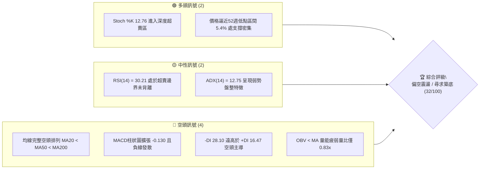
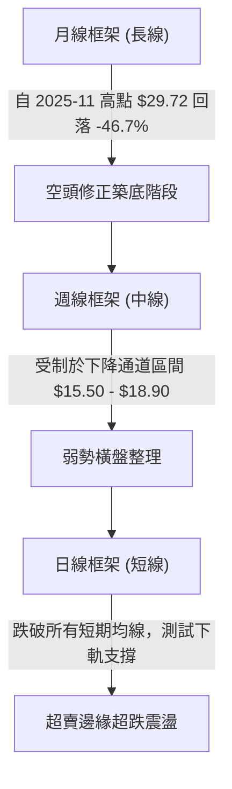
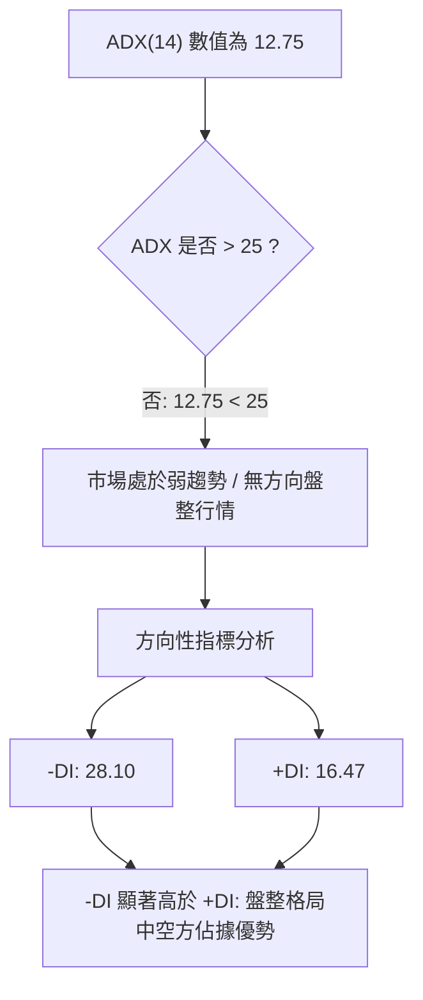
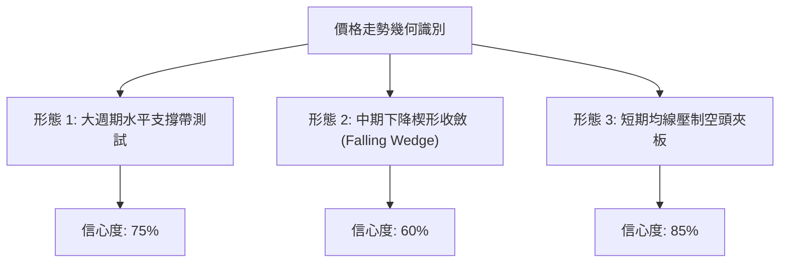
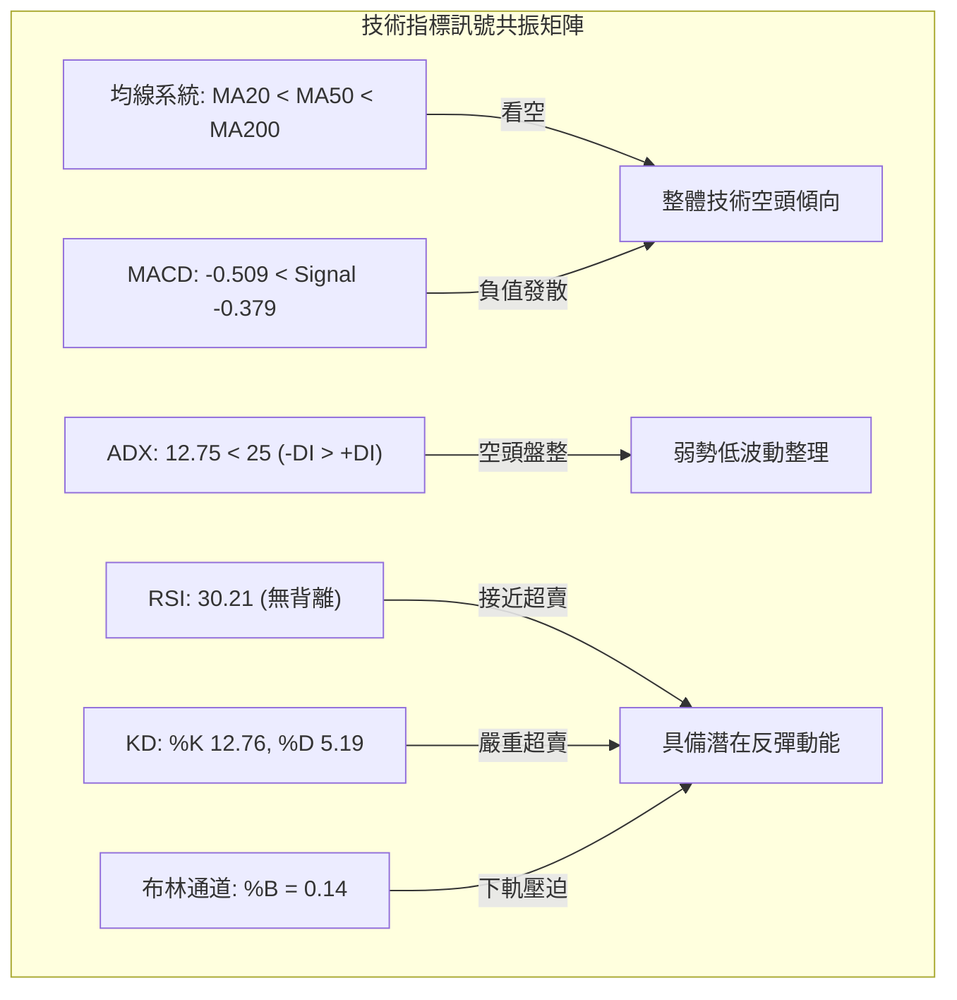
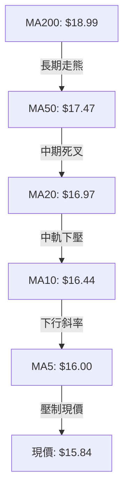
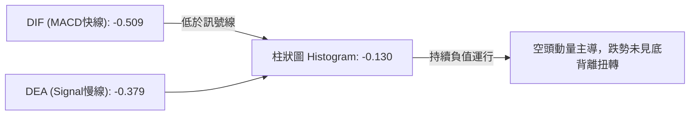
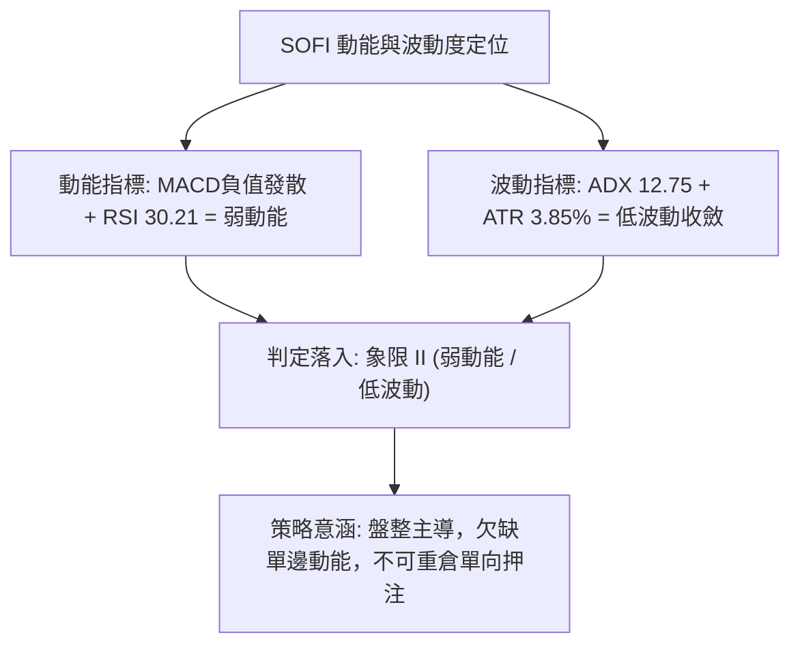
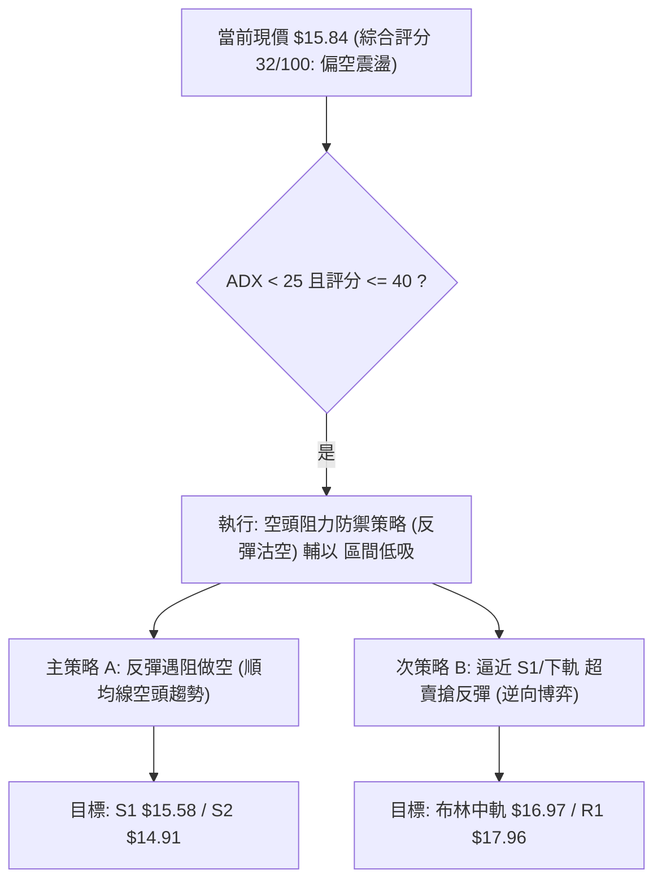
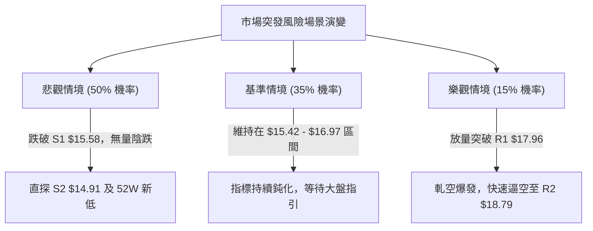

# SOFI 技術分析報告

> **報告日期**：2026-10-02 ｜ **語言**：繁體中文 ｜ **數據來源**：Yahoo Finance ｜ **當前價格**：$15.84

---

## 目錄

| 章節 | 內容 |
|------|------|
| [1. 技術面概覽](#1-技術面概覽) | 訊號儀表板、核心指標、評分卡 |
| [2. 趨勢分析](#2-趨勢分析) | 多時框趨勢、長中短期走勢、ADX強度 |
| [3. 圖表形態分析](#3-圖表形態分析) | 形態識別、K線組合、目標價推算 |
| [4. 支撐與阻力](#4-支撐與阻力) | 關鍵價位、斐波那契回調結構 |
| [5. 技術指標深度解讀](#5-技術指標深度解讀) | MA/RSI/MACD/布林/成交量量價分析 |
| [6. 動能與波動率](#6-動能與波動率) | 動能評估、ATR與止損、Beta相關性 |
| [7. 多時框架總結](#7-多時框架總結) | 時框架評分矩陣與多時框收斂 |
| [8. 交易策略建議](#8-交易策略建議) | 主策略佈局、價格階梯、風險報酬比 |
| [9. 風險提示與監控](#9-風險提示與監控) | 監控指標Checklist、風險場景防禦 |

---

## 1. 技術面概覽

### 🎯 技術訊號儀表板



### 📊 核心指標速覽表

| 指標類別 | 指標名稱 | 當前數值 | 訊號 | 解讀 |
|----------|----------|----------|------|------|
| **價格** | 當前價格 | $15.84 | 🔴 | 位於52週區間5.4%極低檔位置，逼近前波波段低點 |
| **均線** | MA20 | $16.97 | 🔴 | 價格低於MA20達-6.63%，短期均線構成下壓第一阻力 |
| **均線** | MA50 | $17.47 | 🔴 | 價格低於MA50，中期下降趨勢未扭轉 |
| **均線** | MA200 | $18.99 | 🔴 | 長期牛熊分界線位於上方，均線呈現標準空頭排列 |
| **動能** | RSI(14) | 30.21 | 🟡 | 逼近30超賣臨界點，具備技術性跌深反彈潛能但無底背離 |
| **動能** | MACD | -0.509 | 🔴 | MACD低於訊號線(-0.379)，柱狀圖為-0.130，動能看空 |
| **波動** | ATR(14) | $0.61 | 🟡 | 佔現價3.85%，波動度收斂，反映低波動盤整壓縮 |

### 🏆 技術評分卡

```
╔══════════════════════════════════════════════════════════════╗
║              技術評分卡 — SOFI (2026-10-02)                  ║
╠══════════════════════════════════════════════════════════════╣
║ 趨勢強度      █████░░░░░░░░░░░░░░░  25/100  🔴 空頭壓制      ║
║ 動能指標      ██████░░░░░░░░░░░░░░  30/100  🔴 負向發散      ║
║ 支撐穩定度    ██████████░░░░░░░░░░  50/100  🟡 臨近考驗      ║
║ 成交量配合    ██████░░░░░░░░░░░░░░  30/100  🔴 量能萎縮      ║
║ 形態完整度    ████████░░░░░░░░░░░░  40/100  🟡 下降楔形收斂  ║
║ 均線排列      ████░░░░░░░░░░░░░░░░  20/100  🔴 嚴格空頭排列  ║
╠══════════════════════════════════════════════════════════════╣
║ 綜合評分      ██████░░░░░░░░░░░░░░  32/100  🔴 偏空震盪/觀望  ║
╚══════════════════════════════════════════════════════════════╝
```

---

## 2. 趨勢分析

### 🌐 多時框趨勢分析



### 📈 長期趨勢 — 12個月走勢圖（Unicode）

```
SOFI 月線走勢圖（2025-10 至 2026-10）
價格軸 ($)
$30.00 ┤        ●29.68  ●29.72 (歷史峰值波段)
$27.00 ┤                    ●26.18
$24.00 ┤                            ●22.81
$21.00 ┤
$18.00 ┤                                    ●17.76          ●18.22  ●17.93          ●17.88
$15.00 ┤                                            ●15.88  ●16.10          ●16.31          ●15.72  ●15.84←現價
$12.00 ┤
       └────────────────────────────────────────────────────────────────────────────────────────────
        25-10   25-11   25-12   26-01   26-02   26-03   26-04   26-05   26-06   26-07   26-08   26-09   26-10
```

#### 走勢特徵分析表格

| 階段區間 | 時間跨度 | 起訖價位 | 漲跌幅 | 走勢特徵與量價結構 |
|----------|----------|----------|--------|--------------------|
| **高位見頂期** | 2025-10 ～ 2025-11 | $29.68 → $29.72 | +0.13% | 構築雙重頂部，滯漲高位震盪，獲利了結盤顯著湧現 |
| **主跌推動浪** | 2025-11 ～ 2026-03 | $29.72 → $15.88 | -46.57% | 單邊下行跌破MA200，空方全力主導，成交量持續放大逃逸 |
| **底部箱體震盪** | 2026-03 ～ 2026-10 | $15.88 → $15.84 | -0.25% | 於 $15.50 ～ $18.90 區間內進行籌碼沉澱，振幅收窄 |

### 📊 中期趨勢（週線分析）

從近20週數據觀察，價格自 2026-05-31 的高點 $18.22 震盪推升至 2026-08-23 的高點 $18.91 後，動能隨即衰竭。過去6週收盤呈現持續滑落階梯：
$18.22 → $17.32 → $16.96 → $16.58 → $15.84。

週線阻力與支撐示意：
```
$18.91 ─────────────────────────── [8月波段高點阻力]
          ╲
           ╲  下降阻力線
            ╲
$16.97 ───────*─────────────────── [MA20中軌壓制位]
                ╲
$15.84 ──────────●──────────────── [當前價格位置]
────────────────────────────────── [S1: $15.58 / 52W低點: $14.88 支撐帶]
```

### ⚡ 趨勢強度評估（ADX 解讀）



#### ADX 趨勢強度對照表

| 指標變數 | 當前讀數 | 基準門檻 | 趨勢解讀 |
|----------|----------|----------|----------|
| **ADX(14)** | 12.75 | < 20 極弱 / < 25 弱趨勢 | 目前處於橫盤整理與動能休眠階段，非單邊強烈趨勢行情 |
| **+DI (14)** | 16.47 | > 25 為多方強勢 | 多頭推進意願極度低迷，欠缺主動買盤挹注 |
| **-DI (14)** | 28.10 | > 25 為空方主導 | 空方維持壓迫態勢，但因 ADX 低迷，未演化為恐慌暴跌 |

---

## 3. 圖表形態分析

### 🔍 形態識別系統



#### 圖表形態評估表

| 形態類別 | 信心度 | 判斷依據（引用數據） | 完成度 | 目標價（附計算式） |
|----------|--------|----------------------|--------|--------------------|
| **大週期水平箱體底** | 75% | 2026-03 低點 $15.88 與現價 $15.84 重合，且接近支撐位 S1 $15.58 與 52W 低點 $14.88 | 90% | 由箱底 $15.58 與箱頂 R1 $17.96 推算高度 $2.38，若反彈目標為 $17.96 |
| **中期下降楔形** | 60% | 5月至8月高點由 $18.22 升至 $18.91 後拉回，但低點下移幅度趨緩（$16.31至$15.72），波動收斂 | 70% | 向上突破上軌預期測幅：楔形起點高點 $18.91 即為波段反彈目標 |
| **空頭均線覆蓋壓制** | 85% | 價格 $15.84 處於 MA5 ($16.00) 至 MA20 ($16.97) 所有短均線下方 | 95% | 空頭延續測幅：測試支撐位 S2 $14.91（由波段低點聚類確定） |

### 🕯️ 重要K線形態分析

| 月份 | 收盤價 | K線形態 | 解讀 | 訊號 |
|------|--------|---------|------|------|
| **2026-05** | $18.22 | 中陽突破線 | 突破3、4月整理平台，帶量拉升建立波段高點 | 🟢 多頭放量 |
| **2026-06** | $17.93 | 衝高回落十字長上影 | 於 $18.00 上方遭遇獲利了結與長均線壓制 | 🟡 滯漲警告 |
| **2026-07** | $16.31 | 中陰回撤破位線 | 跌破月均線支撐，回吐前期近半數漲幅 | 🔴 空方反撲 |
| **2026-08** | $17.88 | 探底長下影小陽線 | 測試 $16 關卡有買盤承接，一度反彈至 $18.91 | 🟡 多空拉鋸 |
| **2026-09** | $15.72 | 破位光腳中陰線 | 吞沒8月漲幅，逼近年內波段底部，空頭再次占優 | 🔴 空頭壓制 |
| **2026-10** | $15.84 | 止跌十字星孕線 | 於 $15.70-$15.80 區域收斂，跌勢放緩進入觀望 | 🟡 變盤前兆 |

### 📉 ASCII 走勢形態示意圖

```
SOFI 中期收斂形態與壓制結構示意
$18.91 ───────────┐ (8月高點阻力)
                  │ ╲
$17.96 ───────────┼──╲─────────────── R1 關鍵頸線阻力
                  │   ╲   下降楔形上軌
$16.97 ───────────┼────╲───────────── MA20 / 布林中軌
                  │     ╲
$15.84 ───────────┼──────●─────────── 當前價格（收斂末端）
$15.58 ───────────┴────────────────── S1 水平波段支撐
$14.88 ══════════════════════════════ 52W 絕對支撐線（底線）
```

---

## 4. 支撐與阻力

### 🗺️ 關鍵價位分布圖（Unicode）

```
SOFI 價位結構分布圖
═══════════════════════════════════════════════════════════════
$19.62 ║████████████████████████████████████║ 強阻力 R3 (波段高點聚類)
$18.79 ║████████████████████████████        ║ 阻力 R2 (反彈高壓區)
$17.96 ║████████████████████████            ║ 關鍵阻力 R1 (頸線與前高密集區)
$16.97 ║┈┈┈┈┈┈┈┈┈┈┈┈┈┈┈┈┈┈┈┈┈┈┈┈┈┈┈┈┈┈┈┈┈┈┈┈║ 動態阻力 (MA20 / 布林中軌)
$15.84 ╠════════════════════════════════════╣ ◄ 現價 $15.84
$15.58 ║▓▓▓▓▓▓▓▓▓▓▓▓▓▓▓▓▓▓▓▓                ║ 近期波段支撐 S1
$14.91 ║████████████████████████████████    ║ 強支撐 S2 (波段低點聚類)
$14.88 ║████████████████████████████████████║ 52週歷史低點 (極限支撐)
═══════════════════════════════════════════════════════════════
```

### 🚧 阻力位分析表

| 阻力級別 | 價位 | 形成原因 | 突破難度 | 重要性 |
|----------|------|----------|----------|--------|
| **R1** | $17.96 | 近一年波段高點聚類，且貼近MA60 ($17.53) 與MA50 ($17.47) 集結區 | 偏高 | ★★★★☆ 短期反轉多頭的必過頸線 |
| **R2** | $18.79 | 接近斐波那契 78.6% 回調位 ($18.70) 及近一年次高波段高點聚類 | 極高 | ★★★★☆ 中期空頭籌碼套牢深水區 |
| **R3** | $19.62 | 近一年高波段聚類，且上方臨近 MA200 ($18.99) 牛熊分水嶺延展阻力 | 極高 | ★★★★★ 多頭徹底扭轉長期趨勢之終極防線 |

### 🛡️ 支撐位分析表

| 支撐級別 | 價位 | 形成原因 | 守住機率 | 重要性 |
|----------|------|----------|----------|--------|
| **S1** | $15.58 | 近一年波段低點聚類，貼近布林帶下軌 ($15.42) | 65% | ★★★★☆ 短線多頭維繫箱體形態的底線 |
| **S2** | $14.91 | 近一年波段極限低點聚類，距離 52W 最低價 ($14.88) 僅 3 美分 | 80% | ★★★★★ 年度最核心的多頭生命線 |

### 📐 斐波那契回調位分析

依據 52 週絕對極值區間（低點 $14.88 → 高點 $32.73，總落差 $17.85）計算之標準斐波那契回調位：

```
0.0%  (52W High)  $32.73 ──────────────────────────────────
23.6%             $28.52 ──────────────────────────────────
38.2%             $25.91 ──────────────────────────────────
50.0%             $23.80 ──────────────────────────────────
61.8%             $21.70 ──────────────────────────────────
78.6%             $18.70 ────────────────────────────────── (貼近 R2 $18.79)
當前現價區間       $15.84 ◄───── 位於 78.6% ($18.70) 與 100.0% ($14.88) 之間
100.0% (52W Low)  $14.88 ────────────────────────────────── (貼近 S2 $14.91)
```

**斐波那契解讀**：
當前價格 $15.84 處於深度回調的極度超跌區（回調幅度已超過 78.6% 回調位 $18.70），目前正向 100.0% 極限回撤位 $14.88 靠攏。在技術分析定義中，回撤超過 78.6% 通常代表原先由 $14.88 推升至 $32.73 的多頭循環已被徹底瓦解，市場已從「回調模式」轉變為「重新築底或熊市破位模式」。現價距離 100% 支撐僅有 6.45% 的緩衝空間，此處將爆發多空主力最關鍵的定價權爭奪。

---

## 5. 技術指標深度解讀

### 🎛️ 指標訊號總覽



### 📈 移動平均線排列分析



均線系統處於嚴格意義下的**全週期空頭排列**（MA5 < MA10 < MA20 < MA50 < MA60 < MA120 < MA200 < MA240）。
- 短期均線乖離率：現價距 MA20 乖離為 -6.63%，距 MA5 僅 -0.98%，顯示短期跌速略有趨緩，但所有短中長期均線無任何一條提供支撐，全部轉化為層層阻力。
- 均線斜率：MA5 至 MA20 全部呈負斜率下行，空頭動量未完全衰退前，逢均線均是空方阻擊點。

### 📉 RSI(14) 分析

```
RSI(14) 讀數：30.21
░░░░░░░░░░░░░░░░░░░░░░░░░░░░░░▓█░░░░░░░░░░░░░░░░░░░░░░░░░░░░░░░░
0                             30.21                         100
[     超賣區 <30     ] ◄───[  當前  ]───────[      超買區 >70     ]
```

- **狀態評估**：RSI(14) 讀數為 30.21，已觸及技術超賣邊界的臨界線（30.00）。
- **背離診斷**：對比前低 2026-09-27 週線收盤 $16.58 對應 RSI 為 28.9，當前收盤 $15.84 對應 RSI 為 30.21。雖然價格微創新低而週線 RSI 微幅上揚，但在日線級別數據明確顯示「**RSI 背離：無明顯背離**」。因此，此處不可作為強烈反轉信號，僅能定義為下跌動能趨緩的常規超賣現象。

### 📊 MACD(12/26/9) 訊號解讀



- 快線 DIF (-0.509) 持續在慢線 DEA (-0.379) 下方運行，且位於零軸之下的深水區。
- 柱狀圖讀數為 -0.130，維持負向擴張態勢，顯示空頭主動拋壓仍未被完全吸收，多頭尚不具備向上發起波段反攻的動能結構。

### 📦 布林通道分析

```
布林帶寬度與現價定位示意 (帶寬: $18.51 - $15.42 = $3.09)
$18.51 ═════════════════════════════════════ 上軌
        ░░░░░░░░░░░░░░░░░░░░░░░░░░░░░░░░░░
$16.97 ───────────────────────────────────── 中軌 (MA20)
        ░░░░░░░░░░░░░░░░░░░░░░░░░░░░░░░░░░
$15.84 ───────●───────────────────────────── 現價 (%B = 0.14)
$15.42 ═════════════════════════════════════ 下軌
```

- **%B 指標解讀**：%B 數值為 **0.14**，意味著現價貼近下軌（0 代表下軌，0.5 為中軌，1.0 為上軌）。
- **通道走勢**：布林下軌 $15.42 與近期波段支撐位 S1 $15.58 形成高度共振支撐區。當前價格緊貼下軌運行，未出現「極端穿軌暴跌」，通道整體處於緩慢開口下傾階段，反映弱勢承壓。

### 💹 成交量分析（量價配合度）

```
量能指標比對：
最新日量: 37,241,400  ███████████████░░░░░
20日均量: 44,758,545  ██████████████████░░ (量比: 0.83x)
50日均量: 52,413,202  █████████████████████
```

- **OBV 趨勢**：官方數據明確顯示「**OBV < MA → 量能疲弱**」。鏈上籌碼累積指標持續落後於其移動平均線，代表量能在下跌過程中並未出現健康的多頭承接量。
- **量價背離診斷**：當前成交量比僅 0.83x，週成交量自 8 月底的 4.8 億股大幅萎縮至當前的 1.73 億股。這種「**縮量下跌**」特徵顯示拋盤動能其實正在枯竭，但同時買盤極度匱乏，屬於典型的無量陰跌結構，極易受到突發拋盤衝擊而測試 S1 支撐。

---

## 6. 動能與波動率

### ⚡ 動能評估分析

| 象限分類 | 動能屬性 | 波動率屬性 | 當前特徵標記 | 戰術應對指南 |
|----------|----------|------------|--------------|--------------|
| **象限 I** | 強動能 (Bullish) | 低波動 | 否 | 穩健多頭持倉 |
| **象限 II** | 弱動能 (Bearish) | 低波動 | **✓ 當前狀態** | **謹慎觀望，以盤整震盪思路應對，嚴防縮量陰跌破位** |
| **象限 III** | 強動能 (Breakout) | 高波動 | 否 | 突破追價策略 |
| **象限 IV** | 弱動能 (Panic) | 高波動 | 否 | 恐慌拋售左側撿籌 |



### 📊 ATR 波動率分析

- **ATR(14) 絕對數值**：**$0.61**
- **波動佔比**：佔當前股價比例為 **3.85%**，表明每日平均震盪幅度約為 6 毛錢左右。
- **止損距離動態測算**：
  - 1.0 × ATR = $0.61（適用於極短線緊密止損）
  - 1.5 × ATR = $0.92（標準波段交易止損寬度）
  - 2.0 × ATR = $1.22（寬鬆防洗盤止損寬度）
- 若由現價 $15.84 進行交易建倉，1.5 × ATR 止損距離對應價位為 $14.92，與下方強支撐位 S2 ($14.91) 形成完美的技術止損重合。

### 📐 Beta 與市場相關性

- **Beta 係數**：**2.208**
- **市場屬性解讀**：SOFI 的 Beta 高達 2.2 以上，屬於典型的**超高貝塔金融科技成長股**。當美股大盤（S&P 500 / 納斯達克）出現 1% 波動時，SOFI 平均展現超過 2.2% 的同向或放大波動。在當前技術面偏空且大盤若有系統性回調壓力時，其跌幅易被加倍放大，下行風險不可不慎。

---

## 7. 多時框架總結

### 📋 時框架評分表

| 時框架 | 趨勢方向 | 動能狀態 | 均線排列 | 關鍵幾何形態 | 綜合評分 | 建議操作操作 |
|--------|----------|----------|----------|--------------|----------|--------------|
| **月線 (長期)** | 🔴 下行修正 | 弱勢築底 | 空頭排列 | 自高點下行之深幅調整 | 35/100 | 長期投資者場外觀望 |
| **週線 (中期)** | 🔴 震盪偏空 | RSI 30.2 | 承壓中軌 | 下降楔形收斂盤整區 | 30/100 | 防範破位，尋求低吸點 |
| **日線 (短期)** | 🟡 盤整探底 | KD 超賣 | 均線全空 | 布林下軌支撐抵抗 | 32/100 | 短線區間波段交易 |

### 🔲 綜合訊號矩陣

```
┌─────────────────────────────────────────────────────────────────┐
│ 多時框訊號一致性檢定：                                          │
│ ├─ 長期 (月線)：空方主導修正 (-46.7% 回調壓制)                 │
│ ├─ 中期 (週線)：下降通道承壓，逼近區間下限                    │
│ └─ 短期 (日線)：超賣鈍化，貼布林下軌震盪                       │
│                                                                 │
│ 共振評估：日線與週線在「空頭壓制」上達成一致，但在「跌幅超賣」  │
│ 上顯現短期衰竭，不具備追空條件，亦欠缺右側反轉突破訊號。        │
└─────────────────────────────────────────────────────────────────┘
```

### ⚖️ 多時框收斂結論

> **依嚴格要求 14 之收斂規則判定**：
> 1. **趨勢/盤整判定**：當前 ADX(14) 讀數為 **12.75 (< 25)**，明確定義市場處於**「盤整行情」**。
> 2. **主導規則**：在盤整行情中，依規則應**「以日線布林通道上下軌為主要交易區間」**（下軌 $15.42，中軌 $16.97，上軌 $18.51）。
> 3. **方向性收斂結論**：**偏空震盪／區間防守觀望**。
> 綜合評分僅 **32/100**，全面受制於空頭排列，但由於日線布林下軌 $15.42 與波段支撐位 S1 $15.58 就在眼前且指標超賣，故嚴禁追空；主策略必須依循評分分流規則，以「**弱勢反彈高空（主）或下軌極度低吸（輔）之區間策略**」為唯一執行依據。

---

## 8. 交易策略建議

### 🗺️ 策略決策流程圖



### 🧭 策略路由（依評分卡分流）

> **當前主策略方向 = 偏空高空防禦策略（依綜合評分 32/100 偏空判定）**
> 
> 由於綜合評分 ≤ 40，本報告主推**「反彈遇阻做空策略」**；多頭反彈交易僅列為「超賣區間逆勢防守交易」，嚴禁盲目追多。

### 🎯 價格情境階梯（Price Scenarios）

所有價位均嚴格取自技術數據關鍵計算點位：

| 觸發條件 | 下一目標 | 後續延伸 | 情境含義 |
|----------|----------|----------|----------|
| **強勢突破 R1 $17.96** | 測試 R2 $18.79 | 挑戰 R3 $19.62 | 突破中期頸線，空頭排列扭轉，轉為多頭行情 |
| **反抽承壓 MA20 $16.97** | 區間回踩 $15.84 | 考驗 S1 $15.58 | 典型的弱勢均線反抽受阻，維持區間震盪整理 |
| **跌破 S1 $15.58** | 測試 S2 $14.91 | 考驗 52W 低點 $14.88 | 下降收斂破位，測試全年度歷史底部防線 |

### 📊 情境機率分佈

| 情境劃分 | 機率估算 | 主要指標依據 |
|----------|----------|--------------|
| **弱勢下探再測底 (破位情境)** | **50%** | 均線空頭排列、MACD負值發散、OBV量能低迷且 -DI 達 28.10 |
| **區間內窄幅震盪 (基線情境)** | **35%** | ADX 僅 12.75 呈現弱盤整、Stoch KD 超賣 (%K 12.76)、布林通道收斂 |
| **強勢放量大反彈 (樂觀情境)** | **15%** | 缺乏利多催化與量能支撐，僅能依賴空頭回補帶動技術性抽頭 |

### 🟢 交易策略詳情

本策略嚴格引用系統計算之關鍵價位（阻力 R1: $17.96, R2: $18.79 / 支撐 S1: $15.58, S2: $14.91）與布林通道數值：

| 策略要素 | 策略 A（主推：順勢高空策略） | 策略 B（次選：區間下軌低吸博弈） |
|----------|------------------------------|----------------------------------|
| **進場條件** | 反抽布林中軌 MA20 或 R1 遇阻滯漲 | 價格回踩 S1 獲得支撐且 KD 低檔金叉 |
| **進場價格** | **$16.97** (MA20中軌) 至 **$17.47** (MA50) | **$15.58** (支撐位 S1) |
| **目標價 T1** | **$15.84** (當前平台現價) | **$16.97** (布林中軌 MA20) |
| **目標價 T2** | **$14.91** (強支撐位 S2) | **$17.96** (關鍵阻力位 R1) |
| **止損價格** | **$17.96** (突破阻力 R1 止損) | **$14.88** (跌破 52W 最低點止損) |
| **風險報酬比** | **1 : 2.1** [風險 $0.99 / 報酬 $2.06] | **1 : 1.98** [風險 $0.70 / 報酬 $1.39] |
| **成功機率** | **60%** (符合空頭趨勢阻力壓制) | **40%** (逆勢摸底，勝率較低) |
| **建議倉位** | **15%** 倉位 | **5% - 8%** 輕倉試探 |

### 🔴 反向風險觸發點（對沖提示）

- **多頭反轉翻多信號**：若價格以日線實體陽線**放量站穩 R1 ($17.96)**，意味著突破近一年下降壓力頸線，此時空頭策略必須**無條件停損離場**，不可死扛。
- **融券空頭擠壓風險 (Short Squeeze)**：SOFI 當前 Short % Float 高達 **14.8%**，Short Ratio 達 **4.68** 天。一旦市場出現意外利多或板塊輪動，極易引發軋空行情，空方部位必須嚴控停損紀律。

### ⭐ 整體訊號強度評星

```
做多訊號強度：★★☆☆☆  (2.0/5星 - 僅有超賣指標支撐)
做空訊號強度：★★★★☆  (4.0/5星 - 均線、動量與趨勢全面壓制)
整體可信度：  ★★★★☆  (4.0/5星 - 多時框指標收斂性極高)
```

---

## 9. 風險提示與監控

### ✅ 關鍵監控指標 Checklist

```
╔══════════════════════════════════════════════════════════════╗
║               SOFI 交易風控監控清單 (Checklist)               ║
╠══════════════════════════════════════════════════════════════╣
║ [ ] 價位破位警報：收盤價是否有效跌破 S1 ($15.58)？           ║
║ [ ] 終極防線警報：盤中是否刺穿 52W 低點 ($14.88)？           ║
║ [ ] 動能翻多驗證：日線 MACD 柱狀圖是否由負翻正 (>-0.130)？   ║
║ [ ] 均線修復測試：收盤價能否重返 MA20 ($16.97) 之上？        ║
║ [ ] 量能異動監控：單日成交量是否突破 50日均量 (52.4M 股)？   ║
║ [ ] 軋空風控指標：空頭平倉天數 (Short Ratio) 是否降至 3 以下？║
╚══════════════════════════════════════════════════════════════╝
```

### ⚠️ 風險場景分析



### 🛡️ 風險管理重要提醒

1. **Beta 放大效應**：SOFI Beta 達 2.208，極具高波動槓桿特性。若大盤指數（如納指）出現劇烈回調，SOFI 跌幅恐將顯著放大。任何多頭進場均須嚴格綁定 **1.5 × ATR ($0.92)** 左右的止損限制。
2. **基本面現金流隱憂**：雖然營收與利潤維持 YoY 40% 以上高增長，但數據顯示其經營性現金流為 **$-8.50B**，現金流面的不確定性使得估值折價在技術面持續體現為反彈無力。
3. **倉位管理防線**：在 ADX 低於 25 的盤整偏弱行情下，總曝險倉位嚴禁超過總資金的 **20%**，應以防禦與等待方向明朗為主，切忌在大級別支撐位尚未出現放量雙底結構前孤注一擲。

---

## 📋 報告總結

```
╔══════════════════════════════════════════════════════════════╗
║                   SOFI 技術分析報告總結                      ║
╠══════════════════════════════════════════════════════════════╣
║ 報告日期：2026-10-02                                         ║
║ 當前價格：$15.84                                             ║
║ 分析評級：🔴 偏空弱勢震盪 (評分: 32/100)                     ║
║                                                              ║
║ 關鍵結論：                                                   ║
║ ├─ 長期趨勢：🔴 弱勢修正 (-46.7% 高檔滑落，MA200 壓制)       ║
║ ├─ 中期趨勢：🔴 下降通道震盪收斂，近6週階梯式陰跌            ║
║ ├─ 短期趨勢：🟡 觸及布林下軌 (%B 0.14) 與 KD 超賣，跌速趨緩  ║
║ ├─ 關鍵支撐：S1: $15.58 ｜ S2: $14.91 ｜ 52W Low: $14.88     ║
║ ├─ 關鍵阻力：R1: $17.96 ｜ R2: $18.79 ｜ MA20: $16.97        ║
║ └─ 分析師目標：共識均價 $20.35 (當前遠遠落後於目標價)        ║
║                                                              ║
║ 最優策略組合：                                               ║
║ 1. 🥇 最佳機會：反抽布林中軌 MA20 ($16.97) 逢高沽空 (主策略)║
║ 2. 🥈 次選機會：回踩波段支撐 S1 ($15.58) 輕倉博反彈 (區間)  ║
║ 3. 🥉 保守選擇：徹底場外觀望，靜待放量突破 R1 或回踩 S2 企穩 ║
╚══════════════════════════════════════════════════════════════╝
```

---

> ⚠️ **免責聲明**：本報告為技術分析研究，所有數據、價位計算及估算均基於系統提供的客觀歷史與即時價格資訊。本報告**僅供研究與學術參考**，**不構成任何要約、招攬或投資建議**。市場有風險，交易需依個人風險承受度獨立決策並嚴設停損。

---

*報告生成時間：2026-10-02 ｜ 數據來源：Yahoo Finance ｜ 分析框架：多時框技術分析體系*