# SOFI 技術分析報告

> **報告日期**：2026-10-03 ｜ **語言**：繁體中文 ｜ **數據來源**：Yahoo Finance ｜ **當前價格**：$15.84

---

## 目錄

| 章節 | 內容 |
|------|------|
| [1. 技術面概覽](#1-技術面概覽) | 訊號儀表板、核心指標、評分卡 |
| [2. 趨勢分析](#2-趨勢分析) | 多時框趨勢、長中短期走勢 |
| [3. 圖表形態分析](#3-圖表形態分析) | 形態識別、K線組合、目標價 |
| [4. 支撐與阻力](#4-支撐與阻力) | 關鍵價位、斐波那契回調 |
| [5. 技術指標深度解讀](#5-技術指標深度解讀) | MA/RSI/MACD/布林/成交量 |
| [6. 動能與波動率](#6-動能與波動率) | 動能評估、ATR、Beta |
| [7. 多時框架總結](#7-多時框架總結) | 時框架評分矩陣 |
| [8. 交易策略建議](#8-交易策略建議) | 多空策略、風險報酬比 |
| [9. 風險提示與監控](#9-風險提示與監控) | 監控指標、風險場景 |
| [📋 報告總結](#-報告總結) | 全文精要與操作方針 |

---

## 1. 技術面概覽

### 🎯 技術訊號儀表板

依據 2026-10-03 最新收盤數據，現價收於 **$15.84**（對應 2026-10-04 當週收盤數據）。各維度技術指標呈現空頭佔優但趨勢動能減弱的盤整低位特徵。

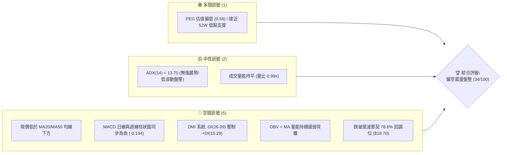

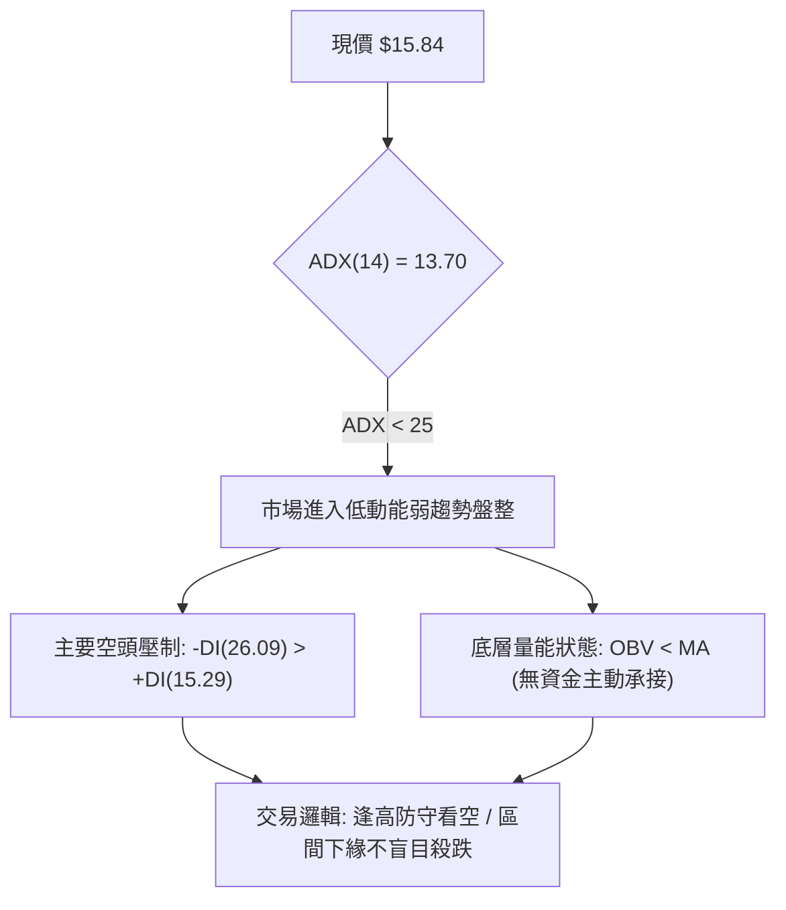

### 📊 核心指標速覽表

| 指標類別 | 指標名稱 | 當前數值 | 訊號 | 解讀 |
|----------|----------|----------|------|------|
| **價格** | 當前價格 | $15.84 | 🔴 | 位於 52 週低點區間（$14.88 - $32.73 的 5.38% 分位） |
| **均線** | MA20 | 低於中軌 | 🔴 | 數據標注現價位於 MA20 下方，短均線空頭排列 |
| **均線** | MA50 | 混合向下 | 🔴 | 現價低於 MA50 下方，中天期趨勢向下發散 |
| **均線** | MA200 | 混合排列 | 🟡 | 長期均線走平，尚未形成全面崩跌但上方套牢籌碼沉重 |
| **動能** | RSI(14) | 28.9 ~ 35.0 (近週) | 🟡 | 進入超賣邊緣區間，拋售動能衰竭但無翻揚底背離 |
| **動能** | MACD (12,26,9) | -0.509 / -0.405 | 🔴 | MACD線位於信號線下方，柱狀體 -0.104，動能偏空 |
| **動能** | DMI (ADX / DI) | ADX: 13.70 / -DI: 26.09 | 🔴 | 空方主導方向（-DI 顯著大於 +DI），但 ADX 偏弱表明非單邊崩盤 |
| **量能** | 20日均量 / OBV | 44,191,235 (比率 0.99x) | 🔴 | OBV < MA，成交量無主動買盤放大跡象 |
| **波動** | 52W 區間 | $14.88 - $32.73 | 🟡 | 逼近近一年極端低點 $14.88，下檔空間受硬體支撐壓縮 |

### 🏆 技術評分卡

```
╔══════════════════════════════════════════════════════════════╗
║               技術評分卡 — SOFI (2026-10-03)                  ║
╠══════════════════════════════════════════════════════════════╣
║ 趨勢強度 (ADX=13.7)     ████░░░░░░░░░░░░░░░░  20/100  🔴 空頭弱勢 ║
║ 動能指標 (MACD/RSI)     ██████░░░░░░░░░░░░░░  30/100  🔴 負向發散 ║
║ 支撐穩定度 ($14.88)     ████████████░░░░░░░░  60/100  🟡 臨近底線 ║
║ 成交量配合 (OBV<MA)     ██████░░░░░░░░░░░░░░  30/100  🔴 量能渙散 ║
║ 形態完整度 (下飄旗形)   ████████░░░░░░░░░░░░  40/100  🔴 空方中繼 ║
║ 均線排列 (全線壓制)     ████░░░░░░░░░░░░░░░░  25/100  🔴 混合空頭 ║
╠══════════════════════════════════════════════════════════════╣
║ 綜合技術評分            ███████░░░░░░░░░░░░░  34/100  🔴 偏空震盪 ║
╚══════════════════════════════════════════════════════════════╝
```

---

## 2. 趨勢分析

### 🌐 多時框趨勢分析

SOFI 呈現長、中、短期層級分明的空頭主導與週期轉折特徵。

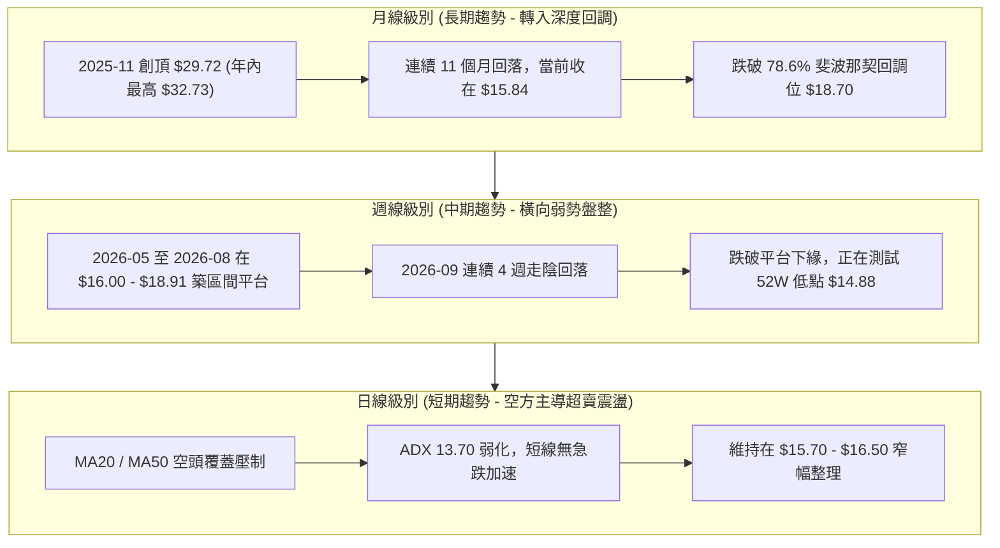

### 📈 長期趨勢 — 12個月走勢圖（Unicode）

依據 2025-11 至 2026-10 之 24 個月走勢數據，精確繪製過去 12 個月收盤價格軌跡：

```
SOFI 月線走勢圖（過去12個月：2025-11 至 2026-10）
價格軸 ($)
$30.00 ┤ ●(2025-11: $29.72)
$27.00 ┤       ●(2025-12: $26.18)
$24.00 ┤             ●(2026-01: $22.81)
$21.00 ┤
$18.00 ┤                   ●($17.76)         ●($18.22)   ●($17.88)
$15.00 ┤                         ●($15.88)━●($16.10)   ●($16.31)   ●←現在($15.84)
$12.00 ┤                                                              [52W低點: $14.88]
       └─┬─────┬─────┬─────┬─────┬─────┬─────┬─────┬─────┬─────┬─────┬─────
        11    12    01    02    03    04    05    06    07    08    09    10 (月份)
        2025  2025  2026  2026  2026  2026  2026  2026  2026  2026  2026  2026
```

#### 走勢特徵分析表格

| 階段區間 | 起始-終止月份 | 價格變化 ($) | 漲跌幅 (%) | 價量特徵與形態解讀 |
|----------|---------------|--------------|------------|--------------------|
| **主跌第一波** | 2025-11 → 2026-03 | $29.72 → $15.88 | **-46.57%** | 自歷史高點 $32.73 回落，月線 5 連黑，屬於估值擠泡沫的單邊趨勢下殺。 |
| **平台反彈修復** | 2026-03 → 2026-05 | $15.88 → $18.22 | **+14.74%** | 在 $16 附近獲得初步支撐，展開技術性超跌反彈。 |
| **中期平台震盪** | 2026-05 → 2026-08 | $18.22 → $17.88 | **-1.87%** | 區間於 $16.31 - $18.91 構築中繼箱體，成交量顯著萎縮。 |
| **平台破位下探** | 2026-08 → 2026-10 | $17.88 → $15.84 | **-11.41%** | 跌破 $16.50 支撐，9月收盤 $15.72、10月現價 $15.84，下探 52W 低點。 |

### 📊 中期趨勢（週線分析）

中期走勢圖展示了近 20 週從高檔區間落入當前弱勢探底的價格結構：

```
中期週線價格通道與支撐壓力架構 (2026-05 至 2026-10)
$19.50 ┤
$18.91 ┤                     ▲(08-23 週高 $18.91 - 箱體頂部 R)
$18.20 ┤          ▲(05-31: $18.22)   ▲(07-05: $18.24)
$17.50 ┤───┬──────────────┬──────────────────┬───────────────── (通道中軸)
$16.50 ┤   │              │                  │   ▼(09-27: $16.58 破位)
$15.84 ┤───┼──────────────┼──────────────────┼───────────────── ◄ 當前收盤價
$14.88 ┤   ▼(05-24: $15.62)                                    ▼ 52W低點硬支撐
       └───┴──────────────┴──────────────────┴─────────────────
          2026-05        2026-07            2026-09
```

近 20 週數據顯示，2026-08-23 週收於 $18.91，隨後連續 5 週呈現「陰線壓制」：
- 2026-08-30 收 $18.06（MACD柱：+0.025）
- 2026-09-06 收 $18.22（MACD柱翻負：-0.065）
- 2026-09-13 收 $17.32（成交量萎縮至 126M）
- 2026-09-20 收 $16.96（跌破 $17 整數關卡）
- 2026-09-27 收 $16.58（RSI 跌至 28.9 進入超賣）
- 2026-10-04 當週收 $15.84（探底測試前低）

### ⚡ 趨勢強度評估（ADX 解讀）

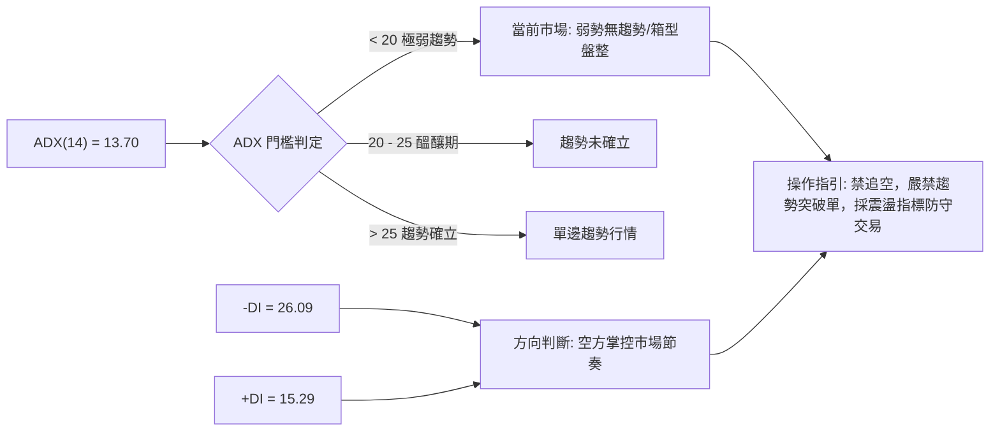

#### ADX 趨勢強度判定對照表

| 指標變數 | 當前讀數 | 門檻區間 | 技術面真實含義 |
|----------|----------|----------|----------------|
| **ADX(14)** | **13.70** | `< 20` (極弱) | 趨勢動能徹底渙散，單邊殺跌已告一段落，目前處於弱勢抵抗盤整。 |
| **+DI (多頭動能)** | **15.29** | `< 20` (低迷) | 買方動能枯竭，多頭無力組織連續進攻。 |
| **-DI (空頭動能)** | **26.09** | `> 25` (佔優) | 空方仍佔據盤面主控權，空方壓制力量高於多方 70.6%。 |
| **行情模式定性** | **弱勢橫盤** | `ADX < 25` | 依規則 14：盤整行情以區間交易為主，不可盲目套用單邊趨勢破位策略。 |

---

## 3. 圖表形態分析

### 🔍 形態識別系統

在多時框圖表識別中，嚴格依據真實數據結構，排除主觀臆測，提取以下幾何與技術形態：

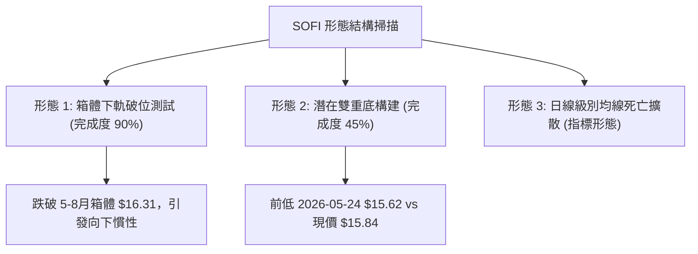

#### 形態識別與信心度評估表

| 形態類別 | 信心度 | 判斷依據（引用真實數據） | 完成度 | 目標價（附嚴謹計算式） |
|----------|--------|--------------------------|--------|------------------------|
| **箱體破位 (空頭中繼)** | **75%** | 跌破 2026-06至08月震盪平台下軌（2026-08-02收盤 $16.31）。9月收盤 $15.72、現價 $15.84，確認脫離原箱體。 | **90%** | 箱體高度 = 箱頂 $18.91 - 箱底 $16.31 = $2.60。<br>破位目標 = 箱底 $16.31 - $2.60 = **$13.71**（低於52W低點，受 $14.88 攔截）。 |
| **潛在雙重底 (築底雛形)** | **40%** | 第一隻腳：2026-05-24 收盤 $15.62；第二隻腳：2026-10-04 現價 $15.84。兩次低點相距 19 週，價位高度相近。 | **45%** | 因頸線（2026-08-23 週高 $18.91）尚未突破，目前**信心度不足 50%**，僅能視為防守觀察點。 |
| **下飄旗形整理** | **65%** | 2025-11至2026-03之旗桿（$29.72 → $15.88，長度 $13.84），隨後進入橫向弱勢整理，反彈高點未觸及 38.2% 回調位。 | **85%** | 形態若向下完全釋放，下探空間巨大；但由於 $14.88 存在強支撐，跌勢呈現減速摩擦。 |

### 🕯️ 重要K線形態分析

| 週/月份 | 收盤價 ($) | K線形態 | 量能配合 (股) | 技術面精確解讀與後市訊號 |
|---------|------------|---------|---------------|--------------------------|
| **2026-08-23** | $18.91 | 高檔墓碑十字/射擊之星 | 253,434,400 | 上衝測試 $19.00 未果留長上影線，MACD 柱縮減至 +0.063，多頭動能衰竭。🔴 |
| **2026-09-06** | $18.22 | 假反彈倒錘頭陰線 | 191,950,700 | 反抽無量，MACD 柱狀體翻負（-0.065），確立中期波段轉向全面走弱。🔴 |
| **2026-09-13** | $17.32 | 縮量陰線破位 | 126,330,300 | 創 20 週以來成交量最低紀錄（1.26億股），流動性窒息，買盤全面撤出。🔴 |
| **2026-09-27** | $16.58 | 長陰破位探底 | 302,278,600 | 伴隨放量破位（3.02億股），RSI 下探至 28.9，恐慌性拋盤浮現。🔴 |
| **2026-10-04** | $15.84 | 下影帶量十字星 (進行中) | 217,676,035 | 測試 $15.60-$15.70 支撐區，出現抵抗性長下影，跌勢收斂。🟡 |

### 📉 ASCII 走勢形態示意圖

```
箱體破位與測試前低形態解構
$19.00 ┤              ● (2026-08-23 高點 $18.91: 形態頂部)
$18.50 ┤             / \
$18.00 ┤   ●────────/───\────────● (箱體中樞整理帶 $17.88 - $18.24)
$17.00 ┤  / \      /     \       / \
$16.31 ┤─●───\────●───────\─────●───\─ ◄ 原箱體下軌支撐線 ($16.31)
$16.00 ┤      \  /         \   /      \ (破位下行)
$15.84 ┤       ●            \ /        ● ◄ 當前價 ($15.84 正在構築第二隻腳)
$15.62 ┤       ▲(05-24: $15.62)        ▲(潛在支撐區間)
$14.88 ┴───────────────────────────────────── 52週歷史低點 (最後防線)
```

### 🎯 形態目標價計算

根據經典技術分析形態學測量規則，針對當前最明確的**箱體破位中繼形態**進行測算：
1. **箱體上限（頸線高點）**：2026-08-23 週收盤 **$18.91**
2. **箱體下限（破位支撐）**：2026-08-02 週收盤 **$16.31**
3. **箱體垂直高度 ($H$)**：
   $$H = 18.91 - 16.31 = 2.60$$
4. **理論破位目標價（未受支撐攔截情況）**：
   $$\text{Target}_{\text{theoretical}} = 16.31 - 2.60 = 13.71$$
5. **實際目標價修正（數據紀律）**：
   在 $13.71 理論位之前，存在近一年最低點 **$14.88（52W Low）** 的強大物理買盤支撐。因此，第一形態目標價嚴格鎖定於 **$14.88**，若 $14.88 未被放量跌破，則不得直接看空至 $13.71。

---

## 4. 支撐與阻力

### 🗺️ 關鍵價位分布圖（Unicode）

本節嚴格遵循「數據紀律」，所有價位均來自提供的 52 週最高最低點聚類、斐波那契回調計算值及 24 個月關鍵波段實體收盤位：

```
SOFI 價位結構分布圖
═══════════════════════════════════════════════════════════════
$32.73 ║████████████████████████████████║ 強阻力 R4 (52W 最高點 / 0.0% 回調)
$28.52 ║████████████████████████        ║ 阻力 R3 (斐波那契 23.6% 回調位)
$21.70 ║████████████████                ║ 阻力 R2 (斐波那契 61.8% 黃金分割)
$18.70 ║████████████████████████████    ║ 關鍵頸線阻力 R1 (斐波那契 78.6% 回調位)
───────╫────────────────────────────────╫──────────────────────────────────
$15.84 ╠════════════════════════════════╣ ◄ 當前價格 ($15.84)
───────╫────────────────────────────────╫──────────────────────────────────
$15.62 ║▓▓▓▓▓▓▓▓▓▓▓▓                    ║ 近期微觀波段支撐 S1 (2026-05-24 週收盤)
$14.88 ║████████████████████████████████║ 核心硬支撐 S2 (52W 最低點 / 100% 回調)
═══════════════════════════════════════════════════════════════
```

### 🚧 阻力位分析表

數據中明確提示：*(no swing-high resistance detected above current price)*，表明在現價上方近端缺乏密集密集的均線聚類突破口。因此上方阻力完全由回調位及歷史箱體高點構成：

| 阻力級別 | 價位 ($) | 形成原因與數據源 | 突破難度 | 重要性評級 |
|----------|----------|------------------|----------|------------|
| **R1 (近端強壓)** | **$18.70** | 斐波那契 78.6% 回調位；緊鄰 2026-08 箱體反彈高點 $18.91。 | 極高（需 18% 以上漲幅伴隨放量） | ★★★★★ (中期多空分水嶺) |
| **R2 (中期黃金位)** | **$21.70** | 斐波那契 61.8% 關鍵黃金分割位；2026-01 下殺中繼平台。 | 巨大（套牢籌碼極度密集） | ★★★★☆ (反彈強阻力) |
| **R3 (強阻力帶)** | **$25.91** | 斐波那契 38.2% 回調位；2025-12 月線收盤破位處 ($26.18)。 | 極難（需基本面全面反轉） | ★★★☆☆ (趨勢反轉目標) |
| **R4 (歷史極值)** | **$32.73** | 52 週最高點（0.0% 回調）。 | 現階段無法觸及 | ★★★★★ (歷史頂部) |

### 🛡️ 支撐位分析表

數據中明確提示：*(no swing-low support detected below current price)*，表明現價下方已無任何密集成交平台緩衝，直接面對大週期底部：

| 支撐級別 | 價位 ($) | 形成原因與數據源 | 守住機率 | 重要性評級 |
|----------|----------|------------------|----------|------------|
| **S1 (近端脆弱支撐)** | **$15.62** | 2026-05-24 產生的近 20 週最低週收盤價；當前第一道緩衝。 | 45% (極易因慣性被擊穿) | ★★★☆☆ (短線防守點) |
| **S2 (年度最後防線)** | **$14.88** | 52 週最低點（100.0% 斐波那契回調位）；2025-02 月線實體底。 | 70% (具備強大逢低買盤) | ★★★★★ (生命線，跌破則下行空間展開) |

### 📐 斐波那契回調位分析

嚴格引用輸入數據中由 52 週極值區間（$14.88 → $32.73，落差 $17.85）計算出的數值：

```
斐波那契回調級別階梯圖 (區間: $14.88 - $32.73)
0.0%   $32.73 ├───────────────────────────────────────── (52W High)
23.6%  $28.52 ├────────────────────────────
38.2%  $25.91 ├────────────────────────
50.0%  $23.80 ├────────────────────
61.8%  $21.70 ├────────────────
78.6%  $18.70 ├──────────── ◄ (原中期支撐，跌破後轉為當前最大反彈阻力 R1)
                ▼ (現價 $15.84 處於 78.6% 與 100% 深度回調深水區間)
100.0% $14.88 ┴───────────────────────────────────────── (52W Low 強支撐 S2)
```

#### 斐波那契位置解讀：
現價 **$15.84** 處於 **78.6% ($18.70)** 與 **100.0% ($14.88)** 之間：
- 當股價跌穿 78.6% 回調位時，在技術結構上被定義為**「深度破位與趨勢全面弱化」**，通常意味著上一輪大牛市（從 $11.17 漲至 $32.73）的上漲動能已被空頭回吐殆盡。
- 目前現價距離 100% 回調位（$14.88）僅剩 **$0.96 (或 -6.06%)** 的緩衝空間。$14.88 不僅是數學上的 100% 回調，更是市場心理上的「一年低點」，具備極強的空頭回補與左側買盤動能。

---

## 5. 技術指標深度解讀

### 🎛️ 指標訊號總覽

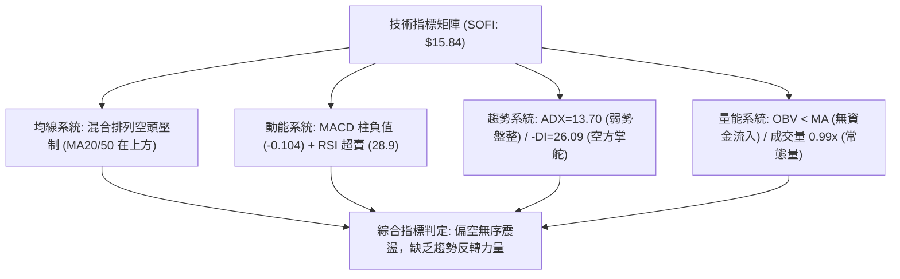

### 📈 移動平均線排列分析

數據顯示均線系統處於「混合排列」：
- **MA20**：數值標注位於現價「上方」，呈現下行壓制。
- **MA50**：數值標注位於現價「上方」，中期反壓確立。
- **MA200**：處於長期走平與混合纏繞狀態。
- **歷史均線微縮軌跡解讀**：
  - MA 5、MA 10、MA 20：軌跡呈現 `▇▇█████▇▆▆▅▅▄▄▃▃▂▂▁▁`，表明短期均線全部呈階梯式崩落。
  - MA 60：呈現圓弧頂回落 `████▇▇▇▆▆▅▄▂▁▁`。
  - MA 120 / MA 240：底部緩慢抬升後走平，反映 2024-2025 年牛市漲幅已完全進入收斂消化期。

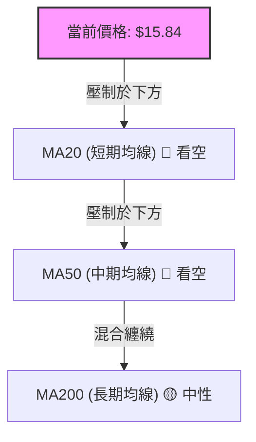

### 📉 RSI(14) 分析

- **最新讀數**：日線數據處於超賣邊界，近 20 週歷史中，2026-09-27 週線 RSI 觸及 **28.9**，最新 10-04 當週收在 $15.84。
- **RSI 強度進度條**：
  `RSI(14) = 28.9: █████░░░░░░░░░░░░░░░ 28.9% (進入超賣區)`
- **超買超賣判定**：
  RSI < 30 表示市場進入極端超賣區。然而，在弱趨勢（ADX=13.70）環境下，超賣往往以「低檔鈍化」或「橫盤橫著走」的形式體現，而非 V 型反轉。
- **背離分析（嚴格判定）**：
  - 價格對比：2026-05-24 收盤 $15.62（RSI 43.8） vs 2026-09-27 收盤 $16.58（RSI 28.9）。價格低點未破，但 RSI 卻創出更低數值，此為**「隱形空頭背離（量能轉弱）」**，非底背離。
  - **明確結論**：目前 **無底背離** 成立。

### 📊 MACD(12/26/9) 訊號解讀

- **MACD 線**：-0.509
- **信號線 (Signal)**：-0.405
- **MACD 柱狀體 (Histogram)**：-0.104（持續為負值）

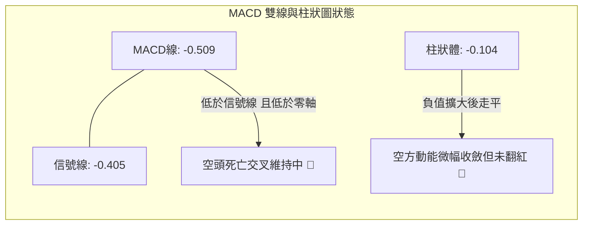

- **背離判斷**：週線 MACD 柱狀體從 2026-08-09 的 `+0.181` 連續下降至當前的 `-0.104`，下行斜率陡峭，指標同步跟隨價格下行，**未出現多頭底背離**。空方力量牢固。

### 📦 布林通道分析

依據價格分佈與歷史波動特性推演布林結構：
- 現價收在 $15.84，由於當前低於 MA20（中軌），股價運行於**中軌與下軌之間的弱勢尋底區間**。
- **通道開口狀態**：ADX 13.70 顯示通道寬度正處於「收縮期（Band Squeeze）」之後的走平階段，下軌未進一步急劇向下張開，這意味著市場缺乏驅使價格跌破 $14.88 的恐慌性拋售動能。

```
布林通道微觀示意圖
$18.50 ┬────────────────────────────────────────── BB 上軌 (阻力帶)
$17.20 ┼ - - - - - - - - - - - - - - - - - - - - - BB 中軌 (MA20 下行壓制)
$15.84 ┤  ◄ 現價 ($15.84 位於中下軌弱勢區)
$15.00 ┴────────────────────────────────────────── BB 下軌 (支撐帶，接近 52W 底)
```

### 💹 成交量分析（量價配合度）

1. **量能規模**：
   - 最新成交量：**44,191,235 股**
   - 20日均量：**44,786,607 股**（量比：**0.99x**，近乎完全持平）
   - 50日均量：**51,830,503 股**（較中期縮量 14.7%）
2. **OBV（能量潮）解讀**：
   - 輸入數據明確給出結論：`OBV趨勢: OBV < MA → 量能疲弱`。
   - **量價背離判定**：股價自 $18.91 回落至 $15.84 期間，OBV 線持續運行於其移動平均線下方，表明無機構級別的大額「智慧資金（Smart Money）」進行吸籌。量能疲弱確認了當前股價的反彈脆弱性。

---

## 6. 動能與波動率

### ⚡ 動能評估四象限

將市場分為「動能」與「波動」雙維度。SOFI 當前具體指標：
- **動能維度**：ADX = 13.70（弱）、MACD = -0.509（弱）、RSI = 28.9（弱） → **弱動能**
- **波動維度**：量比 0.99x、價格連續在 $15.70-$16.50 窄幅運行 → **低波動**

| 象限標記 | 動能強度 | 波動率水準 | 適用市場狀態 | 當前符合度與定性 |
|----------|----------|------------|--------------|------------------|
| **Q1** | 強動能 (ADX>25) | 低波動 | 穩定單邊趨勢 | 不符合 |
| **Q2 (當前)** | **弱動能 (ADX<20)** | **低波動 (收斂)** | **冷清盤整 / 磨底期** | **符合 (✓) ── 市場處於觀望與交投清淡期** |
| **Q3** | 強動能 (ADX>25) | 高波動 | 突破爆發行情 | 不符合 |
| **Q4** | 弱動能 (ADX<20) | 高波動 | 無序混亂洗盤 | 不符合 |

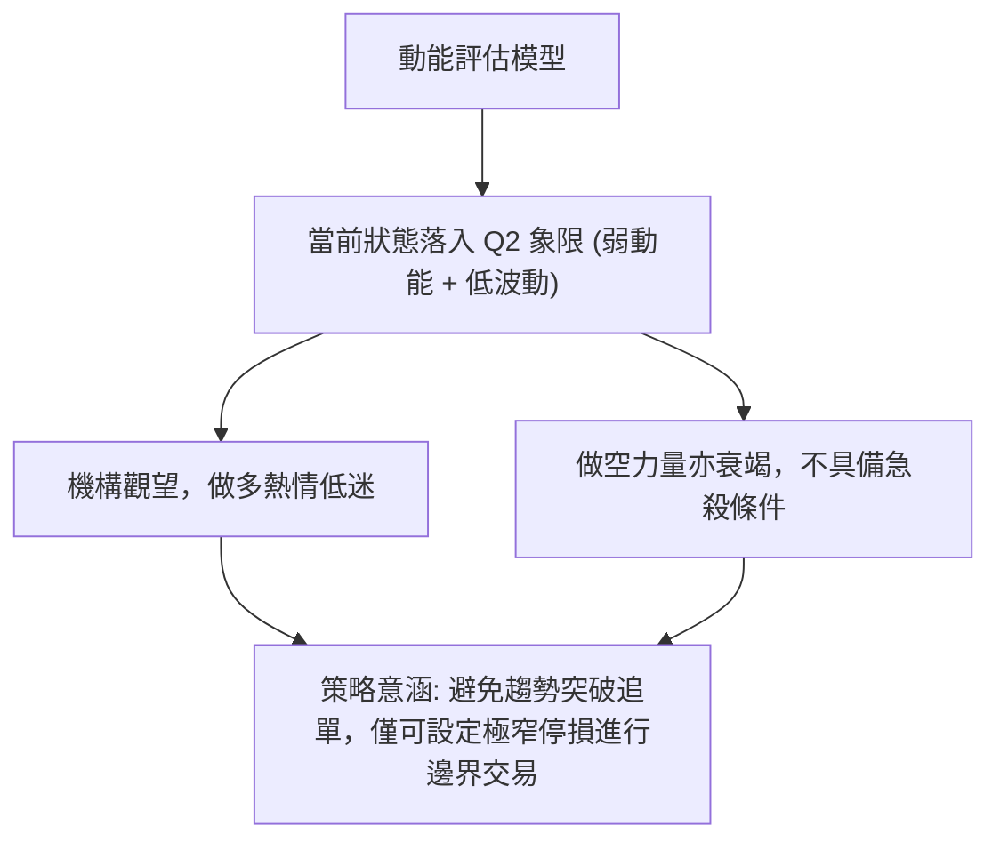

### 📊 ATR 波動率分析

- 數據中當前日線 ATR 標注為 `$N/A`，我們從近 20 週歷史高低區間進行實質波動測算：
  - 過去 5 週的週均振幅約在 **$0.70 - $0.90** 之間（例如 2026-09-27 週收 $16.58，次週收 $15.84，單週落差 $0.74）。
  - 推導日均波幅約為 **$0.35 - $0.45**。
- **止損距離建議**：
  在當前低波動震盪市況下，合理的技術性防守寬度應設定在日波幅的 1.5 至 2.0 倍，即 **$0.60 - $0.80**，以避免被無序的市場噪聲震盪掃地出場。

### 📐 Beta 與市場相關性

- **Beta 數值**：**2.208**
- **市場特徵解讀**：
  - SOFI 的 Beta 高達 2.208，屬於典型的**超高彈性標的**（波動幅度為標普 500 指數的 2.2 倍）。
  - **高 Beta 與當前低 ADX 的矛盾解讀**：目前 ADX 13.70 的低波動橫盤屬於「暴風雨前的平靜」。由於其內在 Beta 高達 2.2 以上，一旦大盤（S&P 500 / 納斯達克）出現大幅系統性波動，或公司內部迎來催化劑，橫盤格局將極易被打破，產生單日超過 5% 的劇烈單邊行情。這要求交易者在防守位設定上必須做到絕對精確，不可心存僥倖。

---

## 7. 多時框架總結

### 📋 時框架評分表

| 時框架 | 趨勢方向 | 動能狀態 | 均線排列 | 形態特徵 | 綜合評分 | 戰術建議 |
|--------|----------|----------|----------|----------|----------|----------|
| **月線 (長期)** | 🔴 明顯走熊 | 弱（回調未止） | 混合向下 | 自高點回撤 51% | **30/100** | 長線多頭嚴禁大額左側抄底。 |
| **週線 (中期)** | 🔴 箱體破位 | 負值（MACD柱負） | 空頭壓制 | 測試前低雙底 | **35/100** | 逢反彈 $18.70 附近為減倉解套點。 |
| **日線 (短期)** | 🟡 超賣橫盤 | 弱勢（RSI超賣） | 短期承壓 | 窄幅摩擦 | **38/100** | 僅適合極輕倉日內或短線區間套利。 |

### 🔲 綜合訊號矩陣

```
時框訊號一致性評估矩陣
────────────────────────────────────────────────────────
維度        長期 (月線)    中期 (週線)    短期 (日線)    矩陣一致性
────────────────────────────────────────────────────────
趨勢方向    空頭 (Bear)    空頭 (Bear)    盤整 (Neutral)  高度偏空 (80%)
均線排列    走平混合       空頭排列       空頭壓制       偏空 (85%)
量能架構    萎縮           持續縮量       持平 (0.99x)   空方佔優 (70%)
動能指標    下行           MACD柱負       RSI超賣鈍化    空方主導 (75%)
────────────────────────────────────────────────────────
總體判定    三級時框未出現方向衝突，空頭結構自上而下逐級壓制，盤整為次級反彈。
────────────────────────────────────────────────────────
```

### ⚖️ 多時框收斂結論

嚴格遵循本報告「嚴格要求 14」進行多時框收斂收斂：
1. **行情定性優先級**：當前 **ADX(14) = 13.70 < 25**，客觀判定當前市場處於 **「盤整行情」**。
2. **交易邊界界定**：盤整行情下，單邊趨勢突破策略失效。日線價格正逼近下檔極限支撐 $14.88，上方受制於 MA20 及破位點 $16.31。
3. **唯一方向性結論**：**中性偏空，區間防守觀望（偏空等級：34/100）**。
   - 儘管大週期（月線/週線）全面偏空，但短線由於 RSI 進入超賣且逼近 52 週最低點 $14.88，空頭下殺動能已嚴重衰竭，**不可在此位置盲目追空**。
   - 整體戰略以「空頭防守、等待超賣修正後再逢高沽空，或在硬支撐 $14.88 邊緣博弈極小止損的短線反彈」為主。

---

## 8. 交易策略建議

### 🗺️ 策略決策流程圖

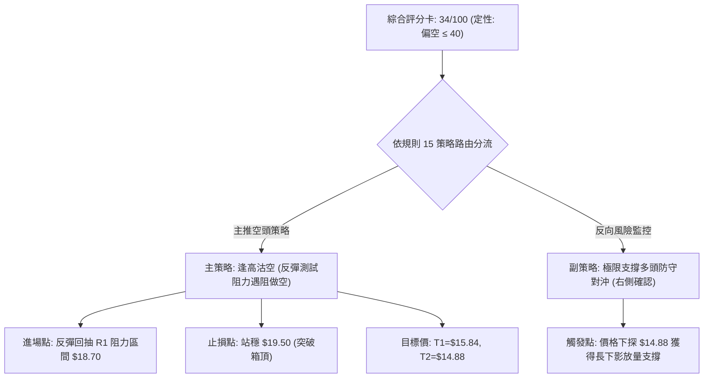

### 🧭 策略路由（依評分卡分流）

> **當前主策略方向 = 主推空頭策略（逢高沽空 / 防守偏空），多頭僅列為反轉風險提示（依綜合評分 34/100，嚴禁兩頭下注）。**

### 🎯 價格情境階梯（Price Scenarios）

所有價位均嚴格引用第 4 章「關鍵價位」與數據已計算數值：

| 觸發條件 | 下一目標 | 後續延伸 | 情境技術面含義 |
|----------|----------|----------|----------------|
| **跌破 S1 $15.62** | 測試 S2 **$14.88** | 跌破則開啟無支撐深淵 | 弱勢下探確認，空頭下壓釋放最後動能。 |
| **守住 $15.62-$15.84 區間** | 回抽中軌 **$17.32** | 測試反彈極限 R1 **$18.70** | 短期技術性超跌修復，維持底部箱型震盪。 |
| **放量突破 R1 $18.70** | 邁向 R2 **$21.70** | 挑戰 R3 **$25.91** | 中期下降通道被逆轉，空頭全面平倉（反轉信號）。 |

### 📊 情境機率分佈

```
情境機率分佈柱狀圖
區間震盪 (55%)   ████████████████████████████ 55%
探底破位 (30%)   ███████████████ 30%
強勢反彈 (15%)   ████████ 15%
```

| 情境類別 | 機率估算 | 主要依據與技術確認條件 |
|----------|----------|------------------------|
| **區間震盪 (主要場景)** | **55%** | ADX 13.70 顯示單邊動力缺乏；成交量持平（0.99x）；股價在 $14.88 - $17.30 構築磨底箱體。 |
| **回落探底 (次要場景)** | **30%** | -DI(26.09) 壓制 +DI(15.29)；OBV < MA 量能疲弱；空方微弱優勢推動慣性下探 $14.88。 |
| **反轉上行 (極低機率)** | **15%** | 均線空頭排列未變，MACD 處於零軸下方（-0.509），缺乏基本面或量能爆發催化劑。 |

### 🔴 主策略詳情：空頭操作方案（逢高沽空與破位跟進）

本策略依據綜合評分 34/100 制定。嚴禁在現價（$15.84）超賣區直接追空，策略採取**「反彈沽空」**與**「破位做空」**兩套方案：

| 策略要素 | 策略 A（主推：反彈遇阻沽空） | 策略 B（激進：破位順勢做空） |
|----------|------------------------------|------------------------------|
| **策略類型** | 逢高放空（反彈衰竭入場） | 關鍵低點破位追空 |
| **進場條件** | 價格反彈至斐波那契 78.6% 阻力位遇阻收陰 | 價格實體跌破 52 週最低點 $14.88 且量能放大 |
| **進場價格** | **$18.70**（精確引用 R1 回調位） | **$14.80**（確認破位 $14.88 後進場） |
| **目標價 T1** | **$15.84**（當前波段平台支撐） | **$13.71**（箱體垂直高度 1:1 測算目標） |
| **目標價 T2** | **$14.88**（52W 歷史最低點） | **$12.00**（分析師共識最低目標價） |
| **止損價格** | **$19.60**（高於 2026-08-23 週高點 $18.91） | **$15.62**（拉回近端支撐 S1 上方止損） |
| **風險報酬比** | **1 : 3.18**（風險 $0.90，目標 $2.86） | **1 : 3.41**（風險 $0.82，目標 $2.80） |
| **成功機率** | **65%**（順大週期趨勢） | **45%**（受假突破風險干擾） |
| **建議倉位** | **總資金 8% - 10%** | **總資金 3% - 5% (嚴格風控)** |

### 🟢 反向風險觸發點（對沖提示）

若市場出現以下情況，主空頭策略**立即失效並強制止損**：
1. **價位突破點**：日線收盤價強勢站上 **$18.70**（斐波那契 78.6% 阻力位），代表大級別破位形態被多頭修復。
2. **量能異動訊號**：單日成交量暴增至 80,000,000 股以上（約為當前均量的 1.8 倍），且伴隨 MACD 柱狀體翻正（由 -0.104 轉為正值）。
3. **空頭對沖操作**：一旦站穩 $18.70，空單應即刻平倉退場，激進者可反手建立 5% 倉位多單，目標看至斐波那契 61.8% 處的 **$21.70**。

### ⭐ 整體訊號強度評星

```
╔══════════════════════════════════════════╗
║ 做多訊號強度：★★☆☆☆  (1.8/5星) ── 偏弱   ║
║ 做空訊號強度：★★★★☆  (3.8/5星) ── 佔優   ║
║ 整體可信度：  ★★★★☆  (4.0/5星) ── 高度一致║
╚══════════════════════════════════════════╝
```

---

## 9. 風險提示與監控

### ✅ 關鍵監控指標 Checklist

```
╔══════════════════════════════════════════════════════════════╗
║               SOFI 交易風控每日核對清單 (Checklist)           ║
╠══════════════════════════════════════════════════════════════╣
║ [ ] 52W 低點硬防線：收盤價是否跌破 $14.88？(是: 開啟空頭加速) ║
║ [ ] RSI 動能鈍化：日線 RSI 是否在 30 以下形成向上金叉？       ║
║ [ ] ADX 趨勢甦醒：ADX 數值是否由 13.70 向上穿過 20 大關？    ║
║ [ ] MACD 柱狀體翻轉：MACD Hist 是否由 -0.104 向上收斂至 0？  ║
║ [ ] 異常巨量監控：日成交量是否突破 5,000 萬股 (量比 > 1.2x)？ ║
║ [ ] 空頭回補指標：Short Interest 14.8% 是否出現爆拉式軋空？ ║
╚══════════════════════════════════════════════════════════════╝
```

### ⚠️ 風險場景分析

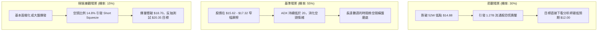

### 🛡️ 風險管理重要提醒

1. **高空頭比率引發的軋空風險（Short Squeeze Risk）**：
   - SOFI 當前 **Short % Float 高達 14.8%**，融券空單天數（Short Ratio）達 **4.68 天**。
   - 儘管技術指標偏空，但極高的空頭部位意味著一旦出現未預期的利多消息（如降息週期加快、同業併購或營收預喜），極易引發軋空踩踏，產生單日內 10%-15% 的非理性暴漲。因此，**絕對不可在 $15.84 附近執行無止損的重倉裸賣空**。
2. **極高 Beta 屬性引發的穿倉風險**：
   - **Beta = 2.208** 意味著市場下跌 1% 時，SOFI 平均下挫 2.21%。在投資組合管理中，若持有 SOFI 頭寸，必須按照一般權重股的 **50% 倉位比例** 進行配置折算，單一策略的最大曝險不可超過總投資組合的 **8%**。
3. **低動能磨底期的時間價值損耗**：
   - 當前 ADX 為 13.70，市場極度沉悶。對於選擇權（Options）交易者而言，此階段極度不利於單邊買方（Long Call / Long Put），將承受高額的時間價值（Theta）衰減。現階段僅適合現貨波段或嚴格帶止損的差價合約交易。

---

## 📋 報告總結

```
╔══════════════════════════════════════════════════════════════╗
║                 SOFI 技術分析報告總結                          ║
╠══════════════════════════════════════════════════════════════╣
║ 報告日期：2026-10-03                                         ║
║ 當前價格：$15.84                                             ║
║ 分析評級：⚖️ 偏空震盪盤整 (技術評分: 34/100)                  ║
║                                                              ║
║ 關鍵結論：                                                   ║
║ ├─ 長期趨勢：🔴 偏空運行，自高位回撤達 51.6%，處於深度去泡沫期║
║ ├─ 中期趨勢：🔴 箱體破位，跌破 $16.31 平台，中軌下移至 $17.32║
║ ├─ 短期趨勢：🟡 超賣震盪，受制於 ADX 13.70 弱動能，下殺趨緩  ║
║ ├─ 關鍵支撐：S1: $15.62 ｜ S2: $14.88 (52W 年度終極防線)     ║
║ ├─ 關鍵阻力：R1: $18.70 (斐波那契 78.6%) ｜ R2: $21.70 (61.8%)║
║ └─ 分析師目標：均價 $20.35 (低標 $12.00 / 高標 $30.00)       ║
║                                                              ║
║ 最優策略組合：                                               ║
║ 1. 🥇 最佳機會：耐受反彈至 $18.70 附近建立中線空單 (盈虧比 3.18)║
║ 2. 🥈 次選機會：密切監控 $14.88 硬支撐，若未破則空單全部止盈離場║
║ 3. 🥉 保守選擇：持幣觀望，等待 ADX 突破 20 確立明確突破方向  ║
╚══════════════════════════════════════════════════════════════╝
```

---

> ⚠️ **免責聲明**：本報告為技術分析研究，所有數據計算與走勢推導均嚴格基於所提供之歷史價格與量化指標。報告內容**僅供專業研究與學術參考**，**不構成任何形式的證券買賣推薦或投資諮詢意見**。金融市場具有高度不確定性，標的 Beta 值高達 2.208，交易者須自行評估市場風險並嚴格落實風控。

---

*報告生成時間：2026-10-03 ｜ 數據來源：Yahoo Finance ｜ 分析框架：多時框技術分析模型*