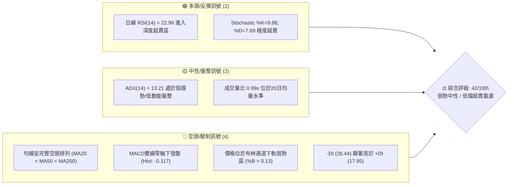
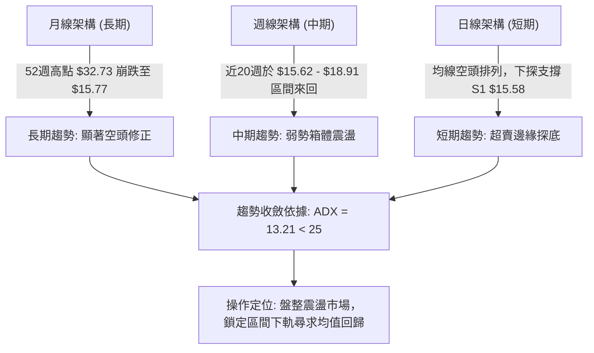
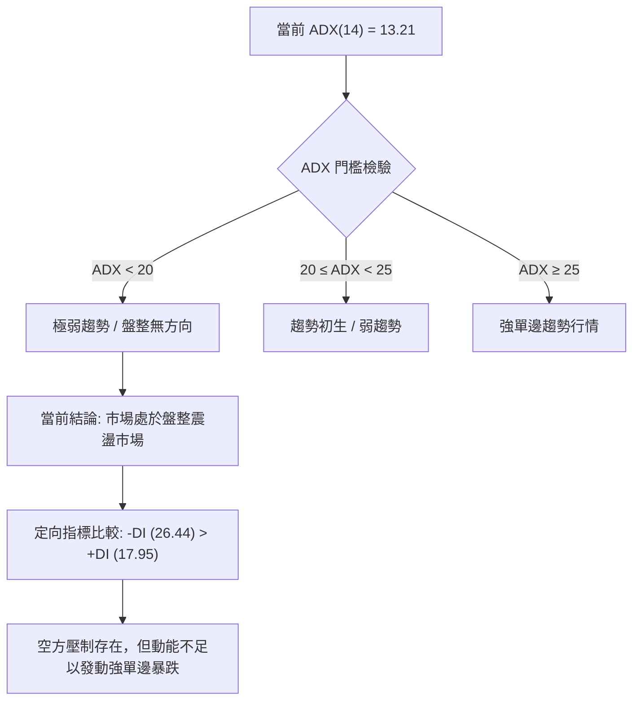
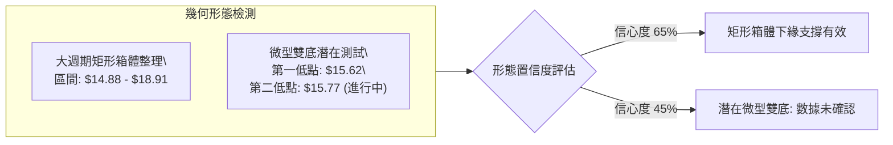
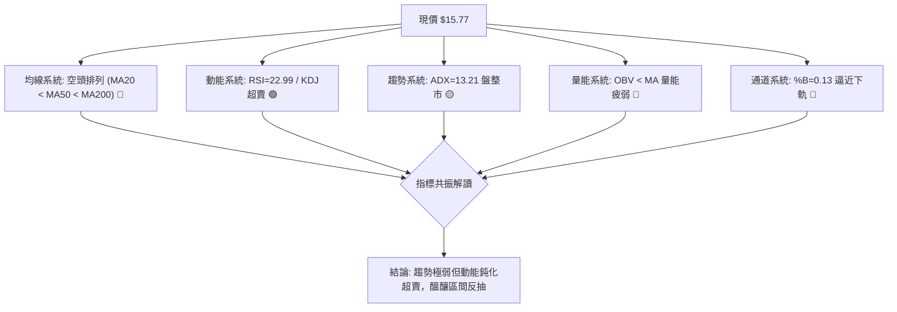
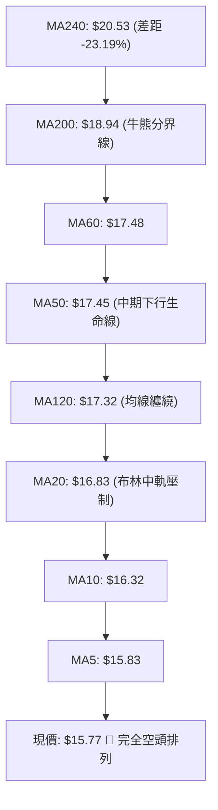
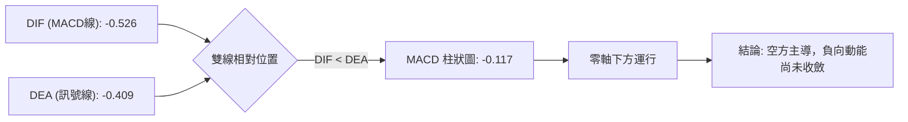
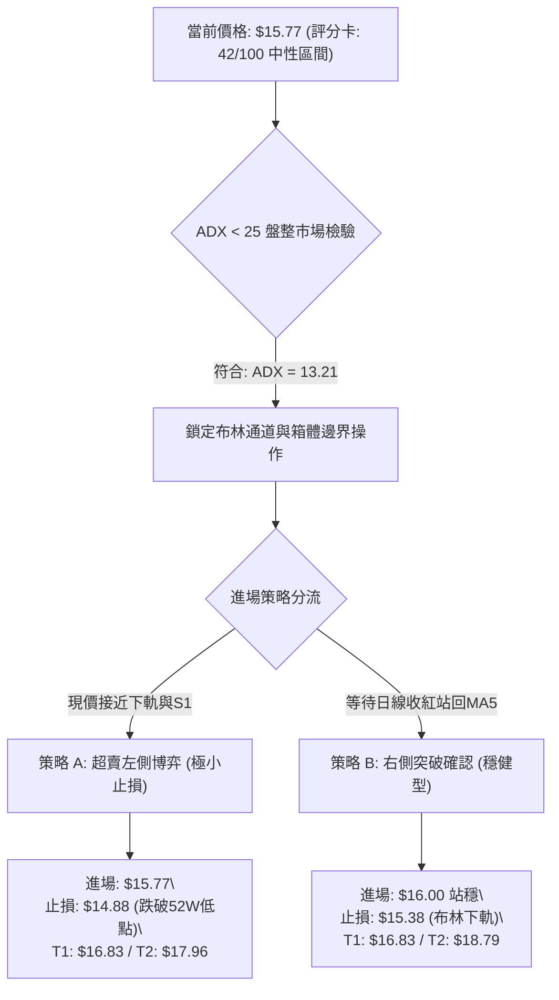
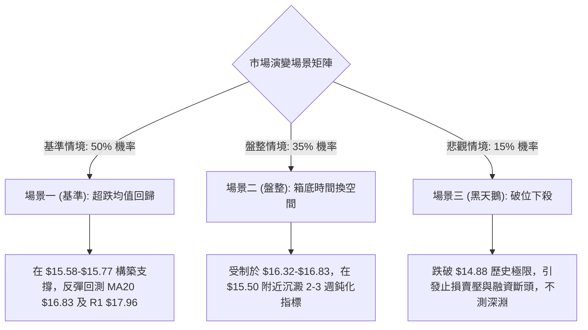

# SOFI 技術分析報告

> **報告日期**：2026-10-04 ｜ **語言**：繁體中文 ｜ **數據來源**：Yahoo Finance ｜ **當前價格**：$15.77

---

## 目錄

| 章節 | 內容 |
|------|------|
| [1. 技術面概覽](#1-技術面概覽) | 訊號儀表板、核心指標、評分卡 |
| [2. 趨勢分析](#2-趨勢分析) | 多時框趨勢、長中短期走勢、ADX強弱 |
| [3. 圖表形態分析](#3-圖表形態分析) | 形態識別、K線組合、目標價推算 |
| [4. 支撐與阻力](#4-支撐與阻力) | 關鍵價位、斐波那契回調 |
| [5. 技術指標深度解讀](#5-技術指標深度解讀) | MA/RSI/MACD/布林/成交量 |
| [6. 動能與波動率](#6-動能與波動率) | 動能評估、ATR、Beta |
| [7. 多時框架總結](#7-多時框架總結) | 時框架評分矩陣、收斂結論 |
| [8. 交易策略建議](#8-交易策略建議) | 策略路由、價格情境、交易計畫 |
| [9. 風險提示與監控](#9-風險提示與監控) | 監控指標、風險場景、部位控管 |
| [📋 報告總結](#-報告總結) | 核心結論與執行綱領 |

---

## 1. 技術面概覽

### 🎯 技術訊號儀表板



### 📊 核心指標速覽表

| 指標類別 | 指標名稱 | 當前數值 | 訊號 | 解讀 |
|:---|:---|:---:|:---:|:---|
| **價格** | 當前價格 | $15.77 | 🔴 | 位於52週區間5.0%分位，貼近年度波段低點 |
| **均線** | MA20 | $16.83 | 🔴 | 價格低於MA20達-6.29%，短線動能承壓 |
| **均線** | MA50 | $17.45 | 🔴 | 中期生命線下行，價格差距-9.63% |
| **均線** | MA200 | $18.94 | 🔴 | 長期牛熊分界線遙遙在上，整體格局屬空頭主導 |
| **動能** | RSI(14) | 22.99 | 🟢 | 跌破30超賣線，短線存在均值回歸反彈潛能 |
| **動能** | MACD | -0.526 | 🔴 | MACD線低於訊號線(-0.409)，柱狀圖-0.117看空 |
| **波動** | ATR(14) | $0.59 | 🟡 | 日波動率為3.77%，處於中等收斂波動區間 |
| **趨勢** | ADX(14) | 13.21 | 🟡 | 數值低於25，代表單邊趨勢衰竭，進入低動能整理 |
| **通道** | 布林帶 %B | 0.13 | 🔴 | 價格緊貼下軌($15.38)，反應強烈空方推壓 |
| **籌碼** | OBV走勢 | OBV < MA | 🔴 | 能量潮指標位於均線下方，量能缺乏主力吸籌跡象 |

### 🏆 技術評分卡

```
╔══════════════════════════════════════════════════════════════╗
║               技術評分卡 — SOFI (2026-10-04)                 ║
╠══════════════════════════════════════════════════════════════╣
║ 趨勢強度 (Trend)     ████░░░░░░░░░░░░░░░░  20/100  🔴 極弱空方 ║
║ 動能指標 (Momentum)  ████████░░░░░░░░░░░░  40/100  🟡 超賣醞釀 ║
║ 支撐穩定度 (Support) ████████████░░░░░░░░  60/100  🟡 前低防守 ║
║ 成交量配合 (Volume)  ████████░░░░░░░░░░░░  40/100  🔴 量能疲弱 ║
║ 形態完整度 (Pattern) ██████████░░░░░░░░░░  50/100  🟡 築底雛形 ║
║ 均線排列 (MA System) ████░░░░░░░░░░░░░░░░  20/100  🔴 空頭排列 ║
╠══════════════════════════════════════════════════════════════╣
║ 綜合技術評分         ████████░░░░░░░░░░░░  42/100  🟡 中性偏弱 ║
╚══════════════════════════════════════════════════════════════╝
```

---

## 2. 趨勢分析

### 🌐 多時框趨勢分析



### 📈 長期趨勢 — 12個月走勢圖（Unicode）

SOFI 過去一年走勢呈現極為清晰的「單頂崩跌後低檔橫盤」架構。2025年10-11月觸及 $29.72 高點（52週最高點為 $32.73）後，連續四個月遭遇機構大幅拋售，至2026年3月觸及 $15.88，隨後半年進入 $15.70 - $18.90 的窄幅箱體中摩擦。

```
SOFI 月線收盤走勢圖（2025-10 至 2026-10）
價格軸 ($)
$30.00 ┤        ●(29.68) ●(29.72 雙頂)
$27.00 ┤                  ●(26.18)
$24.00 ┤                           ●(22.81)
$21.00 ┤                                    
$18.00 ┤                                    ●(17.76)         ●(18.22) ●(17.93)   ●(17.88)
$15.00 ┤                                             ●(15.88) ●(16.10)         ●(16.31)    ●(15.72) ●(15.77 現價)
$12.00 ┤
       └─────────────────────────────────────────────────────────────────────────────
         25-10   25-11    25-12    26-01    26-02    26-03    26-04    26-05    26-06    26-07    26-08    26-09   26-10
```

#### 走勢特徵分析表格

| 階段區間 | 時間跨度 | 價格起迄 | 漲跌幅 | 核心技術特徵 |
|:---|:---:|:---:|:---:|:---|
| **頂部派發期** | 2025-10 ~ 2025-11 | $29.68 → $29.72 | +0.13% | 構築 $29.70 雙重頂，動能衰竭無法觸及歷史高 $32.73 |
| **主跌推動期** | 2025-12 ~ 2026-03 | $29.72 → $15.88 | -46.57% | 帶量單邊下殺，MA20、MA50相繼失守，呈現經典瀑布下瀉 |
| **箱體抗跌期** | 2026-04 ~ 2026-06 | $16.10 → $17.93 | +11.37% | 在 $16.00 關卡獲得買盤支撐，反彈受阻於 MA60 ($17.48) |
| **二次探底期** | 2026-07 ~ 2026-10 | $17.93 → $15.77 | -12.05% | 週線震盪走弱，逐步逼近年度低點 $14.88，量能顯著縮減 |

### 📊 中期趨勢（週線分析）

從近 20 週收盤走勢觀察，週線級別價格始終受困於狹幅通道。近三週收盤價分別為 $16.96、$16.58、$15.77，伴隨週線 RSI 由 39.7 降至 23.0，週成交量從 3.02 億股縮減至 2.17 億股，呈現典型的「量縮陰跌築底」特徵。

```
中期週線壓力與支撐階梯圖
  $18.91 ─────────────────── 近半年波段高點阻力 (2026-08-23)
              │
  $17.96 ─────┴───────────── 近期密集成交壓力帶 (R1)
              │
  $16.83 ─────┴───────────── 20日均線 / 布林中軌壓制位
              │
  $15.77 ◄────┼───────────── 【當前現價】日線超賣探底中
              │
  $15.58 ─────┴───────────── 近一年波段低點支撐聚類 (S1)
              │
  $14.88 ─────────────────── 52週歷史極值底線 (52W Low / 斐波 100%)
```

### ⚡ 趨勢強度評估（ADX 解讀）



#### ADX 強度與市場狀態對照表

| 指標變數 | 當前讀數 | 門檻區間 | 技術意義解讀 |
|:---|:---:|:---:|:---|
| **ADX(14)** | 13.21 | < 25 (弱趨勢) | 市場無持續性單邊趨勢，追空或盲目追多皆極易遭遇雙巴 |
| **+DI (14)** | 17.95 | 多方攻擊動能 | 多頭進攻意願低落，無法形成連續突破長紅 |
| **-DI (14)** | 26.44 | 空方施壓動能 | 空方維持控制權，但因 ADX 偏低，屬於壓制而非主跌推進 |
| **綜合判定** | 盤整市 | 震盪優先 | **依規則 14 規範：ADX < 25 時，操作必須嚴格以布林帶區間為導向** |

---

## 3. 圖表形態分析

### 🔍 形態識別系統

在多維幾何檢驗下，SOFI 自 2026 年 3 月以來的價格走勢呈現大型「矩形箱體（Rectangle Consolidation）」與微型「下降楔形（Falling Wedge）」的重疊雛形。



#### 形態置信度與數據驗證表

| 形態類別 | 信心度 | 判斷依據（引用數據） | 完成度 | 目標價（附嚴格計算式） |
|:---|:---:|:---|:---:|:---|
| **低檔矩形箱體** | 65% | 價格在近 6 個月多次於 $15.58~$15.88 獲得支撐，頂部受制於 R2 $18.79 | 75% | 箱頂 $18.79 - 箱底 $15.58 = 高度 $3.21<br>若向上突破目標 = $18.79 + $3.21 = **$22.00** |
| **潛在微型雙底** | 45% | 前波低點 $15.62 (2026-05-24) 與當前 $15.77 接近，但當前跌勢未止 | 40% | *訊號不足，僅做指標型解讀*（信心度低於50%，不作有效突破測距） |
| **均線空頭下壓形態** | 85% | MA20 ($16.83) < MA50 ($17.45) < MA200 ($18.94)，均線全面向下傾斜 | 100% | 均線反壓型態，反彈目標依序為 MA20 **$16.83** 與 R1 **$17.96** |

### 🕯️ 重要K線形態分析

| 觀測週期 | 結算收盤 | K線結構形態 | 量化指標特徵 | 技術訊號解讀 |
|:---|:---:|:---|:---|:---:|
| **2026-08-23 週** | $18.91 | 長上影流星線 (Shooting Star) | RSI 57.9，MACD柱自+0.112縮至+0.063 | 🔴 衝擊波段高點受挫，多頭波段見頂 |
| **2026-09-13 週** | $17.32 | 破位中長黑K | 週成交量大幅萎縮至 1.26 億股 | 🔴 量縮破中軌，進入陰跌探底通道 |
| **2026-09-27 週** | $16.58 | 光腳實體黑K | RSI 跌破 30 (28.9)，空頭加速下灌 | 🔴 賣壓持續釋放，直逼歷史下緣 |
| **2026-10-04 日** | $15.77 | 帶下影十字收斂星 | 成交量 44.38M (量比 0.99x)，RSI 22.99 | 🟢 觸及布林下軌引發空頭回補，探底喘息 |

### 📉 ASCII 走勢形態示意圖

```
SOFI 箱體整理與邊界壓力示意圖
$19.62 ┬────────────────────────────────────────── 阻力 R3
       │                                   ╭─ 波段高點 $18.91 (2026-08-23)
$18.79 ┼───────────────────╭───╮───────────│───── 阻力 R2 (箱體上緣)
       │       ╭───╮       │   │           │
$17.96 ┼───────│───│───────╯───╰───────────╰───── 阻力 R1 (密集成交區)
       │       │   │
$16.83 ┼───────│───│────────────────────────────── 布林中軌 / MA20
       │       │   ╰───────╮
$15.77 ┼───────│───────────│───────────────● 現價 $15.77
$15.58 ┼───╭──╯───────────╰───────────────┴───── 支撐 S1 (前波低點 $15.62 聚類)
       │   │
$14.88 ┴───╰────────────────────────────────────── 52週歷史低點 (極限支撐 S2 $14.91)
```

### 🎯 形態目標價計算

根據高置信度之「低檔矩形箱體」，計算潛在波動區間與反彈動能推估：
1. **箱體下邊界界定**：以波段低點聚類 S1 之 **$15.58** 為有效箱底。
2. **箱體中軸平衡點**：MA20 所在之 **$16.83** 為第一階段均值回歸目標。
3. **箱體上邊界目標（T1）**：阻力位 R1 **$17.96**（對應 +13.89% 幅度）。
4. **箱體突破極限推演（T2）**：阻力位 R2 **$18.79**（對應 +19.12% 幅度）。

---

## 4. 支撐與阻力

### 🗺️ 關鍵價位分布圖（Unicode）

```
SOFI 價位結構分布圖（數據精確對照）
══════════════════════════════════════════════════════════════════════
$19.62 ║████████████████████████████████████████║ 強阻力 R3 (+24.40%)
$18.94 ║----------------------------------------║ 長期生命線 MA200
$18.79 ║██████████████████████████████          ║ 波段阻力 R2 (+19.12%)
$18.70 ║----------------------------------------║ 斐波那契 78.6% 回調位
$17.96 ║████████████████████████████████████    ║ 關鍵頸線阻力 R1 (+13.89%)
$17.45 ║----------------------------------------║ 中期均線 MA50
$16.83 ║----------------------------------------║ 布林中軌 / MA20
$15.77 ╠════════════════════════════════════════╣ ◄ 當前現價 ($15.77)
$15.58 ║▓▓▓▓▓▓▓▓▓▓▓▓▓▓▓▓▓▓▓▓▓▓▓▓                ║ 近期關鍵支撐 S1 (-1.23%)
$15.38 ║----------------------------------------║ 布林通道下軌
$14.91 ║████████████████████████████████████████║ 極限強支撐 S2 (-5.45%)
$14.88 ║════════════════════════════════════════║ 52週歷史低點 (斐波 100%)
══════════════════════════════════════════════════════════════════════
```

### 🚧 阻力位分析表

所有阻力數值嚴格引用近一年波段高點聚類計算成果：

| 阻力級別 | 精確價位 | 距離現價 | 技術形成原因與結構 | 突破難度 | 戰略重要性 |
|:---|:---:|:---:|:---|:---:|:---:|
| **R1** | **$17.96** | +13.89% | 近一年密集換手聚類區、6-8月多次震盪平台底部 | 中等 | ★★★★☆<br>短線多空分水嶺 |
| **R2** | **$18.79** | +19.12% | 近一年波段高點聚類、2026年7-8月反彈高點集結區 | 極高 | ★★★★★<br>中期箱體頂蓋 |
| **R3** | **$19.62** | +24.40% | 2026年首季下跌中繼平台、跳空缺口反壓區 | 極難 | ★★★☆☆<br>長期牛熊轉換線 |

### 🛡️ 支撐位分析表

所有支撐數值嚴格引用近一年波段低點聚類計算成果：

| 支撐級別 | 精確價位 | 距離現價 | 技術形成原因與結構 | 守住機率 | 戰略重要性 |
|:---|:---:|:---:|:---|:---:|:---:|
| **S1** | **$15.58** | -1.23% | 近一年波段低點聚類、2026-05-24週低點($15.62)結構 | 70% | ★★★★☆<br>短線止跌關鍵屏障 |
| **S2** | **$14.91** | -5.45% | 近一年歷史低點聚類、緊鄰52週極限值 $14.88 | 85% | ★★★★★<br>多頭最後底線防區 |

### 📐 斐波那契回調位分析

依據 52 週完整波動區間（高點 **$32.73** → 低點 **$14.88**，垂直落差 $17.85）進行測算：

| 斐波那契比例 | 計算價位 | 當前相對位置與技術意涵 |
|:---:|:---:|:---|
| **0.0% (52W High)** | $32.73 | 2025年牛市極值頂部，目前屬遙遠天花板 |
| **23.6%** | $28.52 | 前期高檔盤整區下緣，深套重災區 |
| **38.2%** | $25.91 | 中期主跌浪第一波支撐轉阻力位 |
| **50.0%** | $23.80 | 全年多空平衡中軸（Psychological Pivot） |
| **61.8%** | $21.70 | 黃金分割強防守位，失守後確認進入熊市週期 |
| **78.6%** | $18.70 | **高度共振阻力**：與波段阻力 R2 ($18.79) 形成共振重合帶 |
| **100.0% (52W Low)**| $14.88 | 2026年年度極限底部支撐 |

**斐波那契落點解讀**：
當前價格 **$15.77** 精確座落於 **78.6% ($18.70)** 與 **100.0% ($14.88)** 之間的「終極回撤深水區」。價格已回吐過去一年漲幅的近 95%，代表下行空間受到歷史硬底支撐 S2 ($14.91) 與 100% 斐波位 ($14.88) 的強力托舉，跌勢邊際效應顯著遞減。

---

## 5. 技術指標深度解讀

### 🎛️ 指標訊號總覽



### 📈 移動平均線排列分析



#### 各週期移動平均線數據表

| 均線名稱 | 數值 | 距現價幅差 | 走勢特徵 | 訊號評估 |
|:---|:---:|:---:|:---|:---:|
| **MA5** | $15.83 | -0.40% | 短線下壓，極度貼近現價 | 🔴 短期壓制 |
| **MA10** | $16.32 | -3.39% | 加速向下傾斜 | 🔴 短空格局 |
| **MA20** | $16.83 | -6.29% | 20日平滑均線，短波段多空轉換樞紐 | 🔴 核心反壓 |
| **MA50** | $17.45 | -9.63% | 中期趨勢線持續走低 | 🔴 中期走空 |
| **MA60** | $17.48 | -9.80% | 與 MA50 形成雙重阻力帶 | 🔴 季線反壓 |
| **MA120** | $17.32 | -8.97% | 半年線走平後微幅下彎 | 🟡 結構弱化 |
| **MA200** | $18.94 | -16.74% | 經典年線反壓，長期空頭壓制線 | 🔴 長期走空 |
| **MA240** | $20.53 | -23.19% | 240日超長期均線持續鈍化 | 🔴 遠端套牢 |

### 📉 RSI(14) 分析

* 當前 RSI(14) 讀數：**22.99**（極度超賣區）
* 進度條展示：
  `[████░░░░░░░░░░░░░░░░] 22.99%` （閾值：超賣 <30，超買 >70）

#### 背離現象嚴格審查：
* **指標背離判定**：**無明顯底背離**。
* **技術依據**：日線價格自 2026-09-06 的 $18.22 跌至當前 $15.77 過程中，RSI 指標由 49.5 順暢下滑至 23.0，指標低點同步伴隨價格創下波段新低，未見「價格破新低而 RSI 抬高」的底背離多頭訊號。
* **操作涵義**：當前超賣屬於動能慣性釋放所致，雖具備均值回歸條件，但因缺乏底背離確認，反彈型態多為V轉抽搐或低檔橫向以時間換空間。

### 📊 MACD(12/26/9) 訊號解讀



* **MACD 線**：-0.526 位於零軸下方深處。
* **訊號線 (Signal)**：-0.409 位於零軸下方。
* **MACD 柱狀圖 (Histogram)**：-0.117，柱狀圖持續在零軸下方延伸，顯示負向動能仍未轉折向上，短線空方力量尚未被多頭有效瓦解。

### 📦 布林通道分析

```
布林通道現狀剖面示意圖 (帶寬: $18.28 - $15.38 = $2.90)
$18.28 ┬────────────────────────────────────────── 布林上軌 (Upper Band)
       │
       │
$16.83 ┼────────────────────────────────────────── 布林中軌 (MA20)
       │
$15.77 ┼───● 現價 $15.77 (%B = 0.13)
$15.38 ┴────────────────────────────────────────── 布林下軌 (Lower Band)
```

* **上軌**：$18.28
* **中軌 (MA20)**：$16.83
* **下軌**：$15.38
* **%B 指標**：**0.13**（價格位於下軌往上僅 13% 處，高度貼近下軌）。
* **帶寬狀態解讀**：通道帶寬開口約 $2.90（佔股價 18.4%），未出現喇叭口極端放大，配合 ADX 13.21，顯示價格觸及下軌 $15.38 附近具備高機率觸發下軌彈性支撐。

### 💹 成交量分析（量價配合度）

* **最新成交量**：44,379,400 股
* **20日均量**：44,796,015 股（量比：**0.99x**，量能完全持平）
* **50日均量**：51,834,266 股（量縮約 14.4%）
* **OBV 走勢**：OBV < MA（能量潮指標落後於其移動平均線）

**量價綜合研判**：
量比 0.99x 顯示今日下探過程並無恐慌性爆量殺盤，但亦無大資金進場點火掃貨的痕跡。OBV 走勢持續低迷，反映籌碼面仍處於大戶觀望、散戶低檔換手狀態，空方摜壓動能雖已減弱，但缺乏進攻型增量資金確認反轉。

---

## 6. 動能與波動率

### ⚡ 動能評估四象限

```
動能與波動率定位矩陣
       高波動 (ATR > 5%)
           │
     Q3    │    Q4
  強動能   │  弱動能
  高風險   │  破位崩跌
───────────┼───────────
     Q1    │    Q2 ◄ 【SOFI 當前定位】
  強動能   │  弱動能 / 低波動 (ATR 3.77%, ADX 13.21)
  最佳突破 │  低檔盤整沉澱 (均值回歸機會)
           │
       低波動 (ATR < 4%)
```

#### 象限狀態評估表

| 象限代號 | 動能強度 | 波動率狀態 | 當前符合 | 戰略解讀與應對策略 |
|:---:|:---:|:---:|:---:|:---|
| **Q1** | 強 (+DI主導) | 低波動 | 否 | 最佳趨勢佈局點，目前不具備此條件 |
| **Q2** | **弱 (-DI弱主導)**| **低中波動** | **✓ 符合** | **低動能底部沉澱期，易出現區間來回拉鋸，適合區間高拋低吸** |
| **Q3** | 強 (單邊爆發) | 高波動 | 否 | 狂暴主升/主跌浪，當前 ADX 過低排除了該狀態 |
| **Q4** | 弱 (無序崩殺) | 高波動 | 否 | 恐慌性無差別拋售，當前成交量顯示市場並非恐慌殺跌 |

### 📊 ATR 波動率分析

* **當前 ATR(14)**：**$0.59**
* **相對價格波動率**：**3.77%**（計算式：$0.59 / $15.77 × 100%）
* **波動特徵**：處於正常波動水平，未出現極端波動失控。

#### 戰術止損距離換算建議：
* **保守型保護止損 (1.0 × ATR)**：$0.59 → 下檔緩衝價位 **$15.18**
* **波段寬鬆止損 (1.5 × ATR)**：$0.885 → 下檔緩衝價位 **$14.88**（恰好共振 52 週歷史最低點）
* **激進緊湊止損 (0.5 × ATR)**：$0.295 → 下檔緩衝價位 **$15.47**

### 📐 Beta 與市場相關性

* **Beta 係數**：**2.208**（極高系統性波動敏感度）
* **市場解讀**：
  SOFI 擁有高達 2.208 的 Beta 值，表明其對標普 500 與納斯達克指數具備超過兩倍的波動放大效應。當大盤反彈時，SOFI 具備極強的彈性爆發力；然而在總體市場風險偏好轉弱時，該標的亦往往承受倍數的拋售壓力。
* **空頭比例（Short Interest）配合**：
  Short Float 達 **14.8%**，Short Ratio 為 **4.68 天**。在高 Beta 疊加高放空比例的環境下，一旦價格站回 MA20 ($16.83)，極易觸發空頭回補帶動之軋空（Short Squeeze）連鎖效應。

---

## 7. 多時框架總結

### 📋 時框架評分表

| 時框架 | 趨勢方向 | 動能狀態 | 均線排列 | 關鍵形態特徵 | 綜合評分 | 戰略建議 |
|:---|:---:|:---:|:---:|:---:|:---:|:---|
| **長期 (月線)** | 🔴 下行空頭 | 弱向平衡 | 空頭排列 | 高檔 $29.72 雙頂暴跌後的築底震盪期 | 30/100 | 嚴格控制長期核心持倉規模 |
| **中期 (週線)** | 🟡 箱體震盪 | 柱狀圖負向 | 均線糾纏偏空 | 受制於 $18.91，下測 $15.62 支撐平台 | 45/100 | 採取箱體上下緣高拋低吸思維 |
| **短期 (日線)** | 🟡 探底超賣 | RSI 22.99 | 完全空頭 | 緊貼布林下軌 $15.38，尋求 S1 止跌 | 50/100 | 具備超跌均值回歸反抽博弈價值 |

### 🔲 綜合訊號矩陣

```
訊號維度檢驗矩陣
┌──────────────┬──────────────┬──────────────┬──────────────┐
│  檢驗維度    │  短期 (日線)  │  中期 (週線)  │  長期 (月線)  │
├──────────────┼──────────────┼──────────────┼──────────────┤
│ 趨勢一致性   │ 🔴 空方壓制  │ 🟡 區間震盪  │ 🔴 空頭週期  │
│ 動能共振度   │ 🟢 極度超賣  │ 🔴 偏空轉弱  │ 🔴 衰退平緩  │
│ 均線健康度   │ 🔴 全線失守  │ 🔴 承壓MA20  │ 🔴 跌破年線  │
│ 量能確認度   │ 🟡 持平觀望  │ 🔴 量縮陰跌  │ 🟡 正常換手  │
└──────────────┴──────────────┴──────────────┴──────────────┘
多維度共振結果: 【弱勢箱體下軌的超賣均值回歸狀態】
```

### ⚖️ 多時框收斂結論

> **依據「嚴格要求 14」之多時框收斂優先級指引**：
> 1. **趨勢/盤整判定**：當前 ADX(14) 讀數為 **13.21**（顯著低於 25 門檻），確認當前非強單邊行情，而是**典型的弱勢盤整/箱體震盪行情**。
> 2. **主導維度收斂**：在盤整行情中，日線級別均線排列（雖然呈現空頭）之單邊殺傷力被鈍化，交易焦點應轉移至**布林通道下軌與關鍵支撐聚類的邊界效應**。
> 3. **終極方向性結論**：**中性偏多（低檔超賣均值回歸反抽）**。中長期趨勢雖偏空，但在現價已達 52 週低點區間 5.0% 分位、RSI 進入 22.99 極端超賣、且極度接近支撐 S1 ($15.58) 與布林下軌 ($15.38) 的環境下，順勢放空之風險報酬比極為惡劣；相反地，依據盤整規則，在箱體下邊界博弈回抽布林中軌/MA20 之反彈，具備優異的風控防守點。

---

## 8. 交易策略建議

### 🗺️ 策略決策流程圖



### 🧭 策略路由（依評分卡分流）

**當前主策略方向 = 【中性區間反彈操作（Range Bound Rebound）】（依技術評分 42/100 評定）**
因評分座落於 40–60 之中性區間，且 ADX 僅 13.21，明確定義為「布林通道區間交易」。操作邏輯以**在布林下軌及 S1 支撐處建立均值回歸多單**為主，向上挑戰布林中軌 MA20 與阻力 R1；嚴禁在現價盲目追空。

### 🎯 價格情境階梯（Price Scenarios）

所有引用階梯價位嚴格對應第 4 章計算之波段聚類數值：

| 觸發條件與關鍵門檻 | 下一目標位 | 後續延伸測試 | 市場情境與技術含義 |
|:---|:---:|:---:|:---|
| **強勢突破阻力 R1 ($17.96)** | 阻力 R2 ($18.79) | 阻力 R3 ($19.62) | 空頭結構瓦解，日線展開波段反彈，軋空加速 |
| **反彈站上布林中軌 ($16.83)** | 阻力 R1 ($17.96) | MA50 ($17.45) | 短線空翻多，確認築底成功，由弱轉強 |
| **現價區間震盪 ($15.58 - $16.32)** | MA20 ($16.83) | 支撐 S1 ($15.58) | 低檔籌碼換手，指標在超賣區進行時間換空間修復 |
| **有效跌破支撐 S1 ($15.58)** | 支撐 S2 ($14.91) | 52W Low ($14.88)| 陰跌走勢延續，下測歷史極限鐵底 |
| **不幸失守 52W Low ($14.88)** | 數據外無支撐 | 自由落體探底 | 52週歷史支撐徹底崩毀，不可預測之下跌深淵 |

### 📊 情境機率分佈

```
情境機率分佈圓形推估 (總和 100%)
┌─────────────────────────────────────────────────────────┐
│ 區間低檔反彈 (50%) ▓▓▓▓▓▓▓▓▓▓▓▓▓▓▓▓▓▓▓▓▓▓▓▓▓            │
│ 窄幅區間震盪 (35%) ▓▓▓▓▓▓▓▓▓▓▓▓▓▓▓▓                     │
│ 破底加速回落 (15%) ▓▓▓▓▓▓▓                              │
└─────────────────────────────────────────────────────────┘
```

| 情境類別 | 機率預估 | 主要指標與結構依據 |
|:---|:---:|:---|
| **區間低檔反彈 (Rebound)** | **50%** | RSI 達 22.99 極端超賣、KDJ進入低檔個位數區、逼近布林下軌 $15.38 |
| **窄幅區間震盪 (Consolidation)** | **35%** | ADX 13.21 顯示動能枯竭、量比 0.99x 顯示無主動殺盤，易在 $15.50-$16.30 摩擦 |
| **破底加速回落 (Breakdown)** | **15%** | 均線空頭排列及 MACD 負柱狀體仍具威脅，若大盤重挫可能拖累失守 $14.88 |

### 🟢 主策略詳情（區間反彈多頭策略）

本策略專為捕捉超賣均值回歸設計，止損與目標完全鎖定數據包提供之關鍵價位：

| 策略要素 | 策略 A（左側超賣博弈型） | 策略 B（右側確認進場型） |
|:---|:---:|:---:|
| **進場條件** | 現價或回踩 S1 獲得下影線支撐 | 日線突破 MA5 ($15.83) 且收盤確認 |
| **進場價格** | **$15.77** | **$16.00** |
| **目標價 T1 (中軌)** | **$16.83**（MA20 / 布林中軌，+6.72%） | **$16.83**（MA20 / 布林中軌，+5.19%） |
| **目標價 T2 (波段)** | **$17.96**（關鍵阻力 R1，+13.89%） | **$18.79**（強阻力 R2，+17.44%） |
| **止損價格** | **$14.88**（跌破 52W Low / 斐波 100%）| **$15.38**（跌破當前布林下軌） |
| **最大風險 / 報酬比** | **1 : 2.46**（風險 $0.89 vs 報酬 $2.19）| **1 : 4.50**（風險 $0.62 vs 報酬 $2.79）|
| **成功機率估計** | 60% | 55% |
| **建議配置倉位** | **5% - 8%**（輕倉防守試單） | **10% - 12%**（標準波段配置） |

### 🔴 反向風險觸發點（對沖提示）

若出現下列信號，意味主推之「區間反彈策略」宣告失效，必須立刻停損或反向對沖：
1. **硬性停損點觸發**：日線收盤價實體跌破 **$14.88**（52週歷史低點），代表波段箱體徹底破位。
2. **量能異動警告**：單日成交量突破 8,000 萬股（均量近 2 倍）伴隨大黑K摜破 **S1 $15.58**。
3. **ADX 突變**：ADX 突破 25 且 -DI 劇烈飆升突破 35，意味著弱勢整理轉化為新一輪單邊空頭崩跌行情。

### ⭐ 整體訊號強度評星

```
做多訊號強度 (超賣均值回歸)：★★★☆☆  (3/5星 — 賠率佳但缺乏右側確認)
做空訊號強度 (順勢破位追空)：★☆☆☆☆  (1/5星 — 空間極度受限，盈虧比惡劣)
整體技術可信度 (盤整區間)：  ★★★★☆  (4/5星 — 邊界清晰，風控點明確)
```

---

## 9. 風險提示與監控

### ✅ 關鍵監控指標 Checklist

```
╔══════════════════════════════════════════════════════════════╗
║               每日盤後技術監控清單 (Checklist)               ║
╠══════════════════════════════════════════════════════════════╣
║ [ ] 價格防禦：收盤價是否嚴格防守在 S1 $15.58 之上？         ║
║ [ ] 極限底線：盤中是否刺穿 52週歷史低點 $14.88？             ║
║ [ ] 動能修復：RSI(14) 是否成功自 22.99 脫離超賣區回升至 30？ ║
║ [ ] 反彈進度：日線是否成功挑戰並站上布林中軌 MA20 $16.83？   ║
║ [ ] MACD 轉折：MACD 柱狀圖是否收斂至 -0.050 之內醞釀金叉？   ║
║ [ ] 量能異動：單日成交量是否出現 > 6,000 萬股之帶量長紅K？   ║
╚══════════════════════════════════════════════════════════════╝
```

### ⚠️ 風險場景分析



### 🛡️ 風險管理重要提醒

1. **Beta 槓桿風險**：SOFI 的 Beta 為 **2.208**，若標普 500 指數單日修正 1.5%，SOFI 在統計上有下挫超過 3.3% 的系統性風險。總部位不得超過投資組合總資金之 **10%–12%**。
2. **高空頭比軋空雙面刃**：Short Float 為 **14.8%**，雖然為未來反彈提供了潛在的軋空燃料，但在未出現放量上攻前，空頭仍握有定價優勢，切勿過早重倉逆勢摸底。
3. **ATR 波動防護**：以日波動 ATR **$0.59** 為基數，日內浮動虧損未達 1.5 倍 ATR 前應保持定力，避免在開盤震盪中被雜訊洗出場外；然一旦觸及絕對防守線 **$14.88**，必須無條件執行停損離場。

---

## 📋 報告總結

```
╔══════════════════════════════════════════════════════════════════╗
║                    SOFI 技術分析報告總結                         ║
╠══════════════════════════════════════════════════════════════════╣
║ 報告日期：2026-10-04                                             ║
║ 當前價格：$15.77 (位於 52W 區間 5.0% 分位)                       ║
║ 技術評分：42 / 100                                               ║
║ 分析評級：⚖️ 弱勢中性（低動能盤整 / 深度超賣反抽態勢）           ║
╠══════════════════════════════════════════════════════════════════╣
║ 關鍵結論：                                                       ║
║ ├─ 長期趨勢：🔴 偏空（52週高點 $32.73 腰斬後低檔摩擦）           ║
║ ├─ 中期趨勢：🟡 弱勢箱體整理（波段區間 $15.58 至 $18.91）       ║
║ ├─ 短期趨勢：🟢 深度超賣反抽（RSI=22.99，貼近布林下軌 $15.38）   ║
║ ├─ 關鍵支撐：S1 $15.58 ｜ 極限防守 S2 $14.91 / 52W Low $14.88    ║
║ ├─ 關鍵阻力：中軌 $16.83 ｜ 阻力 R1 $17.96 ｜ 阻力 R2 $18.79     ║
║ └─ 分析師共識：Hold 評級 ｜ 平均目標價 $20.35                    ║
╠══════════════════════════════════════════════════════════════════╣
║ 最優策略組合：                                                   ║
║ 1. 🥇 最佳機會：在現價 $15.77 至 S1 $15.58 區間輕倉博弈超跌反抽， ║
║               停損鎖定 $14.88，第一目標 MA20 $16.83 (R:R = 2.46) ║
║ 2. 🥈 次選機會：等待日線收盤突破站穩 MA5 ($15.83)，右側追擊至 R1 ║
║ 3. 🥉 保守選擇：完全空倉觀望，直至價格有效站上 MA20 $16.83 再行介入║
╚══════════════════════════════════════════════════════════════════╝
```

---

> ⚠️ **免責聲明**：本報告為 AI 自動生成之技術分析研究報告，所有技術數據、價位區間及估算均嚴格基於所提供之歷史交易資訊與量化演算法生成。本報告**僅供研究、學術探討與教學參考**，**不構成任何形式的投資建議、要約或買賣推薦**。金融市場波動劇烈且充滿不確定性，投資人應獨立評估自身風險承受能力，入市需謹慎。

---

*報告生成時間：2026-10-04 ｜ 數據來源：Yahoo Finance ｜ 分析框架：多時框技術分析模型*