# SOFI 技術分析報告

> **報告日期**：2026-10-06 ｜ **語言**：繁體中文 ｜ **數據來源**：Yahoo Finance ｜ **當前價格**：$15.92

---

## 目錄

| 章節 | 內容 |
|------|------|
| [1. 技術面概覽](#1-技術面概覽) | 訊號儀表板、核心指標、評分卡 |
| [2. 趨勢分析](#2-趨勢分析) | 多時框趨勢、長中短期走勢 |
| [3. 圖表形態分析](#3-圖表形態分析) | 形態識別、K線組合、目標價 |
| [4. 支撐與阻力](#4-支撐與阻力) | 關鍵價位、斐波那契回調 |
| [5. 技術指標深度解讀](#5-技術指標深度解讀) | MA/RSI/MACD/布林/成交量 |
| [6. 動能與波動率](#6-動能與波動率) | 動能評估、ATR、Beta |
| [7. 多時框架總結](#7-多時框架總結) | 時框架評分矩陣 |
| [8. 交易策略建議](#8-交易策略建議) | 多空策略、風險報酬比 |
| [9. 風險提示與監控](#9-風險提示與監控) | 監控指標、風險場景 |

---

## 1. 技術面概覽

### 🎯 技術訊號儀表板

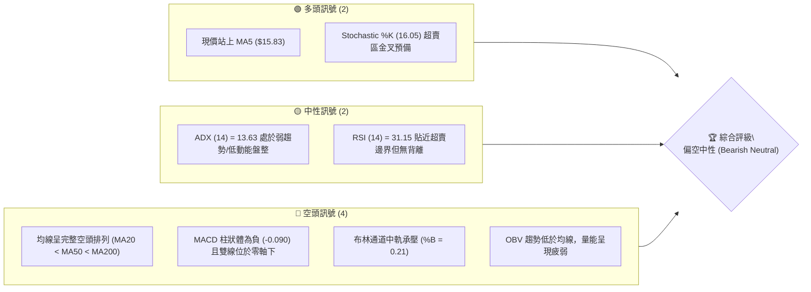

### 📊 核心指標速覽表

| 指標類別 | 指標名稱 | 當前數值 | 訊號 | 解讀 |
|----------|----------|----------|------|------|
| **價格** | 當前價格 | $15.92 | 🔴 | 位於 52 週區間 5.8% 處，處於極低位震盪 |
| **均線** | MA20 | $16.71 | 🔴 | 現價低於 MA20 (-4.75%)，短線承壓中軌 |
| **均線** | MA50 | $17.44 | 🔴 | 現價低於 MA50 (-8.69%)，中期下行結構未變 |
| **均線** | MA200 | $18.89 | 🔴 | 現價低於 MA200 (-15.72%)，長期處於空頭領域 |
| **動能** | RSI(14) | 31.15 | 🟡 | 位於 30 邊緣，瀕臨超賣但未見明確底部背離 |
| **動能** | MACD (12,26,9) | -0.521 / -0.431 | 🔴 | 雙線位於零軸下方，柱狀圖 -0.090 偏空延續 |
| **動能** | Stochastic | %K 16.05 / %D 12.89 | 🟢 | 極度超賣區黃金交叉，短線具備技術反彈空間 |
| **趨勢** | ADX(14) / ±DI | 13.63 (-DI 25.08) | 🟡 | ADX < 25 弱趨勢/盤整，但空頭主導 (-DI > +DI) |
| **波動** | ATR(14) | $0.58 (3.62%) | 🟡 | 每日平均震盪 $0.58，波動率處於中等收斂階段 |
| **量能** | 量比 (20MA) | 1.04x | 🟡 | 成交量 48.03M 略高於 20 日均量，但 OBV 疲弱 |

### 🏆 技術評分卡

```
╔══════════════════════════════════════════════════════════════════╗
║                技術評分卡 — SOFI (2026-10-06)                   ║
╠══════════════════════════════════════════════════════════════════╣
║ 趨勢強度 (Trend)     ██████░░░░░░░░░░░░░░  30/100  🔴 空頭排列  ║
║ 動能指標 (Momentum)  ████████░░░░░░░░░░░░  40/100  🟡 超賣初彈  ║
║ 支撐穩定度 (Support) ████████████░░░░░░░░  60/100  🟡 考驗低位  ║
║ 成交量配合 (Volume)  ████████░░░░░░░░░░░░  38/100  🔴 量能疲弱  ║
║ 形態完整度 (Pattern) ████████░░░░░░░░░░░░  42/100  🟡 箱底震盪  ║
║ 均線系統 (MA Align)  ████░░░░░░░░░░░░░░░░  20/100  🔴 嚴格空排  ║
╠══════════════════════════════════════════════════════════════════╣
║ 綜合技術評分         ███████░░░░░░░░░░░░░  38/100  🔴 偏弱觀望  ║
╚══════════════════════════════════════════════════════════════════╝
```

---

## 2. 趨勢分析

### 🌐 多時框趨勢分析

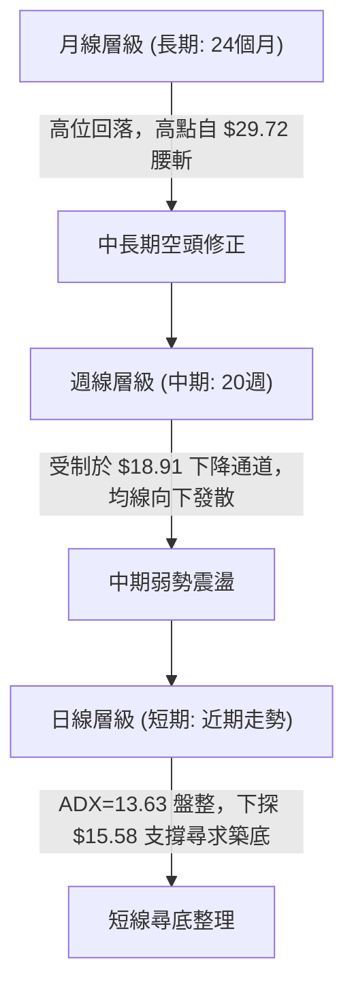

### 📈 長期趨勢 — 12個月走勢圖（Unicode）

以下為 SOFI 過去 12 個月（2025-11 至 2026-10）之月線收盤價走勢示意：

```
SOFI 月線走勢圖（2025-11 至 2026-10）
價格軸 ($)
$30.00 ┤ ●(2025-11 $29.72 歷史波段高點)
$27.50 ┤   ●
$25.00 ┤
$22.50 ┤       ●
$20.00 ┤
$17.50 ┤           ●                   ●       ●
$15.00 ┤               ●       ●   ●               ●   ●←當前現價 $15.92
       └─────────────────────────────────────────────────────────────
         11   12   01  02  03  04  05  06  07  08  09  10 (月份)
```

#### 走勢特徵分析表格

| 階段區間 | 起始價 → 結束價 | 漲跌幅 | 走勢特徵與結構 |
|----------|----------------|--------|----------------|
| **高位派發期** (2025-11 ~ 2026-02) | $29.72 → $17.76 | -40.24% | 跌破各短中天期均線，量能放大但價格崩跌，主力籌碼退潮 |
| **低位築底嘗試** (2026-02 ~ 2026-05) | $17.76 → $18.22 | +2.59% | 於 $15.88 附近獲得短暫支撐，反彈至 $18.22，形成籌碼換手 |
| **二次探底期** (2026-05 ~ 2026-10) | $18.22 → $15.92 | -12.62% | 反彈波段在 $18.91 受阻，隨後節節下挫，重新測試 $15.00 大關 |

### 📊 中期趨勢（週線分析）

從近 20 週數據觀察，SOFI 在 2026-08-23 曾創下波段高點 $18.91，週線 RSI 達到 57.9，但受制於 MA200 ($18.89) 與下降壓力線。隨後連續 6 週收陰，一路回落至 2026-10-04 的 $15.77，當週 RSI 降至 23.0 的極度超賣狀態。目前週成交量自 8 月初的 4.83 億股大幅萎縮至近期的 2.23 億股，反映拋壓已逐漸衰竭。

```
近期中期壓力與支撐階梯圖：
$18.91 ───────────────────── [2026-08 高點阻力 / MA200 壓力聚類]
   │   ▼ -6.4%
$17.70 ~ $17.96 ──────────── [波段平台下緣轉換為 R1 壓力]
   │   ▼ -11.4%
$15.92 ═════════════════════ [現價位置：貼近下軌徘徊]
   │   ▼ -2.2%
$15.58 ───────────────────── [S1 近一年波段低點支撐]
   │   ▼ -4.3%
$14.91 / $14.88 ──────────── [S2 / 52週最低點強支撐]
```

### ⚡ 趨勢強度評估（ADX 解讀）

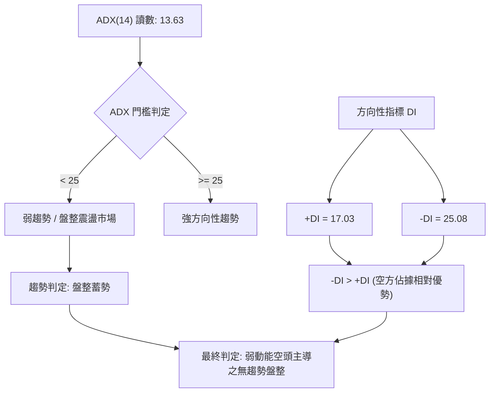

#### ADX 強度對照與解讀

| 指標變數 | 當前數值 | 參考區間 | 解讀結論 |
|----------|----------|----------|----------|
| **ADX(14)** | 13.63 | < 20 極弱趨勢 | 市場動能散失，趨勢指標失效，均線呈糾結鈍化前期 |
| **+DI** | 17.03 | 多方進攻強度 | 多方動能低落，買盤追價意願不足 |
| **-DI** | 25.08 | 空方進攻強度 | 空方力量仍大於多方，但未達 30 以上的強發散狀態 |
| **行情定性** | **無趨勢盤整** | ADX < 25 | **依收斂規則，本質為盤整行情，操作應側重震盪下軌低吸與布林通道軌道** |

---

## 3. 圖表形態分析

### 🔍 形態識別系統

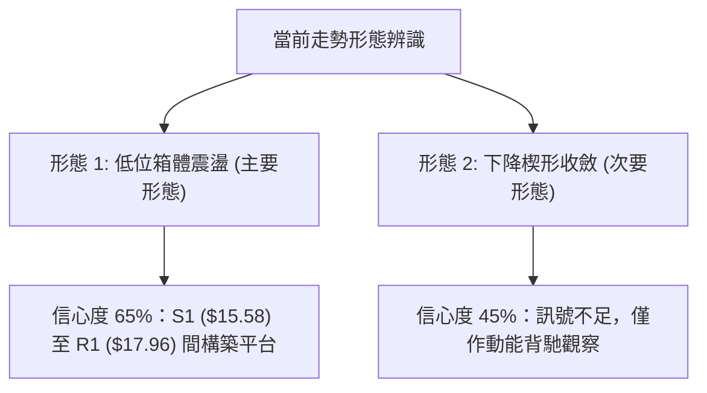

#### 形態識別與信心度評估表

| 形態類別 | 信心度 | 判斷依據（引用數據） | 完成度 | 目標價（附計算式） |
|----------|--------|----------------------|--------|--------------------|
| **水平箱體震盪 (Box Range)** | **65%** | 價格在 S1 $15.58 與 R1 $17.96 之間反覆拉鋸，且 ADX 為 13.63 表明處於非趨勢期 | 75% | 若突破箱頂 $17.96：$17.96 + ($17.96 - $15.58) = **$20.34**（數據阻力聚類指向 R3 $19.62 與分析師均價 $20.35） |
| **下降通道 (Descending Channel)** | **45%** | 自 8 月高點 $18.91 下跌至 $15.77，斜率向下；但信心度 < 50%，數據不足以確認幾何對稱 | 50% | 訊號不足，依規則僅做均線壓制解讀，不預設延伸目標 |

### 🕯️ 重要K線形態分析

| 週/月份 | 收盤價 | K線形態 | 解讀 | 訊號 |
|---------|--------|---------|------|------|
| **2026-08-23** | $18.91 | 長上影十字倒錘星 | 衝高觸碰 MA200 ($18.89) 後遭遇解套盤強烈拋壓，週成交量縮至 2.53 億 | 🔴 頂部力竭 |
| **2026-09-27** | $16.58 | 大陰線破位 | 連續擊穿 MA20 ($16.71) 與 MA60 ($17.44)，跌破短期中樞支撐 | 🔴 空方加速 |
| **2026-10-04** | $15.77 | 下影長針錘頭線 | 探底至接近 52 週低點附近後收腳，單週 RSI 觸及 23.0 極度超賣 | 🟢 賣壓竭盡 |
| **2026-10-11** | $15.92 | 短陽止跌星 (即時) | 價格回穩於 $15.83 (MA5) 之上，成交量 48.03M 溫和回升，醞釀底背離 | 🟡 止跌信號 |

### 📉 ASCII 走勢形態示意圖

```
SOFI 短期箱體形態示意圖 (2026-08 ~ 2026-10)
價位 ($)
$18.91 ┼─────────● (波段高點阻力 2026-08-23)
$18.50 │         ╱ ╲
$18.00 │        ╱   ╲   [箱體上沿 R1: $17.96] ──────────────────
$17.50 │       ╱     ╲     ╱╲
$17.00 │      ╱       ╲   ╱  ╲
$16.50 │     ╱         ╲ ╱    ╲   [布林中軌 MA20: $16.71]
$16.00 │    ╱           ▼      ╲      ●現價: $15.92
$15.58 ┼───●────────────────────●────┴── [箱體下沿 S1: $15.58 支撐]
$14.91 ┼───────────────────────────────── [52W 低點 S2: $14.91 / $14.88]
```

### 🎯 形態目標價計算

以目前完成度較高之「$15.58 ~ $17.96 水平箱體」進行推算：
1. **箱體高度 (H)** = $17.96 (箱頂阻力 R1) - $15.58 (箱底支撐 S1) = **$2.38**
2. **多頭向上突破目標價 (T_Bull)** = 箱頂 $17.96 + $2.38 = **$20.34**（極度貼近分析師共識均價 $20.35 與斐波那契回調位的過渡區間）
3. **空頭向下跌破目標價 (T_Bear)** = 箱底 $15.58 - $2.38 = **$13.20**（若摜破 S2 $14.91 則向下尋求 $13.20 延伸支撐）

---

## 4. 支撐與阻力

### 🗺️ 關鍵價位分布圖（Unicode）

```
╔══════════════════════════════════════════════════════════════════╗
║               SOFI 價位結構分布圖 (由 OHLCV 計算)                ║
╠══════════════════════════════════════════════════════════════════╣
║ $19.62 ║████████████████████████║ 強波段阻力 R3 (+23.23%)        ║
║ $18.79 ║████████████████████    ║ 關鍵均線阻力 R2 (+18.00%)      ║
║ $17.96 ║████████████████████████║ 近期箱頂阻力 R1 (+12.81%)      ║
║ $16.71 ║▓▓▓▓▓▓▓▓▓▓▓▓            ║ 布林中軌 / MA20 短壓 (+4.96%)  ║
║ $15.92 ╠════════════════════════╣ ◄ 當前現價 ($15.92)            ║
║ $15.58 ║▓▓▓▓▓▓▓▓▓▓▓▓▓▓▓▓        ║ 近期波段低點支撐 S1 (-2.16%)   ║
║ $14.91 ║████████████████████████║ 52W 低點強支撐 S2 (-6.34%)     ║
╚══════════════════════════════════════════════════════════════════╝
```

### 🚧 阻力位分析表

所有數值嚴格引用數據包「關鍵價位」區塊：

| 阻力級別 | 價位 | 形成原因 | 突破難度 | 重要性 |
|----------|------|----------|----------|--------|
| **R1** | **$17.96** | 近一年波段高點聚類、布林通道上軌 ($18.06) 附近重疊壓力 | 中等 | 🟢 短線多空強弱分水嶺 |
| **R2** | **$18.79** | 200 日移動平均線 (MA200 = $18.89) 密集套牢解套區 | 極高 | 🔴 中期牛熊反轉分界線 |
| **R3** | **$19.62** | 歷史大型盤整平台下沿轉換之極強反壓位 | 極高 | 🔴 多頭波段進攻極限目標 |

### 🛡️ 支撐位分析表

所有數值嚴格引用數據包「關鍵價位」區塊：

| 支撐級別 | 價位 | 形成原因 | 守住機率 | 重要性 |
|----------|------|----------|----------|--------|
| **S1** | **$15.58** | 近一年波段低點聚類、布林下軌 ($15.37) 上方守衛點 | 60% | 🟡 短線多頭最後防線 |
| **S2** | **$14.91** | 52 週最低點 ($14.88) 歷史護盤買盤聚集區 | 80% | 🟢 全年強支撐基石 |

### 📐 斐波那契回調位分析

依據數據包提供的 52 週區間（$14.88 → $32.73，總跨度 $17.85）之斐波那契回調位：

```
$32.73 ├───────────────────────────────────────── 0.0% (52W High)
$28.52 ├───────────────────────────────────────── 23.6%
$25.91 ├───────────────────────────────────────── 38.2%
$23.80 ├───────────────────────────────────────── 50.0%
$21.70 ├───────────────────────────────────────── 61.8%
$18.70 ├───────────────────────────────────────── 78.6% (貼近 R2 $18.79 / MA200)
$15.92 ├─── ◄ 現價位於 78.6% ~ 100.0% 深度回撤區間 (弱勢深水區)
$14.88 └───────────────────────────────────────── 100.0% (52W Low)
```

#### 斐波那契結構深度解讀
- **現價位置**：現價 $15.92 處於 78.6% 回調位 ($18.70) 與 100.0% 低點 ($14.88) 之間，屬於極度深度的回撤區。
- **結構意涵**：跌破 61.8% ($21.70) 與 78.6% ($18.70) 後，中長期上升浪型已被破壞，當前行情定性為**大週期級別的回撤築底或熊市低位震盪**。
- **上方首要斐波那契壓制**：若展開反彈，78.6% 位置 ($18.70) 將與 R2 阻力 ($18.79) 產生共振，形成雙重共振強阻力區。

---

## 5. 技術指標深度解讀

### 🎛️ 指標訊號總覽

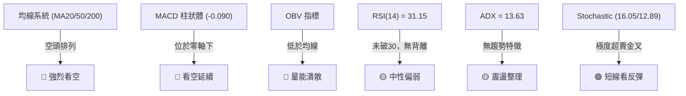

### 📈 移動平均線排列分析

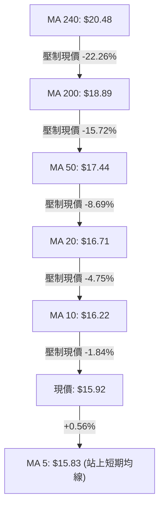

#### 均線數據全景解讀
- **均線排列狀態**：當前 MA20 ($16.71) < MA50 ($17.44) < MA200 ($18.89)，屬於典型且標準的**空頭排列**（Death Cross Alignment）。
- **短線細節**：現價 $15.92 剛收復 5 日線 (MA5 = $15.83)，但 MA10 ($16.22) 即刻橫亙於上方，構成第一道動態壓制。
- **扣抵角分析**：MA60 ($17.44) 與 MA120 ($17.31) 呈現微幅倒掛，長期均線 MA240 高達 $20.48，顯示過去一年中進場的平均籌碼全面套牢，任何反彈均會面臨解套賣壓。

### 📉 RSI(14) 分析

```
RSI(14) 當前水平: 31.15
[0] ────────────── [30] ─── [31.15] ────────────────────── [70] ────────────── [100]
超賣區 (Oversold)    ▲ 現價落點 (貼近超賣邊界)                超買區 (Overbought)
進度條: ██████░░░░░░░░░░░░░░ 31.15%
```

- **超買超賣判定**：數值 31.15 貼近 30 臨界超賣門檻，且上週週線 RSI 曾觸及 23.0 之極端值，說明下行動能已接近動能衰竭區。
- **背離診斷**：
  - 日線維度：價格於 2026-10-04 探底 $15.77，當前微升至 $15.92，RSI 自低點回升至 31.15，**暫無標準底背離（無更低價格配更高 RSI），僅屬於超賣後的技術修復**。
  - 結論：背離信號未確認，不可盲目重倉追多。

### 📊 MACD(12/26/9) 訊號解讀

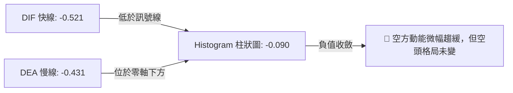

- **MACD 線性讀數**：DIF (-0.521) 位於 DEA (-0.431) 下方，雙線均處於負值深水區（遠低於 0 軸），代表大趨勢空方處於全面掌控。
- **柱狀圖動態**：當前 Hist 為 -0.090，相較於前兩週的 -0.117 與 -0.145 出現縮減收斂跡象，暗示**空頭殺跌力道正在減退**，具備醞釀零軸下低位金叉的雛形。

### 📦 布林通道分析

```
SOFI 日線布林通道 (20, 2) 結構示意圖：
$18.06 ┬────────────────────────────────────────── BB 上軌 (Upper Band)
       │
$16.71 ┼────────────────────────────────────────── BB 中軌 (MA20)
       │                 
$15.92 ┼─────────────────── ● 現價 ($15.92, %B = 0.21)
       │
$15.37 ┴────────────────────────────────────────── BB 下軌 (Lower Band)
```

- **軌道寬度與位置**：上軌 $18.06，下軌 $15.37，通道寬度約 $2.69 (16.9%)。
- **%B 指標解讀**：%B = 0.21，明確落於 0.0 ~ 0.5 的弱勢下半區間，顯示價格持續受到中軌向下擠壓。
- **觸軌反彈測試**：現價距離下軌 $15.37 僅有 $0.55 的安全邊際，通常在無重大系統性風險且 ADX < 25 的盤整市中，%B 接近 0.20 以下易誘發均值回歸買盤，向上測試中軌 $16.71。

### 💹 成交量分析（量價配合度）

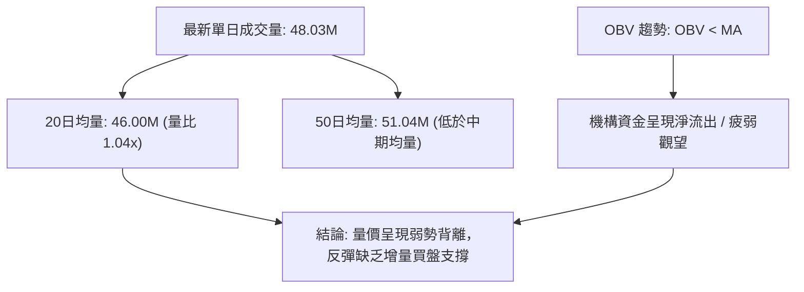

- **量價配合診斷**：最新成交量 48.03M 雖略高於 20 日均量 (1.04x)，但近 4 週週成交量自 8 月的 4 億股以上腰斬至 2 億股左右。
- **OBV 能量潮解讀**：OBV 明確低於其均線，代表在過去兩個月的下行過程中，逢低承接盤並未形成放量堆積，價格的回穩主要是由於空方拋壓竭盡（Volume Dry-up），而非多方主力強勢介入。

---

## 6. 動能與波動率

### ⚡ 動能評估四象限

| 象限 | 動能維度 (Momentum) | 波動率維度 (Volatility) | 當前標的狀態 | 交易策略意涵 |
|:---:|:---:|:---:|:---:|:---|
| **Q1** | 強動能 (Bullish) | 低波動 (Low Vol) | ─ | 趨勢穩健推升，順勢做多 |
| **Q2** | 弱動能 (Bearish) | 低波動 (Low Vol) | **✓ 當前 SOFI 歸屬 (Q2)** | **處於盤整磨底階段，宜減倉觀望或嚴格區間操作** |
| **Q3** | 強動能 (Bullish) | 高波動 (High Vol) | ─ | 主升衝刺階段，緊盯高位風控 |
| **Q4** | 弱動能 (Bearish) | 高波動 (High Vol) | ─ | 恐慌崩跌殺戮期，全面避險 |

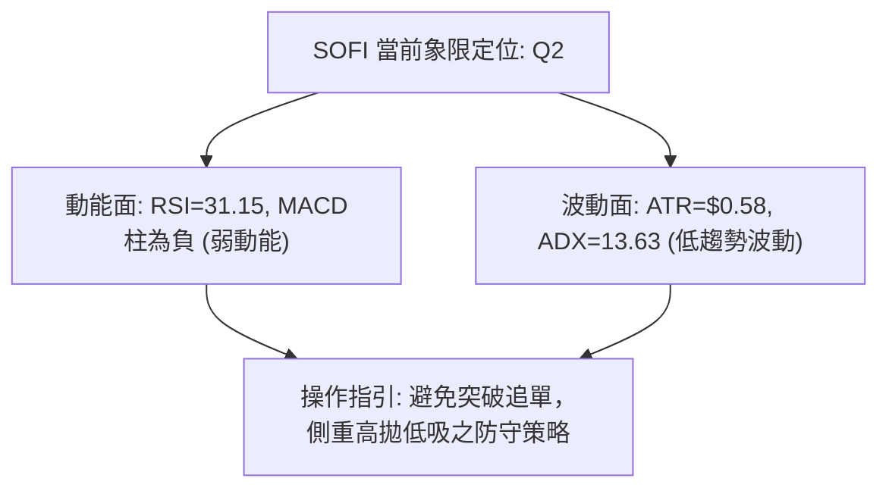

### 📊 ATR 波動率分析

- **ATR(14) 讀數**：**$0.58**（佔當前股價之 **3.62%**）。
- **日內安全邊際**：當前單日價格正常波動幅度約為 ±$0.58。任何小於此幅度的日間波動均屬於市場雜訊。
- **風控止損建議計算**：
  - **保守型交易者**：建議止損距離設定為 2.0 × ATR = 2.0 × $0.58 = **$1.16**。
  - **進取型交易者**：建議止損距離設定為 1.5 × ATR = 1.5 × $0.58 = **$0.87**。

### 📐 Beta 與市場相關性

- **Beta 係數**：**2.332**。
- **市場敏感度解讀**：SOFI 具備典型高 Beta 成長型 Fintech 股特徵，其價格波動幅度為標普 500 指數的 2.33 倍。當大盤微跌 1% 時，理論上 SOFI 跌幅恐擴大至 2.3% 以上；同理，在大盤反彈時亦具備更強之槓桿效應。目前弱勢盤整背景下，高 Beta 特質將放大下檔脆弱性。

---

## 7. 多時框架總結

### 📋 時框架評分表

| 時框架 | 趨勢方向 | 動能狀態 | 均線排列 | 圖表形態 | 綜合評分 | 建議方向 |
|--------|----------|----------|----------|----------|:---:|:---:|
| **月線 (長期)** | 🔴 下行偏空 | 弱勢回撤 | 承壓於 MA240 | 雙頂派發後尋底 | 30/100 | 防禦觀望 |
| **週線 (中期)** | 🔴 空頭延續 | 極度超賣 | 空頭排列 | 下降通道延伸 | 35/100 | 等待止跌結構 |
| **日線 (短期)** | 🟡 盤整尋底 | 超賣金叉 | 空頭排列 (站上MA5) | 水平箱底震盪 | 45/100 | 短線區間波段 |

### 🔲 綜合訊號矩陣

```
時框衝突與一致性診斷矩陣：
┌───────────┬──────────────┬──────────────┬──────────────┐
│ 維度      │ 日線 (短期)  │ 週線 (中期)  │ 月線 (長期)  │
├───────────┼──────────────┼──────────────┼──────────────┤
│ 趨勢方向  │ 🟡 盤整震盪  │ 🔴 空頭下行  │ 🔴 空頭修正  │
│ 均線架構  │ 🔴 壓制沉重  │ 🔴 空頭發散  │ 🟡 接近基期  │
│ 動能指標  │ 🟢 超賣初彈  │ 🟡 嚴重超賣  │ 🔴 動能走弱  │
│ 關鍵價位  │ 守衛 S1$15.58│ 承壓 R1$17.96│ 守衛 S2$14.91│
└───────────┴──────────────┴──────────────┴──────────────┘
```

### ⚖️ 多時框收斂結論

> **依嚴格要求 14 之收斂規則判定**：
> 1. **趨勢/盤整判定**：當前 ADX(14) 讀數為 **13.63 (< 25)**，技術面嚴格定義為**「無趨勢之盤整行情」**。
> 2. **主導時框取捨**：依規則，盤整行情中應**以日線布林通道軌道 ($15.37 ~ $18.06) 及支撐阻力聚類為核心交易區間**，週線與月線之空頭均線則定義為「反彈之上檔硬阻力」。
> 3. **唯一收斂方向**：**【中性偏弱觀望，僅限下軌防守型區間波段】**。評分卡得分為 38/100（介於 35~40 偏弱邊界），主策略遵循盤整低吸原則，但嚴防跌破 S1 觸發中長期空頭延續。

---

## 8. 交易策略建議

### 🗺️ 策略決策流程圖

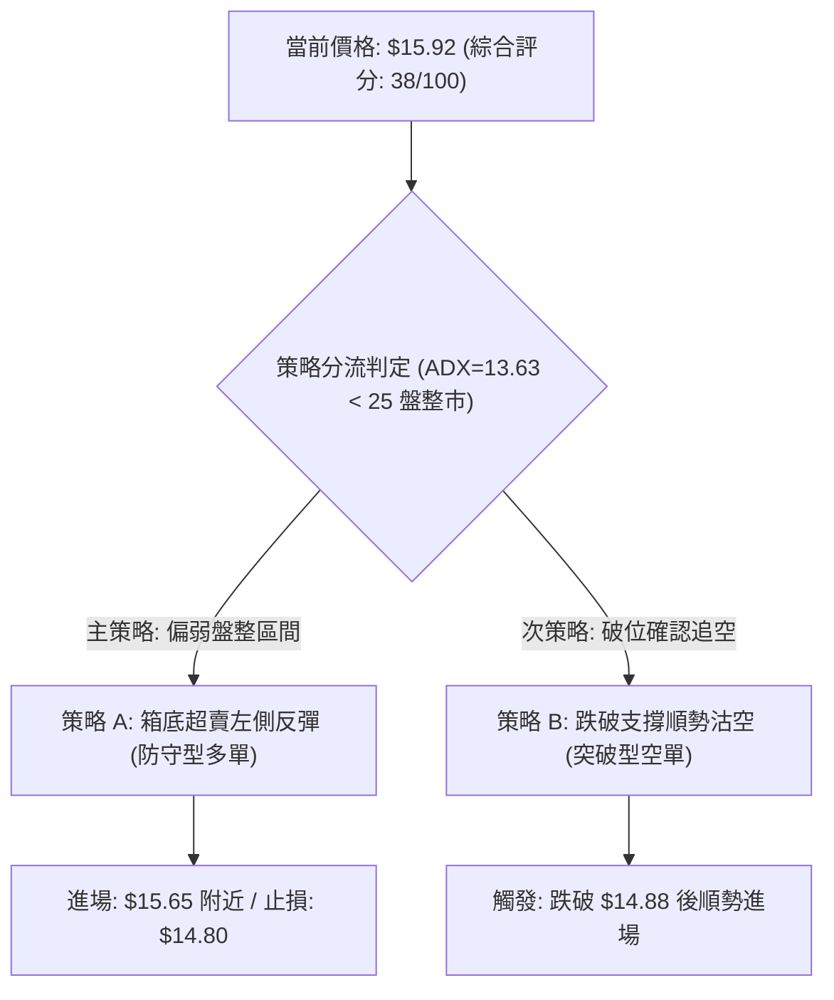

### 🧭 策略路由

**當前主策略方向 = 【偏弱區間操作／箱底防守型低吸】（依綜合評分 38/100 定位）**

由於當前 ADX 僅 13.63，且 Stochastic 超賣金叉、價格緊貼支撐 S1 ($15.58) 與布林下軌 ($15.37)，雖然綜合評分處於偏空領域，但做空盈虧比極差。故主策略採取**「貼近關鍵支撐位之超跌短多博弈」**；若確認摜破強支撐，則立即轉為空頭防禦。

### 🎯 價格情境階梯（Price Scenarios）

價位嚴格引用關鍵價位區塊已計算之數值：

| 觸發條件 | 下一目標 | 後續延伸 | 情境含義 |
|----------|----------|----------|----------|
| **強勢突破 R1 $17.96** | 阻力 R2 $18.79 | 阻力 R3 $19.62 | 突破日線布林上軌與箱頂，技術面確認中期轉強 |
| **突破 MA20 $16.71** | 阻力 R1 $17.96 | 阻力 R2 $18.79 | 短線走出底部，向上測試箱體上限 |
| **維持現價 $15.92 震盪** | 中軌 $16.71 | 支撐 S1 $15.58 | 維持低動能弱勢築底拉鋸，時間換取空間 |
| **跌破 S1 $15.58** | 強支撐 S2 $14.91 | 52W 低點 $14.88 | 短線結構破位，下探考驗年內歷史大底 |
| **跌破 S2 $14.91 / $14.88**| 形態推算 $13.20 | — | 宣告箱體破位，開啟大週期級別新一輪主跌段 |

### 📊 情境機率分佈

| 情境劇本 | 機率 | 主要依據 |
|----------|:---:|----------|
| **箱體內弱勢反彈** | **50%** | Stochastic 於超賣區黃金交叉，RSI 瀕臨 30 邊界，價格貼近布林下軌，空方拋壓枯竭 |
| **底層區間窄幅橫盤**| **30%** | ADX 僅 13.63 表明無趨勢動能，OBV 疲弱無大資金介入，成交量萎縮至低水位 |
| **擊穿 S2 再探底** | **20%** | 均線呈現嚴格空頭排列，MACD 處於零軸下方，Beta 高達 2.33 若遇大盤回調恐破位 |

### 🟢 主策略詳情（方向：區間防守型操作）

策略所有價位均直接取自關鍵價位（S1: $15.58, S2: $14.91, 52W Low: $14.88, MA20: $16.71, R1: $17.96, R2: $18.79）：

| 策略要素 | 策略 A（箱底低吸多單） | 策略 B（破位順勢空單） |
|----------|------------------------|------------------------|
| **策略類型** | 逆勢超賣博值博率 (反彈策略) | 順勢跌破放量追空 (破位策略) |
| **進場條件** | 回踩 S1 $15.58 不破且 1小時線出陽線 | 實體日K線收盤跌破 S2 $14.91 及 $14.88 |
| **進場價格** | **$15.65** (S1 支撐上方) | **$14.80** (確認跌穿 52W 低點) |
| **目標價 T1** | **$16.71** (布林中軌 / MA20) | **$13.20** (由箱體高度 $2.38 破位推算) |
| **目標價 T2** | **$17.96** (箱體頂部阻力 R1) | **$12.00** (華爾街分析師最低目標價) |
| **止損價格** | **$14.85** (跌穿 52W 低點 $14.88) | **$15.58** (回抽重返 S1 支撐上方) |
| **風險空間** | $15.65 - $14.85 = $0.80 | $15.58 - $14.80 = $0.78 |
| **獲利空間(T1)**| $16.71 - $15.65 = $1.06 | $14.80 - $13.20 = $1.60 |
| **風險報酬比** | **1 : 1.33** (至T1) / **1 : 2.89** (至T2) | **1 : 2.05** (至T1) / **1 : 3.59** (至T2) |
| **成功機率** | **55%** | **45%** |
| **建議倉位** | **5% ~ 10%** (輕倉試探) | **10% ~ 15%** (破位加碼) |

### 🔴 反向風險觸發點（對沖提示）

- **多頭持倉之止損警報**：若日K線收盤價跌破 **$14.88**（52 週最低點），所有低吸多單必須無條件離場，意味著築底失敗，破位風險急劇擴大。
- **空頭部位之平倉警報**：若日K線以放量長陽突破 **$16.71**（MA20），空方必須立即平倉，代表短底成型，行情將直奔 R1 ($17.96)。

### ⭐ 整體訊號強度評星

```
╔══════════════════════════════════════════════════════════════════╗
║ 做多訊號強度：★★☆☆☆  (2/5星 - 僅屬超賣技術反彈)                 ║
║ 做空訊號強度：★★★☆☆  (3/5星 - 均線空頭但缺乏下殺動能)         ║
║ 整體可信度：  ★★★☆☆  (3/5星 - ADX極低，盤整市雜訊偏多)          ║
╚══════════════════════════════════════════════════════════════════╝
```

---

## 9. 風險提示與監控

### ✅ 關鍵監控指標 Checklist

```
╔══════════════════════════════════════════════════════════════════╗
║                   SOFI 每日技術風控監控清單                      ║
╠══════════════════════════════════════════════════════════════════╣
║ [ ] 價格能否守穩短期 MA5 ($15.83) 與支撐 S1 ($15.58)             ║
║ [ ] RSI(14) 能否維持在 30 之上並擺脫弱勢鈍化區間                ║
║ [ ] 日成交量能否放大超越 20 日均量 (46.00M) 形成放量突破        ║
║ [ ] MACD 柱狀體能否翻正 (突破 0 軸) 構成日線金叉                 ║
║ [ ] 布林通道 %B 能否向上穿越中軌 0.50 (即站上 $16.71)           ║
║ [ ] 跌破 S2 ($14.91) 觸發 100% 斐波那契極限時啟動硬止損         ║
╚══════════════════════════════════════════════════════════════════╝
```

### ⚠️ 風險場景分析

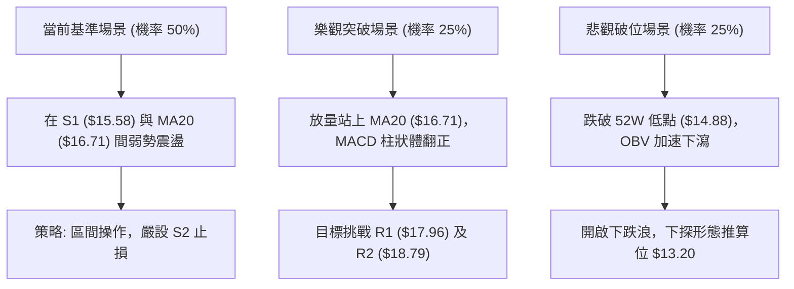

### 🛡️ 風險管理重要提醒

1. **高 Beta 波動懲罰**：SOFI 的 Beta 高達 **2.332**，在宏觀利率環境或大盤震盪劇烈時，回撤速度極快。在當前均線空頭排列未扭轉前，嚴禁使用融資槓桿操作。
2. **空頭排列的「熊市陷阱」**：MA20 ($16.71)、MA50 ($17.44)、MA200 ($18.89) 呈層層壓制態勢。在 ADX < 25 的盤整市中，任何未帶量的反彈極易在觸碰 MA20 或 MA50 後戛然而止，不可誤將反彈當反轉追高。
3. **倉位配置上限**：在技術綜合評分未回升至 60 分以上之前，單一個股資金曝險比例建議嚴格控制在總投資組合的 **5% 以內**。

---

## 📋 報告總結

```
╔══════════════════════════════════════════════════════════════════╗
║                   SOFI 技術分析報告總結                          ║
╠══════════════════════════════════════════════════════════════════╣
║ 報告日期：2026-10-06                                             ║
║ 當前價格：$15.92 (52W 區間 5.8% 位置)                            ║
║ 分析評級：⚖️ 偏空中性 (Bearish Neutral / 弱動能築底)              ║
║                                                                  ║
║ 關鍵結構結論：                                                   ║
║ ├─ 長期趨勢：🔴 弱勢修正 (回調至斐波那契 78.6% ~ 100% 區間)      ║
║ ├─ 中期趨勢：🔴 空頭排列 (週線 6 連陰後縮量尋底，承壓 MA200)    ║
║ ├─ 短期趨勢：🟡 低位盤整 (ADX=13.63，於 $15.58~$16.71 構築平台)  ║
║ ├─ 關鍵支撐：S1: $15.58  /  S2: $14.91 (52W Low: $14.88)         ║
║ ├─ 關鍵阻力：R1: $17.96  /  R2: $18.79 (MA200: $18.89)           ║
║ └─ 華爾街共識目標：$20.35 (低 $12.00 / 高 $30.00)                ║
║                                                                  ║
║ 最優交易策略組合：                                               ║
║ 1. 🥇 最佳機會 (防守波段)：回踩 S1 $15.65 輕倉短多，博弈超賣回歸 ║
║               布林中軌 $16.71，止損設於 $14.85 (盈虧比 1:1.33)   ║
║ 2. 🥈 次選機會 (破位跟隨)：若實體跌破 $14.88 追空，目標看        ║
║               形態推算位 $13.20，止損 $15.58 (盈虧比 1:2.05)     ║
║ 3. 🥉 保守選擇 (空倉觀望)：等待價格放量站穩 MA20 ($16.71) 且     ║
║               ADX > 25 出現向上趨勢時再行介入                    ║
╚══════════════════════════════════════════════════════════════════╝
```

---

> ⚠️ **免責聲明**：本報告為技術分析專用報告，所有數據及結論均基於 OHLCV 歷史量價模型推導。本報告**僅供學術研究與交易邏輯參考**，**不構成任何要約、推薦或投資顧問建議**。金融市場具高度風險，投資人應獨立評估風險並自負盈虧。

---

*報告生成時間：2026-10-06 ｜ 數據來源：Yahoo Finance ｜ 分析框架：多時框技術分析模型*