# SOFI 技術分析報告

> **報告日期**：2026-10-07 ｜ **語言**：繁體中文 ｜ **數據來源**：Yahoo Finance ｜ **當前價格**：$15.76

---

## 目錄

| 章節 | 內容 |
|------|------|
| [1. 技術面概覽](#1-技術面概覽) | 訊號儀表板、核心指標、評分卡 |
| [2. 趨勢分析](#2-趨勢分析) | 多時框趨勢、長中短期走勢 |
| [3. 圖表形態分析](#3-圖表形態分析) | 形態識別、K線組合、目標價 |
| [4. 支撐與阻力](#4-支撐與阻力) | 關鍵價位、斐波那契回調 |
| [5. 技術指標深度解讀](#5-技術指標深度解讀) | MA/RSI/MACD/布林/成交量 |
| [6. 動能與波動率](#6-動能與波動率) | 動能評估、ATR、Beta |
| [7. 多時框架總結](#7-多時框架總結) | 時框架評分矩陣 |
| [8. 交易策略建議](#8-交易策略建議) | 多空策略、風險報酬比 |
| [9. 風險提示與監控](#9-風險提示與監控) | 監控指標、風險場景 |

---

## 1. 技術面概覽

### 🎯 技術訊號儀表板

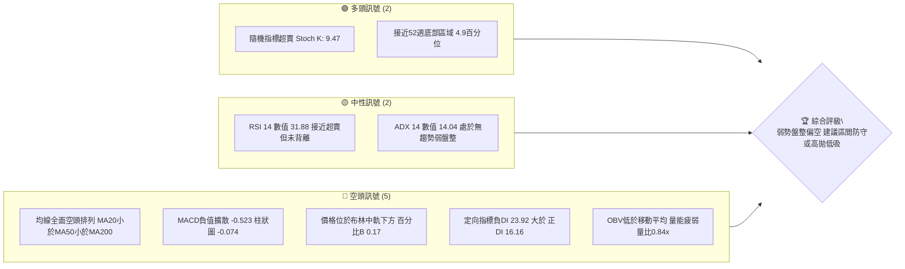

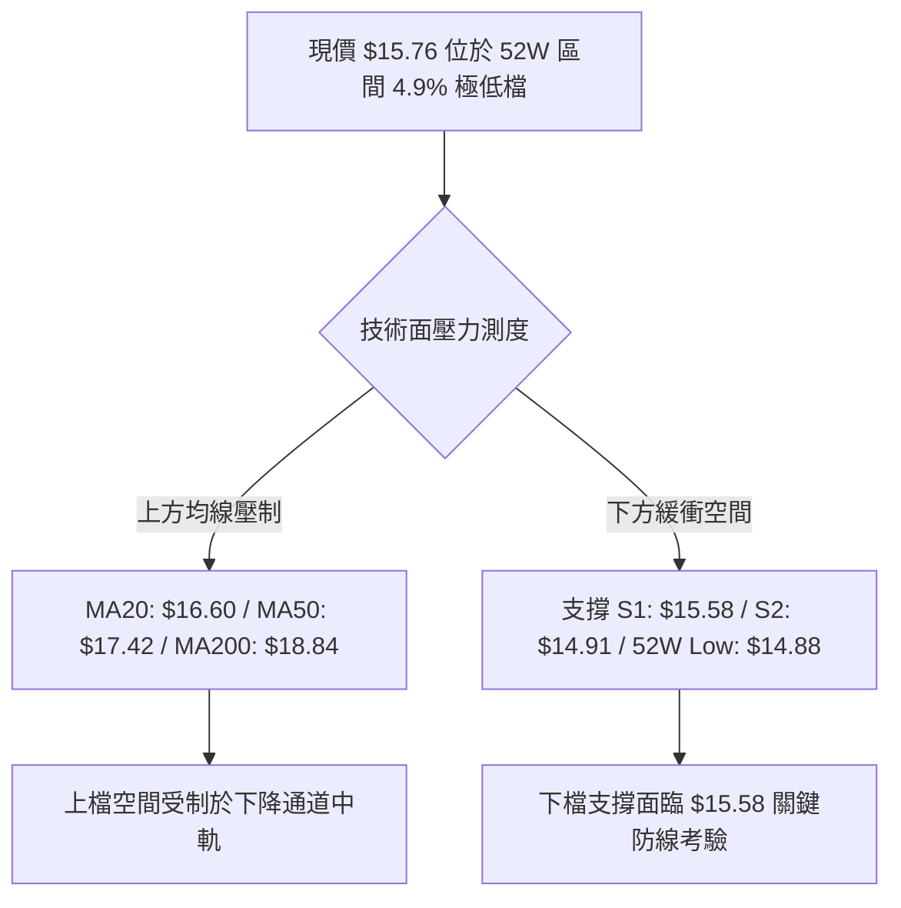

### 📊 核心指標速覽表

| 指標類別 | 指標名稱 | 當前數值 | 訊號 | 解讀 |
|----------|----------|----------|------|------|
| **價格** | 當前價格 | $15.76 | 🔴 | 位於 52W 區間低檔 4.9%，貼近波段下緣 |
| **均線** | MA20 | $16.60 | 🔴 | 現價低於 MA20 達 -5.07%，短線承壓 |
| **均線** | MA50 | $17.42 | 🔴 | 現價低於 MA50 達 -9.53%，中期均線蓋頭 |
| **均線** | MA200 | $18.84 | 🔴 | 現價低於 MA200 達 -16.35%，長期處於熊市格局 |
| **動能** | RSI(14) | 31.88 | 🟡 | 位於中性偏超賣區（30–70），無明顯背離 |
| **動能** | MACD | -0.523 | 🔴 | MACD 線與訊號線雙雙為負，Histogram -0.074 看空 |
| **趨勢** | ADX(14) | 14.04 | 🟡 | ADX < 25 代表行情處於弱趨勢/區間盤整階段 |
| **趨勢** | DMI (±DI) | 16.16 / 23.92 | 🔴 | -DI > +DI，空方力道主導市場結構 |
| **震盪** | Stoch %K/%D| 9.47 / 11.80 | 🟢 | 深度超賣區（<20），短線存在技術性反抽動能 |
| **通道** | Bollinger Bands | $15.34–$17.86 | 🔴 | %B 為 0.17，價格運行於中軌（$16.60）與下軌間 |
| **量能** | 量比 / OBV | 0.84x / OBV<MA | 🔴 | 成交量疲弱萎縮，量能未確認反轉信號 |
| **波動** | ATR(14) | $0.56 | 🟡 | 佔現價 3.57%，日內波動度中等，具備風控參考性 |

### 🏆 技術評分卡

```
╔══════════════════════════════════════════════════════════════╗
║              技術評分卡 — SOFI (2026-10-07)                  ║
╠══════════════════════════════════════════════════════════════╣
║ 趨勢強度 (ADX=14.04 弱盤整)     ████░░░░░░░░░░░░░░░░  20/100 🔴 ║
║ 動能指標 (RSI=31.88, MACD負值)  ██████░░░░░░░░░░░░░░  30/100 🔴 ║
║ 支撐穩定度 (近S1 $15.58)        ██████████░░░░░░░░░░  50/100 🟡 ║
║ 成交量配合 (量比0.84x, OBV偏弱) ██████░░░░░░░░░░░░░░  30/100 🔴 ║
║ 形態完整度 (箱型下緣震盪)       ████████░░░░░░░░░░░░  40/100 🟡 ║
║ 均線排列 (空頭排列 MA20<50<200) ██░░░░░░░░░░░░░░░░░░  10/100 🔴 ║
╠══════════════════════════════════════════════════════════════╣
║ 綜合評分 (偏空盤整格局)         ██████░░░░░░░░░░░░░░  30/100 🔴 ║
║ 評級結論：弱勢區間震盪偏空 (Bearish Consolidation)            ║
╚══════════════════════════════════════════════════════════════╝
```

---

## 2. 趨勢分析

### 🌐 多時框趨勢分析

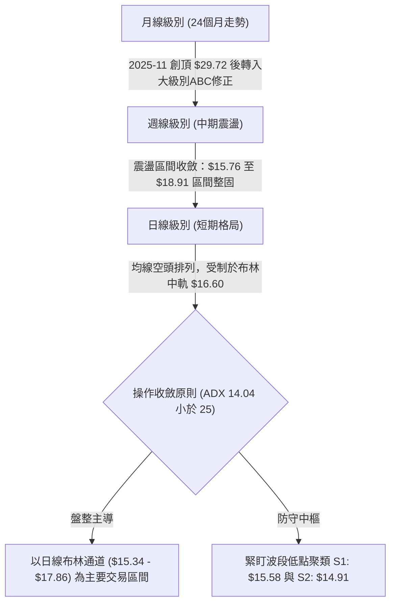

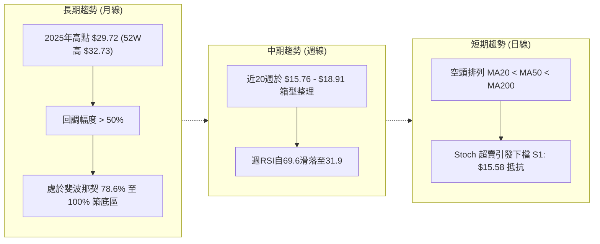

### 📈 長期趨勢 — 12個月走勢圖（Unicode）

```
SOFI 月線走勢圖（過去12個月：2025-10 至 2026-10）
價格軸 ($)
$30.00 ┤        ●(2025-10: $29.68)
       │          ●(2025-11: $29.72 高點)
$27.00 ┤              ●(2025-12: $26.18)
$24.00 ┤                  ●(2026-01: $22.81)
$21.00 ┤                      
$18.00 ┤                          ●(2026-02: $17.76)
       │                                  ●(2026-05: $18.22)
       │                                      ●(2026-06: $17.93)  ●(2026-08: $17.88)
$15.00 ┤                              ●(2026-03: $15.88)
       │                                  ●(2026-04: $16.10)  ●(2026-07: $16.31)  ●(2026-09: $15.72)
       │                                                                                  ●(2026-10: $15.76 現價)
$12.00 ┤
       └─────────────────────────────────────────────────────────────────────────────────────────────
         25-10  25-11  25-12  26-01  26-02  26-03  26-04  26-05  26-06  26-07  26-08  26-09  26-10
```

#### 走勢特徵分析表格

| 階段區間 | 時間跨度 | 起訖價格 | 漲跌幅 | 結構特徵與成交量能變化 |
|----------|----------|----------|--------|------------------------|
| **主升末段攻頂** | 2025-10 ~ 2025-11 | $29.68 → $29.72 | +0.13% | 衝刺 52 週高點 $32.73 後力竭，動能背離構築雙頂頭部 |
| **主跌推動浪** | 2025-11 ~ 2026-03 | $29.72 → $15.88 | -46.57% | 瀑布式重挫，跌破 MA20/MA50/MA200，籌碼大幅套牢鬆動 |
| **中期箱型整固** | 2026-03 ~ 2026-08 | $15.88 → $17.88 | +12.59% | 構築 $16.00–$18.90 之大箱型震盪，多空反覆拉鋸洗盤 |
| **箱底二次下探** | 2026-08 ~ 2026-10 | $17.88 → $15.76 | -11.86% | 週線連續陰跌，成交量逐週縮至 87M，測試波段支撐 S1: $15.58 |

### 📊 中期趨勢（週線分析）

```
週線關鍵壓力與支撐階梯示意圖
價格 ($)
$19.62 ────────────────────────── [R3 強阻力聚類 / 近一年波段高點]
             ↑
$18.79 ────────────────────────── [R2 阻力聚類 / 斐波那契 78.6% 回調位 $18.70]
             ↑
$17.96 ────────────────────────── [R1 關鍵阻力聚類 / 布林上軌 $17.86 疊合]
═════════════════════════════════
$15.76 ────────── ● 現價 (位於布林下軌 $15.34 與中軌 $16.60 之間)
═════════════════════════════════
             ↓
$15.58 ────────────────────────── [S1 近期波段低點支撐聚類 / -1.17%]
             ↓
$14.91 ────────────────────────── [S2 強支撐聚類 / 斐波那契 100% 52W Low $14.88]
```

### ⚡ 趨勢強度評估（ADX 解讀）

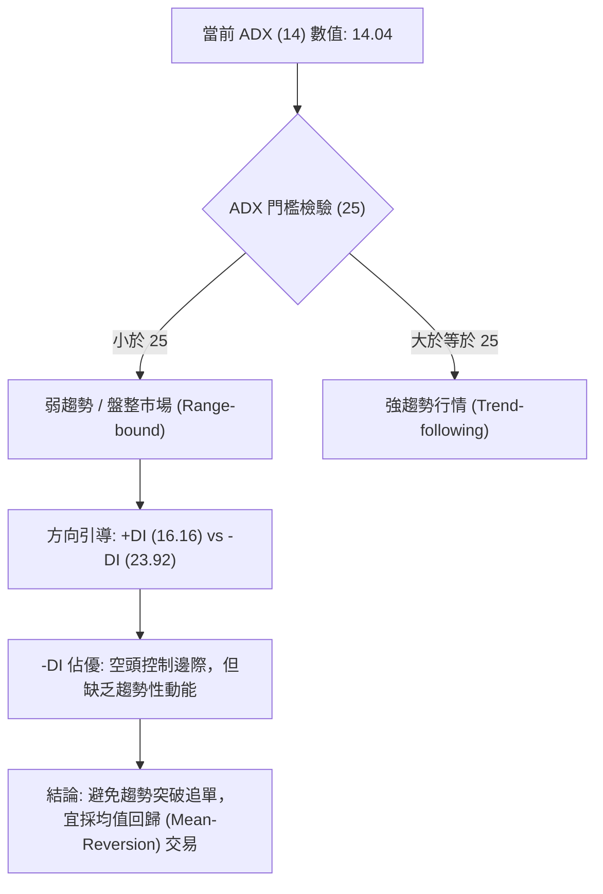

#### ADX 強度對照表

| ADX 數值區間 | 市場狀態定義 | SOFI 當前讀數 (14.04) 判定 | 交易策略適配度 |
|--------------|--------------|-----------------------------|----------------|
| **0 – 20** | **極弱趨勢 / 無趨勢橫盤** | **14.04（落在本區間）** 🟢 符合 | 震盪指標交易有效，嚴禁趨勢追單 |
| **20 – 25** | 趨勢孕育 / 轉折醞釀期 | 未達到 | 觀望等待動能方向確認 |
| **25 – 40** | 強勁單邊趨勢 | 未達到 | 均線順勢交易（當前不適用） |
| **40 – 60** | 極強單邊爆發趨勢 | 未達到 | 順勢加碼（當前不適用） |

---

## 3. 圖表形態分析

### 🔍 形態識別系統

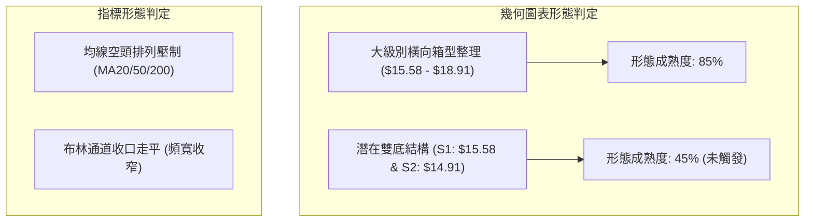

#### 形態識別與信心度評估表

| 形態名稱 | 信心度 | 判斷依據（引用數據） | 完成度 | 目標價（附精確計算式） |
|----------|--------|----------------------|--------|------------------------|
| **箱型整理下緣震盪** | **75%** | 價格受限於箱頂 R1: $17.96（近一年波段高點）與箱底 S1: $15.58 之間，ADX=14.04 確認盤整。 | 85% | 震盪回測箱頂 R1: $17.96<br>計算式：現價 $15.76 反彈測 R1 $17.96 (+13.96%) |
| **潛在雙重底結構** | **40%** | 左底為 2026-03 收盤價 $15.88，當前二次探底至 $15.76 接近 S1: $15.58。但頸線未突破，且 MACD 仍為負值，信號不足。 | 45% | **未確認**（信心度 < 50%，依規則僅做指標型解讀，不預設突破目標） |
| **布林帶下軌支撐回測** | **70%** | 現價 $15.76 貼近布林下軌 $15.34，%B=0.17 處於低位，Stoch %K=9.47 超賣。 | 90% | 回歸中軌 MA20: $16.60<br>計算式：中軌基準價位 $16.60 (+5.33%) |

### 🕯️ 重要K線形態分析

| 月份 | 收盤價 | K線形態 | 解讀 | 訊號 |
|------|--------|---------|------|------|
| **2025-11** | $29.72 | 高位十字星/流星線 | 衝高 $32.73 遇阻回落，多頭動能耗盡，構築大週期歷史頂部 | 🔴 空頭反轉 |
| **2026-03** | $15.88 | 長下影長陰線 | 空頭宣洩跌破 $16.00，但低檔買盤介入收於 $15.88，確立中線第一低點 | 🟡 止跌訊號 |
| **2026-05** | $18.22 | 實體大陽線 | 反彈觸及 MA50 壓力帶，多頭發力回補，確認箱型上限阻力區 | 🟢 中期反彈 |
| **2026-08** | $17.88 | 上影小陽線 | 上攻 R1: $17.96 聚類阻力未果，量能不濟，反彈波段見頂 | 🔴 假突破遇阻 |
| **2026-09** | $15.72 | 破位中陰線 | 跌破 MA20 均線，空方重新主導，逼近 52 週低位區間 | 🔴 短期偏空 |
| **2026-10** | $15.76 | 低檔十字星孕線 | 跌勢減緩，收於 S1: $15.58 上方，多空於極低位展開拉鋸觀望 | 🟡 盤整待變 |

### 📉 ASCII 走勢形態示意圖

```
SOFI 箱型結構與通道震盪示意圖
$18.91 ┼────────────────────────────── 波段高點 / 近一年壓力聚類 R2 ($18.79)
       │         ▲                ▲
$17.96 ┼─────────┼─(2026-05)──────┼─(2026-08)── 箱型頂部 / 阻力 R1 ($17.96)
       │         │                │
$16.60 ┼─────────┼────────────────┼──────────── 布林中軌 / MA20 ($16.60)
       │         │                │
$15.76 ┼─────────┼────────────────┼───────● 現價 ($15.76)
       │         ▼                ▼
$15.58 ┼─(2026-03: $15.88)───(2026-10: $15.76)─ 箱型底部 / 支撐 S1 ($15.58)
$14.88 ┼────────────────────────────── 52W Low / 強支撐 S2 ($14.91)
```

### 🎯 形態目標價計算

根據已確認之「箱型整理區間」形態測算（信心度 75%）：
- **箱型底邊（支撐基準）**：$15.58（近一年波段低點聚類 S1）
- **箱型頂邊（阻力基準）**：$17.96（近一年波段高點聚類 R1）
- **箱型高度（Height）**：$17.96 - $15.58 = $2.38
- **區間震盪反彈目標價（T1）**：布林中軌 MA20 = **$16.60**
- **區間震盪反彈目標價（T2）**：箱型頂部 R1 = **$17.96**
- **破位下跌測算（若跌破 S1，依規則僅引用數據）**：次級支撐聚類 S2 = **$14.91**（非估算，引用數據聚類）

---

## 4. 支撐與阻力

### 🗺️ 關鍵價位分布圖（Unicode）

```
SOFI 價位結構分布圖（OHLCV 實際計算聚類）
═══════════════════════════════════════════════════════════════════════
$19.62 ║████████████████████████████████████████║ 強阻力 R3 (+24.48%)
$18.84 ║▓▓▓▓▓▓▓▓▓▓▓▓▓▓▓▓▓▓▓▓▓▓▓▓▓▓▓▓▓▓▓▓        ║ 長期均線 MA200 壓制
$18.79 ║████████████████████████████████        ║ 阻力 R2 (+19.19%) / Fib 78.6% $18.70
$17.96 ║████████████████████████████████████████║ 關鍵阻力 R1 (+13.96%) / BB上軌 $17.86
$17.42 ║▓▓▓▓▓▓▓▓▓▓▓▓▓▓▓▓▓▓▓▓                    ║ 中期均線 MA50 壓制
$16.60 ║▓▓▓▓▓▓▓▓▓▓▓▓▓▓▓▓                        ║ 短期均線 MA20 / 布林中軌
═══════╬════════════════════════════════════════╣
$15.76 ╠════════════════════════════════════════╣ ◄ 當前市價 ($15.76)
═══════╬════════════════════════════════════════╣
$15.58 ║▓▓▓▓▓▓▓▓▓▓▓▓▓▓▓▓▓▓▓▓▓▓▓▓▓▓▓▓▓▓▓▓        ║ 近期支撐 S1 (-1.17%)
$15.34 ║░░░░░░░░░░░░░░░░░░░░                    ║ 布林下軌支撐
$14.91 ║████████████████████████████████████████║ 強支撐 S2 (-5.39%) / 52W Low $14.88
═══════════════════════════════════════════════════════════════════════
```

### 🚧 阻力位分析表

| 阻力級別 | 價位 | 形成原因 | 突破難度 | 重要性 |
|----------|------|----------|----------|--------|
| **R1** | **$17.96** | 近一年波段高點聚類；與布林上軌（$17.86）共振 | 高（需顯著補量至 50M 以上） | ★★★★★ 極高（箱體上緣） |
| **R2** | **$18.79** | 近一年波段高點聚類；逼近斐波那契 78.6% 回調位（$18.70）與 MA200（$18.84） | 極高（中期多空分水嶺） | ★★★★☆ 高（牛熊轉換位） |
| **R3** | **$19.62** | 近一年波段高點聚類；歷史重套籌碼密集換手區 | 極高（需大盤與基本面強烈催化） | ★★★☆☆ 中等（長期阻力） |

### 🛡️ 支撐位分析表

| 支撐級別 | 價位 | 形成原因 | 守住機率 | 重要性 |
|----------|------|----------|----------|--------|
| **S1** | **$15.58** | 近一年波段低點聚類；目前僅距現價 -1.17%，為日線第一防線 | 60%（短線超賣具抵抗力） | ★★★★☆ 高（短線生命線） |
| **S2** | **$14.91** | 近一年波段低點聚類；與 52 週最低點（$14.88）完全疊合 | 80%（年內終極底線） | ★★★★★ 極高（核心防護屏障） |
| **S3** | 數據未偵測到 | 數據中未偵測到更低層級聚類，以 52W Low $14.88 為絕對底限 | — | — |

### 📐 斐波那契回調位分析

依據 52 週區間高點 **$32.73** 至低點 **$14.88** 計算之黃金分割水準如下：

| 回調比率 | 價位 | 當前價位關係與技術意義 |
|----------|------|------------------------|
| **0.0% (52W High)** | **$32.73** | 週期歷史最高壓力，長期牛市極限目標 |
| **23.6%** | **$28.52** | 長期深次回調的第一道關鍵阻力 |
| **38.2%** | **$25.91** | 強勢回調防守位，現階段已完全失守 |
| **50.0%** | **$23.80** | 多空中樞平衡線，當前價格遠落於其下方 |
| **61.8%** | **$21.70** | 黃金分割強防守位，破位後轉入弱勢週期 |
| **78.6%** | **$18.70** | 深次回調重壓力區，與阻力 R2: $18.79 形成結構共振 |
| **100.0% (52W Low)**| **$14.88** | 週期回撤原點，與支撐 S2: $14.91 形成絕對底層防禦 |

- **現價位置解讀**：當前價格 **$15.76** 處於 **78.6% ($18.70)** 與 **100.0% ($14.88)** 之間，屬於極深次回調的底部築底階段，距 100.0% 底位僅剩 +5.91% 緩衝空間，下跌動能邊際遞減。

---

## 5. 技術指標深度解讀

### 🎛️ 指標訊號總覽

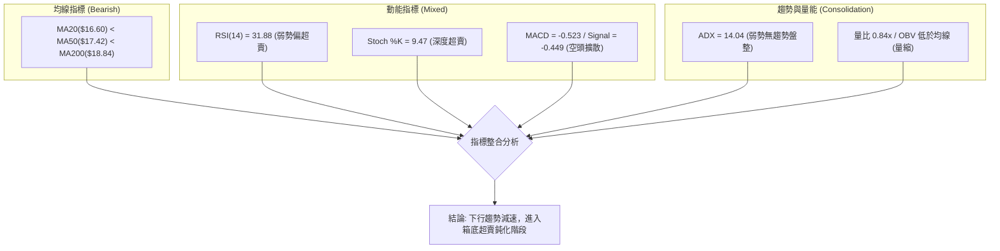

### 📈 移動平均線排列分析

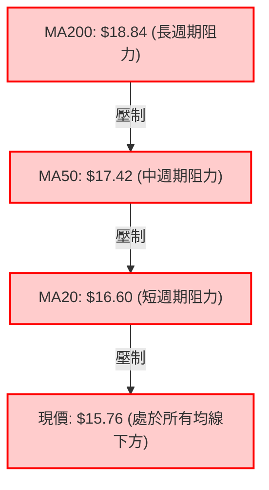

#### 移動平均線多空階梯

- **MA 5 ($15.80)**：偏離 -0.04 (-0.27%)，極短線緊貼現價，下行斜率趨緩。
- **MA 10 ($16.08)**：偏離 -0.32 (-1.98%)，短線反彈的第一道動態壓制。
- **MA 20 ($16.60)**：偏離 -0.84 (-5.07%)，布林中軌，短線生命線。
- **MA 60 ($17.40)** / **MA 50 ($17.42)**：中期成本線，呈現下彎蓋頭走勢。
- **MA 120 ($17.28)**：中長線平走，與 MA60 出現黏合。
- **MA 200 ($18.84)** / **MA 240 ($20.43)**：偏離 -22.84%，長期熊市壓制顯著。
- **均線排列結論**：經典空頭排列（MA20 < MA50 < MA200），確認中長期趨勢完全由空方主導。

### 📉 RSI(14) 分析

- **當前讀數**：**31.88**（黃金門檻：30 超賣線，70 超買線）
- **動能評估進度條**：
  ```
  超賣 [0] ▓▓▓▓▓▓▓▓░░░░░░░░░░░░░░░░░░░░ [100] 超買  (當前: 31.88 - 弱勢區間)
  ```
- **背離分析判斷**：
  - 現價自 2026-09-27 之 $16.58 跌至 2026-10-07 之 $15.76，創下近期收盤新低。
  - 週線 RSI 自 2026-10-04 的 23.0 回升至當前的 31.9，日線 RSI 於 31.88 走平。
  - **結論**：依數據「RSI 背離：無明顯背離」判斷，當前不存在有效之頂背離或日線級別底背離，僅為指標隨價格回落引發之低檔鈍化，尚未形成多頭翻轉信號。

### 📊 MACD(12/26/9) 訊號解讀

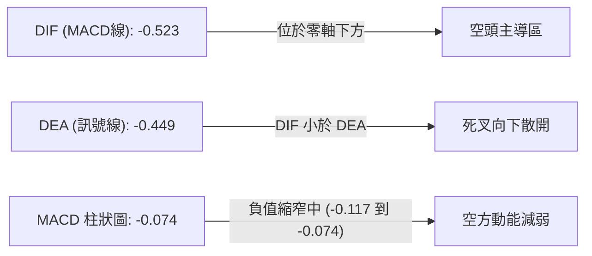

- **MACD 數值解讀**：DIF (-0.523) 低於 Signal (-0.449)，處於零軸以下深水區，屬於標準空頭訊號。
- **柱狀圖動態**：近三週週線 MACD 柱狀圖自 -0.145 → -0.084 → -0.117 → -0.074，負向柱體呈現震盪縮短跡象，顯示空頭下殺動能边際收斂，但未出現實質金叉買訊。

### 📦 布林通道分析

```
布林通道結構示意圖 (帶寬: $17.86 - $15.34 = $2.52)
$17.86 ┬─────────────────────────────── 上軌 (BB Upper) - 阻力 R1 ($17.96) 附近
       │
$16.60 ┼ - - - - - - - - - - - - - - -  中軌 (MA20) - 短線多空分水嶺
       │
$15.76 ┼───────────● 現價 (位處下半軌，%B = 0.17)
       │
$15.34 ┴─────────────────────────────── 下軌 (BB Lower) - 動態下檔防守
```

- **%B 指標分析**：目前 %B = 0.17，代表價格緊貼下軌運行，遠離中軌，短線存在向中軌（$16.60）靠攏的均值回歸拉力。
- **帶寬走勢**：上下軌間距收窄至 $2.52，確認市場波動率收縮，醞釀隨後的波段方向選擇。

### 💹 成交量分析（量價配合度）

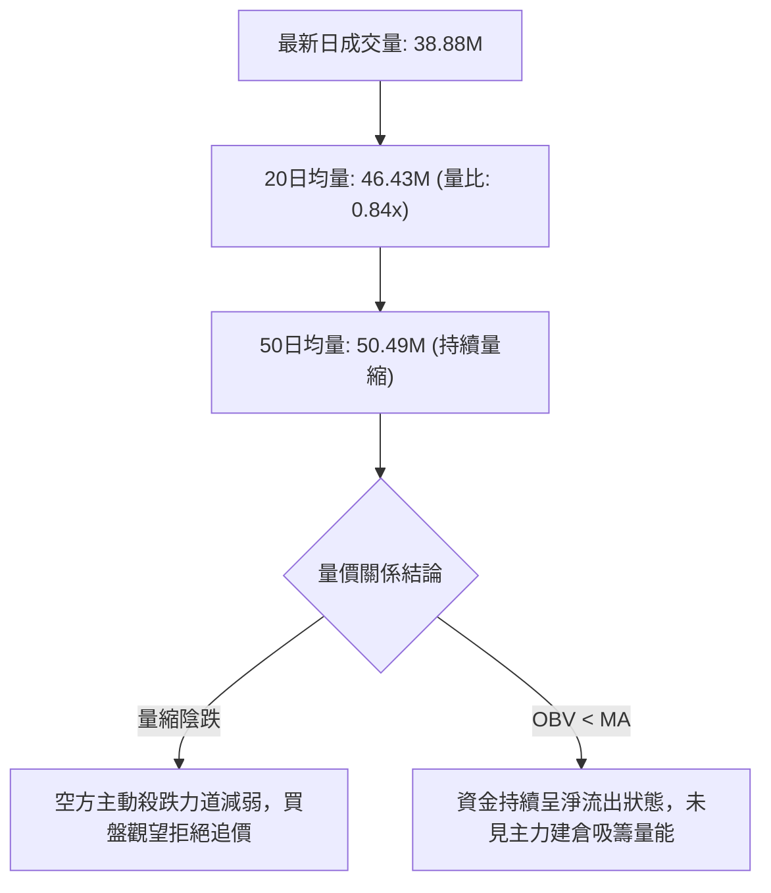

- **OBV（能量潮）分析**：OBV 持續低於其移動平均線，量能未確認價格的反轉企圖，維持「量能疲弱」結論。

---

## 6. 動能與波動率

### ⚡ 動能評估四象限

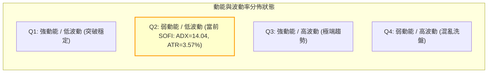

#### 動能評估四象限配置表

| 象限 | 動能強度 | 波動率水準 | SOFI 當前狀態判定 | 交易戰略意涵 |
|------|----------|------------|-------------------|--------------|
| **Q1** | 強 | 低 | — | 趨勢初升段，最佳順勢加碼點 |
| **Q2** | **弱** | **低** | **✓ 正確定位**（ADX=14.04，ATR=$0.56） | **謹慎觀望，以區間箱體極限位低吸高拋為主** |
| **Q3** | 強 | 高 | — | 爆發突破段，高收益高風險 |
| **Q4** | 弱 | 高 | — | 擴散震盪，容易雙向停損，避免進場 |

### 📊 ATR 波動率分析

- **ATR(14) 數值**：**$0.56**（佔當前股價之 **3.57%**）
- **日內波動意涵**：日均常態波幅約為 $0.56，代表單日正常震盪範圍在 $15.20 至 $16.32 之間。
- **風控止損距離建議**：
  - **超短線策略（1.0 × ATR）**：$0.56 緩衝距離。
  - **波段交易策略（1.5 × ATR）**：$0.56 × 1.5 = **$0.84** 緩衝距離。
  - **防守性止損點設計**：若以現價 $15.76 建立多頭防守，建議止損設於支撐 S1 ($15.58) 下方約 0.5~1 個 ATR，即 $15.58 - $0.28 = **$15.30**（與布林下軌 $15.34 共振）。

### 📐 Beta 與市場相關性

- **Beta 數值**：**2.332**
- **市場敏感度特徵**：
  - 屬於**極高波動性（High-Beta）**品種，價格波動幅度為標普500指數（S&P 500）的 **2.33 倍**。
  - 在大盤回調或市場風險偏好（Risk-Off）降溫時，該股下行拋壓會被放大 2 倍以上。
  - 交易者在制定倉位管理時，必須將標準頭寸規模下調至正常水準的 40%–50%，以平衡高 Beta 帶來的淨值回撤風險。

---

## 7. 多時框架總結

### 📋 時框架評分表

| 時框架 | 趨勢方向 | 動能狀態 | 均線排列 | 圖表形態 | 綜合評分 | 操作建議 |
|--------|----------|----------|----------|----------|----------|----------|
| **月線 (長期)** | 🔴 熊市回調 | 弱勢築底中 | MA240 下方 | 大級別回撤 78.6% | 35/100 | 長線資金分批定投，避免單筆梭哈 |
| **週線 (中期)** | 🟡 橫向盤整 | RSI=31.9 弱勢 | MA50 下方 | 箱體整理 ($15.58–$18.91)| 40/100 | 區間高拋低吸，嚴守箱底防線 |
| **日線 (短期)** | 🔴 弱勢下探 | Stoch 超賣鈍化| 空頭排列 | 貼近布林下軌震盪 | 30/100 | 等待 S1 支撐確認，切勿盲目追空 |

### 🔲 綜合訊號矩陣

```
訊號維度對照矩陣
─────────────────────────────────────────────────────────────
指標維度        日線 (短期)       週線 (中期)       月線 (長期)
─────────────────────────────────────────────────────────────
趨勢方向        🔴 空頭主導       🟡 區間震盪       🔴 下降修正
均線系統        🔴 空頭排列       🔴 MA50之下       🔴 MA200之下
RSI 動能        🟡 31.88 (低檔)   🟡 31.9 (低檔)    🔴 偏弱
MACD 柱狀       🔴 負值 -0.074    🔴 負值 -0.074    🔴 零軸下方
布林通道        🔴 下軌徘徊       🟡 帶寬收窄       🔴 軌道向下
成交量能        🔴 萎縮 0.84x     🔴 持續遞減       🟡 換手平緩
─────────────────────────────────────────────────────────────
矩陣收斂一致性：中短期處於「空頭排列下的弱勢區間震盪」，缺乏趨勢性向上動能。
```

### ⚖️ 多時框收斂結論

依據多時框收斂規則第 14 條執行收斂：
1. **行情性質判定**：當前日線 **ADX(14) = 14.04**（遠小於 25 臨界值），明確判定當前市場處於**盤整行情（Range-bound Consolidation）**，而非單邊趨勢行情。
2. **主導維度收斂**：在盤整行情下，**以日線布林通道（$15.34 – $17.86）及波段聚類支撐（S1: $15.58）作為主要交易與風控邊界**。雖然均線全面呈空頭排列，但空頭動能衰竭且隨機指標（Stoch %K=9.47）深度超賣，下行空間受限於 S1: $15.58 與 S2: $14.91。
3. **唯一方向性結論**：**中性偏空觀望，主打區間下軌防守型操作（Neutral-to-Bearish Consolidation）**。技術評分卡綜合得分為 **30/100**，策略由**空頭防守與區間均值回歸**主導，堅決不追空，嚴防破位下行。

---

## 8. 交易策略建議

### 🗺️ 策略決策流程圖

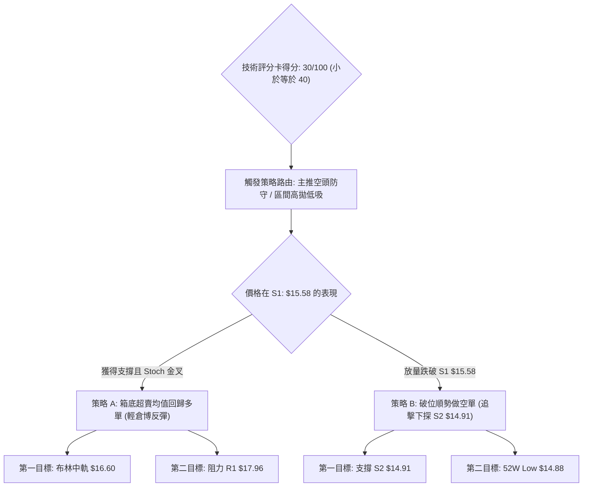

### 🧭 策略路由（依評分卡分流）

> **當前主策略方向 = 偏空弱勢震盪，以反彈逢高布空與破位做空為主，低吸超賣反彈為輔（依綜合評分 30/100）**
> 
> 因評分 ≤ 40 分，主策略路由確立為空頭主導；多頭交易僅限於在 S1 關鍵防線未破時的超短線「均值回歸反抽」，且倉位嚴格受限。

### 🎯 價格情境階梯（Price Scenarios）

價位完全嚴格引用第 4 章及數據聚類計算成果：

| 觸發條件 | 下一目標 | 後續延伸 | 情境含義 |
|----------|----------|----------|----------|
| **向上突破 R1 $17.96** | **R2 $18.79** | **R3 $19.62** | 扭轉短期空頭，突破箱型上限，挑戰 MA200 牛熊線 |
| **反彈受阻 MA20 $16.60** | **回測現價 $15.76** | **測試 S1 $15.58** | 弱勢反抽結束，受制於布林中軌，維持下行通道震盪 |
| **跌破支撐 S1 $15.58** | **S2 $14.91** | **52W Low $14.88** | 跌破箱底防線，空頭動能重啟，探底年內絕對低點 |

### 📊 情境機率分佈

| 情境劇本 | 機率 | 主要依據（指標狀態） |
|----------|------|----------------------|
| **區間震盪 / 箱底反抽** | **55%** | ADX=14.04 確認無單邊趨勢；Stoch %K=9.47 深度超賣；布林通道下軌 $15.34 提供彈性防禦。 |
| **跌破 S1 續尋底部** | **35%** | 均線空頭排列（MA20<50<200）；MACD Hist=-0.074 負向擴散；-DI (23.92) > +DI (16.16) 空方掌舵。 |
| **強勢反轉突破 R1** | **10%** | 量比僅 0.84x，OBV 疲弱；無重大催化劑難以一舉跨越 $17.96 強阻力。 |

### 🟢 主策略詳情

依據路由原則，展示主推之空頭策略（策略 B）與輔助之超賣防守反抽策略（策略 A）：

| 策略要素 | 策略 A（箱底超賣防守博反抽 - 多） | 策略 B（跌破 S1 順勢跟進 - 空，主推） |
|----------|----------------------------------|--------------------------------------|
| **進場條件** | 股價於 S1 $15.58 上方回穩，Stoch %K 向上穿越 %D | 跌破波段支撐聚類 S1 $15.58，收盤確認失守 |
| **進場價格** | **$15.76**（現價建立底倉） | **$15.55**（破位追空點） |
| **目標價 T1** | **$16.60**（布林中軌 / MA20） | **$14.91**（支撐聚類 S2） |
| **目標價 T2** | **$17.96**（阻力聚類 R1 / 箱頂） | **$14.88**（52 週最低點） |
| **止損價格** | **$15.34**（跌破布林下軌嚴格停損） | **$16.08**（站回 MA10 短期均線上方） |
| **風險報酬比** | **2.00 : 1** (T1) / **5.24 : 1** (T2)<br>計算：($16.60-$15.76)/($15.76-$15.34)=0.84/0.42=2.00 | **1.21 : 1** (T1) / **1.26 : 1** (T2)<br>計算：($15.55-$14.91)/($16.08-$15.55)=0.64/0.53=1.21 |
| **成功機率** | 55% | 60% |
| **建議倉位** | 5%（高 Beta 逆勢輕倉博奕） | 10%（順應空頭排列趨勢操作） |

### 🔴 反向風險觸發點（對沖提示）

- **多頭反轉翻轉點**：若日線連續兩日實體收盤價突破 **MA20 ($16.60)**，且伴隨成交量突破 50M，空頭結構即刻失效，所有空頭部位必須無條件平倉。
- **空頭崩跌防範點**：若現價失守 **S1 ($15.58)** 並進一步摜破布林下軌 **$15.34**，多頭策略 A 必須立即執行止損，不可抱持僥倖心理攤平。

### ⭐ 整體訊號強度評星

```
做多訊號強度：★★☆☆☆  (2/5星 - 僅具備超賣反抽動能，均線壓制沉重)
做空訊號強度：★★★☆☆  (3/5星 - 均線空頭排列，但面臨 ADX 弱勢盤整鈍化)
整體可信度：  ★★★☆☆  (3/5星 - 數據完整，惟處於低波動收斂待變期)
```

---

## 9. 風險提示與監控

### ✅ 關鍵監控指標 Checklist

```
╔══════════════════════════════════════════════════════════════╗
║              SOFI 關鍵技術監控清單 (Checklist)               ║
╠══════════════════════════════════════════════════════════════╣
║ [ ] 價格防線：每日收盤價是否守穩 S1: $15.58？               ║
║ [ ] 空頭防線：價格是否放量突破布林中軌 MA20: $16.60？        ║
║ [ ] 動能確認：Stoch %K 是否完成由下而上的有效黃金交叉？       ║
║ [ ] 量能異動：日成交量是否放大超越 20日均量 46.43M？          ║
║ [ ] 趨勢甦醒：ADX(14) 是否向上突破 20 展開新一輪單邊走勢？   ║
║ [ ] 融券動向：當前空單比例高達 14.8%，嚴防轧空突襲波動       ║
╚══════════════════════════════════════════════════════════════╝
```

### ⚠️ 風險場景分析

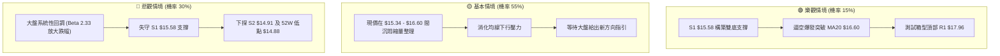

### 🛡️ 風險管理重要提醒

1. **高 Beta 波動懲罰機制**：SOFI 的 Beta 高達 **2.332**，市場波動極大。在組合管理中，嚴禁將單一標的倉位提升至總資產的 15% 以上。建議單筆交易虧損上限設定為整體帳戶淨值的 **1.0%**。
2. **高空單比例（Short % Float = 14.8%）風險**：高放空比率代表一旦市場出現超預期基本面利多或大盤強勢拉升，極易引發軋空（Short Squeeze）現象，導致空單在短時間內遭受巨大損失。因此做空必須嚴格設定 MA10 ($16.08) 停損。
3. **現金流與基本面脫節風險**：技術面上雖在 $15.58 尋求抵抗，但公司營運現金流為負（$-8.50B），且處於信用金融領域，對市場利率預期極度敏感。技術突破若缺乏基本面數據支撐，多屬假突破，追價必須提高警惕。

---

## 📋 報告總結

```
SOFI 技術分析報告總結
════════════════════════════════════════════════════════
報告日期：2026-10-07
當前價格：$15.76
分析評級：⚖️ 弱勢盤整偏空 (綜合評分: 30/100)

關鍵結論：
├─ 長期趨勢：🔴 偏空回調 (受制於 52W 高點回撤 78.6% 水準)
├─ 中期趨勢：🟡 橫向箱型 (運行於 $15.58 至 $18.91 箱型區間)
├─ 短期趨勢：🔴 弱勢承壓 (均線空頭排列，收於布林中軌 $16.60 之下)
├─ 關鍵支撐：S1: $15.58 ｜ S2: $14.91 ｜ 52W Low: $14.88
├─ 關鍵阻力：R1: $17.96 ｜ R2: $18.79 ｜ R3: $19.62
└─ 分析師目標：均價 $20.35 ｜ 區間 $12.00 - $30.00 (共22位分析師，評級 Hold)

最優策略組合：
1. 🥇 最佳機會：破位做空策略 B — 跌破 S1 $15.58 追空，目標 S2 $14.91，止損 $16.08。
2. 🥈 次選機會：箱底超賣博反抽策略 A — 於現價 $15.76 輕倉博弈反彈，目標 MA20 $16.60，止損 $15.34。
3. 🥉 保守選擇：空倉觀望 — 等待 ADX 回升至 25 以上或價格明確突破 $16.60 / 跌破 $15.58 後再行順勢介入。
════════════════════════════════════════════════════════
```

---

> ⚠️ **免責聲明**：本報告為 AI 自動生成之技術分析，所有數據及估算均基於提供的歷史價格資訊。本報告**僅供研究與學術參考**，**不構成任何投資建議**。投資有風險，入市需謹慎。

---

*報告生成時間：2026-10-07 ｜ 數據來源：Yahoo Finance ｜ 分析框架：多時框技術分析*