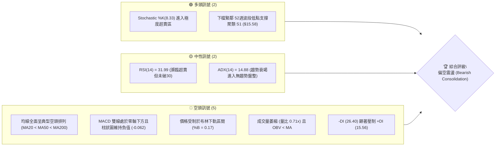
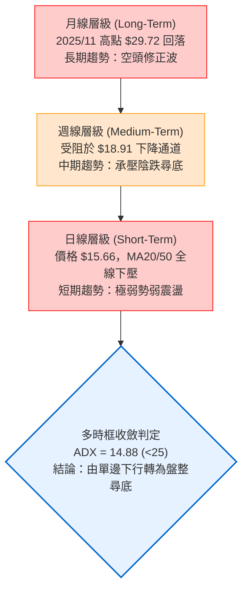
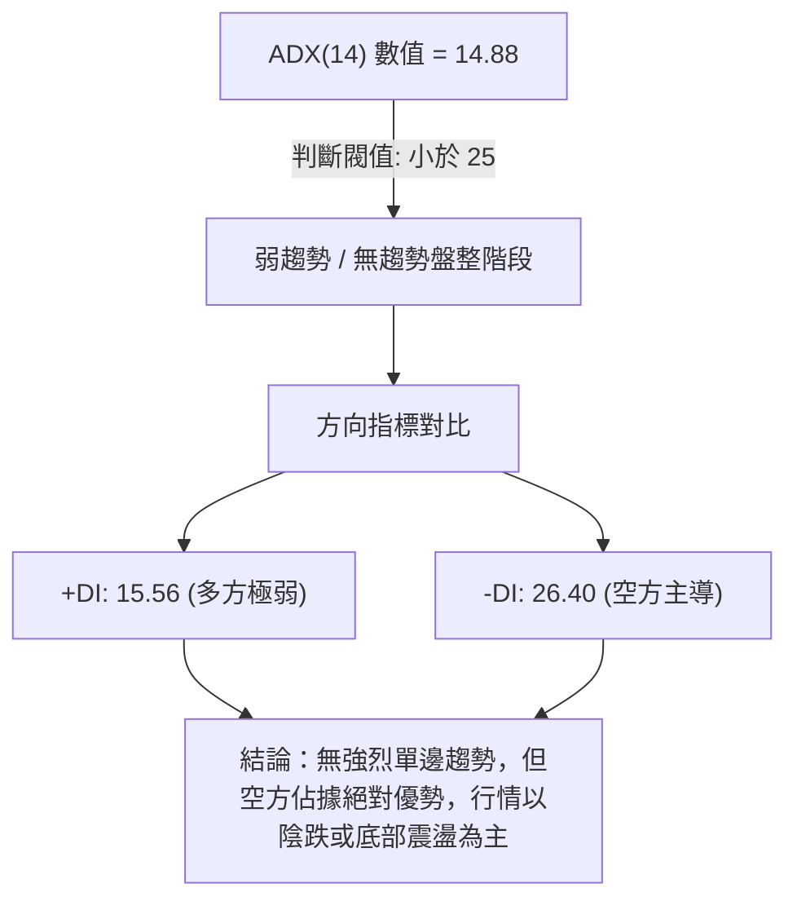
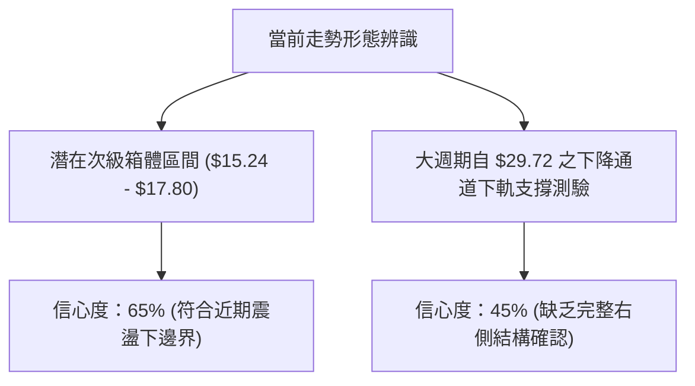
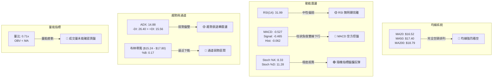
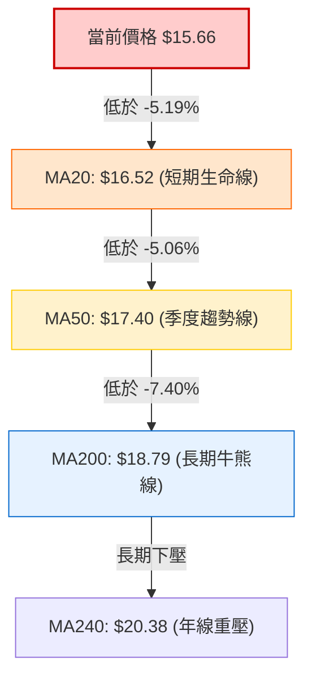
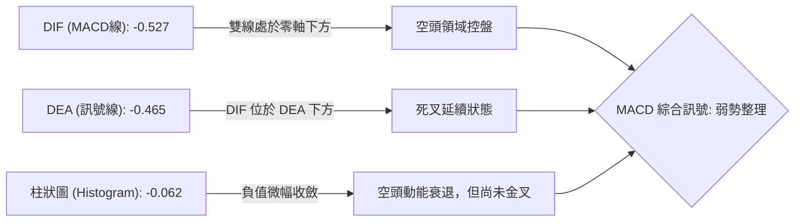
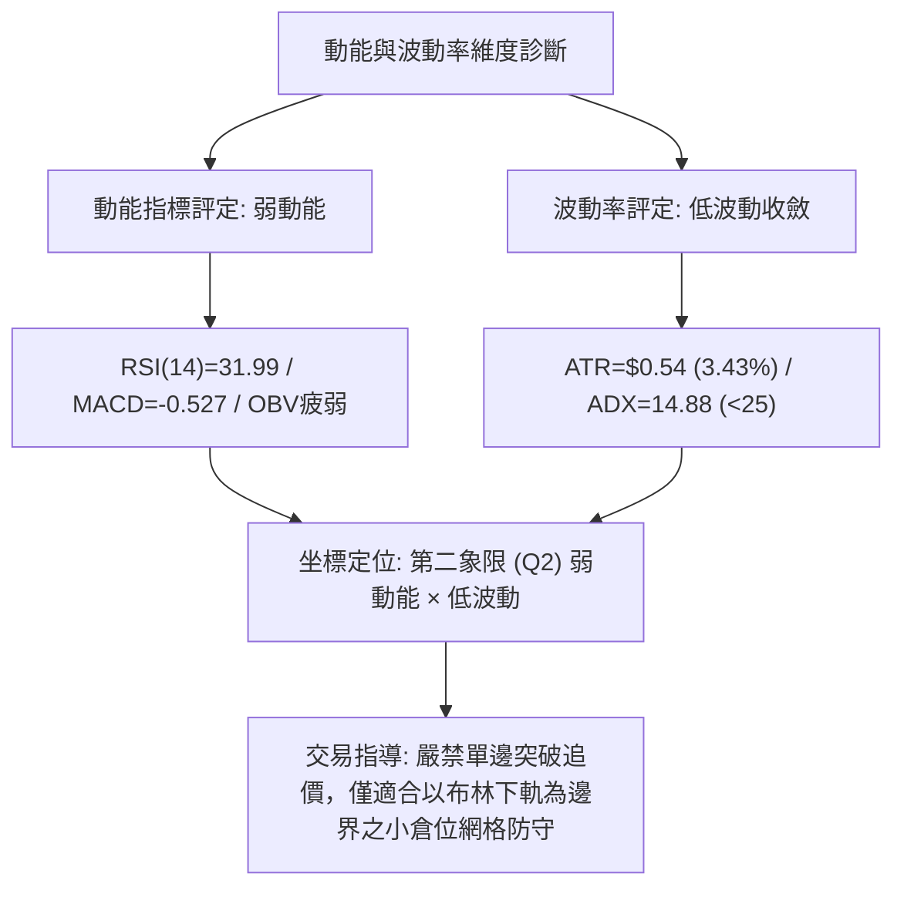
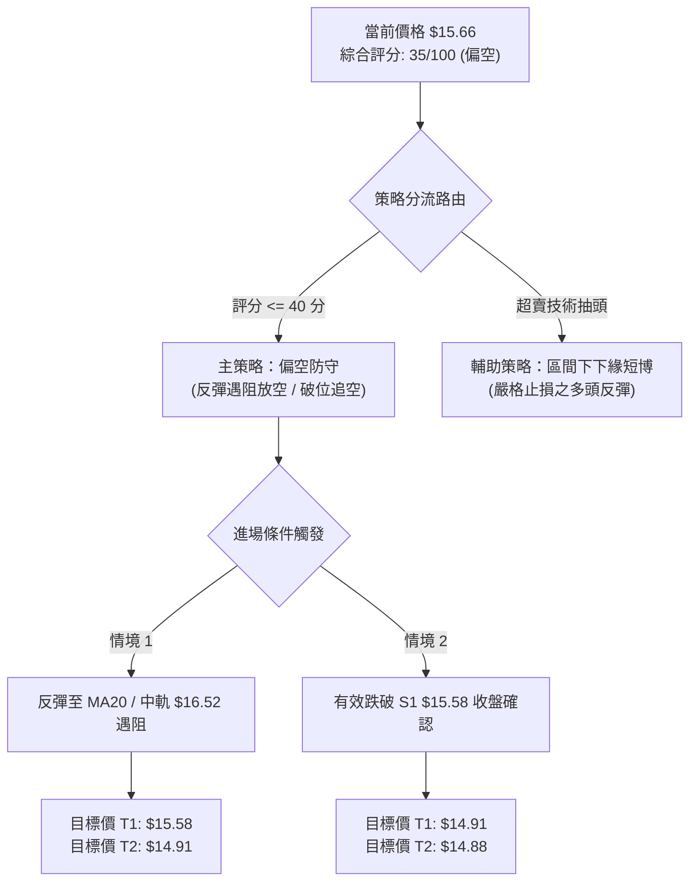
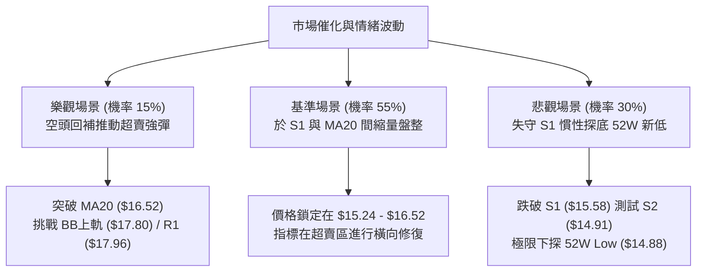

# SOFI 技術分析報告

> **報告日期**：2026-10-08 ｜ **語言**：繁體中文 ｜ **數據來源**：Yahoo Finance ｜ **當前價格**：$15.66

---

## 目錄

| 章節 | 內容 |
|------|------|
| [1. 技術面概覽](#1-技術面概覽) | 訊號儀表板、核心指標、評分卡 |
| [2. 趨勢分析](#2-趨勢分析) | 多時框趨勢、長中短期走勢、ADX解讀 |
| [3. 圖表形態分析](#3-圖表形態分析) | 形態識別信心度、K線組合、目標價計算 |
| [4. 支撐與阻力](#4-支撐與阻力) | 關鍵價位分布圖、阻力/支撐分析表、斐波那契回調 |
| [5. 技術指標深度解讀](#5-技術指標深度解讀) | MA系統、RSI、MACD、布林通道、量價配合度 |
| [6. 動能與波動率](#6-動能與波動率) | 動能四象限、ATR波動率、Beta風險 |
| [7. 多時框架總結](#7-多時框架總結) | 時框架矩陣、多時框收斂與裁決結論 |
| [8. 交易策略建議](#8-交易策略建議) | 策略路由、價格情境、主策略詳情、風控點 |
| [9. 風險提示與監控](#9-風險提示與監控) | 監控清單、情境推演、倉位管理 |

---

## 1. 技術面概覽

### 🎯 技術訊號儀表板



### 📊 核心指標速覽表

| 指標類別 | 指標名稱 | 當前數值 | 訊號 | 解讀 |
|----------|----------|----------|------|------|
| **價格** | 當前價格 | $15.66 | 🔴 | 位於52週區間下緣 4.4% 位置，受制於短期均線壓制 |
| **均線** | MA20 | $16.52 | 🔴 | 價格低於 MA20 達 -5.19%，短線處於下行軌道 |
| **均線** | MA50 | $17.40 | 🔴 | 價格低於 MA50，中期修正格局未解 |
| **均線** | MA200 | $18.79 | 🔴 | 價格低於 MA200 達 -16.66%，長期牛熊分水嶺失守 |
| **動能** | RSI(14) | 31.99 | 🟡 | 位於超賣臨界點（30-70中性偏弱區間），動能疲軟 |
| **動能** | MACD(12,26,9) | -0.527 / -0.465 | 🔴 | 快慢線雙雙處於負值區，柱狀體為 -0.062，空頭主導 |
| **動能** | Stoch %K/%D | 8.33 / 11.28 | 🟢 | 進入極度超賣區間 (<20)，具備短線技術性抽頭條件 |
| **趨勢** | ADX(14) | 14.88 | 🟡 | 數值低於 25，顯示當前單邊空頭動能衰退，轉入低波動盤整 |
| **方向** | +DI / -DI | 15.56 / 26.40 | 🔴 | -DI 大於 +DI，空方力道仍顯著強於多方 |
| **通道** | 布林通道 %B | 0.17 | 🔴 | 現價接近下軌（$15.24），處於通道弱勢擴張邊緣 |
| **成交量**| 成交量 / 20日均量 | 32.75M / 46.09M | 🔴 | 量比 0.71x，買盤接手意願消極，OBV 持續疲弱 |
| **波動** | ATR(14) | $0.54 | 🟡 | 佔現價 3.43%，短線波動率收斂，處於蓄勢階段 |

### 🏆 技術評分卡

```
╔══════════════════════════════════════════════════════════════════╗
║                技術評分卡 — SOFI (2026-10-08)                   ║
╠══════════════════════════════════════════════════════════════════╣
║ 趨勢強度 (Trend)     ██████░░░░░░░░░░░░░░  30/100 🔴 空頭排列/弱勢 ║
║ 動能指標 (Momentum)  ████████░░░░░░░░░░░░  40/100 🟡 瀕臨超賣邊緣 ║
║ 支撐穩定度 (Support) ██████████░░░░░░░░░░  50/100 🟡 S1前哨考驗中 ║
║ 成交量配合 (Volume)  ██████░░░░░░░░░░░░░░  30/100 🔴 縮量陰跌無量 ║
║ 形態完整度 (Pattern) ████████░░░░░░░░░░░░  40/100 🟡 區間下緣築底 ║
║ 均線排列 (Moving Avg)████░░░░░░░░░░░░░░░░  20/100 🔴 標準空頭排列 ║
╠══════════════════════════════════════════════════════════════════╣
║ 綜合評分             ███████░░░░░░░░░░░░░  35/100 🔴 偏空震盪/防守 ║
╚══════════════════════════════════════════════════════════════════╝
```

---

## 2. 趨勢分析

### 🌐 多時框趨勢分析



### 📈 長期趨勢 — 12個月走勢圖（Unicode）

```
SOFI 月線走勢圖（過去12個月：2025-10 至 2026-10）
價格軸 ($)
$30.00 ┤        ●(2025-11: $29.72 雙頂高位)
$28.00 ┤  ●(2025-10: $29.68)
$26.00 ┤              ●(2025-12: $26.18)
$24.00 ┤
$22.00 ┤                    ●(2026-01: $22.81)
$20.00 ┤
$18.00 ┤                          ●(2026-02: $17.76)  ●(2026-05: $18.22)
$16.00 ┤                                ●(2026-03: $15.88)  ●(2026-08: $17.88)
$15.00 ┤                                      ●(2026-04: $16.10)  ●(2026-09: $15.72)
$14.00 ┤                                                                ●←現在 ($15.66)
       └─────────────────────────────────────────────────────────────────────────────
          10   11   12   01   02   03   04   05   06   07   08   09   10  (月份)
```

#### 走勢特徵分析表格

| 階段區間 | 時間跨度 | 起訖價位 | 漲跌幅 | 結構特徵與量價解讀 |
|----------|----------|----------|--------|--------------------|
| 頂部構築 | 2025/10 - 2025/11 | $29.68 → $29.72 | +0.13% | 衝高乏力，未能有效突破 52 週高點 $32.73，形成大週期雙頂結構 |
| 主跌浪潮 | 2025/11 - 2026-03 | $29.72 → $15.88 | -46.57%| 快速崩跌，失守 MA200，籌碼高位潰退，形成連續單邊空頭趨勢 |
| 箱體反彈 | 2026/03 - 2026-08 | $15.88 → $17.88 | +12.59%| 於 $16-$18 區間構築次級反彈箱體，高點受制於波段阻力 R1/R2 |
| 弱勢二次探底 | 2026-08 - 2026-10 | $17.88 → $15.66 | -12.42%| 量能萎縮陰跌，逼近前低與 52 週低點聚類，整體維持防守格局 |

### 📊 中期趨勢（週線分析）

從近 20 週收盤走勢顯示，SOFI 在 2026 年 8 月 23 日當週見次級反彈高點 $18.91 後，展開連續 7 週的修正陰跌行情。

```
近期週線壓力與支撐結構示意圖：
[阻力 R2] $18.79 ──┬── 8月反彈高位壓制區 ($18.91)
                   │   
[阻力 R1] $17.96 ──┴── 9月初跌破之頸線位置 / MA60壓制
═════════════════════════════════════════════════════════════
[現價]   $15.66  ◄──── 承壓於日線下軌上方，動能鈍化
═════════════════════════════════════════════════════════════
[支撐 S1] $15.58 ──┬── 近期測試波段低點
                   │   
[支撐 S2] $14.91 ──┴── 52週歷史低點防線 ($14.88聚類)
```

週線指標呈現空頭控盤：週 MACD 柱自 2026-09-06 開始轉負（-0.065 至 -0.147），近一週雖小幅收斂至 -0.062，但仍未翻紅；週成交量由 8 月初的 4.83 億股大幅萎縮至當週的 1.20 億股，顯示賣壓並非恐慌湧出，而是多頭買盤棄守造成的無量滑落。

### ⚡ 趨勢強度評估（ADX 解讀）



#### ADX 趨勢強度對照表

| 指標變數 | 當前讀數 | 閥值標準 | 趨勢屬性判定 |
|----------|----------|----------|--------------|
| **ADX(14)** | **14.88** | `< 20` 極弱 / `20-25` 臨界 / `> 25` 趨勢成立 | **無強勢單邊趨勢（處於盤整與動能衰竭期）** |
| **+DI (14)** | **15.56** | 基準線 20 | 多頭進攻意願潰散，未達主動發起攻擊標準 |
| **-DI (14)** | **26.40** | 基準線 20 | 空頭佔據相對主導權，但缺乏單邊加速度擴張 |
| **趨勢綜合** | **空方佔優之震盪盤** | 多時框優先級規則 | **適用 ADX < 25 盤整規則：依布林上下軌進行防守與區間定義** |

---

## 3. 圖表形態分析

### 🔍 形態識別系統



#### 圖表形態信心度評估表（嚴格依據形態幾何與指標）

| 形態類別 | 信心度 | 判斷依據（引用數據） | 完成度 | 目標價（附計算式） |
|----------|--------|----------------------|--------|--------------------|
| **次級盤整箱體** | **65%** | 價格回測近一年低點聚類 S1 ($15.58) 與布林下軌 ($15.24)，上受 MA20 ($16.52) 與布林上軌 ($17.80) 約束 | 70% | 區間頂部目標：箱體下緣 $15.24 + (布林上軌 $17.80 - 布林下軌 $15.24) = **$17.80** |
| **潛在雙底 (Double Bottom)** | **35%** | 訊號不足，僅做指標型解讀。雖接近 2026-03 低點 $15.88 與 S2 ($14.91)，但右底缺乏買盤放量扭轉 MACD，未確認頸線突破 | 30% | 待突破頸線 R1 ($17.96) 後始得推算：$17.96 + ($17.96 - $14.91) = **$21.01** |
| **空頭下飄旗形 (Bear Flag)** | **55%** | 自 8 月高點 $18.91 回落後，於 $15.66 附近小幅鈍化橫盤，均線呈標準空頭排列 | 60% | 旗形跌破目標：若跌破 S1 ($15.58)，回測 S2 **$14.91**；若破則推向 52W Low **$14.88** |

### 🕯️ 重要K線形態分析

| 週/月份 | 收盤價 | K線形態 | 解讀 | 訊號 |
|---------|--------|---------|------|------|
| **2026-08 (月)** | $17.88 | 長上影紡錘線 | 衝高至 $18.91 遇阻回落，波段買盤動能衰竭，空方於 R2 ($18.79) 頑強阻擊 | 🔴 空頭反轉 |
| **2026-09 (月)** | $15.72 | 中實體陰線 | 實體跌破 MA20 ($16.52) 與短期頸線，確立震盪下行格局 | 🔴 空方續跌 |
| **2026-10-04 (週)** | $15.77 | 探底小陰線 | RSI 跌至 23.0 極度超賣，測試波段低點支撐 S1 ($15.58)，空方動能微幅趨緩 | 🟡 止跌信號萌芽 |
| **2026-10-11 (週現況)**| $15.66 | 低位十字星/縮量整理 | 當週收盤於 $15.66，成交量大幅萎縮至 1.19 億股，多空在此陷入極度縮量僵局 | 🟡 盤整待變 |

### 📉 ASCII 走勢形態示意圖

```
SOFI 近期日線/週線價格架構形態示意圖：

$18.79 ──┬──────────────────────● (8月波段高點聚類 R2: $18.79)
         │                     / \
$17.96 ──┼─────────────●──────/───\────● (次級頸線阻力 R1: $17.96)
         │            / \    /     \  /
$16.52 ──┼───────────/───\──/───────\/─── (布林中軌 / MA20: $16.52)
         │          /     \/             
$15.66 ──┼─────────/──────────────────────●◄── 當前收盤價 ($15.66)
         │        /                       
$15.58 ──┼───────●──────────────────────── (近期支撐 S1: $15.58)
         │      /
$14.91 ──┴─────●────────────────────────── (強支撐防線 S2: $14.91 / 52W Low $14.88)
```

### 🎯 形態目標價計算

根據上述已確認的次級箱體震盪形態（信心度 65%），推導短期技術邊界：
- **震盪箱底**：以布林帶下軌 $15.24 與近一年波段低點聚類 S1 $15.58 之交集區域為基準，關鍵防守點為 **$15.24**。
- **震盪箱頂（第一目標價 T1）**：以布林帶中軌 MA20 所在位置 **$16.52** 為反彈初始目標。
- **箱體突破極限（第二目標價 T2）**：若能突破中軌，將挑戰布林通道上軌 **$17.80**，此處與波段阻力 R1 **$17.96** 高度聚類。
- **形態破位下行測量**：若日線有效收破 S1 **$15.58**，依旗形或箱體向下位移幅度計算，第一回撤目標為波段支撐 S2 **$14.91**。

---

## 4. 支撐與阻力

### 🗺️ 關鍵價位分布圖（Unicode）

```
SOFI 價位結構分布圖（全數引用精確計算聚類數據）
═══════════════════════════════════════════════════════════════════
$19.62 ║████████████████████████║ 強阻力 R3 (+25.27%)
$18.79 ║████████████████████    ║ 波段阻力 R2 (+19.96%) / MA200 ($18.79)
$17.96 ║████████████████████████║ 關鍵阻力 R1 (+14.69%) / BB上軌 ($17.80)
═══════════════════════════════════════════════════════════════════
$16.52 ║------------------------║ 動態阻力：MA20 / 布林中軌 ($16.52)
$15.66 ╠════════════════════════╣ ◄ 當前價格 ($15.66)
$15.58 ║▓▓▓▓▓▓▓▓▓▓▓▓▓▓▓▓        ║ 近期支撐 S1 (-0.54%)
$15.24 ║------------------------║ 動態支撐：布林下軌 ($15.24)
$14.91 ║████████████████████████║ 核心波段強支撐 S2 (-4.79%)
$14.88 ║████████████████████████║ 52週極限低點 (Fib 100.0%: $14.88)
═══════════════════════════════════════════════════════════════════
```

### 🚧 阻力位分析表

| 阻力級別 | 價位 | 形成原因（依據既有數據） | 突破難度 | 重要性 |
|----------|------|--------------------------|----------|--------|
| **動態阻力** | **$16.52** | 20日均線 (MA20) 與布林中軌重合，為短期下行趨勢之首道壓制 | 中等 🟡 | ★★★☆☆ |
| **R1** | **$17.96** | 近一年波段高點聚類，且與布林上軌 ($17.80) 及 MA50 ($17.40) 形成密集阻力帶 | 極高 🔴 | ★★★★☆ |
| **R2** | **$18.79** | 近一年重要波段高點聚類，精確重合 MA200 ($18.79) 牛熊分界線 | 極高 🔴 | ★★★★★ |
| **R3** | **$19.62** | 近一年波段極限高點聚類，多頭中期反轉之防守天花板 | 極難 🔴 | ★★★★☆ |

### 🛡️ 支撐位分析表

| 支撐級別 | 價位 | 形成原因（依據既有數據） | 守住機率 | 重要性 |
|----------|------|--------------------------|----------|--------|
| **S1** | **$15.58** | 近一年波段低點聚類，距離現價僅 -0.54%，為當前多頭最後防線 | 55% 🟡 | ★★★★☆ |
| **動態支撐** | **$15.24** | 布林通道下軌動態支撐位置，超賣擴張極限 | 65% 🟢 | ★★★☆☆ |
| **S2** | **$14.91** | 近一年核心波段低點聚類，與 52 週最低點 $14.88 形成雙重護城河 | 75% 🟢 | ★★★★★ |
| **極限防線** | **$14.88** | 52週最低價 (52W Low)，跌破將引發大規模停損賣壓 | 80% 🟢 | ★★★★★ |

### 📐 斐波那契回調位分析

依據 52 週區間波段高點 $32.73 至 52 週低點 $14.88 計算之回調架構如下：

```
斐波那契回調架構階梯：
0.0%  (52W High) ────────────────────────── $32.73
23.6%            ────────────────────────── $28.52
38.2%            ────────────────────────── $25.91
50.0%            ────────────────────────── $23.80
61.8%            ────────────────────────── $21.70
78.6%            ────────────────────────── $18.70 (高度重合 R2: $18.79 與 MA200: $18.79)
────────────────────────────────────────────────────
100.0% (52W Low) ────────────────────────── $14.88
```

- **當前位置解讀**：
  現價 **$15.66** 坐落於 **78.6% 回調位 ($18.70)** 與 **100.0% 回調位 ($14.88)** 之間的深度回調弱勢區，目前處於整個 52 週振幅結構的 **4.4%** 極度偏低分位。
- **結構意義**：
  價格自 2025 年底見頂以來，已回吐了先前牛市行情的絕大部分漲幅。在斐波那契框架中，78.6% 回調位（$18.70）通常為波段回撤的最後一道多頭防守樞紐，該位置被有效跌破後，市場已自動轉向測試 100.0% 基準點（$14.88）。目前價格距離 100.0% 基準僅剩約 5% 的空間，顯示下行潛在動能正受到極限支撐的強烈牽引。

---

## 5. 技術指標深度解讀

### 🎛️ 指標訊號總覽



### 📈 移動平均線排列分析



#### 均線數據明細矩陣

| 均線代號 | 數值 | 距現價差距 | 乖離率 (%) | 均線斜率與狀態 |
|----------|------|------------|------------|----------------|
| **MA5** | $15.79 | -$0.13 | -0.82% | 呈陡峭下行態勢，微幅壓制日K線實體 |
| **MA10** | $15.99 | -$0.33 | -2.06% | 連續 10 個交易日壓制價格重心 |
| **MA20** | $16.52 | -$0.86 | -5.19% | 下行斜率顯著，短線第一道動態強阻力 |
| **MA60** | $17.35 | -$1.69 | -9.73% | 中期生命線走平偏下，壓制反彈空間 |
| **MA120** | $17.25 | -$1.59 | -9.24% | 與 MA60 糾結，形成中期厚重籌碼套牢區 |
| **MA200** | $18.79 | -$3.13 | -16.66% | 長期下傾，與高點阻力 R2 構成強力重疊壓制 |
| **MA240** | $20.38 | -$4.72 | -23.15% | 年線層級重大阻力，長期均線全面空頭排列 |

### 📉 RSI(14) 分析

- **RSI 當前讀數**：`31.99`
```
RSI(14) 動能刻度：
0 ────── 20 ──────── 30 ───────────── 50 ───────────── 70 ──────── 100
[ 極度超賣 ] [ 超賣臨界 ]               [ 中軸 ]               [ 超買區 ]
             ▲
        現值: 31.99 (██████░░░░░░░░░░░░░░░░ 32%)
```
- **超買超賣解讀**：
  RSI(14) 讀數為 31.99，雖未實質跌破 30 的絕對超賣閾值，但已長期停留於 30-40 的弱勢鈍化區。與近幾週走勢對比，9 月下旬 RSI 一度下探 23.0-28.9，目前微幅回升至 31.99，反映空方殺跌力道在 $15.60 附近有所減緩。
- **背離判斷**：
  - **日線層級**：價格持續在低位徘徊（$15.72 → $15.66），而 RSI 數值由最低約 23.0 爬升至 31.99，呈現微弱的「隱性底背離萌芽」跡象，但由於反彈幅度過小，尚未形成經典形態。
  - **結論**：依客觀數據認定為 **「無明確有效背離」**。

### 📊 MACD(12/26/9) 訊號解讀



- **數值分析**：
  MACD 快線（-0.527）處於慢線（-0.465）下方，兩者皆深陷於零軸（0.00）之下的空頭領域。柱狀體數值為 -0.062，相較於先前一週的 -0.117 與 -0.147 呈現持續收斂態勢。這說明空方下壓動能在物理加速度上正在減退，然而在快線未實質向上金叉慢線之前，不可將柱狀圖收斂直接視為反轉訊號，僅能定義為跌勢減速。

### 📦 布林通道分析

```
布林通道 (20, 2) 結構示意圖：
$17.80 ──┬──────────────────────────────── 布林上軌 (Upper Band: $17.80)
         │
$16.52 ──┼──────────────────────────────── 布林中軌 (MA20: $16.52)
         │
$15.66 ──┼─────────────●────────────────── 現價 ($15.66，%B = 0.17)
         │
$15.24 ──┴──────────────────────────────── 布林下軌 (Lower Band: $15.24)
```

- **帶寬與位置解讀**：
  - 當前布林上軌為 **$17.80**，中軌為 **$16.52**，下軌為 **$15.24**。帶寬寬度為 $2.56（約佔現價 16.3%）。
  - 當前價格 $15.66，換算 **%B 指標為 0.17**，顯示價格緊貼下軌運行，屬於典型的弱勢單邊貼軌走勢。
  - 價格未跌破下軌 $15.24，表示尚未出現極端非理性拋售，目前處於下軌上方尋求動態支撐的平衡階段。

### 💹 成交量分析（量價配合度）

```
成交量比較 (股數)：
最新成交量: 32.75M  ██████████████░░░░░░░░
20日均量:   46.09M  ████████████████████░░ (量比: 0.71x)
50日均量:   49.48M  █████████████████████░
```

- **量能萎縮**：最新成交量為 32,745,700 股，僅為 20 日均量（46,086,290 股）的 **71%**，相較 50 日均量萎縮更為顯著。
- **OBV (能量潮指標) 走勢**：數據顯示 `OBV < MA`，代表能量潮處於其均線下方，量能呈現持續流出狀態。
- **量價背離分析**：在價格跌向 S1 ($15.58) 支撐的過程中，成交量持續萎縮。此種「無量下跌」一方面說明機構資金並未進場大舉承接（缺乏右側多頭買盤），但另一方面也證實拋壓並無恐慌性放大。市場正在進入極度沉寂的「縮量尋底」階段。

---

## 6. 動能與波動率

### ⚡ 動能評估四象限

| 象限 | 動能強度 | 波動率水平 | 當前所屬特徵 | 戰略應對評估 |
|------|----------|------------|--------------|--------------|
| **Q1** | 強動能 | 低波動 | — | 趨勢穩健推進（最佳順勢進場區） |
| **Q2** | 弱動能 | 低波動 | **✓ SOFI (當前狀態)** | **無方向性沉悶盤整，應謹慎防守、保留資金** |
| **Q3** | 強動能 | 高波動 | — | 單邊暴漲暴跌，高風險高回報博弈區 |
| **Q4** | 弱動能 | 高波動 | — | 寬幅劇烈震盪，極易多空雙巴，嚴禁追價 |



### 📊 ATR 波動率分析

- **ATR(14) 數值**：**$0.54**，佔當前價格（$15.66）的比例為 **3.43%**。
- **歷史對比**：該波動率處於過去兩年波段的中低水平。相較於先前月線波動超過 $3.00 的劇烈震盪期，當前每日波動幅度已大幅壓縮至約半個美元。
- **動態止損距離設定建議**：
  - **一般波段操作（1.5 倍 ATR）**：$0.54 × 1.5 = **$0.81**。
  - **保守型操作（2.0 倍 ATR）**：$0.54 × 2.0 = **$1.08**。
  - **緊密防守型（1.0 倍 ATR）**：$0.54 × 1.0 = **$0.54**。
  若以當前價格 $15.66 建立試探性部位，嚴格防守位應設在跌破 S1 ($15.58) 之下方一個 ATR 緩衝區，即 $15.58 - $0.54 = $15.04，此價位恰好貼近強支撐 S2 ($14.91)。

### 📐 Beta 與市場相關性

- **Beta 係數**：**2.332**。
- **市場特徵解讀**：
  SOFI 的 Beta 高達 2.332，顯示其屬於極高系統性風險的高彈性成長標的。當標普 500 指數或金融科技類股指數變動 1% 時，SOFI 理論上將放大波動至 2.33%。
- **做空與避險考量**：
  當前 SOFI 空頭佔流通股比例（Short % Float）達 **14.8%**，Short Ratio 為 **4.68 天**。極高的空頭部位與高 Beta 屬性意味著：一旦整體美股大盤出現強烈反彈，或者個股出現利多催化劑，高放空比率可能引發短線猛烈的軋空行情（Short Squeeze）。然而在當前縮量狀態下，高 Beta 反而加劇了流動性缺乏時的陰跌風險。

---

## 7. 多時框架總結

### 📋 時框架評分表

| 時框架 | 趨勢方向 | 動能狀態 | 均線排列 | 圖表形態 | 綜合評分 | 操作建議 |
|--------|----------|----------|----------|----------|----------|----------|
| **月線 (長期)** | 🔴 弱勢修正 | 🔴 偏空 | 🔴 MA240 重壓 | 自 $29.72 回落之大回撤 | 25/100 | 長線資金觀望，不宜左側重倉 |
| **週線 (中期)** | 🔴 下行陰跌 | 🟡 跌勢減緩 | 🔴 跌破中期均線 | 測試 $15.58 支撐帶 | 35/100 | 等待週 MACD 翻紅金叉訊號 |
| **日線 (短期)** | 🟡 底部橫盤 | 🟢 隨機超賣 | 🔴 MA20/50 壓制 | 布林下軌區間防守 | 40/100 | 嚴守點位，僅限短線區間操作 |

### 🔲 綜合訊號矩陣

```
時框與指標矩陣一致性檢驗：
╔══════════════╦════════════╦════════════╦════════════╦════════════╗
║ 維度 / 時框  ║ 均線 (MA)  ║ 動能 (RSI) ║ 指標(MACD) ║ 量價 (VOL) ║
╠══════════════╬════════════╬════════════╬════════════╬════════════╣
║ 短期 (日線)  ║  🔴 看空   ║  🟡 中性   ║  🔴 看空   ║  🔴 看空   ║
║ 中期 (週線)  ║  🔴 看空   ║  🟡 中性   ║  🔴 看空   ║  🔴 看空   ║
║ 長期 (月線)  ║  🔴 看空   ║  🔴 看空   ║  🔴 看空   ║  🔴 看空   ║
╚══════════════╩════════════╩════════════╩════════════╩════════════╝
矩陣一致性結論：長中短期全面呈現偏空一致性，但短期動能指標已顯露超賣鈍化。
```

### ⚖️ 多時框收斂結論

> **依據嚴格規則 14 進行收斂裁決**：
> 1. **趨勢強度定性**：當前 ADX(14) 讀數為 **14.88**，顯著低於 25 的趨勢門檻值。此數據確鑿表明當前市場處於 **「盤整行情（Consolidation Market）」**，而非強烈的單邊下挫行情。
> 2. **主導時框與交易邊界取捨**：依規則，盤整行情下不應盲目順應中長期空頭均線進行極端追空，而應 **以日線布林通道上下軌（$15.24 - $17.80）作為主要交易與風險防守區間**。
> 3. **唯一方向性結論**：**【偏空震盪，嚴格防守】**。
>    雖然大週期全面受制於空頭排列，但由於短線已回踩 52 週低點聚類區間（S1 $15.58 / S2 $14.91），且 Stoch %K 跌至 8.33 的極度超賣狀態，在此位置追空具有極高的風險報酬不對稱性。因此，總體策略定調為：**以防守型空頭為主導思維（反彈遇阻做空），或在布林下軌支撐區進行極輕倉的多頭技術抽頭操作**。

---

## 8. 交易策略建議

### 🗺️ 策略決策流程圖



### 🧭 策略路由

**當前主策略方向 = 【主推偏空策略（逢高沽空 / 破位順勢）】（依評分卡綜合評分：35/100 判定）**

由於綜合評分僅為 35/100（≤ 40 區間），空頭在均線排列、MACD 與成交量上面佔據全面控制權。任何多頭操作僅能視為超賣引發的次級反彈，不可做戰略性持倉；主推策略應以順應中長期趨勢之空頭佈局為主。

### 🎯 價格情境階梯（Price Scenarios）

價位嚴格引用第 4 章波段聚類計算數值：

| 觸發條件 | 下一目標 | 後續延伸 | 情境含義與結構解讀 |
|----------|----------|----------|--------------------|
| **向上突破 R1 $17.96** | R2 $18.79 | R3 $19.62 | 多頭強勢反轉，全面收復 MA200 牛熊分水嶺 |
| **向上突破 MA20 $16.52** | 布林上軌 $17.80 | R1 $17.96 | 短線超賣反彈展開，挑戰波段第一道重壓 |
| **維持在 $15.24 - $16.52** | — | — | 區間縮量震盪，多空在 52 週底部進行籌碼沉澱 |
| **有效跌破 S1 $15.58** | S2 $14.91 | 52W Low $14.88 | 短線防線崩潰，開啟二次探底與測試年度新低 |

### 📊 情境機率分佈

| 情境劇本 | 機率估計 | 主要指標依據 |
|----------|----------|--------------|
| **情境 A：區間縮量震盪尋底** | **55%** | ADX 僅 14.88 顯示單邊動力衰竭；ATR 收斂至 $0.54；成交量量比 0.71x 呈現無量僵局 |
| **情境 B：破位下行測試 S2 / 52W Low**| **30%** | 均線系統呈典型空頭排列（MA20<50<200）；-DI(26.40)壓制+DI；OBV 持續低迷流出 |
| **情境 C：超賣強勢反彈挑戰 R1** | **15%** | 僅靠 Stoch %K(8.33) 極度超賣推動，缺乏基本面與大額買盤量能確認，空間受限 |

### 🟢 主策略詳情（依路由偏空主導，附帶超賣防守對沖）

嚴格引用關鍵價位區塊已存在之真實數值：

| 策略要素 | 策略 A（主推：反彈遇阻做空） | 策略 B（主推：破位順勢追空） |
|----------|------------------------------|------------------------------|
| **策略邏輯** | 順應日線 MA20 壓制，博弈反彈受阻回落 | 跌破前低聚類支撐，順應空頭慣性下挫 |
| **進場條件** | 反彈至 MA20 遇阻收上影線 | 日線實體收破 S1，次日開盤確認 |
| **進場價格** | **$16.52**（MA20 / 布林中軌） | **$15.58**（跌破 S1 點位） |
| **止損價格** | **$17.06**（$16.52 + 1.0 ATR $0.54） | **$16.12**（$15.58 + 1.0 ATR $0.54） |
| **目標價 T1** | **$15.58**（近期支撐 S1） | **$14.91**（強支撐 S2） |
| **目標價 T2** | **$14.91**（核心波段支撐 S2） | **$14.88**（52週最低價 52W Low） |
| **風險報酬比** | **1 : 1.74**（風險 $0.54 / 潛在利潤 $0.94 至 T1；至 T2 為 1:2.98） | **1 : 1.24**（至 T1 利潤 $0.67；至 T2 為 1:1.30） |
| **成功機率** | **60%** | **50%** |
| **建議倉位** | **15%** | **10%**（破位追空需嚴格控倉防假突破） |

### 🔴 反向風險觸發點（對沖與止損提示）

對於上述偏空主策略，必須設立明確的翻多或風控推翻點：
1. **短線翻轉警告線**：若日線級別收盤價強勢突破 **$16.52（MA20）**，且成交量顯著放大超過 50 日均量（49.48M 股），必須立即停止所有做空策略，平倉空單。
2. **中期多頭翻轉線**：若股價放量升破 **$17.96（R1）**，代表雙底或大型箱體向上突破成立，空頭邏輯徹底被推翻，市場將向 R2 **$18.79** 展開軋空行情。

### ⭐ 整體訊號強度評星

```
做多訊號強度：★★☆☆☆  (2/5星 - 僅有極度超賣支撐，量能與均線均不支持)
做空訊號強度：★★★★☆  (4/5星 - 均線全面壓制，趨勢與量能指標空頭佔優)
整體可信度：  ★★★☆☆  (3/5星 - ADX<25 盤整特徵降低了單邊趨勢突破可信度)
```

---

## 9. 風險提示與監控

### ✅ 關鍵監控指標 Checklist

```
╔══════════════════════════════════════════════════════════════════╗
║                每日技術監控 Checklist (必檢清單)                 ║
╠══════════════════════════════════════════════════════════════════╣
║ [ ] 價位監控：是否跌破 S1 ($15.58)？收盤確認則下看 S2 ($14.91)   ║
║ [ ] 均線動態：價格是否觸碰 MA20 ($16.52)？觀察是否有空頭反撲壓制  ║
║ [ ] 擺動指標：Stoch %K 是否自超賣區向上金叉 %D (現 8.33 / 11.28) ║
║ [ ] 動能確認：MACD 柱狀圖 (-0.062) 是否持續收斂並翻正？          ║
║ [ ] 通道極限：現價與布林下軌 ($15.24) 之互動，防止貼軌單邊崩跌    ║
║ [ ] 成交量能：日成交量是否突破 20日均量 (46.09M) 作為有效訊號依據║
║ [ ] 空頭回補：注意 Short Float (14.8%) 在低位是否引發無預警軋空 ║
╚══════════════════════════════════════════════════════════════════╝
```

### ⚠️ 風險場景分析



### 🛡️ 風險管理重要提醒

1. **嚴禁重倉左側抄底**：
   儘管當前股價位於 52 週區間的 4.4% 極低分位，但均線空頭排列（MA20 < MA50 < MA200）具有強大的向下慣性。在未出現放量右側反轉形態前，逢低接刀極易面臨長期資金成本耗損。
2. **高 Beta 波動管理**：
   SOFI 的 Beta 為 2.332，波動幅度為大盤的兩倍以上。若投資組合持有該標的，單一持倉比例建議嚴格控制在總資金的 **10% - 15%** 以內，避免極端波動對淨值造成不可逆創傷。
3. **無量陰跌市場的滑點防範**：
   當前成交量僅為均量的 71%，成交深度減弱。在執行止損操作時，避免使用激進市價單，宜設定以 ATR ($0.54) 為基準的限價止損指令，以防出現流動性抽離引發的非必要滑價。

---

## 📋 報告總結

```
╔══════════════════════════════════════════════════════════════════╗
║                    SOFI 技術分析報告總結                         ║
╠══════════════════════════════════════════════════════════════════╣
║ 報告日期：2026-10-08                                             ║
║ 當前價格：$15.66                                                 ║
║ 分析評級：🔴 偏空震盪 / 尋底防守 (Bearish Consolidation)        ║
║                                                                  ║
║ 關鍵結論：                                                       ║
║ ├─ 長期趨勢：🔴 弱勢修正波 (自 $29.72 高點下行，失守 MA200)      ║
║ ├─ 中期趨勢：🔴 下降通道壓制 (週線 MACD 負值，反彈高點持續降低) ║
║ ├─ 短期趨勢：🟡 低位縮量盤整 (ADX=14.88 趨勢鈍化，Stoch 極度超賣)║
║ ├─ 關鍵支撐：S1: $15.58  /  S2: $14.91  /  52W Low: $14.88       ║
║ ├─ 關鍵阻力：MA20: $16.52 /  R1: $17.96  /  R2: $18.79           ║
║ └─ 分析師共識目標：$20.33 (評級: Hold，區間 $12.00 - $30.00)     ║
║                                                                  ║
║ 最優策略組合：                                                   ║
║ 1. 🥇 最佳機會：反彈遇阻做空策略 (於 MA20 $16.52 佈局空單，      ║
║                 目標 S1 $15.58，止損 $17.06，風報比 1:1.74)      ║
║ 2. 🥈 次選機會：破位順勢空單 (日線確認跌破 S1 $15.58 後順勢進場，║
║                 目標 S2 $14.91，止損 $16.12，風報比 1:1.24)      ║
║ 3. 🥉 保守選擇：場外觀望 (ADX<25 盤整期資金效率低，靜待 $15.58   ║
║                 支撐企穩並放量收復 MA20 後再行介入)              ║
╚══════════════════════════════════════════════════════════════════╝
```

---

> ⚠️ **免責聲明**：本報告為技術分析研究，所有數據、圖表及價位推算均嚴格基於歷史 OHLCV 市場行情資訊。本報告**僅供學術研究與交易架構參考**，**不構成任何要約、招攬或投資買賣建議**。金融市場存在高度波動與本金虧損風險，投資人應獨立評估自身財務狀況與風險承受度，審慎做出決策並自負盈虧。

---

*報告生成時間：2026-10-08 ｜ 數據來源：Yahoo Finance ｜ 分析框架：多時框技術分析體系*