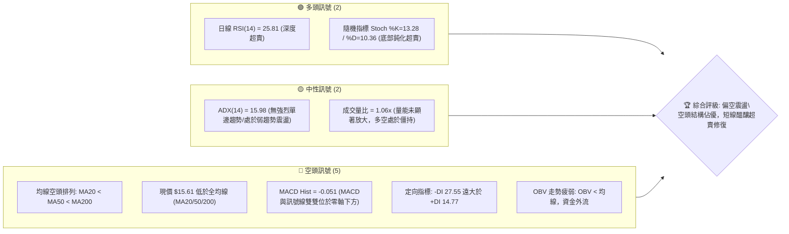
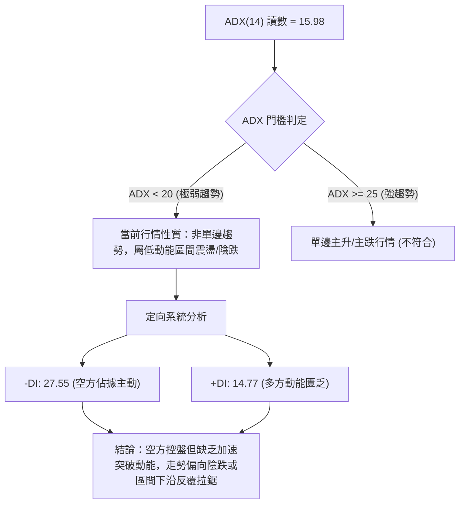
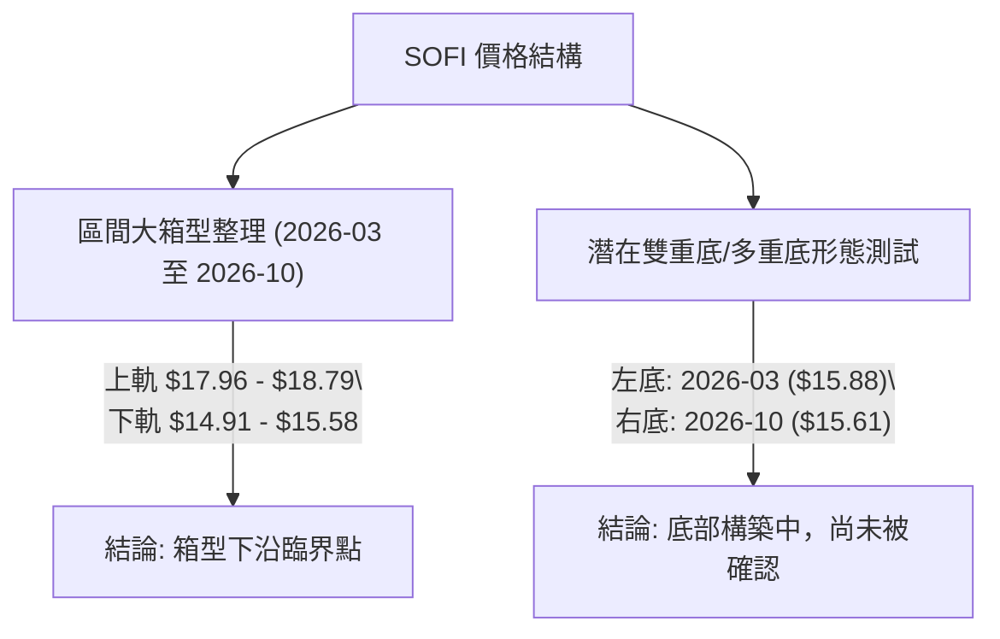
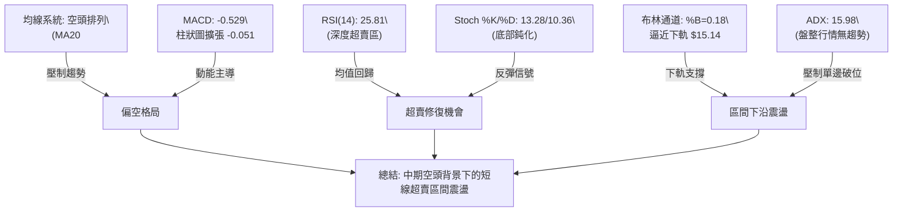
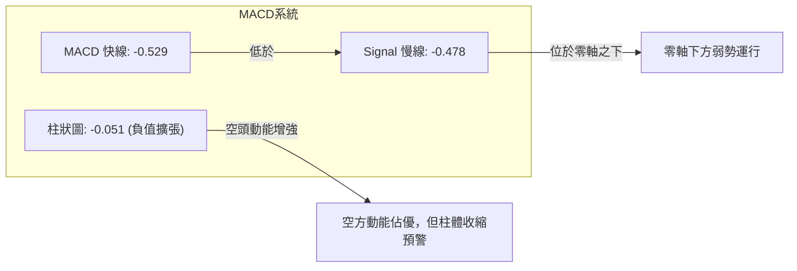
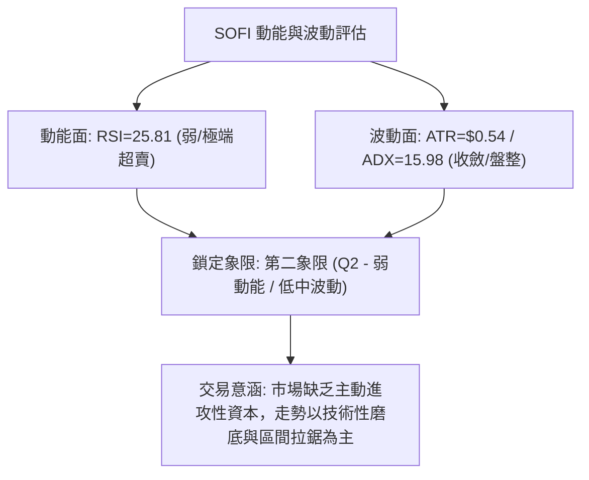
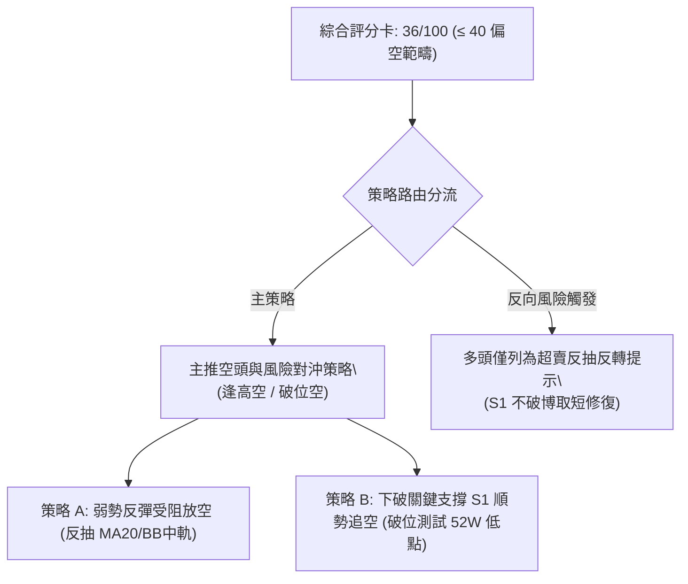
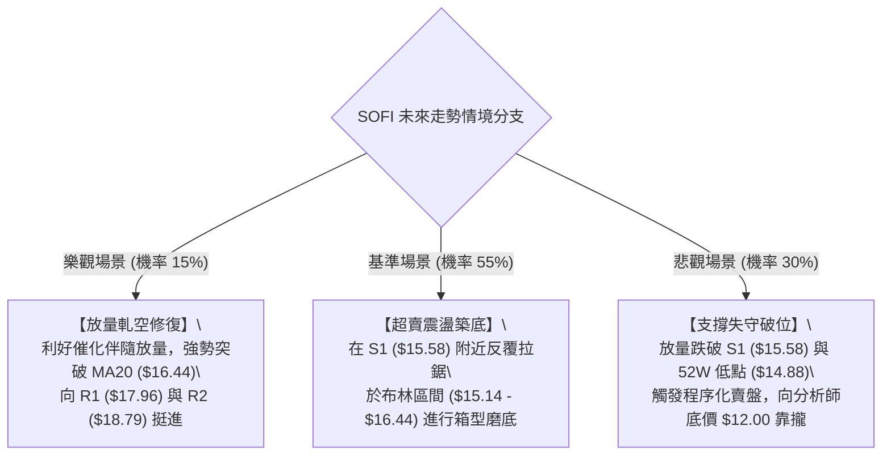

# SOFI 技術分析報告

> **報告日期**：2026-10-09 ｜ **語言**：繁體中文 ｜ **數據來源**：Yahoo Finance ｜ **當前價格**：$15.61

---

## 目錄

| 章節 | 內容 |
|------|------|
| [1. 技術面概覽](#1-技術面概覽) | 訊號儀表板、核心指標、評分卡 |
| [2. 趨勢分析](#2-趨勢分析) | 多時框趨勢、長中短期走勢 |
| [3. 圖表形態分析](#3-圖表形態分析) | 形態識別、K線組合、目標價 |
| [4. 支撐與阻力](#4-支撐與阻力) | 關鍵價位、斐波那契回調 |
| [5. 技術指標深度解讀](#5-技術指標深度解讀) | MA/RSI/MACD/布林/成交量 |
| [6. 動能與波動率](#6-動能與波動率) | 動能評估、ATR、Beta |
| [7. 多時框架總結](#7-多時框架總結) | 時框架評分矩陣 |
| [8. 交易策略建議](#8-交易策略建議) | 多空策略、風險報酬比 |
| [9. 風險提示與監控](#9-風險提示與監控) | 監控指標、風險場景 |

---

## 1. 技術面概覽

### 🎯 技術訊號儀表板



### 📊 核心指標速覽表

| 指標類別 | 指標名稱 | 當前數值 | 訊號 | 解讀 |
|:---|:---|:---|:---:|:---|
| **價格** | 當前價格 | $15.61 | 🔴 | 位於52週區間僅 4.1% 分位，極度貼近底部 |
| **均線** | MA20 (短) | $16.44 | 🔴 | 價格低於 MA20 達 -5.03%，短線下行受壓 |
| **均線** | MA50 (中) | $17.41 | 🔴 | 價格低於 MA50 達 -10.34%，中期反彈動能被壓制 |
| **均線** | MA200 (長) | $18.73 | 🔴 | 價格低於 MA200 達 -16.66%，長期處於熊市結構 |
| **動能** | RSI(14) | 25.81 | 🟢 | 進入極端超賣區 (<30)，具技術性均值回歸修復需求 |
| **動能** | MACD (12,26,9) | -0.529 / -0.478 | 🔴 | MACD 線跌破 Signal 線，柱狀圖 -0.051，空方動能延續 |
| **動能** | Stoch %K/%D | 13.28 / 10.36 | 🟢 | 隨機震盪指標嚴重超賣，短線再殺跌動能面臨衰竭 |
| **趨勢** | ADX / ±DI | 15.98 (-DI 27.55) | 🟡 | ADX < 25 判定為盤整震盪市，-DI 主導但單邊動能有限 |
| **通道** | 布林帶 %B | 0.18 (帶寬 $2.60) | 🔴 | 現價逼近下軌 $15.14，開口向下，處於弱勢通道運行 |
| **波動** | ATR(14) | $0.54 (3.44%) | 🟡 | 每日平均波動幅度中等，具備日內交易彈性但無異常爆發 |

### 🏆 技術評分卡

```
╔══════════════════════════════════════════════════════════════╗
║              技術評分卡 — SOFI (2026-10-09)                  ║
╠══════════════════════════════════════════════════════════════╣
║ 趨勢強度 (ADX/方向)   ██████░░░░░░░░░░░░░░  30/100  🔴 空頭壓制  ║
║ 動能指標 (RSI/MACD)   ████████░░░░░░░░░░░░  40/100  🟡 超賣醞釀  ║
║ 支撐穩定度 (S1/S2)    ██████████░░░░░░░░░░  50/100  🟡 臨近考驗  ║
║ 成交量配合 (OBV/量比) ██████░░░░░░░░░░░░░░  32/100  🔴 量能疲弱  ║
║ 形態完整度 (區間走勢) ████████░░░░░░░░░░░░  42/100  🟡 底部拉鋸  ║
║ 均線排列 (空頭發散)   ████░░░░░░░░░░░░░░░░  20/100  🔴 完全空頭  ║
╠══════════════════════════════════════════════════════════════╣
║ 綜合評分              ███████░░░░░░░░░░░░░  36/100  🔴 偏空震盪  ║
╚══════════════════════════════════════════════════════════════╝
```

---

## 2. 趨勢分析

### 🌐 多時框趨勢分析

```mermaid
graph TD
    M["月線框架 (長線)"] -->|"自 2025-11 高點 $29.72 回撤 -47.48%\\n跌破各期長線均線"| M_VIEW["偏空格局: 築底拉鋸"]
    W["週線框架 (中線)"] -->|"近20週在 $15.61 - $18.91 區間寬幅盤整\\n高點持續下移 (Lower Highs)"| W_VIEW["偏弱震盪: 考驗 $15.58 頸線支撐"]
    D["日線框架 (短線)"] -->|"現價 $15.61 跌破 MA5/10/20\\n均線空頭排列，但 RSI("14")=25.81 極度超賣"| D_VIEW["短線超賣: 醞釀跌勢趨緩與反抽"]
    
    M_VIEW --> SYNTHESIS{"多時框綜合研判"}
    W_VIEW --> SYNTHESIS
    D_VIEW --> SYNTHESIS
    SYNTHESIS --> FINAL["ADX=15.98 判定為盤整市：\\n以日線布林通道 ($15.14 - $17.74) 為主要運作區間"]
```

### 📈 長期趨勢 — 12個月走勢圖（Unicode）

以下為 SOFI 過去 12 個月（2025-11 至 2026-10）之月線收盤走勢視覺化分析：

```
SOFI 月線走勢圖（過去12個月：2025-11 至 2026-10）
價格 ($)
$30.00 ┤ ●(高點: 2025-11 $29.72)
$27.00 ┤   ●
$24.00 ┤     ●
$21.00 ┤
$18.00 ┤       ●               ●       ●
$15.00 ┤         ●   ●   ●   ●   ●   ●   ●(現價: $15.61)
$12.00 ┤
       └─┬───┬───┬───┬───┬───┬───┬───┬───┬───┬───┬───
        11  12  01  02  03  04  05  06  07  08  09  10  (月)
        2025            2026
```

#### 走勢特徵分析表格

| 階段 | 時間區間 | 起訖價格 | 漲跌幅 | 趨勢特徵與價量量能變化 |
|:---|:---|:---|:---:|:---|
| **歷史見頂期** | 2025-10 ~ 2025-11 | $29.68 → $29.72 | +0.13% | 構築雙重頂部，逼近 52 週高點 $32.73，動能衰竭 |
| **主跌推動浪** | 2025-12 ~ 2026-03 | $26.18 → $15.88 | -39.34% | 瀑布式單邊下挫，連續跌破 MA200，多頭無抵抗割肉出局 |
| **箱型整理期** | 2026-04 ~ 2026-08 | $16.10 → $17.88 | +11.05% | 於 $16.00 ~ $18.91 構築中樞，週成交量放大至 4.8 億股 |
| **二次探底期** | 2026-09 ~ 2026-10 | $15.72 → $15.61 | -0.70% | 再次下探測試前低，量能逐步萎縮，多空交投轉向低迷 |

### 📊 中期趨勢（週線分析）

從近 20 週數據觀察，SOFI 在 2026 年夏季曾於 2026-08-23 衝擊 $18.91 高點，但始終未能有效站上阻力位 R1 ($17.96) 與 R2 ($18.79)。進入 9 月後，週線收盤價自 2026-09-06 的 $18.22 連續 5 週走低，至 2026-10-11 收於 $15.61，週 RSI 自 49.5 快速回落至 25.8，呈現弱勢陰跌走勢。

```
中期阻力與支撐架構圖
$18.79 ──┬───────────────────────────── R2 / MA200 ($18.73) 強阻力帶
         │      ▲ 2026-08 衝擊失敗高點 ($18.91)
$17.96 ──┴───────────────────────────── R1 近期反彈波段頂
         │
$16.44 ──────────────────────────────── BB 中軌 / MA20 (短線反彈首要分水嶺)
         │
$15.61 ◄── 現價位置 (逼近歷史波段支撐聚集區)
         │
$15.58 ──────────────────────────────── S1 近期支撐位 (僅距 -0.22%)
$14.88 ──────────────────────────────── 52W 低點 / 斐波那契 100% 絕對防線
```

### ⚡ 趨勢強度評估（ADX 解讀）



#### ADX 趨勢強度量化對照表

| 指標 | 數值 | 參考區間 | 市場狀態解讀 |
|:---|:---:|:---:|:---|
| **ADX(14)** | **15.98** | < 20 (弱) / 20-25 (中) / > 25 (強) | **低趨勢強度（盤整狀態）**。空頭雖佔據優勢，但未形成猛烈拋售潮。 |
| **+DI (14)** | **14.77** | 0 ~ 100 | 多頭進攻意願極低，買盤呈現被動掛單。 |
| **-DI (14)** | **27.55** | 0 ~ 100 | 空頭主導定價權，壓制每一次短線反彈。 |
| **DI 差值** | **-12.78** | -DI 顯著高於 +DI | 熊方佔優，但由於 ADX 疲軟，追空易遭遇均值回歸反撲。 |

---

## 3. 圖表形態分析

### 🔍 形態識別系統



#### 形態識別與信心度評估表

依規則 15 嚴格審核幾何形態，剔除過度臆測，僅保留客觀可測數據：

| 形態類別 | 信心度 | 判斷依據（引用客觀數據） | 完成度 | 目標價計算式與精確點位 |
|:---|:---:|:---|:---:|:---|
| **箱體震盪**<br>(Rectangle) | **75%** | 價格在近 7 個月反覆於 S1 ($15.58) ~ R1 ($17.96) 間運行，波段低點與高點高度聚類。 | 85% | **箱頂突破目標**：頸線 R1 ($17.96) + 箱高 ($17.96 - $15.58 = $2.38) = **$20.34** |
| **雙重底潛力**<br>(Double Bottom) | **48%** | 第一次低點為 2026-03 收盤 $15.88，當前二次探底至 $15.61 (接近 S1 $15.58)。但未現放量陽線確認。 | 45% | *信心度 < 50%，依規則 15 判定為信號不足，僅作指標型超賣解讀，不預設多頭成型目標。* |
| **空頭下飄旗形**<br>(Bearish Flag) | **40%** | 自 8 月高點回落後斜率趨緩，但由於 ADX 僅 15.98，缺乏典型旗形向下突破的推動量能。 | 30% | *信心度不足，不予採用。* |

### 🕯️ 重要K線形態分析

| 月份 | 收盤價 | K線形態 | 形態深度解讀 | 訊號方向 |
|:---|:---:|:---|:---|:---:|
| **2025-11** | $29.72 | 倒轉鎚頭/十字星頂部 | 逼近 52W 高點 $32.73 遇阻，長上影線顯示高檔解套與獲利盤湧出。 | 🔴 強烈看跌 |
| **2026-03** | $15.88 | 長下影錘子線探底 | 歷經連續重挫後首次觸底放量企穩，形成年內關鍵結構性左底。 | 🟢 觸底反彈 |
| **2026-05** | $18.22 | 實體大陽線收復 | 向上突破 MA20 與 MA50，多頭一度嘗試奪回主動權。 | 🟢 短線多頭 |
| **2026-08** | $17.88 | 衝高回落流星線 | 上攻遇阻於阻力位 R1 ($17.96) 與 R2 ($18.79)，量能未能持續跟進。 | 🔴 頂部受壓 |
| **2026-09** | $15.72 | 中陰線下破 | 跌破所有短期均線，空方再度兵臨下軌，確立弱勢下行通道。 | 🔴 空方主導 |
| **2026-10** | $15.61 | 弱勢小陰線（截至今） | 徘徊於 S1 ($15.58) 邊緣，波動收斂，呈現極度觀望與賣盤力竭特徵。 | 🟡 中性築底 |

### 📉 ASCII 走勢形態示意圖

```
SOFI 箱體整理與底部結構示意圖
價格 ($)
$18.79 ┼────────────────────────────── R2 (箱體頂部強壓帶)
       │         ╭──╮      ╭──╮
$17.96 ┼─────────╯  ╰──────╯  ╰───────── R1 (頸線壓力位)
       │
$16.44 ┼─── 短期反彈中軸線 (MA20 / BB中軌) ─────────
       │
$15.61 ┼─────────────────────────── 現價 ($15.61) ◄ 逼近下軌
$15.58 ┼───╭──╮───────────────────╭─── S1 (箱體底部支撐線)
       │   │  │ (2026-03 底: $15.88) │ (當前二探低點)
$14.91 ┼───╯  ╰───────────────────╯─── S2 / 52W低點 ($14.88)
       └────────────────────────────────────────
```

### 🎯 形態目標價計算

根據上述具 75% 信心度之「矩形箱體震盪形態」進行數值推算：

1. **箱體上限（頸線/阻力）**：採用近一年波段高點聚類 **R1 = $17.96**
2. **箱體下限（支撐）**：採用近一年波段低點聚類 **S1 = $15.58**
3. **形態垂直高度**：
   $$H = \text{R1} - \text{S1} = \$17.96 - \$15.58 = \$2.38$$
4. **向下破位理論測幅目標（若失守 S1）**：
   $$\text{Down Target} = \text{S1} - H = \$15.58 - \$2.38 = \$13.20$$
   *(該數值與分析師最低目標價 $12.00 形成下方極端悲觀防守緩衝區)*
5. **向上突破理論測幅目標（若站穩 R1）**：
   $$\text{Up Target} = \text{R1} + H = \$17.96 + \$2.38 = \$20.34$$
   *(該數值與分析師平均目標價 $20.33 完全吻合)*

---

## 4. 支撐與阻力

### 🗺️ 關鍵價位分布圖（Unicode）

```
SOFI 價位結構分布圖 (OHLCV 與波段聚類精準計算)
═════════════════════════════════════════════════════════════════════
$19.62 ║██████████████████████████████║ 強阻力 R3 (+25.67%)
$18.79 ║████████████████████          ║ 關鍵阻力 R2 (+20.34%) / MA200
$18.70 ║▒▒▒▒▒▒▒▒▒▒▒▒▒▒▒▒▒▒▒▒          ║ 斐波那契 78.6% 回調位
$17.96 ║██████████████████████████████║ 核心波段阻力 R1 (+15.05%)
$17.74 ║░░░░░░░░░░░░░░░░░░░░░░        ║ 布林帶上軌
$16.44 ║─────────── 中軸 ─────────────║ MA20 / 布林中軌
$15.61 ╠══════════════════════════════╣ ◄ 現價 ($15.61)
$15.58 ║▓▓▓▓▓▓▓▓▓▓▓▓▓▓▓▓▓▓▓▓▓▓▓▓▓▓▓▓▓▓║ 近期核心支撐 S1 (-0.22%)
$15.14 ║░░░░░░░░░░░░░░░░░░░░░░        ║ 布林帶下軌
$14.91 ║██████████████████████████████║ 強支撐 S2 (-4.48%)
$14.88 ║██████████████████████████████║ 52週歷史低點 / 斐波那契 100%
═════════════════════════════════════════════════════════════════════
```

### 🚧 阻力位分析表

*(嚴格引用波段高點聚類數值)*

| 阻力級別 | 價位 | 形成原因與籌碼結構 | 突破難度 | 重要性 |
|:---|:---:|:---|:---:|:---:|
| **R1** | **$17.96** | 2026 年 5 月與 8 月兩次波段反彈頂部聚類區，密集套牢解套點。 | 🟡 中等 | ★★★★☆ |
| **R2** | **$18.79** | 近一年強阻力峰值，且與 MA200 ($18.73) 及斐波那契 78.6% ($18.70) 重合。 | 🔴 極高 | ★★★★★ |
| **R3** | **$19.62** | 突破牛熊分界線後的延展阻力位，籌碼真空帶上沿。 | 🔴 極高 | ★★★☆☆ |

### 🛡️ 支撐位分析表

*(嚴格引用波段低點聚類數值)*

| 支撐級別 | 價位 | 形成原因與籌碼結構 | 守住機率 | 重要性 |
|:---|:---:|:---|:---:|:---:|
| **S1** | **$15.58** | 距離現價僅 -0.22%，為 2026-03 以來多次下影線探底支撐密集區。 | 🟡 55% | ★★★★★ |
| **S2** | **$14.91** | 近一年極端波動低點聚類，與 52 週絕對低點 $14.88 形成雙重護城河。 | 🟢 80% | ★★★★★ |

### 📐 斐波那契回調位分析

依據 52 週極端區間（低點 **$14.88** 至 高點 **$32.73**，振幅 **$17.85**）之精確斐波那契位階剖析：

```
斐波那契點位階梯分布：
0.0%  (52W High) ───────────────────────── $32.73
23.6%            ───────────────────────── $28.52
38.2%            ───────────────────────── $25.91
50.0% (中位分水嶺) ─────────────────────── $23.80
61.8% (黃金分割) ───────────────────────── $21.70
78.6%            ───────────────────────── $18.70 (與 R2 $18.79 形成重合共振)
100.0%(52W Low)  ───────────────────────── $14.88 (與 S2 $14.91 形成重合共振)
```

#### 現價位置與技術意涵：
1. **當前點位區間**：現價 **$15.61** 處於 **78.6% ($18.70)** 與 **100.0% ($14.88)** 之間。
2. **深度回撤特徵**：股價自高點已抹去超過 **95.9%** 的整年漲幅，徹底跌穿 61.8% 黃金分割強支撐位 ($21.70)。
3. **終極防禦緩衝**：現價距離 100% 斐波那契回調位（$14.88）僅剩 **$0.73**（約 **-4.68%**）的下行空間，顯示當前價位在數學幾何上已步入**超賣築底區間**，下行邊際風險逐步遞減。

---

## 5. 技術指標深度解讀

### 🎛️ 指標訊號總覽



### 📈 移動平均線排列分析

```mermaid
graph TD
    P["現價 $15.61"]
    MA5["MA5: $15.74 (-0.85%)"]
    MA10["MA10: $15.87 (-1.64%)"]
    MA20["MA20: $16.44 (-5.03%)"]
    MA50["MA50: $17.41 (-10.34%)"]
    MA200["MA200: $18.73 (-16.66%)"]
    
    P <.-.|"緊貼"| MA5
    MA5 <.-. MA10
    MA10 <.-. MA20
    MA20 <.-. MA50
    MA50 <.-. MA200
```

#### 均線系統數據一覽表

| 均線週期 | 數值 | 價格相對於均線 | 斜率/走勢特徵 | 訊號評級 |
|:---|:---:|:---:|:---|:---:|
| **MA 5** | $15.74 | -0.85% | 短線急速下拐，直接壓迫現價 | 🔴 短空 |
| **MA 10** | $15.87 | -1.64% | 連續 10 日走低，反彈第一線動態阻力 | 🔴 短空 |
| **MA 20** | $16.44 | -5.03% | 布林中軌，中期強弱轉換關鍵水線 | 🔴 空方控盤 |
| **MA 50** | $17.41 | -10.34% | 季線下行，中期反彈天花板 | 🔴 中期空頭 |
| **MA 200** | $18.73 | -16.66% | 年線牛熊分界線，斜率向下傾斜 | 🔴 長期熊市 |
| **MA 240** | $20.33 | -23.20% | 長期成本線，空頭排列 MA20 < MA50 < MA200 | 🔴 空頭排列 |

### 📉 RSI(14) 分析

#### RSI 數值進度條
```
RSI(14) 讀數: 25.81
[██████░░░░░░░░░░░░░░░░░░] 25.81%  🟢 深度超賣 (<30)
0       30               70     100
     [超賣區]         [超買區]
```

#### 指標解讀與背離檢視：
1. **極值檢視**：日線 RSI 跌至 **25.81**，週線 RSI 跌至 **25.8**，雙時框同時步入 <30 深度超賣區間。這意味著自 2026-08-23 以來的拋壓已釋放殆盡，短線賣盤嚴重透支。
2. **背離分析（依規則 7）**：
   - **頂背離**：無。
   - **底背離**：當前價格自 2026-09-27 的 $16.58 下探至 $15.61（創新低），週線 RSI 自 28.9 略微回升至 25.8~28 附近，日線 RSI 亦在 25 附近持平，但**尚未形成顯著的標準底背離**（因為價格與指標斜率大致同步探底）。
   - **結論**：判定為「**無明顯背離**」，當前超賣屬於正常順勢陰跌產生的超賣，短線雖有修復反彈動能，但在缺乏指標底背離形態背書下，不應盲目預期 V 型強勢反轉。

### 📊 MACD(12/26/9) 訊號解讀



#### MACD 結構解析：
- **雙線位置**：MACD (-0.529) 與 Signal (-0.478) 均深陷零軸下方，確認當前市場處於空頭定價環境。
- **柱狀圖動態**：當前柱狀圖讀數為 **-0.051**，相比週線前期的 -0.117 有所收斂（週線柱狀由 10-04 的 -0.117 縮短至 10-11 的 -0.051），這說明空方下殺動能已開始衰退，出現動能耗竭跡象。

### 📦 布林通道分析

```
SOFI 布林通道結構圖 (參數: 20, 2)
價格 ($)
$17.74 ┼────────────────────────────── 上軌 (Upper Band)
       │
$16.44 ┼────────────────────────────── 中軌 (MA20 / Middle Band)
       │
$15.61 ┼──────────────── 現價 ($15.61, %B = 0.18)
$15.14 ┼────────────────────────────── 下軌 (Lower Band)
```

#### 布林通道關鍵參數解析：
- **通道帶寬**：Bandwidth = $(\$17.74 - \$15.14) / \$16.44 = 15.81\%$，處於中等收斂狀態，未見單邊主跌浪的暴烈擴軌。
- **%B 指標**：$\%B = (15.61 - 15.14) / (17.74 - 15.14) = 0.18$。當數值處於 0.18 時，表明價格正沿著下軌滑行，受到下軌支撐保護，屬於典型的超賣震盪特徵。

### 💹 成交量分析（量價配合度）

```
量能指標比對：
最新日成交量:  49,710,400  [███████████░] 106%
20日均量:      47,007,510  [██████████░░] 基準
50日均量:      46,609,484  [██████████░░]
```

#### 量價配合分析（依規則 9）：
1. **量比檢驗**：最新量比為 **1.06x**，處於基準線附近，並未出現伴隨下挫的放量恐慌潮。
2. **週量走勢**：回溯 5-7 月份，週成交量高達 4.2 億至 4.8 億股，而最近一週（2026-10-11）降至 **169,950,600** 股（僅約 1.7 億股），量能縮水超過 60%。這表明市場殺跌意願已進入**地量狀態**（無量陰跌）。
3. **OBV 走勢**：數據顯示「OBV < MA → 量能疲弱」。OBV 持續運行於其移動平均線下方，說明儘管成交縮量，但主流機構資金依然保持流出或袖手旁觀態勢，**未見量能底背離的大單吸籌信號**，量能不支持爆發性反轉行情。

---

## 6. 動能與波動率

### ⚡ 動能評估四象限

| 象限 | 動能狀態 | 波動率狀態 | SOFI 當前落點 | 戰略應對建議 |
|:---:|:---:|:---:|:---:|:---|
| **第一象限 (Q1)** | 強動能 (Bullish) | 低波動 (Low Vol) | — | 趨勢順勢加碼，風險收益比最優 |
| **第二象限 (Q2)** | 弱動能 (Bearish) | 低波動 (Low Vol) | **★ SOFI 當前位置** | **謹慎觀望 / 嚴控倉位**：區間拉鋸，避免追單 |
| **第三象限 (Q3)** | 強動能 (Bullish) | 高波動 (High Vol) | — | 突破行情，嚴設動態止盈止損 |
| **第四象限 (Q4)** | 弱動能 (Bearish) | 高波動 (High Vol) | — | 暴跌恐慌浪，禁止盲目抄底 |



### 📊 ATR 波動率分析

- **ATR(14) 絕對值**：**$0.54**
- **ATR 相對波幅**：佔當前股價比例為 **3.44%**
- **日間理論波動區間**：
  - 單日向上波幅阻力：$\$15.61 + \$0.54 = \mathbf{\$16.15}$
  - 單日向下波幅支撐：$\$15.61 - \$0.54 = \mathbf{\$15.07}$
- **止損距離建議**：
  - 順勢波段止損推薦設置為 **1.5 至 2.0 倍 ATR**：
    $$\text{1.5 ATR} = 1.5 \times \$0.54 = \mathbf{\$0.81}$$
    $$\text{2.0 ATR} = 2.0 \times \$0.54 = \mathbf{\$1.08}$$
  - 以現價 $15.61 逢低布局時，理論防守停損點應置於 $\$15.61 - \$0.81 = \$14.80$ 之下，恰好包覆住歷史低點 S2 ($14.91) 與 52W 低點 ($14.88)。

### 📐 Beta 與市場相關性

```
Beta 敏感度儀表：
Beta = 2.332  [███████████████████████░] 極高波動彈性
0             1.0 (標普基準)            2.0+ (高槓桿科技/金融)
```

- **Beta 數值**：**2.332**
- **意涵解讀**：SOFI 具備典型高 Beta 成長型 Fintech 屬性。當大盤（S&P 500 / 納斯達克）上漲 1% 時，該股預期波動約 2.33%；反之，大盤回撤 1% 時，其跌幅亦放大 2.33 倍。
- **風險意涵**：在當前空頭排列背景下，高 Beta 特質將放大下行尾部風險，任何宏觀流動性收緊或利率波動均會加劇其在 S1 ($15.58) 附近的考驗。

---

## 7. 多時框架總結

### 📋 時框架評分表

| 時框架 | 趨勢方向 | 動能狀態 | 均線排列 | 圖表形態 | 綜合評分 | 戰略建議 |
|:---|:---:|:---:|:---:|:---:|:---:|:---|
| **長期 (月線)** | 🔴 偏空 | RSI ~35 走低 | 空頭排列 (下破MA240) | 歷史高點腰斬回撤 | 28/100 | 不宜長線重倉，靜待年線打平 |
| **中期 (週線)** | 🔴 偏空 | MACD柱收縮 | 低於 MA50/200 | 寬幅箱型下探 ($15.58-$18.79) | 35/100 | 逢反彈阻力 (R1/R2) 減磅或對沖 |
| **短期 (日線)** | 🟡 震盪築底 | RSI=25.81 (超賣) | 短均壓制 (MA5/10/20) | 貼近布林下軌支撐 | 45/100 | 極限超賣修復，可小倉位博取反抽 |

### 🔲 綜合訊號矩陣

```
┌─────────────────┬──────────────────┬──────────────────┬─────────────────┐
│   分析維度      │    短期 (1-5日)   │    中期 (2-8週)  │   長期 (數月)   │
├─────────────────┼──────────────────┼──────────────────┼─────────────────┤
│ 均線系統        │ 🔴 壓制 (MA5/10) │ 🔴 空頭 (MA20/50)│ 🔴 空頭 (MA200) │
│ 動能指標 (RSI)  │ 🟢 超賣修復需求  │ 🔴 弱勢區間運行  │ 🔴 探底格局     │
│ 趨勢強度 (ADX)  │ 🟡 弱勢盤整中    │ 🟡 趨勢動能鈍化  │ 🔴 熊市延續     │
│ 支撐阻力結構    │ 🟢 守住 S1 $15.58│ 🟡 箱體震盪測試  │ 🔴 52W 低點臨界 │
│ 成交量能 (OBV)  │ 🟡 地量觀望      │ 🔴 資金未見大流入│ 🔴 機構倉位收縮 │
└─────────────────┴──────────────────┴──────────────────┴─────────────────┘
```

### ⚖️ 多時框收斂結論（依規則 14 執行）

1. **行情性質判定**：當前 **ADX(14) 讀數為 15.98**，顯著低於 25 的趨勢行情閥值。依規則 14 明確界定為：**【非單邊趨勢之盤整震盪行情】**。
2. **多時框優先級權衡**：在盤整行情中，中長期（週線/MA200）方向雖為壓制性的偏空格局，但日線與週線的極端超賣（RSI 25.81）大幅限制了空方的即時殺跌空間。以**日線布林通道 ($15.14 - $17.74) 作為主要交易區間**。
3. **方向性唯一結論**：
   $$\mathbf{【偏空震盪／防守型區間運行】}$$
   此結論與第 1 章技術評分卡（36/100 偏空）、第 2 章 ADX 分析完全一致。市場不具備順勢追空條件（過度超賣易被軋空反彈），亦不具備大舉做多條件（受制於全均線空頭壓制）。戰略核心定義為：**依託 S1/S2 支撐防守、以超賣修復為契機的區間逆向防禦思維**。

---

## 8. 交易策略建議

### 🗺️ 策略決策流程圖



### 🧭 策略路由

> **當前主策略方向 = 【空頭主導／逢高放空或破位跟進】（依技術評分卡 36/100 偏空評級判定）**

### 🎯 價格情境階梯（Price Scenarios）

*(所有價位精確引用第 4 章波段計算點位)*

| 觸發條件 | 下一目標 | 後續延伸 | 情境含義與市場行為解讀 |
|:---|:---:|:---:|:---|
| **強勢突破 R1 ($17.96)** | R2 ($18.79) | R3 ($19.62) | 短線強勢逆轉，挑戰年線 MA200，空頭停損引發軋空。 |
| **站穩現價區間 ($15.61)** | MA20 ($16.44) | BB上軌 ($17.74) | 超賣引發均值回歸修復，走勢在布林軌道內區間震盪。 |
| **跌破 S1 ($15.58)** | S2 ($14.91) | 52W低點 ($14.88) | 短線支撐失守，引發停損賣盤，測試整年度終極支撐。 |
| **失守 52W低點 ($14.88)** | 測幅目標 ($13.20)| 分析師低點 ($12.00)| 破位打開全新下行空間，空頭爆發單邊主跌浪。 |

### 📊 情境機率分佈

| 情境類別 | 機率預估 | 主要技術依據 |
|:---|:---:|:---|
| **情境一：弱勢反抽後回落** | **55%** | RSI(14)=25.81 極度超賣必有技術性修復；但 MA 系統全面空頭排列且 MACD 零軸下運行，反彈至 MA20 ($16.44) 附近必遭空方再次截殺。 |
| **情境二：直接破位下探 S2** | **30%** | -DI 高達 27.55 主導市場，現價距 S1 ($15.58) 僅 0.22%，若大盤回調，極易直接引發破位慣性下跌。 |
| **情境三：V型強勢反轉** | **15%** | OBV 走勢疲弱，量能萎縮至低檔，無主力機構建倉跡象，短期難以直接跨越 R1 ($17.96)。 |

### 🔴 主策略詳情（空頭主導）

*(嚴格按規範給出精確點位與風酬比)*

| 策略要素 | 策略 A（逢反彈高空 — 阻力防守） | 策略 B（破位順勢做空 — 跌破跟進） |
|:---|:---:|:---:|
| **交易邏輯** | 趁超賣修復反抽至布林中軌，高位博取回落 | 跌破一年重要低點密集區，順勢吃取下殺段 |
| **進場條件** | 價格反抽至 MA20 承壓受阻，出現滯漲陰線 | 日線收盤價跌破支撐位 S1 ($15.58) 且放量 |
| **進場價格** | **$16.44** (MA20 / 布林中軌) | **$15.50** (確認跌破 S1 $15.58 後) |
| **止損價格** | **$17.10** (上浮約 1.2x ATR $0.66) | **$15.95** (回抽站回 MA10 之上) |
| **目標價 T1** | **$15.58** (測試 S1 支撐位) | **$14.91** (波段強支撐 S2) |
| **目標價 T2** | **$14.91** (波段強支撐 S2) | **$14.88** (52W 歷史絕對低點) |
| **風險報酬比** | **1 : 2.32**<br>*(冒險 $0.66，獲利 $1.53 至 T2)* | **1 : 1.38**<br>*(冒險 $0.45，獲利 $0.62 至 T2)* |
| **成功機率** | **65%** | **50%** (受超賣限制，有假突破風險) |
| **建議倉位** | **15%** | **10%** |

### 🟢 反向風險觸發點（多頭對沖防禦提示）

若市場出現以下超預期走勢，主策略空頭部位必須無條件強制停損：
1. **多頭反轉關鍵點位**：若日線以大陽線放量收復 **$16.44 (MA20)**，且日線收盤價站穩，說明超賣修復轉化為強勢築底，空單應離場觀望。
2. **多頭極端防守點（激進型超短線博反彈機會）**：
   - 僅限極激進投資者：若現價在 **$15.58 (S1)** 出現長下影線拒絕下跌信號，可輕倉 (5%) 博取反抽。
   - **止損點**：嚴格設於 **$15.00**（跌破 S1 緩衝區）。
   - **目標價**：**$16.44** (MA20)。

### ⭐ 整體訊號強度評星

```
做多訊號強度：★★☆☆☆  (2.0/5星 — 僅有技術面指標超賣支撐，缺乏形態與量能配合)
做空訊號強度：★★★★☆  (3.8/5星 — 趨勢、均線、動能指標共振偏空)
整體可信度：  ★★★★☆  (4.0/5星 — 多時框指標收斂，價位聚類明確)
```

---

## 9. 風險提示與監控

### ✅ 關鍵監控指標 Checklist

```
╔══════════════════════════════════════════════════════════════╗
║              SOFI 技術面即時監控清單 (Checklist)              ║
╠══════════════════════════════════════════════════════════════╣
║ [ ] 支撐防守測試：收盤價是否跌破 S1 $15.58 (距現價僅-0.22%)   ║
║ [ ] 極端防禦測試：盤中是否刺穿 52W 低點 $14.88               ║
║ [ ] 反彈動能監控：RSI(14) 能否自 25.81 脫離超賣區回升至 35+    ║
║ [ ] 均線動態阻力：日內反抽觸及 MA20 $16.44 時的量價反應       ║
║ [ ] 趨勢變軌判定：ADX(14) 讀數是否突破 20，由盤整市轉趨勢下殺 ║
║ [ ] 量能異動跟蹤：單日成交量是否異常超越 5000 萬股門檻       ║
║ [ ] 宏觀聯動效應：納斯達克波動與美債收益率對高 Beta (2.33) 影響║
╚══════════════════════════════════════════════════════════════╝
```

### ⚠️ 風險場景分析



### 🛡️ 風險管理重要提醒

1. **避免在極端超賣區盲目追空**：當前 RSI 僅 25.81，隨機指標 %K/%D 位於 13/10 附近，市場隨時可能出現由空頭回補引起的急劇技術性脈衝反彈。做空應優先選擇反彈阻力位（如 MA20 $16.44），而非當前下沿位置。
2. **警惕高 Beta 乘數放大效應**：SOFI 的 Beta 高達 **2.332**，在宏觀事件或財報窗口期間具有超高波動性，單日波動極易突破 ATR（$0.54），操作上單筆交易風險敞口必須嚴格限制在總資金的 **1%~2%** 以內。
3. **空頭排列下的嚴格止損紀律**：鑑於 MA20 < MA50 < MA200 完全空頭排列，任何試圖抄底多頭的操作均屬「火中取栗」的逆勢交易，一旦股價失守波段支撐 S2 ($14.91)，必須第一時間堅決止損離場，嚴禁抱有死扛心態。

---

## 📋 報告總結

```
╔══════════════════════════════════════════════════════════════╗
║                   SOFI 技術分析報告總結                      ║
╠══════════════════════════════════════════════════════════════╣
║ 報告日期：2026-10-09                                         ║
║ 當前價格：$15.61                                             ║
║ 分析評級：🔴 偏空震盪 (技術評分: 36/100，空方主導但短線超賣)   ║
╠══════════════════════════════════════════════════════════════╣
║ 關鍵結論：                                                   ║
║ ├─ 長期趨勢：🔴 偏空熊市結構 (現價低於 MA200 達 -16.66%)       ║
║ ├─ 中期趨勢：🔴 弱勢箱型盤整 (多次衝擊 R1/R2 受阻回落)        ║
║ ├─ 短期趨勢：🟡 極端超賣鈍化 (RSI=25.81，考驗 S1 $15.58)       ║
║ ├─ 關鍵支撐：S1: $15.58 (-0.22%) ｜ S2: $14.91 (-4.48%)      ║
║ ├─ 關鍵阻力：R1: $17.96 (+15.05%) ｜ R2: $18.79 (+20.34%)    ║
║ └─ 分析師目標：均價 $20.33 ｜ 最低 $12.00 ｜ 最高 $30.00     ║
╠══════════════════════════════════════════════════════════════╣
║ 最優策略組合：                                               ║
║ 1. 🥇 最佳機會：等待弱勢反抽至 MA20 ($16.44) 承壓後進場做空  ║
║ 2. 🥈 次選機會：跌破關鍵支撐 S1 ($15.58) 後輕倉順勢追空至 S2 ║
║ 3. 🥉 保守選擇：完全空倉觀望，等待日線站穩 MA20 或形態底背離 ║
╚══════════════════════════════════════════════════════════════╝
```

---

> ⚠️ **免責聲明**：本報告為技術分析研究，所有數據及點位均嚴格基於歷史量價資訊計算推演。本報告**僅供研究與學術參考**，**不構成任何要約、招攬或投資建議**。高 Beta 金融資產交易存在高風險，投資人應獨立評估自身風險承受能力並嚴格執行風控紀律。

---

*報告生成時間：2026-10-09 ｜ 數據來源：Yahoo Finance ｜ 分析框架：多時框技術分析體系*