# SOFI 技術分析報告

> **報告日期**：2026-10-10 ｜ **語言**：繁體中文 ｜ **數據來源**：Yahoo Finance ｜ **當前價格**：$15.80

---

## 目錄

| 章節 | 內容 |
|------|------|
| [1. 技術面概覽](#1-技術面概覽) | 訊號儀表板、核心指標、評分卡 |
| [2. 趨勢分析](#2-趨勢分析) | 多時框趨勢、長中短期走勢 |
| [3. 圖表形態分析](#3-圖表形態分析) | 形態識別、K線組合、目標價 |
| [4. 支撐與阻力](#4-支撐與阻力) | 關鍵價位、斐波那契回調 |
| [5. 技術指標深度解讀](#5-技術指標深度解讀) | MA/RSI/MACD/布林/成交量 |
| [6. 動能與波動率](#6-動能與波動率) | 動能評估、ATR、Beta |
| [7. 多時框架總結](#7-多時框架總結) | 時框架評分矩陣 |
| [8. 交易策略建議](#8-交易策略建議) | 多空策略、風險報酬比 |
| [9. 風險提示與監控](#9-風險提示與監控) | 監控指標、風險場景 |

---

## 1. 技術面概覽

### 🎯 技術訊號儀表板

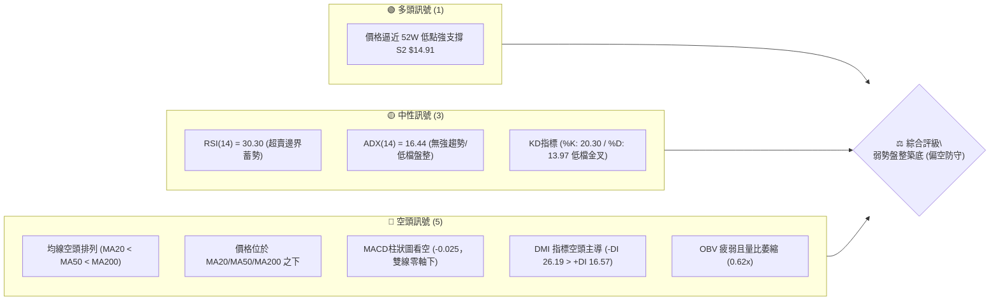

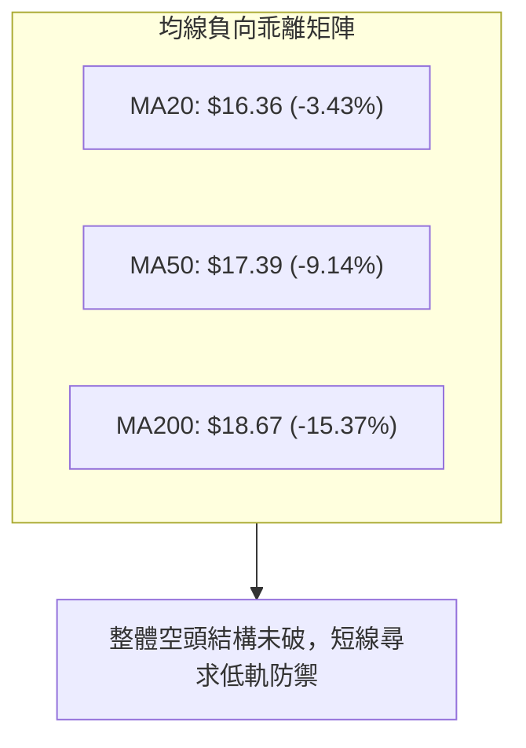

### 📊 核心指標速覽表

| 指標類別 | 指標名稱 | 當前數值 | 訊號 | 解讀 |
|----------|----------|----------|:----:|------|
| **價格** | 當前價格 | $15.80 | 🔴 | 位於 52 週區間 5.2% 分位，深陷低檔整理區間 |
| **均線** | MA20 | $16.36 | 🔴 | 價格低於 MA20（-3.43%），短線承壓於月線下 |
| **均線** | MA50 | $17.39 | 🔴 | 價格低於 MA50（-9.14%），中期反彈阻力沉重 |
| **均線** | MA200 | $18.67 | 🔴 | 價格低於 MA200（-15.37%），長期生命線完全失守 |
| **動能** | RSI(14) | 30.30 | 🟡 | 進入超賣臨界點（30.00），存在技術性反抽動能 |
| **動能** | MACD(12,26,9) | -0.509 / -0.484 | 🔴 | 雙線位於零軸下，柱狀圖 -0.025，空方控盤 |
| **趨勢** | ADX(14) | 16.44 | 🟡 | ADX < 25 處於弱趨勢/低動能盤整區間 |
| **通道** | 布林帶 %B | 0.28 | 🟡 | 價格運行於下軌（$15.10）與中軌（$16.36）間 |
| **量能** | 20日均量比 | 0.62x | 🔴 | 成交量 29.20M，大幅萎縮於均量，缺乏買盤推力 |
| **波動** | ATR(14) | $0.52 | 🟡 | 日波動率 3.26%，波動區間收斂，進入橫盤壓縮 |

### 🏆 技術評分卡

```
╔══════════════════════════════════════════════════════════════════╗
║                   技術評分卡 — SOFI (2026-10-10)                 ║
╠══════════════════════════════════════════════════════════════════╣
║ 趨勢強度 (Trend)       ████░░░░░░░░░░░░░░░░  20/100 🔴 強空格局  ║
║ 動能指標 (Momentum)    ███████░░░░░░░░░░░░░  35/100 🔴 偏弱超賣  ║
║ 支撐穩定度 (Support)   ████████████░░░░░░░░  60/100 🟡 支撐生效  ║
║ 成交量配合 (Volume)    ██████░░░░░░░░░░░░░░  30/100 🔴 量能匱乏  ║
║ 形態完整度 (Pattern)   ████████░░░░░░░░░░░░  40/100 🟡 區間打底  ║
║ 均線排列 (Moving Avg)  ██░░░░░░░░░░░░░░░░░░  10/100 🔴 完全空頭  ║
╠══════════════════════════════════════════════════════════════════╣
║ 綜合技術評分           ███████░░░░░░░░░░░░░  35/100 🔴 偏空盤整  ║
╚══════════════════════════════════════════════════════════════════╝
```

---

## 2. 趨勢分析

### 🌐 多時框趨勢分析

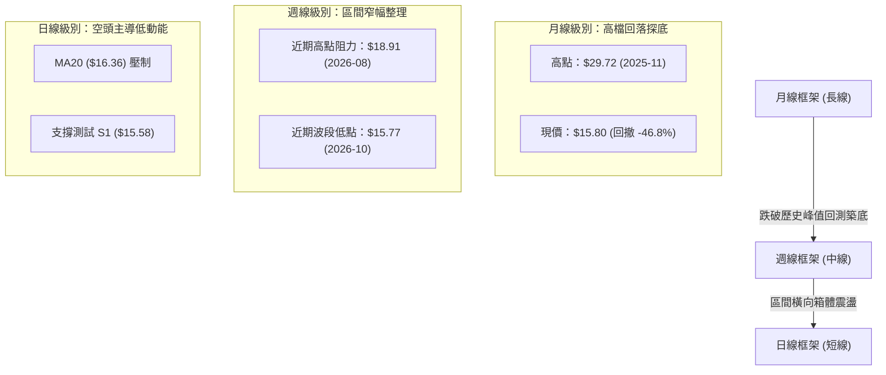

### 📈 長期趨勢 — 12個月走勢圖（Unicode）

```
SOFI 月線走勢圖（2025-11 至 2026-10）
價格軸 ($)
$30.00 ┤ ●(29.72)
$27.50 ┤   ●(26.18)
$25.00 ┤
$22.50 ┤     ●(22.81)
$20.00 ┤
$17.50 ┤       ●(17.76)         ●(18.22)  ●(17.88)
$15.00 ┤         ●(15.88) ●(16.10)   ●(17.93)   ●(15.72)─●(15.80)←現價
       └─────────────────────────────────────────────────────────────
         11   12   01   02   03   04   05   06   07   08   09   10 (月份)
         2025      2026
```

**走勢特徵分析表格**：

| 週期區間 | 起訖月份 | 始價 ($) | 終價 ($) | 漲跌幅 | 主要走勢特徵與結構意涵 |
|:---|:---|:---:|:---:|:---:|:---|
| **見頂下挫期** | 2025-11 → 2026-03 | 29.72 | 15.88 | -46.57% | 自牛市歷史頂部單邊破位暴跌，放量貫穿多條長期均線 |
| **低檔修復期** | 2026-03 → 2026-05 | 15.88 | 18.22 | +14.74% | 觸及 52 週低位區間後展開技術性反彈，受阻於 $18.50 壓力帶 |
| **弱勢橫盤期** | 2026-05 → 2026-08 | 18.22 | 17.88 | -1.87% | 在 $16.30 - $18.90 之間維持寬幅箱體拉鋸，動能持續衰退 |
| **二次探底期** | 2026-08 → 2026-10 | 17.88 | 15.80 | -11.63% | 量能大幅萎縮，回測下檔支撐 S1 $15.58 及 52W 低點 $14.88 |

### 📊 中期趨勢（週線分析）

從近 20 週數據觀察，SOFI 在 2026 年 8 月下旬觸及波段高點 $18.91（2026-08-23 週收盤）後，呈現逐波走低的階梯式下挫格局。週線 RSI 從高點的 59.6 快速回落至 30.3，MACD 柱狀圖亦由正翻負並在 -0.025 至 -0.147 之間維持弱勢收縮。

```
週線級別價格壓力與支撐階梯分布：
$19.62 ─────────────────────────── 強阻力 R3（波段極限頂部）
$18.79 ─────────────────────────── 中期頭部頸線 R2 / MA200 壓制帶 ($18.67)
$17.96 ─────────────────────────── 反彈首要障礙 R1 / BB 上軌 ($17.62)
$16.36 ─────────────────────────── BB 中軌 / MA20 壓制線
$15.80 ───● 現價 (受制於短期均線)
$15.58 ─────────────────────────── 波段密集低點 S1
$14.91 ─────────────────────────── 核心生命支撐 S2 (近 52W 低點 $14.88)
```

### ⚡ 趨勢強度評估（ADX 解讀）

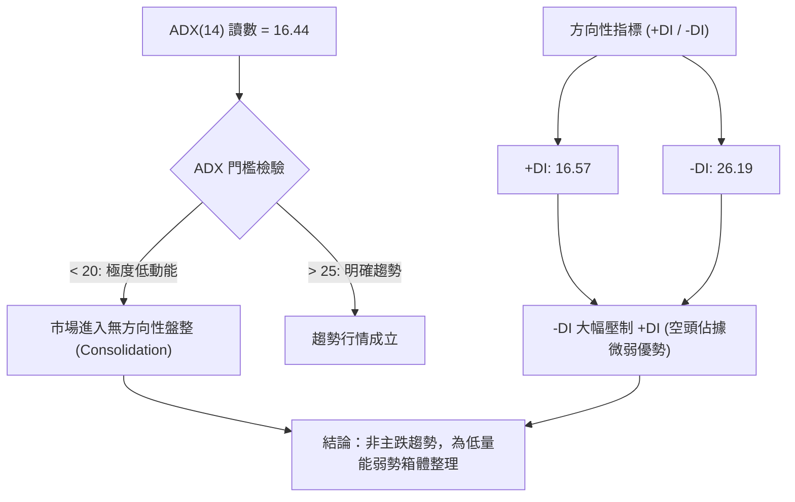

**ADX 趨勢強度對照解讀表**：

| 指標變數 | 當前讀數 | 門檻區間 | 趨勢判定 | 交易架構指引 |
|:---|:---:|:---:|:---:|:---|
| **ADX(14)** | **16.44** | < 20 (極弱) | 盤整行情（無趨勢） | 嚴禁採用順勢突破策略；應採區間下軌高低拋吸 |
| **-DI (空方動能)** | **26.19** | > 25 (偏強) | 空方仍具掌控權 | 反彈力道預期有限，空方壓制未完全消除 |
| **+DI (多方動能)** | **16.57** | < 20 (疲軟) | 多方缺乏追價買盤 | 不具備持續性噴出行情之推力 |
| **DI 差值差距** | **-9.62** | 負向擴大 | 弱勢偏空結構 | 唯有 ADX 向上翻揚突破 25，趨勢方向才得以確立 |

---

## 3. 圖表形態分析

### 🔍 形態識別系統

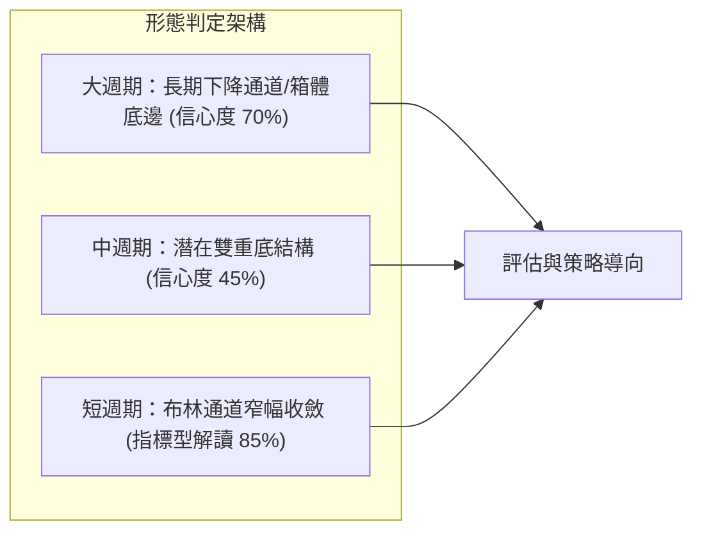

**形態信心度與驗證表格**：

| 形態類別 | 信心度 | 判斷依據（引用數據） | 完成度 | 目標價（附嚴格計算式） |
|:---|:---:|:---|:---:|:---|
| **低檔水平箱體整理** | **70%** | 價格在 2026 年持續於 S2 $14.91 至 R1 $17.96 間震盪，長達 8 個月未破大底 | **75%** | 箱體頂部 R1 = **$17.96**；若突破則向上等距測幅：$17.96 + ($17.96 - $14.91) = **$21.01** |
| **雙重底 (W底) 雛形** | **45%** | 第一底為 2026-03 收盤價 $15.88（或 52W 低點 $14.88），現價 $15.80 正在探測第二底 | **40%** | **訊號不足，信心度低於 50%**。頸線暫定波段高點聚類 R1 $17.96，暫不作幾何目標推算 |
| **均線空頭收斂整理** | **85%** | MA5 ($15.75) 與 MA10 ($15.79) 黏合走平，價格受壓於 MA20 ($16.36) | **90%** | 指標型技術解讀：短線目標中軌 **$16.36**，極限反彈目標下行均線 MA60 **$17.29** |

### 🕯️ 重要K線形態分析

| 週/月週期 | 收盤價 ($) | 識別之 K 線形態 | 技術意涵與結構解讀 | 訊號強度 |
|:---|:---:|:---|:---|:---:|
| **2026-08-23 週** | 18.91 | 波段長上影倒轉錘頭 | 衝擊 R2 ($18.79) 失敗，多頭動能耗盡，主力減倉 | 🔴 空頭反轉 |
| **2026-09-27 週** | 16.58 | 中黑實體陰線破位 | 跌破 MA20 ($16.36) 與 MA60，成交量擴大，確認轉弱 | 🔴 空頭延續 |
| **2026-10-04 週** | 15.77 | 帶長下影線之極限錘頭 | 探測近 52W 低點支撐後獲逢低承接盤抵抗，空頭動能衰退 | 🟡 止跌雛形 |
| **2026-10-11 週** | 15.80 | 低檔窄幅十字星 (Doji) | 開收盤價高度重合，成交量驟降（量比 0.62x），多空極度猶豫 | 🟡 多空中立 |

### 📉 ASCII 走勢形態示意圖

```
SOFI 週線級別低檔箱體震盪形態（2026-05 至 2026-10）
$19.62 ┬────────────────────────────────────────── 阻力 R3
$18.79 ┼              ╭─●(18.91 頂部頸線)
$17.96 ┼  ╭─●(18.22) │     ╰─╮                    阻力 R1 (箱頂)
$17.29 ┼──│──────────│───────│──────────────────── MA60 壓力軸
$16.36 ┼──│──────────│───────│───╭─╮────────────── MA20 / BB中軌
$15.80 ┼  │          │       ╰───│─│─●─●($15.80 當前位置)
$15.58 ┼──│──────────│───────────│─│──┴─── 支撐 S1
$14.91 ┴──●(14.88 第一底)─────────┴─┴────────── 支撐 S2 (箱底/第二底醞釀)
       └───────────────────────────────────────────
          05月       07月        08月   09月  10月
```

### 🎯 形態目標價計算

根據上述水平箱體形態（信心度 70%）結構進行測算：
1. **箱體下邊界 (Floor)**：以波段低點聚類支撐 S2 **$14.91**（緊貼 52W 低點 $14.88）為基底。
2. **箱體上邊界 (Ceiling)**：以波段高點聚類阻力 R1 **$17.96** 為頸線。
3. **箱體垂直高度 (Height)**：
   $$\text{Height} = R1 - S2 = \$17.96 - \$14.91 = \$3.05$$
4. **箱體突破目標價推算**：
   - **目標價 1 (箱體回歸目標)**：直接測試箱體上軌 R1 = **$17.96**。
   - **目標價 2 (若有效向上突破 Neckline)**：
     $$\text{Target 2} = R1 + \text{Height} = \$17.96 + \$3.05 = \$21.01$$
     *(註：該數值僅為形態理論目標，上方將於 $18.79 (R2) 與 $19.62 (R3) 面臨密集拋壓)*

---

## 4. 支撐與阻力

### 🗺️ 關鍵價位分布圖（Unicode）

```
SOFI 價位結構分布圖（嚴格依據 OHLCV 聚類計算數據）
═══════════════════════════════════════════════════════════════════════
$19.62 ║████████████████████████████████████║ 強阻力 R3 (+24.16%)
$18.79 ║████████████████████████████        ║ 阻力 R2 (+18.89%)
$18.67 ║────────────────────────────────────║ 長期年線 MA200
$17.96 ║████████████████████                ║ 關鍵阻力 R1 (+13.67%)
$17.62 ║────────────────────────────────────║ 布林通道上軌
$16.36 ║┄┄┄┄┄┄┄┄┄┄┄┄┄┄┄┄┄┄┄┄┄┄┄┄┄┄┄┄┄┄┄┄┄┄║ 布林中軌 (MA20)
$15.80 ╠════════════════════════════════════╣ ◄ 當前市價 ($15.80)
$15.58 ║▓▓▓▓▓▓▓▓▓▓▓▓▓▓▓▓▓▓▓▓                ║ 近期波段支撐 S1 (-1.42%)
$15.10 ║────────────────────────────────────║ 布林通道下軌
$14.91 ║████████████████████████████████    ║ 核心波段強支撐 S2 (-5.63%)
$14.88 ║════════════════════════════════════║ 52週歷史極限低點
═══════════════════════════════════════════════════════════════════════
```

### 🚧 阻力位分析表

所有阻力價位嚴格引用系統計算之波段聚類數據：

| 阻力級別 | 價位 ($) | 距現價幅幅 | 形成原因與籌碼結構 | 突破難度 | 重要性 |
|:---|:---:|:---:|:---|:---:|:---:|
| **R1** | **$17.96** | +13.67% | 近一年多次波段高點密集反轉區；BB 上軌 ($17.62) 延伸重壓區 | 🟡 中等 | ★★★★☆ |
| **R2** | **$18.79** | +18.89% | MA200 ($18.67) 聚集處，2026 年 8 月反彈頂部頸線，套牢量極大 | 🔴 極高 | ★★★★★ |
| **R3** | **$19.62** | +24.16% | 近一年波段上攻極限阻力點，空方最後強防線 | 🔴 極高 | ★★★☆☆ |

### 🛡️ 支撐位分析表

所有支撐價位嚴格引用系統計算之波段聚類數據：

| 支撐級別 | 價位 ($) | 距現價幅幅 | 形成原因與籌碼結構 | 守住機率 | 重要性 |
|:---|:---:|:---:|:---|:---:|:---:|
| **S1** | **$15.58** | -1.42% | 近期週線密集踩踏低點，短線多頭第一道防禦壕溝 | 🟡 60% | ★★★☆☆ |
| **S2** | **$14.91** | -5.63% | 歷史 52 週最低點 $14.88 聚類帶，機構與長期買盤集結底線 | 🟢 85% | ★★★★★ |

### 📐 斐波那契回調位分析

依據 52 週完整波段高低點（起點低位 $14.88 至 峰值頂部 $32.73，落差 $17.85）之精確回調點陣：

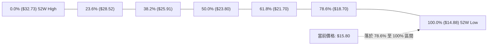

**斐波那契價位對照與深度解讀**：

| 回調比率 | 價位 ($) | 當前價格相對位置 | 結構意涵解讀 |
|:---|:---:|:---:|:---|
| **0.0% (52W High)** | $32.73 | 價格遠在其下方 (-51.7%) | 過去一年牛市頂部，長期套牢盤深重 |
| **23.6%** | $28.52 | 價格遠在其下方 (-44.6%) | 牛市初次回踩支撐，現已轉為極強遠期障礙 |
| **38.2%** | $25.91 | 價格遠在其下方 (-39.0%) | 弱勢修正極限點，破位後轉為漫長熊市 |
| **50.0%** | $23.80 | 價格遠在其下方 (-33.6%) | 多空心理平衡中軸 |
| **61.8%** | $21.70 | 價格遠在其下方 (-27.2%) | 黃金分割強防線，失守宣告全面轉空 |
| **78.6%** | $18.70 | 位於價格上方 (+18.4%) | **深度回撤臨界線**；該位置精確重合 MA200 ($18.67) 與 R2 ($18.79) |
| **100.0% (52W Low)**| $14.88 | **位於價格下方 (-5.8%)** | **波段終極支撐**；貼合聚類支撐 S2 ($14.91) |

> **回調位結構總結**：SOFI 當前市價 $15.80 處於 **78.6% 回調位 ($18.70)** 與 **100.0% 回調位 ($14.88)** 之間的「極度超跌築底區間」。價格已回吐過去一年上漲波段的 94.8% 幅度，下檔下跌空間受限於 $14.88 之硬性支撐，具備築造底部的深層價值。

---

## 5. 技術指標深度解讀

### 🎛️ 指標訊號總覽

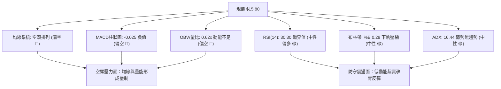

### 📈 移動平均線排列分析

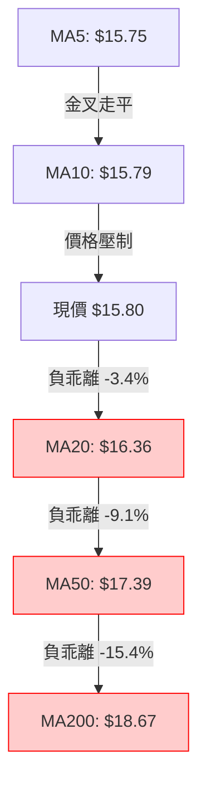

**均線系統詳細參數表**：

| 週期均線 | 當前價格 | 與現價價差 | 乖離率 (%) | 斜率與方向 | 多空評估 |
|:---|:---:|:---:|:---:|:---:|:---:|
| **MA5** | $15.75 | +$0.05 | +0.32% | ▲ 走平微揚 | 🟢 極短線止跌 |
| **MA10** | $15.79 | +$0.01 | +0.05% | ▲ 走平 | 🟡 短線多空拉鋸 |
| **MA20 (月線)** | $16.36 | -$0.56 | -3.43% | ▼ 下行 | 🔴 短期反彈阻力 |
| **MA50 (季線)** | $17.39 | -$1.59 | -9.14% | ▼ 下行 | 🔴 中期下行壓力 |
| **MA60** | $17.29 | -$1.49 | -8.59% | ▼ 下行 | 🔴 中期均線反壓 |
| **MA120 (半年線)**| $17.19 | -$1.39 | -8.10% | ▼ 下行 | 🔴 中長期沉重壓力 |
| **MA200 (年線)** | $18.67 | -$2.87 | -15.37% | ▼ 下行 | 🔴 長期牛熊分水嶺 |
| **MA240** | $20.27 | -$4.47 | -22.05% | ▼ 陡峭下行 | 🔴 極長線壓制 |

### 📉 RSI(14) 分析

當前日線 RSI(14) 讀數為 **30.30**，週線 RSI 亦來到 **30.3**。

```
RSI(14) 強度區間標記：
[0] ─────────────── [30] ───────●─────── [50] ─────────────────────── [70] ─────────────── [100]
                    超賣區     現價 30.30        中軸平衡線           超買區
進度條：██████░░░░░░░░░░░░░░  30.30%
```

- **超買超賣判定**：數值 30.30 恰巧緊貼 30.00 之標準超賣線。在無重大利空摜壓下，指標進入嚴重鈍化邊界，下殺動能已大幅削弱，具備技術性修復需求。
- **背離判斷 (Divergence)**：
  - 日線 RSI：當前數值無明顯日線底背離跡象，價格與 RSI 同步滑落至區間低檔。
  - 週線 RSI：前低（2026-09-27 週收盤 $16.58）對應 RSI 為 28.9；當前（2026-10-11 週收盤 $15.80）價格創下新低，但 RSI 讀數為 30.3。
  - **背離結論**：週線級別出現微幅**弱勢底背離（Bullish Divergence）雛形**，顯示中期賣盤力道未隨價格破底而增強，空頭動能衰竭。

### 📊 MACD(12,26,9) 訊號解讀

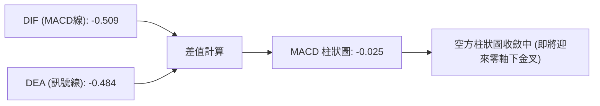

- **MACD 線與訊號線解讀**：DIF (-0.509) 處於 DEA (-0.484) 下方，兩者均在零軸之下深度運行，證實中長期仍受空頭趨勢籠罩。
- **柱狀圖動能轉變**：柱狀圖當前為 **-0.025**。相較於前兩週的 -0.084 與 -0.117，負向柱狀體已呈現連續兩週的顯著**大幅收斂**。
- **走勢預判**：DIF 與 DEA 差距僅 0.025，極易在現價區間震盪中引發低檔**黃金交叉**，一旦轉正，將觸發回抽 MA20 的短線買訊。

### 📦 布林通道分析

```
布林通道 (20, 2) 價位區間分布：
$17.62 ┬────────────────────────────────────────── BB 上軌 (Upper Band)
       │
$16.36 ┼┄┄┄┄┄┄┄┄┄┄┄┄┄┄┄┄┄┄┄┄┄┄┄┄┄┄┄┄┄┄┄┄┄┄┄┄┄┄┄┄┄ BB 中軌 (MA20)
       │                  
$15.80 ┼─────────● 現價 (位處通道下半部，%B = 0.28)
       │
$15.10 ┴────────────────────────────────────────── BB 下軌 (Lower Band)
```

- **通道帶寬與形態**：通道帶寬為 $17.62 - $15.10 = $2.52（寬度約 15.4%）。帶寬在歷經前期下殺後開始呈現平行收斂態勢，代表單邊下跌動能暫歇。
- **%B 指標解讀**：目前數值為 **0.28**。數值落於 0.20 至 0.30 之低位整理區，確認股價雖偏弱，但並未沿下軌出現開口張大的「布林通道下軌漫步（Band Walking）」主跌現象。
- **中軌壓制作用**：BB 中軌 **$16.36** 為短線首要反彈目標與強弱分水嶺。

### 💹 成交量分析（量價配合度）

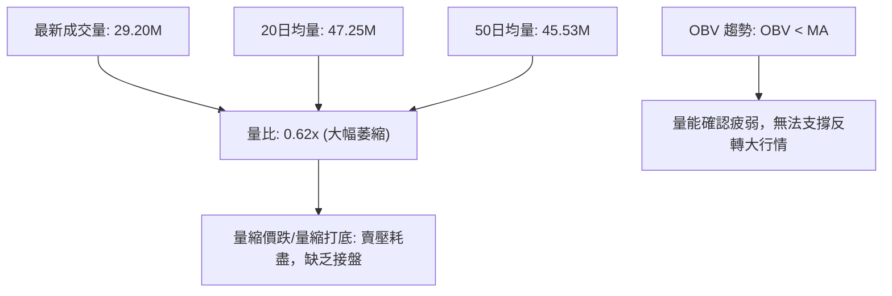

- **量比與均量結構**：最新日成交量僅 29.20M，大幅低於 20 日均量（47.25M）與 50 日均量（45.53M），量比僅為 **0.62x**。
- **量價關係解讀**：
  - 價格下探 S1 ($15.58) 過程呈現「**無量陰跌**」格局，顯示當前下行並非機構恐慌性出逃或大量主力拋盤所致，而是市場觀望氣氛濃厚，缺乏主動性買盤介入所致。
- **OBV (能量潮指標) 剖析**：OBV 持續位於其均線下方運行，未見能量潮逆勢走高的多頭背離，表明現階段資金以防禦沉澱為主，尚未啟動主動性增倉吸籌流程。

---

## 6. 動能與波動率

### ⚡ 動能評估四象限

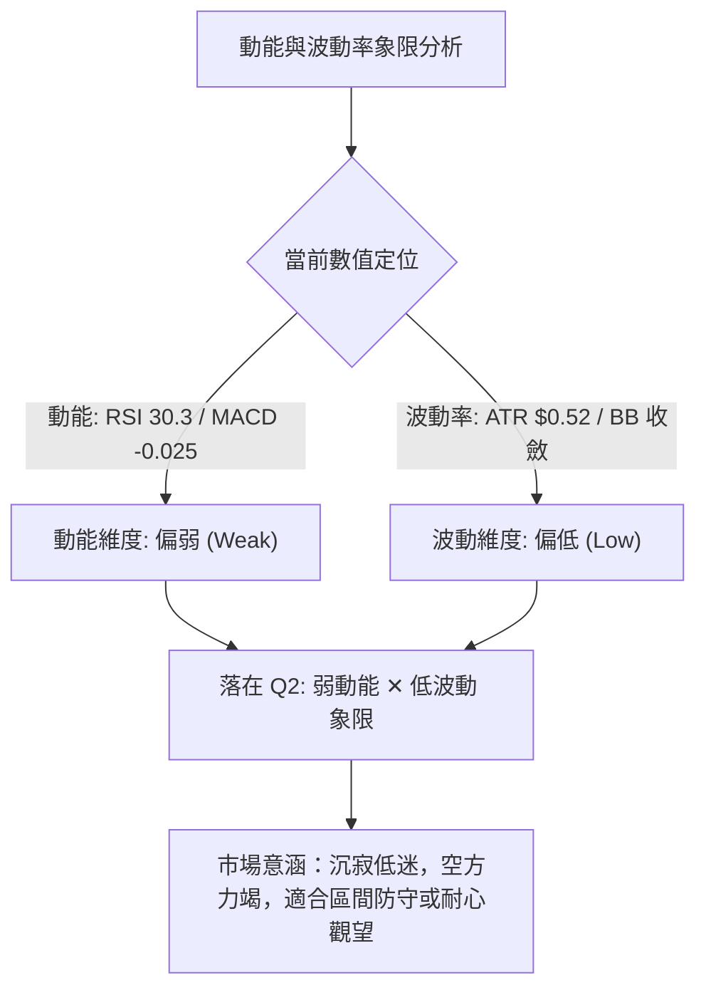

**四象限特徵矩陣表**：

| 象限代號 | 動能狀態 | 波動率狀態 | 當前股票歸屬 | 操作意涵與策略指引 |
|:---:|:---:|:---:|:---:|:---|
| **Q1** | 強 (Bullish) | 低 (Low) | — | 穩定多頭上升趨勢，最佳順勢加碼環境 |
| **Q2** | **弱 (Bearish/Flat)** | **低 (Low)** | **✓ SOFI (當前位置)** | **築底醞釀期；價格波動收窄，賣壓衰竭，宜嚴設止損佈局低吸** |
| **Q3** | 強 (Volatile) | 高 (High) | — | 單邊突破或恐慌下殺，高風險高收益波段 |
| **Q4** | 弱 (Exhausted) | 高 (High) | — | 失控主跌段或流動性陷阱，必須全面規避進場 |

### 📊 ATR 波動率分析

- **ATR(14) 絕對值**：**$0.52**
- **ATR 相對價格比**：$$\frac{\$0.52}{\$15.80} = 3.26\%$$
- **波動率環境判定**：3.26% 處於歷史常規偏低波動區間，顯示短線單日震盪幅度極限約在 ±$0.52 內。
- **動態止損與風控設置指引**：
  - **保守型止損距離 (2.0 × ATR)**：
    $$\text{Buffer} = 2.0 \times \$0.52 = \$1.04$$
    *(相對於現價下放至 $15.80 - $1.04 = $14.76，剛好覆蓋 52W 低點 $14.88)*
  - **積極型止損距離 (1.0 × ATR)**：
    $$\text{Buffer} = 1.0 \times \$0.52 = \$0.52$$
    *(相對於現價下放至 $15.80 - $0.52 = $15.28，貼近支撐 S1 $15.58)*

### 📐 Beta 與市場相關性

- **Beta 係數**：**2.332**
- **市場敏感度解讀**：
  - SOFI 的 Beta 高達 2.332，屬於**高彈性、高貝塔金融科技標的**。當大盤（S&P 500 或 Nasdaq）上漲 1% 時，理論上該股波動幅度約為 2.33%；反之，大盤回檔時其下挫動能亦會放大兩倍以上。
  - **融資融券與籌碼疊加效應**：
    - 做空比例 (Short % of Float) 高達 **14.8%**，空頭回補天數 (Short Ratio) 達 **4.68 天**。
    - 在高 Beta 搭配高軋空潛力的籌碼結構下，一旦市場整體情緒轉暖或股價站穩關鍵阻力 R1 ($17.96)，將極易觸發空頭停損回補引發的暴力軋空行情。

---

## 7. 多時框架總結

### 📋 時框架評分表

| 時框架 | 趨勢方向 | 動能狀態 | 均線排列 | 形態結構 | 綜合評分 | 戰略建議 |
|:---|:---:|:---:|:---:|:---:|:---:|:---|
| **短期 (日線)** | 弱勢震盪 🟡 | 超賣修復 🟡 | 空頭排列 🔴 | 下軌收斂 🟡 | **40/100** | 依賴支撐 S1/S2 防守，短線不追空 |
| **中期 (週線)** | 下行整理 🔴 | 柱狀收斂 🟡 | 均線壓制 🔴 | 水平大箱體 🟡 | **35/100** | 箱體下緣尋求安全邊際，反彈減倉 |
| **長期 (月線)** | 大週期空頭 🔴 | 動能放緩 🟡 | 跌破年線 🔴 | 深度回撤 78.6% 🟡 | **30/100** | 長線籌碼沉殿，靜待底部形態確立 |

### 🔲 綜合訊號矩陣

```
時框架訊號矩陣收斂表：
┌──────────────┬────────────┬────────────┬────────────┬────────────┐
│   維度 / 週期 │ 短期 (日線)│ 中期 (週線)│ 長期 (月線)│  一致性結論│
├──────────────┼────────────┼────────────┼────────────┼────────────┤
│ 趨勢方向     │  弱勢震盪  │  下行整理  │  深度回撤  │  偏空一致  │
│ 均線系統     │  空頭排列  │  空頭排列  │  失守長均  │  空頭壓制  │
│ 動能指標     │  低檔金叉  │  柱狀收斂  │  超賣鈍化  │  下行動能竭│
│ 量能配合     │  嚴重萎縮  │  量能衰退  │  無承接量  │  流動性收緊│
│ 支撐有效度   │  S1 獲支撐 │  S2 強防守 │  52W 底生效│  下檔具支撐│
└──────────────┴────────────┴────────────┴────────────┴────────────┘
```

### ⚖️ 多時框收斂結論

嚴格依據**多時框收斂規則第 14 條**進行嚴謹推導：
1. **行情性質判定**：當前 ADX(14) 讀數為 **16.44**，遠低於 25 的趨勢門檻，明確界定當前市場處於**「無趨勢的低動能盤整行情」**，而非單邊主跌浪。
2. **主導維度依歸**：在 ADX < 25 的盤整結構中，日線級別的布林通道軌道與聚類支撐阻力構成主要交易依據。週線與月線的空頭排列代表上方空間受到壓制，但短線不具備順勢殺跌動能。
3. **最終方向性結論**：**【中性偏弱觀望，以區間下軌防守為主】**。
   - 價格在 S1 $15.58 至 S2 $14.91 具備高度支撐穩定度；
   - 上行則面臨 MA20 ($16.36) 與 R1 ($17.96) 之層層天花板；
   - 操作上否定單邊放空策略，亦否定激進突破做多，唯一合邏輯策略為：**於支撐位附近採取高盈虧比的區間下緣低吸防守**。

---

## 8. 交易策略建議

### 🗺️ 策略決策流程圖

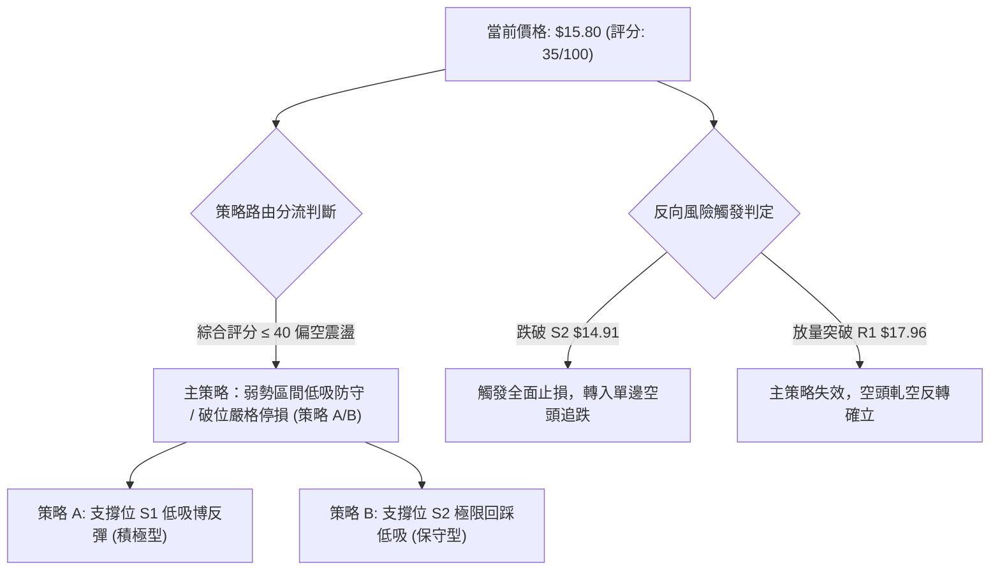

### 🧭 策略路由（依評分卡分流）

> **當前主策略方向 = 【偏弱區間操作，嚴控止損之區間下軌低吸】（依綜合評分 35/100）**
> 
> *依據規範：綜合評分 35/100 處於偏空震盪界限（≤40），主策略絕不盲目追多，亦因 ADX=16.44 處於超賣邊界而不適宜在此追空。因此以「防守型區間下緣低吸、破位即斬」為主軸，並將跌破核心低點視為全面轉空的風險對沖訊號。*

### 🎯 價格情境階梯（Price Scenarios）

價位嚴格引用系統已計算之關鍵價位數值：

| 觸發條件 | 下一目標 | 後續延伸 | 情境技術含義 |
|:---|:---:|:---:|:---|
| **強勢突破 R1 $17.96** | **R2 $18.79** | **R3 $19.62** | 站上日線布林上軌與週線頸線，扭轉空頭均線排列，轉為強烈多頭 |
| **突破 MA20 站穩 $16.36** | **R1 $17.96** | **R2 $18.79** | 短線走出布林中軌壓制，展開向箱體上軌運行的超賣修復行情 |
| **維持於現價 $15.80 震盪** | **MA20 $16.36** | **S1 $15.58** | 典型的量縮沉澱，維持窄幅橫盤，等待方向選擇 |
| **跌破支撐 S1 $15.58** | **S2 $14.91** | **52W底 $14.88**| 短期均線再度失守，下探測試年度終極支撐防線 |
| **跌破強支撐 S2 $14.91** | **$12.00 (分析師下限)**| — | 宣告一年大底徹底破位，主跌浪重啟，所有多頭倉位必須無條件離場 |

### 📊 情境機率分佈

| 情境劇本 | 機率 | 主要指標依據與量化論據 |
|:---|:---:|:---|
| **區間震盪築底 (情境 1)** | **55%** | ADX 僅 16.44 無趨勢；成交量大幅萎縮至 0.62x；布林通道下軌平行走平收斂 |
| **反彈修復上行 (情境 2)** | **30%** | RSI 達 30.30 臨界超賣；MACD 柱狀圖顯著收縮至 -0.025；週線出現底背離雛形 |
| **破底向下殺跌 (情境 3)** | **15%** | 均線系統全面空頭排列；-DI 仍高於 +DI；但受制於下檔 52W 底防禦，機率偏低 |

### 🟢 主策略詳情（區間防守與反彈捕捉）

嚴格依據波段聚類計算數值配置：

| 策略要素 | 策略 A（積極型：S1 支撐低吸） | 策略 B（保守型：S2 終極底低吸） |
|:---|:---:|:---:|
| **交易邏輯** | 押注 S1 近期波段低點支撐生效，博弈 MACD 低檔金叉回抽中軌 | 待股價慣性下探 52W 低點聚類區，建立高盈虧比底倉 |
| **進場條件** | 盤中回踩 S1 守穩，日線收出帶下影紅 K | 觸及 S2 區間且 RSI 觸及 30 以下反彈 |
| **進場價格** | **$15.60**（貼近 S1 $15.58） | **$14.95**（貼近 S2 $14.91） |
| **目標價 T1** | **$16.36**（布林中軌 / MA20） | **$16.36**（布林中軌 / MA20） |
| **目標價 T2** | **$17.96**（波段阻力 R1） | **$17.96**（波段阻力 R1） |
| **止損價格** | **$15.05**（跌破布林下軌 $15.10） | **$14.65**（跌破 52W 低點 $14.88 及 0.5ATR） |
| **風險空間** | $\$15.60 - \$15.05 = \$0.55$ | $\$14.95 - \$14.65 = \$0.30$ |
| **報酬空間 (至T1)** | $\$16.36 - \$15.60 = \$0.76$ | $\$16.36 - \$14.95 = \$1.41$ |
| **報酬空間 (至T2)** | $\$17.96 - \$15.60 = \$2.36$ | $\$17.96 - \$14.95 = \$3.01$ |
| **風險報酬比 (T1)** | **1 : 1.38** | **1 : 4.70** |
| **風險報酬比 (T2)** | **1 : 4.29** | **1 : 10.03** |
| **策略成功機率** | **50%** | **65%** |
| **建議配置倉位** | **10%**（輕倉試探） | **15%**（標準波段底倉） |

### 🔴 反向風險觸發點（對沖提示）

- **全面停損與轉空觸發點**：若日線收盤價**實體跌破 S2 $14.91（或跌穿 52W 低點 $14.88）**，表明長達一年的底部結構徹底解體。此時主策略全部多頭倉位必須立即全數離場，反手可考慮建立空頭對沖倉位，目標直指分析師預估下限 **$12.00**。
- **軋空多頭確認點**：若價格放量突破 **R1 $17.96** 且量能放大至 20 日均量以上（>47M），空頭結構瓦解，應解除任何防禦性偏空思維，全面順勢做多，目標上移至 **R2 $18.79** 及 **R3 $19.62**。

### ⭐ 整體訊號強度評星

```
╔══════════════════════════════════════════════════════════════════╗
║ 做多訊號強度：★★☆☆☆  (2.0/5星) — 僅具備超賣修復，無右側突破確認 ║
║ 做空訊號強度：★★☆☆☆  (2.5/5星) — 空間受制歷史大底，勝率報酬比低 ║
║ 整體技術可信度：★★★★☆ (4.0/5星) — 價位聚類與斐波那契吻合度極高 ║
╚══════════════════════════════════════════════════════════════════╝
```

---

## 9. 風險提示與監控

### ✅ 關鍵監控指標 Checklist

```
╔══════════════════════════════════════════════════════════════════╗
║               SOFI 盤中與收盤技術監控 CHECKLIST                  ║
╠══════════════════════════════════════════════════════════════════╣
║ [ ] 價位維度：收盤價是否守穩 S1 $15.58？跌破則預警測試 S2       ║
║ [ ] 價位維度：是否強勢站上 MA20 $16.36？站上則確認短線底部成立   ║
║ [ ] 動能維度：MACD 柱狀圖是否由 -0.025 翻正？翻正確認金叉買訊   ║
║ [ ] 動能維度：日線 RSI(14) 能否自 30.30 脫離並越過 40 中性軸？   ║
║ [ ] 量能維度：日成交量是否回升突破 47.25M (20日均量線)？        ║
║ [ ] 波動維度：ADX(14) 是否向上突破 20-25？突破即代表新趨勢爆發 ║
║ [ ] 通道維度：布林帶帶寬是否向外擴張？防範沿下軌向下開口風險     ║
╚══════════════════════════════════════════════════════════════════╝
```

### ⚠️ 風險場景分析

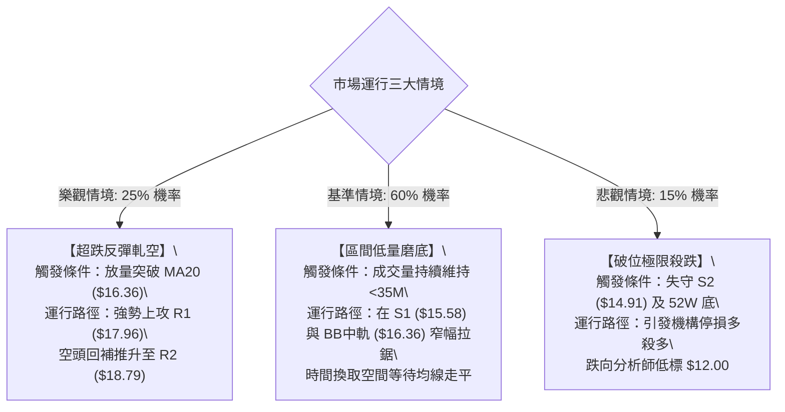

### 🛡️ 風險管理重要提醒

1. **高 Beta 波動風險控制**：
   - SOFI 的 Beta 值高達 **2.332**，其波動劇烈度為大盤的兩倍以上。任何進場部位嚴格限制在總投資組合的 **5% - 10%** 以內，嚴禁單一標的過度集中。
2. **無趨勢環境下的交易戒律**：
   - ADX 讀數僅為 **16.44**，此時順勢突破系統大多會產生「假突破」與「假跌破」雙巴訊號。在此階段務必恪守「**支撐買、阻力賣**」原則，不可在價格突破壓力時追價。
3. **軋空與空頭擠壓（Short Squeeze）雙刃劍**：
   - 儘管 Short Float 達 14.8%，具有潛在軋空動能，但在缺乏實質利多刺激與成交量放大配合前，高做空比例往往意味著市場機構對基本面與信貸質量存在分歧，切勿僅憑高 Short Float 作為唯一做多理由。
4. **硬性止損執行紀律**：
   - 本分析報告所設定之策略止損位（策略 A: $15.05、策略 B: $14.65）均為客觀技術結構被破壞之分界點，一旦觸及必須無條件執行停損，絕不可將短線交易演變為被動長期套牢。

---

## 📋 報告總結

```
╔════════════════════════════════════════════════════════════════════════════╗
║                         SOFI 技術分析報告總結                              ║
╠════════════════════════════════════════════════════════════════════════════╣
║ 報告日期：2026-10-10                                                       ║
║ 當前價格：$15.80                                                           ║
║ 分析評級：⚖️ 偏弱區間盤整 (Neutral-to-Bearish Range-bound)                  ║
║                                                                            ║
║ 關鍵結論：                                                                 ║
║ ├─ 長期趨勢：🔴 空頭主導 (自 $29.72 深度回撤 46.8%，處於 78.6% 回調位下方)  ║
║ ├─ 中期趨勢：🟡 箱體磨底 (在 $14.91 至 $17.96 區間維持 8 個月箱體拉鋸)     ║
║ ├─ 短期趨勢：🟡 超賣防守 (受制於 MA20 $16.36，但獲 S1 $15.58 支撐)         ║
║ ├─ 關鍵支撐：S1: $15.58 / S2: $14.91 (52週最低點 $14.88 核心堡壘)          ║
║ ├─ 關鍵阻力：R1: $17.96 / R2: $18.79 (長期均線 MA200 $18.67 重合區)        ║
║ └─ 分析師目標：均價 $20.33 (當前折價 28.7%) / 區間 $12.00 - $30.00         ║
║                                                                            ║
║ 最優策略組合：                                                             ║
║ 1. 🥇 最佳機會：策略 B — 於 S2 $14.95 附近極限低吸，止損 $14.65 (風報比 1:4.7)║
║ 2. 🥈 次選機會：策略 A — 現價回踩 S1 $15.60 輕倉試探，博弈金叉 (風報比 1:1.4) ║
║ 3. 🥉 保守選擇：完全空倉觀望，靜待日線放量收復 MA20 ($16.36) 右側訊號出現   ║
╚════════════════════════════════════════════════════════════════════════════╝
```

---

> ⚠️ **免責聲明**：本報告為 AI 自動生成之技術分析，所有數據及估算均基於提供的歷史價格資訊。本報告**僅供研究與學術參考**，**不構成任何投資建議**。投資有風險，入市需謹慎。

---

*報告生成時間：2026-10-10 ｜ 數據來源：Yahoo Finance ｜ 分析框架：多時框技術分析*