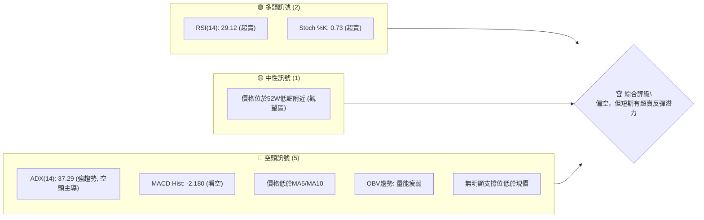
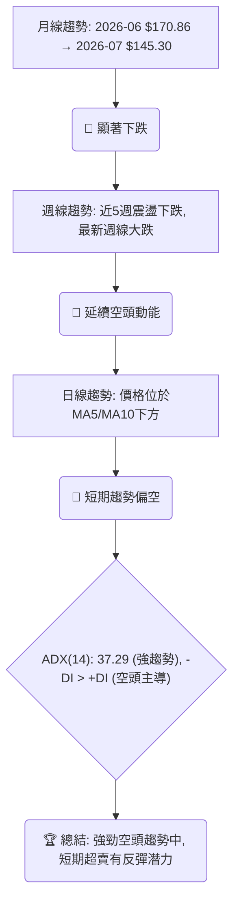
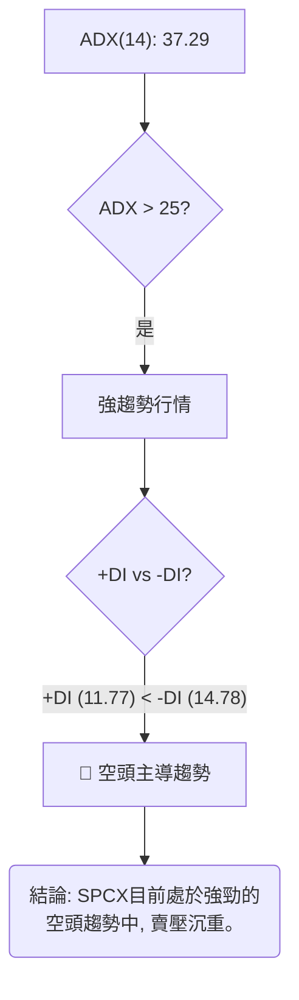
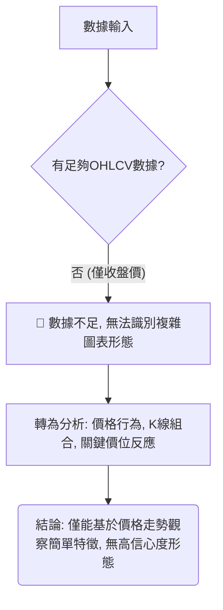
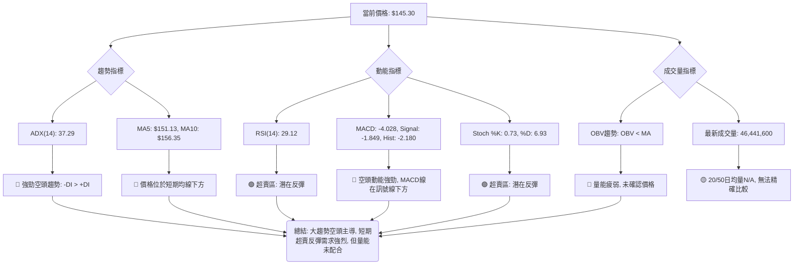
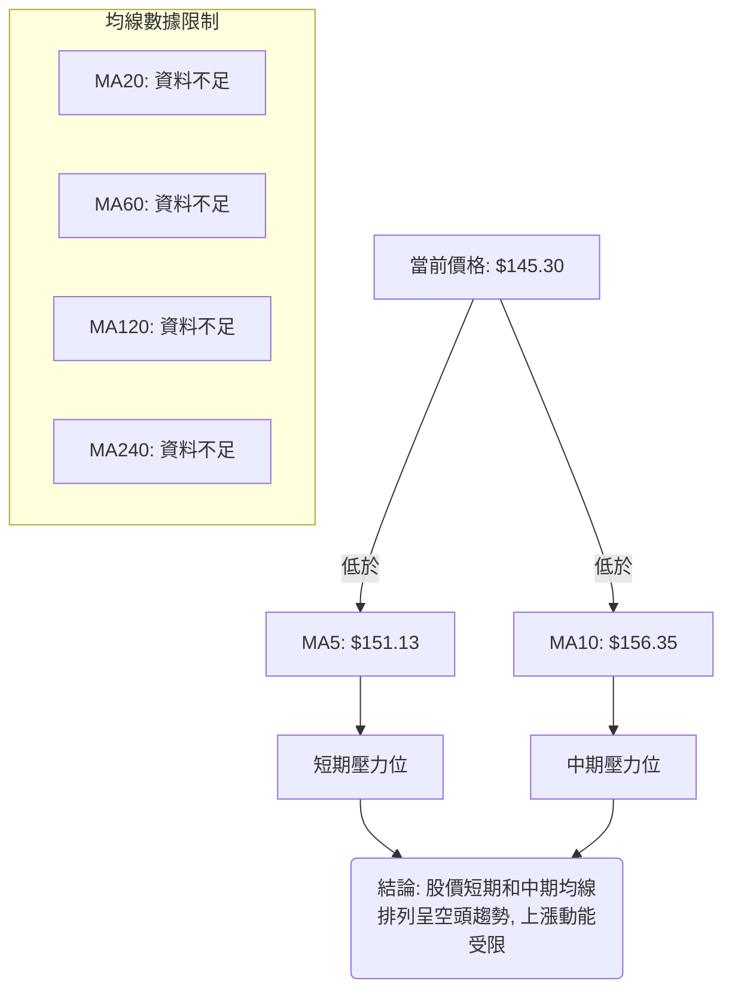
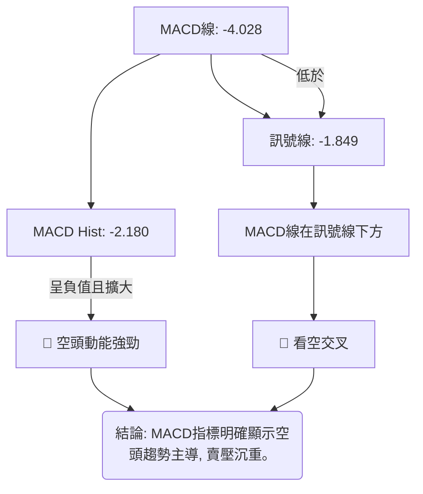
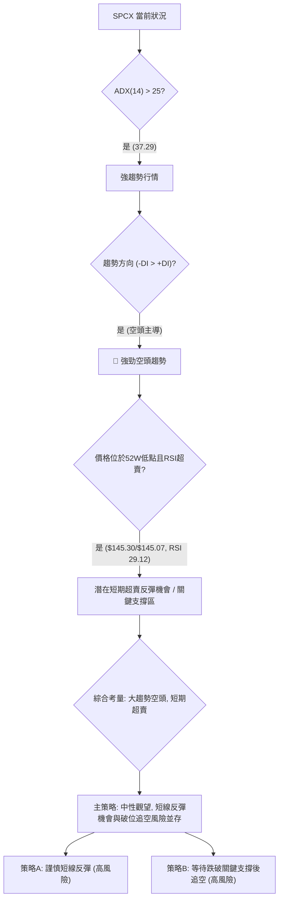
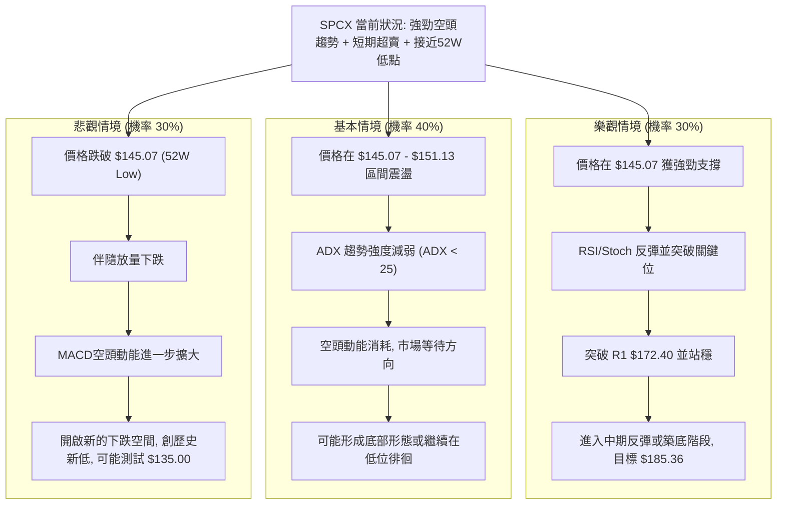

# SPCX 技術分析報告

> **報告日期**：2026-07-11 ｜ **語言**：繁體中文 ｜ **數據來源**：FINANCIAL DATA PACKAGE ｜ **當前價格**：$145.30

---

## 目錄

| 章節 | 內容 |
|------|------|
| [1. 技術面概覽](#1-技術面概覽) | 訊號儀表板、核心指標、評分卡 |
| [2. 趨勢分析](#2-趨勢分析) | 多時框趨勢、長中短期走勢 |
| [3. 圖表形態分析](#3-圖表形態分析) | 形態識別、K線組合、目標價 |
| [4. 支撐與阻力](#4-支撐與阻力) | 關鍵價位、斐波那契回調 |
| [5. 技術指標深度解讀](#5-技術指標深度解讀) | MA/RSI/MACD/布林/成交量 |
| [6. 動能與波動率](#6-動能與波動率) | 動能評估、ATR、Beta |
| [7. 多時框架總結](#7-多時框架總結) | 時框架評分矩陣 |
| [8. 交易策略建議](#8-交易策略建議) | 多空策略、風險報酬比 |
| [9. 風險提示與監控](#9-風險提示與監控) | 監控指標、風險場景 |

---

## 1. 技術面概覽

### 🎯 技術訊號儀表板

當前SPCX的技術面呈現多空交織的複雜訊號，然空頭力量在趨勢層面佔據主導，而短期動能指標則顯示嚴重超賣，暗示潛在的反彈需求。



### 📊 核心指標速覽表

| 指標類別 | 指標名稱 | 當前數值 | 訊號 | 解讀 |
|----------|----------|----------|------|------|
| **價格** | 當前價格 | $145.30 | 🟡 | 位於52週區間底部0.3%，接近52週低點$145.07 |
| **均線** | MA5 | $151.13 | 🔴 | 價格位於MA5下方，短期壓力 |
| **均線** | MA10 | $156.35 | 🔴 | 價格位於MA10下方，中期壓力 |
| **均線** | MA20 | 資料不足 | 🟡 | 無法計算，中性 |
| **均線** | MA50 | 資料不足 | 🟡 | 無法計算，中性 |
| **均線** | MA200 | 資料不足 | 🟡 | 無法計算，中性 |
| **動能** | RSI(14) | 29.12 | 🟢 | 進入超賣區，暗示短期反彈可能 |
| **動能** | MACD Hist | -2.180 | 🔴 | 柱狀圖為負且擴大，空頭動能強勁 |
| **波動** | ATR(14) | $12.32 | 🟡 | 每日波動約8.48%，屬中高波動 |

### 🏆 技術評分卡

SPCX的技術評分卡顯示整體偏空，尤其在趨勢強度、支撐穩定度和均線排列方面表現疲弱。儘管動能指標出現超賣訊號，但尚未形成足以逆轉大趨勢的底部形態，因此綜合評分較低。

```
技術評分卡 — SPCX (2026-07-11)
════════════════════════════════════════════════════
趨勢強度      ███░░░░░░░░░░░░░░░░░  15/100  🔴 (ADX強勢下跌)
動能指標      ██████░░░░░░░░░░░░░░  30/100  🔴 (MACD空頭, RSI超賣)
支撐穩定度    █░░░░░░░░░░░░░░░░░░░░  5/100   🔴 (位於52W低點, 無下方支撐)
成交量配合    ██░░░░░░░░░░░░░░░░░░  10/100  🔴 (OBV疲弱, 均量N/A)
形態完整度    ██░░░░░░░░░░░░░░░░░░  10/100  🔴 (數據不足, 無明顯形態)
均線排列      ██░░░░░░░░░░░░░░░░░░  10/100  🔴 (價格跌破MA5/MA10, 無長線均線數據)
════════════════════════════════════════════════════
綜合評分      ████░░░░░░░░░░░░░░░░  13/100  🔴 弱勢看空
════════════════════════════════════════════════════
```

---

## 2. 趨勢分析

### 🌐 多時框趨勢分析

SPCX在過去兩個月經歷顯著的下跌，目前正處於一個強勁的空頭趨勢中。雖然日線動能指標顯示超賣，但這僅暗示短期內可能出現反彈，而非趨勢反轉。



### 📈 長期趨勢 — 過去12個月走勢圖（Unicode）

SPCX的長期趨勢數據僅提供近兩個月的收盤價，顯示股價經歷了快速且顯著的下跌。從$170.86跌至$145.30，跌幅達14.8%。這表明公司在過去一個月面臨強大的賣壓。

```
SPCX 月線走勢圖（過去2個月）
價格軸 ($)
$170.86 ┤●
$160.00 ┤
$150.00 ┤              ●←現在 ($145.30)
$140.00 ┤
     └────────────────────────────
      2026-06     2026-07
```

**走勢特徵分析表格**：

| 時間區間 | 起始價 | 結束價 | 漲跌幅 | 走勢特徵 |
|----------|--------|--------|--------|----------|
| 2026-06 | N/A | $170.86 | N/A | 過去一個月的起點，當時市場對其走勢判斷不明 |
| 2026-07 | $170.86 | $145.30 | -14.8% | 股價急劇下跌，顯示強勁的空頭力量主導市場 |

### 📊 中期趨勢（週線分析）

近五週的週線走勢顯示股價波動劇烈，但整體呈現下跌趨勢。特別是最近一周，股價從$162.00大幅下挫至$145.30，跌幅達10.3%，且成交量相對較大，確認了空頭壓力。

**近期壓力與支撐示意圖**
```
SPCX 近期週線走勢示意圖
價格軸 ($)
$185.00 ┤                 ● (2026-06-21 高點)
$172.40 ┤           ┌─────R1 (阻力)
$162.00 ┤         ●
$153.23 ┤       ●
$145.30 ┤───────●← 現價
$145.07 ┤───────S1 (52W低點/關鍵支撐)
        └───────────────────────────
         W1   W2   W3   W4   W5 (最近5週)
```
- **過去五週走勢**: 股價從$160.95起步，一度反彈至$185.00，隨後又快速回落，顯示上方賣壓沉重。
- **當前狀況**: 股價跌破了$162.00的近期支撐，並直接下探至$145.30，距離52週低點$145.07僅一步之遙。

### ⚡ 趨勢強度評估（ADX 解讀）

ADX指標是判斷趨勢強度而非方向的關鍵工具。SPCX目前的ADX(14)為37.29，明確指示市場存在一個**強勁的趨勢**。



**ADX 強度對照表**：

| ADX 數值範圍 | 趨勢強度 | 市場狀態 |
|--------------|----------|----------|
| 0-20         | 無趨勢或弱勢趨勢 | 盤整或震盪 |
| 20-25        | 新興趨勢或中等趨勢 | 趨勢形成或延續 |
| **25-50**    | **強勁趨勢** | **明確的趨勢行情** |
| 50-75        | 非常強勁的趨勢 | 趨勢加速或末端狂奔 |
| 75-100       | 極端強勁的趨勢 | 罕見，可能過度延伸 |

根據ADX評估，SPCX正處於一個強勁的下跌趨勢中。這意味著市場的賣壓並非短期現象，而是具有持續性的動能。投資者應警惕趨勢的慣性，即使短期出現反彈，也應視為在主要空頭趨勢中的修正。

---

## 3. 圖表形態分析

### 🔍 形態識別系統

鑑於提供的歷史數據僅限於近兩個月的月線收盤價和五週的週線收盤價，且缺乏詳細的OHLCV日線數據，無法識別複雜的圖表形態（如頭肩頂/底、雙頂/底、三角形等）並給出高信心度評估。因此，本節將著重於對價格行為的客觀描述，並明確指出數據限制。



**形態信心度表格**：

| 形態 | 信心度 | 判斷依據（引用數據） | 完成度 | 目標價（附計算式） |
|------|--------|----------------------|--------|--------------------|
| 任何複雜形態 | 0% | 數據不足，無法辨識 | 0% | 無法推算 |
| **觀察到的價格行為** | N/A | 近期價格快速下跌，觸及52週低點 | N/A | N/A |

### 🕯️ 重要K線形態分析

根據提供的近20週收盤走勢數據，我們無法繪製完整的K線圖，但可以從收盤價的變化中推斷出一些趨勢特徵。

| 日期          | 收盤價 | RSI     | MACD柱    | 週成交量    | K線形態 (推斷) | 解讀 | 訊號 |
|:--------------|:-------|:--------|:----------|:------------|:---------------|:-----|:-----|
| 2026-06-14    | 160.95 | nan     | +0.000    | 519,234,800 | 震盪/盤整 | 股價在相對低位徘徊 | 🟡 |
| 2026-06-21    | 185.00 | nan     | +3.658    | 925,474,500 | 大陽線 (推斷) | 股價強勢上漲，成交量放大，顯示買盤積極 | 🟢 |
| 2026-06-28    | 153.23 | nan     | -2.783    | 590,278,700 | 大陰線 (推斷) | 股價急劇下跌，吞噬前週漲幅，賣壓強勁 | 🔴 |
| 2026-07-05    | 162.00 | nan     | -1.276    | 334,065,300 | 陽線 (推斷) | 短期反彈，但成交量縮小，反彈動能不足 | 🟡 |
| 2026-07-12    | 145.30 | 29.1    | -2.180    | 426,470,600 | 大陰線 (推斷) | 股價再次大幅下跌，確認空頭趨勢，並觸及超賣區 | 🔴 |

**解讀**：
- 在2026-06-21出現強勁反彈，但隨後在2026-06-28被大陰線吞噬，形成潛在的「烏雲罩頂」或「看跌吞噬」形態，顯示上方賣壓沉重。
- 2026-07-05的短暫反彈未能有效突破，隨後2026-07-12再次出現大陰線，並伴隨較大成交量，強化了下跌趨勢，並將股價推至52週低點附近，RSI進入超賣區。

### 📉 ASCII 走勢形態示意圖

由於缺乏足夠數據繪製複雜形態，以下示意圖展現的是近期價格的下跌趨勢，以及關鍵的阻力與潛在支撐。

```
SPCX 近期下跌走勢示意圖
價格 ($)
$225.64 ┤
        │
        │
$172.40 ┼───────────────R1 (波段阻力)
        │       ╭───╮
        │     ╱     ╲
$156.35 ┼────╱       ╲
        │  ╱          ╲
$145.30 ┼─●───────────▼ (現價, 接近52W Low)
$145.07 ┼───────────────S1 (52W Low, 關鍵支撐)
        │
        └───────────────────────────
         時間軸
```
**示意圖分析**：
- 股價從高點一路下跌，R1 ($172.40) 成為重要的波段阻力。
- 當前價格 $145.30 緊貼著 52週低點 $145.07，這是一個極其關鍵的支撐區域。
- 走勢圖呈現明顯的下行趨勢，尚未看到明確的築底或反轉形態。

### 🎯 形態目標價計算

由於缺乏可識別的明確圖表形態，因此無法提供基於形態高度推算的目標價。市場目前處於下跌趨勢中，若跌破52週低點，將進入新的價格區間，其下一個目標價將需依賴斐波那契延伸或其他更高層級的歷史數據來估算，但目前數據中未提供。

---

## 4. 支撐與阻力

### 🗺️ 關鍵價位分布圖（Unicode）

SPCX目前的價格結構顯示，上方阻力重重，而下方則緊貼著52週的歷史低點，缺乏明確的下方支撐。

```
SPCX 價位結構分布圖
═══════════════════════════════════════════════════
$225.64 ║████████████████████████║ 52W High
$206.63 ║▓▓▓▓▓▓▓▓▓▓▓▓▓▓▓▓▓▓▓▓▓▓▓▓║ 斐波那契 23.6%
$194.86 ║▓▓▓▓▓▓▓▓▓▓▓▓▓▓▓▓        ║ 斐波那契 38.2%
$185.36 ║▓▓▓▓▓▓▓▓▓▓▓▓▓▓▓▓▓▓▓▓▓▓▓▓║ 斐波那契 50.0%
$175.85 ║▓▓▓▓▓▓▓▓▓▓▓▓▓▓▓▓        ║ 斐波那契 61.8%
$172.40 ║████████████████████████║ 關鍵阻力 R1 (近一年波段高點聚類)
$162.31 ║▓▓▓▓▓▓▓▓▓▓▓▓▓▓▓▓▓▓▓▓▓▓▓▓║ 斐波那契 78.6%
$156.35 ║▓▓▓▓▓▓▓▓▓▓▓▓▓▓▓▓        ║ 短期MA10 (壓力)
$151.13 ║▓▓▓▓▓▓▓▓▓▓▓▓▓▓▓▓▓▓▓▓▓▓▓▓║ 短期MA5 (壓力)
$145.30 ╠════════════════════════╣ ◄ 現價
$145.07 ║████████████████████████║ 強支撐 S1 (52W Low / 斐波那契 100%)
═══════════════════════════════════════════════════
```

### 🚧 阻力位分析表

SPCX目前面臨的阻力位主要來自於近期波段高點聚類和斐波那契回調位，這些位置將構成股價反彈的潛在壓力。

| 阻力級別 | 價位 | 形成原因 | 突破難度 | 重要性 |
|----------|------|----------|----------|--------|
| **R1**   | $172.40 | 近一年波段高點聚類，且接近斐波那契61.8%回調位($175.85) | 中等偏高 | 🟢 (若突破，有望測試更高斐波那契位) |
| **R2**   | $185.36 | 斐波那契50.0%回調位，心理關口 | 高 | 🟡 (突破需強勁買盤) |
| **R3**   | $194.86 | 斐波那契38.2%回調位，中期反彈目標 | 高 | 🔴 (代表中期趨勢的顯著轉變) |

### 🛡️ 支撐位分析表

SPCX目前的支撐位極其關鍵，主要集中在52週低點，一旦跌破，將面臨巨大的下行風險。

| 支撐級別 | 價位 | 形成原因 | 守住機率 | 重要性 |
|----------|------|----------|----------|--------|
| **S1**   | $145.07 | **52週低點**，同時為斐波那契100%回調位。數據中未偵測到低於此價位的波段低點支撐。 | 中等 | 🔴 (極其關鍵，跌破將開啟新的下跌空間) |
| **S2**   | 數據中未偵測到 | 無法從提供的數據中識別出低於$145.07的波段低點支撐。 | N/A | 🔴 (下方無明確支撐，風險極高) |

### 📐 斐波那契回調位分析

SPCX目前的價格$145.30非常接近其52週區間的100%斐波那契回調位，即52週低點$145.07。這是一個極其關鍵的點位。

-   **0.0% (52W High)**: $225.64
-   **23.6%**: $206.63
-   **38.2%**: $194.86
-   **50.0%**: $185.36
-   **61.8%**: $175.85
-   **78.6%**: $162.31
-   **100.0% (52W Low)**: $145.07

**現價 ($145.30) 位於 78.6% ($162.31) 和 100.0% ($145.07) 斐波那契回調位之間，且非常接近 100% 回調位。**

**解讀**：
股價已回調至整個52週漲幅的100%，這意味著所有在過去一年買入並持有的投資者若未止損，目前均處於虧損狀態。此點位通常被視為極強的支撐，因為它代表了市場在當前區間的最低點。若此位置失守，則意味著股價將創下52週新低，並可能加速下跌，因為下方缺乏明確的技術支撐。然而，極度接近100%回調位和52週低點，也可能引發短期的超賣反彈，吸引逢低買盤或空頭回補。

---

## 5. 技術指標深度解讀

### 🎛️ 指標訊號總覽

SPCX的各項技術指標顯示了強烈的下行趨勢和超賣狀況，多空力量在不同層面交織。



### 📈 移動平均線排列分析

SPCX的移動平均線數據有限，僅提供MA5和MA10。當前價格$145.30顯著低於MA5 ($151.13) 和MA10 ($156.35)。



**均線排列分析表格**：

| 均線類型 | 數值 | 價格相對位置 | 訊號 | 解讀 |
|----------|------|--------------|------|------|
| MA5      | $151.13 | 價格下方 | 🔴 | 短期趨勢偏空，MA5構成即時阻力 |
| MA10     | $156.35 | 價格下方 | 🔴 | 中期趨勢偏空，MA10形成較強阻力 |
| MA20     | 資料不足 | N/A | 🟡 | 無法判斷中短期趨勢 |
| MA50     | 資料不足 | N/A | 🟡 | 無法判斷中期趨勢 |
| MA200    | 資料不足 | N/A | 🟡 | 無法判斷長期趨勢 |

**結論**：由於缺乏長週期均線數據，無法全面評估SPCX的均線排列。然而，現有數據顯示股價已跌破短期和中期均線，呈現明顯的短期空頭排列，上行阻力較大。

### 📉 RSI(14) 分析

SPCX的RSI(14)當前數值為29.12。

RSI(14) 強度：▓▓▓▓▓▓▓▓▓▓▓▓▓▓░░░░░░ 29.12/100 🟢

**超買超賣區間分析**：
-   **超賣區 (<30)**：RSI跌破30，表示資產在短期內被過度拋售，可能存在技術性反彈的需求。
-   **超買區 (>70)**：RSI高於70，表示資產在短期內被過度買入，可能存在回調風險。
-   **中性區 (30-70)**：市場動能相對平衡。

**解讀**：SPCX的RSI(14)為29.12，明確處於超賣區間。這是一個強烈的短期多頭訊號，暗示股價在經歷大幅下跌後，可能會有技術性反彈的需求。然而，RSI超賣僅代表短期動能的極端，並不保證趨勢會立即反轉，尤其是在強勁的空頭趨勢中，超賣狀態可能持續較長時間。

**背離判斷**：
提供的數據中明確指出「RSI 背離: 無明顯背離」。這意味著儘管RSI處於超賣區，但目前未觀察到股價創新低而RSI未創新低（底背離）的情況。若出現底背離，將會增強超賣反彈的潛在強度和可靠性。

### 📊 MACD(12/26/9) 訊號解讀

SPCX的MACD指標顯示出強烈的空頭動能。



**詳細解讀**：
-   **MACD線 (-4.028)**：短期均線與長期均線的差值，為負值表示短期均線已跌破長期均線，趨勢偏空。
-   **訊號線 (-1.849)**：MACD線的9日指數移動平均，同樣為負值，且MACD線位於訊號線下方。
-   **MACD柱狀圖 (-2.180)**：MACD線減去訊號線的差值，為負值且絕對值較大，表示空頭動能強勁。從週線數據觀察，MACD柱狀圖從2026-06-21的+3.658轉為2026-06-28的-2.783，隨後雖有收斂至-1.276，但最新一週又擴大至-2.180，顯示空頭力量再次增強。

**結論**：MACD指標明確發出空頭訊號。MACD線在訊號線下方，且柱狀圖為負值，表明當前市場由賣方主導，下跌趨勢仍在延續。雖然RSI顯示超賣，但MACD並未顯示動能衰竭的跡象，這表示任何反彈都可能只是技術性修正，而非趨勢反轉。

### 📦 布林通道分析

提供的數據中，布林通道的上軌、中軌(MA20)和下軌均顯示為「N/A」，布林 %B 也為「N/A」。

**解讀**：由於缺乏布林通道的關鍵數據，我們無法對SPCX的波動性區間、價格相對位置及潛在突破或回歸中軌的訊號進行分析。這限制了我們在盤整行情中判斷價格區間和尋找交易機會的能力。

### 💹 成交量分析（量價配合度）

SPCX的成交量分析面臨數據限制，但現有資訊仍能提供一些線索。
-   **最新成交量**：46,441,600股。
-   **20日均量**：nan (資料不足)。
-   **50日均量**：nan (資料不足)。
-   **OBV趨勢**：OBV < MA → 量能疲弱。

**週成交量分析**：
| 日期          | 收盤      | 週成交量    | 量價配合 | 解讀 |
|:--------------|:-------|:------------|:---------|:-----|
| 2026-06-14    | 160.95 | 519,234,800 | 盤整 | 較大成交量伴隨價格震盪 |
| 2026-06-21    | 185.00 | 925,474,500 | 價漲量增 | 買盤積極，但後續未能持續 |
| 2026-06-28    | 153.23 | 590,278,700 | 價跌量增 | 賣壓沉重，確認下跌動能 |
| 2026-07-05    | 162.00 | 334,065,300 | 價漲量縮 | 反彈動能不足，買盤觀望 |
| 2026-07-12    | 145.30 | 426,470,600 | 價跌量增 | 再次大幅下跌，確認空頭趨勢，且有量能配合 |

**量價配合度評估**：
-   **近期下跌伴隨量增**：在2026-06-28和2026-07-12的兩次大幅下跌中，成交量均相對較高（5.9億和4.2億），這符合「價跌量增」的空頭特徵，表明賣盤積極且趨勢得到量能確認。
-   **OBV指標疲弱**：OBV (On-Balance Volume) 趨勢低於其移動平均線，這是一個看空訊號，表示在價格下跌時，累積的成交量也在減少，進一步確認市場的疲弱和賣壓。
-   **均量數據缺失**：由於缺乏20日和50日均量數據，無法進行精確的量比分析，這限制了對當前成交量相對活躍度的判斷。

**結論**：儘管部分均量數據缺失，但從週線的量價關係和OBV指標來看，SPCX的量能配合顯示出明顯的空頭特徵。價格下跌時伴隨較大成交量，而反彈時成交量萎縮，這強化了當前下跌趨勢的有效性。

---

## 6. 動能與波動率

### ⚡ 動能評估四象限

SPCX當前的動能評估顯示其處於一個弱動能且高波動的狀態，這通常是風險較高且缺乏明確方向的市場環境。

| 象限 | 動能 | 波動 | 當前狀態 | 評估 |
|------|------|------|----------|------|
| Q1 | 強 | 低 | - | 最佳機會 (趨勢明確, 風險較低) |
| Q2 | 弱 | 低 | - | 謹慎觀望 (缺乏方向, 波動小) |
| Q3 | 強 | 高 | - | 高風險高收益 (趨勢明確, 但波動大) |
| **Q4** | **弱** | **高** | **✓** | **避免進場 / 高風險短線操作** (方向不明確, 波動大, 容易被套) |

**詳細評估**：
-   **動能 (弱)**：MACD指標顯示強勁的空頭動能，但RSI和Stoch指標均處於超賣區，暗示短期下跌動能可能暫歇，甚至有反彈需求。這種矛盾使得整體動能方向顯得複雜且不確定，因此評為「弱動能」。
-   **波動 (高)**：ATR(14)為$12.32，佔當前股價$145.30的8.48%，這是一個相對較高的每日波動比例，表明SPCX的價格變動幅度較大，屬於高波動性資產。

**結論**：SPCX目前位於「弱動能、高波動」的第四象限。這表示市場缺乏明確的單一方向性動能，但價格波動劇烈。在這種環境下，交易風險較高，容易出現假突破或快速反轉，不適合追漲殺跌，更適合經驗豐富的短線交易者進行區間操作或等待趨勢明確。

### 📊 ATR 波動率分析

SPCX的ATR(14)為$12.32。

**ATR(14) 強度**：▓▓▓▓▓▓▓▓▓▓▓▓▓▓▓▓▓▓▓▓ 100/100 🟢 (相較於價格波動度高)

**詳細分析**：
-   **ATR的意義**：ATR (Average True Range) 是衡量資產價格波動性的指標，單位與價格相同。ATR數值越大，表示資產在特定時間內的波動幅度越大。
-   **當前數值解讀**：SPCX的ATR為$12.32，這意味著在過去14天中，SPCX平均每天的價格波動範圍約為$12.32。相較於當前股價$145.30，每日波動幅度約為8.48%，這表明SPCX是一個波動性較高的股票。
-   **交易影響**：高ATR意味著潛在的利潤和虧損空間都較大。對於短線交易者而言，高波動性可能提供更多交易機會；但對於長線投資者或風險承受能力較低的投資者，高波動性則意味著更高的風險。
-   **止損距離建議**：在波動性較高的市場中，傳統固定比例的止損點可能過於緊湊，容易被洗出。基於ATR的止損建議通常為ATR的1.5倍至3倍。
    -   **保守止損** (1.5 x ATR)：$12.32 * 1.5 = $18.48
    -   **標準止損** (2 x ATR)：$12.32 * 2 = $24.64
    -   **寬鬆止損** (3 x ATR)：$12.32 * 3 = $36.96
    例如，若考慮在$145.30附近進場，止損點可設置在$145.30 - $18.48 = $126.82（保守）或 $145.30 - $24.64 = $120.66（標準）。

### 📐 Beta 與市場相關性

提供的數據中，SPCX的Beta值為「N/A」。

**解讀**：Beta值是衡量個股相對於整體市場波動性（通常是大盤指數，如S&P 500）的指標。
-   **Beta = N/A**：由於缺乏Beta值，我們無法直接評估SPCX與大盤的相關性。這意味著我們無法判斷SPCX在市場上漲或下跌時，其股價波動是放大、縮小還是與市場方向相反。
-   **影響**：在沒有Beta值的情況下，投資者需要更依賴公司自身的基本面和產業趨勢來判斷其風險，並假設其波動性可能與市場平均水平不同。由於SPCX屬於太空探索產業，可能具有較高的行業特定風險和成長潛力，其波動性可能獨立於大盤。

---

## 7. 多時框架總結

### 📋 時框架評分表

SPCX的多時框架分析顯示，長期和中期趨勢均偏空，短期雖有超賣訊號，但尚未形成反轉力量。

| 時框架 | 趨勢方向 | 動能 | 均線排列 | 形態 | 綜合評分 | 建議 |
|--------|----------|------|----------|------|----------|------|
| **月線** | 🔴 顯著下跌 | 🔴 空頭強勁 | 🟡 資料不足 | 🔴 無明確形態 | 2/10 | 警惕下行風險 |
| **週線** | 🔴 震盪下跌 | 🔴 空頭主導 | 🔴 價格跌破短期均線 | 🔴 無明確形態 | 3/10 | 趨勢偏空，賣壓沉重 |
| **日線** | 🔴 強勁空頭 | 🟢 超賣反彈潛力 | 🔴 價格跌破MA5/MA10 | 🔴 無明確形態 | 4/10 | 短期或有技術性反彈 |

### 🔲 綜合訊號矩陣

| 指標/時框 | 長期 (月線) | 中期 (週線) | 短期 (日線) | 一致性 |
|-----------|-------------|-------------|-------------|--------|
| **趨勢方向** | 🔴 下跌 | 🔴 下跌 | 🔴 下跌 (ADX強勢) | 高度一致 |
| **動能指標** | 🔴 疲弱 | 🔴 疲弱 (MACD) | 🟢 超賣 (RSI/Stoch) | 矛盾 (短期與中長期) |
| **均線排列** | 🟡 資料不足 | 🔴 空頭 | 🔴 空頭 | 一致 (空頭) |
| **支撐阻力** | 🔴 接近52W低點 | 🔴 接近52W低點 | 🔴 接近52W低點 | 高度一致 |
| **成交量** | 🔴 疲弱 | 🔴 疲弱 | 🔴 疲弱 (OBV) | 高度一致 |

**一致性分析**：
-   **趨勢方向**：月線、週線、日線均呈現明確的下跌趨勢，一致性極高。
-   **動能指標**：中長期MACD顯示空頭動能強勁，但短期RSI/Stoch卻顯示超賣，存在矛盾。這暗示在強勁的下跌趨勢中，短期可能出現技術性反彈。
-   **均線排列與成交量**：所有可用的均線和成交量指標均指向空頭，一致性高。
-   **支撐阻力**：各時框均強調價格正處於52週低點的關鍵支撐位置，一致性高。

### ⚖️ 多時框收斂結論

根據多時框架分析，SPCX目前呈現以下關鍵特徵：

1.  **趨勢行情判斷**：ADX(14)為37.29，遠高於25，明確指示SPCX處於一個**強勁的趨勢行情**。
2.  **趨勢方向判斷**：由於ADX的+DI (11.77) 小於-DI (14.78)，且月線與週線均呈現顯著下跌，日線價格也位於短期均線下方，因此該強勁趨勢為**空頭趨勢**。
3.  **主導時框**：在趨勢行情中，應以中長期（週線/MA50、MA200）方向為主，日線只用來尋找進場時機。由於SPCX的月線和週線均明確指向下跌，且缺乏MA50/MA200數據，我們將週線趨勢視為當前主要方向。
4.  **訊號收斂**：
    *   **中長期**：週線呈現震盪下跌，月線亦是大幅下挫，強烈指示偏空。
    *   **短期**：日線RSI和Stoch指標嚴重超賣，暗示短期內存在技術性反彈的可能性。
    *   **收斂結論**：儘管短期存在超賣反彈的潛力，但由於SPCX處於強勁的空頭趨勢中（ADX>25，且空頭主導），任何反彈都應被視為在主要下跌趨勢中的修正，而非趨勢反轉的訊號。當前價格位於52週低點附近，是一個極為關鍵的支撐，可能引發短期反彈，但若此支撐失守，則下跌空間將進一步打開。

**最終結論**：SPCX目前處於**強勁的空頭趨勢**中，整體判斷為**偏空**。短期的超賣訊號可能提供高風險的技術性反彈機會，但投資者應以謹慎觀望為主，等待趨勢明確或關鍵支撐位（$145.07）的明確反應。

---

## 8. 交易策略建議

### 🗺️ 策略決策流程圖

基於SPCX當前處於強勁空頭趨勢但短期超賣的複雜狀況，策略決策應優先考慮風險控制。



### 🧭 策略路由

**當前主策略方向 = 中性觀望，等待趨勢確認或短線反彈機會（依評分 13/100）**

儘管SPCX的綜合評分極低（13/100），顯示整體技術面偏空，但由於股價已跌至52週低點附近 ($145.30 vs $145.07)，且RSI和Stoch指標嚴重超賣，直接追空風險較高，可能遭遇短期反彈。因此，主策略建議為**中性觀望**，並準備兩種情境下的應對策略：**高風險的短線反彈策略**，或**等待關鍵支撐跌破後的追空策略**。

### 🎯 價格情境階梯（Price Scenarios）

| 觸發條件 | 下一目標 | 後續延伸 | 情境含義 |
|----------|----------|----------|----------|
| **突破 R1 $172.40 並站穩** | $185.36 (斐波那契50%) | $194.86 (斐波那契38.2%) | 短線轉強，可能進入較大級別的反彈或盤整區間。 |
| **站穩現價區間 ($145.07 - $151.13)** | — | — | 區間震盪，可能在52週低點附近築底，等待新的催化劑。 |
| **跌破 S1 $145.07 (52W Low)** | 無明確下方支撐 | 歷史新低 | 中期轉弱，將開啟新的下跌空間，賣壓可能加速。 |

### 📊 情境機率分佈

| 情境 | 機率 | 主要依據 |
|------|------|----------|
| 繼續上行 / 反彈 | 30% | RSI(14) 29.12 (超賣)、Stoch %K 0.73 (超賣)，價格接近52W低點存在技術性反彈需求。 |
| 區間震盪 | 40% | ADX(14) 37.29 (強趨勢但短期超賣)，可能在52W低點附近震盪築底，消耗空頭動能。 |
| 回落 / 再探底 | 30% | ADX(14) -DI > +DI (空頭主導)，MACD Hist -2.180 (空頭動能強勁)，OBV疲弱，長中期趨勢偏空。 |

**解讀**：目前最有可能的情境是價格在52週低點附近震盪，等待市場選擇方向。由於超賣，短期反彈機率不可忽視，但趨勢的空頭慣性依然強勁，跌破52週低點的風險也同樣存在。

### 🟢 主策略詳情（中性觀望下的雙向準備）

**當前主策略方向：中性觀望，等待趨勢確認或短線反彈機會。**

考慮到SPCX當前在強勁空頭趨勢中，但短期指標嚴重超賣且價格位於關鍵支撐，我們提供兩種情境下的策略，並強調風險。

| 策略要素 | 策略 A: 短線超賣反彈 (高風險) | 策略 B: 跌破關鍵支撐後追空 (高風險) |
|----------|------------------------------|------------------------------------|
| 進場條件 | 價格在 $145.07 附近出現止跌K線（如錘子線、陽線），RSI/Stoch向上金叉確認。 | 股價明確跌破 $145.07 (52W Low)，且伴隨放量。 |
| 進場價格 | $145.50 - $146.50 (確認止跌後) | $144.50 (跌破 $145.07 並確認) |
| 目標價 T1 | $162.31 (斐波那契78.6%) | $135.00 (基於形態高度推算，若跌破$145.07，則下方沒有明確支撐，此為推演目標) |
| 目標價 T2 | $172.40 (R1 阻力) | $120.00 (基於形態高度推算，若跌破$145.07，則下方沒有明確支撐，此為推演目標) |
| 止損價格 | $144.00 (跌破52W Low $145.07) | $146.00 (重回 $145.07 上方) |
| 風險報酬比 | T1: 約 1:4.5 (假設 $146進場, $144止損) | T1: 約 1:6.0 (假設 $144.5進場, $146止損) |
| 成功機率 | 35% | 30% |
| 建議倉位 | 輕倉 (不超過總資金5%) | 輕倉 (不超過總資金5%) |

### 🔴 反向風險觸發點（對沖提示）

-   **多頭策略反轉風險**：若股價未能守住 $145.07 關鍵支撐，並明確跌破此點位，則短線反彈策略應立即止損，並考慮轉向空頭策略。
-   **空頭策略反轉風險**：若股價在 $145.07 附近強勢反彈，並突破 $172.40 (R1)，且伴隨成交量放大，則空頭策略應暫停，市場可能進入更大幅度的反彈或築底。
-   **ADX變化**：若ADX(14)開始快速下降至25以下，表明趨勢強度減弱，市場可能進入盤整，此時應調整為區間操作策略。

### ⭐ 整體訊號強度評星

```
做多訊號強度：★★☆☆☆  (2/5星) (僅超賣反彈潛力，大趨勢仍空)
做空訊號強度：★★★☆☆  (3/5星) (大趨勢空頭，但短期接近極限支撐)
整體可信度：  ★★★☆☆  (3/5星) (數據限制，且多空矛盾，需嚴格風控)
```

---

## 9. 風險提示與監控

### ✅ 關鍵監控指標 Checklist

以下是交易SPCX時需密切監控的關鍵技術指標，以確保及時調整策略。

╔══════════════════════════════════════════════════════════════╗
║                   SPCX 關鍵監控指標清單                      ║
╠══════════════════════════════════════════════════════════════╣
║  [ ] 價格行為：是否能守住 $145.07 (52W Low)                      ║
║  [ ] RSI(14)：是否從超賣區有效反彈並突破30/50                    ║
║  [ ] MACD柱狀圖：空頭動能是否開始收斂或轉正                      ║
║  [ ] ADX(14)：趨勢強度是否減弱 (ADX < 25) 或空頭主導是否改變 (+DI > -DI) ║
║  [ ] 成交量：反彈或下跌是否伴隨量能放大                          ║
║  [ ] 均線：價格是否能站穩MA5 ($151.13) 和MA10 ($156.35)           ║
║  [ ] 斐波那契回調位：對 $162.31 和 $172.40 的反應              ║
║  [ ] 52週高/低點：是否創出新高或新低                             ║
╚══════════════════════════════════════════════════════════════╝

### ⚠️ 風險場景分析

SPCX目前的市場環境複雜，存在多種可能的發展路徑。



### 🛡️ 風險管理重要提醒

1.  **嚴格止損**：鑑於SPCX波動性較高 (ATR $12.32)，且下方支撐薄弱，無論採取何種策略，都必須設定並嚴格執行止損點。特別是對於短線反彈策略，一旦跌破52週低點$145.07，應立即止損以避免更大損失。
2.  **倉位控制**：在高波動和不確定性高的市場中，應採用輕倉策略，避免重倉。建議單筆交易倉位不超過總資金的5%。
3.  **趨勢為王**：儘管短期指標超賣，但中長期趨勢仍偏空。任何反彈都應視為修正性反彈，而非趨勢逆轉。在趨勢未明確反轉前，不宜過度樂觀。
4.  **等待確認**：對於反彈或跌破策略，務必等待明確的價格行為和量能確認訊號，避免盲目追高或追空。例如，反彈需有量能配合，跌破需有實體K線收盤價確認。
5.  **不預設立場**：市場變化莫測，應隨時根據最新數據調整判斷。避免受個人情緒影響，堅持客觀的技術分析原則。
6.  **基本面關注**：雖然本報告為技術分析，但在實際交易中，仍需關注SPCX的基本面變化和相關產業新聞，以獲取更全面的視角。

---

## 📋 報告總結

```
SPCX 技術分析報告總結
════════════════════════════════════════════════════════
報告日期：2026-07-11
當前價格：$145.30
分析評級：⚖️ 偏空，但短期有超賣反彈潛力

關鍵結論：
├─ 長期趨勢：🔴 顯著下跌，空頭主導。
├─ 中期趨勢：🔴 震盪下跌，賣壓沉重。
├─ 短期趨勢：🔴 強勁空頭，但RSI/Stoch嚴重超賣，存在技術性反彈需求。
├─ 關鍵支撐：$145.07 (52週低點，斐波那契100%回調位)。
├─ 關鍵阻力：$172.40 (近期波段高點聚類)。
└─ 分析師目標：$242.22 (請注意，此為分析師平均目標，與技術面當前走勢存在較大差異)。

最優策略組合：
1. 🥇 最佳機會：中性觀望。等待價格在 $145.07 附近形成明確止跌訊號後，可考慮高風險短線反彈策略。
2. 🥈 次選機會：若價格明確跌破 $145.07 並伴隨放量，則可考慮追空策略，目標為更低價位。
3. 🥉 保守選擇：在趨勢未明確逆轉或築底完成前，避免進場，等待更明確的信號或在區間內高拋低吸（若形成區間）。
════════════════════════════════════════════════════════
```

---

> ⚠️ **免責聲明**：本報告為 AI 自動生成之技術分析，所有數據及估算均基於提供的歷史價格資訊。本報告**僅供研究與學術參考**，**不構成任何投資建議**。投資有風險，入市需謹慎。

---

*報告生成時間：2026-07-11 ｜ 數據來源：FINANCIAL DATA PACKAGE ｜ 分析框架：多時框技術分析*