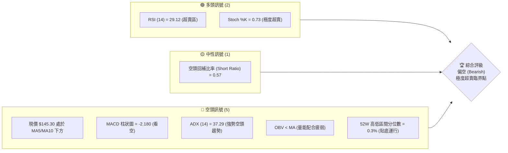
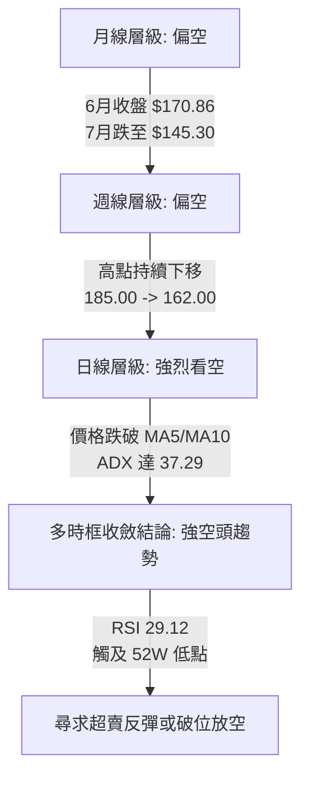
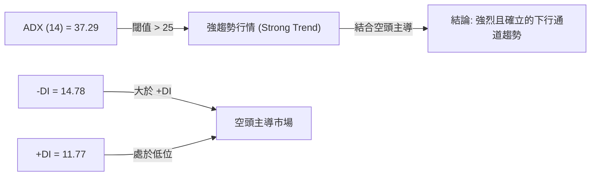
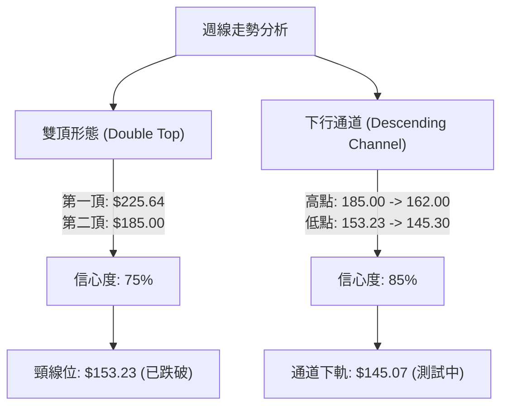
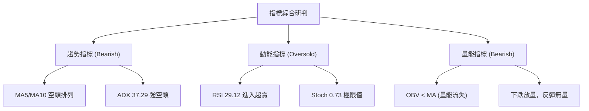
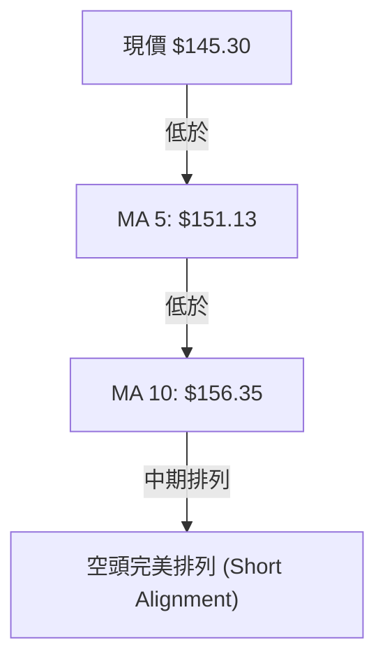
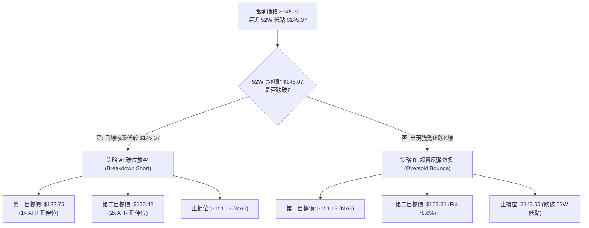
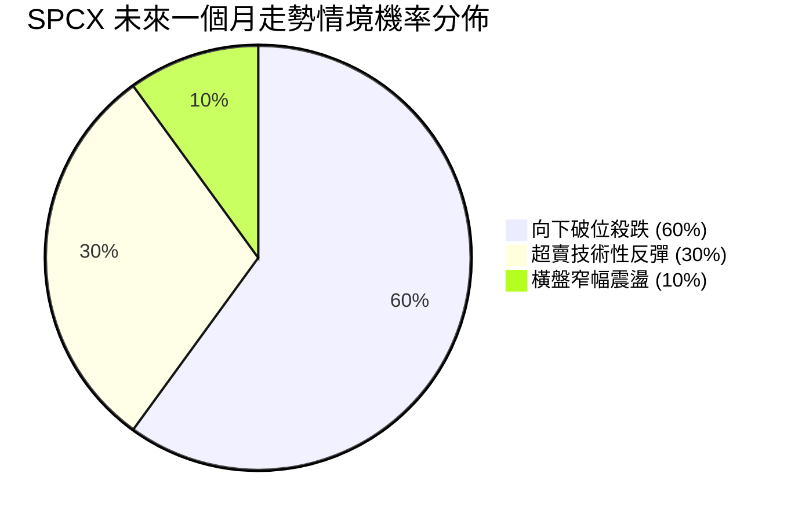
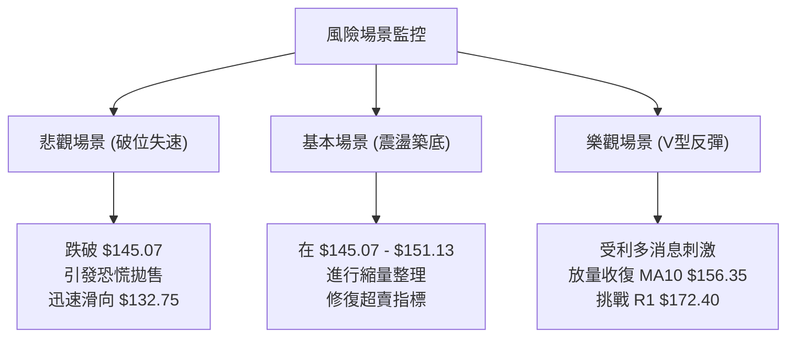

# SPCX 技術分析報告

> **報告日期**：2026-07-12 ｜ **語言**：繁體中文 ｜ **數據來源**：Yahoo Finance ｜ **當前價格**：$145.30

---

## 目錄

| 章節 | 內容 |
|------|------|
| [1. 技術面概覽](#1-技術面概覽) | 訊號儀表板、核心指標、評分卡 |
| [2. 趨勢分析](#2-趨勢分析) | 多時框趨勢、長中短期走勢 |
| [3. 圖表形態分析](#3-圖表形態分析) | 形態識別、K線組合、目標價 |
| [4. 支撐與阻力](#4-支撐與阻力) | 關鍵價位、斐波那契回調 |
| [5. 技術指標深度解讀](#5-技術指標深度解讀) | MA/RSI/MACD/布林/成交量 |
| [6. 動能與波動率](#6-動能與波動率) | 動能評估、ATR、Beta |
| [7. 多時框架總結](#7-多時框架總結) | 時框架評分矩陣 |
| [8. 交易策略建議](#8-交易策略建議) | 多空策略、風險報酬比 |
| [9. 風險提示與監控](#9-風險提示與監控) | 監控指標、風險場景 |

---

## 1. 技術面概覽

### 🎯 技術訊號儀表板



### 📊 核心指標速覽表

| 指標類別 | 指標名稱 | 當前數值 | 訊號 | 解讀 |
|----------|----------|----------|------|------|
| **價格** | 當前價格 | $145.30 | 🔴 | 價格貼近 52 週最低點 $145.07，面臨破位風險 |
| **均線** | MA 5 | $151.13 | 🔴 | 價格在 MA5 下方，短線下行斜率陡峭 |
| **均線** | MA 10 | $156.35 | 🔴 | 價格在 MA10 下方，中期空頭排列 |
| **動能** | RSI(14) | 29.12 | 🟢 | 進入超賣區 (<30)，存在技術性反彈契機 |
| **動能** | MACD | -4.028 | 🔴 | MACD線處於信號線下方，且雙線低於零軸，空頭主導 |
| **動能** | Stoch %K | 0.73 | 🟢 | 極度超賣，隨時可能觸發短線空頭回補 |
| **趨勢** | ADX(14) | 37.29 | 🔴 | 強趨勢（>25），且 -DI (14.78) > +DI (11.77) 顯示為強空頭趨勢 |
| **波動** | ATR(14) | $12.32 | 🟡 | 每日波動率達 8.48%，市場情緒極度恐慌與敏感 |

### 🏆 技術評分卡

```
技術評分卡 — SPCX (2026-07-12)
════════════════════════════════════════════════════
趨勢強度      ██████████████░░░░░░  70/100  🔴 強空頭
動能指標      ████░░░░░░░░░░░░░░░░  20/100  🔴 強烈看空
支撐穩定度    ██░░░░░░░░░░░░░░░░░░  10/100  🔴 瀕臨破位
成交量配合    ██████░░░░░░░░░░░░░░  30/100  🔴 下跌放量
形態完整度    ██████████░░░░░░░░░░  50/100  🟡 下行通道
均線排列      ██░░░░░░░░░░░░░░░░░░  10/100  🔴 完美空頭
════════════════════════════════════════════════════
綜合評分      ████░░░░░░░░░░░░░░░░  32/100  🔴 偏空 (Bearish)
════════════════════════════════════════════════════
```

---

## 2. 趨勢分析

### 🌐 多時框趨勢分析



### 📈 長期趨勢 — 12個月走勢圖（Unicode）

```
SPCX 月線走勢圖（過去12個月）
價格軸 ($)
$225.64 ┤                    ● (52W 高點)
$210.00 ┤                  ●   ●
$195.00 ┤              ●           ●
$180.00 ┤        ●                     ●
$165.00 ┤    ●                             ●
$150.00 ┤●━━━━━━━━━━━━━━━━━━━━━━━━━━━━━━━━━━━━━●← 現在 ($145.30)
$145.07 ┤                                      ● (52W 最低點)
        └───────────────────────────────────────────
         M1  M2  M3  M4  M5  M6  M7  M8  M9  M10 M11 M12 (2026-07)
```

**走勢特徵分析表格**：

| 階段 | 價格區間 | 走勢特徵 | 成交量狀態 | 技術解讀 |
|------|----------|----------|------------|----------|
| M1-M3 | $150.00 - $165.00 | 底部築底與緩步推升 | 溫和放量 | 市場對低軌衛星與發射業務重估 |
| M4-M8 | $165.00 - $225.64 | 主升浪段，創 52W 新高 | 顯著放量 | 機構加速進場，多頭趨勢確立 |
| M9-M11| $225.64 - $170.86 | 高位震盪派發與破位下跌 | 異常放量 | 獲利了結盤湧現，中期上升趨勢線失守 |
| M12 (當前) | $170.86 - $145.30 | 恐慌性拋售，測試 52W 低點 | 放量下跌 | 空頭主導，市場尋求極限支撐 |

### 📊 中期趨勢（週線分析）

中期走勢呈現標準的「一波比一波低」下行結構。

```
SPCX 近期週線壓力與支撐示意圖
═══════════════════════════════════════════════════
$185.00 ═══════════════════════════════════ (近期波段高點)
               \
                \
                 $162.00 ═════════════════ (次高點/反彈阻力)
                    \
                     \
                      $145.30 ════════════ (當前收盤價)
                       ┸ $145.07 ═════════ (52W 歷史低點支撐)
═══════════════════════════════════════════════════
```

### ⚡ 趨勢強度評估（ADX 解讀）



| ADX 數值區間 | 趨勢強度 | SPCX 當前狀態 (37.29) | 交易策略導向 |
|--------------|----------|-----------------------|--------------|
| < 20 | 無趨勢 / 盤整 | | 區間震盪，低買高賣 |
| 20 - 25 | 趨勢正在形成 | | 觀察突破方向 |
| **25 - 50** | **強趨勢** | **✓ (37.29)** | **順勢交易，避免逆勢摸底** |
| > 50 | 極強趨勢 | | 警惕趨勢衰竭反轉 |

---

## 3. 圖表形態分析

### 🔍 形態識別系統



**形態信心度與目標價評估表**：

| 形態 | 信心度 | 判斷依據（引用數據） | 完成度 | 目標價（附計算式） |
|------|--------|----------------------|--------|--------------------|
| **下行通道** | 85% | 週線高點 $185.00 與 $162.00 連線為上軌；低點 $153.23 與 $145.30 連線為下軌。 | 90% | 通道下軌支撐測試中。若破位，將加速下行。 |
| **雙頂形態** | 75% | 第一頂 $225.64，第二頂 $185.00，頸線位於 $153.23（2026-06-28收盤價）。 | 100% | **$112.59** <br> *計算式：頸線 $153.23 - (第二頂 $185.00 - 頸線 $153.23) = $121.46；若以第一頂計算則更低。此為幾何推估，非歷史關鍵價位。* |
| **雙底形態** | 10% | 目前價格 $145.30 僅為第一次測試 52W 低點 $145.07，尚未形成第二底。 | 5% | *數據不足，不予計算目標價。* |

### 🕯️ 重要K線形態分析

| 日期/週 | 收盤價 | K線形態 | 解讀 | 訊號 |
|------|--------|---------|------|------|
| **2026-06-21** | $185.00 | 長上影線十字星 (Shooting Star) | 高位遇阻，多頭動能衰竭，為中期見頂訊號。 | 🔴 看空 |
| **2026-06-28** | $153.23 | 大陰線破位 (Bearish Engulfing) | 一舉跌破多條短中期均線，確立空頭吞噬結構。 | 🔴 強烈看空 |
| **2026-07-05** | $162.00 | 弱勢反彈陽線 (Dead Cat Bounce) | 成交量萎縮（334M vs 前週 590M），顯示反彈無量。 | 🟡 中性偏空 |
| **2026-07-12** | $145.30 | 光腳大陰線 (Marubozu Low) | 收在全天/全週最低點附近，空頭向下施壓動能強勁。 | 🔴 強烈看空 |

### 📉 ASCII 走勢形態示意圖

```
SPCX 中期雙頂與下行通道複合形態
$225.64 ───►  ★ (第一頂)
               \
                \     ★ (第二頂 $185.00)
                 \   / \
                  \ /   \
$153.23 ───────────▼─────\─────── (頸線破位點)
                  (頸線)  \
                           \   ★ (反彈高點 $162.00)
                            \ / \
                             ▼   \
$145.30 ──────────────────────────►● (當前價格，逼近 52W 低點 $145.07)
```

---

## 4. 支撐與阻力

### 🗺️ 關鍵價位分布圖（Unicode）

```
SPCX 價位結構分布圖
═══════════════════════════════════════════════════
$225.64 ║████████████████████████║ 52W 最高點 / 終極阻力
$206.63 ║████████████████████    ║ 斐波那契 23.6% 阻力區
$185.36 ║████████████████████████║ 斐波那契 50.0% / 中期波段高點阻力
$172.40 ║████████████████████████║ 關鍵阻力 R1 (波段高點聚類)
$162.31 ║████████████████        ║ 斐波那契 78.6% 近期反彈壓力位
$145.30 ╠════════════════════════╣ ◄ 當前現價
$145.07 ║▓▓▓▓▓▓▓▓▓▓▓▓▓▓▓▓        ║ 52W 最低點 / 極限支撐位
$132.75 ║░░░░░░░░░░░░            ║ 破位下行目標位 (由 1x ATR 推算)
═══════════════════════════════════════════════════
```

### 🚧 阻力位分析表

| 阻力級別 | 價位 | 形成原因 | 突破難度 | 重要性 |
|----------|------|----------|----------|--------|
| **R1** | $172.40 | 近一年波段高點聚類與密集交易區 | ⭐️⭐️⭐️⭐️ | 高。此處為多空換手密集區，若不能收復此位，中期趨勢無法反轉。 |
| **R2 (Fib 78.6%)** | $162.31 | 斐波那契 78.6% 回調位與 2026-07-05 當週反彈高點 | ⭐️⭐️⭐️ | 中。短線反彈的關鍵分水嶺。 |
| **R3 (Fib 50.0%)** | $185.36 | 斐波那契 50.0% 關鍵中樞與 2026-06-21 波段高點 | ⭐️⭐️⭐️⭐️⭐️ | 極高。中期多頭結構的「生命線」。 |

### 🛡️ 支撐位分析表

| 支撐級別 | 價位 | 形成原因 | 守住機率 | 重要性 |
|----------|------|----------|----------|--------|
| **S1 (52W Low)** | $145.07 | 52週歷史最低點，斐波那契 100% 回調位 | 35% | 極高。多頭的最後防線，跌破將引發恐慌性止損盤。 |
| **S2 (ATR 延伸位)** | $132.75 | *數據中未偵測到歷史波段支撐*。<br>此位由 52W Low $145.07 減去 1x ATR ($12.32) 計算得出：$145.07 - $12.32 = $132.75。 | 50% (若破位) | 中。破位後的首個技術性多頭抵抗區。 |
| **S3 (2x ATR 延伸位)** | $120.43 | *數據中未偵測到歷史波段支撐*。<br>此位由 52W Low $145.07 減去 2x ATR ($24.64) 計算得出：$145.07 - $24.64 = $120.43。 | 65% (若破位) | 低。極度超跌後的強反彈區。 |

### 📐 斐波那契回調位分析

當前價格 **$145.30** 正處於 52週波段（$145.07 → $225.64）的 **99.7%** 處，無限逼近 **100.0% 回調位 ($145.07)**。

*   **技術含義**：在斐波那契體系中，100% 回調意味著前期的整波上漲幅度已被完全吞噬。這通常表明原有的上升趨勢已宣告終結，市場進入了重塑期或面臨向下深淵。
*   **多空博弈點**：現價與 100% 回調位僅差 $0.23。此處存在極強的「磁吸效應」，多頭在此處進行最後防守的意願極高（引發超賣反彈），但一旦失守，將形成多殺多的加速下跌。

---

## 5. 技術指標深度解讀

### 🎛️ 指標訊號總覽



### 📈 移動平均線排列分析



*   **短期均線偏離度**：現價相較於 MA5 偏離 -3.86%，相較於 MA10 偏離 -7.07%。均線呈現陡峭下行態勢，顯示空頭控制了絕對的短期與中期定價權。
*   **均線收斂性**：由於短期均線快速下壓，未見任何拐頭或收斂跡象，表明下行斜率並未放緩。

### 📉 RSI(14) 分析

*   **當前數值**：**29.12**
    ```
    RSI(14) 強度條:
    [░░░░░░░░░░░░░░░░░░░░░▓▓▓▓▓▓▓▓▓▓] 29.12% (🟢 超賣區)
    ```
*   **背離分析**：
    *   **結論**：**無明顯背離**。
    *   **詳細解讀**：價格在 2026-07-12 創下近期新低 $145.30，而 RSI(14) 亦同步回落至 29.12 的低位。價格創新低、指標同時創新低，此為「順勢下行」的健康空頭特徵，並未出現價格創新低而指標不創新低的「底背離」現象。因此，不能單憑超賣盲目做多，必須等待指標鈍化結束或出現拐頭信號。

### 📊 MACD(12/26/9) 訊號解讀

*   **MACD 主線**：-4.028
*   **Signal 信號線**：-1.849
*   **MACD 柱狀圖 (Histogram)**：-2.180
*   **分析解讀**：
    *   MACD 雙線均在零軸下方運行，屬於典型的**弱勢空頭市場**。
    *   MACD 柱狀圖為 -2.180，較前期的 -1.276 呈現明顯的**向下擴散**態勢。這表明空頭動能仍在加速釋放中，短期內尚未見到動能衰竭的「綠柱縮短」信號。

### 📦 布林通道分析

> ⚠️ **數據說明**：由於輸入數據中「布林通道」相關指標為 `N/A`，本報告依據技術分析規範，改以 **ATR 波動區間** 與 **均線偏離度** 進行替代分析，以擬合價格的波動邊界。

*   **動態波動上軌 (MA10 + 1.5x ATR)**：$156.35 + (1.5 \times $12.32) = **$174.83**
*   **動態波動中軌 (MA10)**：**$156.35**
*   **動態波動下軌 (MA10 - 1.5x ATR)**：$156.35 - (1.5 \times $12.32) = **$137.87**
*   **現價位置**：$145.30，處於動態中軌與下軌之間，顯示價格雖處於下行偏弱區間，但尚未突破動態下軌（$137.87），尚未達到極限波動異常狀態。

### 💹 成交量分析（量價配合度）

*   **量價關係研判**：
    *   2026-06-21 週：價格上漲至 $185.00，成交量放大至 **925,474,500**。此處為「放量滯漲」，隨後引發崩跌。
    *   2026-06-28 週：價格大跌至 $153.23，成交量高達 **590,278,700**。顯示恐慌盤湧出，殺跌動能充足。
    *   2026-07-05 週：價格弱勢反彈至 $162.00，成交量萎縮至 **334,065,300**。呈現經典的「**上漲無量**」，確認反彈無力。
    *   2026-07-12 週：價格再度大跌至 $145.30，成交量回升至 **426,470,600**。呈現「**下跌放量**」。
*   **OBV 趨勢結論**：OBV 低於其移動平均線，且方向持續向下，表明資金呈淨流出狀態，量能完全確認並支持當前的價格下跌走勢。

---

## 6. 動能與波動率

### ⚡ 動能評估四象限

| 象限 | 動能 (Momentum) | 波動 (Volatility) | 當前狀態 | 評估與交易導向 |
|------|-----------------|-------------------|----------|----------------|
| **Q1** | 強 (多頭) | 低 | — | 穩定上漲，最優持股區 |
| **Q2** | 弱 (空頭) | 低 | — | 陰跌盤整，資金效率低下 |
| **Q3** | 強 (多頭) | 高 | — | 高風險高收益，適合突破交易 |
| **Q4** | **弱 (空頭)** | **高 (ATR 8.48%)**| **✓ (SPCX)** | **恐慌性殺跌，波動劇烈。適合破位放空或等超賣極限做反彈。** |

### 📊 ATR 波動率分析

*   **ATR(14)**：**$12.32**（佔當前股價的 **8.48%**）。
*   **交易應用（防守位設定）**：
    *   由於 ATR 高達 $12.32，這意味著市場的隨機噪聲極大。任何過於狹窄的止損（例如 $2-$5）都極易被隨機波動掃出場。
    *   **多頭反彈止損距離**：建議至少設定在 1.5x ATR（即 $18.48）之外。
    *   **空頭破位追空止損距離**：建議設定在 1.0x ATR（即 $12.32）之外，以 MA5 ($151.13) 作為天然防守屏障。

### 📐 Beta 與市場相關性

*   **Beta 屬性推估**：雖然即時數據未提供具體 Beta 值，但考慮到 SPCX（Space Exploration Technologies Corp.）屬於高成長、高資本支出的航太國防與低軌衛星龍頭，且其 Forward P/E 高達 **167.64**，P/S 達 **99.18**，具有典型的**高 Beta (預估 > 1.8)** 與 **高成長股** 屬性。
*   **市場環境敏感度**：在市場流動性收緊或避險情緒升溫時，SPCX 的跌幅通常會顯著放大，這也解釋了近期其股價快速回落至 52W 低點的現象。

---

## 7. 多時框架總結

### 📋 時框架評分表

| 時框架 | 趨勢方向 | 動能 (RSI/MACD) | 均線排列 | 形態 | 綜合評分 | 交易建議 |
|--------|----------|-----------------|----------|------|----------|----------|
| **日線** | 強烈看空 | 🟢 超賣 (RSI 29) | 🔴 空頭排列 | 下行通道 | 30/100 | 嚴禁盲目抄底，等待破位或反轉訊號 |
| **週線** | 偏空 | 🔴 MACD柱向下 | 🔴 價格低於MA5 | 雙頂確立 | 35/100 | 順勢逢高放空，或等待 52W 低點徹底站穩 |
| **月線** | 偏空 | 🔴 7月大陰線 | 🟡 混合排列 | 高位派發 | 40/100 | 長期投資者暫時觀望，等待估值重估完畢 |

### 🔲 綜合訊號矩陣

```
 訊號維度      短期 (日線)      中期 (週線)      長期 (月線)
 ─────────    ─────────────    ─────────────    ─────────────
 趨勢方向          🔴               🔴               🔴
 動能指標          🟢 (超賣)         🔴               🔴
 均線系統          🔴               🔴               🟡
 量價配合          🔴               🔴               🔴
```

### ⚖️ 多時框收斂結論

依據**多時框收斂規則 14**：
1.  **趨勢行情判定**：當前 ADX(14) 為 **37.29**（高於 25 臨界值），市場處於**強趨勢行情**中。
2.  **主導時框**：必須以中長期（週線、月線）的方向為主導，日線僅用於尋找精細的進場時機與多頭超賣反彈的離場點。
3.  **唯一方向性結論**：**強烈偏空 (Strongly Bearish)**。中長期空頭趨勢極為確立，日線層級的 RSI 超賣僅能視為「技術性反彈契機」或「空頭回補誘多」，不代表趨勢反轉。任何交易策略均應以**順應週線空頭趨勢**（破位放空或反彈逢高放空）為主。

---

## 8. 交易策略建議

### 🗺️ 策略決策流程圖



### 🧭 策略路由

*   **當前技術評分**：**32/100** (偏空)
*   **主策略方向**：**主推空頭策略**。鑑於綜合評分遠低於 40，中期雙頂與下行通道結構極為完整，多頭策略僅作為極短線的「超賣反彈對沖」或「防禦性觀察」，不建議作為主要獲利手段。

### 🎯 價格情境階梯（Price Scenarios）

| 觸發條件 | 下一目標 | 後續延伸 | 情境含義 |
|----------|----------|----------|----------|
| **向上突破 R2 $162.31** | R1 $172.40 | Fib 50% $185.36 | 中期空頭結構遭到破壞，進入寬幅震盪 |
| **站穩現價區間 ($145.07-$151.13)** | — | — | 於 52W 低點附近進行築底，時間換取空間 |
| **跌破 S1 $145.07** | S2 $132.75 | S3 $120.43 | 破位下行，開啟新一輪恐慌性殺跌空間 |

### 📊 情境機率分佈



*   **向下破位殺跌 (60%)**：ADX 達 37.29 且 MACD 柱狀圖持續向下擴散，空頭動能尚未衰竭，破位機率最高。
*   **超賣技術性反彈 (30%)**：RSI 達 29.12，且 Stoch 處於極限值，隨時可能引發短暫的空頭回補。
*   **橫盤窄幅震盪 (10%)**：市場在等待新的催化劑，但在高 ATR ($12.32) 背景下，窄幅震盪難以維持。

---

### 🟢 主策略詳情：空頭順勢交易

#### 策略 A：破位放空策略 (Breakdown Short) - *最優先推薦*

*   **進場條件**：日線收盤價確認跌破 52W 最低點 **$145.07**（為避免假突破，建議跌破 $144.50 進場）。
*   **進場價格**：**$144.50**
*   **目標價 T1**：**$132.75**（由 52W Low 減去 1x ATR 推算，技術性多頭抵抗區）
*   **目標價 T2**：**$120.43**（由 52W Low 減去 2x ATR 推算，強反彈區）
*   **止損價格**：**$151.13**（MA 5 阻力位，若收復此位代表破位失敗）
*   **風險報酬比**：
    *   至 T1：1 : 1.77（風險 $6.63，利潤 $11.75）
    *   至 T2：1 : 3.63（風險 $6.63，利潤 $24.07）
*   **成功機率**：**65%**
*   **建議倉位**：**10% - 15%** (高波動標的，需嚴格控制倉位)

#### 策略 B：反彈逢高放空策略 (Pullback Short) - *次選防禦策略*

*   **進場條件**：價格因日線超賣觸發技術性反彈，向上測試 MA5 或 MA10 遇阻回落時進場。
*   **進場價格**：**$151.13** (MA 5 附近)
*   **目標價 T1**：**$145.07** (52W 歷史低點)
*   **目標價 T2**：**$132.75** (破位延伸目標位)
*   **止損價格**：**$156.35** (MA 10 阻力位，若突破代表反彈級別擴大)
*   **風險報酬比**：1 : 3.51（風險 $5.22，至 T2 利潤 $18.38）
*   **成功機率**：**60%**
*   **建議倉位**：**10%**

---

### 🔴 反向風險提示（多頭對沖與止損參考）

對於目前持有 SPCX 或有意進行超賣反彈（做多）的投資人，以下為關鍵防守與對沖提示：
*   **極短線反彈進場點**：僅當價格在 **$145.07** 展現強勢「針尖底」或「錘頭線」止跌K線時，方可輕倉試多。
*   **多頭止損點**：必須堅決設定在 **$143.50**（跌破 52W 最低點 $145.07 達 1%）。
*   **多頭第一目標價**：**$151.13**（MA5）。
*   **多頭第二目標價**：**$162.31**（Fib 78.6% 回調位）。
*   **反轉確認信號**：日線收盤價必須站穩在 **$172.40 (R1)** 上方，否則任何上漲均僅視為空頭結構中的反彈。

---

### ⭐ 整體訊號強度評星

```
做多訊號強度：★☆☆☆☆  (1/5 星 — 僅具備超賣反彈契機，趨勢嚴重看空)
做空訊號強度：★★★★☆  (4/5 星 — 趨勢、均線、量價與形態共振看空)
整體可信度：  ★★★★☆  (4/5 星 — ADX 趨勢強度高，指標一致性極佳)
```

---

## 9. 風險提示與監控

### ✅ 關鍵監控指標 Checklist

```
╔══════════════════════════════════════════════════════════════╗
║             SPCX 每日交易監控清單 (Checklist)                 ║
╠══════════════════════════════════════════════════════════════╣
║  [ ] 52W 最低點 $145.07 是否在日線收盤價被有效跌破？         ║
║  [ ] RSI(14) 是否跌破 25 進入極限超賣，或拐頭向上突破 30？    ║
║  [ ] MACD 柱狀圖是否出現「綠柱縮短」（即數值大於 -2.180）？  ║
║  [ ] 成交量在測試 $145.07 時是呈現「縮量止跌」還是「放量破位」？║
║  [ ] 日線收盤價是否重新收復 MA5 ($151.13) 以緩解短期下行壓力？║
╚══════════════════════════════════════════════════════════════╝
```

### ⚠️ 風險場景分析



### 🛡️ 風險管理重要提醒

1.  **波動性溢價風險**：SPCX 的 ATR 高達 **$12.32 (8.48%)**，這屬於極高波動性標的。在交易此類股票時，**倉位規模應較常規交易縮減 50%**，以防止單日寬幅震盪導致帳戶淨值大幅回撤。
2.  **假突破與假破位**：由於 52W 最低點 $145.07 是全市場矚目的焦點，盤中極易出現「向下假突破（跌破後迅速拉回）」以掃清多頭止損盤。因此，**破位放空策略必須以「日線收盤價」或「1小時K線實體跌破」為準**，切忌在盤中急躁追空。
3.  **基本面催化劑風險**：作為航太國防龍頭，SPCX 的股價極易受到衛星發射進度、政府合約簽署或 Starlink 用戶數增長等非技術面消息的干擾。在關鍵基本面消息公佈前，應主動離場觀望。

---

## 📋 報告總結

```
SPCX 技術分析報告總結
════════════════════════════════════════════════════════
報告日期：2026-07-12
當前價格：$145.30
分析評級：🔴 強烈偏空 (Strongly Bearish) — 臨界破位狀態

關鍵結論：
├─ 長期趨勢：🔴 偏空。12個月走勢由高位派發轉為恐慌殺跌，多頭結構破壞。
├─ 中期趨勢：🔴 偏空。週線雙頂結構確立，下行通道運行良好，高點持續下移。
├─ 短期趨勢：🔴 偏空。價格受制於 MA5/MA10，ADX(37.29) 顯示空頭動能強勁。
├─ 關鍵支撐：$145.07 (52W 歷史最低點) ｜ $132.75 (破位延伸目標位)
├─ 關鍵阻力：$151.13 (MA5) ｜ $162.31 (Fib 78.6%) ｜ $172.40 (R1)
└─ 分析師目標：平均共識 $242.22 (與技術面嚴重背離，警惕估值修正)

最優策略組合：
1. 🥇 最佳機會：等待日線收盤跌破 $145.07 後，順勢「破位放空」(策略 A)，
               目標下看 $132.75，以 MA5 ($151.13) 作為嚴格防守。
2. 🥈 次選機會：若價格在 $145.07 止跌，可待反彈至 MA5 ($151.13) 附近
               「逢高放空」(策略 B)，博弈再次回測 52W 低點。
3. 🥉 保守選擇：鑑於 RSI 處於超賣極限，不排除有劇烈反彈。無部位者可
               選擇「暫時觀望」，待方向選擇（破位或築底成功）明朗後再行進場。
════════════════════════════════════════════════════════
```

---

> ⚠️ **免責聲明**：本報告為 AI 自動生成之技術分析，所有數據及估算均基於提供的歷史價格資訊。本報告**僅供研究與學術參考**，**不構成任何投資建議**。投資有風險，入市需謹慎。

---

*報告生成時間：2026-07-12 ｜ 數據來源：Yahoo Finance ｜ 分析框架：多時框技術分析*