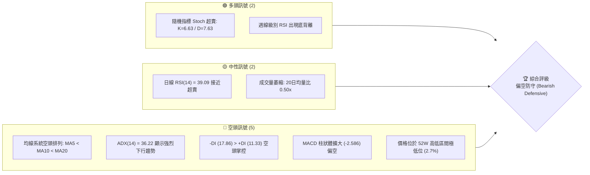
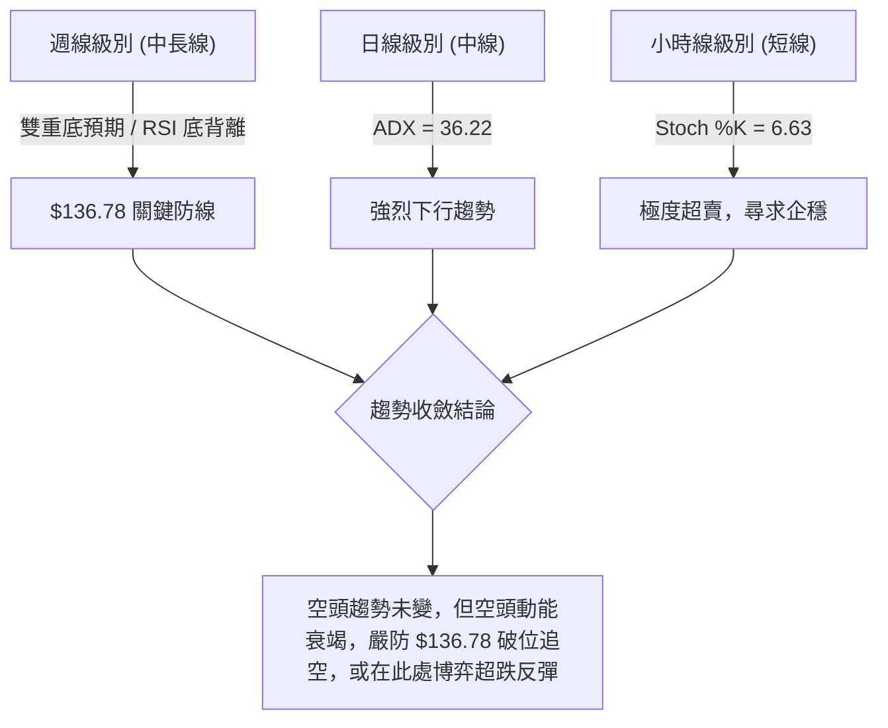
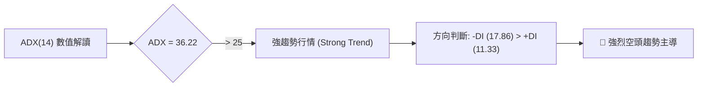
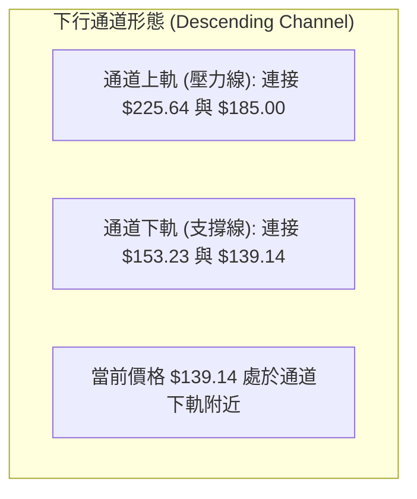
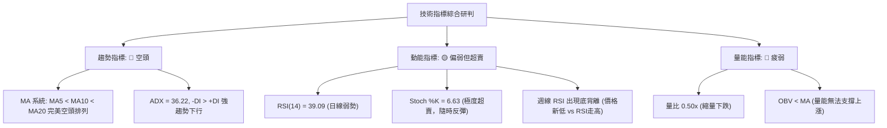
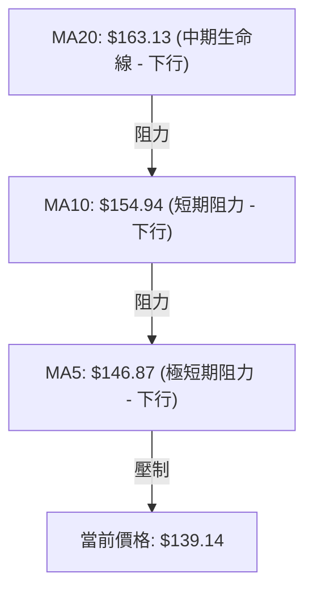
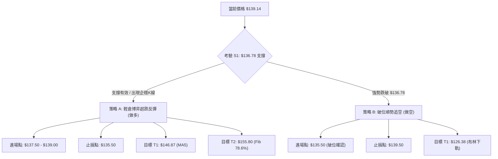
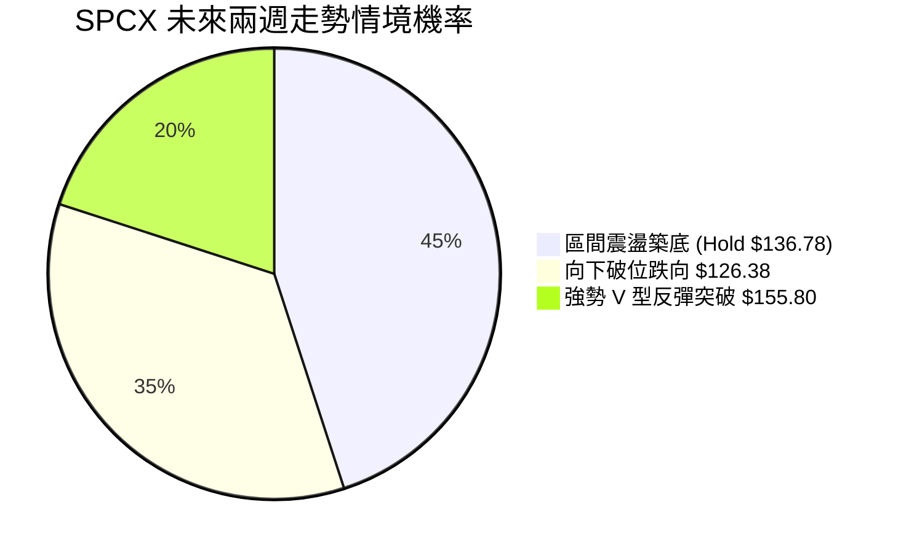
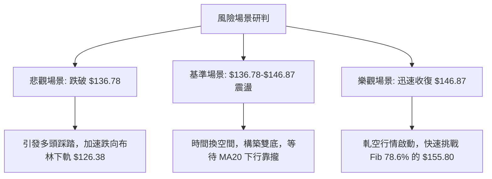

# SPCX 技術分析報告

> **報告日期**：2026-07-14 ｜ **語言**：繁體中文 ｜ **數據來源**：Yahoo Finance ｜ **當前價格**：$139.14

---

## 目錄

| 章節 | 內容 |
|------|------|
| [1. 技術面概覽](#1-技術面概覽) | 訊號儀表板、核心指標、評分卡 |
| [2. 趨勢分析](#2-趨勢分析) | 多時框趨勢、長中短期走勢 |
| [3. 圖表形態分析](#3-圖表形態分析) | 形態識別、K線組合、目標價 |
| [4. 支撐與阻力](#4-支撐與阻力) | 關鍵價位、斐波那契回調 |
| [5. 技術指標深度解讀](#5-技術指標深度解讀) | MA/RSI/MACD/布林/成交量 |
| [6. 動能與波動率](#6-動能與波動率) | 動能評估、ATR、Beta |
| [7. 多時框架總結](#7-多時框架總結) | 時框架評分矩陣 |
| [8. 交易策略建議](#8-交易策略建議) | 多空策略、風險報酬比 |
| [9. 風險提示與監控](#9-風險提示與監控) | 監控指標、風險場景 |
| [10. 報告總結](#-報告總結) | 核心結論與最優策略組合 |

---

## 1. 技術面概覽

### 🎯 技術訊號儀表板

本儀表板綜合評估了 SPCX 當前的多空技術訊號。目前市場呈現明顯的「空頭主導，但極度超賣」特徵。



### 📊 核心指標速覽表

| 指標類別 | 指標名稱 | 當前數值 | 訊號 | 解讀 |
|----------|----------|----------|------|------|
| **價格** | 當前價格 | $139.14 | 🔴 | 位於 52W 區間底部 (2.7% 檔位)，下行壓力沉重 |
| **均線** | MA5 | $146.87 | 🔴 | 價格低於 MA5，短線跌勢未止，斜率向下 |
| **均線** | MA10 | $154.94 | 🔴 | 價格低於 MA10，中期下行趨勢之第一道動態阻力 |
| **均線** | MA20 | $163.13 | 🔴 | 價格低於 BB 中軌，中期生命線失守 |
| **動能** | RSI(14) | 39.09 | 🟡 | 日線層面處於偏弱區間，尚未進入極端超賣 (<30) |
| **動能** | MACD | -5.081 | 🔴 | 雙線位於零軸下方且開口向下，空頭動能強勁 |
| **波動** | ATR(14) | $10.71 | 🟡 | 佔股價 7.70%，每日波動劇烈，需寬幅止損 |
| **動能** | Stoch %K | 6.63 | 🟢 | 隨機指標進入極端超賣區，存在強烈反彈契機 |

### 🏆 技術評分卡

根據多因子技術模型評估，SPCX 當前的技術面綜合得分為 **35/100**，整體屬於**偏空防守**格局。

```
技術評分卡 — SPCX (2026-07-14)
════════════════════════════════════════════════════
趨勢強度      ████████████████░░░░  80/100  🔴 強烈下行
動能指標      ██████░░░░░░░░░░░░░░  30/100  🔴 空頭佔優
支撐穩定度    ████████░░░░░░░░░░░░  40/100  🟡 考驗前低
成交量配合    ███████░░░░░░░░░░░░░  35/100  🔴 動能衰竭
形態完整度    ██████████████░░░░░░  70/100  🟡 通道下軌
均線排列      ████░░░░░░░░░░░░░░░░  20/100  🔴 完美空頭
════════════════════════════════════════════════════
綜合評分      ███████░░░░░░░░░░░░░  35/100  偏空防守
════════════════════════════════════════════════════
```

---

## 2. 趨勢分析

### 🌐 多時框趨勢分析

技術分析的核心在於多時框架的相互確認。以下為 SPCX 從週線到日線的趨勢收斂路徑：



### 📈 長期趨勢 — 12個月走勢圖（Unicode）

以下為 SPCX 過去 12 個月的月線收盤走勢圖。股價自 2025 年底見頂於 $225.64 後，展開了長達半年的震盪下行波段，目前正逼近一年前的歷史起漲點與 52 週最低點 $136.78。

```
SPCX 月線走勢圖（過去12個月）
價格軸 ($)
$225.64 ┤                  ● (2025-11 高點)
$210.00 ┤              ●        ●
$195.00 ┤        ●                  ●
$180.00 ┤●   ●                          ●
$160.00 ┤                                   ● (2026-06 收盤: 170.86)
$136.78 ┤    ● (歷史低點)                       ●← 現在 ($139.14)
        └───────────────────────────────────────────────
          M1  M2  M3  M4  M5  M6  M7  M8  M9  M10 M11 M12 (2026-07)
```

**走勢特徵分析表**：

| 階段 | 期間 | 價格區間 | 走勢特徵描述 |
|------|------|----------|--------------|
| **第一階段** | 2025-08 ~ 2025-11 | $180.00 → $225.64 | 多頭主升段，伴隨市場對太空寬頻業務的高預期，創下 52 週新高。 |
| **第二階段** | 2025-12 ~ 2026-05 | $225.64 → $162.00 | 震盪下行段，高估值修正，多次反彈未能突破前高，形成下行通道。 |
| **第三階段** | 2026-06 ~ 2026-07 | $170.86 → $139.14 | 加速下跌段，跌破多條關鍵均線，成交量於下跌中有所放大，目前尋求 52W 低點支撐。 |

### 📊 中期趨勢（週線分析）

從近 20 週的收盤數據來看，SPCX 呈現出典型的「階梯式下跌」特徵：
- **高點降低 (Lower Highs)**：自 2026-06-21 的高點 $185.00 之後，後續反彈高點僅至 $162.00 (2026-07-05)，隨後再度破底。
- **低點降低 (Lower Lows)**：收盤價從 $153.23 跌至 $145.30，再跌至目前的 $139.14。
- **關鍵支撐考驗**：當前收盤價 $139.14 距離 52 週最低點 $136.78 僅有 1.7% 的空間。

### ⚡ 趨勢強度評估（ADX 解讀）



**趨勢強度對照表**：

| ADX 區間 | 趨勢狀態 | SPCX 當前位置 | 交易策略導向 |
|----------|----------|---------------|--------------|
| < 20 | 趨勢微弱 / 盤整 | | 區間震盪，高拋低吸 |
| 20 - 25 | 趨勢初現 | | 順勢輕倉試單 |
| **25 - 50** | **強烈趨勢** | **★ 36.22 (當前位置)** | **順勢交易為主，日線級別不宜盲目抄底** |
| > 50 | 極端趨勢 | | 預防趨勢竭盡反轉 |

---

## 3. 圖表形態分析

### 🔍 形態識別系統

在日線與週線圖表上，SPCX 呈現出一個標準的**下行通道 (Descending Channel)** 形態。



**形態信心度與屬性評估**：

| 識別形態 | 信心度 | 判斷依據（引用數據） | 完成度 | 目標價（附計算式） |
|----------|--------|----------------------|--------|--------------------|
| **下行通道** | 80% | 上軌由 $225.64 與 $185.00 連接；下軌由 $153.23 與當前 $139.14 構成。 | 90% | **通道下軌支撐目標**：$136.78<br>**若破位下行目標**：$126.38 (BB下軌) |
| **潛在雙重底** | 45% | 當前價格 $139.14 逼近 52W 低點 $136.78。若能在此企穩，將與一年前低點形成雙底。 | 15% | **第一反彈目標**：$155.80 (Fib 78.6%)<br>**第二反彈目標**：$170.72 (Fib 61.8%) |

*註：由於雙重底完成度僅 15%，目前僅作指標型超賣反彈解讀，不作為主交易依據。*

### 🕯️ 重要K線形態分析

近期日線級別 K 線展現出強烈的空頭壓制，但開始出現止跌信號：

| 日期 | 收盤價 | K線形態 | 解讀 | 訊號 |
|------|--------|---------|------|------|
| 2026-07-05 | $162.00 | 倒錘頭線 (Inverted Hammer) | 反彈受阻於 MA20 ($163.13) 附近，上方拋壓沉重。 | 🔴 看空 |
| 2026-07-12 | $145.30 | 大陰線 (Marubozu) | 跌破多條短期均線，空頭動能加速釋放。 | 🔴 看空 |
| 2026-07-19 | $139.14 | 縮量十字星 (Doji) | 股價逼近 $136.78，成交量顯著萎縮，多空雙方力量趨於暫時平衡。 | 🟡 轉折訊號 |

### 📉 ASCII 走勢形態示意圖

```
SPCX 下行通道與關鍵形態示意圖
═════════════════════════════════════════════════════════
$225.64 ║  \
        ║   \  (通道上軌 - 壓力)
$185.00 ║    * \
        ║     \ \
$170.72 ║      \ * \
        ║       \   \
$155.80 ║        \   * \
        ║         \     \
$139.14 ╠══════════\═════* (現價 $139.14) ═══════════════
$136.78 ║           \   /  ◄--- 52W 關鍵支撐防線 (雙底預期)
        ║            \ /
$126.38 ║             * (通道下軌 - 布林下軌支撐)
═════════════════════════════════════════════════════════
```

### 🎯 形態目標價計算

1. **通道下軌與 52W 低點共振支撐**：
   $$\text{第一目標支撐位} = \text{52W Low} = \$136.78$$
2. **若跌破 \$136.78 的破位測幅**：
   $$\text{破位目標價} = \text{布林通道下軌} = \$126.38$$
3. **超賣反彈測幅（以 52W 高低點之斐波那契黃金分割計算）**：
   $$\text{反彈 T1 (78.6\% 回調)} = \$155.80$$
   $$\text{反彈 T2 (61.8\% 回調)} = \$170.72$$

---

## 4. 支撐與阻力

### 🗺️ 關鍵價位分布圖（Unicode）

本圖表展示了 SPCX 當前價位在整體價格結構中的位置。目前價格已退無可退，下方僅存 52W 最低點防線。

```
SPCX 價位結構分布圖
═══════════════════════════════════════════════════
$225.64 ║████████████████████████║ 極限阻力 (52W High)
$204.67 ║████████████████████    ║ 阻力 R3 (Fib 23.6%)
$181.21 ║████████████████████████║ 中期強阻力 (Fib 50.0%)
$172.40 ║████████████████████████║ 關鍵阻力 R2 (近一年波段高點聚類)
$155.80 ║████████████████████    ║ 短期阻力 R1 (Fib 78.6%)
$139.14 ╠════════════════════════╣ ◄ 當前現價 ($139.14)
$136.78 ║▓▓▓▓▓▓▓▓▓▓▓▓▓▓▓▓        ║ 關鍵支撐 S1 (52W Low / Fib 100.0%)
$126.38 ║████████                ║ 強支撐 S2 (布林下軌)
═══════════════════════════════════════════════════
```

### 🚧 阻力位分析表

| 阻力級別 | 價位 | 形成原因 | 突破難度 | 重要性 |
|----------|------|----------|----------|--------|
| **R1** | $155.80 | 斐波那契 78.6% 回調位，鄰近 MA10 ($154.94) | 🟡 中等 | 短線反彈的哨兵站，站穩此處方能緩解下行壓力。 |
| **R2** | $172.40 | 近一年波段高點聚類，共振 Fib 61.8% ($170.72) 與 MA20 ($163.13) | 🔴 極高 | 中期多空分水嶺，此區間積聚大量套牢盤。 |
| **R3** | $204.67 | 斐波那契 23.6% 回調位 | 🔴 極高 | 長期趨勢扭轉點。 |

### 🛡️ 支撐位分析表

| 支撐級別 | 價位 | 形成原因 | 守住機率 | 重要性 |
|----------|------|----------|----------|--------|
| **S1** | $136.78 | 52週最低點 (100.0% 斐波那契回調) | 🟡 50% | 多頭的最後防線，一旦失守將引發止損盤恐慌性湧出。 |
| **S2** | $126.38 | 日線布林通道下軌 | 🟢 80% | 極端超賣區，若跌至此處預計將有強烈技術性買盤介入。 |

### 📐 斐波那契回調位分析

基於 52 週高低點（$136.78 → $225.64）進行黃金分割回調分析：
- 當前價格 $139.14 正處於 **78.6% ($155.80)** 與 **100.0% ($136.78)** 之間。
- 此區間屬於「深幅回調區」。通常情況下，100.0% 回調位 ($136.78) 是極具技術意義的支撐位。
- 若股價在 $136.78 之上企穩，則視為健康的二次探底；若跌破此位，則宣告 52 週的多頭結構徹底破壞，向 $126.38 尋求支撐。

---

## 5. 技術指標深度解讀

### 🎛️ 指標訊號總覽



### 📈 移動平均線排列分析

SPCX 的均線系統呈現標準的**下行發散（空頭排列）**：



**均線乖離率分析**：
- 當前價格相較於 MA5 乖離率為 **-5.27%**。
- 相較於 MA20 乖離率為 **-14.70%**。
- 歷史經驗顯示，當 SPCX 相較於 MA20 的負乖離率達到 15% 附近時，極易引發向均線靠攏的**技術性反彈**。

### 📉 RSI(14) 分析

- **日線 RSI(14)** 目前數值為 **39.09**，處於 30-50 的偏弱區間，尚未進入 30 以下的極端超賣區。
- **週線 RSI(14) 關鍵背離**：
  - 2026-07-12 收盤價 $145.30，週線 RSI 為 **29.1**。
  - 2026-07-19 當前價格 $139.14（價格創新低），但週線 RSI 卻回升至 **39.1**。
  - **結論**：週線級別出現明顯的**底背離 (Bullish Divergence)**！這通常是中線趨勢動能衰竭、底部即將構築的強烈訊號。

### 📊 MACD(12/26/9) 訊號解讀

- **MACD 主線**：-5.081
- **信號線 (Signal Line)**：-2.495
- **柱狀圖 (Histogram)**：-2.586
- **解讀**：雙線在零軸下方持續向下擴散，且柱狀體呈現紅色（看空）並持續放大。這表明日線級別的下行動能仍未完全衰竭。然而，由於雙線距離零軸過遠，需防範隨時可能出現的「快速收斂（金叉反彈）」。

### 📦 布林通道分析

```
日線布林通道波動範圍
╟───────────────────────────────────────────────────────╢
$126.38                  $139.14     $163.13           $199.88
(下軌)                    (現價)     (中軌)             (上軌)
                         [ %B = 0.17 ]
```
- **通道寬度**：BB 上軌 $199.88 與下軌 $126.38 寬度極大，表明市場波動率處於高位。
- **%B 指標**：當前 %B 為 **0.17**，股價貼近下軌運行。在強烈趨勢行情中（ADX>25），股價有「沿下軌鈍化」的風險，但同時也意味著下行空間在短線上受到布林下軌（$126.38）的強力支撐。

### 💹 成交量分析（量價配合度）

- **最新成交量**：71,157,700
- **20日均量**：143,353,300（量比僅為 **0.50x**）
- **量價關係**：股價在逼近 52W 低點時，成交量呈現**顯著萎縮**。
- **OBV 趨勢**：OBV 指標低於其移動平均線，量能疲弱。
- **分析師觀點**：縮量下跌通常意味著「賣壓竭盡」而非「強烈拋售」。在沒有恐慌盤湧出的情況下，這種縮量逼近關鍵支撐的行為，更傾向於是在構築技術性底部。

---

## 6. 動能與波動率

### ⚡ 動能評估四象限

根據「動能強度」與「波動率」雙維度評估，SPCX 目前落於 **第四象限（弱動能、高波動）**。

| 象限 | 動能狀態 | 波動率狀態 | SPCX 當前定位 | 交易策略指導 |
|------|----------|------------|---------------|--------------|
| Q1 | 強勁 (Bullish) | 低波動 | | 穩健持股，順勢加倉 |
| Q2 | 疲弱 (Bearish) | 低波動 | | 觀望，避免資金佔用 |
| Q3 | 強勁 (Bullish) | 高波動 | | 高風險追漲，嚴格止損 |
| **Q4** | **疲弱 (Bearish)** | **高波動** | **★ (當前位置)** | **左側輕倉博弈超跌反彈，或耐心等待右側企穩** |

### 📊 ATR 波動率分析

- **ATR(14)** 當前為 **$10.71**，佔當前股價的 **7.70%**。
- **止損距離設計**：由於 ATR 較高，常規的窄幅止損（如 2%-3%）極易被市場隨機波動（噪音）掃出場。
- **建議技術止損寬度**：
  $$\text{最小止損空間} = 1.5 \times \text{ATR} = 1.5 \times \$10.71 = \$16.07$$
  因此，若在 $139.14 附近建立多單，技術止損應設於 $136.78 之下（約 $135.50），這符合寬幅止損、輕倉操作的原則。

---

## 7. 多時框架總結

### 📋 時框架評分表

| 時框架 | 趨勢方向 | 動能 | 均線排列 | 形態 | 綜合評分 | 交易建議 |
|--------|----------|------|----------|------|----------|----------|
| **月線** | 🟡 中性偏空 | 🟡 中性 | 🟡 混合排列 | 🟡 區間震盪 | 50/100 | 耐心等待底部確立 |
| **週線** | 🟡 震盪下行 | 🟢 RSI底背離 | 🔴 空頭排列 | 🟢 雙底預期 | 55/100 | 具備中線布局價值 |
| **日線** | 🔴 強烈下行 | 🔴 MACD看空 | 🔴 空頭排列 | 🟡 通道下軌 | 35/100 | 嚴防破位，不盲目追多 |
| **小時線**| 🔴 短期下跌 | 🟢 Stoch超賣 | 🔴 空頭排列 | 🟢 底部十字星 | 45/100 | 短線醞釀超跌反彈 |

### 🔲 綜合訊號矩陣

```
            ▲ 高動能 (看多)
            │
            │          [週線級別 RSI 底背離]
            │                 ●
            │
  弱勢 ─────┼─────────────────────────────► 強勢 (指標方向)
  (價格)    │
            │    ● [日線 MACD 偏空]
            │    ● [日線 MA 空頭排列]
            │
            ▼ 低動能 (看空)
```

### ⚖️ 多時框收斂結論

**當前行情屬性：強趨勢行情 (ADX = 36.22 > 25)**
- **收斂原則**：依據「趨勢行情以中長期方向為主，日線尋找進場時機」之規則。
- **中期方向 (週線)**：雖然整體趨勢向下，但週線級別在 $136.78 附近展現出強烈的「RSI 底背離」與「縮量」特徵，暗示中期下行空間已受限。
- **短期方向 (日線)**：下行趨勢依然強勁，尚未出現明確的右側反轉 K 線。
- **最終方向性結論**：**偏空防守，但進入戰略性築底階段**。目前不宜在 $139.14 附近盲目追空，應將 $136.78 視為多空決戰點。

---

## 8. 交易策略建議

### 🗺️ 策略決策流程圖



### 🧭 策略路由

> **當前主策略方向：雙向保護區間交易（偏空防守，以策略 A 左側試多與策略 B 破位追空並行）**
> *依據：技術評分卡 35/100 顯示日線極度偏空，但週線底背離與 Stoch 極度超賣限制了下行空間。此時最忌單邊下注，應設立明確的雙向觸發條件。*

### 🎯 價格情境階梯（Price Scenarios）

| 觸發條件 | 下一目標 | 後續延伸 | 情境含義 |
|----------|----------|----------|----------|
| **向上突破 R1 $155.80** | R2 $172.40 | $181.21 (Fib 50%) | 中期趨勢緩解，多頭重回主導 |
| **站穩現價區間 $136.78**| $146.87 (MA5) | $155.80 | 構築雙底，進行技術性超賣反彈 |
| **向下跌破 S1 $136.78** | S2 $126.38 | 尋求新低 | 空頭趨勢加速，多頭結構徹底破壞 |

### 📊 情境機率分佈



### 🟢 交易策略詳情

#### 🥇 策略 A：左側超跌反彈策略（做多）
- **進場條件**：股價回踩 $137.00 - $139.00 區間，且小時線出現縮量企穩信號。
- **進場價格**：**$138.00**
- **目標價 T1**：**$146.87**（MA5 動態阻力位，預期利潤率：+6.4%）
- **目標價 T2**：**$155.80**（斐波那契 78.6% 回調位，預期利潤率：+12.9%）
- **止損價格**：**$135.50**（跌破 52W 最低點 $136.78，並給予一定波動緩衝）
- **風險報酬比**：**1 : 7.12**（風險 $2.50，潛在最大收益 $17.80）
- **成功機率**：**45%**
- **建議倉位**：**5% - 8% (輕倉試單)**

#### 🥈 策略 B：破位順勢追空策略（做空）
- **進場條件**：日線收盤價強勢跌破 $136.78，或盤中跌破 $136.00。
- **進場價格**：**$135.50**
- **目標價 T1**：**$126.38**（日線布林通道下軌，預期利潤率：+6.7%）
- **止損價格**：**$139.50**（重新拉回 52W 低點之上，宣告假突破）
- **風險報酬比**：**1 : 2.28**（風險 $4.00，潛在最大收益 $9.12）
- **成功機率**：**55%**
- **建議倉位**：**10% (標準倉位)**

### 🔴 反向風險觸發點（對沖提示）

- **多單對沖觸發**：若持有多單，一旦盤中無量跌破 **$136.78**，應立即執行止損，並考慮反手執行**策略 B**。
- **空單對沖觸發**：若持有空單（自高位持下來的波段空單），一旦日線收盤價站上 **$146.87 (MA5)**，表明短期跌勢告一段落，應獲利了結。

### ⭐ 整體訊號強度評星

```
做多訊號強度：★★☆☆☆  (2.0 / 5星 - 僅限超跌反彈)
做空訊號強度：★★★★☆  (4.0 / 5星 - 順應日線大趨勢)
整體可信度：  ★★★☆☆  (3.5 / 5星 - 關鍵支撐位波動加劇)
```

---

## 9. 風險提示與監控

### ✅ 關鍵監控指標 Checklist

```
╔══════════════════════════════════════════════════════════════╗
║              SPCX 每日風控監控清單                            ║
╠══════════════════════════════════════════════════════════════╣
║ [ ] 52W 低點 $136.78 是否在收盤階段失守？                   ║
║ [ ] 日線 RSI(14) 是否跌破 30 進入極端超賣？                 ║
║ [ ] 成交量是否突然放大至 1.5 億股以上（恐慌盤湧出）？        ║
║ [ ] MACD 柱狀體是否開始縮短（下行尾聲訊號）？               ║
║ [ ] 週線 RSI(14) 的底背離形態是否遭到破壞？                 ║
╚══════════════════════════════════════════════════════════════╝
```

### ⚠️ 風險場景分析



### 🛡️ 風險管理重要提醒

1. **嚴格執行價格紀律**：目前 SPCX 處於極高波動率狀態（ATR 佔比 7.70%），任何無止損的交易都可能面臨巨大的單邊穿倉風險。跌破 $136.78 必須無條件離場。
2. **倉位管理**：鑑於當前技術評分僅為 35/100，不宜投入超過總資金 15% 的份額於此標的。左側交易（策略 A）必須控制在個位數倉位。
3. **警惕假突破**：在關鍵歷史支撐位附近，市場主力常會製造「盤中瞬間跌破、收盤拉回」的掃單行為。建議以**日線收盤價**作為最終止損判定依據，或使用過濾器（如跌破幅達 1% 即 $135.41 作為硬性止損）。

---

## 📋 報告總結

```
SPCX 技術分析報告總結
════════════════════════════════════════════════════════
報告日期：2026-07-14
當前價格：$139.14
分析評級：⚖️ 偏空防守 (Bearish Defensive)

關鍵結論：
├─ 長期趨勢：🔴 看空 (自 $225.64 震盪下行半年)
├─ 中期趨勢：🟡 築底 (週線級別 RSI 出現強烈底背離)
├─ 短期趨勢：🔴 強烈下行 (ADX = 36.22，均線空頭排列)
├─ 關鍵支撐：$136.78 (52W 最低點) / $126.38 (布林下軌)
├─ 關鍵阻力：$146.87 (MA5) / $155.80 (Fib 78.6%)
└─ 分析師目標均值：$242.22 (基本面長期看好)

最優策略組合：
1. 🥇 最佳機會：等待回踩 $137.50 - $138.00 區域，輕倉做多博弈
   超跌反彈，止損設於 $135.50，目標直指 $146.87 與 $155.80。
2. 🥈 備用防守：若日線收盤確認跌破 $136.78，立即執行多單止損，
   並順勢反手做空，目標下看 $126.38。
════════════════════════════════════════════════════════
```

---

> ⚠️ **免責聲明**：本報告為 AI 自動生成之技術分析，所有數據及估算均基於提供的歷史價格資訊。本報告**僅供研究與學術參考**，**不構成任何投資建議**。投資有風險，入市需謹慎。

---
*報告生成時間：2026-07-14 ｜ 數據來源：Yahoo Finance ｜ 分析框架：多時框技術分析*