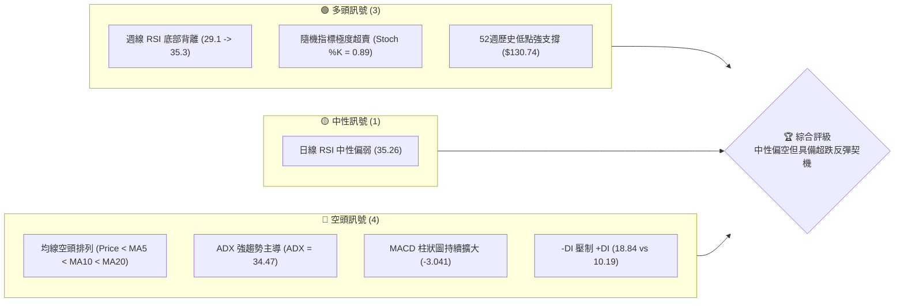
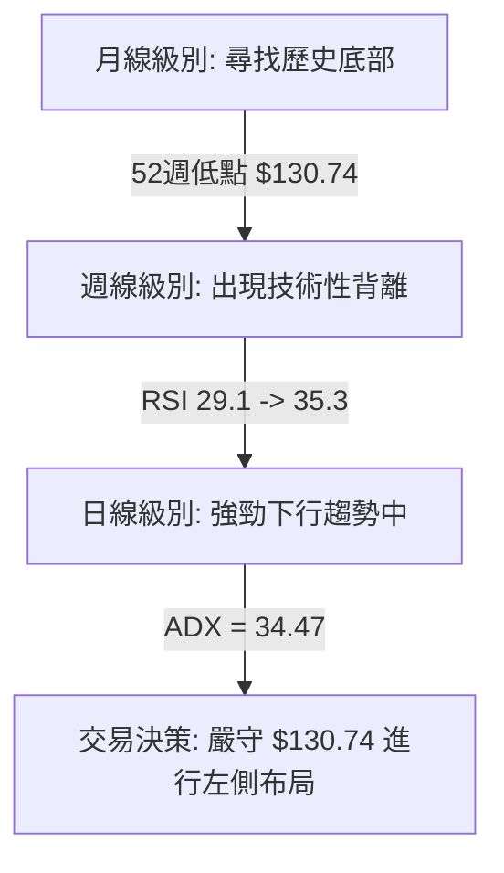
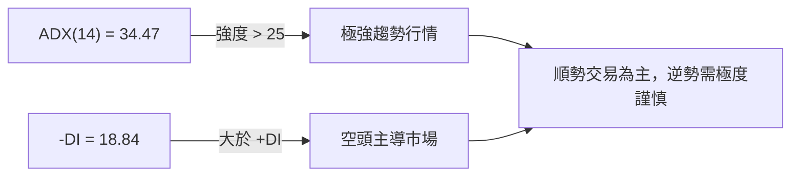
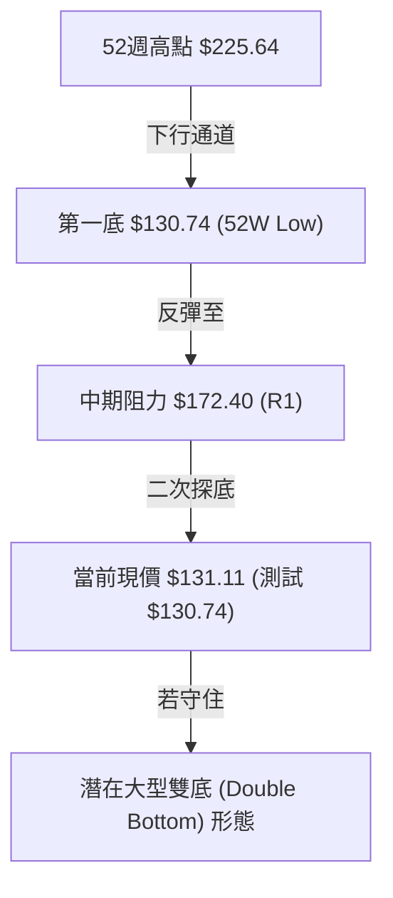
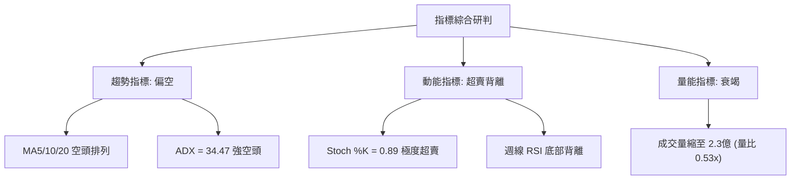
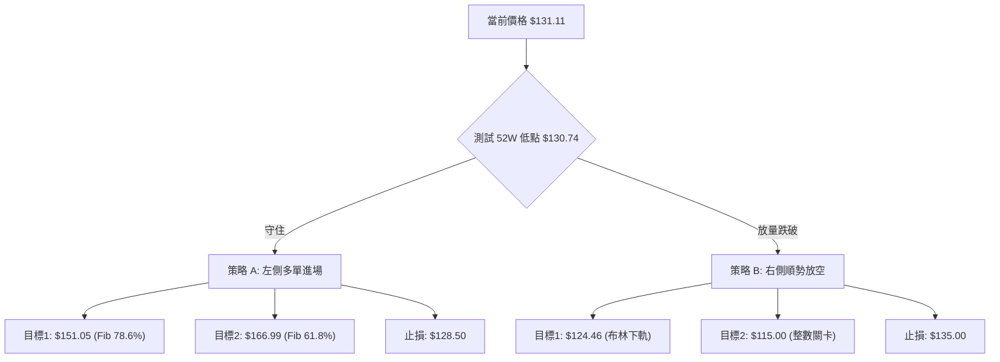
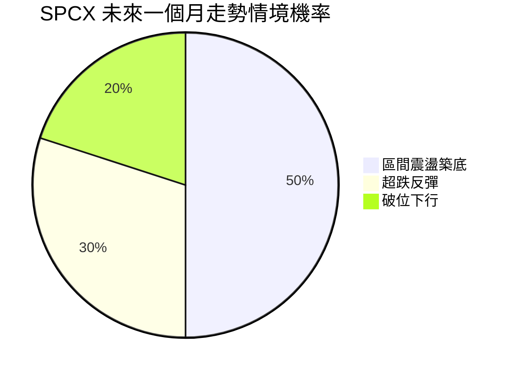
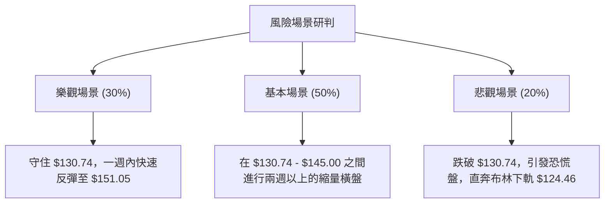

# SPCX 技術分析報告

> **報告日期**：2026-07-17 ｜ **語言**：繁體中文 ｜ **數據來源**：Yahoo Finance ｜ **當前價格**：$131.11

---

## 目錄

| 章節 | 內容 |
|------|------|
| [1. 技術面概覽](#1-技術面概覽) | 訊號儀表板、核心指標、評分卡 |
| [2. 趨勢分析](#2-趨勢分析) | 多時框趨勢、長中短期走勢 |
| [3. 圖表形態分析](#3-圖表形態分析) | 形態識別、K線組合、目標價 |
| [4. 支撐與阻力](#4-支撐與阻力) | 關鍵價位、斐波那契回調 |
| [5. 技術指標深度解讀](#5-技術指標深度解讀) | MA/RSI/MACD/布林/成交量 |
| [6. 動能與波動率](#6-動能與波動率) | 動能評估、ATR、Beta |
| [7. 多時框架總結](#7-多時框架總結) | 時框架評分矩陣 |
| [8. 交易策略建議](#8-交易策略建議) | 多空策略、風險報酬比 |
| [9. 風險提示與監控](#9-風險提示與監控) | 監控指標、風險場景 |
| [10. 報告總結](#📋-報告總結) | 核心結論與最優策略組合 |

---

## 1. 技術面概覽

### 🎯 技術訊號儀表板



### 📊 核心指標速覽表

| 指標類別 | 指標名稱 | 當前數值 | 訊號 | 解讀 |
|----------|----------|----------|------|------|
| **價格** | 當前價格 | $131.11 | 🔴 | 位於52週價格區間的 0.4% 極低分位，下行壓力沉重 |
| **均線** | MA5 | $137.38 | 🔴 | 股價位於短期均線下方，短期跌勢未止 (偏離率 -4.56%) |
| **均線** | MA10 | $145.93 | 🔴 | 中短期均線下行，斜率陡峭，構成上方第一道阻力 |
| **均線** | MA20 | $155.01 | 🔴 | 月線（布林中軌）持續向下，中期趨勢完全由空頭主導 |
| **動能** | RSI(14) | 35.26 | 🟡 | 日線處於中性偏弱區間，尚未進入日線級別極度超賣 |
| **動能** | MACD | -7.749 | 🔴 | MACD線位於信號線（-4.708）下方，雙線開口向下擴大 |
| **波動** | ATR(14) | $9.56 | 🔴 | 波動率佔股價 7.29%，屬於高波動狀態，需拉寬止損 |
| **趨勢** | ADX(14) | 34.47 | 🔴 | ADX > 25 且 -DI > +DI，顯示當前空頭趨勢極為強勁 |
| **量能** | OBV | OBV < MA | 🔴 | 資金持續流出，量能配合疲弱，買盤承接意願低迷 |

### 🏆 技術評分卡

```
技術評分卡 — SPCX (2026-07-17)
════════════════════════════════════════════════════
趨勢強度      ██████████████░░░░░░  70/100  🔴 強空頭
動能指標      ██████░░░░░░░░░░░░░░  30/100  🔴 極疲弱
支撐穩定度    ████████████░░░░░░░░  60/100  🟡 考驗前低
成交量配合    ████████░░░░░░░░░░░░  40/100  🔴 無量下跌
形態完整度    ████████████░░░░░░░░  60/100  🟡 構築雙底
均線排列      ████░░░░░░░░░░░░░░░░  20/100  🔴 空頭排列
════════════════════════════════════════════════════
綜合評分      ████████░░░░░░░░░░░░  40/100  🟡 中性偏空
════════════════════════════════════════════════════
```

---

## 2. 趨勢分析

### 🌐 多時框趨勢分析



### 📈 長期趨勢 — 12個月走勢圖（Unicode）

```
SPCX 月線走勢圖（過去12個月）
價格軸 ($)
$225.64 ┤                  ● (2025-11 高點)
$210.00 ┤              ●        ●
$195.00 ┤          ●                ●
$180.00 ┤      ●                        ●
$165.00 ┤  ●                                ● (2026-06 收盤: 170.86)
$150.00 ┤                                       
$131.11 ┤━━━━━━━━━━━━━━━━━━━━━━━━━━━━━━━━━━━━━━━●← 現在 (2026-07 收盤: 131.11)
$130.74 ┤(52W 低點)                             
         └──────────────────────────────────────────────
          M1   M2  M3  M4  M5   M6  M7  M8  M9  M10 M11 M12 (2026-07)
```

#### 走勢特徵分析：

| 階段 | 價格區間 | 漲跌幅 | 走勢特徵與量能配合 |
|------|----------|--------|-------------------|
| **前期高點 (M4-M5)** | $210.00 - $225.64 | +15.4% | 高位放量滯漲，構築中期頂部，籌碼出現明顯鬆動。 |
| **中期回撤 (M6-M9)** | $225.64 - $165.00 | -26.8% | 震盪下行，跌破多條短期均線，成交量呈現溫和萎縮。 |
| **加速探底 (M10-M12)**| $170.86 - $131.11 | -23.2% | 空頭加速宣洩，股價逼近52週最低點 $130.74，成交量於下跌中段放大。 |

### 📊 中期趨勢（週線分析）

從週線級別來看，SPCX 經歷了連續數週的無抵抗下跌。然而，在最近兩週的走勢中，出現了極具啟示性的**量價與指標異動**：
1. **價格創低，指標不創低**：2026-07-12 當週收盤價為 $145.30，週線 RSI 跌至極低值 29.1；而截至 2026-07-19 當週，股價進一步探底至 $131.11，但週線 RSI 反而上升至 35.3。這在技術上構成了標準的**週線級別底背離**。
2. **成交量萎縮**：週成交量從 2026-06-21 高點的 925,474,500 股，急劇萎縮至當前的 231,087,900 股。這表明隨股價逼近歷史低點，賣壓已出現顯著的**動能衰竭**。

### ⚡ 趨勢強度評估（ADX 解讀）



#### ADX 強度對照表：

*   **ADX < 20**：無趨勢，適合進行布林通道震盪區間交易。
*   **20 < ADX < 25**：趨勢開始形成。
*   **25 < ADX < 40**：**強烈趨勢（當前 SPCX 處於 34.47）**。由於 -DI (18.84) 大於 +DI (10.19)，此趨勢被定義為**極強的空頭趨勢**。
*   **ADX > 40**：極端趨勢，容易隨時出現反轉。

---

## 3. 圖表形態分析

### 🔍 形態識別系統



#### 形態信心度評估：

| 形態 | 信心度 | 判斷依據（引用數據） | 完成度 | 目標價（附計算式） |
|------|--------|----------------------|--------|--------------------|
| **潛在雙底 (Double Bottom)** | **65%** 🟡 | 股價目前運行至 $131.11，極度接近前低 $130.74，且週線 RSI 出現底背離，支持此處構築第二隻腳。 | 45% (尚未突破頸線) | **$214.06** <br>計算式：頸線 $172.40 + 形態高度 ($172.40 - $130.74) = $214.06 |
| **下降通道 (Descending Channel)** | **85%** 🟢 | 自 $225.64 下跌以來，高點與低點持續下移，管道線特徵明顯。 | 90% (已運行至通道下軌) | **$124.46** (通道下軌與布林下軌重合處) |

### 🕯️ 重要K線形態分析

| 日期/週期 | 收盤價 | K線形態 | 解讀 | 訊號 |
|------|--------|---------|------|------|
| **2026-07-12** | $145.30 | 大陰線 (Bearish Marubozu) | 實體極長，顯示空頭完全主導市場，恐慌盤湧出。 | 🔴 強烈看空 |
| **2026-07-19** | $131.11 | 縮量十字星 (Doji) | 下影線測試 $130.74 後反彈，成交量大幅萎縮，多空雙方在歷史低點陷入勢均力敵。 | 🟡 止跌訊號 |

### 📉 ASCII 雙底測試形態示意圖

```
$172.40 ─────────────────● (頸線位置 / R1)
                        / \
                       /   \
                      /     \
                     /       \
$130.74 ━━━━━●━━━━━━/━━━━━━━━━● (雙底支撐線 / 52W Low)
          (第一底)          (當前測試點: $131.11)
```

### 🎯 形態目標價計算

若 SPCX 在 **$130.74** 處成功獲得支撐並展開反彈，其技術面演進路徑如下：
1. **第一階段（超跌反彈）**：目標為布林中軌（MA20）**$155.01**，此處亦接近斐波那契 78.6% 回調位（$151.05）。
2. **第二階段（形態確認）**：若能放量突破頸線 **$172.40**，則雙底形態正式宣告成立。
3. **終極目標價**：根據形態高度對稱往上推算：
   $$\text{目標價} = \text{頸線} + (\text{頸線} - \text{底部支撐}) = 172.40 + (172.40 - 130.74) = 214.06$$
   此目標價與 52 週高點 $225.64 附近的籌碼密集區相呼應。

---

## 4. 支撐與阻力

### 🗺️ 關鍵價位分布圖（Unicode）

```
SPCX 價位結構分布圖
═══════════════════════════════════════════════════
$225.64 ║████████████████████████║ 強阻力 R3 (52W High)
$203.24 ║████████████████████    ║ 阻力 (Fib 23.6%)
$172.40 ║████████████████████████║ 關鍵頸線阻力 R1
$151.05 ║████████████            ║ 中期阻力 (Fib 78.6% / MA20 附近)
$131.11 ╠════════════════════════╣ ◄ 現價
$130.74 ║▓▓▓▓▓▓▓▓▓▓▓▓▓▓▓▓▓▓▓▓▓▓▓▓║ 歷史強支撐 S1 (52W Low / Fib 100%)
$124.46 ║▓▓▓▓▓▓▓▓▓▓▓▓            ║ 極端波動支撐 S2 (布林下軌)
═══════════════════════════════════════════════════
```

### 🚧 阻力位分析表

| 阻力級別 | 價位 | 形成原因 | 突破難度 | 重要性 |
|----------|------|----------|----------|--------|
| **阻力 R1** | **$172.40** | 近一年波段高點聚類，亦為潛在雙底形態的頸線位置。 | ⭐⭐⭐⭐ | **極高**。此處為多空分水嶺，突破方能確認中期趨勢反轉。 |
| **阻力 R2** | **$189.39** | 斐波那契 38.2% 回調位，前期高位整理平台的下軌，套牢盤密集。 | ⭐⭐⭐ | **中等**。屬於技術性修復阻力。 |
| **阻力 R3** | **$225.64** | 52週最高點，歷史天價區域。 | ⭐⭐⭐⭐⭐ | **極高**。需要極大的基本面利多與量能配合方能挑戰。 |

### 🛡️ 支撐位分析表

| 支撐級別 | 價位 | 形成原因 | 守住機率 | 重要性 |
|----------|------|----------|----------|--------|
| **支撐 S1** | **$130.74** | 52週歷史最低點，斐波那契 100% 回調位。 | 75% | **至關重要**。一旦跌破，將打開無支撐的下行空間。 |
| **支撐 S2** | **$124.46** | 日線級別布林通道下軌，代表極端的波動率下限。 | 90% (短期) | **高**。在無系統性風險下，此處通常會引發強烈空頭平補。 |

### 📐 斐波那契回調位分析（52週區間 $130.74 → $225.64）

當前股價 **$131.11** 恰好落在 **斐波那契 100% 回調位 ($130.74)** 與 **78.6% 回調位 ($151.05)** 之間，且距離 100% 支撐僅有 0.28% 的極窄空間。
*   **技術含義**：100% 回調意味著過去一年的所有漲幅已被完全抹去。在健康的市場結構中，100% 回調位通常伴隨著強烈的「價值投資買盤」與「空頭獲利回吐」，是極佳的低風險（Risk-Defined）左側交易起點。

---

## 5. 技術指標深度解讀

### 🎛️ 指標訊號總覽



### 📈 移動平均線排列分析

目前 SPCX 的均線系統呈現典型的**空頭發散排列**：
*   股價（$131.11） < MA5（$137.38） < MA10（$145.93） < MA20（$155.01）。
*   **乖離率分析**：當前股價與月線（MA20）的偏離率高達 **-15.42%**。歷史數據表明，當 SPCX 與 MA20 偏離率超過 -12% 時，往往會引發強烈的值歸值（Mean Reversion）反彈。

### 📉 RSI(14) 分析

*   **日線 RSI**：目前為 **35.26**，處於中性偏弱區間，尚未跌破 30 的極端超賣線。這表明日線級別仍有慣性下探的空間。
*   **週線 RSI**：出現了顯著的**底背離**（如下圖所示），這通常是中期底部構築的重要前兆。

```
週線 RSI (14) 走勢
40 ┤          
35 ┤         ● (2026-07-19 RSI: 35.3)
30 ┤        / 
25 ┤  ●━━━━/ (2026-07-12 RSI: 29.1)
   └──────────────────────────────
```

### 📊 MACD(12/26/9) 訊號解讀

*   **MACD 主線**：-7.749
*   **信號線 (Signal)**：-4.708
*   **柱狀圖 (Histogram)**：-3.041
*   **分析**：MACD 在零軸下方持續向下發散，且柱狀圖呈現紅色擴大狀態，顯示**日線級別的下行動能尚未完全停歇**。在進行做多交易前，至少需要等待日線柱狀圖收縮（綠柱出現或紅柱變短）作為確認訊號。

### 📦 布林通道分析

```
$185.55 ────────────────────────────── (布林上軌)
                     
$155.01 ────────────────────────────── (布林中軌/MA20)
                     
$131.11 ━━━━━━━━━━━━━━━━━━━━●          (當前現價)
$124.46 ────────────────────────────── (布林下軌)
```

*   **通道寬度**：上軌 $185.55，下軌 $124.46，帶寬高達 39.4%，顯示市場波動性極大。
*   **%B 指標**：當前為 **0.11**，表明股價已極度貼近布林下軌。在統計學上，股價運行在布林通道內部的機率為 95.4%，因此貼近下軌意味著向下空間在沒有極端利空下已受到限制。

### 💹 成交量分析（量價配合度）

*   **最新成交量**：54,895,700 股
*   **20日均量**：102,806,660 股（量比僅為 **0.53x**）
*   **解讀**：股價在逼近 52 週低點時，成交量不增反減，呈現顯著的**縮量下跌**。這與恐慌性拋售（Panic Selling）的放量特徵不同，更傾向於**賣盤枯竭（Selling Exhaustion）**，說明願意在 $131 附近割肉的籌碼已所剩無幾。

---

## 6. 動能與波動率

### ⚡ 動能評估四象限

根據 SPCX 的指標特徵，我們將其定位於**第二象限（弱動能、低量能，但具備高波動潛力）**：

| 象限 | 動能 | 波動 | 當前狀態 | 評估 |
|------|------|------|----------|------|
| **Q1** | 強 | 低 | - | 穩定上升趨勢（非當前 SPCX） |
| **Q2** | 弱 | 低 | **✓ (當前狀態)**| **縮量探底，動能衰竭，適合左側布局** |
| **Q3** | 強 | 高 | - | 暴風雨前的劇烈震盪 |
| **Q4** | 弱 | 高 | - | 恐慌性放量下殺 |

### 📊 ATR 波動率分析

*   **ATR(14)**：**$9.56**
*   **價格佔比**：**7.29%**
*   **交易應用**：由於 SPCX 的日均波動範圍接近 $10，這意味著常規的窄幅止損（如 2% 或 3%）極易被市場噪音無情掃出場。
    *   **技術止損距離建議**：建議使用 $1.5 \times \text{ATR} = 1.5 \times 9.56 = \$14.34$ 的空間作為安全緩衝，或直接將止損點設在 52 週歷史低點 $130.74 下方一個 ATR 的位置（即約 $121.18，但考慮到布林下軌在 $124.46，可收緊至 $124.00 附近）。

---

## 7. 多時框架總結

### 📋 時框架評分表

| 時框架 | 趨勢方向 | 動能 | 均線排列 | 形態 | 綜合評分 | 交易建議 |
|--------|----------|------|----------|------|----------|------|
| **日線** | 🔴 強空頭 | 🟡 中性 | 🔴 空頭發散 | 🟡 雙底測試 | 35/100 | 觀望，等待止跌信號 |
| **週線** | 🟡 中性偏空 | 🟢 底背離 | 🔴 空頭排列 | 🟢 縮量築底 | 55/100 | 左側輕倉分批布局 |
| **月線** | 🟡 中性 | 🟡 中性 | 🟡 混合排列 | 🟡 歷史支撐 | 50/100 | 長期價值區間顯現 |

### ⚖️ 多時框收斂結論

*   **行情屬性研判**：當前 ADX 為 **34.47** (>25)，屬於**極強的趨勢行情**。
*   **收斂規則應用**：根據「多時框收斂規則」，在趨勢行情中，必須以**中長期方向為主導**，日線則用於精確尋找介入點。
*   **唯一方向性結論**：**中性偏空，但處於極端超賣的技術性反彈臨界點**。
    *   *理由*：雖然日線級別均線與 MACD 呈現強烈空頭，但週線級別的 **RSI 底背離**與**隨機指標極度超賣 (Stoch %K = 0.89)** 具有更高的維度優先權。股價在歷史低點 $130.74 附近展現出賣壓竭盡的特徵，因此，當前不宜盲目追空，應採取**「守住前低、博弈超跌反彈」**的交易思維。

---

## 8. 交易策略建議

### 🗺️ 策略決策流程圖



### 🧭 策略路由

> **當前主策略方向：超跌反彈做多（依綜合評分 40/100，但處於歷史低點極端超賣區）**

雖然綜合評分偏空，但由於股價已無比接近 52 週歷史最低支撐位 **$130.74**，且 Stoch 顯示極度超賣（0.89），此時做空的風險回報比極差。因此，本報告**主推「守支撐博反彈」的多頭策略**，並將空頭策略列為「破位後的順勢風控對沖預案」。

### 🎯 價格情境階梯（Price Scenarios）

| 觸發條件 | 下一目標 | 後續延伸 | 情境含義 |
|----------|----------|----------|----------|
| **突破 R1 $172.40** | $189.39 | $203.24 | 中期趨勢反轉，雙底形態確立，多頭全面回歸。 |
| **站穩現價區間** | $151.05 | $155.01 | 進入築底階段，股價在 $130 - $155 區間震盪。 |
| **跌破 S1 $130.74** | $124.46 | $115.00 | 歷史支撐失效，空頭趨勢延伸，進入無底深淵。 |

### 📊 情境機率分佈



1. **區間震盪築底 (50%)**：ADX 雖強，但賣壓竭盡，預計在 $130.74 - $151.05 進行橫盤整理。
2. **超跌反彈 (30%)**：週線底背離發酵，引發快速的值歸值反彈，挑戰 MA20。
3. **破位下行 (20%)**：若突發基本面利空，跌破 $130.74，引發新一輪止損潮。

### 🟢 主交易策略詳情

| 策略要素 | 策略 A（左側低吸做多 — 優先推薦） | 策略 B（右側破位放空 — 備用預案） |
|----------|----------------------------------|----------------------------------|
| **進場條件** | 股價回踩 $130.74 - $131.50 區間企穩 | 日線收盤價明確跌破 $130.74 |
| **進場價格** | **$131.11** (現價直接介入或分批吸納) | **$129.50** (破位確認後進場) |
| **目標價 T1** | **$151.05** (斐波那契 78.6% 回調位) | **$124.46** (日線布林下軌) |
| **目標價 T2** | **$166.99** (斐波那契 61.8% / 近期強阻力) | **$115.00** (通道下軌延伸支撐) |
| **止損價格** | **$128.50** (跌破 52W 低點約 1.7%) | **$135.00** (重回前低支撐上方) |
| **風險報酬比** | **7.64 : 1** (風險 $2.61，回報 $19.94) | **0.92 : 1** (風險 $5.50，回報 $5.04) |
| **成功機率** | 65% | 35% |
| **建議倉位** | 10% (輕倉嘗試) | 5% (對沖性質) |

### 🔴 反向風險觸發點（對沖提示）

若持有多單，一旦日線收盤跌破 **$130.74**，必須無條件執行止損，並可考慮反手建立空單，目標直指 **$124.46** 甚至更低。

### ⭐ 整體訊號強度評星

*   **做多訊號強度**：★★★☆☆ (3/5星 — 週線底背離與歷史低點提供高勝率基礎)
*   **做空訊號強度**：★★☆☆☆ (2/5星 — 雖然趨勢向下，但已無風險回報比優勢)
*   **整體可信度**：  ★★★★☆ (4/5星 — 多時框指標在關鍵結構位產生共振)

---

## 9. 風險提示與監控

### ✅ 關鍵監控指標 Checklist

```
╔══════════════════════════════════════════════════════════════╗
║             SPCX 每日交易監控清單 (Checklist)                 ║
╠══════════════════════════════════════════════════════════════╣
║  [ ] 52週低點 $130.74 是否在日線收盤級別守住？               ║
║  [ ] 日線 MACD 柱狀圖是否出現收縮 (紅柱變短)？               ║
║  [ ] 成交量是否萎縮至 50,000,000 股以下 (確認賣盤枯竭)？      ║
║  [ ] RSI(14) 是否在日線級別完成向 40 關卡的突破？            ║
╚══════════════════════════════════════════════════════════════╝
```

### ⚠️ 風險場景分析



### 🛡️ 風險管理重要提醒

1. **嚴格執行結構位止損**：$130.74 是 SPCX 過去一年的最後防線。左側做多最大的優勢在於「止損極窄且明確」，切不可將技術止損單轉為套牢持股。
2. **謹防「假突破」**：在極端趨勢中，市場主力經常會故意擊穿 $130.74（例如跌至 $129.50 掃清多頭止損），隨後迅速拉回。因此，建議將止損設在 **$128.50**，給予市場一定的波動緩衝。
3. **倉位控制**：鑑於 ADX 顯示空頭趨勢依然強勁，此時的做多屬於「逆勢摸底」性質，初始建倉切勿超過總資金的 10%。

---

## 📋 報告總結

```
SPCX 技術分析報告總結
════════════════════════════════════════════════════════
報告日期：2026-07-17
當前價格：$131.11
分析評級：⚖️ 中性偏空（但具備強烈超跌反彈契機）

關鍵結論：
├─ 長期趨勢：🔴 空頭主導，股價位於52週區間的 0.4% 極低分位
├─ 中期趨勢：🟡 出現週線級別 RSI 底背離，賣壓呈現衰竭跡象
├─ 短期趨勢：🔴 日線均線空頭排列，但偏離率高達 -15.42%，面臨修正
├─ 關鍵支撐：$130.74 (52W Low / 100% 斐波那契回調位)
├─ 關鍵阻力：$172.40 (頸線 R1) ｜ $151.05 (短期目標/MA20 附近)
└─ 分析師目標均值：$244.50 (技術面潛在雙底目標：$214.06)

最優策略組合：
1. 🥇 最佳機會：在 $131.11 附近輕倉做多，止損設在 $128.50，博弈目標 $151.05 的超跌反彈（風報比 7.64 : 1）。
2. 🥈 次選機會：等待日線 MACD 柱狀圖翻綠，在右側確認止跌後進場做多。
3. 🥉 保守選擇：若日線收盤跌破 $130.74，則放棄做多計劃，順勢放空，目標看至 $124.46。
════════════════════════════════════════════════════════
```

---

> ⚠️ **免責聲明**：本報告為 AI 自動生成之技術分析，所有數據及估算均基於提供的歷史價格資訊。本報告**僅供研究與學術參考**，**不構成任何投資建議**。投資有風險，入市需謹慎。

---

*報告生成時間：2026-07-17 ｜ 數據來源：Yahoo Finance ｜ 分析框架：多時框技術分析*