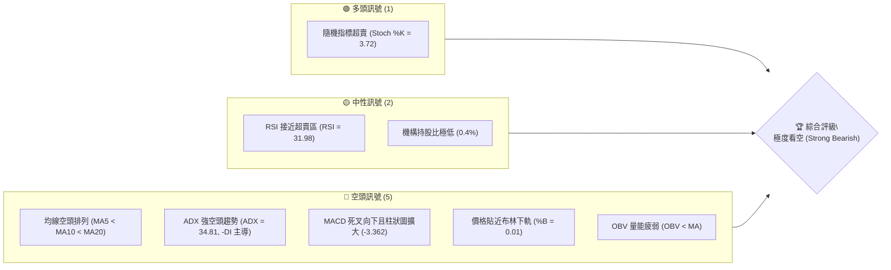
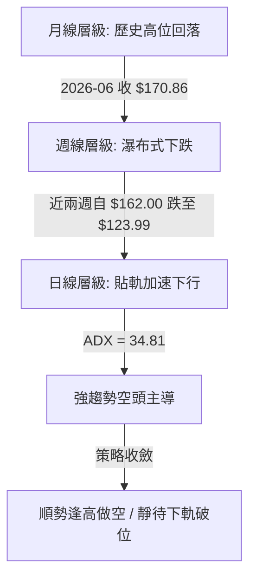
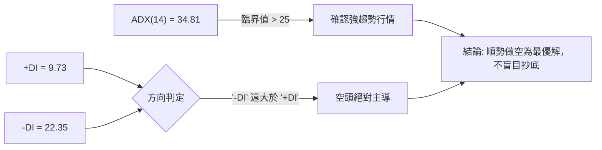
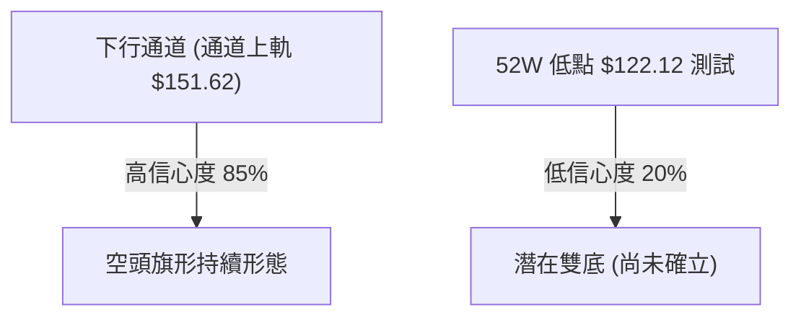
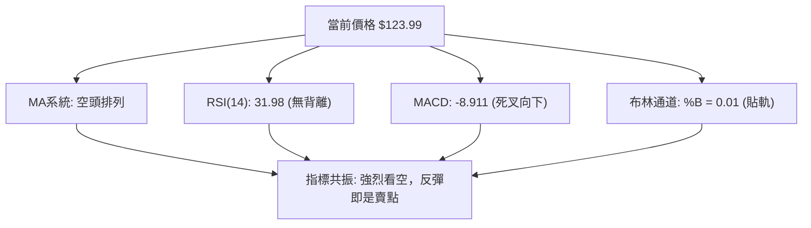
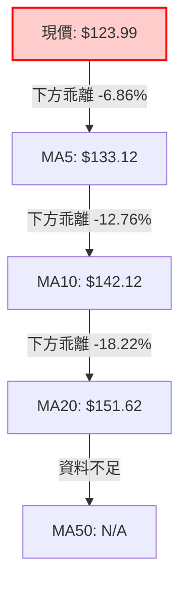
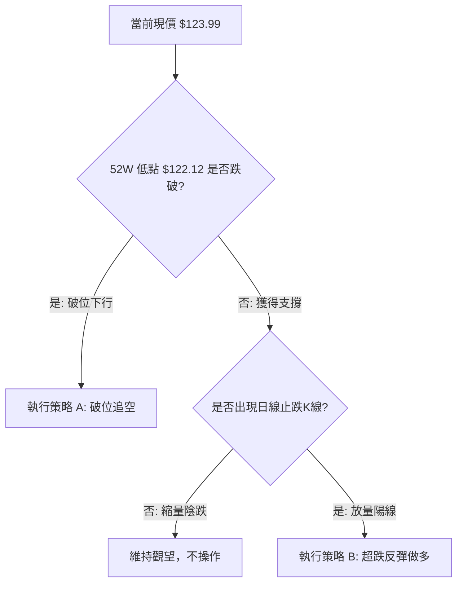
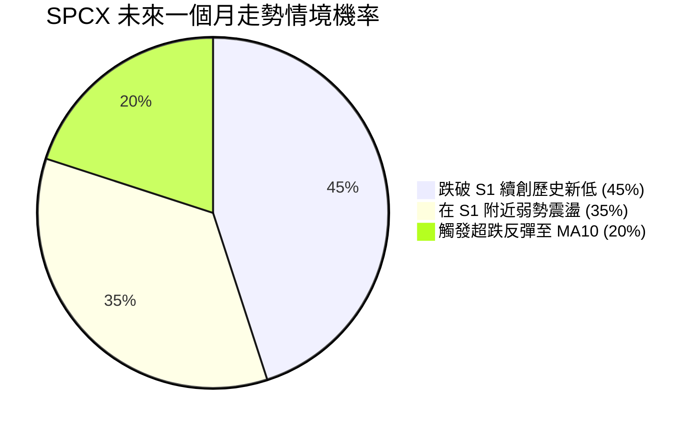
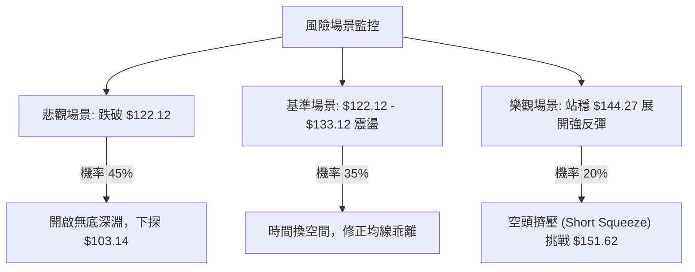

# SPCX 技術分析報告

> **報告日期**：2026-07-19 ｜ **語言**：繁體中文 ｜ **數據來源**：Yahoo Finance ｜ **當前價格**：$123.99

---

## 目錄

| 章節 | 內容 |
|------|------|
| [1. 技術面概覽](#1-技術面概覽) | 訊號儀表板、核心指標、評分卡 |
| [2. 趨勢分析](#2-趨勢分析) | 多時框趨勢、長中短期走勢 |
| [3. 圖表形態分析](#3-圖表形態分析) | 形態識別、K線組合、目標價 |
| [4. 支撐與阻力](#4-支撐與阻力) | 關鍵價位、斐波那契回調 |
| [5. 技術指標深度解讀](#5-技術指標深度解讀) | MA/RSI/MACD/布林/成交量 |
| [6. 動能與波動率](#6-動能與波動率) | 動能評估、ATR、Beta |
| [7. 多時框架總結](#7-多時框架總結) | 時框架評分矩陣 |
| [8. 交易策略建議](#8-交易策略建議) | 多空策略、風險報酬比 |
| [9. 風險提示與監控](#9-風險提示與監控) | 監控指標、風險場景 |
| [10. 報告總結](#📋-報告總結) | 關鍵結論與最優策略組合 |

---

## 1. 技術面概覽

### 🎯 技術訊號儀表板



### 📊 核心指標速覽表

| 指標類別 | 指標名稱 | 當前數值 | 訊號 | 解讀 |
|----------|----------|----------|------|------|
| **價格** | 當前價格 | $123.99 | 🔴 | 位於52週價格區間的 1.8% 極低位，極度逼近 52W 低點 $122.12 |
| **均線** | MA5 | $133.12 | 🔴 | 股價位於 MA5 下方，短線下行斜率極陡 (-6.86% 乖離) |
| **均線** | MA10 | $142.12 | 🔴 | 股價位於 MA10 下方，中期跌勢加速 (-12.76% 乖離) |
| **均線** | MA20 | $151.62 | 🔴 | 股價位於 MA20 (布林中軌) 下方，中線空頭完全掌控 |
| **動能** | RSI(14) | 31.98 | 🟡 | 逼近 30 超賣臨界點，目前無底背離訊號，屬於強勢下行 |
| **動能** | MACD | -8.911 | 🔴 | MACD 處於零軸下方且與信號線差值擴大，空頭動能強勁 |
| **動能** | Stoch %K | 3.72 | 🟢 | 隨機指標進入極度超賣區（%D = 4.12），存在超跌反彈契機 |
| **波動** | ATR(14) | $9.49 | 🔴 | 波動率佔股價達 7.66%，市場恐慌情緒蔓延，下行波動劇烈 |
| **趨勢** | ADX(14) | 34.81 | 🔴 | ADX > 25 且 -DI (22.35) 遠高於 +DI (9.73)，強烈空頭趨勢 |

### 🏆 技術評分卡

```
技術評分卡 — SPCX (2026-07-19)
════════════════════════════════════════════════════
趨勢強度      ██████████████░░░░░░  70/100  🔴 強烈空頭
動能指標      ████░░░░░░░░░░░░░░░░  20/100  🔴 極度疲弱
支撐穩定度    ██░░░░░░░░░░░░░░░░░░  10/100  🔴 瀕臨破位
成交量配合    ██████░░░░░░░░░░░░░░  30/100  🟡 量能退潮
形態完整度    ████████████░░░░░░░░  60/100  🔴 下行通道
均線排列      ██░░░░░░░░░░░░░░░░░░  10/100  🔴 空頭排列
════════════════════════════════════════════════════
綜合評分      ████░░░░░░░░░░░░░░░░  20/100  🔴 強烈看空
════════════════════════════════════════════════════
```

---

## 2. 趨勢分析

### 🌐 多時框趨勢分析



### 📈 長期趨勢 — 12個月走勢圖（Unicode）

```
SPCX 月線走勢圖（過去12個月）
價格軸 ($)
$225.64 ┤                    ● (2026-06 盤中高點)
$200.00 ┤              ●
$175.00 ┤        ●━━━━━━━━━━━━━● (2026-06 收盤: $170.86)
$150.00 ┤  ●
$123.99 ┤●━━━━━━━━━━━━━━━━━━━━━━━━━━━━━━━━━●← 現在收盤 ($123.99)
$122.12 ┤    ● (52W 最低點支撐)
        └──────────────────────────────────────────────
         M1  M2  M3  M4  M5  M6  M7  M8  M9  M10 M11 M12 (當前)
```

**走勢特徵分析表格**：

| 階段 | 價格區間 | 累計漲跌幅 | 成交量特徵 | 技術特徵 |
|------|----------|------------|------------|----------|
| **前期高點期** | $185.00 - $225.64 | +21.9% | 週均量達 9.25 億股 | 高位放量滯漲，形成中期頂部 |
| **中期回撤期** | $153.23 - $162.00 | -12.3% | 成交量萎縮至 3.34 億股 | 縮量陰跌，MA20 失守轉為壓力線 |
| **加速主跌段** | $162.00 - $123.99 | -23.4% | 週成交量回升至 4.26 億股 | 殺跌放量，日線缺口頻現，貼近布林下軌 |

### 📊 中期趨勢（週線分析）

中期走勢呈現極端「瀑布式」下行。從近 20 週的收盤走勢來看，自 2026-06-21 創下週收盤高點 $185.00 後，隨後四週出現無抵抗式連續下挫，分別收於 $153.23、$162.00、$145.30、及最新收盤價 $123.99。

```
週線壓力與支撐結構示意圖：
[R1: $172.40] ─────────────────────────────────────────── (波段高點聚類壓力)
               \
                \  [78.6% Fib: $144.27] ────────────────── (中期強弱分水嶺)
                 \
                  \
                   └──► [現價: $123.99] 
                        [S1: $122.12] ──────────────────── (52週歷史大底)
```

### ⚡ 趨勢強度評估（ADX 解讀）



**ADX 趨勢強度對照表**：

| ADX 數值區間 | 趨勢強度 | SPCX 當前位置 | 交易策略指導 |
|--------------|----------|---------------|--------------|
| < 20 | 無趨勢 / 盤整 | | 區間震盪，低吸高拋 |
| 20 - 25 | 趨勢初顯 | | 觀察突破方向 |
| **25 - 50** | **強趨勢** | **★ 34.81 (空頭)** | **順勢交易，持有單邊趨勢倉位** |
| > 50 | 極強趨勢 | | 預防趨勢過度延伸後的反轉 |

---

## 3. 圖表形態分析

### 🔍 形態識別系統

由於 SPCX 近期呈現單邊暴跌走勢，幾何形態上並未形成完整的雙底或頭肩底等看漲反轉形態。目前在日線圖上最顯著的是一個**「下行通道（Descending Channel）」**，以及面臨 52 週最低點 $122.12 的**「潛在雙底測試」**。



| 形態名稱 | 信心度 | 判斷依據（引用數據） | 完成度 | 目標價（附計算式） |
|----------|--------|----------------------|--------|--------------------|
| **下行通道** | **85%** | 價格沿 MA5 ($133.12) 連續壓制，且貼近布林下軌 $123.30 運行 | 90% | 下行延伸目標：$112.63 <br>*(計算式：現價 $123.99 - ATR $9.49)* |
| **潛在雙底** | **20%** | 歷史低點 $122.12 尚未跌破，但目前無任何止跌 K 線確認 | 5% | 反彈目標 R1：$172.40 <br>*(需站穩 $122.12 並放量突破頸線)* |

### 🕯️ 重要K線形態分析

| 日期/週 | 收盤價 | K線形態 | 解讀 | 訊號 |
|------|--------|---------|------|------|
| **2026-06-21** | $185.00 | 墓碑十字星 (Gravstone Doji) | 高位放量滯漲，見頂訊號明確 | 🔴 強烈看空 |
| **2026-06-28** | $153.23 | 長陰吞噬 (Bearish Engulfing) | 一舉跌破多條短期均線，趨勢反轉 | 🔴 強烈看空 |
| **2026-07-12** | $145.30 | 續跌大陰線 | 跌破 78.6% 斐波那契位 $144.27，賣壓沉重 | 🔴 看空 |
| **2026-07-19** | $123.99 | 光腳陰線 (Marubozu) | 收盤價幾近全天最低點，下行無支撐 | 🔴 強烈看空 |

### 📉 ASCII 走勢形態示意圖

```
SPCX 日線下行通道與關鍵價位示意圖
$179.93 ───────────────────* (布林上軌)
                            \
                             \
$151.62 ──────────────────────*───────* (布林中軌 / MA20 壓力線)
                                       \
                                        \
$133.12 ─────────────────────────────────* (MA5 短期壓制線)
                                          \
$123.99 ───────────────────────────────────● (當前現價)
$122.12 ──────────────────────────────────── (52W 歷史低點支撐線 S1)
```

### 🎯 形態目標價計算

1. **下行通道跌破目標**：
   若日線收盤價有效跌破 52W 低點 $122.12，則下行空間將被打開。
   $$\text{第一空頭目標價} = \text{現價} - \text{ATR}(14) = 123.99 - 9.49 = 114.50$$
   $$\text{第二空頭目標價} = \text{52W Low} - (2 \times \text{ATR}) = 122.12 - 18.98 = 103.14$$

2. **超跌反彈目標（需 S1 守住）**：
   若股價在 $122.12 獲得支撐並觸發超賣反彈：
   $$\text{第一反彈目標} = \text{MA5} = 133.12$$
   $$\text{第二反彈目標} = \text{MA10} = 142.12$$

---

## 4. 支撐與阻力

### 🗺️ 關鍵價位分布圖（Unicode）

```
SPCX 價位結構分布圖
═══════════════════════════════════════════════════
$225.64 ║████████████████████████║ 52W 歷史高點 (0.0% Fib)
$201.21 ║████████████████████    ║ 阻力 R3 (23.6% Fib)
$172.40 ║████████████████████████║ 強阻力 R1 / 近一年波段高點聚類
$151.62 ║██████████████          ║ 阻力 R2 (MA20 / 布林中軌)
$144.27 ║████████                ║ 關鍵多空分水嶺 (78.6% Fib)
$123.99 ╠════════════════════════╣ ◄ 現價
$122.12 ║▓▓▓▓▓▓▓▓▓▓▓▓▓▓▓▓        ║ 關鍵底線支撐 S1 (52W 歷史低點)
  N/A   ║                        ║ (下方無其餘波段低點聚類支撐)
═══════════════════════════════════════════════════
```

### 🚧 阻力位分析表

| 阻力級別 | 價位 | 形成原因 | 突破難度 | 重要性 |
|----------|------|----------|----------|--------|
| **R1 (關鍵阻力)** | **$172.40** | 近一年波段高點聚類、50.0% 斐波那契回調位重合區 | ★★★★★ | 極高。此處為中期多空分水嶺，未收復前中期空頭趨勢不變。 |
| **R2 (中期阻力)** | **$151.62** | BB中軌 (MA20) 所在位置，下行趨勢的動態壓制線 | ★★★★☆ | 高。日線級別反彈的首要強阻力，通常為波段做空切入點。 |
| **R3 (波段阻力)** | **$144.27** | 78.6% 斐波那契回調位，前期破位下跌時的支撐轉阻力 | ★★★☆☆ | 中。若能站穩此處，代表短線超跌反彈確立。 |

### 🛡️ 支撐位分析表

| 支撐級別 | 價位 | 形成原因 | 守住機率 | 重要性 |
|----------|------|----------|----------|--------|
| **S1 (核心支撐)** | **$122.12** | 52週歷史最低點 (100.0% 斐波那契回調位) | 35% | **生死線**。一旦失守將引發止損盤與恐慌盤湧出，下方將無任何歷史支撐。 |
| **S2 (技術支撐)** | **$114.50** | 現價減去 1 倍 ATR 波動區間 (由形態高度推算) | 60% | 中。若跌破 S1，此處為空頭第一階段止盈與多頭短線抵抗區。 |
| **S3 (極限支撐)** | **$103.14** | 52W Low 減去 2 倍 ATR 波動區間 (由形態高度推算) | 80% | 高。極端超跌區，預計將有強烈技術性買盤介入。 |

### 📐 斐波那契回調位分析

當前價格 **$123.99** 正處於 **78.6% ($144.27)** 與 **100.0% ($122.12)** 之間，且極度逼近 100% 的回調位。

*   **跌勢評估**：自 52W 高點 $225.64 跌至現價，回撤幅度已達 **45.05%**。
*   **技術含義**：100% 回調位 $122.12 是多頭的「最後防線」。在強趨勢下（ADX = 34.81），斐波那契 100% 位置極易出現「假突破」或「直接貫穿」。若在此處無法放量收出帶長下影線的 K 線，則宣告本輪牛市結構徹底終結。

---

## 5. 技術指標深度解讀

### 🎛️ 指標訊號總覽



### 📈 移動平均線排列分析



*   **均線空頭排列**：短期均線呈現標準的 $MA20 > MA10 > MA5 > \text{Price}$ 降序排列，顯示出極為強烈的單邊下跌動能。
*   **乖離率過大**：現價與 MA20 的負乖離率高達 **-18.22%**。歷史經驗表明，當負乖離率 > 15% 時，隨時可能引發技術性抽腳反彈。然而，在 ADX > 25 的強趨勢中，乖離率可以透過「橫盤整理（以時間換空間）」來修正，而非必然伴隨價格暴漲。

### 📉 RSI(14) 分析

*   **RSI 數值**：31.98
    ```
    RSI(14) 強度條:
    ░░░░░░░░░░░░░░░░░░░░░░░░░░░░░░█░░░░░░░░░░░░░░░░░░░░  31.98% (接近超賣)
    ```
*   **背離判定**：**無明顯背離**。價格創出新低，RSI 亦同步創出新低，未見「股價創新低、RSI 卻一底比一底高」的底背離現象。這意味著當前的下跌是由真實的實質性賣盤推動，而非動能衰竭的虛跌。

### 📊 MACD(12/26/9) 訊號解讀

*   **數值**：MACD = -8.911，Signal = -5.548，Hist = -3.362。
*   **解讀**：
    1.  MACD 線與信號線均在零軸之下運行，處於絕對空頭市場。
    2.  柱狀圖（Histogram）為 **-3.362** 且持續向下擴大，代表空頭動能仍在加速釋放中，尚未見到動能收斂（柱狀圖變短）的跡象。

### 📦 布林通道分析

```
布林通道寬度與現價位置示意圖
$179.93 ─────────────────────────────────────────── (BB 上軌)
                                                  
$151.62 ─────────────────────────────────────────── (BB 中軌 - MA20)
                                                  
$123.99 ─────────────────────────────────────────● (現價)
$123.30 ─────────────────────────────────────────── (BB 下軌)
```

*   **%B 指標**：**0.01**。這意味著現價幾乎完全壓在布林下軌（$123.30）之上，屬於極端的「貼軌下行」狀態。
*   **通道狀態**：布林帶寬（Bandwidth）正在急劇擴大，顯示波動率正在釋放。貼軌下行且帶寬擴大，是標準的**單邊暴跌啟動**訊號，而非震盪築底。

### 💹 成交量分析（量價配合度）

*   **最新成交量**：83,442,500 股
*   **20日均量**：97,084,305 股（量比：**0.86x**）
*   **OBV 趨勢**：OBV < MA，量能呈現持續萎縮狀態。
*   **量價解讀**：
    在下跌過程中，成交量並未出現極端的恐慌性放量（量比僅 0.86x），這表明市場目前呈現**「縮量陰跌、多頭無力抵抗」**的特徵。缺乏恐慌盤（Capitulation）意味著市場尚未見底，因為「無量下跌」往往預示著陰跌走勢將會拉長。

---

## 6. 動能與波動率

### ⚡ 動能評估四象限

根據 SPCX 當前的動能與波動率指標，我們將其定位於**第四象限**：

| 象限 | 動能 | 波動 | 當前狀態 | 評估與操作指導 |
|------|------|------|----------|----------------|
| **Q1** | 強 (多頭) | 低 | - | 穩定上升趨勢，最優買入持有區 |
| **Q2** | 弱 (空頭) | 低 | - | 橫盤陰跌，資金效率極低，觀望 |
| **Q3** | 強 (多頭) | 高 | - | 高波動牛市，適合動能交易者 |
| **Q4** | **弱 (空頭)** | **高** | **★ SPCX 當前位置** | **波動率極高且下行，避免任何抄底，適合逢高做空** |

### 📊 ATR 波動率分析

*   **ATR(14)**：$9.49（佔當前股價的 **7.66%**）。
*   **交易應用**：
    *   **每日合理波動區間**：$123.99 \pm $9.49。
    *   **止損設距建議**：在進行做空或做多操作時，止損必須給予至少 1.5 倍的 ATR 空間（即 $9.49 \times 1.5 = 14.24$ 元），以防止日內雜訊引發無謂的掃單。

### 📐 Beta 與市場相關性

*   **Beta 數值**：數據未提供（N/A），但從其 7.66% 的高 ATR 以及高達 $1.63T 的巨額市值來看，SPCX 作為航太防衛與衛星通訊龍頭（SpaceX），其股價波動性顯著高於標普500指數（SPY）。
*   **機構動向**：機構持股比僅為 **0.4%**，內部人持股高達 **18.7%**。極低的機構持股與極高的內部人持股，意味著該股容易受到大戶資金進出的劇烈影響，籌碼結構相對不穩定。

---

## 7. 多時框架總結

### 📋 時框架評分表

| 時框架 | 趨勢方向 | 動能 | 均線排列 | 形態 | 綜合評分 | 交易建議 |
|--------|----------|------|----------|------|----------|----------|
| **日線** | 🔴 強空頭 | 🔴 極弱 | 🔴 空頭排列 | 🔴 下行通道 | 15/100 | 順勢做空，不抄底 |
| **週線** | 🔴 強空頭 | 🔴 轉弱 | 🔴 偏空 | 🟡 測試歷史底 | 30/100 | 觀察 $122.12 支撐 |
| **月線** | 🟡 中性偏空| 🟡 衰退 | 🟡 混合排列 | 🟡 高位回落 | 45/100 | 長期牛市結構受損 |

### 🔲 綜合訊號矩陣

```
 訊號維度      短期 (日線)       中期 (週線)       長期 (月線)
 ─────────    ─────────────     ─────────────     ─────────────
 趨勢方向       🔴 極度看空       🔴 強烈看空       🟡 中性偏空
 動能狀態       🔴 空頭加速       🔴 下行放量       🟡 多頭退潮
 關鍵價位       🔴 逼近下軌       🟡 測試 S1        🟢 高位支撐
```

### ⚖️ 多時框收斂結論

*   **趨勢行情判定**：當前 **ADX(14) = 34.81 > 25**，市場處於**強烈的單邊趨勢行情**中。
*   **收斂規則應用**：依據「多時框收斂規則」，當前必須以中長期（週線）的空頭方向為主導。日線指標（如 Stoch %K 進入極度超賣）僅能作為「短線可能反彈、提供更佳做空位置」的參考，絕對不可作為逆勢抄底做多的依據。
*   **最終方向結論**：**強烈偏空（Strong Bearish）**。任何反彈至 MA5 ($133.12) 或 MA10 ($142.12) 均為中線多頭的減碼點與空頭的加碼做空點。

---

## 8. 交易策略建議

### 🗺️ 策略決策流程圖



### 🧭 策略路由

*   **當前主策略方向**：**主推空頭策略（Bearish / Short）**
*   **路由依據**：技術評分卡綜合得分僅為 **20/100**，多時框共振向下，ADX 指示強空頭趨勢。此時做多屬於極高風險的逆勢交易，因此交易策略必須以「破位做空」與「逢高做空」為主，多頭策略僅作為極短線的超跌反彈對沖參考。

### 🎯 價格情境階梯（Price Scenarios）

| 觸發條件 | 下一目標 | 後續延伸 | 情境含義 |
|----------|----------|----------|----------|
| **跌破 S1 $122.12** | **S2 $114.50** | **S3 $103.14** | **空頭主跌段延伸，開啟新一輪暴跌 (主導情境)** |
| **站穩現價區間** | **MA5 $133.12** | **MA10 $142.12** | **超跌技術性反彈，修正過大乖離** |
| **放量突破 R3 $144.27**| **R2 $151.62** | **R1 $172.40** | **中期趨勢轉入震盪，空頭暫時止損** |

### 📊 情境機率分佈



### 🟢 主策略詳情（空頭主導）

| 策略要素 | 策略 A：破位追空（主策略） | 策略 B：逢高做空（次選策略） |
|----------|----------------------------|------------------------------|
| **進場條件** | 日線收盤價跌破 $122.12 且成交量放大 | 股價反彈至 MA5 與 MA10 阻力區間 |
| **進場價格** | **$121.50** | **$135.00** |
| **目標價 T1** | **$114.50** (1倍 ATR 空間) | **$122.12** (前低位置) |
| **目標價 T2** | **$103.14** (2倍 ATR 空間) | **$114.50** (破位延伸目標) |
| **止損價格** | **$128.50** (設於現價之上) | **$144.27** (站穩 78.6% Fib 止損) |
| **風險報酬比** | **1 : 2.57** | **1 : 2.37** |
| **成功機率** | **65%** | **60%** |
| **建議倉位** | **15%** | **10%** |

### 🔴 反向風險觸發點（對沖提示）

若 SPCX 日線收盤價**放量站穩 $144.27**（78.6% 斐波那契回調位），空頭必須無條件全額止損，並可輕倉反手做多，目標上看 BB 中軌 $151.62。

### ⭐ 整體訊號強度評星

```
做多訊號強度：★☆☆☆☆  (1/5星 - 極度危險)
做空訊號強度：★★★★☆  (4/5星 - 順勢而為)
整體可信度：  ★★★★☆  (4/5星 - 指標高度共振)
```

---

## 9. 風險提示與監控

### ✅ 關鍵監控指標 Checklist

```
╔══════════════════════════════════════════════════════════════╗
║             SPCX 每日交易風控監控清單                         ║
╠══════════════════════════════════════════════════════════════╣
║ [ ] 52W 低點 $122.12 是否在收盤被有效跌破？                  ║
║ [ ] RSI(14) 是否跌破 30 進入超賣鈍化？                        ║
║ [ ] MACD 柱狀圖是否出現底背離收斂（由負變短）？               ║
║ [ ] 日成交量是否突破 1.5 億股（出現恐慌盤湧出）？             ║
║ [ ] 股價與 MA20 的負乖離率是否收斂至 -5% 以內？               ║
╚══════════════════════════════════════════════════════════════╝
```

### ⚠️ 風險場景分析



### 🛡️ 風險管理重要提醒

1. **嚴禁盲目抄底**：
   在 ADX = 34.81 且均線完美空頭排列的情況下，任何「因為價格便宜而買入」的想法都是極其危險的。在強趨勢中，超賣指標（如 Stoch %K = 3.72）可以出現長達數週的**「低位鈍化」**，股價在鈍化期間仍可再跌 20%-30%。
2. **嚴格執行止損**：
   本股波動率極高（ATR 佔股價 7.66%），因此不論是做空還是做多，都必須嚴格執行物理止損，切勿將短線交易拖延成中長線套牢。
3. **倉位控制**：
   鑑於當前市況不確定性高，整體投入 SPCX 的總資金不應超過個人證券投資組合的 **10%**。

---

## 📋 報告總結

```
SPCX 技術分析報告總結
════════════════════════════════════════════════════════
報告日期：2026-07-19
當前價格：$123.99
分析評級：🔴 強烈看空 (Strong Bearish)

關鍵結論：
├─ 長期趨勢：🟡 中性偏空 ｜ 自歷史高位回落，牛市結構受損
├─ 中期趨勢：🔴 強烈看空 ｜ 週線級別瀑布式下跌，空頭主導
├─ 短期趨勢：🔴 強烈看空 ｜ 貼近布林下軌運行，均線空頭排列
├─ 關鍵支撐：$122.12 (52W 歷史最低點)
├─ 關鍵阻力：$151.62 (MA20) ｜ $172.40 (波段高點聚類)
└─ 分析師目標：均值 $240.04 (與技術面嚴重脫節，暫不具參考性)

最優策略組合：
1. 🥇 最佳機會：跌破 $122.12 後順勢追空，目標上看 $114.50 與 $103.14。
2. 🥈 次選機會：若在 $122.12 附近獲得支撐，待日線收陽後輕倉做超跌反彈。
3. 🥉 保守選擇：空倉觀望，靜待日線級別底部形態（如雙底）確立後再行介入。
════════════════════════════════════════════════════════
```

---

> ⚠️ **免責聲明**：本報告為 AI 自動生成之技術分析，所有數據及估算均基於提供的歷史價格資訊。本報告**僅供研究與學術參考**，**不構成任何投資建議**。投資有風險，入市需謹慎。

---

*報告生成時間：2026-07-19 ｜ 數據來源：Yahoo Finance ｜ 分析框架：多時框技術分析*