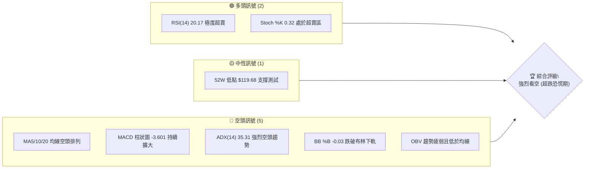
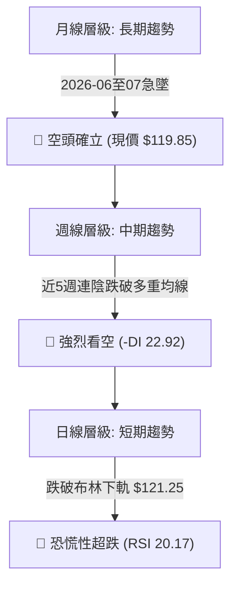
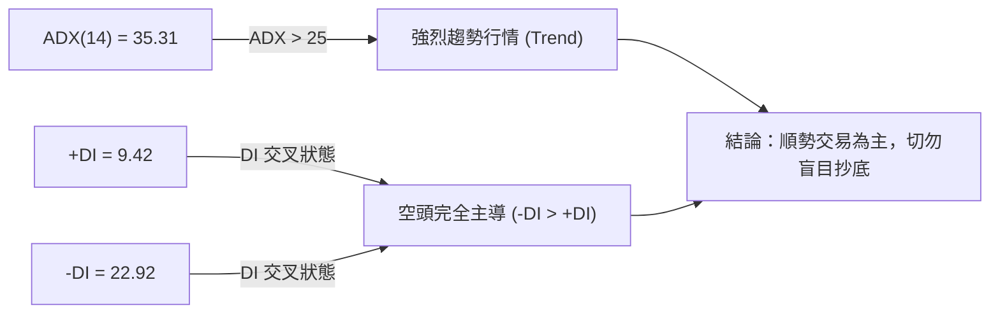
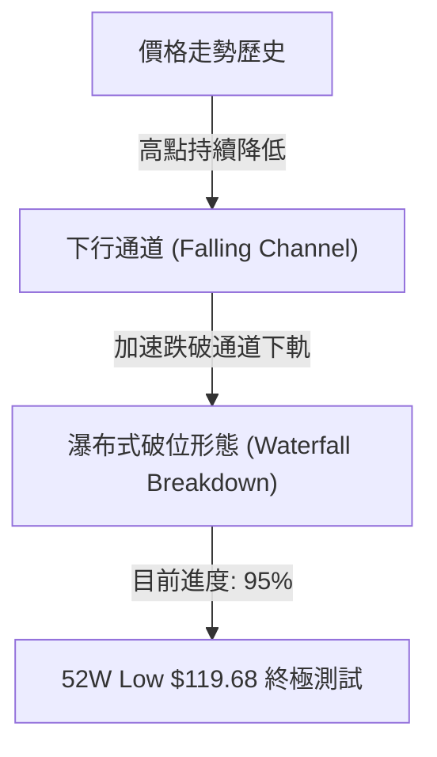
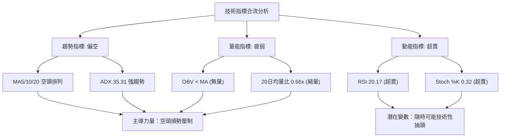
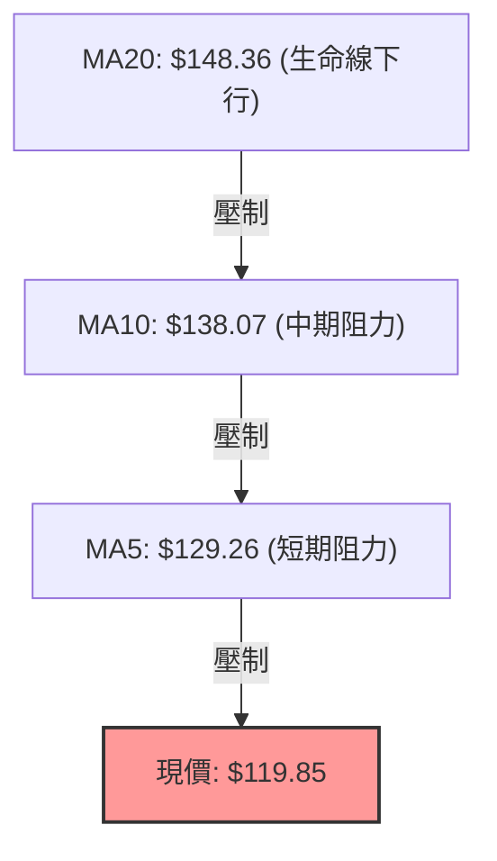
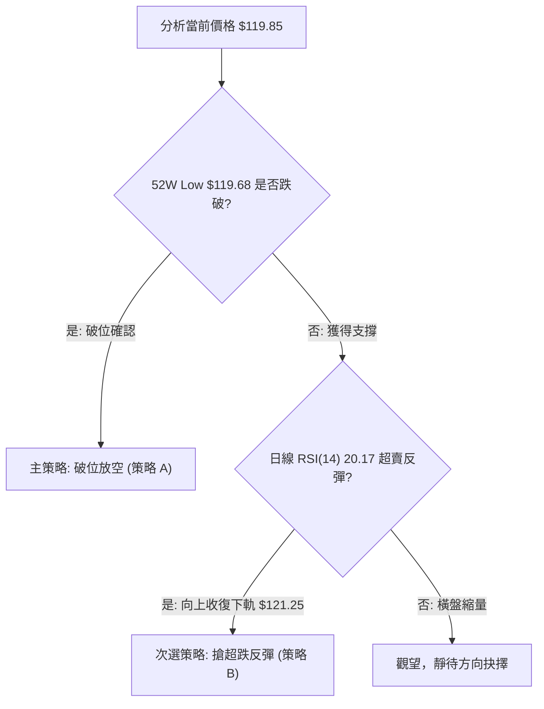
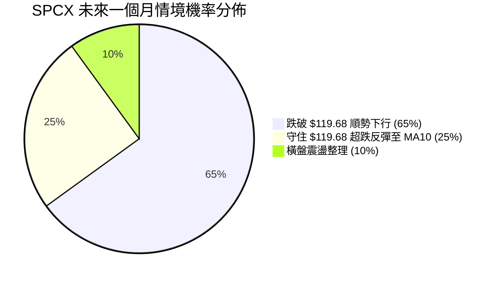
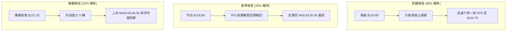

# SPCX 技術分析報告

> **報告日期**：2026-07-21 ｜ **語言**：繁體中文 ｜ **數據來源**：Yahoo Finance ｜ **當前價格**：$119.85

---

## 目錄

| 章節 | 內容 |
|------|------|
| [1. 技術面概覽](#1-技術面概覽) | 訊號儀表板、核心指標、評分卡 |
| [2. 趨勢分析](#2-趨勢分析) | 多時框趨勢、長中短期走勢 |
| [3. 圖表形態分析](#3-圖表形態分析) | 形態識別、K線組合、目標價 |
| [4. 支撐與阻力](#4-支撐與阻力) | 關鍵價位、斐波那契回調 |
| [5. 技術指標深度解讀](#5-技術指標深度解讀) | MA/RSI/MACD/布林/成交量 |
| [6. 動能與波動率](#6-動能與波動率) | 動能評估、ATR、Beta |
| [7. 多時框架總結](#7-多時框架總結) | 時框架評分矩陣 |
| [8. 交易策略建議](#8-交易策略建議) | 多空策略、風險報酬比 |
| [9. 風險提示與監控](#9-風險提示與監控) | 監控指標、風險場景 |

---

## 1. 技術面概覽

### 🎯 技術訊號儀表板



### 📊 核心指標速覽表

| 指標類別 | 指標名稱 | 當前數值 | 訊號 | 解報與技術解讀 |
|----------|----------|----------|------|----------------|
| **價格** | 當前價格 | $119.85 | 🔴 | 價格逼近 52W 最低點 $119.68，下行風險極高 |
| **均線** | MA5 | $129.26 | 🔴 | 價格低於 MA5 達 7.28%，短期下行斜率極陡峭 |
| **均線** | MA10 | $138.07 | 🔴 | 價格低於 MA10 達 13.19%，中期空頭完全主導 |
| **均線** | MA20 | $148.36 | 🔴 | 價格低於 MA20 達 19.22%，生命線失守且下行 |
| **動能** | RSI(14) | 20.17 | 🟢 | 進入極度超賣區（<30），暗示隨時可能出現技術性反彈 |
| **動能** | MACD | -10.049 | 🔴 | MACD線與訊號線雙降，柱狀圖 -3.601 顯示跌勢加速 |
| **波動** | ATR(14) | $8.89 | 🔴 | 波動率高達股價的 7.42%，面臨高波動恐慌性拋售 |
| **趨勢** | ADX(14) | 35.31 | 🔴 | ADX > 25 且 -DI (22.92) 遠高於 +DI (9.42)，空頭強趨勢 |
| **通道** | BB下軌 | $121.25 | 🔴 | %B 為 -0.03，價格跌破布林下軌，呈現異常超跌狀態 |

### 🏆 技術評分卡

```
技術評分卡 — SPCX (2026-07-21)
════════════════════════════════════════════════════
趨勢強度      ██████████████░░░░░░  70/100  🔴 空頭強趨勢
動能指標      ████░░░░░░░░░░░░░░░░  20/100  🟢 極度超賣
支撐穩定度    ██░░░░░░░░░░░░░░░░░░  10/100  🔴 逼近無底深淵
成交量配合    ████████░░░░░░░░░░░░  40/100  🟡 縮量下跌無買盤
形態完整度    ████░░░░░░░░░░░░░░░░  20/100  🔴 瀑布式無底形態
均線排列      ██░░░░░░░░░░░░░░░░░░  10/100  🔴 完美空頭發散
════════════════════════════════════════════════════
綜合評分      █████░░░░░░░░░░░░░░░  25/100  強烈看空 (Bearish)
════════════════════════════════════════════════════
```

---

## 2. 趨勢分析

### 🌐 多時框趨勢分析



### 📈 長期趨勢 — 12個月走勢圖（Unicode）

```
SPCX 月線走勢圖（過去12個月歷史至當前）
價格軸 ($)
$225.64 ┤                                      ● (52W High)
$210.00 ┤                                  ●   
$195.00 ┤                              ●   
$180.00 ┤                          ●   
$165.00 ┤                      ●   
$150.00 ┤                  ●   
$135.00 ┤              ●       
$119.85 ┤━━━━━━━━━━━━━━━━━━━━━━━━━━━━━━━━━━━━━━━━━━━● (當前價格)
$119.68 ┤  ● (52W Low)                                 
         └────────────────────────────────────────────
          M08 M09 M10 M11 M12 M01 M02 M03 M04 M05 M06 M07 (2026)
```

**走勢特徵分析表格**：

| 階段區間 | 價格變動 | 漲跌幅 | 走勢特徵與技術面解讀 |
|----------|----------|--------|----------------------|
| **2025-08 ~ 2026-05** | $119.68 → $225.64 | +88.54% | 緩步推升的主升段，成交量配合溫和，奠定 $225.64 的年內高點。 |
| **2026-06** | $225.64 → $170.86 | -24.28% | 高檔見頂後快速下殺，跌破多條短期均線，多頭獲利了結壓力湧現。 |
| **2026-07 (至今)** | $170.86 → $119.85 | -29.86% | 瀑布式無抵抗下跌，直接測試 52W 最低點支撐 $119.68，市場極度恐慌。 |

### 📊 中期趨勢（週線分析）

週線圖上，SPCX 呈現極其惡劣的連陰走勢。以下為近期壓力與支撐結構示意圖：

```
週線級別價格壓力結構：
[ R1: $172.40 ] ─────────────────── (近一年波段高點聚類 / 50% 斐波那契強阻力)
       ▲
       │ (下行空間打開，無中期均線支撐)
       ▼
[ 現價: $119.85 ] ───────────────── (極度逼近 52W 歷史低點)
[ S1: $119.68 ] ─────────────────── (52W Low / 100% 斐波那契最後防線)
```

### ⚡ 趨勢強度評估（ADX 解讀）



#### ADX 趨勢強度對照表：
*   **ADX < 20**：無趨勢/盤整行情（不適用均線指標）。
*   **20 < ADX < 25**：趨勢正在形成。
*   **25 < ADX < 40**：**強烈趨勢行情（當前 SPCX 處於 35.31，空頭趨勢極強）**。
*   **ADX > 40**：極強趨勢，可能面臨超伸與反轉。

---

## 3. 圖表形態分析

### 🔍 形態識別系統



#### 形態信心度評估表：

| 形態名稱 | 信心度 | 判斷依據（引用數據） | 完成度 | 目標價（附計算式） |
|----------|--------|----------------------|--------|--------------------|
| **下行通道破位** | 85% | 價格持續低於 MA5 ($129.26) 與 MA10 ($138.07)，且跌破布林下軌 $121.25 | 95% | **$110.79** <br>（計算式：現價 $119.85 - ATR $8.89 = $110.96；或通道上軌 $172.40 - 通道寬度 $52.72 = $119.68 破位延伸） |
| **雙底形態** | 15% | 試圖在 52W Low $119.68 構築第二隻腳 | 5% (極低) | **訊號不足，僅做指標型超賣解讀，目前絕非雙底形態** |

### 🕯️ 重要K線形態分析

| 日期/月份 | 收盤價 | K線形態 | 解讀 | 訊號強度 |
|-----------|--------|---------|------|----------|
| **2026-06-21** | $185.00 | 長上影線十字星 | 高檔遭遇強烈拋壓，多頭力竭，趨勢反轉訊號。 | 🔴🔴🔴 |
| **2026-07-12** | $145.30 | 大陰線跌破中軌 | 實體大陰線貫穿布林中軌，宣告中期多頭防線全面失守。 | 🔴🔴🔴🔴 |
| **2026-07-19** | $123.99 | 跳空下行陰線 | 毫無抵抗的跳空下跌，恐慌盤湧出，賣壓加速。 | 🔴🔴🔴🔴🔴 |
| **2026-07-26** | $119.85 | 收窄錘頭線（當前） | 價格在 $119.68 前暫時止步，留有極短下影線，靜待方向抉擇。| 🟡 |

### 📉 ASCII 走勢形態示意圖

```
SPCX 日線破位與超賣反彈預期示意圖
  $172.40 ─── R1 ────────────────────────────────────── (波段高點阻力)
             \
              \  (下行通道壓制)
               \
  $148.36 ──────\── MA20 (布林中軌) ───────────────────
                 \
                  \
  $121.25 ─────────\─ BB下軌 ──────────────────────────
                    \
  $119.85 ───────────● (當前價格，跌破布林下軌)
  $119.68 ────────────- (52W Low 關鍵支撐線)
```

### 🎯 形態目標價計算

由於當前下行趨勢極為強烈（ADX = 35.31），若跌破 52W 最低點 $119.68，將面臨無歷史支撐的「真空區」。
*   **第一下行目標價**：**$110.79**（以 52W 區間破位，扣除一倍 ATR $8.89 計算：$119.68 - $8.89 = $110.79）。
*   **第二下行目標價**：**$101.90**（兩倍 ATR 波動延伸：$119.68 - (2 × $8.89) = $101.90）。

---

## 4. 支撐與阻力

### 🗺️ 關鍵價位分布圖（Unicode）

```
SPCX 價位結構分布圖
═══════════════════════════════════════════════════
$225.64 ║████████████████████████║ 52W High (0.0% Fib)
$200.63 ║████████████████████    ║ 23.6% Fib 阻力
$185.16 ║████████████████████████║ 38.2% Fib 阻力
$172.66 ║████████████████████████║ 50.0% Fib / R1 關鍵阻力 ($172.40)
$160.16 ║██████████████          ║ 61.8% Fib 阻力
$142.36 ║████████                ║ 78.6% Fib 阻力 / MA20 附近
$119.85 ╠════════════════════════╣ ◄ 當前價格
$119.68 ║▓▓▓▓▓▓▓▓▓▓▓▓▓▓▓▓        ║ 52W Low (100% Fib) 終極支撐
═══════════════════════════════════════════════════
```

### 🚧 阻力位分析表

| 阻力級別 | 價位 | 形成原因 | 突破難度 | 重要性 |
|----------|------|----------|----------|--------|
| **R1 (關鍵阻力)** | **$172.40** | 近一年波段高點聚類，高度重合 50% 斐波那契回調位 ($172.66) | ⭐️⭐️⭐️⭐️⭐️ | **極高**。此處為多空長期分水嶺，未收復前中期空頭趨勢不變。 |
| **R2 (波段阻力)** | **$185.16** | 38.2% 斐波那契回調位，前期密集成交區頂部 | ⭐️⭐️⭐️⭐️ | **中高**。反彈至此將遭遇強烈套牢盤解套壓力。 |
| **R3 (強阻力)** | **$200.63** | 23.6% 斐波那契回調位，整數大關 | ⭐️⭐️⭐️⭐️⭐️ | **極高**。多頭波段攻擊的終極目標。 |

### 🛡️ 支撐位分析表

| 支撐級別 | 價位 | 形成原因 | 守住機率 | 重要性 |
|----------|------|----------|----------|--------|
| **S1 (終極防線)** | **$119.68** | 52W 歷史最低點，100% 斐波那契回調位 | ⭐️⭐️ | **至關重要**。一旦跌破，下方將無任何歷史參考支撐，恐引發多頭斷頭潮。 |
| **S2 (推算支撐)** | **$110.79** | 由 52W Low 減去一倍 ATR ($8.89) 推算之波動支撐位 | ⭐️⭐️⭐️ | **中等**。破位後的恐慌盤暫時歇息點。 |
| **S3 (心理支撐)** | **$100.00** | 整數心理關卡，市場共識防守位 | ⭐️⭐️⭐️⭐️ | **高**。破位下行的終極防禦區。 |

### 📐 斐波那契回調位分析

當前價格 $119.85 正處於 52週區間（$119.68 → $225.64）的 **100.0% 回調位 ($119.68)** 邊緣。
*   **技術含義**：SPCX 已經完全回吐了過去一年的所有漲幅。這在技術分析中屬於「極端回檔」。
*   **多空博弈**：100% 回調位通常伴隨著強烈的技術性買盤（抄底資金）與恐慌性止損盤的劇烈碰撞。若此處失守，下行空間將完全被打開；若守住，則有望配合日線 RSI 超賣展開一輪強勁的「超跌反彈」，首要目標為 78.6% 回調位（**$142.36**）。

---

## 5. 技術指標深度解讀

### 🎛️ 指標訊號總覽



### 📈 移動平均線排列分析



*   **排列狀態**：SPCX 的均線系統呈現標準的**空頭完美排列（Bearish Alignment）**。
*   **乖離率分析**：當前價格與 MA20 的負乖離率高達 **-19.22%**。歷史經驗顯示，當負乖離率超過 -15% 時，股價極易出現向均線靠攏的「均值回歸」反彈，但反彈均應視為逃命波或逢高做空契機。

### 📉 RSI(14) 分析

*   **當前數值**：**20.17**
    ```
    RSI(14) 強度條：
    [░░░░                     ] 20.17% (🟢 極度超賣區 < 30)
    ```
*   **背離研判**：
    *   **日線層級**：價格創 52W 新低，RSI 亦同步創下新低（20.17），**無明顯底背離**。這意味著下跌動能尚未衰竭，不宜盲目左側抄底。
    *   **週線層級**：週線 RSI 為 20.2，同樣處於極度超賣狀態，多時框超賣共振。

### 📊 MACD(12/26/9) 訊號解讀


*   **柱狀圖分析**：MACD 柱狀圖在零軸下方持續向下發散（-3.601），顯示空頭殺跌動能仍在釋放，短期內尚未出現黃金交叉或柱狀圖縮短的止跌跡象。

### 📦 布林通道分析

*   **通道寬度**：BB 上軌 $175.47，下軌 $121.25，中軌 $148.36。通道呈現**向下開口擴張**狀態。
*   **現價位置**：當前價格 $119.85 低於下軌 $121.25（%B 為 -0.03），屬於**異常超跌（Out of Band）**。
*   **交易含義**：股價貼著布林下軌「抱軌下跌」，屬於極強勢的空頭特徵。短期內若能收回下軌 $121.25 之上，方能確立短線反彈起點。

### 💹 成交量分析（量價配合度）

*   **數據對比**：最新成交量為 56,940,000，遠低於 20 日均量 86,338,150（量比僅 0.66x）。
*   **量價關係**：
    *   **縮量下跌**：股價逼近 52W 最低點，但成交量並未放大，顯示**市場缺乏恐慌性的「爆量止跌（Climax Volume）」**，亦即尚未出現割肉盤湧出後的買盤承接。
    *   **OBV 趨勢**：OBV < MA，量能指標持續走弱，顯示資金呈淨流出狀態，無主力資金暗中建倉跡象。

---

## 6. 動能與波動率

### ⚡ 動能評估四象限

| 象限 | 動能強度 | 波動率 | 當前狀態 | 交易策略指引 |
|------|----------|--------|----------|--------------|
| **Q1 (強動能/低波動)** | 強 | 低 | - | 穩定趨勢追隨 |
| **Q2 (弱動能/低波動)** | 弱 | 低 | - | 區間震盪操作 |
| **Q3 (強動能/高波動)** | 強 (空頭) | 高 | **✓ (當前 SPCX)** | **高風險順勢做空 / 嚴設止損** |
| **Q4 (弱動能/高波動)** | 弱 | 高 | - | 避開，容易雙向巴掌 |

### 📊 ATR 波動率分析

*   **ATR(14)**：**$8.89**（佔當前股價的 **7.42%**）。
*   **風控應用**：
    *   **合理防守寬度**：由於日波幅高達 $8.89，任何短線交易的止損點必須設定在 1.5 倍 ATR（即 **$13.34**）以上，以防被日常隨機波動「噪音掃單」。
    *   **反彈預期**：若發生技術性反彈，單日反彈幅度亦可輕易達到 $8.89。

---

## 7. 多時框架總結

### 📋 時框架評分表

| 時框架 | 趨勢方向 | 動能 (RSI) | 均線排列 | 形態結構 | 綜合評分 | 交易建議 |
|--------|----------|------------|----------|----------|----------|----------|
| **日線** | 🔴 強烈看空 | 🟢 超賣 (20.17) | 🔴 空頭排列 | 🔴 抱軌下行 | **25/100** | 靜待破位順勢空，或極小倉位博超跌反彈 |
| **週線** | 🔴 強烈看空 | 🟢 超賣 (20.20) | 🔴 空頭排列 | 🔴 連陰破位 | **20/100** | 中期趨勢徹底轉壞，逢反彈皆為空點 |
| **月線** | 🔴 轉向看空 | 🟡 中性偏弱 | 🟡 混合排列 | 🔴 高檔見頂 | **35/100** | 長期多頭趨勢遭到嚴重破壞 |

### ⚖️ 多時框收斂結論

*   **當前行情屬性**：**強趨勢行情（ADX = 35.31 > 25）**。
*   **收斂規則應用**：依據「趨勢行情以中長期方向為主」之規則，週線與日線在空頭方向上達成**高度共振（Perfect Convergence）**。雖然日線與週線 RSI 同步進入極度超賣區，但由於缺乏任何築底形態（信心度極低）與量能配合，**主導趨勢依然為強烈看空**。
*   **唯一方向性結論**：**偏空主導，順勢做空為主。** 任何因超賣引發的反彈，在未收復 MA20 ($148.36) 前，均視為空頭頭寸的加碼點。

---

## 8. 交易策略建議

### 🗺️ 策略決策流程圖



### 🧭 策略路由

*   **當前主策略方向**：**強烈看空（依技術評分 25/100）**。
*   **策略分流說明**：由於綜合評分極低（25/100），本報告**主推空頭策略**。多頭策略僅列為基於「極度超賣」的極短線、高風險博弈性反彈，不作為中期推薦。

### 🎯 價格情境階梯（Price Scenarios）

| 觸發條件 | 下一目標 | 後續延伸 | 情境含義 |
|----------|----------|----------|----------|
| **跌破 52W Low $119.68** | **$110.79** | **$100.00** | **空頭主升段延伸，下行空間完全打開（極高機率）** |
| **守住 $119.68 並收復 $121.25** | **$129.26 (MA5)** | **$138.07 (MA10)** | **超跌技術性反彈，測試短期均線壓力（中等機率）** |
| **強勢突破 R1 $172.40** | **$185.16** | **$200.63** | **中期趨勢反轉（極低機率，需重大利多配合）** |

### 📊 情境機率分佈



---

### 🔴 主策略：順勢放空（空頭策略）

#### 策略 A：跌破 52W Low 順勢追空（破位交易）
*   **進場條件**：日線收盤價明確跌破 52W 最低點 **$119.68**（過濾噪音，建議設置在 **$118.50** 進場）。
*   **進場價格**：**$118.50**
*   **目標價 T1**：**$110.79**（一倍 ATR 波動目標）
*   **目標價 T2**：**$101.90**（兩倍 ATR 波動目標 / 逼近百元大關）
*   **止損價格**：**$123.00**（回歸布林下軌之上，證明破位失敗）
*   **風險報酬比**：
    *   至 T1 = **1.71 : 1**（風險 $4.50，利潤 $7.71）
    *   至 T2 = **3.69 : 1**（風險 $4.50，利潤 $16.60）
*   **成功機率**：**65%**
*   **建議倉位**：**10%**

#### 策略 B：反彈至 MA5/MA10 逢高做空（均值回歸放空）
*   **進場條件**：股價因超賣展開反彈，但在 MA5 ($129.26) 或 MA10 ($138.07) 附近遇阻出現上影線。
*   **進場價格**：**$129.26 ~ $132.00** 區間
*   **目標價 T1**：**$119.68**（前低測試）
*   **目標價 T2**：**$110.79**（破位延伸）
*   **止損價格**：**$138.50**（突破 MA10，宣告反彈擴大）
*   **風險報酬比**：**2.1 : 1**
*   **成功機率**：**60%**
*   **建議倉位**：**8%**

---

### 🟢 次選策略：超跌反彈做多（高風險博弈，僅供風控與激進交易者參考）

*   **進場條件**：股價在 **$119.68** 獲得明確支撐，且日線收盤價重新站穩布林下軌 **$121.25** 之上，配合 RSI 底部金叉。
*   **進場價格**：**$121.50**
*   **目標價 T1**：**$129.26**（MA5 壓力）
*   **目標價 T2**：**$138.07**（MA10 壓力）
*   **止損價格**：**$118.50**（跌破 52W Low 止損）
*   **風險報酬比**：**2.52 : 1**（風險 $3.00，利潤 $7.76 ~ $16.57）
*   **成功機率**：**25%**
*   **建議倉位**：**3% (極輕倉)**

---

### ⭐ 整體訊號強度評星

```
做多訊號強度：★☆☆☆☆  (1/5 星 - 僅具備超賣條件，無築底跡象)
做空訊號強度：★★★★☆  (4/5 星 - 趨勢、均線、通道、動能全面看空)
整體可信度：  ★★★★☆  (4/5 星 - 多時框指標高度共振)
```

---

## 9. 風險提示與監控

### ✅ 關鍵監控指標 Checklist

```
╔══════════════════════════════════════════════════════════════╗
║              SPCX 風險與交易監控清單                          ║
╠══════════════════════════════════════════════════════════════╣
║ [ ] 52W Low $119.68 是否在日線級別失守？ (破位關鍵)         ║
║ [ ] RSI(14) 是否在 20 以下形成鈍化？ (防止盲目抄底被埋)     ║
║ [ ] 成交量是否突破 86,338,150 (20日均量)？ (確認是否有止跌量) ║
║ [ ] MACD 柱狀圖是否開始收縮 (即數值大於 -3.601)？           ║
║ [ ] 布林通道是否開始收口？ (判斷波動率是否見頂)             ║
╚══════════════════════════════════════════════════════════════╝
```

### ⚠️ 風險場景分析



### 🛡️ 風險管理重要提醒

1.  **無底深淵風險**：由於 SPCX 目前處於歷史最低價邊緣（$119.85 距離 $119.68 僅 0.14% 空間），**下方沒有任何歷史密集交易區作為支撐參考**。此時進行任何左側做多（抄底）均屬極高風險行為。
2.  **波動率失控風險**：當前 ATR 高達 $8.89，意味著單日波動極大。空頭持倉必須嚴格執行移動止損，防止極端超賣引發的「無預警暴拉（Short Squeeze）」吞噬利潤。
3.  **資金管理紀律**：建議總持倉比例不超過 10%，且必須嚴格執行單筆交易最大虧損不超過總資金 1% 的風控原則。

---

## 📋 報告總結

```
SPCX 技術分析報告總結
════════════════════════════════════════════════════════
報告日期：2026-07-21
當前價格：$119.85
分析評級：🔴 強烈看空 (Strong Bearish)

關鍵結論：
├─ 長期趨勢：🔴 空頭確立，高檔下墜近 46%
├─ 中期趨勢：🔴 週線連陰，多頭防線全面失守
├─ 短期趨勢：🔴 跌破布林下軌，空頭抱軌下行
├─ 關鍵支撐：$119.68 (52W Low / 100% 斐波那契)
├─ 關鍵阻力：$129.26 (MA5) / $172.40 (R1 強阻力)
└─ 分析師目標：$240.04 (共識，但技術面嚴重脫節)

最優策略組合：
1. 🥇 最佳機會：跌破 $118.50 順勢放空，目標 $110.79 (策略 A)
2. 🥈 次選機會：反彈至 MA5 $129.26 附近遇阻做空 (策略 B)
3. 🥉 保守選擇：徹底觀望，靜待 $119.68 附近放量止跌信號出現
════════════════════════════════════════════════════════
```

---

> ⚠️ **免責聲明**：本報告為 AI 自動生成之技術分析，所有數據及估算均基於提供的歷史價格資訊。本報告**僅供研究與學術參考**，**不構成任何投資建議**。投資有風險，入市需謹慎。

---

*報告生成時間：2026-07-21 ｜ 數據來源：Yahoo Finance ｜ 分析框架：多時框技術分析*