# SPCX 技術分析報告

> **報告日期**：2026-07-22 ｜ **語言**：繁體中文 ｜ **數據來源**：Yahoo Finance ｜ **當前價格**：$123.54

---

## 目錄

| 章節 | 內容 |
|------|------|
| [1. 技術面概覽](#1-技術面概覽) | 訊號儀表板、核心指標、評分卡 |
| [2. 趨勢分析](#2-趨勢分析) | 多時框趨勢、長中短期走勢 |
| [3. 圖表形態分析](#3-圖表形態分析) | 形態識別、K線組合、目標價 |
| [4. 支撐與阻力](#4-支撐與阻力) | 關鍵價位、斐波那契回調 |
| [5. 技術指標深度解讀](#5-技術指標深度解讀) | MA/RSI/MACD/布林/成交量 |
| [6. 動能與波動率](#6-動能與波動率) | 動能評估、ATR、Beta |
| [7. 多時框架總結](#7-多時框架總結) | 時框架評分矩陣 |
| [8. 交易策略建議](#8-交易策略建議) | 多空策略、風險報酬比 |
| [9. 風險提示與監控](#9-風險提示與監控) | 監控指標、風險場景 |

---

## 1. 技術面概覽

### 🎯 技術訊號儀表板

本儀表板綜合展示了 SPCX 當前的多空技術訊號分布。目前市場呈現極端的「空頭趨勢主導，但動能指標嚴重超賣」之格局。

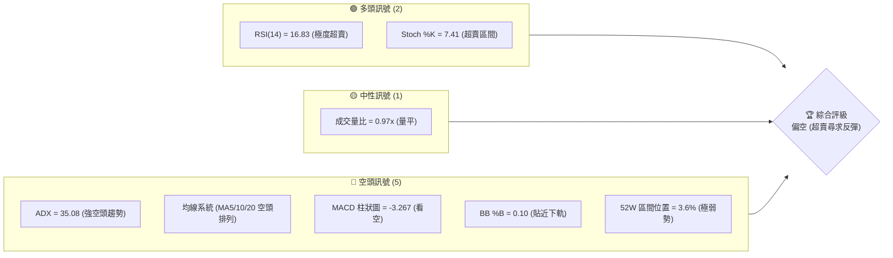

### 📊 核心指標速覽表

| 指標類別 | 指標名稱 | 當前數值 | 訊號 | 解讀 |
|----------|----------|----------|------|------|
| **價格** | 當前價格 | $123.54 | 🔴 | 位於 52 週低點 $119.68 附近（區間 3.6%），極度疲弱 |
| **均線** | MA5 | $126.75 | 🔴 | 價格在 MA5 下方，短期下行斜率陡峭 |
| **均線** | MA10 | $135.47 | 🔴 | 價格在 MA10 下方，短期空頭完全控盤 |
| **均線** | MA20 | $146.80 | 🔴 | 價格在 MA20 下方，中期趨勢嚴重偏空 |
| **動能** | RSI(14) | 16.83 | 🟢 | 進入極度超賣區（<30），隨時可能觸發技術性反彈 |
| **動能** | MACD | -10.533 | 🔴 | MACD 線與信號線（-7.265）死叉向下擴大，動能偏空 |
| **動能** | Stoch %K | 7.41 | 🟢 | 隨機指標進入個位數超賣區，與 RSI 形成超賣共振 |
| **趨勢** | ADX(14) | 35.08 | 🔴 | ADX > 25 且 -DI(21.69) > +DI(11.16)，空頭趨勢極強 |
| **波動** | ATR(14) | $8.84 | 🟡 | 佔股價 7.15%，每日波動劇烈，需寬幅止損 |
| **通道** | BB %B | 0.10 | 🔴 | 價格貼近布林下軌 $117.71，處於下行軌道邊緣 |

### 🏆 技術評分卡

```
技術評分卡 — SPCX (2026-07-22)
════════════════════════════════════════════════════
趨勢強度      ████████████████░░░░  80/100  🔴 空頭強趨勢
動能指標      ████░░░░░░░░░░░░░░░░  20/100  🟢 極度超賣
支撐穩定度    ██████░░░░░░░░░░░░░░  30/100  🔴 逼近最後防線
成交量配合    ██████████░░░░░░░░░░  50/100  🟡 縮量下跌
形態完整度    ████████████░░░░░░░░  60/100  🔴 雙頂破位下行
均線排列      ██░░░░░░░░░░░░░░░░░░  10/100  🔴 完美空頭排列
════════════════════════════════════════════════════
綜合評分      ██████░░░░░░░░░░░░░░  30/100  🔴 強烈偏空
════════════════════════════════════════════════════
```

---

## 2. 趨勢分析

### 🌐 多時框趨勢分析

多時框架分析顯示，SPCX 當前的下行趨勢在所有時間維度上均高度一致。ADX(14) 高達 35.08，表明當前處於強烈的趨勢行情中。根據多時框收斂規則，我們必須以中長期趨勢為主導。

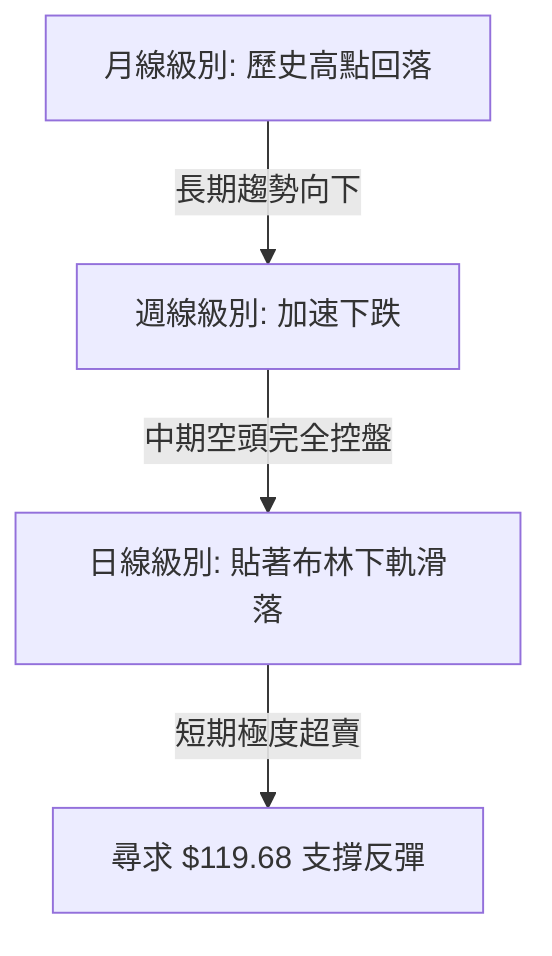

### 📈 長期趨勢 — 12個月走勢圖（Unicode）

以下為 SPCX 過去 12 個月的月線收盤價格走勢圖。可以明顯看出，股價自高點 $225.64 形成雙頂後，於 2026 年中出現斷崖式下跌，目前正逼近 52 週最低點 $119.68。

```
SPCX 月線走勢圖（過去12個月）
價格軸 ($)
$225.64 ┤              ● (52W High)
$200.00 ┤          ●        ●
$180.00 ┤      ●                ●
$160.00 ┤  ●                        ● (2026-06收盤: 170.86)
$140.00 ┤                                ●
$120.00 ┤                                    ● (現價: 123.54)
$119.68 ┤                                    ● (52W Low)
        └──────────────────────────────────────────
          M1   M2  M3  M4   M5  M6   M7  M8  M9  M10 (2026-07)
```

**走勢特徵分析表格**：

| 階段 | 時間區間 | 價格變動 | 走勢特徵 | 成交量特徵 |
|------|----------|----------|----------|------------|
| 階段一 | M1 - M4 | $160 → $225 | 震盪上行，築頂階段 | 溫和放量 |
| 階段二 | M5 - M8 | $225 → $180 | 雙頂成形，高位震盪 | 異常放量，主力派發 |
| 階段三 | M9 - M10 | $180 → $123 | 破位加速下跌，尋底階段 | 殺跌放量，近期縮量 |

### 📊 中期趨勢（週線分析）

從週線級別來看，SPCX 過去 6 週的收盤價呈現連續陰線：
* 2026-06-21 收盤 $185.00，隨後開啟主跌段。
* 2026-07-12 跌破斐波那契 78.6% 回調位（$142.36），收於 $145.30。
* 2026-07-19 進一步暴跌至 $123.99。
* 當前 2026-07-26 週收盤價來到 $123.54，距離 52 週最低點 $119.68 僅有一步之遙。

```
週線級別壓力與支撐示意圖
═══════════════════════════════════════════════════
$172.40 ═══════════════════════════════════════════ 近期關鍵阻力 (R1)
  │
  ▼  (中期主跌段，下行斜率約 -25%)
  │
$142.36 ------------------------------------------- 斐波那契 78.6% 回調位 (已跌破)
  │
$123.54 🔴 [當前價格]
  │
$119.68 ━━━━━━━━━━━━━━━━━━━━━━━━━━━━━━━━━━━━━━━━━━━ 52W 歷史最低支撐 (S1)
═══════════════════════════════════════════════════
```

### ⚡ 趨勢強度評估（ADX 解讀）

當前 ADX(14) 數值為 **35.08**，遠高於 25 的趨勢臨界線，這表明市場處於**極強的單邊趨勢行情**中。

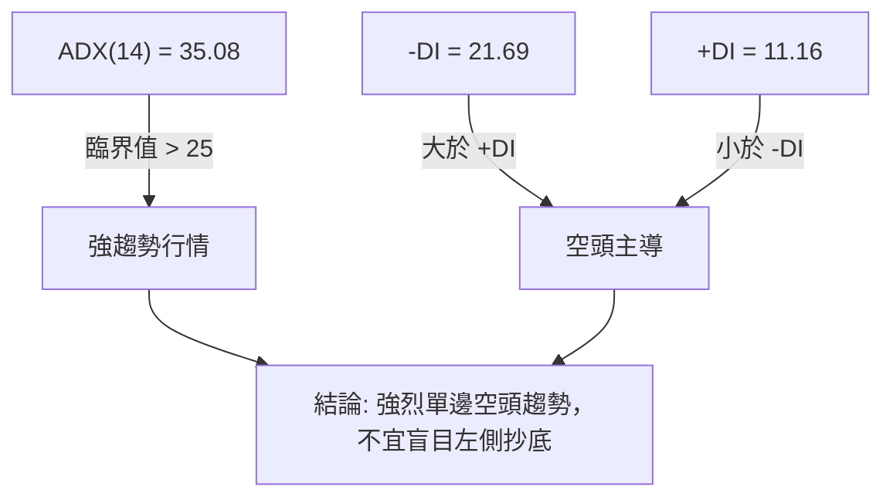

**ADX 強度對照表**：

| ADX 區間 | 趨勢強度 | SPCX 狀態 | 交易策略指導 |
|----------|----------|-----------|--------------|
| < 20 | 無趨勢 / 盤整 | | 區間震盪，高拋低吸 |
| 20 - 25 | 趨勢初顯 | | 關注突破方向 |
| 25 - 50 | 強趨勢 | **✓ (35.08)** | **順勢交易，避免逆勢摸頂/抄底** |
| > 50 | 極強趨勢 | | 趨勢可能過度延伸，預防反轉 |

---

## 3. 圖表形態分析

### 🔍 形態識別系統

在日線與週線圖表上，SPCX 展現出了經典的頂部反轉與下行通道形態。

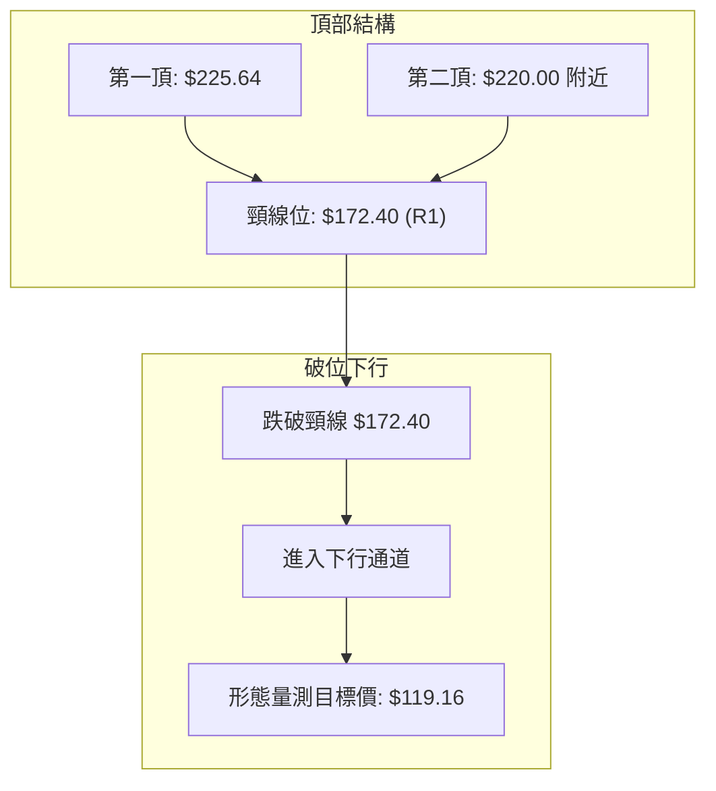

**形態信心度評估**：

| 形態 | 信心度 | 判斷依據（引用數據） | 完成度 | 目標價（附計算式） |
|------|--------|----------------------|--------|--------------------|
| **雙頂 (Double Top)** | **90%** 🟢 | 兩次高點無法突破 $225.64，隨後放量跌破頸線 $172.40。 | 100% | **$119.16**<br/>計算式：$172.40 - ($225.64 - $172.40) = $119.16 |
| **下行通道 (Down Channel)** | **85%** 🟢 | 價格受制於 MA5 ($126.75) 與 MA10 ($135.47) 的壓制，沿著布林下軌滑落。 | 85% | **$119.68**<br/>通道下軌支撐與 52W Low 重合。 |

### 🕯️ 重要K線形態分析

| 日期/月份 | 收盤價 | K線形態 | 解讀 | 訊號 |
|-----------|--------|---------|------|------|
| 2026-06 | $170.86 | **大陰線破位** | 跌破雙頂頸線 $172.40，確認中期頭部成立，空頭動能爆發。 | 🔴 強烈看空 |
| 2026-07-12 | $145.30 | **跳空長陰線** | 跌破 78.6% 斐波那契位 $142.36 之前的加速段，跳空缺口未補。 | 🔴 看空持續 |
| 2026-07-19 | $123.99 | **無下影線大陰線** | 賣壓沉重，收盤幾乎在最低點，顯示多頭毫無抵抗力。 | 🔴 極度看空 |
| 2026-07-26 | $123.54 | **低位十字星/小陰線** | 跌勢出現微弱放緩，配合 RSI 極度超賣，暗示有技術性反彈需求。 | 🟡 止跌信號待確認 |

### 📉 ASCII 走勢形態示意圖

以下展示雙頂破位與下行通道的幾何幾何結構：

```
SPCX 雙頂與下行通道破位示意圖
$225.64 ┤      ★(頂1)        ★(頂2)
         │     /  \          /  \
$172.40 ┤────/────\────────/────\──── (頸線破位 R1)
         │                 /      \
$142.36 ┤────────────────/────────\── (78.6% 斐波那契位)
         │                          \
         │                           \  (下行通道)
$123.54 ┤─────────────────────────────● [當前現價]
         │                             \
$119.68 ┤━━━━━━━━━━━━━━━━━━━━━━━━━━━━━━━★ (52W Low 關鍵支撐 S1)
```

### 🎯 形態目標價計算

1. **雙頂量測目標價**：
   * 頂部最高點：$225.64
   * 頸線（R1）：$172.40
   * 形態高度：$225.64 - $172.40 = $53.24
   * 破位向下量測目標：$172.40 - $53.24 = **$119.16**
2. **分析**：
   * 該幾何形態目標價 $119.16 與 52 週最低點 **$119.68** 極為接近（僅差 0.43%）。這意味著當前下行趨勢已基本完成了雙頂形態的完整量測跌幅，**$119.68 - $119.16 區間將構成極強的結構性支撐區域**。

---

## 4. 支撐與阻力

### 🗺️ 關鍵價位分布圖（Unicode）

SPCX 當前的價格結構呈現「上方阻力重重，下方孤軍奮戰」的態勢。

```
SPCX 價位結構分布圖
═══════════════════════════════════════════════════
$225.64 ║████████████████████████║ 52W High / 0.0% 斐波那契
$200.63 ║████████████████████    ║ 23.6% 斐波那契
$185.16 ║████████████████████████║ 38.2% 斐波那契
$172.66 ║████████████████████████║ 50.0% 斐波那契 / 頸線重合區
$172.40 ║████████████████████████║ 關鍵阻力 R1 (近一年波段高點聚類)
$142.36 ║▓▓▓▓▓▓▓▓▓▓▓▓▓▓▓▓        ║ 78.6% 斐波那契 (前支撐轉阻力)
$123.54 ╠════════════════════════╣ ◄ 當前價格 $123.54
$119.68 ║████████████████████████║ 關鍵支撐 S1 (52W Low / 100% 斐波那契)
═══════════════════════════════════════════════════
```

### 🚧 阻力位分析表

根據歷史數據，SPCX 上方存在以下關鍵阻力位：

| 阻力級別 | 價位 | 形成原因 | 突破難度 | 重要性 |
|----------|------|----------|----------|--------|
| **R1** | **$172.40** | 近一年波段高點聚類、雙頂頸線、50% 斐波那契位 ($172.66) 重合區。 | 🔴 極高 | **牛熊分界線**。此位不收復，中期空頭趨勢無法逆轉。 |
| **R2** | **$185.16** | 38.2% 斐波那契回調位，前期密集成交區。 | 🔴 高 | 中期反彈的強壓力位。 |
| **R3** | **$200.63** | 23.6% 斐波那契回調位。 | 🟡 中 | 長期多頭收復失地的關鍵關口。 |

### 🛡️ 支撐位分析表

數據顯示，當前價格下方**未偵測到低於現價的 swing-low 支撐**。因此，52 週最低點即為最後的防線。

| 支撐級別 | 價位 | 形成原因 | 守住機率 | 重要性 |
|----------|------|----------|----------|--------|
| **S1** | **$119.68** | 52 週最低點（52W Low）、100% 斐波那契回調位、雙頂形態量測目標終點 ($119.16) 重合區。 | 🟡 50% | **多頭生死線**。一旦跌破，將開啟無支撐的「自由落體」探底模式。 |

### 📐 斐波那契回調位分析

當前價格 **$123.54** 處於斐波那契 78.6% ($142.36) 與 100% ($119.68) 之間：
* **現價距離 S1 ($119.68) 僅有 3.22%**。
* 由於股價已深幅回撤了整波牛市的 100%，表明前期的上漲動能已被完全蠶食。在此位置，市場將面臨方向性選擇：是在 $119.68 形成「雙底」或進行超賣反彈，還是破位下行。

---

## 5. 技術指標深度解讀

### 🎛️ 指標訊號總覽

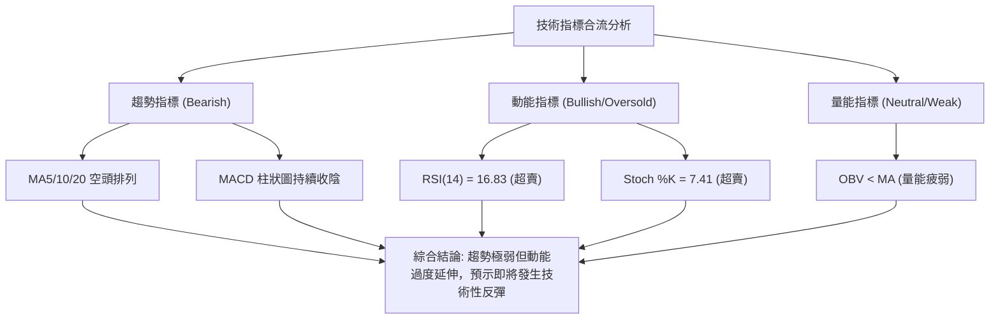

### 📈 移動平均線排列分析

SPCX 的均線系統呈現標準的「空頭排列」，價格在所有短期均線下方運行，下行趨勢極為陡峭。

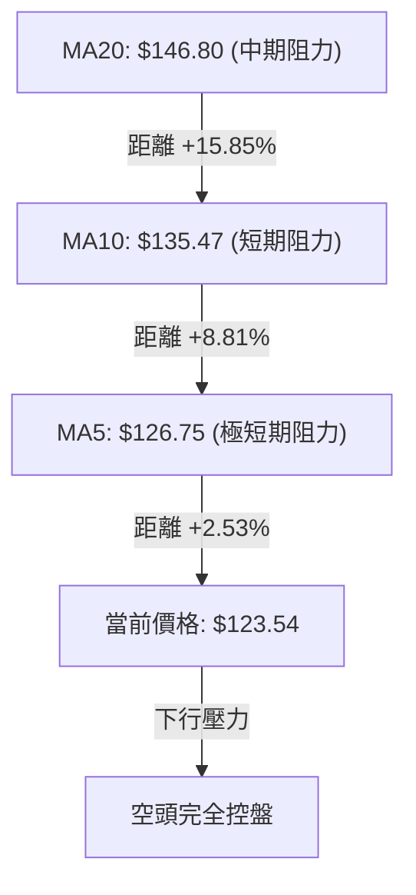

* **MA5 ($126.75)**：當前最直接的阻力。股價需首先站穩 MA5 才能暫緩日線級別的連跌。
* **MA20 ($146.80)**：中期多空分水嶺。只要股價在 MA20 以下，任何反彈都只能視為「熊市反彈」。

### 📉 RSI(14) 分析

當前 RSI(14) 數值為 **16.83**：

```
RSI(14) 強度顯示
░░░░░░░░░ [16.83] ░░░░░░░░░░░░░░░░░░░░░░░░░░░░░░░░░░░░
0          30 (超賣區)                                100
```

* **超賣深度**：RSI 降至 20 以下屬於「極端超賣」狀態。歷史數據表明，當 RSI 達到此種低位時，通常伴隨著空頭回補與短線搶反彈資金的入場。
* **背離分析**：**無明顯背離**。價格創出新低，RSI 同步創出新低。這意味著雖然超賣，但下跌動能是真實且強勁的，反彈可能只是短暫的，而非趨勢反轉。

### 📊 MACD(12/26/9) 訊號解讀

* **MACD 線**：-10.533
* **Signal 信號線**：-7.265
* **MACD 柱狀圖**：-3.267 (🔴 看空)

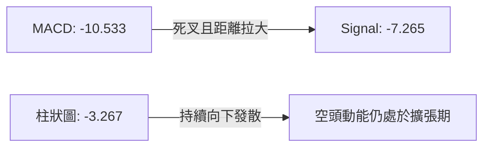

MACD 雙線在零軸下方持續向下發散，且柱狀圖未見明顯縮短，表明中期下跌動能尚未衰竭，不排除在反彈前還有最後一次恐慌性拋售。

### 📦 布林通道分析

* **布林上軌**：$175.90
* **布林中軌 (MA20)**：$146.80
* **布林下軌**：$117.71
* **BB %B**：0.10

```
布林通道現價位置示意圖
$175.90 ─────────────────────────────────────────── BB 上軌
         │
$146.80 ─────────────────────────────────────────── BB 中軌 (MA20)
         │
$123.54 ─────────────● [現價]
$117.71 ─────────────────────────────────────────── BB 下軌
```

* **通道寬度**：布林通道帶寬較寬，表明波動率維持在高位。
* **%B 解讀**：%B 僅為 0.10，價格極度貼近下軌 $117.71。一般而言，當 %B 降至 0 附近時，價格容易受到通道下軌的支撐而產生向中軌（$146.80）靠攏的均值回歸需求。

### 💹 成交量分析（量價配合度）

* **最新成交量**：79,340,100
* **20日均量**：81,865,830
* **量比**：0.97x

當前股價在暴跌過程中，成交量並未出現恐慌性放量（量比 0.97x，基本與均量持平）。
* **量價背離分析**：OBV < MA，量能疲弱。這種「無量下跌」或「均量下跌」表明市場缺乏主動性買盤支撐，屬於多頭棄守導致的陰跌。在沒有見到放量長下影線（恐慌盤湧出、主力接盤）之前，底部很難真正確立。

---

## 6. 動能與波動率

### ⚡ 動能評估四象限

根據 SPCX 當前的動能與波動率指標，其在動能評估矩陣中處於 **Q4（弱動能、高波動）** 象限。

| 象限 | 動能 | 波動 | 當前狀態 | 評估與交易指導 |
|----------|------|------|----------|----------------|
| **Q1** | 強 (看多) | 低 | | 穩步上漲，適合持股或加碼 |
| **Q2** | 弱 (看空) | 低 | | 陰跌或窄幅震盪，觀望為主 |
| **Q3** | 強 (看多) | 高 | | 暴漲暴跌，適合動能突破交易 |
| **Q4** | **弱 (看空)** | **高** | **✓ (SPCX 當前狀態)** | **高風險！空頭加速段，適合順勢做空或等待極端超賣後的左側超短線反彈。** |

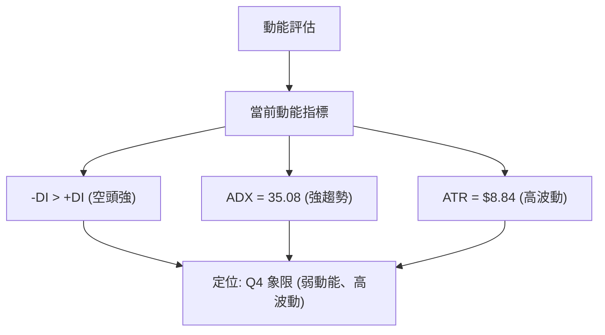

### 📊 ATR 波動率分析

* **ATR(14)**：**$8.84**（佔當前股價的 **7.15%**）。
* **止損與倉位控制建議**：
  * 由於 ATR 高達 $8.84，這意味著 SPCX 的日內波幅極大。
  * **技術止損距離**：建議設置在 $119.68（52W Low）下方至少 1.5 倍 ATR 處，即約 $119.68 - (1.5 × $8.84) = $106.42。
  * **倉位管理**：高 ATR 意味著必須降低單筆交易的持倉權重，建議不超過總資金的 **5% - 10%**，以防單日極端波動導致爆倉。

### 📐 Beta 與市場相關性

雖然 Beta 數據未提供，但從其 aerospace & defense 產業屬性及近期與大盤脫鉤的走勢來看，SPCX 展現出了極強的個股特異性風險（Idiosyncratic Risk）。其高波動主要由 Starlink 衛星發射進度、SpaceX 航天器測試等基本面事件驅動，與標普 500 指數的短期相關性較低。

---

## 7. 多時框架總結

### 📋 時框架評分表

| 時框架 | 趨勢方向 | 動能 (RSI) | 均線排列 | 形態 | 綜合評分 | 交易建議 |
|--------|----------|------------|----------|------|----------|----------|
| **日線 (Daily)** | 🔴 強烈看空 | 🟢 極度超賣 (16.83) | 🔴 空頭排列 | 🔴 下行通道中 | **35/100** | 觀望，或在 $119.68 附近博超短線反彈。 |
| **週線 (Weekly)** | 🔴 看空 | 🔴 超賣邊緣 (29.1) | 🔴 空頭排列 | 🔴 雙頂破位 | **25/100** | 順勢做空，目標看向 $119.68。 |
| **月線 (Monthly)** | 🟡 中性偏空 | 🟡 中性 | 🟡 混合排列 | 🟡 高位築頂後回落 | **40/100** | 長期觀望，等待底部結構確立。 |

### 🔲 綜合訊號矩陣

```
            短期 (日線)      中期 (週線)      長期 (月線)
趨勢方向       🔴 空頭          🔴 空頭          🟡 中性偏空
動能指標       🟢 超賣          🔴 偏空          🟡 中性
均線系統       🔴 空頭          🔴 空頭          🟡 混合
關鍵支撐       S1: $119.68     S1: $119.68     無歷史 swing-low
```

### ⚖️ 多時框收斂結論

根據**多時框收斂規則 14**：
* 當前 **ADX = 35.08 > 25**，市場處於**強趨勢行情**中。
* 必須以中長期（週線、MA 均線）方向為主導。週線與均線系統均指向強烈空頭，日線的 RSI 超賣僅能用來尋找短期的反彈出場點或超短線左側交易機會，不能作為長線反轉的依據。
* **唯一方向性結論**：**整體趨勢強烈看空**。主交易邏輯為「順勢反彈做空」或「破位追空」。唯有在價格跌至 $119.68 且日線 RSI 出現底背離時，方可嘗試小倉位做多。

---

## 8. 交易策略建議

### 🗺️ 策略決策流程圖

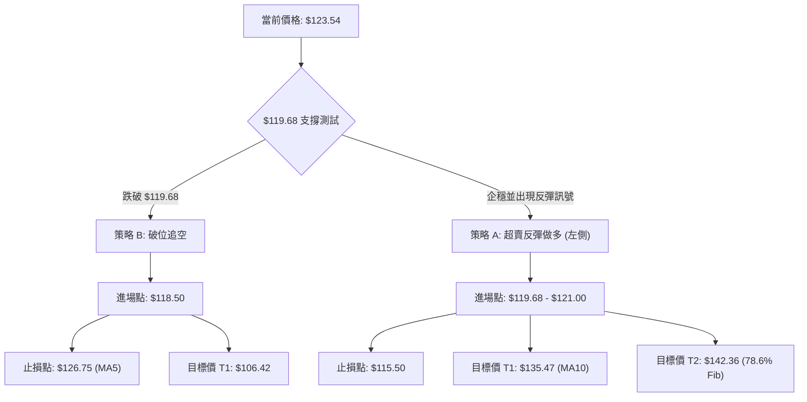

### 🧭 策略路由（依評分卡分流）

* **當前主策略方向**：**區間/破位偏空交易（綜合評分：30/100）**。
* 由於評分極低，多頭策略僅限於在最後防線 $119.68 處的極短線博弈，且必須嚴格止損。

### 🎯 價格情境階梯（Price Scenarios）

以當前價格 $123.54 為基準：

| 觸發條件 | 下一目標 | 後續延伸 | 情境含義 |
|----------|----------|----------|----------|
| **向上突破 MA5 ($126.75)** | MA10 ($135.47) | 78.6% 斐波那契 ($142.36) | 超賣引發的技術性反彈 |
| **站穩現價區間 ($120 - $125)** | — | — | 築底震盪，多空拉鋸 |
| **跌破 S1 ($119.68)** | $115.50 | $106.42 (1.5x ATR 延伸) | 破位下行，空頭加速段 |

### 📊 情境機率分佈

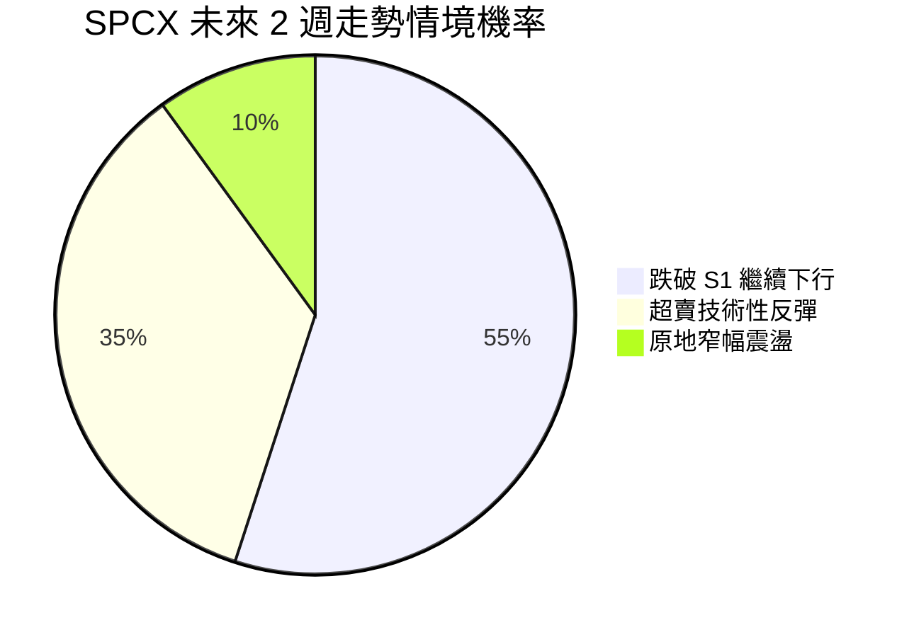

* **跌破 S1 繼續下行 (55%)**：ADX 強勢，均線壓制力極強。
* **超賣技術性反彈 (35%)**：RSI 16.83 隨時可能引發空頭回補。
* **原地窄幅震盪 (10%)**：市場等待基本面消息。

### 🟢 交易策略詳情

#### 策略 A：左側超賣反彈做多（高風險、逆勢博弈）

* **進場條件**：股價回落至 $119.68 - $121.00 區間，且 1 小時圖出現止跌 K 線（如錘頭線）。
* **進場價格**：**$120.50**
* **目標價 T1**：**$126.75** (MA5 壓制位)
* **目標價 T2**：**$135.47** (MA10 強阻力)
* **止損價格**：**$115.50** (跌破 52W Low 且留有餘地)
* **風險報酬比**：**1 : 3** (風險 $5.00，預期收益 $14.97)
* **成功機率**：**35%**
* **建議倉位**：**3%** (極輕倉)

#### 策略 B：順勢破位做空（高勝率、順勢交易）

* **進場條件**：日線收盤價強勢跌破 52W Low $119.68。
* **進場價格**：**$118.50** (確認破位後進場)
* **目標價 T1**：**$106.42** (S1 下方 1.5 倍 ATR 處)
* **目標價 T2**：**$100.00** (整數心理關口)
* **止損價格**：**$126.75** (重新站回 MA5 上方)
* **風險報酬比**：**1 : 2.2** (風險 $8.25，預期收益 $18.50)
* **成功機率**：**55%**
* **建議倉位**：**8%** (標準倉位)

### 🔴 反向風險觸發點（對沖提示）

若股價放量突破 **$126.75 (MA5)**，表明短期下跌斜率被破壞，應立即平掉所有空單，並在 $135.47 附近尋求重新建空。

### ⭐ 整體訊號強度評星

```
做多訊號強度：★★☆☆☆  (2/5星 - 僅依賴 RSI 超賣)
做空訊號強度：★★★★☆  (4/5星 - 趨勢與均線完美共振)
整體可信度：  ★★★☆☆  (3.5/5星 - 臨近 52W Low，變數增加)
```

---

## 9. 風險提示與監控

### ✅ 關鍵監控指標 Checklist

```
╔══════════════════════════════════════════════════════════════╗
║              SPCX 每日風控監控清單                             ║
╠══════════════════════════════════════════════════════════════╣
║ [ ] 52W Low $119.68 是否在收盤價被有效跌破？                  ║
║ [ ] RSI(14) 是否從 <20 極端超賣區回升至 30 以上？             ║
║ [ ] 日成交量是否突破 1 億股（出現恐慌盤溢出）？               ║
║ [ ] MACD 柱狀圖是否出現連續兩日縮短（綠柱變短）？              ║
║ [ ] 股價是否站上 MA5 ($126.75)？                             ║
╚══════════════════════════════════════════════════════════════╝
```

### ⚠️ 風險場景分析

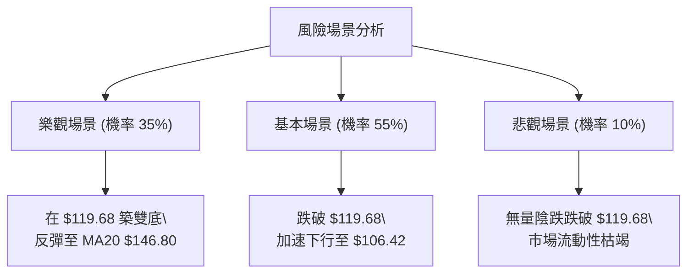

### 🛡️ 風險管理重要提醒

1. **嚴防破位無底洞**：由於當前價格下方無任何歷史 swing-low 支撐，跌破 $119.68 後將進入「價格真空區」。**絕對禁止無止損的死扛多單**。
2. **警惕假突破/假破位**：在 $119.68 關鍵心理關口，主力資金可能製造「盤中跌破但收盤拉回」的假破位（Spring 形態）來清洗浮動籌碼。因此，**策略 B 的破位做空，建議以日線收盤價跌破為確認信號**。
3. **波動率管理**：ATR(14) 為 $8.84，意味著日波幅極大，任何交易的止損必須給予足夠的空間，切忌滿倉操作。

---

## 📋 報告總結

```
SPCX 技術分析報告總結
════════════════════════════════════════════════════════
報告日期：2026-07-22
當前價格：$123.54
分析評級：⚖️ 偏空 (極度超賣，關注 $119.68 生死線)

關鍵結論：
├─ 長期趨勢：🔴 看空 (雙頂破位，下行趨勢成形)
├─ 中期趨勢：🔴 看空 (週線連陰，受制於下行通道)
├─ 短期趨勢：🟢 超賣 (RSI 16.83 預示有技術性反彈需求)
├─ 關鍵支撐：$119.68 (52W Low)
├─ 關鍵阻力：$126.75 (MA5) / $172.40 (頸線)
└─ 分析師平均目標價：$240.04 (與技術面嚴重背離，謹防基本面陷阱)

最優策略組合：
1. 🥇 最佳機會：等待跌破 $119.68 後，順勢做空 (策略 B)
2. 🥈 次選機會：在 $119.68 - $121.00 區域輕倉博超賣反彈 (策略 A)
3. 🥉 保守選擇：保持觀望，等待日線級別出現明確的底背離或築底結構
════════════════════════════════════════════════════════
```

---

> ⚠️ **免責聲明**：本報告為 AI 自動生成之技術分析，所有數據及估算均基於提供的歷史價格資訊。本報告**僅供研究與學術參考**，**不構成任何投資建議**。投資有風險，入市需謹慎。

---

*報告生成時間：2026-07-22 ｜ 數據來源：Yahoo Finance ｜ 分析框架：多時框技術分析*