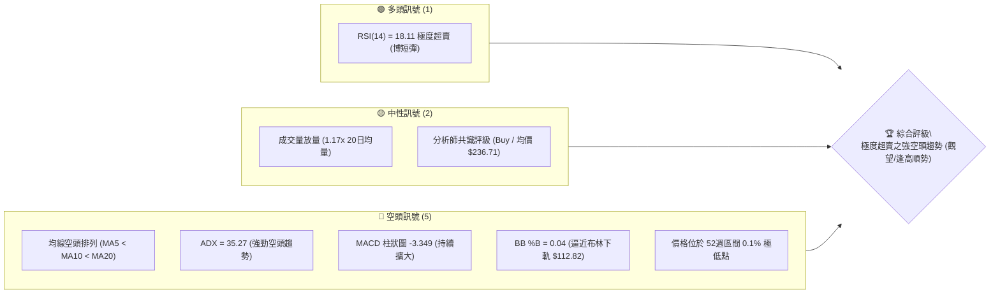
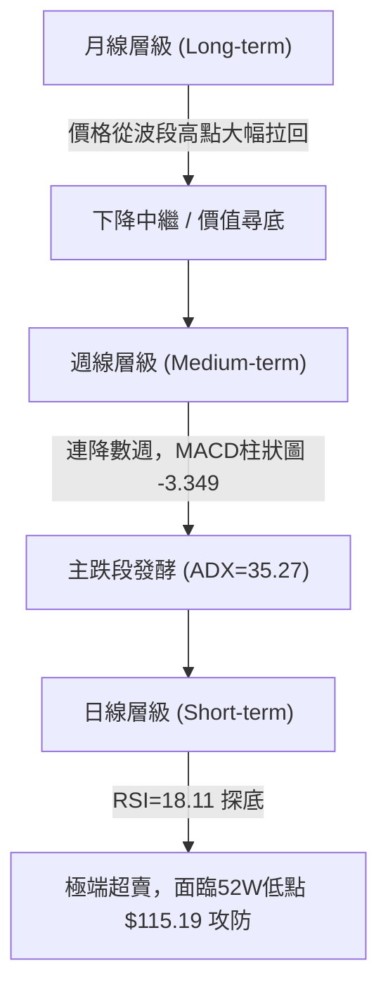
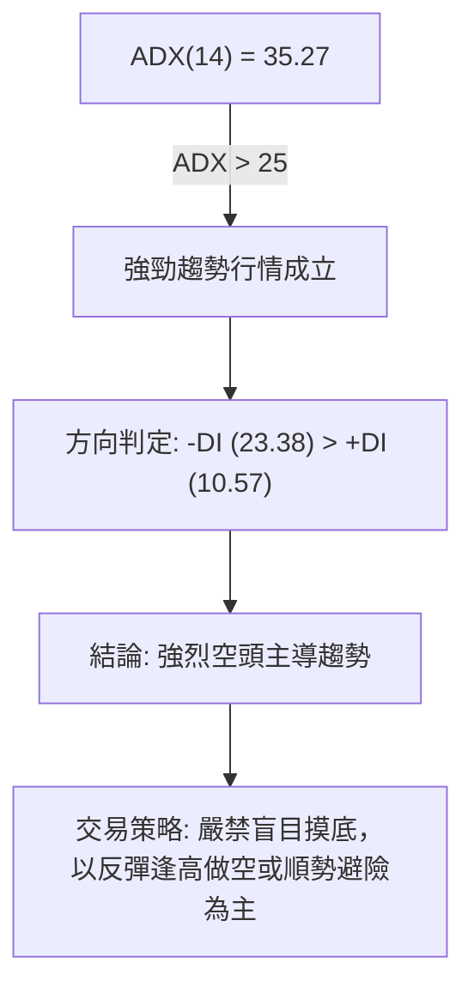
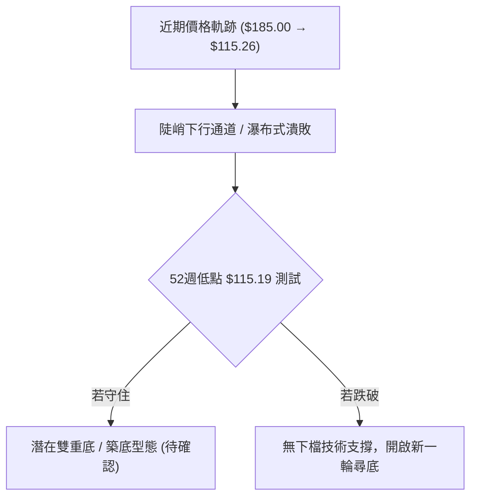
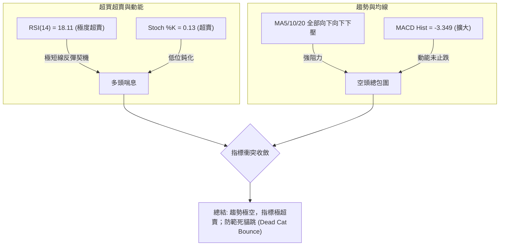
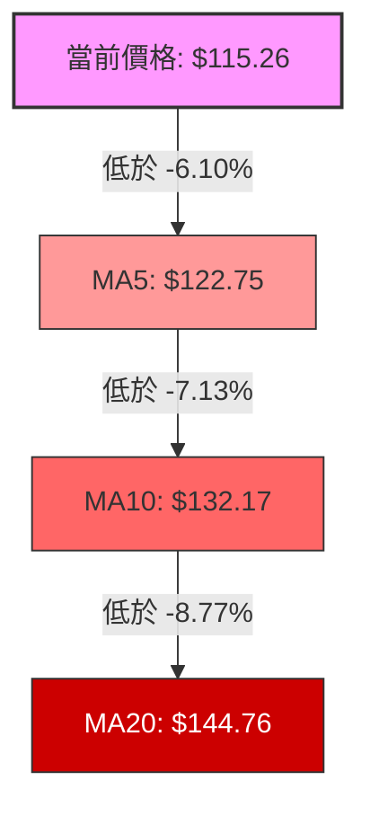
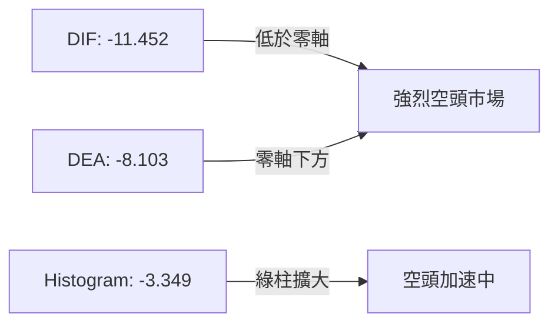
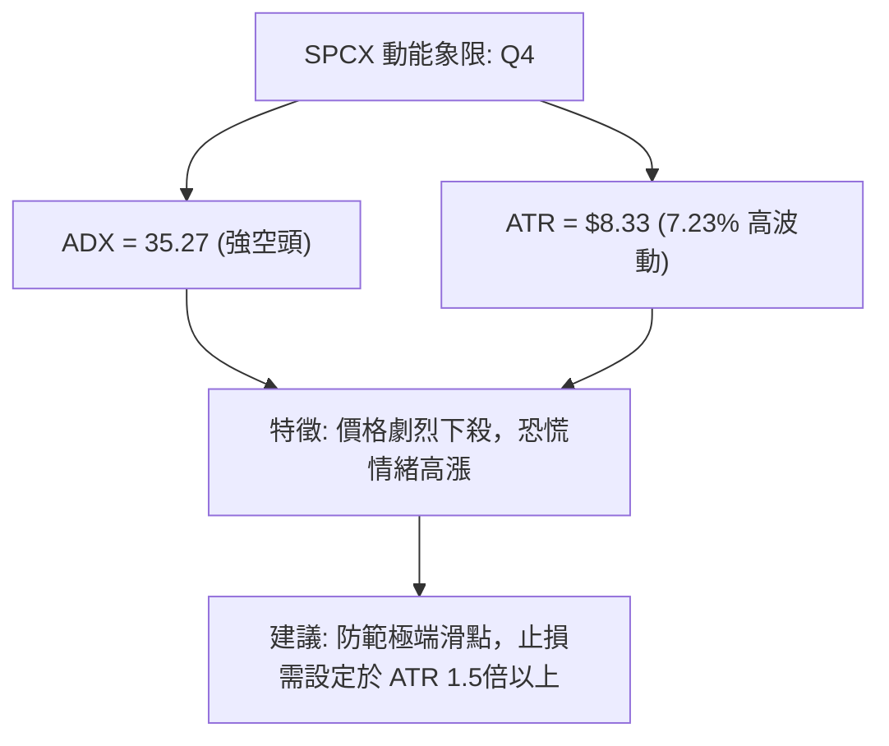
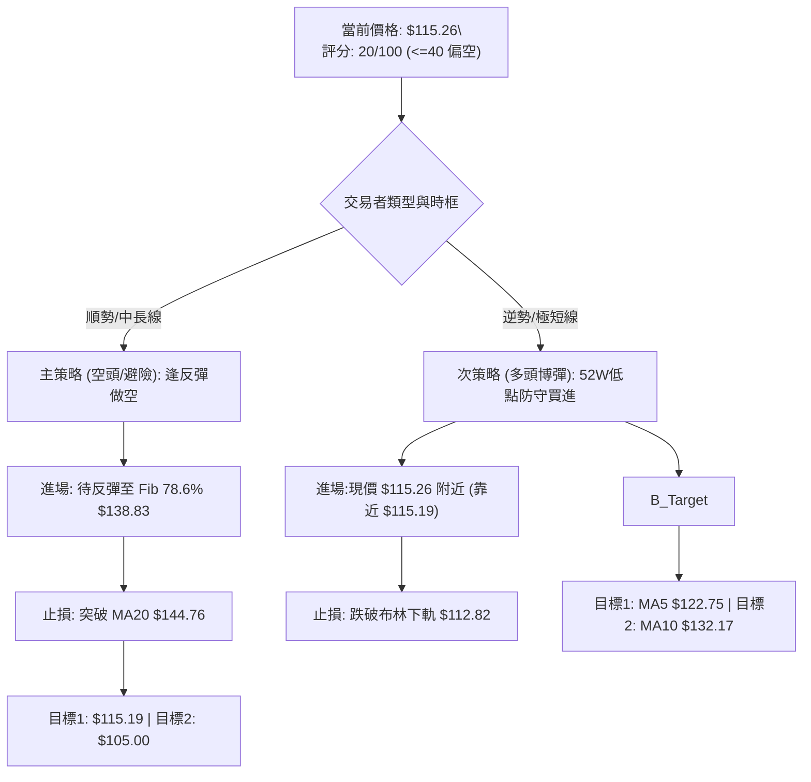
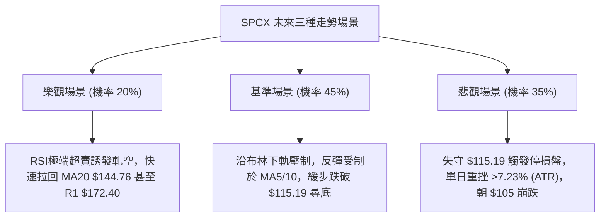

# SPCX 技術分析報告

> **報告日期**：2026-07-23 ｜ **語言**：繁體中文 ｜ **數據來源**：Yahoo Finance ｜ **當前價格**：$115.26

---

## 目錄

| 章節 | 內容 |
|------|------|
| [1. 技術面概覽](#1-技術面概覽) | 訊號儀表板、核心指標、評分卡 |
| [2. 趨勢分析](#2-趨勢分析) | 多時框趨勢、長中短期走勢 |
| [3. 圖表形態分析](#3-圖表形態分析) | 形態識別、K線組合、目標價 |
| [4. 支撐與阻力](#4-支撐與阻力) | 關鍵價位、斐波那契回調 |
| [5. 技術指標深度解讀](#5-技術指標深度解讀) | MA/RSI/MACD/布林/成交量 |
| [6. 動能與波動率](#6-動能與波動率) | 動能評估、ATR、Beta |
| [7. 多時框架總結](#7-多時框架總結) | 時框架評分矩陣 |
| [8. 交易策略建議](#8-交易策略建議) | 多空策略、風險報酬比 |
| [9. 風險提示與監控](#9-風險提示與監控) | 監控指標、風險場景 |

---

## 1. 技術面概覽

### 🎯 技術訊號儀表板



### 📊 核心指標速覽表

| 指標類別 | 指標名稱 | 當前數值 | 訊號 | 解讀 |
|----------|----------|----------|------|------|
| **價格** | 當前價格 | $115.26 | 🔴 空頭 | 逼近52週最低價 $115.19，處於歷史極低位階 |
| **均線** | MA5 | $122.75 | 🔴 空頭 | 價格低於 MA5 -6.10%，極短線強烈承壓 |
| **均線** | MA10 | $132.17 | 🔴 空頭 | 價格低於 MA10 -12.79%，短線下行斜率陡峭 |
| **均線** | MA20 | $144.76 | 🔴 空頭 | 價格低於 MA20 -20.38%，中期反彈壓力沉重 |
| **動能** | RSI(14) | 18.11 | 🟢 超賣 | 進入極度超賣區（<30），隨時可能觸發技術性反彈 |
| **動能** | MACD | -11.452 | 🔴 空頭 | DIF與DEA均為負數，DIF-DEA柱狀圖 -3.349 擴大中 |
| **動能** | ADX(14) | 35.27 | 🔴 空頭 | ADX>25 顯示趨勢極強，-DI (23.38) > +DI (10.57) 空頭主導 |
| **波動** | ATR(14) | $8.33 | 🔴 高波動 | 每日波幅佔股價 7.23%，屬高風險高波動標的 |
| **通道** | 布林下軌 | $112.82 | 🟡 支撐 | %B僅0.04，價格緊貼布林下軌擴張 |

### 🏆 技術評分卡

```
╔══════════════════════════════════════════════════════════════╗
║                技術評分卡 — SPCX (2026-07-23)                 ║
╠══════════════════════════════════════════════════════════════╣
║ 趨勢強度 (Trend)    ▓▓▓▓░░░░░░░░░░░░░░░░  20/100  🔴 空頭主導  ║
║ 動能指標 (Momentum) ▓▓▓▓▓░░░░░░░░░░░░░░░  25/100  🟡 超賣醞釀  ║
║ 支撐穩定 (Support)  ▓▓▓░░░░░░░░░░░░░░░░░  15/100  🔴 破底邊緣  ║
║ 成交量能 (Volume)   ▓▓▓▓▓▓░░░░░░░░░░░░░░  30/100  🟡 殺多放量  ║
║ 形態結構 (Pattern)  ▓▓▓▓░░░░░░░░░░░░░░░░  20/100  🔴 瀑布下挫  ║
║ 均線系統 (MA Align) ▓▓░░░░░░░░░░░░░░░░░░  10/100  🔴 順勢向下  ║
╠══════════════════════════════════════════════════════════════╣
║ 綜合評分 (Total)    ▓▓▓▓░░░░░░░░░░░░░░░░  20/100  🔴 強烈看空  ║
╚══════════════════════════════════════════════════════════════╝
```

---

## 2. 趨勢分析

### 🌐 多時框趨勢分析



### 📈 長期趨勢 — 12個月走勢圖（Unicode）

```
SPCX 月線與週線歷史走勢概覽（最近兩年與近月軌跡）
價格軸 ($)
$225.64 ┤        ● (52週高點)
$199.57 ┤       ╱ ╲
$185.00 ┤      ╱   ● (2026-06-21 近期高點)
$170.86 ┤     ●     ╲
$145.30 ┤            ╲  ● (2026-07-12)
$123.99 ┤             ╲  ╲  ● (2026-07-19)
$115.26 ┤              ╲  ╲  ●← 現價 (2026-07-23)
$115.19 ┤───────────────┴──┴──● (52週低點支撐線)
        └──────────────────────────────────────────────
         2025-H2      2026-06  2026-07  目前
```

#### 走勢特徵分析表格

| 階段 | 時間區間 | 價格區間 | 漲跌幅 | 技術面特徵 |
|------|----------|----------|--------|------------|
| 1. 波段高點 | 2026-06-21 | $185.00 | — | 週成交量爆出 9.25 億股，形成階段頂部 |
| 2. 初始回落 | 2026-06-28 | $185.00 → $153.23 | -17.17% | 單週大跌，MACD 柱狀圖由正轉負 (-2.783) |
| 3. 短暫反彈 | 2026-07-05 | $153.23 → $162.00 | +5.72% | 縮量反彈（3.34 億股），反彈無力 |
| 4. 主跌段發酵| 2026-07-12 ~ 07-26 | $162.00 → $115.26 | -28.85% | 週線連續重挫，RSI 由 29.1 潰敗至 18.11 |

### 📊 中期趨勢（週線分析）

```
SPCX 週線波段壓力與支撐結構
═══════════════════════════════════════════════════════════════
$225.64 ─────────────────────────────────── 52W 歷史高點 (Fib 0.0%)
$185.00 ───────────┐ (近期波段高點)
$172.40 ───────────┼────────────────────── 關鍵阻力 R1 / Fib 50% ($170.42)
$144.76 ───────────┼────────────────────── MA20 / 布林中軌
$138.83 ───────────┼────────────────────── Fib 78.6% 回調位
$115.26 ───────────┴────────────────────── 現價位置
$115.19 ─────────────────────────────────── 52W 歷史低點 (Fib 100.0%)
═══════════════════════════════════════════════════════════════
```

### ⚡ 趨勢強度評估（ADX 解讀）



| 指標名稱 | 數值 | 門檻基準 | 狀態評估 | 交易含義 |
|----------|------|----------|----------|----------|
| **ADX (14)** | **35.27** | > 25 (強趨勢) | 🟢 趨勢極為明確 | 擺盪指標失效，以趨勢跟隨為主 |
| **+DI (14)** | **10.57** | < 20 (多頭潰散) | 🔴 多頭極度弱勢 | 買盤動能消耗殆盡 |
| **-DI (14)** | **23.38** | > 20 (空頭主導) | 🔴 空頭壓倒性勝出 | 空方掌控市場主導權 |

---

## 3. 圖表形態分析

### 🔍 形態識別系統



#### 形態信心度評估表

| 形態名稱 | 信心度 | 判斷依據（引用數據） | 完成度 | 目標價（附計算式） |
|----------|--------|----------------------|--------|--------------------|
| **陡峭下降通道** | **85%** | MA5 ($122.75) < MA10 ($132.17) < MA20 ($144.76) 呈平行下壓 | 90% | 下軌延伸目標 $112.82 (布林下軌) |
| **下跌旗形/測量下移** | **65%** | 從 $185.00 跌至 $153.23 (高差 $31.77)，反彈至 $162.00 後再次下破 | 85% | 由形態高度推算：$162.00 - $31.77 = **$130.23** (已跌破)；延伸目標測試 $115.19 |
| **雙重底 (潛在)** | **30%** | 僅接近 52W 低點 $115.19，尚未出現止跌紅K或底背離 | 10% | 訊號不足，僅做指標型超賣解讀 |

### 🕯️ 重要K線形態分析

| 日期/週期 | 收盤價 | K線形態 | 解讀 | 訊號 |
|-----------|--------|---------|------|------|
| 2026-06-21 | $185.00 | 高位長上影爆量紅K | 買盤耗盡，主力高檔出貨 | 🔴 頂部轉折 |
| 2026-07-12 | $145.30 | 中長黑K | 跌破前低，中期均線失守 | 🔴 賣壓加速 |
| 2026-07-19 | $123.99 | 大黑K線 | 空頭持續打壓，跌幅達 -14.6% | 🔴 強烈看空 |
| 2026-07-23 | $115.26 | 實體黑K逼近52W低 | 逼近 $115.19，多頭無抵抗 | 🔴 沉淪尋底 |

### 📉 ASCII 走勢形態示意圖

```
SPCX 陡峭下降通道與形態目標價
$185.00 ┤ ● (頂部)
        │  ╲
$162.00 ┤   ╲    ● (反彈次高點)
        │    ╲  ╱ ╲
$145.30 ┤     ╲╱   ╲
        │           ╲  ●
$123.99 ┤            ╲  ╲
$115.26 ┤─────────────╲──●← 現價 (測試 $115.19 52W低點)
$112.82 ┤              ╲─ 布林通道下軌
        └───────────────────────────────────────────────
```

### 🎯 形態目標價計算

1. **下行測量目標（由高點 $185.00 至 $153.23 旗幅算起）**：
   - 形態高度 $H = \$185.00 - \$153.23 = \$31.77$
   - 破位點 $P = \$162.00$
   - 測量下移目標 $= \$162.00 - \$31.77 = \$130.23$（目前價位 $115.26 已貫穿此目標）。
2. **極端下行情境（由數據集分析師最低目標價）**：
   - 若 $115.19 52週低點失守，數據集內無技術波段低點支撐，參考分析師低標 **$62.00**。

---

## 4. 支撐與阻力

### 🗺️ 關鍵價位分布圖（Unicode）

```
SPCX 價位結構分布圖
═══════════════════════════════════════════════════════════════
$225.64 ║██████████████████████████████████████║ 52W 最高價 / Fib 0.0%
$199.57 ║████████████████████                  ║ Fib 23.6%
$183.45 ║████████████████████████              ║ Fib 38.2%
$172.40 ║██████████████████████████████████████║ 關鍵阻力 R1 (高點聚類)
$170.42 ║██████████████████████                ║ Fib 50.0%
$157.38 ║██████████████████                    ║ Fib 61.8%
$144.76 ║████████████████████████              ║ MA20 / 布林中軌
$138.83 ║████████████                          ║ Fib 78.6%
$122.75 ║████████                              ║ MA5 短線動態阻力
$115.26 ╠══════════════════════════════════════╣ ◄ 現價位置 ($115.26)
$115.19 ║▓▓▓▓▓▓▓▓▓▓▓▓▓▓▓▓▓▓▓▓▓▓▓▓▓▓▓▓▓▓▓▓▓▓▓▓▓▓║ 52W 最低價 (100.0%)
$112.82 ║▓▓▓▓▓▓▓▓▓▓▓▓                          ║ 布林下軌極限支撐
$62.00  ║▓▓▓▓▓▓▓▓▓▓▓▓▓▓▓▓                      ║ 分析師最低目標價 (數據極限)
═══════════════════════════════════════════════════════════════
```

### 🚧 阻力位分析表

| 阻力級別 | 價位 | 形成原因 | 突破難度 | 重要性 |
|----------|------|----------|----------|--------|
| **阻力 R1** | **$172.40** | 近一年波段高點聚類區，靠近 Fib 50.0% ($170.42) | 🔴 極高 | 關鍵解套反轉牆 |
| **阻力 R2** | **$144.76** | MA20 移動平均線與布林通道中軌重合位 | 🟡 中高 | 短中期多空分水嶺 |
| **阻力 R3** | **$138.83** | 斐波那契 78.6% 回調位 | 🟡 中等 | 超賣反彈首要考驗 |
| **短線阻力**| **$122.75** | MA5 短線均線扣抵位 | 🟢 低 | 5日內極短線壓力 |

### 🛡️ 支撐位分析表

| 支撐級別 | 價位 | 形成原因 | 守住機率 | 重要性 |
|----------|------|----------|----------|--------|
| **支撐 S1** | **$115.19** | 52週歷史最低價（Fib 100.0%） | 🟡 40% | 歷史防線，失守將探底 |
| **支撐 S2** | **$112.82** | 布林通道下軌（20日 2倍標準差） | 🟢 60% | 超賣統計學下限 |
| **極端支撐**| **$62.00** | 分析師給出之最低目標價（數據未偵測到中間技術支撐）| 🔴 20% | 估值下限防線 |

*註：經 OHLCV 歷史數據計算，當前價格下方無其他波段低點聚類支撐，若跌破 $115.19，技術面上呈空頭無底狀態。*

### 📐 斐波那契回調位分析

依據 52週區間高點 **$225.64** 至低點 **$115.19** 進行測算：

```
斐波那契回調位階對照表
0.0%   (52W High)  -------------------- $225.64
23.6%              -------------------- $199.57
38.2%              -------------------- $183.45
50.0%              -------------------- $170.42 (靠近阻力 R1 $172.40)
61.8%              -------------------- $157.38
78.6%              -------------------- $138.83
100.0% (52W Low)   -------------------- $115.19 ◄ 當前價格 $115.26 落在 78.6% - 100.0% 沉淪區間
```

- **當前位置解讀**：現價 $115.26 正位於 **100.0% ($115.19)** 與 **78.6% ($138.83)** 的底部壓制區。%B 僅為 0.04，說明股價處於極端修正末端，若能於 $115.19 守住，反彈首要目標為 78.6% 回調位 ($138.83)。

---

## 5. 技術指標深度解讀

### 🎛️ 指標訊號總覽



### 📈 移動平均線排列分析



- **均線排列狀態**：MA5 < MA10 < MA20，呈典型**空頭排列**。
- **均線扣抵分析**：MA5 位於 $122.75，均線斜率向下陡峭，每日扣抵高價，價格離 MA20 乖離率高達 **-20.38%**，過大負乖離提供了短線均值回歸的物理條件。

### 📉 RSI(14) 分析

```
RSI(14) 強度條：[▓▓▓░░░░░░░░░░░░░░░░░] 18.11 (超賣區 < 30)
```

- **超賣狀況**：RSI 降至 **18.11**，歷史極低水準。
- **背離判斷**：檢視近期走勢，價格創新低 ($115.26)，RSI 亦由前週 32.0 降至 18.11，**無明顯底背離**。這意味著下跌是由實質強烈賣壓驅動，而非指標衰竭所致，反彈力道可能受限。

### 📊 MACD(12/26/9) 訊號解讀



- **MACD 線**：-11.452，位於零軸下方極深處。
- **訊號線 (Signal)**：-8.103。
- **柱狀圖 (Histogram)**：-3.349，負值持續放大，顯示賣壓仍在釋放，尚未出現柱狀圖縮短（收斂）的止跌訊號。

### 📦 布林通道分析

```
布林通道價格相對位置示意圖：
$176.70 ┤ Upper Band (上軌)
        │
$144.76 ┤ Middle Band (MA20 中軌)
        │
$115.26 ┤ ◄ 當前價格 (BB %B = 0.04)
$112.82 ┤ Lower Band (下軌)
```

- **通道寬度**：上軌 $176.70 與下軌 $112.82 差距 $63.88，帶寬展開，顯示波動率大增。
- **%B 位置**：**0.04**，股價無限逼近下軌 $112.82，技術上處於通道極限擴張邊緣。

### 💹 成交量分析（量價配合度）

- **最新成交量**：91,939,400 股
- **20日平均量**：78,689,295 股（**量比 1.17x**）
- **OBV 能量潮**：OBV < MA，能量潮持續走低。
- **解讀**：股價大跌同時伴隨高於均量的成交量（1.17倍），屬於**放量下殺**，顯示恐慌盤拋售或機構減碼，量能並未出現地量止跌特徵。

---

## 6. 動能與波動率

### ⚡ 動能評估四象限

| 象限 | 動能強度 | 波動率 | 當前狀態 | 評估與策略 |
|------|----------|--------|----------|------------|
| Q1 | 強 (高) | 低 | — | 穩定趨勢行情 |
| Q2 | 弱 (低) | 低 | — | 沉悶盤整區間 |
| Q3 | 強 (高) | 高 | — | 狂熱牛市突破 |
| **Q4** | **弱 (極低/空頭)** | **高** | **✓ SPCX 位置** | **高風險恐慌下殺，嚴控倉位** |



### 📊 ATR 波動率分析

- **ATR(14) 數值**：**$8.33**
- **ATR 百分比**：$8.33 / $115.26 = **7.23%**
- **交易風控建議**：
  - 日內正常波動區間為 $\pm \$8.33$。
  - 止損點設置距離應至少為 **1.0 ~ 1.5 倍 ATR**（即 \$8.33 ~ \$12.50），以避免被日內無意義的雜訊掃出場。

### 📐 Beta 與市場相關性

- **Beta 數據**：未提供（N/A，新上市/私人轉公開交易標的特質）。
- **短線個股獨立性**：由於短線走勢呈跌幅放大特徵，其個股特有風險（如Starlink/SpaceX營運或資金面考量）主導股價，與大盤指數相關性暫時被個別拋售賣壓掩蓋。

---

## 7. 多時框架總結

### 📋 時框架評分表

| 時框架 | 趨勢方向 | 動能 (RSI/MACD) | 均線排列 | 形態 | 綜合評分 | 建議 |
|--------|----------|------------------|----------|------|----------|------|
| **日線 (Daily)** | 🔴 強空 | 🟢 超賣 (RSI 18.11) | 🔴 空頭排列 | 🔴 瀑布探底 | **25/100** | 嚴禁追空，觀望博短彈 |
| **週線 (Weekly)**| 🔴 主跌 | 🔴 空頭擴大 (-3.349)| 🔴 破位下行 | 🔴 破頂回落 | **20/100** | 逢高避險 / 減碼 |
| **月線 (Monthly)**| 🟡 中性 | 🟡 缺乏數據 | 🟡 資料不足 | 🟡 高位拉回 | **35/100** | 觀察 $115.19 長期防線 |

### 🔲 綜合訊號矩陣

```
時框架訊號收斂矩陣
┌──────────┬──────────┬──────────┬──────────┐
│ 時框架   │ 短期(日) │ 中期(週) │ 長期(月) │
├──────────┼──────────┼──────────┼──────────┤
│ 趨勢方向 │  🔴 空頭  │  🔴 空頭  │  🟡 中性 │
│ 動能強度 │  🟢 超賣  │  🔴 偏空  │  🟡 中性 │
│ 量能配合 │  🟡 稍放量│  🔴 順跌  │  🟡 中性 │
└──────────┴──────────┴──────────┴──────────┘
```

### ⚖️ 多時框收斂結論

依據**多時框收斂規則**：當前 **ADX = 35.27 (> 25)**，市場處於**強勁趨勢行情（下降趨勢）**。
依規定，趨勢行情必須以**中長期（週線）空頭方向為主導**，日線的 RSI 超賣僅能視為尋找「反彈做空/避險離場」或「極短線輕倉均值回歸」的時機。
**最終結論：整體方向明確偏空，主策略採「逢高順勢避險/做空」，次策略僅限「極短線輕倉博超賣反彈」。**

---

## 8. 交易策略建議

### 🗺️ 策略決策流程圖



### 🧭 策略路由

> **當前主策略方向 = 🔴 偏空 / 逢高順勢避險（依綜合評分 20/100 判定）**

由於技術綜合評分為 20/100（≤ 40），依規律主推**空頭/逢高順勢操作策略**；多頭僅列為極短線超賣均值回歸之對沖交易。

### 🎯 價格情境階梯 (Price Scenarios)

| 觸發條件 | 下一目標 | 後續延伸 | 情境含義 |
|----------|----------|----------|----------|
| **突破 MA20 $144.76** | R1 $172.40 | Fib 50% $170.42 | 短線趨勢扭轉，空頭停損 |
| **反彈至 $138.83 被壓制**| $122.75 (MA5) | $115.19 (52W Low) | 典型死貓跳，空頭加碼點 |
| **守住 52W 低點 $115.19**| MA5 $122.75 | MA10 $132.17 | 極度超賣引發均值回歸 |
| **跌破布林下軌 $112.82**| $105.00 (形態推算)| $62.00 (分析師低標)| 恐慌瀑布，向下無支撐 |

### 📊 情境機率分佈

```
情境機率分佈示意圖
┌─────────────────────────────────────────────────────────────┐
│ 🔴 順勢下探/跌破 52W 低點 (45%)  ▓▓▓▓▓▓▓▓▓▓▓▓▓▓▓▓▓▓▓▓▓▓▓     │
│ 🟡 52W低點上窄幅震盪/超賣反彈 (35%) ▓▓▓▓▓▓▓▓▓▓▓▓▓▓▓▓▓       │
│ 🟢 強烈V型反轉突破 MA20 (20%)   ▓▓▓▓▓▓▓▓▓                    │
└─────────────────────────────────────────────────────────────┘
```

| 情境 | 機率 | 主要依據 |
|------|------|----------|
| **繼續下探 / 跌破新低** | **45%** | ADX 35.27 強空頭、MACD柱狀圖 -3.349 擴大、放量下殺 |
| **區間震盪 / 超賣反彈** | **35%** | RSI(14) = 18.11 極度超賣、逼近 52W 低點 $115.19 |
| **強勢 V 型反轉** | **20%** | 分析師均價 $236.71 遠高於現價，但缺乏技術面確認 |

### 🟢 主策略與次策略詳情

#### 策略 A（主策略 — 逢高順勢做空 / 避險）

| 策略要素 | 具體設定 | 說明 / 計算依據 |
|----------|----------|-----------------|
| **進場條件** | 反彈至 Fib 78.6% 回調位遇阻 | 順勢入場 |
| **進場價格** | **$138.83** | 引用斐波那契 78.6% 回調價位 |
| **止損價格** | **$144.76** | 突破 MA20 / 布林中軌即止損 |
| **目標價 T1**| **$115.19** | 測試 52週歷史低點 |
| **目標價 T2**| **$105.00** | 由形態測量下移推算價位 |
| **風險報酬比**| **3.97 : 1** | 風險 $5.93，潛在報酬 $23.64 |
| **建議倉位** | **15% - 20%** | 標準順勢倉位 |

#### 策略 B（次策略 — 極短線超賣博彈多單）

| 策略要素 | 具體設定 | 說明 / 計算依據 |
|----------|----------|-----------------|
| **進場條件** |現價 $115.26 止跌，RSI<20 觸發 | 逆勢超賣均值回歸 |
| **進場價格** | **$115.26** | 當前即時價格 |
| **止損價格** | **$112.82** | 跌破布林下軌（虧損 $2.44，約 0.3 倍 ATR） |
| **目標價 T1**| **$122.75** | MA5 動態均線阻力 |
| **目標價 T2**| **$132.17** | MA10 短線壓力位 |
| **風險報酬比**| **3.07 : 1** (以T1算 3.07:1, T2算 6.93:1) | 風險 $2.44，T1報酬 $7.49 |
| **建議倉位** | **5% (輕倉)** | 高風險逆勢交易，嚴格控管 |

### 🔴 反向風險觸發點（對沖提示）

- **多頭反轉訊號**：若日線收盤價強勢突破 **MA20 ($144.76)** 且 MACD 柱狀圖轉正，空頭策略必須立即停損離場。
- **空頭加速訊號**：若日線爆量跌破 **$112.82 (布林下軌)**，多頭博彈策略必須無條件止損。

### ⭐ 整體訊號強度評星

```
做多訊號強度 (Bullish)：  ★★☆☆☆  (2/5星 - 僅憑極度超賣)
做空訊號強度 (Bearish)：  ★★★★☆  (4/5星 - 趨勢與均線強烈壓制)
整體訊號可信度 (Credibility)：★★★★☆  (4/5星 - 多指標高度確認空頭)
```

---

## 9. 風險提示與監控

### ✅ 關鍵監控指標 Checklist

```
╔══════════════════════════════════════════════════════════════╗
║                   每日交易前監控 CHECKLIST                   ║
╠══════════════════════════════════════════════════════════════╣
║ [ ] 52W低點 $115.19 是否有大單護盤或收盤收在上方?            ║
║ [ ] RSI(14) 是否脫離 <20 極端超賣區並向上拐頭?               ║
║ [ ] MACD 柱狀圖 (-3.349) 負值是否開始收縮?                  ║
║ [ ] 日成交量是否萎縮至 20日均量 (78.68M) 以下 (賣壓竭盡)?    ║
║ [ ] 價格是否觸及 ATR ($8.33) 止損邊界?                      ║
╚══════════════════════════════════════════════════════════════╝
```

### ⚠️ 風險場景分析



### 🛡️ 風險管理重要提醒

1. **ATR 資金管理**：當前 ATR 為 **$8.33 (7.23%)**，屬於極高波動標的。單筆交易承受風險切勿超過總資金的 **1% - 2%**。
2. **無下檔技術支撐風險**：由於價格極度逼近 52週低點 **$115.19**，下檔無歷史密集中樞支撐，一旦破位極易引發程式碼停損賣壓。
3. **數據限制說明**：MA50、MA200 數據不足，長期均線支撐無法確認，投資人應隨時注意市場最新基本面與資金面消息。

---

## 📋 報告總結

```
╔══════════════════════════════════════════════════════════════╗
║                   SPCX 技術分析報告總結                      ║
════════════════════════════════════════════════════════════════
報告日期：2026-07-23
當前價格：$115.26
綜合評級：🔴 強烈看空 / 極度超賣 (技術評分: 20/100)

關鍵結論：
├─ 長期趨勢：🔴 下降通道延伸，波段高點 $185.00 大幅拉回
├─ 中期趨勢：🔴 週線主跌段發酵，ADX=35.27 空頭掌控
├─ 短期趨勢：🟢 RSI=18.11 極度超賣，具備均值回歸/死貓跳條件
├─ 關鍵支撐：$115.19 (52W Low) / $112.82 (布林下軌)
├─ 關鍵阻力：$122.75 (MA5) / $138.83 (Fib 78.6%) / $144.76 (MA20)
└─ 分析師目標：均價 $236.71 / 最低 $62.00

最優策略組合：
1. 🥇 最佳機會 (順勢做空)：待反彈至 $138.83 遇阻佈局空單，止損 $144.76，目標 $115.19
2. 🥈 次選機會 (逆勢博彈)：現價 $115.26 輕倉博超賣反彈，嚴格止損 $112.82，目標 $122.75
3. 🥉 保守選擇：觀望等待 $115.19 築底完成或突破 MA20 後再行進場
════════════════════════════════════════════════════════════════
```

---

> ⚠️ **免責聲明**：本報告為 AI 自動生成之技術分析，所有數據及估算均基於提供的歷史價格資訊。本報告**僅供研究與學術參考**，**不構成任何投資建議**。投資有風險，入市需謹慎。

---

*報告生成時間：2026-07-23 ｜ 數據來源：Yahoo Finance ｜ 分析框架：多時框技術分析*